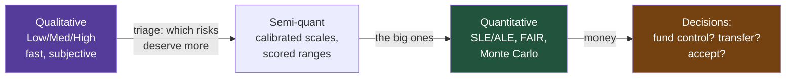
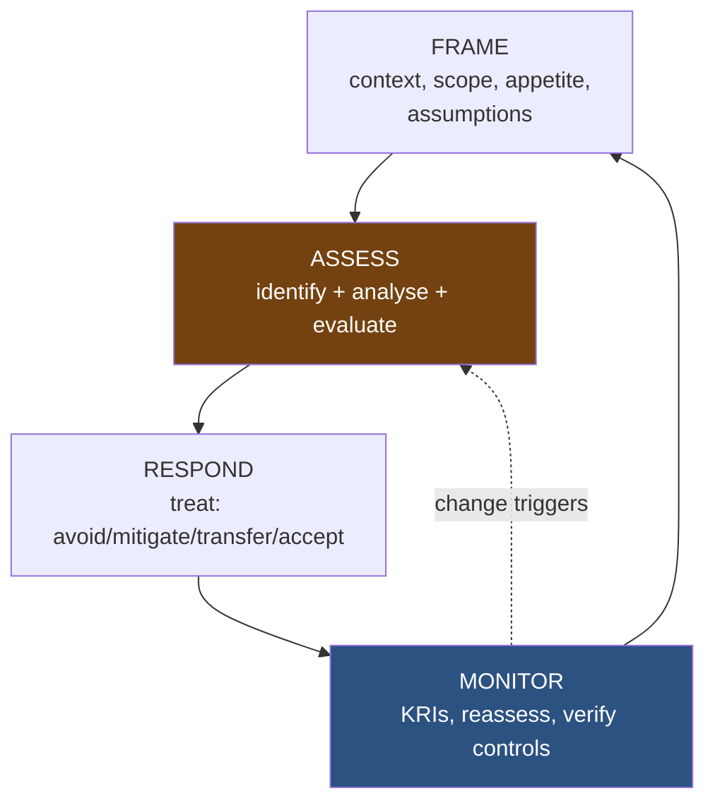
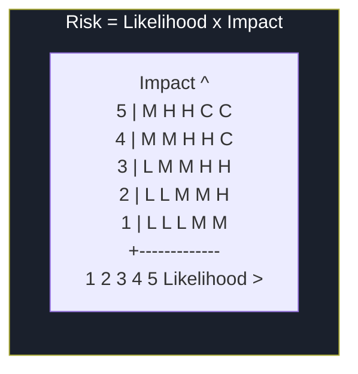
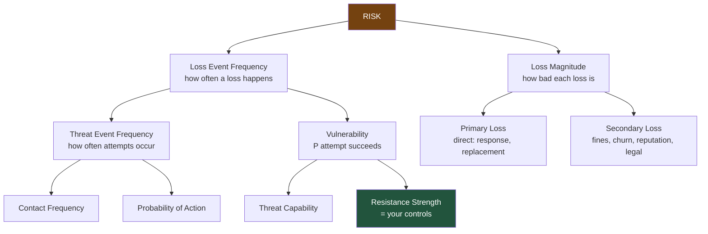

**Level:** Intermediate · **Track:** GRC & Architecture · **Read time:** 235 min

This is Chapter 3 of the GRC & Architecture notebook. Chapter 1 introduced risk vocabulary and built a small qualitative register — likelihood times impact, banded Low to Critical. Chapter 2 placed that register inside frameworks. This chapter goes deep on the risk pillar itself and turns the intuition into method: how to assess risk rigorously, when qualitative scales are enough and when they mislead, and how to put actual numbers — often money — on risk so that "this is our biggest exposure" becomes a defensible, comparable claim rather than a coloured square.

The step up in this chapter is from *describing* risk to *measuring* it. A High/Medium/Low matrix is fine for triage, but it cannot answer "is this $2M risk worth a $300k control?" or "which of these two Highs should we fund first?" — and those are the questions that decide budgets. By the end you will run a qualitative assessment properly (avoiding the biases that make most matrices lie), compute annualised loss expectancy, decompose a risk with the FAIR model, and run a Monte Carlo simulation that produces a loss-exceedance curve — the single most useful artifact in quantitative cyber risk.

## Why This Matters

Most organisations do risk assessment badly, and they do it badly in a specific, diagnosable way: they build a 5×5 colour matrix, place risks on it by gut feel, and treat the resulting colours as if they were measurements. The matrix *feels* rigorous — it has numbers, it has colours, it produces a ranking — but the numbers are ordinal labels dressed as quantities, the placements are uncalibrated guesses, and the ranking inverts under trivial changes to the (arbitrary) scale design. Decisions worth millions get made on an instrument that would not survive a first-year statistics review.

This matters because **risk analysis is where security money gets allocated**, and bad analysis allocates it badly. If your matrix compresses everything into "Medium," you cannot prioritise. If it lets a moderate-likelihood moderate-impact risk outrank a rare-but-catastrophic one because of how the cells are coloured, you fund the wrong thing. If you can never express risk in money, you can never compare a security control's cost to the loss it prevents, and every control competes on fear rather than on return.

The good news is that better methods are learnable and not that hard. You do not need a PhD to compute an ALE, decompose a FAIR scenario, or run a Monte Carlo simulation — the last is a page of Python. What you need is the discipline to (a) know what each method can and cannot tell you, (b) avoid the well-documented biases that corrupt qualitative work, and (c) reach for quantification on the risks big enough to justify it. That is what this chapter builds.



## Part 1: The Risk-Management Lifecycle

Risk assessment is one step inside a larger, continuous lifecycle. NIST (SP 800-39 for the program, SP 800-30 for the assessment method) and ISO 31000 describe the same shape with different words. Knowing the shape keeps assessment from becoming a one-off spreadsheet nobody revisits.



| Phase | Question | Key activities | Source |
|---|---|---|---|
| **Frame** | What is the context and how do we decide? | Scope, risk appetite/tolerance, assumptions, method choice | 800-39 |
| **Assess** | What are the risks and how big? | Identify assets/threats/vulns; analyse likelihood/impact; evaluate against appetite | 800-30 |
| **Respond** | What do we do about them? | Treatment decisions (the four options, Ch.1) | 800-39 |
| **Monitor** | Is it still true, and did treatment work? | KRIs, reassessment triggers, control verification | 800-39 |

The two phases people skip are **Frame** and **Monitor**, and skipping them is why assessments fail. Without framing, you assess without an agreed scale or appetite, so every result is re-litigated. Without monitoring, the assessment is a photograph of a moving target — Chapter 1's warning that an unreviewed register decays into fiction. **Risk assessment is the middle of a loop, not a project with an end.**

### 1.1 ISO 31000's principles

ISO 31000 frames risk management with principles worth internalising because they correct common bad habits:

- **Risk management is integrated**, not a separate silo — it lives inside decisions, not beside them.
- **It is structured and comprehensive**, producing consistent, comparable results (which uncalibrated matrices do not).
- **It is customised** to the organisation's context — there is no universal risk scale.
- **It explicitly accounts for human and cultural factors** — including the cognitive biases Part 5 covers.
- **It uses the best available information** and is transparent about uncertainty rather than hiding it behind a single number or colour.

## Part 2: Framing — Scope, Context, and Method

Before you assess anything, frame it. Framing decisions determine whether the results are comparable and usable.

### 2.1 Scope

Define exactly what the assessment covers: which systems, data, processes, business units, and time horizon. An assessment of "the company" is unmanageable and produces mush; an assessment of "the customer-facing payments platform and its data flows over the next 12 months" is tractable and actionable. **Scope is what makes results comparable** — two risks assessed under different implicit scopes cannot be ranked against each other.

### 2.2 Choosing the method — a decision, not a default

The most consequential framing decision is qualitative vs quantitative, and it should be deliberate:

| Use qualitative when... | Use quantitative when... |
|---|---|
| Screening many risks quickly | The risk is big enough to justify the effort |
| Data is scarce and estimates are rough | You need to compare risk to control cost (in money) |
| The audience needs a fast, intuitive picture | A decision hinges on the actual magnitude |
| Early-stage program, building the register | Prioritising among several serious risks |

The mature pattern is **tiered**: qualitative triage across the whole register (cheap, fast), then quantitative deep-dives on the handful of risks that rise to the top. You do not quantify everything — quantifying a low risk wastes the effort quantification demands. You quantify the risks whose *magnitude actually drives a decision*.

### 2.3 Set the scales before you score

Framing includes fixing the scales — likelihood bands, impact bands, and their definitions — *before* any risk is placed on them. Defining the scale after seeing the risks is how bias creeps in (you unconsciously design the scale to produce the ranking you already believe). Part 4 shows how to design scales that resist that.

## Part 3: The Assessment Inputs — Assets, Threats, Vulnerabilities

Risk (Chapter 1) is a threat exploiting a vulnerability to harm an asset. Assessment begins by enumerating each, because a risk you have not identified cannot be assessed or treated.

### 3.1 Asset identification and valuation

You cannot assess risk to assets you have not listed — the same "you can't protect what you can't see" principle behind CIS Controls 1-2 and the post-quantum discovery work. For each in-scope asset, capture not just its existence but its *value*, because value drives impact.

Asset value has several dimensions, and reducing it to one number too early loses information:

| Value dimension | Question | Example |
|---|---|---|
| **Replacement cost** | What to rebuild/replace it? | Rebuild a compromised server |
| **Revenue dependency** | Revenue lost if unavailable? | Payments platform down = $X/hour |
| **Data value** | Worth of the data it holds (to you and an attacker) | Customer PII, IP, credentials |
| **Regulatory exposure** | Fines/liability if breached | GDPR/HIPAA penalties tied to this data |
| **Reputational weight** | Trust damage if compromised | Flagship product vs internal tool |

A common and useful shortcut is to value assets through the **CIA lens** — how bad is a loss of Confidentiality, Integrity, or Availability for this asset? — and rate each on the same scale. A signing key is catastrophic on Integrity; a customer database catastrophic on Confidentiality; a payments system catastrophic on Availability. This connects asset valuation directly to impact and to data classification (Chapter 6).

### 3.2 Threat identification

A **threat** is a potential cause of harm. Threats come from three broad sources, and a good assessment considers all three rather than fixating on external hackers:

| Threat source | Examples | Often under-weighted? |
|---|---|---|
| **Adversarial** | Cybercriminals, nation-states, insiders, hacktivists | External over-weighted; insiders under-weighted |
| **Accidental** | Human error, misconfiguration, accidental deletion | Frequently under-weighted despite high frequency |
| **Environmental / structural** | Power loss, hardware failure, natural disaster, vendor outage | Under-weighted until they happen |

For adversarial threats, **threat modelling** and **threat intelligence** sharpen the list. Threat intelligence (which actors target your sector, with what TTPs) tells you which adversarial threats are *credible* for you specifically — the same actor-driven thinking as the Purple Team notebook's emulation planning. A bank and a hospital face different adversaries; a generic threat list serves neither well.

### 3.3 Vulnerability identification

A **vulnerability** is a weakness a threat can exploit. Crucially, vulnerabilities are not only technical:

| Vulnerability type | Examples | Source |
|---|---|---|
| **Technical** | Unpatched CVEs, misconfigurations, weak crypto | Vuln scans, pentests, the technical notebooks |
| **Process** | No offboarding process, no change control | Process review, audit findings |
| **Human** | Susceptibility to phishing, weak security culture | Awareness testing, incident history |
| **Physical** | Unlocked server rooms, no visitor control | Physical assessment |
| **Third-party** | A vendor's weaknesses inherited through access | Vendor assessments (Part 12) |

The assessment pairs threats with the vulnerabilities they could exploit against valued assets. Each credible pairing is a *risk scenario* — the unit that gets assessed. "A phishing-susceptible workforce (vuln) lets a criminal group (threat) obtain credentials to the customer database (asset)" is one scenario; it gets a likelihood, an impact, and a treatment.

## Part 4: Qualitative Assessment Done Properly

Qualitative assessment — rating likelihood and impact on descriptive scales and combining them — is the workhorse for triage. Done well it is fast and useful; done badly (which is common) it actively misleads. This part is how to do it well.

### 4.1 The likelihood × impact matrix

The core instrument is a matrix that combines a likelihood rating and an impact rating into a risk level.



That looks simple, and the simplicity hides several traps that make most real matrices unreliable. The rest of this part is about the traps.

### 4.2 Design calibrated scales, with definitions

The first requirement is that each scale level has a *concrete, agreed definition* — not just a word. "High likelihood" means nothing until you say what it means. Compare:

**Bad (undefined):**

```
Likelihood: 1 Very Low | 2 Low | 3 Medium | 4 High | 5 Very High
```

**Good (defined, so two people rate the same risk the same way):**

| Level | Likelihood label | Concrete definition |
|---|---|---|
| 1 | Rare | Not expected in 10 years (< ~10% per year) |
| 2 | Unlikely | Possible within 3-10 years (~10-25% per year) |
| 3 | Possible | Expected within 1-3 years (~25-50% per year) |
| 4 | Likely | Expected within a year (~50-90% per year) |
| 5 | Almost certain | Expected multiple times per year (> ~90% per year) |

| Level | Impact label | Concrete definition (tailored to the org) |
|---|---|---|
| 1 | Negligible | < $10k, no customer/regulatory effect |
| 2 | Minor | $10k-$100k, limited internal disruption |
| 3 | Moderate | $100k-$1M, some customer impact, minor reporting |
| 4 | Major | $1M-$10M, significant customer/regulatory impact |
| 5 | Severe | > $10M, existential/regulatory/reputational crisis |

**Attaching concrete anchors — money, time, probability ranges — to each level is the single biggest improvement you can make to qualitative assessment.** It converts "I feel this is High" into "this fits the 'Likely, ~50-90%/yr' definition and the '$1-10M' impact band," which two assessors can agree on and which quietly reintroduces enough quantitative structure to be defensible.

### 4.3 The traps that make matrices lie

Qualitative matrices have well-documented failure modes. Know them, because they are why serious risk practitioners distrust naive 5×5 colouring:

- **Range compression.** A 1-5 scale forces a 10,000× range of real impacts into five bins. A $10k loss and a $9M loss can both land in adjacent bins, or the same one, destroying the distinction that matters. **The fix is to make bands span orders of magnitude (as above) and to quantify anything that lands at the top.**
- **Centering / central-tendency bias.** Assessors gravitate to the middle ("3, Medium") to avoid committing. The register fills with Mediums and stops discriminating. **The fix is calibrated definitions plus forcing a rationale for every rating.**
- **Category/ranking reversal.** Because the mapping from (likelihood, impact) to colour is arbitrary, two matrices with different but equally "reasonable" colouring rank the same risks differently — and a lower-risk item can be coloured higher than a genuinely higher-risk one. This is a mathematically demonstrated flaw of qualitative matrices, not a hypothetical. **The fix is to treat matrix output as triage only, and quantify before making a big decision.**
- **False precision from multiplication.** Multiplying two ordinal labels (3 × 4 = 12) treats them as if they were real numbers on a ratio scale. They are not — the "distance" from 1 to 2 is not equal to 4 to 5. The product is a *sorting key*, not a measurement, and reading it as one overstates rigour.

The honest position: **a well-designed qualitative matrix with calibrated, anchored scales is a good triage tool. A naive 5×5 colour chart scored by gut feel is worse than it looks, and the top of it must be quantified before it drives spend.** That is the bridge to Part 6.

### 4.4 Risk evaluation against appetite

After analysis, *evaluate*: compare each risk's level to the risk appetite and tolerance (Chapter 1). This is where the register meets governance — a risk above tolerance demands treatment; one within it can be accepted (by a named owner). Evaluation is the step that turns analysis into a decision queue, and it only works if the appetite was set during Framing.

## Part 5: Calibration — Fixing the Human in the Loop

Every estimate in a risk assessment comes from a human, and humans are systematically overconfident. The good news, from the forecasting research, is that estimation is a *trainable skill* — calibration — and even a little training measurably improves it.

### 5.1 The overconfidence problem

Ask people for a "90% confident" range and, untrained, their ranges contain the true answer far less than 90% of the time — often closer to 50%. In risk terms, this means uncalibrated assessors state their likelihood and impact estimates with far more confidence than the evidence supports, and the whole assessment inherits that false confidence. **The single number on a risk register hides an uncertainty that is usually much larger than anyone admits.**

### 5.2 Calibration training in practice

Calibration training (popularised in the risk context by Hubbard's work) is simple and effective:

- **Use ranges, not points.** Instead of "impact is $2M," estimate a 90% confidence interval: "$500k to $8M." A range honestly represents what you know; a point pretends to knowledge you lack.
- **Practise with trivia and get feedback.** Answer many general-knowledge questions with 90% ranges, then check how often the truth fell inside. The feedback loop recalibrates you within a few sessions.
- **Use the equivalent-bet test.** For a probability estimate, ask: would I rather bet on this event, or spin a wheel with the same stated probability of paying out? If you prefer the wheel, your estimate is too high; adjust until you are indifferent.
- **Decompose to reduce uncertainty.** A hard estimate ("annual breach cost") becomes several easier ones (records exposed × cost per record × probability of a reportable event). Decomposition is exactly what FAIR (Part 7) and Monte Carlo (Part 8) formalise.

The payoff: **calibrated ranges feed directly into quantitative methods.** A Monte Carlo simulation needs distributions, and a calibrated 90% interval *is* a distribution. Calibration is the bridge from "expert judgement" (which you cannot avoid — the data is never complete) to defensible quantitative input.

## Part 6: Quantitative Risk — SLE, ARO, ALE

Quantitative risk expresses exposure in money, which is what makes it comparable to control cost. The classic model is three quantities.

### 6.1 The formulas

```
SLE = Asset Value (AV) x Exposure Factor (EF)
ARO = Annualised Rate of Occurrence
ALE = SLE x ARO
```

| Term | Meaning | Example |
|---|---|---|
| **AV** (Asset Value) | What the asset is worth | Customer database: $5,000,000 |
| **EF** (Exposure Factor) | Fraction of value lost in one event (0-1) | A breach exposes 40% → EF = 0.4 |
| **SLE** (Single Loss Expectancy) | Expected loss from *one* occurrence | $5,000,000 × 0.4 = $2,000,000 |
| **ARO** (Annualised Rate of Occurrence) | Expected occurrences per year | Once every 4 years → ARO = 0.25 |
| **ALE** (Annualised Loss Expectancy) | Expected loss *per year* | $2,000,000 × 0.25 = $500,000 |

### 6.2 A worked example, and what it unlocks

Take the top risk from Chapter 1's register — LSASS-based credential theft leading to a customer-data breach.

```
AV  (customer data + response + fines + churn)  = $5,000,000
EF  (fraction of that value realised per event) = 0.4
SLE = 5,000,000 x 0.4                            = $2,000,000
ARO (credible major event ~ once per 4 years)   = 0.25
ALE = 2,000,000 x 0.25                           = $500,000 per year
```

Now the decision this unlocks — the reason quantification exists:

```
Proposed control: deploy RunAsPPL + validated LSASS detection + IR retainer
  Cost: $120,000/year (tooling + effort)
  Effect: reduces ARO from 0.25 to 0.05 (harder to pull off, caught faster)

ALE before = $500,000/yr
ALE after  = 2,000,000 x 0.05 = $100,000/yr
Risk reduction (benefit) = 500,000 - 100,000 = $400,000/yr
Control cost             = $120,000/yr
Net benefit (ROSI-style) = 400,000 - 120,000  = $280,000/yr
```

That is the whole argument for quantification in one block. The qualitative register said "credential theft is our top risk, coloured red." The quantitative version says "it costs us ~$500k/year in expected loss, a $120k control cuts that by $400k, net benefit $280k/year — fund it." **The second sentence gets approved; the first gets debated.** This is the ALE-based cost-benefit that decides real security budgets, and Part 11 formalises it as ROSI.

### 6.3 The honest limitations of SLE/ALE

Single-point ALE is a huge improvement over colours, but it hides real problems you must not paper over:

- **It collapses uncertainty to a point.** ARO = 0.25 pretends you know the rate precisely; you do not. A single ALE number is as overconfident as a single matrix cell, just in dollars.
- **It assumes one representative loss size.** Real breaches have a *distribution* of outcomes — most small, a few catastrophic. EF as a single fraction ignores the fat tail that actually threatens the business.
- **Rare-catastrophic risks break it.** An event with ARO = 0.02 and impact $50M has ALE $1M/year — the same as a frequent $1M/year nuisance, yet they demand completely different responses (the nuisance you tolerate; the catastrophe could end the company).

The fix for all three is to stop using single numbers and use *distributions* — which is exactly what FAIR (Part 7) and Monte Carlo (Part 8) do. ALE is the right first quantitative step; it is not the last.

## Part 7: The FAIR Model

**FAIR** (Factor Analysis of Information Risk) is the leading open standard for quantitative risk analysis. Its contribution is *decomposition*: rather than guessing "risk" directly, it breaks risk into factors you can each estimate more confidently, then recombines them. This is calibration's "decompose to reduce uncertainty" (Part 5.2) formalised into a model.

### 7.1 The FAIR decomposition

FAIR defines **Risk = Loss Event Frequency × Loss Magnitude**, and decomposes each side into estimable factors.



| Factor | Meaning | You influence it by... |
|---|---|---|
| **Threat Event Frequency (TEF)** | How often threats attempt the event | Reducing exposure/contact (attack surface) |
| **Vulnerability** | Probability an attempt succeeds | **Controls** — this is where security spend lands |
| **Loss Event Frequency (LEF)** | TEF × Vulnerability = successful events/year | Both of the above |
| **Primary Loss** | Direct costs you bear immediately | IR, replacement, downtime |
| **Secondary Loss** | Fallout: fines, churn, reputation, legal | Breach response, comms, legal posture |
| **Loss Magnitude (LM)** | Primary + Secondary loss per event | Impact-reduction controls, insurance |

The insight that makes FAIR powerful for security teams: **"Vulnerability" in FAIR is the probability that a threat's capability overcomes your resistance strength — and resistance strength is your controls.** So a control investment maps to a specific FAIR factor (raising resistance strength, lowering Vulnerability, lowering LEF), and you can estimate the before/after effect on the whole risk. FAIR gives control decisions a quantitative home.

### 7.2 A worked FAIR scenario

Same credential-theft risk, decomposed. Each factor is estimated as a *range* (calibration, Part 5) — minimum, most-likely, maximum — not a point.

```
Scenario: criminal group obtains credentials -> customer-data breach

Threat Event Frequency (attempts/yr):   min 2   likely 6    max 12
Vulnerability (P a serious attempt succeeds):
    with current controls:              min 0.10 likely 0.20 max 0.35
Loss Event Frequency = TEF x Vuln:      ~ 0.6 - 1.5 successful events/yr

Primary Loss per event (IR, forensics, downtime):
                                        min $150k likely $400k max $900k
Secondary Loss per event (fines, churn, legal, reputation):
                                        min $500k likely $2.5M  max $8M
Loss Magnitude per event:               ~ $650k - $9M

Annualised loss = LEF x LM = a DISTRIBUTION, not a single number
```

Notice what the decomposition bought: instead of one heroic guess at "annual breach cost," you made six smaller, more defensible estimates, each as a range you can calibrate. And the output is deliberately a *distribution* — a range of annual losses with probabilities — which is exactly what feeds Monte Carlo. FAIR does not eliminate judgement; it *structures* it so the judgement is easier, more transparent, and auditable factor by factor.

### 7.3 Why ranges beat points, one more time

A stakeholder who is handed "$500k/year" will either believe it (falsely precise) or dismiss it ("you made that up"). A stakeholder handed "annual loss is most likely around $1.2M, with a 10% chance it exceeds $6M" is getting the *truth about your uncertainty*, and the tail — the 10% chance of $6M+ — is often what actually drives the decision. **The distribution communicates what the point conceals: the possibility of catastrophe.** Part 8 makes that distribution concrete.

## Part 8: Monte Carlo Simulation and the Loss-Exceedance Curve

FAIR gives you ranges for each factor. **Monte Carlo simulation** turns those ranges into a full picture of possible annual losses by running the scenario thousands of times, each time drawing random values from the input distributions and computing the resulting loss. The output — a **loss-exceedance curve** — is the single most useful artifact in quantitative cyber risk.

### 8.1 The idea

You cannot compute the exact distribution of annual loss analytically when it depends on several uncertain factors multiplied and added together. But you can *sample* it: draw one plausible value for each factor, compute the loss for that draw, and repeat 50,000 times. The 50,000 results *are* the distribution. This is Monte Carlo — using randomness to approximate something too messy to solve directly.

### 8.2 A complete implementation

```python
#!/usr/bin/env python3
"""fair_montecarlo.py - simulate annual loss for a FAIR-style risk scenario
and produce a loss-exceedance curve. Pure standard library + a plot if
matplotlib is available. Inputs are calibrated 90% ranges (Part 5)."""
import random, statistics, math

random.seed(42)
N = 50_000

def lognormal_from_range(p10, p90):
    """Return a sampler for a lognormal fit to a 90% interval [p10, p90].
    Lognormal is the standard choice for loss magnitudes: positive, right-skewed,
    fat-tailed - which is how real losses behave."""
    ln_p10, ln_p90 = math.log(p10), math.log(p90)
    mu = (ln_p10 + ln_p90) / 2
    sigma = (ln_p90 - ln_p10) / (2 * 1.2816)   # 1.2816 = z for the 90th pct
    return lambda: math.exp(random.gauss(mu, sigma))

# --- Calibrated inputs (from the Part 7.2 FAIR scenario) ---
tef_sampler  = lognormal_from_range(2, 12)       # threat attempts / yr
vuln_sampler = lambda: min(1.0, max(0.0, random.triangular(0.10, 0.35, 0.20)))
primary_loss = lognormal_from_range(150_000, 900_000)
secondary_loss = lognormal_from_range(500_000, 8_000_000)

annual_losses = []
for _ in range(N):
    # how many successful loss events this simulated year?
    lef = tef_sampler() * vuln_sampler()
    events = 0
    # Poisson-style: expected LEF, draw an integer count
    r, p = random.random(), math.exp(-lef); cum = p; k = 0
    while r > cum:
        k += 1; p *= lef / k; cum += p
        if k > 50: break
    events = k
    loss = sum(primary_loss() + secondary_loss() for _ in range(events))
    annual_losses.append(loss)

annual_losses.sort()

def pct(p):
    return annual_losses[min(N-1, int(p/100*N))]

mean = statistics.mean(annual_losses)
print(f"Simulated {N:,} years of this risk scenario")
print(f"  Mean annual loss (~ ALE): ${mean:,.0f}")
print(f"  Median (P50):             ${pct(50):,.0f}")
print(f"  P90:                      ${pct(90):,.0f}")
print(f"  P99 (tail risk):          ${pct(99):,.0f}")
print(f"  Worst 0.1% (P99.9):       ${pct(99.9):,.0f}")
print(f"  Chance of a > $5M year:   {100*sum(1 for x in annual_losses if x>5_000_000)/N:.1f}%")
print(f"  Chance of a $0 year:      {100*sum(1 for x in annual_losses if x==0)/N:.1f}%")

print("\nLoss-Exceedance Curve (P[annual loss > X]):")
for threshold in (100_000, 500_000, 1_000_000, 3_000_000, 5_000_000, 10_000_000):
    p = 100 * sum(1 for x in annual_losses if x > threshold) / N
    bar = "#" * int(p/2)
    print(f"  > ${threshold:>11,}: {p:5.1f}%  {bar}")
```

```bash
python3 fair_montecarlo.py
```

```
Simulated 50,000 years of this risk scenario
  Mean annual loss (~ ALE): $2,180,441
  Median (P50):             $1,406,905
  P90:                      $5,012,338
  P99 (tail risk):          $9,847,201
  Worst 0.1% (P99.9):       $16,942,880
  Chance of a > $5M year:   10.1%
  Chance of a $0 year:      24.7%

Loss-Exceedance Curve (P[annual loss > X]):
  > $    100,000:  73.9%  ####################################
  > $    500,000:  61.2%  ##############################
  > $  1,000,000:  52.8%  ##########################
  > $  3,000,000:  23.0%  ###########
  > $  5,000,000:  10.1%  #####
  > $ 10,000,000:   2.4%  #
```

### 8.3 Reading the curve — why this beats a single ALE

Look at what the simulation says that a point ALE never could:

- **The mean (~$2.2M) is not the typical year.** The median is $1.4M and a quarter of years see *zero* loss — but the mean is dragged up by the tail. Reporting only the mean would mislead in both directions. The full curve shows the whole story.
- **The tail is the decision-driver.** There is a ~10% chance of a year losing more than $5M and a 2.4% chance of exceeding $10M. **That tail — not the average — is what could end the business, and it is exactly what a single ALE number hides.** A board cares far more about "1-in-40 chance of a $10M year" than about an expected value.
- **You can now compare against appetite as a probability.** If the risk appetite says "no more than 5% chance of a loss exceeding $5M in any year," the curve says you are at 10.1% — over appetite, treatment required. That is a governance decision made against a *probabilistic* criterion, which is far stronger than "it's a red square."
- **Control evaluation becomes curve-shifting.** Re-run with the control's effect (lower Vulnerability, say from 0.20 to 0.05) and the whole curve shifts left. The *area between the two curves* is the risk reduced, and you can price it against the control cost — a much richer version of the Part 6.2 ALE comparison.

The loss-exceedance curve is the artifact to put in front of executives. It is honest about uncertainty, it foregrounds catastrophic tail risk, and it turns "how much risk do we carry?" into a curve you can point at and compare to appetite. **This is what mature quantitative cyber-risk programs actually produce**, and it is a page of code away from the FAIR ranges you already estimated.

## Part 9: Aggregation and the Portfolio View

Individual risks are assessed one at a time, but the organisation carries them all together, and the *portfolio* raises questions a single risk cannot answer.

- **Aggregate exposure.** Summing ALEs (or, better, summing simulated annual losses across scenarios in one Monte Carlo run) gives total expected annual cyber loss — a number the board and the CFO can put next to other enterprise risks. Doing it via simulation rather than adding point ALEs preserves the tail, which naive addition destroys.
- **Correlation matters.** Risks are not independent. A single cloud-provider outage might trigger several "separate" availability risks at once; one stolen credential might unlock several data risks. Treating correlated risks as independent *understates* the tail — the bad year is bad across many risks simultaneously. Sophisticated aggregation models the correlations; at minimum, flag which risks share a common cause.
- **Concentration.** A portfolio view reveals concentration — many risks depending on one control, one vendor, one system. That concentration is itself a meta-risk (a single point of failure across the register) that no individual risk entry shows.

The portfolio view is what turns a risk register from a list into a *management instrument*: it answers "what is our total cyber exposure, where is it concentrated, and how much of it is correlated?" — questions that drive strategy, not just individual control decisions.

## Part 10: Continuous Monitoring and KRIs

Assessment is a snapshot; risk moves. **Key Risk Indicators (KRIs)** are the metrics that tell you a risk's likelihood or impact is changing *before* it materialises — the monitoring phase of the lifecycle made operational.

A KRI is a *leading* indicator of risk, distinct from a KPI (which measures performance) and from an incident (which is the risk already realised).

| Risk | KRI (leading indicator) | Rising KRI means... |
|---|---|---|
| Credential theft → breach | % accounts without phishing-resistant MFA; failed-login spikes | Likelihood rising |
| Ransomware | % systems with untested backups; patch latency (days) | Impact/likelihood rising |
| Third-party breach | # critical vendors without current attestation | Exposure rising |
| Insider data theft | # users with excess privilege; access-review overdue rate | Likelihood rising |
| Availability | Change-failure rate; capacity headroom | Likelihood rising |

Good KRIs are **leading, measurable, and tied to a specific risk with a threshold that triggers action.** "Patch latency exceeded 30 days on internet-facing systems" is a KRI that says the vulnerability-management risk is drifting worse, and it fires *before* the breach — unlike an incident count, which only tells you after. Wiring KRIs to the register (each top risk gets one or two) is what keeps the assessment alive between formal reviews, and it is the same continuous-verification instinct as the Purple Team notebook's drift detection, applied to risk rather than to detections.

## Part 11: The Economics of Risk Reduction

Quantification's ultimate payoff is that it lets you reason about security spend as an *investment* rather than an act of faith.

### 11.1 Return on Security Investment (ROSI)

```
ROSI = (Risk reduction - Control cost) / Control cost

where Risk reduction = ALE_before - ALE_after
```

Using the Part 6.2 numbers:

```
ALE_before = $500,000    ALE_after = $100,000    control cost = $120,000
Risk reduction = 400,000
ROSI = (400,000 - 120,000) / 120,000 = 2.33  ->  233% return
```

A positive ROSI says the control returns more than it costs; comparing ROSI across candidate controls ranks them by financial return. **This is how a security team competes for budget on the same terms as every other business investment** — not "trust us, it's important," but "this control returns 233%, here is the model."

### 11.2 The limits and the honesty required

ROSI is powerful and easy to abuse, so use it honestly:

- **The inputs are uncertain.** ALE_before and ALE_after are estimates; a ROSI computed from single-point ALEs inherits all the overconfidence of Part 6.3. Compute it from the *distributions* (the reduction in mean simulated loss, and the reduction in tail probability) and present ranges, not a single hero number.
- **Not everything reduces to ROSI.** Some controls are mandatory (regulatory) regardless of return; some protect against tail catastrophes where the expected-value math understates the case for action. ROSI informs the decision; it does not replace judgement about catastrophic and mandatory risks.
- **Diminishing returns are real.** The first increment of a control (e.g. MFA on the most-privileged accounts) usually has a far higher ROSI than the last increment (MFA on the lowest-risk service accounts). Spend to the point where marginal return meets marginal cost, not beyond.

Used with those caveats, the economics turns the whole risk program outward: it lets you say, in the language the business already uses, why each security dollar is well spent — which is the ultimate purpose of quantifying risk at all.

## Part 12: Third-Party and Supply-Chain Risk

A recurring theme across this series — from the post-quantum vendor questionnaires to the Chapter 1 failure modes — is that a large fraction of an organisation's risk lives in parties it does not control. Third-party risk deserves explicit treatment because it is assessed differently: you cannot scan a vendor's internals, so you assess through *evidence and contract*.

| Assessment method | What it gives you | Limit |
|---|---|---|
| Security questionnaire (SIG, CAIQ) | Self-reported control posture | Self-reported; trust but verify |
| Independent attestation (SOC 2, ISO cert) | Third-party-verified controls | Point-in-time; check scope and date |
| Right-to-audit / evidence requests | Direct evidence for critical vendors | Costly; reserve for the most critical |
| Continuous monitoring (security ratings) | External signal of the vendor's posture over time | Outside-in only; approximate |

The risk-assessment principles transfer directly: rate each vendor by the *value of what they access* (asset) and the *credibility of their controls* (inverse vulnerability), and treat the residual — a critical vendor with weak attestation is a high risk requiring treatment (tighter contract terms, reduced data sharing, or client-side controls as in the post-quantum chapter). **Fourth-party risk** — your vendors' vendors — is the tail everyone forgets, and it is why the questionnaires in this series always ask about subprocessors. The portfolio view (Part 9) should include third-party concentration: how much of your risk routes through a single provider.

## Part 13: Hands-On Lab — Assess a Risk Qualitatively, Then Quantitatively

This lab takes one real risk from the Chapter 1 register and works it through the whole chapter: a properly-anchored qualitative rating, an SLE/ALE, a FAIR decomposition, and a Monte Carlo loss-exceedance curve. The point is to *feel* how each method adds resolution to the same underlying risk.

**Scope note:** the lab is analysis of a hypothetical organisation you are authorised to model. No systems are touched; the deliverables are the risk artifacts a GRC function produces.

### 13.1 Qualitative — done properly

Take risk **R-02** from Chapter 1: *attacker dumps LSASS → domain-wide credential theft → customer-data breach.* Rate it against the anchored scales from Part 4.2.

```
Likelihood: current controls = MFA + EDR, but no RunAsPPL, detection unvalidated.
  Credible major event expected within 1-3 years -> level 3 "Possible".
Impact: customer-data breach = $1-10M band (fines + response + churn)
  -> level 4 "Major".
Qualitative risk = L3 x I4 = 12 -> HIGH   (sorting key, NOT a measurement)
Rationale recorded: "controls reduce but a validated-detection + PPL gap keeps
  likelihood at Possible; customer PII in scope drives Major impact."
```

The anchored definitions and the recorded rationale are what make this defensible — another assessor with the same scales lands in the same cell. But "HIGH / 12" cannot tell us whether to spend $120k on it. So we quantify.

### 13.2 Quantitative — SLE/ALE

```python
#!/usr/bin/env python3
"""r02_ale.py - single-point ALE for the credential-theft risk, with a control
cost-benefit. The first quantitative step (Part 6)."""
AV  = 5_000_000     # customer data value: response + fines + churn
EF  = 0.40          # fraction realised per event
SLE = AV * EF
ARO_before = 0.25   # ~ once per 4 years with current controls
ARO_after  = 0.05   # with RunAsPPL + validated detection + IR retainer
COST = 120_000      # annual cost of the control package

ale_before = SLE * ARO_before
ale_after  = SLE * ARO_after
reduction  = ale_before - ale_after
rosi = (reduction - COST) / COST

print(f"SLE                 = ${SLE:,.0f}")
print(f"ALE (before)        = ${ale_before:,.0f}/yr")
print(f"ALE (after control) = ${ale_after:,.0f}/yr")
print(f"Risk reduction      = ${reduction:,.0f}/yr")
print(f"Control cost        = ${COST:,.0f}/yr")
print(f"ROSI                = {rosi*100:.0f}%")
```

```bash
python3 r02_ale.py
```

```
SLE                 = $2,000,000
ALE (before)        = $500,000/yr
ALE (after control) = $100,000/yr
Risk reduction      = $400,000/yr
Control cost        = $120,000/yr
ROSI                = 233%
```

Already a far stronger statement than "HIGH": the risk costs ~$500k/year in expected loss and the control returns 233%. But this hides the tail (Part 6.3), so we decompose and simulate.

### 13.3 FAIR decomposition + Monte Carlo

Run the Part 8 `fair_montecarlo.py` with the R-02 ranges (it already uses them). The output loss-exceedance curve reframes the decision:

```
Mean annual loss (~ALE): $2,180,441      <- note: HIGHER than the point ALE,
Median (P50):            $1,406,905         because the fat tail drags the mean up
P90:                     $5,012,338
P99 (tail risk):         $9,847,201
Chance of a > $5M year:  10.1%
```

The single-point ALE said $500k/year. The simulation says the *mean* is ~$2.2M once you honestly model the loss distribution and the possibility of multiple or severe events — and, crucially, there is a **10% chance of a year worse than $5M**. The point ALE was not just imprecise; it *understated* the exposure by hiding the tail. This is the lab's core lesson: **each method adds resolution, and the cheapest method (the colour matrix) hid the most important fact (the catastrophic tail).**

### 13.4 Evaluate the control by shifting the curve

Re-run the simulation with the control's effect — Vulnerability drops from a `triangular(0.10, 0.35, 0.20)` to `triangular(0.02, 0.10, 0.05)` — and compare curves:

```python
# In fair_montecarlo.py, swap the sampler and re-run:
vuln_sampler = lambda: min(1.0, max(0.0, random.triangular(0.02, 0.10, 0.05)))
```

```
                        BEFORE control        AFTER control
Mean annual loss        $2,180,441            $612,880
Chance of > $5M year    10.1%                 1.9%
Chance of > $10M year   2.4%                  0.3%
```

The control does not just lower the average — **it collapses the tail**, taking the chance of a catastrophic (>$5M) year from 10.1% to 1.9%. For a risk that could threaten the business, *that tail reduction is the real value*, and it is invisible to the point-ALE ROSI. Present both curves to the board: the area between them is the risk you are buying down, and the tail collapse is why it matters beyond the expected-value math.

### 13.5 Extend the lab

- Add a second risk (ransomware, R-01) with its own FAIR ranges, run both in one Monte Carlo, and produce an *aggregate* loss-exceedance curve for the portfolio (Part 9) — noting that if the two share a common cause (e.g. the same initial access), you should correlate them rather than sum independently.
- Add a KRI (Part 10): model how the risk changes as "% accounts on phishing-resistant MFA" moves from 60% to 95%, and show the curve shifting.
- Build a calibration mini-exercise (Part 5): estimate 90% ranges for ten trivia questions, score yourself, and note how often the truth fell inside — then re-estimate the FAIR factors with your recalibrated confidence.

## Part 14: Risk for the Technical Practitioner — Offensive and Defensive Angles

Risk analysis can feel remote from a shell prompt, but it is the layer that decides which of your technical findings get fixed.

**How risk thinking sharpens offence.** A red teamer or bug-bounty hunter who thinks in risk terms writes far more effective reports. "I found an XSS" is a technical fact; "this XSS on the authenticated account page lets an attacker take over any session, and given the customer data behind it, the loss magnitude is in the six-to-seven-figure range" is a *risk statement* that gets prioritised and paid. Attackers who understand loss magnitude and likelihood aim at the findings that actually threaten the business — the way FAIR's "Loss Magnitude" points straight at the crown-jewel assets — rather than piling up low-impact issues. Framing a finding as risk is how a technical discovery becomes a funded fix.

**How risk thinking sharpens defence.** For the defender, quantification is the tool that turns "we should really validate that detection" (Purple Team) into "our top residual risk carries a 10% chance of a >$5M year, and a $120k control collapses that tail — here is the loss-exceedance curve." That sentence moves budget in a way no severity label does. Risk analysis is also what stops a defender from over-investing in vivid-but-rare threats and under-investing in boring-but-frequent ones: the ARO and LEF factors force you to weigh frequency, correcting the availability bias that makes teams buy defences against the last headline instead of the likeliest loss.

**Where it ties the series together.** Every technical finding in this notebook series has a home in a risk model: a validated detection lowers FAIR's Vulnerability factor; an untested backup inflates Loss Magnitude; a post-quantum gap on long-lived data is a rare-but-catastrophic tail risk that point-ALE would hide and Monte Carlo would surface. Risk quantification is the common currency that lets you compare a crypto-migration dollar, a detection-engineering dollar, and an MFA dollar on the same axis — which is the whole reason the risk pillar sits at the centre of GRC.

## Part 15: Common Pitfalls and Myths

### 15.1 Pitfalls

| # | Pitfall | Consequence | Fix |
|---|---|---|---|
| 1 | Naive 5×5 matrix scored by gut | Range compression, reversal, false precision | Anchored scales + quantify the top (Part 4) |
| 2 | Undefined scale levels | Two assessors rate the same risk differently | Concrete definitions with $/time/probability anchors (Part 4.2) |
| 3 | Multiplying ordinal labels as if real | Overstated rigour; misleading "scores" | Treat the product as a sorting key only (Part 4.3) |
| 4 | Single-point ALE for everything | Hides uncertainty and the catastrophic tail | Use distributions: FAIR + Monte Carlo (Parts 6.3, 8) |
| 5 | Uncalibrated point estimates | Systematic overconfidence baked in | Calibration training; use 90% ranges (Part 5) |
| 6 | Treating rare-catastrophic like frequent-nuisance | Same ALE, wildly different response needed | Look at the tail, not just the mean (Part 8.3) |
| 7 | Summing point ALEs for a portfolio | Destroys the tail; ignores correlation | Aggregate via simulation; model correlation (Part 9) |
| 8 | Assessing once, never monitoring | Register decays into fiction | KRIs + reassessment triggers (Part 10) |
| 9 | ROSI from single-point ALEs presented as fact | False precision drives a real decision | Compute from distributions; present ranges (Part 11) |
| 10 | Ignoring third/fourth-party risk | Large exposure invisible on the register | Assess vendors by access + attestation (Part 12) |
| 11 | Quantifying everything | Wastes effort quantification demands | Tier: qualitative triage, quantify the big ones (Part 2.2) |
| 12 | Confusing KRI, KPI, and incident | Monitoring the wrong thing | KRI = leading indicator tied to a risk (Part 10) |

### 15.2 Myths

**"Qualitative risk assessment is good enough."** Good enough for *triage*. For any decision worth real money, a naive matrix compresses ranges, drifts to the centre, and can even reverse the true ranking — quantify the top risks before you spend (Parts 4.3, 6).

**"You can't quantify cyber risk — there's no data."** You never have complete data, and you quantify anyway, using calibrated expert ranges and decomposition (FAIR). The claim "we can't put numbers on it" usually means "we haven't tried the method that handles uncertainty explicitly" (Parts 5, 7).

**"The ALE is the answer."** The ALE is a *mean*, and the mean is often not the typical year and never the tail. A single ALE hides the 1-in-40 catastrophic year that actually threatens the business — which is exactly what the loss-exceedance curve reveals (Part 8.3).

**"More precise inputs make a better model."** Honest *ranges* beat false points. A calibrated wide range that contains the truth is more useful than a confident point estimate that does not — precision is not accuracy (Parts 5, 7.3).

**"Risk assessment is a compliance exercise."** Done well it is a *budgeting* instrument: it tells you which control returns the most risk reduction per dollar and which tail is worth buying down. Treating it as paperwork wastes its entire purpose (Part 11).

**"Monte Carlo is overkill / too advanced."** It is a page of code that turns FAIR ranges into the single most useful risk artifact — a loss-exceedance curve. The barrier is conceptual, not technical, and this chapter removed it (Part 8).

## Final Revision / Summary

**Risk is a lifecycle, not a spreadsheet.** Frame (scope, appetite, method) → Assess (identify, analyse, evaluate) → Respond (the four treatments) → Monitor (KRIs, reassess). Skipping Frame makes results incomparable; skipping Monitor makes them fiction.

**Assessment inputs.** Enumerate assets (and *value* them — replacement, revenue, data, regulatory, reputation, or via CIA), threats (adversarial, accidental, environmental — don't over-fixate on external hackers), and vulnerabilities (technical, process, human, physical, third-party). Each credible threat-vulnerability-asset pairing is a risk scenario.

**Qualitative, done properly.** A likelihood × impact matrix is fine for triage *if* every scale level has a concrete anchor ($ / time / probability) and every rating has a recorded rationale. Beware the traps: range compression (fix with order-of-magnitude bands), centering bias (fix with anchors + rationale), ranking reversal and false precision from multiplying ordinals (treat the product as a sorting key, and quantify before spending).

**Calibration.** Humans are systematically overconfident. Use 90% ranges not points, practise with feedback, use the equivalent-bet test, and decompose hard estimates into easier ones. Calibrated ranges are the input quantification needs.

**Quantitative: SLE/ALE.** `SLE = AV × EF`, `ALE = SLE × ARO`. Turns risk into money, which is comparable to control cost. But single-point ALE collapses uncertainty, assumes one loss size, and mis-handles rare-catastrophic risks — it is the first quantitative step, not the last.

**FAIR.** Decomposes Risk = Loss Event Frequency × Loss Magnitude into estimable factors (TEF, Vulnerability, Primary/Secondary Loss). Vulnerability = your controls' resistance, so control spend maps to a factor. Estimate each factor as a *range*; the output is a distribution, not a point.

**Monte Carlo + loss-exceedance curve.** Sample the FAIR ranges thousands of times to build the full distribution of annual loss. The loss-exceedance curve (P[loss > X]) is the key artifact: it shows the mean is not the typical year, foregrounds the catastrophic tail, lets you compare risk to appetite *probabilistically*, and evaluates controls by how far they shift the curve — especially how they collapse the tail.

**Portfolio and monitoring.** Aggregate via simulation (not by summing point ALEs, which kills the tail); model correlation and concentration. KRIs are leading indicators tied to specific risks with action thresholds — they keep the assessment alive between reviews.

**Economics.** `ROSI = (ALE_before − ALE_after − cost) / cost` ranks controls by financial return, letting security compete for budget on business terms — computed from distributions and presented as ranges, with judgement reserved for mandatory and catastrophic-tail risks.

**The through-line.** Cheaper methods hide more. The colour matrix hid the tail that the loss-exceedance curve revealed. Tier your effort: qualitative triage across the register, quantitative depth on the risks whose magnitude actually drives a decision.

## Cheat Sheet / Quick Reference

### Lifecycle

```
FRAME (scope, appetite, method) -> ASSESS (identify, analyse, evaluate)
-> RESPOND (avoid/mitigate/transfer/accept) -> MONITOR (KRIs, reassess) -> loop
```

### Qualitative done right

```
Anchor every scale level:  likelihood in prob/yr,  impact in $ and effect
Record a rationale per rating (kills centering bias)
Traps: range compression | centering | ranking reversal | ordinal-multiply false precision
Matrix output = TRIAGE / sorting key only. Quantify the top before spending.
```

### Calibration

```
Ranges not points | 90% confidence intervals | equivalent-bet test | decompose
Untrained "90%" ranges contain truth ~50% of the time -> train with feedback
```

### Quantitative core

```
SLE = AV x EF            (loss per single event)
ALE = SLE x ARO          (expected loss per year)
ROSI = (ALE_before - ALE_after - cost) / cost
Limits of point ALE: hides uncertainty, one loss size, mishandles rare-catastrophic
```

### FAIR

```
Risk = Loss Event Frequency x Loss Magnitude
LEF  = Threat Event Frequency x Vulnerability   (Vulnerability = your controls)
LM   = Primary Loss + Secondary Loss (fines, churn, reputation, legal)
Estimate each factor as a RANGE -> output is a distribution
```

### Monte Carlo / loss-exceedance

```
Sample FAIR ranges N times -> distribution of annual loss
Report: mean, P50, P90, P99, P[loss > $X]  (the exceedance curve)
Mean != typical year. The TAIL is the decision-driver.
Compare to appetite as a probability. Evaluate controls by curve shift + tail collapse.
```

### KRIs

```
Leading indicator, tied to ONE risk, with an action threshold
e.g. patch latency > 30d (internet-facing) | % accounts w/o phishing-resistant MFA
KRI (leading) != KPI (performance) != incident (already realised)
```

### Glossary

| Term | Meaning |
|---|---|
| **Frame / Assess / Respond / Monitor** | The four risk-lifecycle phases (NIST 800-39) |
| **Asset value (AV)** | Worth of an asset; drives impact |
| **Exposure factor (EF)** | Fraction of value lost per event (0-1) |
| **SLE / ARO / ALE** | Single-loss / annual-rate / annualised-loss expectancy |
| **Qualitative / quantitative** | Descriptive scales / actual numbers (money) |
| **Range compression** | Squeezing a huge value range into few bins |
| **Centering bias** | Assessors drifting to the middle of a scale |
| **Ranking reversal** | Matrix colouring inverting the true risk order |
| **Calibration** | Training estimates so stated confidence matches reality |
| **FAIR** | Factor Analysis of Information Risk; decomposition model |
| **LEF / Loss Magnitude** | Successful events per year / loss per event |
| **Primary / Secondary loss** | Direct costs / fallout (fines, churn, reputation) |
| **Monte Carlo** | Sampling inputs many times to build an output distribution |
| **Loss-exceedance curve** | P[annual loss > X] across thresholds |
| **Tail risk** | Low-probability, high-magnitude outcomes (P99+) |
| **KRI** | Key Risk Indicator; leading metric tied to a risk |
| **ROSI** | Return on Security Investment |
| **Aggregation** | Combining risks into a portfolio exposure |
| **Fourth-party risk** | Your vendors' vendors |

## Practice Labs & Resources

- **Run the full Part 13 lab** on a risk of your choosing: anchored qualitative rating → SLE/ALE → FAIR ranges → Monte Carlo loss-exceedance curve → control-shifted curve. Present the before/after curves as you would to a board, and write the one-paragraph recommendation the curves support. This single exercise integrates the whole chapter.
- **Calibration training.** Take a calibration test (Hubbard's *How to Measure Anything in Cybersecurity Risk* includes them, and free online versions exist): answer 20 trivia questions with 90% confidence ranges and score how many contain the truth. Repeat until you are near 90%. This is the most transferable skill in the chapter.
- **Read *How to Measure Anything in Cybersecurity Risk* (Hubbard & Seiersen).** The definitive practical case for quantification over matrices, with the calibration method, the one-for-one substitution of matrices with Monte Carlo, and the loss-exceedance curve. Pair it with the code you wrote here.
- **Study the Open FAIR standard** (from The Open Group) and work one scenario end to end using the official factor decomposition. Then reconcile it with your Monte Carlo model — they are the same idea at different levels of formality.
- **Rebuild the Monte Carlo with `numpy` and `matplotlib`** and actually plot the loss-exceedance curve, then overlay the before/after-control curves and shade the area between them (the risk bought down). A rendered curve is far more persuasive to executives than a table.
- **NIST SP 800-30 and 800-39.** Read the assessment method (800-30) and the program framing (800-39) to see the lifecycle in its authoritative form; map the vocabulary in this chapter onto their figures.
- **Critique a real matrix.** Find a published risk matrix (many organisations share templates) and identify its traps: are the scales anchored? Could it produce ranking reversal? Is the top of it quantified? This trains the eye that separates a triage tool from a misleading one.
- **Third-party risk exercise.** Take three vendors you use, gather their public attestations, and rate each by access-value and attestation-credibility, then decide a treatment for the highest residual. This applies the whole chapter to the supply-chain risk that Part 12 and the wider series keep flagging.

The next chapter shifts from measuring risk to *designing against it* — security architecture and zero-trust design, where the controls that lower FAIR's Vulnerability factor and shift the loss-exceedance curve are actually structured into systems.

---

*Also on [Praneeth's portfolio](https://ping-praneeth.vercel.app/notebook/grc-architecture/03-risk-assessment-management-and-quantification), with comments and the latest edits.*
