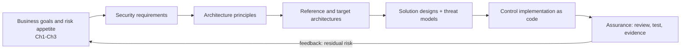
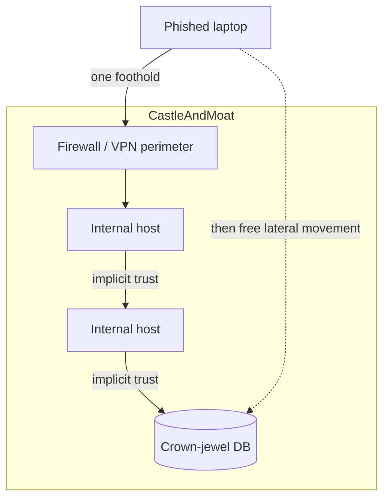
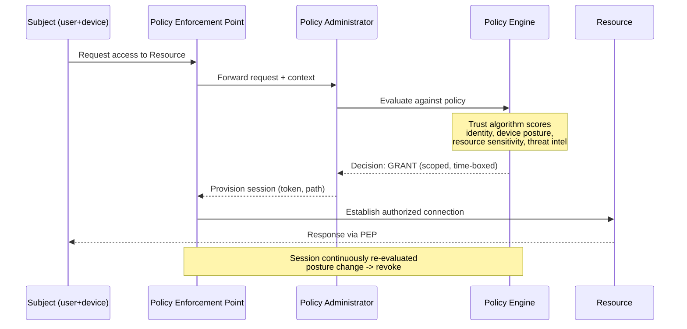
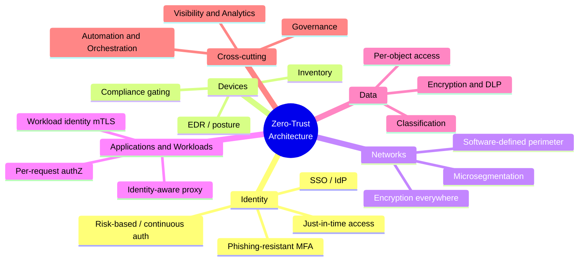
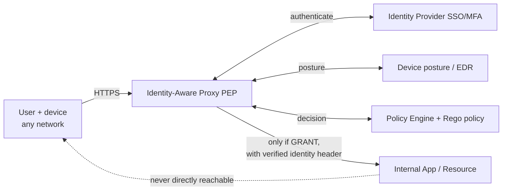
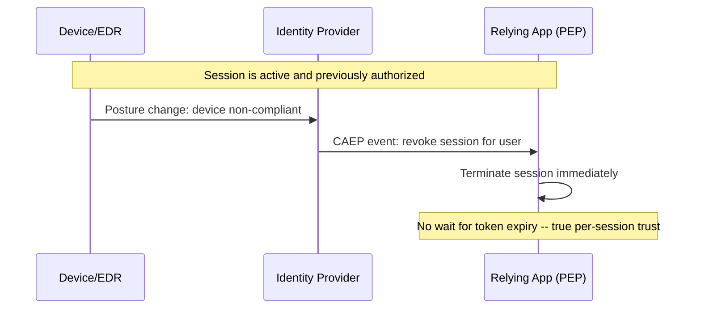
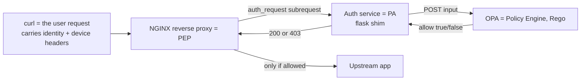
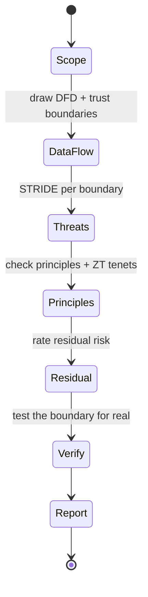

**Level:** Intermediate · **Track:** GRC & Architecture · **Read time:** 240 min

This is Chapter 4 of the GRC & Architecture notebook. Chapter 1 built the governance and risk vocabulary, Chapter 2 placed it inside frameworks, and Chapter 3 taught you to measure risk with real numbers. Those three chapters answer *what should we protect, how much, and how do we prove it*. This chapter answers the next question: *what does the system actually look like once those decisions are baked into the design?* That is the job of **security architecture** — the discipline of arranging people, data, networks, identities, and controls so that the risk decisions from the previous chapters are enforced by the structure of the system itself, not by hope and hard work.

The centrepiece of modern security architecture is **zero trust** — the design philosophy that replaced the decades-old "trust the internal network" model. Zero trust is the most over-marketed term in the industry and one of the most misunderstood, so a large part of this chapter is spent separating the rigorous engineering definition (NIST SP 800-207) from the vendor slogan on the billboard. By the end you will be able to read an existing architecture and find its trust assumptions, design a zero-trust access policy, express that policy as code, enforce it with an identity-aware proxy, and place any organisation honestly on a maturity model rather than accepting the "we bought a zero-trust product, we're done" fiction.

## Why This Matters

An organisation can pass every audit in Chapter 2, maintain a beautiful risk register from Chapter 3, and still be trivially breachable — because compliance and risk *analysis* do not, by themselves, arrange the technical furniture. The arrangement is architecture, and bad architecture defeats good controls. A firewall is a fine control; a flat internal network behind that firewall means one phished laptop reaches the domain controller, the backup server, and the finance database with nothing in the way. Multi-factor authentication is a fine control; an application that trusts any request originating from "inside the corporate IP range" makes the MFA irrelevant to an attacker who is already inside.

Nearly every catastrophic breach of the last fifteen years has an architectural root cause hiding behind the proximate one. Target (2013) was a phished HVAC vendor whose credentials reached the payment network because the network was flat between vendor systems and point-of-sale. The 2015 OPM breach saw attackers move laterally for months across an environment with no internal segmentation and no strong device or identity checks. In the 2020 SolarWinds compromise, a trusted software-update channel was the entry, but the *blast radius* — the ability of one compromised server to reach identity infrastructure and forge tokens across a cloud tenant — was an architecture problem. The lesson each time is the same: **the perimeter will be crossed; the only question the architecture decides is what happens next.** Zero trust exists to make "what happens next" small.

## Part 1: What Security Architecture Actually Is

Security architecture is the set of structural decisions that determine how security properties are achieved across a system, independent of any single control. It is the difference between *installing a lock* and *deciding where the doors go*. The chapters so far produced requirements; architecture produces a design that satisfies them and that can be reasoned about, reviewed, and evolved.

It helps to distinguish three altitudes at which "architecture" is used:

| Altitude | Question it answers | Typical artifact | Owner |
|---|---|---|---|
| Enterprise security architecture | How does security align to business strategy and risk appetite across the whole organisation? | Reference architectures, principles, standards, target-state roadmap | Chief architect / CISO office |
| Solution/system architecture | How is *this* system (an app, a platform, a network) structured to meet its security requirements? | System design docs, threat models, data-flow diagrams, trust boundaries | Solution architect / security architect |
| Technical/control architecture | How is a specific mechanism built and integrated? | Component designs, IAM policy, network diagrams, config-as-code | Engineers |

A security architect works mostly at the top two altitudes and reviews the bottom one. The single most valuable habit at every altitude is making **trust boundaries** explicit: any line across which data or requests move from a less-trusted zone to a more-trusted zone. Every trust boundary is a place where a control must exist and where an attacker will probe. Most architecture failures are a trust boundary that someone assumed existed but that the implementation never enforced.

**Security relevance:** when you land in a new environment — whether as a defender inheriting it or a pentester attacking it — the first architectural question is always "where are the trust boundaries, and what actually enforces each one?" A boundary drawn on a slide but absent in the routing table is an open door.

Security architecture is fundamentally a **risk-treatment activity**, connecting straight back to Chapter 3. When the risk register says "lateral movement from a compromised endpoint to the crown-jewel database is a High," the *treatment* is not a single product — it is an architectural decision: segment the network, put an identity-aware proxy in front of the database, require device posture, and log every access. Architecture is where risk decisions become enforceable structure.



## Part 2: The Enterprise Context — TOGAF, SABSA, and Business-Driven Design

Security architecture does not float free; it sits inside enterprise architecture. Two frameworks dominate the vocabulary, and you should be able to speak both.

**TOGAF** (The Open Group Architecture Framework) is a general enterprise-architecture method. Its core is the **ADM** (Architecture Development Method), an iterative cycle: Preliminary → Architecture Vision → Business Architecture → Information Systems Architecture → Technology Architecture → Opportunities & Solutions → Migration Planning → Implementation Governance → Change Management. TOGAF is security-agnostic; security is expected to be woven through every phase rather than bolted on. Its value to a security architect is the shared language it gives you when talking to enterprise architects who own the broader picture.

**SABSA** (Sherwood Applied Business Security Architecture) is the security-specific counterpart, and it is worth more of your attention because it is explicitly *business-driven*. Its central idea is that every technical control must trace upward to a **business attribute** — a named property the business cares about, such as "Available," "Confidential," "Traceable," "Recoverable," "Compliant." SABSA arranges architecture in six layers, and the discipline is that you can always answer "why does this control exist?" by pointing up the stack to an attribute the business signed off on.

| SABSA layer | Perspective | Asks | Example artifact |
|---|---|---|---|
| Contextual | The Business | What are we protecting and why? | Business attributes, risk appetite |
| Conceptual | The Architect | What principles and strategies apply? | Trust models, domain model, principles |
| Logical | The Designer | What must the system do? | Logical security services (authN, authZ, logging) |
| Physical | The Builder | How is it built? | Mechanisms, protocols, IAM, network zones |
| Component | The Tradesman | What specific products/config? | OPA policies, firewall rules, IdP config |
| Operational | The Facilities Manager | How is it run day to day? | SOC runbooks, key rotation, review cadence |

A worked SABSA trace makes the traceability tangible. Suppose the business names an attribute **"Confidential"** for customer financial records (Contextual layer). It flows down like this: at the Conceptual layer the architect adopts a *zero-trust, need-to-know* trust model for that data; at the Logical layer this becomes concrete security services — *strong authentication, per-request authorization, encryption, and audit logging*; at the Physical layer those services are realised as *FIDO2 MFA, an identity-aware proxy, TLS 1.3, and centralised logging*; at the Component layer they become *specific products and config — the IdP tenant policy, the OPA/Rego rule, the TLS cipher suite, the SIEM index*; and at the Operational layer they become *key-rotation schedules, access-review cadences, and SOC runbooks*. Now, when an auditor points at a firewall rule or a Rego policy and asks "why does this exist?", you trace back up the six layers to a business attribute the board signed. Equally, when the business retires a product line, you trace *down* and decommission exactly the controls that served it — no orphaned rules, no unexplained access. That two-way traceability is the entire value proposition of SABSA, and it is what stops a security architecture from decaying into a pile of controls nobody can justify or safely remove.

The two frameworks are complementary: TOGAF gives the enterprise-wide method; SABSA gives the traceability from business attribute down to firewall rule. You do not need to memorise either as dogma — but you must internalise their shared lesson: **an architecture decision that cannot be traced to a business need or a risk is an unexamined cost, and an architecture control that no operational process sustains is theatre.**

## Part 3: Foundational Design Principles

Before any modern buzzword, security architecture rests on a small set of principles that predate the internet. Many were articulated by Saltzer and Schroeder in 1975 ("The Protection of Information in Computer Systems") and remain the most reliable checklist in the field. Learn these cold; zero trust is largely a rigorous *application* of them.

- **Least privilege.** Every subject (user, service, process) gets exactly the access it needs to do its job and no more, for no longer than needed. This is the single highest-leverage principle: it shrinks blast radius on every axis.
- **Defense in depth.** Multiple independent layers so that the failure of any one control does not cause total failure. Not "more of the same product" — *diverse* layers (network, host, identity, application, data).
- **Fail secure / fail safe.** When a component fails, it fails into a *denying* state (fail secure) for confidentiality/integrity, or a *safe* state for availability where life-safety matters. A door controller that unlocks on power loss fails safe; a firewall that drops traffic when its ruleset fails to load fails secure.
- **Separation of duties.** No single person or component can complete a sensitive action alone (the person who requests a payment cannot also approve it). Splits collusion cost and limits single-actor compromise.
- **Complete mediation.** Every access to every object is checked every time — no caching a past "yes" and skipping the check later. Zero trust's "never trust, always verify" is complete mediation restated for distributed systems.
- **Economy of mechanism.** Keep the security-critical design as small and simple as possible. Complexity is where bugs and misconfigurations hide; a security control you cannot fully understand you cannot trust.
- **Least common mechanism.** Minimise shared mechanisms that multiple users depend on, because a shared component is a shared failure and a covert-channel risk.
- **Open design.** Security must not depend on the secrecy of the design, only on the secrecy of keys. "Security by obscurity" is a supplement, never a foundation.
- **Psychological acceptability / usability.** Controls users find intolerable get bypassed. A secure path must also be the easy path, or shadow IT wins.
- **Secure defaults.** The default configuration is deny/closed/off; access is granted by explicit exception. Default-open is how buckets leak.
- **Minimise attack surface.** Every open port, enabled feature, exposed endpoint, and installed package is attack surface. The most secure component is the one you removed.

**Red team usage:** every one of these principles, when violated, is an attack primitive. A flat network violates least privilege and defense in depth (lateral movement). A cached authorization decision violates complete mediation (replay, session-riding). An over-featured server violates minimal attack surface (that one enabled management port). Attackers do not need zero-days when architects leave principles unenforced.

To make the offensive framing concrete, here is each principle's violation mapped to the attack it enables — memorise this and you will find architecture bugs by smell:

- **Least privilege violated** → over-permissioned account or role → one compromise yields broad access (the "domain admin service account" problem).
- **Defense in depth violated** → single control does all the work → one bypass equals total compromise.
- **Complete mediation violated** → authorization cached or checked once → session replay, IDOR, "internal API needs no auth."
- **Secure defaults violated** → default-open config → the public S3 bucket, the world-readable share, the default password.
- **Separation of duties violated** → one actor completes a sensitive flow alone → fraud, unreviewed deploys to production.
- **Minimise attack surface violated** → unnecessary service exposed → the forgotten management port, the debug endpoint in prod.
- **Economy of mechanism violated** → security logic too complex to reason about → the misconfigured, unauditable policy nobody fully understands.
- **Open design violated** → security rests on a secret algorithm or hidden URL → "security by obscurity" collapses the moment it leaks.

**Blue team usage:** these principles double as an audit checklist. Walk any design and ask, principle by principle, "is this honoured, and what enforces it?" The gaps you find are your detection and hardening backlog.

## Part 4: The Perimeter Model and Why It Died

For roughly thirty years the dominant architecture was **castle-and-moat**, also called the perimeter model. The mental model: build a hard shell around the corporate network — firewalls, a DMZ, a VPN for remote staff — and treat everything *inside* as trusted. Once you were on the internal network (physically in the office, or connected over VPN), systems largely assumed you were friendly. Internal services skipped strong authentication, servers trusted requests by source IP, and lateral movement between internal hosts was frictionless by design.

This model made sense when its assumptions held: users and data lived inside a well-defined building, the network boundary was the trust boundary, and the few remote users tunnelled back in. Every one of those assumptions has since collapsed:

- **The workforce left the building.** Remote and hybrid work mean "inside the network" is now a coffee shop, a home router, a personal tablet. The physical perimeter no longer maps to a trust boundary.
- **The data left the datacentre.** SaaS and multi-cloud mean the crown jewels sit in Microsoft 365, Salesforce, S3, and a dozen other tenants that your firewall never sees.
- **The perimeter is porous by design.** Every SaaS integration, API, contractor, and supply-chain connection is a legitimate hole in the wall.
- **"Inside" became the attacker's favourite place.** Phishing, malware, and stolen credentials put attackers *inside* the trusted zone on day one — at which point the model's core assumption ("inside = safe") is actively helping them.

The breaches named in "Why This Matters" are all the same failure: an attacker crossed the perimeter (which is easy and inevitable) and then found a soft, flat, trusting interior (which is fatal). The industry conclusion, hardened over a decade, is blunt: **there is no inside.** The network location of a request tells you almost nothing about whether to trust it.



The picture above is the whole problem in one diagram: a single foothold inherits the interior's implicit trust and walks to the database. Zero trust deletes the implicit-trust arrows.

## Part 5: Zero Trust — Definition and History

**Zero trust** is a security model in which no subject, device, or network location is trusted by default; every access request is authenticated, authorized, and continuously validated against policy before access is granted, and access is limited to the minimum necessary. The slogan is **"never trust, always verify"** — but treat the slogan with suspicion, because it is exactly what vendors print on a box. The engineering substance is precise, and it comes from a lineage worth knowing:

- **2004 — the Jericho Forum** (an industry group) coins **"de-perimeterisation,"** arguing that the hard-shell perimeter is dissolving and security must move to the data and the endpoints.
- **2010 — John Kindervag at Forrester** names it **"Zero Trust,"** with the core assertion that trust is a vulnerability and network location must stop being an authorization input.
- **2014–2018 — Google's BeyondCorp.** After the Aurora attacks, Google re-architects internal access so that *no* corporate network is trusted; every request to every internal app is authenticated and authorized through an **identity-aware proxy**, based on user and device, from any network. This is the first at-scale, published, working zero-trust implementation and remains the reference example.
- **2020 — NIST SP 800-207 "Zero Trust Architecture"** is published. This is the definitive, vendor-neutral standard and the document you should actually read. It defines the tenets, the logical components, and the deployment models with engineering rigour.
- **2021 — US Executive Order 14028 and OMB M-22-09** mandate zero trust across US federal agencies, and **CISA's Zero Trust Maturity Model** gives a practical pillar-by-pillar roadmap. This is what turned zero trust from a philosophy into a compliance-backed programme with milestones.

A subtle but important point in the definition: zero trust does not mean *distrust everyone forever* or *authenticate the same user forty times a minute until they quit*. It means trust is **earned, explicit, minimal, and temporary** rather than **inherited, implicit, broad, and permanent**. A user who has just proven identity with a passkey on a compliant device *is* trusted — for a specific resource, for a bounded session, subject to revocation if conditions change. The shift is from *where you are* (network location) and *once at the door* (login-time) to *who and what you are, continuously, per resource*. Getting that framing right is what separates a workable programme from either security theatre (the box in the corner) or a usability disaster (friction so constant that users revolt).

The critical framing, straight from 800-207: zero trust is an **architecture and a set of principles, not a product.** You cannot buy zero trust. You can buy components (an IdP, a ZTNA gateway, a policy engine, an EDR) and arrange them according to zero-trust principles. Any vendor selling you "zero trust in a box" is selling one pillar and calling it the building.

## Part 6: The Seven Tenets of NIST Zero Trust

NIST SP 800-207 lists seven tenets. These are the load-bearing definition — if an architecture honours these, it is zero trust regardless of which products implement it; if it violates them, no logo makes it zero trust. Learn them as a checklist you can apply to any design.

1. **All data sources and computing services are resources.** Everything an entity might access — a database, an API, a SaaS app, an IoT sensor, even another service account — is a protected resource subject to policy. There is no "trivial" resource exempt from the model.
2. **All communication is secured regardless of network location.** Encryption and authentication are required on the internal network exactly as on the internet. Being "on the LAN" grants nothing. This kills the implicit-trust arrows from Part 4.
3. **Access to individual enterprise resources is granted on a per-session basis.** Trust is evaluated before each session and is not permanent. Getting access to one resource does not grant access to another, and access can be re-evaluated or revoked mid-stream.
4. **Access is determined by dynamic policy** — including the observable state of client identity, application/service, and the requesting asset — and may include other behavioural and environmental attributes. Policy is not a static ACL; it is a function of many live signals.
5. **The enterprise monitors and measures the integrity and security posture of all owned and associated assets.** No device is inherently trusted; posture (patch level, EDR health, compliance) is continuously assessed and feeds policy. A subject with valid credentials on a compromised device is still denied.
6. **All resource authentication and authorization are dynamic and strictly enforced before access is allowed.** This is a continuous cycle of obtaining access, scanning, assessing, and re-evaluating — complete mediation for distributed systems. Strong MFA and continuous evaluation are implied.
7. **The enterprise collects as much information as possible about the current state of assets, network infrastructure, and communications, and uses it to improve its security posture.** Telemetry is not optional; the model *runs* on signals, and those signals also power detection and continuous improvement.

Tenets are abstract, so it helps to pin each one to the concrete mechanism that implements it — this is the bridge from "principle" to "thing you configure":

- **Tenet 1 (everything is a resource)** → an inventory/CMDB that enumerates every app, API, datastore, and service account, each mapped to a policy.
- **Tenet 2 (secure all comms)** → TLS/mTLS everywhere, including internal service-to-service; no cleartext, no "trusted LAN" exemptions.
- **Tenet 3 (per-session)** → short-lived, resource-scoped tokens issued per session, not a single broad login that lasts all day.
- **Tenet 4 (dynamic policy)** → a policy engine (conditional access / OPA) that takes live signals as input, not a static ACL.
- **Tenet 5 (device posture)** → MDM/EDR feeding compliance state into the policy engine so an unhealthy device is denied.
- **Tenet 6 (verify before access)** → an enforcement point (IAP/PEP) inline on every request path, doing complete mediation.
- **Tenet 7 (collect telemetry)** → decision logs, sign-in logs, and network telemetry streaming to a SIEM that both feeds policy and drives detection.

If any row has no concrete mechanism in a given environment, that tenet is aspirational there — and that gap is the honest starting point for the maturity assessment in Part 15.

**Memory hook:** Everything is a resource (1); the network grants nothing (2); trust is per-session (3) and dynamic (4); devices are continuously judged (5); every access is verified before it happens (6); and it all runs on telemetry (7). If you can recite those seven, you can audit any "zero trust" claim on the spot.

## Part 7: The Logical Architecture — PE, PA, PEP and the Trust Algorithm

NIST decomposes zero trust into a small number of logical components. Understanding these three-letter parts is what separates someone who *implements* zero trust from someone who merely *says* it.

The heart of the model is the split between the **control plane** (where trust decisions are made) and the **data plane** (where traffic actually flows). Three components matter:

- **Policy Engine (PE).** The brain. It takes the request plus all the signals (identity, device posture, resource sensitivity, threat intel, behaviour) and computes a decision: grant, deny, or revoke. It runs the *trust algorithm*.
- **Policy Administrator (PA).** The hands. It executes the PE's decision by establishing or tearing down the communication path — issuing a session token, configuring the enforcement point, telling it to open or close the path.
- **Policy Enforcement Point (PEP).** The gate. It sits inline on the data path between the subject and the resource, and it enables, monitors, and terminates connections as instructed. It is the *only* place the subject touches the resource.

Together, PE and PA form the **Policy Decision Point (PDP)** — the control plane. The PEP is the data-plane gate. The golden rule: **the subject never reaches the resource except through a PEP, and the PEP does nothing except what the PDP authorizes for that session.** That single structural rule is what makes trust per-session, dynamic, and revocable.



The **trust algorithm** is the PE's decision function. NIST describes two flavours:

- **Criteria-based:** the request must satisfy a fixed set of qualified attributes/policies (this user role + this device compliance + this resource tier). Predictable and auditable.
- **Score-based:** signals are weighted into a confidence score, and access is granted if the score clears a threshold for the requested resource's sensitivity. More adaptive, harder to explain to an auditor.

Real systems blend them: hard criteria as gates (MFA passed, device compliant) plus a risk score (impossible-travel, unusual resource, new device) that raises or lowers the bar. This is exactly how conditional-access engines in the major identity platforms work.

To make the score-based flavour concrete, imagine the PE assembling a request's *confidence* from weighted signals and comparing it against the *sensitivity threshold* of the requested resource. A worked example:

| Signal | Observation | Contribution to confidence |
|---|---|---|
| Identity | Valid FIDO2 passkey | +40 |
| Device | Managed, EDR healthy, compliant | +30 |
| Location/behaviour | Known country, normal hours | +15 |
| Recent risk | No leaked-credential or impossible-travel hit | +15 |
| **Total confidence** | | **100** |

If the finance app (restricted) requires a threshold of 90, this request (100) is granted. Now flip one signal — the same user from an *unmanaged* device (device contribution drops from +30 to 0) yields confidence 70, below the 90 threshold, so access to the restricted app is denied while access to a *public* resource (threshold 50) still succeeds. That single arithmetic is the whole adaptive model: the *same identity* gets different answers for different resources under different conditions, which is precisely what "dynamic policy" (tenet 4) means and what a static ACL can never express.

The PDP also consumes **supporting data sources** as inputs to the algorithm: the identity/IdP system, device inventory and posture (MDM/EDR), a CDM/asset database, threat-intelligence feeds, SIEM/activity logs, data-classification, and PKI. The quality of a zero-trust deployment is largely the quality and freshness of these signals — a trust algorithm is only as good as what it can see.

## Part 8: The Pillars of a Zero-Trust Architecture

NIST gives the logical machinery; **CISA's Zero Trust Maturity Model** gives the practical decomposition that most programmes actually organise around. It defines five **pillars**, each cutting across three capabilities (Visibility & Analytics, Automation & Orchestration, Governance). You design and mature each pillar, and the pillars reinforce each other.

| Pillar | Core question | Key controls | Maturity signal |
|---|---|---|---|
| **Identity** | Who is asking, and how sure are we? | Strong/phishing-resistant MFA, SSO, IdP, risk-based auth, just-in-time access | Passwordless/FIDO2, continuous auth, per-request identity |
| **Devices** | What are they asking from, and is it healthy? | Device inventory, MDM, EDR, posture checks, compliance gating | Real-time posture feeds policy; non-compliant = denied |
| **Networks** | How is traffic isolated and inspected? | Microsegmentation, encryption everywhere, SDP, no implicit lateral trust | Per-workload segments, ingress/egress fully mediated |
| **Applications & Workloads** | Is access to each app/service authorized per request? | Identity-aware proxy, per-app authZ, API gateways, workload identity (SPIFFE/mTLS) | Every app behind policy; no "internal = open" apps |
| **Data** | Is the data itself classified, protected, and access-controlled? | Classification, encryption at rest/in transit, DLP, rights management, per-object access | Access decisions consider data sensitivity directly |

CISA grades each pillar across four maturity stages — **Traditional → Initial → Advanced → Optimal** — so an organisation can honestly say "our Identity pillar is Advanced but our Data pillar is still Traditional" instead of the meaningless "we are zero trust." This per-pillar honesty is the antidote to zero-trust-washing.



The most common strategic mistake is trying to do all five pillars at once. The pragmatic sequencing that most successful programmes follow: **start with Identity** (it is the new perimeter and the highest-leverage pillar), then **Devices** (so identity decisions can factor posture), then **Applications** (put the crown-jewel apps behind an identity-aware proxy), then **Networks** (microsegment what remains), with **Data** classification running throughout because it informs every other pillar's policy.

Turned into a phased plan a programme can actually execute, that sequencing looks like this — each phase delivers standalone risk reduction, so value lands early even if later phases slip:

- **Phase 0 — See.** Inventory identities (human and non-human), devices, and applications; turn on logging everywhere. You cannot protect or measure what you cannot see (tenets 1 and 7). Deliverable: an asset/identity register and a baseline maturity score.
- **Phase 1 — Identity.** Roll out SSO and enforce MFA everywhere; upgrade the highest-risk users and apps to phishing-resistant FIDO2; kill legacy authentication protocols that bypass MFA. Deliverable: no app reachable without strong, centralised authentication.
- **Phase 2 — Device.** Enrol devices in MDM/EDR and feed compliance state into conditional access, so an unhealthy device is denied to sensitive resources. Deliverable: posture is a required input to access decisions.
- **Phase 3 — Applications.** Put crown-jewel apps behind an identity-aware proxy with per-app, per-session authorization; retire the flat VPN in favour of ZTNA. Deliverable: sensitive apps are policy-brokered and dark to the internet.
- **Phase 4 — Network.** Microsegment the highest-value enclaves first (identity plane, databases, backups); add egress controls. Deliverable: east-west movement to crown jewels is blocked and alerted.
- **Phase 5 — Data & continuous improvement.** Classification drives DLP and per-object access; continuous evaluation (CAEP) revokes sessions on risk change; re-score maturity and feed deltas to the risk register. Deliverable: a self-improving programme, not a finished project.

The discipline that makes this work is *starting with the crown jewels in every phase* rather than the easy wins — protecting the identity control plane and the most sensitive data first buys the most risk reduction per unit of effort, exactly as Chapter 3's quantification would predict.

## Part 9: Microsegmentation and the Software-Defined Perimeter

Two network-pillar techniques deserve their own treatment because they are where "there is no inside" becomes concrete plumbing.

**Microsegmentation** shrinks the segment to the smallest useful unit — ideally a single workload — and applies policy between every pair of segments, so that even two servers in the same tier cannot talk unless policy explicitly allows it. Contrast this with legacy segmentation, which drew a VLAN around a whole tier and trusted everything inside it. Microsegmentation is what kills east-west (server-to-server) lateral movement, the exact primitive behind the Target and OPM breaches.

There are three broad ways to implement it:

- **Network-based** (VLANs, subnets, firewall rules, ACLs). Coarse, familiar, and hard to keep granular at scale.
- **Hypervisor / SDN-based** (e.g. VMware NSX, cloud security groups). Policy attaches to the virtual NIC; you can write "web tier may talk to app tier on 8443 only," enforced regardless of IP.
- **Host-based / agent** (an agent on each workload enforcing identity-based policy, sometimes with **mTLS** so workloads authenticate each other cryptographically rather than by IP). This is the most granular and the most zero-trust-native, because identity, not address, is the key.

**Software-Defined Perimeter (SDP)**, sometimes called a "black cloud," takes a different tack: resources are *invisible* by default. A subject must first authenticate to a controller, which then dynamically provisions a mutually-authenticated, encrypted connection to *only* the specific resources that subject is authorized for. Everything else is not merely blocked — it is unadvertised and unreachable, giving no attack surface to scan. SDP uses **single-packet authorization (SPA)** so a gateway does not even respond to unauthenticated probes; to a port scanner the resource simply does not exist.

To design microsegmentation you build an **allowed-flows matrix**: an explicit, whitelist-only statement of which segment may talk to which, on which ports, in which direction. Everything not listed is denied by default (secure defaults, Part 3). A minimal three-tier web application looks like this:

| Source segment | Destination segment | Port/protocol | Direction | Rationale |
|---|---|---|---|---|
| Internet | Web tier | 443/tcp | Inbound | Public HTTPS only |
| Web tier | App tier | 8443/tcp | Inbound | App API, mTLS |
| App tier | DB tier | 5432/tcp | Inbound | Postgres, app service account only |
| DB tier | anywhere | — | — | **No egress** (a DB should never initiate outbound) |
| Web tier | DB tier | any | — | **Denied** (web must never reach the DB directly) |
| Any tier | Management | 22/tcp | Inbound | From PAW/jump host only |

The two most valuable rows are the *denials*: "web tier → DB tier: denied" means a compromised web server — the most exposed component — cannot reach the database even though they sit in the "same" application, and "DB tier → anywhere: no egress" defeats the classic data-exfiltration and command-and-control channel. In a flat network both of those attacker moves are free; the matrix makes them impossible, and every attempt becomes an alert. Building and maintaining this matrix *is* the microsegmentation work; the enforcement technology (security groups, NSX, host agent) is just how you express it.

**Red team usage:** microsegmentation and SDP are why "I got a shell, now I'll scan the /24 and pivot" increasingly fails on mature networks — the neighbours are unreachable and invisible, and each hop demands fresh, policy-checked, identity-bound authorization. **Blue team usage:** the flip side is that every denied east-west attempt is a high-fidelity signal; in a flat network that scan was noise, but against microsegmentation an internal host probing peers it has no policy to reach is an alert worth waking someone for.

## Part 10: ZTNA vs the Legacy VPN, and the Identity-Aware Proxy

The most visible, most-deployed piece of zero trust for most organisations is **ZTNA (Zero Trust Network Access)** replacing the VPN. Understanding *why* it is better is a clean illustration of the whole model.

A traditional **VPN** authenticates you once and then drops you *onto the network* — you receive an internal IP and, from the network's perspective, you are now "inside," with whatever lateral reach the interior allows. The VPN is a perimeter tool: it extends the trusted zone to your laptop. That is precisely the model zero trust rejects, which is why "we have a VPN" is not zero trust and is often the opposite.

**ZTNA** authenticates the user *and* the device, then grants access to **specific applications**, not the network. You never get an internal IP; you get a policy-mediated tunnel to app A and app B and *nothing else*. The applications are not exposed to the internet at all — a broker (often the identity-aware proxy) sits between you and them.

| Property | Legacy VPN | ZTNA |
|---|---|---|
| Grants access to | The network (broad) | Specific apps (narrow) |
| Trust after auth | Implicit, persistent | Per-session, continuous |
| Device posture | Rarely checked | Continuously evaluated |
| Lateral movement | Easy once connected | Structurally prevented |
| App exposure | Apps reachable on internal net | Apps hidden behind broker |
| Auth granularity | Once, at connect | Per-app, per-session, re-evaluated |
| Attack surface | VPN concentrator + flat interior | Broker only; apps dark |

The **identity-aware proxy (IAP)** is the workhorse PEP for the Applications pillar and the mechanism behind Google's BeyondCorp. Instead of putting an app on the network and hoping the perimeter protects it, you put the IAP in front of the app. Every request to the app first hits the IAP, which: authenticates the user (via the IdP/SSO), checks device posture, evaluates policy for *this user + this device + this app + this context*, and only then forwards the request — injecting a verified identity header the app can trust. The app can live anywhere; it is reachable only through the proxy; and the proxy enforces per-request, per-user policy. This is the pattern the hands-on lab builds.



## Part 11: Network Zones and the DMZ Done Properly

Zero trust does not abolish network zoning; it *demotes* location from an authorization input to a defence-in-depth layer. You still design zones — you just never let being in a zone *be* the authorization. A defensible zoned architecture typically has:

- **Untrusted / Internet** — everything outside your control.
- **DMZ (perimeter network)** — internet-facing services (reverse proxies, WAF, IAP, mail gateways) that must accept external traffic. The DMZ's whole point is that a compromise here does not reach the interior: hosts in the DMZ are hardened, minimal, and permitted only tightly-scoped connections inward.
- **Internal / general** — user and workload segments, themselves microsegmented rather than flat.
- **Restricted / high-value enclaves** — crown-jewel systems (domain controllers, databases, HSMs, backup systems, the management plane) in their own tightly-controlled segments with the strictest policy, separate admin paths, and no direct user access.
- **Management / out-of-band** — the plane from which everything is administered, isolated so that compromising a workload does not hand over the control plane. Administrative access flows through **privileged access workstations (PAWs)** and jump hosts, never from a general-purpose laptop that also reads email.

The classic DMZ mistake is a *single-firewall, three-legged* DMZ where the same device separates internet, DMZ, and internal — one misconfiguration collapses all three boundaries. The stronger pattern is a **screened subnet**: two layers of filtering (an outer and an inner enforcement point) so the DMZ sits between them and a break of the outer control still leaves the inner control between the attacker and the interior. Under zero trust, even a host that has legitimately reached the internal zone must *still* authenticate and be authorized per resource — zoning is the outer layer, not the decision.

A defensible zoned design is best captured as a **zone-transition table** stating which zone may initiate to which, so the rules are explicit rather than folklore:

| From \ To | Internet | DMZ | Internal | Restricted | Management |
|---|---|---|---|---|---|
| Internet | — | 443 only | Deny | Deny | Deny |
| DMZ | responses | — | Scoped app ports | Deny | Deny |
| Internal | 443 (egress proxy) | Deny | Microsegmented | Via IAP + policy | Deny |
| Restricted | **No egress** | Deny | Deny | Microsegmented | Deny |
| Management | Deny | Admin ports | Admin ports (PAW) | Admin ports (PAW) | — |

The load-bearing cells are again the denials: the internet reaches only the DMZ; the DMZ can never reach the restricted enclave (a web-server compromise stops at the app boundary); the restricted zone has no outbound path at all; and administration flows *only* from the management plane via privileged access workstations, never from a general user segment. Read top to bottom, this table is a one-page statement of "there is no inside" expressed in routing terms — and, crucially, it is testable: pick any denied cell and try to make the connection; if it succeeds, the diagram lied.

A tiering model worth knowing by name is Microsoft's **administrative tier model** (Tier 0/1/2): Tier 0 is the identity control plane (domain controllers, identity servers) whose compromise means game over; Tier 1 is servers and applications; Tier 2 is user workstations. The rule is that credentials never flow *downhill in exposure* — a Tier 0 admin credential must never be typed on a Tier 2 workstation, because that exposes the crown of the kingdom to the most-attacked layer. This single rule, properly enforced, defeats most real-world domain-takeover paths.

## Part 12: Reference Architecture — Cloud and Hybrid Reality

Most organisations are not designing on a whiteboard; they are retrofitting zero trust onto a hybrid estate of on-prem systems, one or more clouds, and a pile of SaaS. A workable target-state reference architecture ties the pillars together like this:

- **Identity as the control plane.** A single authoritative IdP (or a federated set) is the source of truth. All apps — cloud, SaaS, and, via the IAP, on-prem — authenticate against it with SSO and phishing-resistant MFA. Conditional-access policies (the productised PE) evaluate user risk, device compliance, and resource sensitivity per sign-in.
- **Device trust feeding identity.** MDM/EDR reports compliance to the identity plane so access policy can require a healthy, managed device. A personal, unmanaged device gets a reduced-access or browser-isolated path, never full access to sensitive data.
- **Workload identity, not IP trust.** Service-to-service calls authenticate with short-lived cryptographic identities (**SPIFFE/SPIRE** issuing SVIDs, or cloud workload identity) and **mTLS**, so a workload's *identity* — not its network address or security group — authorizes the call. This is how you extend zero trust below the human layer into the service mesh.
- **Data-centric controls.** Classification labels drive DLP and encryption; sensitive data access is logged and, where possible, brokered so that even a compromised app cannot exfiltrate at will.
- **Pervasive telemetry.** Everything — IdP sign-ins, proxy decisions, workload mTLS handshakes, segment denials — streams to the SIEM (Chapter 2's frameworks and the Blue Team notebooks), both to power the trust algorithm and to detect abuse.

It is worth walking a single request through this reference architecture to see the pillars cooperate — *a request's journey*. A salesperson on a managed laptop, working from a hotel, opens the finance dashboard: (1) the browser is redirected to the **IdP**, which authenticates the user with a FIDO2 passkey — phishing-resistant, origin-bound, so the hotel Wi-Fi captive portal cannot relay it; (2) the **conditional-access policy** checks the device is enrolled and compliant (EDR healthy, disk encrypted, patched) via the device-trust signal, and computes a low sign-in risk; (3) the **identity-aware proxy** in front of the finance app receives the verified identity and, for *this* user + *this* device + *this* app, queries the **policy engine**, which grants a short-lived, finance-app-only session; (4) the app, behind the proxy and never internet-reachable, receives a signed identity header and serves the dashboard; (5) behind the scenes the app's call to the finance database authenticates with **workload mTLS**, not a shared password, and the database's segment allows inbound only from the app tier; (6) every one of these events — sign-in, posture check, proxy decision, mTLS handshake — streams to the **SIEM**. If, mid-session, the EDR reports the laptop has fallen out of compliance, a **CAEP** event revokes the session within seconds. That is all five pillars and all seven tenets working on one page load, and it is achievable now with off-the-shelf components arranged correctly — which is the entire point: zero trust is arrangement, not purchase.

The single most important cloud-specific lesson: **in the cloud the identity/management plane *is* the perimeter.** There is no datacentre wall; whoever controls the IAM plane controls everything. Zero-trust principles apply with double force to cloud IAM — least privilege on roles, no long-lived keys, just-in-time elevation, and relentless monitoring of the control plane — because a single over-permissioned role or leaked static credential can equal total tenant compromise, exactly the SolarWinds blast-radius lesson.

## Part 13: The Identity Pillar in Depth

Identity is the pillar to build first because, in a world with no trusted network, **identity is the new perimeter**. Every zero-trust decision starts with "who (or what) is asking, and how confident are we?" That confidence is a spectrum, and the architecture's job is to raise it deliberately.

**Authentication factor strength is not binary.** The classic three factor categories — something you know (password), something you have (token, phone), something you are (biometric) — differ enormously in resistance to real attacks:

| Factor / method | Resists phishing? | Resists SIM-swap | Resists push-fatigue | Notes |
|---|---|---|---|---|
| Password only | No | n/a | n/a | Single factor; assume already breached |
| SMS OTP | No | **No** | n/a | Phishable and SIM-swappable; avoid for high value |
| TOTP app (authenticator) | No | Yes | n/a | Phishable (code entered on fake site) |
| Push approval | No | Yes | **No** | Vulnerable to MFA-bombing/fatigue |
| Number-matching push | Partial | Yes | Yes | Mitigates fatigue; still relay-able |
| **FIDO2 / WebAuthn (passkey, security key)** | **Yes** | Yes | Yes | Origin-bound crypto; phishing-resistant by design |

The architectural conclusion is specific: for anything touching restricted resources, require **phishing-resistant MFA (FIDO2/WebAuthn)**. Its power is that the authenticator signs a challenge bound to the *origin* (the real domain), so a credential phished on `login-corp.evil.com` simply will not verify against the real site — the cryptographic binding, not user vigilance, defeats the attack. This is why the strongest maturity signal in the Identity pillar is "passwordless/FIDO2," and why regulators increasingly mandate it.

**Conditional access is the productised Policy Engine.** In the major identity platforms, a conditional-access (or context-aware-access) policy is a rule of the form *when [these conditions], require [these controls] or block*. A realistic policy set for the restricted tier:

- If accessing the finance app **and** device is not compliant → block.
- If sign-in risk is elevated (impossible travel, anonymous proxy, leaked-credential match) → require phishing-resistant MFA **and** a fresh sign-in.
- If from an unmanaged device → allow browser-only, read-only, no download (session control), never native client.
- Always → require MFA; never allow legacy authentication protocols (they bypass MFA entirely).

Each of those maps straight onto the trust algorithm of Part 7 — hard criteria plus a risk score — and each is a lever the architect sets based on the resource's Chapter-3 risk rating.

**Just-in-time (JIT) and least-standing-privilege.** The most dangerous accounts are the ones that hold privilege *all the time*. Mature identity architecture grants privileged roles **just in time**: an admin is an ordinary user until they request elevation, justify it, pass a step-up MFA, and receive the role for a bounded window (say, four hours) after which it is automatically revoked. This shrinks the window in which a stolen privileged credential is useful from "forever" to "only during an active, logged, justified session." Standing global-admin accounts are, in a real sense, the modern equivalent of the flat network — a large, permanent, high-value target — and JIT is how you drain them.

**Non-human identity.** Half of the identities in a modern estate are not people: service accounts, API keys, workload identities, CI/CD pipelines, bots. They authenticate far more often than humans and are frequently over-permissioned and never rotated. Zero trust applies to them identically — short-lived credentials, scoped permissions, workload identity (SPIFFE/mTLS) instead of shared static secrets, and the same per-request authorization. A leaked long-lived service-account key with broad scope is one of the most common real-world total-compromise paths, and it is purely an architecture failure.

## Part 14: Continuous Authentication and Session Revocation

The perimeter model authenticated *once*; zero trust tenet 3 (per-session) and tenet 6 (continuous) demand that trust be re-evaluated *during* a session, not just at its start. This is the hardest tenet to implement well and the one most "zero trust" deployments quietly skip — they check hard at login and then hand out a long-lived token that behaves exactly like the old implicit trust for the next eight hours.

Doing it properly means the session is a living thing:

- **Short-lived tokens with silent refresh.** Access tokens live minutes, not hours; a refresh requires re-checking policy, so a change in posture or risk takes effect quickly rather than at next login.
- **Continuous Access Evaluation (CAEP / CAE).** A standard (from the OpenID Foundation's Shared Signals Framework) by which the IdP and relying parties exchange *events* — "this user's credentials were revoked," "this device fell out of compliance," "this session's risk just spiked" — so that access can be **revoked mid-session in near-real-time** instead of waiting for token expiry. This is what turns "per-session" from a slogan into a mechanism.
- **Behavioural signals.** Ongoing signals — typing cadence, resource-access patterns, geo, device fingerprint — feed the risk score continuously; a session that starts benign and turns anomalous can be stepped up (re-MFA) or dropped.



**The revocation test.** A blunt way to audit a zero-trust claim: disable a user's account (or mark their device non-compliant) and time how long their *existing* sessions keep working. If the answer is "until the token expires, up to an hour," the deployment is per-*login*, not per-*session*. If access dies in seconds, continuous evaluation is real. **Blue team usage:** this same signal path is a response primitive — during incident containment, a CAEP revocation kills an attacker's live session across every integrated app at once, far faster than chasing individual logouts.

## Part 15: SASE, and a Zero-Trust Maturity Self-Assessment

**SASE (Secure Access Service Edge)** is the term for delivering the network-and-security stack — ZTNA, a secure web gateway, a cloud access security broker (CASB), firewall-as-a-service, and SD-WAN — as a single cloud-delivered service at the edge, close to the user, instead of backhauling all traffic to a datacentre appliance. Its relationship to zero trust is often muddled, so state it cleanly: **SASE is a delivery/deployment model; zero trust is the security model.** ZTNA is the zero-trust component *inside* SASE. You can do zero trust without SASE (on-prem IAP, self-hosted policy engine) and you can buy SASE and configure it in a decidedly non-zero-trust way. SASE matters because it makes zero-trust network access practical for a distributed workforce without hair-pinning every packet through headquarters — the architecture follows the user, not the building.

**A maturity self-assessment worksheet.** Rather than the meaningless global "are we zero trust?", score each pillar Traditional (0) → Initial (1) → Advanced (2) → Optimal (3) against honest criteria. Use this table on any organisation you know:

| Pillar | Traditional (0) | Initial (1) | Advanced (2) | Optimal (3) |
|---|---|---|---|---|
| Identity | Passwords, maybe SMS OTP | MFA on some apps, SSO | Phishing-resistant MFA, risk-based conditional access | Passwordless, continuous/JIT, per-request identity |
| Devices | No inventory | Basic MDM inventory | EDR + posture gates access | Real-time posture drives every decision |
| Networks | Flat internal LAN | VLAN tiers, perimeter firewall | Microsegmentation of key assets, encryption everywhere | Per-workload segmentation, SDP, full east-west mediation |
| Apps/Workloads | Apps open on internal net | Some apps behind SSO | Crown-jewel apps behind IAP, per-app authZ | Every app policy-brokered; workload mTLS everywhere |
| Data | Unclassified, unencrypted | Some classification & encryption at rest | DLP + classification-driven access | Sensitivity drives per-object access decisions |

Sum the five scores (0–15). The number is far less important than the *shape*: a jagged profile (Identity Advanced, Data Traditional) tells you exactly where the next investment goes, and it is an honest, defensible artifact to put in front of a board — the opposite of a vendor's binary "you are now zero trust." Re-score quarterly and the deltas become your programme's KPIs, feeding straight back into the risk register of Chapter 3.

**Record the decisions.** Whatever the maturity, capture each significant architecture choice as an **Architecture Decision Record (ADR)** — a short, dated, version-controlled note stating the context, the decision, the alternatives considered, and the consequences (including the residual risk accepted). ADRs are how an architecture stays *reasoned-about* over years and staff turnover; without them, next year's team cannot tell a deliberate trade-off from an accident, and every review starts from archaeology.

## Part 16: Hands-On Lab — Design and Enforce a Zero-Trust Access Policy

This lab builds the core zero-trust loop end to end: an **identity-aware reverse proxy** (the PEP) that calls a **policy engine** (the PE) written in **Open Policy Agent / Rego**, protecting a small internal app. You will run it locally, watch a request get authorized on its merits, and watch the same request get denied when device posture drops — complete mediation you can see.

We teach every tool from scratch.

### 16.1 What we are building



The request must satisfy policy — right user, MFA present, compliant device, resource tier the user is cleared for — or the proxy refuses to forward it to the app at all. The app is never reachable directly.

### 16.2 Tool from scratch: Open Policy Agent (OPA)

**What it is.** OPA is an open-source, general-purpose **policy engine**. Instead of hard-coding authorization logic inside every service, you send OPA a JSON document describing the request (the "input") and it evaluates your policy and returns a decision. It decouples *policy* from *code* — this is **policy as code**, the practical embodiment of NIST's Policy Engine.

**Why it exists.** Authorization logic scattered across dozens of services is impossible to audit, test, or change consistently. OPA centralises the *rules* into version-controlled, testable policy files while leaving *enforcement* at each service. One place to reason about "who can access what," reviewable in a pull request.

**Its language: Rego.** OPA policies are written in **Rego**, a declarative query language. You declare rules that produce decisions; Rego evaluates them against the input. The mental model: "`allow` is true **if** all these conditions hold."

**Install on Kali/Linux:**

```bash
# Download the OPA static binary (Linux x86_64)
curl -L -o opa https://openpolicyagent.org/downloads/latest/opa_linux_amd64_static
chmod +x opa
sudo mv opa /usr/local/bin/
opa version
# Sample output:
# Version: 0.70.0
# Build Commit: ...
# Go Version: go1.22.x
# Platform: linux/amd64
```

### 16.3 Write the zero-trust policy (Rego)

Create `zt.rego`. This encodes a real per-request decision: allow only if the identity is known, MFA was satisfied, the device is compliant, and the user's clearance meets the resource's sensitivity tier — a direct implementation of NIST tenets 3, 4, 5, and 6.

```rego
package zerotrust

import rego.v1

# Default deny -- secure default (Part 3). Nothing is allowed unless proven.
default allow := false

# Clearance ranking: higher number = higher trust tier.
tier_rank := {"public": 1, "internal": 2, "restricted": 3}

# The single authorization rule. ALL conditions must hold.
allow if {
    # Tenet 1/6: subject must be an authenticated, known principal.
    input.subject.authenticated == true

    # Tenet 6: strong auth. We require MFA to have been satisfied.
    input.subject.mfa == true

    # Tenet 5: device posture. Non-compliant device is denied even with valid creds.
    input.device.compliant == true

    # Tenet 4: dynamic policy -- clearance must meet or exceed resource sensitivity.
    tier_rank[input.subject.clearance] >= tier_rank[input.resource.sensitivity]

    # Defence in depth: block known-bad risk signal (e.g. impossible travel).
    input.context.risk != "high"
}

# Produce a human-readable reason for logging/telemetry (tenet 7).
reason := "granted" if allow
reason := "denied: authentication/mfa/posture/clearance/risk check failed" if not allow
```

Test the policy directly with sample inputs before wiring it into a proxy — always unit-test policy as code:

```bash
# A compliant, MFA'd restricted-cleared user hitting a restricted resource -> allow
opa eval -d zt.rego -I 'data.zerotrust.allow' <<'JSON'
{ "subject": {"authenticated": true, "mfa": true, "clearance": "restricted"},
  "device":  {"compliant": true},
  "resource":{"sensitivity": "restricted"},
  "context": {"risk": "low"} }
JSON
# Sample output:
# {
#   "result": [ { "expressions": [ { "value": true, ... } ] } ]
# }

# Same user but device is non-compliant -> deny (posture gate, tenet 5)
opa eval -d zt.rego -I 'data.zerotrust.allow' <<'JSON'
{ "subject": {"authenticated": true, "mfa": true, "clearance": "restricted"},
  "device":  {"compliant": false},
  "resource":{"sensitivity": "restricted"},
  "context": {"risk": "low"} }
JSON
# Sample output:
# { "result": [ { "expressions": [ { "value": false, ... } ] } ] }
```

The second case is the whole point of zero trust in one command: **valid credentials + valid MFA are not enough** — the compromised/unmanaged device is denied. That is tenet 5 doing its job.

### 16.4 Run OPA as a server

```bash
# Start OPA as an HTTP policy decision server on :8181, loading our policy.
opa run --server --addr localhost:8181 zt.rego &
# Query the decision over HTTP (this is what the PEP will do per request):
curl -s localhost:8181/v1/data/zerotrust/allow \
  -H 'Content-Type: application/json' \
  -d '{"input":{"subject":{"authenticated":true,"mfa":true,"clearance":"internal"},
                "device":{"compliant":true},
                "resource":{"sensitivity":"restricted"},
                "context":{"risk":"low"}}}'
# Sample output:
# {"result":false}
# (internal clearance < restricted resource -> least privilege denies it)
```

### 16.5 The Policy Administrator / enforcement shim

A tiny auth service turns the proxy's subrequest into an OPA query and returns 200 (allow) or 403 (deny). Save as `pa.py`:

```python
#!/usr/bin/env python3
# Policy Administrator shim: translates an inbound request's identity/device
# headers into an OPA policy query, returns 200 (allow) or 403 (deny).
from flask import Flask, request, abort
import requests

app = Flask(__name__)
OPA = "http://localhost:8181/v1/data/zerotrust/allow"

@app.route("/auth")
def auth():
    # In production these are established by the IdP/MFA/EDR integrations.
    # Here we read them from headers the proxy forwards (simulating verified context).
    payload = {"input": {
        "subject": {
            "authenticated": request.headers.get("X-Auth", "false") == "true",
            "mfa":           request.headers.get("X-MFA", "false") == "true",
            "clearance":     request.headers.get("X-Clearance", "public"),
        },
        "device":   {"compliant": request.headers.get("X-Device", "false") == "true"},
        "resource": {"sensitivity": request.headers.get("X-Resource-Tier", "restricted")},
        "context":  {"risk": request.headers.get("X-Risk", "low")},
    }}
    decision = requests.post(OPA, json=payload, timeout=2).json()
    if decision.get("result") is True:
        return "ok", 200
    # Tenet 7: log the denial with reason for the SIEM.
    app.logger.warning("ZT DENY user=%s res=%s",
                       request.headers.get("X-User"), request.path)
    abort(403)

if __name__ == "__main__":
    app.run(port=9000)
```

```bash
pip install flask requests --break-system-packages
python3 pa.py &
```

### 16.6 The identity-aware proxy (NGINX PEP)

NGINX's `auth_request` directive makes every proxied request first consult the auth shim — this is the PEP calling the PA/PE before forwarding. Minimal `nginx.conf` snippet:

```nginx
server {
    listen 8080;

    # Internal-only auth subrequest to the PA shim.
    location = /_auth {
        internal;
        proxy_pass http://127.0.0.1:9000/auth;
        proxy_pass_request_body off;
        proxy_set_header Content-Length "";
        # Forward the identity/device context to the decision point.
        proxy_set_header X-Auth        $http_x_auth;
        proxy_set_header X-MFA         $http_x_mfa;
        proxy_set_header X-Clearance   $http_x_clearance;
        proxy_set_header X-Device      $http_x_device;
        proxy_set_header X-Risk        $http_x_risk;
        proxy_set_header X-Resource-Tier "restricted";
    }

    location / {
        auth_request /_auth;          # <-- complete mediation: every request checked
        proxy_pass http://127.0.0.1:8000;   # the protected upstream app
    }
}
```

### 16.7 Watch zero trust allow and deny

Start a trivial upstream "app" and drive requests through the proxy:

```bash
# The protected app the user must NOT be able to reach directly.
python3 -m http.server 8000 &

# 1) Fully-satisfied request: authenticated, MFA, compliant device, cleared -> ALLOWED
curl -s -o /dev/null -w "%{http_code}\n" http://localhost:8080/ \
  -H "X-Auth: true" -H "X-MFA: true" -H "X-Clearance: restricted" -H "X-Device: true"
# 200   <-- forwarded to the app

# 2) Same user, but device posture drops (EDR reports non-compliant) -> DENIED
curl -s -o /dev/null -w "%{http_code}\n" http://localhost:8080/ \
  -H "X-Auth: true" -H "X-MFA: true" -H "X-Clearance: restricted" -H "X-Device: false"
# 403   <-- proxy refuses; app never sees the request

# 3) Valid creds but no MFA -> DENIED
curl -s -o /dev/null -w "%{http_code}\n" http://localhost:8080/ \
  -H "X-Auth: true" -H "X-MFA: false" -H "X-Clearance: restricted" -H "X-Device: true"
# 403

# 4) Under-cleared user (internal) reaching a restricted resource -> DENIED (least privilege)
curl -s -o /dev/null -w "%{http_code}\n" http://localhost:8080/ \
  -H "X-Auth: true" -H "X-MFA: true" -H "X-Clearance: internal" -H "X-Device: true"
# 403
```

Four requests, four lessons: the same principal is allowed or denied purely on **live context** — posture, MFA, and clearance — evaluated **per request** at an enforcement point the app sits behind. There is no "inside." That is a working, if miniature, zero-trust architecture, and every production ZTNA/IAP system is this loop with real IdP, EDR, and risk signals feeding a far richer policy.

### 16.8 Test the policy like code, and log every decision

Authorization rules are code, so they get unit tests. OPA has a native test runner: name rules `test_*` in a `_test.rego` file and run `opa test`. Save `zt_test.rego`:

```rego
package zerotrust
import rego.v1

# A fully-satisfied restricted request must be allowed.
test_allow_compliant_restricted if {
    allow with input as {
        "subject": {"authenticated": true, "mfa": true, "clearance": "restricted"},
        "device": {"compliant": true},
        "resource": {"sensitivity": "restricted"},
        "context": {"risk": "low"},
    }
}

# A non-compliant device must be denied even with valid MFA (tenet 5 regression test).
test_deny_noncompliant_device if {
    not allow with input as {
        "subject": {"authenticated": true, "mfa": true, "clearance": "restricted"},
        "device": {"compliant": false},
        "resource": {"sensitivity": "restricted"},
        "context": {"risk": "low"},
    }
}

# Under-cleared user must be denied (least-privilege regression test).
test_deny_underprivileged if {
    not allow with input as {
        "subject": {"authenticated": true, "mfa": true, "clearance": "internal"},
        "device": {"compliant": true},
        "resource": {"sensitivity": "restricted"},
        "context": {"risk": "low"},
    }
}
```

```bash
opa test . -v
# Sample output:
# data.zerotrust.test_allow_compliant_restricted: PASS (612µs)
# data.zerotrust.test_deny_noncompliant_device: PASS (498µs)
# data.zerotrust.test_deny_underprivileged: PASS (503µs)
# --------------------------------------------------------------
# PASS: 3/3
```

Now every future change to `zt.rego` is guarded: if someone "helpfully" relaxes the device-posture check, the test suite fails in CI before the weakened policy ever ships. This is what "policy as code" buys you — authorization decisions reviewed, tested, and version-controlled exactly like application logic.

Finally, note that every decision the PA shim makes is logged (`app.logger.warning("ZT DENY ...")`), and OPA itself can emit a **decision log** of every input and result. That stream is tenet 7 in action: it feeds the SIEM, powers detection (a spike of `ZT DENY` for one user across many resources is credential abuse or a compromised device), and gives auditors a complete, replayable record of who was granted or denied what and *why*. A sample decision-log line:

```json
{"decision_id":"a1b2","path":"zerotrust/allow","input":{"subject":{"clearance":"internal"},
 "resource":{"sensitivity":"restricted"}},"result":false,"timestamp":"...","metrics":{"timer_rego_query_eval_ns":41213}}
```

**Extend the lab:** add a `risk` signal that flips to `high` on impossible-travel and watch previously-allowed sessions start denying; add a second resource tier and a second user; add `opa test` cases for each new rule; and ship the decision log to a local file to practise writing a detection for anomalous denial patterns.

## Part 17: The Data Pillar — Where Zero Trust Finally Points

The four other pillars exist to protect one thing: the data. It is telling that Data is the pillar most organisations mature *last* and least, because it is the hardest — you cannot buy a box that classifies your information for you. Yet the whole model is incomplete without it, because identity, device, network, and app controls all answer "who can reach this system?" while the data pillar answers the sharper question "should this data be accessible at all, to this actor, right now?"

The data pillar has a natural build order:

- **Discover and classify.** You cannot protect what you have not found. The first, unglamorous step is discovering where sensitive data actually lives — including the copies in test databases, spreadsheets, and forgotten S3 buckets — and labelling it by sensitivity (public / internal / confidential / restricted, or a scheme mapped to your regulations from the next chapter). Classification is the input every other data control consumes.
- **Encrypt in transit and at rest.** Table stakes, but with a zero-trust twist: because "the network grants nothing" (tenet 2), *internal* traffic is encrypted too, and keys are managed so that compromising storage does not compromise the data. In cloud, this means customer-managed keys and tight key-access policies, because whoever controls the key controls the data regardless of storage ACLs.
- **Control access at the data layer, not just the app layer.** Row- and column-level security, tokenisation of the most sensitive fields (card numbers, national IDs), and access brokers so that even a compromised application cannot read every record — only the ones its current, authorized session is entitled to.
- **Prevent and detect exfiltration (DLP).** Data-loss-prevention controls watch for sensitive data leaving through email, uploads, or egress, and — combined with the "no outbound" egress rules from Part 9 — turn bulk exfiltration from a quiet background activity into a blocked-and-alerted event.
- **Rights management that travels with the file.** The most advanced stage: encryption and policy bound to the *document itself* (information rights management), so a restricted file remains encrypted and access-controlled even after it leaves your systems — a leaked copy is useless without a live authorization check.

**Blue team usage:** the data pillar is where detection gets its highest-value signals — an account reading ten thousand customer records when it normally reads ten, or restricted data appearing in an outbound channel, are among the clearest breach indicators there are, and they only exist if data is classified and its access is logged. **The connection to the next chapter:** classification is also where architecture meets *regulation* — GDPR, HIPAA, and PCI-DSS all impose specific handling on specific data categories, and you cannot honour a rule about "cardholder data" or "protected health information" until you can reliably say where that data is. The data pillar is the bridge from this chapter's architecture to the next chapter's privacy and data-protection law.

## Part 18: Architecture Review Methodology

Designing is half the job; the other half is *reviewing* — yours and other people's. A repeatable architecture-security-review method:

1. **Understand the system.** Get (or draw) the data-flow diagram. Identify assets, actors, entry points, and — above all — **trust boundaries** (Part 1). If no DFD exists, you cannot review; build one first.
2. **Establish the security requirements.** Pull from the risk register (Chapter 3) and compliance obligations (Chapter 2). What must be true? What is the risk appetite?
3. **Threat model each trust boundary.** Apply STRIDE (Spoofing, Tampering, Repudiation, Information disclosure, Denial of service, Elevation of privilege) at every boundary crossing. For each: what could go wrong, what mitigates it, is the mitigation actually implemented?
4. **Check against principles (Part 3) and tenets (Part 6).** Is least privilege honoured? Is there implicit network trust anywhere? Is every access mediated? Where does the design still say "inside = trusted"?
5. **Rate residual risk and recommend.** For each gap, describe the risk in Chapter-3 terms, propose an architectural fix, and note the cost. Prioritise by risk, not by ease.
6. **Verify, don't trust the diagram.** The most important step: confirm that the drawn boundary is the enforced boundary. Test it — can you actually reach the "isolated" database from the "untrusted" segment? Diagrams lie; packets do not.



A worked review finding shows the format. Reviewing an internal reporting app, you draw its data-flow diagram and mark a trust boundary between the "corporate network" and the "reporting database." STRIDE on that boundary surfaces an *Elevation of privilege / Spoofing* concern: the app authenticates users at the front door but connects to the database with a single shared service-account password stored in a config file, and the database accepts connections from any host on the corporate subnet. Checking against the tenets, this violates tenet 2 (location-based trust: "any corporate host" is implicit network trust) and tenet 6 (no per-request authorization at the data layer). The residual risk, in Chapter-3 terms, is "compromise of any corporate host → full read of all reporting data → High." The architectural recommendation is specific: move the database behind per-workload segmentation so only the app tier may connect, replace the shared password with workload identity (mTLS/short-lived credentials), and log every connection. Then — the step everyone skips — you **verify**: from a random corporate laptop, attempt a direct connection to the database port. If it connects, the finding is confirmed and urgent; if it is refused, the boundary is real. That single write-up — boundary, STRIDE class, tenet violated, residual risk, fix, verification — is the atom of an architecture review, and a report is just a stack of them ordered by risk.

**Red team usage:** this same method run offensively is an attack plan — enumerate trust boundaries, find the one drawn-but-not-enforced, and cross it. **Blue team usage:** run it before the attacker does, and a boundary you verify and enforce now is a lateral-movement path they can never use.

## Part 19: Common Pitfalls and Zero-Trust-Washing Myths

- **"We bought a zero-trust product, so we're zero trust."** No. Zero trust is an architecture and a set of principles (NIST 800-207). A product is at most one pillar. This myth is so common it has a name: **zero-trust-washing**.
- **"Zero trust = we replaced the VPN with ZTNA."** ZTNA is one important step (the Applications/Networks pillars for remote access), not the whole model. Identity, device, and data pillars still need building.
- **"Zero trust means we don't trust anything, so nothing works."** Zero trust is not *no* trust; it is *no implicit, permanent, location-based* trust. Trust is granted — explicitly, minimally, per-session, and revocably — after verification.
- **Big-bang rollout.** Trying to microsegment everything and rebuild all access at once fails. Zero trust is incremental and pillar-by-pillar; start with identity and the crown jewels.
- **Forgetting the signals.** A trust algorithm with no fresh device posture, no threat intel, and stale identity data is a static ACL wearing a costume. The model runs on telemetry (tenet 7) — starve it and it degrades to the old model.
- **Ignoring usability.** If the zero-trust path is painful, users route around it (personal devices, shadow SaaS), re-creating the perimeter's soft interior elsewhere. Psychological acceptability (Part 3) is not optional.
- **Trusting the diagram over the packet.** The single most expensive architecture pitfall: a boundary that exists on the slide and nowhere in the routing table. Always verify enforcement.
- **East-west blindness.** Perimeter and north-south controls are mature; the interior is where breaches spread. If you cannot see or stop server-to-server traffic, you have a flat network wearing a zero-trust label.
- **Control plane exposure.** In cloud especially, treating the IAM/management plane like just another system. It is *the* perimeter; over-permissioned roles and static keys there are total-compromise risks.
- **Forgetting non-human identities.** Service accounts, API keys, and CI/CD tokens outnumber humans and are the most over-permissioned, least-rotated credentials in most estates. A zero-trust programme that only hardens human logins leaves the larger door open.
- **Logging everything, detecting nothing.** Collecting telemetry (tenet 7) is necessary but not sufficient; if nobody builds detections on the decision logs and segment denials, the signals rot in cold storage while the breach proceeds.
- **Treating zero trust as "done."** Maturity is continuous and per-pillar; environments drift, exceptions accumulate, and a programme that stops re-scoring quietly regresses toward the flat interior it replaced.

## Part 20: Case Study — Retrofitting Zero Trust onto a Real Breach

Abstract principles land better against a concrete failure. Take the 2013 Target breach and walk it through the architecture we have built, step by step, asking at each stage "which tenet or pillar, had it existed, would have stopped this?"

**What happened (the kill chain):**

1. Attackers phished **Fazio Mechanical**, an HVAC vendor with a remote-access account into Target's vendor portal.
2. Those vendor credentials reached Target's *internal* network because the vendor portal was not isolated from the rest of the corporate environment.
3. From the corporate network, the attackers moved **laterally** to the systems that managed point-of-sale (POS) devices — the network was flat enough that this was possible.
4. They pushed **memory-scraping malware** to POS terminals, which harvested card data from RAM at swipe time.
5. The stolen data was staged on an internal server and **exfiltrated** outbound to attacker infrastructure over weeks, with the volume of egress never triggering a block.

**Where each zero-trust control would have broken the chain:**

| Kill-chain step | Zero-trust control that stops it | Pillar / tenet |
|---|---|---|
| Vendor creds phished | Phishing-resistant MFA (FIDO2) on the vendor portal | Identity / tenet 6 |
| Vendor account reaches internal net | ZTNA granting access to *only* the vendor app, never the network | Apps + Networks / tenet 3 |
| Lateral movement to POS management | Microsegmentation: vendor/corporate segment cannot reach POS segment | Networks / tenet 2 |
| Malware pushed to POS | Per-workload authorization + device posture; unmanaged push denied | Devices / tenet 5 |
| Exfiltration to attacker infra | Egress policy (DB/POS "no outbound"), decision-log alerting on volume | Networks + Data / tenet 7 |

The striking thing is that **no single control was needed to prevent catastrophe — any one of five would have contained it.** That is defense in depth (Part 3) stated as a fact rather than a slogan: the breach succeeded only because *every* layer was missing at once. The proximate cause reported in the press was "a phished HVAC vendor," but the architectural cause was a flat network with implicit internal trust, no segmentation between vendor and payment systems, no device posture on what could push to POS, and no egress control — precisely the castle-and-moat interior of Part 4. Retrofitting even the first two rows (phishing-resistant MFA + ZTNA) stops the attacker at the front door; retrofitting the third (microsegmentation) means that even a successful phish reaches nothing of value. This is why "assume breach" is not defeatism: it is the design assumption that forces every one of these layers into existence.

**The exercise to internalise this:** take any breach write-up you can find — the annual reports from the major responders are full of them — and build this same table. Map each kill-chain step to the tenet and pillar that would have broken it. After a few, you will start seeing the missing architecture *before* you read the root-cause section, which is exactly the instinct a security architect is paid for.

## Final Revision / Summary

- **Security architecture** turns the governance/risk/compliance decisions of Chapters 1–3 into enforceable structure. Its unit of thought is the **trust boundary**, and its job is risk treatment by design.
- Enterprise context comes from **TOGAF** (general method) and **SABSA** (business-attribute-driven, six layers). The shared lesson: every control must trace to a business need, and every control needs an operational process to sustain it.
- The **foundational principles** — least privilege, defense in depth, fail-secure, separation of duties, complete mediation, economy of mechanism, secure defaults, minimal attack surface — predate and underpin everything modern. Zero trust is largely their rigorous application.
- The **castle-and-moat** perimeter model died because the workforce, the data, and the attackers all moved past the wall. The conclusion: **there is no inside**; network location is not authorization.
- **Zero trust** (Jericho → Forrester → BeyondCorp → **NIST SP 800-207** → CISA maturity model) means no default trust; verify identity, device, and context per session, grant least privilege, and run on telemetry.
- The **seven tenets** are the real definition. The logical machinery is **PE + PA (the PDP) and the PEP**, with the subject reaching a resource only through a policy-mediated enforcement point.
- Programmes organise around five **pillars** — Identity, Devices, Networks, Applications/Workloads, Data — matured independently (Traditional→Optimal) to avoid zero-trust-washing. Sequence: identity first.
- **Microsegmentation** and **SDP** kill east-west movement; **ZTNA + identity-aware proxy** replace the VPN with per-app, per-session, posture-aware access. Zoning and the **DMZ/tier model** remain as defence in depth, never as the authorization decision.
- In cloud, the **identity/management plane is the perimeter** — apply zero-trust principles there with the most force.
- Review architecture by mapping trust boundaries, threat-modelling each with STRIDE, checking principles and tenets, and — crucially — **verifying the boundary with real packets, not the diagram.**

## Cheat Sheet / Quick Reference

**The model in one line:** Never trust implicitly, always verify explicitly, grant least privilege per session, assume breach, run on telemetry.

**NIST 800-207 seven tenets (recite these):**

1. Everything is a resource. 2. Secure all comms regardless of location. 3. Per-session access. 4. Dynamic policy. 5. Continuous device-posture assessment. 6. Strict verify-before-access (complete mediation). 7. Collect telemetry and improve.

**Logical components:** PE (decides) + PA (provisions) = PDP / control plane; PEP (enforces inline) = data plane. Subject → PEP → Resource, only if PDP says grant.

**Five pillars & first controls:**

| Pillar | First move |
|---|---|
| Identity | SSO + phishing-resistant MFA + conditional access |
| Devices | Inventory + EDR + posture gating |
| Networks | Microsegment crown jewels; encrypt everywhere |
| Apps/Workloads | Identity-aware proxy in front of key apps; mTLS between services |
| Data | Classify, then let sensitivity drive policy |

**Maturity stages (CISA):** Traditional → Initial → Advanced → Optimal, rated *per pillar* — never claim a single global "we are zero trust."

**Design principles checklist:** least privilege · defense in depth · fail-secure · separation of duties · complete mediation · economy of mechanism · secure defaults · minimise attack surface · open design · psychological acceptability.

**VPN vs ZTNA:** VPN → network access, persistent trust, lateral movement easy. ZTNA → app access, per-session trust, lateral movement structurally blocked.

**Cloud rule of thumb:** the IAM/control plane is the perimeter; least-privilege roles, no static keys, JIT elevation, watch it relentlessly.

**Review method:** DFD + trust boundaries → STRIDE per boundary → check principles/tenets → rate residual risk → **verify the boundary with real traffic.**

**Acronym quick-glossary:**

- **PE / PA / PEP / PDP** — Policy Engine (decides) / Administrator (provisions) / Enforcement Point (gates) / Decision Point (PE+PA).
- **ZTNA** — Zero Trust Network Access; app-level, per-session remote access replacing the VPN.
- **IAP** — Identity-Aware Proxy; the PEP that fronts an app and authorizes every request.
- **SDP** — Software-Defined Perimeter; resources invisible until authenticated (single-packet authorization).
- **SASE** — Secure Access Service Edge; cloud-delivered network+security stack that *contains* ZTNA.
- **CAEP / CAE** — Continuous Access Evaluation; near-real-time mid-session revocation via shared signals.
- **mTLS / SPIFFE** — mutual TLS and workload-identity framework; how services authenticate each other by identity, not IP.
- **PAW** — Privileged Access Workstation; hardened, isolated machine used only for administration.
- **JIT** — Just-In-Time access; privilege granted temporarily on request, auto-revoked.

**Policy-as-code (OPA/Rego) skeleton:**

```rego
package zerotrust
import rego.v1
default allow := false
allow if {
    input.subject.authenticated
    input.subject.mfa
    input.device.compliant
    tier_rank[input.subject.clearance] >= tier_rank[input.resource.sensitivity]
    input.context.risk != "high"
}
```

## Practice Labs & Resources

- **Read the primary source:** NIST SP 800-207 *Zero Trust Architecture* (free PDF) — read it end to end; it is short and definitive. Then skim **CISA Zero Trust Maturity Model v2** and map an organisation you know onto its five pillars and four stages.
- **BeyondCorp papers** (Google, usenix ;login:) — the six-part series describing the first at-scale identity-aware-proxy zero-trust build. The clearest real-world case study in the field.
- **Open Policy Agent Playground** (play.openpolicyagent.org) — write and test Rego policies in the browser; port the lab's `zt.rego` there and add rules (time-of-day, geo, resource tier) and `opa test` unit tests.
- **KodeKloud / Katacoda-style OPA & Kubernetes admission-control labs** — enforce zero-trust policy on a real cluster with OPA Gatekeeper; this is policy-as-code on live infrastructure.
- **TryHackMe** — the "Zero Trust" and identity/network-segmentation rooms, and the architecture-review material for practising boundary analysis.
- **SPIFFE/SPIRE tutorials** (spiffe.io) — issue workload identities and enforce mTLS between two services, extending zero trust below the human layer.
- **Cloud provider zero-trust labs** — AWS "Zero Trust architectures" workshops, Azure "Conditional Access" and "Microsoft Entra" tutorials, and Google BeyondCorp Enterprise quickstarts — build a real identity-aware-proxy access policy against a cloud IdP.
- **Extend the lab into a service mesh:** stand up two containers and put a sidecar proxy between them enforcing mTLS, so one service must present a valid workload identity to call the other. This is zero trust below the human layer, and it makes "identity, not IP" tangible.
- **Run the revocation test on a real IdP:** in a free tier of a cloud identity platform, enrol a test user, sign in to a protected app, then disable the account and time how long the existing session survives. Watching per-*login* vs per-*session* behaviour first-hand is worth more than any diagram.
- **Map a public breach report:** pick a recent incident write-up from a major responder's annual report, build the kill-chain-to-tenet table from Part 20, and identify the two cheapest controls that would have contained it. Repeat until you can predict the root cause before reading it.
- **Threat-model a design you own:** take one internal application, draw its data-flow diagram, mark every trust boundary, run STRIDE on each, and write down which boundary is drawn-but-not-enforced. Then verify one of them with an actual connection attempt. That single exercise teaches more than any slide deck.

---

*Also on [Praneeth's portfolio](https://ping-praneeth.vercel.app/notebook/grc-architecture/04-security-architecture-and-zero-trust-design), with comments and the latest edits.*
