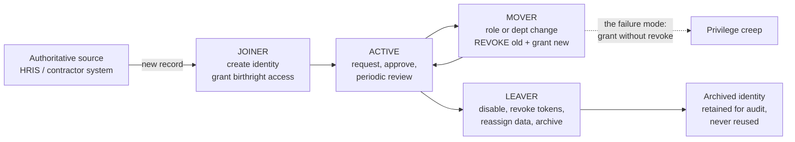
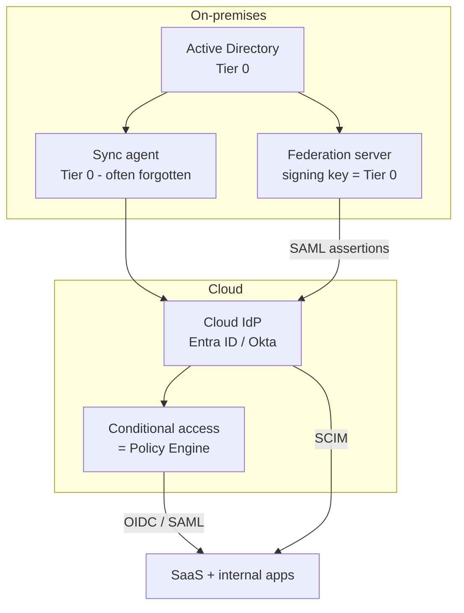
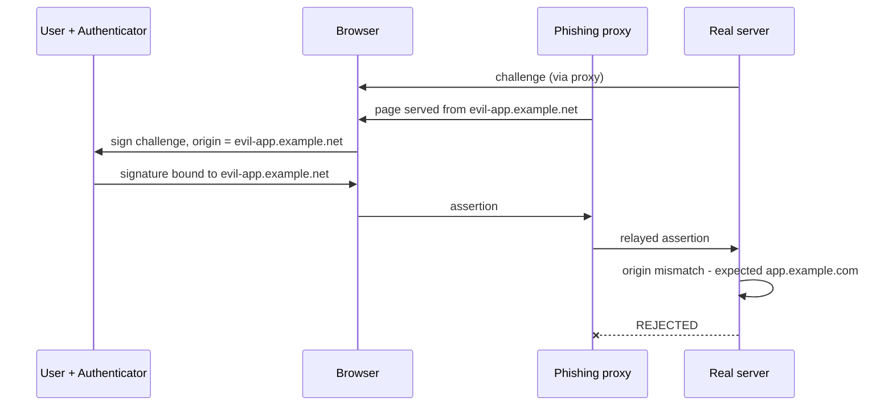
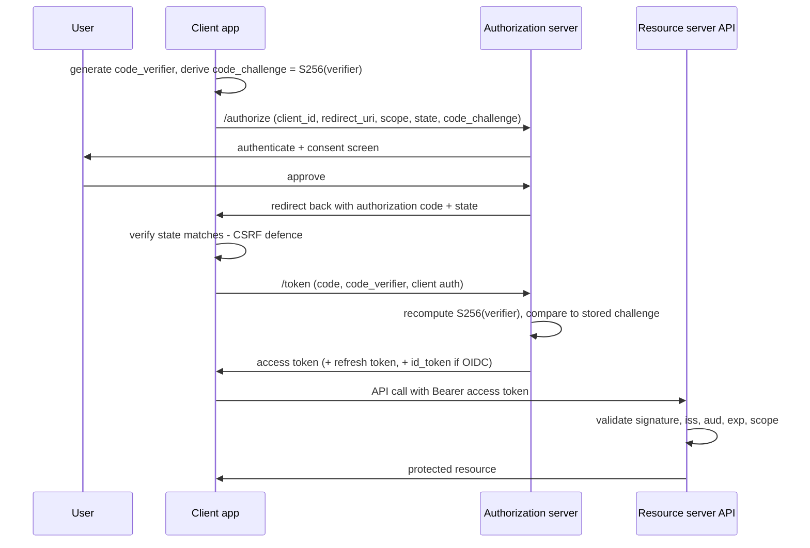
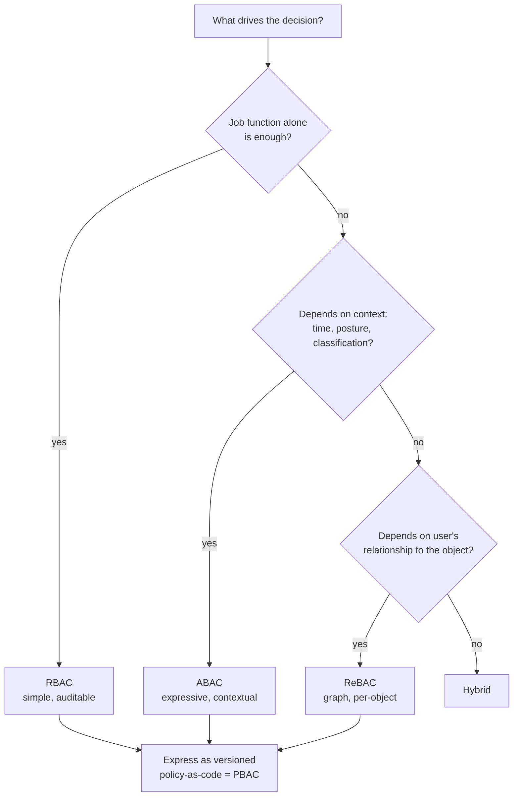
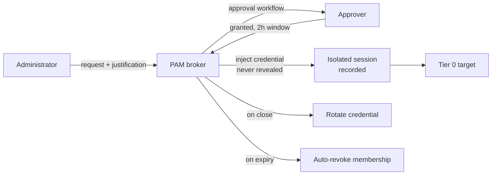
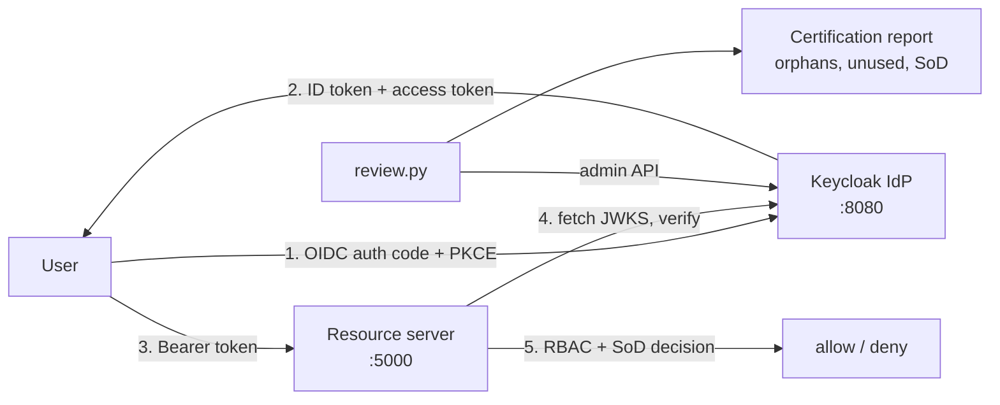
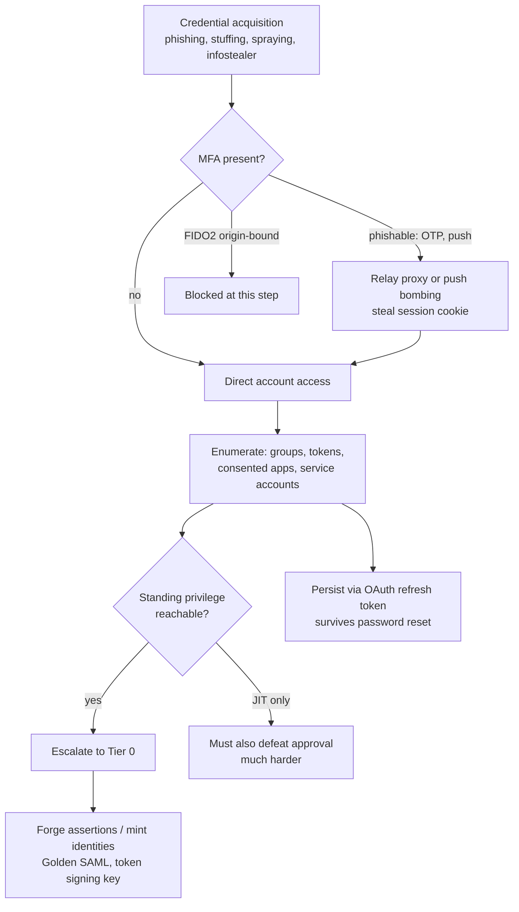

**Level:** Advanced · **Track:** GRC & Architecture · **Read time:** 260 min

Chapter 4 ended on a claim that deserves a whole chapter of its own: in a zero-trust architecture, **identity is the control plane**. Every policy decision in that chapter's OPA rules began by asking *who is this*, and every other signal — device posture, clearance, MFA state — hung off the answer. If the identity layer is wrong, everything downstream is decorating a broken foundation. A policy engine that faithfully enforces "only Finance may read payroll" is worthless if the definition of "Finance" is a stale group that still contains fourteen people who left the department two years ago.

This chapter is about building that foundation properly at the scale where it actually gets hard — tens of thousands of humans, hundreds of thousands of non-human identities, dozens of applications with incompatible authentication protocols, and an audit that will demand evidence that every one of those access grants was deliberate. We will move from the vocabulary (identification versus authentication versus authorization), through the protocols that carry identity between systems (SAML, OIDC, OAuth 2.0), through the authorization models that decide what an authenticated subject may do (RBAC, ABAC, ReBAC, PBAC), into the governance machinery that keeps all of it honest over time (lifecycle automation, access certification, segregation of duties, privileged access management).

The recurring theme is **entropy**. IAM is not a project that completes; it is a system that decays. Access is granted quickly under deadline pressure and revoked slowly or never. Roles multiply. Service accounts accumulate. The gap between "access someone has" and "access someone needs" widens every single day unless a governance process actively closes it. Most of the second half of this chapter is about that closing mechanism, because that is what separates an IAM *deployment* from an IAM *program*.

## Why This Matters

Look at how modern intrusions actually succeed. The Verizon DBIR has, for years running, put stolen credentials at or near the top of initial-access vectors, and the pattern in public incident reports is remarkably consistent: the attacker rarely breaks the cryptography, and increasingly rarely writes an exploit. They *log in*.

The 2021 Colonial Pipeline shutdown traced back to a single legacy VPN account with a leaked password and no MFA — an account that should have been decommissioned. The 2022 Uber compromise combined a contractor's stolen credentials with MFA-fatigue push bombing, then escalated by finding hardcoded admin credentials in a PowerShell script on a network share — a privileged-access-management failure sitting behind an authentication failure. The 2023 Okta support-system incident and the MGM/Caesars intrusions of the same year turned on **help-desk social engineering**: convincing a human to reset an authentication factor. In the 2020 SolarWinds campaign the most alarming stage was Golden SAML — forging assertions from a compromised federation server, which let the attacker mint valid identities for arbitrary users without ever touching their passwords.

Every one of those is an IAM failure, and each maps to a specific control this chapter covers: lifecycle deprovisioning, phishing-resistant factors, credential vaulting, help-desk identity-proofing, and federation-signing-key protection. Framed in the language of Chapter 3, identity controls have unusually high risk-reduction-per-rupee because they sit upstream of nearly every attack path. Framed in the language of Chapter 4, identity is where zero trust either becomes real or becomes marketing.

## Part 1: The Four Questions IAM Answers

People use "IAM" as a single word for four genuinely different operations. Conflating them is the source of an enormous amount of confused design, so pin them down first.

| Question | Term | What it establishes | Typical failure |
|---|---|---|---|
| Who do you claim to be? | **Identification** | A unique subject identifier is asserted | Identifier reuse; two people mapped to one account |
| Can you prove it? | **Authentication (AuthN)** | Confidence that the claim is true | Phishable factor; credential stuffing succeeds |
| What may you do? | **Authorization (AuthZ)** | A decision about a specific action on a specific resource | Over-broad role; missing object-level check |
| What did you do? | **Accountability / Audit** | A non-repudiable record tied to the subject | Shared accounts destroy attribution |

Two design rules follow directly and are violated constantly:

**AuthN is not AuthZ.** Proving who you are says nothing about what you should reach. An application that treats "has a valid token from our IdP" as "is allowed to view this record" has a broken-object-level-authorization bug waiting to happen — every employee holds a valid token. Authentication must be followed by an explicit, per-resource authorization decision.

**Accountability requires non-shared identity.** The moment five administrators share one `admin` account, the audit trail can no longer answer "who did this," which means the deterrent effect of logging vanishes and every incident investigation stalls. This single principle is the entire justification for privileged access management (Part 13).

A fifth concept sits underneath all four: the **identity** itself — the digital representation of a subject, and the attributes attached to it. Subjects are not only people. A complete enterprise inventory includes employees, contractors, partners, customers, service accounts, machine/workload identities, and increasingly AI agents acting on a human's behalf. Each population has a different lifecycle, different authoritative source, and different risk profile — and Part 14 argues the non-human ones now outnumber the humans by an order of magnitude while receiving a fraction of the governance.

## Part 2: The Identity Lifecycle — Joiner, Mover, Leaver

Every identity has a lifespan, and the classic model names three events: **Joiner, Mover, Leaver** (JML).



**Joiner.** An authoritative source signals a new subject. The identity is created with a unique, non-reusable identifier and given **birthright access** — the minimum every member of that population gets (mail, chat, intranet, laptop enrolment). Everything beyond birthright should be *requested* and *approved*, not assumed. The security-relevant details are that provisioning must be automated (manual creation drifts and delays), and that the initial credential must be delivered over a channel that is itself authenticated — mailing a temporary password to a personal address is a hole.

**Mover.** A subject changes department, role, manager, or employment type. This is **the single most under-implemented event in enterprise IAM**, and the reason is structural: the grant half is loud and the revoke half is silent. When someone moves from Finance to Engineering, they immediately notice if they cannot reach the code repositories, and they file a ticket within the hour. Nobody notices — least of all the person themself — that they retained the payroll-approval entitlement. Multiply this by a decade of internal mobility and you get an employee holding the union of every role they have ever occupied. That accumulation is **privilege creep**, and it is why the mover event must be modelled as *revoke-then-grant*, not *grant*.

**Leaver.** Termination must revoke access faster than the departing subject can act, which for an involuntary termination means *before* they are told. A complete leaver process is more than disabling the account:

1. Disable the account in the directory (do not delete — you need the identifier for audit).
2. **Invalidate live sessions and refresh tokens.** Disabling an account does not by itself kill an already-issued OAuth refresh token or an active SSO session; this is Part 10's revocation problem and it is routinely missed.
3. Revoke or rotate any credential the subject knew — shared secrets, API keys, vault-stored passwords they had checked out.
4. Remove from federated and SaaS applications not covered by SCIM/SSO (the "shadow IT tail").
5. Reassign owned resources — files, service accounts, group ownerships, and any application where they were the sole administrator.
6. Retire hardware and revoke certificates.

The metric that matters here is **mean time to deprovision**, measured from termination timestamp to last-access-revoked, per system. Auditors ask for it, and the honest answer for most organisations' SaaS tail is "we do not know," which is precisely why identity governance platforms (Part 16) exist.

## Part 3: The Authoritative Source Problem

An IAM system is only as correct as the data feeding it. The **authoritative source** (system of record) for an attribute is the one system whose value wins when systems disagree. The pathology in most enterprises is that no such designation exists, so five systems each hold a department field and they diverge.

Establish, in writing, a source-of-truth map:

| Attribute | Authoritative source | Consumed by | Why it matters for access |
|---|---|---|---|
| Employment status | HRIS | IdP, all downstream | Drives leaver automation |
| Department / cost centre | HRIS | RBAC role assignment | Wrong dept = wrong birthright role |
| Manager | HRIS | Approval routing, access reviews | Wrong manager = review sent to the wrong person |
| Job title / job code | HRIS | Role mining, SoD rules | Drives least privilege |
| Contractor status + end date | Vendor management system | IdP | Contractors have no HRIS record — the classic gap |
| Email / UPN | IdP | Everything | Identifier collisions break federation |
| Device compliance | MDM / EDR | Policy engine | Chapter 4's posture signal |

Two hard-won cautions. First, **contractors and partners rarely live in the HRIS**, so if your leaver automation is HRIS-triggered you have automated deprovisioning for exactly the population least likely to be a problem, and left the higher-risk population manual. Give non-employees a mandatory expiry date at creation, so the default outcome is revocation rather than persistence. Second, **never use a mutable attribute as the primary identifier.** Names change, email addresses change, employee numbers get recycled after a decade. The internal identifier must be immutable, opaque, and never reused — reuse means a new hire silently inherits the old holder's access via stale ACLs.

## Part 4: Directories — LDAP, Active Directory, and the Cloud IdP

The directory is where identities and their attributes actually live.

**LDAP** (Lightweight Directory Access Protocol, RFC 4511) defines a hierarchical tree of entries, each with a Distinguished Name (`cn=asha,ou=Finance,dc=corp,dc=example,dc=com`) and a set of typed attributes governed by a schema. It is optimised for extremely high read volume and comparatively rare writes — the correct shape for "check this user's group membership on every request."

**Active Directory** is Microsoft's implementation plus a great deal more: Kerberos authentication, DNS integration, Group Policy, and a forest/domain/OU trust model. Twenty-plus years of enterprise deployment mean AD is still the effective root of trust in most large organisations, which is why so much of the offensive tradecraft in Notebooks 4 and 18 targets it. The security-relevant consequence is that **AD's own tiering matters more than any application-level control**: if Tier 0 (domain controllers, the KRBTGT account, ADFS signing keys) is compromised, the attacker can mint identities at will, and every downstream authorization decision built on those identities is void.

**Cloud IdPs** (Microsoft Entra ID, Okta, Google Workspace, Ping) changed the model. They are not LDAP directories with a web page in front; they are protocol hubs speaking OIDC/OAuth and SAML outward, SCIM for provisioning, and offering conditional-access policy engines — the commercial embodiment of Chapter 4's Policy Engine. Most enterprises today run **hybrid identity**: AD on-premises remains authoritative for workstations and legacy apps, synchronised into a cloud IdP that fronts SaaS.

Hybrid is where a specific and dangerous class of attack path lives, and it is worth stating plainly: the synchronisation service account and the federation signing key are **Tier 0 assets in the cloud too**. Compromise of an on-prem sync server or an ADFS token-signing certificate lets an attacker forge cloud identities (Golden SAML). Treat them with the same protection as a domain controller — no shared administration, hardware-backed key storage where possible, and alerting on any signing-key export.



## Part 5: Authentication Factors and Why Most of Them Fail

Authentication factors are classically grouped as something you **know** (password, PIN), **have** (token, phone, smartcard), or **are** (fingerprint, face). Two more are often added: somewhere you are (location/network) and something you do (behavioural biometrics) — both are *signals* rather than true factors, better used as risk inputs than as proof.

Multi-factor authentication requires factors from **different categories**. A password plus a security question is not MFA; both are things you know, and both leak from the same breach.

The critical modern distinction is not "how many factors" but **phishing resistance**. Rank them honestly:

| Factor | Category | Phishing-resistant? | Realistic weakness |
|---|---|---|---|
| Password | Know | No | Reuse, stuffing, spraying, breach corpora |
| Security question | Know | No | Answers are OSINT (Notebook 10) |
| SMS OTP | Have (weakly) | **No** | SIM swap, SS7 interception, real-time relay |
| Email OTP | Have | No | Inherits mailbox compromise |
| TOTP app | Have | **No** | Real-time relay via proxy phishing kit |
| Push approval | Have | No | MFA fatigue / push bombing |
| Push + number matching | Have | Partial | Materially reduces fatigue attacks |
| Smartcard / PIV certificate | Have | Yes | Requires PKI and readers |
| **FIDO2 / WebAuthn (passkey)** | Have (+ Are) | **Yes** | Recovery flow becomes the weak link |

Why do TOTP and push fail? Because both are **shared-context-free**: the code or approval means "somebody is authenticating right now," not "somebody is authenticating *to this site*." An attacker running a reverse-proxy phishing kit (Evilginx-style) sits between the victim and the real site, relays the credential, relays the OTP prompt, and captures the resulting **session cookie**. The victim's MFA worked perfectly and the attacker still has the session. This is the single most important thing to understand about modern credential phishing: **MFA that a human can retype or approve is MFA that a proxy can relay.**

## Part 6: FIDO2 / WebAuthn — Why It Actually Resists Phishing

FIDO2 is worth understanding cryptographically rather than as a vendor claim, because the mechanism is what delivers the property.

Registration: the authenticator (security key, phone secure enclave, TPM) generates a **new keypair scoped to that specific relying party** — the origin, e.g. `https://app.example.com`. The public key goes to the server; the private key never leaves the authenticator hardware.

Authentication: the server sends a random challenge. The browser hands the authenticator both the challenge **and the origin it is actually talking to**. The authenticator signs a payload that includes a hash of that origin. The server verifies the signature against the stored public key and checks that the origin in the signed payload matches its own.



Three properties fall out of this design:

1. **Origin binding.** The signature is only valid for the origin the browser was actually on. A relayed assertion from a lookalike domain fails server-side verification. The user cannot be talked into overriding it, because the check is not presented to the user at all.
2. **No shared secret.** The server stores only public keys. A server-side database breach yields nothing replayable — a categorical improvement over password hashes and TOTP seeds.
3. **Nothing to retype.** There is no code a human can be persuaded to read out to a "help desk" caller.

The residual risk moves, as it always does, to the edges: **account recovery** ("I lost my key") and **help-desk factor reset**. If losing a passkey drops the user back to SMS OTP, the effective security of the account is SMS OTP. Design recovery as a second registered authenticator plus in-person or manager-verified identity proofing, and treat factor-reset as a privileged operation with its own MFA and out-of-band verification. This is exactly the gap the 2023 help-desk-driven intrusions exploited.

## Part 7: Federation — SAML and OIDC

Federation lets one system (the **Identity Provider**, IdP) authenticate a user and assert that fact to another (the **Service Provider** / **Relying Party**), so the user authenticates once and the application never handles the credential.

**SAML 2.0** is XML-based, dating from 2005, and still dominant in enterprise SaaS. The IdP issues a signed XML `<Assertion>` containing a subject, an audience restriction, validity timestamps, and attribute statements. The service provider validates the XML signature against the IdP's certificate.

**OpenID Connect (OIDC)** is a thin identity layer on top of OAuth 2.0, JSON-based, and the default for anything modern — mobile apps, SPAs, APIs. The IdP issues a signed **ID token** (a JWT) alongside OAuth's access token.

| Aspect | SAML 2.0 | OIDC |
|---|---|---|
| Encoding | XML | JSON / JWT |
| Signature | XML-DSig (canonicalisation is fragile) | JWS (simpler, fewer parser traps) |
| Identity carrier | `<Assertion>` | ID token |
| Front-channel transport | Browser POST of a form | Redirect with code, then back-channel exchange |
| Best fit | Legacy enterprise SaaS | Web, SPA, mobile, API |
| Provisioning partner | SCIM | SCIM |
| Classic vulnerability class | Signature wrapping, comment truncation, unsigned-assertion acceptance | Missing `aud`/`iss`/`nonce` validation, `alg:none` |

The **Golden SAML** attack deserves its own paragraph because it defeats everything above it in the stack. If an attacker steals the IdP's token-signing private key, they can forge a valid assertion for *any user*, with *any attributes*, without touching that user's password or MFA — and the service provider has no way to tell. MFA does not help; password rotation does not help. The only mitigations are protecting the signing key in hardware, monitoring for its export, and rotating it after any suspicion of IdP compromise. This is why Part 4 insisted the federation server is a Tier 0 asset.

## Part 8: OAuth 2.0 — Delegated Authorization, Not Login

OAuth 2.0 is the most misunderstood protocol in this chapter, and the misunderstanding causes real vulnerabilities. State it precisely:

> **OAuth 2.0 is a delegated *authorization* framework.** It lets a resource owner grant a third-party client limited access to a resource *without sharing credentials*. It does not, on its own, tell the client who the user is.

The four roles: **resource owner** (the user), **client** (the app wanting access), **authorization server** (issues tokens), **resource server** (the API holding the data).

The Authorization Code flow with **PKCE** (Proof Key for Code Exchange, RFC 7636) is the correct default for every client type today — public *and* confidential. Implicit flow is deprecated; Resource Owner Password Credentials is deprecated and defeats the entire purpose by handing the client the password.



The two failure modes that cause the most damage:

**Using OAuth as authentication.** An access token proves the client was *granted access to something*, not that the user is present or is who the client thinks. The historical "log in with OAuth" pattern — take the access token, call `/me`, trust the returned user id — is vulnerable to token substitution: a token issued to a *different* malicious client for the same user can be replayed to your `/me` call. OIDC exists precisely to fix this, via an ID token whose `aud` claim names *your* client and whose `nonce` binds it to *your* request. Use OIDC for login. Use OAuth for API delegation.

**Scope sprawl and consent phishing.** Scopes are the granularity of delegation, and users approve them with roughly the attention they give a cookie banner. Attacker-registered applications requesting `Mail.ReadWrite` and `offline_access` have been used in real campaigns to obtain durable mailbox access with no password and no MFA prompt — the refresh token survives a password reset. Enterprise mitigation is to disable end-user consent for anything beyond a trusted low-risk set, require admin consent, and periodically audit granted application consents as part of the access review in Part 15.

## Part 9: Tokens — Types and Mandatory Validation

Three token types, three different jobs:

| Token | Audience | Purpose | Lifetime | May the client read it? |
|---|---|---|---|---|
| **ID token** (OIDC) | The client | "This user authenticated, here is who they are" | Short | Yes — it is *for* the client |
| **Access token** (OAuth) | The resource server / API | "Bearer may perform these scopes" | Short (minutes) | **Treat as opaque** |
| **Refresh token** | The authorization server | Obtain new access tokens without re-auth | Long (days/months) | No — high-value secret |

Access tokens are commonly JWTs, which means the resource server can validate them without a network call — fast, and the reason JWTs won. That local validation is also where implementations go wrong. A resource server must check **all** of the following, and skipping any one is a real vulnerability:

- **Signature** against the IdP's published JWKS, with the key selected by `kid`.
- **`alg`** against an allowlist. Never accept `none`; never let the token choose between symmetric and asymmetric (the classic RS256-to-HS256 confusion, where the attacker signs with the public key as an HMAC secret).
- **`iss`** matches your expected issuer exactly.
- **`aud`** contains *your* identifier — this is what stops a token minted for another service being replayed at yours.
- **`exp` / `nbf`**, with minimal clock skew tolerance.
- **`nonce`** for ID tokens, matching the value your client generated.
- **`scope` / claims** sufficient for the specific operation — and then a real authorization decision on top (Part 11).

**Bearer tokens are exactly as dangerous as the word implies**: whoever holds one can use it. Keep lifetimes short, never place them in URLs or logs, bind them to a client where possible (mTLS or DPoP sender-constrained tokens), and store refresh tokens with the care you would give a password — which in a browser means an `HttpOnly`, `Secure`, `SameSite` cookie backed by a server-side session, not `localStorage`.

## Part 10: Sessions, SSO Blast Radius, and the Revocation Gap

Single sign-on is a genuine security improvement — one strong, well-monitored authentication instead of forty weak passwords — but it concentrates risk. The IdP session becomes a master key, and Part 5's proxy-phishing attack targets exactly that cookie.

Session controls that matter:

- **Absolute and idle timeouts**, tuned by application sensitivity rather than one global value.
- **Re-authentication for sensitive operations** — payment, permission change, factor enrolment — even inside a live session. This is OIDC's `prompt=login` / `max_age`, and it is the direct countermeasure to a stolen session cookie.
- **Token binding** so a lifted cookie fails on a different client (mTLS-bound tokens, DPoP, device-bound session credentials).
- **Continuous evaluation.** Chapter 4's seventh tenet: re-evaluate mid-session on signal change (impossible travel, device falls out of compliance, risk score jumps).

Now the gap that catches nearly everyone. **Disabling an account does not immediately stop access.** A JWT access token is validated offline; it stays valid until `exp`. A refresh token may keep minting new ones for months. So a "revoked" user can retain working access for a window that most organisations have never measured.

A complete revocation runbook:

1. Disable/suspend the account at the IdP.
2. Revoke refresh tokens and consent grants explicitly (IdP-specific API — this is a separate call, not implied by disable).
3. Terminate active IdP sessions.
4. Where supported, push **continuous access evaluation** signals so resource servers reject existing tokens immediately.
5. For long-lived tokens with no revocation path, shorten `exp` as a design change — the only real fix.
6. Rotate any shared secret the subject could have exfiltrated.

Test this. Genuinely test it: disable a test account and measure how long each critical application keeps serving it. The number is almost always worse than expected, and it is a superb finding to bring to a risk committee because it is concrete, measured, and fixable.

## Part 11: Authorization Models — RBAC, ABAC, ReBAC, PBAC

Authentication answers *who*. Now decide *what they may do*. Four models, each with a domain where it is genuinely the right answer.

**RBAC (Role-Based).** Permissions attach to roles; roles attach to users. `Finance-AP-Clerk` grants invoice-create and invoice-view. Simple, auditable, and the model auditors understand best. Its weakness is dimensionality: any condition that is not a job function (time of day, record ownership, data classification, request location) has to be encoded as *another role*, and the role count explodes.

**ABAC (Attribute-Based).** Decisions are computed from attributes of subject, resource, action, and environment. "Allow if `subject.department == resource.owningDepartment` and `subject.clearance >= resource.classification` and `env.deviceCompliant`." Enormously expressive — Chapter 4's Rego policy was ABAC — and it handles context natively. Its weakness is **explainability**: answering the auditor's question "who can read payroll?" now requires evaluating a policy across the full attribute space rather than reading a group membership list.

**ReBAC (Relationship-Based).** Decisions follow a graph of relationships: "you may edit this document if you are its owner, or a member of a group that has editor on a folder that contains it." This is Google Zanzibar's model, and it is the right answer for collaborative/document/multi-tenant products where permission is inherently about *this user's relationship to this object*. RBAC models such systems terribly.

**PBAC (Policy-Based).** Less a fourth model than the operational discipline around the others: authorization expressed as versioned, tested, code-reviewed policy, deployed through CI/CD, evaluated by a dedicated engine (OPA, Cedar, Zanzibar-style service) rather than scattered `if` statements. The lab in Chapter 4 was PBAC in practice.



The pragmatic enterprise answer is a **hybrid**: RBAC for coarse birthright and job-function access because it is reviewable, ABAC conditions layered on top for context, ReBAC inside products whose data model demands it, and all of it expressed as policy-as-code. Do not chase model purity; chase the ability to answer "who can reach this, and why" quickly and correctly.

## Part 12: Role Explosion, Role Mining, and Least Privilege in Practice

RBAC decays in a predictable way. Every exception becomes a new role: `Finance-AP-Clerk-Mumbai-Contractor-ReadOnly`. Within a few years there are more roles than users, nobody can say what any of them mean, and reviewers approve everything because understanding it is impossible. That end state — **role explosion** — is worse than no RBAC at all, because it produces the *documentation* of least privilege without the substance.

Structure prevents it. Separate roles into two layers:

- **Business roles** — what a human recognises: "Accounts Payable Clerk." These are what managers see, request, and certify.
- **Technical entitlements** — what a system enforces: an AD group, an SAP transaction code, an AWS IAM policy, a database grant.

A business role bundles technical entitlements. Reviews happen at the business-role layer (comprehensible), enforcement at the entitlement layer (precise). Then hold two rules: exceptions are granted as *time-bound individual entitlements*, never as new permanent roles; and role definitions have named owners who must re-approve them annually.

**Role mining** builds this bottom-up from reality. Export current user-to-entitlement assignments, cluster users with similar entitlement sets, and propose candidate roles from the dense clusters. Two cautions that decide whether the exercise helps or hurts: mining reproduces *existing* access including years of accumulated creep, so mine to *discover* and then prune to *need*; and the long tail of one-off entitlements is where the risk concentrates — investigate outliers rather than discarding them.

Least privilege in practice also means embracing **time**. Standing access is the problem; access that exists for two hours is a far smaller target. That principle is the whole basis of the next part.

## Part 13: Privileged Access Management

Privileged accounts — domain admin, root, cloud tenant owner, database `sa`, the CI/CD deployment identity — are the accounts whose compromise ends the argument. PAM is the set of controls that makes them survivable.

**Discovery.** You cannot vault what you have not found. Scan for local admin accounts, embedded credentials in scripts and config, SSH keys, hardcoded database strings, cloud access keys. This step reliably surprises people; the Uber incident's escalation came from exactly this class of finding — admin credentials in a script on a share.

**Vaulting and rotation.** Privileged credentials live in a vault, not in a human's head or a config file. They are checked out for a specific purpose with an approval, and **rotated after every use**, so a captured credential is worthless by the time it is replayed.

**Brokering and session isolation.** The administrator never receives the password. They connect through a broker that injects credentials into an isolated session, keeping the secret off the endpoint entirely — which matters because the endpoint is the thing most likely to be compromised.

**Session recording and keystroke logging.** Full recording of privileged sessions restores the accountability that Part 1 demanded, and provides forensic ground truth during an incident.

**Just-in-time (JIT) elevation.** The most valuable control here. Instead of standing membership in `Domain Admins`, an administrator requests elevation, receives it for a bounded window with an approval and a business justification, and loses it automatically. This collapses the standing-privilege attack surface: a phished admin at 2 a.m. is, most of the time, not actually an admin.

**Tiering.** Administrative accounts must be separated from daily-use accounts, and admin credentials for Tier 0 must never be typed on a Tier 1 or Tier 2 workstation — otherwise credential theft on a workstation escalates straight to the top. This is Microsoft's tiered model and it survives contact with reality precisely because it is an *architectural* constraint rather than a behavioural request.



## Part 14: Non-Human Identity — The Ungoverned Majority

Count the identities in a modern enterprise and the humans are a rounding error. Service accounts, application identities, CI/CD pipeline identities, Kubernetes service accounts, IoT devices, API keys, and now AI agents typically outnumber employees by 10:1 to 50:1. They receive a small fraction of the governance, and they have properties that make them attractive targets:

- **No MFA** — they authenticate with a secret, and a secret is all an attacker needs.
- **No owner** — the person who created it left in 2019; nobody dares disable it.
- **Over-privileged** — provisioned with broad rights during a deadline "to make it work," never narrowed.
- **Static credentials** — passwords and keys that have not rotated in years, often committed to a repository at some point.
- **Excluded from reviews** — access certification campaigns overwhelmingly cover humans only.

Minimum viable governance for non-human identity:

1. **Inventory with a named human owner** for every service account. No owner, no account — an unowned account is disabled after a notice period.
2. **Purpose and scope recorded** at creation, so a reviewer can judge whether the entitlements still match the purpose.
3. **Expiry by default.** Especially for API keys and tokens issued to integrations.
4. **Rotation, automated.** Manual rotation does not happen.
5. **Include them in access reviews**, reviewed by the owner.
6. **Behavioural monitoring.** Service accounts are wonderfully predictable — same source, same times, same operations. Deviation is a high-quality detection signal, far better than for humans (see Notebook 32).
7. **Block interactive logon.** A service account being used for an interactive session is either misconfiguration or compromise.

The strategic direction is to **eliminate the secret entirely**. Workload identity federation lets a workload prove what it is using a platform-attested token rather than a stored credential: a GitHub Actions job exchanges its OIDC token for short-lived cloud credentials; a pod uses its Kubernetes service-account token to assume a cloud role; a VM uses an instance identity document. No long-lived key exists, so none can leak. Where a secret is genuinely unavoidable, it belongs in a secrets manager with dynamic, short-TTL issuance — and it belongs in the SAST/secrets-scanning pipeline of Notebook 46 so it never reaches a repository in the first place.

## Part 15: Access Reviews That Are Not Rubber Stamps

**Access certification** is the periodic exercise of asking an accountable person to confirm that each access grant is still needed. It is a control auditors love and organisations perform badly, because the default implementation is a spreadsheet with 4,000 rows and a deadline, which produces one behaviour: select-all, approve.

What makes reviews real:

| Anti-pattern | Fix |
|---|---|
| One giant annual campaign | Risk-tiered frequency: privileged quarterly, sensitive semi-annual, low-risk annual |
| Raw technical entitlement names (`SAP_FI_T003_MOD`) | Present the **business role** and a plain-language description of what it permits |
| Reviewer is a generic IT manager | Reviewer is the **data/application owner** or the direct manager, who has the context to judge |
| Approve-all is one click, revoke is a form | Make **revoke** the low-friction action; require a justification to *approve* high-risk items |
| Everything reviewed at once | Only review **exceptions and changes** since last cycle, plus a full sweep of privileged access |
| Revocations "recommended" | Revocations **auto-execute** on a deadline; failure to respond means revoke, not retain |
| No follow-through metric | Track revocation rate — a campaign approving 100% is evidence of rubber-stamping, not cleanliness |

That last row is the one to internalise. If a certification campaign returns a 0% revocation rate, the correct conclusion is not "our access is perfect"; it is "our review is not functioning." Sample-test a handful of approved grants against actual usage data and the truth appears quickly. **Usage-informed review** — showing the reviewer "this entitlement has not been exercised in 180 days" — is the single highest-leverage improvement available, because it converts a judgement call into an evidence-based one.

## Part 16: Segregation of Duties and Toxic Combinations

**Segregation of Duties (SoD)** prevents one person from controlling every step of a sensitive process. The canonical example is financial: whoever can create a vendor must not also be able to approve payments to it, because together those two rights permit undetectable fraud. Neither entitlement is dangerous alone; the *combination* is. Such pairs are called **toxic combinations**.

SoD is not only a finance concern. Security-relevant examples:

| Toxic combination | Risk enabled |
|---|---|
| Create vendor + approve payment | Fraudulent disbursement |
| Write code + approve own PR + deploy to production | Malicious or unreviewed code reaches prod |
| Administer a system + administer its audit log | Covering tracks; destroys accountability |
| Grant access + approve access requests | Self-provisioning to anything |
| Create user + assign privileged role | Attacker-created backdoor identity |
| Manage backups + delete production data | Unrecoverable destructive action |

Implementing SoD has three parts. **Preventive** controls block the assignment at request time — the access-request system refuses to grant an entitlement that conflicts with one the subject already holds. **Detective** controls scan existing assignments for violations that predate the rule or arrived through a role change. **Compensating** controls handle the genuine cases where a small team cannot separate the duties: an approved, documented, time-bound exception with enhanced monitoring and independent after-the-fact review. That third category is essential to state explicitly, because a 30-person company physically cannot satisfy a control designed for a 30,000-person one, and pretending otherwise produces a policy everyone ignores.

Note the interaction with Part 2's mover event: SoD violations are frequently *created* by internal transfers, when a mover keeps the old department's entitlement and gains the new one's. A preventive check at grant time will not catch it if the old entitlement was never revoked — which is why detective SoD scanning must run continuously, not just at request time.

## Part 17: Identity Governance and Administration (IGA)

**IGA** is the platform layer that operationalises Parts 2, 12, 15 and 16: lifecycle automation, access request and approval workflow, role management, certification campaigns, SoD enforcement, and the reporting that produces audit evidence. Commercial examples include SailPoint, Saviynt, Omada and the governance modules of the major IdPs; the open-source ecosystem includes midPoint and Keycloak plus custom workflow.

The important architectural distinction:

- **IdP / access management** answers *right now*: authenticate this user, evaluate policy, issue a token. Real-time, request-path.
- **IGA** answers *over time*: should this person still have this? Who approved it? Prove it. Batch, off the request path.
- **PAM** answers *for the dangerous accounts*: vault, broker, record, elevate just in time.

They are complementary and all three are needed. Deploying an IdP alone gives you strong authentication over an access landscape nobody has ever reviewed.

A sane implementation sequence, in priority order, because a big-bang IGA programme is a reliable way to spend two years and deliver nothing:

1. Build the **identity inventory** — including non-human identities. You cannot govern an unknown population.
2. Automate **leaver** first. It is the highest risk, the most measurable, and the easiest business case.
3. Automate **joiner** birthright access. Fast payback in productivity, which buys goodwill for the rest.
4. Introduce **access request with approval** so new access stops being informal.
5. Add **certification** for privileged and sensitive access only. Resist the urge to certify everything on day one.
6. Add **SoD** rules for the top handful of toxic combinations.
7. Only then attempt **mover** automation and full role modelling — the hardest parts, best attempted with clean data.

## Part 18: IAM Metrics That Survive an Audit

Chapter 3 argued for measurement. These are the identity metrics worth reporting, and each answers a question a board or auditor actually asks:

| Metric | Why it matters | Healthy direction |
|---|---|---|
| % of accounts with phishing-resistant MFA | Directly reduces the top initial-access vector | → 100%, privileged first |
| Mean time to deprovision (per system) | Leaver risk window | → minutes, measured not assumed |
| Orphaned accounts (no valid owner) | Ungoverned attack surface | → 0 |
| Standing privileged accounts vs JIT-elevated | Blast radius of a phished admin | Standing → near 0 |
| Non-human identities with owner + expiry | Governs the largest population | → 100% |
| Credential age > policy (max secret age) | Static-secret exposure | → 0 |
| Access review **revocation** rate | Detects rubber-stamping | Non-zero and stable |
| Entitlements unused > 90 days | Concrete least-privilege gap | → declining |
| SoD violations open, by age | Fraud and integrity exposure | → 0, none aged |
| Failed-then-successful auth from new geo | Detection quality signal | Investigated, not just counted |

Two cautions. First, do not report only the flattering ones — a dashboard of green with no revocation-rate metric is exactly the shape of an unexamined programme. Second, express these in the risk language of Chapter 3 when they reach leadership: "42 standing domain-admin accounts" is a fact, but "reducing standing domain admin from 42 to 4 cuts the population an attacker can phish into full-tenant compromise by 90%" is a decision.

## Part 19: Hands-On Lab — OIDC Login, SoD-Aware RBAC, and an Automated Access Review

### 19.1 What we are building

Three connected pieces that mirror the chapter:

1. **Keycloak** as an identity provider issuing OIDC ID tokens (Part 7) with role claims.
2. A **resource server** that validates the token correctly (Part 9) and then makes a real authorization decision including an SoD check (Parts 11, 16).
3. An **access-review script** that flags orphaned accounts, unused entitlements, and toxic combinations (Parts 15, 16).



Everything runs locally. You need Docker, `curl`, `jq`, and Python 3.

### 19.2 Stand up the identity provider

```bash
# Keycloak in dev mode - ephemeral, fine for a lab, never for production.
docker run -d --name kc-lab -p 8080:8080 \
  -e KEYCLOAK_ADMIN=admin \
  -e KEYCLOAK_ADMIN_PASSWORD=labadmin \
  quay.io/keycloak/keycloak:26.0 start-dev

# Wait for it to be ready.
until curl -sf http://localhost:8080/realms/master > /dev/null; do sleep 2; done
echo "Keycloak up"

# Sample output:
# Keycloak up
```

Get an admin token and create a realm — the tenant boundary:

```bash
KC=http://localhost:8080

TOKEN=$(curl -s -X POST "$KC/realms/master/protocol/openid-connect/token" \
  -d "client_id=admin-cli" -d "username=admin" -d "password=labadmin" \
  -d "grant_type=password" | jq -r .access_token)

# Create the 'corp' realm.
curl -s -X POST "$KC/admin/realms" \
  -H "Authorization: Bearer $TOKEN" -H "Content-Type: application/json" \
  -d '{"realm":"corp","enabled":true}'

curl -s "$KC/admin/realms/corp" -H "Authorization: Bearer $TOKEN" | jq '.realm, .enabled'

# Sample output:
# "corp"
# true
```

### 19.3 Model business roles and technical entitlements

Part 12's two-layer model, expressed as Keycloak realm roles. Note that `vendor-create` and `payment-approve` are the toxic pair from Part 16.

```bash
for R in vendor-create payment-approve invoice-view ledger-admin; do
  curl -s -X POST "$KC/admin/realms/corp/roles" \
    -H "Authorization: Bearer $TOKEN" -H "Content-Type: application/json" \
    -d "{\"name\":\"$R\",\"description\":\"technical entitlement\"}"
done

curl -s "$KC/admin/realms/corp/roles" -H "Authorization: Bearer $TOKEN" \
  | jq -r '.[] | select(.description=="technical entitlement") | .name' | sort

# Sample output:
# invoice-view
# ledger-admin
# payment-approve
# vendor-create
```

Create three users. `asha` is a clean AP clerk; `ravi` is a **mover** who kept his old entitlement and picked up a conflicting one; `svc-billing` is an unowned service account (Part 14).

```bash
create_user () {
  curl -s -X POST "$KC/admin/realms/corp/users" \
    -H "Authorization: Bearer $TOKEN" -H "Content-Type: application/json" \
    -d "{\"username\":\"$1\",\"enabled\":true,\"emailVerified\":true,
         \"credentials\":[{\"type\":\"password\",\"value\":\"$2\",\"temporary\":false}],
         \"attributes\":{\"owner\":[\"$3\"]}}"
}

create_user asha       'Asha!Lab2027'  "manager-finance"
create_user ravi       'Ravi!Lab2027'  "manager-finance"
create_user svc-billing 'Svc!Lab2027'  ""          # deliberately ownerless

curl -s "$KC/admin/realms/corp/users" -H "Authorization: Bearer $TOKEN" \
  | jq -r '.[] | "\(.username)\towner=\(.attributes.owner[0] // "NONE")"'

# Sample output:
# asha         owner=manager-finance
# ravi         owner=manager-finance
# svc-billing  owner=NONE
```

Assign entitlements — deliberately creating one SoD violation:

```bash
assign () {
  UID=$(curl -s "$KC/admin/realms/corp/users?username=$1&exact=true" \
        -H "Authorization: Bearer $TOKEN" | jq -r '.[0].id')
  ROLE=$(curl -s "$KC/admin/realms/corp/roles/$2" -H "Authorization: Bearer $TOKEN")
  curl -s -X POST "$KC/admin/realms/corp/users/$UID/role-mappings/realm" \
    -H "Authorization: Bearer $TOKEN" -H "Content-Type: application/json" \
    -d "[$ROLE]"
}

assign asha vendor-create
assign asha invoice-view
assign ravi vendor-create     # kept from the old Finance role
assign ravi payment-approve   # gained in the new role  -> TOXIC PAIR
assign svc-billing invoice-view
echo "assignments done"

# Sample output:
# assignments done
```

### 19.4 Register the client and complete an OIDC flow

```bash
curl -s -X POST "$KC/admin/realms/corp/clients" \
  -H "Authorization: Bearer $TOKEN" -H "Content-Type: application/json" \
  -d '{"clientId":"finance-app","enabled":true,"publicClient":true,
       "standardFlowEnabled":true,"directAccessGrantsEnabled":true,
       "redirectUris":["http://localhost:5000/callback"],
       "attributes":{"pkce.code.challenge.method":"S256"}}'
echo "client registered"

# Sample output:
# client registered
```

For lab convenience we fetch a token with the direct grant. **This flow is deprecated for production** (Part 8) — it exists here only so the lab is scriptable without a browser.

```bash
RAVI_TOKEN=$(curl -s -X POST "$KC/realms/corp/protocol/openid-connect/token" \
  -d "client_id=finance-app" -d "username=ravi" -d "password=Ravi!Lab2027" \
  -d "grant_type=password" -d "scope=openid" | jq -r .access_token)

# Decode the payload - never trust it without verifying the signature first.
echo "$RAVI_TOKEN" | cut -d. -f2 | base64 -d 2>/dev/null \
  | jq '{iss, aud, exp, preferred_username, roles: .realm_access.roles}'

# Sample output:
# {
#   "iss": "http://localhost:8080/realms/corp",
#   "aud": "account",
#   "exp": 1810000300,
#   "preferred_username": "ravi",
#   "roles": ["vendor-create", "payment-approve", "default-roles-corp"]
# }
```

There is the toxic combination, visible in a live token.

### 19.5 A resource server that validates properly and enforces SoD

```python
# api.py -- resource server. Validates the token (Part 9), then authorizes (Part 11)
# and blocks toxic combinations at the point of use (Part 16).
from flask import Flask, request, jsonify
from jwt import PyJWKClient
import jwt

ISSUER   = "http://localhost:8080/realms/corp"
JWKS_URL = f"{ISSUER}/protocol/openid-connect/certs"
AUDIENCE = "account"

app = Flask(__name__)
jwks = PyJWKClient(JWKS_URL)

# Part 16: toxic combinations, expressed as data rather than scattered ifs.
TOXIC = [({"vendor-create", "payment-approve"}, "vendor creation + payment approval")]

# Part 11: RBAC - which entitlement each operation requires.
REQUIRED = {"create_vendor": "vendor-create",
            "approve_payment": "payment-approve",
            "view_invoice": "invoice-view"}

def verify(token: str) -> dict:
    key = jwks.get_signing_key_from_jwt(token).key
    # Every one of these options matters. Dropping any is a real vulnerability.
    return jwt.decode(
        token, key,
        algorithms=["RS256"],          # allowlist -- never 'none', never HS/RS confusion
        audience=AUDIENCE,             # stops tokens minted for another service
        issuer=ISSUER,                 # stops tokens from another IdP
        options={"require": ["exp", "iat", "iss", "aud"], "verify_exp": True},
    )

@app.post("/<op>")
def handle(op):
    auth = request.headers.get("Authorization", "")
    if not auth.startswith("Bearer "):
        return jsonify(error="missing bearer token"), 401
    try:
        claims = verify(auth[7:])
    except Exception as e:
        return jsonify(error=f"token rejected: {type(e).__name__}"), 401

    user  = claims.get("preferred_username")
    roles = set(claims.get("realm_access", {}).get("roles", []))

    if op not in REQUIRED:
        return jsonify(error="unknown operation"), 404

    # SoD is checked BEFORE the permission grant: holding the pair is itself the fault.
    for pair, label in TOXIC:
        if pair <= roles:
            return jsonify(decision="DENY", user=user, reason=f"SoD violation: {label}"), 403

    if REQUIRED[op] not in roles:
        return jsonify(decision="DENY", user=user,
                       reason=f"missing entitlement {REQUIRED[op]}"), 403

    return jsonify(decision="ALLOW", user=user, operation=op), 200

if __name__ == "__main__":
    app.run(port=5000)
```

```bash
pip install flask pyjwt cryptography > /dev/null
python3 api.py &
sleep 2

# 1) asha has invoice-view and no toxic pair -> allowed
ASHA_TOKEN=$(curl -s -X POST "$KC/realms/corp/protocol/openid-connect/token" \
  -d "client_id=finance-app" -d "username=asha" -d "password=Asha!Lab2027" \
  -d "grant_type=password" -d "scope=openid" | jq -r .access_token)
curl -s -X POST localhost:5000/view_invoice -H "Authorization: Bearer $ASHA_TOKEN" | jq -c

# Sample output:
# {"decision":"ALLOW","operation":"view_invoice","user":"asha"}

# 2) asha lacks payment-approve -> denied on least privilege
curl -s -X POST localhost:5000/approve_payment -H "Authorization: Bearer $ASHA_TOKEN" | jq -c

# Sample output:
# {"decision":"DENY","reason":"missing entitlement payment-approve","user":"asha"}

# 3) ravi HAS payment-approve, but holds the toxic pair -> denied on SoD
curl -s -X POST localhost:5000/approve_payment -H "Authorization: Bearer $RAVI_TOKEN" | jq -c

# Sample output:
# {"decision":"DENY","reason":"SoD violation: vendor creation + payment approval","user":"ravi"}

# 4) No token at all
curl -s -X POST localhost:5000/view_invoice | jq -c

# Sample output:
# {"error":"missing bearer token"}

# 5) Tampered token -> signature check rejects it
curl -s -X POST localhost:5000/view_invoice \
  -H "Authorization: Bearer ${ASHA_TOKEN%?}X" | jq -c

# Sample output:
# {"error":"token rejected: InvalidSignatureError"}
```

Case 3 is the point of the lab. Ravi *has* the entitlement the operation requires. RBAC alone would have allowed it. The SoD rule is what stops a mover-created toxic combination from becoming fraud.

### 19.6 The automated access review

```python
# review.py -- a certification campaign that produces findings, not a rubber stamp.
import os, sys, requests
from datetime import datetime, timedelta, timezone

KC, REALM = "http://localhost:8080", "corp"
TOXIC = [({"vendor-create", "payment-approve"}, "vendor creation + payment approval")]
UNUSED_DAYS = 90

def admin_token():
    r = requests.post(f"{KC}/realms/master/protocol/openid-connect/token",
                      data={"client_id": "admin-cli", "username": "admin",
                            "password": os.environ.get("KC_ADMIN_PW", "labadmin"),
                            "grant_type": "password"}, timeout=10)
    r.raise_for_status()
    return r.json()["access_token"]

def get(path, tok, **params):
    r = requests.get(f"{KC}/admin/realms/{REALM}{path}",
                     headers={"Authorization": f"Bearer {tok}"}, params=params, timeout=10)
    r.raise_for_status()
    return r.json()

def main():
    tok = admin_token()
    users = get("/users", tok, max=1000)
    cutoff = datetime.now(timezone.utc) - timedelta(days=UNUSED_DAYS)
    findings = []

    for u in users:
        name  = u["username"]
        roles = {r["name"] for r in get(f"/users/{u['id']}/role-mappings/realm", tok)
                 if not r["name"].startswith("default-roles")}
        owner = (u.get("attributes", {}).get("owner") or [""])[0]

        # Part 14 - every identity needs an accountable human owner.
        if not owner:
            findings.append(("ORPHAN", name, "no accountable owner recorded"))

        # Part 16 - detective SoD control, catching what preventive checks missed.
        for pair, label in TOXIC:
            if pair <= roles:
                findings.append(("SOD", name, f"toxic combination: {label}"))

        # Part 15 - usage-informed review. No login in the window = candidate to revoke.
        events = get("/events", tok, user=u["id"], type="LOGIN", max=1)
        if not events:
            findings.append(("UNUSED", name,
                             f"no successful login in {UNUSED_DAYS}d - revoke candidate"))
        else:
            last = datetime.fromtimestamp(events[0]["time"] / 1000, tz=timezone.utc)
            if last < cutoff:
                findings.append(("UNUSED", name, f"last login {last.date()}"))

    print(f"{'SEVERITY':<9} {'IDENTITY':<14} FINDING")
    print("-" * 74)
    for sev, who, what in sorted(findings):
        print(f"{sev:<9} {who:<14} {what}")
    print("-" * 74)
    print(f"{len(users)} identities reviewed, {len(findings)} findings")
    # Non-zero exit so a CI pipeline fails the campaign when findings exist.
    sys.exit(1 if findings else 0)

if __name__ == "__main__":
    main()
```

```bash
pip install requests > /dev/null
KC_ADMIN_PW=labadmin python3 review.py

# Sample output:
# SEVERITY  IDENTITY       FINDING
# --------------------------------------------------------------------------
# ORPHAN    svc-billing    no accountable owner recorded
# SOD       ravi           toxic combination: vendor creation + payment approval
# UNUSED    ravi           no successful login in 90d - revoke candidate
# UNUSED    svc-billing    no successful login in 90d - revoke candidate
# --------------------------------------------------------------------------
# 3 identities reviewed, 4 findings
```

```bash
echo "exit code: $?"

# Sample output:
# exit code: 1
```

Four findings from three identities — a realistic ratio for a first campaign, and the whole argument for Part 15. Note that the script exits non-zero: wire this into a scheduled pipeline and the campaign becomes a *control that fails loudly* rather than a report nobody reads.

Tear down:

```bash
kill %1 2>/dev/null; docker rm -f kc-lab

# Sample output:
# kc-lab
```

### 19.7 Extending the lab

Worthwhile next steps, in rough order of value: replace the deprecated direct grant with a real authorization-code-plus-PKCE flow and observe the `state` and `nonce` parameters; add a `deviceCompliant` claim and combine RBAC with the ABAC conditions from Chapter 4's Rego policy; make the review script **auto-revoke** on a deadline instead of only reporting; add a JIT-elevation endpoint that grants `ledger-admin` for 15 minutes and revokes on a timer (Part 13); and add negative tests asserting that `alg:none` and a token with the wrong `aud` are both rejected.

## Part 20: The Offensive View — IAM Attack Paths

Reading this chapter as an attacker (the perspective of Notebooks 15, 18 and 30) makes the control priorities obvious.



Map each node to its control and the priority list writes itself: FIDO2 blocks the highest-volume branch outright; JIT elevation removes the standing-privilege branch; signing-key protection closes the catastrophic branch; and consent auditing plus refresh-token revocation closes the persistence branch that most incident responders forget — a password reset feels like remediation but leaves an attacker's refresh token minting fresh access tokens for months.

## Part 21: Common Pitfalls

**Treating SSO deployment as an IAM programme.** SSO improves authentication. It does nothing about who has what, which accounts are orphaned, or whether the CFO's assistant still holds ledger-admin from a 2021 project.

**MFA everywhere except the exceptions.** Legacy protocols, break-glass accounts, service accounts, VPN, and "just this one app" are precisely where the attacker looks. Enumerate exceptions explicitly, put an expiry on each, and review them.

**Confusing authentication with authorization in application code.** `if (user.isAuthenticated)` guarding a resource that belongs to someone else is the most common broken-object-level-authorization bug in the OWASP API Top 10 (Notebook 27).

**Ignoring non-human identity.** The largest identity population, the weakest governance, no MFA. This is where the ratio of risk to attention is worst in most organisations.

**Deleting rather than disabling leavers.** Destroys the audit trail, and identifier reuse later grants a new hire the old holder's residual access.

**Assuming disable equals revoke.** Live tokens and refresh grants outlive the disable action. Measure it.

**Role explosion as an accomplishment.** More roles than users means nobody understands access; reviews become theatre.

**Access reviews with a 0% revocation rate.** Not a clean environment — an unexamined one.

**Break-glass accounts with no monitoring.** Every environment needs emergency access that bypasses conditional access, or an IdP outage locks everyone out permanently. But an unmonitored break-glass account is a permanent backdoor. Store the credential split in a physical safe, exclude it from conditional access deliberately, and alert loudly on *any* use.

**No identity in the incident response plan.** During a compromise the first questions are "which identities are affected, what can they reach, how fast can we revoke." An organisation that has never rehearsed mass revocation will discover its speed during the incident.

## Final Revision / Summary

- IAM answers four distinct questions — **identification, authentication, authorization, accountability**. Authentication is not authorization; shared accounts destroy accountability.
- The **JML lifecycle** is where entropy enters. The **mover** event is the most neglected because grants are noticed and revocations are not; that asymmetry is the engine of privilege creep.
- Data quality is upstream of everything. Define **authoritative sources** per attribute, use immutable non-reusable identifiers, and remember that **contractors are usually outside the HRIS** — the population your leaver automation misses.
- Directories evolved from LDAP to AD to cloud IdPs; most enterprises are **hybrid**, which makes the sync account and the **federation signing key Tier 0 assets** because they permit identity forgery (Golden SAML).
- The factor question is not "how many" but **phishing resistance**. TOTP and push are relayable by a proxy; **FIDO2/WebAuthn** resists phishing because the signature is cryptographically bound to the origin. The residual risk moves to **recovery and help-desk reset**.
- **SAML and OIDC** federate identity; **OAuth 2.0 delegates authorization and is not a login protocol**. Use Authorization Code + PKCE. Validate `iss`, `aud`, `exp`, `nonce`, and an `alg` allowlist — every time.
- Bearer tokens are usable by whoever holds them. **Disabling an account does not revoke live tokens** — revoke refresh tokens and sessions explicitly, and measure the real revocation window.
- Authorization models: **RBAC** (auditable, explodes under context), **ABAC** (contextual, harder to explain), **ReBAC** (per-object relationships), **PBAC** (all of the above as versioned policy-as-code). Hybrid is the realistic answer.
- Separate **business roles** from **technical entitlements**; review at the business layer, enforce at the entitlement layer. Grant exceptions as time-bound individual entitlements, never new permanent roles.
- **PAM** makes privileged accounts survivable: discover, vault, rotate, broker, record, and above all **eliminate standing privilege with JIT elevation** and tier administrative accounts.
- **Non-human identities** are the majority and the least governed. Require an owner and an expiry, rotate automatically, include them in reviews, monitor their very predictable behaviour, and prefer **workload identity federation** so no long-lived secret exists.
- **Access certification** works only when it is risk-tiered, business-language, owner-reviewed, usage-informed, revoke-by-default, and auto-executing. A 0% revocation rate is a red flag.
- **SoD** blocks toxic combinations preventively at request time and detectively on a continuous scan — because movers create violations after the fact. Small teams need documented compensating controls, not pretence.
- **IGA governs over time, IdP decides in real time, PAM handles the dangerous accounts.** Sequence adoption: inventory → leaver → joiner → request/approval → certify privileged → SoD → mover.
- Measure: phishing-resistant MFA coverage, time-to-deprovision, orphans, standing privilege, unused entitlements, revocation rate, open SoD violations.

## Cheat Sheet / Quick Reference

**The four questions**

| | Question | Failure |
|---|---|---|
| Identification | Who do you claim to be? | Identifier reuse |
| AuthN | Can you prove it? | Phishable factor |
| AuthZ | What may you do? | Over-broad role, no object check |
| Accountability | What did you do? | Shared accounts |

**Factor ranking (weakest → strongest):** security question → SMS OTP → email OTP → TOTP → push → push + number matching → smartcard/PIV → **FIDO2/WebAuthn**

**Protocol picker**

| Need | Use |
|---|---|
| Log a user into an app | **OIDC** (or SAML for legacy SaaS) |
| Let an app call an API on a user's behalf | **OAuth 2.0**, Authorization Code + PKCE |
| Create/update/delete accounts in a SaaS app | **SCIM** |
| Workload authenticating to cloud without a secret | **Workload identity federation** (OIDC token exchange) |

**Mandatory JWT validation checklist**

```
[ ] signature verified against JWKS (key by kid)
[ ] alg in allowlist        (never 'none'; never RS<->HS confusion)
[ ] iss == expected issuer
[ ] aud contains MY identifier
[ ] exp / nbf checked, minimal skew
[ ] nonce matches (ID tokens)
[ ] scope/claims sufficient, THEN a real authz decision
```

**Leaver runbook**

```
1. disable account (never delete)
2. revoke refresh tokens + OAuth consent grants   <- most-missed step
3. terminate active sessions
4. push continuous-access-evaluation signal
5. rotate secrets the subject knew
6. remove from non-SCIM SaaS tail
7. reassign owned resources + group ownerships
8. retire devices / revoke certificates
```

**Authorization model picker**

| Driver of the decision | Model |
|---|---|
| Job function | RBAC |
| Context: time, device posture, classification | ABAC |
| Relationship to the specific object | ReBAC |
| Any of the above, versioned and tested | PBAC / policy-as-code |

**Classic toxic combinations**

```
create vendor        + approve payment
write code           + approve own PR + deploy prod
administer system    + administer its audit log
grant access         + approve access requests
create user          + assign privileged role
manage backups       + delete production data
```

**Non-human identity minimum bar**

```
[ ] named human owner            [ ] recorded purpose + scope
[ ] expiry date by default       [ ] automated rotation
[ ] included in access reviews   [ ] interactive logon blocked
[ ] behavioural baseline alert   [ ] prefer federation over stored secret
```

**Tier 0 in a hybrid estate (protect like a domain controller)**

```
domain controllers | KRBTGT | directory sync service account
federation token-signing key  | IdP global admin | PAM vault itself
```

**Metrics to report**

```
phishing-resistant MFA %      | mean time to deprovision
orphaned accounts             | standing vs JIT privileged accounts
NHIs with owner + expiry      | entitlements unused > 90d
access review REVOCATION rate | open SoD violations by age
```

## Practice Labs & Resources

**Standards and specifications**
- NIST SP 800-63-4 *Digital Identity Guidelines* — the authoritative treatment of identity proofing (IAL), authentication (AAL) and federation (FAL) assurance levels.
- NIST SP 800-207 *Zero Trust Architecture* — re-read sections 2 and 3 with this chapter's identity detail in mind.
- RFC 6749 (OAuth 2.0), RFC 7636 (PKCE), RFC 9700 (OAuth 2.0 Security Best Current Practice), RFC 7519 (JWT), RFC 7644 (SCIM).
- OpenID Connect Core 1.0 — read section 3.1.3.7, the ID token validation rules, alongside Part 9.
- W3C WebAuthn Level 3 and the FIDO2 CTAP specification.

**Hands-on**
- Extend the lab: swap the direct grant for authorization-code-plus-PKCE, then add a JIT-elevation endpoint with automatic expiry.
- Register a passkey on a personal account and inspect the WebAuthn ceremony in browser devtools — watch the origin travel into the signed payload.
- Deploy Keycloak with an OPA sidecar and move the SoD rules from Python into Rego, reusing Chapter 4's policy structure.
- Build a workload identity federation flow: a GitHub Actions job exchanging its OIDC token for short-lived cloud credentials, with no stored secret anywhere.
- Run a real leaver test in a lab tenant: disable an account and measure, per application, how long access actually survives.

**Deliberate practice**
- Write the source-of-truth map from Part 3 for an organisation you know. The gaps you cannot fill are the finding.
- Take an application you have built and answer, in writing, "who can read record X, and why" — then check whether the code agrees with your answer.
- Draft five toxic combinations specific to your environment and write the detective query that would find them.
- Take an existing access-review export and compute the revocation rate. If it is zero, sample ten approved entitlements and check last-used dates.

**Further reading**
- OWASP Application Security Verification Standard, chapters V2 (authentication), V3 (session management) and V4 (access control) — the testable requirement list behind Parts 5, 10 and 11.
- OWASP API Security Top 10 — API1 (broken object-level authorization) and API5 (broken function-level authorization) are Part 1's AuthN/AuthZ confusion in production form.
- Google's Zanzibar paper — the definitive treatment of ReBAC at scale.
- CISA *Zero Trust Maturity Model*, identity pillar — a practical self-assessment ladder.
- Published post-incident reports for Colonial Pipeline, Uber (2022), Okta (2023) and MGM (2023). Read each one asking: which control in this chapter would have broken the chain, and at which step?

---

*Also on [Praneeth's portfolio](https://ping-praneeth.vercel.app/notebook/grc-architecture/05-identity-and-access-management-iam-at-enterprise-scale), with comments and the latest edits.*
