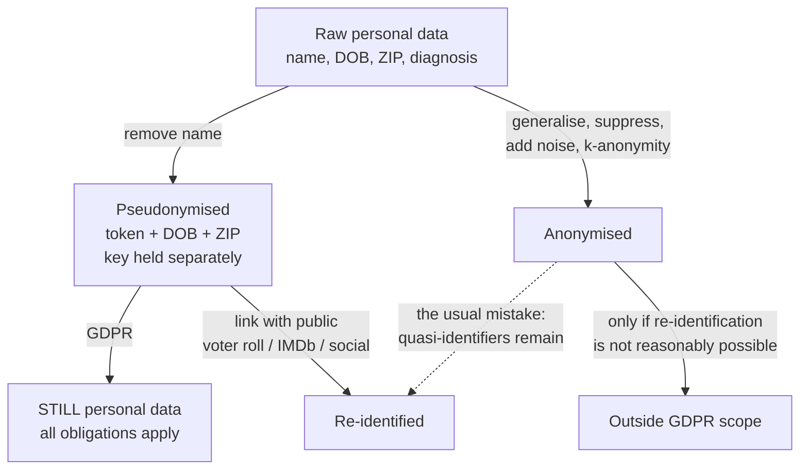
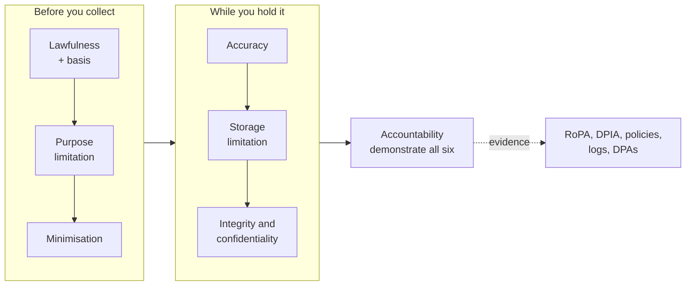
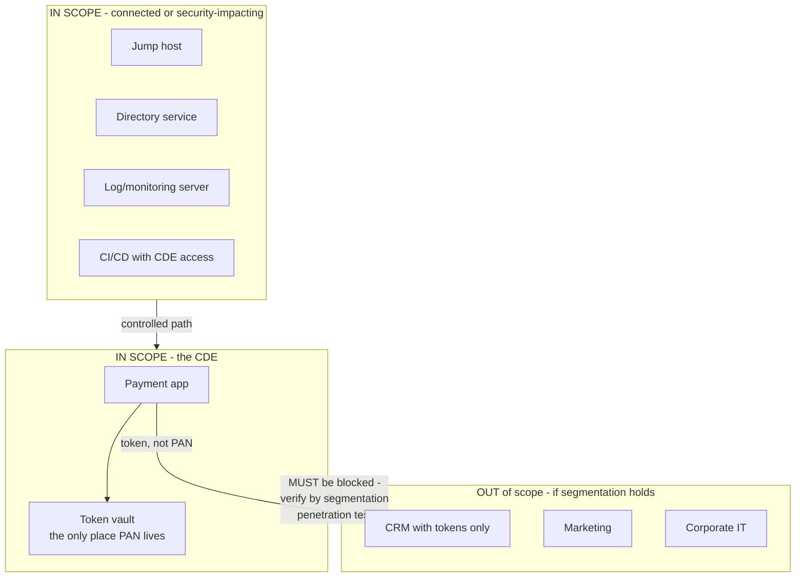
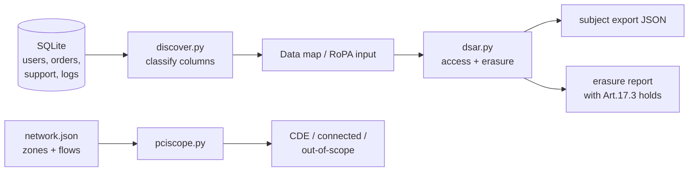

**Level:** Advanced · **Track:** GRC & Architecture · **Read time:** 260 min

This chapter closes the GRC & Architecture notebook, and it closes it on the topic that most reliably turns a security decision into a legal one. Chapter 1 gave the governance vocabulary, Chapter 2 the frameworks, Chapter 3 the risk mathematics, Chapter 4 the architecture, Chapter 5 the identity layer that architecture depends on. Every one of those chapters was, ultimately, about protecting *something*. This chapter is about the cases where the law tells you what that something is, who it belongs to, what you may do with it, and what happens when you get it wrong.

The framing that matters from the first page: **privacy and security are different disciplines that share tooling**. Security asks whether data is protected from unauthorised parties. Privacy asks whether the *authorised* use is legitimate in the first place. A system can be flawlessly secure — encrypted at rest and in transit, zero-trust access, perfect audit trail — and be a serious privacy violation, because it collects biometric data nobody agreed to hand over and retains it forever. Encryption does not make unlawful processing lawful. That gap is where most engineering teams get into trouble, because they reach for a security control when the actual defect is a *purpose* problem.

We will work through three regimes in depth — **GDPR** (broad, principle-driven, extraterritorial), **HIPAA** (sector-specific to US healthcare), and **PCI DSS** (contractual rather than statutory, extremely prescriptive) — because between them they cover the three shapes that every other regime imitates. Then we build the engineering: data discovery, subject-rights pipelines, retention enforcement, de-identification, and scope reduction.

## Why This Matters

The financial argument is easy to make and, on its own, slightly misleading. GDPR fines have reached genuinely material scale: €1.2 billion against Meta in 2023 for transfers to the US, €746 million against Amazon in 2021, €345 million against TikTok over children's data. Under HIPAA, Anthem's 2018 settlement was $16 million; Advocate Health paid $5.55 million. PCI DSS operates differently — the card brands levy fines on acquiring banks who pass them down, and the real damage is forensic investigation costs, card reissuance, and in the worst case losing the ability to process cards at all.

But the fine is rarely the largest number. The 2017 Equifax breach exposed data on roughly 147 million people and settled for at least $575 million, and that figure sits alongside a chief executive's departure and a permanent change in how the company is regulated. British Airways' 2018 breach — a card-skimming script on the payment page — drew a £20 million penalty after reduction, against remediation and litigation costs that dwarfed it.

For an engineer, the more useful observation is this: **privacy obligations are architectural constraints that arrive late and are extremely expensive to retrofit.** A "delete my account" requirement that surfaces after you have replicated user records into a data warehouse, three caches, a search index, a recommendation model, and eleven months of backups is not a feature request; it is a rebuild. A DPIA that concludes your product cannot lawfully process the data it was designed around does not arrive during design — it arrives during launch review. Understanding these regimes early is what lets you make the cheap decision instead of the expensive one.

## Part 1: Privacy Is Not Security

Hold the distinction precisely, because the vocabulary of the rest of the chapter depends on it.

| | Security | Privacy |
|---|---|---|
| Core question | Is data protected from unauthorised access? | Is this use of data legitimate? |
| Concerned with | Confidentiality, integrity, availability | Purpose, necessity, transparency, individual control |
| Adversary | External attacker, malicious insider | Often the organisation itself |
| Typical control | Encryption, access control, monitoring | Consent, minimisation, retention limits, DPIA |
| Failure looks like | Breach | Over-collection, opaque use, no deletion path |
| Can you have it alone? | Yes — secure and privacy-violating | **No** — privacy requires security |

The relationship is asymmetric and worth stating explicitly: **you cannot have privacy without security, but you can absolutely have security without privacy.** Every major privacy law therefore contains a security requirement (GDPR Article 32, the HIPAA Security Rule), but the reverse is not true — no security standard obliges you to stop collecting data you do not need.

Where they meet is where engineering happens. Both need to know **where the data is** (discovery and mapping). Both need **access control**, though privacy adds purpose limitation on top of identity. Both need **deletion**, though security cares about secure erasure while privacy cares about whether the retention period ended. Both need **logging**, though privacy logs are themselves personal data with their own retention limit — a subtlety that catches teams who build a beautiful immutable audit log and then discover they cannot honour an erasure request against it.

## Part 2: The Vocabulary — Personal Data, PII, and the Anonymisation Trap

**Personal data** (GDPR Article 4) is any information relating to an identified or identifiable natural person. The scope is much wider than intuition suggests: it includes IP addresses, cookie identifiers, device fingerprints, advertising IDs, and location traces — anything that can single someone out, directly or in combination.

**PII** (Personally Identifiable Information) is the older US-centric term, and it is narrower and vaguer. Do not treat the two as synonyms in a compliance conversation; GDPR's definition catches data most people would not call PII.

**Special category data** (GDPR Article 9) is the high-risk subset: racial or ethnic origin, political opinions, religious or philosophical beliefs, trade union membership, genetic data, biometric data used for identification, health data, sex life or sexual orientation. Processing it is **prohibited by default** and requires both a lawful basis under Article 6 *and* a separate condition under Article 9. Criminal-conviction data (Article 10) has its own stricter regime. The engineering consequence is that "we'll just add a health field" is a much larger decision than it looks.

Now the trap that undoes more designs than any other:

**Pseudonymisation** replaces identifiers with a token while a re-identification key exists somewhere. Pseudonymised data is **still personal data** under GDPR (Recital 26 says so directly), and all obligations still apply. It is a valuable *security* measure and it may reduce risk in a DPIA — it does not remove you from scope.

**Anonymisation** means re-identification is not reasonably possible by anyone, using any reasonably likely means. Truly anonymous data falls outside GDPR entirely. That is why everyone wants to claim it, and why the claim is usually wrong.

The research is unambiguous. Latanya Sweeney showed in 2000 that **87% of the US population is uniquely identified by the combination of ZIP code, date of birth and sex** — three fields nobody thinks of as identifying. She demonstrated it by re-identifying the Governor of Massachusetts in a "de-identified" hospital discharge dataset using a public voter roll. The Netflix Prize dataset, released with names stripped, was de-anonymised by Narayanan and Shmatikov in 2008 by correlating rating patterns against public IMDb reviews. New York City's taxi trip dataset was de-anonymised after a poorly chosen hash of medallion numbers was reversed by brute force. A 2019 Nature Communications study estimated that **99.98% of Americans could be re-identified from any dataset containing 15 demographic attributes**.



The practical rule: **treat "anonymised" as a claim that must be defended, not a label you apply.** The defence involves identifying quasi-identifiers, applying generalisation and suppression to reach a stated k-anonymity threshold, considering what auxiliary datasets an adversary could realistically obtain, and documenting the analysis. If you cannot do that work, you have pseudonymised data and you are still in scope. Saying otherwise in a privacy notice is a misrepresentation with teeth.

## Part 3: Controller and Processor — The Role That Decides Your Obligations

GDPR assigns obligations by role, and getting your role wrong means getting your entire compliance posture wrong.

A **controller** determines the *purposes and means* of processing — the "why" and the "how." A **processor** processes personal data *on behalf of* a controller, following instructions. A **joint controller** situation arises when two parties jointly determine purposes and means.

| | Controller | Processor |
|---|---|---|
| Decides why data is processed | Yes | No |
| Must have a lawful basis | Yes | Inherits from controller |
| Responds to data subject rights | Yes | Assists the controller |
| Notifies the regulator of a breach | Yes, 72 hours | Notifies the controller "without undue delay" |
| Must maintain records (Art. 30) | Yes | Yes, a narrower set |
| Conducts DPIAs | Yes | Assists |
| Directly liable to data subjects | Yes | Yes, for processor-specific duties |

A SaaS vendor processing its customers' end-user data is a processor for that data — and simultaneously a controller for its own customers' account and billing data. Both roles at once is the normal case, not an exception.

The relationship must be governed by a **Data Processing Agreement** (Article 28) with mandatory terms: process only on documented instructions, ensure staff confidentiality, implement Article 32 security, obtain authorisation before engaging sub-processors, assist with data-subject rights and breach notification, and delete or return data at the end of the engagement. Sub-processors matter more than teams expect — your cloud provider, your email service, your analytics vendor and your error-tracking tool are all sub-processors, and your customer's DPA probably obliges you to disclose and gate them.

The role can also shift under you. If a processor starts using customer data for its *own* purposes — training a general model, building an industry benchmark product — it has determined a purpose and has become a controller for that processing, with every controller obligation attached and no lawful basis prepared. This is currently one of the most common ways an AI feature creates a compliance incident.

## Part 4: GDPR — The Seven Principles

Article 5 states seven principles. They are not preamble; regulators fine against them directly, and they are the lens through which every other requirement is read.

1. **Lawfulness, fairness and transparency.** Every processing operation needs a lawful basis (Part 5), must not be unfair or deceptive, and must be explained clearly.
2. **Purpose limitation.** Collect for specified, explicit, legitimate purposes; do not further process in a manner incompatible with them. This is the principle that "we already have the data, let's use it for this new feature" violates.
3. **Data minimisation.** Adequate, relevant, and limited to what is necessary. The default engineering instinct — collect everything, decide later — is a direct violation.
4. **Accuracy.** Keep data accurate and up to date; erase or rectify inaccurate data without delay.
5. **Storage limitation.** Keep in identifiable form no longer than necessary. Requires an actual retention schedule that is actually enforced.
6. **Integrity and confidentiality.** The security principle — this is where Chapters 4 and 5 plug in.
7. **Accountability.** You must be able to **demonstrate** compliance, not merely achieve it. Documentation is a control, not overhead.



Principle 7 deserves emphasis for engineers. "We do the right thing" is not a defence; a Record of Processing Activities, a DPIA, retention configuration and access logs are the artifacts that turn a practice into demonstrable compliance. If it is not documented, in a regulator's eyes it did not happen.

## Part 5: The Six Lawful Bases — and How Consent Really Works

Article 6 provides six lawful bases. You need exactly one per processing purpose, chosen *before* processing starts, and you cannot swap to a different one later because the first became inconvenient.

| Basis | When it fits | Trap |
|---|---|---|
| **Consent** | Optional processing the person can genuinely refuse | Withdrawable at any time, as easily as given |
| **Contract** | Necessary to perform a contract with the data subject | "Necessary" is narrow — not everything in your ToS qualifies |
| **Legal obligation** | EU/member-state law requires it | Must cite the actual law |
| **Vital interests** | Life-or-death | Rare, emergency only |
| **Public task** | Official authority / public interest | Mostly public bodies |
| **Legitimate interests** | Your interest, balanced against the person's rights | Requires a documented balancing test (LIA); unavailable to public authorities in their tasks |

**Consent under GDPR is a high bar.** It must be freely given, specific, informed, and an unambiguous indication by a clear affirmative action. Consequences engineers must build for:

- **No pre-ticked boxes.** Silence and inactivity are not consent.
- **Granular.** Separate consent per purpose. One checkbox for "marketing, analytics and partner sharing" is invalid.
- **Withdrawable as easily as given.** If consent was one click, withdrawal must be roughly one click. Requiring an email to a support address is a violation.
- **Not freely given if bundled.** Making service access conditional on consent to unnecessary processing invalidates it.
- **Demonstrable.** You must be able to show *who* consented to *what*, *when*, and via *which* notice version — which means a consent record with a version pointer, not a boolean column.

Because that bar is high, **legitimate interests is often the better and more honest basis** for things like fraud prevention, network security, and basic product analytics. But it obliges you to run and record a three-part **Legitimate Interests Assessment**: is the interest legitimate, is the processing necessary to achieve it, and does it override the individual's rights and reasonable expectations? Note also that legitimate interests **cannot** be used for special-category data — there you need an Article 9 condition, usually explicit consent.

One more constraint that surprises people: for **cookies and similar device access**, the ePrivacy Directive applies alongside GDPR, and it requires *consent* for anything not strictly necessary — legitimate interests is not available. That is why analytics cookies need a banner while your session cookie does not.

## Part 6: Data Subject Rights and the Engineering Each One Demands

Articles 12–22 grant eight rights. Read them as system requirements, because that is what they are.

| Right | Article | What you must build |
|---|---|---|
| **Information** | 13–14 | Layered privacy notice, versioned, at point of collection |
| **Access** (DSAR) | 15 | Export of all data about a person **across every system**, plus purposes, recipients, retention, and source |
| **Rectification** | 16 | Correction that propagates to downstream copies and recipients |
| **Erasure** ("right to be forgotten") | 17 | Deletion across primaries, replicas, caches, search indexes, analytics, backups, and third parties |
| **Restriction** | 18 | A "hold" state: retain but stop processing — usually a flag every consumer must honour |
| **Portability** | 20 | Structured, commonly used, machine-readable export of data provided by the subject, under consent or contract |
| **Object** | 21 | Opt-out honoured; **absolute** for direct marketing |
| **Not subject to solely automated decisions** | 22 | Human review path for significant automated decisions, plus meaningful explanation |

The deadline is **one month**, extendable by two further months for complex requests if you tell the subject within the first month. It is free unless requests are manifestly unfounded or excessive.

Three engineering realities that dominate the effort:

**Access requires a data map.** You cannot export everything about a person if you do not know every store holding their data. This is why Part 15's discovery work is prerequisite, not optional. A DSAR that misses your logging platform, your CRM, and your support ticketing system is an incomplete response.

**Erasure is a distributed systems problem.** The primary database is the easy part. The hard parts are the search index, the read replicas, the CDN cache, the data warehouse, the ML training set, the third parties you shared with (Article 19 requires you to inform them), and **backups**. Regulators generally accept that you need not restore a backup to delete one record — the accepted approach is to document that backups are not actively processed, ensure deletion is re-applied if a backup is ever restored, and hold a defined backup retention period after which the data ages out. Write that reasoning down; it is exactly the kind of thing Principle 7 expects.

**Erasure is not absolute.** Article 17(3) preserves exemptions — legal obligations to retain (tax records, AML), establishment or defence of legal claims, public-interest archiving. The correct behaviour is *partial* erasure with a documented justification for what is retained, not a blanket refusal and not a blanket delete that destroys records you are legally required to keep.

And a security-critical detail that is easy to get catastrophically wrong: **verify the requester's identity before fulfilling a DSAR.** A social-engineered access request is a data breach that you performed yourself, with a signed receipt. Researchers have repeatedly demonstrated obtaining strangers' data through DSARs at companies that accepted an email address as proof. Verify proportionately — enough to be confident, without demanding a passport scan you then have to protect.

## Part 7: DPIAs, Records of Processing, and the DPO

**Data Protection Impact Assessment** (Article 35) is a structured risk assessment required when processing is *likely to result in a high risk* to individuals — mandatory for systematic and extensive automated evaluation with legal effects, large-scale special-category processing, and large-scale systematic monitoring of public areas. Regulators publish additional trigger lists (new technologies, biometrics, children's data, data matching, invisible processing).

A DPIA must contain a systematic description of the processing and its purposes, an assessment of necessity and proportionality, an assessment of risks to rights and freedoms, and the measures to address them. If residual risk stays high after mitigation, you must consult the supervisory authority *before* processing.

The most valuable thing about a DPIA is **when** it happens: at design time, when changing the design is cheap. A DPIA run after launch is a documentation exercise. A DPIA run during design is the thing that stops you building a feature you cannot lawfully ship — and it is the natural place for Chapter 4's threat modelling and Chapter 3's risk quantification to feed in. Notebook 45 develops the threat-modelling side of this in depth; the privacy variant asks the same structured questions with "harm to the individual" rather than "harm to the business" as the loss.

**Records of Processing Activities** (Article 30) is the inventory: purposes, categories of data subjects and data, recipients, transfers, retention periods, and security measures. Required for organisations with 250+ employees, and in practice for nearly everyone else too, since the exemption evaporates whenever processing is non-occasional or involves special-category data. The RoPA is the first document a regulator asks for, and it is the natural output of the data-mapping exercise in Part 15 — build it from discovery rather than from a survey, or it will be fiction within a quarter.

A **Data Protection Officer** (Articles 37–39) is mandatory for public authorities, for large-scale regular and systematic monitoring, and for large-scale special-category processing. The DPO must be independent, report to the highest management level, and cannot be instructed on how to perform the role or penalised for it — which means the DPO generally cannot be the person who also owns the processing decisions, ruling out the CISO or Head of Engineering in most structures.

## Part 8: Breach Notification Under GDPR

A **personal data breach** is a breach of security leading to accidental or unlawful destruction, loss, alteration, unauthorised disclosure of, or access to personal data. Note that **availability** counts: ransomware that encrypts personal data is a breach even if nothing was exfiltrated, and so is an accidental deletion with no backup.

Two clocks, two thresholds:

| Notify | When | Threshold | Timing |
|---|---|---|---|
| Supervisory authority | Art. 33 | Unless **unlikely** to result in a risk to rights and freedoms | **72 hours** from *awareness* |
| Data subjects | Art. 34 | Only if **high risk** to rights and freedoms | "Without undue delay" |

Details that decide real cases:

- The 72 hours runs from **awareness**, meaning reasonable certainty that a breach occurred — not from having a complete picture. Investigation is not a reason to miss it. You may notify in phases (Article 33(4)); a partial notification on time beats a complete one late.
- The clock includes weekends and holidays.
- **Processors notify their controller without undue delay** and have no direct regulator deadline; the controller's clock starts when the processor tells them, which is why DPAs specify aggressive processor notification windows.
- You must **document every breach** internally, including ones you decide not to report, with the reasoning. That register is evidence of Principle 7, and its absence is itself a finding.
- Notification to individuals is not required if the data was rendered unintelligible — for example **properly encrypted with the key uncompromised**. This is the single most concrete regulatory incentive for encryption at rest and the reason the key-management story matters as much as the encryption itself.

## Part 9: International Transfers After Schrems II

Chapter 22 of GDPR restricts transferring personal data outside the EEA. The mechanisms:

- **Adequacy decision** — the Commission has ruled the destination country's protection essentially equivalent (Japan, UK, South Korea, Switzerland, and the US for organisations certified under the EU–US Data Privacy Framework).
- **Standard Contractual Clauses (SCCs)** — Commission-approved contract terms, the workhorse mechanism.
- **Binding Corporate Rules** — intra-group rules, approved by a supervisory authority; heavyweight and slow.
- **Derogations** (Article 49) — explicit consent, contract necessity; narrow and for occasional transfers only.

The 2020 *Schrems II* judgment invalidated Privacy Shield and, more importantly, held that SCCs alone are not automatically sufficient: the exporter must perform a **Transfer Impact Assessment** examining whether the destination country's surveillance laws undermine the protection, and apply **supplementary measures** where they do. This produced the €1.2 billion Meta decision.

For engineers, the practical consequences are architectural rather than legal:

- **Data residency becomes a design constraint.** Region selection, replica placement, and backup destinations become compliance decisions.
- **Remote access is a transfer.** A support engineer in another country viewing EU customer data is a transfer even if the data never moves — this catches global support and on-call rotations constantly.
- **Sub-processor geography matters.** Your vendor's CDN edge nodes, error tracking, and offshore support all count.
- **Strong encryption with keys held in the EEA** is the most defensible supplementary measure, because it means the foreign provider cannot produce intelligible data even under compulsion. Customer-managed keys and confidential computing are the technical expressions of this argument.

## Part 10: HIPAA — Scope, PHI, and the Three Rules

HIPAA (Health Insurance Portability and Accountability Act, 1996) is US federal law governing health information. Two structural differences from GDPR matter immediately.

**It applies to entities, not to data.** Only **covered entities** (health plans, healthcare clearinghouses, and healthcare providers who transmit health information electronically for covered transactions) and their **business associates** are bound. A consumer fitness app that gathers identical health data is generally *not* covered — the data is not less sensitive, the entity is simply outside scope. This is the opposite of GDPR's approach, which follows the data.

**Protected Health Information (PHI)** is individually identifiable health information relating to physical or mental health, provision of care, or payment for care, held by a covered entity or business associate. Electronic PHI is **ePHI**.

Three rules do the work:

**The Privacy Rule** governs use and disclosure. Its central concept is the **minimum necessary** standard — limit uses, disclosures and requests to the minimum needed for the purpose (GDPR's minimisation with a different name). Treatment, Payment and Healthcare Operations ("TPO") are permitted without authorisation; most other disclosures require the individual's written authorisation. It also grants individuals rights of access to their records (within 30 days), amendment, and an accounting of disclosures.

**The Security Rule** applies specifically to ePHI and specifies safeguards in three families:

| Family | Examples |
|---|---|
| **Administrative** | Risk analysis (required), sanction policy, workforce clearance, contingency plan, security awareness |
| **Physical** | Facility access controls, workstation use and security, device and media disposal and reuse |
| **Technical** | Access control with unique user identification, audit controls, integrity controls, person/entity authentication, transmission security |

The famous nuance is **required versus addressable**. "Required" means implement it. "Addressable" — encryption is the notorious example — does **not** mean optional. It means: implement it, or document why it is not reasonable and appropriate in your environment *and* implement an equivalent alternative. Many enforcement actions turn on an organisation treating "addressable" as "we decided not to" with nothing written down. Note also that the **risk analysis is required**, and OCR settlements repeatedly cite its absence or inadequacy as the root finding — the same lesson Chapter 3 taught, arriving via a regulator.

**The Breach Notification Rule** requires notification to affected individuals within **60 days** of discovery, to HHS (immediately for breaches affecting 500 or more individuals, annually for smaller ones), and to prominent media for breaches affecting 500+ residents of a state. There is a **presumption of breach**: an impermissible use or disclosure is assumed to be a breach unless a documented four-factor risk assessment demonstrates a low probability that PHI was compromised. Breaches of 500+ are published on the HHS "Wall of Shame," which is its own incentive.

**Business Associate Agreements** are HIPAA's DPA equivalent and are mandatory before a business associate touches PHI. Since the HITECH Act, business associates are **directly liable** for Security Rule compliance, not merely contractually liable to the covered entity — which means a cloud vendor storing ePHI is on the hook itself.

## Part 11: HIPAA De-identification — Safe Harbor vs Expert Determination

HIPAA is unusually concrete about de-identification, and the two methods it recognises are worth knowing precisely because they illustrate Part 2's problem so cleanly.

**Safe Harbor** — remove **eighteen** specified identifiers and have no actual knowledge that the residual information could identify the individual:

```
1  names                          10 account numbers
2  geographic subdivisions        11 certificate/license numbers
   smaller than a state           12 vehicle identifiers and serial
   (ZIP: keep only first 3        13 device identifiers and serial
    digits, and only if the       14 URLs
    population exceeds 20,000)    15 IP addresses
3  all dates except year          16 biometric identifiers
   (and cap ages 90+ as "90+")       (finger, voice, retinal)
4  telephone numbers              17 full-face photos and comparable
5  fax numbers                       images
6  email addresses                18 any other unique identifying
7  Social Security numbers           number, characteristic, or code
8  medical record numbers
9  health plan beneficiary numbers
```

Look at item 2 and item 3. The ZIP-code and date rules exist because of Sweeney's ZIP + DOB + sex result — Safe Harbor is a direct legislative response to a quasi-identifier attack. That is the clearest illustration in any regulation of research shaping a rule.

**Expert Determination** — a person with appropriate statistical and scientific knowledge applies generally accepted principles and determines the risk of re-identification is *very small*, and documents the methods and results. This permits richer datasets (real dates, finer geography) at the cost of rigour, and it is where k-anonymity, l-diversity and differential privacy actually get applied.

Choose Safe Harbor when you need a defensible bright line and can tolerate the data loss; choose Expert Determination when analytical utility genuinely requires the fields Safe Harbor strips — and budget for the expert.

## Part 12: PCI DSS v4.0 — Cardholder Data and the Twelve Requirements

PCI DSS is different in kind: it is a **contractual** standard imposed by the card brands through acquiring banks, not a statute. You do not get fined by a government; you get fined by your acquirer, or lose the ability to process card payments. It is also the most prescriptive standard in this chapter, which makes it the easiest to test against and the least forgiving of interpretation.

The most important distinction in the whole standard:

| Type | Elements | May you store it after authorisation? |
|---|---|---|
| **Cardholder Data (CHD)** | Primary Account Number (PAN), cardholder name, expiration date, service code | Yes, if protected — PAN must be rendered unreadable |
| **Sensitive Authentication Data (SAD)** | Full track data, CAV2/CVC2/CVV2/CID, PIN and PIN block | **Never** — must not be stored after authorisation, even encrypted |

The CVV rule is absolute. "We encrypt it" is not a defence; storage is simply prohibited. This is the single most common serious PCI finding in home-grown payment code, usually arriving via a debug log or an error-tracking payload that captured the full request body.

The twelve requirements, grouped into six control objectives:

| # | Requirement | Note |
|---|---|---|
| 1 | Install and maintain network security controls | Firewalls/segmentation — also the scope-reduction lever |
| 2 | Apply secure configurations | No vendor defaults; the classic easy finding |
| 3 | Protect stored account data | PAN unreadable: truncation, tokenisation, or strong crypto |
| 4 | Protect CHD with strong cryptography during transmission | TLS over open/public networks |
| 5 | Protect systems from malicious software | Anti-malware, kept current |
| 6 | Develop and maintain secure systems and software | Patching, secure SDLC — Notebooks 45–46 |
| 7 | Restrict access by business need to know | Chapter 5's least privilege |
| 8 | Identify users and authenticate access | **MFA for all access into the CDE** in v4.0 |
| 9 | Restrict physical access | Media handling, destruction |
| 10 | Log and monitor all access | Daily review, 12 months retention, 3 months immediately available |
| 11 | Test security of systems and networks regularly | Quarterly ASV scans, annual pentest, segmentation testing |
| 12 | Support information security with policies and programs | Governance, training, incident response |

**v4.0 changes worth knowing.** The headline is the **customised approach**: instead of following the defined control, an entity may design its own control that meets the stated *customised approach objective*, with a documented targeted risk analysis and validation by a QSA. This is a genuine shift from prescriptive to outcome-based, and it is aimed at mature organisations whose architecture does not fit the defined control. Alongside it: MFA is required for all access into the cardholder data environment (not just remote and not just administrators), client-side script integrity monitoring on payment pages appears explicitly (requirements 6.4.3 and 11.6 — a direct response to Magecart-style skimming, which is exactly what hit British Airways), targeted risk analyses let some frequencies be risk-based rather than fixed, and password minimums rose to 12 characters.

## Part 13: PCI Scope — The Only Strategy That Actually Works

PCI scope covers all system components in the **cardholder data environment (CDE)** — anything that stores, processes or transmits CHD/SAD — *plus* connected-to and security-impacting systems. That second clause is what surprises people: a jump host, a monitoring server, a directory service, or a CI/CD pipeline that can reach the CDE is in scope even though it never touches a PAN.

Since compliance cost scales with scope, **scope reduction is the highest-leverage PCI activity there is**, and there are only three real levers:

**Segmentation.** Isolate the CDE so that other networks cannot reach it. Segmentation is not required by PCI, but without it your *entire* network is in scope — which for most organisations is the difference between a manageable assessment and an impossible one. Segmentation must be verified by penetration testing at least annually (every six months for service providers).

**Tokenisation.** Replace the PAN with a token that has no exploitable value and cannot be reversed without the token vault. If your systems only ever handle tokens, they hold no cardholder data and drop out of scope. The vault becomes a small, intensely protected island.

**Outsourcing the payment page.** Redirect or iframe to a PSP so the PAN never enters your infrastructure at all. This is by far the biggest reduction available to a typical merchant — but note that even with a hosted iframe, requirement 6.4.3 means the *integrity of the page hosting it* still matters, because a script injected into your page can overlay a fake form. "The PSP handles it" is not a complete answer.



**Validation** depends on transaction volume and channel. Merchant levels run from Level 4 (fewest transactions) to Level 1 (over six million card transactions annually, or any merchant that has suffered a breach), where a **Report on Compliance** by a Qualified Security Assessor is required. Lower levels validate with a **Self-Assessment Questionnaire** whose type depends on how you accept payments — SAQ A for fully outsourced e-commerce (around two dozen questions), up to SAQ D (over three hundred). The gap between SAQ A and SAQ D is the tangible payoff for the architecture choices above.

## Part 14: Comparing the Three — and the Wider World

| | GDPR | HIPAA | PCI DSS |
|---|---|---|---|
| Type | Statute (EU) | Statute (US federal) | Contractual (card brands) |
| Scope trigger | Processing personal data of people in the EU | Being a covered entity or business associate | Handling payment card data |
| Data covered | All personal data | PHI / ePHI | CHD and SAD |
| Style | Principle-based, risk-driven | Mixed; Security Rule is flexible | Highly prescriptive (+ v4.0 customised approach) |
| Individual rights | Extensive (8 rights) | Access, amendment, accounting of disclosures | None |
| Breach clock | 72h to regulator | 60 days to individuals | Immediate to brands/acquirer |
| Consent centrality | High (one of six bases) | Authorisation for non-TPO | Not applicable |
| Max penalty | €20m or 4% global turnover | Tiered civil + criminal | Brand fines, loss of processing |
| Assessment artifact | DPIA, RoPA | Risk analysis | SAQ or RoC by QSA |

**India's DPDP Act 2023** matters directly for readers here. It is consent-forward with a "Consent Manager" concept, uses distinct vocabulary (Data Fiduciary for controller, Data Principal for subject, Significant Data Fiduciary for higher-obligation entities), requires notice and purpose limitation, grants access/correction/erasure/grievance rights, requires breach notification to the Data Protection Board and affected principals, imposes strong protections for children's data including a ban on tracking and targeted advertising to children, and carries penalties up to ₹250 crore per instance. It uses a **blacklist** approach to transfers — permitted except to countries the government restricts — which is notably more permissive than GDPR's mechanism-based regime.

Elsewhere: **CCPA/CPRA** in California (opt-out rather than opt-in, a distinct "sale/sharing" concept, and a private right of action for breaches), a growing patchwork of other US state laws, **LGPD** in Brazil and **PIPEDA** in Canada (both close to GDPR in shape), **PIPL** in China (strict localisation and transfer approval), and sectoral regimes such as **GLBA** for US financial services, **FERPA** for education, and **COPPA** for children under 13.

The strategic advice is the same one Chapter 2 gave about frameworks: **build one control set and map it to many regimes.** Encryption, access control, retention enforcement, breach response, and vendor management appear in every regime with different names. Implement once, map many, and keep the mapping as an artifact — it is what turns the next new regulation into a gap analysis rather than a programme.

## Part 15: Privacy Engineering — Building It In

Everything above becomes engineering here.

**Privacy by Design and by Default** (Article 25) is a legal requirement, not a philosophy. "By default" is the sharper half: without any action by the user, only the personal data necessary for each specific purpose is processed. A profile that defaults to public, an analytics toggle that defaults to on, a location permission requested at install — each is a by-default violation.

**Data minimisation in practice** is a set of concrete engineering habits:

- Do not collect a field because it *might* be useful. That is purpose limitation and minimisation violated together.
- Prefer derived answers to raw data: store `over_18: true` rather than a date of birth; store a coarse region rather than precise coordinates.
- Truncate at the edge — hash or drop the last octet of IP addresses in analytics.
- Aggregate early, and keep the aggregate rather than the events.
- **Audit your logs.** Logs are where personal data accumulates invisibly: full request bodies, query strings with identifiers, stack traces containing user objects, and error-tracking payloads. This is also, in a PCI environment, the classic route by which CVV ends up stored.

**Retention and deletion.** A retention schedule that exists only as a policy document is not a control. Enforcement mechanisms, in rough order of reliability: database TTL/partition drop, object-storage lifecycle rules, scheduled purge jobs with alerting on failure, and — the one people forget — **cascade deletion into derived stores**, because deleting the row while the warehouse copy persists satisfies nobody.

**Data discovery and mapping** is the prerequisite for DSARs, RoPA, retention and breach scoping alike. The techniques stack: schema and column-name inspection (cheap, catches the obvious), content pattern matching (regex for emails, national IDs, PANs), statistical classification for free-text columns, and — the essential one — validation checks such as the Luhn algorithm for card numbers, which turn a noisy regex into a usable signal. This must be **continuous**, because a manual survey is out of date the day a new service ships.

**Privacy-enhancing technologies**, from most to least practical today:

| PET | What it does | Realistic use |
|---|---|---|
| Tokenisation | Replaces value with a non-reversible token | PCI scope reduction — mature, deploy it |
| Field-level encryption | Encrypts specific columns with separate keys | Limits blast radius, supports Art. 34 defence |
| k-anonymity / l-diversity | Generalise and suppress so each record is indistinguishable from k−1 others | Dataset release; weak against auxiliary data |
| **Differential privacy** | Adds calibrated noise so any single individual's presence is statistically undetectable | Aggregate statistics and telemetry; used in the US Census and by Apple/Google |
| Secure multi-party computation | Joint computation without revealing inputs | Cross-org analytics; expensive |
| Homomorphic encryption | Compute directly on ciphertext | Narrow, still slow |
| Synthetic data | Statistically similar generated data | Test environments — but verify it does not memorise real records |

Differential privacy is the one worth understanding conceptually because it is the only technique in that list with a **formal, provable guarantee** rather than a heuristic one. The privacy budget ε quantifies exactly how much any individual's data can influence the output; smaller ε means more noise and stronger privacy. Its limitation is equally formal: the budget is consumed across queries, so an analyst asking enough questions exhausts it, and the system must then refuse.

**Consent management and dark patterns.** Regulators have moved decisively against manipulative consent interfaces. The rules that now get enforced: "Reject All" must be as prominent and as few clicks as "Accept All"; non-essential cookies must not be set before consent; legitimate-interest toggles pre-set to on for advertising have been repeatedly struck down; and consent must be re-obtainable, versioned, and auditable. Build a consent record with subject, purpose, timestamp, notice version, and method — and make every downstream consumer check it, because consent that the analytics pipeline ignores is not consent.

## Part 16: Hands-On Lab — Discovery, DSAR Pipeline, and PCI Scope

### 16.1 What we are building

Three tools mapping to the chapter's three regimes:

1. **`discover.py`** — a PII/PHI/CHD discovery scanner with Luhn validation (Parts 2, 12, 15).
2. **`dsar.py`** — access and erasure across multiple stores, with legal-hold exemptions (Part 6).
3. **`pciscope.py`** — a segmentation-aware scope analyser (Part 13).



Python 3 only, no external services.

### 16.2 Build a realistic dataset

```bash
mkdir -p ~/privacy-lab && cd ~/privacy-lab
python3 - <<'PY'
import sqlite3
db = sqlite3.connect("app.db"); c = db.cursor()
c.executescript("""
CREATE TABLE users(
  id INTEGER PRIMARY KEY, full_name TEXT, email TEXT, dob TEXT,
  postcode TEXT, phone TEXT, marketing_consent INTEGER, created TEXT);
CREATE TABLE orders(
  id INTEGER PRIMARY KEY, user_id INTEGER, amount REAL,
  card_number TEXT, cvv TEXT, placed TEXT);
CREATE TABLE support_tickets(
  id INTEGER PRIMARY KEY, user_id INTEGER, subject TEXT, body TEXT);
CREATE TABLE app_logs(
  id INTEGER PRIMARY KEY, ts TEXT, level TEXT, message TEXT);
CREATE TABLE invoices(
  id INTEGER PRIMARY KEY, user_id INTEGER, total REAL, issued TEXT);
""")
c.executemany("INSERT INTO users VALUES (?,?,?,?,?,?,?,?)", [
 (1,"Asha Menon","asha@example.com","1991-04-12","560001","+919876500001",1,"2024-02-01"),
 (2,"Ravi Kumar","ravi@example.com","1988-11-30","110001","+919876500002",0,"2023-06-15"),
 (3,"Lin Wei","lin@example.net","1995-07-22","400001","+919876500003",1,"2025-01-09")])
c.executemany("INSERT INTO orders VALUES (?,?,?,?,?,?)", [
 (1,1,2499.00,"4111111111111111","123","2025-03-02"),
 (2,2, 899.50,"5500005555555559","456","2025-03-11"),
 (3,1,1250.00,"4111111111111111","123","2025-04-19")])
c.executemany("INSERT INTO support_tickets VALUES (?,?,?,?)", [
 (1,1,"Refund","Please refund order 1, my email is asha@example.com"),
 (2,3,"Login","Cannot log in, phone +919876500003")])
c.executemany("INSERT INTO app_logs VALUES (?,?,?,?)", [
 (1,"2025-03-02T10:01:00","INFO","checkout user=asha@example.com ip=203.0.113.9"),
 (2,"2025-03-02T10:01:02","ERROR","payment failed pan=4111111111111111 cvv=123"),
 (3,"2025-03-02T10:05:00","INFO","health ok")])
c.executemany("INSERT INTO invoices VALUES (?,?,?,?)", [
 (1,1,2499.00,"2025-03-02"), (2,2,899.50,"2025-03-11")])
db.commit(); db.close()
print("app.db created")
PY

# Sample output:
# app.db created
```

Two deliberate violations are planted: `orders.cvv` stores SAD (Part 12 — never permitted), and `app_logs` contains a PAN and a CVV in plaintext (Part 15's logging problem).

### 16.3 The discovery scanner

```python
# discover.py -- classify every column by regulated data type.
import re, sqlite3, sys, json
from collections import defaultdict

PATTERNS = {
  "EMAIL":    (re.compile(r"[\w.+-]+@[\w-]+\.[\w.]+"),            "PII"),
  "PHONE":    (re.compile(r"\+?\d{1,3}[\s-]?\d{9,10}\b"),         "PII"),
  "DOB":      (re.compile(r"\b(19|20)\d{2}-\d{2}-\d{2}\b"),       "PII/QUASI-ID"),
  "POSTCODE": (re.compile(r"\b\d{6}\b"),                          "QUASI-ID"),
  "IP":       (re.compile(r"\b(?:\d{1,3}\.){3}\d{1,3}\b"),        "PII"),
  "PAN":      (re.compile(r"\b(?:\d[ -]*?){13,19}\b"),            "CHD"),
  "CVV_COL":  (re.compile(r"^(cvv|cvc|cav2|cid)$", re.I),         "SAD"),
}

def luhn(num: str) -> bool:
    """Card numbers satisfy Luhn. This turns a noisy regex into a real signal."""
    d = [int(x) for x in re.sub(r"\D", "", num)]
    if not 13 <= len(d) <= 19: return False
    s, alt = 0, False
    for x in reversed(d):
        if alt:
            x *= 2
            if x > 9: x -= 9
        s += x; alt = not alt
    return s % 10 == 0

def scan(path):
    db = sqlite3.connect(path); db.row_factory = sqlite3.Row
    tables = [r[0] for r in db.execute(
        "SELECT name FROM sqlite_master WHERE type='table'")]
    findings = defaultdict(list)
    for t in tables:
        cols = [r["name"] for r in db.execute(f"PRAGMA table_info({t})")]
        rows = db.execute(f"SELECT * FROM {t} LIMIT 500").fetchall()
        for col in cols:
            hits = defaultdict(int)
            # Column-name signal: CVV must never exist at all (PCI 3.3.1).
            if PATTERNS["CVV_COL"][0].match(col):
                hits["SAD"] += len(rows)
            for r in rows:
                v = r[col]
                if v is None: continue
                v = str(v)
                for label, (rx, cls) in PATTERNS.items():
                    if label == "CVV_COL": continue
                    m = rx.search(v)
                    if not m: continue
                    if label == "PAN" and not luhn(m.group()):
                        continue            # reject false positives
                    hits[cls] += 1
            for cls, n in hits.items():
                findings[t].append((col, cls, n))
    return findings

SEVERITY = {"SAD": "CRITICAL", "CHD": "HIGH", "PII": "MEDIUM",
            "PII/QUASI-ID": "MEDIUM", "QUASI-ID": "LOW"}

if __name__ == "__main__":
    f = scan(sys.argv[1] if len(sys.argv) > 1 else "app.db")
    print(f"{'SEVERITY':<9} {'TABLE':<16} {'COLUMN':<14} {'CLASS':<14} HITS")
    print("-" * 68)
    order = ["CRITICAL", "HIGH", "MEDIUM", "LOW"]
    rows = [(SEVERITY[c], t, col, c, n)
            for t, items in f.items() for col, c, n in items]
    for sev, t, col, c, n in sorted(rows, key=lambda r: (order.index(r[0]), r[1])):
        print(f"{sev:<9} {t:<16} {col:<14} {c:<14} {n}")
    print("-" * 68)
    crit = sum(1 for r in rows if r[0] == "CRITICAL")
    print(f"{len(rows)} classified columns, {crit} CRITICAL")
    sys.exit(1 if crit else 0)
```

```bash
python3 discover.py app.db

# Sample output:
# SEVERITY  TABLE            COLUMN         CLASS          HITS
# --------------------------------------------------------------------
# CRITICAL  app_logs         message        SAD            1
# CRITICAL  orders           cvv            SAD            3
# HIGH      app_logs         message        CHD            1
# HIGH      orders           card_number    CHD            3
# MEDIUM    app_logs         message        PII            2
# MEDIUM    support_tickets  body           PII            2
# MEDIUM    users            dob            PII/QUASI-ID   3
# MEDIUM    users            email          PII            3
# MEDIUM    users            phone          PII            3
# MEDIUM    users            full_name      PII            0
# LOW       users            postcode       QUASI-ID       3
# --------------------------------------------------------------------
# 11 classified columns, 2 CRITICAL
```

Both planted violations surface, and the Luhn check keeps the six-digit postcodes out of the PAN class — which a naïve digit regex would have flagged. Note `users.dob` plus `users.postcode`: on their own they look harmless, and together they are Sweeney's re-identification pair.

### 16.4 The DSAR pipeline

```python
# dsar.py -- Article 15 access and Article 17 erasure across stores.
import sqlite3, json, sys, re
from datetime import datetime, timezone

# Where a subject's data lives. Built from discover.py output -- this IS the data map.
MAP = {
  "users":           {"key": "id",      "mode": "erase"},
  "orders":          {"key": "user_id", "mode": "erase"},
  "support_tickets": {"key": "user_id", "mode": "erase"},
  # Art. 17(3)(b): retained under a legal obligation (tax). Pseudonymise, do not delete.
  "invoices":        {"key": "user_id", "mode": "retain",
                      "reason": "Art.17(3)(b) tax retention - 7 years"},
}
# Free-text stores have no foreign key: match on identifiers instead.
TEXT_STORES = {"app_logs": "message"}

def connect(p):
    db = sqlite3.connect(p); db.row_factory = sqlite3.Row; return db

def verify(db, uid, email):
    """Part 6: NEVER fulfil a DSAR without verifying the requester."""
    r = db.execute("SELECT email FROM users WHERE id=?", (uid,)).fetchone()
    return bool(r) and r["email"].lower() == email.lower()

def access(db, uid):
    out = {"subject_id": uid,
           "generated": datetime.now(timezone.utc).isoformat(), "data": {}}
    for t, cfg in MAP.items():
        rows = db.execute(f"SELECT * FROM {t} WHERE {cfg['key']}=?", (uid,)).fetchall()
        out["data"][t] = [dict(r) for r in rows]
    email = db.execute("SELECT email FROM users WHERE id=?", (uid,)).fetchone()["email"]
    for t, col in TEXT_STORES.items():
        rows = db.execute(f"SELECT * FROM {t} WHERE {col} LIKE ?",
                          (f"%{email}%",)).fetchall()
        out["data"][t] = [dict(r) for r in rows]
    return out

def erase(db, uid):
    email = db.execute("SELECT email FROM users WHERE id=?", (uid,)).fetchone()["email"]
    report = []
    for t, cfg in MAP.items():
        n = db.execute(f"SELECT COUNT(*) FROM {t} WHERE {cfg['key']}=?",
                       (uid,)).fetchone()[0]
        if cfg["mode"] == "erase":
            db.execute(f"DELETE FROM {t} WHERE {cfg['key']}=?", (uid,))
            report.append((t, "ERASED", n, ""))
        else:
            report.append((t, "RETAINED", n, cfg["reason"]))
    for t, col in TEXT_STORES.items():
        rows = db.execute(f"SELECT id,{col} FROM {t} WHERE {col} LIKE ?",
                          (f"%{email}%",)).fetchall()
        for r in rows:                      # redact in place, keep the log line
            db.execute(f"UPDATE {t} SET {col}=? WHERE id=?",
                       (re.sub(re.escape(email), "[ERASED]", r[col]), r["id"]))
        report.append((t, "REDACTED", len(rows), "log integrity preserved"))
    db.commit()
    return report

if __name__ == "__main__":
    action, uid, email = sys.argv[1], int(sys.argv[2]), sys.argv[3]
    db = connect("app.db")
    if not verify(db, uid, email):
        print("REFUSED: identity verification failed"); sys.exit(2)
    if action == "access":
        print(json.dumps(access(db, uid), indent=1)[:900] + "\n ... truncated")
    else:
        print(f"{'STORE':<17} {'ACTION':<10} {'ROWS':<6} NOTE")
        print("-" * 74)
        for t, a, n, note in erase(db, uid):
            print(f"{t:<17} {a:<10} {n:<6} {note}")
        print("-" * 74)
        print("downstream: search index, warehouse, CDN cache, processors (Art.19)")
```

```bash
# Identity verification must come first.
python3 dsar.py access 1 wrong@example.com

# Sample output:
# REFUSED: identity verification failed
```

```bash
python3 dsar.py access 1 asha@example.com

# Sample output:
# {
#  "subject_id": 1,
#  "generated": "2027-05-22T04:11:07.884213+00:00",
#  "data": {
#   "users": [
#    {
#     "id": 1,
#     "full_name": "Asha Menon",
#     "email": "asha@example.com",
#     "dob": "1991-04-12",
#     "postcode": "560001",
#     "phone": "+919876500001",
#     "marketing_consent": 1,
#     "created": "2024-02-01"
#    }
#   ],
#   "orders": [
#    {
#     "id": 1,
#     "user_id": 1,
#  ... truncated
```

```bash
python3 dsar.py erase 1 asha@example.com

# Sample output:
# STORE             ACTION     ROWS   NOTE
# --------------------------------------------------------------------------
# users             ERASED     1
# orders            ERASED     2
# support_tickets   ERASED     1
# invoices          RETAINED   1      Art.17(3)(b) tax retention - 7 years
# app_logs          REDACTED   2      log integrity preserved
# --------------------------------------------------------------------------
# downstream: search index, warehouse, CDN cache, processors (Art.19)
```

This is the shape a real erasure takes: **not a uniform delete**. Transactional records go, the invoice stays under a cited exemption, and log lines are redacted rather than removed so the audit trail survives — each decision defensible in writing, which is Principle 7 in action.

### 16.5 The PCI scope analyser

```json
// network.json -- zones and permitted flows
{
  "zones": {
    "cde":      {"systems": ["pay-app-01", "token-vault-01"], "handles_chd": true},
    "mgmt":     {"systems": ["jump-01", "siem-01"],           "handles_chd": false},
    "corp":     {"systems": ["crm-01", "hr-01"],              "handles_chd": false},
    "dmz":      {"systems": ["web-01"],                       "handles_chd": false}
  },
  "flows": [
    {"from": "mgmt", "to": "cde",  "ports": [22, 443], "note": "admin + log ship"},
    {"from": "dmz",  "to": "cde",  "ports": [443],     "note": "checkout redirect"},
    {"from": "corp", "to": "cde",  "ports": [443],     "note": "UNSEGMENTED - finding"},
    {"from": "cde",  "to": "corp", "ports": [443],     "note": "tokens only"}
  ]
}
```

```python
# pciscope.py -- classify every zone as CDE / connected-to / out-of-scope.
import json, sys

def analyse(cfg):
    zones = cfg["zones"]
    cde = {z for z, v in zones.items() if v["handles_chd"]}
    # "Connected-to or security-impacting": anything that can initiate INTO the CDE.
    connected = {f["from"] for f in cfg["flows"] if f["to"] in cde} - cde
    out = set(zones) - cde - connected
    return cde, connected, out

if __name__ == "__main__":
    cfg = json.load(open(sys.argv[1] if len(sys.argv) > 1 else "network.json"))
    cde, conn, out = analyse(cfg)
    total = sum(len(v["systems"]) for v in cfg["zones"].values())
    inscope = sum(len(cfg["zones"][z]["systems"]) for z in cde | conn)

    for label, zs in (("CDE (in scope)", cde), ("CONNECTED-TO (in scope)", conn),
                      ("OUT OF SCOPE", out)):
        print(f"\n{label}")
        for z in sorted(zs):
            print(f"  {z:<8} {', '.join(cfg['zones'][z]['systems'])}")

    print(f"\nScope: {inscope}/{total} systems "
          f"({inscope*100//total}% of the estate)")
    print("\nFINDINGS")
    for f in cfg["flows"]:
        if f["to"] in cde and f["from"] == "corp":
            print(f"  HIGH  corp -> cde on {f['ports']}: general corporate network "
                  f"reaches the CDE. This pulls all of corp into scope.")
            print(f"        FIX: remove the flow, or broker it through mgmt. "
                  f"Verify by segmentation penetration test (Req 11.4.5).")
```

```bash
python3 pciscope.py network.json

# Sample output:
#
# CDE (in scope)
#   cde      pay-app-01, token-vault-01
#
# CONNECTED-TO (in scope)
#   corp     crm-01, hr-01
#   dmz      web-01
#   mgmt     jump-01, siem-01
#
# OUT OF SCOPE
#
# Scope: 7/7 systems (100% of the estate)
#
# FINDINGS
#   HIGH  corp -> cde on [443]: general corporate network reaches the CDE. This pulls all of corp into scope.
#         FIX: remove the flow, or broker it through mgmt. Verify by segmentation penetration test (Req 11.4.5).
```

Remove the offending flow and re-run:

```bash
python3 - <<'PY'
import json
c = json.load(open("network.json"))
c["flows"] = [f for f in c["flows"] if not (f["from"]=="corp" and f["to"]=="cde")]
json.dump(c, open("network-fixed.json","w"), indent=2)
PY
python3 pciscope.py network-fixed.json | tail -12

# Sample output:
# OUT OF SCOPE
#   corp     crm-01, hr-01
#
# Scope: 5/7 systems (71% of the estate)
#
# FINDINGS
```

One firewall rule moved two systems out of scope. At real scale that is the difference between SAQ D and SAQ A, and it is why Part 13 called segmentation the highest-leverage activity in PCI.

### 16.6 Extending the lab

Add a retention enforcer that deletes rows older than a per-table schedule and reports what it removed; add a consent-versioned table and make the marketing export refuse to include a subject whose consent version predates the current notice; implement Safe Harbor de-identification over `users` (generalise `postcode` to three digits, `dob` to year, cap 90+) and then attempt re-identification against a synthetic "voter roll" to see the quasi-identifier problem first-hand; add k-anonymity measurement and report the smallest equivalence class; and wire `discover.py` into CI so a new column containing SAD fails the build.

## Part 17: The Offensive and Defensive View

Regulated data changes the attacker's calculus, and the defender's.

**From the offensive side** (Notebooks 10, 21–27), a penetration test or bug bounty engagement touching regulated data has hard rules. Do not exfiltrate real personal data to prove impact — screenshot a redacted record, report the count, and stop. Accessing a stranger's PHI is a HIPAA violation regardless of your authorisation to test, and unnecessary exfiltration during an authorised test can itself trigger breach notification. Scope agreements should say explicitly what happens if regulated data is encountered.

**IDOR is a privacy incident, not just a bug.** An enumerable identifier exposing other users' records is simultaneously a broken-object-level-authorization finding (Part 1 of Chapter 5) and an unlawful disclosure with a 72-hour clock attached. Report it with that framing and it gets fixed faster.

**The DSAR itself is an attack surface.** A weakly verified access request is exfiltration performed by the target's own compliance team. Test it: submit a DSAR for an account you do not own and see what happens.

**From the defensive side** (Notebooks 31–34), the regulatory clock reshapes incident response. Detection engineering should tag data stores by classification so an alert answers "was regulated data involved" immediately — that determination drives the 72-hour and 60-day clocks. The incident response plan needs privacy and legal in the loop from the first hour, not after containment. And **encryption with uncompromised keys is a documented off-ramp** from individual notification under GDPR Article 34 and a factor in HIPAA's four-factor assessment — which means the ability to *prove* the data was encrypted and the keys were not exposed is worth building deliberately, with key-access logging as evidence.

## Part 18: Common Pitfalls

**Treating privacy as a security problem.** Encrypting data you had no lawful basis to collect solves nothing.

**Claiming anonymisation without doing the work.** Stripping names leaves quasi-identifiers. If you cannot show the analysis, you have pseudonymised data and remain fully in scope.

**Consent as the default lawful basis.** It is the hardest to obtain validly and the easiest to withdraw. Legitimate interests, documented with an LIA, is often more honest and more robust.

**A retention policy with no enforcement.** The document is not the control. Show the TTL, the lifecycle rule, or the purge job — and the alert when it fails.

**Forgetting derived and downstream copies.** Warehouses, search indexes, caches, ML training sets, and third parties. Article 19 requires informing recipients of erasure; most teams have no list of recipients.

**Personal data in logs.** The most common accidental store, invisible until discovery runs. In PCI environments this is also how SAD gets stored despite an absolute prohibition.

**Fulfilling DSARs without identity verification.** Self-inflicted data breach.

**Treating HIPAA "addressable" as optional.** It means implement, or document why not *and* implement an equivalent. Undocumented omission is the finding.

**Storing CVV.** Ever. Encrypted does not help. Check your logs, your error tracker, and your payment debug code today.

**Assuming a hosted payment page ends PCI obligations.** Requirement 6.4.3 makes the integrity of the page hosting the iframe your problem — that is precisely how Magecart-style skimming works.

**Ignoring transfers.** Remote access from another country is a transfer. So are your sub-processors' locations.

**No breach register for unreported breaches.** GDPR requires documenting every breach including the ones you decided not to report, with the reasoning.

## Final Revision / Summary

- **Privacy and security are different.** Security asks whether data is protected; privacy asks whether the use is legitimate. You can be perfectly secure and seriously non-compliant. Privacy requires security; security does not require privacy.
- **Personal data is broader than PII** and includes IP addresses, cookie IDs and device fingerprints. **Special-category data** is prohibited by default and needs both an Article 6 basis and an Article 9 condition.
- **Pseudonymised data is still personal data.** True anonymisation is hard: ZIP + DOB + sex identifies 87% of Americans; Netflix and NYC taxi datasets were both re-identified. Treat "anonymised" as a claim you must defend.
- **Controller vs processor decides your obligations.** Most SaaS companies are both at once. A processor that starts using data for its own purposes has silently become a controller — the current failure mode of AI features.
- GDPR's **seven principles**: lawfulness, purpose limitation, minimisation, accuracy, storage limitation, integrity/confidentiality, and **accountability** — you must be able to *demonstrate* compliance.
- **Six lawful bases**, one per purpose, chosen before processing. Consent must be freely given, specific, informed, unambiguous, granular, and as easy to withdraw as to give. Legitimate interests needs a documented LIA and cannot cover special-category data. Cookies need consent under ePrivacy regardless.
- **Eight data subject rights**, one-month deadline. Access needs a data map; erasure is a distributed-systems problem covering replicas, caches, indexes, warehouses, backups and third parties; erasure is **not absolute** (Art. 17(3)); and **always verify the requester's identity**.
- **DPIA** at design time for high-risk processing; **RoPA** is the inventory a regulator asks for first; a **DPO** must be independent and cannot be the person owning the processing decisions.
- **Breach: 72 hours to the regulator from awareness** (phased notification is allowed), individuals only on high risk, availability loss counts, and **document even the breaches you do not report**.
- **Transfers** need adequacy, SCCs, or BCRs; post-*Schrems II* SCCs require a transfer impact assessment and supplementary measures. Remote access is a transfer. EEA-held keys are the strongest technical measure.
- **HIPAA applies to entities, not data.** PHI, three rules (Privacy, Security, Breach Notification), minimum necessary, required vs **addressable** (which is not optional), mandatory BAAs, 60-day notification, presumption of breach. **Risk analysis is required** and its absence is the most-cited finding.
- **De-identification**: Safe Harbor strips 18 identifiers (the ZIP and date rules are a direct answer to quasi-identifier attacks); Expert Determination allows richer data with documented statistical rigour.
- **PCI DSS is contractual and prescriptive.** CHD may be stored if protected; **SAD (CVV, track, PIN) may never be stored after authorisation**. Twelve requirements; v4.0 adds the **customised approach**, MFA for all CDE access, and payment-page script integrity monitoring.
- **PCI scope reduction is the highest-leverage activity**: segmentation (verified by penetration test), tokenisation, and outsourcing the payment page — moving you from SAQ D toward SAQ A.
- **Build one control set, map to many regimes.** GDPR, HIPAA, PCI, DPDP, CCPA and the rest share encryption, access control, retention, breach response and vendor management under different names.
- **Privacy engineering**: privacy by default, minimisation as a habit (derive rather than store, truncate, aggregate, audit your logs), enforced retention, continuous discovery, and PETs — with **differential privacy** the only one offering a formal guarantee.

## Cheat Sheet / Quick Reference

**Privacy vs security in one line**

```
security: is data protected from unauthorised access?
privacy:  is this use of data legitimate in the first place?
-> encryption does not make unlawful processing lawful
```

**GDPR seven principles**

```
lawfulness/fairness/transparency | purpose limitation | minimisation
accuracy | storage limitation | integrity+confidentiality | ACCOUNTABILITY
```

**Six lawful bases**

```
consent | contract | legal obligation | vital interests | public task
legitimate interests (needs a documented LIA; not for special category)
```

**Data subject rights and deadlines**

| Right | Build |
|---|---|
| Access | Cross-system export + purposes, recipients, retention |
| Erasure | Delete across replicas, caches, indexes, warehouse, third parties |
| Portability | Machine-readable export (consent/contract basis only) |
| Object | Absolute for direct marketing |

```
deadline: 1 month (+2 for complex, if you say so in month 1)
ALWAYS verify requester identity first
```

**Breach clocks**

```
GDPR  -> regulator   72h from AWARENESS (phased notification allowed)
GDPR  -> individuals without undue delay, only if HIGH risk
         (exempt if properly encrypted and keys uncompromised)
HIPAA -> individuals 60 days; HHS immediately if 500+
PCI   -> brands/acquirer immediately
document EVERY breach, including unreported ones
```

**HIPAA essentials**

```
applies to ENTITIES not data | PHI/ePHI | minimum necessary
3 rules: Privacy | Security (admin/physical/technical) | Breach Notification
"addressable" = implement OR document why not AND do an equivalent
risk analysis is REQUIRED - most-cited finding
BAA mandatory; business associates are directly liable
```

**PCI: the line you must not cross**

```
CHD (PAN, name, expiry, service code)  -> storable if PAN rendered unreadable
SAD (full track, CVV/CVC/CID, PIN)     -> NEVER stored after authorisation
                                          encryption is NOT a defence
```

**PCI scope reduction, in order of impact**

```
1. outsource the payment page (PAN never enters your estate)
   ... but Req 6.4.3 still makes your page's script integrity your problem
2. tokenise (systems hold tokens -> out of scope)
3. segment (verify annually by segmentation penetration test)
scope = CDE + connected-to + security-impacting
```

**Anonymisation reality check**

```
[ ] listed every quasi-identifier (ZIP, DOB, sex, job title, rare attributes)
[ ] stated a k-anonymity threshold and measured it
[ ] considered realistic auxiliary datasets (voter rolls, social, public reviews)
[ ] documented the analysis
if any box is unticked -> it is PSEUDONYMISED and still in scope
```

**Regime comparison**

| | GDPR | HIPAA | PCI DSS |
|---|---|---|---|
| Source | Statute | Statute | Contract |
| Follows | Data | Entity | Card data |
| Style | Principles | Mixed | Prescriptive |
| Rights | 8 | 3 | none |
| Max | €20m / 4% | Tiered | Loss of processing |

## Practice Labs & Resources

**Primary sources — read the actual text**
- GDPR: Articles 4–9 (definitions, principles, bases), 12–22 (rights), 24–35 (obligations, DPIA), 44–49 (transfers). Recital 26 on anonymisation is one paragraph and settles most arguments.
- HIPAA: 45 CFR Parts 160 and 164 — Security Rule at §164.302–318, de-identification at §164.514.
- PCI DSS v4.0 and the *Prioritized Approach* document from the PCI Security Standards Council.
- India's Digital Personal Data Protection Act 2023.
- EDPB guidelines on consent, DPIAs, and supplementary measures for transfers; the Article 29 Working Party opinion on anonymisation techniques.

**Hands-on**
- Extend the lab: retention enforcer, consent-version gating, Safe Harbor de-identification followed by a re-identification attempt against a synthetic voter roll, and k-anonymity measurement.
- Wire `discover.py` into CI so a schema change introducing SAD fails the build.
- Implement differential privacy on a count query with Google's differential privacy library and watch the privacy budget deplete across repeated queries.
- Complete SAQ A and then SAQ D for the same imaginary merchant and count the difference in questions — the clearest possible argument for scope reduction.
- Run a DSAR against yourself at three companies you use. Time the responses, check completeness, and note how they verified you.

**Deliberate practice**
- Write a RoPA entry for one processing activity in a system you know: purpose, lawful basis, categories, recipients, transfers, retention, security measures. The fields you cannot fill are your gaps.
- Run a DPIA on a feature you have built. If it would not have changed the design, you ran it too late.
- Draft a legitimate interests assessment for product analytics and decide honestly whether it survives the balancing test.
- Map your organisation's controls once against GDPR Art. 32, HIPAA Security Rule and PCI Req 3/7/8/10, and see how much overlap is already there.

**Further reading**
- Sweeney, *Simple Demographics Often Identify People Uniquely* (2000).
- Narayanan and Shmatikov, *Robust De-anonymization of Large Sparse Datasets* (2008) — the Netflix Prize paper.
- Rocher, Hendrickx and de Montjoye, *Estimating the success of re-identifications in incomplete datasets* (Nature Communications, 2019).
- Dwork and Roth, *The Algorithmic Foundations of Differential Privacy*.
- NIST Privacy Framework and NIST IR 8053 on de-identification.
- ICO guidance on anonymisation, legitimate interests, and DSARs — unusually practical for a regulator.
- Published decisions: the Meta transfer decision (2023), the British Airways penalty notice (2020), and a handful of HHS OCR settlement summaries. Read each asking which control in this chapter was missing.

---

*Also on [Praneeth's portfolio](https://ping-praneeth.vercel.app/notebook/grc-architecture/06-privacy-data-protection-and-regulations-gdpr-hipaa-pci-dss), with comments and the latest edits.*
