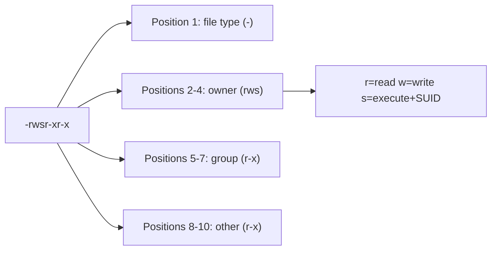
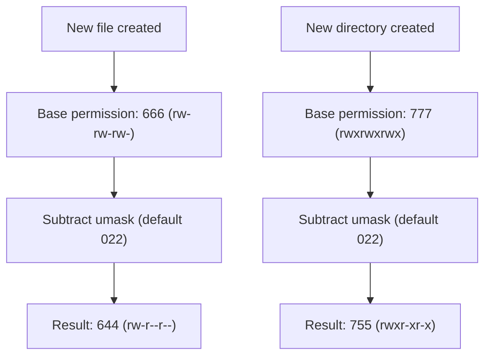
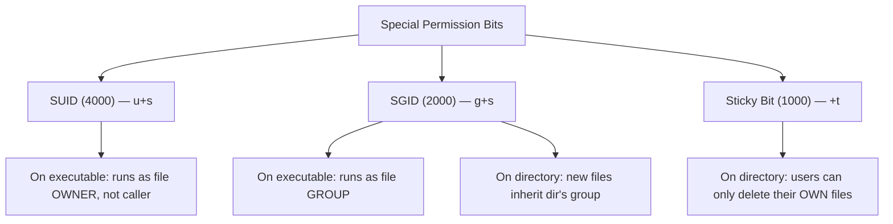

---

## Who This Is For, and Why Permissions Matter

This chapter teaches Linux permissions — arguably the single most exploited misconfiguration category in real-world penetration testing. If you've ever seen a walkthrough end with "we found a SUID binary and got root in two commands," this chapter is where that skill comes from.

Every file and directory on a Linux system carries a permission model that decides who can read it, write it, or execute it. Get this model wrong — even slightly — and you've opened a door. A world-writable configuration file, a misconfigured SUID binary, an overly generous `sudoers` entry, a `chmod 777` slapped on a directory to "just make it work" — these are not hypothetical. They show up constantly in HackTheBox boxes, TryHackMe rooms, real bug bounty reports, and real breach postmortems.

By the end of this chapter you will be able to: read and calculate any permission string on sight, use `chmod` and `chown` fluently in both symbolic and octal notation, understand exactly what SUID, SGID, and the sticky bit do and why they exist, use `umask` to control default permissions, use ACLs for permission models that the classic owner/group/other system can't express, and — critically — hunt for permission-based privilege escalation vectors the way a real penetration tester does.

---

## Part 1: Foundations — The Owner/Group/Other Model

### Why Permissions Exist At All

Linux was designed from day one as a **multi-user** system — many people (or many processes acting on their behalf) sharing one machine. Without a permission system, any user could read your private SSH keys, overwrite another user's homework, or kill another user's processes. Permissions are the referee that enforces "your stuff is yours, my stuff is mine, and some stuff belongs to everybody."

Think of a Linux permission set like a hotel. The **owner** is the person who booked the room and has a key. The **group** is like "hotel staff" — a defined set of people who share some access (housekeeping can enter to clean, but not random guests). **Others** are everyone else — by default, they shouldn't get in at all unless the door is explicitly left unlocked.

### The Three Identities: User, Group, Other

Every file and directory has exactly one **owner** (a user) and exactly one **owning group**. Permissions are then defined for three separate identities:

| Identity | Symbol | Meaning |
|---|---|---|
| User (owner) | `u` | The single user who owns the file |
| Group | `g` | Members of the file's owning group |
| Other | `o` | Everyone else on the system |
| All | `a` | Shorthand for u+g+o combined |

### The Three Permission Types

| Permission | Symbol | Effect on a FILE | Effect on a DIRECTORY |
|---|---|---|---|
| Read | `r` | View file contents | List directory contents (`ls`) |
| Write | `w` | Modify/overwrite/delete file contents | Create, delete, rename files **inside** it |
| Execute | `x` | Run the file as a program/script | **Enter** the directory (`cd`) and access items inside |

> **Key insight that trips up beginners:** directory permissions are not about the directory's own "content" the way file permissions are — they gate whether you can traverse into it (`x`) and whether you can add/remove entries in it (`w`). A file can be world-readable, but if its parent directory lacks `x` for you, you can't reach it at all. This is exactly why some CTF privilege escalation paths hinge on directory permissions rather than file permissions.

### Reading `ls -l` Output

```bash
$ ls -l /etc/shadow /home/praneeth/notes.txt /usr/bin/passwd
-rw-r----- 1 root   shadow   1823 Jul 20 09:14 /etc/shadow
-rw-r--r-- 1 praneeth praneeth  512 Jul 24 08:00 /home/praneeth/notes.txt
-rwsr-xr-x 1 root   root    68208 Feb 10  2026 /usr/bin/passwd
```

Break down the 10-character string `-rwsr-xr-x`:

```
-    rws     r-x     r-x
^     ^       ^       ^
type  owner   group   other
```

- **Position 1** — file type: `-` regular file, `d` directory, `l` symlink, `c` character device, `b` block device, `s` socket, `p` named pipe (FIFO).
- **Positions 2–4** — owner permissions (`rws` = read, write, execute+SUID — more on that `s` shortly).
- **Positions 5–7** — group permissions (`r-x` = read, no write, execute).
- **Positions 8–10** — other permissions (`r-x`).



### Octal (Numeric) Notation

Each permission triad maps to a 3-bit binary number, which collapses to a single octal digit:

| Binary | Octal | Meaning |
|---|---|---|
| `rwx` | 111 | 7 |
| `rw-` | 110 | 6 |
| `r-x` | 101 | 5 |
| `r--` | 100 | 4 |
| `-wx` | 011 | 3 |
| `-w-` | 010 | 2 |
| `--x` | 001 | 1 |
| `---` | 000 | 0 |

**Why it adds up like this:** `r`=4, `w`=2, `x`=1 (powers of two, exactly like binary place values). Add the ones that apply. `rw-` = 4+2 = 6. `r-x` = 4+1 = 5. `rwx` = 4+2+1 = 7.

So `-rwxr-xr--` becomes octal `754`:
- owner `rwx` = 7
- group `r-x` = 5
- other `r--` = 4

**Memory hook:** think of the digit as "how much door is open" — 7 is a door wide open (all three), 0 is a bricked-up wall, and everything else is some partial opening. `chmod 644` (the most common file permission — owner read/write, everyone else read-only) reads instantly once you know 6=rw-, 4=r--.

> **Common defaults to memorize:**
> - `644` — typical file (owner edits, everyone reads)
> - `755` — typical executable/directory (owner full control, everyone else can read+traverse/execute)
> - `600` — private file, owner only (SSH private keys, `.env` files)
> - `700` — private directory, owner only (`~/.ssh`)
> - `777` — everyone can do everything (a huge red flag almost everywhere you see it)

---

## Part 2: chmod — Changing Permissions

`chmod` ("change mode") sets permissions. It supports two syntaxes: **octal** (absolute) and **symbolic** (relative/additive).

### Octal chmod

```bash
chmod 644 notes.txt        # rw-r--r--
chmod 755 script.sh        # rwxr-xr-x
chmod 600 id_rsa           # rw-------
chmod 700 ~/.ssh           # rwx------
chmod -R 755 /var/www/app  # recursive: apply to directory and everything inside
```

Octal notation is **absolute** — you specify the exact final state for all three identities in one shot. This is the fast, precise, scriptable way to set permissions and the one you'll use 90% of the time.

### Symbolic chmod

Symbolic mode uses `who` + `operator` + `permission`:

```
u/g/o/a   +/-/=   r/w/x
```

- `+` adds a permission without touching others
- `-` removes a permission without touching others
- `=` sets exactly this permission, clearing anything not listed

```bash
chmod u+x script.sh       # add execute for owner only
chmod g-w file.txt        # remove write from group
chmod o=r file.txt        # set "other" to exactly read (no write, no exec)
chmod a+r file.txt        # add read for everyone
chmod u+x,g+x script.sh   # multiple targets, comma-separated
chmod +x script.sh        # shorthand: no "who" specified = affects all (subject to umask)
```

**When to reach for symbolic vs octal:** use symbolic when you want to change *one thing* without recalculating the whole octal value (e.g., "just make this executable" → `chmod +x`). Use octal when you know the exact target state and want to set it in one deterministic command — which is also why octal is preferred in scripts and automation, since it's idempotent and unambiguous.

### Recursive chmod — A Common Pitfall

```bash
chmod -R 755 /var/www/app
```

This looks convenient but is a classic mistake: it applies `755` to **both files and directories**, meaning every file (even ones that should never be executable, like `config.php`) becomes executable too. The correct pattern separates files from directories:

```bash
# Directories need x to be traversable; files usually don't need x
find /var/www/app -type d -exec chmod 755 {} \;
find /var/www/app -type f -exec chmod 644 {} \;
```

Or more efficiently with `chmod`'s own capital-letter conditional flags:

```bash
chmod -R u=rwX,g=rX,o=rX /var/www/app
```

The capital `X` is special: it sets execute **only if the item is a directory, or if it already has execute set for someone**. This avoids making random data files executable while still making directories traversable — a subtle but important distinction that shows up in real deployment scripts and in CTF permission-fixing scenarios.

---

## Part 3: chown and chgrp — Changing Ownership

`chown` changes the owner (and optionally group); `chgrp` changes only the group.

```bash
chown praneeth notes.txt              # change owner only
chown praneeth:staff notes.txt        # change owner AND group
chown :staff notes.txt                # change group only (via chown)
chgrp staff notes.txt                 # change group only (dedicated command)
chown -R www-data:www-data /var/www/app   # recursive ownership change
```

**Critical rule:** only `root` can change a file's owner to another user (regular users can't "give away" files to dodge disk quotas or hide ownership). A regular user *can* change the group of their own file, but only to a group they themselves belong to.

```bash
# Check what groups you're a member of
groups
id
# uid=1000(praneeth) gid=1000(praneeth) groups=1000(praneeth),27(sudo),999(docker)
```

> **Real-world pitfall:** the `docker` group above is a landmine. Membership in `docker` is functionally equivalent to root, because any user in that group can mount the host filesystem into a container and read/write it as root. This exact fact is a well-known Linux privilege escalation technique — covered in the Privilege Escalation track later, but worth flagging here since it's a *group membership* issue, not a file permission issue.

---

## Part 4: umask — Controlling Default Permissions

When you create a new file or directory, Linux doesn't start from `000`. It starts from a **maximum default** and then subtracts whatever `umask` specifies.

- New files start from a base of `666` (rw-rw-rw-) — files are never created executable by default, even if umask allows it, for safety.
- New directories start from a base of `777` (rwxrwxrwx) — since directories need `x` to be usable at all.

```bash
umask
# 0022
```

`umask 022` means: **subtract** write from group and other. Apply that to the bases:

```
File base:      666        Directory base:   777
umask:        - 022        umask:          - 022
              -----                          -----
Result:         644                            755
```



Setting a stricter umask session-wide:

```bash
umask 077     # new files: 600, new directories: 700 — nothing shared with group/other
umask 002     # new files: 664, new directories: 775 — common for shared team directories
```

To make a umask persist, set it in `~/.bashrc`, `~/.profile`, or `/etc/profile` (system-wide). Servers that handle sensitive data (financial systems, CI/CD runners, secrets managers) often ship with `umask 027` or `077` baked into their shell init to guarantee new files are never accidentally world-readable.

> **Why this matters operationally:** a misconfigured umask is a silent, systemic vulnerability. If a deployment script or a service runs with `umask 000`, *every single file it ever creates* is world-writable from that moment on — logs, temp files, config files, everything. This has been the root cause of real privilege escalation chains where an attacker simply waits for a cron job to write a new file, then overwrites it before it's used.

---

## Part 5: The Special Permission Bits — SUID, SGID, Sticky Bit

This is the section that actually shows up in privilege escalation, so slow down here.

### SUID (Set User ID) — the `s` in the owner slot

When a binary has the SUID bit set, running it executes the program **with the privileges of the file's owner**, not the privileges of the user who ran it. This is how `/usr/bin/passwd` works: any regular user needs to write to `/etc/shadow` (root-only) to change their own password, so `passwd` is owned by root and carries SUID — when you run it, it temporarily "becomes root" just long enough to update the shadow file, then exits.

```bash
ls -l /usr/bin/passwd
# -rwsr-xr-x 1 root root 68208 Feb 10 2026 /usr/bin/passwd
```

Notice the lowercase `s` replacing the `x` in the owner triad. That means SUID **and** execute are both set. If SUID is set but execute is not (rare, usually a misconfiguration), you'll see an uppercase `S` instead — a capital letter always signals "the special bit is set, but the underlying execute bit it depends on is missing."

Setting SUID:
```bash
chmod u+s program          # symbolic
chmod 4755 program         # octal — the leading 4 is the SUID bit
```

The octal special-bit prefix works like this:

| Special bit | Octal value | Symbolic |
|---|---|---|
| SUID | 4000 | `u+s` |
| SGID | 2000 | `g+s` |
| Sticky | 1000 | `+t` |

So `chmod 4755 file` = SUID (4000) + rwxr-xr-x (755).

### SGID (Set Group ID) — the `s` in the group slot

On an **executable**, SGID works like SUID but for the group: the program runs with the privileges of the file's owning group.

On a **directory**, SGID does something different and extremely useful: any new file or subdirectory created inside inherits the **parent directory's group**, instead of the creating user's primary group. This is the standard way to set up shared team directories.

```bash
chmod g+s /srv/shared_project
chown :devteam /srv/shared_project
# Now anyone in devteam who creates a file inside /srv/shared_project
# automatically gets that file owned by group "devteam" — collaboration
# works without everyone manually chgrp-ing every new file.
```

### The Sticky Bit — the `t` in the other slot

The sticky bit, applied to a **directory**, means: even if a user has write access to the directory, they can only delete or rename files **they themselves own** inside it — not other users' files. The canonical example is `/tmp`:

```bash
ls -ld /tmp
# drwxrwxrwt 15 root root 4096 Jul 24 10:00 /tmp
```

`/tmp` is world-writable (everyone needs to drop temp files there) but without the sticky bit, any user could delete or overwrite anyone else's temp files — chaos, and a real attack vector (symlink races, TOCTOU attacks on predictable temp filenames). The trailing `t` prevents that.

```bash
chmod +t /shared_dropbox      # symbolic
chmod 1777 /shared_dropbox    # octal — everyone can read/write/traverse, but only delete their own files
```



### Why SUID Is the #1 Linux Privesc Vector

If a SUID binary lets you read arbitrary files, write arbitrary files, or spawn a shell — and it's owned by root — you inherit root the instant you run it. This is why "find SUID binaries" is step one of nearly every Linux privilege escalation checklist.

```bash
# Find every SUID binary on the system
find / -perm -4000 -type f 2>/dev/null

# Find every SGID binary
find / -perm -2000 -type f 2>/dev/null

# Find both at once
find / -perm -6000 -type f 2>/dev/null
```

Once you have a list, you cross-reference it against [GTFOBins](https://gtfobins.github.io/) — a curated database of Unix binaries that can be abused to bypass local security restrictions when they carry SUID, are runnable via sudo, or have other special properties. Classic examples: if `find` has SUID and is owned by root, you can do:

```bash
find . -exec /bin/sh -p \; -quit
```

The `-p` flag on `sh` preserves the effective UID granted by the SUID bit instead of dropping it — this exact flag is why some "obviously SUID" binaries still fail to escalate for beginners: modern shells drop privileges by default unless told not to.

Other classic SUID GTFOBins examples worth knowing cold:

```bash
# vim with SUID
vim -c ':!/bin/sh'

# less/more with SUID
less /etc/profile
!/bin/sh

# python with SUID
python3 -c 'import os; os.execl("/bin/sh", "sh", "-p")'

# cp with SUID — overwrite /etc/passwd or /etc/shadow directly
cp /tmp/fake_passwd /etc/passwd
```

---

## Part 6: Step-by-Step Hands-On Lab

Spin up any disposable Linux VM (a Kali VM, a Docker container, or a free-tier cloud box you control) and work through this sequence. Nothing here touches a shared or production system.

```bash
# 1. Set up a sandbox
mkdir ~/permlab && cd ~/permlab
touch secret.txt teamfile.txt
mkdir shared

# 2. Inspect default permissions your umask produced
ls -l
# -rw-r--r-- 1 you you 0 ... secret.txt      (644, from umask 022)

# 3. Lock secret.txt down to owner-only
chmod 600 secret.txt
ls -l secret.txt
# -rw------- 1 you you 0 ... secret.txt

# 4. Make a "script" and try running it before/after +x
echo '#!/bin/bash' > run.sh
echo 'echo "hello from script"' >> run.sh
./run.sh
# bash: ./run.sh: Permission denied
chmod +x run.sh
./run.sh
# hello from script

# 5. Set up a shared-group directory with SGID
sudo groupadd permlabteam 2>/dev/null
sudo chown :permlabteam shared
chmod 2775 shared     # SGID + rwxrwxr-x
ls -ld shared
# drwxrwsr-x ... shared        <- note the lowercase s

# 6. Confirm SGID inheritance
touch shared/newfile.txt
ls -l shared/newfile.txt
# group should be "permlabteam", not your primary group

# 7. Simulate a world-writable directory WITHOUT sticky bit (dangerous)
mkdir nosticky && chmod 777 nosticky
# any user on the box could now delete files owned by other users inside it

# 8. Fix it with the sticky bit
chmod +t nosticky
ls -ld nosticky
# drwxrwxrwt ... nosticky      <- note the lowercase t

# 9. Hunt for SUID binaries like a pentester would
find / -perm -4000 -type f 2>/dev/null | tee suid_list.txt
# cross-reference each path against gtfobins.github.io

# 10. Create a deliberately vulnerable SUID binary for practice (lab only!)
cat << 'EOF' > vuln_suid.c
int main() { setuid(0); setgid(0); system("/bin/sh"); return 0; }
EOF
gcc vuln_suid.c -o vuln_suid
sudo chown root:root vuln_suid
sudo chmod 4755 vuln_suid
ls -l vuln_suid
# -rwsr-xr-x 1 root root ... vuln_suid
./vuln_suid
# id
# uid=1000(you) gid=1000(you) euid=0(root) — you're effectively root now
```

> **Lab safety note:** step 10 deliberately creates a root-owned SUID shell for teaching purposes. Never leave this binary on a real or shared machine — remove it (`sudo rm vuln_suid`) once you've confirmed you understand the mechanism.

---

## Part 7: Access Control Lists (ACLs) — Beyond Owner/Group/Other

The classic model only supports **one** owner and **one** group per file. Sometimes you need finer control — "user Alice gets read-write, user Bob gets read-only, everyone else gets nothing" — without creating a new group for every combination. That's what **POSIX ACLs** are for.

```bash
# View ACLs (a '+' after the permission string in ls -l means ACLs are present)
getfacl notes.txt

# Grant a specific user read+write, beyond the normal owner/group/other model
setfacl -m u:alice:rw notes.txt

# Grant a specific group read-only
setfacl -m g:auditors:r notes.txt

# Remove a specific ACL entry
setfacl -x u:alice notes.txt

# Remove ALL ACL entries, reverting to classic permissions
setfacl -b notes.txt
```

```bash
ls -l notes.txt
# -rw-rw-r--+ 1 owner group ...     <- the trailing + means "check getfacl for the full picture"
```

ACLs matter for real engagements because `ls -l` alone can lie to you — a file can look locked down (`640`) while a hidden ACL grants a completely different user full write access. Always run `getfacl` on interesting files during an assessment, not just `ls -l`.

---

## Part 8: Common Challenges, Mistakes, and How to Overcome Them

| Symptom | Root Cause | Fix |
|---|---|---|
| `Permission denied` running a script you just wrote | Missing execute bit | `chmod +x script.sh` |
| Can't `cd` into a directory you can `ls` from outside | Directory missing `x` for you | `chmod +x` (not `+r`) on the directory |
| Web app can't write to a file, even as root-owned Apache/Nginx worker | Wrong owning group, or SELinux/AppArmor blocking it (permissions look fine but a *second* layer denies it) | Check `getenforce`/`aa-status` in addition to `ls -l` |
| `chmod` "succeeds" but permissions don't change | You're not the owner and not root | You need `sudo`, or you're targeting the wrong path (symlink vs real file) |
| SUID bit silently disappears after copying a file | `cp` by default does not preserve special bits, and many filesystems (like ones mounted `nosuid`, e.g. `/tmp` on hardened systems) strip SUID entirely | Use `cp -p` to preserve mode bits where the filesystem allows it, and check `mount | grep nosuid` |
| A "SUID root" binary doesn't escalate you like GTFOBins says it should | Filesystem mounted with `nosuid`, or the binary drops privileges internally, or you're running a statically-linked shell that ignores `-p` | Check `mount` flags for `nosuid`; try the GTFOBins "Shell" technique that explicitly uses `-p` |
| `umask` change doesn't seem to apply | Set in the wrong shell init file, or the process was already running before the change | Confirm with `umask` in a *fresh* shell; some daemons set their own umask in their systemd unit (`UMask=` directive) |

---

## Part 9: Real-World Application

**Penetration testing / CTF:** the single most common "quick win" in a Linux privilege escalation checklist (`linpeas.sh`, `linenum.sh`, manual enumeration) is scanning for SUID binaries and world-writable files/directories owned by root-run processes. This isn't theoretical — it's step one on nearly every intro-to-intermediate HackTheBox and TryHackMe Linux box.

**Real breach pattern:** misconfigured shared hosting and CI/CD environments have repeatedly been compromised via world-writable directories where a low-privileged web shell dropped a malicious script into a path later executed by a root cron job — a direct consequence of the exact `777`-without-sticky-bit mistake covered in Part 5. This pattern (write to a location a privileged process later executes) is a recurring theme across real incident write-ups involving shared web hosting panels.

**DevOps/production reality:** Docker images that `RUN chmod -R 777` "to fix a permissions error" are extremely common in the wild — a quick GitHub code search for that exact pattern turns up thousands of Dockerfiles. It "works" because it stops permission errors, but it also means any process compromised inside that container (e.g., via a dependency vulnerability) can tamper with every file the app ships with, including its own code.

---

> **Bug Bounty Angle** — Pure file-permission bugs on a target's *own* Linux boxes aren't directly reportable in most bug bounty programs (you typically don't have shell access to test them), but permission concepts translate directly into **IDOR and privilege-boundary bugs** in web platforms: an API endpoint that lets a low-privilege user read or write another user's resource is the *exact same logic flaw* as a `777` file — a boundary that should exist, doesn't. When you *do* get RCE or SSRF that lands you a shell (e.g., via an uploaded file, SSTI, or a vulnerable admin panel), the very next steps are exactly this chapter: enumerate SUID binaries, check `sudo -l`, and look for writable files owned by higher-privileged users, because escalating from "www-data shell" to "root" is what turns a medium-severity RCE report into a critical one with full-system compromise impact. Document the privesc path in your report — programs pay more for demonstrated impact, not just theoretical RCE.

> **CTF Angle** — Nearly every "easy" and many "medium" Linux boxes on HackTheBox/TryHackMe end with a permissions-based privesc. Your fast checklist the moment you land a low-priv shell: `sudo -l` (what can you run as root without a password?), `find / -perm -4000 -type f 2>/dev/null` (SUID binaries — check each against GTFOBins), `find / -writable -type d 2>/dev/null | grep -v proc` (world-writable directories), and `find / -perm -o+w -type f 2>/dev/null` (world-writable files, especially anything under `/etc`, `/opt`, or referenced by a cron job — check `cat /etc/crontab` and `ls -la /etc/cron.*`). Automate this with `linpeas.sh` (LinPEAS) once you understand what it's actually checking — running a tool you don't understand is how you miss the manual-only findings.

---

## Part 10: Detection & Defense — Blue Team Perspective

Defenders should never rely on developers "remembering" to set safe permissions. Bake enforcement into the pipeline:

- **Baseline auditing:** periodically run `find / -perm -4000 -o -perm -2000 -type f 2>/dev/null` against a known-good baseline and alert on any *new* SUID/SGID binary appearing — this is a strong indicator of a backdoor or a successful local privilege escalation.
- **File integrity monitoring (FIM):** tools like `AIDE`, `Tripwire`, or EDR-integrated FIM watch for permission and ownership changes on sensitive files (`/etc/passwd`, `/etc/shadow`, `/etc/sudoers`, SUID binaries) in real time.
- **Mount hardening:** mount `/tmp`, `/dev/shm`, and any user-writable partitions with `nosuid,nodev,noexec` where feasible, so even if an attacker drops a SUID binary there, the kernel refuses to honor the bit.
- **Least privilege by default:** enforce `umask 027` or stricter via `/etc/profile` and systemd `UMask=` directives on service units, so new files are never accidentally world-writable.
- **Config management drift detection:** tools like Ansible, Chef, or Puppet should assert exact file modes as part of their state, and CI should fail a deploy if a `777` or `chmod -R 777` pattern is detected in a Dockerfile or provisioning script (a simple `grep -R "chmod.*777"` in CI catches an embarrassing amount of real-world misconfiguration before it ships).
- **How attackers get caught:** SUID enumeration commands (`find / -perm -4000...`) are noisy and distinctive in EDR/auditd logs — a sudden burst of filesystem-wide `find` or `stat` syscalls from a freshly spawned low-privilege shell is a strong privesc-attempt signal, and a well-tuned SOC detection rule on `execve` of `find`, `locate`, or LinPEAS-style scripts against `/` is cheap and high-signal.

---

## Final Revision / Summary

- Every file/directory has an **owner**, a **group**, and permissions for **user/group/other** — `r`=read, `w`=write, `x`=execute (execute on a directory means "traverse it").
- Octal notation: `r`=4, `w`=2, `x`=1, summed per identity. `644` = owner rw, everyone else read-only. `755` = owner full, everyone else read+execute.
- `chmod` changes permissions (octal for absolute, symbolic `u/g/o/a` + `+/-/=` + `r/w/x` for relative). `chown`/`chgrp` change ownership; only root can change a file's owner.
- `umask` subtracts from the default base (`666` files, `777` directories) to determine actual permissions on creation. Default `022` → `644`/`755`.
- **SUID** (`4000`, `u+s`) runs a program as its owning user — the #1 Linux privilege escalation vector when the owner is root. **SGID** (`2000`, `g+s`) does the same for group, and on directories makes new files inherit the parent's group. **Sticky bit** (`1000`, `+t`) restricts deletion in shared writable directories (like `/tmp`) to each file's own owner.
- ACLs (`setfacl`/`getfacl`) extend permissions beyond one owner/one group when the classic model isn't expressive enough — always check `getfacl`, since `ls -l` alone can hide extra grants (watch for the trailing `+`).
- Privilege escalation checklist: `sudo -l`, SUID/SGID hunting with `find / -perm -4000 -type f`, world-writable file/directory hunting, and cross-referencing findings against GTFOBins.

**Memory hook:** *"rwx = 4-2-1, like a countdown to launch."* And for the special bits: **S**UID **s**teals the **owner's** identity, **S**GID **s**teals the **group's** identity, s**T**icky **t**ies deletion rights to whoever **t**yped the file into existence.

---

## Cheat Sheet / Quick Reference

```bash
# Reading permissions
ls -l file                     # rwxrwxrwx style
ls -ld directory                # same, for a directory itself (not its contents)
stat file                       # verbose, includes octal mode

# Octal chmod
chmod 644 file                  # rw-r--r--
chmod 755 file_or_dir           # rwxr-xr-x
chmod 600 file                  # rw------- (private)
chmod 700 dir                   # rwx------ (private dir)
chmod -R 755 dir                # recursive (careful: hits files AND dirs)

# Symbolic chmod
chmod u+x file                  # add execute for owner
chmod g-w file                  # remove write for group
chmod o=r file                  # set other to exactly read
chmod a+r file                  # add read for everyone
chmod +X -R dir                 # execute only where already exec or is a dir

# Ownership
chown user file
chown user:group file
chown -R user:group dir
chgrp group file

# umask
umask                           # show current
umask 022                       # set (files 644, dirs 755)
umask 077                       # strict (files 600, dirs 700)

# Special bits
chmod u+s file      / chmod 4755 file    # SUID
chmod g+s dir       / chmod 2775 dir     # SGID
chmod +t dir        / chmod 1777 dir     # Sticky bit

# Hunting (privesc / audit)
find / -perm -4000 -type f 2>/dev/null           # SUID binaries
find / -perm -2000 -type f 2>/dev/null           # SGID binaries
find / -perm -6000 -type f 2>/dev/null           # SUID + SGID
find / -writable -type d 2>/dev/null | grep -v proc   # world-writable dirs
find / -perm -o+w -type f 2>/dev/null            # world-writable files
sudo -l                                           # what can you run as root?

# ACLs
getfacl file
setfacl -m u:alice:rw file
setfacl -x u:alice file
setfacl -b file                                   # strip all ACLs
```

| Octal | Symbolic | Common Use |
|---|---|---|
| 777 | rwxrwxrwx | Almost never correct — full open access |
| 755 | rwxr-xr-x | Executables, web-servable directories |
| 700 | rwx------ | Private directories (`~/.ssh`) |
| 644 | rw-r--r-- | Normal files, config that others should read |
| 600 | rw------- | Private files (SSH keys, secrets, `.env`) |
| 4755 | rwsr-xr-x | SUID root binary (e.g., `passwd`) |
| 2775 | rwxrwsr-x | SGID shared team directory |
| 1777 | rwxrwxrwt | Sticky shared directory (`/tmp`) |

---

## Practice Labs & Resources

- **TryHackMe — "Linux Fundamentals Part 3"** — dedicated room covering permissions, ownership, and `chmod`/`chown` hands-on.
- **TryHackMe — "Linux PrivEsc"** — a full room built around SUID, sudo misconfig, cron jobs, and writable-file privilege escalation, directly extending this chapter.
- **HackTheBox — any "Easy" Linux box tagged with "SUID" or "sudo misconfiguration"** — practice the exact `find -perm -4000` + GTFOBins workflow end to end.
- **GTFOBins** (gtfobins.github.io) — the reference database for abusing SUID/sudo/capabilities on standard Unix binaries; bookmark it, you'll use it constantly.
- **OverTheWire — Bandit (levels 1–10)** — heavy repetition of permission reading and `find`-based enumeration in a safe wargame environment.
- **LinPEAS** (github.com/peass-ng/PEASS-ng) — once you understand this chapter manually, run LinPEAS on a lab box and read its output line by line to see how it automates everything covered here.
