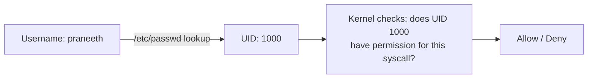
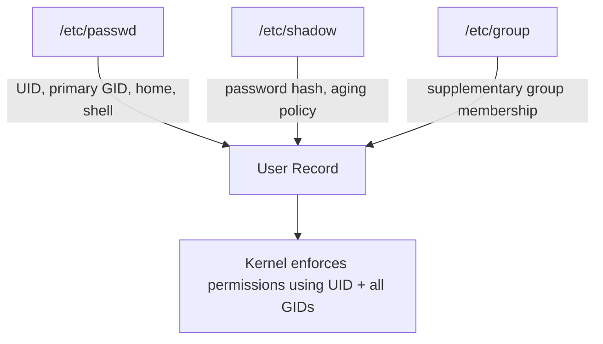
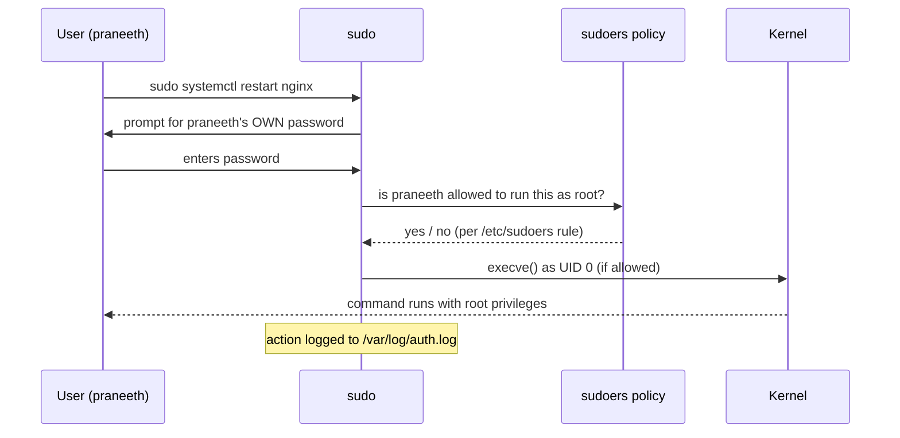
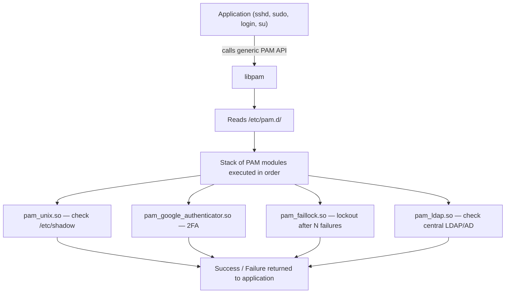

---

## Who This Is For, and Why Identity Matters

Part of the Foundations track in Praneeth's free cybersecurity notebook, this chapter covers Linux's user and authentication model: how accounts are represented, how `sudo` grants (and is abused to grant) elevated privileges, and how the Pluggable Authentication Modules (PAM) system decides what "prove you're you" actually means on a given machine.

Every permission chapter concept — owner, group, other — is meaningless without a system that reliably identifies *who* a process is running as. That identity system is the target of an enormous share of real attacks: credential stuffing, `sudoers` misconfiguration, PAM backdoors, password hash cracking, and privilege escalation via group membership all live in this chapter's territory. If permissions are the locks, this chapter is the keyring — and the office that decides who gets a key.

By the end of this chapter you'll be able to: read and interpret `/etc/passwd`, `/etc/shadow`, and `/etc/group` on sight; create, modify, and lock user accounts; understand exactly how `sudo` and `/etc/sudoers` decide who can run what as root; explain what PAM is and how a PAM stack processes a login attempt; and — critically — recognize the misconfigurations in this system that show up constantly in privilege escalation and real breaches.

---

## Part 1: What a "User" Actually Is on Linux

### UID: The Only Identity the Kernel Actually Cares About

Here's a fact that surprises beginners: the Linux kernel does not know usernames. Internally, every process runs as a **UID** (User ID) — a plain integer. "praneeth" is just a human-friendly label that userspace tools translate to and from a number. Two users with the *same* UID are, as far as the kernel is concerned, the *same identity* — even if `/etc/passwd` gives them different names. This single fact underlies a whole class of subtle privilege bugs (e.g., container UID collisions letting a container "root," UID 0, act as host root if namespaces aren't configured correctly).



| UID range | Meaning |
|---|---|
| `0` | Always root — total power over the system, regardless of username |
| `1`–`999` (varies by distro) | System/service accounts (`www-data`, `sshd`, `mysql`) — exist to run daemons with least privilege, not for humans to log in |
| `1000`+ | Regular human user accounts (the first human account is usually `1000`) |

### /etc/passwd — The User Database

```bash
cat /etc/passwd
# root:x:0:0:root:/root:/bin/bash
# daemon:x:1:1:daemon:/usr/sbin:/usr/sbin/nologin
# www-data:x:33:33:www-data:/var/www:/usr/sbin/nologin
# praneeth:x:1000:1000:Praneeth,,,:/home/praneeth:/bin/bash
```

Seven colon-separated fields, in order:

```
username : password_placeholder : UID : GID : GECOS(comment) : home_dir : login_shell
```

| Field | Example | Meaning |
|---|---|---|
| 1. Username | `praneeth` | Login name |
| 2. Password | `x` | Historically the hash lived here; modern systems store `x` and keep the real hash in `/etc/shadow` (unreadable by regular users) |
| 3. UID | `1000` | Numeric identity the kernel actually uses |
| 4. GID | `1000` | Primary group ID |
| 5. GECOS | `Praneeth,,,` | Free-text comment field — often full name, sometimes leftover junk from old Unix phone/office fields |
| 6. Home directory | `/home/praneeth` | Default working directory on login |
| 7. Login shell | `/bin/bash` | Program launched on login. `/usr/sbin/nologin` or `/bin/false` here means "this account can't get an interactive shell" — standard for service accounts |

> **Security note:** `/etc/passwd` is world-readable by design (many tools need to resolve UID→username), which is exactly why the actual password hash was moved out of it decades ago into `/etc/shadow`. If you ever see a real password hash sitting in `/etc/passwd` on a target, that's a serious, often ancient misconfiguration — and an instant win in a CTF.

### /etc/shadow — The Real Secret

```bash
sudo cat /etc/shadow
# praneeth:$6$randomsalt$longhash...:19920:0:99999:7:::
```

Colon-separated fields:

```
username : password_hash : last_changed : min_age : max_age : warn_period : inactive : expire : reserved
```

| Field | Meaning |
|---|---|
| password_hash | `$id$salt$hash` format. `$6$` = SHA-512 crypt, `$y$`/`$2b$` = yescrypt/bcrypt on modern distros, `!` or `*` = account has no password / is locked |
| last_changed | Days since Jan 1, 1970 (epoch) the password was last changed |
| min_age | Minimum days before the password can be changed again |
| max_age | Maximum days before the password must be changed |
| warn_period | Days before expiry the user is warned |
| inactive | Grace period after expiry before the account is disabled |
| expire | Absolute account expiration date (epoch days) |

`/etc/shadow` is `640`, owned by `root:shadow` — readable only by root and members of the `shadow` group. **This is why `passwd` needs SUID root** (from the previous chapter): a regular user changing their own password must briefly gain root privileges to write a new hash into a file they can't normally touch.

### /etc/group — Group Membership

```bash
cat /etc/group
# sudo:x:27:praneeth
# docker:x:999:praneeth
# staff:x:50:
```

```
group_name : password_placeholder : GID : comma_separated_members
```

Note: a user's **primary** group (from `/etc/passwd` field 4) does *not* need to be listed here — only **supplementary** group memberships appear in the members list. This trips people up when auditing group membership: `groups username` or `id username` give the full picture; grepping `/etc/group` alone can miss someone's primary group.



---

## Part 2: Managing Users and Groups

### Creating, Modifying, Deleting Users

```bash
# Create a user with a home directory and default shell
sudo useradd -m -s /bin/bash alice

# Create with an explicit UID, primary group, and comment
sudo useradd -m -u 1050 -g devteam -c "Alice Ops" alice

# Set/change a password interactively
sudo passwd alice

# Modify an existing user (add to a supplementary group, change shell, lock out home dir move)
sudo usermod -aG sudo,docker alice     # -aG = APPEND to groups (never use -G alone, see warning below)
sudo usermod -s /usr/sbin/nologin alice
sudo usermod -L alice                  # lock the account (prepends ! to the hash)
sudo usermod -U alice                  # unlock

# Delete a user (and optionally their home directory)
sudo userdel alice
sudo userdel -r alice                  # -r also removes home dir and mail spool
```

> **The single most common `usermod` mistake:** running `usermod -G sudo alice` **without** `-a`. Plain `-G` **replaces** the user's entire supplementary group list with just what you specified — silently removing them from `docker`, `www-data`, or any other group they were in. Always use `-aG` (append) unless you deliberately want to reset all group memberships. This exact mistake has locked admins out of services in production more than once.

### Creating and Managing Groups

```bash
sudo groupadd devteam
sudo groupadd -g 2001 auditors          # explicit GID
sudo groupmod -n developers devteam     # rename a group
sudo groupdel devteam
sudo gpasswd -a alice devteam           # add alice to devteam (alternative to usermod -aG)
sudo gpasswd -d alice devteam           # remove alice from devteam
```

### Checking Identity and Membership

```bash
whoami            # current effective username
id                # uid, gid, and ALL group memberships — the ground truth
id alice          # same, for another user
groups             # groups for the current user
groups alice       # groups for another user
```

```bash
$ id
uid=1000(praneeth) gid=1000(praneeth) groups=1000(praneeth),27(sudo),999(docker)
```

Read this exactly like a security auditor would: this user has a normal primary identity, but is in **sudo** (can escalate to root) and **docker** (functionally root-equivalent, as covered in the permissions chapter). `id` is the very first command a pentester runs after landing any shell — it tells you your starting privilege level in one line.

---

## Part 3: sudo — Controlled Privilege Escalation

### Why sudo Exists

`su` (substitute user) lets you fully switch to another user's shell, but it requires knowing that user's password — meaning every admin needs the root password, which is a shared secret nightmare to rotate or audit. `sudo` ("superuser do") solves this: it lets specific users run specific commands as root (or another user), authenticating with **their own** password, with every invocation logged.



### /etc/sudoers and visudo

The policy file is `/etc/sudoers`. **Never edit it directly with a normal text editor** — always use `visudo`, which syntax-checks the file before saving and prevents you from locking yourself out with a typo.

```bash
sudo visudo
```

Basic syntax:

```
user_or_group  host = (run_as_user:run_as_group)  NOPASSWD:  command_list
```

Common real entries:

```
# Full root access, password required every time
praneeth ALL=(ALL:ALL) ALL

# A group gets full sudo (the standard "sudo" group on Debian/Ubuntu)
%sudo ALL=(ALL:ALL) ALL

# A service account can restart exactly one service, no password prompt
deploy ALL=(root) NOPASSWD: /usr/bin/systemctl restart nginx

# A user can run any command as the 'postgres' user only (not root)
dba ALL=(postgres) ALL
```

`sudo -l` shows **your own** current sudo rights — the first command to run on any box you get a foothold on:

```bash
sudo -l
# User praneeth may run the following commands on this host:
#     (ALL : ALL) ALL
```

or, more interestingly during a real assessment:

```bash
sudo -l
# User www-data may run the following commands on this host:
#     (root) NOPASSWD: /usr/bin/find
```

That last example is a textbook privilege escalation: `find` runnable as root with no password is a direct GTFOBins hit —

```bash
sudo find . -exec /bin/sh -p \; -quit
```

— and you're root.

### The `NOPASSWD` Trap and Wildcard Dangers

Two classic sudoers misconfigurations that show up constantly in CTFs and real audits:

1. **`NOPASSWD` on a dangerous binary.** Any entry granting NOPASSWD on `vim`, `less`, `find`, `python`, `awk`, `tar`, `cp`, `mv`, or dozens of other everyday tools is a GTFOBins entry waiting to be used — check every `sudo -l` result against gtfobins.github.io.
2. **Wildcards that don't restrict what they look like they restrict.** `deploy ALL=(root) NOPASSWD: /usr/bin/systemctl restart apache*` looks scoped, but shell globbing and argument injection can sometimes be abused depending on how the command is invoked (e.g., via a wrapper script that doesn't sanitize input). Always test the *exact* boundary of a wildcard rule rather than assuming it's safe.

### su vs sudo — Quick Comparison

| | `su` | `sudo` |
|---|---|---|
| Authenticates with | Target user's password | **Your own** password |
| Default scope | Full shell as target user | Single command (unless `sudo -i`/`sudo su`) |
| Logging | Minimal | Every invocation logged to `/var/log/auth.log` (Debian/Ubuntu) or `/var/log/secure` (RHEL/CentOS) |
| Granularity | All-or-nothing | Per-user, per-command, per-host policy via sudoers |
| Best practice | Rarely needed if sudo is configured | Preferred model for shared/admin systems |

```bash
su -              # full login shell as root, needs ROOT's password
sudo su -         # get a root shell via YOUR OWN password (if sudoers allows ALL)
sudo -i           # equivalent, cleaner root login shell
sudo -u alice ls  # run a single command as a specific non-root user
```

---

## Part 4: PAM — Pluggable Authentication Modules

### What Problem PAM Solves

Before PAM, every program that needed to authenticate a user (login, ssh, su, sudo, screen lockers) had to implement its own password-checking logic, hardcoded against `/etc/passwd`/`/etc/shadow`. Adding a new authentication method — fingerprint, LDAP, two-factor, account lockout after failed attempts — meant patching and recompiling every single program.

**PAM decouples "how do I authenticate?" from the application itself.** Applications call a generic PAM API; system administrators configure *how* authentication actually happens by editing PAM config files — no application code changes needed. Want to add 2FA to SSH logins? Add a PAM module. Want to lock an account after 5 failed `su` attempts? Add a PAM module. Nothing about `ssh` or `su` themselves has to change.



### The Four PAM Management Groups

Every PAM rule belongs to one of four categories, each answering a different question:

| Type | Question it answers |
|---|---|
| `auth` | Are you who you claim to be? (password check, 2FA, biometrics) |
| `account` | Is this account currently allowed to log in? (expired? locked? time-of-day restricted?) |
| `password` | How is the password itself updated/validated? (complexity rules, hashing algorithm) |
| `session` | What should happen when the session starts/ends? (mount home directory, write to login records, set resource limits) |

### Reading a PAM Config File

```bash
cat /etc/pam.d/sudo
# #%PAM-1.0
# auth       include      common-auth
# account    include      common-account
# password   include      common-password
# session    include      common-session
```

Each line has: `type  control_flag  module  [arguments]`.

| Control flag | Meaning |
|---|---|
| `required` | Must succeed. On failure, continues processing the rest of the stack (to avoid revealing which check failed) but the overall result is failure |
| `requisite` | Must succeed. On failure, **immediately** stops the stack and denies — used to short-circuit expensive or sensitive checks |
| `sufficient` | If it succeeds AND no prior `required` module failed, the whole stack succeeds immediately, skipping the rest |
| `optional` | Its result generally doesn't affect the overall outcome unless it's the only module in the stack |

A real example — locking an account after repeated failed login attempts, via `pam_faillock`:

```
# /etc/pam.d/common-auth (Debian/Ubuntu style)
auth    required     pam_faillock.so preauth silent deny=5 unlock_time=900
auth    [success=1 default=ignore]  pam_unix.so
auth    [default=die] pam_faillock.so authfail deny=5 unlock_time=900
auth    sufficient   pam_faillock.so authsucc
```

This stack: pre-checks whether the account is already locked, attempts the standard Unix password check, records a failure if it fails, and locks the account for 900 seconds (15 minutes) after 5 consecutive failures — a textbook brute-force mitigation implemented entirely through PAM configuration, no application code involved.

### A Real, Dangerous PAM Misconfiguration

```
# DO NOT DO THIS — for illustration only
auth sufficient pam_permit.so
```

`pam_permit.so` always succeeds. If this line is placed above the real authentication check in a critical service's PAM stack, **anyone** authenticates successfully regardless of password — a textbook backdoor. Real-world PAM backdoors found in compromised systems and malicious packages have used exactly this technique: inserting a `sufficient`-flagged always-succeed module (or a modified `pam_unix.so` that accepts a hardcoded master password) into the `auth` stack of `sshd` or `login`. This is precisely why file integrity monitoring on `/etc/pam.d/*` and the PAM shared libraries themselves (`/lib/x86_64-linux-gnu/security/*.so`) is a standard blue-team control.

---

## Part 5: Step-by-Step Hands-On Lab

```bash
# 1. Inspect the identity files (read-only, no lab risk)
cat /etc/passwd | column -t -s:
sudo cat /etc/shadow | head -3
cat /etc/group | grep -E "sudo|docker|adm"

# 2. Create a lab user and inspect the result
sudo useradd -m -s /bin/bash labuser
sudo passwd labuser
id labuser
grep labuser /etc/passwd /etc/shadow /etc/group

# 3. Practice the -aG vs -G trap
sudo usermod -aG sudo labuser
id labuser
sudo usermod -G sudo labuser      # DANGER: this can wipe other group memberships — inspect before/after
id labuser

# 4. Set up a scoped sudoers rule and test it
sudo visudo -f /etc/sudoers.d/labuser
# add this single line, then save:
# labuser ALL=(root) NOPASSWD: /usr/bin/systemctl status sshd
su - labuser
sudo -l
sudo systemctl status sshd     # should work with no password prompt
sudo systemctl restart sshd    # should be DENIED — outside the scoped rule

# 5. Deliberately create (and immediately recognize) a dangerous sudoers entry, lab only
sudo visudo -f /etc/sudoers.d/labuser
# labuser ALL=(root) NOPASSWD: /usr/bin/find
su - labuser
sudo -l
sudo find . -exec /bin/sh -p \; -quit
id     # should now show euid=0(root)
exit

# 6. Clean up the lab
sudo rm /etc/sudoers.d/labuser
sudo userdel -r labuser

# 7. Inspect a real PAM stack
cat /etc/pam.d/sudo
cat /etc/pam.d/common-auth 2>/dev/null || cat /etc/pam.d/system-auth
```

---

## Part 6: Common Challenges, Mistakes, and How to Overcome Them

| Symptom | Root Cause | Fix |
|---|---|---|
| `usermod -aG` "didn't work" — new group not active | Group membership changes don't apply to *already-open* shells/sessions | Log out and back in, or run `newgrp groupname` for the current shell |
| `sudo: command not found` for a brand-new user | User isn't in `sudo`/`wheel` group and has no matching sudoers rule | `usermod -aG sudo username` (Debian/Ubuntu) or `usermod -aG wheel username` (RHEL/CentOS/Fedora) |
| Locked yourself out of `sudo` entirely after a bad `visudo` edit | Syntax error saved despite `visudo`'s check being ignored/overridden, or editing the file directly instead of via `visudo` | Boot into single-user/recovery mode or use a live USB to mount the disk and fix `/etc/sudoers` directly; **always** use `visudo`, never `nano /etc/sudoers` |
| Password change rejected as "too weak" unexpectedly | PAM's `pam_pwquality`/`pam_cracklib` module enforcing a complexity policy you didn't know was configured | `cat /etc/pam.d/common-password` (or `system-auth`) to see the active policy; adjust `/etc/security/pwquality.conf` if you administer the box |
| Account "exists" but can't log in interactively | Shell is `/usr/sbin/nologin` or `/bin/false` (intentional for service accounts), or account is locked (`!` prefix on the hash / `usermod -L`) | Confirm with `getent passwd username`; if it should be interactive, `usermod -s /bin/bash username` and/or `usermod -U username` |
| `sudo -l` shows nothing even though you know rules exist | You're being asked for a password and haven't entered it, or rules are host-specific and don't match `ALL` | Try `sudo -S -l` interactively; check `hostname` against any host-scoped sudoers entries |

---

## Part 7: Real-World Application

**Penetration testing / CTF:** `sudo -l` and `id` are two of the very first commands run on any newly obtained shell, low-privilege or otherwise. A `NOPASSWD` entry on almost any binary listed in GTFOBins is a direct, fast path from a foothold to full root — this is one of the highest-frequency "final step" techniques across HackTheBox and TryHackMe Linux boxes.

**Real breach pattern:** credential-stuffing and brute-force attacks against SSH and other PAM-protected services are among the most common initial-access techniques observed in internet-facing honeypot telemetry; PAM's `pam_faillock`/`pam_tally2` lockout modules (or fail2ban, which works by watching PAM/auth logs and modifying firewall rules) exist specifically because this attack pattern is so common at scale.

**Supply-chain/backdoor pattern:** malicious modifications to authentication binaries and PAM modules are a recurring theme in real Linux compromise investigations — attackers who achieve root frequently install a PAM-based backdoor (a modified `pam_unix.so`, or an injected `sufficient pam_permit.so`-style rule) precisely because it grants durable, stealthy, password-based re-entry that survives normal user password rotations and doesn't require an obvious extra account.

---

> **Bug Bounty Angle** — Direct sudoers/PAM misconfiguration bugs aren't reportable in web-focused bug bounty programs (you're not usually SSH'd into the target's infrastructure), but the *identity model* concepts translate straight into web authentication bugs: broken authentication, privilege confusion between roles, and "user impersonation" bugs are the web equivalent of a bad `sudoers` rule — a boundary that should require re-proving identity but doesn't. When a bounty engagement legitimately grants you infrastructure access (internal pentest, cloud security assessment, IoT/embedded device testing), `sudo -l`, `id`, and PAM stack review belong in your very first hour, since privilege escalation findings from misconfigured sudo rules are consistently rated Critical/High due to full-system compromise impact — document the exact `sudoers` line and the GTFOBins technique used, since specificity earns full payout instead of a "needs more info" bounce.

> **CTF Angle** — On almost every Linux privilege-escalation box, `sudo -l` is checked within the first thirty seconds of getting a shell. Memorize the fast loop: `sudo -l` → if any binary is listed, open gtfobins.github.io, search that binary name, and use its "Sudo" technique. If `sudo -l` requires a password you don't have, pivot to hunting SUID binaries and writable `/etc/passwd`/`/etc/shadow` instead (a writable `/etc/passwd` lets you literally append a new root UID-0 user with a known password hash using `openssl passwd` — a very common "creative" CTF solve). Also check `cat /etc/crontab` and `ls -la /etc/cron.*` for root-run scripts you can write to — a classic secondary path when sudo itself is locked down tight.

---

## Part 8: Detection & Defense — Blue Team Perspective

- **Centralize and monitor auth logs.** `/var/log/auth.log` (Debian/Ubuntu) or `/var/log/secure` (RHEL/CentOS) record every `sudo` invocation, every `su`, and every PAM-mediated login attempt. Ship these to a SIEM (Splunk, Elastic, Wazuh) and alert on repeated auth failures, unusual `sudo` targets, or `sudo` usage outside business hours from unexpected accounts.
- **Fail2ban / pam_faillock as standard hardening.** Both watch authentication failures and automatically lock accounts or block source IPs after a threshold — cheap, high-value defenses against brute force and credential stuffing.
- **File integrity monitoring on identity and PAM files.** `/etc/passwd`, `/etc/shadow`, `/etc/sudoers`, `/etc/sudoers.d/*`, and every `.so` under `/lib/*/security/` should be watched by AIDE/Tripwire/EDR — an unexpected new UID-0 entry in `/etc/passwd` or a modified PAM module binary is one of the strongest indicators of a completed compromise.
- **Principle of least privilege on sudoers.** Audit `sudo -l` output across your fleet regularly; every `NOPASSWD` entry should be justified and scoped to the narrowest possible command, ideally with full paths and no wildcards that expand attack surface.
- **MFA via PAM.** Adding `pam_google_authenticator.so` or a hardware-token PAM module to `sshd`'s auth stack is one of the highest-value, lowest-effort hardening steps against credential-based attacks — it stops a stolen or brute-forced password from being sufficient on its own.
- **How attackers get caught:** a burst of `sudo -l`, `find`/`awk`/`python` invocations immediately after a low-privilege shell is spawned (especially from a web server process like `www-data`) is a classic and highly detectable privilege-escalation-attempt pattern in EDR/auditd telemetry — correlating "webshell-like process spawns a shell, then immediately runs enumeration commands" is a staple SOC detection rule.

---

## Final Revision / Summary

- The kernel only knows **UIDs** (integers); usernames are a userspace convenience mapped via `/etc/passwd`. UID `0` is always root, regardless of name.
- `/etc/passwd` (world-readable, 7 colon fields: user, `x`, UID, GID, GECOS, home, shell) holds identity metadata. `/etc/shadow` (root-only, 640) holds the actual password hash and aging policy — that split is exactly why `passwd` needs SUID.
- `/etc/group` lists **supplementary** memberships only; a user's primary group lives in `/etc/passwd`. Always use `id`, not a raw `/etc/group` grep, to see the full picture.
- Manage users with `useradd`/`usermod`/`userdel`, groups with `groupadd`/`groupmod`/`groupdel`/`gpasswd`. **Always use `usermod -aG`, never bare `-G`**, or you'll silently wipe other group memberships.
- `sudo` lets specific users run specific commands as root, authenticated with **their own** password and fully logged — configured via `/etc/sudoers`, always edited with `visudo`. `sudo -l` shows your own rights and is a top-priority command on any new shell.
- **PAM** decouples "how do I authenticate?" from the application. Every login-capable program reads a stack of rules from `/etc/pam.d/<app>` across four types (`auth`, `account`, `password`, `session`) with control flags (`required`, `requisite`, `sufficient`, `optional`) that determine how the stack combines into a pass/fail decision.
- Both `sudoers` misconfiguration (a `NOPASSWD` GTFOBins-listed binary) and PAM misconfiguration (a `sufficient pam_permit.so`-style backdoor) are real, recurring root causes of both CTF privesc chains and actual breach persistence mechanisms.

**Memory hook:** *"passwd tells the world who you are, shadow tells root what your secret is."* For PAM's four types, remember **AAPS**: **A**uthenticate (are you you?), **A**ccount (are you still allowed in?), **P**assword (how do you change your secret?), **S**ession (what happens once you're in?).

---

## Cheat Sheet / Quick Reference

```bash
# Identity files
cat /etc/passwd                 # username:x:UID:GID:GECOS:home:shell
sudo cat /etc/shadow             # username:hash:lastchg:min:max:warn:inactive:expire
cat /etc/group                   # groupname:x:GID:member1,member2

# Whoami / audit
whoami
id
id username
groups
groups username

# User management
sudo useradd -m -s /bin/bash user       # create with home + shell
sudo passwd user                        # set password
sudo usermod -aG groupname user         # APPEND to group (never bare -G)
sudo usermod -s /usr/sbin/nologin user  # disable interactive shell
sudo usermod -L user / -U user          # lock / unlock account
sudo userdel -r user                    # delete user + home dir

# Group management
sudo groupadd groupname
sudo groupmod -n newname oldname
sudo groupdel groupname
sudo gpasswd -a user groupname          # add user to group
sudo gpasswd -d user groupname          # remove user from group

# sudo
sudo visudo                             # edit /etc/sudoers safely
sudo visudo -f /etc/sudoers.d/custom    # drop-in rule file (preferred over editing main file)
sudo -l                                 # what can I run as root?
sudo -u otheruser command               # run as a specific non-root user
sudo -i / sudo su -                     # get a root login shell

# PAM
cat /etc/pam.d/<application>            # inspect a service's auth stack
cat /etc/pam.d/common-auth              # Debian/Ubuntu shared auth rules
cat /etc/pam.d/system-auth              # RHEL/CentOS/Fedora equivalent

# Privesc enumeration one-liners
sudo -l 2>/dev/null
find / -perm -4000 -type f 2>/dev/null
grep -v '^#' /etc/passwd | awk -F: '$3 == 0 { print }'   # find every UID-0 (root-equivalent) account
```

| sudoers control flag | Behavior |
|---|---|
| `required` | Must pass; failure recorded but stack continues |
| `requisite` | Must pass; failure stops the stack immediately |
| `sufficient` | Success here (with no prior required failure) ends the stack as a pass |
| `optional` | Rarely decides the outcome alone |

---

## Practice Labs & Resources

- **TryHackMe — "Linux Fundamentals Part 3"** — covers user/group management alongside permissions in a guided room.
- **TryHackMe — "Linux PrivEsc"** — dedicated sudo misconfiguration and SUID privilege escalation practice, a direct extension of Parts 3–5 here.
- **HackTheBox — any Easy/Medium Linux box tagged "sudo misconfiguration"** — practice the `sudo -l` → GTFOBins workflow end to end.
- **OverTheWire — Bandit** — repeated, safe practice reading `/etc/passwd`-style files and using enumeration commands.
- **GTFOBins** (gtfobins.github.io) — search the "Sudo" function for any binary you find in a `sudo -l` result.
- **LinPEAS** (github.com/peass-ng/PEASS-ng) — automates sudoers, PAM, and identity-file enumeration; run it after you've done this chapter's checks manually so you understand exactly what it's finding.
