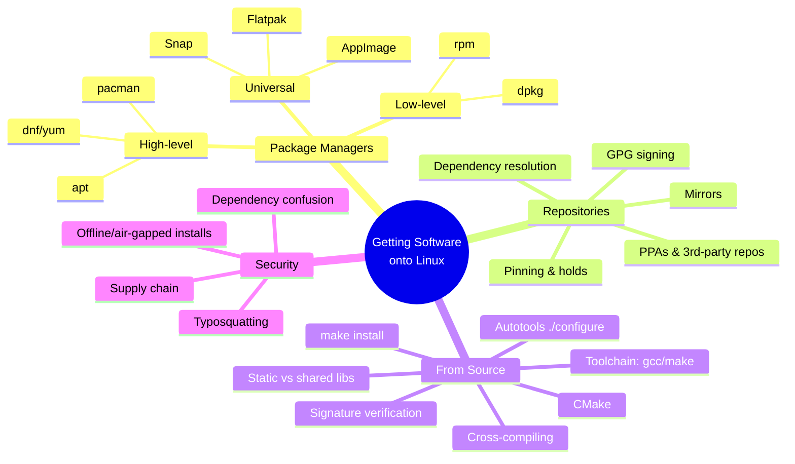
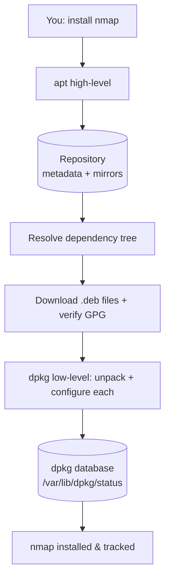
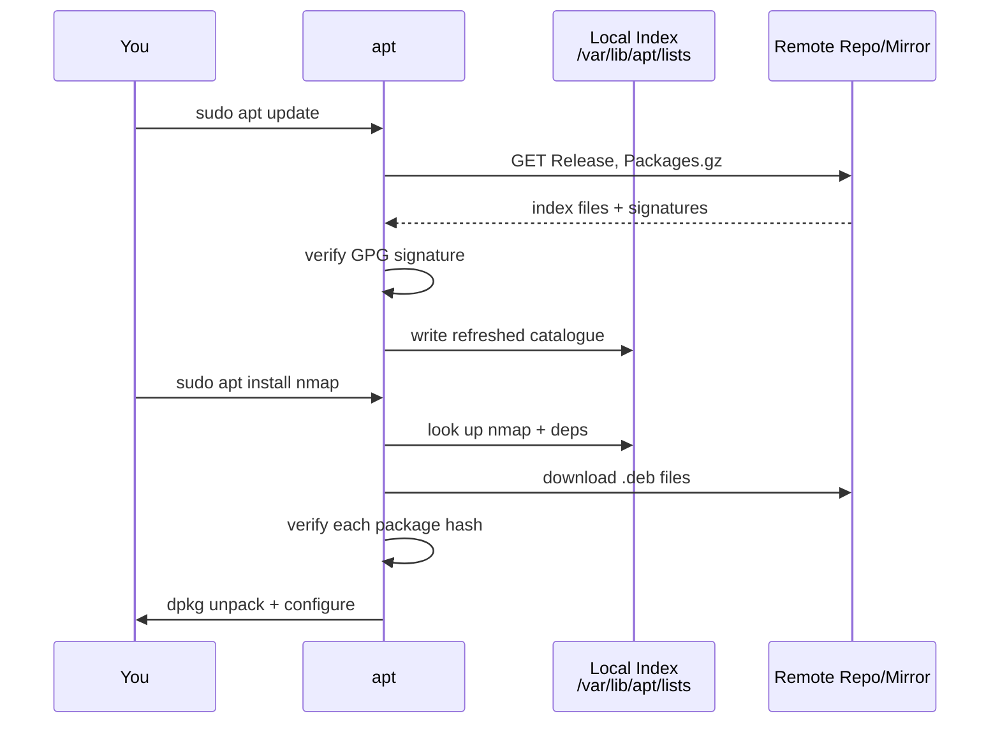
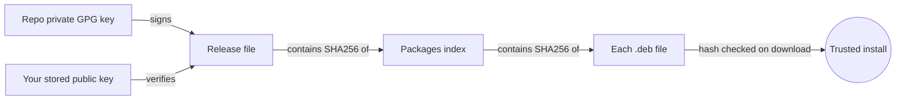
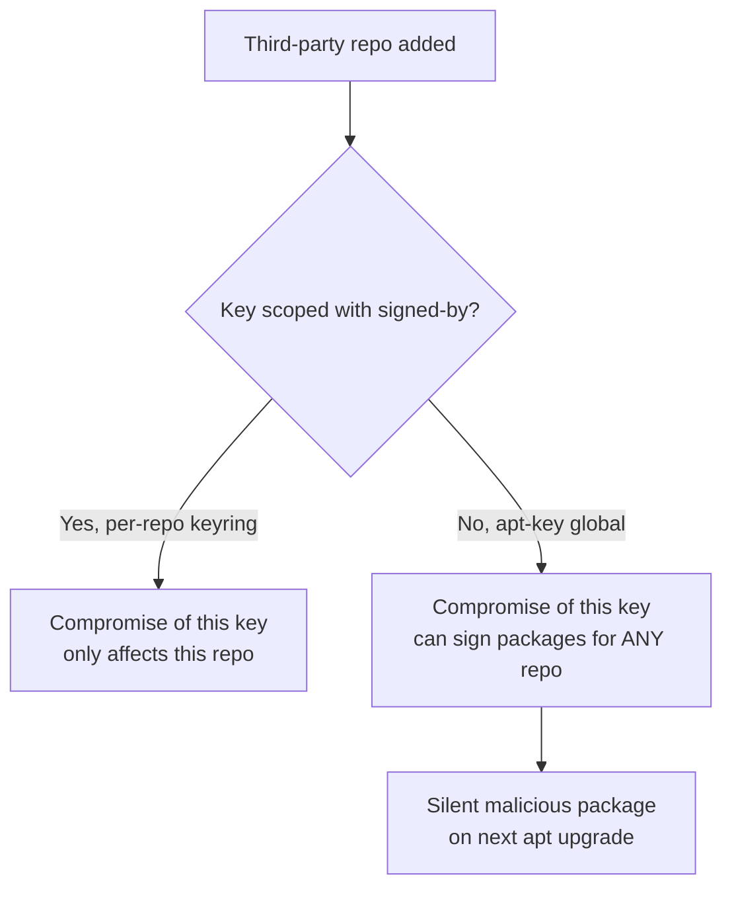
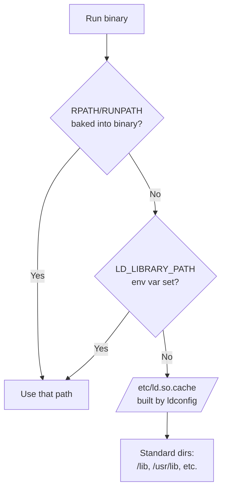
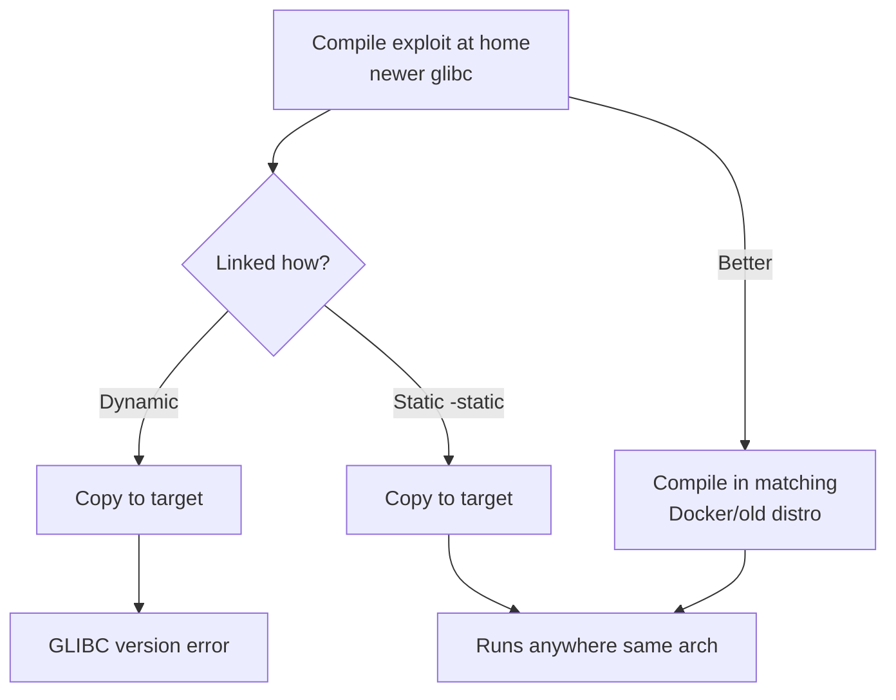
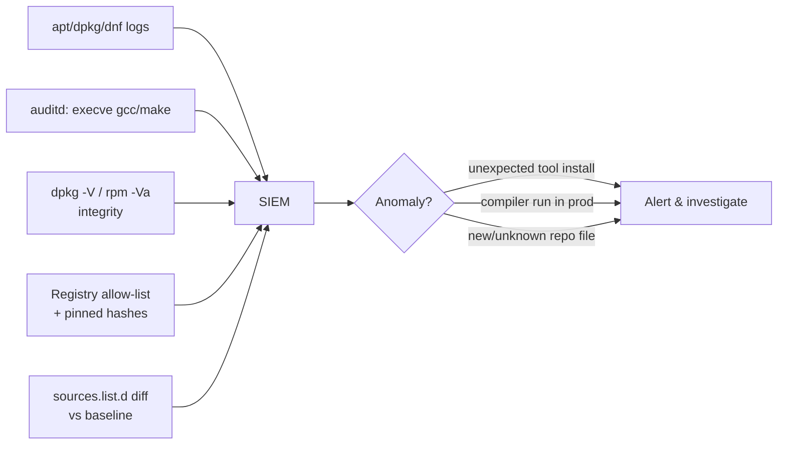

---

## Who This Is For, and Why Package Management Matters

Every offensive and defensive workflow starts the same way: you need software. You need `nmap` to scan, `gcc` to compile an exploit, `python3` to run a script, `tmux` to keep your session alive. On a modern Linux system you almost never install software by dragging an icon into a folder — you use a **package manager**, a program whose entire job is to fetch, verify, unpack, configure, and track other programs.

Understanding package management deeply is not busywork. It is one of the highest-leverage skills in this entire notebook, for five concrete reasons:

1. **You install your entire toolkit through it.** Kali, Parrot, Ubuntu, Debian, Fedora, and Arch all revolve around a package manager. If you can't drive it fluently, you can't build your environment.
2. **Privilege escalation frequently lives here.** Misconfigured package managers, cached credentials in `/etc/apt`, writable repo files, and `sudo apt` rules are real privilege-escalation paths on CTF boxes and real engagements.
3. **Supply-chain attacks are the defining security story of the decade.** SolarWinds, `event-stream`, `xz/liblzma` (CVE-2024-3094), dependency confusion — every one of them is a package-management attack. You cannot defend or exploit what you don't understand.
4. **When packages fail, you compile from source.** Exploit code, custom tools, and bleeding-edge software often ship only as source. Knowing `./configure && make && make install` cold is the difference between "it doesn't work" and a working exploit.
5. **Real engagements are messy.** Air-gapped networks, mismatched glibc versions, held-back packages, and third-party repos that silently break `apt` are things you will hit in the field, not just in a lab — this chapter covers the recovery paths for all of them.

By the end of this chapter you'll understand package management from the raw `.deb`/`.rpm` file all the way up to signed repositories, pinning, and offline installs — and you'll be able to compile arbitrary C software from source, cross-compile for a mismatched target, and troubleshoot the errors that stop most beginners cold.

Here's the mental map of where we're going:



---

## Part 1: The Core Concept — What a "Package" Actually Is

Before any tool, understand the object. A **package** is a single archive file that bundles together:

- **The compiled program(s)** and supporting files (binaries, libraries, config templates, man pages, icons).
- **Metadata** — the package name, version, architecture (e.g. `amd64`, `arm64`), a human description, and the maintainer.
- **A dependency list** — the other packages this one needs in order to function (e.g. `nmap` depends on `liblua5.4` and `libssl3`).
- **Install/remove scripts** — small shell scripts that run *before* and *after* installation (create a user, restart a service, generate keys).

Think of a package like a piece of flat-pack furniture. The box contains the parts (files), an assembly manual (scripts), a parts list, and a note that says "you also need the screws from box #47" (dependencies). The package manager is the assembly robot that reads all of this, fetches box #47 automatically, and remembers exactly which screws came from which box so it can cleanly disassemble later.

There are two dominant package **formats** in the Linux world, split by distribution family:

| Family | Format | Low-level tool | High-level tool | Example distros |
| --- | --- | --- | --- | --- |
| Debian | `.deb` | `dpkg` | `apt` / `apt-get` | Debian, Ubuntu, **Kali**, **Parrot**, Mint |
| Red Hat | `.rpm` | `rpm` | `dnf` (was `yum`) | Fedora, RHEL, CentOS, Rocky, Alma |
| Arch | `.pkg.tar.zst` | `pacman -U` | `pacman` | Arch, Manjaro, BlackArch |

> **Key insight:** There are always two layers. A **low-level tool** (`dpkg`, `rpm`) installs a *single local package file* but does **not** resolve dependencies — if box #47 is missing, it just errors out. A **high-level tool** (`apt`, `dnf`, `pacman`) sits on top, talks to remote repositories, and automatically downloads every dependency in the correct order. Almost all of the time you use the high-level tool; you drop to the low-level tool when you have a single `.deb`/`.rpm` file and no repo.



Since Kali, Parrot, and Ubuntu are what you'll live in as a security practitioner, we'll spend most of our depth on the **Debian/apt** family, then map the equivalents for Red Hat and Arch so you're never lost on an unfamiliar box.

---

## Part 2: The Debian Family — dpkg (the Low-Level Engine)

`dpkg` (Debian Package) is the foundation. Every `apt` operation ultimately calls `dpkg` under the hood. Learning it first demystifies everything above it.

### 2.1 Anatomy of a .deb file

A `.deb` is actually an `ar` archive containing three members. You can crack one open with no special tools:

```bash
# Download a package without installing it, then dissect it
apt-get download tree          # fetches tree_*.deb into current dir
ar t tree_*.deb                # list members
# debian-binary   -> format version (usually "2.0")
# control.tar.xz  -> metadata + maintainer scripts
# data.tar.xz     -> the actual files that get installed

# Extract just the file listing without installing
dpkg-deb --contents tree_*.deb   # shows every file & its target path
dpkg-deb --info tree_*.deb       # shows control metadata (deps, size, desc)

# Fully unpack a .deb to inspect every file WITHOUT touching the system
mkdir /tmp/deb-audit && dpkg-deb -x tree_*.deb /tmp/deb-audit
dpkg-deb -e tree_*.deb /tmp/deb-audit/DEBIAN   # extract control scripts separately
cat /tmp/deb-audit/DEBIAN/postinst              # read the maintainer script BEFORE trusting it
```

> **Why this matters for security:** Being able to inspect a `.deb` *before* installing it lets you audit exactly what files it writes and what its `postinst` script does. Malicious `.deb` files distributed on shady sites hide their payload in the `postinst`/`preinst` maintainer scripts — `dpkg-deb -x` plus `-e` reveals both the file payload and the scripts without ever running either.

### 2.2 Core dpkg commands

```bash
sudo dpkg -i package.deb        # install a single local .deb (no dep resolution!)
sudo dpkg -r packagename        # remove (keep config files)
sudo dpkg -P packagename        # purge (remove including config files)
dpkg -l                         # list ALL installed packages
dpkg -l | grep nmap             # is nmap installed? what version?
dpkg -L nmap                    # list every file nmap installed & where
dpkg -S /usr/bin/nmap           # which package OWNS this file? (reverse lookup)
dpkg --get-selections           # dump full package selection state
dpkg --compare-versions 1.2 lt 1.3 && echo "1.2 is older"   # scriptable version comparisons
```

The two you'll use constantly in security work are `dpkg -L` ("what did this package drop on disk?") and `dpkg -S` ("which package put this suspicious binary here?"). During incident response, `dpkg -S /path/to/weird/binary` instantly tells you whether a file is a legitimate part of a package or an attacker-dropped implant that no package owns.

### 2.3 The dependency wall

Run `sudo dpkg -i` on a package whose dependencies aren't met and you hit the classic error:

```text
dpkg: dependency problems prevent configuration of nmap:
 nmap depends on libssl3 (>= 3.0.0); however:
  Package libssl3 is not installed.
```

`dpkg` will not fix this for you. The canonical rescue is to let `apt` clean up after a broken `dpkg` install:

```bash
sudo dpkg -i nmap.deb          # fails with dependency errors, leaves it half-configured
sudo apt-get install -f        # "-f" = fix-broken: apt reads the mess and installs the missing deps
```

This `dpkg -i` then `apt-get install -f` two-step is one of the most useful recovery patterns in the Debian world — memorize it.

---

## Part 3: The Debian Family — APT (the High-Level Brain)

`apt` (Advanced Package Tool) is what you actually type all day. It knows about **repositories**, resolves dependencies, downloads packages, verifies signatures, and hands the files to `dpkg`.

> **`apt` vs `apt-get`:** `apt` is the newer, friendlier front-end (progress bars, colour, simpler syntax) meant for interactive use. `apt-get` (and `apt-cache`) is the older, stable, script-friendly interface with a guaranteed-stable output format. Use `apt` at the keyboard; use `apt-get` in scripts and automation.

### 3.1 The everyday workflow

```bash
sudo apt update                 # refresh the local package INDEX from repos (does NOT upgrade anything)
sudo apt upgrade                # install newer versions of installed packages
sudo apt full-upgrade           # like upgrade, but may REMOVE packages to satisfy deps (dist-upgrade)
sudo apt install nmap           # install nmap + all dependencies
sudo apt install nmap=7.94+dfsg1-1   # install a specific pinned version
sudo apt remove nmap            # remove nmap (keep config)
sudo apt purge nmap             # remove nmap + its config files
sudo apt autoremove             # remove orphaned dependencies nothing needs anymore
apt search keyword              # search package names & descriptions
apt show nmap                   # detailed info: version, deps, size, homepage
apt list --installed            # everything installed
apt list --upgradable           # what has a newer version waiting
apt-cache policy nmap           # show installed vs candidate version AND which repo it'll come from
apt-cache depends nmap          # full dependency tree of a package
apt-cache rdepends nmap         # REVERSE deps — what breaks if you remove nmap?
```

> **The single most common beginner mistake:** running `sudo apt upgrade` *without* running `sudo apt update` first. `update` refreshes the *index* (the catalogue of what's available); `upgrade` acts on that index. Skip `update` and you're upgrading against a stale catalogue — you'll miss security patches and sometimes hit "404 Not Found" errors because the versions your index knows about have already been rotated off the mirror. The rule is simple: **always `apt update` before `apt upgrade`.**



### 3.2 Where repositories are defined

`apt` learns where to download from via **sources lists**:

```bash
cat /etc/apt/sources.list                 # the main sources file
ls  /etc/apt/sources.list.d/              # drop-in files, one repo per file (e.g. docker.list)
```

A classic source line looks like:

```text
deb http://deb.debian.org/debian bookworm main contrib non-free
#^   ^                             ^        ^
#|   repository URL                suite    components
#type (deb = binary, deb-src = source)
```

- **type** — `deb` for binary packages, `deb-src` for source packages.
- **URL** — the mirror to download from.
- **suite** — the release codename (`bookworm`, `jammy`, `kali-rolling`).
- **components** — sections: `main` (free/official), `contrib`, `non-free`, or on Ubuntu `universe`/`multiverse`.

Newer systems use the **deb822** format in `.sources` files (`/etc/apt/sources.list.d/*.sources`) which is the same information in a clearer key-value layout.

### 3.3 Repository trust — GPG signing (the security heart of apt)

This is the part every security person must understand. **How does your machine know the `nmap` it just downloaded wasn't swapped for malware by a man-in-the-middle or a compromised mirror?**

The answer is cryptographic signatures. Each repository's index (the `Release` file) is **signed with the repo maintainer's GPG private key**. Your system holds the corresponding **public key**. When you `apt update`, apt verifies the signature on the index; the index in turn contains cryptographic hashes of every package. So the chain of trust is:



If any link fails — bad signature, unknown key, mismatched hash — apt **refuses** to install and throws:

```text
W: GPG error: ... The following signatures couldn't be verified because
   the public key is not available: NO_PUBKEY 1234ABCD...
E: The repository '... Release' is not signed.
```

Managing these keys correctly is where beginners (and even tutorials) go dangerously wrong.

```bash
# MODERN, CORRECT way to add a third-party repo key (keep it scoped to one repo):
curl -fsSL https://download.docker.com/linux/debian/gpg \
  | sudo gpg --dearmor -o /usr/share/keyrings/docker.gpg

# Then reference THAT keyring explicitly in the repo's .list file:
echo "deb [signed-by=/usr/share/keyrings/docker.gpg] https://download.docker.com/linux/debian bookworm stable" \
  | sudo tee /etc/apt/sources.list.d/docker.list
```

> **Security callout — why `apt-key` is dead:** Old tutorials tell you to run `apt-key add`. **Never do this.** `apt-key` adds a key to a *global* trusted keyring, meaning that key can then vouch for **any** repository, not just the one it belongs to. A key added for a random PPA could silently authorize malicious packages from anywhere. `apt-key` was deprecated and removed for exactly this reason. The correct pattern is **per-repo keyrings** in `/usr/share/keyrings/` referenced by `signed-by=`, scoping each key to only the repo it belongs to.

### 3.4 apt's caches and files (useful for forensics & privesc)

```bash
/var/cache/apt/archives/     # downloaded .deb files are cached here
/var/lib/apt/lists/          # downloaded repository indexes
/var/lib/dpkg/status         # the master database of what's installed
/var/log/apt/history.log     # human-readable log of every apt transaction
/var/log/dpkg.log            # low-level install/remove log with timestamps
```

During DFIR, `/var/log/apt/history.log` and `/var/log/dpkg.log` are gold: they tell you exactly **what an attacker installed and when** (a sudden `install socat netcat-traditional` at 03:14 is a story). During privesc, a writable file in `/etc/apt/sources.list.d/` or a writable apt config that runs commands (`APT::Update::Pre-Invoke`) can be abused to run code as root the next time an admin runs `apt update`.

---

## Part 4: Red Hat (dnf/rpm) and Arch (pacman) — Rosetta Stone

You will land on non-Debian boxes. Rather than re-teach everything, here is the translation table so your Debian muscle memory carries over.

| Task | Debian/Ubuntu/Kali (`apt`) | Fedora/RHEL (`dnf`) | Arch (`pacman`) |
| --- | --- | --- | --- |
| Refresh index | `apt update` | `dnf check-update` | `pacman -Sy` |
| Install a package | `apt install pkg` | `dnf install pkg` | `pacman -S pkg` |
| Remove a package | `apt remove pkg` | `dnf remove pkg` | `pacman -R pkg` |
| Remove + orphans | `apt autoremove` | `dnf autoremove` | `pacman -Rns pkg` |
| Upgrade everything | `apt upgrade` | `dnf upgrade` | `pacman -Syu` |
| Search | `apt search x` | `dnf search x` | `pacman -Ss x` |
| Show info | `apt show pkg` | `dnf info pkg` | `pacman -Si pkg` |
| List installed | `dpkg -l` | `rpm -qa` / `dnf list installed` | `pacman -Q` |
| Which package owns a file | `dpkg -S /path` | `rpm -qf /path` | `pacman -Qo /path` |
| List a package's files | `dpkg -L pkg` | `rpm -ql pkg` | `pacman -Ql pkg` |
| Install a local file | `dpkg -i file.deb` | `rpm -i file.rpm` / `dnf install ./file.rpm` | `pacman -U file.pkg.tar.zst` |
| Hold/pin a version | `apt-mark hold pkg` | `dnf versionlock add pkg` | `IgnorePkg=` in `/etc/pacman.conf` |
| Clean download cache | `apt clean` | `dnf clean all` | `pacman -Sc` |

> **Memory hook for pacman flags:** think of the capital letters as *operations* and lowercase as *modifiers*. **`-S`** = **S**ync (install/update from repos), **`-R`** = **R**emove, **`-Q`** = **Q**uery (local database), **`-U`** = **U**pgrade from a local file. So `-Syu` = sync (`S`), refresh index (`y`), upgrade all (`u`). `pacman -Ss` searches the sync repos; `pacman -Qs` searches what's installed.

On Red Hat systems, repositories live in `/etc/yum.repos.d/*.repo` and RPM package signatures are verified against GPG keys imported with `rpm --import`. The trust model is conceptually identical to apt's — signed metadata, hashed packages — just different filenames.

---

## Part 5: Pinning, Holding, and Third-Party Repos (PPAs)

Real environments rarely run stock, default-everything setups for long. You'll need to freeze a version that a tool depends on, or add a vendor's repo for software the distro doesn't ship. Both of these are common sources of breakage if done carelessly — and common privesc/forensics leads if done maliciously.

### 5.1 Holding a package at its current version

Sometimes upgrading a package breaks a dependent tool (a new `openssl` that changes a default and breaks a custom build). You can freeze it:

```bash
sudo apt-mark hold openssl        # apt upgrade will now SKIP openssl entirely
apt-mark showhold                 # list everything currently held
sudo apt-mark unhold openssl      # release the hold
```

`apt upgrade` will print `openssl is kept back` for held packages instead of upgrading them — silently keeping a vulnerable version around if you forget it's held is a real, recurring misconfiguration worth checking for during an assessment (`apt-mark showhold` on a target is a five-second win).

### 5.2 Pinning specific versions/repos with apt preferences

For finer control than a blunt hold, `/etc/apt/preferences` (or drop-ins in `/etc/apt/preferences.d/`) lets you set a numeric **priority** per package/repo:

```text
# /etc/apt/preferences.d/no-experimental
Package: *
Pin: release a=experimental
Pin-Priority: 1
```

Priority above 1000 forces a downgrade if needed; 500 is the normal default; below 100 means "only install if nothing else provides it"; negative values mean "never install." This is how organisations pin an entire fleet to a "stable" suite while still having a security/backports repo configured but deprioritized.

```bash
apt-cache policy nmap        # shows exactly which pin-priority number apt is using RIGHT NOW to pick a candidate
```

### 5.3 PPAs and third-party repos — convenience vs risk

A **PPA** (Personal Package Archive, Ubuntu-specific) or any third-party `.list`/`.sources` file lets you install software the distro doesn't officially package — a bleeding-edge tool, a vendor's own build. The mechanics are exactly Part 3.3's GPG process, just pointed at someone else's server.

```bash
sudo add-apt-repository ppa:someuser/tool     # Ubuntu convenience wrapper (adds .list + fetches key)
sudo apt update && sudo apt install tool
sudo add-apt-repository --remove ppa:someuser/tool   # clean removal
```

> **Security callout:** every third-party repo you add is a maintainer you're extending root-level trust to — their signing key can push *any* package, including one that silently replaces a system binary like `sudo` or `bash` on your next `apt upgrade`. Before adding a PPA/vendor repo: confirm it's the *official* URL (not a typo/lookalike), prefer the `signed-by=`-scoped keyring method over `add-apt-repository` where possible, and audit `/etc/apt/sources.list.d/` periodically for repos you don't remember adding — an attacker with root can add a malicious repo there once and get code-exec on every future `apt upgrade`, which is both a real persistence technique and a DFIR checklist item.



---

## Part 6: Universal Packages — Snap, Flatpak, AppImage

The classic package managers are **distro-specific** and install software **system-wide** into shared locations, which causes "dependency hell" when two apps need conflicting library versions. A newer generation solves this by **bundling dependencies** with each app.

- **AppImage** — a single executable file that contains the app *and* all its libraries. Download, `chmod +x`, run. No install, no root. Great for portable pentest tools; the whole "app" is one file you can carry on a USB stick.
- **Flatpak** — sandboxed apps from Flathub, sharing common "runtimes" to save space. Strong sandboxing via `bubblewrap`.
- **Snap** — Canonical's sandboxed format, auto-updating, used heavily on Ubuntu.

```bash
# AppImage
chmod +x SomeTool-x86_64.AppImage
./SomeTool-x86_64.AppImage

# Flatpak
flatpak install flathub org.example.App
flatpak run org.example.App
flatpak list                          # installed flatpaks
flatpak update                        # update everything

# Snap
sudo snap install package
snap list                             # installed snaps + revisions
sudo snap refresh                     # update everything
sudo snap remove package
```

> **Security trade-off:** Bundling means each app carries its *own* copy of libraries like OpenSSL. When a critical CVE lands in OpenSSL, your system apt package gets patched centrally in one update — but every Snap/Flatpak/AppImage that bundled its own vulnerable copy must be rebuilt and re-shipped by its author. Bundled formats trade "no dependency hell" for "patch lag and larger attack surface." Know which parts of a target run bundled apps; they're often months behind on library CVEs.

---

## Part 7: Compiling Software from Source (the Real Power)

Sooner or later the package you need isn't in any repo — it's a GitHub release, an exploit PoC, or a tool that's newer than your distro ships. Then you compile from **source code** (human-readable C/C++) into a **binary** (machine code) yourself.

### 7.1 The build toolchain — install it once (Tool Primer)

To compile C/C++ you need a **compiler**, a **build driver**, and **development headers**. This is your first exposure to the toolchain, so here's the ground-up primer:

- **`gcc`/`g++`** — the GNU Compiler Collection. Turns `.c`/`.cpp` source into object code and links it into an executable. `clang` is a drop-in alternative.
- **`make`** — a build *automation* tool. It reads a file called `Makefile` that describes "to build X, run these compiler commands," and runs only what's needed. `make` doesn't compile anything itself — it *orchestrates* `gcc`.
- **`libc6-dev` / `build-essential`** — the C standard library **headers** (`.h` files). Compiling needs the *headers* (function declarations), not just the runtime library.

```bash
# Debian/Kali/Ubuntu — the one command that sets you up for almost all compiling:
sudo apt install build-essential
# pulls in: gcc, g++, make, libc6-dev, dpkg-dev  (the essential build kit)

# Also very commonly needed:
sudo apt install autoconf automake libtool pkg-config cmake git

# Fedora/RHEL equivalent:
sudo dnf groupinstall "Development Tools"

# Arch:
sudo pacman -S base-devel
```

**Useful `gcc` flags worth knowing from day one:**

| Flag | Meaning |
| --- | --- |
| `-o out` | name the output binary `out` instead of the default `a.out` |
| `-Wall -Wextra` | enable most compiler warnings — catch real bugs before runtime |
| `-g` | include debug symbols (needed for `gdb`) |
| `-O0` / `-O2` | optimization level; `-O0` for debugging, `-O2` for release |
| `-c` | compile to an object file (`.o`) without linking — for multi-file projects |
| `-Idir` | add `dir` to the header search path |
| `-Ldir -lname` | add `dir` to the library search path and link against `libname.so`/`.a` |
| `-static` | statically link everything (see Part 9) |
| `-fno-stack-protector -z execstack` | **disable** protections — used in binary exploitation labs to reproduce vulnerable behaviour, never in production |

### 7.2 The universal source-build ritual: ./configure && make && make install

The vast majority of classic Unix software uses the **GNU Autotools** flow. It is a three-step ritual you will run hundreds of times:


```bash
# 1. Get the source and enter it
wget https://example.org/tool-1.2.3.tar.gz
tar xzf tool-1.2.3.tar.gz        # x=extract z=gzip f=file  (use xjf for .bz2, xJf for .xz)
cd tool-1.2.3

# 2. CONFIGURE — probe the system, check for dependencies, generate a Makefile.
#    This is where "missing library" errors surface EARLY (good).
./configure
#    Common useful options:
./configure --prefix=/opt/tool   # install into /opt/tool instead of /usr/local
./configure --help               # list every knob this project exposes

# 3. MAKE — actually compile. This is the slow, CPU-heavy step.
make -j$(nproc)                  # -j = parallel jobs; nproc = number of CPU cores

# 4. INSTALL — copy the compiled files into system paths (needs root).
sudo make install
```

### 7.3 Why `/usr/local` matters (and the golden rule)

By default, `make install` drops files into `/usr/local/bin`, `/usr/local/lib`, etc. This is **deliberate and correct**: `/usr/local` is the FHS-mandated home for software *you* installed by hand, kept **separate** from `/usr/bin` where the package manager puts its files. This separation means your hand-compiled tools never collide with, or get clobbered by, `apt`.

> **The golden rule of source installs:** *the package manager does not know about anything you `make install`.* `dpkg -S /usr/local/bin/tool` returns "no path found," because no package owns it. That's the core downside — no clean `apt remove`, no automatic updates, no dependency tracking. You've stepped outside the managed world.

### 7.4 CMake — the modern alternative

Newer projects use **CMake** instead of Autotools. Same idea, different commands:

```bash
mkdir build && cd build          # CMake favours out-of-source builds
cmake ..                         # configure (reads ../CMakeLists.txt)
cmake --build . -j$(nproc)       # compile
sudo cmake --install .           # install
```

If a repo has a `CMakeLists.txt`, it's CMake. If it has a `configure` script or `configure.ac`, it's Autotools. If it has a bare `Makefile` only, just run `make`.

### 7.5 checkinstall — get the best of both worlds

There's a clever trick to compile from source **but still track it with your package manager**: `checkinstall` runs `make install` inside a monitor, records every file created, and wraps them into a real `.deb` you can later `apt remove` cleanly.

```bash
sudo apt install checkinstall
./configure && make
sudo checkinstall            # instead of "sudo make install"
# -> builds and installs a proper .deb; now dpkg -l shows it and you can remove it cleanly
```

### 7.6 The uninstall problem — and DESTDIR staging

If you *didn't* use `checkinstall`, plain `make install` gives you no built-in `make uninstall` in most projects (some do provide it — check the Makefile). The professional pattern is to **stage** the install into a fake root first, so you can see exactly what would be touched before it hits your real filesystem:

```bash
make install DESTDIR=/tmp/staged-install     # installs into /tmp/staged-install/usr/local/... instead of /
find /tmp/staged-install -type f              # full manifest of every file this would create
# Happy with it? Copy for real, or just rsync DESTDIR's tree onto /
sudo rsync -a /tmp/staged-install/ /
```

`DESTDIR` is also exactly how distro package maintainers build the *contents* of a `.deb`/`.rpm` in the first place — it's the same technique that turns "compile from source" into "produce a real package," and it's worth knowing for both auditing an install before it happens and for eventually packaging your own tools.

### 7.7 Verifying source tarball signatures (before you even compile)

Repository GPG signing (Part 3.3) protects *binary packages*. When you `wget` a source tarball directly from a project's website, none of that applies — you are trusting DNS, TLS, and the mirror to hand you the real file. Serious projects publish a detached signature alongside the tarball:

```bash
wget https://example.org/tool-1.2.3.tar.gz
wget https://example.org/tool-1.2.3.tar.gz.asc     # the detached GPG signature
gpg --keyserver keyserver.ubuntu.com --recv-keys <maintainer-key-id>   # fetch the maintainer's public key
gpg --verify tool-1.2.3.tar.gz.asc tool-1.2.3.tar.gz
# Good signature output includes: "gpg: Good signature from ..."
```

If a project instead only publishes a SHA256 checksum, verify it — this doesn't prove *authorship* like a GPG signature does, but it does prove the file wasn't corrupted or swapped in transit against the checksum the project itself published (ideally over a separate channel, like their GitHub release page over HTTPS, not the same mirror serving the file):

```bash
sha256sum tool-1.2.3.tar.gz
# compare by eye, or automate:
echo "expectedhash123...  tool-1.2.3.tar.gz" | sha256sum -c -
```

> **Why this matters:** this is precisely the step that would have surfaced a compromised source tarball in a supply-chain attack — a mismatched signature or hash is often the *only* signal before the backdoor is compiled in and running. Skipping signature verification on source you're about to compile and run (potentially as root, via `sudo make install`) is one of the more dangerous shortcuts in this entire chapter.

---

## Part 8: Static vs Dynamic Linking — and What's Actually Happening

This concept bites every practitioner who compiles an exploit at home and runs it on a target. When you compile, the program is linked to libraries in one of two ways.

### 8.1 The two linking models

- **Dynamically linked (default):** the binary contains only *references* to shared libraries (`.so` files like `libc.so.6`); those libraries are loaded from disk and mapped into memory at *run* time by a program called the **dynamic linker/loader** (`ld-linux.so`). Smaller binary, shared memory pages across every process using the same library, but fragile — run it on a system with an older/missing library and it dies.
- **Statically linked (`-static`):** every needed library is *copied into* the binary at compile time. Huge file, zero external dependencies, runs anywhere with the same CPU architecture, but you lose the ability to patch a library system-wide (a `libc` CVE means *rebuilding* every statically-linked binary, versus one system update for dynamic ones).

```bash
gcc exploit.c -o exploit             # dynamic (default) — depends on target's libc
gcc -static exploit.c -o exploit     # static — self-contained, portable
ldd exploit                          # inspect: which shared libraries does it need, and where were they found?
file exploit                         # "dynamically linked" vs "statically linked"
```

### 8.2 Shared libraries in depth — .so vs .a, and how the loader finds them

- **`.a` files** (archive) are **static** libraries — literally a bundle of `.o` object files, glued into your binary at compile time by the linker (`ld`).
- **`.so` files** (shared object) are **dynamic** libraries — separate files that many programs reference and share in memory, resolved at *load* time.

When you run a dynamically-linked binary, the loader searches for each needed `.so` in this order:



```bash
ldconfig -p | grep libssl        # search the cached list of every known shared library on the system
sudo ldconfig                    # rebuild that cache after manually dropping a new .so into /usr/lib
echo $LD_LIBRARY_PATH            # a per-process override, checked BEFORE the system cache
LD_LIBRARY_PATH=/opt/mylibs ./tool   # temporarily prefer a custom library directory for one run
```

> **Offensive angle — `LD_PRELOAD` hijacking:** because the loader resolves libraries at runtime, you can force it to load an *attacker-chosen* `.so` **before** the real one, letting your library's functions silently override the real ones (e.g. a fake `getuid()` that always returns `0`). `LD_PRELOAD=/tmp/evil.so ./target` is a classic technique for backdooring a login binary or defeating a naive check — and it's exactly why `sudo` and other setuid binaries ignore `LD_PRELOAD`/`LD_LIBRARY_PATH` for safety (Linux drops these env vars for privileged execs). On CTF privesc boxes, a `sudo -l` entry that preserves `LD_PRELOAD` (via `env_keep` in `sudoers`) is an instant root — GTFOBins documents the exact one-liner.

### 8.3 The GLIBC version trap

The classic failure looks like this on the target:

```text
./exploit: /lib/x86_64-linux-gnu/libc.so.6: version `GLIBC_2.34' not found
```

Your build box has a newer glibc than the target. The fix in offensive work is to **compile statically** (`-static`) or **compile on a matching/older system** (spin up a matching Docker container or the exact target distro) so the binary runs where it's needed — covered in full in the next part.



---

## Part 9: Cross-Compiling and Building for a Matching Target

Beyond static linking, two more techniques solve "it compiles here but not there" — worth knowing cold because engagement targets are almost never the same distro/version as your attack box.

### 9.1 Building inside a container that matches the target

The single most reliable trick: don't guess, replicate. If recon told you the target is Ubuntu 20.04, compile *inside* an Ubuntu 20.04 container so your binary links against the exact same glibc version the target has:

```bash
docker run --rm -it -v "$PWD":/work -w /work ubuntu:20.04 bash
# inside the container:
apt update && apt install -y build-essential
gcc exploit.c -o exploit
# exit the container — "exploit" on disk now matches the target's glibc exactly
```

This is faster and far more reliable than reasoning about GLIBC symbol versions by hand, and it's standard practice on real red team engagements and in CTF pwn challenges that ship a `Dockerfile` or `libc.so.6` alongside the binary specifically so you build against the *right* library.

### 9.2 Cross-compiling for a different CPU architecture

A different problem: the target is a different **architecture** entirely (ARM router, MIPS IoT device, Android). You need a **cross-compiler** — a `gcc` build that runs on your `x86_64` box but emits code for another CPU:

```bash
sudo apt install gcc-arm-linux-gnueabihf     # ARM 32-bit (soft-float) cross-compiler
arm-linux-gnueabihf-gcc exploit.c -o exploit-arm -static
file exploit-arm
# exploit-arm: ELF 32-bit LSB executable, ARM, EABI5 version 1 (SYSV), statically linked
```

Statically linking cross-compiled binaries (`-static`) is doubly important here — you almost never have a matching set of shared libraries for an ARM/MIPS target sitting around, so baking everything in sidesteps the whole problem. This exact workflow — cross-compile, statically link, ship a single self-contained binary — is the standard pattern for getting a stager or a tool onto embedded/IoT and router targets covered later in this notebook's IoT & Hardware track.

---

## Part 10: Step-by-Step Hands-On Lab

Work through this in a disposable Debian/Ubuntu/Kali VM or container — it exercises dpkg, apt, the full source-compile ritual, dependency troubleshooting, and checkinstall in one pass.

**1. Set a baseline and confirm the toolchain.**

```bash
sudo apt update
which gcc make || sudo apt install -y build-essential
```

**2. Pull a small, real, well-known source project — `tree`, the directory-listing utility — and remove the packaged version first so there's no confusion about which binary runs.**

```bash
sudo apt remove -y tree 2>/dev/null; sudo apt autoremove -y
which tree   # should now report nothing
```

**3. Download the source tarball and verify it.**

```bash
wget https://github.com/kddnewton/tree/archive/refs/tags/2.1.1.tar.gz -O tree-2.1.1.tar.gz
sha256sum tree-2.1.1.tar.gz     # note the hash — good habit even without a published checksum to compare
tar xzf tree-2.1.1.tar.gz
cd tree-2.1.1
```

**4. Try to build it directly — observe a realistic missing-dependency failure, then fix it using the troubleshooting loop from Part 11.**

```bash
make
# if you see something like: fatal error: some-header.h: No such file or directory
apt-cache search some-header 2>/dev/null   # find the -dev package that ships it, install it, re-run make
make -j$(nproc)
```

**5. Install it trackably with `checkinstall` instead of a bare `make install`.**

```bash
sudo apt install -y checkinstall
sudo checkinstall --pkgname=tree-fromsource --default
```

**6. Verify the package manager now knows about it — this is the whole point of the exercise.**

```bash
dpkg -l | grep tree-fromsource
dpkg -L tree-fromsource | head
which tree
tree --version
```

**7. Clean up like a real assessment — remove it the proper way.**

```bash
sudo apt remove -y tree-fromsource
```

**Expected takeaway:** you hit a real dependency error, resolved it with the `apt search ... -dev` loop, compiled successfully, and — critically — ended up with something `dpkg -l` and `apt remove` both understand, instead of an orphaned binary in `/usr/local` that only you remember installing.

---

## Part 11: Common Challenges, Mistakes & How to Overcome Them

| Symptom / Error | Cause | Fix |
| --- | --- | --- |
| `E: Unable to locate package X` | Stale index or wrong repo/component enabled | `sudo apt update`; check `apt search`, enable `universe`/`contrib` |
| `NO_PUBKEY 1234ABCD` on update | Missing repo GPG public key | Fetch the key into `/usr/share/keyrings/` with `gpg --dearmor`, reference via `signed-by=` |
| `dpkg was interrupted, you must manually run 'dpkg --configure -a'` | A prior install crashed mid-way | `sudo dpkg --configure -a` then `sudo apt install -f` |
| `Could not get lock /var/lib/dpkg/lock-frontend` | Another apt/dpkg is running (or unattended-upgrades) | Wait, or find it: `sudo lsof /var/lib/dpkg/lock-frontend`; kill only if truly stuck |
| `configure: error: ... library not found` | Missing `-dev` headers | Install the matching `lib<name>-dev` package, re-run `./configure` |
| `fatal error: openssl/ssl.h: No such file` | Missing dev headers at compile time | `sudo apt install libssl-dev` (headers, not just runtime) |
| `make: command not found` | No build toolchain | `sudo apt install build-essential` |
| `GLIBC_2.XX not found` on target | Dynamic binary built on newer glibc | Compile with `-static` or in a matching Docker container (Part 9) |
| Package silently `is kept back` on upgrade | It's held (`apt-mark hold`) or blocked by a pin priority | `apt-mark showhold`; check `/etc/apt/preferences.d/`; `apt-mark unhold` if intentional |
| `apt update` works but a specific package version won't install | Pin priority in `/etc/apt/preferences` excludes it | `apt-cache policy pkg` to see the active pin, adjust or remove the preferences file |
| Held broken packages / conflicts | Version pin conflict | `sudo apt full-upgrade`; inspect with `apt-cache policy pkg` |
| `gpg: Can't check signature: No public key` on a source tarball | Maintainer's key not in your keyring | `gpg --recv-keys <keyid>` from a keyserver, or fetch it from the project's official site over HTTPS |
| No internet / air-gapped target | Isolated network | See Part 5's `apt-get download`/mirror pattern; transfer `.deb`s + deps manually, or build a local mirror with `apt-mirror` |

> **The most important troubleshooting habit:** when `./configure` fails, **read the LAST few lines**, not the first. The final error names the missing library. The pattern is almost always: `configure` says it can't find `libfoo` → you `apt search libfoo | grep dev` → install `libfoo-dev` → re-run `./configure`. Repeat until `configure` completes. This loop, not memorization, is how professionals resolve build dependencies.

> **Air-gapped installs, briefly:** on a machine with no internet, download the target package **and its full dependency chain** on a connected machine of the *same* distro/version (`apt-get download pkg $(apt-cache depends --recurse --no-recommends pkg | grep '^\w' )`), copy the `.deb` files across (USB, SCP over a jump box), then `sudo dpkg -i *.deb` followed by `sudo apt-get install -f` using a local `dpkg` scan directory as the source. For repeated air-gapped work, standing up a local mirror with `apt-mirror` and pointing `sources.list` at it is the durable solution.

---

## Part 12: Real-World Application & Case Studies

**Building your pentest environment.** On a fresh Kali/Ubuntu VM your first hour is package management: `apt update && apt full-upgrade`, then installing tooling that isn't preinstalled (`apt install seclists gobuster feroxbuster`), then `git clone` + compile for cutting-edge tools not yet packaged.

**Compiling public exploits.** Sites like Exploit-DB are full of C exploits. The workflow is exactly this chapter: download the `.c`, read it, `gcc exploit.c -o exploit` (often with specific flags noted in the source comments like `// gcc -pthread exploit.c -o exploit -lcrypt`), handle the inevitable missing-header and glibc issues, and run it in the lab — building inside a matching Docker container (Part 9.1) when the target's glibc differs from your own.

**The xz/liblzma backdoor (CVE-2024-3094), 2024.** A maintainer spent years gaining trust on the `xz` compression project, then slipped an obfuscated backdoor into the *build scripts* of releases 5.6.0/5.6.1. The backdoor hooked into `sshd` via `liblzma` and would have allowed remote code execution on a huge swath of Linux servers. It was caught almost by accident (a developer noticed SSH logins were ~500ms slower). This is the definitive modern lesson: **the package build pipeline itself is an attack surface**, and signed distribution alone doesn't help if the *source* is poisoned upstream — the exact reason Part 7.7's tarball-signature verification habit matters, even though it wouldn't have caught this specific case (the backdoor was IN the signed release).

**Typosquatting & dependency confusion.** In language ecosystems (PyPI's `pip`, npm) attackers publish malicious packages named like popular ones (`python-nmap` vs `nmap-python`, or a typo like `requsts`). "Dependency confusion" abuses build systems that pull from both a private and a public registry: publish a package on the *public* registry with the same name as a company's *internal* one and a higher version number, and naive tooling grabs the attacker's version. This earned researcher Alex Birsan real bounties across Apple, Microsoft, and dozens of others — the direct bridge from package management to bug bounty.

**PPA/repo persistence in incident response.** A recurring real-world attacker technique after gaining root is dropping a `.list` file pointing at an attacker-controlled repo with a `signed-by=` key they control, then packaging a backdoor as an "update" to a common tool. It survives casual `dpkg -l` review (the package looks legitimate) and only surfaces by auditing `/etc/apt/sources.list.d/` contents and matching each repo URL against known-good vendors — exactly the muscle built in Part 5.3.

---

## Part 13: Bug Bounty & CTF Angles

> **Bug Bounty Angle** — Package management is a *supply-chain* bug class, and it pays. The highest-value pattern is **dependency confusion**: find a target's internal package names (leaked in error messages, public `package.json`/`requirements.txt`, source maps, or GitHub), then check whether those names are unclaimed on the public registry (npm, PyPI, RubyGems). If they are, a proof-of-concept package that just phones home (DNS/HTTP callback — never a destructive payload) demonstrates the flaw; programs pay High/Critical because it's remote code execution in their build pipeline. A minimal worked PoC flow: (1) grep a leaked `package.json` or CI log for an internal-looking dependency name like `acme-internal-utils`; (2) `npm view acme-internal-utils` — if it 404s, the name is unclaimed publicly; (3) publish a trivial package under that name with a higher version and a `postinstall` script that does nothing but `curl` a Burp Collaborator/webhook URL you control; (4) if the callback fires, you've proven the internal build pulls unpinned public packages — report with the exact package name, registry, and callback log, and **unpublish immediately** afterward. Adjacent wins: **exposed repository config or CI files** revealing internal registry URLs and tokens, **typosquat-able public packages** a company depends on, and **outdated bundled libraries** (Snap/Flatpak/vendored `node_modules`) with known CVEs that you can fingerprint and chain. Always confirm supply-chain testing is explicitly permitted by the program's scope before publishing anything to a public registry.

> **CTF Angle** — Two flavours show up constantly. First, **privilege escalation via package tooling on Linux boxes:** after a shell, run `sudo -l` — if you can run `apt`/`apt-get`, `dpkg`, `dnf`, or `pip` as root, that's an instant win. `sudo apt-get update -o APT::Update::Pre-Invoke::=/bin/sh` spawns a root shell; `sudo apt-get install` in some versions drops you to a pager (`!/bin/sh` escapes it); `sudo dpkg -i` can run a malicious `postinst`; `sudo pip install .` runs arbitrary code from a crafted `setup.py`. Check gtfobins.github.io for the exact one-liner per binary — also check whether `sudoers` preserves `LD_PRELOAD` (`env_keep+=LD_PRELOAD`), which is an equally fast root via a malicious shared object (Part 8.2). Second, **"compile the exploit" challenges:** you're handed C source and must build and run it — practice `gcc exploit.c -o exploit`, fixing missing-header errors by installing `-dev` packages, and using `-static` or a matching Docker container (Part 9.1) when the target's glibc is older or the architecture differs (a `libc.so.6` shipped alongside the challenge is your signal to match it exactly, e.g. with `patchelf --set-interpreter`). Worked example: challenge ships `vuln` + `libc.so.6`; `file vuln` shows dynamically linked; `patchelf --set-interpreter ./ld-2.31.so --set-rpath . vuln` forces it to use the *provided* libc instead of your system one, matching the remote target exactly before you exploit it. Flag format is usually the standard `flag{...}` / `HTB{...}` dropped once you're root or once the local exploit pops a shell matching the remote environment.

---

## Part 14: Detection & Defense — Blue/Purple Team Perspective

Defending the package layer means watching for unexpected installs and locking down the trust chain:

- **Monitor install logs.** `/var/log/apt/history.log`, `/var/log/dpkg.log`, and `dnf history` reveal exactly what was installed and when. Ship these to your SIEM and alert on installs of dual-use tooling (`socat`, `netcat`, `nmap`, compilers) on production servers that shouldn't need them.
- **File integrity & ownership.** `dpkg -V` (verify) and `rpm -Va` compare installed files against the package database's known-good checksums — any modified system binary shows up as changed. Combine with AIDE/Tripwire for tamper detection.
- **Lock the trust chain.** Enforce per-repo signed keyrings (`signed-by=`), remove legacy `apt-key` global keys, and never disable signature verification (`--allow-unauthenticated` is a red flag in scripts).
- **Audit third-party repos regularly.** Periodically diff `/etc/apt/sources.list.d/` (and `/etc/yum.repos.d/`) against a known-good baseline; an unexplained new repo file is a strong persistence indicator (Part 12).
- **Pin and vendor deliberately.** In build pipelines, pin exact versions and hashes (`requirements.txt` with hashes, `package-lock.json`, `go.sum`) so a swapped upstream package fails the hash check. Use a private registry with an explicit allow-list to kill dependency confusion.
- **Detect the compiler.** On locked-down servers, the mere presence or execution of `gcc`/`make` is suspicious — attackers compile privilege-escalation exploits in place. Auditd rules on `execve` of compilers catch this; some hardened builds remove compilers entirely.
- **Alert on `env_keep` sudoers entries.** `LD_PRELOAD`/`LD_LIBRARY_PATH` preserved through `sudo` is a specific, checkable misconfiguration (`sudo -l`, or auditing `/etc/sudoers` and `/etc/sudoers.d/` for `env_keep`) that turns a shared-library trick into instant root — flag it in configuration audits, not just at exploit time.



---

## Final Revision / Summary

- **Two layers always.** Low-level tools (`dpkg`, `rpm`) install a single local file with **no** dependency resolution; high-level tools (`apt`, `dnf`, `pacman`) talk to repositories and resolve dependencies automatically. Drop to the low-level tool only for a standalone `.deb`/`.rpm`.
- **`apt update` then `apt upgrade`** — refresh the index before acting on it. Skipping `update` is the #1 beginner error.
- **Trust is cryptographic.** Repos sign their index with GPG; the index hashes every package. Use per-repo keyrings in `/usr/share/keyrings/` with `signed-by=` — **never** the deprecated `apt-key add`. Source tarballs need their *own* verification (`gpg --verify` or a published checksum) since repo signing doesn't cover them.
- **Pinning and holds** (`apt-mark hold`, `/etc/apt/preferences`) freeze versions deliberately — but also silently mask upgrades if forgotten, which is a real audit finding.
- **Third-party repos and PPAs** extend root-level trust to another maintainer's signing key; audit `/etc/apt/sources.list.d/` for anything unexplained.
- **Rosetta:** `apt install` = `dnf install` = `pacman -S`; `dpkg -S` = `rpm -qf` = `pacman -Qo`. The concepts are identical across families.
- **Compiling from source** is the three-step ritual `./configure && make && sudo make install` (Autotools) or `cmake .. && make && sudo make install` (CMake); install `build-essential` first. Hand-installed software lives in `/usr/local` and is invisible to the package manager — use `checkinstall` (or `DESTDIR` staging) to keep it trackable and auditable.
- **Static vs dynamic linking** explains portability: `-static` bakes libraries in and runs anywhere; dynamic binaries break on version-mismatched targets (`GLIBC_2.XX not found`) and resolve `.so` files at runtime via `LD_LIBRARY_PATH`/RPATH/`ld.so.cache` — a mechanism `LD_PRELOAD` can hijack.
- **When the target doesn't match your build box**, compile inside a matching Docker container, or cross-compile for a different architecture with `-static` for portability.
- **Security lens:** package management is a supply-chain attack surface (xz backdoor, dependency confusion, typosquatting, malicious PPAs) and a privesc surface (`sudo apt`, writable sources, package hooks, preserved `LD_PRELOAD`). Both offense and defense start here.

**Memory hooks:**
- *"Update the map before you drive it"* → always `apt update` before `apt upgrade`.
- *"Boxes need screws from other boxes"* → packages have dependencies; only high-level tools fetch them.
- *"configure, make, make it so"* → the three-step source ritual.
- *"S is Sync, R is Remove, Q is Query, U is Upgrade-file"* → pacman flags.
- *"Held packages are frozen, not forgotten"* → check `apt-mark showhold` during any audit.
- *"Don't guess the glibc — match the box"* → build inside a container matching the target when static linking isn't an option.

---

## Cheat Sheet / Quick Reference

```bash
# ---------- APT (Debian/Ubuntu/Kali/Parrot) ----------
sudo apt update                     # refresh index (do this FIRST)
sudo apt upgrade                    # upgrade installed packages
sudo apt full-upgrade               # upgrade, allowing removals
sudo apt install pkg                # install + dependencies
sudo apt install ./local.deb        # install a local .deb WITH dep resolution
sudo apt remove pkg / purge pkg     # remove / remove+config
sudo apt autoremove                 # drop orphaned deps
apt search term ; apt show pkg      # find / inspect
apt-cache policy pkg                # installed vs candidate version + active pin
apt-cache depends pkg / rdepends pkg  # forward / reverse dependency tree
sudo apt install -f                 # fix broken deps after a dpkg -i
apt-get download pkg                # fetch .deb without installing

# ---------- Pinning & holds ----------
sudo apt-mark hold pkg ; apt-mark showhold ; sudo apt-mark unhold pkg
# /etc/apt/preferences.d/*.pref -> Package/Pin/Pin-Priority stanzas

# ---------- Third-party repos ----------
sudo add-apt-repository ppa:user/tool ; sudo add-apt-repository --remove ppa:user/tool
ls /etc/apt/sources.list.d/         # AUDIT this regularly

# ---------- dpkg (low-level Debian) ----------
sudo dpkg -i file.deb               # install single .deb (no deps)
dpkg -l | grep pkg                  # is it installed?
dpkg -L pkg                         # files a package installed
dpkg -S /path/to/file               # which package owns this file
sudo dpkg --configure -a            # recover interrupted install
dpkg-deb -x file.deb dir ; dpkg-deb -e file.deb dir/DEBIAN   # audit before installing

# ---------- DNF/RPM (Fedora/RHEL) ----------
sudo dnf install pkg ; dnf search x ; dnf info pkg
rpm -qa ; rpm -qf /path ; rpm -ql pkg ; rpm -Va   # verify all

# ---------- pacman (Arch) ----------
sudo pacman -Syu                    # sync + refresh + upgrade all
sudo pacman -S pkg ; -R pkg ; -Rns pkg
pacman -Q ; pacman -Qo /path ; pacman -Ql pkg ; pacman -Ss term

# ---------- Repo GPG key (modern, scoped) ----------
curl -fsSL URL/key.gpg | sudo gpg --dearmor -o /usr/share/keyrings/x.gpg
echo "deb [signed-by=/usr/share/keyrings/x.gpg] URL suite comp" \
  | sudo tee /etc/apt/sources.list.d/x.list

# ---------- Compile from source ----------
sudo apt install build-essential autoconf automake libtool pkg-config cmake
wget URL/src.tar.gz URL/src.tar.gz.asc
gpg --verify src.tar.gz.asc src.tar.gz   # verify BEFORE compiling
tar xzf src.tar.gz && cd src
./configure --prefix=/usr/local     # Autotools
make -j$(nproc)
sudo make install                   # (or: sudo checkinstall  -> trackable .deb)
make install DESTDIR=/tmp/staged    # stage install to inspect before touching /
# CMake projects:
mkdir build && cd build && cmake .. && make -j$(nproc) && sudo make install

# ---------- Linking & portability ----------
gcc exploit.c -o exploit            # dynamic
gcc -static exploit.c -o exploit    # portable, no dep on target libs
ldd exploit ; file exploit          # inspect linking
ldconfig -p | grep libname          # what shared libs does the system know about
LD_LIBRARY_PATH=/opt/libs ./tool    # override library search path for one run

# ---------- Cross/matching-target builds ----------
docker run --rm -it -v "$PWD":/work -w /work ubuntu:20.04 bash   # build against target's glibc
sudo apt install gcc-arm-linux-gnueabihf                          # cross-compiler example
arm-linux-gnueabihf-gcc -static exploit.c -o exploit-arm

# ---------- Key files ----------
/etc/apt/sources.list , /etc/apt/sources.list.d/   # repos
/etc/apt/preferences.d/                            # pinning rules
/usr/share/keyrings/                               # scoped GPG keys
/var/lib/dpkg/status                               # install database
/var/log/apt/history.log , /var/log/dpkg.log       # forensic timeline
/usr/local/                                        # your hand-compiled software
```

---

## Practice Labs & Resources

- **TryHackMe — "Linux Fundamentals" series & "Linux PrivEsc"** — practice installing tooling and abusing `sudo`-allowed package binaries for root.
- **OverTheWire — Bandit** — several levels hinge on compiling/running provided binaries and inspecting how software is built.
- **HackTheBox — "Linux Privilege Escalation" track & any box tagged privesc** — hunt `sudo -l` package-manager wins (`apt`, `dpkg`, `pip`) and the GTFOBins one-liners, including preserved `LD_PRELOAD`.
- **GTFOBins (gtfobins.github.io)** — bookmark it; search `apt`, `apt-get`, `dpkg`, `dnf`, `pip`, `make` for exact sudo/SUID escape techniques.
- **Exploit-DB** — download real C exploits and practice the compile-and-fix-dependencies loop end to end (great for the "GLIBC not found" / missing-header troubleshooting muscle).
- **HackTheBox pwn challenges shipping a `libc.so.6`** — practice matching the provided libc with `patchelf --set-interpreter`/`--set-rpath` instead of guessing.
- **pwn.college — "Building a Web Server" / program-interaction modules** — reinforces the toolchain (`gcc`, linking, `ldd`) that underpins both compiling tools and binary exploitation later in this notebook.
- **Alex Birsan's "Dependency Confusion" writeup** — the canonical real-world bug-bounty case study for the supply-chain attack surface introduced here.
- **The xz-utils/CVE-2024-3094 public timeline (Andres Freund's original mailing-list post and the follow-up analyses)** — read it once; it's the best real case study of a build-pipeline supply-chain attack in the Linux ecosystem to date.
