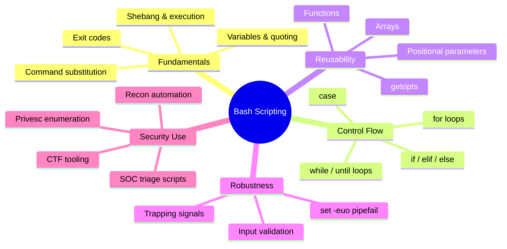
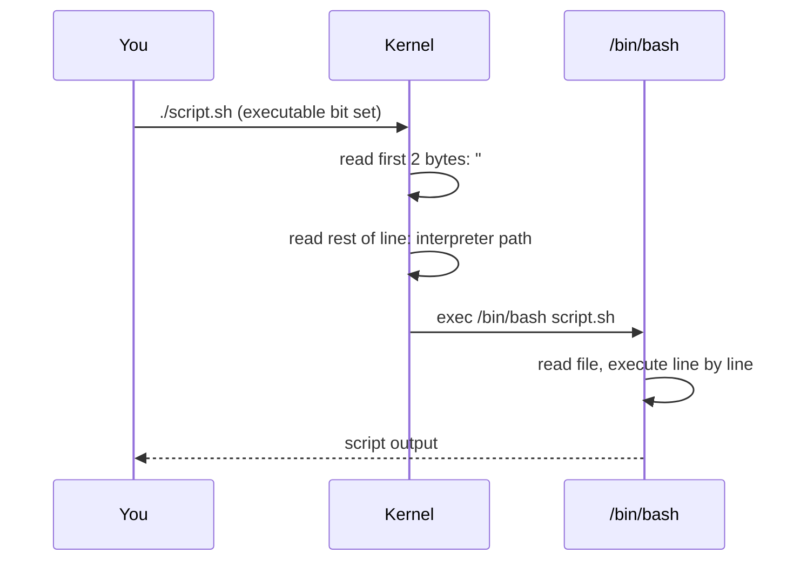
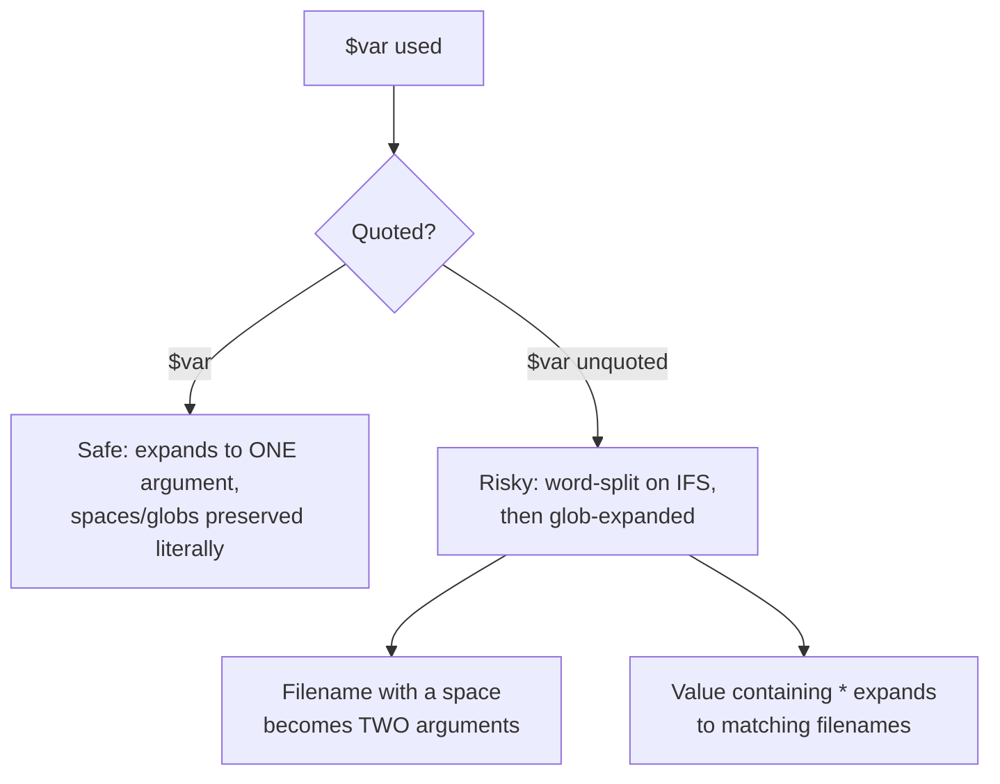
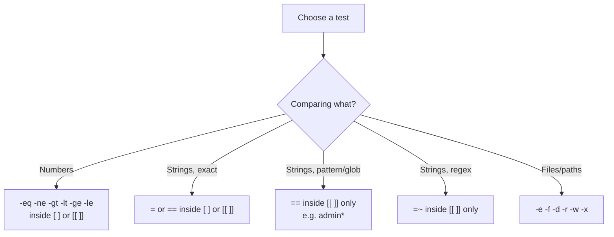
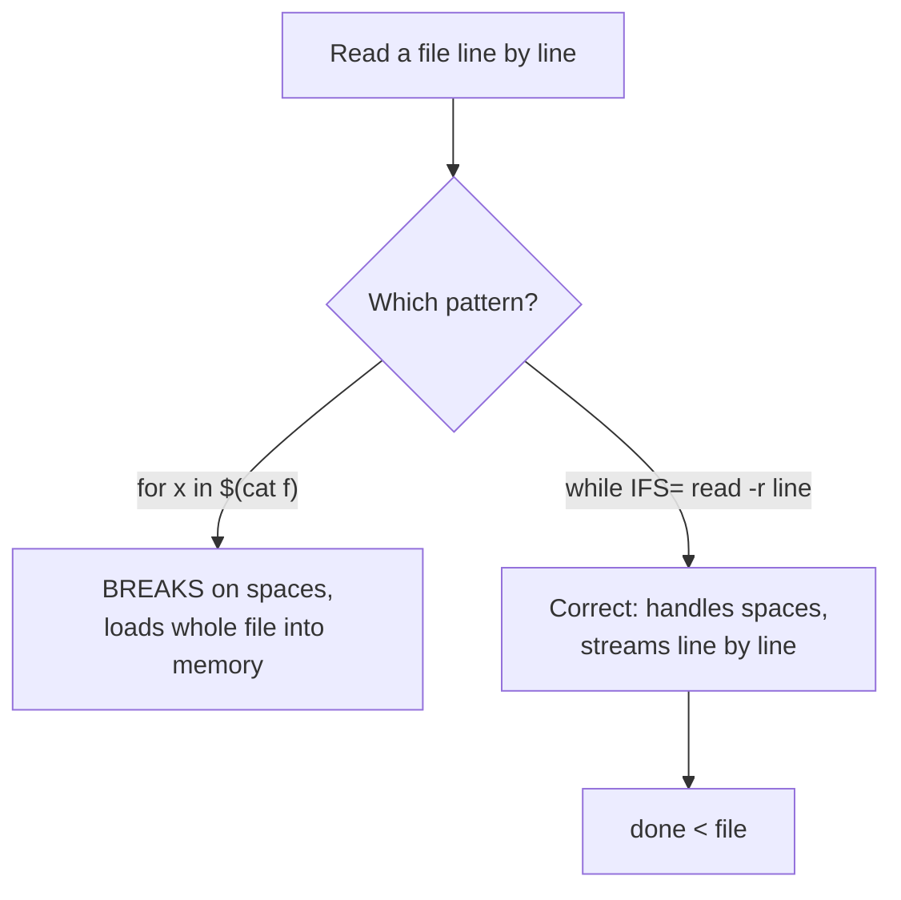
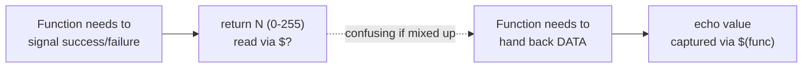
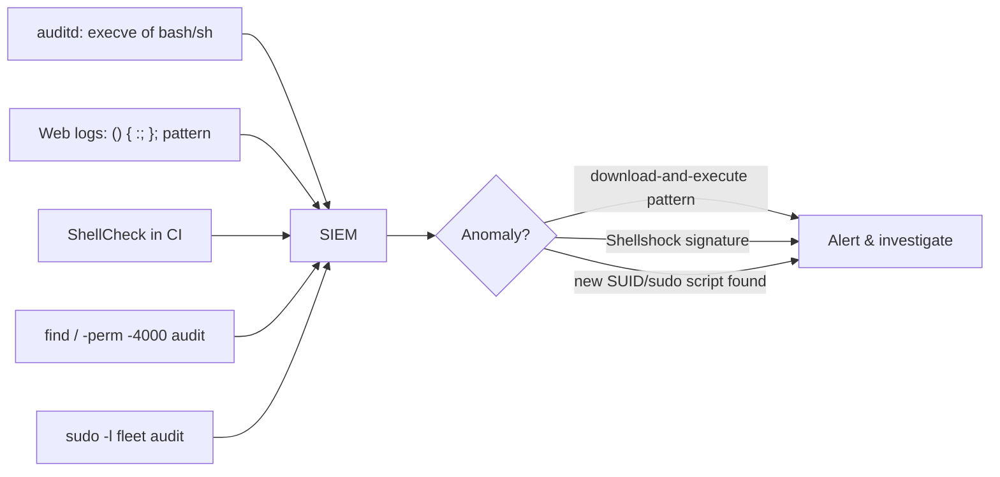

**Level:** Intermediate · **Track:** Foundations · **Read time:** 100 min

---

## Who This Is For, and Why Bash Scripting Matters

You already know individual Linux commands. This chapter is about *chaining* them into reusable, reliable tools instead of retyping the same fifteen commands every time you land on a new box or start a new engagement. Bash scripting matters for five concrete reasons:

1. **Every recon and enumeration workflow is a script.** LinPEEN, LinEnum, autorecon, and every custom enumeration script you'll ever write are bash under the hood — loops over targets, conditionals on tool output, variables holding IPs and ports.
2. **CTFs reward automation.** A script that tries every SUID binary against GTFOBins, or brute-forces a flag format, saves the minutes that separate first blood from last place.
3. **Exploits and PoCs ship as shell scripts.** Many public exploits on Exploit-DB and GitHub are `.sh` files you must read, understand, and sometimes modify before running — you need to be able to read bash as fluently as you read English.
4. **SOC and blue-team tooling runs on bash.** Log-rotation, alert-triage, and quick-look scripts that pull suspicious `auth.log` lines or check for IOCs are almost always bash one-liners stitched into scripts.
5. **It's the one scripting language guaranteed to exist.** Python may not be installed on a hardened box or an embedded device; `/bin/sh` and usually `/bin/bash` almost always are. Bash is the lowest-common-denominator automation language of the entire field.

By the end of this chapter you will be able to write a script from a blank file to a fully working tool: variables and quoting done correctly, `if`/`case` logic, `for`/`while` loops, functions with return values, arrays, command-line argument parsing, robust error handling, and a real multi-target port-scanning wrapper you can extend for the rest of your career.



---

## Part 1: What a Shell Script Actually Is

A **shell script** is a plain text file containing a sequence of shell commands — the exact same commands you'd type interactively — that the shell reads and executes line by line, as if you'd typed them yourself. There's no separate "compiled" form; bash **interprets** the file at run time.

Think of it like a recipe card versus cooking live: interactively, you're a chef improvising in the kitchen, deciding each step as you go. A script is the recipe card — every step written down in order, so *anyone* (including future-you, at 3 AM on an engagement) can execute the exact same sequence without thinking.

### 1.1 The shebang line

Every serious script starts with a **shebang** (`#!`) on the very first line, telling the operating system which interpreter should run the rest of the file:

```bash
#!/bin/bash
```



> **Key insight:** the shebang is not a comment the shell "understands" specially at runtime — it's a convention the **kernel's exec system call** parses *before* bash ever sees the file. If you run the script with `sh script.sh` or `bash script.sh` explicitly, the shebang is ignored entirely (you've already chosen the interpreter on the command line); it only matters when you run the file directly as `./script.sh`.

Common shebang variants and why they differ:

| Shebang | Meaning | When to use |
| --- | --- | --- |
| `#!/bin/bash` | Hard-codes bash's absolute path | Most portable across mainstream Linux distros |
| `#!/usr/bin/env bash` | Finds `bash` via `$PATH` | Safer on systems where bash isn't at `/bin/bash` (some BSDs, macOS, custom `$PATH`s) |
| `#!/bin/sh` | POSIX shell (often `dash` on Debian, not bash) | Only if you're deliberately writing **POSIX-compliant** scripts with no bash-only features |

> **Pitfall:** on Debian/Ubuntu/Kali, `/bin/sh` is a symlink to `dash`, a much stricter, faster, POSIX-only shell — **not** bash. Arrays, `[[ ]]`, `function` keyword syntax, and `$RANDOM` all silently fail or behave differently under `dash`. If your script uses any bash-specific feature (and this chapter's will), the shebang **must** say `bash`, never `sh`.

### 1.2 Making a script executable

```bash
nano recon.sh              # write your script
chmod +x recon.sh          # add the execute bit (see the earlier Permissions chapter)
./recon.sh                 # run it — the "./" is required unless the script's dir is in $PATH
```

If you forget `chmod +x`, you'll see `Permission denied` — or you can sidestep the executable bit entirely and just hand the file straight to an interpreter:

```bash
bash recon.sh               # runs it under bash regardless of permission bits or shebang
```

This "just feed it to bash" trick is exactly how you run scripts you find on a target that you can't `chmod`, or exploit `.sh` files you download from Exploit-DB.

---

## Part 2: Variables — Storing and Using Data

### 2.1 Declaring and reading variables

```bash
name="Praneeth"             # NO spaces around the = (this is the #1 beginner syntax error)
echo "$name"                # Praneeth
echo $name                  # also works, but unquoted — see Part 2.3 on why this is risky

target_ip="10.10.10.5"
port=443
echo "Scanning $target_ip on port $port"
```

Bash variables are **untyped** — everything is stored as a string internally, even numbers. `port=443` and `port="443"` are identical to bash; arithmetic contexts (Part 2.5) are what make `443` behave numerically.

> **The #1 syntax error every beginner hits:** `name = "value"` (with spaces) does **not** assign a variable — bash parses `name` as a *command* to run, `=` and `"value"` as its arguments, and you get `name: command not found`. Assignment must be `name="value"` with **zero** whitespace around the `=`.

### 2.2 Command substitution — capturing command output into a variable

This is the single most-used technique in real recon scripts: run a command, capture what it printed, store it.

```bash
current_user=$(whoami)
kernel=$(uname -r)
open_ports=$(nmap -p- --min-rate=1000 -T4 "$target_ip" | grep open)

echo "Running as $current_user on kernel $kernel"
```

`$(...)` is the modern syntax. The legacy backtick syntax `` `command` `` does the same thing but doesn't nest cleanly and is harder to read — always prefer `$(...)`:

```bash
# Nesting is trivial with $():
today_backup=$(tar czf "backup-$(date +%F).tar.gz" /etc)

# The backtick equivalent requires escaping and is much uglier — avoid it:
today_backup=`tar czf "backup-\`date +%F\`.tar.gz" /etc`
```

### 2.3 Quoting rules — the concept that breaks the most scripts

Bash has three quoting styles, and mixing them up is the single largest source of broken, unsafe scripts in the wild.

| Quote style | Variable expansion? | Command substitution? | Word splitting / globbing? |
| --- | --- | --- | --- |
| `'single quotes'` | No | No | No — completely literal |
| `"double quotes"` | Yes | Yes | No — safe, preserves the value as one unit |
| *(no quotes)* | Yes | Yes | **Yes** — dangerous |

```bash
filename="my file.txt"

echo $filename         # BAD: expands, then word-splits -> prints "my" and "file.txt" as two args
echo "$filename"       # GOOD: prints "my file.txt" as intended, exactly one argument

rm $filename            # BAD: tries to rm two files: "my" and "file.txt" — probably not what you meant, and dangerous
rm "$filename"          # GOOD: removes the one file named "my file.txt"

echo 'Home is $HOME'    # prints literally: Home is $HOME  (single quotes = no expansion at all)
echo "Home is $HOME"    # prints: Home is /root           (double quotes = variable IS expanded)
```

> **The golden rule of bash safety: quote every variable expansion `"$var"` unless you have a specific, deliberate reason not to.** Unquoted variables are the root cause of an entire category of bugs and vulnerabilities — from scripts that silently delete the wrong files when a variable contains a space, to command-injection-style bugs when a variable contains shell metacharacters. `shellcheck` (Part 4) exists largely to catch exactly this mistake.



### 2.4 Special / built-in variables

```bash
$0        # the script's own name/path
$1 $2 $3  # positional arguments — the 1st, 2nd, 3rd argument passed to the script
$#        # the NUMBER of arguments passed
$@        # ALL arguments, as separate quoted words (almost always what you want)
$*        # ALL arguments, as ONE single string (rarely what you want)
$?        # exit status of the LAST command run (0 = success, non-zero = failure)
$$        # the current script's own process ID (PID)
$!        # PID of the last backgrounded process (started with &)
```

```bash
#!/bin/bash
# usage: ./greet.sh Alice Bob
echo "Script name: $0"
echo "First arg: $1"
echo "Arg count: $#"
echo "All args: $@"
```

```text
$ ./greet.sh Alice Bob
Script name: ./greet.sh
First arg: Alice
Arg count: 2
All args: Alice Bob
```

> **`$@` vs `$*` — the difference that matters:** when quoted, `"$@"` expands to each argument as a **separate** quoted word (`"Alice" "Bob"`), correctly preserving arguments containing spaces. `"$*"` expands to **one single string** joined by the first character of `$IFS` (a space by default): `"Alice Bob"`. When looping over arguments, always use `"$@"`, never `"$*"` or the unquoted forms.

### 2.5 Arithmetic — doing math in bash

Bash is a string-processing shell first; arithmetic needs an explicit context:

```bash
count=5
count=$((count + 1))       # arithmetic expansion — count is now 6
echo $((10 % 3))            # modulo -> 1
echo $((2 ** 8))            # exponent -> 256

let count++                 # alternative: 'let' evaluates an arithmetic expression
((count++))                 # another alternative: double-parens arithmetic command

if (( count > 5 )); then
    echo "count exceeds 5"
fi
```

`$(( ))` is the arithmetic **expansion** (produces a value); `(( ))` alone is the arithmetic **command** (produces a true/false exit status) — used almost exclusively inside `if`/`while` conditions.

---

## Part 3: Conditionals — Making Decisions

### 3.1 `if` / `elif` / `else`

```bash
#!/bin/bash
port=22

if [ "$port" -eq 22 ]; then
    echo "SSH port detected"
elif [ "$port" -eq 80 ] || [ "$port" -eq 443 ]; then
    echo "Web port detected"
else
    echo "Other port: $port"
fi
```

### 3.2 Test operators — `[ ]` vs `[[ ]]`

`[ ]` is the traditional **POSIX test command** (literally an alias for the `test` binary). `[[ ]]` is bash's own **extended test keyword** — more powerful, more forgiving, and generally the better default in bash-only scripts.

```bash
# [ ] — POSIX test. Requires careful quoting; word-splits and globs like any other command.
if [ "$name" = "admin" ]; then echo "match"; fi

# [[ ]] — bash keyword. Safer (no word-splitting inside it), supports pattern
#         matching and regex, and lets you use && / || directly inside the brackets.
if [[ "$name" == admin* ]]; then echo "starts with admin"; fi
if [[ "$file" =~ \.log$ ]]; then echo "log file"; fi   # regex match with =~
```

| Test | String | Numeric | Meaning |
| --- | --- | --- | --- |
| Equal | `=` or `==` (in `[[`) | `-eq` | Values are equal |
| Not equal | `!=` | `-ne` | Values differ |
| Greater than | (use `[[`, `>`) | `-gt` | Left > right |
| Less than | (use `[[`, `<`) | `-lt` | Left < right |
| Greater/equal | — | `-ge` | Left >= right |
| Less/equal | — | `-le` | Left <= right |
| Empty string | `-z "$var"` | — | True if `$var` is empty |
| Non-empty string | `-n "$var"` | — | True if `$var` is non-empty |
| File exists | `-e "$path"` | — | True if the path exists (any type) |
| Regular file | `-f "$path"` | — | True if it's a regular file |
| Directory | `-d "$path"` | — | True if it's a directory |
| Readable | `-r "$path"` | — | True if readable by you |
| Executable | `-x "$path"` | — | True if executable by you |

> **Classic gotcha:** using `=` for **numeric** comparison silently does the *wrong thing* — `[ "10" = "9" ]` is a **string** comparison ("10" ≠ "9" as text, which happens to also be correct here, but `[ "10" = "010" ]` is false as strings while numerically equal). Always use `-eq`/`-ne`/`-gt`/etc. for numbers and `=`/`!=` for strings — mixing them up is a very common source of scripts that silently misbehave on edge-case input.



### 3.3 `case` — cleaner multi-way branching

When you have many possible values to check (menu options, service names, arguments), `case` is far more readable than a long `elif` chain:

```bash
#!/bin/bash
read -rp "Select scan type [quick/full/udp]: " scan_type

case "$scan_type" in
    quick)
        nmap -F "$target" ;;
    full)
        nmap -p- "$target" ;;
    udp)
        nmap -sU "$target" ;;
    *)
        echo "Unknown option: $scan_type" ; exit 1 ;;
esac
```

`case` also supports glob-style pattern matching per branch, which is heavily used for argument parsing:

```bash
case "$1" in
    -h|--help)   show_help ;;
    -v|--verbose) VERBOSE=1 ;;
    *.txt)        process_text_file "$1" ;;
    *)            echo "Unknown: $1" ;;
esac
```

---

## Part 4: Tools of the Trade — Bash Itself, `shellcheck`, and `set` Safety Flags

Bash the interpreter needs no separate installation — it's the default shell on almost every Linux distro. The tool every serious bash author adds to their workflow is **ShellCheck**, a static analysis linter that catches exactly the quoting, word-splitting, and logic bugs described above *before* you run the script.

### 4.1 Installing and using ShellCheck (Tool Primer)

**What it is:** a linter purpose-built for shell scripts. It parses your script and flags specific, numbered warnings (`SC2086`, `SC2046`, etc.) for known bash pitfalls, with a plain-English explanation and often a suggested fix.

**Why it exists:** bash's syntax is permissive and forgiving at parse time, which means most bash bugs are only discovered at *runtime*, often on someone else's machine, often destructively. ShellCheck catches them statically, the same way a compiler's warnings catch bugs in C before you ship a binary.

```bash
# Install
sudo apt install shellcheck        # Debian/Ubuntu/Kali
sudo dnf install ShellCheck        # Fedora
sudo pacman -S shellcheck          # Arch

# Core usage
shellcheck recon.sh
```

Example output on a script with a classic unquoted-variable bug:

```text
In recon.sh line 4:
rm $filename
   ^-------^ SC2086: Double quote to prevent globbing and word splitting.

Did you mean:
rm "$filename"
```

Every warning code is documented at `shellcheck.net/wiki/<code>` — reading the wiki page for a warning the first few times you hit it is how you internalize *why* the rule exists, not just how to silence it.

### 4.2 `set` — bash's built-in safety flags

Before ShellCheck even runs, three flags at the top of every serious script prevent entire classes of silent failure:

```bash
#!/bin/bash
set -euo pipefail
```

| Flag | Effect |
| --- | --- |
| `set -e` | Exit immediately if **any** command returns non-zero (instead of barreling on with a failed step ignored) |
| `set -u` | Treat use of an **unset** variable as an error and exit (catches typos like `$fiel` instead of `$file`) |
| `set -o pipefail` | In a pipeline (`a \| b \| c`), the pipeline's exit status is the **first** non-zero exit code, not just the last command's (by default, a pipeline only fails if the *last* command fails, hiding earlier failures) |

```bash
#!/bin/bash
set -euo pipefail

# Without 'set -e': if 'cd' fails (dir doesn't exist), rm -rf runs in the WRONG directory.
# With 'set -e': the script stops the instant 'cd' fails, before rm ever runs.
cd "$target_dir"
rm -rf ./*
```

> **Why this one example matters so much:** `cd /nonexistent; rm -rf ./*` without `set -e` is a textbook way to accidentally wipe the *current* directory instead of the intended one, because a failed `cd` doesn't stop execution by default — the very next line runs anyway, just in the wrong place. `set -euo pipefail` at the top of every script you write is one of the highest-value one-line habits in this entire chapter.

---

## Part 5: Loops — Repeating Work

### 5.1 `for` loops

```bash
# Loop over a literal list
for port in 21 22 80 443 3306; do
    echo "Checking port $port"
done

# Loop over command output (classic recon pattern)
for ip in $(cat targets.txt); do
    ping -c 1 -W 1 "$ip" &>/dev/null && echo "$ip is up"
done

# C-style for loop
for (( i=1; i<=5; i++ )); do
    echo "Attempt $i"
done

# Loop over files with a glob
for logfile in /var/log/*.log; do
    echo "Found log: $logfile"
done
```

> **Pitfall — `for ip in $(cat targets.txt)` breaks on filenames/IPs with spaces or special chars.** It works for a simple list of IPs but is fragile in general. The robust pattern for reading a file line-by-line is a `while read` loop (Part 5.2), which correctly handles spaces and doesn't choke on very large files the way command substitution can.

### 5.2 `while` and `until` loops

```bash
# The correct, robust way to process a file line by line
while IFS= read -r line; do
    echo "Target: $line"
done < targets.txt

# while as a "keep trying" loop
attempts=0
while [ "$attempts" -lt 3 ]; do
    ssh user@target "echo connected" && break
    ((attempts++))
    echo "Retry $attempts..."
    sleep 2
done

# until — the mirror image of while (loops UNTIL the condition becomes true)
count=0
until [ "$count" -ge 5 ]; do
    echo "Count is $count"
    ((count++))
done
```

> **Why `IFS= read -r line` specifically, not just `read line`:** setting `IFS=` (empty) for the duration of `read` stops it from trimming leading/trailing whitespace off each line, and `-r` stops `read` from treating backslashes as escape characters (so a Windows path or a backslash in a log line survives intact). This exact incantation, `while IFS= read -r line; do ... done < file`, is the professional-grade way to read a file line by line in bash — memorize it verbatim.



### 5.3 Loop control: `break` and `continue`

```bash
for port in $(seq 1 100); do
    if [ "$port" -eq 50 ]; then
        continue    # skip this iteration, move to the next port
    fi
    if [ "$port" -eq 80 ]; then
        echo "Found web port, stopping"
        break       # exit the loop entirely
    fi
done
```

---

## Part 6: Functions — Making Code Reusable

### 6.1 Defining and calling functions

```bash
#!/bin/bash

# Two equivalent syntaxes; the second is more portable across shells
greet() {
    echo "Hello, $1"
}

function scan_port() {
    local target="$1"     # 'local' scopes the variable to this function only
    local port="$2"
    if nc -z -w1 "$target" "$port" 2>/dev/null; then
        echo "$port/tcp open"
    fi
}

greet "Praneeth"
scan_port "10.10.10.5" 22
```

> **`local` matters more than beginners think.** Without `local`, every variable inside a function is **global** by default — a function that innocently reuses a name like `count` or `result` will silently clobber a variable of the same name anywhere else in the script. `local var="value"` scopes it strictly to the function's own execution, exactly like a variable declared inside a function in any other language.

### 6.2 Return values — the exit-status trap

This is the concept that trips up almost everyone coming from Python or JavaScript: **bash functions don't "return" data the way you'd expect.** The `return` keyword sets the function's **exit status** (a number 0–255, following the same convention as any command's `$?`), not an arbitrary value.

```bash
is_port_open() {
    local target="$1" port="$2"
    if nc -z -w1 "$target" "$port" 2>/dev/null; then
        return 0     # success — by convention, 0 means "true"/"succeeded"
    else
        return 1     # failure — any non-zero means "false"/"failed"
    fi
}

if is_port_open "10.10.10.5" 22; then
    echo "port 22 is open"
fi
```

To actually get **data** back out of a function (a string, a number, a computed value), the idiomatic pattern is to `echo` the value and capture it with command substitution at the call site — exactly the same mechanism from Part 2.2:

```bash
get_os_guess() {
    local ttl="$1"
    if [ "$ttl" -le 64 ]; then
        echo "Linux"
    else
        echo "Windows"
    fi
}

os=$(get_os_guess 60)
echo "Detected OS: $os"
```



---

## Part 7: Arrays — Storing Lists of Values

```bash
# Declaring and populating
targets=("10.10.10.5" "10.10.10.6" "10.10.10.7")
ports=(21 22 80 443 3306)

# Accessing elements (zero-indexed)
echo "${targets[0]}"        # 10.10.10.5
echo "${targets[@]}"        # ALL elements, each as a separate word
echo "${#targets[@]}"       # array length -> 3

# Looping over an array
for ip in "${targets[@]}"; do
    echo "Scanning $ip"
done

# Appending
targets+=("10.10.10.8")

# Associative arrays (bash 4+) — key/value pairs
declare -A service_ports
service_ports[ssh]=22
service_ports[http]=80
service_ports[https]=443

for svc in "${!service_ports[@]}"; do    # ! gives you the KEYS
    echo "$svc -> ${service_ports[$svc]}"
done
```

> **Quoting arrays matters exactly as much as quoting scalar variables.** `"${targets[@]}"` expands each element as its own separate word (correct — handles IPs, hostnames, or filenames with spaces). `${targets[@]}` unquoted, or `${targets[*]}`, collapses everything and reintroduces the exact word-splitting bug from Part 2.3.

---

## Part 8: Command-Line Argument Parsing with `getopts`

Real tools accept flags (`-t`, `-p`, `--verbose`). Bash's built-in `getopts` handles single-character flags cleanly:

```bash
#!/bin/bash
set -euo pipefail

usage() {
    echo "Usage: $0 -t <target> -p <port> [-v]"
    exit 1
}

verbose=0
while getopts "t:p:vh" opt; do
    case "$opt" in
        t) target="$OPTARG" ;;
        p) port="$OPTARG" ;;
        v) verbose=1 ;;
        h) usage ;;
        *) usage ;;
    esac
done

: "${target:?target is required, use -t}"   # fail with a message if $target is unset
: "${port:?port is required, use -p}"

[ "$verbose" -eq 1 ] && echo "[*] Verbose mode on"
echo "[*] Scanning $target:$port"
```

```text
$ ./scan.sh -t 10.10.10.5 -p 22 -v
[*] Verbose mode on
[*] Scanning 10.10.10.5:22

$ ./scan.sh -p 22
./scan.sh: line 15: target: target is required, use -t
```

The `t:` syntax means flag `-t` **expects an argument** (captured into `$OPTARG`); a bare letter with no colon (like `v` or `h`) is a boolean flag that takes no argument. This is the exact pattern behind almost every custom recon/enumeration script's argument handling you'll encounter.

---

## Part 9: Step-by-Step Hands-On Lab — Building a Real Recon Wrapper

Work through this end to end in any Linux VM (a Kali VM against `scanme.nmap.org`, or any lab target you're authorized to test, is ideal). It exercises every concept above in one working tool.

**1. Create the script skeleton with safety flags and argument parsing.**

```bash
#!/bin/bash
set -euo pipefail

usage() {
    echo "Usage: $0 -f <targets-file> -o <output-dir>"
    exit 1
}

while getopts "f:o:h" opt; do
    case "$opt" in
        f) targets_file="$OPTARG" ;;
        o) outdir="$OPTARG" ;;
        h) usage ;;
        *) usage ;;
    esac
done

: "${targets_file:?-f targets file is required}"
: "${outdir:?-o output dir is required}"
```

**2. Add a function that checks a single host is alive and returns success/failure via exit status.**

```bash
is_alive() {
    local ip="$1"
    ping -c 1 -W 1 "$ip" &>/dev/null
}
```

**3. Add a function that runs a quick top-1000-port scan and echoes a summary string (data returned via echo, per Part 6.2).**

```bash
quick_scan() {
    local ip="$1"
    local result
    result=$(nmap -T4 -F "$ip" 2>/dev/null | grep -c open || true)
    echo "$result"
}
```

**4. Loop over the targets file line by line (the robust pattern from Part 5.2), skip dead hosts, and write per-host output.**

```bash
mkdir -p "$outdir"

while IFS= read -r ip; do
    [ -z "$ip" ] && continue          # skip blank lines
    if is_alive "$ip"; then
        echo "[+] $ip is alive"
        open_count=$(quick_scan "$ip")
        echo "[+] $ip has $open_count open ports (top 1000)"
        nmap -T4 -F "$ip" -oN "$outdir/$ip.txt" &>/dev/null
    else
        echo "[-] $ip did not respond to ping"
    fi
done < "$targets_file"

echo "[*] Done. Results in $outdir/"
```

**5. Assemble, `chmod +x`, run `shellcheck` on it, and execute against a lab targets file.**

```bash
chmod +x recon-wrapper.sh
shellcheck recon-wrapper.sh          # fix anything it flags before trusting the script
echo -e "scanme.nmap.org\n127.0.0.1" > targets.txt
./recon-wrapper.sh -f targets.txt -o results/
```

**Expected output pattern:**

```text
[+] scanme.nmap.org is alive
[+] scanme.nmap.org has 4 open ports (top 1000)
[+] 127.0.0.1 is alive
[+] 127.0.0.1 has 1 open ports (top 1000)
[*] Done. Results in results/
```

**Takeaway:** you've built a functioning multi-target recon wrapper using variables, quoting, a robust `while read` loop, functions with both exit-status and echoed-data return patterns, `getopts` argument parsing, and `set -euo pipefail` safety — the exact skeleton every larger enumeration tool you'll write (or read) in this notebook is built from.

---

## Part 10: Advanced Techniques & Edge Cases

### 10.1 Trapping signals with `trap`

`trap` lets a script run cleanup code when it receives a signal (Ctrl+C, `kill`, or normal exit) — essential for scripts that create temp files or need to leave a target system clean:

```bash
tmpfile=$(mktemp)

cleanup() {
    echo "[*] Cleaning up..."
    rm -f "$tmpfile"
}
trap cleanup EXIT              # runs cleanup on ANY exit — normal, error, or Ctrl+C
trap 'echo "Interrupted!"; exit 130' INT   # SIGINT (Ctrl+C) specific handling

echo "data" > "$tmpfile"
sleep 30   # try Ctrl+C here — cleanup still runs via the EXIT trap
```

> **Offensive relevance:** on an engagement, dropped temp files and half-run scripts on a target box are forensic evidence. A `trap cleanup EXIT` at the top of any script you run *on* a target — deleting dropped tools, restoring modified files, clearing history — is standard operational hygiene, not just good coding practice.

### 10.2 Here-documents and here-strings

```bash
# Here-document — feed multi-line text to a command's stdin
cat <<EOF > report.txt
Target: $target
Date: $(date)
Open ports: $open_count
EOF

# Here-string — feed a single value as stdin, no temp variable needed
grep "root" <<< "$passwd_line"
```

### 10.3 Process substitution

```bash
# Compare the output of two commands as if they were files
diff <(nmap -F 10.10.10.5) <(nmap -F 10.10.10.6)
```

`<(...)` runs the command and presents its output as a temporary file-like path — extremely useful for comparing scan results or diffing two versions of a config without manual temp files.

### 10.4 Debugging with `set -x` and `bash -x`

```bash
set -x      # turn on execution tracing: prints every command + expanded values before running it
... suspect code ...
set +x      # turn tracing back off

# Or trace the WHOLE script from the outside without editing it:
bash -x recon-wrapper.sh -f targets.txt -o results/
```

```text
+ target_file=targets.txt
+ outdir=results/
+ mkdir -p results/
+ read -r ip
+ is_alive scanme.nmap.org
```

`-x` tracing is the single fastest way to find *where exactly* a script diverges from what you expected — read it like a play-by-play of every expansion and command bash actually executed.

---

## Part 11: Common Challenges, Mistakes & How to Overcome Them

| Symptom | Cause | Fix |
| --- | --- | --- |
| `command not found` right after an assignment | Space around `=` in `var = value` | Remove all whitespace: `var=value` |
| Script works interactively, fails as a script | Ran with `sh script.sh` but used bash-only syntax (arrays, `[[ ]]`) | Run as `./script.sh` (respects shebang) or `bash script.sh` explicitly, never `sh` |
| `rm`/`mv` acts on the wrong files | Unquoted variable word-split on a filename with a space | Quote every expansion: `"$var"` |
| Loop "misses" the last line of a file | Missing trailing newline + wrong read pattern | Use `while IFS= read -r line; do ... done < file` |
| `[ $x -eq $y ]: integer expression expected` | `$x` or `$y` was empty/unset | `set -u` to catch this immediately; validate/quote inputs |
| Script keeps running after a command fails | No `set -e` | Add `set -euo pipefail` at the top |
| Function's `return 5` doesn't give you "5" as data | Confusing exit-status `return` with data return | `echo` the value, capture with `$(function_call)` |
| `./script.sh: Permission denied` | Missing execute bit | `chmod +x script.sh` |
| `$SCRIPT_DIR` resolves incorrectly when called from another directory | Used `$0` naively instead of resolving its real directory | `SCRIPT_DIR=$(cd "$(dirname "${BASH_SOURCE[0]}")" && pwd)` |
| Pipeline silently "succeeds" even though an early stage failed | Default pipeline exit status is only the LAST command's | `set -o pipefail` |
| Variable set inside a `while ... \| ...` pipeline loop "disappears" after the loop | Pipe creates a subshell — the loop body runs in a **child process**, so variable changes don't survive | Use `< file` redirection instead of `cat file \|` to feed the loop, or use `<(...)` process substitution |

> **The subshell pitfall deserves its own example**, because it silently defeats beginners constantly:

```bash
# BROKEN: count is always 0 after the loop — the "while" ran in a subshell created by the pipe
count=0
cat targets.txt | while read -r line; do
    ((count++))
done
echo "$count"     # prints 0, not the real count!

# FIXED: input redirection avoids the pipe, so the loop runs in the SAME shell
count=0
while read -r line; do
    ((count++))
done < targets.txt
echo "$count"      # prints the correct count
```

---

## Part 12: Real-World Application & Case Studies

**Enumeration scripts on real engagements.** Tools like `LinPEAS`, `LinEnum`, and `linux-smart-enumeration` are, at their core, long bash scripts of exactly the patterns in this chapter: functions per check, loops over `/etc/passwd` or SUID binaries, conditionals flagging anything interesting, all piped into color-coded output. Reading their source is one of the best ways to level up your own bash — they're free, real-world, battle-tested examples of professional-grade scripting.

**Public exploit PoCs.** A large fraction of Exploit-DB entries are `.sh` scripts wrapping a sequence of `curl`/`nc`/compiler commands to weaponize a CVE. Being able to read one cold — spot the target IP variable, the payload construction, the actual trigger command — is a directly transferable skill from this chapter.

**Log-rotation and SOC tooling.** `logrotate` configs aside, countless internal SOC scripts are bash wrappers around `grep`/`awk` pulling suspicious lines from `auth.log`/`syslog`, emailing a summary, and archiving the raw log — `while read` loops, `case` statements matching on log patterns, and `trap`-based cleanup all show up directly.

**The Shellshock vulnerability (CVE-2014-6271), 2014.** A flaw in how bash parsed environment variables let attackers embed **arbitrary commands** inside a specially-crafted environment variable value; any program that passed untrusted input into bash as an env var (many CGI scripts did) executed attacker code. It's the definitive historical lesson that a shell isn't just a scripting tool — it's a full interpreter, and untrusted input reaching it anywhere (an env var, a filename, a form field later `eval`'d) is a code-execution vulnerability, not a cosmetic bug.

---

## Part 13: Bug Bounty & CTF Angles

> **Bug Bounty Angle** — Bash scripting itself rarely earns a bounty directly, but the **command injection** vulnerability class it teaches you to recognize is one of the highest-severity, most consistently payable bug classes across every major program. Any web feature that builds a shell command from user input — a "ping this host" diagnostic tool, an image-conversion pipeline shelling out to ImageMagick, a backup feature calling `tar`/`zip` with a user-supplied filename — is a candidate. The exact quoting failures this chapter teaches you to avoid in your *own* scripts (`rm $filename` versus `rm "$filename"`) are the same failures that let an attacker's input reach a real shell on the backend. A concrete hunting pattern: find a parameter that looks like it's passed to a system utility (hostname, filename, IP for a "traceroute" feature), then probe with shell metacharacters (`; id`, `` `id` ``, `$(id)`, `| id`, `\|\|id`) and time-based blind variants (`; sleep 10`) if output isn't reflected — a delayed response confirms execution even with no visible output. Report with the exact injected payload, the delay/behavior observed, and impact framing (full RCE on the backend host), which is almost always Critical severity.

> **CTF Angle** — Two flavors show up constantly. First, **"read this bash script and find the bug"** challenges (common in beginner-to-intermediate CTF web/misc categories): look specifically for unquoted variables reaching `eval`, `bash -c`, or backticks with attacker-controlled input — that's your injection point, and the fix patterns in Part 11's table double as an exploitation checklist read in reverse. Second, **privilege escalation via a sudo-permitted or SUID script**: after landing a shell, `sudo -l` or hunting SUID binaries (`find / -perm -4000 2>/dev/null`) frequently turns up a custom bash script an admin can run as root — read it for any place it takes user input (arguments, environment variables, a file it `source`s or `cat`s from a writable path) and inject there. A worked example: a SUID/sudo script does `tar czf backup.tar.gz "$1"` with `$1` unsanitized and unquoted — passing `--checkpoint=1 --checkpoint-action=exec=/bin/sh` as the argument abuses GNU tar's own checkpoint feature to spawn a root shell (a well-known GTFOBins-documented tar trick), no injection metacharacters even required. Flag is typically retrieved once you have a root shell via `cat /root/root.txt` or similar.

---

## Part 14: Detection & Defense — Blue/Purple Team Perspective

- **Log script execution, not just binary execution.** `auditd` rules on `execve` catch `bash`/`sh` invocations, but the *arguments* matter more — alert on bash being invoked with `-c` and a suspicious embedded command (`bash -c "$(curl ...)"` style download-and-execute patterns are a classic post-exploitation indicator).
- **Watch for Shellshock-style payloads in logs.** Web server access logs containing `() { :; };` in a header or parameter value is the unmistakable signature of a CVE-2014-6271 exploitation attempt, even a decade-plus later — automated scanners still probe for it.
- **Treat any script an application shells out to as untrusted-input-adjacent.** Code review for command injection means grepping for `system()`, `exec()`, backticks, and shell-outs in the app's own codebase and checking whether user input reaches them unsanitized — the same discipline as Part 13's bug-bounty hunting pattern, applied defensively before ship.
- **Harden `IFS` and `PATH` in privileged scripts.** A root-run cron script that trusts the *default* `$PATH` can be hijacked by a world-writable directory earlier in that path containing a malicious binary named the same as a legitimate one it calls (e.g. a fake `ls`); always set an explicit, absolute `PATH` at the top of privileged scripts and call binaries by full path (`/usr/bin/tar`, not bare `tar`) in sensitive contexts.
- **Run ShellCheck in CI.** For any organization shipping internal bash tooling, wiring `shellcheck` into a pre-commit hook or CI pipeline catches the exact injection-adjacent quoting bugs from Part 2.3 before they ship, the same way a linter catches SQL string concatenation before it becomes a SQLi.
- **Restrict SUID/sudo scripts to the absolute minimum, and never let them take unsanitized user-controlled input** — Part 13's tar checkpoint trick and every GTFOBins entry exist because someone made exactly that mistake; a periodic `find / -perm -4000` and `sudo -l` audit across your fleet catches accumulation of these over time.



---

## Final Revision / Summary

- **A script is just recorded commands.** The shebang (`#!/bin/bash`) tells the kernel which interpreter to hand the file to when run directly; it's ignored if you invoke `bash script.sh` explicitly.
- **Quote everything.** `"$var"` is safe; `$var` unquoted word-splits and globs — the root cause of the majority of real-world bash bugs *and* of command-injection vulnerabilities when the same sloppy pattern reaches a shell fed by untrusted input.
- **`[ ]` is POSIX `test`; `[[ ]]` is bash's safer, more powerful extended test** — supports globs (`==`) and regex (`=~`) directly, prefer it in bash-only scripts.
- **`for`/`while`/`until` cover iteration**, but `while IFS= read -r line; do ... done < file` is the one robust, memorizable pattern for reading files line by line — and redirecting `< file` (not piping `cat file |`) avoids the subshell trap that silently discards variables set inside the loop.
- **Functions return an exit status via `return` (0–255, checked via `$?`) — not data.** To hand back actual values, `echo` them and capture with `$(function_call)`. Use `local` on every function-scoped variable to avoid clobbering globals.
- **Arrays (`arr=(...)`)** and `getopts` argument parsing turn a one-off script into a reusable tool with real `-flag value` interfaces.
- **`set -euo pipefail` at the top of every script** stops execution on the first failed command, catches unset-variable typos, and makes pipeline failures visible — the single highest-value line you can add to any bash script.
- **`trap cleanup EXIT`** ensures temp files and target-system artifacts get cleaned up even on Ctrl+C or an error — both good practice and good operational hygiene on an engagement.
- **ShellCheck (`shellcheck script.sh`)** statically catches the quoting and logic bugs this whole chapter warns about — run it on everything before you trust it.
- **Security lens:** every quoting/word-splitting mistake you learn to avoid in your own scripts is the exact same mistake that produces command-injection vulnerabilities in real applications — this chapter is simultaneously a scripting primer and an injection-hunting primer.

**Memory hooks:**
- *"No spaces around the equals"* → `var=value`, never `var = value`.
- *"Quote it or lose it"* → always `"$var"`.
- *"echo for data, return for status"* → the function return-value trap.
- *"Redirect, don't pipe, into a while-read loop"* → avoid the subshell variable trap.
- *"euo pipefail, every single time"* → the three-flag safety habit.
- *"Shellshock: `() { :; };`"* → the unmistakable log signature of the 2014 bash CVE.

---

## Cheat Sheet / Quick Reference

```bash
#!/bin/bash
set -euo pipefail                     # ALWAYS start scripts with this

# ---------- Variables ----------
name="value"                          # NO spaces around =
echo "$name"                          # always quote expansions
result=$(command)                     # command substitution
count=$((1 + 2))                      # arithmetic expansion
((count++))                           # arithmetic command

# ---------- Special variables ----------
$0 $1 $2 "$@" $# $? $$ $!

# ---------- Conditionals ----------
if [ "$a" -eq "$b" ]; then ... fi     # POSIX numeric test
if [[ "$a" == pattern* ]]; then ... fi  # bash glob match
if [[ "$a" =~ ^regex$ ]]; then ... fi   # bash regex match
[ -z "$a" ]   # empty string     [ -n "$a" ]   # non-empty
[ -e path ]   # exists           [ -f path ]   # regular file
[ -d path ]   # directory        [ -x path ]   # executable

case "$var" in
    pattern1) cmd ;;
    pattern2|pattern3) cmd ;;
    *) default_cmd ;;
esac

# ---------- Loops ----------
for x in a b c; do ... done
for (( i=0; i<10; i++ )); do ... done
while IFS= read -r line; do ... done < file   # ROBUST file reading
until [ cond ]; do ... done
break ; continue

# ---------- Functions ----------
myfunc() {
    local var="$1"       # scope to function
    echo "data"           # data OUT via echo + $(myfunc)
    return 0               # status OUT via return + $?
}

# ---------- Arrays ----------
arr=(a b c)
echo "${arr[@]}"          # all elements
echo "${#arr[@]}"          # length
arr+=(d)                   # append
declare -A map; map[key]=value ; echo "${!map[@]}"   # associative array keys

# ---------- Argument parsing ----------
while getopts "t:p:vh" opt; do
    case "$opt" in
        t) target="$OPTARG" ;;
        v) verbose=1 ;;
        h) usage ;;
    esac
done

# ---------- Debugging & safety ----------
shellcheck script.sh        # lint before you trust it
bash -x script.sh           # trace execution
set -x ; ... ; set +x       # trace a section only
trap 'cleanup' EXIT         # guaranteed cleanup on exit/Ctrl+C

# ---------- Here-doc / here-string / process substitution ----------
cat <<EOF
multi
line
EOF
grep pattern <<< "$string"
diff <(cmd1) <(cmd2)
```

---

## Practice Labs & Resources

- **OverTheWire — Bandit (later levels) & Natas** — several levels require reading and writing small shell scripts or spotting bugs in provided ones.
- **TryHackMe — "Bash Scripting" room** — a dedicated, structured walkthrough of everything in this chapter with guided exercises.
- **HackTheBox — any box requiring a custom enumeration/exploitation wrapper** — practice writing your own multi-step script instead of running commands by hand; time yourself against just typing manually.
- **ShellCheck.net** — paste any script in the browser for instant linting; read the wiki page for every warning code you hit at least once.
- **GTFOBins (gtfobins.github.io)** — search "sudo" and "SUID" entries per binary (especially `tar`, `find`, `awk`) to see the exact bash one-liners used for privilege escalation referenced in this chapter's CTF Angle.
- **Exploit-DB** — filter for `.sh` PoCs and practice reading them cold: identify the target variable, the payload, and the trigger command before running anything.
- **The Shellshock (CVE-2014-6271) public writeups and the original bash patch** — read once as the canonical case study connecting shell parsing internals to a real, mass-exploited RCE.
- **`man bash` / `help` builtin** — the authoritative reference for every builtin and expansion covered here; `help getopts`, `help trap`, and `help read` are worth reading in full at least once.

---

*Also on [Praneeth's portfolio](https://ping-praneeth.vercel.app/notebook/linux/06-bash-scripting-essentials-variables-logic-loops-and-functions), with comments and the latest edits.*
