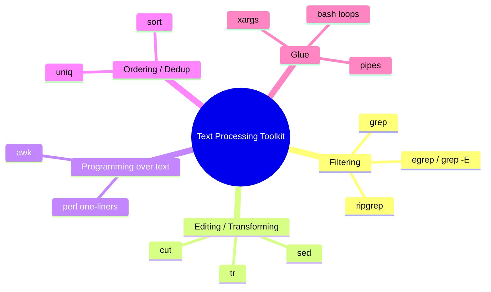
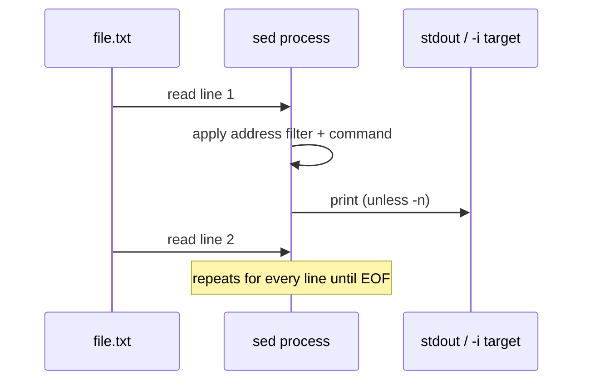
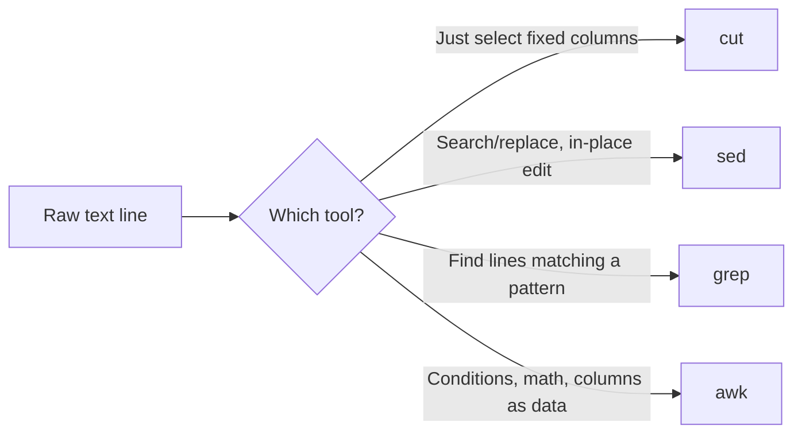

**Level:** Intermediate · **Track:** Foundations · **Read time:** 110 min

Chapter 7 of the Linux series moves from writing scripts to feeding them: everything a script does eventually comes down to slicing, filtering, and transforming text, and this chapter builds the toolbox for that — regular expressions, `grep`, `sed`, `awk`, and their smaller cousins `cut`, `sort`, `uniq`, and `tr`. It builds directly on the bash scripting chapter before it: every loop and conditional you learned there becomes far more useful once it can pull exactly the data it needs out of a wall of text.

---

## Why Text Processing Is the Real Superpower

Almost everything you will ever look at in security work is text: log files, HTTP responses, `nmap` output, `/etc/passwd`, source code, JSON API responses, config files, DNS zone transfers, password dumps. None of it arrives pre-filtered. The entire practice of parsing, filtering, and reshaping that raw text into the three or four lines that actually matter is what separates someone who "ran a tool" from someone who can actually use the output.

Consider a realistic scenario: you run `nmap -sV -oN scan.txt 10.10.10.0/24` against a lab subnet and get back 400 lines covering 254 hosts. You don't want to read all 400 lines. You want one command that prints "IP address, open port, service name" for every host that has port 445 open. That one-liner is built entirely from the tools in this chapter — `grep` to find the lines, `awk` to reshape them, `sort`/`uniq` to deduplicate. This is not a side-skill for a Linux course; it is one of the top three most-used skills in the entire field, alongside reading and writing bash and understanding networking.



By the end of this chapter you'll be able to read and write POSIX and extended regular expressions fluently, use `grep` for fast filtering (including recursive, multiline, and context-aware searches), use `sed` for stream editing and in-place file transformation, use `awk` as a genuine field-based mini-language for reports and pivots, and combine all of it into pipelines you'll reuse for the rest of your career — in recon, in log triage, and in CTF flag-hunting.

## Foundations: What a Regular Expression Actually Is

A regular expression (regex) is a pattern that describes a *set* of strings, not a single string. Think of it as a stencil: instead of cutting one shape, you describe the *rule* for a shape ("any three letters followed by two digits"), and the regex engine finds every piece of text that matches that rule.

### The core building blocks

| Symbol | Meaning | Example | Matches |
|---|---|---|---|
| `.` | any single character | `a.c` | `abc`, `a1c`, `a c` |
| `*` | zero or more of the previous atom | `ab*c` | `ac`, `abc`, `abbbc` |
| `+` (ERE) | one or more of the previous atom | `ab+c` | `abc`, `abbc` (not `ac`) |
| `?` (ERE) | zero or one of the previous atom | `colou?r` | `color`, `colour` |
| `^` | anchor: start of line | `^root` | lines starting with `root` |
| `$` | anchor: end of line | `bash$` | lines ending in `bash` |
| `[...]` | character class | `[aeiou]` | any one vowel |
| `[^...]` | negated character class | `[^0-9]` | any non-digit |
| `\|` (ERE) | alternation (OR) | `cat\|dog` | `cat` or `dog` |
| `(...)` | grouping / capture | `(ab)+` | `ab`, `abab`, `ababab` |
| `{n,m}` | repetition count | `[0-9]{1,3}` | 1 to 3 digits |
| `\` | escape a special character | `\.` | a literal dot |

> **Why it works:** a regex engine is essentially a state machine. Each character in your input moves the machine to a new state (or fails). `*`, `+`, and `{n,m}` just mean "loop back to this state." Understanding this mental model — not memorizing syntax — is what lets you debug a regex that "should" match but doesn't.

### BRE vs ERE vs PCRE — the version confusion that trips everyone up

This is the single biggest source of "my regex doesn't work" frustration for beginners, so get it straight now:

- **BRE (Basic Regular Expressions)** — the default for plain `grep` and `sed` without flags. `+`, `?`, `|`, and `()` are **not special** unless escaped (`\+`, `\?`, `\|`, `\(...\)`).
- **ERE (Extended Regular Expressions)** — used by `grep -E` (or `egrep`), `awk`, and `sed -E` (or `sed -r` on GNU). `+`, `?`, `|`, `()` are special *without* escaping.
- **PCRE (Perl-Compatible Regular Expressions)** — used by `grep -P`, most scripting languages, and Burp Suite's match/replace. Adds lookaheads `(?=...)`, lookbehinds `(?<=...)`, non-greedy `*?`, named groups `(?P<name>...)`, and more.

```mermaid
flowchart TD
    A[Need a regex] --> B{Which tool?}
    B -->|plain grep / sed| C[BRE: escape + ? | ( )]
    B -->|grep -E, egrep, awk, sed -E| D[ERE: + ? | ( ) work unescaped]
    B -->|grep -P, python re, Burp| E[PCRE: lookaheads/behinds, non-greedy, \d \w \s]
```

A concrete, memorable example: to match one-or-more digits —

```bash
grep '[0-9]\+' file.txt      # BRE: + must be escaped
grep -E '[0-9]+' file.txt    # ERE: + works directly
grep -P '\d+' file.txt       # PCRE: \d shorthand for digit
```

All three commands do the same thing here, but only because `+` was escaped correctly for BRE. Forget the escape in BRE mode and `grep '[0-9]+' file.txt` will literally search for the character `+` following a digit — a classic silent bug.

## grep: Finding the Needle

`grep` ("Global Regular Expression Print") searches text for lines matching a pattern and prints them. It's the single most-used command in this entire chapter because 90% of "filter this output" tasks start with it.

### Core usage

```bash
grep "pattern" file.txt              # basic search
grep -i "pattern" file.txt           # case-insensitive
grep -v "pattern" file.txt           # invert match (lines NOT matching)
grep -c "pattern" file.txt           # count matching lines
grep -n "pattern" file.txt           # show line numbers
grep -r "pattern" /path/             # recursive through a directory
grep -l "pattern" *.txt              # print only filenames that match
grep -w "root" file.txt              # match whole word only
grep -A 3 "ERROR" logfile            # 3 lines of context AFTER a match
grep -B 3 "ERROR" logfile            # 3 lines of context BEFORE a match
grep -C 3 "ERROR" logfile            # 3 lines of context on BOTH sides
grep -E "cat|dog" file.txt           # extended regex (alternation)
grep -P "(?<=user=)\w+" file.txt     # Perl regex with lookbehind
grep -o "[0-9]\{1,3\}\.[0-9]\{1,3\}\.[0-9]\{1,3\}\.[0-9]\{1,3\}" file.txt  # only print the match (IPs)
grep -f patterns.txt file.txt        # match against a list of patterns from a file
grep -q "pattern" file.txt; echo $?  # quiet mode — just check exit code (0 = found)
```

### A security-relevant worked example

You have an `auth.log` from a box and want every failed SSH login attempt with the source IP, deduplicated:

```bash
grep "Failed password" /var/log/auth.log | grep -oE "[0-9]{1,3}(\.[0-9]{1,3}){3}" | sort | uniq -c | sort -nr
```

Reading this pipeline left to right: filter to failed-login lines, extract just the IPv4 addresses with a regex, sort them so identical ones are adjacent, count and collapse duplicates (`uniq -c`), then sort by count descending — instantly showing you which IP is hammering the box hardest. This exact one-liner (or a close variant) is something you will type from memory dozens of times in a SOC or DFIR role.

### Common pitfalls

- **Forgetting quotes around the pattern.** `grep root /etc/passwd` mostly works by luck; `grep $foo file` can break badly if `$foo` contains spaces or glob characters. Always quote: `grep "$foo" file`.
- **Shell glob expansion eating your pattern.** `grep [abc] file` — if a file named `a`, `b`, or `c` exists in the current directory, the shell may expand `[abc]` to that filename *before* grep even sees it. Quote your patterns.
- **BRE vs ERE confusion** (covered above) — the #1 cause of "why doesn't my regex match."
- **Binary files.** Grepping a binary prints "binary file matches" instead of the line. Force text-mode output with `grep -a pattern file`.

## sed: The Stream Editor

`sed` reads text line by line, applies **commands** to each line, and prints the result. Its core superpower is search-and-replace, but it is a genuine line-oriented programming language underneath.

### The substitute command — `s///`

```bash
sed 's/old/new/' file.txt          # replace FIRST occurrence per line
sed 's/old/new/g' file.txt         # replace ALL occurrences per line (global)
sed 's/old/new/gi' file.txt        # global + case-insensitive
sed -i 's/old/new/g' file.txt      # edit the file IN PLACE
sed -i.bak 's/old/new/g' file.txt  # in place, but keep file.txt.bak backup
```

> **Why this matters operationally:** `sed -i` with no backup extension **destroys** the original file the instant it runs. On a real engagement, always test your `sed` command WITHOUT `-i` first, confirm the output looks right, and only then add `-i` (ideally with a `.bak` suffix) — a habit that will save you from one of the most common self-inflicted disasters in this field.

### Capture groups and backreferences

```bash
echo "John Smith" | sed -E 's/([A-Za-z]+) ([A-Za-z]+)/\2, \1/'
# -> Smith, John
```

Each `(...)` group is numbered left to right and referenced with `\1`, `\2`, etc. in the replacement. This is exactly how you reformat log lines, CSVs, or config values without writing a full script.

### Line addressing and deletion

```bash
sed -n '5,10p' file.txt      # print ONLY lines 5-10 (-n suppresses auto-print)
sed '5,10d' file.txt         # delete lines 5-10, print everything else
sed '/^#/d' config.conf      # delete comment lines
sed '/^$/d' file.txt         # delete blank lines
sed -n '/START/,/END/p' file.txt  # print everything between two markers, inclusive
```

### A real config-hardening example

Disabling root SSH login across a fleet of boxes with a one-liner (conceptually — always test in a lab first):

```bash
sed -i 's/^#\?PermitRootLogin.*/PermitRootLogin no/' /etc/ssh/sshd_config
```

This matches `PermitRootLogin` whether or not it's commented out (`#\?` matches an optional leading `#`), replaces the whole line with the hardened value, and does it in place. This single pattern — "find a config directive whether commented or not, force it to a known-good value" — appears constantly in hardening scripts and CIS-benchmark remediation tooling.



## awk: The Field-Based Mini-Language

If `grep` finds lines and `sed` edits text, `awk` treats each line as a record split into **fields** — which makes it the natural tool for anything column-shaped: `/etc/passwd`, `ps aux`, CSVs, `nmap` grepable output, log lines with consistent delimiters.

### The mental model

By default, `awk` splits each input line on whitespace into `$1`, `$2`, `$3`, ... and the whole line is `$0`. You write a **pattern { action }** pair, and awk runs the action on every line matching the pattern (no pattern = run on every line).

```bash
awk '{ print $1 }' file.txt          # print the first field of every line
awk -F: '{ print $1 }' /etc/passwd   # -F sets the field separator to ':'
awk '{ print $1, $3 }' file.txt      # print fields 1 and 3
awk 'NR==5' file.txt                 # print only line number 5
awk '/root/ { print }' file.txt      # print lines matching a pattern (like grep)
awk -F: '$3 > 1000' /etc/passwd      # print lines where field 3 (UID) > 1000
awk '{ sum += $1 } END { print sum }' numbers.txt   # sum a column
awk 'BEGIN { print "Report" } { print $0 } END { print "Done" }' file.txt
```

### Built-in variables worth memorizing

| Variable | Meaning |
|---|---|
| `$0` | the entire current line |
| `$1`, `$2`, ... | individual fields |
| `NF` | number of fields on the current line |
| `NR` | current line/record number |
| `FS` | input field separator (default: whitespace) |
| `OFS` | output field separator (default: space) |
| `RS` | input record separator (default: newline) |

### A genuinely useful pentest one-liner

Parsing `nmap -oG` (grepable output) for open ports across a subnet — printing IP and the list of open ports per host:

```bash
nmap -sS -oG scan.gnmap 10.10.10.0/24
grep "/open/" scan.gnmap | awk -F'\t' '{split($2,ip," "); print ip[1]}'
```

And a classic — turning `/etc/passwd` into "username: shell" for a quick account audit:

```bash
awk -F: '{ print $1 ": " $7 }' /etc/passwd
```

Or finding every account with a login shell (not `/usr/sbin/nologin` or `/bin/false`) — a real privesc/account-hygiene check:

```bash
awk -F: '$7 !~ /nologin|false/ { print $1, $7 }' /etc/passwd
```

### Why `awk` over `cut` for the same-looking task

`cut -d: -f1 /etc/passwd` looks similar to `awk -F: '{print $1}' /etc/passwd` — and for this simple case they're interchangeable. The difference shows up the moment you need a **condition** (`$3 > 1000`), **arithmetic** (`sum += $1`), or **multiple fields with custom formatting** — `cut` can only select and reorder fixed columns; `awk` is a real (if small) programming language with variables, control flow, and functions.



## The Supporting Cast: cut, sort, uniq, tr, wc

### cut — quick column extraction

```bash
cut -d: -f1,3 /etc/passwd     # fields 1 and 3, delimiter ':'
cut -c1-10 file.txt           # characters 1 through 10 of every line
echo "a,b,c,d" | cut -d, -f2-3  # b,c
```

### sort — ordering data, the unsung enabler of `uniq`

```bash
sort file.txt                 # alphabetical sort
sort -n numbers.txt            # numeric sort (critical — "10" sorts before "2" alphabetically!)
sort -r file.txt                # reverse order
sort -k2 file.txt               # sort by the 2nd field
sort -k2,2n -t: /etc/passwd     # sort by field 2, numerically, ':' delimited
sort -u file.txt                 # sort AND remove duplicates in one step
```

> **Pitfall that bites everyone once:** `sort` without `-n` sorts *lexically*, so `9, 10, 100, 2` sorts as `10, 100, 2, 9`. If you're sorting port numbers, byte counts, or any numeric column, you almost always want `-n`.

### uniq — collapsing adjacent duplicates

`uniq` only removes **adjacent** duplicate lines — which is exactly why it's almost always preceded by `sort` in real pipelines.

```bash
sort file.txt | uniq          # dedupe
sort file.txt | uniq -c       # dedupe AND count occurrences
sort file.txt | uniq -d       # show ONLY lines that had duplicates
```

### tr — character-level translation

```bash
echo "HELLO" | tr 'A-Z' 'a-z'       # lowercase
tr -d '\r' < winfile.txt > unixfile.txt   # strip Windows carriage returns
echo "a  b   c" | tr -s ' '          # squeeze repeated spaces into one
cat file.txt | tr '\n' ','           # turn newlines into commas
```

### wc — counting

```bash
wc -l file.txt     # count lines
wc -w file.txt     # count words
wc -c file.txt     # count bytes
```

## Building Real Pipelines: Composition Is the Actual Skill

The individual tools matter less than the ability to **chain** them. Here is the mental pattern for building any pipeline from scratch:


Worked example end to end — from a raw Apache access log, find the top 10 IPs hitting a `/wp-login.php` endpoint (a classic brute-force / recon indicator):

```bash
grep "wp-login.php" access.log \
  | awk '{print $1}' \
  | sort \
  | uniq -c \
  | sort -nr \
  | head -10
```

Every step of this pipeline is something you learned in this chapter, and this exact shape — filter, extract, sort, count, rank, truncate — is reusable for almost any "what's the top N of X" question you'll ever ask of log data.

## Advanced Techniques & Edge Cases

### Multiline / cross-line matching

`grep` and `sed` are line-oriented by default and cannot easily match patterns that span multiple lines. For that, use `grep -Pz` (treat the whole file as one string, null-separated) or `awk` with `RS` reset:

```bash
grep -Pzo '(?s)BEGIN.*?END' file.txt     # (?s) makes . match newlines too, -z = null-terminated records
awk 'BEGIN{RS="";FS="\n"} /pattern/' file.txt   # paragraph mode: blank lines separate "records"
```

### Non-greedy matching

POSIX regex (BRE/ERE) has **no** non-greedy operator — `.*` is always greedy. PCRE gives you `.*?`:

```bash
echo '<a><b><c>' | grep -oP '<.*?>'   # matches <a>, <b>, <c> separately
echo '<a><b><c>' | grep -oE '<.*>'    # matches the WHOLE string as one greedy match
```

### awk with multiple field separators / CSV quoting gotchas

Naive CSV parsing with `awk -F,` breaks the moment a field contains a comma inside quotes (`"Smith, John",42`). For anything beyond the simplest CSVs, reach for a proper CSV-aware tool (`csvkit`, Python's `csv` module, or `mlr`/Miller) rather than fighting `awk`/`cut` — know the limit of the tool, don't force it.

### Performance on huge files

`grep` is implemented in C and is fast even on gigabyte log files; `awk` is close behind. `sed -i` on a huge file rewrites the entire file, which can be slow on very large logs — for surgical edits on huge files, consider streaming to a new file (`sed 's/x/y/' bigfile > bigfile.new`) rather than `-i`.

## Real-World Application

- **Pentest/recon**: parsing `nmap`, `masscan`, `amass`, `subfinder`, and `httpx` output is almost entirely `grep`/`awk`/`sort`/`uniq` pipelines — most public recon automation scripts (ProjectDiscovery's tools, `reconftw`, etc.) are bash wrappers doing exactly this.
- **Bug bounty at scale**: hunters commonly pipe `subfinder -d target.com | httpx | grep 200 | awk '{print $1}'` style chains across thousands of subdomains to whittle down to a manageable, live, in-scope target list.
- **SOC/DFIR**: `grep`/`awk` over `auth.log`, `syslog`, web server logs, and `journalctl` output is the fastest way to triage an incident before a SIEM query is even written — many analysts prototype their Splunk/Sigma queries as a `grep`/`awk` one-liner first.
- **Notable real-world relevance**: the "Log4Shell" (CVE-2021-44228) hunt in December 2021 saw defenders worldwide writing `grep -E "jndi:(ldap|rmi|dns)"` across mountains of web server logs within hours of disclosure — a direct, high-stakes application of exactly the regex skills in this chapter.

## Detection & Defense: Blue Team Angle

Attackers use these same tools during post-exploitation to grep for credentials (`grep -r "password" /var/www`), find SUID binaries (`find / -perm -4000 2>/dev/null`), or exfiltrate specific data patterns. Defensively:

- **Auditd rules** can flag suspicious `grep`/`find`/`awk` invocations against sensitive paths (`/etc/shadow`, credential stores) — EDR products build detections on exactly this kind of command-line pattern matching.
- **Shell history and command-line logging** (`auditd` `execve` rules, Sysmon-equivalent on Linux via `auditd` + `ausearch`) let a SOC reconstruct exactly what an attacker grepped for after a breach — teaching you these tools also teaches you what a forensic analyst will be looking at in your own shell history during a red-team debrief.
- **Detecting regex-based log searches for secrets** in your own environment is itself a valuable detection: if an internal user suddenly runs `grep -r "BEGIN RSA PRIVATE KEY" /` across a fileshare, that's a strong anomaly signal.

> **Blue Team CTF / detection challenge angle** — Given a bash history or auditd log, you're commonly asked "what did the attacker search for, and on what file?" The answer is almost always reconstructable by reading the `grep`/`awk`/`find` invocations in sequence — treat every historical command as a clue in a small detective story.

> **Bug Bounty Angle** — Text-processing skill itself isn't directly payable, but it's the force multiplier behind every high-signal bug bounty workflow: `subfinder | httpx -sc -title | grep -i "admin\|login\|jenkins\|jira"` is how top hunters triage thousands of subdomains down to the handful worth manual testing, and `waybackurls domain.com | grep -E "\.js$" | httpx` is a standard way to surface old JS files that leak API keys or endpoints. The report isn't "I used grep" — it's the vulnerability the grep pipeline surfaced.

> **CTF Angle** — Text processing directly solves entire CTF categories. picoCTF and OverTheWire "Bandit" levels frequently hide the flag inside a huge file, requiring `grep -r "picoCTF{" .` or `grep -E "[a-zA-Z0-9_]+\{.*\}"` to find flag-shaped strings. Forensics challenges regularly require `strings file | grep -i flag` or `grep -aoE "CTF\{[^}]*\}" dumpfile`. Practice: OverTheWire Bandit levels 4–8 are built specifically to teach `find`, `grep`, and file-type discrimination.

## Common Mistakes & How to Overcome Them

| Mistake | Symptom | Fix |
|---|---|---|
| Unescaped BRE metacharacters | `grep` for `+`/`?`/`\|` does nothing useful | Use `grep -E` or escape (`\+`) |
| `sort` without `-n` on numbers | Numeric order looks wrong | Add `-n` |
| `sed -i` with no backup | File silently destroyed | Test without `-i` first, or use `-i.bak` |
| Unquoted variables/patterns in grep | Shell glob-expands or word-splits the pattern | Always double-quote |
| Assuming `awk` fields are comma-split by default | Fields come out wrong on CSV | Set `-F,` explicitly |
| Forgetting `uniq` needs sorted input | Duplicate counts wrong | Always `sort` before `uniq` |

## Final Revision / Summary

- A regex describes a *set* of strings via literal characters plus metacharacters (`. * + ? ^ $ [] () {} |`).
- BRE (plain grep/sed) escapes `+ ? | ( )`; ERE (`grep -E`, `awk`, `sed -E`) does not; PCRE (`grep -P`) adds lookaheads/behinds and shorthand classes.
- `grep` finds lines; `sed` edits/transforms text (especially via `s/old/new/`); `awk` treats lines as records of fields and adds real programming (conditions, math, functions).
- `cut`, `sort`, `uniq`, `tr`, `wc` are the supporting cast — `cut` for fixed columns, `sort`+`uniq -c` for the classic "count and rank" pattern, `tr` for character-level translation.
- The real skill is **composition**: filter → extract/reshape → sort → dedupe/count → rank, chained with pipes.
- Mnemonic: **G**rep **F**inds, **S**ed **S**ubstitutes, **A**wk **A**nalyzes columns — "GFSSAA" if you need a peg, or simply: *find it, fix it, field it.*

## Cheat Sheet / Quick Reference

```bash
# grep
grep -i "pat" file          # case-insensitive
grep -v "pat" file          # invert match
grep -rn "pat" dir/         # recursive with line numbers
grep -E "a|b" file          # extended regex alternation
grep -oP "(?<=x=)\w+" file  # PCRE lookbehind, print only match

# sed
sed 's/old/new/g' file           # replace all occurrences
sed -i.bak 's/old/new/g' file    # in-place with backup
sed -n '10,20p' file             # print lines 10-20
sed '/^#/d' file                 # delete comment lines

# awk
awk -F: '{print $1}' /etc/passwd     # first field, custom delimiter
awk -F: '$3>1000' /etc/passwd        # conditional on numeric field
awk '{s+=$1} END{print s}' file      # sum a column

# cut / sort / uniq / tr
cut -d: -f1,3 /etc/passwd
sort -k2,2n -t: file
sort file | uniq -c | sort -nr
tr 'A-Z' 'a-z' < file

# The classic top-N pipeline
grep "pattern" file | awk '{print $1}' | sort | uniq -c | sort -nr | head -10
```

## Practice Labs & Resources

- **OverTheWire: Bandit** — levels 4, 7, 8, 12, and 16 specifically require `grep`, `find`, `sort`, `uniq`, and basic regex to locate the next password; this is the single best free ground-truth lab for this exact chapter.
- **picoCTF** — the "Python Wrangler," "strings," and general forensics challenges routinely require `grep -aoE` against binary dumps to extract flag-shaped strings.
- **HackTheBox Starting Point / Tier 0** boxes — practice piping real `nmap -oG` output through `awk`/`grep` to build target lists instead of reading scan output manually.
- **regex101.com** (set to PCRE or POSIX mode as needed) — the fastest way to build and test a regex interactively before dropping it into `grep`/`sed`/`awk`.
- **TryHackMe "Linux Fundamentals" and "Grep" rooms** — guided walkthroughs reinforcing everything in this chapter with graded exercises.

---

*Also on [Praneeth's portfolio](https://ping-praneeth.vercel.app/notebook/linux/07-text-processing-and-regex-mastery-grep-sed-awk), with comments and the latest edits.*
