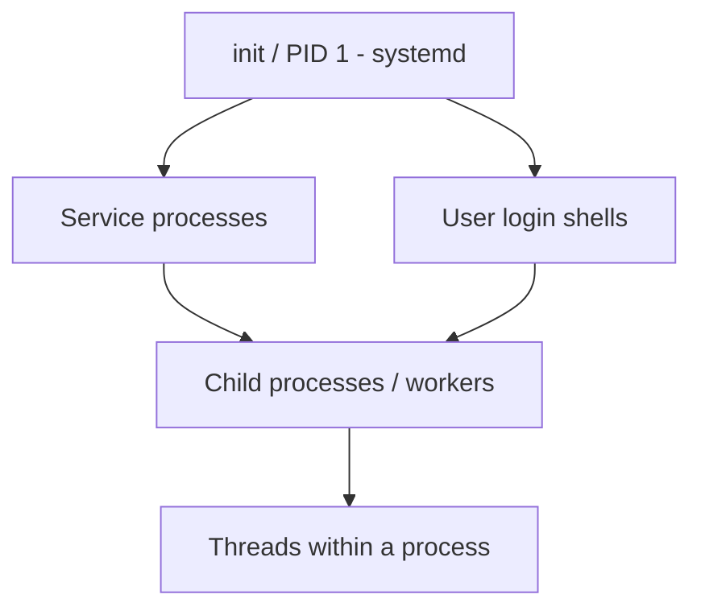
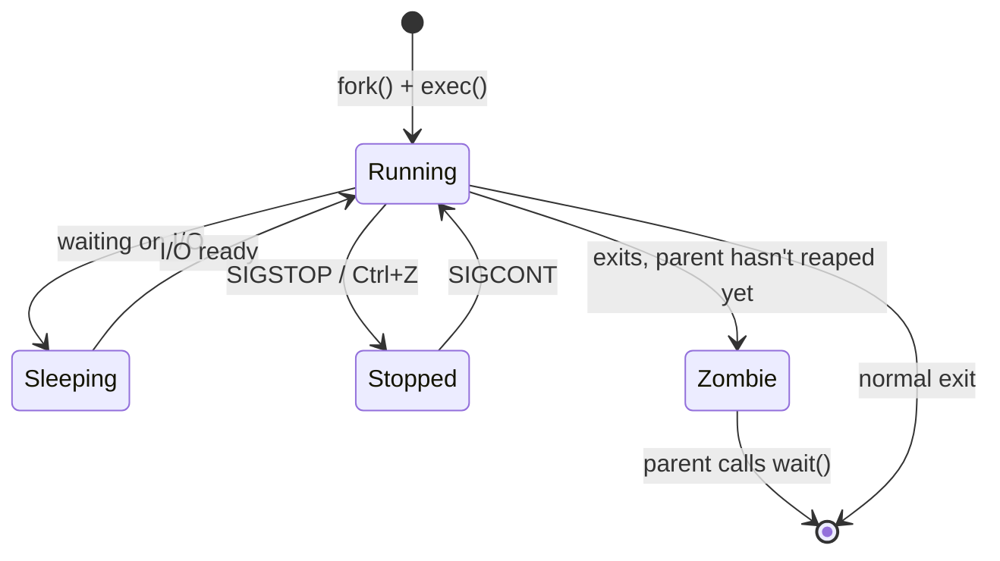
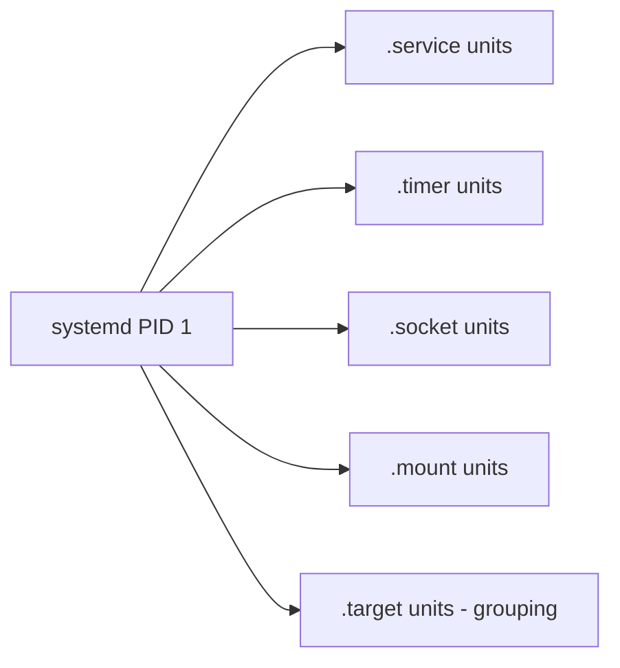
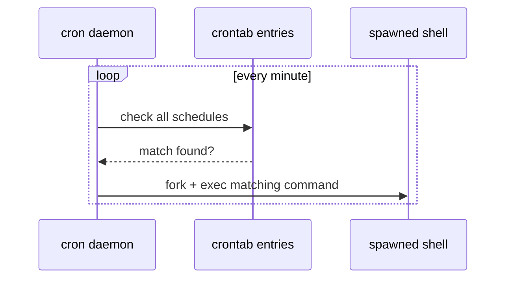

**Level:** Intermediate · **Track:** Foundations · **Read time:** 115 min

Chapter 8 of the Linux series turns from *text on disk* to *code running right now*. It builds on the text-processing skills from the previous chapter — you'll use `grep`/`awk` constantly here to filter process listings — and introduces the process model, `systemd` service management, Unix signals, and the two classic Linux schedulers, `cron` and `systemd` timers. This is also where "Linux Foundations" starts overlapping directly with red-team and blue-team tradecraft: persistence mechanisms, privilege escalation via misconfigured services, and cron-based backdoors are all built on exactly what's in this chapter.

---

## Why Processes Matter for Security Work

Every running program on a Linux box is a **process** — a live instance of a binary loaded into memory, with its own memory space, open file descriptors, user/group ownership, and a place in the process tree. Understanding processes deeply answers questions you'll ask on every single engagement: What is actually running on this box? What user does it run as? Is there a cron job quietly running as root that I can hijack? What service can I restart to trigger my payload? How do I kill or signal a process cleanly instead of just hoping it dies?



## Foundations: What a Process Actually Is

A process is identified by a **PID** (process ID). Every process except PID 1 has a **parent** (PPID), forming a tree rooted at `init`/`systemd` (PID 1). When a process's parent dies, the process is "re-parented" to PID 1 (or a subreaper) — this is why orphaned processes don't vanish.

### Viewing processes

```bash
ps aux                     # classic BSD-style listing, ALL processes, all users
ps -ef                     # System V style listing
ps aux --sort=-%mem        # sorted by memory usage descending
ps -eo pid,ppid,user,cmd   # custom columns
pstree -p                  # visual process tree with PIDs
top                        # live, refreshing view
htop                       # nicer, interactive live view (if installed)
```

Reading `ps aux` output — the columns that matter most for security work:

| Column | Meaning |
|---|---|
| `USER` | who the process runs as — the single most important column for privesc hunting |
| `PID` | process ID |
| `%CPU` / `%MEM` | resource usage — spikes can indicate cryptominers or brute-force tools |
| `STAT` | process state (`R` running, `S` sleeping, `Z` zombie, `T` stopped) |
| `START` | when it started |
| `COMMAND` | the full command line — often reveals passwords passed as arguments! |

> **Why it works / real finding:** `ps aux | grep -i pass` on a freshly compromised or CTF box regularly turns up plaintext credentials passed as command-line arguments to a running service — because command-line arguments are visible to any user via `/proc/<pid>/cmdline`, not just the process owner. This single habit has been worth real points and real bounties.

### The `/proc` filesystem — processes as files

Linux exposes live process information as a virtual filesystem under `/proc`. This is not a curiosity — it's how `ps`, `top`, and most process tools get their data, and you can read it directly:

```bash
cat /proc/1234/cmdline | tr '\0' ' '   # full command line of PID 1234
cat /proc/1234/status                  # detailed state, UID/GID, memory
ls -la /proc/1234/fd/                  # every open file descriptor (files, sockets, pipes)
cat /proc/1234/environ | tr '\0' '\n'  # environment variables (often has secrets!)
readlink /proc/1234/exe                # the actual binary path being executed
```

`/proc/<pid>/environ` and `/proc/<pid>/cmdline` are two of the highest-value, most commonly checked files in Linux privilege escalation enumeration — misconfigured cron jobs and services frequently leak API keys or passwords here.

## Process States and the Process Life Cycle



- **Running (R)** — actively executing or ready to run.
- **Sleeping (S)** — waiting for a resource (disk, network, a lock). Most idle processes sit here.
- **Stopped (T)** — paused, usually by `SIGSTOP` or Ctrl+Z in a shell.
- **Zombie (Z)** — the process has finished but its exit status hasn't been collected by its parent yet. A pile of zombies indicates a parent process with a bug in its cleanup logic — worth flagging in a report.

## Signals: How You Talk to a Running Process

A **signal** is a limited, asynchronous notification sent to a process — the mechanism behind `kill`, Ctrl+C, and graceful service shutdowns.

### The signals you must know cold

| Signal | Number | Meaning | Can be caught/ignored? |
|---|---|---|---|
| `SIGHUP` | 1 | Hangup — often used to tell a daemon "reload your config" | Yes |
| `SIGINT` | 2 | Interrupt — what Ctrl+C sends | Yes |
| `SIGQUIT` | 3 | Quit with core dump | Yes |
| `SIGKILL` | 9 | Force-terminate immediately | **No — cannot be caught, blocked, or ignored** |
| `SIGTERM` | 15 | Polite "please terminate" request | Yes (default signal for `kill`) |
| `SIGSTOP` | 19 | Pause the process | **No — cannot be caught, blocked, or ignored** |
| `SIGCONT` | 18 | Resume a stopped process | Yes |

```bash
kill 1234                 # sends SIGTERM (15) by default — polite request
kill -9 1234               # sends SIGKILL — cannot be ignored, immediate death
kill -HUP 1234              # sends SIGHUP — commonly used to reload daemon configs
killall nginx               # kill by process NAME instead of PID
pkill -f "python.*server"   # kill by matching the full command line via regex
kill -l                     # list all signal names/numbers
```

> **Why it works:** `SIGTERM` gives a process a chance to clean up (close files, flush buffers, remove lock files) before exiting — always try `SIGTERM` first. `SIGKILL` bypasses the process entirely at the kernel level, which is why it always works but can leave corrupted state (half-written files, stale locks) behind. Reach for `-9` only when a process is truly unresponsive.

### Job control in the shell

```bash
long_command &         # run in background, prompt returns immediately
jobs                   # list background jobs in this shell
fg %1                  # bring job 1 to foreground
bg %1                  # resume a stopped job in the background
Ctrl+Z                 # suspend the foreground job (sends SIGSTOP)
disown -h %1           # detach a job so it survives the shell exiting
nohup long_command &   # run a command immune to SIGHUP (survives logout)
```

## systemd: The Modern Linux init System

`systemd` is PID 1 on essentially every modern Linux distribution (Ubuntu, Debian, RHEL/CentOS/Fedora, Arch). It replaced older `init`/`SysVinit` and `upstart` systems, and it manages services, mounts, sockets, timers, and the entire boot sequence via **unit files**.



### Core `systemctl` commands

```bash
systemctl status nginx            # is it running? recent log lines? PID?
systemctl start nginx             # start now
systemctl stop nginx              # stop now
systemctl restart nginx           # stop then start
systemctl reload nginx            # reload config without dropping connections (SIGHUP under the hood)
systemctl enable nginx            # start automatically at boot
systemctl disable nginx           # don't start at boot
systemctl enable --now nginx      # enable AND start in one command
systemctl list-units --type=service         # all loaded service units
systemctl list-units --type=service --state=running  # only running ones
systemctl is-active nginx         # quick active/inactive check for scripting
systemctl is-enabled nginx        # quick boot-enabled check for scripting
```

### Anatomy of a unit file

```ini
# /etc/systemd/system/mytool.service
[Unit]
Description=My custom tool
After=network.target

[Service]
Type=simple
ExecStart=/usr/local/bin/mytool --daemon
Restart=on-failure
User=mytool
Group=mytool

[Install]
WantedBy=multi-user.target
```

- `[Unit]` — metadata and ordering (`After=`, `Requires=`, `Wants=`).
- `[Service]` — how to run it: `ExecStart`, the user/group to run as, restart policy.
- `[Install]` — what target (`multi-user.target` ≈ normal multi-user boot) pulls this unit in when enabled.

After editing or creating a unit file, you must run `systemctl daemon-reload` so systemd re-reads unit files from disk — a step beginners forget constantly, then wonder why their change "didn't take."

> **Security-relevant pitfall:** a `.service` file that is **world-writable**, or that runs `ExecStart` as `root` while pointing at a script in a directory writable by a lower-privileged user, is a direct, classic Linux privilege escalation vector. Enumeration tools like `linpeas` specifically check for writable systemd unit files and writable `ExecStart` targets for exactly this reason.

### Reading logs with journalctl

`systemd` centralizes logs via `journald`, queried with `journalctl`:

```bash
journalctl -u nginx               # logs for one unit
journalctl -u nginx -f            # follow live, like tail -f
journalctl -since "1 hour ago"    # time-windowed
journalctl -p err                 # only error-priority-and-above lines
journalctl -k                     # kernel messages only (dmesg equivalent)
journalctl --disk-usage           # how much space the journal is using
```

## Scheduling: cron and systemd Timers

### cron — the classic scheduler

`cron` runs commands on a fixed schedule defined by **crontab** entries with five time fields:

```
* * * * * command
│ │ │ │ │
│ │ │ │ └── day of week (0-7, both 0 and 7 = Sunday)
│ │ │ └──── month (1-12)
│ │ └────── day of month (1-31)
│ └──────── hour (0-23)
└────────── minute (0-59)
```

```bash
crontab -l                 # list YOUR crontab
crontab -e                 # edit YOUR crontab
crontab -l -u www-data     # list another user's crontab (needs root)
sudo crontab -l            # root's crontab
ls -la /etc/cron.d/        # system-wide cron drop-in directory
cat /etc/crontab           # system-wide crontab
ls /etc/cron.{hourly,daily,weekly,monthly}/  # convenience scheduling directories
```

Example entries:

```cron
0 2 * * *      /opt/backup/run_backup.sh          # every day at 02:00
*/15 * * * *   /usr/local/bin/healthcheck.sh       # every 15 minutes
0 9 * * 1-5    /opt/reports/send_daily_report.sh   # 09:00, weekdays only
@reboot        /opt/tools/startup_check.sh          # once, at boot
```



> **Classic privesc vector:** a cron job that runs as `root` but executes a script or binary that is **writable by a lower-privileged user** (or lives in a directory where the user can create files, or is referenced by a relative/unqualified `PATH`) lets that user's malicious payload run as root the next time the job fires. This exact pattern — "find a cron job I can influence that runs as a higher-privileged user" — is one of the single most common Linux privilege escalation techniques on OSCP-style boxes and real engagements alike.

### systemd timers — the modern alternative

```ini
# /etc/systemd/system/mytool.timer
[Timer]
OnCalendar=*-*-* 02:00:00
Persistent=true

[Install]
WantedBy=timers.target
```

```bash
systemctl enable --now mytool.timer
systemctl list-timers                # see all active timers and their next run time
```

Timers pair with a matching `.service` unit (same base name) and offer advantages cron lacks: built-in logging via `journalctl`, `Persistent=true` to catch up on missed runs after downtime, and dependency ordering with other units.

## Building a Practical Lab Exercise

In a lab VM (never on a system you don't own):

1. Create a low-privilege user: `sudo useradd -m labuser && sudo passwd labuser`.
2. As root, create a cron job that runs a script owned by root but with group-writable permissions: `echo '* * * * * root /opt/scripts/task.sh' | sudo tee /etc/cron.d/labjob`, then `sudo chmod 664 /opt/scripts/task.sh` and add `labuser` to the owning group.
3. Log in as `labuser`, confirm you can write to `/opt/scripts/task.sh`, and replace its contents with `#!/bin/bash\necho "pwned" > /tmp/proof; chmod u+s /bin/bash` (lab-only — never do this outside a lab).
4. Wait for the next minute tick, then check `/tmp/proof` and `ls -la /bin/bash` to confirm the SUID bit was set by the root-owned cron job executing your payload.
5. Clean up: remove the SUID bit, delete the cron entry, and reflect on exactly which permission (group-writable script) enabled the escalation.

This lab teaches the exact enumeration pattern tools like `linpeas.sh` and `pspy` automate: watch or inspect cron jobs, check whether their target files are writable by you, and if so, hijack the next scheduled execution.

## Advanced Techniques & Edge Cases

- **`pspy`** — a tool that watches `/proc` for new processes without needing root, letting you observe cron jobs and scheduled tasks firing in real time on a box where you can't read `/etc/crontab` directly. Essential on CTF/pentest boxes where cron enumeration via files is blocked but the process itself still executes visibly.
- **Environment differences in cron.** Cron runs jobs with a *minimal* environment — no `.bashrc`, often a bare `PATH` like `/usr/bin:/bin`. A script that works fine interactively can silently fail under cron because it assumes a tool is on `PATH` when it isn't. Always use full paths inside cron scripts, or explicitly set `PATH` at the top of the crontab.
- **Zombie process pile-ups** — a parent process that forks children but never calls `wait()`/`waitpid()` leaves zombies. They consume a PID slot but no real resources; a persistent flood of them usually signals a genuine application bug worth reporting, not an attack in most cases (though some DoS techniques deliberately exhaust the PID table this way).
- **Signal masking and traps in shell scripts** — `trap 'cleanup' SIGTERM SIGINT` lets a script clean up temp files or locks before dying; forgetting this is a common source of leftover lock files that block a script's next run.

## Real-World Application

- **Persistence**: cron entries, systemd services/timers, and `@reboot` cron lines are among the most common Linux persistence mechanisms used by both red teams and real-world malware (documented extensively in MITRE ATT&CK technique **T1053 — Scheduled Task/Job**, and **T1543.002** for systemd service creation).
- **Privilege escalation**: writable cron scripts, writable systemd unit files, and `PATH`-hijackable cron jobs are staple findings in OSCP labs, HackTheBox, and real internal pentests — frequently the difference between a low-privilege foothold and full root.
- **Incident response**: `ps`, `/proc`, `systemctl list-units`, and `crontab -l` for every user (including system accounts) are among the very first commands an IR analyst runs on a suspected-compromised Linux host, specifically hunting for unexplained processes and scheduled persistence.

## Detection & Defense: Blue Team Angle

- **Auditd** can log every `execve()` call, capturing process creation events even for short-lived processes that `ps` would miss between polling intervals — this is how a SOC catches transient malicious processes that vanish before a human ever runs `ps aux`.
- **File integrity monitoring** (`AIDE`, `Tripwire`, or EDR agents) on `/etc/cron.d/`, `/etc/crontab`, and `/etc/systemd/system/` catches unauthorized persistence the moment a new entry appears.
- **`systemctl list-timers` and `crontab -l` for every UID** (including system/service accounts, not just human users) should be part of every routine Linux security audit — attackers frequently hide cron jobs under low-visibility system usernames.
- **Baseline your process tree.** Knowing "what normally runs on this box" (via a tool like `pspy` in monitoring mode, or simple periodic `ps auxww` snapshots diffed over time) is the single highest-signal, lowest-cost detection for unauthorized persistence.

> **Blue Team CTF / detection challenge angle** — Given a disk image or live shell, the standard "find persistence" exercise walks: check all crontabs (`/var/spool/cron/crontabs/*`, `/etc/cron.d/*`, `/etc/crontab`), all systemd units under `/etc/systemd/system/` and `/lib/systemd/system/` for suspicious `ExecStart` lines, and `~/.bashrc`/`~/.profile` for injected commands. Practice this exact checklist — it's a recurring DFIR-style CTF category.

> **Bug Bounty Angle** — Process/cron/systemd misconfigurations rarely appear directly in web-focused bug bounty programs, but they matter enormously the moment a program is in-scope for infrastructure or has a "server-side" reporting category (many programs now include Linux host misconfiguration under "infrastructure" scope). More directly: any RCE or arbitrary file write bug you find on a web app becomes vastly more valuable if you can chain it into persistence or privilege escalation via a writable cron job or systemd unit — write that escalation chain into your report for maximum severity/impact scoring.

> **CTF Angle** — "Linux privilege escalation" is a standing category on HackTheBox and TryHackMe, and writable cron jobs are one of the top three techniques tested (alongside SUID binaries and sudo misconfigurations). Tools: `linpeas.sh` (automated enumeration), `pspy64` (process-watching without root). Worked pattern: run `pspy64`, watch for a root-owned process executing a script in a world/group-writable path on a timer, overwrite that script, wait for the next tick, get your shell/flag.

## Common Mistakes & How to Overcome Them

| Mistake | Symptom | Fix |
|---|---|---|
| Editing a unit file, forgetting `daemon-reload` | Change doesn't take effect | Always `systemctl daemon-reload` after editing unit files |
| Assuming cron has your login `PATH` | Script works manually, fails under cron | Set `PATH` explicitly at the top of crontab or use full binary paths |
| Using `kill -9` as the default | Corrupted state, lost data, orphaned locks | Try `SIGTERM` (default `kill`) first; reserve `-9` for truly stuck processes |
| Confusing `ps aux` with real-time monitoring | Missing short-lived malicious processes | Use `pspy` or `auditd` execve logging for anything transient |
| Not checking crontabs for ALL users/system accounts | Missing hidden persistence | `for u in $(cut -f1 -d: /etc/passwd); do crontab -l -u $u; done` |

## Final Revision / Summary

- Every running program is a process with a PID/PPID, forming a tree rooted at `systemd` (PID 1); `/proc/<pid>/` exposes live process internals as files.
- Signals are how you communicate with processes — `SIGTERM` (polite), `SIGKILL`/`SIGSTOP` (cannot be caught or ignored), `SIGHUP` (often means "reload config").
- `systemd` manages services via unit files (`[Unit]`/`[Service]`/`[Install]`); `systemctl` starts/stops/enables them; `journalctl` reads their logs.
- `cron` (five-field time syntax) and `systemd` timers both schedule recurring jobs; writable cron targets and unit files are classic Linux privilege escalation paths.
- Mnemonic: **"PPSST"** — **P**rocess tree, **P**roc filesystem, **S**ignals, **S**ystemd, **T**imers/cron — the five pillars of this chapter.

## Cheat Sheet / Quick Reference

```bash
# Processes
ps aux --sort=-%mem
pstree -p
cat /proc/<pid>/cmdline | tr '\0' ' '
cat /proc/<pid>/environ | tr '\0' '\n'

# Signals
kill <pid>            # SIGTERM
kill -9 <pid>          # SIGKILL
kill -HUP <pid>        # reload config
killall <name>
pkill -f "<pattern>"

# systemd
systemctl status <unit>
systemctl enable --now <unit>
systemctl daemon-reload
journalctl -u <unit> -f

# cron
crontab -l / -e
cat /etc/crontab
ls /etc/cron.d/
for u in $(cut -f1 -d: /etc/passwd); do crontab -l -u "$u" 2>/dev/null; done

# systemd timers
systemctl list-timers
```

## Practice Labs & Resources

- **TryHackMe "Linux PrivEsc"** and **"Crontab"** rooms — hands-on, graded exercises building writable-cron-job and writable-service privilege escalation exactly as described in this chapter's lab.
- **HackTheBox Academy — "Linux Privilege Escalation" module** — deep coverage of cron, SUID, and sudo-based escalation with a guided lab environment.
- **`pspy` on GitHub** — download and practice using it on a lab VM to watch cron/systemd activity without root, the exact tool referenced in the CTF Angle above.
- **VulnHub boxes tagged "cron" or "privesc"** — dozens of downloadable VMs built specifically around the misconfigurations covered here.
- **MITRE ATT&CK T1053 (Scheduled Task/Job)** and **T1543.002 (systemd Service)** pages — read the real-world procedure examples linked from each technique for case studies of these mechanisms used by actual malware families.

---

*Also on [Praneeth's portfolio](https://ping-praneeth.vercel.app/notebook/linux/08-processes-systemd-services-signals-and-scheduling-cron), with comments and the latest edits.*
