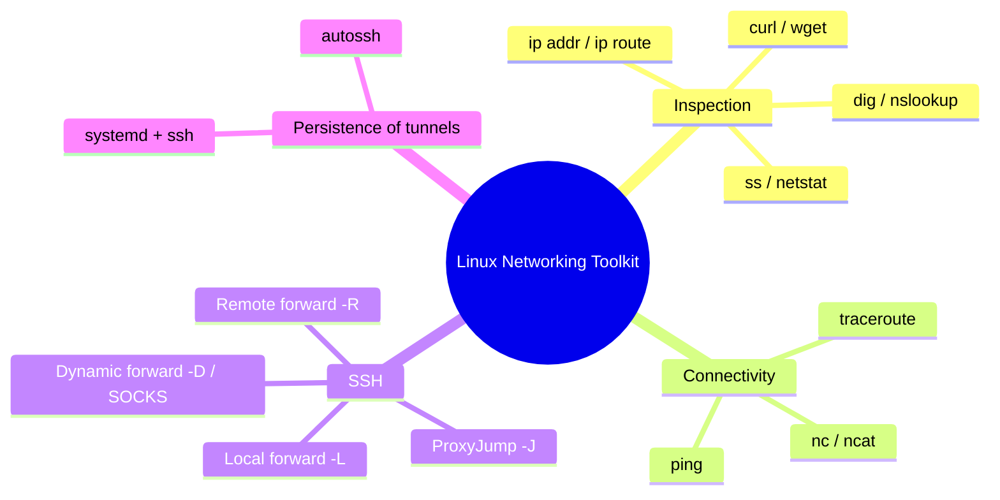
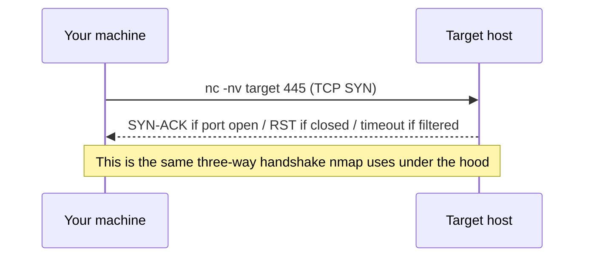
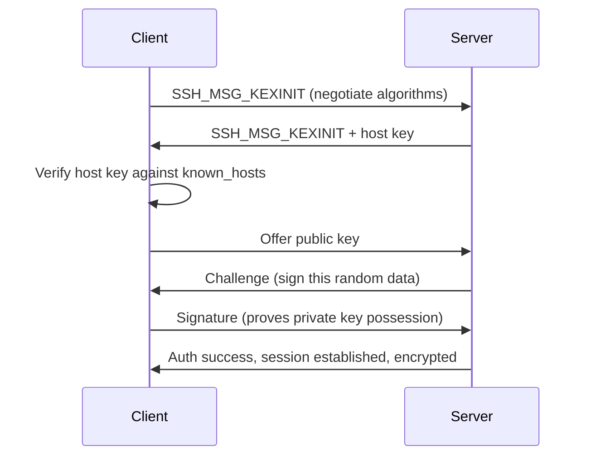
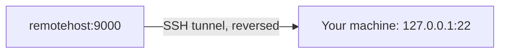

Chapter 9 of the Linux series shifts from the single box to the network it lives on. It builds on the process/service knowledge from the previous chapter — you now know what's *running*; this chapter teaches what it's *talking to*, and, critically, how you as an operator move traffic through a Linux box using SSH tunnels and port forwarding. This is one of the highest-leverage chapters in the whole Foundations phase: tunneling is the backbone of pivoting in almost every internal penetration test and red-team engagement you'll ever run.

---

## Why This Chapter Matters

Every pentest, CTF, or SOC investigation eventually asks the same question: what is this machine connected to, and how do I get my traffic where it needs to go? Linux gives you a small set of command-line tools to answer both halves of that question — inspection tools (`ip`, `ss`, `netstat`, `dig`, `curl`) and, more powerfully, SSH itself as a general-purpose network Swiss Army knife. A single SSH connection can forward arbitrary TCP traffic in either direction, turn a compromised box into a SOCKS proxy for your entire attack toolkit, and let you reach networks that have no direct route to your machine at all. This is called **pivoting**, and it's a mandatory skill for internal pentests, Active Directory engagements, and any CTF with a multi-hop network layout.



## Foundations: Inspecting the Network Stack

### ip — the modern replacement for ifconfig/route

```bash
ip addr show                # all interfaces and their IPs (ifconfig's replacement)
ip a                         # short form
ip route show                 # routing table — what goes where, and via what gateway
ip r                          # short form
ip link show                  # interface state (up/down), MAC addresses
ip neigh show                 # ARP table equivalent
sudo ip addr add 10.10.14.5/24 dev eth0     # manually assign an IP
sudo ip route add 10.10.10.0/24 via 10.10.14.1  # add a static route
```

> **Why it works:** `ifconfig` and `route` come from the old, now-deprecated `net-tools` package; `ip` (from `iproute2`) is the maintained standard on every modern distro. Knowing `ip` is not optional anymore — many minimal/hardened boxes (containers especially) don't even ship `ifconfig`.

### ss — the modern replacement for netstat

```bash
ss -tulwn           # TCP/UDP listening sockets, numeric ports, no name resolution
ss -tup              # TCP/UDP with the owning PROCESS name (needs privilege for others' sockets)
ss -s                 # summary statistics
ss state established  # only established connections
netstat -tulpn        # older equivalent, still common in tutorials and older systems
```

Reading `ss -tulwn` output: `LISTEN` state + a local address like `0.0.0.0:22` means the service is reachable from **any** interface; `127.0.0.1:3306` means it's bound to localhost only — a critical distinction when you're assessing what's actually exposed versus what merely runs on the box.

### DNS lookups: dig, nslookup, host

```bash
dig example.com                    # full DNS query + answer
dig example.com +short             # just the IP
dig example.com MX                 # mail exchange records
dig example.com ANY                # (deprecated by many resolvers, but still tried)
dig @8.8.8.8 example.com            # query a SPECIFIC DNS server directly
dig -x 8.8.8.8                       # reverse lookup
dig axfr example.com @ns1.example.com  # attempt a zone transfer (misconfig hunting)
host example.com
nslookup example.com
```

> **Bug bounty relevance:** DNS zone transfer misconfigurations (`dig axfr`) and subdomain enumeration built on `dig`/`host` output are a direct, standing recon technique used to discover in-scope assets before any web testing begins.

### Basic connectivity: ping, traceroute, curl, nc

```bash
ping -c 4 10.10.10.5           # 4 ICMP echo requests
traceroute 10.10.10.5           # hop-by-hop path
mtr 10.10.10.5                  # combines ping+traceroute, live
curl -v https://example.com     # verbose HTTP request — see full request/response
curl -I https://example.com     # headers only (HEAD-style)
wget https://example.com/file   # download a file
nc -nv 10.10.10.5 445           # raw TCP connect test — "is this port actually open and responsive?"
nc -lvnp 4444                    # listen on a port (classic reverse-shell catcher)
```



## SSH: Far More Than Remote Login

SSH (Secure Shell) is the encrypted remote-access protocol every Linux admin and pentester lives inside daily. Its architecture is worth understanding properly because every tunneling trick in this chapter is built directly on it.

### Basic usage and key-based auth

```bash
ssh user@10.10.10.5                     # password or key auth, default port 22
ssh -p 2222 user@10.10.10.5             # non-default port
ssh -i ~/.ssh/id_ed25519 user@host      # specify a private key explicitly
ssh-keygen -t ed25519 -C "my-key"       # generate a modern keypair
ssh-copy-id -i ~/.ssh/id_ed25519.pub user@host  # install your public key on a remote host
```

Key-based auth works because of asymmetric cryptography: the server stores your **public** key in `~/.ssh/authorized_keys`; you keep the **private** key secret. During the handshake, the server challenges you to prove possession of the private key without ever transmitting it — this is why a leaked `authorized_keys` file is low-risk but a leaked private key is a full compromise.



### The SSH config file — stop retyping flags

`~/.ssh/config` lets you define per-host shortcuts:

```
Host box1
    HostName 10.10.10.5
    User admin
    Port 2222
    IdentityFile ~/.ssh/id_ed25519_box1

Host jumphost
    HostName 203.0.113.10
    User pivot

Host internal
    HostName 172.16.5.10
    User admin
    ProxyJump jumphost
```

After this, `ssh box1` and `ssh internal` (which automatically routes through `jumphost`) just work — no memorized flag strings.

## Tunneling & Port Forwarding: The Core Pivoting Skill

This is the single most valuable practical skill in this chapter. SSH can forward arbitrary TCP traffic through an encrypted connection in three distinct directions.

### Local forwarding (`-L`) — reach something from your side

```bash
ssh -L 8080:127.0.0.1:80 user@remotehost
```

Traffic you send to `localhost:8080` on **your** machine gets forwarded, through the SSH connection, to `127.0.0.1:80` **as seen from `remotehost`**. This is how you reach an internal web app, database, or admin panel that only listens on localhost on a box you've SSH'd into.


### Remote forwarding (`-R`) — expose YOUR side to them

```bash
ssh -R 9000:127.0.0.1:22 user@remotehost
```

This does the opposite: a listener opens on `remotehost:9000`, and anything connecting to it gets forwarded back to `127.0.0.1:22` on **your** machine. This is the classic technique for exposing a service on your attack box to a remote network segment you've pivoted into — or, in a legitimate ops context, letting a remote support engineer reach a machine sitting behind NAT.



### Dynamic forwarding (`-D`) — turn SSH into a SOCKS proxy

```bash
ssh -D 1080 user@remotehost
```

This is the pivoting workhorse. It opens a **SOCKS proxy** on `127.0.0.1:1080` on your machine; any application configured to use that SOCKS proxy (browser, `proxychains`-wrapped tools, Burp Suite) has its traffic tunneled through `remotehost`, letting you reach the entire network `remotehost` can see — not just one fixed port.

```bash
# proxychains.conf: socks5 127.0.0.1 1080
proxychains nmap -sT -Pn 172.16.5.0/24     # scan an internal network THROUGH the pivot
proxychains curl http://172.16.5.10/       # browse an internal-only web app THROUGH the pivot
```

### ProxyJump — chaining through multiple hops

```bash
ssh -J user1@jumphost1,user2@jumphost2 user3@finaltarget
```

`-J` (or the `ProxyJump` config directive) chains SSH connections through one or more intermediate hosts, establishing a direct logical connection to the final target while physically routing through every hop in between — the standard way to reach a deeply internal host during a multi-segment engagement.


### Keeping tunnels alive: autossh and useful flags

```bash
ssh -o ServerAliveInterval=30 -o ServerAliveCountAlso=3 -L 8080:127.0.0.1:80 user@host
autossh -M 0 -f -N -L 8080:127.0.0.1:80 user@host   # auto-reconnects if the tunnel drops
ssh -N -f -L 8080:127.0.0.1:80 user@host             # -N: no remote command, -f: background after auth
```

## Advanced Techniques & Edge Cases

- **Reverse SOCKS proxy over a single reverse shell** — tools like `chisel` and `ligolo-ng` build on the exact concepts above but work without full SSH access, useful when you only have a raw reverse shell rather than valid SSH credentials on the pivot box. Understanding SSH tunneling first makes these tools trivial to pick up.
- **SSH agent forwarding (`-A`)** — forwards your local SSH agent's keys through the chain so you can authenticate onward without copying private keys to intermediate hosts. Use cautiously: a compromised intermediate host with agent forwarding enabled can (while your agent is connected) use your forwarded key to authenticate elsewhere as you.
- **`known_hosts` verification failures** — a changed host key produces a scary "REMOTE HOST IDENTIFICATION HAS CHANGED" warning. In a lab this is usually just a reinstalled VM; on a real engagement or in production, treat it as a potential MITM until proven otherwise — never blindly `ssh-keygen -R` and reconnect without checking why the key changed.
- **NAT and firewalls block `-R` more often than `-L`** — remote forwarding requires the SSH *server* to allow `GatewayPorts` if you want the forwarded port reachable from outside `127.0.0.1` on that host; check `/etc/ssh/sshd_config` for `GatewayPorts yes` if a teammate can't reach your forwarded port.

## Real-World Application

- **Internal pentests and Active Directory engagements** almost universally require pivoting once you land on a single foothold box — dynamic SOCKS forwarding through that box is usually the very next step after initial access, before any AD enumeration tooling (BloodHound, etc.) can even run against the internal network.
- **Bug bounty infrastructure testing** occasionally involves discovering an SSH service with weak credentials or exposed keys, at which point tunneling techniques let a researcher demonstrate real internal-network impact for a much higher-severity report.
- **SOC/DFIR**: unusual outbound SSH connections, especially with `-D`/`-R` style dynamic or reverse forwarding, are a well-known technique for both legitimate remote-support tooling and attacker C2/tunneling — analysts specifically watch for long-lived SSH connections to unexpected external hosts.

## Detection & Defense: Blue Team Angle

- **Monitor SSH connection metadata**, not just success/failure: unusually long-lived sessions, connections carrying forwarded ports (visible via `netstat`/`ss` on the server showing extra listening sockets tied to the `sshd` process), and connections at unusual hours are all detection-worthy.
- **Disable what you don't need** in `/etc/ssh/sshd_config`: `AllowTcpForwarding no` blocks `-L`/`-R`/`-D` entirely if a box has no legitimate need for tunneling; `GatewayPorts no` (the default) prevents forwarded ports from being reachable beyond localhost.
- **Key-based auth only, disable passwords** (`PasswordAuthentication no`) removes an entire class of brute-force attack — pair with `fail2ban` to rate-limit and ban repeat offenders regardless.
- **Centralize and alert on `sshd` auth logs** (`auth.log`/`journalctl -u ssh`) for repeated failures, unusual source geographies, and successful logins from IPs never seen before for that account.

> **Blue Team CTF / detection challenge angle** — Given a pcap or auth log, you're commonly asked to identify pivoting activity: look for an SSH session immediately followed by traffic to internal (RFC1918) addresses that shouldn't be reachable from the apparent source, or for `sshd_config` diffs showing `AllowTcpForwarding` or `GatewayPorts` flipped to `yes` shortly before an incident.

> **Bug Bounty Angle** — Directly finding SSH misconfigurations rarely pays on its own (weak SSH creds are usually out of scope for a web-focused program), but tunneling skill turns a single internal foothold — from an SSRF, exposed Jenkins, or leaked cloud credential — into a demonstrable internal-network compromise, which is exactly the kind of "show maximum realistic impact" narrative that pushes a report from Medium to Critical severity.

> **CTF Angle** — Multi-host CTF networks (HackTheBox Pro Labs, TryHackMe network rooms, OSCP-style labs) are built around exactly this skill: land on host A, discover host B is only reachable from A's internal interface, set up `ssh -D` or a `chisel`/`ligolo-ng` tunnel, and pivot your scanner/exploit traffic through. Practice pattern: `ss -tulwn` on the foothold box to find internal-only listeners, then `ssh -D 1080` + `proxychains nmap` to map the hidden network.

## Common Mistakes & How to Overcome Them

| Mistake | Symptom | Fix |
|---|---|---|
| Confusing `-L` and `-R` direction | Tunnel "doesn't work" — wrong side listens | `-L` = reach FROM you TO them; `-R` = expose YOUR side TO them |
| Forgetting `-N` when you only want a tunnel | Unwanted interactive shell opens alongside the tunnel | Add `-N` to suppress remote command execution |
| Not backgrounding long tunnels | Tunnel dies when you close the terminal | Add `-f` (background) or run under `screen`/`tmux`/`autossh` |
| Assuming a bound port is reachable externally | Confused why `0.0.0.0` binding "doesn't work" from outside | Check firewall rules (`iptables`/`nftables`) separately from the bind address |
| Ignoring host key change warnings | Walks into an active MITM, or wastes time distrusting a legit VM rebuild | Investigate before blindly removing the old key from `known_hosts` |

## Final Revision / Summary

- `ip` and `ss` are the modern replacements for `ifconfig`/`netstat`/`route` — learn them even if tutorials still show the old tools.
- `dig`, `curl -v`, and `nc` cover DNS inspection, raw HTTP visibility, and raw TCP connectivity testing respectively.
- SSH is a full network tool, not just remote login: `-L` (local forward, reach something from your side), `-R` (remote forward, expose your side to them), `-D` (dynamic/SOCKS, tunnel an entire network's worth of traffic), and `-J` (chain through jump hosts).
- Pivoting = using a compromised or accessible host's network position to reach segments you otherwise couldn't — the entire technique is built on SSH tunneling fundamentals.
- Mnemonic: **"Local reaches out, Remote reaches in, Dynamic reaches everywhere"** — a quick way to remember `-L`/`-R`/`-D` direction.

## Cheat Sheet / Quick Reference

```bash
# Inspection
ip addr show / ip route show
ss -tulwn
dig example.com +short
curl -v https://host
nc -nv host port

# SSH basics
ssh -i key user@host
ssh-keygen -t ed25519
ssh-copy-id user@host

# Tunneling
ssh -L 8080:127.0.0.1:80 user@host     # local forward
ssh -R 9000:127.0.0.1:22 user@host     # remote forward
ssh -D 1080 user@host                    # dynamic SOCKS proxy
ssh -J user1@hop1,user2@hop2 user3@dst   # jump chain
autossh -M 0 -f -N -L 8080:127.0.0.1:80 user@host   # persistent tunnel

# proxychains usage
proxychains nmap -sT -Pn 172.16.5.0/24
proxychains curl http://172.16.5.10/
```

## Practice Labs & Resources

- **HackTheBox Pro Labs (Dante, Offshore, RastaLabs)** — purpose-built multi-segment networks specifically requiring SSH/chisel/ligolo-ng pivoting to reach later hosts.
- **TryHackMe "Pivoting" and "Network Services" rooms** — guided, graded exercises on exactly `-L`/`-R`/`-D` forwarding.
- **OSCP-style labs / PWK** — pivoting through a compromised host to reach a second internal subnet is a core exam skill, and SSH dynamic forwarding is the most common technique taught for it.
- **`chisel` and `ligolo-ng` on GitHub** — once SSH tunneling is second nature, these tools generalize the same concept to non-SSH footholds; worth a follow-up lab session.
- **PortSwigger "SSRF" labs** — while not SSH-specific, they're the most common way a *web* vulnerability turns into the kind of internal-network access this chapter's tunneling skills exploit.
