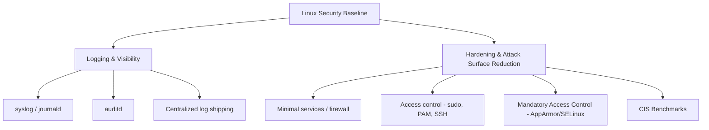
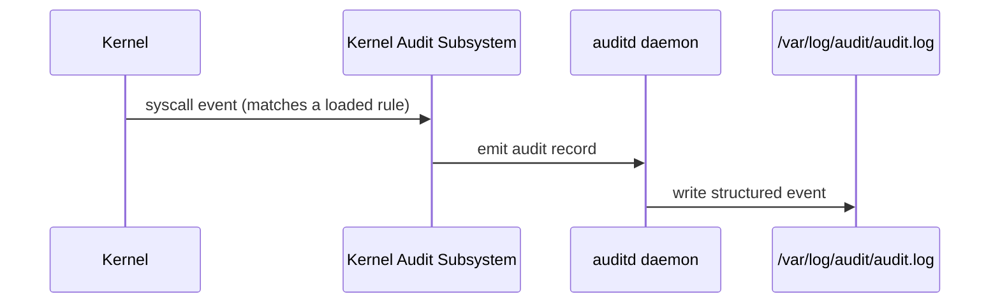
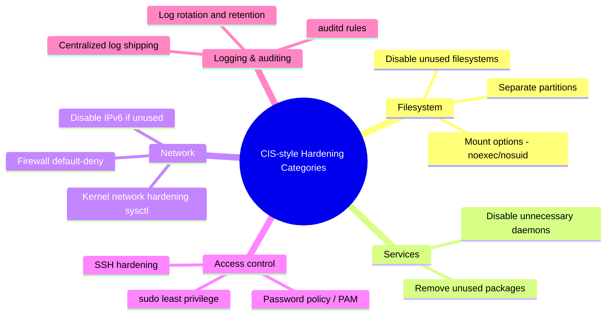

Chapter 10 closes out the Linux track of the Foundations phase. It pulls together everything from the earlier chapters — permissions, users, processes, services, and networking — into the discipline of actually securing and monitoring a box: where logs live and how to read them, how `auditd` provides fine-grained visibility, and the concrete hardening steps that turn a default Linux install into something resembling a real security baseline. Every offensive technique explored in the rest of this notebook has a defensive mirror here; this chapter is that mirror.

---

## Why Logging and Hardening Close Out This Track

Up to this point the track has been mostly about capability — how to navigate, script, filter text, manage processes, and move network traffic. This chapter is about **accountability and reduction of attack surface**: knowing what happened on a box after the fact, and reducing how much *can* happen on it in the first place. These two concerns — visibility and hardening — are the daily bread of SOC analysts, DFIR responders, and anyone doing compliance work (CIS benchmarks, PCI-DSS, SOC 2), and they are exactly what a penetration tester or red-teamer is trying to evade or bypass. Understanding both sides makes you dramatically better at each.



## Foundations: Where Linux Logs Actually Live

### The classic syslog-style logs

| Path | Contents |
|---|---|
| `/var/log/auth.log` (Debian/Ubuntu) or `/var/log/secure` (RHEL/CentOS) | authentication events — logins, `sudo` usage, SSH connections |
| `/var/log/syslog` (Debian/Ubuntu) or `/var/log/messages` (RHEL/CentOS) | general system messages |
| `/var/log/kern.log` | kernel messages |
| `/var/log/dmesg` | boot-time kernel ring buffer |
| `/var/log/apache2/` or `/var/log/httpd/`, `/var/log/nginx/` | web server access/error logs |
| `/var/log/faillog`, `/var/log/lastlog` | failed and successful login history, binary format |
| `/var/log/wtmp`, `/var/log/btmp` | login records (`last`, `lastb` read these) |

```bash
tail -f /var/log/auth.log            # live-follow authentication events
grep "Failed password" /var/log/auth.log | tail -20
last -a                                 # recent logins with source host
lastb                                    # recent FAILED logins (btmp)
lastlog                                  # last login time per user
```

### journald — the systemd-centric log store

Covered briefly in the previous chapter, `journalctl` is now the primary log interface on most modern distros, often *in addition to* traditional syslog files:

```bash
journalctl -xe                     # recent logs with extra explanation, end of output
journalctl -u sshd --since today   # one service, today only
journalctl -p err..alert            # priority range filter
journalctl --vacuum-time=7d          # prune logs older than 7 days
```

> **Why it works:** `journald` stores logs in a structured binary format (not plain text), which is why you query it with `journalctl` instead of `grep`ing a file directly — this also means metadata (PID, UID, boot ID, systemd unit) is preserved per entry in a way flat text logs lose, which is exactly why forensic tooling prefers it when available.

## auditd: Kernel-Level Visibility

`auditd` is the Linux Audit daemon — it hooks directly into the kernel's audit subsystem to log security-relevant events (`execve`, file access, permission changes) with a level of detail syslog was never designed to provide.



### Installing and controlling auditd

```bash
sudo apt install auditd audispd-plugins   # Debian/Ubuntu
sudo systemctl enable --now auditd
sudo auditctl -l                            # list currently loaded rules
```

### Writing audit rules

```bash
# Watch for ANY execution (a process being run) system-wide
sudo auditctl -a always,exit -F arch=b64 -S execve -k exec_tracking

# Watch a specific sensitive file for any write access
sudo auditctl -w /etc/shadow -p wa -k shadow_watch

# Watch for any changes to sudoers
sudo auditctl -w /etc/sudoers -p wa -k sudoers_watch
```

`-k` attaches a searchable "key" tag to matching events, which makes querying far easier:

```bash
sudo ausearch -k shadow_watch              # find all events tagged with this key
sudo ausearch -k exec_tracking -i          # -i "interprets" numeric UIDs/syscalls into names
sudo aureport --auth                        # summarized authentication report
sudo aureport -x                            # summarized executable report
```

Persisting rules across reboots means writing them into `/etc/audit/rules.d/audit.rules` rather than only running `auditctl` interactively (which is lost on reboot).

> **Why this matters:** this is precisely the mechanism behind "we can see exactly what command an attacker ran, as what user, at what time" in almost every real Linux incident response writeup — `auditd`'s `execve` tracking is what turns "a process ran" into "here is the full command line, working directory, and parent process for every single execution on this box."

## Hardening: Reducing What Can Go Wrong

### The CIS Benchmark mental model

The Center for Internet Security (CIS) publishes distro-specific hardening benchmarks (e.g., "CIS Ubuntu 22.04 Benchmark") that are the industry-standard checklist for "what does a hardened Linux box look like." You won't memorize every control, but understanding the *categories* gives you the right mental model:



### Concrete, immediately-actionable hardening steps

**Firewall — default deny with `ufw` or `nftables`:**

```bash
sudo ufw default deny incoming
sudo ufw default allow outgoing
sudo ufw allow 22/tcp     # only what you actually need
sudo ufw enable
sudo ufw status verbose
```

**SSH hardening (revisit `/etc/ssh/sshd_config`):**

```
PermitRootLogin no
PasswordAuthentication no
PubkeyAuthentication yes
AllowTcpForwarding no      # unless the box legitimately needs tunneling (see previous chapter)
MaxAuthTries 3
```

**Kernel network hardening via `sysctl`:**

```bash
# /etc/sysctl.d/99-hardening.conf
net.ipv4.conf.all.rp_filter = 1        # anti-spoofing (reverse path filtering)
net.ipv4.icmp_echo_ignore_broadcasts = 1
net.ipv4.tcp_syncookies = 1             # SYN flood mitigation
net.ipv4.conf.all.accept_redirects = 0
kernel.dmesg_restrict = 1                # unprivileged users can't read kernel logs
sudo sysctl --system
```

**Password and account policy via PAM (`/etc/pam.d/common-password` on Debian):**

```
password requisite pam_pwquality.so retry=3 minlen=14 difok=3
```

**fail2ban — automated brute-force banning:**

```bash
sudo apt install fail2ban
sudo systemctl enable --now fail2ban
sudo fail2ban-client status sshd     # see currently banned IPs for the SSH jail
```

`fail2ban` watches log files (often `auth.log`/journald) for repeated failure patterns and dynamically inserts firewall rules to ban the offending IP for a configurable window — a lightweight, extremely common first line of defense against SSH brute forcing.

### Mandatory Access Control: AppArmor and SELinux

Standard Linux permissions (covered in Chapter 3) are **discretionary** — the file owner decides who can access it. **Mandatory Access Control (MAC)** systems add a second, kernel-enforced layer that even root cannot casually bypass, confining what a process can do regardless of file permissions.

- **AppArmor** (Ubuntu/Debian default) — profiles are path-based and relatively easy to read: `/etc/apparmor.d/usr.sbin.nginx` restricts exactly what the nginx binary can touch, network-wise and filesystem-wise.
- **SELinux** (RHEL/CentOS/Fedora default) — label-based, more powerful and more complex, using "contexts" (`system_u:object_r:httpd_sys_content_t`) rather than plain paths.

```bash
# AppArmor
sudo aa-status                       # see loaded profiles and their mode (enforce/complain)
sudo aa-enforce /etc/apparmor.d/usr.sbin.nginx
sudo aa-complain /etc/apparmor.d/usr.sbin.nginx   # log-only mode, useful while tuning a new profile

# SELinux
getenforce                            # Enforcing / Permissive / Disabled
sudo setenforce 1                     # force Enforcing mode
ls -Z /var/www/html/                  # view SELinux contexts on files
sudo semanage fcontext -a -t httpd_sys_content_t "/srv/web(/.*)?"
```

> **Why this matters offensively too:** a huge number of real-world web app exploits that "should" have led to full RCE are actually contained by SELinux/AppArmor — the process gets code execution, but the MAC policy blocks it from reading `/etc/shadow` or making outbound connections. Recognizing `Permission denied` errors that don't match normal Unix permissions is a strong signal you've hit a MAC policy, not a Unix permission wall — checking `dmesg | grep -i apparmor` or `ausearch -m avc` confirms it instantly.

## Building a Practical Hardening + Audit Lab

In a lab VM:

1. Install `auditd` and add a watch rule on `/etc/passwd` and `/etc/shadow` (`-w /etc/shadow -p wa -k shadow_watch`).
2. Trigger it: `sudo cat /etc/shadow > /dev/null`, then confirm the event with `ausearch -k shadow_watch -i`.
3. Set up `ufw` with a default-deny incoming policy, allow only SSH, and verify with `nmap` from another machine that no other ports respond.
4. Install `fail2ban`, then from a second machine deliberately fail SSH login 5+ times and confirm the source IP gets banned (`fail2ban-client status sshd`).
5. Check `aa-status` (or `getenforce` on an RHEL-family box) and note which profiles/policies are active versus complain/permissive — a real hardening review would flag every "complain"/"permissive" entry as a gap to close.

This lab exercises the full loop: harden something, generate the exact event that should be caught, and confirm your logging/audit layer actually caught it — the habit that separates "we have a firewall" from "we have evidence our firewall does anything."

## Advanced Techniques & Edge Cases

- **Log tampering is a real attacker technique.** Attackers with root frequently clear or edit `/var/log/auth.log`, `wtmp`, or shell history to hide tracks. Immutable, remote log shipping (forwarding logs to a separate syslog/SIEM server the moment they're generated) defeats this — if the log left the box before it was deleted locally, the attacker's cleanup is too late.
- **Auditd rule ordering and performance.** Overly broad rules (watching every `execve` on a busy production server) generate enormous log volume and can measurably affect performance; scope rules to specific paths/UIDs where possible, or accept the overhead deliberately for high-value hosts.
- **`noexec`/`nosuid` mount options** on `/tmp` and other user-writable partitions block a large class of "drop a binary in `/tmp` and execute it" techniques used by both attackers and CTF privesc chains — but be aware some legitimate software (and some CTF exercises specifically) expect `/tmp` to be executable, so test before deploying broadly.
- **Rotation and retention tuning** (`logrotate`, `journalctl --vacuum-size`) matters for compliance: many standards (PCI-DSS) mandate a minimum retention period, and a box that silently rotates/deletes logs too aggressively can fail an audit even if the logging itself was configured correctly.

## Real-World Application

- **Compliance-driven hardening**: CIS Benchmarks, PCI-DSS, HIPAA, and SOC 2 audits all reference concrete Linux configuration checks nearly identical to what's in this chapter — hardening scripts built around CIS controls are standard deliverables in GRC and cloud security engagements.
- **DFIR case studies**: real breach post-mortems (e.g., numerous publicly documented ransomware and cryptomining incidents) repeatedly cite "no centralized logging," "auth.log rotated/deleted before analysis," or "auditd not installed" as the reason root cause could not be conclusively established — this chapter's content is literally the difference between a resolvable incident and an unresolved one.
- **Pentest reporting**: a professional pentest report routinely includes a "detective controls" or "logging & monitoring" finding alongside pure vulnerability findings — testers are expected to comment on whether their own activity would have been detected, which requires understanding exactly what's covered in this chapter.

## Detection & Defense: Blue Team Angle

This entire chapter *is* the blue team angle, but concretely:

- **Ship logs off-box immediately** (syslog-ng/rsyslog forwarding, or an agent like Filebeat/Wazuh) so local tampering can't erase evidence.
- **Alert on auditd's own health** — `auditd` stopping unexpectedly, or `auditctl -l` returning fewer rules than expected, is itself a signal worth alerting on (it's a known attacker technique to disable audit logging before further action).
- **Baseline `aa-status`/`getenforce`** across your fleet — any host silently running in permissive/complain mode has quietly lost a real layer of defense, often without anyone noticing.
- **Watch `/etc/sudoers`, `/etc/passwd`, `/etc/shadow`, and SSH config for unauthorized changes** via file integrity monitoring plus the `auditd` watches shown above — these four files/directories cover a disproportionate share of real persistence and privilege escalation activity.

> **Blue Team CTF / detection challenge angle** — A very common exercise: given an `audit.log`/`auth.log` excerpt, identify what an attacker did, in order — typically login, privilege escalation attempt via `sudo` or a SUID binary, a suspicious `execve` of an unusual binary path, then log tampering. Reconstructing that timeline purely from `ausearch`/`grep` output is a recurring DFIR-flavored CTF category worth deliberate practice.

> **Bug Bounty Angle** — Logging/hardening gaps aren't directly reportable bugs in most bug bounty programs (they're infrastructure config, usually out of scope), but they matter for two reasons: (1) some programs specifically include "insufficient logging" as a valid finding under OWASP's broader vulnerability categories when chained with another bug, and (2) demonstrating that a vulnerability you found would have gone completely undetected (no logging, no alerting) is powerful supporting evidence when arguing for higher severity in your writeup.

> **CTF Angle** — Forensics categories frequently hand you a log file (auth.log, audit.log, or a full disk image) and ask "what did the attacker do and in what order." Tools: `ausearch`, `aureport`, `grep`/`awk` (Chapter 7), and `last`/`lastb`. Worked pattern: start with `lastb` for failed logins to find the brute-force window, `grep "Accepted"` in `auth.log` for the successful login, then `ausearch -ts recent -k exec_tracking` (if auditd was running) to reconstruct exactly what commands ran afterward.

## Common Mistakes & How to Overcome Them

| Mistake | Symptom | Fix |
|---|---|---|
| Assuming default install is "secure enough" | Unnecessary services/ports exposed | Explicitly review and apply a CIS-style checklist |
| Local-only logging | Attacker deletes/edits logs, no evidence remains | Ship logs off-box in real time |
| Overly broad auditd rules | Massive log volume, missed signal in noise | Scope rules to specific sensitive paths/syscalls |
| Treating AppArmor/SELinux denials as "broken app" and disabling MAC entirely | Loses a real defense layer | Use complain/permissive mode to tune the profile instead of disabling it |
| No automated brute-force protection | SSH gets hammered continuously | Deploy fail2ban (or equivalent) as a baseline, not an afterthought |

## Final Revision / Summary

- Linux logs live in two overlapping worlds: classic flat-text syslog files (`/var/log/auth.log`, `/var/log/syslog`) and the structured `journald` store queried via `journalctl`.
- `auditd` hooks the kernel directly, giving execve-level and file-access-level visibility that syslog alone can't provide — `auditctl` to set rules, `ausearch`/`aureport` to query them.
- Hardening follows a repeatable shape: minimize attack surface (firewall default-deny, disable unused services), harden access control (SSH config, sudo, PAM password policy), add automated response (fail2ban), and add a mandatory access control layer (AppArmor/SELinux) as defense in depth.
- CIS Benchmarks are the industry reference checklist for "what does hardened actually mean" per distro.
- Mnemonic: **"See it, Stop it, Seal it"** — logging/auditd (see it), firewall/fail2ban/SSH hardening (stop it), AppArmor/SELinux (seal it even if the first two fail).

## Cheat Sheet / Quick Reference

```bash
# Logs
tail -f /var/log/auth.log
journalctl -u sshd --since today
last -a / lastb / lastlog

# auditd
sudo auditctl -w /etc/shadow -p wa -k shadow_watch
sudo ausearch -k shadow_watch -i
sudo aureport --auth

# Firewall
sudo ufw default deny incoming
sudo ufw allow 22/tcp
sudo ufw enable

# fail2ban
sudo fail2ban-client status sshd

# MAC
sudo aa-status            # AppArmor
getenforce                 # SELinux

# sysctl hardening
sudo sysctl --system
```

## Practice Labs & Resources

- **CIS Benchmarks (cisecurity.org)** — download the free PDF for Ubuntu or your distro of choice and work through the "Level 1" controls as a checklist against a lab VM.
- **TryHackMe "Linux Hardening" and "Auditd" rooms** — guided, graded exercises building auditd rules and confirming they fire.
- **Lynis (`github.com/CISOfy/lynis`)** — a free automated hardening-audit tool; run it against your lab VM before and after applying this chapter's steps to see a measurable score improvement.
- **HackTheBox / TryHackMe "DFIR"-tagged rooms** — practice reconstructing an attacker timeline purely from log excerpts, mirroring the CTF Angle worked pattern above.
- **OpenSCAP / `oscap`** — open-source tooling that can automatically evaluate a box against a CIS or DISA STIG profile, useful for turning this chapter's manual checklist into an automated, repeatable scan.
