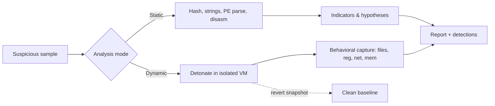
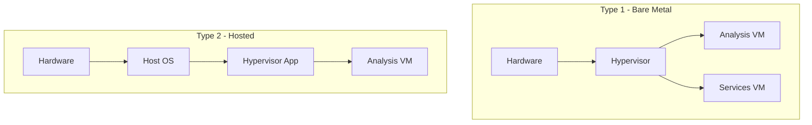
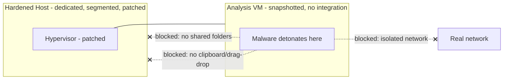
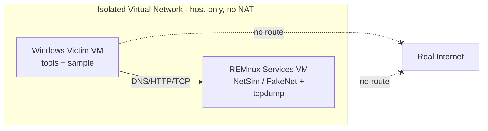
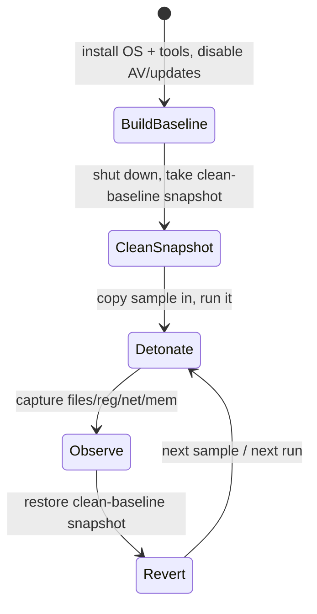
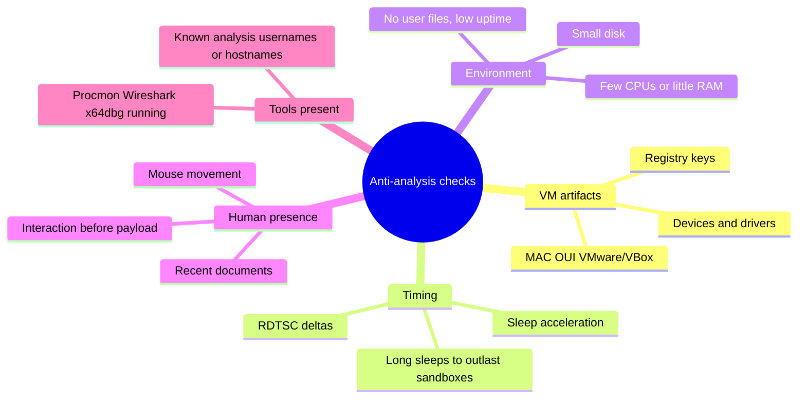

This is Chapter 1 of the Malware Analysis & Reverse Engineering notebook. Earlier notebooks taught you how malware is *classified* and, from the red-team side, how payloads are conceptually built and how they evade defenses. This notebook flips to the analyst's chair: given a suspicious file, how do you take it apart safely, understand exactly what it does, and turn that understanding into detections and reporting? Before any of that, though, comes the single most important skill an analyst has — the ability to detonate and dissect live, hostile code **without infecting yourself, your network, or your organization**. That is what this chapter builds.

Everything here is written for defenders, incident responders, and authorized malware researchers. Analyzing malware means handling working, weaponized software whose entire purpose is to spread, steal, and persist. Get the environment wrong and you are not doing research — you are running an attacker's tooling on your own infrastructure. So this chapter is deliberately paranoid. We build the lab layer by layer, justify every isolation control, and finish with a repeatable handling discipline you can run on autopilot. The reverse-engineering and dynamic-analysis chapters that follow all assume the lab you build here.

## Why This Matters

A malware analysis lab is not "a VM with some tools." It is a **containment system**. The defining property of the samples you will handle is that they are adversarial: some detect virtualization and refuse to run, some try to escape the guest, some scan for and encrypt every writable share they can reach, and some phone home the instant they get network access. A careless lab turns your workstation into patient zero. Every year, analysts — including experienced ones — reimage machines or, worse, trigger a real incident because a sample reached a production share through a misconfigured host-only network or a mounted host folder.

The good news is that safe handling is a solved problem. It relies on a small number of well-understood controls — hardware-assisted virtualization, snapshots, disabled shared folders, host-only or simulated networking, non-persistent disks, and a strict physical/logical separation between "dirty" analysis assets and everything else. Learn them once, wire them together correctly, and you can detonate ransomware over lunch and roll back to a clean state before you finish your coffee. This chapter turns that from folklore into a checklist you can defend in an audit.

We progress from the absolute basics — what a lab is and the threat model it defends against — through building the virtualization layer, the guest analysis VMs, network isolation and simulation, sample acquisition and defanging, a full worked triage lab on a benign sample, and a consolidated detection-and-defense view of how analysis environments are themselves attacked and how to harden them.

---

## Part 1: What a Malware Lab Actually Is — The Threat Model

Before installing anything, get the mental model right. A malware analysis lab exists to satisfy a set of **security properties** while you run hostile code on purpose. If you can state the properties, you can evaluate any lab design against them.

The four properties every lab must guarantee:

1. **Containment** — malware executed in the lab cannot affect anything outside the lab (your host OS, your home/corporate network, cloud drives, backups, other people).
2. **Reversibility** — you can return the analysis environment to a known-clean state cheaply and reliably, so one sample never contaminates the next.
3. **Fidelity** — the environment is realistic enough that the malware *behaves as it would in the wild* (many samples are anti-analysis aware and go dormant in obvious sandboxes).
4. **Observability** — you can watch what the malware does (files, registry, processes, network, memory) without the malware easily watching *you*.

These four are in constant tension. Maximum containment (an air-gapped machine you physically wipe) hurts observability and reversibility. Maximum fidelity (bare metal, real internet) destroys containment. The craft of lab building is choosing controls that give you *enough* of all four for the samples you handle.

### The adversary you are defending against

Your threat model is the malware itself. Concretely, assume a sample may attempt any of the following the moment it executes:

| Malicious behavior | What it targets | Lab control that stops it |
|---|---|---|
| Encrypt/wipe reachable files | Mapped drives, shared folders, network shares | No shared folders; host-only/no network; snapshots |
| Spread over the network (worm) | LAN, SMB, RDP, other hosts | Isolated virtual network, no bridge to real LAN |
| Detect VM / sandbox and go dormant | CPUID, timing, artifacts, MAC OUI | VM hardening, realistic config (fidelity) |
| Escape the hypervisor guest | Hypervisor vulnerabilities, shared clipboard/drag-drop | Patched hypervisor, disabled integration features |
| Exfiltrate data / call C2 | Internet, DNS, HTTP | Simulated network (INetSim/FakeNet), no real egress |
| Persist across reboots | Registry, scheduled tasks, services | Non-persistent/snapshotted disk, revert after each run |
| Tamper with analysis tools | Debuggers, Procmon, AV | Baseline snapshot with tools pre-installed; verify integrity |

Notice the pattern: **almost every containment control is either "no network path to anything real" or "cheap revert to clean."** Those two ideas — network isolation and snapshots — carry most of the weight. Everything else is refinement.

### Static vs dynamic analysis and why the lab differs

Two broad analysis modes drive different lab requirements, and you should understand the split now because it dictates when the malware actually *runs*.

- **Static analysis** examines the sample *without executing it*: hashing, string extraction, PE header parsing, disassembly. The file is inert data. Risk is low but non-zero — parsing tools have had their own vulnerabilities, and it's easy to double-click a sample by accident. You still do this in the lab, but the containment demands are lighter.
- **Dynamic analysis** (a.k.a. behavioral analysis) *executes* the sample and observes it. This is where the threat model above applies in full. Every control we build exists primarily to make dynamic analysis safe.



The rest of this chapter builds the environment that makes the right-hand `Dynamic` path safe, then gives you a handling discipline that keeps even the low-risk static path from turning into an accidental detonation.

---

## Part 2: The Virtualization Layer — Hypervisors and Why We Use Them

The foundation of every practical malware lab is a **hypervisor**: software that creates and runs virtual machines (VMs), giving each guest OS the illusion of its own hardware while isolating it from the host and from other guests. Virtualization is what makes reversibility and containment cheap — you get snapshots, isolated virtual networks, and disposable disks for free.

### Type 1 vs Type 2 hypervisors

There are two architectural families, and the distinction matters for both isolation strength and convenience.

- **Type 1 (bare-metal)** runs directly on the hardware, with no host OS beneath it. Examples: VMware ESXi, Microsoft Hyper-V (in its role form), Xen, Proxmox VE (KVM-based). Guests talk to a thin hypervisor that owns the hardware. Strong isolation, better performance, favored for permanent or team labs.
- **Type 2 (hosted)** runs as an application on top of a normal host OS. Examples: VMware Workstation/Fusion, Oracle VirtualBox, Parallels. Easier to set up on a laptop; the host OS is in the trust path, so the host must be hardened.



For an individual analyst learning the craft, a **Type 2 hypervisor on a dedicated laptop** is the standard starting point: VMware Workstation Pro (Windows/Linux) or VMware Fusion (macOS), or the free-and-open VirtualBox. A permanent team lab is often built on Type 1 (Proxmox/ESXi) for stronger isolation and remote access. This chapter uses VMware/VirtualBox terminology because that's what you'll meet first, and notes KVM/QEMU equivalents where relevant.

### Hardware-assisted virtualization: the feature you must enable

Modern CPUs provide hardware virtualization extensions — **Intel VT-x** (with EPT for memory) and **AMD-V** (with RVI/NPT). These let the hypervisor run guest code directly on the CPU with hardware-enforced isolation, rather than slowly emulating every instruction. Two consequences for malware analysis:

1. **Performance and fidelity** — with VT-x/AMD-V, a Windows guest runs at near-native speed, so time-based anti-analysis checks are less likely to trip.
2. **Isolation** — the CPU itself enforces the guest/host boundary (ring de-privileging, EPT/NPT page tables), which is far stronger than software-only separation.

You typically must enable these in firmware. On a physical host, enter UEFI/BIOS setup and enable:

- **Intel:** "Intel Virtualization Technology (VT-x)" and, if present, "VT-d" (I/O virtualization).
- **AMD:** "SVM Mode" (Secure Virtual Machine).

Verify from the host OS before building anything:

```bash
# Linux host — check for CPU virtualization flags
grep -E -o 'vmx|svm' /proc/cpuinfo | sort -u
# vmx  => Intel VT-x present
# svm  => AMD-V present

# Confirm KVM can use it (Linux)
sudo apt install -y cpu-checker
kvm-ok
# Expected: "INFO: /dev/kvm exists / KVM acceleration can be used"
```

```powershell
# Windows host — check virtualization status
Get-ComputerInfo -Property "HyperVRequirementVirtualizationFirmwareEnabled","HyperVisorPresent"
# Or, quick check in Task Manager > Performance > CPU:
#   "Virtualization: Enabled"
systeminfo | findstr /C:"Virtualization" /C:"Hyper-V"
```

**Nested virtualization gotcha:** if your "host" is itself a cloud VM, you need the provider to expose nested virtualization (VT-x inside the VM). Many don't, which is why analysts favor a physical dedicated machine. Also note that on Windows, **Hyper-V, WSL2, Credential Guard, or Memory Integrity** can seize the virtualization extensions and prevent VMware/VirtualBox from using VT-x, causing the dreaded "VT-x is not available" error. Disabling Hyper-V (or using VMware's Windows Hypervisor Platform mode) resolves it:

```powershell
# Disable Hyper-V hypervisor auto-launch (frees VT-x for VMware/VBox). Reboot required.
bcdedit /set hypervisorlaunchtype off
# Re-enable later with: bcdedit /set hypervisorlaunchtype auto
```

### Choosing a hypervisor for the lab

| Hypervisor | Type | Cost | Snapshots | Best for | Notes |
|---|---|---|---|---|---|
| VMware Workstation Pro | 2 | Free (personal) | Yes, robust | Windows/Linux analysts | Strong snapshot tree, good tooling; the de-facto malware-lab standard |
| VMware Fusion | 2 | Free (personal) | Yes | macOS analysts | Apple Silicon runs ARM guests only |
| Oracle VirtualBox | 2 | Free/OSS | Yes | Budget/learning | Weaker anti-detect posture; guest additions are fingerprintable |
| KVM/QEMU + libvirt | 1/2 | Free/OSS | Yes | Linux/automation | Scriptable; great for automated sandboxes (CAPE, Cuckoo) |
| Proxmox VE | 1 | Free/OSS | Yes | Team/permanent labs | KVM under the hood; web UI, good isolation |
| Microsoft Hyper-V | 1 | Free | Checkpoints | Windows-only shops | Integrates with Windows; conflicts with Type 2 hypervisors |

For the rest of this chapter, assume **VMware Workstation/Fusion or VirtualBox** as the concrete hypervisor. The isolation principles are identical everywhere; only menu names change.

---

## Part 3: Hardening the Host — Your Last Line of Defense

The host OS (or bare-metal hypervisor) is the trust anchor: if malware escapes a guest, the host is what stands between it and everything you care about. In a Type 2 setup the host is *in the blast radius by design*, so it must be treated as security-critical. Even in a Type 1 setup, the management plane must be locked down.

### Physical and logical separation

The strongest control is boring: **use a dedicated machine for malware work that holds nothing you care about.** No personal files, no saved corporate credentials, no VPN into production, no cloud-drive sync client. If a lab host is reimaged tomorrow, you should lose nothing but time. Where a fully dedicated machine isn't possible, a dedicated *drive* or a separate host OS user with no access to sensitive data is a weaker fallback.

Practical host rules:

- **No production credentials on the host.** Don't log the host into corporate SSO, don't cache domain creds, don't leave a browser signed into everything.
- **Segment the network.** Put the lab host on an isolated VLAN or a physically separate network/ISP, never the same broadcast domain as production or your personal devices. If the guest's containment ever fails, the host should still be a dead end.
- **Keep the hypervisor patched.** Guest-to-host escapes are real (VMware, VirtualBox, and QEMU have all had them). An unpatched hypervisor is a containment hole. Subscribe to the vendor's security advisories.
- **Disable auto-mounting and auto-run** of removable media on the host so a sample copied to a USB stick can't launch by accident.
- **Run host AV/EDR, but expect friction.** Host AV will quarantine samples the moment they hit disk. Analysts typically store samples **encrypted** (e.g. password-protected ZIP, or inside an encrypted container) so host AV leaves them alone until they're intentionally extracted *inside* the guest. More on this in Part 7.

### The dangerous convenience features — turn them OFF

Hypervisors ship "integration" features that punch holes straight through the guest/host boundary for user convenience. For a productivity VM they're great. For a malware VM they are **containment failures waiting to happen.** Disable all of them on analysis guests:

| Feature | Why it's dangerous | Action |
|---|---|---|
| Shared folders | Malware writes/encrypts host files directly | Remove all shared folders from the VM config |
| Shared clipboard | Malware can read/write host clipboard (data theft, injection) | Set to "disabled" both directions |
| Drag and drop | File transfer path between guest and host | Disable |
| Guest additions/VMware Tools | Adds a communication channel; also fingerprintable | Optional: install for usability but understand the tradeoff; some analysts omit or use hardened tools |
| USB passthrough / auto-connect | Bridges physical USB into the guest | Disable auto-connect |
| 3D acceleration / GPU passthrough | Larger attack surface for escapes | Disable unless required |

In VMware, these live under **VM Settings → Options** (Shared Folders, Guest Isolation → disable copy/paste and drag-drop) and **Hardware → USB Controller**. In VirtualBox, under **Settings → General → Advanced** (Shared Clipboard = Disabled, Drag'n'Drop = Disabled) and **Settings → Shared Folders** (remove all).



The mental model: the guest is a sealed jar. Integration features are holes drilled in the lid "for convenience." A malware jar gets **no holes**.

---

## Part 4: Building the Guest Analysis VM

Now we build the machine where detonation actually happens. Most malware you'll analyze targets **Windows**, so a Windows analysis guest is the primary workhorse; a **Linux (REMnux) VM** complements it as a services/tooling host and for Linux/ELF samples.

### The two-VM pattern: victim + services

The standard behavioral setup is **two VMs on the same isolated virtual network**:

1. **The victim/analysis VM** (usually Windows) — where the sample runs. It is instrumented with monitoring tools and points its DNS/gateway at the second VM.
2. **The services/gateway VM** (usually REMnux, a Linux malware-analysis distro) — runs a *simulated internet* so the malware's network calls get plausible responses without ever touching the real internet. It also captures all traffic.



This is the classic "poor man's sandbox," and it's exactly how commercial and open-source automated sandboxes (Cuckoo/CAPE) are structured under the hood.

### Windows analysis VM — build steps

Use a legitimate Windows license/eval. Microsoft even publishes free, time-limited **evaluation VMs** and MSEdge/Dev VMs suitable for labs.

1. **Create the VM** with modest but realistic specs: 2–4 vCPU, 4–8 GB RAM, 60+ GB disk. Too-small specs are a sandbox tell that anti-analysis malware checks for (a machine with 1 CPU, 2 GB RAM, and a 20 GB disk screams "sandbox").
2. **Install Windows** normally. Then **do NOT** join any domain and **do NOT** sign into a Microsoft account.
3. **Disable Windows Defender and automatic updates** *inside the guest* — you don't want AV deleting your sample or Windows Update changing the baseline mid-analysis. (You're deliberately running a soft target.)
4. **Install analysis tooling** (next section), then **shut down and snapshot** — this snapshot is your golden "clean baseline."

The fastest way to a fully tooled Windows analysis VM is Mandiant/Google's **FLARE-VM**, a script that installs a large curated toolset (debuggers, disassemblers, PE tools, monitoring, network) onto a base Windows install.

```powershell
# On a fresh, snapshotted Windows VM (run in an elevated PowerShell)
# 1. Relax execution policy for the installer session
Set-ExecutionPolicy Unrestricted -Scope Process -Force

# 2. Download the FLARE-VM installer
(New-Object System.Net.WebClient).DownloadFile(
  "https://raw.githubusercontent.com/mandiant/flare-vm/main/install.ps1",
  "$env:USERPROFILE\Desktop\install.ps1")

# 3. Run it (takes a while; installs 40+ tools, reboots several times)
cd $env:USERPROFILE\Desktop
Unblock-File .\install.ps1
.\install.ps1
```

What FLARE-VM installs (a representative slice — you'll meet these tools across the notebook):

- **Disassemblers/decompilers:** Ghidra, IDA Free, x64dbg, Cutter.
- **PE / static tools:** PEStudio, PEview, CFF Explorer, Detect It Easy (DIE), Exeinfo PE.
- **Dynamic/monitoring:** Procmon, Process Hacker/System Informer, Process Explorer, Autoruns, Regshot, API Monitor, TCPView (all Sysinternals).
- **Network:** Wireshark, FakeNet-NG.
- **Scripting/utility:** Python, CyberChef (offline), HxD hex editor, strings/floss.

**Analyst note:** installing FLARE-VM permanently marks the VM as an analysis box (registry keys, installed tools). That's fine for your *golden image* because you snapshot *after* installing tools — you always detonate from the tooled baseline and revert back to it. Anti-VM malware may still fingerprint these tools; hardening against that is a later-chapter topic, but keep it in mind.

### REMnux services VM — build steps

**REMnux** is a free Ubuntu-based Linux distribution purpose-built for malware analysis and, critically for us, for **running the simulated network services** the Windows victim will talk to. It bundles INetSim, tcpdump, Wireshark, network tools, and a huge static-analysis toolkit.

```bash
# Fastest path: download the ready-made REMnux OVA/OVF and import into VMware/VBox.
# Or install onto an existing Ubuntu with the official installer:
wget https://REMnux.org/remnux-cli
mv remnux-cli remnux
chmod +x remnux
sudo mv remnux /usr/local/bin
remnux install          # installs the full REMnux toolset
```

Give REMnux a static IP on the isolated network (say `10.0.0.2`), and configure the Windows VM to use `10.0.0.2` as **both its default gateway and DNS server**. Now every DNS lookup and outbound connection the malware makes is answered by tools *you* control.

### The core monitoring toolset — from scratch

Before the lab, meet the handful of Sysinternals/FLARE tools you will use on *every* dynamic run. Each is taught here from zero because a monitor you don't understand is a monitor you'll misread.

- **Process Monitor (Procmon)** — a real-time recorder of filesystem, registry, process, and thread activity on Windows. It hooks the kernel to log every `CreateFile`, `RegSetValue`, `Process Create`, etc. In a malware run it captures *thousands* of events, so the skill is **filtering**: `Filter → Process Name is <sample>.exe → Include`, then narrow by `Operation` (e.g. `RegSetValue`, `Process Create`). Its "Process Tree" view (Ctrl+T) alone often tells the whole story. Sample event line:

  ```text
  Time     Process      PID   Operation      Path                                          Result
  10:14:02 sample.exe   4120  Process Create C:\Windows\System32\cmd.exe /c whoami         SUCCESS
  10:14:02 sample.exe   4120  RegSetValue    HKCU\...\Run\Updater = %APPDATA%\svc.exe       SUCCESS
  10:14:03 sample.exe   4120  WriteFile      C:\Users\...\AppData\Roaming\svc.exe           SUCCESS
  ```

  Those three lines are, respectively, command execution, Run-key persistence, and a dropped payload — the classic malware trio, captured in seconds.

- **Process Hacker / System Informer** — a supercharged Task Manager. It shows the live process tree with parent/child links, per-process network connections, loaded DLLs, handles, and memory regions. Right-click a suspicious process → **Properties → Memory** to spot injected (RWX, unbacked) regions, or **→ Strings** to read a decrypted config straight from memory after the malware unpacks itself. This is your primary tool for catching **process injection** and reading runtime secrets that never appear on disk.

- **Autoruns** — enumerates *every* auto-start location Windows has: Run keys, services, scheduled tasks, WMI subscriptions, drivers, browser helper objects, and more. After detonation, run Autoruns and look for the new entry; it has a built-in VirusTotal lookup and can hide Microsoft-signed entries so malware persistence stands out. It answers "how does this thing survive a reboot?" definitively.

- **TCPView** — a live list of every TCP/UDP endpoint with the owning process. During a run it shows the malware's outbound connection attempts (to your INetSim IP) with the process name attached — a quick sanity check that complements the packet capture.

- **Regshot** — the before/after registry (and file) differ covered in Part 6; pairs with the tools above to give a clean "what changed" summary.

A practical division of labor: **Procmon** for the fine-grained event trail, **Process Hacker** for live process/memory inspection, **Autoruns + Regshot** for the persistence/what-changed summary, and **TCPView + tcpdump** for network. Learn to read all five and a dynamic run becomes legible instead of overwhelming.

---

## Part 5: Network Isolation and Simulation — The Heart of Containment

Network configuration is where most lab accidents happen, so slow down here. The goal: the malware must **never** reach the real internet or your real LAN, yet must receive *believable* responses so it behaves naturally.

### Virtual network modes — know exactly what each does

Every hypervisor offers a few networking modes. Choosing wrong is how a worm ends up on your home network.

| Mode | Guest can reach | Use in malware lab |
|---|---|---|
| **Bridged** | Your real physical LAN + internet directly | **NEVER** for detonation — full exposure |
| **NAT** | The internet (via host), not other LAN hosts | **Avoid** for live malware — still real egress/C2 |
| **Host-only** | Only the host and other VMs on that host-only net | **Preferred base** — no internet, isolated segment |
| **Internal / LAN segment** | Only other VMs on the same named segment (not even the host) | **Strongest** — VMs talk to each other, host excluded |
| **Not connected** | Nothing | Great for pure static analysis / first look |

The safe recipe: put **both** the victim and the REMnux services VM on a **host-only network** (VMware "Host-only", VirtualBox "Host-only Adapter", or a named **LAN segment / internal network** for even tighter isolation). No VM gets a NAT or bridged adapter. The victim's gateway/DNS point at REMnux, which fakes the internet.

```mermaid
sequenceDiagram
    participant M as Malware (Windows VM)
    participant D as DNS (REMnux/INetSim)
    participant H as HTTP/TCP (REMnux/INetSim)
    M->>D: resolve evil-c2[.]com
    D-->>M: A 10.0.0.2 (INetSim answers everything)
    M->>H: GET /gate.php (beacon)
    H-->>M: 200 OK + generic content
    Note over M,H: Malware "thinks" it reached C2;<br/>traffic captured, real internet untouched
```

**Danger — the double-adapter mistake:** a very common and dangerous error is leaving the victim VM with *two* NICs — a host-only one you configured *and* a leftover NAT/bridged one from the template. The malware happily uses the NAT adapter for real egress. **Verify every analysis VM has exactly one adapter and it is host-only/internal.** Check inside the guest:

```powershell
# Windows victim — list adapters and confirm no default route to the internet
Get-NetAdapter | Format-Table Name,InterfaceDescription,Status
Get-NetIPConfiguration
route print       # confirm gateway is your REMnux IP (e.g. 10.0.0.2), not a real router
```

### Simulating the internet with INetSim

**INetSim** (Internet Services Simulation Suite) is a Linux tool that impersonates the common internet services malware expects — DNS, HTTP/HTTPS, FTP, SMTP, IRC, etc. — and answers *every* request with a plausible default. Point the victim's DNS and gateway at the INetSim host and the malware believes it has full internet, while you record everything.

**What INetSim is and why it exists:** malware that can't reach its C2 or resolve a domain often changes behavior (goes dormant, exits, or acts benign). To observe real behavior you must give it *responses*. INetSim provides fake-but-well-formed responses for dozens of protocols so the sample proceeds through its logic. It ships with and is pre-installed on REMnux.

Configure and run it on REMnux:

```bash
# Edit the config
sudo nano /etc/inetsim/inetsim.conf
```

Key directives to set:

```conf
# Bind services to the isolated-network interface, and answer every DNS query
# with the INetSim host's own IP so all traffic comes back to us.
service_bind_address    10.0.0.2
dns_default_ip          10.0.0.2

# Enable the services you want to fake (uncomment as needed)
start_service dns
start_service http
start_service https
start_service smtp
start_service ftp
start_service irc
```

```bash
# Start INetSim (foreground so you can watch hits)
sudo inetsim
# Sample output:
# INetSim 1.3.2 by Matthias Eckert & Thomas Hungenberg
#  * dns 53/udp/tcp - started (PID xxxx)
#  * http 80/tcp - started (PID xxxx)
#  * https 443/tcp - started (PID xxxx)
#  Simulation running.
```

Now, when the Windows victim resolves any hostname, INetSim's DNS returns `10.0.0.2`; when it connects to port 80/443/25, INetSim answers. Every request is logged under `/var/log/inetsim/` and served content lives in `/var/lib/inetsim/`.

```bash
# Watch what the malware asks for, live
sudo tail -f /var/log/inetsim/service.log
# [http 80/tcp ...] connect ... GET /gate.php HTTP/1.1 Host: evil-c2.com
# [dns 53/udp ...] received query for evil-c2.com, answered 10.0.0.2
```

Those requested hostnames and URLs are **gold**: they are C2 indicators you can pivot on and turn into detections, extracted safely because the malware never actually reached them.

### FakeNet-NG — simulation on the victim itself

An alternative (or complement) to a separate INetSim host is **FakeNet-NG**, which runs *on the Windows victim* and intercepts the malware's outbound traffic locally, responding with simulated services and logging everything. It's a single-VM option that's fast for quick triage.

**What FakeNet-NG is:** a dynamic network-analysis tool (by Mandiant/FLARE) that redirects all the machine's network traffic to itself, transparently answering DNS, HTTP, SSL, and raw TCP/UDP so malware on the same box "sees" a working internet. It's included in FLARE-VM.

```powershell
# On the Windows victim (elevated). FakeNet-NG hijacks all traffic to itself.
fakenet
# It prints each intercepted connection:
# [FakeNet]  Diverting traffic ...
# [DNS]  Received request for 'evil-c2.com'
# [HTTP] GET /gate.php  Host: evil-c2.com
# Captures are written to a timestamped folder with a PCAP + logs.
```

Trade-off: FakeNet on the victim is convenient but co-resident with the malware (which could tamper with it). The two-VM INetSim approach keeps capture *off* the infected host and is more robust for anything beyond quick triage. Many analysts start with FakeNet for a first look, then move to the two-VM INetSim setup for thorough work.

### Always capture packets independently

Regardless of simulation choice, run a passive capture on the services/gateway VM so you have a raw record even if a tool crashes:

```bash
# On REMnux, capture everything on the isolated interface to a file
sudo tcpdump -i eth0 -n -s 0 -w /cases/sample123/capture.pcap
#   -i eth0     capture on the isolated NIC
#   -n          don't resolve names (faster, avoids leaking lookups)
#   -s 0        capture full packets (no snaplen truncation)
#   -w file     write raw pcap for later Wireshark analysis
```

You now have three independent records of network behavior (INetSim logs, FakeNet logs, raw pcap) — redundancy that pays off when a sample does something unexpected.

---

## Part 6: Snapshots and Reversibility — Detonate, Observe, Revert

Snapshots are what make a malware lab *cheap to reuse*. A **snapshot** captures the entire state of a VM — disk, memory, settings — at a point in time, so you can roll back to it instantly. This is the beating heart of reversibility.

### The golden-image workflow



Golden rules:

1. **Snapshot the fully-tooled, clean state once** (the "baseline"). Everything you analyze starts from here.
2. **Take snapshots with the VM powered off** for your baseline where possible — a live-memory snapshot is fine for iterative analysis, but a clean cold baseline is the most reliable reset.
3. **Revert after every sample.** Never analyze sample B on a VM that ran sample A. Cross-contamination ruins your indicators and can chain infections.
4. **Consider non-persistent / "immutable" disks** for automated setups so the disk auto-discards changes on power-off.

```bash
# VMware Workstation from the CLI (vmrun) — scriptable detonation loop
vmrun snapshot "Win10-Analysis.vmx" "clean-baseline"      # create once
# ... run sample, observe ...
vmrun revertToSnapshot "Win10-Analysis.vmx" "clean-baseline"
vmrun start "Win10-Analysis.vmx"
```

```bash
# VirtualBox equivalent
VBoxManage snapshot "Win10-Analysis" take "clean-baseline"
VBoxManage snapshot "Win10-Analysis" restore "clean-baseline"
VBoxManage startvm "Win10-Analysis"
```

**IR/analyst reality:** the discipline of "revert after every run" is what lets you iterate fast — change one variable (network on vs off, one registry key, a different argument), re-run from an identical clean state, and attribute behavior precisely. Without it, you can never tell whether behavior came from *this* run or leftover state from the last one.

### Regshot: before/after diffing

Because you always start from an identical baseline, you can diff the system before and after detonation to see exactly what changed. **Regshot** takes a snapshot of the registry (and optionally the filesystem), you run the malware, take a second shot, and it produces a diff.

```text
Regshot workflow:
1. Launch Regshot on the clean baseline. Choose output format, tick "Scan dir1" = C:\
2. Click "1st shot" -> "Shot"          (baseline captured)
3. Run the malware sample; let it do its thing
4. Back in Regshot: "2nd shot" -> "Shot"
5. "Compare" -> HTML/TXT report of:
   - Keys/values added, deleted, modified   (persistence, config)
   - Files added/deleted/modified           (dropped payloads, encrypted files)
```

The diff typically reveals the Run-key or scheduled-task persistence, dropped secondary payloads in `%APPDATA%`/`%TEMP%`, and configuration written to the registry — high-value indicators, produced safely.

---

## Part 7: Safe Sample Acquisition and Storage

Before you can analyze a sample, you have to *get* it and *store* it without infecting yourself in the process. Handling the raw file is a discrete skill with its own rules.

### Where samples come from

| Source | What it is | Caution |
|---|---|---|
| VirusTotal (Intelligence/hunting) | Massive sample + intel repo | Downloading requires a paid/enterprise tier; uploading shares the sample publicly |
| MalwareBazaar (abuse.ch) | Free community malware repo | Password-protected ZIPs (pw: `infected`); great for practice |
| Hybrid Analysis / Any.Run | Sandbox platforms with sample sharing | Respect ToS; public submissions are visible to others |
| VirusShare | Large research corpus | Registration/vetting required |
| Your own IR cases | Samples pulled from incidents | Handle under case procedures; chain of custody |
| Honeypots / spam traps | Freshly captured live samples | Truly live and unknown — maximum caution |

**Do not upload confidential/customer samples to public services.** Uploading to VirusTotal shares the file with the security community and potentially the *attacker*, who may be monitoring VT for their own samples (this is a known OPSEC leak that has tipped off real intrusions). For sensitive cases, use private analysis only.

### The universal handling rules

These apply to every sample, every time:

1. **Store samples inside a password-protected archive**, conventionally with the password `infected`. This stops host AV from quarantining them and stops accidental execution.
2. **Never keep the original extension** on disk in the clear. Rename to a neutral, non-executable name so a double-click can't run it. Common conventions: append `.malware` / `.bin`, or "defang" the name.
3. **Extract only inside the guest**, only when you're ready to analyze.
4. **Compute and record hashes first** (MD5/SHA-1/SHA-256) — this is the sample's fingerprint for tracking, correlation, and lookups.
5. **Keep a manifest** — filename, hashes, source, date acquired, notes — so the "dirty" corpus stays organized and auditable.

```bash
# Acquire from MalwareBazaar (example), keep it zipped with the standard password
# The download is already a zip with password 'infected' — DO NOT extract on the host.

# Hash the still-zipped or (inside guest) extracted sample
sha256sum suspicious.bin
md5sum    suspicious.bin
sha1sum   suspicious.bin

# Fuzzy/import hashing for clustering related samples
ssdeep suspicious.bin          # context-triggered piecewise hash (near-duplicate detection)
# For PE files, compute imphash later with pefile/CAPA (Import Hash clusters by API imports)
```

### Defanging — making indicators and samples safe to share

**Defanging** rewrites dangerous strings so they can't be accidentally clicked or executed, and so a sample name can't auto-run. You defang two things: **URLs/IOCs in your notes** and, informally, **sample filenames**.

```text
# IOC defanging conventions (so a URL in a report can't be clicked)
http://evil.com/x   ->  hxxp://evil[.]com/x
1.2.3.4             ->  1[.]2[.]3[.]4
bad@evil.com        ->  bad[@]evil[.]com
evil.com            ->  evil[.]com  (or evil(.)com)
```

```bash
# CyberChef (offline, ships in FLARE-VM) has "Defang URL" / "Defang IP Address" operations.
# Command-line quick defang of an IOC list:
sed -E 's/\./[.]/g; s#http#hxxp#g; s/@/[@]/g' iocs.txt > iocs_defanged.txt
```

Defanged IOCs are the standard in reports, tickets, and threat intel so a reader (or a link-preview bot, or a mail scanner) never fetches the malicious resource by accident. We use defanged notation for every real-looking indicator in written output.

---

## Part 8: Hands-On Lab — Triage a Sample Safely, End to End

This lab walks a complete safe-handling triage from acquisition to first indicators, using a **benign stand-in** so you can practice the *workflow* with zero risk. The exact same steps apply to a live sample; only the file changes. We'll use the industry-standard **EICAR test file** (a harmless string every AV flags as if it were malware) as our "sample."

> **Lab safety framing:** everything below is done inside the isolated Windows victim VM (reverted to the clean baseline) with REMnux running INetSim on the host-only network. No step touches the real internet. With a real sample you would follow these *exact* steps — the discipline is the point.

### Step 0 — Pre-flight checklist (do this every single time)

```text
[ ] Victim VM reverted to clean baseline snapshot
[ ] Victim network adapter = host-only/internal ONLY (verify: route print)
[ ] No shared folders, clipboard sharing, or drag-drop enabled
[ ] REMnux up, INetSim running, tcpdump capturing to /cases/<id>/capture.pcap
[ ] Regshot "1st shot" taken; Procmon ready (not yet capturing)
[ ] Sample still zipped/defanged; hashes recorded in manifest
```

### Step 1 — Create the EICAR test "sample"

The EICAR anti-malware test file is a 68-byte ASCII string defined so that every antivirus product detects it, without containing any real malicious code. Create it inside the guest:

```powershell
# Inside the Windows victim VM
$eicar = 'X5O!P%@AP[4\PZX54(P^)7CC)7}$EICAR-STANDARD-ANTIVIRUS-TEST-FILE!$H+H*'
Set-Content -Path "C:\cases\demo\sample.bin" -Value $eicar -NoNewline -Encoding ascii
```

We named it `sample.bin` (neutral extension) — that's the defanged-filename habit in action.

### Step 2 — Hash and record before doing anything else

```powershell
Get-FileHash C:\cases\demo\sample.bin -Algorithm SHA256
# Algorithm  Hash                                                             Path
# SHA256     275A021BBFB6489E54D471899F7DB9D1663FC695EC2FE2A2C4538AABF651FD0F C:\cases\demo\sample.bin
Get-FileHash C:\cases\demo\sample.bin -Algorithm MD5
# MD5        44D88612FEA8A8F36DE82E1278ABB02F ...
```

That SHA-256 (`275A02...FD0F`) is the *real, published* EICAR hash — proving our file is exactly the standard test artifact. Record hashes in the case manifest immediately; they anchor everything else. In a real triage you'd now look these hashes up (VirusTotal, internal intel) — but for a *confidential* sample you might deliberately *not* upload, to avoid tipping the adversary.

### Step 3 — Static first look: strings and file type

Always look statically before running anything. **Strings** extracts human-readable text from a binary — often URLs, filenames, registry keys, error messages, and commands that reveal intent without execution.

```powershell
# 'strings' (Sysinternals / FLARE) - pull ASCII and Unicode strings
strings -n 6 C:\cases\demo\sample.bin
# EICAR-STANDARD-ANTIVIRUS-TEST-FILE
# (a real sample would leak: hxxp URLs, mutex names, "cmd.exe /c", API names, etc.)
```

```bash
# On REMnux you can do the same on a copied-in sample:
file sample.bin          # identify true type by magic bytes, not extension
#   sample.bin: EICAR virus test files
strings -n 6 sample.bin | head
floss sample.bin         # FLARE's obfuscated-string extractor (decodes stack/obfuscated strings)
```

**Why `file` matters:** malware routinely lies about its type via extension (a `.jpg` that's really a PE). `file` reads magic bytes to tell you what it *actually* is. For a real PE you'd then run `pestudio`/`DIE` to inspect headers, imports, and packing.

### Step 4 — Prime the monitors, then detonate

For a real sample, this is the moment of detonation. Start the behavioral monitors, then run the sample and watch.

```text
1. Procmon: start capture (Ctrl+E). Optionally set a filter: Process Name is sample*.
2. Process Hacker/System Informer: open, watch for new processes/children.
3. On REMnux: INetSim running + tcpdump -w capture.pcap active.
4. Execute the sample.
```

```powershell
# Detonate (a real sample). For EICAR (not executable) we skip real execution;
# on a real PE you would launch it and immediately watch the monitors:
Start-Process C:\cases\demo\sample.exe   # (real sample)
```

The instant a real sample runs, you watch four telemetry planes simultaneously:

| Plane | Tool | What you're looking for |
|---|---|---|
| Process | Procmon, Process Hacker, Process Tree | Child processes, injected threads, `cmd/powershell` spawns |
| Filesystem | Procmon, Regshot diff | Dropped files in `%TEMP%`/`%APPDATA%`, mass file writes (ransomware) |
| Registry | Procmon, Regshot diff | Run keys, service creation, config blobs (persistence) |
| Network | INetSim log, FakeNet, tcpdump/Wireshark | DNS lookups, C2 URLs, beacon intervals, user-agents |

### Step 5 — Harvest indicators

After a short detonation window, stop the monitors and pull indicators.

```text
- Regshot "2nd shot" -> Compare -> note new Run key / dropped files.
- Procmon: filter Operation = Process Create -> record the process tree.
- REMnux: read INetSim service.log for requested hostnames/URLs.
```

```bash
# On REMnux — pull the network IOCs from the capture (real sample)
tshark -r /cases/demo/capture.pcap -Y "dns" -T fields -e dns.qry.name | sort -u
#   evil-c2.example.com        <- C2 domain (defang before reporting: evil-c2[.]example[.]com)
tshark -r /cases/demo/capture.pcap -Y "http.request" -T fields -e http.host -e http.request.uri | sort -u
#   evil-c2.example.com   /gate.php    <- beacon URL
```

For EICAR there are no network IOCs (it doesn't run), but the workflow is identical — this is exactly how you'd extract C2 domains, dropped-file hashes, and persistence keys from a real sample, all without a single packet reaching the internet.

### Step 6 — Revert and write up

```bash
# Reset for the next sample
VBoxManage snapshot "Win10-Analysis" restore "clean-baseline"
```

Then record, in the case notes, the hashes, the process tree, dropped files, persistence mechanism, and **defanged** network IOCs. That structured note is the raw material for the detection engineering you'll do in later chapters (Sigma rules, YARA, network signatures).

**What you just practiced** is the entire safe-handling loop: revert → verify isolation → static first look → prime monitors → detonate → harvest → revert → report. Internalize it; every dynamic-analysis chapter that follows assumes you can run it in your sleep.

---

## Part 9: Anti-Analysis Awareness — When the Lab Itself Is the Target

Sophisticated malware doesn't passively sit in your VM — it actively looks for signs it's being analyzed and changes behavior if it finds them. You don't need to defeat all of this in Chapter 1, but you must *know it exists*, because it explains why a sample sometimes "does nothing" in your lab.

### How malware detects a lab



Concrete tells malware checks and simple hardening for each:

| Detection technique | The tell | Basic hardening (later chapters go deeper) |
|---|---|---|
| MAC address OUI | `00:0C:29`/`00:05:69` (VMware), `08:00:27` (VBox) | Set a custom MAC prefix on the NIC |
| Small hardware | 1 CPU, 2 GB RAM, 20 GB disk | Give realistic specs (4 CPU/8 GB/80 GB) |
| Guest tools | VMware Tools/VBox Additions keys & processes | Omit or use hardened tools; rename artifacts |
| No user footprint | Empty Desktop, no browser history | Add fake documents, browsing history, mouse activity |
| Analysis tools running | Wireshark/Procmon in process list | Run capture on the *services VM*, not the victim |
| Uptime/interaction | Freshly booted, no clicks | Interact; let the VM "live" a while before detonation |

The strategic takeaway for now: **capture from outside the victim where possible** (INetSim + tcpdump on REMnux keeps Wireshark off the infected host), give the victim realistic specs and some "lived-in" content, and don't be surprised when a sample stays dormant — that dormancy is itself an indicator that you're dealing with an evasive family, and it tells you to escalate to more advanced anti-evasion techniques covered later in this notebook.

### CTF / practice connection

Evasion checks show up constantly in reverse-engineering CTF challenges (e.g. Flare-On, many HackTheBox "reversing" and "malware" challenges) where the binary refuses to reveal its flag unless it *thinks* it's on a real machine. The lab-building skills here — and the awareness of what's being checked — are exactly what let you patch out an `IsDebuggerPresent`/CPUID check and get the challenge to run.

---

## Part 10: Detection & Defense Angle — Protecting and Auditing the Lab

This consolidated section covers the defensive dimension as a whole: how analysis environments are attacked, how to detect a containment failure, and how a blue team should govern malware handling. (Per the notebook style, offensive/IR relevance was woven inline above; here we treat detection & defense of the *lab itself*.)

### Detecting containment failure

Your lab is a security control, and controls fail silently unless monitored. Watch for:

- **Unexpected egress from the lab segment.** Put an IDS/flow monitor on the lab uplink (or simply confirm the lab VLAN has *no* route out). Any packet from the victim's IP toward a real internet address is a **critical alert** — it means an adapter is misconfigured or the malware escaped.
- **New hosts appearing on the lab segment.** A worm spreading means new MACs/IPs. Static, known inventory on the isolated net makes anomalies obvious.
- **Host filesystem changes during detonation.** File-integrity monitoring on the *host* (or simply: host has nothing writable by the guest) catches shared-folder/escape scenarios.
- **Hypervisor logs.** Guest-to-host escape attempts and unexpected device access can surface in hypervisor logs; keep them and review after unusual runs.

```bash
# Cheap "canary" on the lab gateway: alert if the victim IP ever talks to a public IP.
# (Run on REMnux/gateway.) Anything printed here = containment breach.
sudo tcpdump -i eth0 -n "src host 10.0.0.10 and not dst net 10.0.0.0/24" \
  | tee /var/log/lab-egress-canary.log
```

### Blue-team governance of malware handling

For an organization, safe handling is also a *policy* problem:

- **Written handling procedure** — where samples are stored (encrypted, access-controlled), who may detonate, on which isolated infrastructure, and how results leave the lab (only defanged IOCs and reports, never live samples).
- **No live samples on production or email** — malware must never transit corporate mail/chat un-neutered. Enforce that submissions go into a controlled intake (encrypted, out-of-band).
- **VirusTotal/OPSEC policy** — decide, per case sensitivity, whether uploading is acceptable (it tips off adversaries and shares potentially confidential data). Default to *private* analysis for incident samples.
- **Chain of custody** — for samples tied to incidents or potential litigation, hash on acquisition, log every handling step, and preserve originals read-only.
- **Network egress controls** — the lab's network *design* is the primary control; monitoring (above) is the backstop that tells you when the design has been violated.

### How defenders benefit from your lab work

The whole point of safe detonation is to produce **actionable defense**: file hashes for blocklists, C2 domains/IPs for DNS/proxy blocks and threat-intel feeds, registry/behavioral indicators for EDR and Sigma rules, and YARA signatures for the sample family. A disciplined lab is the front of a pipeline that ends in your SOC's detections — which is exactly where the DFIR, detection-engineering, and threat-hunting notebooks pick up. The safer and more repeatable your environment, the faster and more trustworthy those detections become.

---

## Part 11: Automated Sandboxes — Where This Leads

Building a lab by hand teaches you *why* each control exists; automated sandboxes apply those same controls at scale. Know the landscape so you understand what's happening under the hood.

| Sandbox | Type | Notes |
|---|---|---|
| **CAPEv2** | Open source | Cuckoo successor; config/payload extraction, great for Windows malware |
| **Cuckoo (legacy)** | Open source | The original; largely superseded by CAPE |
| **Any.Run** | Commercial/SaaS | Interactive online sandbox; public submissions are visible |
| **Joe Sandbox / Hybrid Analysis** | Commercial/community | Deep reports; community tiers share samples |
| **Windows Sandbox** | Built-in Windows | Lightweight disposable VM — *not* isolated enough for real malware by default (it has network + can map host folders); useful for very-low-risk static work only |

Every one of these is, architecturally, the two-VM pattern you just built — an instrumented victim on an isolated/simulated network with automatic snapshot revert. When you later stand up CAPE, you'll recognize INetSim, host-only networking, and snapshot-revert as its core. **Caution on Windows Sandbox specifically:** despite the name, it enables networking and can be configured to map host folders, so it is *not* a substitute for the hardened, network-isolated lab this chapter builds. Treat it as a convenience for opening low-risk documents, not as a malware detonation chamber.

---

## Part 12: Common Pitfalls and How to Avoid Them

Real mistakes analysts make — learn them here instead of the hard way:

| Pitfall | Consequence | Fix |
|---|---|---|
| Leftover NAT/bridged adapter on the victim | Malware reaches real C2 / spreads | One host-only adapter only; verify `route print` before every run |
| Analyzing sample B without reverting from A | Contaminated indicators, chained infection | Revert to clean baseline **every** run |
| Shared folder left enabled | Ransomware encrypts host files | Remove all shared folders; disable clipboard/drag-drop |
| Storing samples unzipped on host | Host AV deletes them / accidental double-click run | Keep in password-protected zip; extract only in guest |
| Uploading confidential samples to VirusTotal | Data leak; tips off adversary | Private analysis for sensitive cases; policy per sensitivity |
| Tiny VM specs (1 CPU/2 GB) | Evasive malware detects sandbox, goes dormant | Realistic specs; lived-in environment |
| Unpatched hypervisor | Guest-to-host escape possible | Track vendor advisories; patch promptly |
| No independent packet capture | Lost network IOCs when a tool crashes | Always run tcpdump on the gateway in parallel |
| Detonating with real internet "just to see" | Real exfiltration/C2 contact, possible spread | Never; use INetSim/FakeNet simulation |
| Baseline snapshot taken *before* installing tools | Reverting wipes your tooling | Snapshot the fully-tooled clean state |

---

## Part 13: Final Revision / Summary

The one-paragraph version: a malware lab is a **containment system** that must guarantee containment, reversibility, fidelity, and observability while you deliberately run hostile code. You achieve it with a **hardened, dedicated, network-segmented host**; a **patched hypervisor** with all integration features (shared folders, clipboard, drag-drop) **disabled**; a **Windows victim VM** (tooled with FLARE-VM, AV/updates off) and a **REMnux services VM** on a **host-only/internal network** with **no route to the real internet**; **INetSim or FakeNet-NG** to simulate the internet so malware behaves naturally; **tcpdump** for an independent packet record; and **snapshots** so you detonate, observe, and **revert to a clean baseline every single run**. Samples are stored **encrypted (`infected` zip)**, **defanged**, **hashed on acquisition**, and never uploaded carelessly. Around all of it sits a **handling discipline** — the pre-flight checklist — and an awareness that malware may detect the lab and hide.

Key mental hooks:

- **Two ideas carry most containment:** *no network path to anything real* and *cheap revert to clean.*
- **The guest is a sealed jar.** Integration features are holes; a malware jar gets none.
- **Verify one host-only adapter before every detonation** — the double-adapter mistake is the classic disaster.
- **Revert after every run** — otherwise you can't trust a single indicator.
- **Capture from outside the victim** (INetSim + tcpdump on REMnux) to stay invisible and robust.
- **Defang everything that leaves the lab** — IOCs in reports, sample filenames on disk.

---

## Part 14: Cheat Sheet / Quick Reference

**Pre-flight (every detonation):**

```text
revert baseline -> verify host-only-only adapter (route print) -> confirm no shared
folders/clipboard/drag-drop -> INetSim + tcpdump up -> Regshot 1st shot -> Procmon armed
-> sample still zipped+defanged, hashes recorded -> GO
```

**Network modes — safe vs unsafe:**

```text
Bridged   = real LAN + internet      -> NEVER
NAT       = internet via host        -> AVOID for live malware
Host-only = host + other VMs only    -> PREFERRED base
Internal  = other VMs only (no host) -> STRONGEST
Not connected = nothing              -> static/first-look
```

**Core commands:**

```bash
# Virtualization sanity (host)
grep -Eo 'vmx|svm' /proc/cpuinfo | sort -u     # Intel vmx / AMD svm
kvm-ok                                          # Linux KVM check

# Hashing / identity
sha256sum sample.bin ; md5sum sample.bin ; ssdeep sample.bin
file sample.bin                                 # true type by magic bytes
strings -n 6 sample.bin ; floss sample.bin      # readable / obfuscated strings

# Network simulation & capture (REMnux)
sudo inetsim                                    # fake internet
sudo tcpdump -i eth0 -n -s 0 -w capture.pcap    # independent packet record
tshark -r capture.pcap -Y dns -T fields -e dns.qry.name | sort -u

# Snapshots
VBoxManage snapshot VM take clean-baseline
VBoxManage snapshot VM restore clean-baseline
vmrun revertToSnapshot VM.vmx clean-baseline
```

```powershell
# Windows victim checks
Get-FileHash sample.bin -Algorithm SHA256
route print                                     # confirm gateway = REMnux, no real router
Get-NetAdapter                                  # confirm exactly one host-only NIC
fakenet                                          # on-victim network simulation (alt to INetSim)
```

**IOC defang conventions:**

```text
http -> hxxp     .  -> [.]     @ -> [@]     1.2.3.4 -> 1[.]2[.]3[.]4
```

**The four lab properties:** Containment · Reversibility · Fidelity · Observability.

**Sample storage rule:** encrypted zip (pw `infected`), neutral extension, hash on acquisition, extract only in guest.

---

## Part 15: Practice Labs & Resources

Train the exact skills from this chapter:

- **MalwareBazaar (abuse.ch)** — download real, labeled samples (password-protected zips, pw `infected`) to practice safe acquisition, hashing, and storage discipline on genuine malware. Start with well-documented families so you can check your findings.
- **REMnux.org documentation** — official docs for INetSim, FakeNet-NG, and the full toolset; walk the "Examine Malicious Documents" and "Analyze Network Interactions" guides in your lab.
- **FLARE-VM (GitHub, mandiant/flare-vm)** — build the Windows analysis VM from scratch; snapshot before and after to internalize the golden-image workflow.
- **EICAR test file** — use it (as in Part 8) to safely validate your monitoring, AV behavior, and handling checklist without any real risk.
- **Flare-On Challenge** (annual, free archive) — reverse-engineering challenges heavy on anti-analysis checks; excellent for practicing the evasion awareness from Part 9.
- **TryHackMe: "Intro to Malware Analysis," "MAL: Malware Introductory," "Basic Dynamic Analysis"** — guided rooms that reinforce lab setup, static/dynamic triage, and INetSim usage.
- **HackTheBox / HTB Academy: "Intro to Malware Analysis" & reversing tracks** — hands-on modules that assume a working analysis lab.
- **Practical Malware Analysis (Sikorski & Honig)** — the canonical book; Chapters 1–3 map almost exactly onto this chapter's lab-building and basic static/dynamic workflow, with a companion set of practice binaries.
- **Any.Run / Hybrid Analysis (free tiers)** — compare your manual triage against an automated sandbox's report to see what a mature pipeline captures.

**Practice tasks to cement the workflow:**

1. Build the two-VM lab (Windows victim + REMnux) end to end; prove containment by confirming the victim cannot ping `8.8.8.8` while INetSim answers every DNS query with the REMnux IP.
2. Take a MalwareBazaar sample, run the full Part 8 loop, and produce a one-page report with hashes, process tree, persistence key, dropped files, and **defanged** network IOCs — then revert.
3. Deliberately misconfigure the victim with a second NAT adapter, watch (via tcpdump) real egress occur with a *benign* network tool, then fix it — so you never make the double-adapter mistake with a live sample.
4. Detonate an evasive sample that "does nothing," then enumerate which anti-analysis checks (Part 9) might explain the dormancy and how you'd harden against each.

The next chapter builds directly on this environment, moving from *setting up* the lab to *static analysis* — dissecting a PE file's structure, imports, and packing without executing it — using the very VM you just built.
