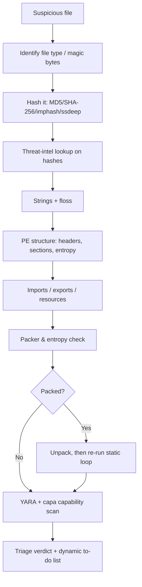
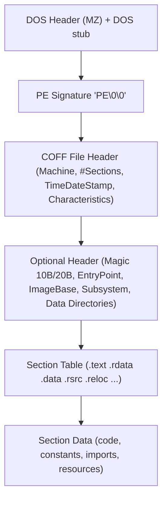
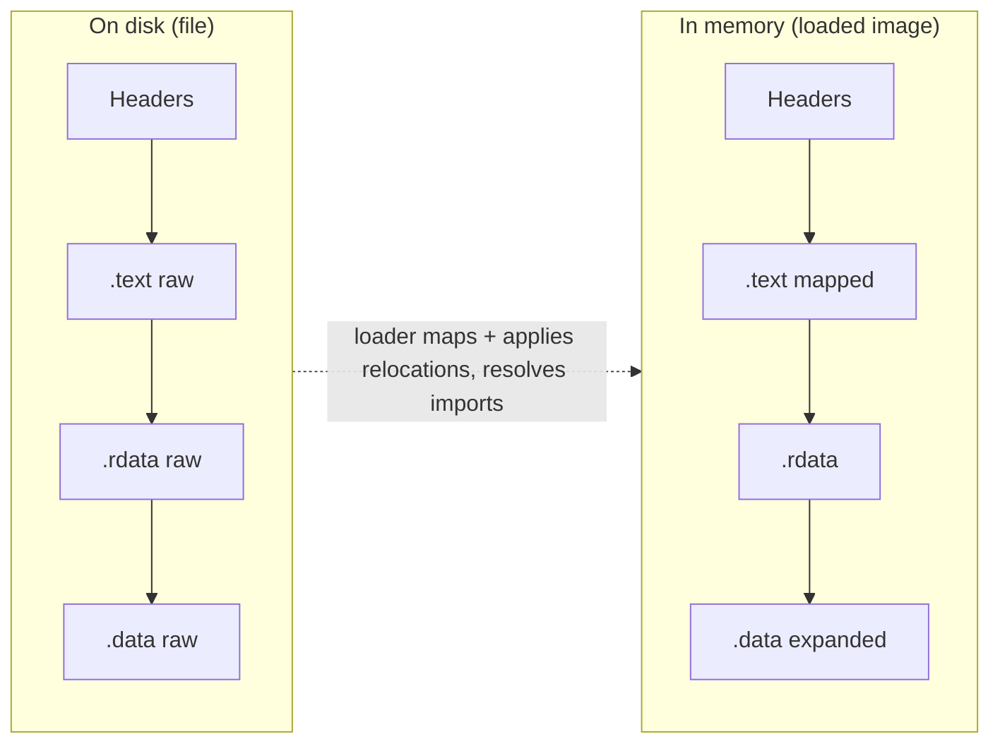
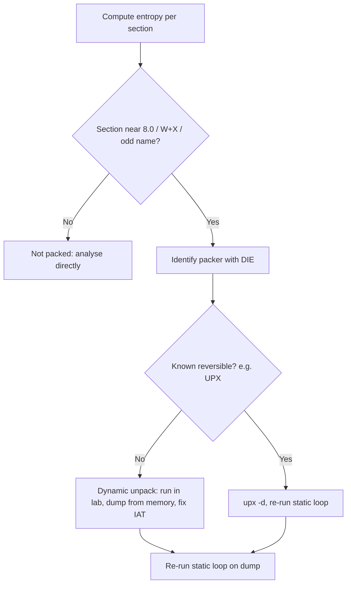
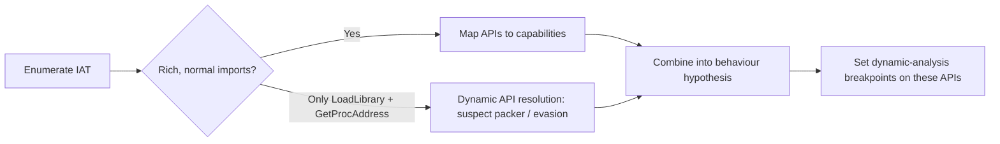
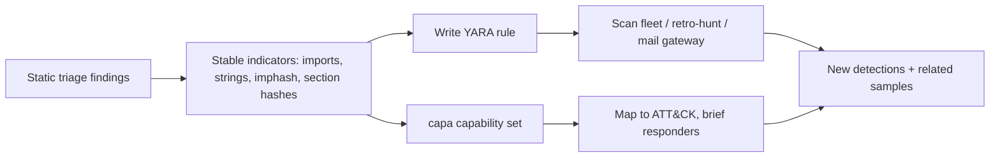

This is Chapter 2 of the Malware Analysis & Reverse Engineering notebook. The previous chapter built the containment lab — isolated VMs, snapshots, network simulation, and the handling discipline that keeps live samples off your host. Here we sit down in that lab with a suspicious file and start taking it apart **without executing it**. Static analysis is the art of learning what a binary *is* and what it is *capable of* purely from its bytes on disk: its file type, its embedded strings, its Portable Executable structure, the Windows APIs it imports, its resources, and the statistical fingerprints that betray packing and encryption. Done well, static triage answers the two questions every analyst asks first — "is this actually malicious?" and "what should I look for when I do detonate it?" — before a single instruction runs.

## Why This Matters

Dynamic analysis (running the sample and watching it) is powerful but expensive and defeatable. A sample can detect your sandbox and stay dormant, refuse to run without a specific command-line argument, wait days before activating, or require a live C2 that is already offline. Static analysis has none of those failure modes because the sample never gets a vote — you are reading the file, not asking it to cooperate. Every packed dropper still has an entry point, an import table (even if a tiny one), a section layout, and an entropy profile. Every phishing macro-dropped payload still carries strings, a compiler fingerprint, and a set of Windows API calls that describe its intentions.

Static triage is also the fastest way to *scale*. An analyst can statically fingerprint dozens of samples an hour — hash them, check the imports, look for known packer signatures, run a YARA/capa pass — and decide which one deserves the hours a full dynamic-plus-reversing workup costs. In a SOC or IR context this is exactly the funnel: **triage cheaply and statically, then spend expensive dynamic/RE time only on what earns it.** This chapter teaches the whole static funnel end to end, tool by tool, on a Windows PE — the file format that still accounts for the overwhelming majority of endpoint malware.

## Part 1: What Static Analysis Is — and Its Hard Limits

Static analysis means examining a file **without running it**. You look at the raw bytes and the structures those bytes define. For a Windows executable that means the Portable Executable (PE) format — the container that wraps every `.exe`, `.dll`, `.sys`, `.scr`, `.cpl`, and `.ocx` on the platform. Everything the loader needs to map that program into memory is described by fields inside the file, and every one of those fields is readable on disk.

There are two broad flavours of static analysis:

- **Basic static analysis** — file type identification, hashing, strings, PE header parsing, import/export enumeration, resource inspection, entropy and packer detection, signature scans (YARA, capa, AV). No disassembly required. This is triage, and it is the whole focus of this chapter.
- **Advanced static analysis** — loading the binary into a disassembler/decompiler (IDA Pro, Ghidra, Binary Ninja, radare2) and reading the actual instructions and reconstructed C. That is a later chapter; here we stop at the boundary where disassembly begins.

The honest limits of static analysis, stated up front so you never over-trust it:

| Limitation | Why it happens | Mitigation |
|---|---|---|
| **Packing / encryption** | The real code is compressed or encrypted and only unpacked in memory at runtime, so on disk you see a stub plus a high-entropy blob. | Detect the packer, unpack (static or by dumping from memory), then re-analyse. |
| **Obfuscated strings** | Strings are built on the stack, XOR-encoded, or decrypted at runtime, so `strings` shows nothing useful. | `floss` (stack/decoded string recovery), manual XOR/brute decoders, dynamic capture. |
| **Dynamic API resolution** | The sample resolves APIs at runtime via `GetProcAddress`/hashing so they never appear in the Import Address Table. | Look for `LoadLibrary`/`GetProcAddress`, API-hashing constants, and confirm dynamically. |
| **Anti-analysis metadata** | Fake compiler stamps, forged rich headers, decoy imports designed to mislead the analyst. | Corroborate every metadata clue against actual behaviour; never trust one signal alone. |

The golden rule: **static analysis narrows the hypothesis space; it rarely closes a case alone.** You are building a weighted set of suspicions ("imports crypto + networking + persistence APIs, high entropy `.text`, no meaningful strings → likely packed ransomware or a downloader") and a to-do list for dynamic analysis, not writing the final report.



**IR use case:** during an incident you are frequently handed a hash or a single dropped file from an EDR alert. The static loop above is what you run before you decide whether to pull the machine, hunt the hash fleet-wide, or escalate. Speed and correctness here set the tempo of the whole response.

## Part 2: File Type Identification — Never Trust the Extension

The first mistake beginners make is trusting `evil.pdf.exe` or a file called `invoice.doc` that is actually a PE. File **type** is determined by content — specifically the leading "magic" bytes — not by the name the attacker chose. Identifying the true type tells you which parser to reach for and is itself a triage signal (a `.jpg` that is really a PE is malicious until proven otherwise).

### Magic bytes and the `file` command

Every structured format begins with a signature. A Windows executable starts with the ASCII bytes `MZ` (`0x4D 0x5A`) — the initials of Mark Zbikowski, who designed the DOS executable format. A few you will memorise:

| Magic (hex) | ASCII | Format |
|---|---|---|
| `4D 5A` | `MZ` | Windows PE / DOS executable |
| `7F 45 4C 46` | `.ELF` | Linux/Unix ELF binary |
| `50 4B 03 04` | `PK..` | ZIP / OOXML (`.docx`, `.xlsx`, `.jar`, APK) |
| `25 50 44 46` | `%PDF` | PDF document |
| `D0 CF 11 E0` | — | Legacy OLE2 (old `.doc`/`.xls`, MSI) |
| `CA FE BA BE` | — | Java class / Mach-O fat binary |
| `52 61 72 21` | `Rar!` | RAR archive |

On REMnux/Linux, `file` reads these signatures using its "magic" database (`libmagic`):

```bash
$ file suspicious.bin
suspicious.bin: PE32 executable (GUI) Intel 80386, for MS Windows

$ file dropper.exe
dropper.exe: PE32+ executable (console) x86-64, for MS Windows

$ file macro_doc.doc
macro_doc.doc: Composite Document File V2 Document, ... , Number of Words: 0
```

- `PE32` = 32-bit PE; `PE32+` = 64-bit PE (the `+` is how the format encodes 64-bit, not a separate name).
- `(GUI)` vs `(console)` comes from the PE **Subsystem** field (covered in Part 5) — a GUI subsystem on something claiming to be a command-line tool is a small red flag.
- "Composite Document File" = OLE2 — the real payload is likely a macro or embedded object, a different analysis path.

### Confirming the magic yourself

Never rely on a single tool. Read the first bytes directly:

```bash
$ xxd suspicious.bin | head -n 2
00000000: 4d5a 9000 0300 0000 0400 0000 ffff 0000  MZ..............
00000010: b800 0000 0000 0000 4000 0000 0000 0000  ........@.......

$ head -c 2 suspicious.bin | xxd
00000000: 4d5a                                     MZ
```

`4d5a` = `MZ`: confirmed PE regardless of what the extension claims. On Windows you can do the same in PowerShell:

```powershell
PS> Get-Content suspicious.bin -Encoding Byte -TotalCount 2 | ForEach-Object { '{0:X2}' -f $_ }
4D
5A
```

**Blue team usage:** double extensions (`report.pdf.exe`), a mismatch between magic and extension, or a PE delivered inside a `.zip` from a phishing email are all high-fidelity triage signals. EDR and mail gateways often classify precisely on true file type, and knowing how they do it lets you understand (and audit) their verdicts.

## Part 3: Hashing and Fuzzy Hashing — Fingerprints and Family Clustering

Before you touch the structure, hash the sample. Hashes are the currency of threat intel: they let you look a sample up, share it without shipping the bytes, prove two files are identical, and — with *fuzzy* hashing — measure how *similar* two files are even when they are not byte-identical.

### Cryptographic hashes

```bash
$ md5sum sample.bin
5d41402abc4b2a76b9719d911017c592  sample.bin
$ sha1sum sample.bin
aaf4c61ddcc5e8a2dabede0f3b482cd9aea9434d  sample.bin
$ sha256sum sample.bin
9f86d081884c7d659a2feaa0c55ad015a3bf4f1b2b0b822cd15d6c15b0f00a08  sample.bin
```

- **SHA-256** is the modern default for sharing and lookups; **MD5/SHA-1** are cryptographically broken but still ubiquitous in older feeds and reports, so you compute all three.
- The hash changes completely if a single byte changes — great for exact identification, useless for spotting variants of the same family (attackers flip one byte to defeat exact-match blocklists).

**Threat-intel lookup first, always.** Paste the SHA-256 into VirusTotal, MalwareBazaar, or your internal platform *before* deep analysis. If 60 engines already flag it as a known family, you may be done in 30 seconds. **Never upload the sample itself to a public multiscanner during a live incident** — an upload is public, tips off the adversary, and can leak victim-identifying data. Look up the *hash*; only upload bytes if policy allows and the sample is already public.

### imphash — clustering by import table

The **import hash** (imphash) is an MD5 over the ordered list of imported libraries and functions. Because a given compiler + source produces a stable import layout, samples built from the same codebase frequently share an imphash even when their bytes differ:

```bash
$ python3 -c "import pefile; print(pefile.PE('sample.bin').get_imphash())"
d41d8cd98f00b204e9800998ecf8427e
```

Pivot on the imphash in VirusTotal/your platform to pull an entire family cluster. **Caveat:** packers collapse everyone to the same tiny import set, so a shared imphash among packed samples can just mean "same packer," not "same family." Weigh it accordingly.

### Fuzzy / similarity hashing — ssdeep and TLSH

Fuzzy hashes produce *similar* digests for *similar* inputs, so you can score two files as, say, 82% alike:

```bash
$ ssdeep sample.bin
3:hMCEpn:hVn,"sample.bin"

$ ssdeep -b sample_v1.bin sample_v2.bin
sample_v2.bin matches sample_v1.bin (74)
```

- **ssdeep** (context-triggered piecewise hashing) gives a 0–100 match score; **TLSH** (Trend Micro Locality Sensitive Hash) is more robust on larger files and is what many platforms cluster on internally.
- Use fuzzy hashing to answer "have I seen a *near-identical* sample before?" — invaluable for tracking a family across recompiles.

| Hash type | Detects | Defeated by | Primary use |
|---|---|---|---|
| MD5 / SHA-1 / SHA-256 | Exact identity | Any 1-byte change | Sharing, exact blocklists, TI lookup |
| imphash | Same import layout / build | Packing, dynamic API resolution | Family/build clustering |
| ssdeep | Byte-level similarity | Heavy packing, high entropy | "Near-duplicate?" scoring |
| TLSH | Similarity (large files) | Extreme obfuscation | Large-scale clustering |

**Blue team usage:** enrich every EDR/SIEM detection with SHA-256 + imphash so you can hunt the fleet for both exact and same-build siblings. A retro-hunt on imphash routinely surfaces earlier, unflagged intrusions by the same actor.

## Part 4: Strings — The Fastest Signal in the File

Strings are the single highest-value, lowest-effort static signal. A program's embedded text often leaks URLs, IP addresses, file paths, registry keys, mutex names, command-line strings, error messages, and even attacker debug artefacts. Extracting them takes seconds.

### The `strings` tool from scratch

`strings` scans a file for runs of printable characters terminated by a non-printable byte and prints them. It exists in every Unix toolkit and as a Sysinternals tool on Windows.

```bash
# Default: ASCII, minimum run length 4
$ strings sample.bin | head

# Minimum length 6 to cut noise
$ strings -n 6 sample.bin

# Include 16-bit little-endian Unicode (UTF-16LE) — Windows uses this everywhere
$ strings -e l sample.bin

# Print the file offset of each string (helps you locate it in a hex editor)
$ strings -t x sample.bin
```

Key flags to know cold:

| Flag | Meaning |
|---|---|
| `-n N` | Minimum string length (default 4; use 6–8 to reduce noise) |
| `-e s` | 7-bit ASCII (default) |
| `-e l` | 16-bit little-endian (UTF-16LE — **critical for Windows strings**) |
| `-e b` | 16-bit big-endian |
| `-t x` | Print byte offset (hex) before each string |
| `-a` | Scan the whole file (not just loadable sections) |

**Why `-e l` matters:** the Windows API is Unicode-first, so wide strings (`L"kernel32.dll"`, registry paths, C2 URLs) are stored as UTF-16LE. Default ASCII `strings` misses them entirely — you must run both an ASCII and a Unicode pass or you will overlook half the intel. On Windows, use Sysinternals `strings.exe`:

```powershell
PS> strings.exe -nobanner -n 6 sample.bin        # ASCII + Unicode by default
PS> strings64.exe -a -n 8 sample.bin > strings.txt
```

### What to hunt for in the output

You are pattern-matching against an indicators-of-interest checklist:

```text
Network:   http://  https://  ftp://  \\ (UNC)  raw IPs  .onion  User-Agent:
Filesystem:C:\Users\  \AppData\  \Temp\  %APPDATA%  .exe .dll .bat .ps1 paths
Registry:  HKCU  HKLM  \Run  \RunOnce  CurrentVersion\Winlogon
Windows APIs (leaked): VirtualAlloc  CreateRemoteThread  WinExec  URLDownloadToFile
Persistence/commands:  schtasks  reg add  powershell -enc  cmd /c  rundll32
Crypto/ransom:         AES  RSA  .locked  README.txt  bitcoin  wallet  -----BEGIN
Mutex/markers:         Global\  Local\  named mutex strings
Tooling artefacts:     .pdb paths, Go/Rust/Nim build strings, packer banners (UPX!)
```

A realistic (defanged) run on an unpacked downloader:

```text
$ strings -n 8 downloader.bin
!This program cannot be run in DOS mode.
.text
.rdata
.data
.rsrc
KERNEL32.dll
WININET.dll
InternetOpenUrlA
InternetReadFile
URLDownloadToFileA
hxxp://185[.]220[.]101[.]45/gate/panel.php
Mozilla/5.0 (Windows NT 10.0; Win64; x64)
\AppData\Roaming\svchost.exe
Software\Microsoft\Windows\CurrentVersion\Run
WinHttpUpdate
Global\a7f3c1e9-updater
schtasks /create /sc minute /mo 10 /tn WinUpdate /tr
C:\Users\dev\source\repos\loader\Release\loader.pdb
```

Even before opening a disassembler you can read the story: it downloads from a hard-coded host (`URLDownloadToFileA` + a URL), writes a fake `svchost.exe` to `%APPDATA%`, persists via both a `Run` key and a `schtasks` scheduled task, and the leaked **`.pdb` path** even reveals the developer's build folder and project name. That `.pdb` string is a genuine intel goldmine — attackers forget to strip it constantly.

> **Defang everything** you copy into notes/tickets: `http`→`hxxp`, `.`→`[.]`, `@`→`[@]`. A live URL pasted raw into a chat can be auto-fetched by a link preview bot and tip off the adversary — or get an analyst phished.

### floss — recovering hidden strings

Malware authors know `strings` is the first thing you run, so they hide strings: built on the stack character-by-character, XOR/RC4-encoded, or stacked into arrays decoded at runtime. **FLOSS** (FLARE Obfuscated String Solver, by Mandiant) emulates the binary to recover these:

```bash
# Install (single static binary release) then run
$ floss sample.bin

# Only the decoded/stack strings, skip the plain static ones
$ floss --only decoded stack sample.bin

# Minimum length, quiet banner, save to file
$ floss -n 6 --no static -- sample.bin > floss.txt
```

FLOSS emulates functions with a lightweight CPU emulator (vivisect) and captures strings that only exist after decoding, buckets them into **static**, **stack**, **tight**, and **decoded**. On a sample where plain `strings` shows nothing but library names, `floss` frequently pulls the real C2 URL and RC4 key straight out — because the sample was going to build them in memory anyway. It is slower (it emulates code) and can be evaded, but it is the correct next step whenever `strings` looks suspiciously empty.

**Red team usage (why defenders care):** offensive developers deliberately keep on-disk strings minimal — encrypting configs, resolving APIs by hash — precisely to blunt this step. So a near-empty `strings` output is itself a signal of deliberate obfuscation, i.e. a *more* capable adversary, not a *less* interesting sample.

## Part 5: The PE Format — Anatomy of a Windows Executable

Everything from here needs a mental model of the Portable Executable format. The PE is the on-disk container Windows loads into a process. Learn its skeleton once and every PE tool — PEStudio, CFF Explorer, DIE, pefile — becomes a different lens on the same structure.



### 5.1 The DOS header and stub

Every PE opens with the legacy DOS header. It starts with `MZ` and, at offset `0x3C`, holds a 4-byte field **`e_lfanew`** — the file offset where the real PE header begins. The loader reads `MZ`, jumps to `e_lfanew`, and expects `PE\0\0` there. Between them sits the **DOS stub**, a tiny 16-bit program whose only job is to print *"This program cannot be run in DOS mode."* if the EXE is launched under DOS. That famous string is why it appears near the top of almost every `strings` dump.

```bash
# e_lfanew lives at offset 0x3C, 4 bytes little-endian
$ xxd -s 0x3C -l 4 sample.bin
0000003c: f800 0000                                ....
# -> 0x000000F8: the PE header starts at file offset 0xF8
$ xxd -s 0xF8 -l 4 sample.bin
000000f8: 5045 0000                                PE..
# 'PE\0\0' confirmed
```

**Anti-analysis note:** a mismatched or corrupted `e_lfanew`, or a `PE\0\0` signature that is missing/misaligned, is sometimes used to break naive parsers while the real Windows loader (which is tolerant of certain malformations) still runs the file. Robust tools like pefile handle these; hand-rolled scripts may not.

### 5.2 The COFF / File Header

Immediately after `PE\0\0` is the 20-byte COFF File Header. The fields that matter for triage:

| Field | Meaning / triage value |
|---|---|
| `Machine` | Target CPU: `0x14C` = x86, `0x8664` = x64, `0xAA64` = ARM64. Should match how it was delivered. |
| `NumberOfSections` | Count of sections. Weird counts (1, or 10+) hint at packers or manual crafting. |
| `TimeDateStamp` | Claimed compile time (Unix epoch). Trivially forged — treat as a *lead*, not fact. |
| `PointerToSymbolTable` / `NumberOfSymbols` | Usually 0 in release malware; non-zero can leak debug info. |
| `SizeOfOptionalHeader` | Size of the following Optional Header. |
| `Characteristics` | Bit flags: `IMAGE_FILE_DLL` (0x2000), `IMAGE_FILE_EXECUTABLE_IMAGE` (0x0002), `IMAGE_FILE_LARGE_ADDRESS_AWARE`, etc. Tells you EXE vs DLL. |

The `TimeDateStamp` deserves a warning: it is one of the most-forged fields in malware. A 1970 or year-2099 timestamp screams tampering; a plausible-but-specific timestamp can still be faked. Use it only to *cluster* samples (many builds sharing an odd stamp) and corroborate with the **Rich Header** (below), never as ground truth for "when was this made."

### 5.3 The Optional Header (not optional for executables)

Despite the name, every image PE has this. It holds the load-time parameters:

| Field | Meaning / why you care |
|---|---|
| `Magic` | `0x10B` = PE32 (32-bit), `0x20B` = PE32+ (64-bit). This is the authoritative bitness. |
| `AddressOfEntryPoint` | RVA of the first instruction that runs. If it points *outside* `.text` (e.g. into a writable section), suspect a packer/unpacker stub. |
| `ImageBase` | Preferred load address (e.g. `0x400000` for classic 32-bit EXEs). |
| `SectionAlignment` / `FileAlignment` | How sections align in memory vs on disk (commonly `0x1000` / `0x200`). |
| `Subsystem` | `2` = GUI, `3` = console, `1` = native/driver. A console tool marked GUI (no window) can be hiding output. |
| `DllCharacteristics` | ASLR (`DYNAMIC_BASE`), DEP (`NX_COMPAT`), CFG. Malware sometimes *disables* ASLR to hard-code addresses. |
| `SizeOfImage` | Total in-memory size. Wildly larger than the file size hints at a big blob to be inflated (packing). |
| `DataDirectory[]` | Array of (RVA, size) pointers to Import, Export, Resource, Relocation, TLS, Debug, etc. tables — the index to everything else. |

The **Data Directory** is the master index: entry 0 → Export Table, 1 → Import Table, 2 → Resource Table, 5 → Base Relocations, 6 → Debug, 9 → TLS. When a tool "finds the imports," it is reading `DataDirectory[1]` and following the RVA into a section.

### 5.4 The Section Table and sections

After the headers comes the section table — one 40-byte entry per section. Each entry names the section and records where it lives on disk vs in memory and what permissions it gets.

| Section | Normal contents | Normal permissions |
|---|---|---|
| `.text` | Executable code | Read + Execute |
| `.rdata` | Read-only data, imports, strings | Read |
| `.data` | Initialised read/write globals | Read + Write |
| `.bss` | Uninitialised data | Read + Write |
| `.rsrc` | Resources (icons, manifests, embedded files) | Read |
| `.reloc` | Base relocations | Read |
| `.tls` | Thread-local storage (and callbacks!) | Read |

Each entry carries two size/location pairs that are a classic packer tell:

- `VirtualSize` / `VirtualAddress` — size and RVA of the section **in memory**.
- `SizeOfRawData` / `PointerToRawData` — size and offset **on disk**.

**Packer tell #1:** when `VirtualSize` ≫ `SizeOfRawData` (a section that is tiny on disk but huge in memory), the loader is being asked to allocate room the unpacker will fill at runtime. **Packer tell #2:** a section marked both **Writable and Executable** (`IMAGE_SCN_MEM_WRITE | IMAGE_SCN_MEM_EXECUTE`) — legitimate compilers almost never emit W+X sections; unpackers need to write decoded code then run it. **Packer tell #3:** non-standard section names (`UPX0`, `UPX1`, `.themida`, `.vmp0`, `.aspack`, random gibberish) instead of the toolchain defaults.



## Part 6: Detect It Easy (DIE) — Fingerprinting Compiler and Packer

**What it is:** Detect It Easy (DIE) is an open-source, cross-platform (Windows/Linux/macOS) file-type and packer/compiler identifier. It is the modern successor to PEiD, using a large signature database plus scriptable detectors to answer "what compiled/packed this?" It also has a strong built-in entropy visualiser and hex/PE viewers.

**Why it exists:** knowing the toolchain and whether a file is packed reshapes your whole plan. "Compiled with MinGW GCC," "packed with UPX 4.x," "protected by Themida," and "Nim binary" each imply completely different next steps. DIE answers that in one pass.

**Install (Linux/REMnux):**

```bash
$ sudo apt install detect-it-easy    # on REMnux it's preinstalled
$ diec sample.bin                    # CLI: "Detect It Easy Console"
```

**CLI usage and sample output:**

```bash
$ diec sample.bin
PE32
    Compiler: Microsoft Visual C/C++ (2019 v.16.10)[-]
    Linker: Microsoft Linker (14.29)[GUI32]
    Tool: Visual Studio (2019 version 16.10)

$ diec packed.bin
PE32
    Packer: UPX (4.02)[NRV,brute]
    Linker: Microsoft Linker (2.55)

# Entropy report
$ diec -e sample.bin
Total 6.51
    PE Header      1.94   not packed
    Section(0)['.text']  6.42  not packed
    Section(1)['.rdata'] 5.11  not packed
    Section(2)['.data']  3.02  not packed
    Section(3)['UPX1']   7.93  packed          <-- near-max entropy
```

Reading it: an entropy of **7.9+/8.0** on a section is a strong "encrypted or compressed" signal (see Part 8). DIE flags UPX by both the signature *and* the entropy. The GUI adds a live entropy graph — a solid high plateau across a section is the visual signature of packing.

| DIE result | What it tells you | Next step |
|---|---|---|
| "Microsoft Visual C/C++ 2019" | Normal MSVC build | Proceed to imports/strings normally |
| "UPX (x.xx)" | Compressed with UPX (unpackable) | `upx -d` to unpack, then re-analyse |
| "Themida / VMProtect / ASPack" | Commercial protector, not trivially unpackable | Plan on dynamic unpacking / memory dump |
| "MinGW / Go / Nim / PyInstaller" | Non-MSVC toolchain | Adjust expectations (Go/Nim have huge static binaries; PyInstaller → extract with pyinstxtractor) |
| "Nothing detected" but entropy 7.9 | Unknown/custom packer | Treat as packed; dynamic-dump the unpacked image |

**CTF note:** in reversing CTFs, DIE (or PEiD) is the reflexive first move to spot UPX/ASPack quickly so you can unpack before wasting time in a disassembler on a stub.

## Part 7: PEStudio — Triage-Oriented PE Analysis

**What it is:** PEStudio (Marc Ochsenmeier) is a Windows GUI tool purpose-built for **malware triage** of PE files without running them. It parses the entire PE and — crucially — **flags** suspicious artefacts against blacklists and heuristics, so you are not just reading raw structures, you are reading structures with expert annotations attached. It is the single most efficient basic-static tool for a working analyst.

**Why it exists:** raw PE parsers show you everything with equal weight; PEStudio triages. It highlights blacklisted imports, blacklisted strings, high-entropy sections, an entry point in the wrong place, TLS callbacks, resources that are themselves executables, and it computes MD5/SHA/imphash and can query VirusTotal by hash — all in one view.

**Install & first run:** download from winitor.com, unzip, run `pestudio.exe` (portable, no install) **inside your analysis VM**. Load the sample (drag-and-drop or File→Open). Left pane = categories; PEStudio colours **red** what it considers suspicious.

What each panel gives you, in triage order:

| Panel | What you learn | Red flags PEStudio highlights |
|---|---|---|
| **indicators** | An overall scored list of everything suspicious it found | The fastest "should I worry?" overview |
| **virustotal** | Detection ratio by hash (no upload) | High detection = known bad |
| **dos-header / file-header / optional-header** | Machine, timestamp, subsystem, entry point | Forged timestamp, entrypoint outside `.text` |
| **directories** | Data directories present | Unusual TLS/Debug/Reloc presence |
| **sections** | Names, sizes, entropy, permissions | High entropy, W+X, `VirtualSize`≫raw, odd names |
| **libraries / imports** | DLLs and functions imported | Blacklisted APIs (see Part 9) shown in red |
| **exports** | Exported functions (for DLLs) | Ordinal-only exports, suspicious names |
| **tls-callbacks** | Code that runs *before* `main` | Any TLS callback = anti-debug/early-exec suspicion |
| **resources** | Embedded resources + their entropy | A resource that is itself a PE (embedded payload) |
| **strings** | Extracted strings, with blacklisted ones flagged | URLs, APIs, commands flagged red |
| **manifest / version** | Manifest, company/product metadata | Impersonated vendor names, requestedExecutionLevel=requireAdministrator |

A realistic triage read in PEStudio: you open `invoice.exe`, the **indicators** tab shows red for "imports flagged (12)," "section with entropy > 7.0," and "entry-point in section .data." The **imports** tab shows `VirtualAllocEx`, `WriteProcessMemory`, `CreateRemoteThread` (classic process injection), plus `InternetOpenA`. The **strings** tab flags a `hxxp://` URL and `powershell -enc`. The **resources** tab shows a resource whose first bytes are `MZ`. In under two minutes, with zero execution, PEStudio has told you: this is a packed injector/downloader carrying an embedded PE — high confidence malicious, dynamic analysis warranted, and you already know which APIs to breakpoint.

**Blue team usage:** PEStudio's imphash, hashes, and flagged-imports list drop straight into a ticket and a hunt query. Its VirusTotal-by-hash lookup keeps you from uploading the sample while still getting a reputation read.

## Part 8: Entropy and Packing — Measuring Randomness

**Entropy** (Shannon entropy) measures the information density / randomness of data on a 0–8 scale for bytes. It is the quantitative backbone of packer detection.

- **Low entropy (0–5):** repetitive/structured data — plain code, ASCII text, tables, padding.
- **Medium (5–6.5):** normal compiled code and mixed data.
- **High (7.0–8.0):** compressed or encrypted data — near-random bytes. Packed sections, embedded ZIPs, encrypted configs, and crypto material live here.

A whole-file entropy near 7.9+ or a *single section* pegged near 8.0 while others are normal is the textbook packer/encryption fingerprint. Compute it yourself:

```python
# entropy.py — Shannon entropy of a file (and per-section via pefile)
import sys, math, pefile

def entropy(data: bytes) -> float:
    if not data:
        return 0.0
    freq = [0] * 256
    for b in data:
        freq[b] += 1
    ent = 0.0
    for c in freq:
        if c:
            p = c / len(data)
            ent -= p * math.log2(p)
    return ent

pe = pefile.PE(sys.argv[1])
print(f"{'section':10} {'raw size':>10} {'entropy':>8}")
for s in pe.sections:
    name = s.Name.rstrip(b'\x00').decode(errors='replace')
    print(f"{name:10} {s.SizeOfRawData:>10} {s.get_entropy():>8.2f}")
```

```text
$ python3 entropy.py packed.bin
section     raw size  entropy
.text            512     6.30
.rdata           256     4.90
.data            512     0.98
UPX0               0     0.00
UPX1          204288     7.94   <-- packed payload
.rsrc           1024     3.40
```

`pefile` exposes `section.get_entropy()` directly, so you rarely need the manual loop — but knowing the formula (`-Σ p·log₂ p` over byte frequencies) means you can reason about *why* `.data` full of zeros scores ~1 and an AES-encrypted blob scores ~8.

### Unpacking UPX (the one you will meet most)

UPX (Ultimate Packer for eXecutables) is the most common packer in the wild — often applied to *legitimate* software too, so "UPX" ≠ "malicious," it just means "unpack before analysing." UPX is unusual in being cleanly reversible with its own tool:

```bash
$ upx -d packed.bin -o unpacked.bin
                       Ultimate Packer for eXecutables
File size         Ratio      Format      Name
--------------------   ------   -----------   -----------
   204800 <-   81920   40.00%    win64/pe     unpacked.bin
Unpacked 1 file.

$ diec -e unpacked.bin        # confirm entropy dropped, sections normalised
Total 6.10
    Section(0)['.text']  6.42  not packed
```

After unpacking, **re-run the entire static loop** on `unpacked.bin` — its strings, imports, and structure are now readable. Commercial protectors (Themida, VMProtect, ASPack, custom crypters) are *not* cleanly reversible with a tool; those require dynamic unpacking (dumping the process image from memory once it has unpacked itself, then fixing the import table) — a later chapter. Recognising *which* case you are in is the whole point of this step.



## Part 9: Imports — Reading the Import Address Table as a Behaviour Map

If strings tell you *what a program mentions*, imports tell you *what a program can do*. A PE that wants to call a Windows API it did not write itself must **import** it from a DLL. The list of imported DLLs and functions — the Import Address Table (IAT) — is therefore a capability manifest. Reading it fluently is the core skill of static triage.

### How imports work

The Optional Header's `DataDirectory[1]` points to the Import Directory: an array of `IMAGE_IMPORT_DESCRIPTOR` structures, one per imported DLL. Each descriptor names a DLL (`kernel32.dll`) and points to two parallel arrays — the Import Name Table (function names/ordinals it wants) and the Import Address Table (which the loader fills with real function addresses at load time). Enumerate them with `pefile`:

```python
import pefile
pe = pefile.PE("sample.bin")
for entry in pe.DIRECTORY_ENTRY_IMPORT:
    print(entry.dll.decode())
    for imp in entry.imports:
        name = imp.name.decode() if imp.name else f"ordinal_{imp.ordinal}"
        print(f"    {name}")
```

```text
KERNEL32.dll
    VirtualAlloc
    VirtualProtect
    CreateThread
    GetProcAddress
    LoadLibraryA
    WriteProcessMemory
    CreateRemoteThread
ADVAPI32.dll
    RegSetValueExA
    RegCreateKeyExA
    CryptEncrypt
    CryptAcquireContextA
WININET.dll
    InternetOpenA
    InternetOpenUrlA
    InternetReadFile
```

### The API-to-intent dictionary

Learn to map imported functions to behaviours. This table is the heart of static triage — internalise it:

| Capability | Telltale imported APIs |
|---|---|
| **Process injection** | `VirtualAllocEx`, `WriteProcessMemory`, `CreateRemoteThread`, `NtCreateThreadEx`, `QueueUserAPC`, `SetThreadContext`, `OpenProcess` |
| **Shellcode / dynamic code** | `VirtualAlloc` + `VirtualProtect` (RW→RX), `RtlMoveMemory`, `EnumSystemLocalesA` (callback exec) |
| **Dynamic API resolution (evasion)** | `LoadLibraryA/W`, `GetProcAddress`, `GetModuleHandle` (few other imports = resolves the rest at runtime) |
| **Persistence** | `RegCreateKeyEx`, `RegSetValueEx` (Run keys), `CreateServiceA`, `StartServiceCtrlDispatcher`, `CreateFileA` into Startup |
| **Networking / C2** | `InternetOpen`, `InternetOpenUrl`, `InternetReadFile`, `HttpSendRequest`, `WinHttpConnect`, `socket`, `connect`, `send`, `recv`, `WSAStartup`, `DnsQuery_A` |
| **Downloader** | `URLDownloadToFileA/W` (urlmon), `WinHttpReadData` |
| **Ransomware / crypto** | `CryptAcquireContext`, `CryptEncrypt`, `CryptGenKey`, `CryptDeriveKey`, `BCryptEncrypt`, `FindFirstFile`/`FindNextFile` (enumerate targets) |
| **Keylogging / spying** | `SetWindowsHookEx`, `GetAsyncKeyState`, `GetKeyState`, `GetForegroundWindow`, `RegisterRawInputDevices` |
| **Screen / clipboard** | `BitBlt`, `GetDC`, `OpenClipboard`, `GetClipboardData` |
| **Anti-analysis / anti-debug** | `IsDebuggerPresent`, `CheckRemoteDebuggerPresent`, `NtQueryInformationProcess`, `GetTickCount`, `QueryPerformanceCounter`, `OutputDebugString`, `Sleep` (large) |
| **Privilege / token** | `AdjustTokenPrivileges`, `OpenProcessToken`, `LookupPrivilegeValue`, `SeDebugPrivilege` usage |
| **Discovery / staging** | `GetComputerName`, `GetUserName`, `GetSystemInfo`, `RegQueryValueEx`, `CreateToolhelp32Snapshot`, `Process32First/Next` |

**How to read a set, not a single call.** One `Sleep` is nothing; `IsDebuggerPresent` + `GetTickCount` + a big `Sleep` + `VirtualAlloc`/`VirtualProtect` + `CreateRemoteThread` together tell a coherent story: *check for a debugger, stall the sandbox, allocate RX memory, inject into another process.* Static analysis is about reading the **combination**.

### The suspiciously *empty* import table

A PE that imports only `LoadLibraryA`, `GetProcAddress`, and maybe `VirtualAlloc` — and nothing else meaningful — is a loud signal. It means the program intends to resolve everything else at runtime to keep its capabilities off the IAT (and out of your static view). Combined with a high-entropy section, that is a packed or API-hashing loader. The *absence* of imports is itself intelligence.



**Red team usage (why this arms defenders):** offensive tooling minimises and obfuscates imports precisely because analysts read the IAT this way — API hashing (resolving `CreateRemoteThread` by a precomputed hash of its name), delayed imports, and syscalls that bypass the import table entirely. Recognising a deliberately hollowed IAT tells you you are looking at tradecraft, and points you at the API-resolution routine to reverse next.

## Part 10: Exports, Resources, TLS Callbacks, and the Rich Header

Beyond imports, four more structures carry outsized triage value.

### Exports

DLLs expose functions via the Export Table (`DataDirectory[0]`). For a malicious DLL, the export names tell you how it is meant to be called — e.g. a `rundll32.exe evil.dll,StartW` payload will export `StartW`. Exports named only by **ordinal** (no name) or with a single odd export (`DllRegisterServer`, `ServiceMain`, `Start`, `Init`) point at how the loader/dropper invokes it. Enumerate with pefile:

```python
pe = pefile.PE("evil.dll")
for exp in pe.DIRECTORY_ENTRY_EXPORT.symbols:
    print(hex(pe.OPTIONAL_HEADER.ImageBase + exp.address),
          exp.name.decode() if exp.name else f"ordinal_{exp.ordinal}")
```

### Resources — where payloads hide

The `.rsrc` section holds icons, manifests, version info — and, in malware, frequently an **embedded second-stage payload**: another PE, an encrypted blob, a config, or a decoy document. Two things to check on every resource: its **entropy** (a high-entropy resource is an encrypted payload) and its **magic bytes** (a resource starting with `MZ` is an embedded executable; `PK` is a zip; `%PDF` a decoy doc). Extract and inspect:

```python
import pefile
pe = pefile.PE("dropper.exe")
for rt in pe.DIRECTORY_ENTRY_RESOURCE.entries:
    for rid in rt.directory.entries:
        for lang in rid.directory.entries:
            data = pe.get_data(lang.data.struct.OffsetToData, lang.data.struct.Size)
            print(rt.name or rt.id, rid.name or rid.id, len(data), data[:4])
            # dump it: open(f"res_{rt.id}_{rid.id}.bin","wb").write(data)
```

```text
RT_RCDATA 101 204800 b'MZ\x90\x00'   <-- embedded PE payload in a resource!
RT_ICON     1   4264 b'\x28\x00...'
RT_MANIFEST 1    381 b'<?xm'
```

Finding an `MZ` inside `.rsrc` means the dropper carries its next stage internally — dump it and analyse it as its own sample. **PEStudio's resources panel and Resource Hacker do this visually.**

### TLS callbacks — code that runs before `main`

Thread Local Storage callbacks (`DataDirectory[9]`) are functions the loader runs **before** the program's entry point. Malware abuses them for **anti-debugging** (they execute before you set a breakpoint on `main`) and for early unpacking. Any TLS callback in a suspicious sample is noteworthy; PEStudio and CFF Explorer both surface them, and pefile exposes `pe.DIRECTORY_ENTRY_TLS`. When you move to dynamic analysis, remember to breakpoint the TLS callback, not just the entry point, or the sample may act before you are watching.

### The Rich Header — a build fingerprint attackers forget

Between the DOS stub and the PE signature, MSVC-linked binaries carry an undocumented **Rich Header**: an XOR-encoded record of the exact compiler/linker tool versions and object counts used to build the file. It is a superb clustering and forgery-detection signal:

- A Rich Header that is **inconsistent** with the claimed `TimeDateStamp` or the compiler DIE reports suggests tampering.
- A Rich Header **shared** across otherwise-different samples clusters them to one build environment (famously used to link samples in attribution work).
- A **missing** Rich Header on something claiming to be MSVC-built suggests a non-MSVC toolchain or a stripped/forged file.

`pefile` parses it (`pe.parse_rich_header()`); PEStudio shows a decoded "rich-header" panel. You will not decode it by hand often, but knowing it exists — and that it is a second, harder-to-forge timestamp/toolchain witness — is what separates a careful analyst from a checklist follower.

## Part 11: Capability Detection and Signatures — capa and YARA

Reading imports by hand is essential for learning, but two tools automate and scale the capability read.

### capa — from bytes to ATT&CK behaviours

**What it is:** `capa` (Mandiant/FLARE) analyses a PE (or shellcode/ELF) statically and reports the **capabilities** it finds, mapped to MITRE ATT&CK and the Malware Behaviour Catalog, using a large open rule set that matches on imports, strings, byte patterns, and disassembled features. It effectively does the "API-to-intent" mapping from Part 9 automatically, and more.

```bash
$ capa sample.bin
+------------------------+------------------------------------------------------------+
| ATT&CK Tactic          | ATT&CK Technique                                           |
+------------------------+------------------------------------------------------------+
| DEFENSE EVASION        | Obfuscated Files or Information::Software Packing [T1027.002]|
| DISCOVERY              | System Information Discovery [T1082]                        |
| EXECUTION              | Shared Modules [T1129]                                      |
| PERSISTENCE            | Registry Run Keys / Startup Folder [T1547.001]             |
| COMMAND AND CONTROL    | Application Layer Protocol: Web Protocols [T1071.001]      |
+------------------------+------------------------------------------------------------+

$ capa -vv sample.bin      # very verbose: shows the exact matched features & addresses
```

`capa` turns a pile of imports into a sentence: *"packs itself, discovers the host, persists via a Run key, and beacons over HTTP."* On a **packed** sample it will mostly report the packer and warn that capabilities are hidden until unpacked — another reason to unpack first. Run capa on `unpacked.bin`, not the stub.

### YARA — writing and running detection rules

**What it is:** YARA is the industry-standard pattern-matching engine for classifying and identifying malware ("the pattern-matching swiss knife"). A YARA rule is a set of strings/byte-patterns plus a boolean condition; you scan files/processes/memory with it. Analysts write YARA to *pin* a family or campaign once they have statically characterised it, then hunt with it fleet-wide.

Install and scan:

```bash
$ sudo apt install yara            # or pip install yara-python for scripting
$ yara -r rules.yar /samples/      # -r recurse a directory
$ yara -s rules.yar sample.bin     # -s print matching strings + offsets
```

A rule built directly from the static findings in this chapter:

```yara
rule Downloader_APPDATA_SvcHost_Persist
{
    meta:
        author       = "analyst"
        description  = "Downloader: URLDownloadToFile + fake svchost in AppData + Run-key persistence"
        tlp          = "AMBER"
        reference    = "internal-triage"

    strings:
        $mz    = "MZ"                                   // sanity: it's a PE
        $api1  = "URLDownloadToFileA" ascii
        $api2  = "InternetReadFile"   ascii
        $path  = "\\AppData\\Roaming\\svchost.exe" ascii wide
        $run   = "Software\\Microsoft\\Windows\\CurrentVersion\\Run" ascii wide
        $ua    = "Mozilla/5.0 (Windows NT 10.0; Win64; x64)" ascii

    condition:
        $mz at 0                                        // PE at offset 0
        and filesize < 2MB
        and 3 of ($api1, $api2, $path, $run, $ua)
}
```

Key rule mechanics to understand:

- `$mz at 0` anchors the match to the file's first bytes — cheap and precise.
- `ascii wide` matches both ASCII and UTF-16LE copies of a string (remember Part 4 — Windows strings are often wide).
- `N of (...)` requires *any* N of a set, giving resilience against small variations while keeping false positives low.
- `filesize`, `pe.imphash()`, `pe.imports(...)`, entropy, and byte offsets are all usable in conditions (the `pe` module adds PE-aware fields).

**Blue team usage:** this is the through-line of static analysis — you triage a sample, extract its stable indicators (imports, unique strings, imphash, section hashes), and encode them as a YARA rule and a capa-confirmed capability set. That rule then feeds EDR, your mail gateway, retro-hunts across historical samples, and threat-intel sharing. Static analysis is where detections are *born*.



## Part 12: Hands-On Lab — Full Static Triage of a Suspicious PE, End to End

This lab walks the complete static funnel on a sample inside your isolated VM (from Chapter 1). Commands and output are realistic; substitute your own sample from MalwareBazaar (`.zip`, password `infected`). **Do this in the lab, with a snapshot taken, and never execute the file during static analysis.**

**Step 0 — set up safely.** In the guest VM, in a working folder, with the network isolated:

```bash
$ mkdir -p ~/lab/case001 && cd ~/lab/case001
$ cp /mnt/incoming/sample.bin .
$ chmod -x sample.bin        # belt-and-braces: strip the exec bit on Linux/REMnux
```

**Step 1 — identify and hash.**

```bash
$ file sample.bin
sample.bin: PE32 executable (GUI) Intel 80386, for MS Windows

$ sha256sum sample.bin
7de2c1bf... (record this; look it up on VT/MalwareBazaar by hash first)

$ python3 -c "import pefile;print('imphash',pefile.PE('sample.bin').get_imphash())"
imphash  1a2b3c4d5e6f7a8b9c0d1e2f3a4b5c6d
```

**Step 2 — fingerprint the toolchain / packing with DIE.**

```bash
$ diec sample.bin
PE32
    Packer: UPX (4.02)[NRV,brute]
    Linker: Microsoft Linker (2.55)

$ diec -e sample.bin
    Section(0)['UPX0']  0.00  packed
    Section(1)['UPX1']  7.93  packed     <-- packed; unpack before deep analysis
    Section(2)['.rsrc'] 3.10  not packed
```

DIE says **UPX-packed** — so anything we read now is the stub. Unpack:

```bash
$ upx -d sample.bin -o sample_unp.bin
Unpacked 1 file.
$ diec -e sample_unp.bin
    Section(0)['.text']  6.44  not packed
    Section(1)['.rdata'] 5.02  not packed
```

From here on, analyse **`sample_unp.bin`**.

**Step 3 — strings (ASCII + Unicode + floss).**

```bash
$ strings -n 8 sample_unp.bin       > str_ascii.txt
$ strings -e l -n 8 sample_unp.bin  > str_wide.txt
$ floss --only decoded stack sample_unp.bin > str_floss.txt

$ grep -Ei 'http|\.php|\.onion|AppData|Run|schtasks|powershell|CreateRemote' str_ascii.txt
hxxp://185[.]220[.]101[.]45/gate/panel.php
Software\Microsoft\Windows\CurrentVersion\Run
schtasks /create /sc minute /mo 10 /tn WinUpdate /tr "%APPDATA%\svchost.exe"
```

**Step 4 — sections and entropy (confirm nothing still packed).**

```bash
$ python3 entropy.py sample_unp.bin
section     raw size  entropy
.text          81920     6.44
.rdata         20480     5.02
.data           8192     2.11
.rsrc         204800     7.97   <-- high-entropy resource: embedded encrypted payload?
```

**Step 5 — dump and inspect the suspicious resource.**

```bash
$ python3 dump_resources.py sample_unp.bin
RT_RCDATA 101 204800 b'MZ\x90\x00'   -> wrote res_101.bin
$ file res_101.bin
res_101.bin: PE32+ executable (console) x86-64, for MS Windows
```

The dropper carries a **second-stage 64-bit PE** inside its resources. Treat `res_101.bin` as its own case and repeat the loop on it later.

**Step 6 — imports → capabilities.**

```bash
$ python3 imports.py sample_unp.bin
KERNEL32.dll: VirtualAlloc, VirtualProtect, CreateProcessA, WriteProcessMemory, CreateRemoteThread
ADVAPI32.dll: RegCreateKeyExA, RegSetValueExA
urlmon.dll:   URLDownloadToFileA
WININET.dll:  InternetOpenA, InternetReadFile
```

Read it: **downloader** (`URLDownloadToFileA` + WININET) + **process injection** (`VirtualAlloc`/`WriteProcessMemory`/`CreateRemoteThread`) + **persistence** (`Reg*` Run key) + a **staged embedded payload**. Coherent, high-confidence malicious.

**Step 7 — automated capability + rule scan.**

```bash
$ capa sample_unp.bin
| PERSISTENCE       | Registry Run Keys / Startup Folder [T1547.001] |
| COMMAND AND CONTROL | Web Protocols [T1071.001]                    |
| DEFENSE EVASION   | Process Injection [T1055]                        |

$ yara -s Downloader_APPDATA_SvcHost_Persist.yar sample_unp.bin
Downloader_APPDATA_SvcHost_Persist sample_unp.bin
0x1a20:$api1: URLDownloadToFileA
0x1c40:$run: Software\Microsoft\Windows\CurrentVersion\Run
```

**Step 8 — write the triage verdict.** A tight, defanged one-pager:

```text
CASE-001 static triage
File:      sample.bin  (PE32 GUI x86; UPX-packed -> unpacked as sample_unp.bin)
SHA-256:   7de2c1bf...        imphash: 1a2b3c4d...
Verdict:   MALICIOUS (high confidence) — downloader/injector w/ staged payload
Capabilities: HTTP download (urlmon/WININET), process injection
              (VirtualAlloc+WriteProcessMemory+CreateRemoteThread),
              Run-key persistence, embedded 64-bit PE in .rsrc (res_101.bin)
Network IOC:  hxxp://185[.]220[.]101[.]45/gate/panel[.]php
Host IOC:     %APPDATA%\svchost.exe ; HKCU\...\Run\WinUpdate ;
              schtasks task "WinUpdate" every 10 min
Detection:    YARA Downloader_APPDATA_SvcHost_Persist matched
Dynamic TODO: breakpoint URLDownloadToFileA & CreateRemoteThread; recover
              C2 response; analyse res_101.bin; confirm injection target
```

That is a complete static triage: identity, packing handled, behaviour mapped, IOCs extracted and defanged, a detection written, and a focused dynamic to-do list — all without ever running the sample.

## Part 13: Common Pitfalls and How to Avoid Them

| Pitfall | Consequence | Fix |
|---|---|---|
| **Analysing the packed stub** and drawing conclusions from it | You "conclude" it does nothing; the real code is compressed | Always entropy-check and DIE first; unpack, then analyse the unpacked image |
| **Only running ASCII `strings`** | Miss every Unicode URL/API/path (half the intel) | Always run `-e l` (UTF-16LE) too, plus `floss` for hidden strings |
| **Trusting `TimeDateStamp`** | Wrong timeline, wrong clustering | Treat as forgeable; corroborate with Rich Header and behaviour |
| **Trusting metadata/vendor names** | A file "signed by Microsoft" in the manifest may be lying | Verify actual Authenticode signature; manifests are attacker-controlled text |
| **Uploading the sample to public VT during a live IR** | Tips off the adversary, may leak victim data | Look up by *hash*; only upload if the sample is already public/policy allows |
| **Reading one import in isolation** | False positives/negatives | Read the *combination* of imports as a behaviour |
| **Ignoring an empty import table** | Miss that it resolves APIs dynamically | Treat a hollow IAT + high entropy as "packed/evasive," not "harmless" |
| **Forgetting TLS callbacks** in later dynamic work | Sample acts before your entry-point breakpoint | Note TLS callbacks statically; breakpoint them dynamically |
| **Not defanging IOCs** in tickets/chat | Live URL auto-fetched, adversary alerted | `hxxp` / `[.]` / `[@]` everywhere outside the lab |
| **Analysing on the host** | Even static tools occasionally execute embedded code / plugins parse hostile input | Do all of it inside the isolated VM from Chapter 1 |

## Part 14: Detection & Defense Angle — Turning Static Findings Into Coverage

Static analysis is not only how you understand a sample; it is where a large fraction of endpoint detections originate. The defensive payoffs of everything above:

- **YARA at scale.** Every well-characterised sample yields a YARA rule (Part 11). Deploy rules to EDR on-write scanning, mail/proxy gateways, and retro-hunts across your historical sample store. Rules keyed on stable features (unique strings, imphash, section hashes, embedded-resource magic) survive minor repacks better than exact-hash blocklists.
- **imphash & fuzzy-hash hunting.** Push imphash and TLSH/ssdeep into your platform so a single new detection expands into a family cluster and surfaces earlier, unflagged intrusions.
- **Capability-based alerting.** capa's ATT&CK mapping lets you brief responders in behaviour terms (T1055 injection, T1547.001 persistence, T1071.001 C2) and prioritise by capability, not just AV verdict.
- **Packing as a signal.** High section entropy, W+X sections, and packer signatures are themselves detections — many EDRs alert on "packed executable writing to disk in a user-writable path."
- **Threat-intel enrichment.** The defanged IOCs (C2 host, dropped file path, scheduled-task name, mutex) from static triage become SIEM watchlists and blocklists immediately, before dynamic analysis even starts.
- **Auditing your tools' verdicts.** Because you now understand *why* a mail gateway classifies `report.pdf.exe` as a PE or *why* an EDR flags a W+X section, you can validate — and defend — automated verdicts to stakeholders instead of trusting a black box.

The static-analysis funnel is the cheapest, most scalable stage of the whole malware-analysis pipeline, and the point where raw samples turn into shareable detections. Everything downstream — dynamic analysis, disassembly, reporting — builds on the map you draw here.

## Part 15: Final Revision / Summary

- **Static analysis = understand the file without running it.** It is immune to sandbox-evasion and scales to dozens of samples an hour; its blind spots are packing, obfuscated/dynamic strings, and dynamic API resolution.
- **Identify by content, not extension.** `MZ`/`0x4D5A` = PE; confirm magic with `file` and `xxd`. A type/extension mismatch is a red flag.
- **Hash everything:** SHA-256 for identity/lookup, imphash for build clustering, ssdeep/TLSH for similarity. Look up by hash *before* deep work; don't upload live-IR samples publicly.
- **Strings first — both ASCII and UTF-16LE (`-e l`), then `floss`.** Hunt URLs, paths, registry keys, commands, leaked APIs, and `.pdb` build paths. Defang all IOCs.
- **Learn the PE skeleton:** DOS header→`e_lfanew`→`PE\0\0`→COFF header→Optional header (`Magic`, `AddressOfEntryPoint`, `Subsystem`, Data Directories)→Section table. Packer tells: `VirtualSize`≫raw, W+X sections, odd section names, entry point outside `.text`.
- **DIE** fingerprints compiler/packer and entropy; **PEStudio** triages the whole PE and flags the suspicious parts (imports, strings, entropy, TLS, embedded PEs) with hashes and VT-by-hash.
- **Entropy 7.9+ = packed/encrypted.** UPX unpacks cleanly (`upx -d`); commercial protectors need dynamic unpacking. Always re-run the loop on the unpacked image.
- **Imports are a capability map.** Read combinations (injection = `VirtualAllocEx`+`WriteProcessMemory`+`CreateRemoteThread`; C2 = `InternetOpenUrl`+`InternetReadFile`; ransomware = `Crypt*`+`FindFirstFile`). An almost-empty IAT means dynamic API resolution — evasion, not innocence.
- **Also check exports, resources (embedded `MZ`!), TLS callbacks, and the Rich Header** (a harder-to-forge build fingerprint).
- **Automate and operationalise:** `capa` maps capabilities to ATT&CK; **YARA** turns your findings into fleet-wide detections. Static analysis is where detections are born.

## Part 16: Cheat Sheet / Quick Reference

```text
# --- Identify ---
file sample.bin                      # true type via magic bytes
xxd sample.bin | head -2             # confirm MZ (4D 5A) at offset 0
xxd -s 0x3C -l 4 sample.bin          # e_lfanew -> offset of PE header

# --- Hash ---
sha256sum sample.bin                 # identity / TI lookup (by hash!)
python3 -c "import pefile;print(pefile.PE('sample.bin').get_imphash())"
ssdeep -b a.bin b.bin                # fuzzy similarity score

# --- Strings ---
strings -n 8 sample.bin              # ASCII
strings -e l -n 8 sample.bin         # UTF-16LE (Windows wide strings!)
strings -t x sample.bin              # with file offsets
floss --only decoded stack sample.bin# recover hidden/stack/decoded strings

# --- Packing / entropy ---
diec sample.bin                      # compiler / packer id
diec -e sample.bin                   # per-section entropy (7.9+ = packed)
upx -d sample.bin -o unpacked.bin    # unpack UPX, then re-run everything

# --- PE structure (pefile one-liners) ---
python3 -c "import pefile;pe=pefile.PE('sample.bin');print(pe.dump_info())" | less
#   sections:  for s in pe.sections: print(s.Name, s.get_entropy())
#   imports:   for e in pe.DIRECTORY_ENTRY_IMPORT: ...
#   exports:   pe.DIRECTORY_ENTRY_EXPORT.symbols
#   resources: pe.DIRECTORY_ENTRY_RESOURCE
#   tls:       pe.DIRECTORY_ENTRY_TLS
#   rich:      pe.parse_rich_header()

# --- Capabilities / detection ---
capa -vv sample.bin                  # capabilities -> MITRE ATT&CK
yara -s rules.yar sample.bin         # scan + show matched strings/offsets

# --- Magic bytes to memorise ---
MZ 4D5A=PE  .ELF 7F454C46  PK 504B0304=zip/ooxml  %PDF 25504446  D0CF11E0=OLE2

# --- Packer tells ---
VirtualSize >> SizeOfRawData | section W+X | names UPX*/.themida/.vmp0
| entropy ~8.0 | entry point outside .text | imports only LoadLibrary+GetProcAddress

# --- API -> intent (quick) ---
Inject:  VirtualAllocEx WriteProcessMemory CreateRemoteThread OpenProcess
Shellcode: VirtualAlloc+VirtualProtect  Dynamic: LoadLibrary+GetProcAddress
Net/C2:  InternetOpenUrl InternetReadFile WinHttp* socket connect send recv
Download:URLDownloadToFile   Persist: RegSetValueEx(Run) CreateService schtasks
Crypto:  CryptEncrypt CryptGenKey BCryptEncrypt + FindFirstFile
Keylog:  SetWindowsHookEx GetAsyncKeyState   Anti-dbg: IsDebuggerPresent GetTickCount

# --- Always ---
Work inside the isolated VM. Never execute during static analysis.
Defang IOCs: http->hxxp  .->[.]  @->[@]   Look up by hash; don't upload live-IR samples.
```

## Part 17: Practice Labs & Resources

Train the exact skills from this chapter:

- **MalwareBazaar (abuse.ch)** — download real, labeled samples (password-protected zips, pw `infected`). Pick a few families and run the full Part 12 funnel on each; compare your imphash/YARA findings to the community tags.
- **PMA labs (Practical Malware Analysis, Sikorski & Honig)** — the book's companion binaries; Chapters 1–3 map onto exactly this material. Labs 1-1 through 1-4 are pure basic-static exercises (file type, packing, imports, resources) — do them all.
- **PEStudio (winitor.com)** — load a dozen samples and learn to read its "indicators" pane fast; verify each flag by hand against pefile so you trust it.
- **Detect It Easy (github.com/horsicq/Detect-It-Easy)** — practise reading its entropy graph; collect a UPX, an ASPack, and a Themida sample and learn to tell them apart.
- **UPX (upx.github.io)** — pack a few benign binaries yourself, then unpack them, to internalise what packing does to sections/entropy/imports.
- **capa (github.com/mandiant/capa)** and **capa explorer / rules repo** — run `capa -vv` on known samples and read *why* each capability matched; then write a capa rule of your own.
- **YARA (virustotal.github.io/yara)** — do the official tutorial, then write a rule from your Part 12 findings and scan a sample directory. Follow with **YARA-Rules/rules** and **Neo23x0 signature-base** to study production-grade rules.
- **FLOSS (github.com/mandiant/flare-floss)** — run it on a sample where plain `strings` is empty and confirm it recovers the config/C2.
- **TryHackMe: "MAL: Malware Introductory," "Basic Static Analysis," "Dissecting PE Headers"** — guided rooms that reinforce PE structure and the static funnel.
- **HackTheBox Academy: "Introduction to Malware Analysis" (static modules)** — hands-on PE-parsing and triage.
- **pev / pefile / CFF Explorer / PE-bear** — parse the same sample with all four and confirm they agree; each exposes the PE structure from a different angle.
- **Flare-On Challenge (archive)** — reversing challenges that begin with exactly this basic-static triage before the disassembly starts.

**Practice tasks to cement the workflow:**

1. Take a UPX-packed MalwareBazaar sample, prove it's packed via DIE entropy, unpack it, and show the before/after difference in strings and imports side by side.
2. Run the full Part 12 static funnel on three samples of the *same* family (find them via shared imphash) and confirm your YARA rule catches all three but not a benign control.
3. Find a dropper whose `.rsrc` contains an embedded `MZ`, dump the second stage, and recursively triage it.
4. Write a capa-style behaviour summary and a defanged one-page triage verdict for a sample, then compare your capability list to what `capa -vv` reports.
5. Deliberately forge a `TimeDateStamp` on a benign PE (with a hex editor), then show how the Rich Header and DIE disagree with the forged stamp — proving why you never trust the timestamp alone.

The next chapter moves from *what the file is* to *what the code does*, taking the unpacked binary into a disassembler for advanced static analysis — reconstructing control flow and reading the actual instructions behind the capabilities you inferred here.
