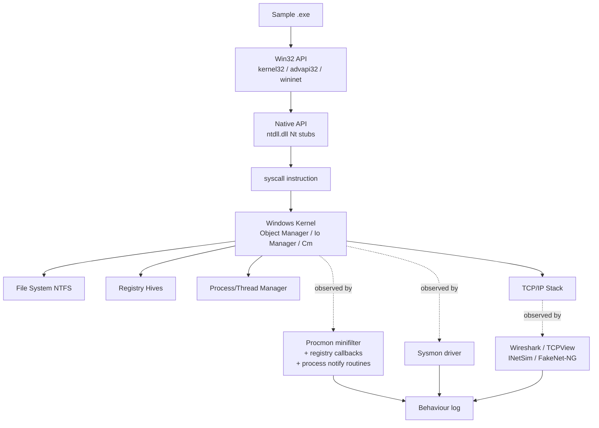
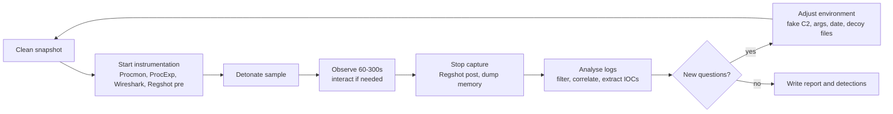
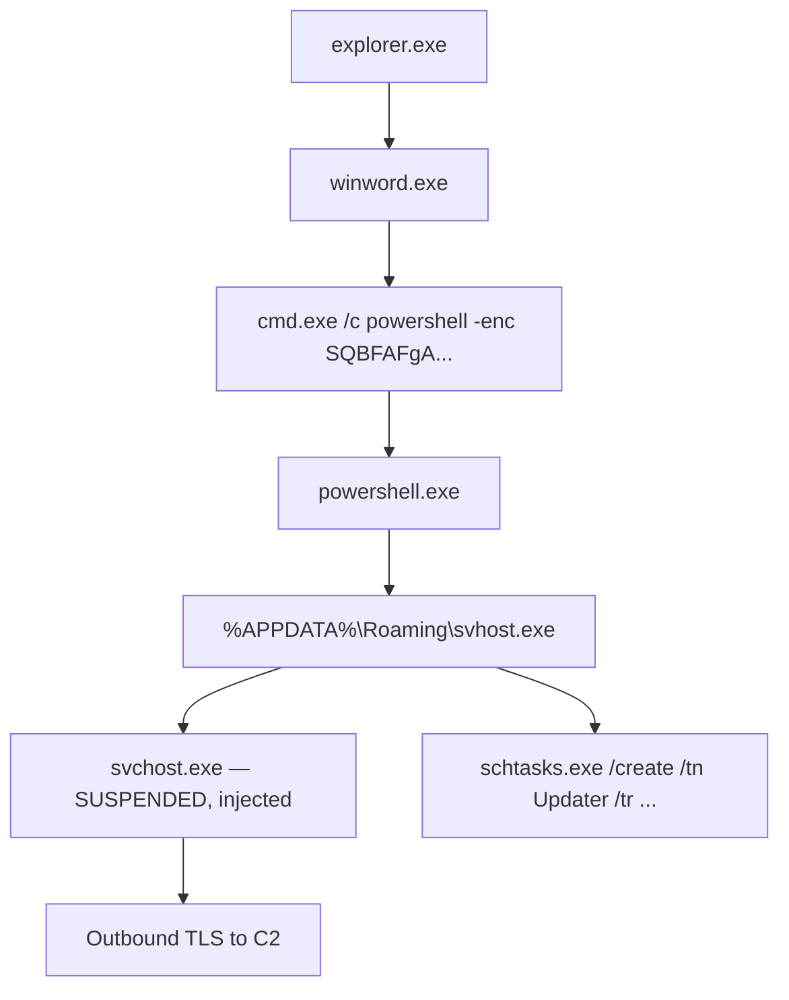
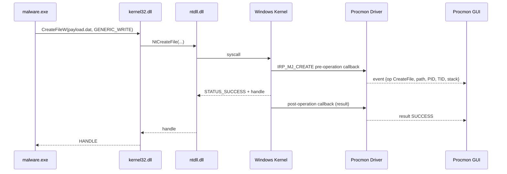
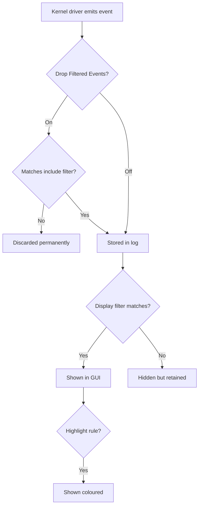
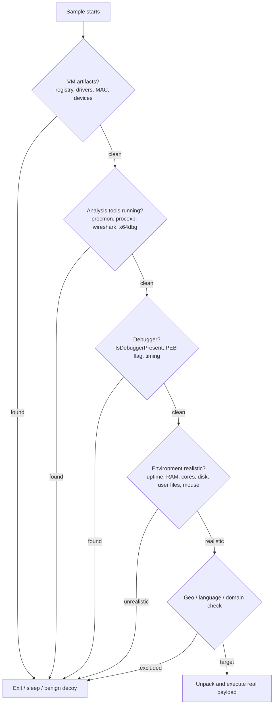

**Level:** Advanced · **Track:** Malware Analysis & RE · **Read time:** 245 min

This is Chapter 3 of the Malware Analysis & Reverse Engineering notebook. Chapter 1 built the isolated lab and the handling discipline; Chapter 2 took a binary apart on disk without ever running it. Here we do the thing static analysis deliberately avoided: we **run the sample**, in a controlled and fully instrumented environment, and record every process it spawns, every file it touches, every registry value it writes, and every packet it tries to send. Dynamic analysis is where inference becomes observation — where "this imports `CreateRemoteThread`, so it *might* inject" becomes "at 14:02:11.338 it opened `explorer.exe` with `PROCESS_VM_WRITE` and started a thread at `0x7FF8A2C10000`."

## Why This Matters

Static analysis tells you what a file *can* do. Dynamic analysis tells you what it *actually did*, in order, with real arguments. That difference matters enormously in practice. A packed loader may present a static import table of four functions and a single high-entropy section — statically almost mute — yet the moment it runs it unpacks a full remote-access trojan into memory, writes a scheduled task, drops a second stage into `%APPDATA%`, and beacons to a C2 domain. None of that is visible on disk. Roughly speaking: the packer is the wall, and execution is the sample tearing that wall down for you, for free.

Dynamic analysis is also how you produce the artefacts other people actually consume. A detection engineer does not want your disassembly; they want the mutex name, the registry Run key, the dropped file path, the parent-child process chain, and the C2 domain. An incident responder needs to know what to sweep for across ten thousand endpoints. A threat intel analyst needs the network indicators. All of that comes out of a well-run detonation.

And it is the fastest route to understanding. Reversing a 4 MB binary in a disassembler can take days. Running it under Process Monitor for ninety seconds can give you 80% of the behavioural picture in ten minutes, and — critically — it tells you *where to look* when you do open the disassembler. Professional workflow is almost always: static triage → dynamic detonation → targeted reversing of the specific functions dynamic analysis flagged as interesting.

The counterweight is risk and deception. You are executing hostile code. If your isolation is wrong, you infect yourself or your network. And malware authors know analysts do this, so a large fraction of modern samples actively look for sandboxes, virtual machines, debuggers, analysis tools by process name, and unrealistic host telemetry — and simply exit, sleep, or run benign decoy behaviour if they find them. A large part of this chapter is about making your environment convincing and your observation complete.

---

## Part 1: What Dynamic Analysis Is — and Where It Fits

Dynamic analysis (also "behavioural analysis" or "detonation") means executing a sample in a controlled environment while instrumentation records its interaction with the operating system. You are not reading its code; you are reading its **effects**.

Everything a Windows program does that matters to an analyst goes through the kernel eventually. Writing a file, creating a registry key, spawning a process, opening a socket, allocating memory in another process — all of it crosses the user/kernel boundary through the Native API (`ntdll.dll`'s `Nt*`/`Zw*` stubs) and the kernel's object manager. That boundary is the perfect observation point, and it is exactly where Process Monitor's driver, Sysmon's driver, and every sandbox's monitor sit.



### The three tiers of dynamic analysis

| Tier | What it is | Typical tools | Strength | Weakness |
|------|-----------|---------------|----------|----------|
| **Automated sandbox** | Push a sample to a system that runs it and generates a report | CAPE, Cuckoo, Joe Sandbox, ANY.RUN, Hybrid Analysis, Triage | Fast, scalable, consistent, produces IOCs and ATT&CK mapping automatically | Easily detected/evaded; fixed run time; no analyst intuition; public uploads leak |
| **Manual instrumented detonation** | You run it yourself in your own VM with Procmon/ProcExp/Wireshark | Sysinternals suite, Wireshark, INetSim, Regshot, Sysmon | Full control, can interact with the malware, can extend the run, can dump memory | Slow, one sample at a time, requires skill and discipline |
| **Debugger-assisted dynamic** | Step the sample under a debugger, break on APIs, dump unpacked code | x64dbg, WinDbg, Frida, Tiny Tracer | Deepest insight; defeats packers; can force branches | Slowest; anti-debug is aggressive; covered in later chapters |

This chapter lives mostly in tiers 1 and 2, with tier 3 reserved for the debugging chapters that follow.

### Behavioural vs. structural evidence

A useful mental split when writing up a sample:

- **Structural evidence** (Chapter 2): hashes, imphash, sections, entropy, compiler, embedded resources, YARA/capa hits. Stable, gathered cheaply, good for clustering and blocking a specific file.
- **Behavioural evidence** (this chapter): parent-child process trees, dropped file paths, registry persistence, mutex names, named pipes, DNS lookups, HTTP beacons, injection targets. Survives recompilation and repacking, and is therefore what durable detection rules are built on.

**Detection relevance:** file hashes rot within hours because attackers recompile constantly. A behavioural rule like *"`winword.exe` spawned `powershell.exe` with an encoded command that then wrote to a Run key"* survives entire malware generations. That is why dynamic analysis output is worth far more to a SOC than a hash list.

### The dynamic analysis loop



The loop is the point. Almost no interesting sample gives up everything on the first run. You detonate, learn that it needs a C2 response to continue, stand up a fake C2 that answers, and detonate again from a clean snapshot. **Reverting to a clean snapshot between every run is non-negotiable** — otherwise run three's behaviour is polluted by run two's persistence, and you will chase phantom findings for hours.

---

## Part 2: Building the Instrumented Detonation VM

Chapter 1 established the isolation model — a hypervisor-hosted Windows VM with no host shares, no clipboard sharing, no bridging to the real LAN, and snapshots at every clean state. This part adds the **instrumentation layer** on top of that, and the realism layer that keeps the sample from noticing it is being watched.

### Baseline VM configuration

| Setting | Recommended | Why |
|---------|-------------|-----|
| Guest OS | Windows 10/11 x64, fully patched *or* deliberately unpatched | Many samples target specific builds; keep one of each |
| CPU cores | **≥ 2** (4 preferred) | Single-core VMs are a classic sandbox tell |
| RAM | **≥ 4 GB** (8 preferred) | Under 4 GB is a common evasion check |
| Disk | **≥ 100 GB** virtual | Small disks are flagged as sandboxes |
| Network | Host-only, pointed at an analysis gateway (INetSim/FakeNet) | Never NAT/bridged to your real network |
| Snapshots | `Clean-Baseline`, `Tools-Installed`, `Armed` | `Armed` = all tools running, ready to detonate |
| Windows Defender | Disabled inside the VM | It will delete your samples mid-run |
| UAC | Disabled or lowest | Removes prompts that stall automation; note you then always analyse the "user accepted elevation" path |
| Guest additions / VMware Tools | Consider **not** installing, or hide them | Their processes and registry keys are the most reliable VM tell |

**Trade-off to be honest about:** guest tools give you clipboard, better display, and easy file transfer. They also give the malware `vmtoolsd.exe`, `VBoxService.exe`, and a pile of registry keys screaming "you are in a VM." Practical compromise: keep two snapshots — a convenient one with tools for benign/low-evasion work, and a stripped, hardened one for evasive samples.

### The instrumentation toolkit

Install these inside the VM and snapshot afterwards:

| Tool | Purpose | Source |
|------|---------|--------|
| **Process Monitor (Procmon)** | Real-time file, registry, process, and network event capture | Sysinternals |
| **Process Explorer (ProcExp)** | Live process tree, handles, DLLs, strings in memory, VirusTotal integration | Sysinternals |
| **Autoruns** | Enumerate every autostart location; diff before/after | Sysinternals |
| **TCPView** | Live socket table with owning process | Sysinternals |
| **Handle** | CLI: which process holds which object (mutexes, files) | Sysinternals |
| **ProcDump** | Dump process memory on demand or on trigger | Sysinternals |
| **Sysmon** | Persistent, filterable telemetry with hashes, command lines, network events | Sysinternals |
| **Regshot** | Full registry + filesystem snapshot diff | github.com/Seabreg/Regshot |
| **Wireshark** | Packet capture and protocol dissection | wireshark.org |
| **FakeNet-NG** | In-guest network simulation and TLS interception | github.com/mandiant/flare-fakenet-ng |
| **PE-sieve / Hollows Hunter** | Scan live processes for injected or hollowed code | github.com/hasherezade |
| **API Monitor** | User-mode API call tracing with arguments | rohitab.com |
| **x64dbg** | Debugger for the follow-up reversing pass | x64dbg.com |

A pragmatic shortcut: install **FLARE-VM** (github.com/mandiant/flare-vm), Mandiant's Chocolatey-based installer that provisions a full Windows malware-analysis workstation with most of the above plus dozens of reversing tools. Run it on a fresh Windows VM, then snapshot. Be aware FLARE-VM's presence is itself detectable (tool names, `C:\Tools`), so harden if you are chasing evasive samples.

### Realism hardening (making the VM look lived-in)

Evasive samples check for a machine that looks like a real user's. Cheap, high-value changes:

```powershell
# Give the box a plausible identity (run as admin, then reboot)
Rename-Computer -NewName "DESKTOP-K7J2QX1" -Force

# Populate user folders so "empty Documents" heuristics fail
$docs = "$env:USERPROFILE\Documents"
1..40 | ForEach-Object {
    "Quarterly notes $_" | Out-File "$docs\notes_$_.txt"
}
Copy-Item C:\Windows\Web\Wallpaper\* "$env:USERPROFILE\Pictures\" -Recurse -ErrorAction SilentlyContinue

# Recent-documents LNKs, so "no recent activity" heuristics fail
$sh = New-Object -ComObject WScript.Shell
1..15 | ForEach-Object {
    $lnk = $sh.CreateShortcut("$env:APPDATA\Microsoft\Windows\Recent\doc$_.lnk")
    $lnk.TargetPath = "$docs\notes_$_.txt"; $lnk.Save()
}
```

Also worth doing: set a non-default wallpaper, install a real application or two (an Office viewer, 7-Zip, Chrome), move the mouse and open windows before detonating (some samples require N mouse movements or a certain uptime), and let the VM run for 20+ minutes before taking the `Armed` snapshot.

**Uptime matters more than people expect.** A trivially common check is `GetTickCount()` — if the machine has been up for under a few minutes, the sample assumes an automated sandbox. Taking the `Armed` snapshot after the VM has been up for half an hour bakes a realistic tick count into every restore.

### Analysis gateway

Put a second VM (Linux, e.g. REMnux) on the same host-only network as the default gateway and DNS server for the Windows VM. It runs INetSim to answer everything, and `tcpdump`/Wireshark to record. This is strictly better than in-guest capture for two reasons: the malware cannot see or kill your capture process, and you get the traffic even if the sample crashes the guest.

```bash
# On the REMnux/analysis gateway (192.168.56.10), capture everything from the victim VM
sudo tcpdump -i eth1 -n -s 0 -w /cases/sample-run1.pcap
#  -i eth1        capture on the host-only interface facing the victim
#  -n             do not resolve names (no accidental DNS leaks from your own tool)
#  -s 0           capture full packets, not a truncated snaplen
#  -w file.pcap   write raw pcap for later Wireshark analysis
```

---

## Part 3: The Sysinternals Suite — What It Is and Why It Dominates

If you have never used Sysinternals, start here; everything later in the chapter assumes fluency.

**What it is.** Sysinternals is a collection of roughly seventy free Windows utilities originally written by Mark Russinovich and Bryce Cogswell (as Winternals/Sysinternals), acquired by Microsoft in 2006 and still maintained by Microsoft. They are small, standalone, mostly single-executable tools that expose Windows internals the built-in tools hide: full process trees with handles and loaded modules, kernel-level file and registry event tracing, every autostart location in the OS, live socket-to-process mapping, and more.

**Why it exists.** Windows historically shipped weak diagnostics — Task Manager showed a flat process list with no parent, no command line, no handles. Sysinternals filled that gap using documented and undocumented APIs plus kernel drivers. For malware analysis they are indispensable because they observe at the same layer malware operates at.

**Why analysts trust it.** The tools are Microsoft-signed, run without installation, and are so ubiquitous that their presence on a machine is unremarkable — which matters both for incident response on production systems and for not tipping off a sample (though see Part 12: many samples specifically hunt for `procmon.exe` and `procexp.exe` by name).

### Getting the suite

```powershell
# Option 1 — download the whole suite as a zip
Invoke-WebRequest -Uri "https://download.sysinternals.com/files/SysinternalsSuite.zip" `
                  -OutFile "C:\Tools\SysinternalsSuite.zip"
Expand-Archive C:\Tools\SysinternalsSuite.zip -DestinationPath C:\Tools\Sysinternals

# Option 2 — the live share (always current, no download management)
#   \\live.sysinternals.com\tools\procmon64.exe
#   Handy on an IR box; note it requires outbound SMB, which is usually blocked.

# Option 3 — Microsoft Store / winget (auto-updating)
winget install --id Microsoft.Sysinternals -e
```

Every tool supports `-accepteula` to suppress the first-run EULA dialog — essential for scripted use:

```powershell
C:\Tools\Sysinternals\procmon64.exe -accepteula -quiet
```

Alternatively, pre-accept for all tools by setting the EULA registry values, which is what you want baked into your `Tools-Installed` snapshot:

```powershell
Get-ChildItem C:\Tools\Sysinternals\*.exe | ForEach-Object {
    $name = $_.BaseName
    New-Item -Path "HKCU:\Software\Sysinternals\$name" -Force | Out-Null
    New-ItemProperty -Path "HKCU:\Software\Sysinternals\$name" `
        -Name EulaAccepted -Value 1 -PropertyType DWord -Force | Out-Null
}
```

### The tools that matter for malware work

| Tool | One-line role in detonation | Runs as |
|------|------------------------------|---------|
| `procmon64.exe` | Kernel-level event log of file, registry, process and network activity | Admin (loads a driver) |
| `procexp64.exe` | Live process tree, handle/DLL view, memory strings, VT lookup | Admin for full detail |
| `autoruns64.exe` | Every ASEP (auto-start extensibility point) on the system | Admin |
| `tcpview64.exe` | Live TCP/UDP endpoints mapped to owning processes | Admin |
| `handle64.exe` | CLI object/handle search — find mutexes, locked files | Admin |
| `procdump64.exe` | Memory dumps on demand or triggered by CPU, exception, or window | Admin |
| `sysmon64.exe` | Persistent, configurable telemetry service and driver | Admin (installs a service) |
| `strings64.exe` | Sysinternals' Unicode-aware strings, useful on dumps | User |
| `sigcheck64.exe` | Verify signatures, check VirusTotal by hash | User |
| `listdlls64.exe` | Enumerate loaded DLLs, flag unsigned modules | Admin |
| `pipelist64.exe` | List named pipes — many C2 frameworks use these | User |

Always use the **64-bit** variants (`*64.exe`) on 64-bit Windows. The 32-bit binaries work via WOW64, but 32-bit Procmon will not see everything a 64-bit process does, and 32-bit Process Explorer cannot read 64-bit process memory for the strings view.

---

## Part 4: Process Explorer from Zero

**What it is.** Process Explorer is Task Manager if Task Manager were written by someone who understood the Windows object manager. It shows processes as a **tree** (parent-child), and for any process exposes its full command line, working directory, loaded DLLs, open handles (files, registry keys, mutexes, events, sections), TCP/IP endpoints, security token and privileges, environment variables, threads with start addresses and stacks, and — critically for malware — the **strings currently in its memory image**.

**Why it matters here.** Two of the most valuable malware questions are answered instantly by ProcExp: *who launched this?* (the tree) and *what is really running inside this process?* (memory strings versus on-disk strings). When a packed loader unpacks itself in memory, the on-disk strings are garbage but the in-memory strings contain the C2 URL, the mutex, and the config. That single trick recovers configs from a large fraction of commodity malware in under a minute.

### First launch and essential setup

Run `procexp64.exe` as Administrator. Then configure it once (and snapshot):

1. **Options → Verify Image Signatures** — turn on. Adds a "Verified Signer" column; unsigned processes in `System32`-looking paths are immediately suspicious.
2. **Options → VirusTotal.com → Check VirusTotal.com** — accept the terms. ProcExp then submits **hashes only** (not files, unless you also enable "Submit Unknown Executables") and shows an `x/70` detection ratio column per process. Extraordinarily fast triage.
3. **View → Select Columns** — add: `Command Line`, `Image Path`, `Parent PID`, `Integrity Level`, `User Name`, `Autostart Location`, `VirusTotal`, `Start Time`.
4. **View → Show Lower Pane** (Ctrl+L) and toggle DLLs (Ctrl+D) / Handles (Ctrl+H).
5. **Options → Replace Task Manager** — optional convenience on an analysis box.
6. **View → Update Speed** — set to 1 second, or Paused when you want to inspect a frozen state.

> **OPSEC note:** enabling "Submit Unknown Executables" uploads the actual binary to VirusTotal, making it visible to VT customers. Never do that during a real incident response engagement with a customer-specific sample — you may leak a targeted implant, alert the attacker, or expose customer data. Hash-only lookup is the safe default.

### Reading the colours

Process Explorer colour-codes rows, and knowing the palette makes triage visual:

| Colour | Meaning | Malware relevance |
|--------|---------|-------------------|
| **Green** | Newly created process (fades after a few seconds) | Watch the tree flash green as a dropper spawns children |
| **Red** | Process exiting | Short-lived droppers and `cmd.exe` one-liners flash red |
| **Light blue** | Running as the same account as Process Explorer | Normal user context |
| **Pink/magenta** | Hosts a Windows service | Malware persisting as a service shows here |
| **Purple/violet** | **Packed or compressed image** (entropy/imports heuristic) | Strong triage signal — legitimate system binaries are never purple |
| **Dark grey** | Suspended process | Classic **process hollowing** intermediate state |
| **Yellow** | .NET / managed process | Points you at dnSpy/ILSpy instead of x64dbg |
| **Brown** | Immersive/packaged (UWP) process | Rare in malware, common in modern Windows noise |

**Purple plus dark grey together in a fresh tree is a near-textbook injection signature:** a packed loader created a legitimate process in a suspended state, and is about to overwrite its memory. If you see `svchost.exe` sitting suspended under a random `%TEMP%` executable, you have caught hollowing in the act — pause ProcExp and dump both processes immediately.

### The process tree — parentage is the story

The tree view (View → Show Process Tree, Ctrl+T) is the single most valuable malware view in Windows. Malware chains are stories told in parentage:



Every arrow there is a detection opportunity, and every node is an IOC. Note ProcExp shows children under parents *only while the parent lives* — if the dropper exits, its children get re-parented and the chain visually breaks. That is exactly why Procmon's Process Tree (which preserves history) and Sysmon Event ID 1 (which records `ParentImage` permanently) matter: **live tools lose ancestry, logs keep it.**

### The lower pane: DLLs and handles

**DLL view (Ctrl+D)** shows every module mapped into the process. Look for:

- DLLs loaded from `%TEMP%`, `%APPDATA%`, `C:\Users\Public`, or any user-writable path — legitimate processes load from `System32`.
- Unsigned DLLs sitting next to a signed executable in a non-standard folder — **DLL sideloading**, the standard way malware gets a Microsoft-signed process to run attacker code.
- A missing "Verified Signer" on a module inside an otherwise Microsoft binary.

**Handle view (Ctrl+H)** shows open kernel objects. For malware, the money is in:

- **Mutants (mutexes)** — malware creates a named mutex so a second copy knows not to run. That name is a superb, cheap host IOC: unique, stable across a campaign, and trivially checkable with `handle64.exe -a <name>`.
- **Sections** mapped from odd files.
- **Files** it is holding open — often the dropped payload or a staged archive of stolen data.
- **Named pipes** — Cobalt Strike SMB beacons and many post-exploitation frameworks use pipes such as `\\.\pipe\msagent_xx` or `\\.\pipe\status_xx`.

Handle search (Ctrl+F) is the reverse lookup: type a filename and ProcExp tells you which process has it open. During a run, if you see a mysterious file in `%TEMP%` you cannot delete, Ctrl+F names the culprit instantly.

### Memory strings — the packer-defeating trick

Right-click a running process → **Properties → Strings tab**, then choose the **Memory** radio button (as opposed to **Image**).

- **Image** = strings from the file on disk (what Chapter 2's `strings` gave you).
- **Memory** = strings from the process's committed memory *right now* — that is, after unpacking, after decryption, after config parsing.

For a UPX- or Themida-packed sample whose disk strings were meaningless, the memory strings frequently contain the full config: C2 domains, user agent, campaign ID, mutex name, install path, RC4 key. Save both to files and diff:

```powershell
# ProcExp: Properties -> Strings -> Memory -> Save...  (e.g. mem_strings.txt)
# Then compare against the on-disk strings from Chapter 2:
Compare-Object (Get-Content .\disk_strings.txt) (Get-Content .\mem_strings.txt) |
    Where-Object SideIndicator -eq '=>' |
    Select-Object -ExpandProperty InputObject |
    Select-String -Pattern 'http|\.com|\.ru|\.xyz|Mutex|pipe\\|CurrentVersion\\Run'
```

**Timing is everything.** Grab memory strings while the sample is alive and *after* it has done its unpacking — typically a few seconds in. If it exits fast, stall it with a debugger breakpoint, or use ProcDump's trigger options (Part 9).

Other high-value ProcExp tabs:

- **TCP/IP** — live connections for that process, with state; catches short-lived beacons.
- **Threads** — start addresses. A thread whose start address is inside a memory region with no backing module name (shown as a bare address, not `module+offset`) means code is executing from private memory — **injected shellcode**.
- **Security** — token groups, integrity level, and privileges; shows whether the sample elevated or has `SeDebugPrivilege` enabled (needed for injecting into other users' processes).
- **Environment** — malware sometimes passes config to children via environment variables.

---

## Part 5: Process Monitor (Procmon) from Zero

**What it is.** Process Monitor is a real-time monitoring tool that captures **file system**, **registry**, **process/thread**, **network**, and **profiling** events, system-wide, with full detail: the operation name, the exact path, the result code, the calling process, the command line, the user, and — with symbols configured — the **call stack** that led to the operation.

**Why it exists.** It is the merger of two older Sysinternals tools, `Filemon` and `Regmon`, plus process and network tracing. It solves "what on earth is this program actually doing to my machine?" — originally an admin and debugging question (why does this app fail to start? which registry key is it missing?), and it happens to be *exactly* the malware analysis question.

**How it works.** On launch Procmon extracts and loads a kernel driver (dropped to `%SystemRoot%\System32\Drivers`). That driver registers:

- a **file system minifilter** with the Filter Manager to see every IRP for file operations,
- **registry callbacks** (`CmRegisterCallbackEx`) to see every registry operation,
- **process and thread creation notify routines** (`PsSetCreateProcessNotifyRoutine`, `PsSetLoadImageNotifyRoutine`),
- and, for network, an ETW consumer for the TCP/IP provider.

Because it operates in the kernel, it sees what the sample does regardless of which user-mode API it used, and it cannot be trivially blinded by user-mode hooking. It is not, however, invisible — the driver, the service, and the window are all discoverable (Part 12).



### Launching and the first shock

Run `procmon64.exe` as Administrator. Capture starts immediately (Ctrl+E toggles), and within two seconds you will have **tens of thousands of events** — Windows itself is enormously chatty. This is the moment most beginners give up. The entire skill of Procmon is **filtering**, covered in Part 6.

Key UI controls, all of which you should learn by keystroke:

| Shortcut | Action | Notes |
|----------|--------|-------|
| `Ctrl+E` | Toggle capture on/off | Capture off before you analyse — the list stops moving |
| `Ctrl+X` | Clear display | Do this immediately before detonating |
| `Ctrl+L` | Filter dialog | The single most-used dialog |
| `Ctrl+F` | Find | Search across visible events |
| `Ctrl+T` | Process Tree | Historical parentage, survives process exit |
| `Ctrl+H` | Highlight dialog | Colour events without hiding others |
| `Ctrl+P` | Process activity summary | Per-process event counts |
| `Ctrl+A` | File Summary | Aggregated file paths touched |
| `Ctrl+S` | Save | Save as PML (native, reloadable), CSV, or XML |

The five toolbar toggles on the right control **event classes**: Registry, File System, Network, Process/Thread, and Profiling Events. Profiling events (periodic thread stack samples) are almost always noise for malware work — turn them off first. Network events in Procmon are ETW-derived and lack payload; use Wireshark for content, Procmon only to attribute a connection to a process and a timestamp.

### The columns that matter

Right-click the column header → Select Columns, or Options → Select Columns. Recommended set for malware analysis:

| Column | Why you need it |
|--------|-----------------|
| **Time of Day** | Correlate with Wireshark and ProcExp observations |
| **Process Name** | Obvious, but note two processes can share a name |
| **PID** | Disambiguates identically named processes |
| **TID** | Lets you follow one thread's behaviour (injection threads stand out) |
| **Operation** | `CreateFile`, `RegSetValue`, `Process Create`, `TCP Connect`, and so on |
| **Path** | The object touched — file path, registry key, or `src:port -> dst:port` |
| **Result** | `SUCCESS`, `NAME NOT FOUND`, `ACCESS DENIED`, `BUFFER OVERFLOW`, ... |
| **Detail** | Operation-specific: desired access, share mode, data written, disposition |
| **Command Line** | Full command line of the acting process — huge for `cmd`/`powershell` chains |
| **User** | Which account; catches SYSTEM-level activity after privilege escalation |
| **Integrity** | Low/Medium/High/System — shows successful UAC bypasses |
| **Parent PID** | Ancestry without opening the tree |
| **Image Path** | Full path of the acting binary; exposes `%TEMP%`-resident processes |

### Understanding `Result` — where beginners misread everything

Procmon logs **attempts**, not just successes. That is a feature.

- `SUCCESS` — the operation worked.
- `NAME NOT FOUND` — the path or key does not exist. Enormously informative: a sample probing `HKLM\SOFTWARE\VMware, Inc.\VMware Tools` and getting `NAME NOT FOUND` is doing **anti-VM checks**. A program failing to start because of a missing DLL shows a trail of `NAME NOT FOUND` along its DLL search path — which is exactly how you find **DLL sideloading / phantom DLL hijack** opportunities.
- `PATH NOT FOUND` — an intermediate directory is missing.
- `ACCESS DENIED` — permissions blocked it. Malware running as a normal user hitting `ACCESS DENIED` on `HKLM\...\Run` then falling back to `HKCU\...\Run` is a classic and very readable sequence.
- `BUFFER OVERFLOW` / `BUFFER TOO SMALL` — normal: the caller queried with a small buffer to learn the required size. Not an exploit. Ignore.
- `NO MORE ENTRIES` / `NO MORE FILES` — end of an enumeration. Marks the end of a directory listing or key enumeration.
- `REPARSE` — symlink/junction traversal, or a redirected path (for example WOW64 registry redirection).
- `FAST IO DISALLOWED` — an optimisation path was declined; the operation retries via IRP. Noise.
- `IS DIRECTORY`, `SHARING VIOLATION`, `FILE LOCKED WITH ONLY READERS` — situational; `SHARING VIOLATION` sometimes reveals two malware components fighting over one file.

**The most under-appreciated analytical move in Procmon is reading the failures.** Successes tell you what happened; failures tell you what the malware *wanted*, including everything its environment refused to give it.

---

## Part 6: Procmon Filtering — the Skill That Makes It Usable

Unfiltered Procmon is unusable; filtered Procmon is a scalpel. Filters come in three flavours, and confusing them causes real mistakes.

### Filter vs. Highlight vs. Drop

- **Include/Exclude filters (Ctrl+L)** change what is *displayed*. By default the underlying events are still captured and stored, so you can loosen a filter afterwards and the events reappear.
- **Highlight (Ctrl+H)** colours matching rows without hiding anything else — perfect when you want context around a rare event.
- **Filter → Drop Filtered Events** *permanently discards* filtered-out events at capture time. It massively reduces memory and backing-file growth on long runs, but **you can never get those events back.** Use it only for long captures, and only with filters you are certain about.



### The filter dialog

Each rule is `Column  Relation  Value  → Include|Exclude`. Relations available: `is`, `is not`, `less than`, `more than`, `begins with`, `ends with`, `contains`, `excludes`.

Rules combine as: **all Excludes are applied**, and if any Include rules exist, an event must match **at least one Include** to be shown. So multiple Includes are OR'd, and Excludes always win.

### The starting filter set for malware detonation

Before detonating, build this — and then **Filter → Save Filter…** as `malware-baseline` so you never rebuild it:

```text
Include:  Process Name    is           sample.exe
Include:  Parent PID      is           <PID of sample.exe>      (after it starts)
Exclude:  Operation       begins with  IRP_MJ_
Exclude:  Operation       is           QueryStandardInformationFile
Exclude:  Operation       is           QueryBasicInformationFile
Exclude:  Operation       is           QueryNameInformationFile
Exclude:  Operation       is           CloseFile
Exclude:  Operation       is           RegCloseKey
Exclude:  Operation       is           RegQueryKey
Exclude:  Result          is           BUFFER OVERFLOW
Exclude:  Path            ends with    pagefile.sys
Exclude:  Process Name    is           Procmon64.exe
Exclude:  Process Name    is           System
```

Procmon also ships default exclusions for its own processes and the page file; keep them.

**Important caveat on `Process Name is sample.exe`:** the moment the sample spawns `cmd.exe`, `powershell.exe`, `schtasks.exe`, or injects into `explorer.exe`, that filter hides the most interesting behaviour. Two better strategies:

1. **Filter by process tree**: open the Process Tree (Ctrl+T), right-click your sample's node → **Add process and children to Include filter**. This captures descendants automatically.
2. **Filter by what, not who**: drop the process filter entirely and filter on high-signal operations instead. This catches injected-code activity performed under a legitimate process name.

### High-signal operation filters

```text
# Persistence and configuration writes
Include:  Operation  is  RegSetValue
Include:  Operation  is  RegCreateKey

# File drops (writes only, not reads)
Include:  Operation  is  WriteFile
Include:  Operation  is  SetRenameInformationFile
Include:  Operation  is  SetDispositionInformationFile     # deletion

# Execution
Include:  Operation  is  Process Create
Include:  Operation  is  Process Start
Include:  Operation  is  Load Image

# Network attribution
Include:  Operation  begins with  TCP
Include:  Operation  begins with  UDP
```

That six-line "what" filter, with no process restriction at all, reduces a 400,000-event capture to a few hundred rows that read like a narrative. It is the single most useful configuration in this chapter.

### Path-based filters for common malware locations

```text
Include:  Path  contains  \AppData\Roaming\
Include:  Path  contains  \AppData\Local\Temp\
Include:  Path  contains  \Users\Public\
Include:  Path  contains  \ProgramData\
Include:  Path  contains  CurrentVersion\Run
Include:  Path  contains  CurrentVersion\RunOnce
Include:  Path  contains  \Windows\Tasks\
Include:  Path  contains  \System32\Tasks\
Include:  Path  contains  Winlogon
Include:  Path  contains  \Startup\
```

### Right-click filtering (the fast way)

You rarely build filters by hand mid-analysis. Instead: right-click any cell → **Include `'<value>'`** or **Exclude `'<value>'`**. Right-clicking a noisy `CloseFile` operation and choosing Exclude removes tens of thousands of rows in one keystroke. Iterating this — exclude, look, exclude, look — is how experienced analysts converge on signal in about ninety seconds.

Use **Highlight** for the events you want to *see in context* — for example highlight `RegSetValue` in orange while browsing the full file activity, so you can see exactly which file write preceded the persistence write. Procmon's `Ctrl+F` search also covers the Detail column, which is where written data appears.

---

## Part 7: Reading the Four Event Classes as Behaviour

Filters get you rows. Now you have to read them. Each event class maps to a set of malware behaviours with recognisable shapes.

### 7.1 Process and thread events

| Operation | Meaning | Malware signal |
|-----------|---------|----------------|
| `Process Create` | This process created another | The whole execution chain; check Detail for the child PID and command line |
| `Process Start` | This process began executing | Start of a new tree node |
| `Process Exit` | Terminated, with exit code in Detail | A dropper exiting seconds after dropping is normal; exit code 0 versus a crash matters |
| `Thread Create` | New thread, with start address in Detail | A thread whose start address is in unbacked memory implies injected code |
| `Load Image` | A DLL or EXE was mapped | Sideloading, unusual modules, and .NET runtime loads all appear here |

Reading a chain, the shape you are looking for is: an office app or script host creating a shell, the shell creating a payload in a user-writable path, the payload creating persistence tooling (`schtasks.exe`, `reg.exe`, `sc.exe`, `wmic.exe`) and then a long-lived network process.

**Living-off-the-land binaries (LOLBins)** deserve special attention in the `Process Create` rows. Seeing any of these spawned by a non-administrative parent is high signal: `mshta.exe`, `rundll32.exe`, `regsvr32.exe`, `certutil.exe`, `bitsadmin.exe`, `wmic.exe`, `msiexec.exe`, `installutil.exe`, `cscript.exe`/`wscript.exe`, `curl.exe`. Procmon's Command Line column is what turns "rundll32 ran" into "rundll32 ran `javascript:...` to fetch a payload."

### 7.2 Registry events

| Operation | Meaning | Where it matters |
|-----------|---------|------------------|
| `RegOpenKey` / `RegQueryValue` | Reading configuration | Anti-VM checks, environment fingerprinting, stealing application credentials |
| `RegCreateKey` | Creating a key | Persistence, config storage |
| `RegSetValue` | Writing data (value shown in Detail) | **Persistence and config — the highest-value registry event by far** |
| `RegDeleteKey` / `RegDeleteValue` | Removing | Defence evasion (disabling Defender, UAC, SmartScreen) |
| `RegEnumKey` / `RegEnumValue` | Enumerating | Discovery — installed software, users, network profiles |

Persistence keys worth memorising:

| Registry location | Effect | ATT&CK |
|-------------------|--------|--------|
| `HKCU\Software\Microsoft\Windows\CurrentVersion\Run` | Runs at user logon, no admin needed | T1547.001 |
| `HKLM\SOFTWARE\Microsoft\Windows\CurrentVersion\Run` | Runs at any logon, needs admin | T1547.001 |
| `...\CurrentVersion\RunOnce` | Runs once then removes itself | T1547.001 |
| `HKLM\SOFTWARE\Microsoft\Windows NT\CurrentVersion\Winlogon\Shell` / `Userinit` | Appended commands run at logon | T1547.004 |
| `HKLM\SYSTEM\CurrentControlSet\Services\<name>` | Service (auto-start, SYSTEM) | T1543.003 |
| `...\Image File Execution Options\<exe>\Debugger` | Hijacks the launch of a target exe | T1546.012 |
| `HKCU\Environment\UserInitMprLogonScript` | Logon script, user-level, no admin | T1037.001 |
| `...\CurrentVersion\Explorer\Shell Folders\Startup` | Redirects the Startup folder | T1547.001 |
| `HKLM\SOFTWARE\Microsoft\Windows NT\CurrentVersion\Windows\AppInit_DLLs` | DLL injected into every GUI process | T1546.010 |
| `HKCU\Software\Classes\<ext>\shell\open\command` | File-association hijack | T1546.001 |
| `HKLM\SOFTWARE\Microsoft\Windows\CurrentVersion\Explorer\Browser Helper Objects` | Loads into browsers | T1176 |
| `HKCU\Software\Classes\CLSID\{...}\InprocServer32` | COM hijack, user-level | T1546.015 |
| `HKLM\SOFTWARE\Policies\Microsoft\Windows Defender\DisableAntiSpyware` | Neuters Defender | T1562.001 |

**Bug bounty and CTF crossover:** the IFEO `Debugger` key and the file-association `shell\open\command` key are staples of Windows privilege-escalation boxes on HackTheBox and TryHackMe — recognising the Procmon signature of them being written is the same skill as recognising the escalation opportunity when you find one writable.

### 7.3 File system events

| Operation | Meaning | Malware signal |
|-----------|---------|----------------|
| `CreateFile` | Opens *or* creates (Detail shows Desired Access and Disposition) | Read `Disposition: Create/OverwriteIf` for actual creation versus `Open` for reads |
| `WriteFile` | Writes bytes (Detail has offset and length) | Payload drops, staged exfil archives, encrypted victim files |
| `ReadFile` | Reads bytes | Credential theft (browser databases), document collection, self-read for unpacking |
| `SetRenameInformationFile` | Rename or move | Ransomware appending extensions; droppers moving payloads into place |
| `SetDispositionInformationFile` | Marks for delete | Self-deletion, log cleanup, shadow-copy tampering |
| `QueryDirectory` | Directory enumeration | File discovery — ransomware sweeping the disk, stealers hunting wallets |
| `CreateFileMapping` / `Load Image` | Mapping a file into memory | Loading a dropped DLL |

Recognisable shapes:

- **Ransomware**: a high-rate cycle of `QueryDirectory` → `CreateFile (read)` → `ReadFile` → `WriteFile` → `SetRenameInformationFile` (adds an extension) → `SetDispositionInformationFile` on the original, repeating across the disk, plus a `WriteFile` of the same ransom-note filename in every directory.
- **Infostealer**: targeted `ReadFile` on `...\Google\Chrome\User Data\Default\Login Data`, `...\Local State`, `...\Mozilla\Firefox\Profiles\*\logins.json`, `%APPDATA%\Exodus\exodus.wallet\`, `...\Telegram Desktop\tdata\` — then a `WriteFile` of a staging archive in `%TEMP%`, then network activity, then a delete.
- **Dropper**: `WriteFile` to `%APPDATA%\<random>\<name>.exe`, a `SetBasicInformationFile` setting hidden attributes, then `Process Create` on that path.
- **Self-deletion**: `Process Create` of `cmd.exe /c timeout 3 & del "C:\...\sample.exe"` — a well-known idiom worth recognising instantly.

### 7.4 Network events

Procmon's network rows (`TCP Connect`, `TCP Send`, `TCP Receive`, `UDP Send`, `UDP Receive`) give you **process attribution and timing**, plus the endpoints — but no payload. Use them to answer "which process talked to what, when," then pivot to your Wireshark capture for content. Note that hostnames appear if Procmon can resolve them; in a lab where DNS is faked you generally want raw IPs, so leave name resolution off.

A useful correlation habit: note the exact `TCP Connect` timestamp in Procmon, then in Wireshark apply a display filter around that time to find the matching stream:

```text
tcp.flags.syn == 1 && tcp.flags.ack == 0
  && frame.time >= "Mar 24, 2027 14:02:10" && frame.time <= "Mar 24, 2027 14:02:20"
```

---

## Part 8: Advanced Procmon — Trees, Stacks, Boot Logging, and Automation

### Process Tree (Ctrl+T)

Unlike Process Explorer, Procmon's tree is **historical** — it includes processes that have already exited (shown greyed), preserving the full ancestry of a dropper chain even after the dropper self-deletes. For each node it shows the image path, command line, user, start time, end time, and exit code.

Two indispensable buttons in that dialog:

- **"Include Process and Children"** — instantly scopes your filter to a subtree.
- **"Go To Event"** — jumps the main window to that process's first event.

Save the tree (there is a Save button) as part of every case file; it is the cleanest single artefact for a report.

### Call stacks — from behaviour to code location

Select any event → **Properties → Stack tab** (or Ctrl+K). Procmon shows the full call stack, kernel frames and user frames, that produced the operation. With symbols configured you get function names.

Configure symbols once (Options → Configure Symbols):

```text
Symbol path:  srv*C:\Symbols*https://msdl.microsoft.com/download/symbols
Dbghelp.dll:  C:\Program Files\Windows Kits\10\Debuggers\x64\dbghelp.dll
```

Install the Windows SDK's *Debugging Tools for Windows* to get a modern `dbghelp.dll`; the one in `System32` is old and resolves poorly.

Why this matters enormously: the stack tells you **which module and offset** in the malware initiated the operation. If `RegSetValue` on the Run key came from `sample.exe + 0x3A21`, you now have a precise address to jump to in x64dbg or IDA — turning a behavioural observation directly into a reversing target. If the top user frame is in unbacked memory (no module name), you have proof the call came from injected shellcode rather than the on-disk image.

**Symbol OPSEC:** the Microsoft symbol server is an internet fetch. On an isolated analysis VM, either pre-populate `C:\Symbols` from a connected machine, or accept that stacks show raw addresses. Never open your analysis VM to the internet just for symbols.

### Backing files and long captures

By default Procmon buffers events in **virtual memory**, and a busy machine can exhaust it in minutes. For any run longer than a few minutes:

**File → Backing Files… → Use file named:** point it at a local path such as `C:\Cases\run1.pml`. Events then stream to disk instead of RAM.

Combine with **Filter → Drop Filtered Events** for multi-hour or overnight runs. A dormant sample that only activates after two hours is common; you want to still be capturing when it wakes.

### Boot logging — catching persistence at startup

**Options → Enable Boot Logging.** Procmon configures its driver to load at boot and log everything from very early in startup. Reboot, log in, then run Procmon again and it offers to save the boot log as a PML.

This is the only reliable way to see what a rootkit or early-persistence mechanism does before your interactive session exists — driver loads, service starts, and the exact order in which the malware's persistence fires. Leave "Generate profiling events" off to keep the log manageable.

### Comparing runs

Save a baseline PML of the clean machine doing nothing, and a run PML with the sample. Procmon has no built-in diff, but converting to CSV makes it trivial:

```powershell
# Export both captures to CSV from the GUI (File > Save > CSV), then:
$base = Import-Csv .\baseline.csv | Select-Object -ExpandProperty Path -Unique
$run  = Import-Csv .\run1.csv

$run | Where-Object { $_.Operation -in @('RegSetValue','WriteFile','Process Create') } |
      Where-Object { $_.Path -notin $base } |
      Select-Object 'Time of Day','Process Name',Operation,Path,Detail |
      Export-Csv .\delta.csv -NoTypeInformation
```

For registry and file *state* diffing rather than *event* diffing, use **Regshot**: take a "1st shot" on the clean snapshot, detonate, take the "2nd shot," and click Compare. Regshot produces a plain-text list of added, modified and deleted keys, values and files. It misses transient artefacts (a file created and deleted during the run) — which is exactly the gap Procmon fills. Use both; they are complementary, not redundant.

### Command-line automation

Procmon is fully scriptable, which is how you build a mini-sandbox:

| Switch | Effect |
|--------|--------|
| `/AcceptEula` | Suppress the EULA dialog |
| `/Quiet` | No confirmation prompts |
| `/Minimized` | Start minimised |
| `/BackingFile <path.pml>` | Stream events to this file |
| `/LoadConfig <cfg.pmc>` | Load a saved filter and column configuration |
| `/Terminate` | Stop the *running* Procmon instance and flush its log |
| `/SaveAs <path>` | Convert a PML to CSV or XML (with `/OpenLog`) |
| `/OpenLog <path.pml>` | Open an existing log |
| `/Runtime <seconds>` | Capture for N seconds then stop |
| `/NoFilter` | Ignore any saved filter |
| `/NoConnect` | Start without capturing (arm it, start later) |

A complete scripted detonation:

```powershell
$PM   = "C:\Tools\Sysinternals\Procmon64.exe"
$case = "C:\Cases\run1"
New-Item -ItemType Directory -Force -Path $case | Out-Null

# 1. Start capture with a pre-saved filter config, streaming to disk
Start-Process $PM -ArgumentList @(
    "/AcceptEula","/Quiet","/Minimized",
    "/LoadConfig","C:\Tools\malware-baseline.pmc",
    "/BackingFile","$case\capture.pml"
)
Start-Sleep -Seconds 5     # let the driver settle

# 2. Detonate
$p = Start-Process "C:\Samples\sample.exe" -PassThru
Write-Host "Sample PID: $($p.Id)"

# 3. Observe
Start-Sleep -Seconds 120

# 4. Stop capture cleanly (this flushes the backing file)
Start-Process $PM -ArgumentList "/Terminate" -Wait

# 5. Convert to CSV for grepping and scripted IOC extraction
Start-Process $PM -ArgumentList @(
    "/OpenLog","$case\capture.pml","/SaveAs","$case\capture.csv"
) -Wait
```

Then extract indicators mechanically:

```powershell
$ev = Import-Csv "$case\capture.csv"

"=== Persistence writes ==="
$ev | Where-Object { $_.Operation -eq 'RegSetValue' -and
                     $_.Path -match 'Run|Winlogon|Services\\|Image File Execution' } |
      Select-Object 'Process Name',Path,Detail | Format-Table -Wrap

"=== Executables written to disk ==="
$ev | Where-Object { $_.Operation -eq 'WriteFile' -and
                     $_.Path -match '\.(exe|dll|scr|ps1|vbs|bat|js)$' } |
      Select-Object -ExpandProperty Path -Unique

"=== Process chain ==="
$ev | Where-Object Operation -eq 'Process Create' |
      Select-Object 'Time of Day','Process Name',Path,Detail | Format-Table -Wrap

"=== Network endpoints ==="
$ev | Where-Object { $_.Operation -like 'TCP*' -or $_.Operation -like 'UDP*' } |
      Select-Object -ExpandProperty Path -Unique
```

---

## Part 9: The Supporting Sysinternals Cast

### Autoruns — persistence, exhaustively

**What it is.** Autoruns enumerates essentially every auto-start extensibility point (ASEP) Windows has — far beyond the Run keys: services, drivers, scheduled tasks, WMI event subscriptions, Winlogon hooks, LSA providers, print monitors, codecs, AppInit DLLs, Office add-ins, Explorer shell extensions, browser helper objects, boot execute entries, and more. Roughly two hundred locations across about twenty tabs.

**Workflow for malware:**

1. On the clean snapshot, run `autoruns64.exe` as admin, then **File → Save** as `clean.arn`.
2. Detonate, wait, then **File → Compare…** against `clean.arn`. Autoruns highlights only what changed. This is the fastest complete persistence answer available.
3. Enable **Options → Scan Options → Verify code signatures** and **Check VirusTotal.com**, plus **Hide Microsoft entries** to cut noise.

The command-line version is scriptable and ideal for automation:

```powershell
# -a *  all entry types | -c CSV | -h show hashes | -s verify signatures | -nobanner clean output
autorunsc64.exe -accepteula -a * -c -h -s -nobanner > C:\Cases\autoruns_after.csv
```

Diff two runs:

```powershell
$before = Import-Csv C:\Cases\autoruns_before.csv
$after  = Import-Csv C:\Cases\autoruns_after.csv
Compare-Object $before $after -Property 'Entry Location','Entry','Image Path' |
    Where-Object SideIndicator -eq '=>' | Format-Table -AutoSize
```

**IR use case:** `autorunsc64.exe -a * -c -h -s -nobanner` piped into your SIEM across a fleet is a genuinely effective enterprise-wide persistence hunt — stack the results by rare hash and path, and outliers surface fast.

### TCPView — sockets to processes, live

**What it is.** A live table of every TCP and UDP endpoint with the owning process, local and remote addresses and ports, state, and in recent versions per-connection byte counts.

For malware: sort by state, watch for `SYN_SENT` to external IPs (a beacon whose C2 is down), and note the owning process — if `notepad.exe` has an outbound connection, you are looking at injected code. Right-click offers Whois (careful: that is a real internet lookup, so not from the isolated VM) and End Process.

CLI equivalents when you cannot use the GUI:

```powershell
netstat -anob        # -a all, -n numeric, -o owning PID, -b owning binary (needs admin)
Get-NetTCPConnection -State Established |
    Select-Object LocalAddress,LocalPort,RemoteAddress,RemotePort,
                  @{n='Proc';e={(Get-Process -Id $_.OwningProcess).ProcessName}}
```

### Handle — finding mutexes and locked files

```powershell
# All handles for a process
handle64.exe -accepteula -p sample.exe

# Which process has this file open?
handle64.exe -accepteula "C:\Users\analyst\AppData\Roaming\payload.dat"

# Search all handles matching a name fragment (mutex hunting)
handle64.exe -accepteula -a Global\ | findstr /i mutant

# Just mutants across the whole system
handle64.exe -accepteula -a -t Mutant
```

Extracting the mutex name is high value: it is a stable host IOC, it lets you build a **vaccine** (create the mutex yourself so the malware believes an instance is already running and exits), and it is often unique enough to name the family.

### ProcDump — memory dumps on demand and on trigger

**What it is.** A CLI tool that writes process memory dumps, with a rich set of triggers.

```powershell
# Immediate full dump of a running sample
procdump64.exe -accepteula -ma 4312 C:\Cases\sample_full.dmp
#   -ma  full dump (all memory) — what you want for malware; the default is a minidump

# Dump when the process is about to exit (catches short-lived droppers)
procdump64.exe -accepteula -ma -t sample.exe C:\Cases\onexit.dmp

# Dump on first-chance exception (packers often throw during unpacking)
procdump64.exe -accepteula -ma -e 1 -f "" sample.exe C:\Cases\exc.dmp

# Dump when CPU exceeds 20% for 3 seconds (catch the unpacking burst)
procdump64.exe -accepteula -ma -c 20 -s 3 sample.exe C:\Cases\cpu.dmp

# Dump three times, 10s apart, to watch memory evolve
procdump64.exe -accepteula -ma -n 3 -s 10 sample.exe C:\Cases\series.dmp
```

Then mine the dump with the Chapter 2 toolkit:

```bash
# On the analysis Linux box, after transferring the dump out of the VM
strings -n 8 -el sample_full.dmp | grep -Ei 'https?://|\.onion|[A-Za-z0-9.-]+\.(com|net|ru|xyz|top)' | sort -u
yara -s rules/family_rules.yar sample_full.dmp
```

For extracting *unpacked PE images* specifically, prefer **PE-sieve** and **Hollows Hunter**, which understand what an injected or hollowed module looks like:

```powershell
# Scan one process for implanted code and dump anything suspicious
pe-sieve64.exe /pid 4312 /imp 3 /dmode 3
#   /imp 3    aggressively rebuild the import table of dumped modules
#   /dmode 3  dump in virtual (unmapped) mode, best for injected images

# Scan every process on the box, including raw shellcode regions
hollows_hunter64.exe /imp 3 /shellc
```

### Sysmon — telemetry that outlives the run

**What it is.** System Monitor is a Windows *service plus driver* that logs richly detailed security events to the Windows Event Log (`Microsoft-Windows-Sysmon/Operational`). Unlike Procmon it is designed to run permanently, is heavily configurable via XML, and its events include hashes, command lines, parent process, and network destinations.

Install with a good community config (SwiftOnSecurity's, or Olaf Hartong's `sysmon-modular`):

```powershell
sysmon64.exe -accepteula -i C:\Tools\sysmonconfig-export.xml   # install with config
sysmon64.exe -c C:\Tools\sysmonconfig-export.xml               # update config later
sysmon64.exe -u force                                          # uninstall
```

The event IDs that matter most for dynamic analysis:

| ID | Event | Why it matters |
|----|-------|----------------|
| 1 | Process creation | Command line, hashes, **ParentImage** — permanent ancestry |
| 3 | Network connection | Process-attributed connections with destination and port |
| 5 | Process terminated | Bounds the process lifetime |
| 7 | Image loaded | DLL sideloading, unsigned modules |
| 8 | **CreateRemoteThread** | Classic process injection |
| 10 | **ProcessAccess** | `OpenProcess` with suspicious rights — LSASS dumping, injection prep |
| 11 | File created | Drops, with the full path |
| 12/13/14 | Registry create / set / rename | Persistence, with the value data in 13 |
| 15 | FileCreateStreamHash | Alternate data streams, Mark-of-the-Web |
| 17/18 | Named pipe created / connected | C2 frameworks, lateral movement |
| 22 | **DNS query** | Domain IOCs even when the connection fails |
| 23/26 | File delete (with archiving) | Self-deletion — and Sysmon can keep a copy |
| 25 | Process tampering | Process hollowing and herpaderping detection |

Query it after a run:

```powershell
# All process creations in the last 10 minutes, with command lines
Get-WinEvent -LogName 'Microsoft-Windows-Sysmon/Operational' |
  Where-Object { $_.Id -eq 1 -and $_.TimeCreated -gt (Get-Date).AddMinutes(-10) } |
  ForEach-Object {
      $x = [xml]$_.ToXml()
      [pscustomobject]@{
        Time   = $_.TimeCreated
        Parent = ($x.Event.EventData.Data | Where-Object Name -eq 'ParentImage').'#text'
        Image  = ($x.Event.EventData.Data | Where-Object Name -eq 'Image').'#text'
        Cmd    = ($x.Event.EventData.Data | Where-Object Name -eq 'CommandLine').'#text'
        Hash   = ($x.Event.EventData.Data | Where-Object Name -eq 'Hashes').'#text'
      }
  } | Format-Table -Wrap

# Every DNS query the sample made (Event ID 22)
Get-WinEvent -FilterHashtable @{LogName='Microsoft-Windows-Sysmon/Operational'; Id=22} -MaxEvents 200 |
  ForEach-Object { ([xml]$_.ToXml()).Event.EventData.Data |
      Where-Object Name -in 'Image','QueryName' } | Format-Table
```

**Why run both Procmon and Sysmon?** Procmon is exhaustive but ephemeral and analyst-driven; Sysmon is selective, permanent, and *identical to what a real SOC collects*. Running Sysmon during your detonation means the artefacts you produce are directly expressible as detection rules for production — you literally hand the SOC the Event ID 1, 11 and 13 combination you observed.

---

## Part 10: Network Behaviour — Simulation, Capture, Interception

Most malware is useless without a network. If your VM has no internet (correct) and nothing answers (incorrect), the sample will fail DNS, give up, and you will learn almost nothing. The fix is **simulation**: answer everything, plausibly.

```mermaid
sequenceDiagram
    participant M as malware.exe (Windows VM)
    participant DNS as INetSim DNS (gateway)
    participant HTTP as INetSim HTTP/HTTPS
    participant CAP as tcpdump / Wireshark
    M->>DNS: A? cdn-update-svc.xyz
    DNS-->>M: 192.168.56.10 (wildcard answer)
    Note over CAP: DNS query logged - domain IOC captured
    M->>HTTP: POST /gate.php (UA Mozilla/5.0; body base64 host survey)
    Note over CAP: full request body captured - protocol and fields learned
    HTTP-->>M: 200 OK (generic response)
    M->>HTTP: GET /update/stage2.bin
    HTTP-->>M: 200 OK (INetSim dummy binary)
    Note over M: parse fails, retry loop or exit
    Note over CAP: second-stage URL captured even without the real payload
```

### INetSim (on the gateway VM)

**What it is.** INetSim is a Linux daemon that simulates a wide range of internet services — DNS (answering every query with a configured IP), HTTP and HTTPS (serving a dummy page or file for any URL), SMTP, FTP, IRC, TFTP, NTP, POP3 and more — and logs everything.

```bash
sudo apt update && sudo apt install -y inetsim     # (preinstalled on REMnux)
sudo nano /etc/inetsim/inetsim.conf
```

Key configuration lines:

```conf
# Bind to the host-only interface facing the victim VM
service_bind_address    192.168.56.10

# Answer every DNS query with our own address
dns_default_ip          192.168.56.10

# Optional: give specific domains specific answers
dns_static              cdn-update-svc.xyz  192.168.56.10

# Enable only what you need (fewer services means clearer logs)
start_service dns
start_service http
start_service https
start_service smtp
start_service ftp

# Serve a real-looking binary when the sample asks for an .exe
http_default_fakefile   exe  sample_gui.exe  application/x-msdownload
```

```bash
sudo inetsim --data /var/lib/inetsim --log-dir /var/log/inetsim
# Reports land in /var/log/inetsim/report/ ; live service logs in service.log
tail -f /var/log/inetsim/service.log
```

Then point the Windows VM's DNS and default gateway at the simulator:

```powershell
Set-DnsClientServerAddress -InterfaceAlias "Ethernet" -ServerAddresses 192.168.56.10
Set-NetIPInterface -InterfaceAlias "Ethernet" -Dhcp Disabled
New-NetIPAddress -InterfaceAlias "Ethernet" -IPAddress 192.168.56.20 `
                 -PrefixLength 24 -DefaultGateway 192.168.56.10
```

### FakeNet-NG (in the guest)

**What it is.** Mandiant's FLARE team's in-guest network simulator. It redirects *all* traffic — regardless of destination IP or port — to local listeners that speak the right protocol, and logs full request and response bodies. Its major advantage over INetSim is **TLS interception**: it presents its own certificate, so you read decrypted HTTPS content rather than an opaque TLS stream. Its disadvantage is that it runs inside the VM, where the malware can see and kill it.

```powershell
# Run as admin inside the analysis VM
python -m fakenet    # or the packaged fakenet64.exe
# Config: fakenet.cfg -> set DumpPackets: Yes and RedirectAllTraffic: Yes
# Captures land as .pcap next to the binary; full HTTP bodies go to the console and logs
```

Practical rule: **use INetSim on the gateway as the default** (invisible to the sample, safer), and switch to FakeNet-NG when you specifically need to read HTTPS payloads and are confident the sample is not screening for it.

### Wireshark — reading the result

Display filters worth having in muscle memory:

```text
dns                                       # every lookup — pure IOC gold
dns.flags.response == 0                   # queries only
http.request                              # all HTTP requests
http.request.method == "POST"             # exfil and check-in
http.user_agent                           # malware UAs are often unique and fingerprintable
tls.handshake.type == 1                   # Client Hello — the input to JA3 fingerprinting
tls.handshake.extensions_server_name      # SNI — the domain even under TLS
tcp.flags.syn == 1 && tcp.flags.ack == 0  # connection attempts, including failed ones
frame contains "MZ"                       # a PE being downloaded in the clear
ip.addr == 192.168.56.20 && !(dns || arp)
```

Then extract objects: **File → Export Objects → HTTP…** dumps every transferred file, which is how you recover a second stage delivered over plain HTTP.

**Fingerprints to record for threat intel:** the exact User-Agent string (malware authors reuse odd or malformed ones), the URI structure (`/gate.php`, `/api/v2/checkin`, base64 in the path), the POST body encoding, the beacon interval and jitter, and the **JA3/JA3S** TLS fingerprint. Those survive infrastructure changes far better than an IP address.

**Blue team usage:** every one of those becomes a network detection. A JA3 hash plus a URI pattern is a Suricata rule you can deploy the same afternoon; the domain goes to your DNS sinkhole and the IP to the firewall.

### Beacon timing

Plot connection timestamps to recover the beacon interval and jitter — a signature in itself:

```bash
tshark -r run1.pcap -Y "tcp.flags.syn==1 && tcp.flags.ack==0 && ip.dst==192.168.56.10" \
       -T fields -e frame.time_epoch |
  awk 'NR>1 {printf "%.1f\n", $1-prev} {prev=$1}' | sort -n | uniq -c
#   Output like "  18  60.0" and "  3  59.4" means a 60s beacon with small jitter
```

---

## Part 11: Automated Sandboxes

Manual detonation does not scale. Automated sandboxes run the sample on instrumented VMs and produce a structured report in minutes.

| Sandbox | Type | Strengths | Cautions |
|---------|------|-----------|----------|
| **CAPE** (github.com/kevoreilly/CAPEv2) | Self-hosted, open source | Cuckoo successor; excellent automated **config extraction** and unpacked-payload dumping; full control; nothing leaves your network | Non-trivial to deploy and maintain |
| **Cuckoo Sandbox** | Self-hosted, open source | The original; a huge body of community knowledge | Largely superseded by CAPE; v2 unmaintained |
| **ANY.RUN** | Cloud, interactive | You can *click* inside the running VM — essential for samples needing user interaction (password-protected documents, installers) | The free tier is public: your sample and report are visible to everyone |
| **Joe Sandbox** | Cloud and on-prem | Deepest analysis and best evasion resistance; excellent behaviour graphs | Expensive; the free tier is public |
| **Hybrid Analysis** (CrowdStrike Falcon Sandbox) | Cloud | Good free tier, strong static plus dynamic blend | Public submissions |
| **Triage / tria.ge** | Cloud | Fast, great config extraction, generous free tier, clean UI | Public unless licensed |
| **Intezer** | Cloud | Code-reuse and genetic analysis — attributes to families by shared code | Different focus from behaviour |
| **VMRay** | Commercial, hypervisor-based | Monitors from *outside* the guest with no in-guest agent — very hard to detect | Cost |

> **The single most important OPSEC rule in this chapter:** uploading a sample to a public sandbox makes it **public**. In a targeted-intrusion investigation, the attacker may be watching VirusTotal and public sandbox feeds for their own hashes; an upload tells them they are caught and triggers infrastructure burn or destructive action. Worse, samples in targeted attacks frequently embed victim-specific data (internal hostnames, usernames, embedded documents, licence keys). During real IR: use an on-premise sandbox (CAPE, VMRay, Joe on-prem) or a private-submission tier, never the free public one.

### Reading a sandbox report critically

A report is evidence, not truth. Work through it in this order:

1. **Did it actually run?** Look for the process tree. A report showing only the initial process, exiting after three seconds with no children, means the sample detected the sandbox, was missing a dependency, or needed an argument. A "score 0/10, no malicious behaviour" verdict on a sample your static analysis flagged usually means **evasion**, not innocence.
2. **Process tree and command lines** — the narrative.
3. **Dropped files** — download them; each one is a new sample to triage from the start of Chapter 2's funnel.
4. **Registry and persistence** section.
5. **Network** — DNS, HTTP, TLS SNI. Note that if the sandbox had real internet and the C2 was down, this will be empty even for a live sample.
6. **Extracted config** (CAPE and Triage are excellent here) — this frequently gives you the C2 list, RC4/AES keys, campaign ID, and mutex directly, saving hours of reversing.
7. **Signatures and ATT&CK mapping** — a useful summary, but verify each claim against the raw behaviour; generic signature engines produce false positives on packers and installers.

### Submitting programmatically

```bash
# CAPE / Cuckoo REST API — submit and fetch
curl -F "file=@sample.exe" -F "timeout=180" -F "options=procmemdump=1" \
     http://cape.lab.local:8000/apiv2/tasks/create/file/
# -> {"data": {"task_ids": [1423]}}

curl http://cape.lab.local:8000/apiv2/tasks/get/report/1423/json/ -o report.json

# Pull the key facts out of the report
jq -r '.behavior.processtree[] | "\(.process_name) [\(.pid)] \(.commandline)"' report.json
jq -r '.network.domains[]?.domain' report.json | sort -u
jq -r '.dropped[]? | .name + "  " + .sha256' report.json
jq -r '.CAPE.configs[]?' report.json      # extracted malware config, when present
```

**The hybrid workflow professionals actually use:** submit to an automated sandbox first (two minutes of your time, gives you a map), read the report, then do a manual instrumented detonation targeting the specific questions the report left open — usually "why did it stop here?" and "what is in that packed second stage?"

---

## Part 12: Anti-Analysis — How Samples Detect You, and How to Win

A large share of modern malware performs environment checks before doing anything malicious. Understanding the checks lets you recognise them in Procmon and neutralise them.



### The check categories, and their Procmon signatures

| Check type | What the sample does | Observable signature | Counter-measure |
|-----------|---------------------|----------------------|-----------------|
| **VM registry artefacts** | Reads `HKLM\SOFTWARE\VMware, Inc.\VMware Tools`, `HKLM\SOFTWARE\Oracle\VirtualBox Guest Additions`, `HKLM\HARDWARE\DESCRIPTION\System\SystemBiosVersion` | A burst of `RegOpenKey`/`RegQueryValue` returning `NAME NOT FOUND` on vendor keys | Do not install guest tools; patch BIOS/DSDT strings; rename disk identifiers |
| **VM files and drivers** | `CreateFile` on `C:\Windows\System32\drivers\VBoxMouse.sys`, `vmhgfs.sys`, `vmci.sys`, `C:\Program Files\VMware\` | `CreateFile` → `NAME NOT FOUND` on driver paths | Remove guest additions entirely |
| **MAC address OUI** | Checks adapter MAC prefixes `00:05:69`, `00:0C:29`, `00:1C:14`, `00:50:56` (VMware), `08:00:27` (VirtualBox) | No file or registry trace; visible only in API tracing | Set a custom MAC on the VM NIC using a common vendor OUI |
| **CPUID hypervisor bit** | `cpuid` leaf 1 ECX bit 31; leaf `0x40000000` returns `VMwareVMware` / `KVMKVMKVM` | Invisible to Procmon | Hypervisor config flags such as `hypervisor.cpuid.v0 = "FALSE"` |
| **Analysis tool processes** | `CreateToolhelp32Snapshot` looking for `procmon.exe`, `procexp.exe`, `wireshark.exe`, `x64dbg.exe`, `ollydbg.exe`, `idaq.exe`, `fiddler.exe`, `tcpview.exe` | Not directly visible; sometimes a `CreateFile` on the Procmon device | **Rename the binaries**; prefer Sysmon with a renamed driver |
| **Procmon driver device** | Opens `\\.\Global\ProcmonDebugLogger` | `CreateFile` on that device path | Use a renamed/patched Procmon, or Sysmon instead |
| **Debugger** | `IsDebuggerPresent`, the PEB `BeingDebugged` flag, `NtQueryInformationProcess(ProcessDebugPort)`, `CheckRemoteDebuggerPresent`, RDTSC timing deltas, INT 2D / INT 3 tricks | Invisible to Procmon | ScyllaHide or TitanHide plugins for x64dbg |
| **Sleep / time bomb** | `Sleep(600000)`, `NtDelayExecution`, or comparing `GetSystemTime` to a hardcoded date | A long gap in Procmon events with the process still alive | Patch `Sleep` in a debugger, use a sandbox with sleep-skipping, or move the guest clock forward |
| **Uptime** | `GetTickCount()` below a threshold | Invisible | Snapshot the VM after 30+ minutes of uptime |
| **Hardware realism** | `GlobalMemoryStatusEx` (RAM), `GetSystemInfo` (cores), `GetDiskFreeSpaceEx`, screen resolution | Invisible | 4 GB+ RAM, 2+ cores, 100 GB+ disk, non-default resolution |
| **User realism** | Counts files in Documents and Desktop, recent documents, browser history, mouse movement between two `GetCursorPos` calls | `QueryDirectory` on user folders | Populate the profile (Part 2); move the mouse during the run |
| **Geo / language targeting** | `GetUserDefaultLangID`, `GetKeyboardLayout`, IP geolocation; many families exit on CIS-region locales | Sometimes a `RegQueryValue` on `HKCU\Control Panel\International` | Set the guest locale to the expected target region |
| **Domain-join check** | `NetGetJoinInformation`, `GetComputerNameEx` — targeted malware only runs on a specific domain | Invisible | Requires knowing the target; sometimes visible in strings |
| **Parent process check** | Refuses to run unless launched by `explorer.exe` or with a specific argument | `Process Exit` immediately after start | Launch by double-click from Explorer; try discovered arguments |

### Practical counter-measures

**Rename the tools.** Many checks are literal string comparisons on process and window names.

```powershell
# Copy and rename Sysinternals binaries so name-based checks miss
Copy-Item C:\Tools\Sysinternals\Procmon64.exe C:\Tools\svc_diag64.exe
Copy-Item C:\Tools\Sysinternals\procexp64.exe C:\Tools\taskview64.exe
```

Note that renaming the file does not change Procmon's *window class* or its **driver device name**, both of which are checked by better-written samples. Community-patched Procmon builds address this; alternatively rely on **Sysmon**, whose driver and service names you can set at install time:

```powershell
# Install Sysmon with a non-default driver name
sysmon64.exe -accepteula -i config.xml -d altdrv
#   -d <name>   set the driver name (default SysmonDrv)
# Rename the binary before install to change the service name too:
Copy-Item sysmon64.exe wsupdsvc.exe ; .\wsupdsvc.exe -accepteula -i config.xml -d altdrv
```

**Hide the hypervisor (VMware example).** Add to the `.vmx`:

```text
hypervisor.cpuid.v0 = "FALSE"
SMBIOS.reflectHost  = "TRUE"
smbios.noOEMStrings = "TRUE"
board-id.reflectHost = "TRUE"
ethernet0.address = "00:1A:2B:3C:4D:5E"
monitor_control.restrict_backdoor = "TRUE"
```

For VirtualBox, `VBoxManage setextradata` overrides DMI and BIOS strings:

```bash
VBoxManage setextradata "Win10-Analysis" \
  "VBoxInternal/Devices/pcbios/0/Config/DmiSystemVendor" "Dell Inc."
VBoxManage setextradata "Win10-Analysis" \
  "VBoxInternal/Devices/pcbios/0/Config/DmiSystemProduct" "OptiPlex 7070"
VBoxManage modifyvm "Win10-Analysis" --macaddress1 001A2B3C4D5E
```

**Use anti-anti-VM tooling.** `pafish` (github.com/a0rtega/pafish) and `Al-Khaser` run the same checks malware does and produce a scorecard of what gives your VM away — run them on your `Armed` snapshot and fix the reds before you trust an "it did nothing" result.

**Recognise "it did nothing" as a finding.** If Procmon shows a `Process Start`, a cluster of registry queries against VM vendor keys returning `NAME NOT FOUND`, and then `Process Exit` with no other activity, you have not found a benign file — you have found an evasive sample, and Procmon just told you exactly which checks to defeat. That "boring" cluster of `NAME NOT FOUND` rows is genuinely one of the most informative things in a capture.

---

## Part 13: Hands-On Lab — Full Dynamic Detonation of a Dropper

**Scope and safety.** Perform this only inside the isolated lab from Chapter 1 and Part 2, on a host-only network with no route to any real network. Use a sample you have the legal right to analyse — a labelled sample from MalwareBazaar, a PMA lab binary, or a benign simulator you wrote yourself. Never detonate on a host you care about, and never analyse a customer's targeted sample on infrastructure that uploads anything.

**Scenario.** A user reported that an emailed "invoice" launched something. You have `invoice_2231.exe` (SHA-256 `a3f1…`), already statically triaged per Chapter 2: a 64-bit PE, high-entropy `.text`, imports limited to `LoadLibraryA`, `GetProcAddress` and `VirtualAlloc`, no useful strings. Static analysis is exhausted; time to detonate.

### Step 0 — Arm the environment

```powershell
# From the Armed snapshot, as Administrator
# 1. Confirm isolation
Test-NetConnection 8.8.8.8 -Port 443     # MUST fail
ipconfig /all                            # gateway and DNS must be 192.168.56.10

# 2. Baseline capture of autoruns
C:\Tools\Sysinternals\autorunsc64.exe -accepteula -a * -c -h -s -nobanner `
    > C:\Cases\autoruns_before.csv

# 3. Regshot 1st shot (GUI): set scan dir to C:\, click "1st shot" -> "Shot and Save"
```

On the gateway VM:

```bash
sudo inetsim --data /var/lib/inetsim --log-dir /var/log/inetsim &
sudo tcpdump -i eth1 -n -s 0 -w /cases/invoice_run1.pcap &
```

### Step 1 — Start instrumentation

```powershell
# Process Explorer (renamed), tree view, update speed 1s
Start-Process C:\Tools\taskview64.exe

# Procmon (renamed) with the baseline filter, backing file on disk
Start-Process C:\Tools\svc_diag64.exe -ArgumentList @(
  "/AcceptEula","/Quiet","/Minimized",
  "/LoadConfig","C:\Tools\malware-baseline.pmc",
  "/BackingFile","C:\Cases\invoice_run1.pml")

Start-Sleep 5
```

### Step 2 — Detonate

```powershell
$p = Start-Process "C:\Samples\invoice_2231.exe" -PassThru
"PID = $($p.Id)"      # -> PID = 5384
# Move the mouse and click around for ~10 seconds; some samples require input.
Start-Sleep -Seconds 180
```

### Step 3 — Grab volatile evidence while it is alive

```powershell
# Memory strings from ProcExp: right-click PID 5384 -> Properties -> Strings -> Memory -> Save
# Full memory dump for offline mining
C:\Tools\Sysinternals\procdump64.exe -accepteula -ma 5384 C:\Cases\invoice_5384.dmp

# Scan the whole box for injected code
C:\Tools\hollows_hunter64.exe /imp 3 /shellc /dir C:\Cases\hh_out
```

Realistic ProcDump output:

```text
ProcDump v11.0 - Sysinternals process dump utility
Copyright (C) 2009-2023 Mark Russinovich and Andrew Richards

Process:               invoice_2231.exe (5384)
Process image:         C:\Samples\invoice_2231.exe
CPU threshold:         n/a
Commit threshold:      n/a
Exception monitor:     Disabled
Dump file:             C:\Cases\invoice_5384.dmp

[14:05:31] Dump 1 initiated: C:\Cases\invoice_5384.dmp
[14:05:32] Dump 1 writing: Estimated dump file size is 214 MB.
[14:05:34] Dump 1 complete: 214 MB written in 2.6 seconds
```

### Step 4 — Stop and preserve

```powershell
Start-Process C:\Tools\svc_diag64.exe -ArgumentList "/Terminate" -Wait
C:\Tools\Sysinternals\autorunsc64.exe -accepteula -a * -c -h -s -nobanner `
    > C:\Cases\autoruns_after.csv
# Regshot: "2nd shot" -> "Compare" -> save the diff as C:\Cases\regshot_diff.txt
```

On the gateway: stop tcpdump and INetSim, and copy `/var/log/inetsim/report/` out.

### Step 5 — Read the process tree

Procmon → Ctrl+T. The captured tree:

```text
explorer.exe (4120)
└── invoice_2231.exe (5384)          C:\Samples\invoice_2231.exe   [exited, code 0, 14:06:02]
    ├── cmd.exe (6012)
    │     cmd.exe /c ping 127.0.0.1 -n 12 > nul & del "C:\Samples\invoice_2231.exe"
    ├── OneDriveUpdater.exe (6188)
    │     C:\Users\analyst\AppData\Roaming\Microsoft\OneDrive\OneDriveUpdater.exe
    │   └── schtasks.exe (6240)
    │         schtasks /create /sc minute /mo 15 /tn "OneDrive Sync Helper"
    │           /tr "C:\Users\analyst\AppData\Roaming\Microsoft\OneDrive\OneDriveUpdater.exe" /f
    └── (thread injected into) explorer.exe (4120)
```

Three findings already: a **masquerading payload path** (`OneDriveUpdater.exe` in a plausible-but-wrong folder), **scheduled-task persistence** every fifteen minutes, and **self-deletion** via the `ping` delay idiom.

### Step 6 — File activity

Set the filter to `Operation is WriteFile` plus `Path contains \AppData\`:

```text
14:04:11.882  invoice_2231.exe  5384  CreateFile
              C:\Users\analyst\AppData\Roaming\Microsoft\OneDrive\           SUCCESS
              Desired Access: Generic Write, Disposition: Create, Options: Directory
14:04:11.889  invoice_2231.exe  5384  CreateFile
              C:\Users\analyst\AppData\Roaming\Microsoft\OneDrive\OneDriveUpdater.exe   SUCCESS
              Desired Access: Generic Write, Disposition: OverwriteIf, Attributes: H
14:04:11.901  invoice_2231.exe  5384  WriteFile   ...\OneDriveUpdater.exe  SUCCESS
              Offset: 0, Length: 65,536
14:04:11.948  invoice_2231.exe  5384  WriteFile   ...\OneDriveUpdater.exe  SUCCESS
              Offset: 65,536, Length: 65,536
   ... 6 more writes ...
14:04:12.104  invoice_2231.exe  5384  SetBasicInformationFile
              ...\OneDriveUpdater.exe  SUCCESS   Attributes: HS   (hidden + system)
14:04:12.117  invoice_2231.exe  5384  CreateFile
              C:\Users\analyst\AppData\Local\Temp\~cfg8821.tmp   SUCCESS
14:04:12.121  invoice_2231.exe  5384  WriteFile
              C:\Users\analyst\AppData\Local\Temp\~cfg8821.tmp   SUCCESS   Length: 512
14:04:59.330  OneDriveUpdater.exe 6188 SetDispositionInformationFile
              C:\Users\analyst\AppData\Local\Temp\~cfg8821.tmp   SUCCESS   Delete: True
```

The dropped payload is roughly 512 KB, hidden and system, in a masquerading path. A 512-byte config file is written and deleted forty-seven seconds later — **grab it during the run next time**; on run 2 we will copy it the moment it appears.

### Step 7 — Registry activity

Filter `Operation is RegSetValue`:

```text
14:04:12.455  invoice_2231.exe   5384  RegQueryValue
              HKLM\SOFTWARE\VMware, Inc.\VMware Tools\InstallPath              NAME NOT FOUND
14:04:12.457  invoice_2231.exe   5384  RegQueryValue
              HKLM\SOFTWARE\Oracle\VirtualBox Guest Additions\Version          NAME NOT FOUND
14:04:12.460  invoice_2231.exe   5384  RegQueryValue
              HKLM\HARDWARE\DESCRIPTION\System\SystemBiosVersion               SUCCESS
              Type: REG_MULTI_SZ, Data: DELL   - 1072009
14:04:13.002  OneDriveUpdater.exe 6188 RegCreateKey
              HKCU\Software\Microsoft\Windows\CurrentVersion\Run               SUCCESS
14:04:13.006  OneDriveUpdater.exe 6188 RegSetValue
              HKCU\Software\Microsoft\Windows\CurrentVersion\Run\OneDriveSync  SUCCESS
              Type: REG_SZ, Length: 132,
              Data: "C:\Users\analyst\AppData\Roaming\Microsoft\OneDrive\OneDriveUpdater.exe"
14:04:13.221  OneDriveUpdater.exe 6188 RegSetValue
              HKCU\Software\Classes\CLSID\{4A7C9B21-...}\Settings              SUCCESS
              Type: REG_BINARY, Length: 284, Data: 8A 3C 91 D4 ...
14:04:13.994  OneDriveUpdater.exe 6188 RegSetValue
              HKLM\SOFTWARE\Policies\Microsoft\Windows Defender\DisableAntiSpyware   ACCESS DENIED
```

Read this closely — it is a complete story:

- The first two rows are **anti-VM checks that our hardening defeated**. Had guest additions been installed we would have seen `SUCCESS` there and then an immediate `Process Exit`.
- It read the BIOS version and got a plausible Dell string, so the SMBIOS reflection worked.
- **Two persistence mechanisms** — the Run key *and* the scheduled task. Redundancy is normal; a responder who removes only one leaves the host infected.
- Config is stored as `REG_BINARY` under a fake CLSID — a common "registry as filesystem" pattern that survives deletion of the `.tmp` file.
- It **tried to disable Defender and failed** (`ACCESS DENIED`, because we ran as a standard user). That failure is itself an indicator, and it tells you what this sample would do with admin rights.

### Step 8 — Injection evidence

In Process Explorer, `explorer.exe` (4120) now has a thread whose start address shows as a bare address rather than `module+offset`. Procmon's process/thread events confirm it:

```text
14:04:14.771  OneDriveUpdater.exe  6188  Thread Create  explorer.exe(4120)  SUCCESS
              Thread ID: 7104, Start Address: 0x000001F3A2C10000
```

Hollows Hunter output:

```text
[*] Scanning: C:\Windows\explorer.exe (PID 4120)
[*] Scanning: 1 implant(s) found
    [!] 0x000001F3A2C10000 : implanted PE (size 0x2A000)
        -> dumped: hh_out/process_4120/1f3a2c10000.dll
[*] Total scanned: 87 ; Suspicious: 1
```

You now have a dumped, **unpacked** second stage — feed it straight back through Chapter 2's static funnel (strings, imports, capa, YARA). This is the payoff of dynamic analysis: the packer did your unpacking for you.

### Step 9 — Network behaviour

Procmon network events:

```text
14:04:15.118  explorer.exe  4120  UDP Send      192.168.56.20:59122 -> 192.168.56.10:53
14:04:15.126  explorer.exe  4120  UDP Receive   192.168.56.10:53 -> 192.168.56.20:59122
14:04:15.203  explorer.exe  4120  TCP Connect   192.168.56.20:59123 -> 192.168.56.10:443  SUCCESS
14:05:15.410  explorer.exe  4120  TCP Connect   192.168.56.20:59140 -> 192.168.56.10:443  SUCCESS
14:06:15.688  explorer.exe  4120  TCP Connect   192.168.56.20:59158 -> 192.168.56.10:443  SUCCESS
```

Note the acting process is **`explorer.exe`**, not the malware — because the network code is the injected thread. A defender looking only at "which unknown binary made connections" would see nothing.

INetSim's `service.log`:

```text
[14:04:15] [3312] [dns 53/udp 1] connect
[14:04:15] [3312] [dns 53/udp 1] recv: query A cdn-onedrive-sync.top
[14:04:15] [3312] [dns 53/udp 1] send: 192.168.56.10
[14:04:15] [3319] [https 443/tcp 2] connect
[14:04:15] [3319] [https 443/tcp 2] recv: POST /api/v3/sync HTTP/1.1
[14:04:15] [3319] [https 443/tcp 2] recv: User-Agent: Mozilla/5.0 (Windows NT 10.0; Win64; x64) Sync/4.21
[14:04:15] [3319] [https 443/tcp 2] send: default HTML page
```

Beacon interval from the timestamps: 14:04:15 → 14:05:15 → 14:06:15 = **60 seconds, minimal jitter**.

### Step 10 — Confirm persistence via the Autoruns diff

```powershell
$b = Import-Csv C:\Cases\autoruns_before.csv
$a = Import-Csv C:\Cases\autoruns_after.csv
Compare-Object $b $a -Property 'Entry Location','Entry','Image Path' |
  Where-Object SideIndicator -eq '=>' | Format-Table -AutoSize
```

```text
Entry Location                Entry                Image Path                                       Side
--------------                -----                ----------                                       ----
HKCU\...\CurrentVersion\Run   OneDriveSync         c:\users\analyst\appdata\roaming\microsoft\
                                                   onedrive\onedriveupdater.exe                      =>
Task Scheduler                OneDrive Sync Helper c:\users\analyst\appdata\roaming\microsoft\
                                                   onedrive\onedriveupdater.exe                      =>
```

Both mechanisms confirmed independently of Procmon — exactly the corroboration a report needs.

### Step 11 — The IOC package

| Type | Indicator | Confidence |
|------|-----------|-----------|
| SHA-256 (dropper) | `a3f1…` | High (this build only) |
| SHA-256 (payload) | hash of `OneDriveUpdater.exe` | High |
| File path | `%APPDATA%\Microsoft\OneDrive\OneDriveUpdater.exe` (hidden + system) | High |
| Registry | `HKCU\...\CurrentVersion\Run\OneDriveSync` | High |
| Registry | `HKCU\Software\Classes\CLSID\{4A7C9B21-…}\Settings` (REG_BINARY config) | Medium-High |
| Scheduled task | `OneDrive Sync Helper`, every 15 minutes | High |
| Domain | `cdn-onedrive-sync[.]top` | High |
| HTTP | `POST /api/v3/sync`, UA ending `Sync/4.21` | High |
| Behaviour | Thread injected into `explorer.exe`; 60 s beacon | High, durable |
| Behaviour | `cmd /c ping 127.0.0.1 -n 12 > nul & del <self>` | Medium (shared idiom) |

**Note the defanging** (`[.]` in the domain) — mandatory in any written report so a click or an automated link preview does not contact attacker infrastructure.

### Step 12 — Second run to answer the open question

The 512-byte `~cfg8821.tmp` was deleted before we could read it. Revert to the clean snapshot and run again with a watcher that copies it the instant it appears:

```powershell
$fsw = New-Object IO.FileSystemWatcher "$env:TEMP", "*.tmp"
$fsw.EnableRaisingEvents = $true
Register-ObjectEvent $fsw Created -Action {
    $src = $Event.SourceEventArgs.FullPath
    Start-Sleep -Milliseconds 200
    Copy-Item $src "C:\Cases\captured_$(Split-Path $src -Leaf)" -ErrorAction SilentlyContinue
    Write-Host "Captured: $src"
} | Out-Null
```

More robustly, configure Sysmon's `<ArchiveDirectory>` so Event ID 23 archives every deleted file automatically — that catches deletions you did not anticipate.

---

## Part 14: Common Pitfalls

- **Analysing on a dirty snapshot.** Artefacts from a previous run get attributed to this one. Always revert first. This is the single most common source of wrong conclusions.
- **Filtering by process name only.** You hide the `cmd.exe`, `powershell.exe`, `schtasks.exe` and injected-process activity that carries most of the story. Filter by tree or by operation instead.
- **Treating "no activity" as "not malicious."** In a hardened VM with no evasion, silence means evasion, a missing dependency, or a required argument — not innocence. Go read the `NAME NOT FOUND` rows.
- **Forgetting `Drop Filtered Events` is on.** You will "lose" events that never made it into the log and waste an hour re-running. Check the Filter menu before every capture.
- **Running 32-bit Procmon on 64-bit Windows.** Incomplete visibility. Always use `*64.exe`.
- **Buffering to RAM on a long run.** Procmon exhausts virtual memory and stops capturing quietly. Set a backing file for anything over a few minutes.
- **No network simulation.** DNS fails, the sample gives up in three seconds, and you conclude it is inert. Always have INetSim or FakeNet answering.
- **Uploading a targeted sample to a public sandbox.** Burns the investigation, potentially leaks customer data, and tips off the attacker. Public sandboxes are for commodity malware only.
- **Trusting sandbox signature verdicts uncritically.** "Score 8/10 — ransomware" on a benign installer that touches many files is a false positive; read the raw behaviour.
- **Missing the second persistence mechanism.** Malware routinely plants two or three. Always do a full Autoruns diff rather than checking the Run key and stopping.
- **Ignoring the `Detail` column.** The written registry data, the desired access mask, and the bytes written all live there — it is where half the evidence is.
- **Not saving the raw PML.** CSV loses the stack traces and the tree. Keep the native PML in the case folder permanently; it is the primary evidence.
- **Analysing as Administrator when the victim was not** (or the reverse). Privilege changes behaviour dramatically — the Defender-disable attempt succeeds, HKLM persistence works, and you effectively get a different sample. Run both ways when it matters.
- **Letting Windows Defender run in the guest.** It quarantines your sample mid-analysis and you spend twenty minutes debugging a file that no longer exists.

---

## Part 15: Detection & Defense Angle — Turning Observations Into Coverage

Everything observed above converts directly into production detection. This is the point of the exercise.

### Mapping observed behaviour to ATT&CK and telemetry

| Observed behaviour | ATT&CK | Best telemetry source | Detection idea |
|--------------------|--------|----------------------|----------------|
| Drop to `%APPDATA%\...\*.exe` with hidden+system attributes | T1036.005 Masquerading | Sysmon 11 (FileCreate) | Executable created under `%APPDATA%` or `%TEMP%` by a process that is not an installer |
| `HKCU\...\Run` value written | T1547.001 | Sysmon 13 (RegSetValue) | Any Run-key write pointing at a user-writable path |
| Scheduled task every 15 minutes | T1053.005 | Sysmon 1 plus Security 4698 | `schtasks.exe /create` with `/sc minute`, or a task action inside a user profile path |
| Thread created in `explorer.exe` | T1055.002/.003 | Sysmon 8 (CreateRemoteThread), 10 (ProcessAccess) | CreateRemoteThread where source differs from target and the target is a common host process |
| Self-delete via `ping … & del` | T1070.004 | Sysmon 1 | `cmd.exe` command line containing both `ping` (or `timeout`) and `del` with an `.exe` path |
| Beaconing at a fixed 60 s | T1071.001 | Zeek/Suricata, firewall logs | Low-variance inter-arrival times to a single destination |
| Defender policy write attempt | T1562.001 | Sysmon 13, Defender 5007 | Any write to `Policies\Microsoft\Windows Defender\Disable*` |
| Anti-VM registry queries | T1497.001 | EDR API telemetry (Sysmon is quiet here) | Reads of VMware/VirtualBox keys by a non-admin, non-inventory process |

### A Sigma rule from the lab findings

```yaml
title: Suspicious Run Key Persistence Pointing to User-Writable Path
id: 8f4a1c2e-3b7d-4a91-9c55-71ab0d2e5f10
status: experimental
description: Detects a Run-key value being set to an executable inside a user-writable
  directory, the pattern used by the dropper analysed in this chapter.
logsource:
  product: windows
  category: registry_set
detection:
  selection:
    TargetObject|contains:
      - '\Software\Microsoft\Windows\CurrentVersion\Run\'
      - '\Software\Microsoft\Windows\CurrentVersion\RunOnce\'
    Details|contains:
      - '\AppData\Roaming\'
      - '\AppData\Local\Temp\'
      - '\Users\Public\'
      - '\ProgramData\'
  filter_known_good:
    Image|endswith:
      - '\OneDrive.exe'
      - '\Teams.exe'
      - '\Update.exe'
  condition: selection and not filter_known_good
falsepositives:
  - Legitimate per-user applications that self-install into AppData (Slack, Teams, Discord, Zoom)
level: high
tags:
  - attack.persistence
  - attack.t1547.001
```

And one for the self-deletion idiom:

```yaml
title: Executable Self-Deletion via Delayed Shell Command
id: 2c9e77b4-1d0a-4f63-b1e2-9a44c7f31d88
status: experimental
logsource:
  product: windows
  category: process_creation
detection:
  selection:
    Image|endswith: '\cmd.exe'
    CommandLine|contains|all:
      - 'del '
      - '.exe'
    CommandLine|contains:
      - 'ping '
      - 'timeout '
      - 'choice /t'
  condition: selection
falsepositives:
  - Some legitimate installers and updaters clean themselves up this way
level: medium
tags:
  - attack.defense_evasion
  - attack.t1070.004
```

### A Suricata rule from the network observations

```text
alert http $HOME_NET any -> $EXTERNAL_NET any ( \
  msg:"MALWARE Suspected Sync-Masquerade C2 Check-in"; \
  flow:established,to_server; \
  http.method; content:"POST"; \
  http.uri; content:"/api/v3/sync"; startswith; \
  http.user_agent; content:"Sync/4.21"; endswith; \
  classtype:trojan-activity; sid:9000001; rev:1; )
```

Pair it with a DNS rule for the domain and — more durably — a JA3 rule for the TLS client fingerprint, which survives the attacker moving domains.

### A YARA rule for the dumped payload

```text
rule Dropper_OneDriveMasquerade_Payload
{
    meta:
        description = "Second stage dumped from explorer.exe during dynamic analysis"
        reference    = "internal case: invoice_2231"
        confidence   = "medium"
    strings:
        $ua    = "Sync/4.21" ascii
        $uri   = "/api/v3/sync" ascii
        $mtx   = "Global\\OneDriveSyncSingleton" wide ascii
        $path  = "\\Microsoft\\OneDrive\\OneDriveUpdater.exe" wide
        $clsid = "{4A7C9B21-" ascii wide
    condition:
        uint16(0) == 0x5A4D and 3 of them
}
```

Note this rule targets the **unpacked, in-memory** payload — it will not match the packed dropper on disk. That is intentional and normal: memory-scanning YARA (via `yara -p`, Velociraptor, or EDR memory scans) is where this rule earns its keep.

### Defensive hardening the analysis suggests

Each observed step implies a control that would have broken the chain:

- Block Office child processes and script-host execution (ASR rules: *Block all Office applications from creating child processes*, *Block executable content from email client and webmail*).
- Enable **Tamper Protection** on Defender — the `DisableAntiSpyware` write would then fail even with admin rights.
- Restrict `%APPDATA%` and `%TEMP%` execution with WDAC or AppLocker; this dropper's entire persistence depends on executing from a user-writable path.
- Alert on scheduled-task creation by non-administrative users.
- Egress-filter DNS to approved resolvers and log all queries — the `cdn-onedrive-sync[.]top` lookup alone would have caught this.

**Red team relevance (defensive framing):** every one of those detections is also a checklist an operator uses to *avoid* being caught — which is why sophisticated tradecraft has moved to in-memory-only payloads, COM and WMI persistence rather than Run keys, and domain-fronted or long-jitter C2. Understanding the detection tells you where the advanced end of the threat landscape is heading, and where your telemetry gaps are.

---

## Part 16: Final Revision / Summary

- **Dynamic analysis observes effects, not code.** It answers "what did it actually do," complements static analysis, and produces the behavioural IOCs that detection engineering actually consumes.
- **The environment is the experiment.** Isolated network, clean snapshot before every run, realistic hardware and user profile, network simulation answering everything, and no guest tools if the sample is evasive. A bad environment means meaningless results.
- **Process Explorer** answers *who launched what* (the tree), *what is loaded* (DLLs), *what objects are held* (handles, therefore mutexes and pipes), and *what is really inside the process* (memory strings — the packer-defeating trick). Colours matter: purple means packed, dark grey means suspended, which points at hollowing.
- **Process Monitor** is a kernel-level event recorder for file, registry, process and network operations. Its power is entirely gated on **filtering**; the highest-value configuration filters by *operation* (`RegSetValue`, `WriteFile`, `Process Create`, `TCP*`) rather than by process name, so injected activity under legitimate process names still shows up.
- **Read the failures.** `NAME NOT FOUND` on VMware and VirtualBox keys is anti-VM detection; `ACCESS DENIED` on HKLM followed by success on HKCU is a privilege story; `NAME NOT FOUND` along a DLL search path is a sideloading opportunity.
- **Procmon's Process Tree is historical** and survives process exit, unlike Process Explorer's live tree. Stack traces (with symbols) convert a behaviour into a code offset to reverse.
- **Autoruns diffing** is the fastest complete persistence answer; malware routinely plants more than one mechanism, so never stop at the Run key.
- **ProcDump, PE-sieve and Hollows Hunter** recover the unpacked payload from memory — the moment dynamic analysis hands you back a clean sample for static analysis.
- **Sysmon** produces the same telemetry a real SOC has, so detonating with Sysmon running means your findings translate directly into deployable detections.
- **Network simulation is mandatory.** INetSim on the gateway (invisible, safer) by default; FakeNet-NG in-guest when you need decrypted TLS. Record the domain, URI, User-Agent, JA3 and beacon interval.
- **Automated sandboxes scale; they do not replace you.** Read the process tree first to confirm the sample actually ran. Never upload targeted-intrusion samples to public sandboxes.
- **Anti-analysis is the default, not the exception.** Harden the VM, rename tools, hide the hypervisor, populate the user profile, snapshot after real uptime — and treat "it did nothing" as a finding that points you at the checks to defeat.
- **Every observation ends as a detection.** Sigma from the registry and process events, Suricata from the network, YARA against the memory-dumped payload — plus a defanged, corroborated IOC table for the report.

---

## Part 17: Cheat Sheet / Quick Reference

```text
# ── DETONATION WORKFLOW ──────────────────────────────────────────────
Revert snapshot -> verify isolation -> Autoruns/Regshot baseline
-> start tcpdump + INetSim on gateway -> start Procmon + ProcExp
-> detonate -> observe 60-300s (move mouse) -> dump memory while alive
-> stop capture -> Autoruns/Regshot diff -> extract IOCs -> revert

# ── PROCESS EXPLORER ─────────────────────────────────────────────────
Ctrl+T tree   Ctrl+D DLL pane   Ctrl+H handle pane   Ctrl+F handle search
Colours: purple=PACKED  dark grey=SUSPENDED(hollowing)  pink=service
         green=new  red=exiting  yellow=.NET
Properties -> Strings -> MEMORY = unpacked config (C2, mutex, keys)
Properties -> Threads -> start addr with no module = injected shellcode
Options -> Verify Image Signatures + VirusTotal (HASH ONLY, never upload)

# ── PROCMON HOTKEYS ──────────────────────────────────────────────────
Ctrl+E capture on/off   Ctrl+X clear   Ctrl+L filter   Ctrl+H highlight
Ctrl+T process tree (historical!)  Ctrl+K stack  Ctrl+F find  Ctrl+S save PML

# ── PROCMON: BEST FILTER (by operation, not process) ─────────────────
Include: Operation is RegSetValue | RegCreateKey
Include: Operation is WriteFile | SetRenameInformationFile | SetDispositionInformationFile
Include: Operation is Process Create | Load Image
Include: Operation begins with TCP | UDP
Exclude: Process Name is Procmon64.exe, System  |  Result is BUFFER OVERFLOW

# ── PROCMON RESULT CODES ─────────────────────────────────────────────
SUCCESS          it worked
NAME NOT FOUND   probe failed -> anti-VM checks, DLL search order (SIDELOADING!)
ACCESS DENIED    permission blocked -> watch for HKLM fail then HKCU success
BUFFER OVERFLOW  normal size query, ignore
REPARSE          symlink / WOW64 redirection

# ── PROCMON CLI ──────────────────────────────────────────────────────
procmon64 /AcceptEula /Quiet /Minimized /LoadConfig f.pmc /BackingFile out.pml
procmon64 /Terminate                        # stop + flush
procmon64 /OpenLog out.pml /SaveAs out.csv  # convert for scripting
procmon64 /Runtime 120                      # capture 120s then stop
Options -> Enable Boot Logging              # catch startup persistence
File -> Backing Files                       # required for long runs
Filter -> Drop Filtered Events              # PERMANENT! only for long captures

# ── OTHER SYSINTERNALS ───────────────────────────────────────────────
autorunsc64 -a * -c -h -s -nobanner > after.csv   # then Compare-Object vs before
handle64 -a -t Mutant                              # find mutexes (host IOC + vaccine)
handle64 "C:\path\file"                            # who has this file open
tcpview64                                          # live sockets -> process
procdump64 -ma <pid> out.dmp                       # full memory dump
procdump64 -ma -t proc.exe out.dmp                 # dump on process exit
procdump64 -ma -c 20 -s 3 proc.exe out.dmp         # dump on CPU spike (unpacking)
listdlls64 -u <pid>                                # unsigned DLLs -> sideloading
pipelist64                                         # named pipes -> C2 frameworks
sysmon64 -accepteula -i cfg.xml -d altdrv          # telemetry, renamed driver

# ── SYSMON EVENT IDs ─────────────────────────────────────────────────
1 ProcCreate(cmdline,parent,hash)   3 NetConn   5 ProcExit   7 ImageLoad
8 CreateRemoteThread(INJECTION)    10 ProcessAccess(LSASS/inject)
11 FileCreate   12/13/14 Registry   17/18 NamedPipe   22 DNSQuery
23/26 FileDelete(+archive)   25 ProcessTampering(hollowing)

# ── MEMORY / UNPACKING ───────────────────────────────────────────────
pe-sieve64 /pid <pid> /imp 3 /dmode 3     # dump injected/hollowed modules
hollows_hunter64 /imp 3 /shellc           # scan the whole system
strings -n 8 -el dump.dmp | grep -Ei 'https?://|\.onion'

# ── NETWORK SIMULATION ───────────────────────────────────────────────
inetsim --data /var/lib/inetsim --log-dir /var/log/inetsim   # gateway, invisible
python -m fakenet                                            # in-guest, decrypts TLS
tcpdump -i eth1 -n -s 0 -w run.pcap                          # always capture off-box
Wireshark: dns | http.request | tls.handshake.extensions_server_name
           tcp.flags.syn==1 && tcp.flags.ack==0 | frame contains "MZ"
File -> Export Objects -> HTTP    # recover downloaded second stages

# ── PERSISTENCE LOCATIONS TO CHECK ───────────────────────────────────
HKCU/HKLM ...\CurrentVersion\Run  RunOnce
HKLM ...\Winlogon\{Shell,Userinit}      HKLM\SYSTEM\...\Services\
Image File Execution Options\<exe>\Debugger      AppInit_DLLs
HKCU\Environment\UserInitMprLogonScript          Startup folder / Shell Folders
Scheduled Tasks (C:\Windows\System32\Tasks)      WMI event subscriptions
COM hijack: HKCU\Software\Classes\CLSID\{...}\InprocServer32

# ── ANTI-ANALYSIS COUNTERS ───────────────────────────────────────────
2+ cores, 4GB+ RAM, 100GB+ disk, no guest tools, custom MAC OUI
hypervisor.cpuid.v0="FALSE"  SMBIOS.reflectHost="TRUE"   (VMware .vmx)
Rename procmon/procexp binaries; sysmon -d altdrv
Snapshot after 30+ min uptime (defeats GetTickCount checks)
Populate Documents/Recent/browser history; move the mouse during the run
Validate with: pafish.exe / Al-Khaser

# ── ALWAYS ───────────────────────────────────────────────────────────
Revert to a clean snapshot between EVERY run.
Never route the VM to a real network. Never upload targeted samples publicly.
Defang all IOCs in reports: http->hxxp  .->[.]  @->[@]
Keep the raw .pml, .pcap and dumps — they are the primary evidence.
```

---

## Part 18: Practice Labs & Resources

Train the exact skills from this chapter:

- **Sysinternals "Case of the Unexplained" (Mark Russinovich)** — watch the Procmon troubleshooting sessions, then reproduce the technique on a broken application of your own. Nothing builds filter intuition faster.
- **Windows Internals, 7th ed. (Russinovich, Solomon, Ionescu)** and **Troubleshooting with the Windows Sysinternals Tools (Russinovich & Margosis)** — the latter is effectively the Procmon and Process Explorer manual; read the Procmon chapter end to end.
- **Practical Malware Analysis (Sikorski & Honig), Chapter 3 labs (03-01 through 03-04)** — the canonical basic-dynamic exercises: each binary teaches one behaviour (mutex, service creation, DLL drop, process termination). Do all four with Procmon and Process Explorer only, then check your answers against the book's solutions.
- **MalwareBazaar (abuse.ch)** — pull a labelled commodity family (AgentTesla, Formbook, RedLine, Remcos) and run the full Part 13 workflow. Compare your IOC table to the community tags and to a Triage report of the same hash.
- **tria.ge and ANY.RUN public feeds** — pick a report, read only the process tree and network sections, write down what you *predict* the Procmon capture looks like, then detonate the same hash yourself and check.
- **CAPEv2** — build one in a lab (a VM host plus a Windows guest). Deploying it teaches more about sandbox architecture and evasion surface than any amount of reading, and gives you a private sandbox you can safely use for real work.
- **FLARE-VM (github.com/mandiant/flare-vm)** — provision a full analysis workstation, then harden it against `pafish` until the scorecard is mostly green.
- **pafish (github.com/a0rtega/pafish)** and **Al-Khaser (github.com/LordNoteworthy/al-khaser)** — run both on your VM, fix every detected artefact you can, and re-run. This is the highest-value single exercise for making your future results trustworthy.
- **PE-sieve / Hollows Hunter demos (github.com/hasherezade/demos)** — benign injection and hollowing samples published specifically for practising detection. Inject with the demo, then find it three ways: Process Explorer threads, PE-sieve, and Sysmon Event 8.
- **TryHackMe: "Sysinternals," "Windows Forensics 1 & 2," "MAL: Malware Introductory," "Dynamic Analysis: Debugging"** — guided rooms covering exactly this toolchain.
- **HackTheBox Academy: "Windows Event Logs & Finding Evil," and the dynamic modules of "Intro to Malware Analysis"** — strong on turning behaviour into detections.
- **Sysmon config repos: SwiftOnSecurity/sysmon-config and olafhartong/sysmon-modular** — read the XML closely; understanding *why* each exclusion exists is a masterclass in Windows noise.
- **Sigma (github.com/SigmaHQ/sigma)** — find the existing rules for T1547.001 and T1055, then write your own from a sample you detonated and test it against your own Sysmon logs.
- **REMnux (remnux.org)** — the analysis-gateway distro; work through its INetSim, FakeNet and network-analysis documentation.

**Practice tasks to cement the workflow:**

1. Detonate the same sample twice — once with guest additions installed and once on a hardened VM — and produce a side-by-side Procmon diff proving which anti-VM checks changed the outcome.
2. Take a UPX-packed sample, run it, and recover the unpacked payload three different ways (Process Explorer memory strings, ProcDump plus `strings`, PE-sieve dump). Confirm all three agree, then feed the PE-sieve dump back through Chapter 2's static funnel.
3. Build a Procmon filter set that reduces a 400,000-event capture to under 200 rows while still containing every persistence, drop, execution and network event. Save it as a `.pmc` and reuse it.
4. Find a sample's mutex with `handle64`, then write a "vaccine" script that creates that mutex at boot and demonstrate that the sample now exits immediately.
5. From one detonation, produce a complete deliverable package: a defanged IOC table, one Sigma rule, one Suricata rule, one YARA rule targeting the in-memory payload, and a one-paragraph executive summary — then have someone else try to detect the sample using only your artefacts.

The next chapter drops below the behavioural layer into the instructions themselves — an x86/x64 assembly crash course built for analysts, so that when a stack trace points at `sample.exe+0x3A21`, you can open the disassembler and read exactly what that code does.

---

*Also on [Praneeth's portfolio](https://ping-praneeth.vercel.app/notebook/malware-analysis-re/03-dynamic-analysis-sandboxing-and-sysinternals-procmon-process-explorer), with comments and the latest edits.*
