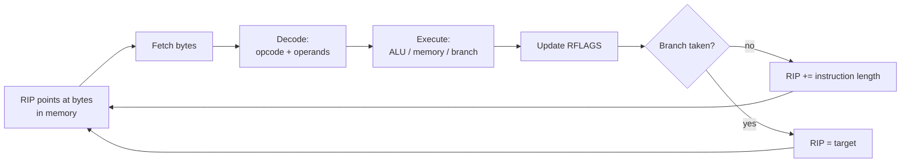
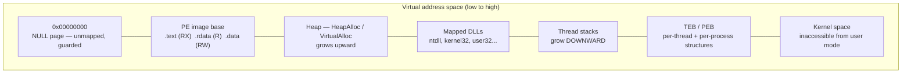
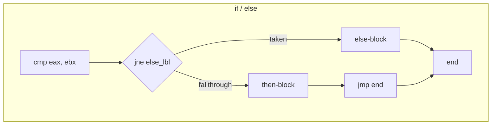
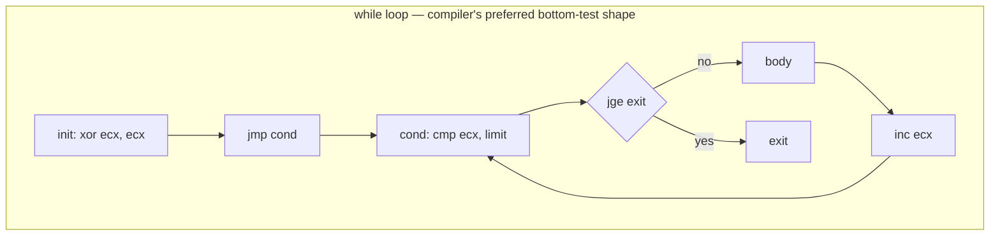
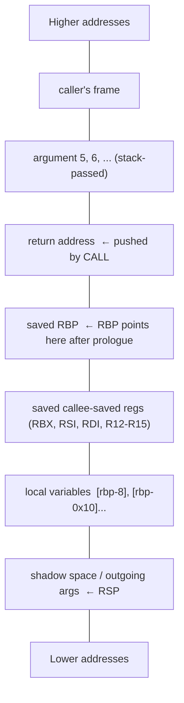

**Level:** Advanced · **Track:** Malware Analysis & RE · **Read time:** 250 min

This is Chapter 4 of the Malware Analysis & Reverse Engineering notebook. The previous chapters got you as far as observation: Chapter 2 read a binary's structure on disk, Chapter 3 watched one execute and recorded its behaviour. Both stop at the same wall — the moment you need to know *why* a sample decided to do something, or what it does when the sandbox conditions it checks are not met, you have to read the instructions themselves. This chapter teaches you to do that.

## Why This Matters

Dynamic analysis answers "what happened". Assembly answers "what *can* happen, under which conditions, and exactly how". Those are different questions, and the second one is what separates a triage note from an analysis report.

Concretely, here is what you cannot get without reading disassembly:

- **Dormant and conditional behaviour.** A loader that checks `GetSystemMetrics(SM_CMONITORS)`, the number of CPU cores, and whether the username matches a hardcoded blocklist will simply exit in your sandbox. The branch you never took is invisible to Procmon. In the disassembly it is two lines above the branch you did take.
- **Configuration extraction.** Modern commodity families store C2 domains, campaign IDs, mutex names and RC4 keys as encrypted blobs. The decryption routine is fifteen instructions of assembly. Once you read it, you can decrypt the config for *every* sample of that family, not just the one you detonated.
- **Algorithm identification.** Is that loop AES, RC4, ChaCha20, or a homebrew XOR-with-rolling-key? The S-box initialisation of RC4 (`for i in 0..255: S[i] = i`) is unmistakable in assembly and invisible in behaviour.
- **Answering "is this actually malicious?"** for the ambiguous 30% of samples, where the difference between a packer and a legitimate licensing stub is what the unpacked code does.
- **Shellcode, exploits, and anything without a file.** Injected code, process-hollowed payloads, in-memory-only stages, exploit primitives — none of it has a PE structure or imports to read. It is raw bytes, and raw bytes are only assembly.

The good news: you do **not** need to write assembly, and you do not need all ~1,500 x86 instructions. Analysts read, and reading is dramatically easier than writing. Roughly forty instructions cover well over 95% of compiler-generated code. The skill is not memorising an instruction reference — it is pattern recognition: seeing `mov` / `mov` / `call` and thinking "two-argument function call", seeing `xor eax, eax` and thinking "return 0", seeing a loop with `xor byte ptr [eax], 0x5A` and thinking "string decryption, dump the output".

We will build that pattern vocabulary from absolute zero — starting with what a register *is* — through calling conventions, C-construct recognition, compiler optimiser idioms, Windows-specific structures, and finally the deliberately hostile assembly that malware authors write specifically to make this chapter's skills fail.

Throughout, the working assumption is x86-64 on Windows (the dominant malware target), with 32-bit x86 covered in full because a large share of commodity malware, most shellcode, and nearly every CTF binary is still 32-bit.

---

## Part 1: The CPU Model — What the Machine Actually Does

Everything in this chapter reduces to one loop. The CPU:

1. **Fetches** the bytes at the address in the instruction pointer (`EIP` on 32-bit, `RIP` on 64-bit).
2. **Decodes** those bytes into an operation plus its operands.
3. **Executes** it — moving data, doing arithmetic, or changing the instruction pointer.
4. Advances `RIP` past the instruction it just executed, and repeats.



There are only three places data can live, and every instruction is some combination of them:

| Storage | Size | Speed | Notes |
|---|---|---|---|
| **Registers** | 8/16/32/64 bits each, ~16 general-purpose | ~1 cycle | The CPU's scratchpad. Everything passes through here. |
| **Memory (RAM)** | Effectively unlimited, byte-addressable | ~100–300 cycles uncached | Stack, heap, globals, code. Accessed via addresses. |
| **Immediates** | Encoded inside the instruction | free | Constants baked into the code bytes. |

A crucial x86 rule that shapes everything you read: **at most one operand may be a memory reference.** `mov eax, [rbx]` is legal, `mov [rcx], eax` is legal, but `mov [rcx], [rbx]` is not. This is why compiler output is full of apparently pointless register shuffling — moving eight bytes from one memory location to another *requires* a register as an intermediate:

```asm
mov  rax, qword ptr [rbx]     ; load  from memory into register
mov  qword ptr [rcx], rax     ; store from register into memory
```

### Instruction encoding, and why it matters

x86 is a **variable-length CISC** encoding: instructions are 1 to 15 bytes. `nop` is one byte (`0x90`). `mov rax, 0x1122334455667788` is ten. This has three consequences an analyst feels constantly:

1. **There is no alignment to trust.** You cannot reliably start disassembling at an arbitrary offset and expect to land on instruction boundaries.
2. **Disassembly is ambiguous.** Starting one byte later produces a completely different, still-valid instruction stream. This is the basis of every anti-disassembly trick in Part 13.
3. **Byte patterns are searchable.** You can grep memory for `55 8B EC` (a classic 32-bit function prologue) or `64 A1 30 00 00 00` (`mov eax, fs:[0x30]` — PEB access) as a heuristic. YARA rules do exactly this.

Here is the same instruction shown three ways, which is how you should learn to read any disassembler pane:

```
Address           Bytes                    Mnemonic
0000000140001020  48 8B 05 D9 2F 00 00     mov rax, qword ptr [rip + 0x2FD9]
```

- `48` is the **REX.W prefix** — "this is a 64-bit operation". Seeing `48` at the start of instructions is the fastest visual confirmation you are looking at x64 code.
- `8B` is the opcode for `mov r64, r/m64`.
- `05` is the ModR/M byte, which here encodes "RAX ← RIP-relative memory".
- `D9 2F 00 00` is a 32-bit little-endian displacement (`0x00002FD9`).

**Analyst relevance:** RIP-relative addressing (`[rip + disp]`) exists only on x64 and is the single biggest visual difference from 32-bit code. It also means x64 code is naturally position-independent for data access, which is why x64 shellcode does not need the `call/pop` GetPC trick that 32-bit shellcode does (Part 14).

### The two syntaxes — Intel vs AT&T

You will meet both. Know how to flip between them, because IDA/Ghidra/x64dbg default to Intel and Linux `objdump`/`gdb` default to AT&T.

| Feature | Intel (IDA, Ghidra, x64dbg, MASM) | AT&T (objdump, gdb, gas) |
|---|---|---|
| Operand order | `mov dst, src` | `mov src, dst` |
| Registers | `rax` | `%rax` |
| Immediates | `5` | `$5` |
| Memory | `[rbx+rcx*4+8]` | `8(%rbx,%rcx,4)` |
| Size suffix | implied / `dword ptr` | `movl`, `movq`, `movb` |
| Example | `mov eax, dword ptr [rbx+4]` | `movl 4(%rbx), %eax` |

This chapter uses **Intel syntax** throughout. To make `objdump` and `gdb` agree with it:

```bash
objdump -d -M intel ./sample            # disassemble with Intel syntax
echo 'set disassembly-flavor intel' >> ~/.gdbinit
```

---

## Part 2: Registers — The Complete Working Set

A register is a named storage slot inside the CPU. On x86-64 there are 16 general-purpose registers of 64 bits each, plus the instruction pointer, the flags register, and the SIMD register file.

### General-purpose registers and their sub-register views

Each 64-bit register can be addressed at four widths. Learning this table is non-negotiable — misreading `al` as `rax` will make you misread the code.

| 64-bit | 32-bit | 16-bit | 8-bit low | 8-bit high | Conventional role |
|---|---|---|---|---|---|
| `RAX` | `EAX` | `AX` | `AL` | `AH` | Accumulator; **return value** |
| `RBX` | `EBX` | `BX` | `BL` | `BH` | Base; callee-saved |
| `RCX` | `ECX` | `CX` | `CL` | `CH` | Counter (`loop`, `rep`, shifts); **1st arg (Win64)** |
| `RDX` | `EDX` | `DX` | `DL` | `DH` | Data; high half of `mul`/`div`; **2nd arg (Win64)** |
| `RSI` | `ESI` | `SI` | `SIL` | — | Source index (`movs`, `lods`) |
| `RDI` | `EDI` | `DI` | `DIL` | — | Destination index (`movs`, `stos`) |
| `RBP` | `EBP` | `BP` | `BPL` | — | Base/frame pointer |
| `RSP` | `ESP` | `SP` | `SPL` | — | **Stack pointer** — never use as scratch |
| `R8`–`R15` | `R8D`–`R15D` | `R8W`–`R15W` | `R8B`–`R15B` | — | x64-only extras; `R8`/`R9` are Win64 args 3–4 |

Two rules about partial registers that trip up every beginner:

1. **Writing a 32-bit sub-register zeroes the upper 32 bits of the 64-bit register.** `mov eax, 1` sets RAX to exactly `0x0000000000000001`. This is why compilers emit `mov eax, 1` rather than `mov rax, 1` — it is a shorter encoding with identical effect, and it is why `xor eax, eax` is the canonical way to zero RAX.
2. **Writing an 8- or 16-bit sub-register does *not* zero the rest.** If RAX is `0xFFFFFFFFFFFFFFFF` and you execute `mov al, 0`, RAX becomes `0xFFFFFFFFFFFFFF00`. Missing this produces spectacularly wrong analysis of byte-wise decryption loops.

### Special-purpose registers

- **`RIP`/`EIP` — instruction pointer.** Holds the address of the *next* instruction. You cannot write it directly; you change it with `jmp`, `call`, `ret`, or an interrupt. Every control-flow hijack in exploitation is, ultimately, "get attacker-chosen data into RIP".
- **`RSP` — stack pointer.** Always points at the top of the stack. The stack grows **downwards** (toward lower addresses), so `push` *subtracts* from RSP.
- **`RBP` — frame pointer.** By convention anchors the current function's stack frame, so locals are at `[rbp-N]` and arguments at `[rbp+N]`. Optimised builds frequently omit it (`-fomit-frame-pointer`, and MSVC release by default), freeing RBP as a general register — a common source of confusion when locals suddenly appear as `[rsp+N]` instead.
- **`RFLAGS` — status flags.** Set as a side effect of arithmetic and logic; read by conditional jumps. This is the glue of all control flow.

| Flag | Bit | Name | Set when |
|---|---|---|---|
| `CF` | 0 | Carry | Unsigned overflow / borrow out of the MSB |
| `PF` | 2 | Parity | Low byte of result has an even number of set bits |
| `AF` | 4 | Adjust | BCD carry out of bit 3 (rarely relevant) |
| `ZF` | 6 | Zero | Result was exactly zero |
| `SF` | 7 | Sign | Most-significant bit of result is 1 (negative if signed) |
| `TF` | 8 | Trap | Single-step mode — **set by debuggers**, checked by anti-debug code |
| `IF` | 9 | Interrupt enable | Kernel-level |
| `DF` | 10 | Direction | 0 = string ops go forward, 1 = backward (`cld`/`std`) |
| `OF` | 11 | Overflow | Signed overflow |

The four you will actually reason about are **ZF, SF, CF, OF**. `cmp`/`test` set them; `jcc` reads them.

### Segment registers

Mostly vestigial on modern systems — `CS`, `DS`, `ES`, `SS` all describe a flat address space — with two enormous exceptions that appear constantly in Windows malware:

- **32-bit Windows: `FS` points at the TEB (Thread Environment Block).** So `mov eax, fs:[0x30]` loads the PEB pointer, and `fs:[0]` is the head of the SEH chain.
- **64-bit Windows: `GS` points at the TEB.** `mov rax, gs:[0x60]` loads the PEB pointer.

On Linux, `FS` is used for thread-local storage, so `mov rax, fs:[0x28]` is the stack-canary read that appears in every hardened binary.

**Security relevance:** `fs:[0x30]` / `gs:[0x60]` in a disassembly is one of the strongest single indicators of manual API resolution or shellcode. Legitimate application code almost never touches the PEB directly. It is a first-class YARA and hunting signature (Part 15).

### SIMD registers (XMM/YMM/ZMM)

`XMM0`–`XMM15` are 128-bit registers used for floating point and vectorised operations. You will encounter them in three analyst-relevant places, and can otherwise skim them:

1. **Optimised `memcpy`/`memset`/`strlen`** — the compiler moves 16 bytes at a time with `movdqu`/`movups`. Long unrolled sequences of XMM moves are almost always a bulk copy, not crypto.
2. **AES-NI instructions** — `aesenc`, `aesenclast`, `aeskeygenassist`. If you see these, the sample is doing hardware AES. This is a one-second algorithm identification and worth memorising.
3. **Win64 floating-point arguments** — `XMM0`–`XMM3` carry float/double parameters.

---

## Part 3: Memory, Addressing Modes, and Endianness

### Endianness

x86 is **little-endian**: multi-byte values are stored least-significant byte first. The 32-bit value `0x12345678` sits in memory as `78 56 34 12`.

This is why, in a hex dump of an unpacked config, an address like `0x00401000` appears as `00 10 40 00`, and why the string `"MZ"` (`4D 5A`) is stored in that order but the WORD `e_magic` compares against `0x5A4D`. Every analyst has, at least once, searched for a byte pattern in the wrong order and concluded a sample was clean.

```
Value:  0x12345678   (32-bit)
Memory: 78 34 56 12  ← WRONG (common mistake)
Memory: 78 56 34 12  ← CORRECT
```

Strings are the exception — they are byte arrays, stored in reading order. `"http"` is `68 74 74 70`. But a *four-byte constant* holding `'http'` compiled as an integer will appear reversed as `70 74 74 68`. API-hashing routines and magic-value checks exploit this constantly.

### The full addressing mode

Every memory operand in x86 is a variation of one formula:

```
[ base + index*scale + displacement ]
```

- **base** — any GP register
- **index** — any GP register except RSP
- **scale** — 1, 2, 4 or 8 only
- **displacement** — a signed 8- or 32-bit constant

| Form | Example | Meaning in C terms |
|---|---|---|
| Displacement only | `mov eax, [0x404050]` | `eax = global_var;` |
| Base | `mov eax, [rbx]` | `eax = *ptr;` |
| Base + disp | `mov eax, [rbx+8]` | `eax = ptr->field;` or `s.member` |
| Base + index | `mov al, [rbx+rcx]` | `al = buf[i];` (byte array) |
| Base + index*scale | `mov eax, [rbx+rcx*4]` | `eax = int_array[i];` |
| Full | `mov eax, [rbx+rcx*8+0x10]` | `eax = arr[i].field;` (16-byte structs) |
| RIP-relative (x64) | `lea rcx, [rip+0x2f31]` | address of a global/string literal |

**The scale factor tells you the element size**, which tells you the array's C type. `*4` is a 32-bit int or float array; `*8` is a pointer array or 64-bit int; `*1` is a byte buffer or string. This single observation is the fastest way to reconstruct data structures from disassembly.

### Size specifiers

When the size cannot be inferred from a register operand, it must be stated:

| Specifier | Bits | C type |
|---|---|---|
| `byte ptr` | 8 | `char`, `uint8_t` |
| `word ptr` | 16 | `short`, `WCHAR` |
| `dword ptr` | 32 | `int`, `DWORD`, `float` |
| `qword ptr` | 64 | `long long`, pointer (x64), `double` |
| `xmmword ptr` | 128 | SIMD |

`mov dword ptr [rbx], 0` writes four zero bytes; `mov byte ptr [rbx], 0` writes one. In a decryption loop, the specifier tells you the cipher's word size.

### The memory map of a running process



**Analyst relevance:** memory that is both writable and executable (`RWX`) is the single most suspicious page permission on Windows. Legitimate compilers never produce it; unpackers, injectors and JIT engines do. When you see `VirtualAlloc(..., PAGE_EXECUTE_READWRITE)` followed by a copy loop and an indirect `call`, you are watching a payload being staged — set a breakpoint on the `call` and dump the region.

---

## Part 4: The Instruction Set You Actually Need

Intel's manual documents well over a thousand instructions. Compiler output uses a few dozen. Here is the working set, grouped by what they accomplish.

### Data movement

```asm
mov  rax, rbx              ; rax = rbx
mov  eax, 5                ; eax = 5  (upper 32 bits of rax zeroed)
mov  rax, [rbx]            ; rax = *(qword*)rbx          — LOAD
mov  [rbx], rax            ; *(qword*)rbx = rax          — STORE
movzx eax, byte ptr [rsi]  ; zero-extend a byte into eax  (unsigned char)
movsx eax, byte ptr [rsi]  ; sign-extend a byte into eax  (signed char)
movsxd rax, eax            ; sign-extend 32→64 (very common on x64 for int→ptr math)
lea  rax, [rbx+rcx*4+8]    ; rax = rbx + rcx*4 + 8   — COMPUTE, DO NOT DEREFERENCE
xchg rax, rbx              ; swap
```

**`lea` is the single most misread instruction in x86.** Despite the bracket syntax it never touches memory — it computes the address and stores the number. Compilers love it as a free three-operand adder/multiplier:

| Instruction | Actually means |
|---|---|
| `lea eax, [ebx+ecx]` | `eax = ebx + ecx` (an add that doesn't clobber flags) |
| `lea eax, [ebx*4]` | `eax = ebx * 4` |
| `lea eax, [ebx+ebx*2]` | `eax = ebx * 3` |
| `lea eax, [ebx+ebx*4]` | `eax = ebx * 5` |
| `lea rcx, [rip+0x3f21]` | `rcx = address of a string/global` — **the x64 "load string literal" idiom** |

When you see `lea rcx, [rip+...]` immediately before a `call`, that is nearly always "pass a pointer to a string constant as argument 1". Double-click the target in your disassembler; it will be the format string, filename, registry key or URL you are looking for.

`movzx` vs `movsx` is equally load-bearing: it distinguishes `unsigned char` from `char`, which in a decryption loop determines whether byte `0x80` is `128` or `-128`.

### Arithmetic

```asm
add  rax, rbx        ; rax += rbx
sub  rax, 0x10       ; rax -= 0x10
inc  rax             ; rax++     (does NOT affect CF)
dec  rax             ; rax--
neg  rax             ; rax = -rax   (two's complement)
imul eax, ebx, 10    ; signed multiply, three-operand form: eax = ebx * 10
mul  rbx             ; UNSIGNED: RDX:RAX = RAX * RBX  (128-bit result!)
cdq                  ; sign-extend EAX into EDX:EAX — always precedes idiv
idiv ebx             ; signed divide EDX:EAX by ebx → quotient EAX, remainder EDX
```

Two things to burn in:

- **`mul`/`div` are implicit-operand instructions.** `div ebx` divides `EDX:EAX`, not just EAX. If you forget the `cdq`/`xor edx,edx` that must precede it, you will misread the arithmetic. Seeing `xor edx, edx` then `div` means unsigned division; `cdq` then `idiv` means signed.
- **Division is expensive, so compilers avoid it.** A division by a constant becomes a multiply by a "magic number" and a shift (Part 9). If you see `imul` by a bizarre constant like `0x66666667` followed by `sar`, that is a division by 5, not a hash.

### Logic and bit manipulation

```asm
and  eax, 0x0F       ; mask off all but the low nibble
or   eax, 0x80       ; set bit 7
xor  eax, eax        ; eax = 0  (the canonical zeroing idiom)
xor  al, 0x5A        ; single-byte XOR — the classic string obfuscation
not  eax             ; bitwise complement
shl  eax, 3          ; eax <<= 3   (= eax * 8)
shr  eax, 2          ; LOGICAL right shift (zero fill)  — unsigned / 4
sar  eax, 2          ; ARITHMETIC right shift (sign fill) — signed / 4
rol  eax, 13         ; rotate left 13 — appears in almost every API-hash routine
ror  eax, 7          ; rotate right 7
bt   eax, 5          ; test bit 5 into CF
bswap eax            ; byte-swap — endianness conversion, network order
```

**`shr` vs `sar` reveals signedness**, exactly like `movzx` vs `movsx`. And **`rol`/`ror` are the fingerprint of hashing**: the ROR-13 additive hash used by countless shellcode loaders and by Metasploit's block API is literally `ror edx, 13` inside a loop over a function name.

### Stack

```asm
push rax             ; rsp -= 8 ; [rsp] = rax
pop  rax             ; rax = [rsp] ; rsp += 8
pushfq / popfq       ; push/pop RFLAGS  — used by anti-debug to inspect TF
```

On 32-bit, `push`/`pop` move ESP by 4. `pushad`/`popad` (save/restore all eight 32-bit GP registers) exist only in 32-bit mode and are a **hallmark of packer stubs** — UPX's decompression stub begins with `pushad` and ends with `popad; jmp OEP`.

### Control transfer

```asm
jmp  0x401000        ; unconditional
call 0x401000        ; push return address, then jmp
ret                  ; pop return address into RIP
ret  0x10            ; pop return address, then add 0x10 to RSP (stdcall cleanup)
call rax             ; INDIRECT call — target only known at runtime
call qword ptr [rax+0x18]  ; indirect through memory — vtable / IAT / API pointer
```

**Indirect calls are where analysis gets hard and interesting.** `call rax` means the target is computed — resolved API, virtual method, function pointer table, or dynamically decrypted address. Static analysis cannot always follow it; this is precisely when you switch to a debugger (Chapter 6) and read RAX at that instruction.

### Comparison

```asm
cmp  eax, ebx        ; compute eax - ebx, set flags, DISCARD result
test eax, eax        ; compute eax & eax, set flags, DISCARD result
```

`test eax, eax` is the idiomatic "is this zero/NULL?" check — cheaper than `cmp eax, 0`. In practice, `test rax, rax` / `jz` immediately after a `call` is the compiled form of `if (ptr == NULL)` — i.e., an API return-value check. It is one of the highest-frequency patterns in all Windows code.

### String instructions

```asm
rep movsb            ; copy ECX/RCX bytes from [RSI] to [RDI]
rep stosb            ; fill ECX/RCX bytes at [RDI] with AL
repne scasb          ; scan [RDI] for AL — this is inlined strlen()
rep cmpsb            ; compare two buffers — inlined memcmp()
lodsb                ; AL = [RSI], RSI++
```

These are compact, self-contained and use fixed registers, which makes them beloved by shellcode authors and instantly recognisable:

- `rep stosb` with `xor eax, eax` = `memset(dst, 0, n)` — zeroing a buffer or struct.
- `repne scasb` with `ECX = -1` and `AL = 0` = `strlen()`.
- `rep movsb` = `memcpy()` — often the actual payload copy in an injector.

### Miscellaneous but analytically loud

| Instruction | Why an analyst cares |
|---|---|
| `int3` (`0xCC`) | Software breakpoint. Its *presence in file bytes* is an anti-debug check target. |
| `int 2Dh` | Anti-debug: behaves differently under a debugger. |
| `cpuid` | Reads the hypervisor bit and vendor string → **anti-VM check** |
| `rdtsc` | Timestamp counter → **timing-based anti-debug** |
| `syscall` / `sysenter` | Direct kernel transition — **EDR-evasion direct syscalls** |
| `nop` (`0x90`) | Padding, alignment, or a NOP sled in an exploit |
| `ud2` | Deliberate invalid opcode; marks unreachable code |
| `xchg`-based `pause` | Spin-wait loops, and a sleep-obfuscation building block |

---

## Part 5: Flags and Control Flow — How `if` Is Actually Built

Every conditional in every program is two steps: an instruction that sets flags, then a jump that reads them.

```asm
cmp  eax, 10        ; sets ZF, SF, CF, OF from (eax - 10)
jle  short loc_401050   ; jump if eax <= 10 (signed)
```

### The conditional jump table

This is the reference you will consult most often. Note the strict separation of **signed** and **unsigned** comparisons — mixing them up inverts your understanding of a bounds check, which is exactly the class of bug that becomes a CVE.

| Mnemonic | Aliases | Jumps if | Flags | Signedness |
|---|---|---|---|---|
| `je` | `jz` | equal / zero | `ZF=1` | either |
| `jne` | `jnz` | not equal | `ZF=0` | either |
| `jg` | `jnle` | greater | `ZF=0 && SF==OF` | **signed** |
| `jge` | `jnl` | greater or equal | `SF==OF` | **signed** |
| `jl` | `jnge` | less | `SF!=OF` | **signed** |
| `jle` | `jng` | less or equal | `ZF=1 \|\| SF!=OF` | **signed** |
| `ja` | `jnbe` | above | `CF=0 && ZF=0` | **unsigned** |
| `jae` | `jnb`, `jnc` | above or equal | `CF=0` | **unsigned** |
| `jb` | `jnae`, `jc` | below | `CF=1` | **unsigned** |
| `jbe` | `jna` | below or equal | `CF=1 \|\| ZF=1` | **unsigned** |
| `js` | — | sign (negative) | `SF=1` | signed |
| `jns` | — | not negative | `SF=0` | signed |
| `jo` / `jno` | — | overflow / not | `OF` | signed |
| `jecxz`/`jrcxz` | — | ECX/RCX is zero | none | — |

Memory hook: **A**bove/**B**elow are un**s**igned; **G**reater/**L**ess are **s**igned. If a length check uses `jb`/`ja`, the programmer treated the length as unsigned — a negative length passed in becomes a huge positive one, which is the classic integer-signedness vulnerability.

### `setcc` and `cmovcc` — branchless conditionals

Optimisers often eliminate branches entirely:

```asm
xor  eax, eax
cmp  ebx, ecx
sete al             ; al = (ebx == ecx) ? 1 : 0    → this is a C bool
```

```asm
cmp  eax, ebx
cmovg eax, ebx      ; if (eax > ebx) eax = ebx;   → this is min()
```

If you are looking for a comparison and see no `jcc`, look for `setcc`/`cmovcc`. Branchless code is also deliberately used in crypto to resist timing attacks, so its presence in a comparison of secrets is a (weak) signal of competent implementation.

### Control-flow shapes





The visual signature of a loop in any disassembler is a **backward jump** — an arrow pointing to a lower address. In IDA's graph view or Ghidra's function graph, loops are the cycles. Train yourself to spot backward jumps first when opening an unfamiliar function; they localise the "work" of the function almost immediately.

---

## Part 6: The Stack and Calling Conventions

The stack is a region of memory that grows downward, used for return addresses, saved registers, local variables and (in 32-bit) function arguments. `RSP` points at its top. `push` decrements, `pop` increments.



A **calling convention** is the contract that lets separately compiled code interoperate: where arguments go, where the return value comes back, who cleans up the stack, and which registers a function may clobber. You must know which one you are looking at before you can read arguments.

### The four you will meet

| Convention | Platform | Arguments | Return | Stack cleanup | Notes |
|---|---|---|---|---|---|
| **cdecl** | 32-bit C default | All on stack, **right to left** | `EAX` | **Caller** (`add esp, N` after call) | Supports varargs (`printf`) |
| **stdcall** | 32-bit **Win32 API** | All on stack, right to left | `EAX` | **Callee** (`ret N`) | `WINAPI`; name-decorated `_Foo@12` |
| **fastcall** | 32-bit MSVC | `ECX`, `EDX`, then stack | `EAX` | Callee | `__fastcall`; also thiscall uses ECX for `this` |
| **Microsoft x64** | **all 64-bit Windows** | `RCX`, `RDX`, `R8`, `R9`, then stack | `RAX` | Caller | **32-byte shadow space**, 16-byte alignment |
| **System V AMD64** | 64-bit Linux/macOS | `RDI`, `RSI`, `RDX`, `RCX`, `R8`, `R9`, then stack | `RAX` (+`RDX`) | Caller | **128-byte red zone**, no shadow space |

Two mnemonics worth memorising outright:

- **Win64:** "**C**ute **D**ogs **8**at **9**oodles" → RCX, RDX, R8, R9.
- **Linux64:** "**D**iane's **S**ilk **D**ress **C**osts **8**9" → RDI, RSI, RDX, RCX, R8, R9.

### Reading a 32-bit stdcall API call

```asm
push 0                        ; arg5: lpThreadId       = NULL
push 0                        ; arg4: dwCreationFlags  = 0
push 0                        ; arg3: lpParameter      = NULL
push offset sub_401000        ; arg2: lpStartAddress   = our function
push 0                        ; arg1: dwStackSize      = 0
push 0                        ; arg0: lpThreadAttributes = NULL
call ds:CreateThread
mov  [ebp+hThread], eax       ; return value in EAX
```

Because arguments are pushed **right to left**, the *last* push is the *first* parameter. Read the pushes bottom-up against the MSDN prototype. Note there is no `add esp, 0x18` afterwards — stdcall means `CreateThread` cleaned up its own arguments with `ret 0x18`. That absence is itself how you identify the convention.

### Reading a Win64 API call

```asm
xor  r9d, r9d                 ; arg4: flProtect placeholder / zero
mov  r8d, 40h                 ; arg3: flProtect = PAGE_EXECUTE_READWRITE
mov  edx, 3000h               ; arg2: flAllocationType = MEM_COMMIT|MEM_RESERVE
mov  rcx, rbx                 ; arg1: lpAddress
mov  r9d, 40h
call cs:VirtualAlloc
```

Two Win64 rules that surprise people coming from 32-bit:

1. **Shadow space (a.k.a. home space):** the caller must reserve **32 bytes** on the stack *even if the callee takes zero arguments*. The callee may spill RCX/RDX/R8/R9 there. This is why nearly every x64 prologue contains `sub rsp, 0x28`, `sub rsp, 0x38`, etc. — 32 bytes of shadow space plus locals, rounded to keep RSP 16-byte aligned.
2. **RSP must be 16-byte aligned at the point of the `call`.** Violating this crashes inside any callee that uses SSE (`movaps`). This is the #1 cause of "my x64 shellcode crashes in `MessageBoxA` but the same logic worked in 32-bit".

### Volatile vs non-volatile registers

If a function trashes a register, the caller must not have relied on it. Knowing which is which lets you follow a value across a call.

| Convention | Volatile (caller-saved, may be destroyed) | Non-volatile (callee-saved, preserved) |
|---|---|---|
| **Win64** | RAX, RCX, RDX, R8–R11, XMM0–XMM5 | RBX, RBP, RSI, RDI, RSP, R12–R15, XMM6–XMM15 |
| **SysV x64** | RAX, RCX, RDX, RSI, RDI, R8–R11 | RBX, RBP, RSP, R12–R15 |
| **32-bit (both)** | EAX, ECX, EDX | EBX, ESI, EDI, EBP, ESP |

Practical consequence: if you are tracking a pointer and the code stashes it in `RBX` or `RSI` before a call, that is deliberate — the compiler chose a non-volatile register because the value must survive the call. Values in RAX/RCX/RDX across a call are dead. This tells you *which registers to watch* when stepping in a debugger.

---

## Part 7: Function Anatomy — Prologue, Frame, Epilogue

Recognising function boundaries is the first thing you do in an unfamiliar binary, and disassemblers get it wrong often enough (especially in packed or obfuscated code) that you must be able to do it by eye.

### The classic 32-bit frame-pointer prologue

```asm
push ebp                 ; save caller's frame pointer
mov  ebp, esp            ; establish ours
sub  esp, 0x40           ; carve 0x40 bytes of locals
push ebx                 ; save non-volatile registers we intend to use
push esi
push edi
```

Byte pattern: `55 8B EC` (`push ebp; mov ebp, esp`). Searching for `55 8B EC` in a memory dump is a crude but effective way to find function starts in stripped or injected 32-bit code.

With EBP established, the frame is fully readable:

```
[ebp+0x10]  → 3rd argument
[ebp+0x0C]  → 2nd argument
[ebp+0x08]  → 1st argument
[ebp+0x04]  → return address
[ebp+0x00]  → saved EBP
[ebp-0x04]  → first local
[ebp-0x08]  → second local
```

**Positive offsets from EBP are arguments; negative offsets are locals.** That one rule converts an unreadable wall of `[ebp-0x1C]` references into named variables. IDA and Ghidra do this automatically and let you rename each slot — do rename them as you work, immediately, because a function with `hProcess`, `pRemoteBuf` and `bytesWritten` named is readable, and the same function with `var_1C`, `var_20`, `var_24` is not.

### The typical x64 prologue

x64 code usually omits the frame pointer:

```asm
mov  [rsp+8], rcx        ; "home" the first argument into shadow space
push rbx                 ; save non-volatiles
push rsi
sub  rsp, 0x38           ; 0x20 shadow space + locals, keeping 16-byte alignment
```

Now everything is `[rsp+N]`. The absence of `push rbp; mov rbp, rsp` is normal, not suspicious. Note the `mov [rsp+8], rcx` idiom — the compiler spilling register arguments into their shadow slots, which is why you frequently see arguments *both* in registers and on the stack.

### Epilogues

```asm
; 32-bit with frame pointer
pop  edi
pop  esi
pop  ebx
mov  esp, ebp            ; discard locals  (or: leave)
pop  ebp
ret

; 'leave' is exactly 'mov esp, ebp; pop ebp'
leave
ret

; x64
add  rsp, 0x38
pop  rsi
pop  rbx
ret
```

`ret 0x0C` (a `ret` with an immediate) tells you instantly: **stdcall, three 32-bit arguments**. That is free information about a function's prototype with no other analysis.

### Stack canaries

Hardened builds insert a cookie check. On MSVC:

```asm
mov  rax, cs:__security_cookie
xor  rax, rsp
mov  [rsp+0x30], rax        ; store cookie in the frame
...
mov  rcx, [rsp+0x30]
xor  rcx, rsp
call __security_check_cookie ; mismatch → __report_gsfailure → process dies
```

On GCC/Linux the same idea reads from TLS: `mov rax, fs:[0x28]`. **Exploitation relevance:** a stack canary means a straightforward stack-buffer-overflow-to-saved-RIP is off the table without an info leak — which is precisely the constraint that shapes CTF pwn challenges and real exploit development.

### Identifying a function's prototype from assembly alone

Work through it mechanically:

1. **Convention** — 32-bit with `ret N` → stdcall; 32-bit with caller `add esp, N` → cdecl; x64 → Microsoft x64 (or SysV if it's an ELF).
2. **Argument count** — highest `[ebp+N]` referenced, or highest of RCX/RDX/R8/R9 read before being written.
3. **Argument types** — `movzx`/`byte ptr` → char; `*4` scaling → int array; passed to `strlen`-like code → string; dereferenced twice → pointer-to-pointer.
4. **Return type** — is EAX/RAX set before `ret`? Is only `AL` set (a `BOOL`)? Is nothing set (`void`)?

Applied to a real function this takes about two minutes and turns `sub_401A30` into `int __stdcall decrypt_config(char *buf, int len, unsigned char key)` — at which point the rest of the binary starts making sense.

---

## Part 8: Reading C Constructs in Assembly

This is the core translation skill. Every high-level construct has a small number of recognisable compiled shapes.

### `if` / `else`

```c
if (x > 10) { y = 1; } else { y = 2; }
```

```asm
cmp  dword ptr [rbp-4], 10
jle  short else_branch
mov  dword ptr [rbp-8], 1
jmp  short end_if
else_branch:
mov  dword ptr [rbp-8], 2
end_if:
```

Note the **inverted condition**: the source says "if greater", the assembly jumps "if less-or-equal". Compilers branch *away* from the fall-through path. Beginners routinely invert the logic when reading; always ask "which path is the jump *avoiding*?"

### `for` loop over an array

```c
int sum = 0;
for (int i = 0; i < n; i++) sum += arr[i];
```

```asm
xor  eax, eax               ; sum = 0
xor  ecx, ecx               ; i = 0
test edx, edx               ; n <= 0?
jle  short done
loop_body:
add  eax, [rbx+rcx*4]       ; sum += arr[i]     ← *4 ⇒ int array
inc  ecx                    ; i++
cmp  ecx, edx
jl   short loop_body        ; backward jump ⇒ LOOP
done:
```

Three tells at a glance: the backward jump, the induction register (`ecx`) incremented once per iteration, and the scaled index revealing element size.

### `switch` — three compiled forms

The compiler picks a strategy based on case density, and each form looks completely different.

**1. Jump table** (dense cases — the classic):

```asm
cmp  eax, 5
ja   short default_case      ; UNSIGNED compare catches negatives too
mov  eax, eax                ; zero-extend
lea  rcx, [rip+jumptable]
movsxd rax, dword ptr [rcx+rax*4]
add  rax, rcx
jmp  rax                     ; ← indirect jump into the table
```

If you see `ja` followed by a scaled table lookup and `jmp rax`, that is a switch. Ghidra and IDA usually recover the table automatically; when they don't (obfuscated code), you can read the table manually — the entries are 4-byte RVAs relative to the table base.

**2. Binary search tree** (sparse cases): a cascade of `cmp`/`jg`/`jl` narrowing the range, which looks like nested if/else but with suspiciously balanced structure.

**3. If/else chain** (few cases): literal sequential `cmp`/`je`.

**Analyst relevance:** C2 command dispatchers are almost always switches. Finding the jump table in a RAT gives you the complete command set — `0`=heartbeat, `1`=shell, `2`=upload, `3`=screenshot — in one pass, which is the single most valuable artefact for a report.

### Structs

```c
struct Config { DWORD magic; DWORD flags; char *url; DWORD interval; };
cfg->url = target;
```

```asm
mov  qword ptr [rbx+8], rax
```

A **constant offset from a base pointer** is a struct field access. Collect every offset used against the same pointer across the function and you have reconstructed the struct layout:

| Offset | Size | Inferred field |
|---|---|---|
| `[rbx+0]` | dword | `magic` — compared against a constant |
| `[rbx+4]` | dword | `flags` — bit-tested with `test`/`and` |
| `[rbx+8]` | qword | pointer — passed to string functions ⇒ `char*` |
| `[rbx+0x10]` | dword | `interval` — passed to `Sleep` ⇒ milliseconds |

Both IDA (`Local Types`) and Ghidra (`Data Type Manager` → `Create Structure`) let you define the struct and re-type the pointer, after which the disassembly renders `[rbx+0x10]` as `cfg->interval` everywhere. **Do this early.** It is the highest leverage action available in a long reversing session.

### Arrays vs pointers

```asm
lea  rax, [rbp-0x40]        ; ARRAY: compute address of stack storage
mov  rax, [rbp-0x40]        ; POINTER: load a stored address
```

`lea` on a local slot means the local *is* the buffer. `mov` means the local *holds* an address. Confusing these makes you chase phantom heap allocations.

### Strings

```asm
; x64: load address of a literal in .rdata
lea  rcx, [rip+0x1f3a]      ; "http://c2.example[.]com/gate.php"
call sub_140001200

; 32-bit: absolute address
push offset aHttpC2Example
call _strcpy

; Stack strings — built byte by byte to defeat `strings`
mov  byte ptr [rbp-0x20], 'c'
mov  byte ptr [rbp-0x1F], 'm'
mov  byte ptr [rbp-0x1E], 'd'
mov  byte ptr [rbp-0x1D], 0

; Stack strings, DWORD-at-a-time (more common in optimised builds)
mov  dword ptr [rbp-0x20], 6D63h   ; 'mc' → "cm" little-endian
mov  word  ptr [rbp-0x1C], 'd'
```

**Stack strings are an obfuscation technique and a strong malicious indicator.** They defeat `strings` and PEStudio's string extraction from Chapter 2 — which is exactly why a sample that looked "clean, only 14 strings" in static triage can still be a full RAT. When you find them, decode the immediates as little-endian ASCII. FLOSS (FireEye Labs Obfuscated String Solver, covered in Chapter 2) automates this by emulating the function; assembly reading is how you verify and how you handle what FLOSS misses.

### Function pointers and vtables

```asm
mov  rax, [rcx]             ; load vtable pointer from object
call qword ptr [rax+0x18]   ; call the 4th virtual method (0x18/8 = 3, zero-indexed)
```

Double indirection through a base pointer then a call = C++ virtual dispatch. The offset divided by 8 (x64) or 4 (x86) gives the method index. COM-based malware — which is common, since COM gives you scheduled tasks, WMI and BITS without touching an obviously suspicious API — is almost entirely this pattern.

---

## Part 9: Compiler and Optimiser Idioms

Optimised binaries are not what you would write by hand. These idioms account for most beginner confusion, and knowing them means you skip past them instead of spending twenty minutes on a "mystery hash function" that is actually a division by 10.

| Assembly | What it really is | Why the compiler did it |
|---|---|---|
| `xor eax, eax` | `eax = 0` | 2 bytes vs 5 for `mov eax,0`; breaks dependency chains |
| `test eax, eax` / `jz` | `if (x == 0)` | Shorter than `cmp eax, 0` |
| `or eax, -1` | `eax = 0xFFFFFFFF` | 3 bytes vs 5 |
| `lea eax, [ebx+ebx*2]` | `eax = ebx*3` | `lea` is a free 3-operand ALU op |
| `shl eax, 3` | `eax *= 8` | Shifts beat multiplies |
| `sar eax, 31` then `xor`/`sub` | `abs()` | Branchless absolute value |
| `imul` by `0x66666667`, `sar 2` | `/ 5` | Magic-number division |
| `and eax, 7` | `% 8` for unsigned | Power-of-two modulo |
| `sub eax, 0x30; cmp eax, 9; ja` | `isdigit(c)` | Single unsigned compare replaces two |
| `movdqu xmm0,[rsi]` ×N | `memcpy` | 16 bytes per instruction |
| `jmp func` at a function's end | tail call | Reuses the caller's frame — **note: no `call`, so the call graph looks broken** |
| Duplicated loop body ×4 | loop unrolling | Fewer branches |
| Identical code merged (`COMDAT` folding) | two functions, one address | MSVC `/OPT:ICF` — a real source of confusion in cross-references |

### Magic-number division, worked

Seeing this and knowing it is division saves real time:

```asm
mov  eax, 0x66666667
imul ecx                 ; EDX:EAX = ecx * 0x66666667
sar  edx, 2              ; take the high dword, shift
mov  eax, ecx
shr  eax, 31             ; extract sign bit
add  edx, eax            ; correct for negatives
                         ; EDX now = ecx / 5
```

The general recipe: `imul` by a large odd constant, keep `EDX` (the high half), `sar` by a small amount, add the sign bit. The divisor is `2^(32+shift) / magic`, roughly. In practice you recognise the *shape* and let the decompiler tell you the constant.

### Inlining and its consequences

At `/O2`, small functions vanish into their callers. `strlen`, `memcpy`, `min`, accessors — all gone as distinct functions. Two things follow:

1. **A "big" function may be five source functions.** Do not assume one basic-block cluster equals one logical operation.
2. **Cross-references lie about structure.** A helper called from twenty places may exist in twenty inlined copies with no call graph edges at all.

**Practical countermeasure:** use FLIRT signatures in IDA (`File → Load file → FLIRT signature file`) or Ghidra's Function ID to identify statically linked library code, so that `sub_401234` becomes `_strcpy` and you stop reversing the C runtime. On a statically linked malware sample this can eliminate 80% of the functions from consideration in one step.

---

## Part 10: Windows-Specific Assembly Every Analyst Must Recognise

### PEB walking

The Process Environment Block holds, among other things, a linked list of every loaded module. Malware walks it to find `kernel32.dll` without calling any API — no imports, nothing for the IAT-based triage of Chapter 2 to catch.

```asm
; ---- 64-bit ----
mov  rax, gs:[0x60]          ; PEB
mov  rax, [rax+0x18]         ; PEB->Ldr
mov  rax, [rax+0x20]         ; Ldr->InMemoryOrderModuleList.Flink
mov  rax, [rax]              ; next entry (skip the program itself)
mov  rax, [rax]              ; next  → typically ntdll
mov  rbx, [rax+0x20]         ; DllBase

; ---- 32-bit ----
mov  eax, fs:[0x30]          ; PEB
mov  eax, [eax+0x0C]         ; PEB->Ldr
mov  eax, [eax+0x14]         ; InMemoryOrderModuleList
```

Memorise `gs:[0x60]` and `fs:[0x30]`. The offsets `0x18`/`0x20` (x64) and `0x0C`/`0x14` (x86) that follow are the rest of the fingerprint.

Also frequently read:

| Offset (x64 PEB) | Field | Malware use |
|---|---|---|
| `PEB+0x02` | `BeingDebugged` | **Anti-debug check #1** — `IsDebuggerPresent` inlined |
| `PEB+0x18` | `Ldr` | Module list walking |
| `PEB+0x20` | `ProcessParameters` | Read/spoof the command line |
| `PEB+0xBC` | `NtGlobalFlag` | Anti-debug: heap flags differ under a debugger |

`mov rax, gs:[0x60]` followed by `movzx eax, byte ptr [rax+2]` and `test`/`jnz` is `IsDebuggerPresent()` implemented without importing it. Recognising those four instructions on sight is worth more than any anti-debug tool.

### API resolution by hash

Rather than storing `"CreateRemoteThread"` as a string, malware stores a 4-byte hash, walks the export table, hashes each name, and compares. This kills string-based detection and IAT-based triage simultaneously.

```asm
resolve_loop:
    lodsb                       ; AL = next char of the export name
    test al, al
    jz   short check_hash
    ror  edx, 13                ; ← the ROR-13 fingerprint
    add  edx, eax
    jmp  short resolve_loop
check_hash:
    cmp  edx, 0x726774Ch        ; hash of "LoadLibraryA"
    jne  short next_export
```

Whenever you see `ror` (commonly 13, sometimes 7 or 11) inside a loop over bytes, followed by a `cmp` against a constant, you are looking at API hashing. Your job then is to **brute-force the hashes offline**: compute the same hash for every export of every system DLL and build a lookup table.

```python
#!/usr/bin/env python3
"""Recover API names from ROR-13 hashes (Metasploit block_api style)."""
import pefile, sys

def ror13(name: bytes) -> int:
    h = 0
    for ch in name + b"\x00":
        h = ((h >> 13) | (h << 19)) & 0xFFFFFFFF   # ROR 13 on 32 bits
        h = (h + ch) & 0xFFFFFFFF
    return h

TARGETS = {0x0726774C, 0x0E8AFE98, 0x16B3FE72}   # hashes pulled from the sample

for dll in ("C:/Windows/System32/kernel32.dll",
            "C:/Windows/System32/ntdll.dll",
            "C:/Windows/System32/ws2_32.dll"):
    pe = pefile.PE(dll)
    for exp in pe.DIRECTORY_ENTRY_EXPORT.symbols:
        if not exp.name:
            continue
        h = ror13(exp.name)
        if h in TARGETS:
            print(f"{h:#010x}  {dll.split('/')[-1]}!{exp.name.decode()}")
```

Sample output:

```
0x0726774c  kernel32.dll!LoadLibraryA
0x0e8afe98  kernel32.dll!GetProcAddress
0x16b3fe72  kernel32.dll!VirtualAlloc
```

Three hashes recovered, and the sample's intent — load a library, resolve functions, allocate executable memory — is now explicit. Note that real families vary the algorithm (different rotation, adding a DLL-name hash, case-folding to uppercase); read the actual loop and reimplement *that*, don't assume.

### Direct syscalls

To bypass user-mode EDR hooks placed in `ntdll.dll`, malware invokes the kernel directly:

```asm
mov  r10, rcx                ; syscall convention: RCX is clobbered, R10 holds arg1
mov  eax, 0x18               ; syscall number for NtAllocateVirtualMemory (version-specific!)
syscall
ret
```

`mov r10, rcx` / `mov eax, <small constant>` / `syscall` is the unmistakable direct-syscall stub. Because syscall numbers change between Windows builds, samples either hardcode a table (fragile, and a great versioning artefact for attribution) or resolve them dynamically by parsing `ntdll`'s exports and sorting stub addresses — the "Hell's Gate"/"Halo's Gate" family of techniques.

**Blue team relevance:** a `syscall` instruction executing from a memory region that is *not* backed by `ntdll.dll` is highly anomalous. ETW Threat Intelligence provider events and EDR stack-walking both key on exactly this — the return address of the syscall pointing into unbacked or RWX memory. It is one of the most reliable modern detections available, which is why so much offensive research goes into "indirect syscalls" that jump to a real `syscall` instruction inside ntdll.

### Structured Exception Handling as control flow

32-bit SEH is a linked list at `fs:[0]`:

```asm
push offset my_handler
push fs:[0]
mov  fs:[0], esp             ; install handler
...
xor  eax, eax
mov  [eax], eax              ; deliberate access violation → jumps to my_handler
```

Deliberately triggering exceptions is an anti-analysis technique: the real code lives in the handler, and a disassembler following linear flow never reaches it. If you see a handler installed and then an obviously invalid memory access, the handler *is* the program.

---

## Part 11: Hands-On Lab — From C to Disassembly and Back

The fastest way to learn to *read* assembly is to *generate* it from code you already understand, then read it back. This lab does that end to end, then reverses an unknown blob with the same toolchain. Everything here runs on a standard Kali or Ubuntu VM; the Windows portions run in your analysis VM from Chapter 1.

### Tools used in this lab (from scratch)

**`objdump`** — part of GNU binutils, installed on every Linux system. It is a static disassembler and object-file dumper: no execution, no analysis, just "decode these bytes". It has no UI and no cross-references, which makes it useless for large binaries and perfect for looking at one function quickly.

```bash
sudo apt install -y binutils gcc gdb nasm xxd
objdump --version
```

Core flags:

| Flag | Effect |
|---|---|
| `-d` | Disassemble executable sections only |
| `-D` | Disassemble *everything*, including data (useful for shellcode blobs) |
| `-M intel` | Intel syntax |
| `-S` | Interleave source code (needs `-g` at compile time) — the best teaching mode |
| `-j .text` | Restrict to one section |
| `--start-address=` / `--stop-address=` | Disassemble a byte range |
| `-b binary -m i386:x86-64` | Treat a raw file as flat code — **how you disassemble shellcode** |

**`gdb`** — the GNU debugger. Used here only to step instructions and read registers.

**`nasm`** — an assembler, used to turn assembly source into raw bytes so you can verify your understanding by round-tripping.

### Step 1 — Write a program with every construct

```bash
mkdir -p ~/asm-lab && cd ~/asm-lab
cat > demo.c <<'EOF'
#include <stdio.h>
#include <string.h>

struct Config { int magic; int flags; char *name; int interval; };

int sum_array(int *arr, int n) {
    int s = 0;
    for (int i = 0; i < n; i++) s += arr[i];
    return s;
}

int classify(int c) {
    switch (c) {
        case 0: return 100;
        case 1: return 200;
        case 2: return 300;
        case 3: return 400;
        case 4: return 500;
        default: return -1;
    }
}

void decrypt(char *buf, int len, unsigned char key) {
    for (int i = 0; i < len; i++) buf[i] ^= key;
}

int main(void) {
    int a[5] = {1, 2, 3, 4, 5};
    struct Config cfg = {0xDEADBEEF, 3, "agent", 5000};
    char msg[] = {0x28, 0x2f, 0x2e, 0x2e, 0x25, 0x00};   /* "hello" ^ 0x4A */
    decrypt(msg, 5, 0x4A);
    printf("%d %d %s %s\n", sum_array(a, 5), classify(3), cfg.name, msg);
    return 0;
}
EOF
```

### Step 2 — Compile at three optimisation levels and compare

```bash
gcc -g -O0 -fno-stack-protector -o demo_O0 demo.c
gcc -g -O2 -fno-stack-protector -o demo_O2 demo.c
gcc -g -O0 -m32 -fno-stack-protector -o demo_32 demo.c   # needs gcc-multilib
```

Disassemble one function with source interleaved — this is the single most instructive command in the whole chapter:

```bash
objdump -d -M intel -S --no-show-raw-insn demo_O0 | awk '/<sum_array>:/,/^$/'
```

Annotated output (GCC 12, x86-64, SysV — arguments in RDI/RSI):

```asm
0000000000001169 <sum_array>:
int sum_array(int *arr, int n) {
    1169: push   rbp
    116a: mov    rbp,rsp                 ; frame pointer established (-O0 keeps it)
    116d: mov    QWORD PTR [rbp-0x18],rdi ; spill arg1 (arr)  → SysV: RDI is arg1
    1171: mov    DWORD PTR [rbp-0x1c],esi ; spill arg2 (n)
    int s = 0;
    1174: mov    DWORD PTR [rbp-0x8],0x0  ; s   at [rbp-0x8]
    for (int i = 0; i < n; i++)
    117b: mov    DWORD PTR [rbp-0x4],0x0  ; i   at [rbp-0x4]
    1182: jmp    119c <sum_array+0x33>    ; jump to the condition ⇒ bottom-test loop
        s += arr[i];
    1184: mov    eax,DWORD PTR [rbp-0x4]  ; i
    1187: cdqe                            ; sign-extend i to 64 bits for addressing
    1189: lea    rdx,[rax*4+0x0]          ; i * 4  ⇒ ELEMENT SIZE 4 ⇒ int array
    1191: mov    rax,QWORD PTR [rbp-0x18] ; arr
    1195: add    rax,rdx                  ; &arr[i]
    1198: mov    eax,DWORD PTR [rax]      ; arr[i]
    119a: add    DWORD PTR [rbp-0x8],eax  ; s += arr[i]
    119d: add    DWORD PTR [rbp-0x4],0x1  ; i++
    11a1: mov    eax,DWORD PTR [rbp-0x4]
    11a4: cmp    eax,DWORD PTR [rbp-0x1c] ; i < n ?
    11a7: jl     1184 <sum_array+0x1b>    ; BACKWARD JUMP ⇒ this is the loop
    return s;
    11a9: mov    eax,DWORD PTR [rbp-0x8]  ; return value in EAX
    11ac: pop    rbp
    11ad: ret
```

Everything from Parts 5–8 is visible in fourteen instructions: the spilled arguments, the frame-relative locals, the `*4` scale revealing `int`, the bottom-test loop shape, the backward jump, and the return value in EAX.

Now the same function at `-O2`:

```bash
objdump -d -M intel --no-show-raw-insn demo_O2 | awk '/<sum_array>:/,/ret/'
```

```asm
0000000000001180 <sum_array>:
    1180: test   esi,esi          ; n <= 0 ?
    1182: jle    1198             ; early-out with 0
    1184: lea    eax,[rsi-0x1]    ; n-1 → loop bound precomputed
    1187: lea    rdx,[rdi+rax*4+0x4] ; end pointer  ⇒ POINTER-BASED loop
    118c: xor    eax,eax          ; sum = 0
    118e: add    eax,DWORD PTR [rdi]  ; sum += *p
    1190: add    rdi,0x4              ; p++
    1194: cmp    rdi,rdx
    1197: jne    118e
    1198: ret
    1199: xor    eax,eax          ; the n<=0 path returns 0
    119b: ret
```

Same C, radically different assembly: the induction variable `i` no longer exists, the compiler converted array indexing into pointer walking, and the loop bound became a precomputed end pointer. **This is why "read the source in your head" fails on optimised code** — there is no `i` to find. Learn to recognise the *pattern* (pointer increment, compare against an end pointer) rather than looking for the variables you expect.

### Step 3 — Find the switch jump table

```bash
objdump -d -M intel --no-show-raw-insn demo_O2 | awk '/<classify>:/,/ret$/' | head -20
objdump -s -j .rodata demo_O2 | head -20
```

```asm
0000000000001140 <classify>:
    1140: cmp    edi,0x4
    1143: ja     1160 <classify+0x20>    ; unsigned compare ⇒ default case
    1145: mov    edi,edi
    1147: lea    rdx,[rip+0xfb2]         ; load jump table base
    114e: movsxd rax,DWORD PTR [rdx+rdi*4] ; table[c]  ⇒ 4-byte entries
    1152: add    rax,rdx
    1155: jmp    rax                     ; ← indirect jump
    1160: mov    eax,0xffffffff          ; return -1
    1165: ret
```

`.rodata` dump showing the relative offsets:

```
Contents of section .rodata:
 2004 ffffff8c ffffff96 ffffffa0 ffffffaa   ................
 2014 ffffffb4
```

Five entries, four bytes each, matching the five cases. In a RAT this is the command dispatcher, and this same procedure gives you its full command list.

### Step 4 — Read the XOR decryption routine

```bash
objdump -d -M intel --no-show-raw-insn demo_O0 | awk '/<decrypt>:/,/ret$/'
```

```asm
    11c9: movzx  eax,BYTE PTR [rax]      ; movzx ⇒ UNSIGNED char
    11cc: xor    eax,ecx                 ; ^ key
    11ce: mov    BYTE PTR [rdx],al       ; store back — IN-PLACE modification
    11d0: add    DWORD PTR [rbp-0x4],0x1
    11d4: cmp    ...
    11d7: jl     11b8
```

`movzx` byte load → `xor` with a value that never changes inside the loop → byte store to the same address → increment → backward jump. **That five-instruction shape is single-byte XOR decryption**, and you will see it in a real sample within your first week of analysis. Once identified, you do not need to run the sample; recover the key from the immediate (or from the register's value at loop entry in a debugger) and decrypt the blob offline:

```python
data = bytes.fromhex("282f2e2e25")
print(bytes(b ^ 0x4A for b in data).decode())    # -> hello
```

### Step 5 — Step it in gdb and watch the registers

```bash
gdb -q ./demo_O0
(gdb) set disassembly-flavor intel
(gdb) break sum_array
(gdb) run
(gdb) info registers rdi rsi rax
(gdb) x/14i $rip           # next 14 instructions
(gdb) stepi                # one INSTRUCTION (not one source line)
(gdb) x/5dw $rdi           # the array through the pointer in arg1
(gdb) finish               # run to return, printing the value
```

```
rdi            0x7ffd4c3a2b90      140725...   ← pointer to a[]
rsi            0x5                 5           ← n
0x7ffd4c3a2b90: 1   2   3   4   5
Run till exit from #0  sum_array (...)
Value returned is $1 = 15
```

Confirming an argument in a debugger takes ten seconds and settles calling-convention questions permanently. Do this the first few times rather than trusting the table.

### Step 6 — Disassemble a raw blob (the shellcode case)

Injected payloads have no headers. Treat the file as flat code:

```bash
# 26 bytes of classic 64-bit execve("/bin/sh") shellcode
printf '\x31\xc0\x48\xbb\xd1\x9d\x96\x91\xd0\x8c\x97\xff\x48\xf7\xdb\x53\x54\x5f\x99\x52\x57\x54\x5e\xb0\x3b\x0f\x05' > sc.bin
objdump -D -b binary -m i386:x86-64 -M intel sc.bin
```

```asm
   0: 31 c0                 xor    eax,eax           ; zero
   2: 48 bb d1 9d 96 ...    movabs rbx,0xff978cd091969dd1  ; obfuscated string
   c: 48 f7 db              neg    rbx               ; ← de-obfuscate: "/bin/sh"
   f: 53                    push   rbx               ; string onto the stack
  10: 54                    push   rsp
  11: 5f                    pop    rdi               ; arg1 = &"/bin/sh"
  12: 99                    cdq                      ; edx = 0
  13: 52                    push   rdx
  14: 57                    push   rdi
  15: 54                    push   rsp
  16: 5e                    pop    rsi               ; arg2 = argv
  17: b0 3b                 mov    al,0x3b           ; syscall 59 = execve
  19: 0f 05                 syscall
```

Every technique from this chapter appears in 26 bytes: negation-based string obfuscation to avoid null bytes, `push`/`pop` to move between registers in one byte each, `cdq` as a one-byte "zero EDX", and the SysV argument registers. For a Windows blob use `-m i386` for 32-bit, and for x64 Windows payloads look for `gs:[0x60]` in the first few instructions.

### Step 7 — Round-trip with an assembler

Confirm your reading is correct by writing the instructions back out and comparing bytes:

```bash
cat > check.asm <<'EOF'
BITS 64
xor eax, eax
mov rbx, 0xff978cd091969dd1
neg rbx
push rbx
EOF
nasm -f bin check.asm -

---

*Also on [Praneeth's portfolio](https://ping-praneeth.vercel.app/notebook/malware-analysis-re/04-x86-x64-assembly-crash-course-for-analysts), with comments and the latest edits.*
