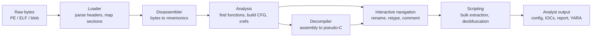
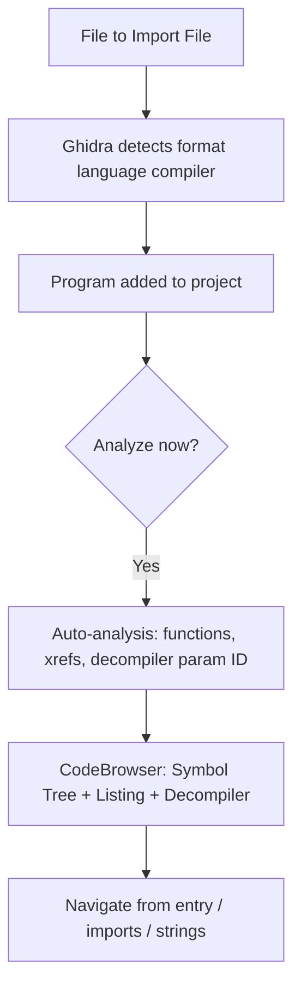
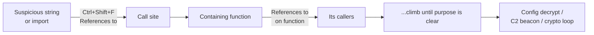
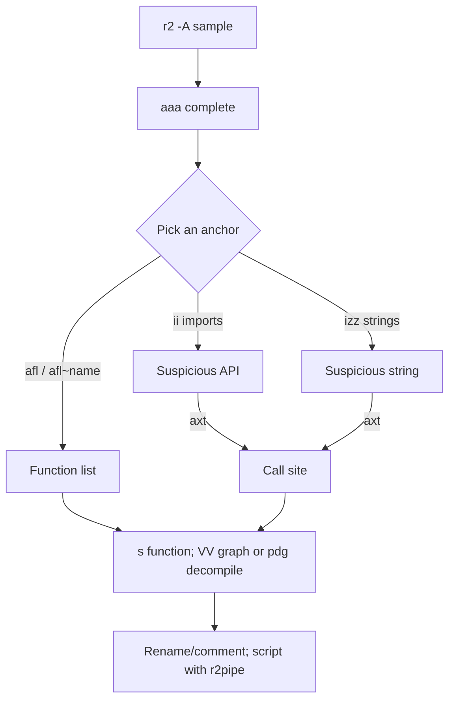
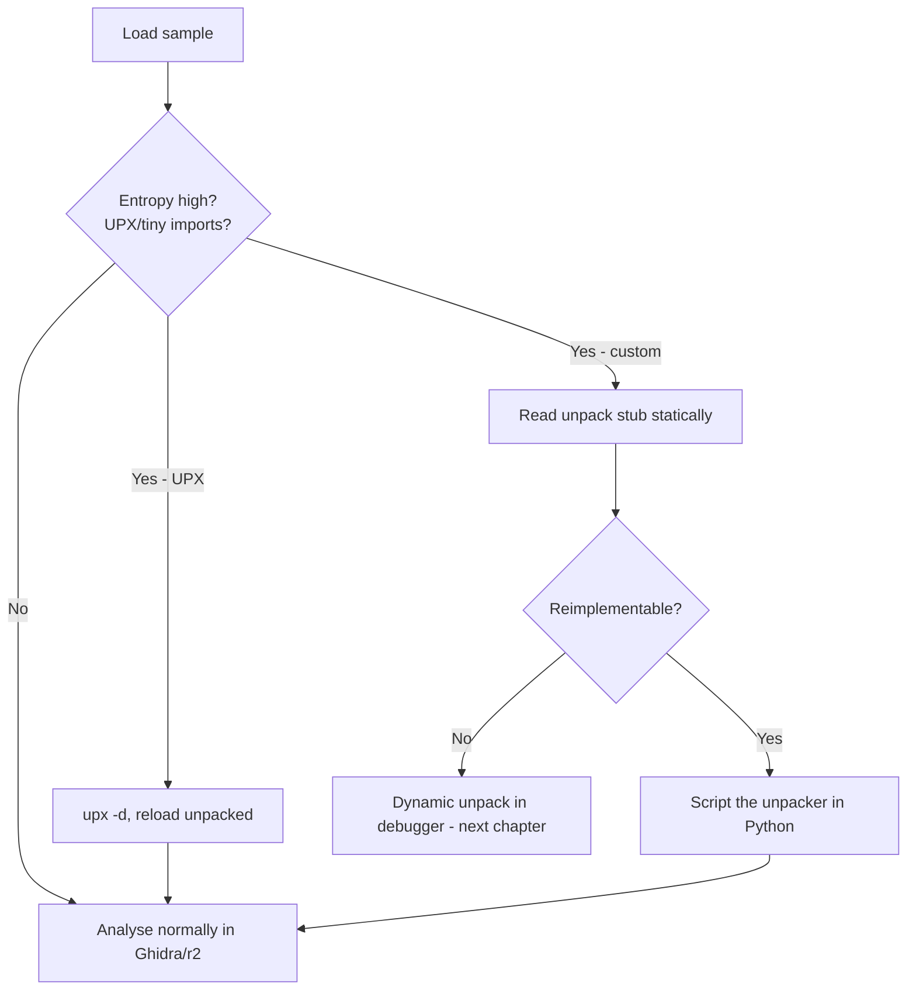

This is Chapter 5 of the Malware Analysis & Reverse Engineering notebook. The previous chapter taught you to *read* assembly — the register model, calling conventions, and the compiler idioms that turn C into machine code. That skill is the foundation, but reading a 4,000-instruction sample one `mov` at a time by hand is not how real analysis is done. This chapter gives you the tools that do the mechanical work for you: a **disassembler** that turns bytes into instructions and reconstructs the function graph, and a **decompiler** that lifts those instructions back into readable pseudo-C so you spend your attention on logic instead of bookkeeping.

Two platforms dominate open-source reverse engineering, and a working analyst uses both. **Ghidra** is the NSA's software reverse-engineering suite — a heavyweight, Java-based, multi-architecture platform whose decompiler is, for free tooling, the best in the world. **radare2** (with its Qt GUI, **Cutter**) is the fast, scriptable, terminal-native alternative that lives comfortably inside a headless analysis VM and automates beautifully. IDA Pro is the commercial gold standard, but it costs thousands of dollars a seat; everything you learn here transfers to it directly, because the concepts — functions, xrefs, the decompiler, types — are universal.

## Why This Matters

Static reverse engineering answers the questions that dynamic analysis cannot. Detonating a sample in a sandbox (Chapter 3) tells you what it did *this time, under these conditions*. The disassembler and decompiler tell you what it *can* do under every condition — including the branches that never fire in your sandbox because the sample checked for a debugger, a specific username, or a live C2 and quietly exited.

Concretely, this chapter's tools are what let you:

- **Extract configuration once, for a whole family.** Commodity malware stores C2 domains, RC4/XOR keys, campaign IDs, and mutex names as encrypted blobs. The decryption routine is a dozen lines of pseudo-C in the decompiler. Read it once, script it, and you decrypt the config for *every* sample of that family without ever running one.
- **Recover the algorithm.** Is that loop AES, RC4, ChaCha20, or homebrew XOR? The decompiler renders the S-box init and key schedule as recognisable C. Behaviour hides this; decompilation exposes it.
- **Analyse code that never touches disk.** Injected shellcode, unpacked stages carved from memory, exploit payloads — none of it has an installer or imports you can strings. It is raw bytes, and a disassembler is the only thing that makes raw bytes legible.
- **Reach a verdict on the ambiguous 30%.** The samples that are neither obviously benign nor obviously malicious are decided by reading what the code actually does — a decision you can only defend with disassembly evidence.
- **Write better detections.** Once you understand the sample's real behaviour and its stable code constants, you can author YARA rules on the decryption stub or Sigma rules on the exact API sequence, rather than on a hash that changes every build.

Everything in this chapter is **static and offline**. You are reading a binary, not running it. That is the single biggest safety advantage of reverse engineering: a disassembler never executes the sample, so a fully weaponised ransomware binary is as harmless in Ghidra as a text file. We still analyse inside an isolated VM (Chapter 1) out of discipline, but the risk profile here is fundamentally lower than dynamic analysis.

---

## Part 1: The Reverse-Engineering Toolchain — What Each Piece Does

Before installing anything, get the vocabulary straight, because the tools are named after the jobs they do and beginners routinely conflate them.

- **Disassembler** — turns raw machine-code bytes into human-readable assembly mnemonics (`55` → `push rbp`). This is a mechanical, mostly-deterministic transform, but *where* code starts and *where* one function ends and the next begins is genuinely hard (this is the "disassembly problem"), which is why tools disagree.
- **Decompiler** — a second, much harder stage that lifts assembly into pseudo-C: it recovers variables, control flow (`if`/`while`/`for`), function arguments, and expressions. The output is *never* the original source and *never* recompilable as-is; it is a readable approximation whose job is to save you from reading assembly. Ghidra's decompiler is the headline feature; radare2's decompiler support comes from plugins (Ghidra's own engine via `r2ghidra`, or Cutter's bundled decompiler).
- **Debugger** — runs the binary and lets you step, set breakpoints, and inspect live memory (GDB, x64dbg, WinDbg). This is *dynamic*. Ghidra and radare2 can both debug, but this chapter uses them purely statically; the next chapter covers debugging with x64dbg.
- **CFG (Control-Flow Graph)** — the diagram of basic blocks (straight-line instruction runs) and the branches between them. Both tools render this graph and it is the single most useful view for understanding a function.
- **Xref (cross-reference)** — a recorded link "instruction at A refers to address B" (a call, a jump, or a data read). Xrefs are how you answer "who calls this function?" and "what code touches this string?" — the two questions that drive almost all navigation.



The workflow is always the same regardless of tool: **load → auto-analyse → navigate from a known anchor → read the decompiler → correct the tool's guesses → script the tedious parts → produce IOCs.** The rest of this chapter is that loop, taught twice (Ghidra, then radare2/Cutter) and then fused into one lab.

---

## Part 2: Ghidra — Install, Projects, and the CodeBrowser

### 2.1 What Ghidra is and why analysts trust it

Ghidra is a Java desktop application released by the NSA in 2019. Its defining features are:

- A **decompiler** that produces genuinely readable C-like pseudocode across every architecture it supports (x86/x64, ARM/AArch64, MIPS, PowerPC, SPARC, 68k, and dozens more via processor "SLEIGH" specs). Multi-architecture parity is its killer feature — the same decompiler quality on an ARM router implant as on a Windows x64 loader.
- A **project/program database** model: your renames, types, comments, and bookmarks are saved into a project, so analysis is durable and (with Ghidra Server) collaborative.
- A **headless analyzer** and a full **scripting API** (Java and Python via Jython, or Python 3 via PyGhidra) for batch analysis.
- It is **free and open source** (Apache 2.0), which is why it has become the default teaching and community-tooling platform.

### 2.2 Install on a Kali/analysis VM

Ghidra needs a Java Development Kit (JDK 17+). On Kali/Debian:

```bash
# 1. Install a JDK (Ghidra 11.x needs JDK 17 or newer)
sudo apt update
sudo apt install -y openjdk-21-jdk

# 2. Verify Java is on PATH and new enough
java -version
# openjdk version "21.0.x" ...   <- must be >= 17

# 3. Download Ghidra from the official GitHub releases (verify the SHA-256)
#    (offline VMs: transfer the zip in via a read-only share)
cd /opt
sudo unzip ~/Downloads/ghidra_11.x_PUBLIC_*.zip
sudo mv ghidra_11.x_PUBLIC ghidra

# 4. Launch the GUI
/opt/ghidra/ghidraRun
```

Flag/step notes:

- `openjdk-21-jdk` — the full JDK, not just the JRE; Ghidra bundles a native launcher but needs a real JDK to run and (for some features) compile SLEIGH.
- `java -version` prints to **stderr**, which is normal — don't be confused if it looks "empty" when you redirect stdout.
- `ghidraRun` is the GUI launcher (`ghidraRun.bat` on Windows). `analyzeHeadless` (same folder, `support/`) is the batch launcher used in Part 6.

**Safe-handling note:** Ghidra is static; it does not execute your sample. You can and should analyse live malware in it. The only caveat is Ghidra's own *debugger* feature (which does run the target) and the rare case of a malicious file crafted to exploit a loader parser bug — both reasons we still keep the analysis VM isolated per Chapter 1.

### 2.3 Projects, importing, and auto-analysis

Ghidra organises work into **projects** (a folder of one or more imported programs plus their analysis databases).

```
Ghidra project workflow:
  File → New Project → Non-Shared Project → name it "malware-triage"
  File → Import File... → select sample.exe
        Ghidra detects format (PE) + language (x86:LE:64:default) + compiler (Visual Studio)
  Double-click the imported program → opens the CodeBrowser
  On first open Ghidra prompts: "Analyze now?" → Yes → Analysis Options dialog
```

The **Analysis Options** dialog is where a lot of quality is decided. The defaults are sensible, but know what the important analysers do:

| Analyzer | What it does | When to change it |
|---|---|---|
| Function ID | Fingerprints known library functions (statically-linked CRT, etc.) so you don't reverse `memcpy` | Keep on; grab extra FID databases for more libs |
| Decompiler Parameter ID | Recovers function argument counts/types from decompilation | Keep on — big readability win |
| Aggressive Instruction Finder | Disassembles gaps heuristically | Turn **on** for stripped/packed code, **off** if it creates garbage functions |
| Demangler (GNU/Microsoft) | Turns `?foo@@YAXH@Z` back into `void foo(int)` | Keep on for C++ samples |
| Shared Return Calls | Improves detection of thunks/tail calls | Keep on |
| Windows x86 PE RTTI | Recovers C++ class names from RTTI | Keep on for C++ malware — recovers vtables/classes |

Auto-analysis on a small binary takes seconds; on a large statically-linked Go or Rust sample it can take minutes and produce thousands of functions. When it finishes, the **Symbol Tree** (left) lists functions/imports/exports, the **Listing** (centre) shows disassembly, and the **Decompile** window (right) shows pseudo-C for the current function.



### 2.4 The three panes you live in

- **Symbol Tree** — expand **Functions** to browse everything Ghidra found; **Imports** shows the DLLs/APIs the sample links (your fastest capability read: `InternetOpenUrlA`, `CryptEncrypt`, `VirtualAllocEx` each tell a story); **Exports** and **Labels** round it out.
- **Listing** — the disassembly, with addresses, bytes, mnemonics, auto-comments, and inline xref annotations. Press `G` to go to an address, `L` to rename the thing under the cursor.
- **Decompiler** — the pseudo-C. This is where you spend most of your time. It is *linked* to the Listing: click a line in one and the other follows. Renaming a variable here renames it everywhere.

---

## Part 3: Ghidra Navigation, Cross-References, and the Decompiler

Auto-analysis gives you a map with no landmarks labelled. Navigation is the craft of starting from something you *do* understand and following references outward until the picture resolves.

### 3.1 The three anchors: entry, imports, strings

You almost never start reading at `main` (in a stripped binary you may not even know where it is). You start from an **anchor** — a known-meaningful location — and use xrefs to climb toward the interesting logic.

1. **Imports.** In the Symbol Tree, expand **Imports**. Suspicious APIs are your fastest lead. Right-click an import → **Show References to** (`Ctrl+Shift+F`) to jump to every call site. If `CreateProcessW` is imported and called once, that call site is where the sample spawns something — go read it.
2. **Strings.** `Window → Defined Strings` lists every string. Double-click one (say a suspicious URL or a registry path), then in the Listing press `Ctrl+Shift+F` on it to find the code that references it. A hardcoded `\\.\pipe\` or `SOFTWARE\Microsoft\Windows\CurrentVersion\Run` string leads you straight to persistence or C2 code.
3. **Entry / exports.** `entry` is the real start (before `main`, this is CRT startup for C programs). For DLLs, read the exports and `DllMain`.

### 3.2 Cross-references are the whole game

An xref answers "who touches this?" Ghidra tracks two directions:

- **References to** (Xref-to): everything that points *at* the current address. "Who calls this function?" "What code reads this global?" Shortcut: `Ctrl+Shift+F`.
- **References from** (Xref-from): everything the current instruction points at.

The universal navigation loop is: land on an interesting API or string → **References to** → pick the calling function → read its decompilation → find *its* callers with **References to** on the function name → repeat until you reach a function whose purpose (config decrypt, C2 beacon, file encrypt) is clear.



### 3.3 Reading the decompiler — and distrusting it correctly

The decompiler output is a *model*, not ground truth. It is right the vast majority of the time and confidently wrong a meaningful minority of the time. You must read it with the assembly in your peripheral vision.

A raw first-pass decompilation typically looks like this:

```c
undefined8 FUN_140001240(longlong param_1)
{
  int iVar1;
  undefined4 local_18;
  char local_14 [8];

  local_18 = 0;
  while (local_18 < 0x20) {
    local_14[local_18] = *(char *)(param_1 + local_18) ^ 0x5a;
    local_18 = local_18 + 1;
  }
  iVar1 = FUN_140001560(local_14);
  return CONCAT44(extraout_var, iVar1);
}
```

Everything is named `FUN_`, `local_`, `param_`, `Var`. Your job is to convert this into meaning. Reading it: a 0x20-byte loop XORing a source buffer with `0x5A` into a local buffer, then passing the result to another function. That is a **32-byte XOR-0x5A string decryptor**. Note the leads: the constant `0x5a`, the length `0x20`, the fact that the output is immediately used as an argument. Now you rename.

Common decompiler artifacts to recognise and not be spooked by:

| Artifact | What it means | What to do |
|---|---|---|
| `undefinedN`, `undefined8` | Ghidra doesn't know the type/size yet | Retype the variable (`Ctrl+L`) once you know it |
| `uVar1`, `iVar2`, `local_38` | Auto-named temporaries/locals | Rename (`L`) as meaning emerges |
| `CONCAT44`, `SUB84`, `ZEXT` | Bit-slicing pseudo-ops from register mismatches | Usually cosmetic; often disappear after retyping |
| `in_EAX`, `extraout_EDX`, `unaff_` | Ghidra lost track of a register's origin | Check calling convention / missing prototype |
| `(code *)` calls, `(*pcVar)()` | Indirect/vtable call | Set the function pointer type or find the target via xrefs |
| A function that "returns" but shouldn't | Missing `noreturn` on `ExitProcess`-like calls | Mark the callee `noreturn` |

### 3.4 Making the database readable: rename, retype, comment

These four actions are 90% of interactive RE. Practise them until they are muscle memory.

- **Rename (`L`)** — put the cursor on a `FUN_`, `local_`, `DAT_`, or parameter and press `L`. Name the XOR routine `decrypt_string`, the loop counter `i`, the buffer `plaintext`. Names propagate everywhere via the symbol table.
- **Retype (`Ctrl+L`)** — change a variable's type. Turn `undefined8` into `char *`, `int`, or a struct you define. Retyping a parameter to the right pointer type frequently *collapses* a wall of `*(int *)(param_1 + 0x10)` arithmetic into clean `param_1->field_10` once you apply a struct.
- **Set function signature (`F`)** — fix a function's prototype (return type + argument types/names). Getting the callee's signature right cleans up every caller.
- **Comment** — `;` for an end-of-line (EOL) comment, or the Comments dialog for plate/pre/post comments. Leave a breadcrumb every time you figure something out.

Applying that to the example above:

```c
// after renaming FUN_140001240 -> decrypt_config_string, param_1 -> ciphertext,
// local_14 -> plaintext, and retyping:
int decrypt_config_string(char *ciphertext)
{
  int i;
  char plaintext [8];   // (note: 0x20 bytes actually copied - fix the array size too)

  for (i = 0; i < 0x20; i = i + 1) {
    plaintext[i] = ciphertext[i] ^ 0x5a;
  }
  return use_decrypted(plaintext);
}
```

That is now a sentence you can put in a report: *"`decrypt_config_string` XORs 32 bytes of ciphertext against key byte `0x5A`."*

### 3.5 Structs, enums, and vtables

The single biggest readability leap on real malware is defining **structures**. When you see repeated `*(undefined4 *)(param_1 + 0x08)`, `*(undefined8 *)(param_1 + 0x10)` accesses, `param_1` is a pointer to a struct and those offsets are fields.

- `Data Type Manager` (bottom-left) → right-click your program archive → **New → Structure**. Add fields at the right offsets, then retype the pointer (`Ctrl+L`) to `MyStruct *`. Instantly, `param_1->c2_host` replaces `*(undefined8 *)(param_1 + 0x10)`.
- **Enums** make flag/constant checks legible: define an enum for message opcodes or `dwCreationFlags` and Ghidra shows `CREATE_SUSPENDED` instead of `0x4`.
- **Ghidra ships Windows type libraries.** `File → Parse C Source` (or the bundled `windows_vs*` data type archives) gives you `HANDLE`, `STARTUPINFOW`, `PROCESS_INFORMATION`, etc., so API calls decompile with named struct fields for free.

### 3.6 A worked navigation example — from an import to the beacon

To make the loop concrete, walk a hypothetical (but very typical) Windows loader end to end:

1. Open **Imports**. You see `WinHttpConnect`, `WinHttpSendRequest`, `CryptStringToBinaryA`, `VirtualAlloc`, and `CreateThread`. The WinHTTP pair says "this thing talks HTTP to a server"; that is the highest-value lead.
2. Select `WinHttpConnect` → `Ctrl+Shift+F` (**References to**). One call site, inside `FUN_140002a10`. Double-click it.
3. The decompiler for `FUN_140002a10` shows a string being passed as the server name — but it is a local built up from another call, `FUN_140001240`, a few lines above. That callee is your config decryptor (the exact `XOR 0x5a` shape from 3.3).
4. Rename `FUN_140002a10` → `beacon`, `FUN_140001240` → `decrypt_config_string`. Comment the WinHTTP call `; C2 request built from decrypted host`.
5. Now `Ctrl+Shift+F` on `beacon` itself: its single caller is a thread start routine, whose caller is `WinMain`. You have reconstructed the call chain `WinMain → start_beacon_thread → beacon → decrypt_config_string` in five clicks, and you know precisely where the C2 host comes from — without running anything.

That five-step climb, repeated with different anchors, is the entirety of manual reverse engineering. Everything else (types, scripting, diffing) is amplification of this core loop.

---

## Part 4: radare2 — The Command-Line Reverse Engineering Framework

radare2 (r2) is a different philosophy: a Unix-style, keyboard-driven, endlessly scriptable framework built from many small commands with a terse, systematic syntax. It runs headless over SSH, embeds in pipelines, and starts instantly. The learning curve is real, but the command language is *regular* — once you learn how commands are constructed you can guess most of them.

### 4.1 Install

```bash
# Recommended: install from source via the official updater (keeps r2 current)
git clone https://github.com/radareorg/radare2
cd radare2
sys/install.sh          # builds and installs r2 + all tools

# Verify
r2 -v
# radare2 5.x.x ...

# Optional but strongly recommended for malware work: the Ghidra decompiler in r2
r2pm init        # initialise the package manager
r2pm update
r2pm -ci r2ghidra   # 'pdg' command = Ghidra decompiler inside r2
```

- `sys/install.sh` builds a "symlink" install so `git pull && sys/install.sh` upgrades cleanly. Distro packages of r2 are often badly outdated — build from source.
- `r2pm` is r2's plugin/package manager; `-ci` = clean install. `r2ghidra` gives you Ghidra-quality decompilation from the `pdg` command without opening the Ghidra GUI — the best of both tools in a terminal.

### 4.2 The r2 command language

r2 commands read like a tiny sentence: a letter for the subsystem, then sub-letters to refine, then a modifier suffix. Learn the roots and you can compose the rest.

| Root | Subsystem | Example | Meaning |
|---|---|---|---|
| `a` | analysis | `aaa` | analyse all (functions, xrefs, strings) |
| `p` | print | `pd 20` | print-disassemble 20 instructions |
| `pdf` | print disasm function | `pdf` | disassemble the current function |
| `pdg` | print decompile (ghidra) | `pdg` | decompile current function (needs r2ghidra) |
| `s` | seek | `s main` | move the cursor to `main` |
| `f` | flags | `f` | list flags (named addresses) |
| `i` | info | `ii` | list imports |
| `iz` / `izz` | strings | `izz` | strings in the whole file |
| `ax` | xrefs | `axt sym.foo` | xrefs *to* foo |
| `V` | visual mode | `VV` | visual graph (CFG) |
| `/` | search | `/x 5a5a` | search for bytes |

Suffix modifiers compose with almost everything:

- `?` — help for that command (`ax?`, `p?`). This is how you learn r2: append `?`.
- `j` — JSON output (`aflj`, `pdfj`) — the key to scripting.
- `q` — quiet/terse output.
- `*` — output as r2 commands (for scripting/replay).
- `~` — internal grep (`ii~Internet` filters imports to those containing "Internet"). `~` is r2's built-in pipe.

### 4.3 A first session, annotated

```bash
$ r2 -A sample.exe        # -A runs 'aaa' (full analysis) on load
```

```
[0x140001500]> ie          # print entrypoint
[Entrypoints]
vaddr=0x140001500 ...

[0x140001500]> aflj~{}     # list all functions as pretty JSON (or 'afl' for a table)
[0x140001500]> afl~decrypt # functions whose name contains 'decrypt'
0x140001240  1  84  sym.decrypt_config_string

[0x140001500]> ii~Crypt    # imports containing 'Crypt'
ordinal=012 ... CryptAcquireContextW
ordinal=013 ... CryptEncrypt

[0x140001500]> izz~http    # every string containing 'http'
0x00003a10 26 26 (.rdata) ascii http://45.77.x.x/gate.php

[0x140001500]> axt @ 0x00003a10   # who references that URL string?
sym.beacon 0x1400013f0 [DATA] lea rax, [0x00003a10]

[0x140001500]> s sym.beacon ; pdf   # seek to the caller and disassemble it
[0x140001500]> pdg                  # ...or decompile it with the Ghidra engine
```

- `-A` on the command line is equivalent to typing `aaa` after load — always analyse before navigating.
- `axt @ addr` = cross-references **t**o an address. `axf` = references **f**rom. This is the exact analogue of Ghidra's "References to/from."
- Chaining with `;` runs multiple commands on one line; `@` is the "at this address, temporarily" modifier — enormously powerful (`pdf @ sym.beacon` disassembles beacon without moving your cursor).

### 4.4 Visual and graph modes

r2's TUI is fast once your fingers learn it.

- `V` enters visual mode (a live disassembly view); press `p`/`P` to cycle print modes, arrow keys/`hjkl` to move, `:` to run a normal command, `q` to leave.
- `VV` enters the **graph** (CFG) view — the r2 equivalent of Ghidra's function graph. Navigate blocks with `hjkl`, follow a call with the cursor, `q` to back out. For understanding branch-heavy logic, the graph beats linear disassembly every time.
- Inside visual mode, `d` opens a "define" menu (rename, set type), `;` adds a comment — the same rename/comment discipline as Ghidra.



---

## Part 5: Cutter — radare2 with a GUI

Not everyone wants to live in a terminal, and some tasks (skimming a big CFG, eyeballing hex next to disasm) are simply faster with a mouse. **Cutter** is the official Qt front-end for radare2 (later builds ship on the "rizin" backend, a radare2 fork; the workflow is identical). It gives you Ghidra-style panes over the r2 engine, with a decompiler (via r2ghidra or the native decompiler), a graph view, hex editor, and a built-in Python console that talks straight to the engine.

### 5.1 Install and first open

```bash
# Easiest cross-distro: the official AppImage
chmod +x Cutter-v2.x-Linux-x86_64.AppImage
./Cutter-v2.x-Linux-x86_64.AppImage

# Or via package managers on some distros:
# sudo apt install cutter        (may be older)
# flatpak install flathub re.rizin.cutter
```

On launch, **Open File → select the sample →** the analysis dialog lets you choose analysis depth (equivalent to `aa`/`aaa`) and load options (map at a chosen base, treat as raw, pick architecture for a blob). Choose full analysis for a normal PE/ELF.

### 5.2 The layout and where the decompiler lives

Cutter's default workspace mirrors what you now know:

- **Functions** panel (left) — the r2 `afl` list, searchable.
- **Disassembly / Graph** (centre) — toggle linear vs. CFG; identical information to `pdf`/`VV`.
- **Decompiler** panel — shows `pdg` (Ghidra) or the native decompiler output for the selected function. Enable r2ghidra in **Preferences → Decompiler** for the best output.
- **Strings**, **Imports/Exports**, **Sections**, **Flags**, **Hexdump** panels — each a GUI over the corresponding r2 command.
- **Console** (bottom) — a real r2 prompt. Anything you learned in Part 4 works here, and its output updates the GUI. This is Cutter's superpower: GUI convenience without losing the command language.

Renaming (`N` on a symbol), commenting (`;`), and cross-references (right-click → **Show X-Refs**) all work as in Ghidra, so muscle memory transfers. For malware triage many analysts run **Ghidra for deep decompilation** and **Cutter/r2 for fast scripted extraction** — and this chapter's lab does exactly that.

### 5.4 The Python console — GUI plus automation in one place

Cutter embeds a Python interpreter (`Windows → Python Console`) with a live `cutter` object bridging to the engine, so you can run an r2 command and act on its result without leaving the GUI:

```python
# inside Cutter's Python console
import cutter
funcs = cutter.cmdj("aflj")                      # every function as JSON
big = [f for f in funcs if f["size"] > 400]      # unusually large funcs = likely the meat
for f in sorted(big, key=lambda x: -x["size"])[:5]:
    print(hex(f["offset"]), f["size"], f["name"])
cutter.cmd("s " + hex(big[0]["offset"]))         # jump the whole GUI to the biggest function
```

This is the pragmatic reason Cutter earns a place next to Ghidra: it is a GUI when you want to *look*, and a scripting host when you want to *filter*, in the same window. The same `cmd`/`cmdj` pattern is what r2pipe uses headlessly in Part 6 — learn it once, use it everywhere.

### 5.3 When to reach for which tool

| Situation | Best tool | Why |
|---|---|---|
| Deep read of a complex function, best decompiler | Ghidra | Superior decompiler, struct/type system, durable database |
| Headless/SSH-only analysis VM | radare2 | No GUI needed, instant startup |
| Bulk config extraction across 500 samples | radare2 + r2pipe | Scriptable, JSON output, fast |
| Skim a big CFG with a mouse; hex+disasm side by side | Cutter | GUI over the r2 engine |
| Diffing two variants | Ghidra (Version Tracking) or radiff2 | Both strong; radiff2 scripts |
| Collaborative team analysis | Ghidra Server | Shared project database |
| ARM/MIPS firmware where IDA lacks a decompiler | Ghidra | Best free multi-arch decompiler |

---

## Part 6: Scripting — Headless Ghidra and r2pipe

Interactive analysis is for one sample. Real intelligence value comes when you *automate* — decrypt the config for every sample of a family, or triage a folder of 300 files unattended. Both platforms are fully scriptable.

### 6.1 r2pipe — driving radare2 from Python

`r2pipe` opens an r2 session, sends commands, and returns their output (as text, or parsed JSON with the `j` suffix). It is the cleanest way to script RE.

```bash
pip install r2pipe --break-system-packages
```

```python
#!/usr/bin/env python3
# extract_xor_config.py - decrypt a known 0x20-byte XOR-0x5A config blob
# from every PE in a directory, statically (never runs the sample).
import r2pipe, os, sys, json

XOR_KEY = 0x5a
BLOB_LEN = 0x20

def extract(path):
    r2 = r2pipe.open(path, flags=["-2"])   # -2 = silence stderr
    r2.cmd("aaa")                          # full analysis
    # find the string flag/section holding the ciphertext; here we locate the
    # blob by an xref from the decrypt routine we already reverse-engineered.
    # p8 <len> @ addr  -> print <len> bytes as hex at address
    blob_hex = r2.cmd(f"p8 {BLOB_LEN} @ sym.config_blob").strip()
    r2.quit()
    if not blob_hex:
        return None
    data = bytes.fromhex(blob_hex)
    plain = bytes(b ^ XOR_KEY for b in data)
    return plain.rstrip(b"\x00").decode("latin-1")

if __name__ == "__main__":
    folder = sys.argv[1]
    results = {}
    for name in os.listdir(folder):
        p = os.path.join(folder, name)
        try:
            cfg = extract(p)
            if cfg:
                results[name] = cfg
        except Exception as e:
            results[name] = f"ERROR: {e}"
    print(json.dumps(results, indent=2))
```

```
$ python3 extract_xor_config.py ./samples/
{
  "a1b2c3.bin": "http://45.77.x.x/gate.php",
  "d4e5f6.bin": "http://cdn.evil-update.net/api",
  "0099aa.bin": "ERROR: symbol sym.config_blob not found"
}
```

- `r2pipe.open(path, flags=[...])` starts a headless r2. Passing `-2` silences stderr so JSON parsing stays clean.
- `r2.cmd("...")` returns raw text; `r2.cmdj("aflj")` returns parsed JSON directly — prefer `cmdj` whenever you need structured data.
- `p8 N @ addr` dumps N bytes as hex — the workhorse for pulling encrypted blobs out statically. The whole point: you decrypted the config for three samples **without executing any of them**.

### 6.2 Ghidra headless analyzer

Ghidra ships `analyzeHeadless` for unattended, GUI-less analysis — import a binary, run a post-analysis script, export results.

```bash
# Syntax: analyzeHeadless <projectDir> <projectName> -import <file> -postScript <script>
/opt/ghidra/support/analyzeHeadless \
    /tmp/ghidra-proj triage \
    -import /samples/sample.exe \
    -postScript DumpStrings.java \
    -deleteProject          # discard the project after (batch mode)
```

- `-import` loads and auto-analyses the file. `-postScript` runs your script after analysis (there is a `-preScript` too). `-deleteProject` keeps batch runs from piling up databases.
- Scripts live in your `ghidra_scripts` folder and are written in Java or Python. A trivial Python (PyGhidra/Jython) post-script that walks functions and prints those calling `CryptEncrypt`:

```python
# FindCryptCallers.py  (Ghidra Python post-script)
fm = currentProgram.getFunctionManager()
listing = currentProgram.getListing()
target = "CryptEncrypt"
for func in fm.getFunctions(True):
    body = listing.getInstructions(func.getBody(), True)
    for insn in body:
        if insn.getMnemonicString() == "CALL":
            ref = insn.getPrimaryReference(0)
            if ref and target in str(ref.getToAddress()):
                print("%s calls %s" % (func.getName(), target))
                break
```

For most malware-triage scripting, **r2pipe is faster to write and iterate on**; reach for headless Ghidra when you specifically need its decompiler output or its type system inside the automation.

---

## Part 7: Hard Cases — Stripped, Statically-Linked, Packed, and Obfuscated

Real samples fight back. Here is how each obstacle presents and what to do about it *statically*.

### 7.1 Stripped binaries

A **stripped** binary has had its symbol table removed: no function names, no `main`, everything is `FUN_`/`fcn.`. This is the normal case for malware and for release Linux ELFs.

- You lose *names*, not *code*. Auto-analysis still recovers functions and xrefs. Navigate from imports and strings (Part 3.1), which strip cannot remove from a dynamically-linked binary.
- **FLIRT/Function ID**: Ghidra's Function ID (and IDA's FLIRT) can re-identify statically-linked library functions by signature, restoring names like `strcpy`/`malloc` so you don't waste time reversing the CRT.
- Recover `main` on stripped ELF: it is the first argument pushed to `__libc_start_main` in `entry` — read the entry stub, and the address loaded into `rdi`/`rcx` (arg1) is `main`.

### 7.2 Statically-linked Go / Rust

Go and Rust binaries are huge (thousands of functions) because the whole runtime is baked in.

- **Go**: strings and the `pclntab` (function-line table) often survive and carry original function names (`main.main`, package paths). Ghidra scripts and tools like `GolangAnalyzerExtension` parse `pclntab` to restore names and types. Look for `runtime.` functions to orient.
- **Rust**: mangled symbols (if present) demangle to reveal crate/module paths; panic strings and format strings are excellent anchors.

### 7.3 Packed samples

A **packer** (UPX, or custom) compresses/encrypts the real code and prepends a small unpacking stub. Statically, you will see: a tiny amount of real code, one or two huge high-entropy sections, imports reduced to `LoadLibrary`/`GetProcAddress`/`VirtualAlloc`, and the decompiler producing nonsense past the stub because there is no real code there yet.

Detection cues (also from Chapter 2's static analysis):

- High section entropy (~7.9/8.0), section names like `UPX0`/`UPX1`, tiny import table, raw size ≫ virtual size mismatch.

Handling, statically vs. dynamically:

- **UPX** is trivially reversible statically: `upx -d packed.exe -o unpacked.exe`, then load `unpacked.exe` into Ghidra.
- **Custom packers** usually require *dynamic* unpacking — run to the "OEP" (original entry point) in a debugger and dump memory. That is the next chapter's material (x64dbg). Statically, you can still read the unpacking stub itself to understand the algorithm, and sometimes reimplement it in Python to unpack offline.



### 7.4 Anti-disassembly and obfuscation

Malware authors deliberately break tools:

- **Junk bytes / opaque predicates**: a `jmp` into the middle of an instruction, or an always-true branch guarding garbage, desynchronises the linear disassembler. Ghidra's recursive-descent handles most of this; where it fails, manually undefine (`U`) the bad bytes and redefine (`D`) instructions at the correct boundary.
- **Control-flow flattening** (common with obfuscators like OLLVM): the natural `if/while` structure is replaced by a giant dispatcher `switch` on a state variable, so the decompiler shows one huge `while(1){ switch(state){...} }`. You de-flatten by tracing state transitions — tedious but tractable, and there are Ghidra scripts to help.
- **String/API-name encryption**: strings are XOR/RC4'd and decrypted at runtime; API names are resolved by hash (Chapter 4's API hashing). Statically, find the decrypt routine, script it (Part 6), and recover all strings; for API hashing, precompute the hash of every Win32 export name and match.

---

## Part 8: Comparing Binaries — Diffing Variants

You will frequently get "the new variant" of a family you already reversed. Diffing tells you *what changed* so you re-reverse only the delta.

- **radiff2** (ships with r2) diffs two binaries at byte, function, or graph level:

```bash
# High-level: which functions match, changed, or are new between two variants
radiff2 -A -C old_variant.exe new_variant.exe
# -A = analyse both;  -C = show a table of matched functions + similarity %

# Byte-level delta (patch-style)
radiff2 old.bin new.bin

# Graph diff of one function (visual)
radiff2 -A -g sym.beacon old.exe new.exe | xdot -
```

Output of `-C` looks like a table of `MATCH`/`UNMATCH` with a similarity column; functions at 100% you can ignore, functions at 60–95% are where the author changed logic (new C2, new anti-analysis check) — read those.

- **Ghidra Version Tracking** does the same interactively with far richer matching (by name, signature, bytes, and structure), letting you *port* your old names/comments onto the new sample automatically, so you keep years of accumulated analysis. `Tools → Version Tracking`.
- **BinDiff** (free, from Google/Zynamics) is the classic function-matching tool and integrates with Ghidra exports — the industry standard for "same author?" and patch-diffing (finding the fixed bug in a security patch by diffing pre/post binaries).

A practical diffing workflow when a "new variant" lands: run `radiff2 -A -C old new` first for a 10-second overview of how much changed. If 95% of functions match at 100%, this is a *config-only* rebuild — the code is identical and only the encrypted blob differs, so re-run your Part 6 extraction script and you are done in minutes. If several functions dropped to 60–90% similarity, the author changed real logic; open those specific functions in Ghidra Version Tracking, accept the high-confidence matches to port your old names/comments across, and hand-read only the genuinely new code. This is how a team keeps up with a family that ships weekly builds without re-reversing from zero each time.

| Tool | Granularity | Best for |
|---|---|---|
| `radiff2 -C` | Function match table | Quick scripted "what's new" |
| `radiff2` (bytes) | Byte patches | Config-only variants, small patches |
| Ghidra Version Tracking | Function + port annotations | Carrying names/comments to a new variant |
| BinDiff | Function graph matching | Patch diffing, authorship, large binaries |

---

## Part 9: Detection & Defense Angle

Reverse engineering is primarily an *offensive-analysis* skill, but its entire purpose in a blue-team/IR context is to produce durable detections and answer incident questions. This is the one consolidated defense section (per the notebook style); offensive relevance is woven through the earlier parts.

**From decompilation to YARA.** The most valuable YARA rules key on *code that is expensive for the author to change*, not on hashes (which change every build). Once Ghidra shows you the decryption stub, the exact byte pattern of that stub — the `xor ... 0x5a` loop, a distinctive constant array, an RC4 key-schedule — becomes a robust signature. Copy the bytes from the Listing (`Bytes` view) and templatise them, wildcarding the operands that vary:

```yara
rule Loader_XOR5A_config_decrypt
{
    meta:
        author = "analyst"
        description = "XOR-0x5A 32-byte config decrypt stub seen across the family"
    strings:
        // mov al,[rdx+rcx]; xor al,0x5A; mov [rbx+rcx],al; inc rcx; cmp rcx,20h
        $stub = { 8A 04 0A 34 5A 88 04 0B 48 FF C1 48 83 F9 20 }
    condition:
        uint16(0) == 0x5A4D and $stub
}
```

Because that stub is the *mechanism*, it catches recompiled and repacked variants that a hash never would.

**From code to Sigma/EDR logic.** Your static read tells you the *sequence* of Win32 calls the sample makes — e.g. `VirtualAllocEx` → `WriteProcessMemory` → `CreateRemoteThread` (classic process injection). That maps directly to MITRE ATT&CK **T1055** and to a Sigma/EDR rule on that API/telemetry sequence. Static RE gives you the ground truth to write the rule *precisely*, without waiting to observe every behaviour dynamically.

**IOC extraction for the SOC.** The C2 domains, mutex names, registry keys, user-agent strings, and campaign IDs you recover from decrypted config (Part 6) are exactly the network/host IOCs the SOC blocks and hunts on — and static extraction yields them for samples that would never call home in a sandbox.

**Verifying a patch actually fixes a bug.** Blue teams and vulnerability researchers diff a patched binary against its predecessor (Part 8) to locate and understand the fixed code path — confirming the fix, and sometimes revealing the vulnerability the vendor didn't disclose.

**Bug-bounty / CTF relevance.** Reverse-engineering CTF challenges are pure Ghidra/r2 practice: `pico`CTF and HTB "Reversing" categories hand you a stripped binary with a hidden `check_password`/`validate_flag` routine, and the whole task is decompile → read the check → derive the input. In bug bounty, RE shows up when you get a thick client, a mobile app (decompile the native `.so`), or an obfuscated JS bundle — the same navigation loop (find the interesting function, read it, understand the check) applies.

---

## Part 10: Hands-On Lab — Reversing a Stack-String Loader in Ghidra and radare2

This lab reverses a small, realistic loader that hides its C2 URL as a **stack string** built byte-by-byte (a common evasion that defeats `strings`) and then "decrypts" its config with a single-byte XOR. You will build the sample from source (so it is safe and reproducible), then reverse it as if you'd never seen the source — first in Ghidra, then in radare2 — and finally script the extraction. Everything here is static; the binary is never run as part of analysis.

### 10.1 Build the target (lab setup only)

Save as `loader.c` and compile in your lab VM. In real analysis you'd receive only the binary; we compile it purely to have a known-answer target.

```c
// loader.c  -- benign stand-in for a stack-string + XOR-config loader.
// It prints instead of connecting, so it is completely safe to build/run.
#include <stdio.h>
#include <string.h>

// "http://45.77.10.20/gate.php" XORed byte-by-byte with 0x5A, stored as data.
static unsigned char enc_c2[] = {
  0x32,0x2e,0x2e,0x2a,0x62,0x75,0x75,0x6e,0x6b,0x6a,0x6c,0x6a,
  0x6f,0x6a,0x6b,0x74,0x62,0x3b,0x3e,0x2d,0x3a,0x2f,0x3a,0x3a,0x00
};

static void build_and_print_c2(void) {
    unsigned char out[64];
    int i;
    for (i = 0; enc_c2[i] != 0x00; i++)
        out[i] = enc_c2[i] ^ 0x5A;   // single-byte XOR "decrypt"
    out[i] = 0;
    printf("[loader] resolved C2: %s\n", out);
}

int main(void) {
    // stack string: build "RUN" marker one char at a time to dodge `strings`
    char marker[4];
    marker[0] = 'R'; marker[1] = 'U'; marker[2] = 'N'; marker[3] = 0;
    printf("[loader] marker=%s\n", marker);
    build_and_print_c2();
    return 0;
}
```

```bash
gcc -O1 -o loader loader.c        # -O1 so the compiler emits realistic, non-trivial code
strings loader | grep -i http     # <-- prints NOTHING: the URL is XOR-encrypted, not plaintext
file loader
# loader: ELF 64-bit LSB pie executable, x86-64 ...
```

The `strings` miss is the whole point: the C2 is not recoverable with naive tooling. We recover it by *reversing the decrypt routine*.

### 10.2 Ghidra pass

```
1. New Project "re-lab" -> Import File -> loader -> Analyze (defaults) -> Yes.
2. Symbol Tree -> Functions -> double-click 'main'.
```

The decompiler shows something close to:

```c
undefined8 main(void)
{
  char local_14 [4];
  
  local_14[0] = 'R';
  local_14[1] = 'U';
  local_14[2] = 'N';
  local_14[3] = '\0';
  printf("[loader] marker=%s\n", local_14);
  build_and_print_c2();          // Ghidra names it FUN_00101169 until you rename
  return 0;
}
```

The four single-byte writes to consecutive stack offsets are the **stack-string** idiom — recognise it on sight. Now double-click into `FUN_00101169`:

```c
void FUN_00101169(void)
{
  int i;
  byte local_58 [64];
  
  i = 0;
  while (enc_c2[i] != 0) {
    local_58[i] = enc_c2[i] ^ 0x5a;   // <-- the decrypt: single-byte XOR 0x5A
    i = i + 1;
  }
  local_58[i] = 0;
  printf("[loader] resolved C2: %s\n",local_58);
}
```

Analysis actions to take, in order:

1. Rename `FUN_00101169` → `decrypt_and_print_c2` (`L`).
2. Rename `local_58` → `c2_url`, `i` stays `i`.
3. Note the two constants that make this recognisable and scriptable: **key `0x5a`** and the **source array `enc_c2`** (double-click it to jump to its bytes in the Listing).
4. In the Listing, select the `enc_c2` bytes → you can read the ciphertext directly. XOR each by `0x5A` mentally or by script to confirm `http://45.77.10.20/gate.php`.

You have now recovered, statically, a C2 that `strings` could not see, and you know the exact algorithm (`XOR 0x5A`) and data location — everything needed to script bulk extraction.

### 10.3 radare2 pass (same target, terminal workflow)

```bash
$ r2 -A loader
```

```
[0x000010a0]> afl~main            # find main
0x00101189    1 60  main

[0x000010a0]> s main; pdf         # disassemble main
... you'll see the byte stores 'R','U','N' and a call to sym.build_and_print_c2 ...

[0x000010a0]> pdg @ sym.build_and_print_c2   # decompile the interesting function (r2ghidra)
void sym.build_and_print_c2(void) {
    ...
    while (obj.enc_c2[i] != 0) {
        out[i] = obj.enc_c2[i] ^ 0x5a;
        ...
```

Now pull the ciphertext bytes straight out (r2 has no built-in XOR-and-print, so we grab bytes and decode in Python next):

```
[0x000010a0]> is~enc_c2           # find the symbol/address of the encrypted blob
... obj.enc_c2 addr=0x00104020 ...

[0x000010a0]> p8 24 @ obj.enc_c2  # print 24 ciphertext bytes as hex
322e2e2a6275756e6b6a6c6a6f6a6b74623b3e2d3a2f3a3a
```

- `is~enc_c2` filters the symbol table to our blob; `p8 24 @ addr` prints 24 bytes as hex from it. XOR that hex with `0x5A` (next step) and you get the URL.

### 10.4 Script the extraction (r2pipe, fully offline)

```python
#!/usr/bin/env python3
# solve_loader.py -- statically extract the C2 from the loader, never running it.
import r2pipe

r2 = r2pipe.open("loader", flags=["-2"])
r2.cmd("aaa")
# locate the encrypted blob symbol and read its bytes
addr = r2.cmd("is~enc_c2").split("addr=")[1].split()[0]  # e.g. 0x00104020
hexstr = r2.cmd(f"p8 24 @ {addr}").strip()
r2.quit()

cipher = bytes.fromhex(hexstr)
plain = bytes(b ^ 0x5A for b in cipher).rstrip(b"\x00")
print("Recovered C2:", plain.decode())
```

```
$ python3 solve_loader.py
Recovered C2: http://45.77.10.20/gate.php
```

You reversed the algorithm by hand in two tools, then encoded that understanding into a script that will recover the C2 from *every* build of this loader — the exact leverage that makes static RE worth the effort.

### 10.5 Lab extensions

- Recompile with `-O2` and `-O3` and re-reverse: watch the loop get unrolled/vectorised and practise recognising the optimiser idioms from Chapter 4 inside the decompiler.
- Strip the binary (`strip loader`) and redo the Ghidra pass — you lose the `main`/`build_and_print_c2` names and must navigate from `printf` xrefs and the `entry` stub instead.
- Change the XOR key and the URL, rebuild, and confirm your `solve_loader.py` still works unchanged (proving you scripted the *mechanism*, not the *sample*).

---

## Part 11: Common Pitfalls and How to Avoid Them

| Pitfall | Symptom | Fix |
|---|---|---|
| Trusting the decompiler blindly | Confident pseudo-C that contradicts behaviour | Cross-check against the Listing/assembly; retype until the C is sane |
| Reading linearly from the top | Hours lost in CRT startup and library code | Navigate from imports/strings + xrefs, not from `entry` |
| Ignoring `undefined`/`CONCAT` noise | Illegible output you "can't read" | Fix function signatures and variable types first — noise collapses |
| Not renaming as you go | Re-deriving the same function three times | Rename/comment immediately; the database is your memory |
| Wrong calling convention/prototype | `in_EAX`, missing args, garbage params | Set the function signature (`F` in Ghidra); confirm args in a debugger once |
| Assuming a packed sample is "empty" | Decompiler shows garbage past the stub | Detect the packer (entropy/imports), unpack (UPX static, custom dynamic) first |
| Analysing a stripped Go binary as tiny | Thousands of `fcn.` with no names | Restore names via pclntab tooling; anchor on `runtime.`/strings |
| Editing the only copy of the sample | Accidental modification of evidence | Work on a hash-verified copy; keep the original read-only (Chapter 1/2 hygiene) |
| Letting r2 auto-analysis be too shallow | Missing functions/xrefs | Use `aaa` (or `aaaa` for deeper); for gaps, `aac`/`aar` to add calls/refs |
| Confusing `day`-style ordering with logic | Reading functions in address order | Read in *call* order from an anchor; address order is meaningless |
| Forgetting the base address on a raw blob | Xrefs/addresses look wrong for shellcode | Load with the correct map base (`-B`/`-m` in r2, "map at" in Ghidra) |
| Renaming in the decompiler but not saving | Lost annotations after a crash | Save the Ghidra project often; r2 projects via `Ps <file>` |

---

## Part 12: Final Revision / Summary

- **Disassembler vs. decompiler vs. debugger.** Disassembler = bytes→assembly; decompiler = assembly→pseudo-C (a model, not source); debugger = runs it (next chapter). This chapter is purely static — the disassembler never executes the sample, which is why RE is inherently safer than sandboxing.
- **Ghidra** is the free decompiler king: project database, best multi-arch pseudo-C, rich type/struct system, headless mode, Java/Python scripting. Install a JDK 17+, import, auto-analyse, then live in the Symbol Tree / Listing / Decompiler triad.
- **radare2** is the scriptable terminal framework: regular command language (`a` analyse, `p` print, `s` seek, `ax` xrefs, `i` info, `V`/`VV` visual/graph), `?` for help, `j` for JSON, `~` to grep. Add `r2ghidra` for `pdg` decompilation.
- **Cutter** puts a Qt GUI over the r2 engine — Ghidra-style panes, a decompiler, and a live r2 console — for when a mouse is faster.
- **Navigation is xref-driven.** Start from an anchor (import, string, entry), follow **References to** until a function's purpose is clear. This loop is identical in every RE tool including IDA.
- **Make it readable.** Rename (`L`), retype (`Ctrl+L`), set signatures (`F`), define structs/enums, and comment relentlessly. Readability is the actual work; understanding follows.
- **Script the tedium.** r2pipe and headless Ghidra turn a one-sample read into family-wide config extraction — all offline.
- **Hard cases have playbooks.** Stripped → anchor on imports/strings + FID; static Go/Rust → pclntab/demangle; packed → detect (entropy/imports), UPX static-unpacks, custom needs dynamic; obfuscated → undefine/redefine, de-flatten, script string/API decryption.
- **Diffing** (`radiff2 -C`, Ghidra Version Tracking, BinDiff) re-reverses only the delta between variants and ports your annotations forward.
- **Defense payoff.** Decompilation yields code-based YARA (the decrypt stub), precise ATT&CK-mapped Sigma/EDR logic (the API sequence), and config-derived IOCs the SOC can block — all from static analysis.

---

## Part 13: Cheat Sheet / Quick Reference

**Ghidra key actions (CodeBrowser):**

| Action | Shortcut | Notes |
|---|---|---|
| Go to address/symbol | `G` | Then type address or name |
| Rename label/var/function | `L` | The single most-used key |
| Retype variable | `Ctrl+L` | `undefined8` → `char *`, struct, etc. |
| Edit function signature | `F` | Fix return type + args |
| References to (xrefs) | `Ctrl+Shift+F` | "Who touches this?" |
| Defined Strings window | `Window → Defined Strings` | Anchor for navigation |
| Add EOL comment | `;` | Leave breadcrumbs |
| Undefine / re-disassemble | `U` / `D` | Fix anti-disasm boundaries |
| Function graph | `Window → Function Graph` | CFG view |

**radare2 essential commands:**

| Command | Meaning |
|---|---|
| `r2 -A file` | open + full analysis (`aaa`) |
| `aaa` / `aaaa` | analyse all / deeper |
| `afl` / `afl~name` | list functions / filter |
| `s sym.foo` | seek to symbol |
| `pdf` / `pdg` | disasm function / decompile (r2ghidra) |
| `axt @ addr` / `axf` | xrefs to / from |
| `ii` / `ie` / `iz` / `izz` | imports / entrypoints / strings(.data) / strings(all) |
| `p8 N @ addr` | print N bytes as hex |
| `VV` / `V` | visual graph / visual mode |
| `cmd~grep` / `cmdj` | internal grep / JSON output |
| `<cmd>?` | help for a command |
| `radiff2 -A -C a b` | function-level diff of two binaries |

**Triage flow (either tool):** load → analyse → Imports (capability) → Strings (leads) → xref to the interesting ones → read/rename the containing functions → find the crypto/config/C2 routine → script extraction → produce IOCs + YARA.

**Packer quick-check:** high entropy (~7.9), `UPX*` sections or tiny import table (`LoadLibrary`/`GetProcAddress`/`VirtualAlloc` only) ⇒ packed. `upx -d` for UPX; dynamic dump for custom.

---

## Part 14: Practice Labs & Resources

Train this chapter's exact skill — decompile, navigate, extract — on progressively harder targets:

- **picoCTF — Reverse Engineering category.** Start here: `GDB baby step`, `ARMssembly`, `Transformation`, `keygenme`-style challenges are pure "decompile and read the check" tasks perfect for a first Ghidra/r2 run.
- **TryHackMe — "Intro to Malware Analysis", "Reversing ELF", "Windows Reversing Intro", "Advent of Cyber (RE days)".** Guided rooms that walk Ghidra and r2 workflows on realistic samples.
- **HackTheBox — Reversing challenges** (`Find The Easy Pass`, `Baby RE`, `Bypass`, up through the harder "obfuscated"/"packed" ones). The HTB "Intro to Reverse Engineering" and "Malware Analysis" Academy modules use Ghidra/x64dbg directly.
- **crackmes.one** — a huge graded archive of keygen/patch-me binaries across difficulties and architectures; the canonical place to drill decompilation and de-obfuscation.
- **Ghidra's own bundled sample projects** and the **"Ghidra Book" (The Ghidra Book: The Definitive Guide)** exercises for the type/struct system and scripting.
- **radare2 book (`book.rada.re`)** and the built-in `r2` tutorials — work through the command language until `?`-driven discovery is second nature.
- **MalwareTech / MalwareUnicorn "RE101 & RE102" workshops** — free, hands-on, malware-focused reversing courses using free tooling.
- **pwn.college — "Reverse Engineering" module** for a rigorous, exercise-driven progression from stripped binaries to obfuscation.
- **Real (defanged) samples:** practise config extraction on well-documented commodity families using **MalwareBazaar** (abuse.ch) samples *inside an isolated lab only*, cross-referencing public analyses to check your work.

The next chapter moves from static reading to **dynamic** reverse engineering: driving a live Windows sample under **x64dbg**, setting breakpoints on the very decrypt routines you learned to *read* here, and dumping unpacked payloads from memory — the technique that cracks the custom-packed samples this chapter could only read statically.
