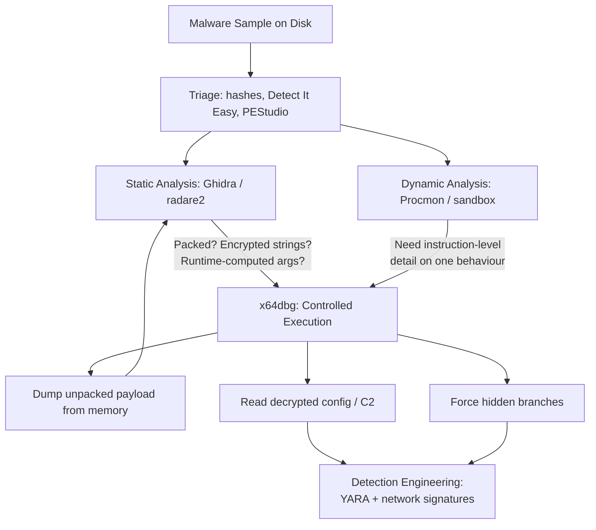
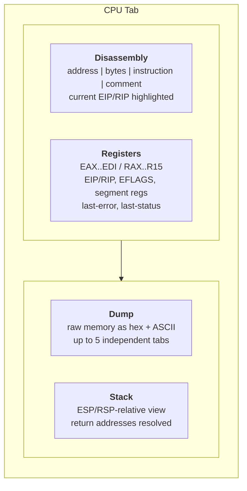
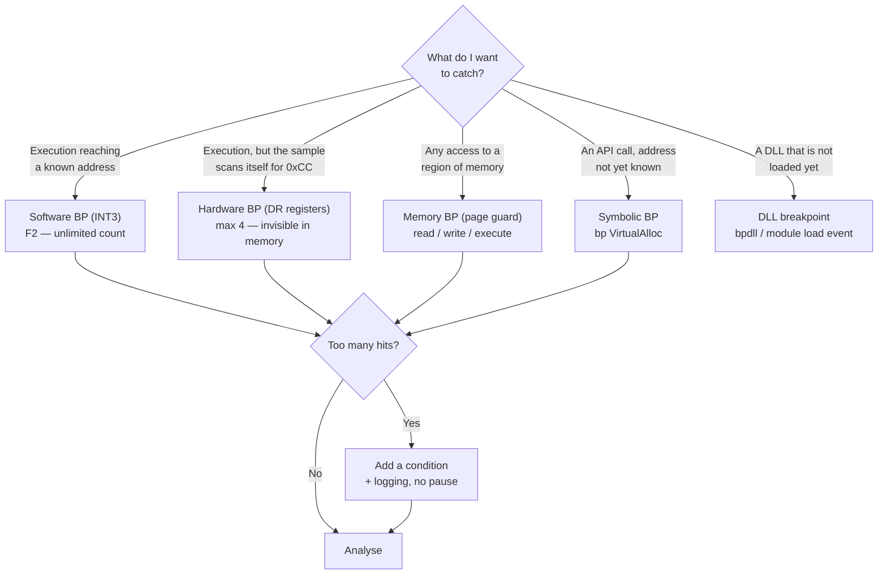
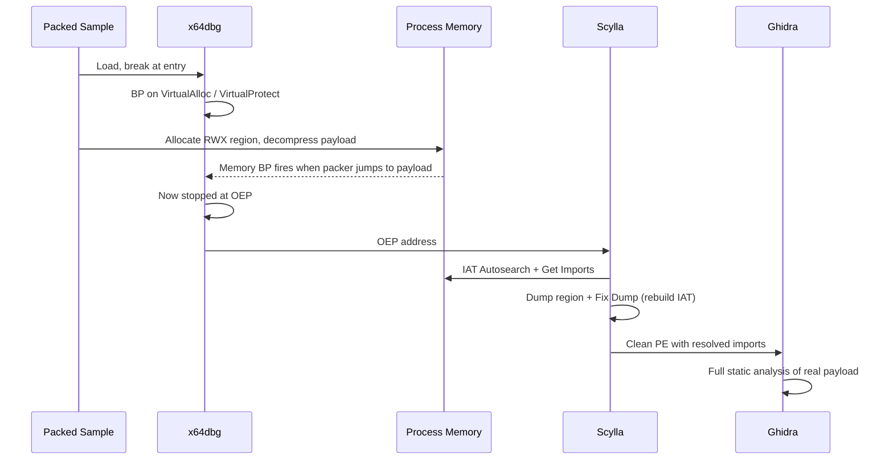
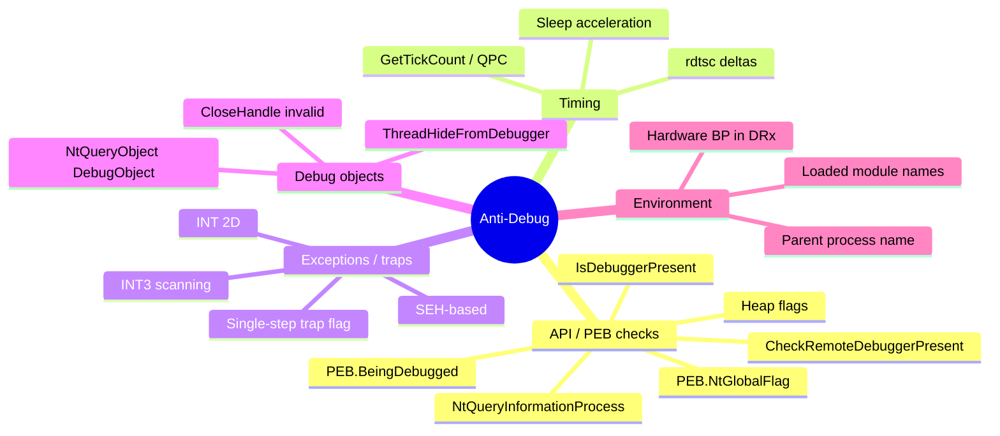
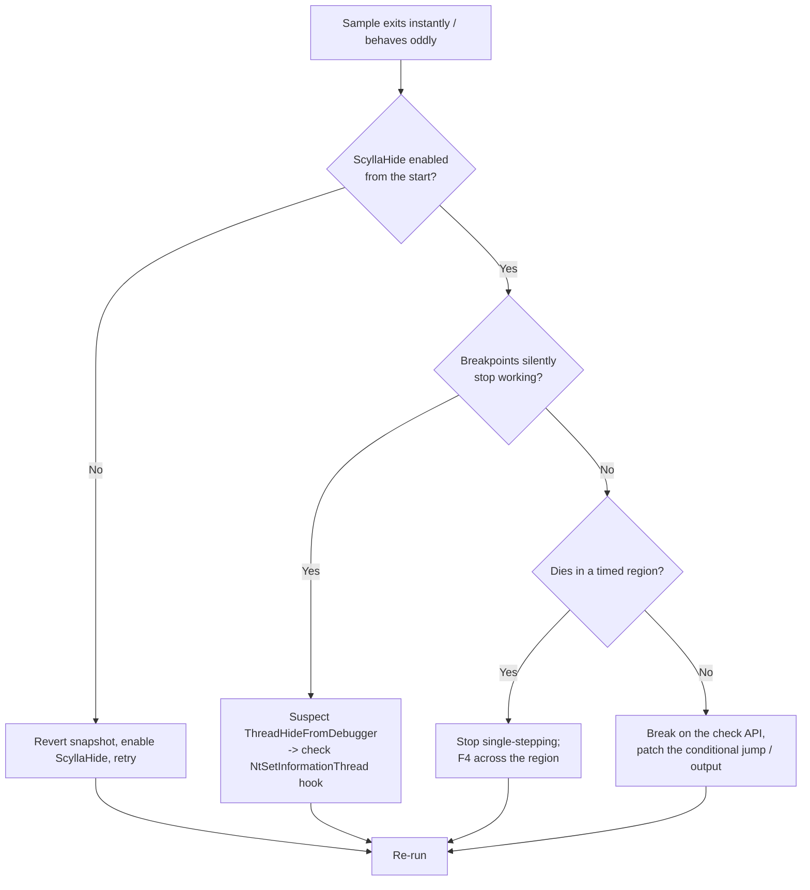

**Level:** Expert · **Track:** Malware Analysis & RE · **Read time:** 260 min

This is Chapter 6 of the Malware Analysis & Reverse Engineering notebook. Chapter 5 gave you the static toolchain — Ghidra's decompiler and radare2's analysis engine — which reconstructs a program's full logical shape without ever running it. This chapter adds the other half of the analyst's hands: a **debugger**, which runs the sample under your complete control and lets you stop it on any instruction, read any byte of its memory, change any register, and watch encrypted blobs turn into plaintext in front of you.

The tool is **x64dbg** — the open-source, actively maintained, x86/x64 user-mode debugger that has become the default for Windows malware work. Everything here assumes the isolated analysis VM you built in Chapter 1: no host shares, no network unless you deliberately route it through a fake-services box, and a snapshot you revert to after every detonation.

## Why This Matters

Static analysis has a hard ceiling, and packing is where it hits. A modern commodity loader is a few hundred bytes of real logic wrapped in a decompressor: the code Ghidra shows you is the *unpacker*, and the actual malware does not exist as instructions anywhere on disk. It exists only after the unpacker has allocated memory, decompressed into it, and jumped there. No amount of static skill recovers what is not in the file.

A debugger solves this by letting the program build itself and then freezing it at the moment it is complete. This is the single most valuable technique in practical malware analysis, and it generalises far beyond packers:

- **Encrypted strings and configs.** The sample carries an RC4 blob and a key derivation routine. Statically you would reimplement the crypto. In a debugger you set a breakpoint after the decrypt call and read the plaintext out of the dump pane in about ten seconds.
- **API calls with computed arguments.** `CreateProcessW` is called with a command line assembled at runtime from four fragments. Static analysis gives you the fragments; the debugger gives you the final string.
- **Branches that never fire in a sandbox.** Chapter 3's dynamic analysis showed you one execution path. The debugger lets you *force* the other one — flip a zero flag, skip the VM check, and watch the sample take the branch it was hiding.
- **Verifying a decompiler's guess.** Ghidra's output is a reconstruction, not ground truth. When the pseudo-C looks wrong, single-stepping the real instructions settles it.

**Blue team usage:** debugging is how detection engineers derive high-fidelity signatures. A YARA rule written against a packed sample matches the packer and generates false positives across unrelated families; a rule written against the *unpacked* payload you dumped from memory matches the actual malware. The same applies to the network signature — you get the real C2 host, the real URI pattern, and the real user-agent, not a template.

**Red team usage:** the identical workflow, run against your own tooling, tells you exactly what an analyst will see. If your loader's config decrypts into a contiguous readable blob one breakpoint after `VirtualAlloc`, so will theirs.

Everything in this chapter stays lab-scoped. You are learning to take malware apart, not to build it — and every technique below is used defensively in real incident response every day.

## Part 1: Debuggers, Disassemblers, and Where x64dbg Fits

Before touching the tool, be precise about what a debugger *is*, because the mental model determines whether the rest of the chapter makes sense.

A **disassembler** (Chapter 5) is a static translator. It reads bytes from a file and prints instructions. It never executes anything. Its view of memory is the file's view: sections as they exist on disk, before the loader has applied relocations, before the imports are resolved, before a single byte of runtime allocation exists.

A **debugger** is a *controller for a live process*. It attaches to (or launches) a real running process and uses operating-system facilities to suspend it, inspect it, and resume it. On Windows those facilities are the Win32 debugging API: `DebugActiveProcess`, `WaitForDebugEvent`, `ContinueDebugEvent`, plus `ReadProcessMemory` / `WriteProcessMemory` and `GetThreadContext` / `SetThreadContext`. x64dbg is a friendly interface over exactly these calls.

The critical consequence: **in a debugger, memory is real.** A pointer in a register points at bytes you can actually read. A decrypted buffer exists. A dynamically resolved API address is a concrete number. This is why debugging beats static analysis for anything runtime-computed, and why static analysis beats debugging for anything that requires seeing the whole program at once.



Note the arrow from **F back to C**: dumping the unpacked payload and re-loading it into Ghidra is the standard loop. Debugger and disassembler are not alternatives, they are a cycle. You debug until you have real code, you statically analyse that code until you hit another runtime unknown, you go back to the debugger.

### The debugger landscape

| Tool | Type | Cost | Best for | Weakness |
|---|---|---|---|---|
| **x64dbg** | User-mode, x86 + x64 | Free, open source | Windows malware, unpacking, general RE | User-mode only; no kernel debugging |
| **OllyDbg 1.10** | User-mode, x86 only | Free (abandoned) | Legacy 32-bit samples, huge plugin archive | No x64, unmaintained since 2013 |
| **Immunity Debugger** | User-mode, x86 only | Free | Exploit dev (`mona.py`) | No x64, Python 2, stale |
| **WinDbg / WinDbg Preview** | User + kernel mode | Free (Microsoft) | Rootkits, drivers, crash dumps, kernel | Steep learning curve, command-driven |
| **IDA Pro debugger** | User + remote | Thousands of dollars | Integrated static+dynamic in one database | Cost |
| **GDB** | User-mode, cross-platform | Free | Linux/ELF (covered in Notebook 36) | Poor Windows/PE ergonomics |

For a Windows malware analyst in 2020s practice, x64dbg is the correct default. It handles both architectures, it is maintained, its plugin ecosystem solves the anti-debugging problem well (ScyllaHide), and its expression engine is powerful enough to script real instrumentation.

**Where x64dbg cannot go:** kernel-mode code. If your sample drops and loads a signed-but-vulnerable driver, or is itself a rootkit driver, x64dbg is blind to it — a user-mode debugger cannot set a breakpoint in `ntoskrnl` or in a loaded `.sys`. That is WinDbg territory with a kernel-debugging setup (host + target VM over a virtual serial pipe or network kernel debugging). Chapter 8 touches on when to escalate.

### x32dbg vs x64dbg

The download ships **two executables**, and confusing them is the most common beginner error:

- `x32dbg.exe` — debugs **32-bit** processes.
- `x64dbg.exe` — debugs **64-bit** processes.

There is also `x96dbg.exe`, a launcher that inspects the target PE and starts the correct one. Use it and stop worrying. If you open a 32-bit PE in `x64dbg.exe` you will get an error or, worse on some builds, a confusing partially-working session. Check the bitness first with Detect It Easy or:

```
C:\> python -c "import pefile,sys; p=pefile.PE(sys.argv[1]); print(hex(p.FILE_HEADER.Machine))" sample.bin
0x14c
```

`0x14c` = `IMAGE_FILE_MACHINE_I386` (32-bit). `0x8664` = `IMAGE_FILE_MACHINE_AMD64` (64-bit). Commodity malware is still overwhelmingly 32-bit, because 32-bit binaries run fine on 64-bit Windows via WoW64 and give the widest compatibility.

## Part 2: Installing and Configuring x64dbg

x64dbg is a portable application. There is no installer that writes to `Program Files` and no service; you unzip it and run it. That matters in an analysis VM, where a small, snapshot-friendly, dependency-free tool is exactly what you want.

### Getting the build

The official distribution is the snapshot ZIP from the project's GitHub releases. Grab it on your **host**, verify it, and copy it into the analysis VM through a one-way channel — never let the VM browse the internet.

```
# On the host, verify what you downloaded before it ever touches the VM
PS> Get-FileHash .\snapshot_2024-xx-xx.zip -Algorithm SHA256

Algorithm  Hash                                                              Path
---------  ----                                                              ----
SHA256     3F2C...A19B                                                       C:\dl\snapshot.zip
```

Compare against the hash published on the release page. This is not paranoia theatre: your analysis toolchain is a high-value target, and a trojaned debugger inside a VM that you then snapshot becomes permanent.

Extract to a short, space-free path — `C:\tools\x64dbg\`. Long paths with spaces break some plugins and make command-line invocation annoying.

```
C:\tools\x64dbg\
├── release\
│   ├── x96dbg.exe          <- the launcher; make a desktop shortcut to this
│   ├── x32\
│   │   ├── x32dbg.exe
│   │   ├── plugins\
│   │   ├── db\             <- per-sample databases live here
│   │   └── ...
│   └── x64\
│       ├── x64dbg.exe
│       ├── plugins\
│       ├── db\
│       └── ...
```

Run `x96dbg.exe` once as Administrator. It offers to register shell extensions (right-click → "Debug with x64dbg") and to install itself as the just-in-time debugger. In a disposable analysis VM both are convenient; on any machine you care about, decline the JIT registration.

### First-run settings that actually matter

Open **Options → Preferences**. The defaults are reasonable but four tabs need attention before you debug anything hostile.

**Events tab** — this controls where x64dbg pauses automatically. Defaults break on `System Breakpoint` and `Entry Breakpoint`, which is what you want, but the full list is worth understanding:

| Event | Default | What it means | When to change |
|---|---|---|---|
| System Breakpoint | On | `ntdll!LdrpDoDebuggerBreak` — fires before *any* of the target's code, while the loader is still initialising | Keep on. This is your earliest possible foothold. |
| Entry Breakpoint | On | The PE's `AddressOfEntryPoint` | Keep on for EXEs. Useless for DLL analysis. |
| TLS Callbacks | **Off** | Breaks on each TLS callback, which run **before** the entry point | **Turn ON.** Malware hides anti-debug and even full payloads in TLS callbacks specifically because analysts break at the entry point and arrive too late. |
| DLL Entry | Off | Breaks in every loaded DLL's `DllMain` | On when analysing an injected or loaded DLL. |
| Attach Breakpoint | On | Fires when you attach to a running process | Keep on. |
| DLL Load / DLL Unload | Off | Pause on every module load | Situationally useful to catch a dynamically loaded payload DLL. Noisy. |
| Thread Entry | Off | Pause when a new thread starts | Turn on when hunting a payload that runs on a spawned thread. |
| Debug Strings | Off | Pause on `OutputDebugString` | Rarely useful; some malware spams it as an anti-analysis annoyance. |

The **TLS callback** setting deserves emphasis because it is the classic beginner trap. A PE's TLS directory can list callback functions that the Windows loader invokes *before* `AddressOfEntryPoint`. If a sample checks `BeingDebugged` in a TLS callback and exits, and you only break on the entry point, the process dies before you ever see a single instruction and you have no idea why.

**Engine tab** — set *Default debug engine* to TitanEngine (the default) and enable "Enable Debug Privilege". Leave "Disable ASLR" alone by default; enabling it makes addresses stable between runs, which is enormously convenient for note-taking, but a small number of samples detect the resulting non-relocated layout. Turn it on when you want reproducible addresses, turn it off if the sample misbehaves.

**Exceptions tab** — decide which exceptions x64dbg handles versus passes to the debuggee. This becomes critical in Part 10: several anti-debug techniques deliberately raise exceptions and check whether their own handler was invoked. A debugger that swallows the exception fails the check.

**Misc tab** — set the "Symbol Store" to `https://msdl.microsoft.com/download/symbols` and a local cache path such as `C:\symbols`. Microsoft symbols turn `ntdll.7FF8A1C23400` into `ntdll.NtCreateFile`, which is the difference between readable and unreadable analysis. **In an offline VM this will fail** — so download the symbol packages you need on the host with `symchk` and copy the cache in:

```
REM Run on an internet-connected host, then copy C:\symbols into the VM
C:\> symchk /r C:\Windows\System32\ntdll.dll /s SRV*C:\symbols*https://msdl.microsoft.com/download/symbols

SYMCHK: FAILED files = 0
SYMCHK: PASSED + IGNORED files = 1
```

### Layout and the database

x64dbg saves everything you do to a per-sample **database**: comments, labels, bookmarks, breakpoints, and analysis. It lands in `db\<samplename>.dd32` or `.dd64`. This is your notebook — it survives closing the tool and reopening the sample.

Two habits pay off immediately:

1. **Comment as you go.** `;` on any instruction adds a comment; `:` adds a label. Six hours into a session you will not remember which of the four near-identical decrypt stubs was the config one.
2. **Back up the `.dd32` file** alongside your notes when you finish a sample. It is a plain JSON-ish blob and it is the only record of your reasoning.

## Part 3: The Interface — Every Pane and What It Tells You

x64dbg's main window is dominated by the **CPU tab**, which is four panes in a fixed arrangement. Learning to read all four simultaneously is the core skill; everything else is navigation.



### The disassembly pane (top-left)

Columns are address, opcode bytes, disassembled instruction, and comments. The current instruction pointer is highlighted, and x64dbg draws jump arrows in the left gutter showing branch targets within view — a filled arrow means the branch will be taken given the current flags, which is a genuinely useful at-a-glance signal.

Key behaviours:

- **Space** — assemble. Type a new instruction in place. This is how you patch, and how you NOP out an anti-debug check.
- **Ctrl+G** — go to expression. Accepts symbols (`ntdll.NtQueryInformationProcess`), raw addresses (`0x401000`), register expressions (`eax+4`), and module-relative addresses (`sample.401000`).
- **Enter** on a `call` or `jmp` — follow the target.
- **Backspace / `-`** — go back in navigation history. `+` goes forward.
- **F2** — toggle a software breakpoint.
- **Ctrl+F** — find pattern (hex, string, or instruction text) in the current module.
- **Right-click → Search for → All intermodular calls** — the single most useful triage view in the whole tool. It lists every call into another module, i.e. every API call. Start here on an unfamiliar sample.

**Analysis note:** x64dbg's own analyser (right-click → Analysis → Analyse module, or Ctrl+A) reconstructs functions and loops in the current module and improves the display considerably. Run it after unpacking, when the real code first appears.

### The registers pane (top-right)

General-purpose registers, the instruction pointer, the flags, and — usefully — decoded flag bits you can click to toggle. Two rows at the bottom are easy to miss and very valuable:

- **LastError** — the thread's last-error value, decoded (`ERROR_FILE_NOT_FOUND (0x00000002)`). Watching this after every API call tells you immediately when the sample's file/registry/network operations are failing, which is how you spot a sample that is silently going down an error path because your VM lacks something it expects.
- **LastStatus** — the NTSTATUS equivalent for native API calls.

Registers change colour when the value changed on the last step. Right-click any register to follow it in the dump, in the disassembly, or in the stack — this is the fastest way to inspect a pointer.

**Modifying a register** is a double-click and a typed value. This is how you force a branch: after a `test eax, eax` that is about to fail, set `EAX` to 1 and the subsequent `jz` will not be taken.

### The dump pane (bottom-left)

Raw memory. Five independent tabs (Dump 1–5) so you can watch several buffers at once — extremely useful when you have a ciphertext buffer, a key buffer, and an output buffer all in play.

The right-click **display format** menu is the point. The same bytes shown as ASCII, as UTF-16, as a disassembly, or as 4-byte integers tell completely different stories. Malware configs are frequently UTF-16 (Windows-native wide strings), and analysts miss them by leaving the dump on ASCII, where a wide string appears as `h.t.t.p.:././.` — recognisable once you know it, invisible if you do not.

To watch a decryption happen: put the ciphertext address in Dump 1, set a breakpoint after the decrypt loop, run, and read the plaintext.

### The stack pane (bottom-right)

Memory at `ESP`/`RSP`, formatted one pointer-width per row, with x64dbg annotating entries it recognises — return addresses get labelled with the calling function, and string pointers get their contents shown inline.

This is where you read function arguments in **32-bit** samples. Under `stdcall`/`cdecl`, arguments are pushed right-to-left, so when you are stopped at the first instruction of a callee, the stack reads:

```
0019FF70  004011A5  return to sample.004011A5
0019FF74  00403000  "C:\Users\Public\svc.exe"     <- arg 1
0019FF78  80000000  GENERIC_READ                  <- arg 2
0019FF7C  00000001  FILE_SHARE_READ               <- arg 3
```

In **64-bit** samples this changes completely and is the number-one source of confusion for analysts moving from 32-bit. The Microsoft x64 calling convention passes the first four integer arguments in **RCX, RDX, R8, R9**, floats in XMM0–XMM3, and only the fifth argument onward on the stack — above a mandatory 32-byte **shadow space** the caller must reserve. So for `CreateFileW` on x64:

| Argument | 32-bit (stdcall) | 64-bit (MS x64) |
|---|---|---|
| 1. lpFileName | `[esp+4]` | `RCX` |
| 2. dwDesiredAccess | `[esp+8]` | `RDX` |
| 3. dwShareMode | `[esp+0C]` | `R8` |
| 4. lpSecurityAttributes | `[esp+10]` | `R9` |
| 5. dwCreationDisposition | `[esp+14]` | `[rsp+28]` |
| 6. dwFlagsAndAttributes | `[esp+18]` | `[rsp+30]` |
| 7. hTemplateFile | `[esp+1C]` | `[rsp+38]` |

The `[rsp+28]` for argument five is `8` (return address) + `0x20` (shadow space). Memorise that offset; you will use it constantly.

### The other tabs

| Tab | Shortcut | Purpose |
|---|---|---|
| **Log** | Alt+L | Everything x64dbg has to say: module loads, breakpoint hits, exceptions, and — critically — output from logging breakpoints |
| **Breakpoints** | Alt+B | All breakpoints with type, condition, hit count; enable/disable/edit in bulk |
| **Memory Map** | Alt+M | Every committed region: base, size, protection, mapped module/section. **The unpacking pane.** |
| **Call Stack** | Alt+K | Unwound call chain — how did execution get here |
| **SEH** | — | Structured exception handler chain; matters for SEH-based anti-debug and obfuscation |
| **Script** | — | Built-in scripting engine (Part 8) |
| **Symbols** | — | Loaded modules and their exports; the place to find an API you want to break on |
| **Source** | — | Source-level debugging if PDBs are present. Never for malware; occasionally for your own tooling |
| **References** | Ctrl+R | Results of "find references to" searches |
| **Threads** | — | All threads, their entry points, and state. Essential for multi-threaded payloads |
| **Handles** | — | Open handles, and the window/TCP enumerations |
| **Trace** | — | Run-trace output (Part 4) |

The **Memory Map** deserves its own paragraph. It shows every committed region in the process with its protection flags. When a packer allocates memory and writes the unpacked payload into it, that allocation appears here as a new region — typically `PRV` (private), sized in round numbers, with protection that changes from `RW` to `RWX` or `RX` at the moment the unpacker finishes. Watching the memory map is how you find the payload without understanding a single line of the packer's logic.

## Part 4: Execution Control — Every Way to Move Forward

A debugger is worthless if you cannot move through the program at the right granularity. x64dbg gives you seven, and choosing correctly is most of the skill.

| Command | Key | Behaviour | Use when |
|---|---|---|---|
| **Step Into** | F7 | Execute one instruction. Enters `call` targets. | You want to see inside the function |
| **Step Over** | F8 | Execute one instruction; a `call` runs to completion and stops after it | The function is a known API or irrelevant |
| **Step Out** | Ctrl+F9 | Run until the current function returns | You stepped into something boring |
| **Run** | F9 | Resume until a breakpoint, exception, or exit | Normal execution |
| **Run to Selection** | F4 | Set a one-shot breakpoint at the cursor and run | Skip a long loop; the everyday workhorse |
| **Run to User Code** | Alt+F9 | Run until execution returns to a non-system module | You stepped into `ntdll` by accident |
| **Trace Into / Over** | Ctrl+Alt+F7 / F8 | Conditional tracing: step repeatedly until a condition is true | Automated hunting (below) |

**F8 vs F7 is the decision you make hundreds of times per session.** The rule: step over anything you already understand, step into anything that might contain the logic you are chasing. `call kernel32.lstrlenW` — F8. `call sample.00401320` where `00401320` is unknown — F7.

**The F7-into-a-system-DLL trap:** press F7 on a `call` to an API and you land inside `ntdll` or `kernel32`, hundreds of instructions from anything you care about. Alt+F9 ("Run to User Code") gets you back out immediately. Learn it now, because you will do this constantly.

**F4 is underrated.** Rather than pressing F8 four hundred times through a decompression loop, click the instruction after the loop and press F4. It sets an invisible one-shot breakpoint and runs. This one habit doubles your effective speed.

### Run-trace: recording execution

Sometimes you do not want to watch, you want a **log** of what happened. Run-trace records every executed instruction with register state into a file.

Start it from the menu (Trace → Start run trace) or from the command bar:

```
StartTraceRecording "C:\analysis\loader-trace.txt"
```

Then run normally. Stop with `StopTraceRecording`. The output is one line per instruction:

```
00401232 | 8B 45 FC              | mov eax, dword ptr ss:[ebp-4]   | eax=00000000 -> eax=0000002A
00401235 | 83 C0 01              | add eax, 1                      | eax=0000002A -> eax=0000002B
00401238 | 89 45 FC              | mov dword ptr ss:[ebp-4], eax   |
0040123B | 83 7D FC 10           | cmp dword ptr ss:[ebp-4], 10    |
0040123F | 7C F1                 | jl 401232                       |
```

**Warning:** run-trace is enormously expensive. A few million instructions produce a multi-gigabyte log and slow execution by orders of magnitude. Never enable it and press F9 on an unknown sample. Enable it for a bounded region: break at the start of the routine you care about, start the trace, F4 to the end of the routine, stop the trace.

### Conditional tracing

The most powerful and least-used feature in x64dbg. `Trace Into` with a **break condition** single-steps the program until an expression becomes true. It answers questions that breakpoints cannot, because the target address is unknown.

Open Trace → Conditional trace, or use the command bar:

```
; Trace until execution reaches memory that is NOT inside the sample's main module
; (i.e., until the packer jumps to freshly allocated memory) — a generic OEP finder
TraceIntoConditional !(eip >= sample:0 && eip < sample:0 + modsizeof(sample))
```

Other high-value conditions:

```
; Stop when EAX points at a readable buffer starting with "MZ"
TraceOverConditional  mem.read.word(eax) == 0x5A4D

; Stop as soon as any instruction writes to a specific address
; (a memory breakpoint is better here, but tracing gives you the full path)
TraceOverConditional  0

; Stop after N instructions, logging everything (bounded trace)
; set maximum trace count in Trace settings, e.g. 500000
```

Set the **maximum trace count** in the trace dialog (default 50,000) so a bad condition does not hang the session forever.

## Part 5: Breakpoints in Depth

Breakpoints are how you turn a debugger from a stepping tool into an instrumentation platform. x64dbg supports four fundamentally different mechanisms, and knowing which to use — and which are detectable — is expert-level knowledge.



### Software breakpoints (INT3)

**Key: F2.** x64dbg overwrites the first byte of the target instruction with `0xCC` (`INT 3`). When execution reaches it the CPU raises a breakpoint exception, the OS notifies the debugger, and x64dbg restores the original byte before showing you the stopped state.

- **Unlimited** in number.
- **Modify memory**, and therefore are **detectable**. A sample that computes a checksum over its own `.text` section, or simply reads a byte and compares it to `0xCC`, will notice.

```asm
; A trivially effective INT3 scanner malware actually uses
    mov  esi, offset start_of_code
    mov  ecx, code_length
scan_loop:
    lodsb                       ; AL = [ESI], ESI++
    cmp  al, 0CCh               ; is this an INT3?
    je   debugger_detected
    loop scan_loop
```

Against a sample doing this, use hardware breakpoints.

### Hardware breakpoints (debug registers)

**Key: right-click → Breakpoint → Hardware, or `bph <addr>`.** These use the x86 debug registers `DR0`–`DR3` (four addresses), `DR6` (status), and `DR7` (control). The CPU itself compares the address on every access — nothing in the process's memory changes.

- **Maximum four**, ever. This is a hard CPU limit.
- Can break on **execute, write, or read/write**, at 1/2/4/8-byte granularity.
- Invisible to memory scans — but **not undetectable**: a sample can read `DR0`–`DR7` via `GetThreadContext` on its own thread, or via an exception handler that inspects the `CONTEXT` structure it receives, and clear or check them.

```asm
; Anti-hardware-breakpoint via SEH — malware reads its own debug registers
    push offset handler
    push dword ptr fs:[0]
    mov  fs:[0], esp
    xor  eax, eax
    div  eax                    ; force a #DE exception -> handler runs
handler:
    mov  eax, [esp+0Ch]         ; EAX = CONTEXT*
    cmp  dword ptr [eax+04h], 0 ; CONTEXT.Dr0 != 0 ?
    jne  debugger_detected
```

ScyllaHide (Part 8) filters exactly this.

Command form:

```
bph 00401530             ; hardware execute breakpoint
bph 00403000, r, 4       ; break on 4-byte read at 403000
bph 00403000, w, 1       ; break on 1-byte write
bphc                     ; clear all hardware breakpoints
```

### Memory breakpoints (guard pages)

**Right-click in the dump → Breakpoint → Memory, Access/Write.** x64dbg sets `PAGE_GUARD` on the whole page containing the target, so the *first* access anywhere in that 4 KB page triggers.

- Granularity is a **page**, not a byte — expect spurious hits from unrelated data sharing the page.
- Not limited in count.
- Slower, because every hit is an exception the debugger must handle and re-arm.

The killer application: **finding the unpacked code without knowing anything about the packer.** Set a memory-execute breakpoint on the freshly `VirtualAlloc`'d region; the moment the packer jumps into it, you are at the payload's entry point.

### Symbolic and API breakpoints

You rarely know the address you want. You know the *function*. The command bar takes symbols directly:

```
bp VirtualAlloc               ; resolves in whatever module exports it
bp kernel32.CreateProcessW    ; module-qualified — safer, avoids forwarders
bp ntdll.NtCreateFile         ; native API — harder for malware to hook around
bp WriteProcessMemory
```

**Break on the native API, not the Win32 wrapper, when you want reliability.** `kernel32!CreateFileW` calls `ntdll!NtCreateFile`. A sample that resolves syscalls directly, or that uses a lower-level path, bypasses the kernel32 breakpoint entirely. `ntdll` is the last user-mode stop before the kernel, so breakpoints there catch everything short of direct syscall stubs.

**Direct syscalls** are the exception: modern loaders assemble `mov r10, rcx; mov eax, <SSN>; syscall` inline, skipping `ntdll` completely. Against those, no user-mode API breakpoint works, and you fall back to hardware breakpoints on the sample's own code, or to memory breakpoints on the buffers involved.

### The essential API breakpoint set

For triaging an unknown Windows sample, this set catches the overwhelming majority of interesting behaviour:

| Category | Breakpoints | What it reveals |
|---|---|---|
| **Memory / unpacking** | `VirtualAlloc`, `VirtualAllocEx`, `VirtualProtect`, `NtAllocateVirtualMemory`, `NtProtectVirtualMemory` | Where the payload will live; RWX transitions |
| **Process injection** | `WriteProcessMemory`, `CreateRemoteThread`, `NtMapViewOfSection`, `QueueUserAPC`, `SetThreadContext`, `NtUnmapViewOfSection` | Hollowing, APC injection, mapping injection |
| **Process creation** | `CreateProcessW`, `CreateProcessInternalW`, `ShellExecuteExW`, `WinExec` | Child processes, LOLBin abuse, suspended-process hollowing |
| **Filesystem** | `CreateFileW`, `WriteFile`, `MoveFileExW`, `DeleteFileW` | Dropped payloads, staging directories |
| **Registry / persistence** | `RegSetValueExW`, `RegCreateKeyExW`, `NtSetValueKey` | Run keys, service configs |
| **Network** | `InternetOpenUrlW`, `HttpSendRequestW`, `WinHttpSendRequest`, `send`, `connect`, `getaddrinfo` | C2 addresses, beacon structure |
| **Crypto** | `CryptDecrypt`, `CryptEncrypt`, `BCryptDecrypt`, `CryptStringToBinaryA` | Config decryption, ransomware key handling |
| **String building** | `lstrcatW`, `wsprintfW`, `StrStrIW` | Runtime-assembled commands and URLs |
| **Anti-analysis** | `IsDebuggerPresent`, `NtQueryInformationProcess`, `GetTickCount`, `CreateToolhelp32Snapshot`, `OutputDebugStringA` | Evasion checks to neutralise |

Set them in one go from the command bar, one per line, or in a script (Part 8).

### Conditional and logging breakpoints — the real power

A breakpoint that pauses on every one of 4,000 hits is useless. x64dbg lets each breakpoint carry a **condition**, a **log expression**, and a **command**, so it becomes a filter and an instrumentation probe.

Open the Breakpoints tab, right-click a breakpoint → Edit. Four fields:

| Field | Meaning |
|---|---|
| **Break Condition** | Expression; pause only when non-zero. Empty = always pause. |
| **Log Text** | Written to the Log tab on every hit. `{...}` interpolates expressions. |
| **Log Condition** | Log only when this is non-zero |
| **Command Text** | An x64dbg command executed on hit (e.g. `run`, `StepOut`) |

The pattern that solves most problems: **condition `0` (never pause) + a log expression**. The program runs at near-full speed while the debugger writes a trace of exactly the data you want.

**Example — log every `VirtualAlloc` and its result without stopping:**

Set `bp VirtualAlloc`, then edit it:

- Break Condition: `0`
- Log Text: `VirtualAlloc size={[esp+8]} protect={[esp+10]} from={[esp]}`

On a 64-bit target the arguments are in registers instead:

- Log Text: `VirtualAlloc addr={rcx} size={rdx} type={r8} protect={r9}`

The Log tab then fills with:

```
VirtualAlloc addr=0000000000000000 size=0000000000010000 type=0000000000003000 protect=0000000000000040
VirtualAlloc addr=0000000000000000 size=0000000000002800 type=0000000000001000 protect=0000000000000004
```

`protect=0x40` is `PAGE_EXECUTE_READWRITE` — a 64 KB RWX allocation is the payload buffer, and you now know its size before it is even written.

**Example — pause only on the interesting call.** A sample calls `CreateFileW` ninety times on legitimate paths and once on its dropped payload. Break Condition:

```
strstr(utf16([esp+4]), "AppData") != 0
```

**Example — capture only outbound `send()` calls larger than 100 bytes:**

- Break Condition: `[esp+0C] > 100`
- Log Text: `send {[esp+0C]} bytes: {utf8([esp+8])}`

**Example — count without stopping.** Set condition `0`, log text `hit {$breakpointcounter}`, and read the total from the Breakpoints tab's hit-count column afterwards. Useful for deciding whether a routine is a one-shot initialiser or a per-packet handler.

## Part 6: The Expression Engine and Command Bar

Every field that takes an address in x64dbg — Go To, breakpoint addresses, conditions, log text, dump navigation — actually takes an **expression**. Learning the expression language turns the debugger from a clicking tool into a small programmable instrument, and it is the foundation the scripting engine is built on.

### Operands

| Kind | Example | Meaning |
|---|---|---|
| Register | `eax`, `rcx`, `rip`, `esp` | Current value |
| Sub-register | `al`, `ax`, `r8d`, `r8w` | Byte/word/dword slices |
| Flag | `_zf`, `_cf`, `_of` | Single flag bit as 0/1 |
| Constant | `0x401000`, `42`, `-1` | Hex (default) or decimal with `.` suffix (`42.`) |
| Symbol | `kernel32.VirtualAlloc`, `ntdll.NtCreateFile` | Resolved address |
| Module base | `sample:0`, `kernel32:0` | Base address of a module |
| Label | `myloop` | A label you defined with `:` |

### Memory dereference

Square brackets read memory. This is the workhorse:

```
[esp]           ; pointer-width read at ESP  (4 bytes on x32, 8 on x64)
[esp+8]         ; second stack slot
byte:[eax]      ; explicit 1-byte read
word:[eax]      ; 2-byte
dword:[eax]     ; 4-byte
[[esp+8]]       ; double dereference: follow the pointer at esp+8, read what it points to
```

### Built-in functions

x64dbg ships a large function library usable inside any expression. The ones that earn their keep in daily analysis:

| Function | Returns |
|---|---|
| `mem.read.byte(addr)` / `.word` / `.dword` / `.qword` | Sized memory read (same as `byte:[addr]` etc.) |
| `mem.valid(addr)` | 1 if the address is readable — guard before dereferencing |
| `mem.base(addr)` / `mem.size(addr)` | Base/size of the memory region containing `addr` |
| `disasm.imm(addr)` | The immediate operand of the instruction at `addr` |
| `mod.base(addr)` / `mod.party(addr)` | Module base; whether module is user (0) or system (1) |
| `strstr(str, "x")` | Substring search — returns match position or 0 |
| `utf8(addr)` / `utf16(addr)` | Read a string for interpolation into log text |
| `func.start(addr)` / `func.end(addr)` | Bounds of the analysed function containing `addr` |
| `bswap(x)` | Byte-swap — flip endianness of a value |

`mod.party` is quietly essential: `mod.party(eip) == 0` means "we are in the sample's own code, not a system DLL", the exact condition behind "Run to User Code" and behind generic OEP-finding trace conditions.

### The command bar

The box at the bottom of the window is a full command interface — the same commands the scripting engine uses. A few dozen commands cover nearly everything; here are the ones you type by hand constantly:

```
bp VirtualAlloc                 ; set software breakpoint on a symbol
bp 0x401000                     ; ...on an address
bph 0x401000                    ; hardware breakpoint
bpm 0x403000, 0, x              ; memory execute breakpoint on that page
bc 0x401000                     ; clear a breakpoint
bl                              ; list breakpoints

Log "eax = {eax}"               ; write to the log with interpolation

d 0x403000                      ; dump memory in Dump 1 at an address
dump eax                        ; follow EAX in the dump

r eax                           ; print EAX
r eax = 1                       ; set EAX to 1  (force a branch)

memset 0x403000, 90, 10         ; write ten 0x90 (NOP) bytes at 403000
findmem "http", 0, 0            ; search all memory for a byte pattern

g 0x401234                      ; run to an address (one-shot BP + go)
StepOver / sto                  ; single step over
StepInto / sti                  ; single step into
```

Two habits make these pay off: assign frequently-visited addresses a label (`lbl 0x401530, decrypt_stub`) so you can `g decrypt_stub`; and remember that everything typeable here is scriptable, so a manual sequence you repeat is a script you should save.

## Part 7: ScyllaHide and Scylla — Hiding the Debugger, Rebuilding the Import Table

Two plugins are effectively mandatory for real malware work. They ship with the x64dbg snapshot in most builds; if not, drop the DLLs into `x32\plugins\` and `x64\plugins\`.

### ScyllaHide — anti-anti-debug

Malware detects debuggers through a well-known catalogue of checks (Part 9). **ScyllaHide** is a user-mode hooking plugin that intercepts the functions those checks rely on and returns the "no debugger" answer, so the sample's own detection code reports clean.

Enable it via the ScyllaHide menu, pick a profile, and it hooks — among others:

| Hooked function | What the malware expects | What ScyllaHide returns |
|---|---|---|
| `IsDebuggerPresent` | Reads `PEB.BeingDebugged` | Forces 0 |
| `CheckRemoteDebuggerPresent` | Kernel query | Forces "not present" |
| `NtQueryInformationProcess` | `ProcessDebugPort` (0x7), `ProcessDebugFlags` (0x1F), `ProcessDebugObjectHandle` (0x1E) | Clean values |
| `NtSetInformationThread` | `ThreadHideFromDebugger` (0x11) — detaches thread from debugger | No-ops it |
| `NtQuerySystemInformation` | `SystemKernelDebuggerInformation` | Clean |
| `GetTickCount` / `QueryPerformanceCounter` | Timing checks looking for the delay a breakpoint adds | Normalised timing |
| `OutputDebugStringA` | Sets last-error in a debugger-specific way | Masked |
| PEB fields | `BeingDebugged`, `NtGlobalFlag`, heap flags | Patched to non-debugged values |

**The workflow decision:** enable ScyllaHide *before* you press F9 on a sample that you know or suspect is anti-debug aware. If you let the check run first and it has already branched to a decoy or exited, turning ScyllaHide on afterwards is too late. When a sample dies instantly with no obvious reason, revert the snapshot, enable ScyllaHide, and try again — that alone resolves a large fraction of "it just exits" cases.

ScyllaHide is not omniscient. It covers the documented API-level checks; it does not defeat a sample that reads the PEB directly with inline assembly and never calls an API (though its PEB-patching options help), nor timing checks based on `rdtsc` executed inline. Those you handle manually (Part 9).

### Scylla — import reconstruction after unpacking

When you dump an unpacked payload from memory, the dump has a broken **Import Address Table**. The original file's IAT was filled in by the Windows loader at load time; your in-memory payload was built by the packer, which resolved imports its own way (often by hash), so the dumped PE has no usable import directory. Load that dump into Ghidra and every API call is an unlabelled indirect jump.

**Scylla** rebuilds it. After you have stopped at the unpacked payload's real entry point (the OEP):

1. Open the Scylla plugin (Plugins → Scylla, or the toolbar icon).
2. Confirm the **OEP** field holds the address you are stopped at (Scylla can guess it, but you know it).
3. Click **IAT Autosearch** — Scylla scans memory near the OEP for the pointer table the payload uses to call APIs.
4. Click **Get Imports** — it resolves each pointer to `module.function`. Review the list; a red/invalid entry means a bad pointer that must be cut before dumping.
5. Click **Dump** to write the process memory to a PE file.
6. Click **Fix Dump** and select the file you just dumped — Scylla appends a rebuilt import directory and repoints the PE headers at it.

The result is a standalone PE that loads cleanly into Ghidra with every API call labelled. This dump-and-fix cycle is the payoff of the entire unpacking process, and Part 10 walks it end to end.



## Part 8: Scripting and Automation

Anything you do by hand more than twice should be a script. x64dbg has a built-in scripting language (the Script tab), and for heavier work a plugin SDK and the `x64dbgpy`/automation bridges — but the built-in scripting engine handles the vast majority of analysis automation and needs no external dependencies, which matters in an offline VM.

### The built-in script engine

Scripts are line-oriented, one command per line — the same commands as the command bar, plus labels, `cmp`/conditional jumps, and script variables (`$name`). Load a `.txt`/`.scr` file into the Script tab and run it.

**Script — set the standard triage breakpoint battery and log allocations:**

```
// triage.txt — run at process start
bc                                  // clear existing breakpoints

// log every allocation without stopping
bp VirtualAlloc
SetBreakpointCommand VirtualAlloc, "log \"VAlloc size={[esp+8]} prot={[esp+10]}\""
SetBreakpointCondition VirtualAlloc, 0

// stop on RWX protection changes — the classic unpack tell
bp VirtualProtect
SetBreakpointCondition VirtualProtect, "[esp+10] == 0x40"

// stop when the payload writes itself somewhere
bp WriteProcessMemory
bp CreateProcessInternalW

log "triage breakpoints set"
```

**Script — a generic OEP finder for a self-injecting packer.** It runs, catches the RWX allocation, drops a memory-execute breakpoint on that exact region, and stops when the packer transfers control into it:

```
// find_oep.txt
bc
bphwcall:
bp VirtualAlloc
erun                                // run, silence exceptions, until VirtualAlloc

// the return value (allocated base) appears in EAX after the call returns
rtr                                 // run until return (Step Out)
$alloc = eax
log "allocated payload buffer at {$alloc}"

// set an execute memory breakpoint on that region
bpm $alloc, 0, x
erun                                // run until the packer jumps into it

log "OEP candidate: eip = {eip}"
// now stopped at the payload entry point — hand off to Scylla
```

`erun` (run and silently pass exceptions to the debuggee) matters for packers that use exceptions as control flow; a plain `run` would stop on each one.

### The scripting command reference (essentials)

| Command | Purpose |
|---|---|
| `SetBreakpointCondition addr, expr` | Attach a break condition to an existing BP |
| `SetBreakpointCommand addr, "cmd"` | Run a command each time the BP hits |
| `SetBreakpointLog addr, "text"` | Attach a log expression |
| `$var = expr` | Assign a script variable |
| `cmp a, b` then `je label` / `jne` / `jbe`... | Branching |
| `erun` / `estep` | Run/step passing exceptions through |
| `rtr` | Run to return (Step Out) |
| `msg "text"` / `msgyn "?"` | Dialog / yes-no prompt |
| `savedata file, addr, size` | Write a memory region to disk — dump a buffer without the GUI |
| `ret` | End script |

`savedata` deserves note: it dumps an arbitrary memory region straight to a file from a script, which is how you automate config extraction. Break after the decrypt, `savedata C:\out\config.bin, eax, 0x400`, done.

## Part 9: Anti-Debugging — The Full Catalogue and How to Defeat Each

Malware assumes it will be debugged and fights back. This is the deepest and most practically important part of the chapter: a working analyst recognises each technique on sight and knows the counter. They fall into families.



### Family 1 — PEB and API flag checks

The Process Environment Block carries fields the loader sets when a debugger is attached. The simplest checks read them.

```asm
; IsDebuggerPresent is literally this:
    mov eax, dword ptr fs:[30h]   ; FS:[30] -> PEB (x86)
    movzx eax, byte ptr [eax+2]   ; PEB.BeingDebugged
    test eax, eax
    jne  debugger_detected
```

On x64 the PEB is at `GS:[60h]`, `BeingDebugged` still at offset `+2`.

`NtGlobalFlag` (PEB offset `+0x68` on x86, `+0xBC` on x64) is set to `0x70` (`FLG_HEAP_ENABLE_TAIL_CHECK | FLG_HEAP_ENABLE_FREE_CHECK | FLG_HEAP_VALIDATE_PARAMETERS`) when a process is created under a debugger — a subtle tell many samples check instead of `BeingDebugged` precisely because analysts forget it.

**Counter:** ScyllaHide patches all of these. Manually: break at the check, set `ZF`/registers so the comparison passes, or NOP the conditional jump. To fix `BeingDebugged` permanently for the session, in the command bar: `set byte:[peb()+2], 0` (x64dbg exposes `peb()`).

### Family 2 — NtQueryInformationProcess

The richest single API for detection. Several information classes leak debugger presence:

| Class | Value | Leaks |
|---|---|---|
| `ProcessDebugPort` | 7 | Non-zero handle if debugged |
| `ProcessDebugObjectHandle` | 0x1E | The debug object handle |
| `ProcessDebugFlags` | 0x1F | 0 if debugged (inverted!) |

```asm
    push 0
    push 4
    lea  eax, [ebp-4]
    push eax                       ; &ProcessInformation
    push 7                         ; ProcessDebugPort
    push -1                        ; GetCurrentProcess()
    call NtQueryInformationProcess
    cmp  dword ptr [ebp-4], 0
    jne  debugger_detected         ; non-zero port => debugger
```

**Counter:** ScyllaHide's `NtQueryInformationProcess` hook. Manually, break on `ntdll.NtQueryInformationProcess`, step over, and zero the output buffer before the sample reads it.

### Family 3 — timing checks

A debugger makes execution slow and irregular, especially across single-steps and breakpoints. Malware times a code region and bails if it took too long.

```asm
    rdtsc                          ; EDX:EAX = timestamp counter
    mov  esi, eax
    ; ... short region ...
    rdtsc
    sub  eax, esi
    cmp  eax, 0x100000             ; more than ~1M cycles? we're being stepped
    ja   debugger_detected
```

**Counter:** do not single-step through the timed region — run to the far side with F4/F9. ScyllaHide normalises `GetTickCount`/`QueryPerformanceCounter` but **not inline `rdtsc`**; for `rdtsc` you either avoid stepping the region, patch the comparison, or set both `rdtsc` results equal by editing registers after the second one.

### Family 4 — exception-based tricks

These exploit the fact that a debugger intercepts exceptions before the debuggee's handler sees them.

- **`INT 2D`** — raises a breakpoint exception with a quirk: if *no* debugger is present the instruction after it is skipped by one byte; under a debugger the behaviour differs. Samples use the divergence to detect you.
- **`INT3` scanning** — the self-scan shown in Part 5; counter with hardware breakpoints.
- **Trap flag (single-step) detection** — the sample sets the trap flag itself and installs a handler; if a debugger is single-stepping, the debugger consumes the resulting `#DB` and the sample's handler never runs.
- **`CloseHandle` with an invalid handle** — under a debugger this raises `EXCEPTION_INVALID_HANDLE`; run normally it silently fails. The sample wraps it in `try/except` and treats the exception as "debugged".

**Counter — the Exceptions settings from Part 2.** Configure x64dbg to **pass** these exceptions to the debuggee so the sample's own handler runs as it would unattended. For `INT 2D` and trap-flag tricks, ScyllaHide has dedicated options; failing that, NOP the check once you locate it.

### Family 5 — ThreadHideFromDebugger

```asm
    push 0
    push 0
    push 11h                       ; ThreadHideFromDebugger
    push -1                        ; current thread
    call NtSetInformationThread
```

This detaches the thread from the debugger: subsequent debug events on that thread are **not** delivered, so breakpoints silently stop working and stepping behaves bizarrely. It is not a "detected!" branch — it is sabotage of the debugger itself, and its symptom (breakpoints mysteriously ignored) is baffling until you know the cause.

**Counter:** ScyllaHide's `NtSetInformationThread` hook no-ops the `ThreadHideFromDebugger` class. Manually, break on `NtSetInformationThread` and, when the info-class argument is `0x11`, skip the call.

### Family 6 — hardware breakpoint and environment detection

Reading `DR0`–`DR3` via `GetThreadContext` or an SEH `CONTEXT` (shown in Part 5) detects hardware breakpoints; checking the parent process name (a debugger launches the child, so the parent is `x32dbg.exe` not `explorer.exe`) detects the debugger's presence indirectly; enumerating loaded modules for debugger DLLs catches plugins.

**Counter:** ScyllaHide can clear the debug registers around these queries and spoof timing; for parent-process checks, launch the sample via a benign launcher or patch the comparison. This is where a fully manual pass sometimes beats any plugin — locate the check by breaking on `CreateToolhelp32Snapshot`/`Process32NextW` and patch the string compare.

### A practical decision procedure



The meta-lesson: **do not fight blind.** When a sample misbehaves, the memory map, the last-error register, and a breakpoint on the anti-debug API set tell you *which* technique fired, and the catalogue above tells you the counter.

## Part 10: Hands-On Lab — Unpacking a Loader and Extracting Its C2 Config

This is a complete, reproducible walkthrough on a **representative packed loader** — the kind of single-stage commodity downloader analysts see daily. All work happens in the isolated VM from Chapter 1, network disconnected, on a snapshot you will revert afterward. The sample here is a benign stand-in built to exhibit the exact behaviours real loaders show; every command, flag, and address pattern transfers directly to genuine samples.

### 10.1 Triage first — never debug blind

Before the debugger, establish what you are dealing with (Chapters 2–3):

```
C:\analysis> sha256sum loader.bin
a3f5...9c21  loader.bin

C:\analysis> diec.exe loader.bin        REM Detect It Easy, CLI mode
PE32
    Packer: UPX(3.96)[NRV,best]
    Linker: Microsoft Linker(...)
    Entropy: 7.71 (packed)
```

Entropy above ~7.2 and a packer signature confirm this is packed — static analysis of the on-disk code will only show the unpacker. This is a debugger job. (Real-world note: a UPX signature is often a *lie* — malware authors modify UPX so `upx -d` fails, forcing manual unpacking. We proceed as if `upx -d` does not work, which is the general skill.)

```
C:\analysis> upx -d loader.bin -o loader_unpacked.bin
upx: loader.bin: CantUnpackException: file is modified/hacked/protected; take care!!!
```

As expected. Manual unpacking it is.

### 10.2 Load and orient

Launch `x96dbg.exe`, open `loader.bin`. x64dbg stops at the **system breakpoint** in `ntdll` (before any of the sample's code). Enable **ScyllaHide** now, before running anything — set the profile to a standard "x64dbg" preset. Also confirm **TLS Callbacks** breaking is ON (Part 2).

Press F9 once. If TLS callbacks exist you stop in one; step through it watching for anti-debug (there is none here) and F9 again to reach the **entry breakpoint** — the UPX stub's entry, `pushad` being the classic first instruction:

```asm
loader.00409A40  60                pushad          ; <- UPX entry: save all registers
loader.00409A41  BE 00A04000       mov esi, loader.0040A000
loader.00409A46  8DBE 0070FFFF     lea edi, [esi-0x9000]
loader.00409A4C  57                push edi
...
```

### 10.3 The ESP trick — the fastest generic unpack

UPX (and many stub packers) `pushad` at entry to save the registers, decompress, then `popad` and jump to the original entry point (OEP). The **ESP trick** exploits this: after `pushad`, the stack holds the saved registers; set a **hardware breakpoint on read** at the current `ESP`, and it fires exactly when `popad` reads those registers back — which is immediately before the jump to OEP.

Step over the `pushad` once (F8) so the registers are on the stack, then note ESP and set a hardware read breakpoint on it:

```
; after F8 over pushad, ESP = 0019FF60
bph 0019FF60, r, 4
```

Or via right-click in the Registers pane on ESP → "Follow in Dump", then in the dump right-click the first byte → Breakpoint → Hardware, Access. Press **F9**.

Execution runs through the entire decompression and stops on the `popad`:

```asm
loader.00409B72  61                popad           ; <- HW bp fires here
loader.00409B73  8B07              mov eax, [edi]
loader.00409B75  09C0              or eax, eax
loader.00409B77  74 05             je 409B7E
loader.00409B79  8B5F 04           mov ebx, [edi+4]
...
loader.00409B85  E9 76 84 FF FF    jmp loader.00401F00   ; <- the tail jump to OEP
```

Step (F7/F8) to that `jmp` and F7 into it. You land at `0x00401F00`:

```asm
loader.00401F00  55                push ebp        ; standard function prologue
loader.00401F01  8BEC              mov ebp, esp    ; <- this is the real OEP
loader.00401F03  83EC 20           sub esp, 0x20
loader.00401F06  E8 15 02 00 00    call loader.00402120
```

The `push ebp; mov ebp, esp` prologue at a low address in the sample's original code region is the OEP. The unpacked program now exists in memory.

### 10.4 Confirm in the Memory Map, then dump with Scylla

Open **Memory Map** (Alt+M). The sample's image region (`00400000`) now contains the decompressed `.text` — its protection is executable and its contents are real instructions, not compressed noise. Run **Analysis** (Ctrl+A) on the module so x64dbg reconstructs the functions.

Open **Scylla** (Plugins → Scylla):

1. OEP field: set `00401F00`.
2. **IAT Autosearch** → Scylla reports the IAT it found (e.g. "Found 42 imports, 0 invalid").
3. **Get Imports** → review the tree — `kernel32.dll`, `wininet.dll`, `advapi32.dll` with named functions. Cut any red (invalid) entries.
4. **Dump** → `loader_dumped.bin`.
5. **Fix Dump** → select `loader_dumped.bin` → produces `loader_dumped_SCY.bin` with a rebuilt import directory.

Load `loader_dumped_SCY.bin` into Ghidra (Chapter 5). Every API call now has a name, and the decompiler produces readable pseudo-C. **This is the whole point of the exercise** — you have converted an opaque packed blob into an analysable payload.

### 10.5 Find and decrypt the C2 config

Static analysis of the dump (or continued debugging) reveals the loader builds its C2 URL by decrypting an embedded blob. In the dumped payload's Ghidra view, the decompiler shows:

```c
void resolve_c2(void) {
    char config[64];
    rc4_decrypt(g_enc_blob, 0x30, g_key, 16, config);   // decrypt 0x30 bytes
    hInet = InternetOpenW(L"Mozilla/5.0", 0, 0, 0, 0);
    hUrl  = InternetOpenUrlW(hInet, (LPCWSTR)config, 0, 0, 0x400, 0);  // C2 URL
    ...
}
```

Rather than reimplement RC4, **let the sample decrypt it for you**. Back in x64dbg, set a breakpoint at the instruction *after* the `rc4_decrypt` call (its address from Ghidra, say `0x004021F5`), where the plaintext buffer is populated:

```
bp 0x004021F5
```

Press F9. When it hits, the decrypted config is in the output buffer — the pointer is in a register or on the stack per the call. Right-click that register → Follow in Dump, and switch the dump display to **UTF-16** (Windows wide strings):

```
Dump 1  (UTF-16):
004FF9A0  68 00 74 00 74 00 70 00 73 00 3A 00 2F 00 2F 00   h.t.t.p.s.:././.
004FF9B0  63 00 32 00 2E 00 65 00 78 00 61 00 6D 00 70 00   c.2...e.x.a.m.p.
004FF9C0  6C 00 65 00 2E 00 6E 00 65 00 74 00 2F 00 67 00   l.e...n.e.t./.g.
004FF9D0  61 00 74 00 65 00 2E 00 70 00 68 00 70 00 00 00   a.t.e...p.h.p...
```

The C2 URL is `https://c2.example.net/gate.php`. Dump it to a file straight from the command bar for your report:

```
savedata C:\analysis\c2_config.bin, 0x004FF9A0, 0x40
```

**Blue team payoff:** you now have (1) the unpacked payload for a YARA rule against real code, and (2) the exact C2 URL and user-agent (`Mozilla/5.0` from `InternetOpenW`) for a network signature. Neither existed in the on-disk file. A minimal detection derived from this session:

```yara
rule loader_unpacked_payload {
    strings:
        $ua  = "Mozilla/5.0" wide
        $uri = "/gate.php" wide
        $mz  = { 4D 5A }               // dumped payload's real header
    condition:
        uint16(0) == 0x5A4D and $ua and $uri
}
```

### 10.6 Lab recap

```mermaid
flowchart LR
    A[Triage: DIE shows UPX + high entropy] --> B[x64dbg + ScyllaHide + TLS breaks]
    B --> C["F8 over pushad, HW read BP on ESP (ESP trick)"]
    C --> D[popad fires -> step to tail jmp -> OEP]
    D --> E[Memory Map confirms unpacked .text]
    E --> F[Scylla: IAT autosearch -> Dump -> Fix Dump]
    F --> G[Ghidra: readable payload with named imports]
    G --> H[BP after rc4_decrypt -> read plaintext config]
    H --> I["Extract C2 URL + UA -> YARA + net signature"]
```



You unpacked a protected binary with no knowledge of the packer's internals, reconstructed its imports, and extracted its C2 configuration by letting the malware decrypt its own secrets under your breakpoint. That is the core loop of modern malware analysis, and it is entirely debugger-driven.

## Part 11: Debugging What Isn't a Plain EXE — DLLs, Services, Shellcode, and Attaching

A great deal of malware does not run as a standalone EXE you can double-click. The delivery vehicle is a DLL, a service, an injected thread, or a naked blob of shellcode. Each needs a different launch strategy.

### Debugging a malicious DLL

A DLL has no `main`; Windows calls its `DllMain` on load, and its real work is usually in one exported function that a loader (or `rundll32`) invokes. Two approaches:

**With `rundll32.exe` as host** — set x64dbg to debug a chosen executable with arguments (File → Change Command Line, or launch with args):

```
Executable:  C:\Windows\System32\rundll32.exe
Arguments:   C:\analysis\payload.dll,ExportedFunc
```

Turn on **DLL Entry** breaking (Part 2 Events tab) so you stop in the DLL's `DllMain`, and set breakpoints on the exported function you care about. List the exports first with the Symbols tab or `dumpbin /exports payload.dll` on the host:

```
C:\> dumpbin /exports payload.dll
    ordinal hint RVA      name
          1    0 00001180 ServiceMain
          2    1 000013C0 DllRegisterServer
          3    2 00001520 Start
```

**Break on the load, then on `DllMain`:** with DLL Entry events on, x64dbg pauses at `payload.DllMain` when `rundll32` maps it. From there F9 to reach the export.

**Reason DLL analysis differs:** the interesting code frequently runs in `DllMain` *during load*, before any export is called — this is where DllMain-based malware and TLS-callback tricks live. If you only break on the export you miss it, exactly as with the EXE entry-point trap.

### Debugging a service DLL / service EXE

Services run under the SCM with restricted tokens and are started by `services.exe`, not by you — so you cannot just launch them. Options:

- **Configure the service to allow debugging** via Image File Execution Options (in the disposable VM only): set a `Debugger` value under `HKLM\...\Image File Execution Options\<svc>.exe` pointing at x64dbg, so the OS launches your service under the debugger automatically. This is the same JIT/IFEO mechanism malware abuses for persistence — here you use it as an analysis tool.
- **Attach after start** (below), accepting that you miss the early startup code.
- **Extract the service logic and drive it with `rundll32`/a harness**, treating `ServiceMain` like any export.

### Debugging raw shellcode

Shellcode is position-independent bytes with no PE header — you cannot "open" it. Use a **shellcode loader stub**: a tiny host EXE that `VirtualAlloc`s RWX memory, copies the blob in, and jumps to it. `blobrunner` and `runsc` are the standard analyst harnesses; both deliberately pause (or print the buffer address and wait for a keypress) so you can attach x64dbg, set a breakpoint on the buffer, and release it.

Workflow:

```
C:\> blobrunner.exe -f shellcode.bin
Reading shellcode file shellcode.bin...
Allocated address: 0x000001F4A2C50000
Press enter to jump to shellcode...
```

Attach x64dbg to `blobrunner.exe` (File → Attach, Alt+A), `Ctrl+G` to `0x000001F4A2C50000`, F2 to set a breakpoint on the first byte, then press Enter in blobrunner. You break at the shellcode's first instruction with full debugger control, and can single-step the position-independent code, watch it resolve APIs by hash walking the export tables, and dump any second stage it decrypts.

### Attaching to a running process

For an already-running payload, or a child that a launcher spawned, **File → Attach (Alt+A)** lists processes; pick the target. x64dbg suspends it and stops (the Attach Breakpoint). Caveats:

- You **miss everything before attach** — all the early anti-debug and unpacking already ran. Attach is for steady-state behaviour (a beaconing C2 loop, a running injector), not for unpacking.
- Some malware sets `ThreadHideFromDebugger` or strips debug privileges specifically to make attach fail or misbehave — ScyllaHide's attach-time options help.

### Following a child process

Malware that hollows or spawns a child (`CreateProcessW` with `CREATE_SUSPENDED`, then `WriteProcessMemory`) does its real work in the child. x64dbg can debug only one process at a time by default, so:

1. Break on `CreateProcessInternalW` in the parent, note the child PID from the returned `PROCESS_INFORMATION`.
2. Because the child is created **suspended**, it will not run until the parent resumes it — you have time to attach a *second* x64dbg instance to the child before the parent's `ResumeThread`.
3. In the child, break on its entry (or on the injected region's address written by the parent's `WriteProcessMemory`) before allowing either process to proceed.

Process hollowing analysis is a Chapter 8 topic; this is the debugger mechanic that makes it possible.

## Part 12: Detection & Defense Angle

Debugging is fundamentally an offensive-analysis skill, but everything it produces feeds defense — and defenders also need to understand the *presence* of debugging as a signal.

**Detection artifacts you can now derive.** The single largest value of debugging for a blue team is high-fidelity signatures against *unpacked* code. Packer signatures (`UPX`, `Themida`) are noisy and shared across benign and malicious software; the unpacked payload you dumped in Part 10 yields:

- **YARA against real strings and code** — the C2 URL, the user-agent, distinctive decrypted strings, and unique code byte-sequences from the payload's `.text`, none of which are visible while packed.
- **Network signatures** — exact host, URI, port, and request structure from the reconstructed `InternetOpenUrlW` arguments. A Suricata rule keyed on `/gate.php` + the specific user-agent is derived directly from the debugger session.
- **Host behavioural signatures** — the exact registry Run-key path, the dropped-file name and location, and the mutex name (break on `CreateMutexW` and read the argument) become Sigma/EDR detections.

**Detecting anti-analysis in the wild.** The anti-debug techniques in Part 9 are themselves detection opportunities. `NtSetInformationThread(ThreadHideFromDebugger)`, `NtQueryInformationProcess(ProcessDebugPort)`, repeated `rdtsc` timing loops, and `IsDebuggerPresent` sequences are strong maliciousness indicators when combined with other behaviour — EDR products flag exactly these API patterns. A Sigma rule for the classic combination:

```yaml
title: Anti-Debug API Sequence (ThreadHideFromDebugger + Debug Port Query)
logsource:
    category: process_creation      # via API-monitoring EDR telemetry
detection:
    sel_hide:
        CallTrace|contains: 'NtSetInformationThread'
        InfoClass: '0x11'           # ThreadHideFromDebugger
    sel_query:
        CallTrace|contains: 'NtQueryInformationProcess'
        InfoClass: '0x07'           # ProcessDebugPort
    condition: sel_hide and sel_query
level: high
```

**Detecting the unpacking behaviour itself.** The `VirtualAlloc(RWX)` → write → `VirtualProtect`/execute pattern that you watched in the debugger is precisely what behavioural EDR hunts for as "unpacking in memory". A memory region that is written and then executed (`W→X` transition on private memory) is one of the most reliable generic malware signals, and knowing the debugger view of it tells a detection engineer exactly what telemetry to collect (ETW `VirtualProtect` events, or a `NtProtectVirtualMemory` hook flagging `PAGE_EXECUTE_READWRITE`).

**IR use case.** During incident response, debugging a recovered sample in the isolated lab is how you answer the question the SOC actually needs answered: *what does this do, and how do I find every other machine it touched?* The C2 config, mutex, dropped paths, and persistence keys extracted at the debugger become the IOCs for the sweep.

**Ethics and containment.** Everything here runs in a disconnected, snapshotted VM. Live malware under a debugger is still live — a mis-set breakpoint that lets execution "escape" past your intended stop can detonate the payload. Keep the network off, keep the snapshot fresh, and never debug real malware on a machine with access to anything you care about.

## Part 13: Common Pitfalls and How to Avoid Them

| Pitfall | Symptom | Fix |
|---|---|---|
| **Wrong bitness** | "Invalid PE" or a session that half-works | Use `x96dbg.exe` launcher; check `Machine` field first |
| **Breaking at entry point only** | Sample dies before you see it | Enable **TLS Callback** and **DLL Entry** events |
| **F7 into a system DLL** | Lost in `ntdll`, hundreds of instructions deep | Alt+F9 "Run to User Code"; use F8 on known APIs |
| **INT3 breakpoint on self-checking code** | Sample detects debugger via 0xCC scan | Use **hardware** breakpoints instead |
| **ScyllaHide enabled too late** | Anti-debug already branched/exited | Revert snapshot, enable ScyllaHide *before* F9 |
| **Reading x64 args off the stack** | Garbage "arguments" | First four args are **RCX/RDX/R8/R9**; stack starts at `[rsp+28]` |
| **Single-stepping a timing check** | Sample bails "randomly" | F4 across `rdtsc`/`GetTickCount` regions, don't step them |
| **Breakpoints stop firing** | Stepping behaves oddly, BPs ignored | `NtSetInformationThread(ThreadHideFromDebugger)` ran — enable ScyllaHide hook |
| **Run-trace on an unknown sample** | Multi-GB log, VM freezes | Trace bounded regions only, set max trace count |
| **Dumped payload won't load in Ghidra** | Every call is an unlabelled `jmp [addr]` | Rebuild the IAT with **Scylla Fix Dump** |
| **Dump on ASCII misses the config** | Config buffer looks like `h.t.t.p.` garbage | Switch dump to **UTF-16**; Windows configs are wide strings |
| **Direct-syscall malware ignores `bp ntdll.Nt*`** | API breakpoints never fire | Sample uses inline `syscall`; use HW/memory BPs on its buffers |
| **Debugging on the host / networked VM** | Real infection, lateral movement | Isolated, disconnected, snapshotted VM only |

## Part 14: Final Revision / Summary

- A **debugger controls a live process**; memory is real, so it beats static analysis for anything runtime-computed — packed payloads, encrypted configs, computed API arguments, and hidden branches. It complements, not replaces, the disassembler: you loop between them.
- **x64dbg** is the default Windows malware debugger. Use `x96dbg.exe` to auto-pick 32- vs 64-bit. Everything you do is saved to a per-sample **database** (comments, labels, breakpoints).
- The **CPU tab** is four panes: disassembly, registers (watch **LastError**), dump (five tabs, switch formats — **UTF-16** for Windows configs), stack (args on the stack for x86, in **RCX/RDX/R8/R9** for x64). The **Memory Map** is the unpacking pane.
- **Execution control:** F7 step into, F8 step over, Ctrl+F9 step out, F9 run, F4 run-to-cursor, Alt+F9 run-to-user-code. Step over what you know, into what you're chasing.
- **Breakpoints:** software (INT3, unlimited, detectable), hardware (DRx, max 4, invisible to memory scans), memory (page guard, great for catching unpacked code), symbolic (`bp VirtualAlloc`). **Conditional + logging breakpoints** turn the debugger into an instrumentation platform — condition `0` + log expression traces data at full speed.
- The **expression engine** (`[esp+8]`, `mem.valid`, `mod.party`, `utf16`) powers Go To, conditions, log text, and scripts. The **command bar** and **script engine** automate anything you repeat.
- **ScyllaHide** defeats API-level anti-debug; **Scylla** rebuilds the import table of a dumped payload. Enable ScyllaHide *before* running a suspected anti-debug sample.
- **Anti-debug families:** PEB/API flags, `NtQueryInformationProcess`, timing (`rdtsc`), exception tricks, `ThreadHideFromDebugger`, hardware-BP/environment checks — each with a specific counter. When a sample misbehaves, break on the anti-debug API set to see *which* fired.
- **The unpacking loop:** BP on `VirtualAlloc`/`VirtualProtect` (or the ESP trick for stub packers) → catch the jump to freshly written memory → confirm in Memory Map → Scylla dump + fix → load the clean payload into Ghidra → let it decrypt its own config under a breakpoint.
- Not everything is an EXE: DLLs via `rundll32` with DLL-entry breaks, services via IFEO `Debugger`, shellcode via a loader stub (`blobrunner`), running payloads via attach. Suspended children get a second debugger instance before the parent's `ResumeThread`.
- Everything feeds **defense**: unpacked payloads yield real YARA/network/host signatures; anti-debug API sequences and `W→X` memory transitions are themselves detections.

## Part 15: Cheat Sheet / Quick Reference

**Launch & bitness**

```
x96dbg.exe                 launcher, auto-selects x32/x64
x32dbg.exe / x64dbg.exe    32-bit / 64-bit debugger
Machine 0x14c = x86,  0x8664 = x64
```

**Stepping**

```
F7   step into        F8   step over        Ctrl+F9  step out
F9   run              F4   run to cursor     Alt+F9   run to user code
Ctrl+Alt+F7/F8  trace into/over (conditional)
```

**Breakpoints**

```
F2                     toggle software (INT3) breakpoint
bp  <sym|addr>         software BP        e.g. bp VirtualAlloc
bph <addr>[,r|w,size]  hardware BP (max 4, invisible to mem scans)
bpm <addr>,0,x         memory (page-guard) BP  — catch unpacked code
bc <addr> / bphc / bpmc   clear soft / hardware / memory BPs
bl                     list breakpoints
```

**Conditional / logging BP (Breakpoints tab → Edit)**

```
Break Condition:  strstr(utf16([esp+4]),"AppData") != 0
Log Text:         VAlloc size={[esp+8]} prot={[esp+10]}
(set Break Condition = 0 to log without pausing)
```

**Expressions**

```
[esp+8]              pointer-width memory read
byte:/word:/dword:/qword:[addr]   sized read
mem.valid(addr)      1 if readable        mod.party(eip)  0=user 1=system
utf8(a) / utf16(a)   string for log interpolation
peb()                current PEB base
```

**Navigate / edit**

```
Ctrl+G   go to expression      Ctrl+F  find pattern
Space    assemble (patch/NOP)  ;  comment    :  label
r eax = 1                       force a register value (flip a branch)
memset <addr>,90,<n>           NOP out n bytes
savedata <file>,<addr>,<size>  dump a memory region to disk
```

**x64 argument registers (MS x64 calling convention)**

```
arg1=RCX  arg2=RDX  arg3=R8  arg4=R9   arg5+ = [rsp+28], [rsp+30], ...
floats: XMM0-3      + 32-byte shadow space above return addr
```

**Essential API breakpoints**

```
Unpacking : VirtualAlloc VirtualProtect NtAllocateVirtualMemory NtProtectVirtualMemory
Injection : WriteProcessMemory CreateRemoteThread NtMapViewOfSection SetThreadContext QueueUserAPC
Process   : CreateProcessInternalW ShellExecuteExW WinExec
Files/Reg : CreateFileW WriteFile RegSetValueExW NtSetValueKey
Network   : InternetOpenUrlW WinHttpSendRequest connect send getaddrinfo
Crypto    : CryptDecrypt BCryptDecrypt CryptStringToBinaryA
Anti-dbg  : IsDebuggerPresent NtQueryInformationProcess GetTickCount NtSetInformationThread
```

**Unpacking quick loop**

```
1. Detect It Easy: packer + entropy > 7.2  -> it's packed
2. ScyllaHide ON, TLS-callback breaks ON, then F9 to entry
3. Stub packer? ESP trick: F8 over pushad -> bph <ESP>,r,4 -> F9 -> popad
   Generic: bp VirtualAlloc/VirtualProtect -> bpm <alloc>,0,x -> catch jump
4. At OEP: Memory Map confirms real .text; Ctrl+A analyse
5. Scylla: set OEP -> IAT Autosearch -> Get Imports -> Dump -> Fix Dump
6. Load fixed dump in Ghidra; BP after decrypt call -> read config (UTF-16)
```

**Anti-debug counters**

```
PEB/IsDebuggerPresent   -> ScyllaHide;  set byte:[peb()+2],0
NtQueryInformationProcess -> ScyllaHide; zero output buffer
rdtsc timing            -> don't single-step; F4 across region
INT3 self-scan          -> use hardware breakpoints
ThreadHideFromDebugger  -> ScyllaHide NtSetInformationThread hook
CloseHandle/INT2D trap  -> pass exception to debuggee (Exceptions tab)
```

## Part 16: Practice Labs & Resources

Debugging is a motor skill — you build it by driving the tool against real samples, not by reading. Train on these, all doable in the isolated VM.

- **TryHackMe — "Intro to Malware Analysis"** and **"MAL: Malware Introductory"**: guided rooms that put x64dbg / OllyDbg in your hands on safe samples, including a basic unpack.
- **TryHackMe — "Advanced Static Analysis" / "Dissecting PE Headers"**: reinforces the PE knowledge (OEP, IAT, sections) that makes Scylla dumps make sense.
- **HackTheBox — Reversing challenges** (e.g. *Exatlon*, *Baby RE*, *You Cant See Me*): dynamic RE puzzles where a debugger short-cuts problems that are painful statically. Great for practising conditional breakpoints and patching.
- **crackmes.one**: filter by "Windows", difficulty 1–3, language C/assembly. The classic gym for stepping, patching, and defeating simple `IsDebuggerPresent`/serial checks. Progress to entries tagged "anti-debug" and "packer".
- **MalwareTech's beginner malware analysis challenges** (`malwaretech.com/beginner-malware-reversing-challenges`): purpose-built strings/packer/shellcode exercises with write-ups to check yourself against.
- **OpenSecurityTraining2 — "Reverse Engineering" / "Debuggers" courses**: free, deep, lecture-plus-lab material on exactly this toolchain.
- **The "Practical Malware Analysis" labs** (Sikorski & Honig): the canonical lab set. Labs 3-x (dynamic) and the anti-debug chapters map directly onto this chapter — do them in x64dbg rather than the book's OllyDbg and everything transfers.
- **flare-on.com** (the annual FLARE-On challenge archive): free past challenges spanning packers, anti-debug, shellcode, and .NET — the gold-standard difficulty ramp for RE.
- **Shellcode practice**: grab a benign shellcode from `msfvenom` (`windows/x64/exec CMD=calc.exe`), run it under `blobrunner`, attach x64dbg, and single-step it resolving APIs by hash. Entirely safe, and it teaches position-independent-code debugging cold.

Work one sample end-to-end per session: triage → unpack → dump → Scylla → Ghidra → config. Speed and pattern-recognition come from repetition, and by a dozen samples the unpacking loop becomes muscle memory.

The next chapter goes deeper into the layer you kept bumping into here — **unpacking, deobfuscation, and anti-analysis tricks** as a discipline of their own: multi-layer packers, custom crypters, control-flow flattening, and the systematic methods for peeling them apart when the ESP trick and a single memory breakpoint are not enough.

---

*Also on [Praneeth's portfolio](https://ping-praneeth.vercel.app/notebook/malware-analysis-re/06-x64dbg-and-debugging-windows-malware), with comments and the latest edits.*
