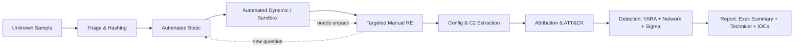
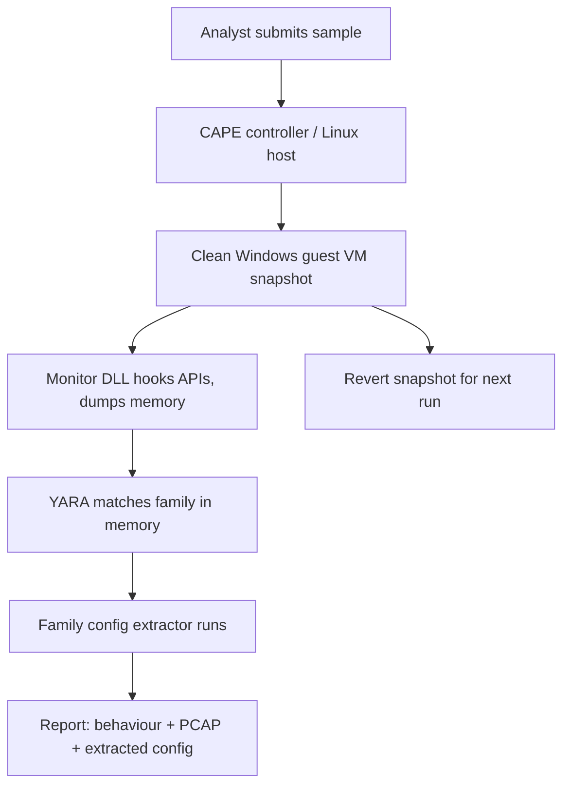
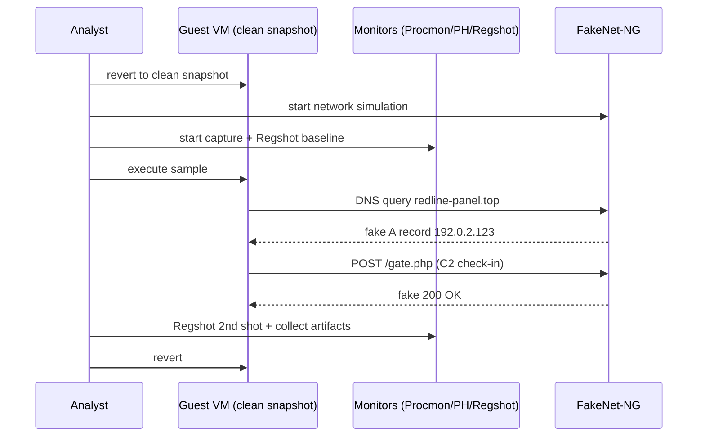
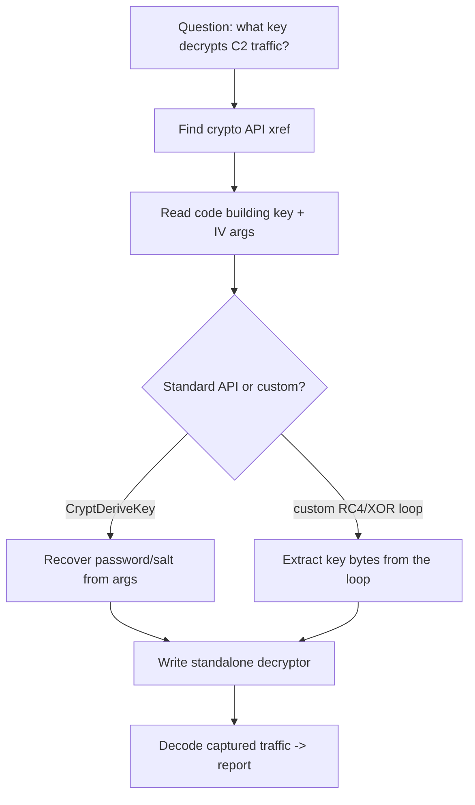
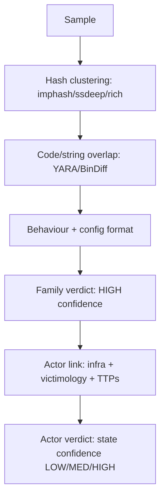
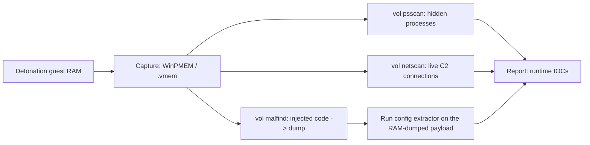
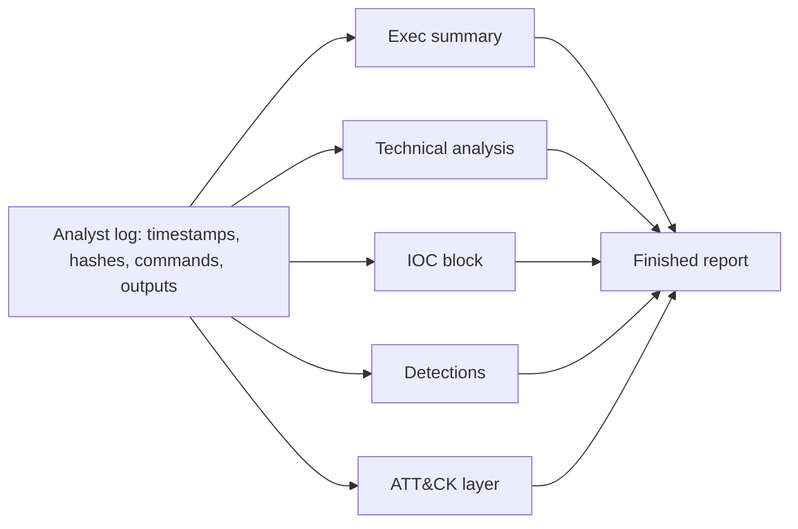

**Level:** Expert · **Track:** Malware Analysis & RE · **Read time:** 270 min

This is Chapter 8, the capstone of the Malware Analysis & Reverse Engineering notebook. The previous chapters each handed you one instrument: a safe lab (Chapter 1), static triage of PE headers and imports (Chapter 2), dynamic analysis with Procmon and the Sysinternals suite (Chapter 3), the x86/x64 assembly you read in a decompiler (Chapter 4), Ghidra and radare2/Cutter (Chapter 5), x64dbg (Chapter 6), and unpacking and anti-analysis defeats (Chapter 7). This chapter is where those instruments become a *method*. Real analysis is not "open the binary and read it top to bottom" — it is a disciplined, question-driven investigation that produces a specific deliverable: a report that someone downstream can act on.

The single most important mindset shift in this chapter is this: **you are not reverse-engineering the whole program, you are answering questions.** Every minute you spend in a decompiler should be traceable to a question a consumer of your report has asked — "Is this a wiper or a stealer?", "What does it talk to?", "How do I detect it across the fleet?", "Did it spread?" Analysts who try to understand every instruction burn out on the first commercial protector. Analysts who work backward from the report finish.

---

## Part 1: What "From Sample to Report" Actually Means

A malware sample is worthless as an artifact on its own. Its value is entirely in what you can *say* about it to three audiences, each of whom wants something different:

- **The SOC / detection engineer** wants signatures: file hashes, YARA rules, network IOCs, Sigma rules, and the host artifacts to hunt for. They will not read your assembly. They want a copy-pasteable IOC block and a one-line verdict.
- **The incident responder** wants scope and behaviour: what the malware does on a host, how it persists, whether it spreads, what it exfiltrates, and how to eradicate it. They will read your behavioural summary and your persistence/lateral-movement findings.
- **The threat-intel analyst / decision maker** wants attribution and context: what family this is, who uses it, how it maps to known campaigns and to MITRE ATT&CK, and what the strategic implication is. They read the executive summary and the ATT&CK mapping.

The whole methodology exists to serve these deliverables. If a finding does not help one of these three people, it is a curiosity, not a result. Keep a running "report skeleton" open from minute one and drop findings into it as you go — this is the discipline that turns eight hours of poking into a coherent document.



The dotted arrows matter as much as the solid ones. Analysis is iterative: the sandbox raises a question that sends you into a debugger; the debugger reveals a packer that sends you back to static tools; config extraction reveals a second-stage URL that starts the loop again on a new sample. Linear diagrams lie — the loop is the reality.

### The analyst's log

Before touching the sample, open a text file — literally `analysis-log.md` — and timestamp everything. This is not bureaucracy; it is how you avoid re-doing work at 2 a.m. and how your report gets its evidence. Record every hash, every command, every observed URL, every registry key. When you write the report you will paste directly from this log. **IR use case:** in a real incident this log is discoverable evidence and may end up in a legal or regulatory package, so write it as if a stranger will read it.

---

## Part 2: Safe Intake and Triage

### 2.1 Never trust the extension, never double-click

Everything in this chapter assumes the isolated lab from Chapter 1: a VM with no bridged networking, snapshots taken clean, host-only or simulated internet (INetSim/FakeNet-NG), and the sample transferred in as a **password-protected zip** (password `infected` by convention) so that host AV and email gateways do not silently quarantine or detonate it. The `infected`-zip convention exists precisely so a sample can cross a corporate network without a mail filter executing it.

The first rule of intake is mechanical: **rename the file so it cannot be executed by accident.** A file called `invoice.exe` becomes `invoice.exe.malz` or `invoice.exe_`. Analysts have detonated samples on their host by muscle-memory double-clicking. Defang it on arrival.

### 2.2 Hash it three ways, immediately

Hashes are the sample's fingerprint and the first IOC you will publish. Compute all three standard hashes plus the fuzzy/import hashes:

```bash
# Cryptographic hashes — exact-match IOCs
md5sum invoice.exe.malz
sha1sum invoice.exe.malz
sha256sum invoice.exe.malz     # SHA-256 is the canonical sample ID everywhere

# Fuzzy hash — clusters near-identical variants
ssdeep invoice.exe.malz

# Import hash (PE only) — clusters by import table layout
python3 -c "import pefile; print(pefile.PE('invoice.exe.malz').get_imphash())"

# TLSH — locality-sensitive hash, better than ssdeep for large corpora
tlsh -f invoice.exe.malz
```

What each hash is *for* — this is the part beginners skip:

| Hash | Property | What it clusters | Use |
|------|----------|------------------|-----|
| MD5 | Exact, 128-bit, broken for collision but fine as an ID | Byte-identical files | Legacy IOC feeds, VT lookups |
| SHA-1 | Exact, 160-bit | Byte-identical files | Git-style IDs, some feeds |
| SHA-256 | Exact, 256-bit | Byte-identical files | **The** canonical sample identifier |
| ssdeep | Fuzzy (CTPH) | Files with shared byte runs | Finding repacked/near variants |
| TLSH | Locality-sensitive | Similar files at scale | Large-corpus clustering |
| imphash | Hash of ordered import table | PE files built from same source/compiler | Family attribution |
| telfhash | ELF symbol-table hash | Linux ELF variants | Linux family attribution |

**Blue team usage:** the SHA-256 goes straight into your EDR block list and your report's IOC section. The imphash and ssdeep go into your hunt — they catch tomorrow's recompiled variant that a SHA-256 block would miss entirely.

### 2.3 The 60-second file-type reality check

The extension lies; the magic bytes do not. Establish what you actually have:

```bash
file invoice.exe.malz
# invoice.exe.malz: PE32+ executable (GUI) x86-64, for MS Windows

# Look at the first bytes yourself — MZ = PE, 7F 45 4C 46 = ELF, 50 4B = zip/office
xxd invoice.exe.malz | head -n 4
# 00000000: 4d5a 9000 0300 0000 0400 0000 ffff 0000  MZ..............

# Detect-It-Easy CLI: packer/compiler/protector detection in one shot
diec invoice.exe.malz
# PE64: compiler: Microsoft Visual C/C++; linker: Microsoft Linker(14.29);
# packer: UPX(4.x)[NRV2B]  <-- immediate signal it's packed
```

`diec` (Detect It Easy, from Chapter 2) tells you three things at once: the real file type, the likely compiler/toolchain, and whether a known packer is present. A UPX hit means you'll spend five minutes unpacking; a "protector: VMProtect" hit means you'll spend a day and should decide now whether targeted dynamic analysis is a better use of time than fighting the VM.

### 2.4 Entropy triage

High entropy (close to 8.0 bits/byte) across a section means encryption or compression — i.e. packing. This is your single fastest "is it packed?" test:

```bash
# Per-section entropy with pefile
python3 - <<'PY'
import pefile, math
pe = pefile.PE("invoice.exe.malz")
for s in pe.sections:
    name = s.Name.rstrip(b"\x00").decode(errors="replace")
    print(f"{name:8} entropy={s.get_entropy():.2f} vsize={s.Misc_VirtualSize:#x}")
PY
# .text    entropy=7.98 vsize=0x1e000   <-- code section at 7.98 = packed
# .rdata   entropy=4.90 vsize=0x3000
# UPX0     entropy=0.00 vsize=0x20000   <-- classic UPX layout
# UPX1     entropy=7.96 vsize=0x1f000
```

A normal compiled `.text` sits around 6.0–6.7. Anything above ~7.2 in a code section is a packing signal. **Do not report "packed" as a finding on its own** — it is a triage signal that tells you which tool to reach for next, not a conclusion your consumers care about.

---

## Part 3: The Automated-First Principle

A rookie mistake is to open the disassembler immediately. Experienced analysts run everything a machine can do first, because machines are cheap and your attention is expensive. The order is always: automated static → automated dynamic → then, and only then, targeted manual work on the questions the automation could not answer.

### 3.1 Automated static: strings, imports, resources

Strings are the highest-value-per-second artifact in all of malware analysis. Use FLOSS (FireEye Labs Obfuscated String Solver, introduced in Chapter 7) rather than plain `strings`, because FLOSS also recovers *stack strings* and lightly *decoded strings* that plain `strings` misses:

```bash
# FLOSS: static strings + stack strings + tight-string decoding in one pass
floss invoice.exe.malz > floss.txt

# Then triage the output for the things that matter:
grep -Ei 'http|https|\.php|\.top|\.xyz|user-agent|mozilla' floss.txt   # C2 / URLs
grep -Ei 'HKLM|HKCU|CurrentVersion\\Run|Software\\' floss.txt          # persistence
grep -Ei '\.dll|GetProcAddress|LoadLibrary|VirtualAlloc|WriteProcess' floss.txt  # injection
grep -Ei 'cmd\.exe|powershell|schtasks|rundll32|wscript' floss.txt     # LOLBins
```

Even on a packed sample, strings from the *unpacking stub* leak API names and sometimes the URL to the next stage. Note everything interesting into the log; each string is a hypothesis to confirm dynamically.

The import table is your second static goldmine. Chapter 2 taught you to read it; here is the analyst's shortcut — imports cluster into *capabilities*:

| Imported APIs | Capability inferred |
|---------------|--------------------|
| `VirtualAlloc` + `VirtualProtect` + `CreateThread` | Shellcode / unpacking in memory |
| `OpenProcess` + `WriteProcessMemory` + `CreateRemoteThread` | Process injection |
| `InternetOpen` / `WinHttpConnect` / `send` / `recv` | Network / C2 |
| `RegSetValueEx` + `RegCreateKeyEx` | Registry persistence |
| `CreateServiceA` / `StartServiceCtrlDispatcher` | Runs as a service |
| `CryptEncrypt` / `BCryptEncrypt` | Crypto (ransomware or config protection) |
| `GetAsyncKeyState` / `SetWindowsHookEx` | Keylogging |
| `CreateToolhelp32Snapshot` + `Process32Next` | Process enumeration (AV evasion / injection targeting) |

**A near-empty import table is itself a finding**: it means the malware resolves APIs dynamically at runtime (via `GetProcAddress` and hashed names) to hide its capabilities from exactly this analysis. That tells you to lean on dynamic analysis and API hooking rather than the static import list.

### 3.2 Automated dynamic: submit to a sandbox first

Before you set up your own detonation, run the sample through an automated sandbox — a self-hosted CAPE/CAPEv2, or a cloud sandbox if organizational policy allows submission (many do **not**, because uploading a sample can tip off an adversary or leak victim data — check first). A sandbox gives you, in five minutes:

- API-call trace and behavioural summary
- Dropped files, created processes, registry changes
- Network capture (PCAP) with contacted domains/IPs
- Screenshots, and often an automatic config extraction for known families

CAPE in particular is worth teaching from scratch because it does something no generic sandbox does.

---

## Part 4: CAPE — Config-Extracting Sandbox (Tool From Scratch)

**What it is.** CAPE (Config And Payload Extraction) is an open-source malware sandbox forked from Cuckoo, purpose-built to unpack samples in memory, dump the unpacked payload, and run family-specific *config extractors* that pull the C2 servers, campaign IDs and RC4/AES keys straight out of the running malware. Where a generic sandbox says "it made a network connection," CAPE says "this is Emotet, epoch 5, here are its 60 C2 IPs and the RSA public key."

**Why it exists.** Modern malware is packed and configuration-driven. The valuable intelligence — the C2 list, the keys, the campaign tag — lives in an encrypted config blob decrypted only in memory at runtime. CAPE hooks the process, catches the moment the config is in cleartext, and extracts it automatically for hundreds of known families.

**Architecture.** A Linux host runs the CAPE controller; Windows VMs (managed via KVM/QEMU or VirtualBox) are the detonation guests. An agent inside each guest receives the sample, runs it under a monitor DLL that hooks key APIs, streams the behaviour back, and triggers YARA-based detection that fires the right config extractor.



**Core workflow (self-hosted):**

```bash
# Submit a sample and wait for the report
cape submit --timeout 120 invoice.exe.malz
# Task #4412 added

# Pull the JSON report once the task finishes
curl -s http://localhost:8000/apiv2/tasks/get/report/4412/ | jq '.CAPE.payloads[].cape_type'
# "RedLine Stealer Config"

# The extracted config — the crown jewels
curl -s http://localhost:8000/apiv2/tasks/get/report/4412/ \
  | jq '.CAPE.payloads[] | select(.cape_type=="RedLine Stealer Config") | .cape_config'
# {
#   "C2": ["185.216.70.12:15588"],
#   "Botnet": "cana",
#   "Version": "RedLine"
# }
```

**Advanced usage.** CAPE's real power is that its config extractors are Python and its detection is YARA — you can add your own. When you finish reversing a family's config format later in this chapter, you write a CAPE extractor so the next analyst never has to. That is the flywheel of a mature malware team: manual analysis today becomes automated extraction tomorrow.

**When automation fails** — a brand-new family, a custom packer CAPE cannot peel, an evasive sample that detects the sandbox and exits — you fall back to manual analysis. That is the rest of this chapter.

---

## Part 5: Building Your Own Detonation Chamber

Automated sandboxes are convenient but generic; they run for two minutes and do not let you pause at the interesting moment. Your hand-built lab does. Recreate it deliberately for each sample.

### 5.1 The environment

- **Guest:** Windows 10/11 VM, clean snapshot, tools pre-installed, VM-detection artifacts scrubbed as much as practical (Chapter 7 anti-VM material).
- **Network:** a second Linux VM running **INetSim** or **FakeNet-NG** so the malware "reaches the internet," gets plausible fake responses, and reveals its C2 behaviour without ever touching the real network.
- **Monitoring on the guest:** Procmon (filtered), Process Hacker/System Informer, Autoruns, Regshot (before/after registry+filesystem diff), and Wireshark/tcpdump on the network VM.

### 5.2 FakeNet-NG (Tool From Scratch)

**What it is.** FakeNet-NG is a dynamic network-simulation tool that intercepts *all* network traffic from the guest — DNS, HTTP, HTTPS, raw TCP/UDP — and answers it with configurable fake services, logging everything. Unlike INetSim (which runs on a separate host), FakeNet-NG runs *on the same guest as the malware* and hooks the network stack, so you see traffic even before it leaves the box, and you get a per-process attribution of who sent what.

**Why it exists.** Malware only reveals its C2 protocol if it believes it reached a server. FakeNet answers every request with something plausible (a fake 200 OK, a fake DNS A record pointing back to itself) so the malware proceeds to its next stage — beacon, download, exfil — while you capture the exact bytes.

**Core workflow:**

```powershell
# Run FakeNet-NG on the guest (as admin) before detonating
fakenet.exe
# [Diverter] Diverting traffic...
# [DNS Server] Responding to DNS request for redline-panel.top with 192.0.2.123
# [HTTPListener] GET /gate.php from 10.0.0.5
# ... every request the malware makes is logged and answered

# It writes a PCAP you analyse afterward
# packets_<timestamp>.pcap  <-- full capture including the C2 handshake
```

**Red team usage (mirror image):** operators test their own implants against FakeNet to see exactly what a defender's sandbox will capture — if your beacon's first packet contains a plaintext campaign ID, you have handed the blue team a network signature. Understanding the analyst's tooling is how good tradecraft is designed.

### 5.3 The detonation ritual

1. Revert the guest to the clean snapshot.
2. Start FakeNet-NG (or point the guest's gateway/DNS at the INetSim VM).
3. Start Procmon with a filter on the sample's process name (and children), Process Hacker, and Wireshark on the network VM.
4. Take a **Regshot** baseline (1st shot).
5. Run the sample. Interact with any decoy document/UI it shows.
6. Let it run 2–5 minutes. Watch Process Hacker for spawned processes and injected threads.
7. Take the **Regshot** 2nd shot and compute the diff.
8. Collect: Procmon CSV, PCAP, dropped files, Regshot diff, screenshots.
9. Revert.

The Regshot diff alone often hands you the persistence mechanism (a new `Run` key) and dropped-file paths without any reversing at all.



---

## Part 6: Targeted Manual Reverse Engineering

Now, and only now, do you open Ghidra or x64dbg — with *specific questions* the automation left unanswered. Typical residual questions:

- The sandbox showed the process decrypt something then exit — **what condition caused the early exit?** (Anti-analysis check.)
- FakeNet logged a POST with an encrypted body — **what is the encryption and key?** (Needed to decode exfil and to write a decryptor.)
- The config extractor did not recognize the family — **where is the config blob and how is it decrypted?** (You'll write the extractor.)

### 6.1 Working backwards from an API to the question

Do not read `main` top to bottom. Set breakpoints or find cross-references to the *API that matters for your question* and read outward from there. Want the C2 URL construction? Find `InternetConnectA` / `WinHttpConnect` / `send` and read the code that builds their arguments. Want the decryption? Find `CryptDecrypt` / `BCryptDecrypt` / a custom RC4 loop and read what feeds it.



### 6.2 Recognizing custom crypto in the decompiler

Malware rarely uses AES for its config — it uses RC4, XOR-with-a-rolling-key, or a hand-rolled stream cipher, because those are tiny and keyless-looking. Learn the shapes:

```c
// RC4 key-scheduling algorithm as it appears in a Ghidra decompilation.
// The 256-entry byte array + the two-index swap loop is unmistakable.
for (i = 0; i < 256; i++) { S[i] = (byte)i; }
j = 0;
for (i = 0; i < 256; i++) {
    j = (j + S[i] + key[i % keylen]) & 0xff;
    tmp = S[i]; S[i] = S[j]; S[j] = tmp;   // the swap = RC4 KSA signature
}
```

```c
// Rolling-XOR / single-byte XOR — the simplest and most common config guard
for (i = 0; i < len; i++) {
    out[i] = enc[i] ^ key[i % keylen];     // constant key length -> extract key
}
```

Once you recognize the primitive and lift the key out of the disassembly, you reproduce it in Python and decrypt the config or the captured traffic offline. That standalone script is a deliverable — it goes in the report so an IR team can decode exfil they capture on other hosts.

### 6.3 Emulation to skip the boring parts

When a decryption routine is self-contained, you do not need to reverse the math — you can *emulate* it. The Unicorn Engine and its friendly wrappers (Dumpulator, Speakeasy) let you run a single function with controlled inputs and read the output:

```python
# Emulate a decrypt(buf, len, key) routine with Unicorn to recover plaintext config
from unicorn import *
from unicorn.x86_const import *

CODE_BASE = 0x400000
mu = Uc(UC_ARCH_X86, UC_MODE_64)
mu.mem_map(CODE_BASE, 0x100000)
mu.mem_write(CODE_BASE, open("decrypt_func.bin","rb").read())  # bytes of the function
# set up args in registers/stack per the calling convention, point RIP at the func,
# run until RET, then read the output buffer back out of emulated memory.
mu.emu_start(CODE_BASE, CODE_BASE + func_len)
plaintext = mu.mem_read(OUT_ADDR, out_len)
print(plaintext)   # -> decrypted C2 list / campaign id
```

Emulation is the analyst's cheat code for opaque-but-deterministic routines: you get the answer without understanding every instruction, which is exactly the "answer questions, don't read everything" principle in action.

---

## Part 7: Configuration and C2 Extraction

The config is the intelligence. For most commodity families the config contains the C2 servers, the campaign/botnet ID, an install path, a mutex name, and sometimes an RSA public key or RC4 key. Extracting it well is what separates "it's a stealer" from "it's RedLine botnet `cana` talking to `185.216.70.12:15588`, and here's the decryptor."

### 7.1 Where configs live

| Location | How to find it |
|----------|----------------|
| A dedicated `.rdata`/resource blob | High-entropy constant referenced right before a decrypt call |
| Stack strings built byte-by-byte | FLOSS recovers these; look near network APIs |
| Downloaded at runtime (stage 2) | Appears in the FakeNet PCAP, decrypt with recovered key |
| .NET resource stream | dnSpyEx → Resources; often gzipped+encrypted |

### 7.2 Writing a reusable extractor

Once you know the format, encode it as a Python extractor so it works on every variant of the family:

```python
#!/usr/bin/env python3
"""RedLine-style config extractor: locate blob, RC4-decrypt, parse C2/botnet."""
import re, base64
from arc4 import ARC4       # pip install arc4  (RC4 helper)

def extract(data: bytes):
    # 1) The .NET string table stores the config as base64; the key is another b64 string.
    b64s = re.findall(rb'[A-Za-z0-9+/]{16,}={0,2}', data)
    for i in range(len(b64s) - 1):
        try:
            key = base64.b64decode(b64s[i])
            blob = base64.b64decode(b64s[i+1])
            dec = ARC4(key).decrypt(blob)
            if b'.' in dec and b':' in dec:           # looks like host:port
                return dec.decode('utf-8', 'replace')
        except Exception:
            continue
    return None

if __name__ == "__main__":
    import sys
    print(extract(open(sys.argv[1], 'rb').read()))
# $ ./extract_redline.py unpacked.bin
# 185.216.70.12:15588|cana|RedLine
```

**Threat-intel value:** run this extractor across your whole sample corpus and you get a map of the botnet's infrastructure over time — every C2 IP, every campaign tag. That is the raw material for infrastructure tracking and takedowns.

### 7.3 Decoding captured traffic

With the key recovered, decrypt the FakeNet-captured beacon to prove what the malware exfiltrates:

```python
# Decode a captured C2 POST body using the recovered RC4 key
from arc4 import ARC4
body = open("captured_post_body.bin","rb").read()
print(ARC4(b"the_recovered_key").decrypt(body).decode("utf-8","replace"))
# {"hwid":"...","user":"victim","passwords":[...],"cookies":[...]}  <-- proof it's a stealer
```

Now your report can state, with evidence, *exactly* what data leaves the host — not "it appears to exfiltrate data," but the field names and structure of the exfil.

---

## Part 8: Family Attribution — What Is This, Really?

Attribution answers "have we seen this before, and who runs it?" It ranges from cheap-and-reliable (this is the same family) to expensive-and-cautious (this is the same *actor*). Stay disciplined about which claim you are making.

### 8.1 Cheap signals: hashes that cluster

- **imphash** identical across samples → very likely same source tree / builder.
- **telfhash** for ELF → same for Linux.
- **ssdeep/TLSH** high similarity → repacked variant of the same thing.
- **Rich header** (PE) hash → same Visual Studio toolchain/build environment, a surprisingly strong clustering signal.

```bash
# Compare imphash of two samples — a match is a strong "same family/builder" signal
for f in sample_a.bin sample_b.bin; do
  python3 -c "import pefile,sys;print(sys.argv[1], pefile.PE(sys.argv[1]).get_imphash())" "$f"
done
```

### 8.2 Medium signals: code and string overlap

Unique strings (a typo in a user-agent, a hard-coded mutex name, a distinctive PDB path), reused decryption constants, and identical code blocks. Tools:

- **YARA** retrohunt with a rule built from a distinctive code block.
- **BinDiff / Diaphora** to diff two binaries function-by-function and see shared code.
- **Karton/MWDB** or VirusTotal's "similar samples" and behaviour clustering.

### 8.3 Strong-but-cautious: actor attribution

Actor attribution (naming an APT group) requires far more than one sample — infrastructure overlap, victimology, TTP consistency, and usually intel you do not have from a binary alone. **In a technical report, attribute to the family confidently and to the actor only with explicit confidence language** ("overlaps with tooling publicly associated with X; assessed with low/medium confidence"). Overclaiming attribution is the fastest way to lose credibility.



---

## Part 9: Mapping to MITRE ATT&CK

ATT&CK is the shared language between you and your report's consumers. Every behaviour you observed maps to a technique ID, which lets a detection engineer immediately see which of their existing detections should have fired. Map only what you *observed or proved*, not what the family "can" do.

| Observed behaviour | ATT&CK Technique |
|--------------------|------------------|
| Packed with UPX to hide code | T1027.002 Obfuscated/Packed Files |
| `GetProcAddress` dynamic API resolution | T1027.007 Dynamic API Resolution |
| Copied itself to `%APPDATA%` and set a Run key | T1547.001 Registry Run Keys |
| `CreateRemoteThread` into `explorer.exe` | T1055.002 Portable Executable Injection |
| Enumerated processes to find AV | T1518.001 Security Software Discovery |
| Stole browser credential DBs | T1555.003 Credentials from Web Browsers |
| HTTPS POST beacon to hard-coded C2 | T1071.001 Web Protocols |
| RC4-encrypted C2 channel | T1573.001 Symmetric Cryptography |
| Checked for VM artifacts and exited | T1497.001 System Checks |

Produce this as a table in the report and, ideally, an ATT&CK Navigator JSON layer so the SOC can overlay it on their coverage map. **Blue team usage:** the gap between "techniques this malware used" and "techniques we can detect" is the exact remediation backlog for the detection team.

---

## Part 10: Detection Engineering — YARA, Network, and Sigma

A malware report without detections is an essay. The signatures are the point.

### 10.1 YARA (Tool From Scratch, reinforced)

**What it is.** YARA is a pattern-matching engine for classifying files and memory by rules combining byte strings, text strings, and conditions. It is the lingua franca of malware detection — used in EDR, sandboxes (CAPE), threat-intel platforms, and IR scanning.

**Why it exists.** Hashes only catch known files; YARA catches *families* by matching distinctive content that survives repacking, so one good rule catches thousands of variants.

**Anatomy of a good rule** — specific enough to avoid false positives, general enough to survive variants:

```yara
rule RedLine_Stealer_Config_Loader
{
    meta:
        author      = "analyst"
        description = "RedLine stealer: RC4 config loader + distinctive strings"
        reference   = "internal report 2027-0412"
        sha256      = "e3b0c44298fc1c149afbf4c8996fb924...."   // sample hash
        tlp         = "amber"
    strings:
        // Distinctive .NET type names seen in decompilation
        $s1 = "EntryPoint" wide ascii
        $s2 = "IpInfo" wide ascii
        $s3 = "ScannedBrowser" wide ascii
        // The RC4 KSA byte pattern (256-entry init + swap) — survives obfuscation
        $rc4 = { 8B ?? ?? 0F B6 ?? 8B ?? ?? 88 ?? ?? 88 }
        // Distinctive C2 URI built at runtime
        $uri = "/gate.php" ascii
    condition:
        uint16(0) == 0x5A4D and                 // MZ header — it's a PE
        filesize < 2MB and
        (2 of ($s*)) and ($rc4 or $uri)
}
```

Rule-writing discipline:

- **Anchor cheaply:** `uint16(0)==0x5A4D` and a `filesize` bound run first and reject most of the world instantly.
- **Avoid brittle strings:** do not key a rule on a C2 IP that rotates weekly; key it on code and structure that the builder reuses.
- **Test for false positives:** run against a large clean corpus (goodware) before shipping. A rule that flags `svchost.exe` is worse than no rule.
- **Prefer hex code patterns with wildcards** (`??`) over exact strings for anti-variant durability.

```bash
# Test the rule against the sample AND against a goodware corpus
yara -r redline.yar ./samples/          # should match the family
yara -r redline.yar /clean_corpus/      # MUST be silent — no false positives
```

### 10.2 Network signatures (Suricata/Snort)

From the FakeNet PCAP, extract a rule on the beacon's stable features — URI path, User-Agent, or the shape of the first bytes — not on the rotating IP:

```
alert http $HOME_NET any -> $EXTERNAL_NET any ( \
  msg:"MALWARE RedLine Stealer C2 check-in"; flow:established,to_server; \
  http.method; content:"POST"; http.uri; content:"/gate.php"; \
  http.user_agent; content:"RedLine"; \
  classtype:trojan-activity; sid:9000412; rev:1; )
```

### 10.3 Sigma for host telemetry

Sigma is the YARA of log-based detection — a generic rule format that converts to Splunk/Elastic/Sentinel queries. Encode the persistence you observed:

```yaml
title: RedLine-style Run Key Persistence in AppData
logsource: { product: windows, category: registry_set }
detection:
    sel:
        TargetObject|contains: '\CurrentVersion\Run\'
        Details|contains: '\AppData\Roaming\'
        Details|endswith: '.exe'
    condition: sel
level: high
```

Now the SOC can hunt this behaviour across every endpoint's telemetry, not just catch the one file.

---

## Part 11: Hands-On Lab — Loader → Stealer, Sample to Report

This lab threads every part together on a realistic (lab-scoped, synthetic) two-stage intrusion: a malicious document macro drops a small loader, the loader unpacks and injects a stealer, and the stealer beacons out and exfiltrates browser data. You will produce the full IOC package and report skeleton.

### Step 0 — Intake and triage

```bash
# Defang and hash
mv "Payment_Advice.exe" "Payment_Advice.exe.malz"
sha256sum Payment_Advice.exe.malz
# 7f8e2a...c91  Payment_Advice.exe.malz
diec Payment_Advice.exe.malz
# PE64: compiler: MSVC; packer: UPX(4.x)  <-- packed loader
python3 -c "import pefile;print(pefile.PE('Payment_Advice.exe.malz').get_imphash())"
# f34d1b0c...   <-- record for clustering
```

**Log entry:** stage-1 loader, UPX-packed, MSVC, sha256 `7f8e2a…c91`.

### Step 1 — Unpack (Chapter 7 skills)

```bash
# UPX is trivially reversible — try the vanilla unpack first
upx -d Payment_Advice.exe.malz -o stage1_unpacked.bin
# Unpacked 1 file.   (if a modified UPX fails, fall back to OEP-find + dump in x64dbg)
floss stage1_unpacked.bin | grep -Ei 'http|\.top|\.xyz|VirtualAlloc|WriteProcess'
# https://cdn-update[.]top/p2.bin        <-- stage-2 URL
# VirtualAllocEx / WriteProcessMemory / CreateRemoteThread  <-- injection capability
```

**Log entry:** stage-1 downloads stage-2 from `cdn-update[.]top/p2.bin`, uses classic PE-injection APIs.

### Step 2 — Detonate stage 1 in the chamber

```text
1. Revert guest to clean snapshot.
2. Start FakeNet-NG (it will serve a fake p2.bin — or you feed it the real stage-2 you already have).
3. Procmon filter: Process Name is Payment_Advice.exe.malz OR explorer.exe.
4. Regshot 1st shot.
5. Run it. Observe in Process Hacker: it spawns, allocates RWX memory in explorer.exe, writes, and starts a remote thread.
6. Regshot 2nd shot -> diff.
```

Observed (from FakeNet log + Procmon):

```
[FakeNet DNS] cdn-update.top -> 192.0.2.10
[FakeNet HTTP] GET /p2.bin  (stage-2 pulled)
[Procmon] Payment_Advice.exe.malz -> WriteProcessMemory -> explorer.exe (PID 4120)
[Regshot diff] HKCU\...\Run\WinUpdate = %APPDATA%\Roaming\svc\host.exe   <-- persistence
[Procmon] CreateFile %APPDATA%\Roaming\svc\host.exe                       <-- dropped stage-2
```

**Log entries:** injection target `explorer.exe`; persistence Run key `WinUpdate`; dropped path `%APPDATA%\Roaming\svc\host.exe`.

### Step 3 — Analyze stage 2 (the stealer)

Dump the injected payload from memory with Process Hacker (or PE-sieve, Chapter 7) → `stage2.bin`. Triage:

```bash
diec stage2.bin
# PE32 .NET assembly  <-- switch to dnSpyEx / de4dot for .NET
sha256sum stage2.bin
# a1b2c3...ff  stage2.bin
```

In dnSpyEx you find the RC4 config loader from Part 7.2. Run your extractor:

```bash
./extract_redline.py stage2.bin
# 185.216.70.12:15588|cana|RedLine
```

**Log entry:** stage-2 = RedLine-like .NET stealer, C2 `185.216.70.12:15588`, botnet `cana`.

### Step 4 — Prove the exfil

Let stage 2 beacon against FakeNet; capture the POST; decrypt with the recovered RC4 key (Part 7.3):

```python
from arc4 import ARC4
print(ARC4(b"cana_key").decrypt(open("post_body.bin","rb").read()).decode("utf-8","replace"))
# {"hwid":"...","browsers":["Chrome","Edge"],"passwords":[...],"cookies":[...],"wallets":[...]}
```

**Log entry:** confirmed credential + cookie + crypto-wallet theft; exfil schema captured.

### Step 5 — Build detections

- **YARA** rule on stage-2's .NET type names + RC4 KSA pattern (Part 10.1). Test against goodware — silent.
- **Suricata** rule on the `/gate.php` + `RedLine` user-agent beacon.
- **Sigma** rule on the `WinUpdate` Run key in `%APPDATA%`.
- **Hashes:** both stages' SHA-256, both imphashes, ssdeep.

### Step 6 — Map ATT&CK

T1566.001 (spearphishing attachment) → T1204.002 (user execution) → T1027.002 (packed) → T1055.002 (PE injection) → T1547.001 (Run key) → T1555.003 (browser creds) → T1071.001 + T1573.001 (encrypted web C2) → T1041 (exfil over C2).

### Step 7 — Assemble the report (next Part).

The lab is "done" not when you understand the binary but when the **IOC package, detections, ATT&CK layer, and report skeleton** all exist. That is the deliverable.

---

## Part 11B: Memory Forensics — Catching What Never Touches Disk

Modern malware works hard to leave nothing on disk: it unpacks into memory, injects into a legitimate process, and its config and keys exist only in RAM. A disk-only analysis misses all of it. Capturing and analysing a memory image of the detonation guest recovers the *runtime* truth — the injected payload, the decrypted config, the network connections, and the API hooks — and often hands you artifacts you could not get any other way.

### Volatility 3 (Tool From Scratch)

**What it is.** Volatility is the standard open-source memory-forensics framework: it parses a raw RAM dump using OS-specific "symbol tables" and exposes plugins that reconstruct the process list, network connections, injected code, loaded modules, registry hives, and more — all from a frozen snapshot of memory. Volatility 3 is the current Python-3 rewrite.

**Why it exists.** The live OS lies to you (rootkits hide processes); a dead disk image lacks runtime state. A memory image sits between them — it is the ground truth of what the machine was actually doing, including things the malware tried to hide from live tools.

**Capture the image.** From the hypervisor, suspend/snapshot the guest and use the `.vmem`/`.vmsn` file, or capture live with WinPMEM inside the guest before you revert:

```bash
# Inside the guest, capture RAM to a raw image (WinPMEM)
winpmem_mini_x64.exe mem.raw
# ... then move mem.raw to the analysis host
```

**Core plugins — the ones that answer report questions:**

```bash
# What processes existed — including ones hidden from Task Manager (psscan walks pool tags)
vol -f mem.raw windows.pslist
vol -f mem.raw windows.psscan        # finds unlinked/hidden processes pslist misses

# Injected/unbacked executable memory — the #1 malware indicator
vol -f mem.raw windows.malfind
# Process: explorer.exe Pid: 4120  Protection: PAGE_EXECUTE_READWRITE
# 0x2b40000  MZ header + shellcode  <-- injected PE in a legit process = confirmed injection

# Network connections frozen at capture time — recovers C2 even after the socket closed
vol -f mem.raw windows.netscan
# 10.0.0.5:49712 -> 185.216.70.12:15588  ESTABLISHED  host.exe

# Command lines (recovers the full LOLBin invocation)
vol -f mem.raw windows.cmdline

# Dump the injected region to a file for static analysis / YARA
vol -f mem.raw windows.malfind --dump
# Wrote pid.4120.0x2b40000.dmp   <-- feed to diec/FLOSS/your extractor
```

`malfind` alone is worth the whole exercise: it finds memory regions that are executable but not backed by a file on disk — the signature of injected shellcode or a hollowed process — and dumps them so you can run your config extractor on the *decrypted, unpacked* payload straight from RAM. **IR use case:** on a real compromised host, a memory image plus `malfind` + `netscan` frequently proves compromise and recovers the live C2 when the on-disk dropper has already deleted itself.



**Blue team usage:** `malfind` and `netscan` are the two plugins a SOC runs first on any triage memory image; teaching them here means your report can tell IR *exactly* which plugin recovers which artifact, turning your analysis into a repeatable playbook.

---

## Part 12: Writing the Report

A malware report has a fixed skeleton because its consumers have fixed needs. Fill it from your log.

### 12.1 Structure

1. **Executive summary (≤ 1 page, no jargon).** What it is, what it does, business impact, confidence. "A credential-stealing trojan (RedLine family) delivered by a malicious email attachment. It steals saved browser passwords, cookies, and cryptocurrency wallets and sends them to attacker infrastructure. High confidence. Recommended actions: block listed IOCs, hunt for the persistence key, reset credentials on affected hosts."
2. **Key findings / verdict.** Family, capabilities, severity.
3. **Technical analysis.** Delivery, stages, unpacking, injection, persistence, C2 protocol, config, crypto — evidence-backed, with the commands and outputs from your log.
4. **Configuration / extracted intelligence.** C2 list, campaign ID, keys, mutex.
5. **MITRE ATT&CK mapping.** The table + Navigator layer.
6. **Indicators of Compromise.** Hashes, filenames/paths, registry keys, mutexes, domains/IPs, URIs — clearly labeled and machine-ingestible.
7. **Detection.** YARA, Suricata/Snort, Sigma rules.
8. **Recommendations.** Containment, eradication, hardening.
9. **Appendix.** Screenshots, full string dumps, extractor scripts.

### 12.2 The IOC block — make it copy-pasteable

```text
== File Hashes (SHA-256) ==
7f8e2a...c91   Payment_Advice.exe (stage-1 loader, UPX)
a1b2c3...ff    host.exe (stage-2 RedLine stealer, .NET)

== Host Artifacts ==
Path:     %APPDATA%\Roaming\svc\host.exe
RunKey:   HKCU\Software\Microsoft\Windows\CurrentVersion\Run\WinUpdate
Mutex:    Global\RL_cana_7f8e

== Network ==
Domain:   cdn-update[.]top          (stage-2 delivery)
C2:       185.216.70[.]12:15588     (RedLine panel, botnet 'cana')
URI:      POST /gate.php
UA:       RedLine
```

Note the **defanging** (`cdn-update[.]top`, `185.216.70[.]12`) so nobody's tooling auto-resolves or clicks a live IOC from the report.

### 12.3 Writing style rules that matter

- **State confidence explicitly.** "Confirmed" (you proved it), "assessed" (strong inference), "possible" (weak). Never blur these.
- **Evidence for every claim.** If you say it exfiltrates passwords, show the decrypted schema. If you say it persists, show the Regshot diff line.
- **Separate observation from interpretation.** "The process wrote to `explorer.exe` memory and created a remote thread (observed). This is PE injection to run under a trusted process (interpretation)."
- **Write for the consumer, not to show your work.** The SOC does not need your assembly; they need the YARA rule. Put depth in the appendix.



---

## Part 13: Detection & Defense Angle

This consolidated section is for the blue-team reader who will *operationalize* your analysis. Everything above produces artifacts; here is how they defend a real environment.

**Layered detection from one analysis.** A single sample yields detections at every layer, and you should ship all of them because each survives a different evasion:

- **Hash blocks** (EDR/AV) — instant, but defeated by a one-byte recompile.
- **YARA on files and memory** — survives repacking; scan endpoints and memory dumps.
- **Network signatures** (Suricata/Zeek) — survive binary changes entirely as long as the protocol is stable; catch the C2 even for a brand-new build.
- **Sigma/behavioural** (EDR telemetry) — the most durable: the Run-key-in-AppData or inject-into-explorer behaviour persists across whole families, not just this sample.

The durability ladder — hash < YARA < network < behaviour — is why you never stop at hashes. **Hunt the behaviour, block the hash.**

**Threat hunting from the report.** Turn each IOC into a hunt query: search EDR for the Run key across the fleet, search proxy logs for the `/gate.php` URI and the C2 IP, search for the mutex and the dropped path. The report is the hunt package.

**Eradication guidance for IR.** Because you documented persistence (Run key) and the dropped path, IR can eradicate confidently: kill the process, remove the Run key, delete `%APPDATA%\Roaming\svc\host.exe`, and — crucially, because you proved credential theft — **reset all credentials that were present on the host**, since the stealer already exfiltrated them. Malware analysis that omits "and therefore rotate these secrets" leaves the door open after cleanup.

**Feeding the flywheel.** The YARA rule goes into the org's scanning pipeline and CAPE; the config extractor goes into CAPE so the next variant is auto-triaged; the ATT&CK layer updates the coverage map; the C2 IP goes into the blocklist and the intel platform. One good analysis permanently upgrades detection.

**Detecting the analysis-evasion itself.** Because you noted the VM-check that caused early exit (T1497.001), the blue team can also detect *sandbox-evasive* behaviour generically — malware that queries `CPUID` hypervisor bits, checks MAC OUI prefixes, or looks for `VBOX`/`VMWARE` registry keys is suspicious regardless of family.

---

## Part 14: Common Pitfalls

- **Analysis paralysis / reading everything.** You cannot read a modern binary end to end. Work backward from report questions. If you cannot state which report question a task answers, stop doing it.
- **Detonating without network simulation.** Malware that can't "reach the internet" often exits early or skips its interesting stages. Always run FakeNet/INetSim so it proceeds.
- **Skipping the clean-snapshot revert.** Analyzing a sample on a guest already dirtied by the last sample produces garbage IOCs. Revert every time.
- **Reporting capability as behaviour.** "It can inject" (the API is imported) is not "it injected" (you observed it). Report what you proved; label the rest as capability.
- **Brittle YARA rules.** Keying on a C2 IP or a compile timestamp gives a rule with a one-week shelf life and false positives. Key on code structure and distinctive strings; test against goodware.
- **Overclaiming attribution.** Naming an APT from one binary is a credibility-killer. Attribute to family confidently; attribute to actor only with explicit confidence language and corroborating infrastructure.
- **Submitting to a public sandbox against policy.** Uploading a targeted sample can tip off the adversary and may leak victim data. Know your org's submission policy before you click.
- **No decryptor / no proof of exfil.** If you say it steals data, recover the key and show the decrypted schema. Unproven exfil claims force IR to over- or under-react.
- **Losing the log.** If it's not in `analysis-log.md`, it didn't happen and you'll re-derive it at 2 a.m. Timestamp everything as you go.

---

## Part 15: Final Revision / Summary

- Malware analysis is **question-driven**, not comprehension-driven. Serve three consumers — SOC, IR, threat-intel — and let their needs decide what you analyze.
- **Triage first:** defang, hash six ways (MD5/SHA-1/SHA-256 for identity; ssdeep/TLSH/imphash for clustering), `file`/`diec` for type, entropy for packing.
- **Automate before you reverse:** FLOSS strings, import-capability mapping, then a CAPE/sandbox run that may hand you the config for free.
- **Detonate in a controlled chamber** with FakeNet-NG/INetSim, Procmon, Process Hacker, and Regshot — the diff alone often reveals persistence and drops.
- **Reverse only the residual questions**, working backward from the API that matters; recognize RC4/XOR by shape; emulate opaque-but-deterministic routines with Unicorn.
- **Extract config and decode traffic** to turn "it's a stealer" into named C2, campaign ID, keys, and a proven exfil schema — and package that as a reusable extractor.
- **Attribute to family confidently, actor cautiously**, using imphash/telfhash/rich-header clustering and code overlap.
- **Map to ATT&CK** only what you observed; ship the Navigator layer.
- **Detection is the deliverable:** YARA (files+memory), Suricata (network), Sigma (behaviour) — remember the durability ladder hash < YARA < network < behaviour.
- **The report** has a fixed skeleton driven by consumer needs; lead with a jargon-free executive summary, back every claim with evidence, defang IOCs, and end with concrete containment/eradication (including credential rotation when theft is proven).

If you can take an unknown binary and end the day with a defanged IOC block, three layers of detection, an ATT&CK layer, and a one-page executive summary a manager can act on, you have completed the discipline this whole notebook was building toward.

---

## Part 16: Cheat Sheet / Quick Reference

**Triage**

```bash
mv sample.exe sample.exe.malz                 # defang
sha256sum sample.exe.malz                     # canonical ID
ssdeep sample.exe.malz ; tlsh -f sample.exe.malz   # fuzzy clustering
file sample.exe.malz ; diec sample.exe.malz   # type + packer/compiler
python3 -c "import pefile;print(pefile.PE('sample.exe.malz').get_imphash())"  # imphash
```

**Static**

```bash
floss sample.exe.malz > floss.txt             # strings incl. stack/decoded
grep -Ei 'http|Run|VirtualAlloc|WriteProcess|CreateRemoteThread' floss.txt
```

**Dynamic (in the chamber)**

```text
revert snapshot -> start FakeNet-NG -> Procmon filter -> Regshot 1 ->
run -> Process Hacker (spawns/injects) -> Regshot 2 diff -> collect PCAP/CSV/drops -> revert
```

**Config / crypto**

```python
from arc4 import ARC4; ARC4(key).decrypt(blob)   # RC4 is the #1 config cipher
# recognize RC4 KSA (256-init + swap), single-byte XOR loops in decompiler
# emulate opaque decrypt funcs with Unicorn instead of reading them
```

**Attribution**

```bash
# same builder?  compare imphash / telfhash / rich-header
# code overlap?  BinDiff / Diaphora / YARA retrohunt
```

**Detection**

```bash
yara -r rule.yar ./samples/     # must match family
yara -r rule.yar /goodware/     # must be silent (no FPs)
```

**IOC durability ladder:** hash < imphash/ssdeep < YARA < network sig < behavioural/Sigma. Ship all of them.

**Report skeleton:** Exec summary → verdict → technical → config → ATT&CK → IOCs (defanged) → detections → recommendations (incl. credential rotation) → appendix.

---

## Part 17: Practice Labs & Resources

Train this exact end-to-end skill on samples and platforms designed for it:

- **Practical Malware Analysis (the labs).** The *Practical Malware Analysis* book's lab binaries are the canonical training set for sample-to-report workflow; each chapter's questions mirror real report questions.
- **MalwareTech's beginner malware-analysis challenges** — guided samples with unpacking, config extraction, and write-up practice.
- **CyberDefenders — "malware analysis" and "threat-intel" blue-team labs** (e.g. *MalDoc101*, *RedLine*, *Emotet* exercises) — you download evidence and produce IOCs/verdicts exactly as in this chapter.
- **Blue Team Labs Online — malware and IR investigations** — scenario-based, report-graded.
- **MalwareBazaar (abuse.ch)** — real, tagged samples by family for practicing triage, imphash clustering, and YARA-retrohunt attribution *(strictly in your isolated lab — treat every download as live)*.
- **tria.ge (Hatching Triage) and ANY.RUN public reports** — study how professional automated reports present config extraction and ATT&CK, then reproduce them manually.
- **CAPEv2 self-host** — stand up your own config-extracting sandbox and write an extractor for a family you reversed; this is the flywheel exercise.
- **MITRE ATT&CK Navigator** — build the layer for a sample you analyzed and diff it against a mock detection-coverage layer.
- **YARA docs "writing rules" tutorial + Florian Roth's rule-writing guidance** — then validate your rules against a goodware corpus to internalize false-positive discipline.

Work at least three samples fully — from defanged intake to a finished report with three layers of detection — and you will have done, end to end, what a malware analyst at a top security team does every week.

**Note on ethics and lawful use.** Everything here is for defensive analysis in an isolated lab you own. Handle live samples only in that lab, never on production or personal hosts; respect your organization's sample-submission and data-handling policy; and remember that extracted victim data in exfil captures is sensitive and must be handled accordingly.

---

*Also on [Praneeth's portfolio](https://ping-praneeth.vercel.app/notebook/malware-analysis-re/08-analyzing-real-malware-from-sample-to-report), with comments and the latest edits.*
