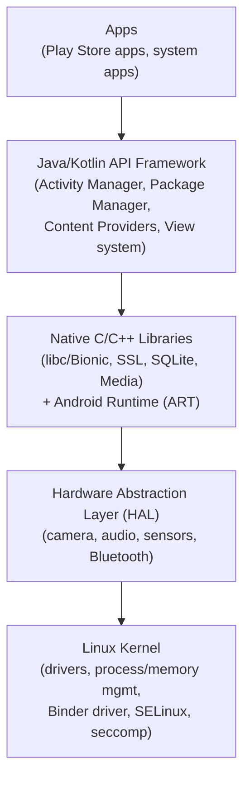
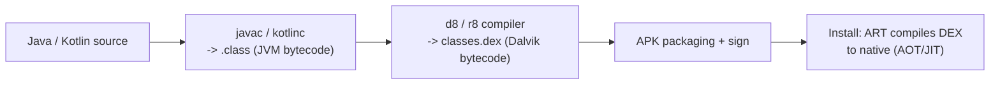
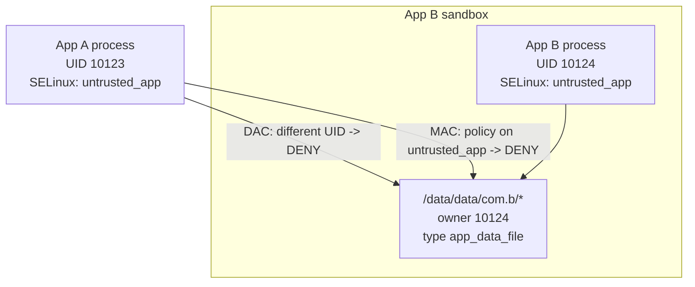
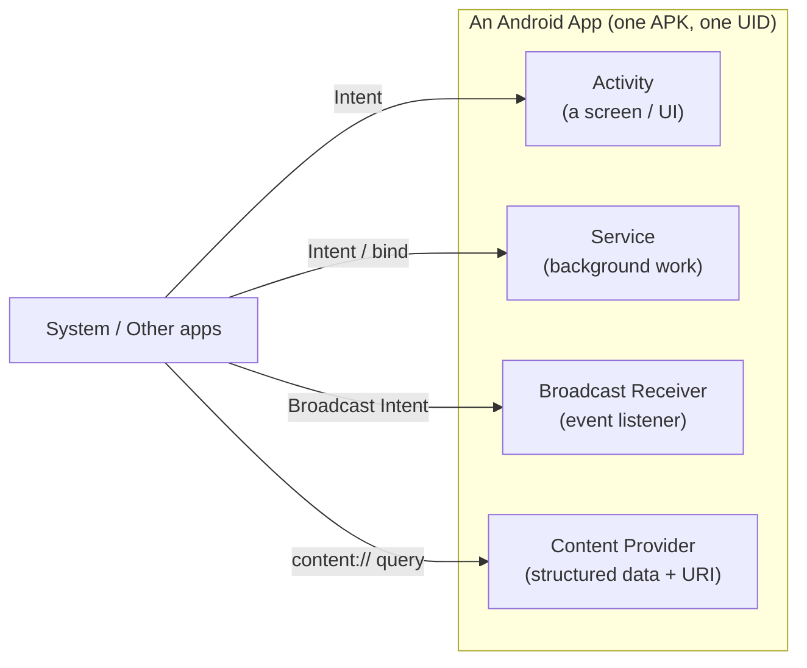
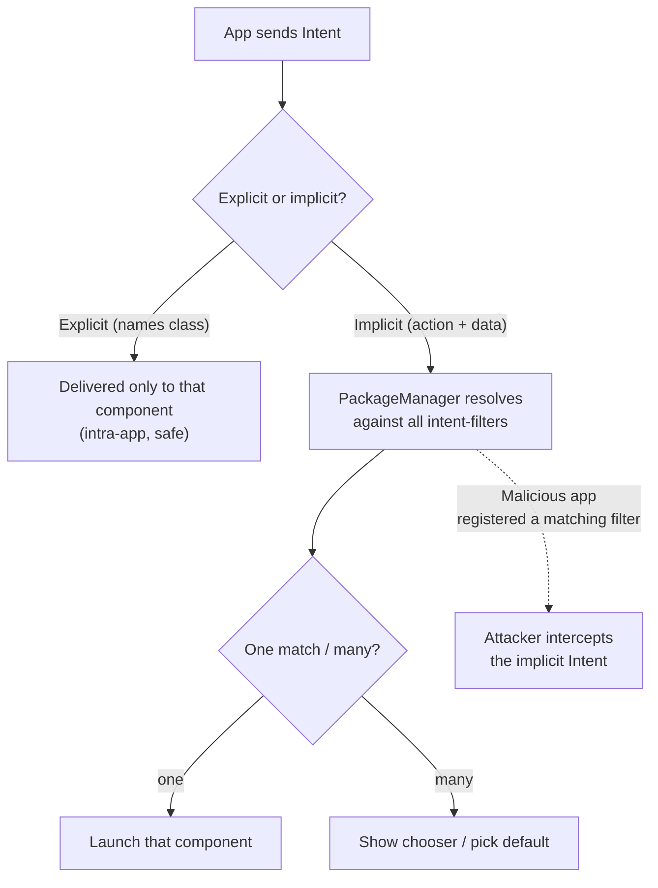
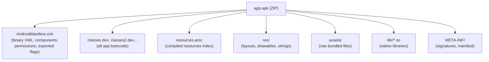
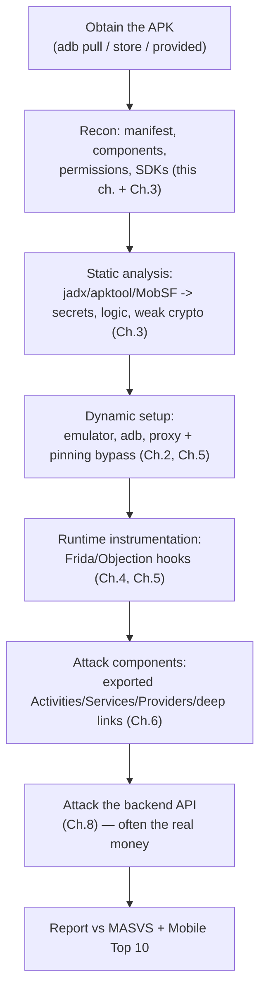

**Level:** Intermediate · **Track:** Mobile & IoT · **Read time:** 310 min

This is Chapter 1 of the Mobile & IoT notebook, and it opens the Android track. Everything the rest of this notebook does to a mobile app — intercepting its traffic, decompiling it, hooking its methods at runtime, bypassing its root and pinning checks, abusing its exported components — only makes sense once you understand what an Android app *is*: a package of bytecode and resources, run by a managed runtime, inside a per-app sandbox enforced by the Linux kernel, talking to the rest of the phone almost entirely through a single IPC mechanism called Binder. This chapter builds that mental model from the ground up. Nothing here is a checklist to memorise; it is the substrate the whole track sits on, in exactly the way the Linux chapters were the substrate for the server-side work.

**Who this is for:** application security engineers who now have a mobile app in scope and have only ever tested web apps; pentesters and bug-bounty hunters moving into the mobile programmes on HackerOne and Bugcrowd, where the payout tables are less crowded than web; CTF players hitting their first Android reversing or `adb` challenge; and blue-teamers who ship an Android app and need to know what a reviewer will look for. You do not need prior Android development experience. You do need the Linux fundamentals from the earlier notebooks — processes, UIDs, file permissions, SELinux — because Android is a Linux system wearing an unusual coat, and almost every security boundary on the device is a Linux boundary underneath.

Everything in this chapter is for apps you own, apps you are explicitly authorised to test, or deliberately-vulnerable training apps. Decompiling and instrumenting a third-party app you have no permission to assess can breach the app's terms, local computer-misuse law, and the developer's copyright. Build the lab against the intentionally-vulnerable targets named at the end — DIVA, InsecureBankv2, the MASTG crackmes — and keep real-world testing inside a signed scope.

---

## Part 1: What "Mobile Attack Surface" Actually Means

Web security trained you to think of an application as something that lives on a server you cannot see, reached over HTTP, where the client is a browser you do not control. Mobile inverts almost every one of those assumptions, and the inversions are the whole reason mobile testing is a distinct discipline.

The single most important shift: **on mobile, the attacker has the client.** The APK is on the device, the device can be rooted, and every byte of the app's code, resources and embedded secrets is sitting in the attacker's hand. In web testing you rarely get the server's source. In mobile testing you *always* get the client's compiled code, and modern decompilers turn it back into near-readable Java or Kotlin in seconds. This is why "we obfuscated it" and "the check happens in the app" are not security controls — they are speed bumps. Anything the app can do, an attacker who owns the device can make it do.

That reframing produces a specific attack surface. It is worth naming the pieces up front, because the rest of the notebook is a tour through them:

| Surface | What lives there | Typical weaknesses |
|---|---|---|
| **Local storage** | SharedPreferences, SQLite DBs, files in the app sandbox, the KeyStore | Secrets in plaintext, world-readable files, tokens cached forever, PII in logs |
| **The binary itself** | DEX bytecode, native `.so` libraries, embedded strings/keys | Hardcoded API keys, weak crypto, business logic you can read, no obfuscation |
| **IPC / components** | Activities, Services, Broadcast Receivers, Content Providers, deep links | Exported components, unprotected intents, SQL injection in a provider, intent redirection |
| **Network** | REST/GraphQL to a backend, TLS config, certificate pinning | No pinning (trivial MITM), weak TLS, sensitive data in transit, cleartext traffic |
| **The backend API** | The server the app talks to | Broken auth, IDOR, mass assignment — everything from the web notebooks, now behind a client that hid the endpoints |
| **Platform interaction** | Permissions, WebViews, clipboard, biometrics, the runtime | Over-broad permissions, `addJavascriptInterface` RCE, insecure biometric flows |

Two of those rows deserve emphasis because they are where beginners waste time and where experts find bugs. First, **the backend API is usually where the money is.** A mobile app is often just a skin over the same REST API the website uses, and the app is the easiest way to *discover* that API — the endpoints, the parameters, the auth scheme — because you can decompile it and read them. Many "mobile" bug bounty findings are ordinary server-side IDOR or broken-auth bugs that you only found because the app leaked the endpoint. Chapter 8 of this notebook is dedicated to exactly that. Second, **the IPC surface is unique to mobile** and has no real web equivalent — an Android app is a collection of components other apps on the device can talk to, and getting that boundary wrong is a whole bug class (Chapter 6).

**Bug-bounty framing.** Mobile scopes are less contested than web. On a mature web target, the low-hanging fruit was picked years ago; on the same company's Android app, you are often one of a handful of people who bothered to decompile it. The skills in this chapter — pull the APK, read the manifest, find the exported provider, dump the hardcoded key — are exactly what turns "I have an APK" into "I have a report."

### Web vs mobile: the threat model, side by side

It helps to make the inversion explicit, because most people arrive at mobile from a web background and carry the wrong instincts:

| Dimension | Web app | Mobile (Android) app |
|---|---|---|
| Who holds the code | Server; client is HTML/JS you *partly* see | **Client fully in attacker's hands** — full compiled bytecode |
| Trust boundary | Browser sandbox; same-origin policy | OS sandbox (per-app UID + SELinux); IPC across apps |
| "The client" | A browser you don't control | A device the attacker can **root** and fully control |
| Discovering endpoints | Proxy the traffic, read JS | Proxy traffic **and decompile the app to read them directly** |
| Unique attack surface | CORS, cookies, DOM | **IPC components, deep links, WebView bridges, local storage** |
| Defeating client checks | Edit requests in a proxy | Edit requests, **patch the binary, or hook methods at runtime** |
| Where real authz must live | Server | Server (even more so — the client is fully controlled) |

The through-line: **mobile gives the attacker strictly more power over the client than web does**, which is exactly why "trust the client" fails harder here and why so much of the methodology is about reading and rewriting a client you completely own.

One more distinction worth setting now — **Android vs iOS**, since this notebook does both (Chapter 7 is iOS). Android is open, sideloadable, and easy to root, so getting the app and instrumenting it is low-friction; iOS is a walled garden where the hard part is often just getting a decrypted binary off a jailbroken device. The *concepts* — sandboxing, IPC, insecure storage, no pinning, weak crypto, backend bugs — are the same; the *tooling and friction* differ. Master the Android flow first because it is the gentler on-ramp, then Chapter 7 maps every concept onto iOS.

Before any of that, though, you have to know how the platform is put together, because every one of those weaknesses is a failure of a specific layer. That is Part 2.

---

## Part 2: The Android Software Stack, From the Kernel Up

Android is not "Java on a phone." It is a full operating system, layered, and each layer enforces or undermines security in its own way. The canonical picture is a five-layer stack. We will build it from the bottom, because the bottom is where the real security boundaries live.



### Layer 1 — The Linux kernel

At the very bottom is a Linux kernel — a real one, forked from mainline with Android-specific additions. This is not a metaphor; `uname -a` on an Android device prints a Linux version. The kernel gives Android everything Linux gives any system: process isolation, a permission model built on user IDs (UIDs) and group IDs (GIDs), memory management, and device drivers. **Every app-sandbox boundary on Android is, underneath, a Linux UID boundary** — a fact we will lean on hard in Part 5.

Android adds several things to the stock kernel that matter for security:

- **Binder** — a kernel driver (`/dev/binder`) implementing the IPC mechanism the entire framework is built on. Almost every time your app "calls the system," it is a Binder transaction. Binder is important enough to get its own section (Part 3).
- **Ashmem / ion / dmabuf** — shared-memory subsystems used to pass large buffers (like a bitmap) between processes without copying.
- **The Low Memory Killer** — decides which app processes to kill under memory pressure.
- **`paranoid networking`** — the kernel restricts raw socket and network access to specific GIDs, so an app must hold the `INTERNET` permission (which maps to a GID) to open a socket at all.
- **SELinux** — Security-Enhanced Linux, running in *enforcing* mode on every modern Android device, providing mandatory access control on top of the UID model (Part 5).
- **seccomp-bpf** — a syscall filter applied to app processes, shrinking the kernel attack surface by blocking syscalls apps have no business making.

**Red-team relevance:** because it is a Linux kernel, kernel privilege-escalation on Android is the same game as on any Linux box — a vulnerable driver or a use-after-free reachable from an app's seccomp-allowed syscall set gets you from the app sandbox to root. Public Android rooting exploits (Dirty COW, the various Qualcomm/Mali GPU driver bugs) are Linux kernel exploits. **Blue-team relevance:** SELinux and seccomp are the two controls that most reduce the blast radius of an app compromise, which is why "SELinux permissive" on a production build is an immediate finding.

### Layer 2 — The HAL (Hardware Abstraction Layer)

Above the kernel sits the HAL: a set of standard C/C++ interfaces that let the framework talk to hardware (camera, audio, sensors, GPS, Bluetooth, the fingerprint sensor) without knowing the specific chip. Each hardware vendor ships a HAL implementation as a shared library the system loads. From a security standpoint the HAL matters because it is native code running in system processes — HAL bugs (a malformed image crashing the camera HAL, a Bluetooth HAL parsing bug) are a real remote and local attack surface, and several BlueBorne-style Bluetooth bugs lived here.

### Layer 3 — Native libraries and the runtime

This layer has two halves. The first is a set of native C/C++ libraries the platform ships: **Bionic** (Android's slimmer libc, not glibc), **BoringSSL/OpenSSL** for crypto and TLS, **SQLite** for the databases every app uses, media codecs (Stagefright lived here — the 2015 bug that let an MMS video own your phone), the graphics stack, and WebKit/Chromium for WebView. Apps reach these through the framework, but an app can also ship and load its own native libraries (the `.so` files inside the APK), which is where performance-critical code, obfuscated logic and anti-tamper checks often hide.

The second half is the **Android Runtime (ART)** — the managed runtime that executes app bytecode. It replaced the older Dalvik VM in Android 5.0. ART is important enough that Part 4 covers it and the DEX format together, because the DEX file *is* the app's code and reading it is the whole first half of any mobile assessment.

### Layer 4 — The Java/Kotlin API framework

This is the layer app developers actually see: the classes and services in the `android.*` and `androidx.*` packages. The big ones are system services running in a process called `system_server`:

- **Activity Manager Service (AMS)** — starts, stops and schedules Activities and the app lifecycle; routes Intents.
- **Package Manager Service (PMS)** — installs, verifies signatures, tracks which app holds which permission, resolves which component handles an Intent.
- **Window Manager, View system, Resource manager, Notification manager, Location manager, Telephony**, and dozens more.

Your app never talks to these directly in-process — it holds a *proxy* object and every method call is a Binder transaction to `system_server`. That indirection is the security-critical part: the framework can check the caller's UID and permissions on the far side of every call.

### Layer 5 — Applications

The top layer is apps: the ones you install, plus system apps (Settings, Phone, the Play Store client) that ship with the OS and often hold elevated permissions. From the kernel's point of view there is nothing special about a system app except the UID it runs as and the permissions and SELinux context it was granted. This uniformity — "everything is just a process with a UID" — is the theme that ties the whole stack together and the reason Linux knowledge transfers directly.

### Version milestones that changed the security model

Android's defenses were built incrementally, and each milestone maps directly to a decision the app's `targetSdkVersion` opts into or out of. When you see a low `targetSdk` in the manifest, this table tells you *which* protections the app has declined — which is often the first paragraph of a findings report.

| Android (API) | Security change that matters to a tester |
|---|---|
| 4.3 (18) | SELinux introduced (permissive, then enforcing in 5.0) |
| 5.0 (21) | ART replaces Dalvik; full-disk encryption default push |
| 6.0 (23) | **Runtime permissions** — dangerous perms prompt at use, not install |
| 7.0 (24) | **APK Signature Scheme v2**; user CA certs no longer trusted by apps by default (a huge deal for MITM — Chapter 2) |
| 8.0 (26) | Background execution limits; implicit-broadcast restrictions |
| 9.0 (28) | **Signature Scheme v3** (key rotation); `usesCleartextTraffic` defaults to *false*; per-app SELinux sandbox (each app its own type) |
| 10 (29) | **Scoped storage** — apps can no longer roam the SD card freely |
| 11 (30) | Signature v4; package-visibility restrictions (`QUERY_ALL_PACKAGES`) |
| 12 (31) | **`android:exported` must be explicit** for filter'd components; `PendingIntent` mutability must be explicit |
| 13 (33) | Runtime notification permission; tighter intent filtering |
| 14 (34) | Minimum installable `targetSdk` raised; stricter implicit-intent/receiver rules |

The two rows every tester memorises: **API 24** (user-added CA certs stopped being trusted, which is *the* reason MITM setup got harder and Chapter 2 spends time on the `network_security_config`), and **API 31** (the exported-must-be-explicit fix that closed the intent-filter footgun for new apps). An app with `targetSdk` below 24 will trust a proxy CA you install with no config change at all — a gift.

---

## Part 3: Binder — the Nervous System of Android

If you learn one thing about Android internals that most testers skip, make it Binder. Nearly every security decision on the device happens at a Binder boundary.

### Why Binder exists

Traditional Linux IPC — pipes, System V shared memory, Unix sockets — was considered too heavyweight, too slow, or too hard to secure for the fine-grained, high-frequency, object-oriented IPC Android needed. Android's designers built **Binder**, a kernel driver that provides remote procedure calls between processes with three properties that matter for security:

1. **Caller identity is trustworthy.** The kernel stamps every transaction with the sender's real UID and PID. The receiver cannot be lied to about who is calling — it reads the identity from the kernel via `Binder.getCallingUid()`, not from anything the caller sent. This is the foundation of all permission enforcement.
2. **Object references, not raw memory.** Binder passes handles to objects (and can pass file descriptors), letting one process hold a reference to an object living in another process and call its methods as if local.
3. **Reference counting and death notification** across process boundaries, so the system knows when a component's client has gone away.

### How a Binder call flows

```mermaid
sequenceDiagram
    participant App as App process (UID 10123)
    participant K as Binder driver (kernel)
    participant SS as system_server (AMS)
    App->>App: startActivity(intent) on ActivityManager proxy
    App->>K: ioctl(BINDER_WRITE_READ) marshalled transaction
    K->>K: Stamp caller UID/PID, copy to target
    K->>SS: Deliver transaction to AMS thread
    SS->>SS: getCallingUid() -> 10123; check permission
    SS-->>K: Reply parcel (result or SecurityException)
    K-->>App: Deliver reply
```

The app calls a normal-looking Java method (`startActivity`) on a **proxy** (a `Stub.Proxy` generated from an AIDL interface). The proxy marshals the arguments into a **Parcel**, hands it to the Binder driver via `ioctl`, the driver copies it into the target process and tags it with the caller's UID/PID, and the target's Binder thread unmarshals it, does the work — including any permission checks, using the kernel-provided caller identity — and marshals a reply back.

**Why this matters to an attacker.** Every exported component, every system service, every content provider you interact with, you reach through Binder. When you send a crafted Intent to an exported Activity, you are initiating a Binder transaction. When a Content Provider fails to check `getCallingUid()`, that is the missing check. Binder is also itself an attack surface: bugs in the Binder driver (like CVE-2019-2215, a use-after-free in `/dev/binder` used in the wild) are kernel-privilege-escalation primitives, because Binder is reachable from *any* app with no special permission.

### Zygote and system_server

Two special processes complete the picture. **Zygote** is a process started at boot that preloads the ART runtime and the core framework classes into memory, then simply *waits*. When a new app launches, Zygote **forks** — a copy-on-write clone — so the new app process starts with the runtime and framework already warm, and, crucially, shared pages already mapped. This is why apps launch fast. **system_server** is forked from Zygote at boot too, and hosts AMS, PMS and the other core services.

The security consequence of the Zygote fork model: **every app process shares the same initial memory layout**, because they are all COW forks of the same parent. This historically weakened ASLR across apps (a leak in one process could inform an attack on another) and is why Android added extra per-process randomisation. It is also why a Zygote compromise is catastrophic — it is the parent of every app.

---

## Part 4: The Android Runtime (ART), DEX and Smali

The app's code is the first thing you look at in an assessment, so you have to understand the format it is in.

### From Java/Kotlin to DEX

Android apps are written in Java or Kotlin (and increasingly Kotlin), but the device does not run Java `.class` files. The build pipeline is:



`.class` files (stack-based JVM bytecode) are converted by **d8** (or **r8**, which also shrinks and obfuscates) into a **DEX** file — *Dalvik Executable*. DEX is a single file, `classes.dex`, that packs *all* the app's classes together (large apps split into `classes2.dex`, `classes3.dex`, …). DEX is **register-based** bytecode, not stack-based — it was designed to be compact and efficient on memory-constrained devices.

### ART: how the bytecode actually runs

The original **Dalvik** VM interpreted DEX and JIT-compiled hot paths. **ART** (Android RunTime), default since Android 5.0, changed the model:

- On install (or in idle-time background compilation), ART **ahead-of-time (AOT)** compiles DEX to native machine code (`.oat`/`.odex` files in `/data/dalvik-cache` or the app's `oat` directory), so the app runs as native code — faster, more battery-efficient.
- Modern ART is a **hybrid**: it interprets first, JIT-compiles hot methods, records a *profile* of what is hot, and later AOT-compiles those profiled methods in the background. This is "profile-guided compilation."

For a tester, ART's importance is indirect but real: it is why the *distributable* artifact is still the DEX (portable bytecode), which is what you decompile — the AOT native code is device-specific and regenerated on install. So the thing you attack is always the DEX, and the thing you read is its disassembly.

### Smali — DEX assembly you can actually edit

You will rarely read raw DEX bytes. You will read **Smali**, the human-readable assembly language for DEX (named after the Icelandic for "assembler"; its counterpart disassembler is "baksmali"). `apktool` disassembles `classes.dex` into `.smali` files, one per class, which you can *edit and reassemble* — this is the basis of patching an app (e.g. flipping a root-detection check to always return false, Chapter 5).

A tiny taste of Smali. This Java:

```java
public boolean isRooted() {
    return new File("/system/bin/su").exists();
}
```

disassembles to roughly:

```smali
.method public isRooted()Z
    .locals 2
    new-instance v0, Ljava/io/File;
    const-string v1, "/system/bin/su"
    invoke-direct {v0, v1}, Ljava/io/File;-><init>(Ljava/lang/String;)V
    invoke-virtual {v0}, Ljava/io/File;->exists()Z
    move-result v0
    return v0
.end method
```

Registers are `v0`, `v1`; types use JVM descriptors (`Z` = boolean, `Ljava/io/File;` = the class). To defeat this check by patching, you would replace the body with `const/4 v0, 0x0` then `return v0` — hardcoding `false`. You will do exactly this later; for now the point is that DEX/Smali is fully reversible and editable, so **client-side checks are advisory, not enforcing.**

Higher up the tool stack, **jadx** decompiles DEX all the way back to readable *Java* (not just Smali), which is what you use to *understand* an app quickly. Smali is what you use to *modify* it. Part 8's lab uses both.

---

## Part 5: The App Sandbox — UIDs, SELinux and Permissions

This is the heart of Android's security model, and it is almost entirely built out of ordinary Linux primitives.

### One app, one UID

When an app is installed, the Package Manager assigns it a **unique Linux UID** (app UIDs start at 10000 / `u0_a0`, incrementing per app). The app's files live in `/data/data/<package>/` (or `/data/user/0/<package>/`), owned by that UID with permissions that exclude everyone else. Because Linux already isolates processes by UID, **the app sandbox is free** — App A (UID 10123) simply cannot read App B's (UID 10124) files, for the same reason one Linux user cannot read another's home directory.

You can see this directly:

```console
$ adb shell ps -A | grep com.example
u0_a213  12984  1102  ... com.example.target

$ adb shell ls -l /data/data/com.example.target/
drwxrwx--x 3 u0_a213 u0_a213 ... databases
drwxrwx--x 2 u0_a213 u0_a213 ... shared_prefs
```

The owner is `u0_a213` (user 0, app 213 → UID 10213) and the mode excludes "other." The `x`-only on "other" historically let *other* apps traverse into a *named* subpath if they somehow knew it and it was world-readable — the root of many old "world-readable file" bugs. Modern Android tightened this, and SELinux now blocks cross-app access even when the DAC bits are loose.

**Shared UIDs (legacy, important to recognise).** Two apps signed by the same key could historically request `android:sharedUserId` in the manifest and run under the *same* UID, sharing files and permissions. This is deprecated and dangerous — it collapses the sandbox between those apps — and seeing it in a manifest is a finding worth noting.

### SELinux: mandatory access control on top

UID isolation (Discretionary Access Control) is not enough on its own, because root (UID 0) bypasses it and because a bug in a privileged process could still touch anything. Android enforces **SELinux in enforcing mode** on every device since 5.0, giving *Mandatory* Access Control: every process runs in a **domain** (e.g. `untrusted_app`), every file has a **type**, and policy rules explicitly allow specific domain→type actions. Anything not explicitly allowed is denied, *even for root*. This is why, on a modern device, an app-context process cannot read another app's data or most of the system even if the Linux permissions were misconfigured — the SELinux policy for `untrusted_app` forbids it.



**Blue-team / build-review note:** an app cannot change SELinux, but a *device* can be shipped `permissive` (common on cheap/rooted OEM builds and emulators). Detecting that the runtime is permissive is part of a real device-trust assessment, and it is exactly the environment a tester *wants* (an emulator you control), so the same signal means opposite things to attacker and defender.

### The permission model

Beyond the sandbox, apps request **permissions** to reach resources outside their own UID (network, camera, contacts, location, storage). Permissions have protection levels:

| Level | Meaning | Examples |
|---|---|---|
| **normal** | Low risk; granted automatically at install | `INTERNET`, `VIBRATE`, `ACCESS_NETWORK_STATE` |
| **dangerous** | Touches user privacy; prompts the user at runtime (since Android 6.0) | `CAMERA`, `ACCESS_FINE_LOCATION`, `READ_CONTACTS`, `READ_SMS` |
| **signature** | Granted only to apps signed with the *same key* as the definer | System-app-to-system-app permissions; custom app-to-companion-app perms |
| **signatureOrSystem / privileged** | Reserved for system-image apps | OEM/carrier apps |

Several of these map straight to Linux GIDs — holding `INTERNET` puts your process in the `inet` group, which is what the kernel's paranoid-networking check actually gates on. Runtime (dangerous) permissions are the user-facing prompts you know; the interesting part for testing is **custom permissions** an app *defines* to protect its own components. A custom permission at `signature` level means "only my other apps can call this component"; a custom permission carelessly left at `normal` means "any app can call it," which is a classic component-exposure bug (Chapter 6).

**Bug-bounty framing:** over-broad permissions are rarely a standalone bounty, but they are a strong *signal* on the manifest — an app requesting `READ_SMS`, `SYSTEM_ALERT_WINDOW`, or `QUERY_ALL_PACKAGES` without obvious need tells you where sensitive functionality and potential abuse live, and pairs with exported-component bugs to build impact.

### Where the app's data actually lives on disk

The sandbox is not one directory — it is a small set of them, each with different visibility, and knowing which is which is the difference between "the token is stored insecurely" and a vague hunch. Every one is inside the app's UID-owned tree unless noted:

| Location | Path | Visibility | What you find there |
|---|---|---|---|
| SharedPreferences | `/data/data/<pkg>/shared_prefs/*.xml` | App UID only | Key/value settings, and — insecurely — session tokens, PINs, "remember me" flags, feature toggles. **Plaintext XML.** |
| Databases | `/data/data/<pkg>/databases/*.db` | App UID only | SQLite: user records, cached messages, and (M9) plaintext credentials/PII. Open with `sqlite3`. |
| Internal files | `/data/data/<pkg>/files/` | App UID only | Anything the app writes with `openFileOutput()` — caches, downloaded content, serialized objects. |
| Cache | `/data/data/<pkg>/cache/` | App UID only | Temp files; frequently leaks sensitive data the dev thought was ephemeral. |
| External (scoped) storage | `/sdcard/Android/data/<pkg>/` | Historically world/other-app readable | Media, exports, logs. The classic "sensitive file on the SD card" bug. |
| KeyStore-backed keys | Not a readable file; keys live in the TEE/StrongBox | Hardware-isolated | The *correct* place for secrets — you can use a key but not extract it. |

**The single fastest data-storage bug:** decrypt nothing, just read the XML. On a rooted device or debuggable app:

```console
$ adb shell run-as com.example.target cat shared_prefs/session.xml
<?xml version='1.0' encoding='utf-8' standalone='yes' ?>
<map>
    <string name="auth_token">eyJhbGciOiJIUzI1NiIsInR5cCI6IkpXVCJ9...</string>
    <boolean name="biometric_enabled" value="true" />
    <string name="last_user">alice@example.com</string>
</map>
```

`run-as <pkg>` runs a shell command *as the app's UID* — allowed for a `debuggable` app without root, which is why `debuggable="true"` in a release build is so damaging. There is the session JWT in plaintext (M9), and the JWT itself is base64 you can decode to read its claims — a finding you can write up before you have even touched the network. The same `run-as` trick lets you `sqlite3 databases/accounts.db "select * from users;"` to dump a database.

**Blue-team fix, restated concretely:** that `auth_token` belongs in `EncryptedSharedPreferences` (keyed from the KeyStore) at minimum, and ideally is a short-lived token the server can revoke — so that even a full sandbox compromise yields only a token that expires, not a permanent credential.

---

## Part 6: The Four App Components

An Android app is not a single program with a `main()`. It is a bundle of **components**, each an entry point the system (or another app) can activate independently. There are four, and they are the entire IPC attack surface. Chapter 6 goes deep on abusing them; here you learn what they are and why "exported" is the word that matters.



- **Activity** — a single screen with a UI. Launching an app opens its main Activity; navigating opens others. Started with an **Intent**. If an Activity is *exported*, another app can launch it directly — jumping past a login screen, or triggering a "reset password" screen with attacker-controlled extras, are classic bugs.
- **Service** — background work with no UI (playing audio, syncing, a long download). *Started* or *bound* via Intent. An exported Service can be commanded by other apps.
- **Broadcast Receiver** — responds to system-wide or app broadcasts (`BOOT_COMPLETED`, `SMS_RECEIVED`, a custom app event). An exported receiver can be *spoofed* — another app sends a fake broadcast the receiver trusts.
- **Content Provider** — exposes structured data (usually SQLite) behind a `content://` URI, the standard way to share data between apps (the Contacts provider is the canonical example). Exported providers are a top-tier bug source: **SQL injection** in the provider's query, path traversal in a file-serving provider, or plain unauthorised data access.

### "Exported": the one word to internalise

Every component has an **`android:exported`** attribute in the manifest. `exported="true"` means *other apps and the system* can activate this component. `exported="false"` means only the app's own UID can. The rule for `exported` when it is not stated:

- **If a component declares an `<intent-filter>`, it defaults to `exported="true"`** (because a filter implies "I want to receive intents from outside"). This default has burned countless apps.
- If it has no intent-filter, it defaults to `exported="false"`.
- **Since Android 12 (API 31),** any component with an intent-filter *must* declare `android:exported` explicitly or the app won't install — a platform fix for exactly this footgun. Older `targetSdk` apps still get the dangerous default.

The whole of exported-component testing is: enumerate every component, determine which are truly exported (attribute, intent-filter, and any guarding permission), then poke each reachable one with crafted Intents/queries. You will do the enumeration in Part 8 and the exploitation in Chapter 6.

### Intents — how components are actually reached

You cannot understand component security without understanding **Intents**, the messaging objects that activate three of the four component types (Activities, Services, Broadcast Receivers). An Intent is a small bundle describing "something to do," and it comes in two flavours, the distinction between which is a security control in its own right:

- **Explicit Intent** — names the exact target component by class (`new Intent(this, PostLogin.class)`). Delivery is unambiguous; no other app can intercept it. This is how an app should talk to *its own* internal components.
- **Implicit Intent** — describes an *action* and optional *data*/*category* but names no component (`new Intent(Intent.ACTION_VIEW, Uri.parse("https://..."))`). The system resolves it against every installed app's `<intent-filter>`s and may show a chooser or launch whichever app registered for it. Implicit Intents are the interop mechanism — and the attack surface, because *any* app can register a matching filter.

An Intent carries **extras** — a key/value `Bundle` of arbitrary data (`intent.putExtra("amount", 5000)`). A receiving component that trusts its extras without validation is the root of many component bugs: a `ChangePassword` Activity that reads a `username` extra and changes *that* account's password, launched by any app, is a real InsecureBankv2 flaw.



Two Intent-related bug classes to keep in mind for Chapter 6, named here so the vocabulary is set:

- **Intent interception / hijacking:** a sensitive implicit Intent (carrying a token, a file URI) can be caught by a malicious app that registered a matching filter. The fix is to make the Intent *explicit* or restrict it with a package/component name.
- **Intent redirection ("Intent forwarding"):** an exported component receives an Intent and blindly `startActivity()`s an Intent it *extracted from the extras* — letting an attacker use the victim app's privileges to launch a component the attacker could not reach directly (e.g. a non-exported internal Activity). This is a top-tier Android bounty pattern.

**Deep links** are the web-facing form of implicit Intents: an `<intent-filter>` with `ACTION_VIEW`, category `BROWSABLE`, and a `<data android:scheme="https" android:host="app.example.com"/>` (an **App Link**) or a custom scheme (`myapp://`) makes the app launchable from a URL in a browser or another app. Deep links are a large attack surface — unvalidated parameters flowing from a URL into a WebView or an internal action — and get their own treatment in Chapter 6. For now: every `<data>` element in an intent-filter is a URL-reachable entry point into the app, and you enumerate them from the manifest exactly like exported components.

A `PendingIntent` is worth naming too: a token that wraps an Intent *plus the sending app's identity and permissions*, handed to another component so it can fire that Intent **as the granting app** later. A mutable `PendingIntent` handed to an untrusted party is a privilege-escalation primitive (the recipient can fill in the blank fields), which is why Android 12 forced developers to declare `FLAG_IMMUTABLE`/`FLAG_MUTABLE` explicitly.

### WebViews — a browser inside the app

One platform component deserves early mention because it is where a large fraction of serious mobile bugs live: the **WebView**, an embeddable Chromium/Blink browser an app uses to render web content (help pages, OAuth flows, whole "hybrid" apps built in HTML/JS). A WebView collapses the web attack surface *into* the native app, and its dangerous settings are all worth recognising in decompiled code:

- **`addJavascriptInterface(obj, "name")`** exposes a Java object's methods to JavaScript running in the WebView. On apps targeting API < 17 (or via reflection tricks), this historically gave **JavaScript → arbitrary Java → RCE as the app** the instant an attacker controlled the loaded page (a MITM'd `http://` help page, an XSS in loaded content). Even today it is a code-execution bridge to guard tightly.
- **`setJavaScriptEnabled(true)`** plus loading attacker-influenced or cleartext URLs turns any XSS or MITM into script execution in a privileged app context.
- **`setAllowFileAccess(true)` / `setAllowUniversalAccessFromFileURLs(true)`** can let a loaded page read `file://` URLs — reaching into the app's private storage (steal that `session.xml`).
- **`shouldOverrideUrlLoading`** implemented carelessly turns the WebView into an open redirector or a deep-link injection point.

The rule for reviewers and testers: **find every `WebView` in the decompiled code, read its `getSettings()` calls, and check what URLs it loads.** A JavaScript-enabled WebView loading a URL an attacker can influence, with a JavaScript interface attached, is one of the highest-impact findings in the mobile catalogue. Chapter 6 exploits these; recognise the primitive now.

---

## Part 7: Anatomy of an APK

The APK (*Android Package Kit*) is the app's distributable file. It is, structurally, **a ZIP archive** — you can literally `unzip` it. Understanding its contents tells you exactly where to look for what.



| Entry | Contents | Why a tester cares |
|---|---|---|
| `AndroidManifest.xml` | App package name, `minSdk`/`targetSdk`, all four component declarations, permissions requested and defined, `exported` flags, `debuggable`, `allowBackup`, `usesCleartextTraffic`, deep-link filters | **The single most valuable file.** It is a map of the entire attack surface. Note: it is stored as *binary* XML, so you need `apktool`/`aapt` to read it, not a text editor. |
| `classes*.dex` | All compiled bytecode | Decompile with jadx to read logic, find hardcoded secrets, understand checks |
| `resources.arsc` | Compiled table mapping resource IDs → values (strings, dimensions) | Hardcoded URLs, API keys and secrets often sit in `res/values/strings.xml`, indexed here |
| `res/` | XML layouts, drawables, `values/strings.xml`, `xml/network_security_config.xml` | The network security config controls cleartext and pinning — critical for Chapter 2 |
| `assets/` | Arbitrary bundled files (HTML for WebViews, ML models, config, sometimes *another* encrypted DEX) | Packers hide a second-stage DEX here; config files leak endpoints |
| `lib/<abi>/*.so` | Native libraries per CPU ABI (`arm64-v8a`, `armeabi-v7a`, `x86_64`) | Native anti-tamper, crypto, and obfuscated logic; reversed with Ghidra/radare2 |
| `META-INF/` | `MANIFEST.MF`, `CERT.SF`, `CERT.RSA` (v1 signing), plus the app's certificate | Tells you who signed it and how; tampering breaks these |

### APK signing — v1 through v4

Every APK **must be signed** to install; Android has no notion of an "unsigned but trusted" app, and the signature is what enforces the *update-integrity* guarantee (an update must be signed by the same key as the installed app — this is what stops a malicious "update"). There are four schemes, and which ones an APK uses tells you something about it:

| Scheme | Since | How it works | Weakness it fixed |
|---|---|---|---|
| **v1 (JAR signing)** | Always | Signs individual files, digests stored in `META-INF/`. | Slow to verify; **doesn't cover the ZIP metadata**, enabling the "Janus"/Master-Key style tampering where files could be added |
| **v2 (APK Signature Scheme v2)** | Android 7.0 | Signs the *whole APK file* as a blob (an "APK Signing Block" before the central directory). Any byte change breaks it. | Whole-file integrity; much faster verify |
| **v3** | Android 9.0 | v2 + **key rotation** (an app can change signing keys with a proof-of-continuity). | Lets developers rotate a compromised key |
| **v4** | Android 11 | Incremental-install signature (a separate `.idsig`) for streaming installs. | Enables ADB Incremental install of huge apps |

For testing, the practical fact is: **when you patch and re-sign an APK (Chapter 5), you break the original signature and re-sign with your own debug key.** That is fine on your own device/emulator, but it is why the *update* path breaks (different key) and why an app with server-side signature attestation (Play Integrity) can tell it has been re-signed. Understanding this now saves confusion later.

---

## Part 8: Hands-On Lab — Pull, Unzip and Decompile a Real APK

Time to make all of the above concrete. We will take an APK, examine it as a ZIP, decompile it with jadx, disassemble it with apktool, and read the manifest for exported components and insecure flags. Use a deliberately-vulnerable target — **InsecureBankv2** or **DIVA** (Damn Insecure and Vulnerable App) — on an emulator you own. The commands are the same for any APK.

### 8.1 Tool-from-scratch: the Android SDK platform tools (`adb`)

**What it is.** `adb` (Android Debug Bridge) is the command-line tool that talks to a device or emulator over USB or TCP. It has three parts: a **client** (the `adb` command you run), a **server** (a background process on your machine that multiplexes connections), and a **daemon** (`adbd`) running on the device. You use it to list devices, install/pull APKs, get a shell, forward ports and read logs — it is the backbone of every hands-on chapter in this track.

**Install on Kali:**

```console
$ sudo apt update && sudo apt install -y android-sdk-platform-tools-common adb
$ adb version
Android Debug Bridge version 1.0.41
Version 34.0.5-debian
```

**Core workflow — confirm a device, then find and pull the target APK:**

```console
$ adb devices -l
List of devices attached
emulator-5554   device product:sdk_gphone64_x86_64 model:sdk_gphone64_x86_64

# List installed packages, filter for the target
$ adb shell pm list packages | grep -i bank
package:com.android.insecurebankv2

# Ask the package manager for the on-device path of its APK
$ adb shell pm path com.android.insecurebankv2
package:/data/app/~~kQ1w../com.android.insecurebankv2-Vh9../base.apk

# Pull it to your machine
$ adb pull /data/app/~~kQ1w../com.android.insecurebankv2-Vh9../base.apk insecurebank.apk
/data/app/.../base.apk: 1 file pulled, 4.2 MB/s (2874113 bytes in 0.653s)
```

Flags used: `pm list packages` lists installed packages; `pm path <pkg>` prints the APK path (apps can be split across multiple APKs — `base.apk` plus `split_*.apk` — pull them all for a split app); `adb pull <remote> <local>` copies a file off the device.

### 8.2 An APK is a ZIP

Prove it, and look at the layout:

```console
$ file insecurebank.apk
insecurebank.apk: Android package (APK), with APK Signing Block

$ unzip -l insecurebank.apk | head -20
Archive:  insecurebank.apk
  Length      Date    Time    Name
---------  ---------- -----   ----
     3812  1980-01-01 00:00   AndroidManifest.xml
  1284736  1980-01-01 00:00   classes.dex
    98304  1980-01-01 00:00   resources.arsc
     ...                      res/layout/activity_login.xml
     ...                      res/values/strings.xml
     ...                      META-INF/CERT.RSA
     ...                      META-INF/CERT.SF
     ...                      META-INF/MANIFEST.MF
```

There it is: the binary manifest, `classes.dex`, `resources.arsc`, `res/`, and the v1 `META-INF/` signature files. If you try to `cat AndroidManifest.xml` after extracting, you get binary garbage — it is compiled binary XML, which is why we need real tools.

### 8.3 Tool-from-scratch: `apktool`

**What it is.** `apktool` reverse-engineers an APK into a working directory: it **decodes the binary `AndroidManifest.xml` and `resources.arsc` back to readable XML**, and disassembles `classes.dex` into **Smali**. Critically, it is *round-trippable* — you can edit the Smali/resources and `apktool b` to rebuild a modified APK (used for patching in Chapter 5). It does not give you Java; it gives you editable assembly and readable resources.

**Install and use:**

```console
$ sudo apt install -y apktool
$ apktool --version
2.9.3

$ apktool d insecurebank.apk -o insecurebank_src
I: Using Apktool 2.9.3 on insecurebank.apk
I: Loading resource table...
I: Decoding AndroidManifest.xml with resources...
I: Decoding file-resources...
I: Decoding values */* XMLs...
I: Baksmaling classes.dex...
I: Copying assets and libs...

$ ls insecurebank_src
AndroidManifest.xml  apktool.yml  original  res  smali
```

Flags: `d` = decode; `-o` names the output directory; `apktool.yml` records metadata (the `targetSdkVersion`, whether resources were decoded) needed to rebuild. Now `AndroidManifest.xml` is readable text and `smali/` holds one `.smali` file per class.

### 8.4 Tool-from-scratch: `jadx`

**What it is.** `jadx` is a DEX-to-Java decompiler: it turns `classes.dex` straight into readable *Java* source (best-effort — decompilation isn't perfect, but it is remarkably good). `jadx` (CLI) writes source to disk; `jadx-gui` is a searchable GUI that is the fastest way to explore an unfamiliar app. This is your primary *reading* tool, complementing apktool's *editing* view.

```console
$ sudo apt install -y jadx
$ jadx --version
1.5.0

# Decompile to a source tree
$ jadx insecurebank.apk -d insecurebank_java
INFO  - loading ...
INFO  - processing ...
INFO  - done

$ find insecurebank_java/sources -name '*.java' | head
insecurebank_java/sources/com/android/insecurebankv2/LoginActivity.java
insecurebank_java/sources/com/android/insecurebankv2/PostLogin.java
insecurebank_java/sources/com/android/insecurebankv2/DoTransfer.java
insecurebank_java/sources/com/android/insecurebankv2/CryptoClass.java
...
```

Flags: `-d` sets the output directory. For interactive work, `jadx-gui insecurebank.apk` opens a tree you can search (Ctrl+Shift+F) for strings like `http://`, `password`, `SECRET`, or `AES`.

**Reading for secrets — a real pattern.** Open `CryptoClass.java` in InsecureBankv2 and you find something like:

```java
public class CryptoClass {
    String key = "This is the super secret key 123";
    String base64Text;
    byte[] cipherData;

    public byte[] aes256encrypt(byte[] iv, byte[] key, byte[] plaintext) ... {
        Cipher c = Cipher.getInstance("AES/CBC/PKCS5Padding");
        SecretKeySpec k = new SecretKeySpec(key, "AES");
        c.init(Cipher.ENCRYPT_MODE, k, new IvParameterSpec(iv));
        return c.doFinal(plaintext);
    }
}
```

A **hardcoded AES key** sitting in the source. This is OWASP Mobile **M10: Insufficient Cryptography** and **M9: Insecure Data Storage** in one — because the key is in the binary, any locally-stored ciphertext this class produced is decryptable by anyone with the APK. That is the entire lesson of Part 1 ("the attacker has the client") made concrete in four lines.

### 8.5 Reading the manifest for the attack surface

Open the apktool-decoded `AndroidManifest.xml` and read it deliberately. The flags below are the ones a reviewer scans for first:

```xml
<manifest package="com.android.insecurebankv2" ...>
    <uses-permission android:name="android.permission.INTERNET"/>
    <uses-permission android:name="android.permission.READ_SMS"/>
    <uses-permission android:name="android.permission.WRITE_EXTERNAL_STORAGE"/>

    <application
        android:allowBackup="true"
        android:debuggable="true"
        android:usesCleartextTraffic="true" ... >

        <activity android:name=".LoginActivity">
            <intent-filter>
                <action android:name="android.intent.action.MAIN"/>
                <category android:name="android.intent.category.LAUNCHER"/>
            </intent-filter>
        </activity>

        <activity android:name=".PostLogin" android:exported="true"/>

        <activity android:name=".ChangePassword"
                  android:exported="true"/>

        <provider
            android:name=".TrackUserContentProvider"
            android:authorities="com.android.insecurebankv2.TrackUserContentProvider"
            android:exported="true"/>

        <receiver android:name=".MyBroadCastReceiver" android:exported="true">
            <intent-filter>
                <action android:name="theBroadcast"/>
            </intent-filter>
        </receiver>
    </application>
</manifest>
```

Here is what a trained eye flags, top to bottom:

| Finding in this manifest | Why it matters | OWASP MASVS / Top 10 tie-in |
|---|---|---|
| `android:debuggable="true"` | Anyone can attach a debugger (`adb jdwp`), inspect memory, run code as the app UID. Must never ship in release. | M8 Security Misconfiguration; MASVS-RESILIENCE |
| `android:allowBackup="true"` | `adb backup` can extract the app's private data without root. | M9 Insecure Data Storage |
| `android:usesCleartextTraffic="true"` | Permits plain HTTP — trivial MITM, no pinning even possible. | M5 Insecure Communication |
| `PostLogin` / `ChangePassword` `exported="true"` | Other apps can launch the post-login and password-change screens directly, possibly bypassing auth. | M3 Insecure Auth / M8 |
| `TrackUserContentProvider` `exported="true"` | Any app can query this provider — test it for SQLi and data leakage. | M4 Insufficient Input/Output Validation |
| `MyBroadCastReceiver` exported with a custom action | Any app can send `theBroadcast` and trigger receiver logic (this one leaks SMS in the real app). | M4 / M6 |
| `READ_SMS` + `WRITE_EXTERNAL_STORAGE` | Broad, privacy-sensitive permissions; external storage is world-readable historically. | M9 |

**This is the payoff of the whole chapter.** With three commands and one file read, you have mapped the app's stored secrets, its transport weaknesses, and its entire exported IPC surface — the exact inputs to Chapters 2 (traffic), 5 (patching), 6 (IPC) and 8 (backend). You did not need the source repo, the developers, or a running backend; the client gave it all up.

### 8.6 Enumerating components without reading raw XML — `aapt`

Reading the manifest by eye is essential once, but for triage you want the machine-readable summary. **`aapt`** (Android Asset Packaging Tool, part of the SDK build-tools) dumps a package's metadata without a full decode:

```console
$ aapt dump badging insecurebank.apk | head
package: name='com.android.insecurebankv2' versionCode='1' versionName='1.0'
sdkVersion:'15'
targetSdkVersion:'22'
uses-permission: name='android.permission.INTERNET'
uses-permission: name='android.permission.READ_SMS'
uses-permission: name='android.permission.WRITE_EXTERNAL_STORAGE'
application-label:'InsecureBankv2'
application-debuggable
launchable-activity: name='com.android.insecurebankv2.LoginActivity'
```

`aapt dump badging` gives you `targetSdkVersion` (here 22 — pre-Android-12, so intent-filter components default to exported), the permission list, whether the app is `application-debuggable`, and the launcher activity, all at a glance. `targetSdkVersion='22'` is itself a finding: an app targeting an old SDK opts out of years of platform hardening (runtime permissions edge cases, the exported-must-be-explicit rule, scoped storage). For the full component tree, `aapt dump xmltree insecurebank.apk AndroidManifest.xml` prints the decoded manifest as a node tree you can grep.

In dynamic testing (Chapter 6) the tool of choice for this is **drozer**, an Android security assessment framework that queries the *installed* app's components live on the device (`run app.package.attacksurface com.android.insecurebankv2`), reporting exactly how many Activities, Services, Broadcast Receivers and Content Providers are exported. It is introduced properly there; the point here is that the manifest recon you did by hand is exactly what those tools automate, and doing it by hand once is how you learn to trust and sanity-check their output.

### 8.7 Pulling and reading the app's stored data

The manifest told us `allowBackup="true"` and `debuggable="true"`, so we can reach the app's private data without root. Combine `run-as` (Part 5) with the standard Unix tools already on the device:

```console
# What did the app write to its sandbox?
$ adb shell run-as com.android.insecurebankv2 ls -R shared_prefs databases
shared_prefs:
mySharedPreferences.xml

databases:
mydb  mydb-journal

# Read the prefs — plaintext credentials is the classic InsecureBankv2 finding
$ adb shell run-as com.android.insecurebankv2 cat shared_prefs/mySharedPreferences.xml
<?xml version='1.0' encoding='utf-8' standalone='yes' ?>
<map>
    <string name="EncryptedUsername">Zm9v</string>
    <string name="superSecurePassword">D9L4bd0S...==</string>
</map>

# The SQLite DB — dump it with the sqlite3 binary present on most images
$ adb shell run-as com.android.insecurebankv2 sqlite3 databases/mydb ".tables"
names

$ adb shell run-as com.android.insecurebankv2 sqlite3 databases/mydb "SELECT * FROM names;"
1|jack|Not the right one
```

`ls -R` recurses; `sqlite3 <db> ".tables"` lists tables; `sqlite3 <db> "<SQL>"` runs a query. The `superSecurePassword` value is "encrypted" with the hardcoded key from `CryptoClass.java` (Part 8.4) — and because you have that key, you can decrypt it offline. That is the full chain: read the class → extract the key → read the storage → decrypt. Every link was possible only because the attacker has the client.

**Decoding a JWT you found.** If a stored token or an intercepted request carries a JWT (`eyJ...`), the header and payload are just base64url — no key needed to *read* them:

```console
$ echo 'eyJhbGciOiJIUzI1NiIsInR5cCI6IkpXVCJ9' | base64 -d 2>/dev/null
{"alg":"HS256","typ":"JWT"}
```

Reading the claims (`sub`, `exp`, `role`) tells you the token's lifetime and whether the app trusts client-supplied role data — the bridge into the backend testing of Chapter 8.

### 8.8 A note on emulator vs real device

The lab above works identically on a Google **AVD emulator** (fast, free, easy to root by using a non-Play "Google APIs" image) or a real device. For this whole track, prefer an emulator you fully control: you can pick an older, rootable, SELinux-permissive image, snapshot it, and reset it. Chapter 2 sets up the emulator and traffic interception properly; for now, the Android SDK's `emulator` + a system image is enough to have run everything above.

---

## Part 9: OWASP Mobile Top 10 and the MASVS/MASTG Standard

You need a shared vocabulary and a methodology, or testing becomes ad-hoc poking. The mobile world has two OWASP artifacts that provide both.

### The OWASP Mobile Top 10 (2024)

A prioritised list of the most impactful mobile risk categories — the mobile analogue of the web Top 10. The current (2024) list:

| ID | Category | One-line meaning | Where in this notebook |
|---|---|---|---|
| **M1** | Improper Credential Usage | Hardcoded creds, mismanaged keys/tokens | This ch. (hardcoded key), Ch. 8 |
| **M2** | Inadequate Supply Chain Security | Malicious/vulnerable SDKs and build pipeline | Ch. 3 (static), Ch. 8 |
| **M3** | Insecure Authentication/Authorization | Weak or bypassable auth, exported auth screens | Ch. 6, Ch. 8 |
| **M4** | Insufficient Input/Output Validation | Injection into providers, deep links, WebViews | Ch. 6 |
| **M5** | Insecure Communication | No TLS, no pinning, cleartext | Ch. 2, Ch. 5 |
| **M6** | Inadequate Privacy Controls | PII mishandling, over-collection | Ch. 6, Ch. 8 |
| **M7** | Insufficient Binary Protections | No obfuscation/anti-tamper, easy patching | Ch. 3, Ch. 5 |
| **M8** | Security Misconfiguration | `debuggable`, `allowBackup`, permissive flags | This ch. (manifest) |
| **M9** | Insecure Data Storage | Plaintext prefs/DBs, world-readable files | This ch., Ch. 3 |
| **M10** | Insufficient Cryptography | Weak/misused crypto, hardcoded keys | This ch. (CryptoClass) |

Notice that **this single chapter's lab already touched M1, M5, M8, M9 and M10** — the manifest and one decompiled class. That is how dense the mobile attack surface is once you can open the box.

### MASVS and MASTG — the real testing standard

The **OWASP Mobile Application Security Verification Standard (MASVS)** defines *what* "secure" means as a set of control groups, and the **Mobile Application Security Testing Guide (MASTG)** defines *how* to test each one, with concrete techniques for Android and iOS. This is the professional standard; a real mobile pentest report maps findings to MASVS controls, not vibes. The MASVS control groups:

| Group | Focus |
|---|---|
| **MASVS-STORAGE** | Secure storage of sensitive data on the device |
| **MASVS-CRYPTO** | Correct use of cryptography and key management |
| **MASVS-AUTH** | Authentication and authorization done in the right place (server) |
| **MASVS-NETWORK** | Secure network communication (TLS, pinning) |
| **MASVS-PLATFORM** | Safe interaction with the platform (IPC, WebViews, deep links) |
| **MASVS-CODE** | Data validation and good code hygiene / dependency management |
| **MASVS-RESILIENCE** | Anti-tamper, anti-debug, obfuscation, integrity (defense-in-depth, not primary controls) |

The MASTG also ships **crackmes** — deliberately-vulnerable Android/iOS apps that train specific skills (finding a hidden key, bypassing root detection). They are in the practice list at the end. Anchor your methodology to MASVS from the start; it turns "I found a thing" into "MASVS-STORAGE-1 fails because sensitive data is stored in plaintext SharedPreferences," which is what a client pays for.

---

## Part 10: A Repeatable Methodology for Every Android Assessment

Pulling the pieces together, here is the flow every subsequent chapter slots into. Internalise it now; the later chapters are each a deep dive into one box.



Two principles govern the whole flow. First, **static before dynamic**: read the code to know what to attack, so your runtime testing is targeted rather than blind. Second, **the client is a map to the server**: much of what looks like "mobile" testing is really discovering and then attacking a backend that would have been invisible from a browser. Keep both in mind and you will not mistake motion for progress.

---

## Part 11: Detection & Defense Angle

Everything so far has been how to *understand and attack* an Android app. The defensive counterpart is what a developer or blue-teamer does about it — and because mobile code runs on hardware the attacker owns, the defensive philosophy is fundamentally different from server-side defense: **you cannot trust the client, so the real controls live on the server, and the on-device controls only raise cost.**

**Never trust the client — put authorization on the server.** Every check that matters (is this user allowed to transfer money, is this account theirs) must be enforced by the backend API, because any client-side check is patchable in minutes (Part 4). Client-side gating is UX, not security. The single most common serious mobile finding is authorization done in the app and merely *reflected* to the server, which the attacker removes with Frida or a Smali patch.

**Get the manifest right.** In release builds: `android:debuggable="false"` (the toolchain sets this automatically for release, but explicit `true` in source is a red flag), `android:allowBackup="false"` for anything with sensitive data, no `usesCleartextTraffic` (or a strict `network_security_config.xml` that forbids cleartext and, ideally, pins). Explicitly set `android:exported` on every component and default it to `false` unless the component genuinely must be reachable by other apps; guard the ones that must be exported with a `signature`-level custom permission.

**Store secrets correctly.** Sensitive data belongs in the **Android KeyStore** (hardware-backed on modern devices, so keys never leave the secure element / TEE) or **EncryptedSharedPreferences**, never in plaintext SharedPreferences, plaintext SQLite, or logs. There is **no such thing as a safe hardcoded key** — if it ships in the APK, treat it as public. The CryptoClass example is the anti-pattern; the fix is to derive or provision keys at runtime and store them in the KeyStore.

**Detection is limited but not zero.** Server-side, an app can use **Play Integrity API** to get an attestation that the app is genuine, unmodified, and running on a non-tampered device — which detects re-signed/patched clients and (imperfectly) emulators and root. This is defense-in-depth (MASVS-RESILIENCE): it raises attacker cost and catches low-effort tampering, but a determined attacker can often defeat it (Chapter 5 discusses the cat-and-mouse). The correct posture is: **resilience controls to slow attackers, real security controls on the server.** Client-side root/emulator detection and obfuscation are speed bumps, valuable for raising the bar and shaking off automated abuse, worthless as a sole defense.

**For the blue team analysing a suspicious app** (malware triage, supply-chain review), the exact same tools from Part 8 apply: pull the APK, read the manifest for over-broad permissions and exported components, decompile with jadx to find C2 URLs, dropped payloads in `assets/`, and dynamic-loading of a second-stage DEX. Mobile malware analysis and mobile pentesting use one toolset pointed in two directions.

---

## Part 12: Common Pitfalls

Mistakes that trip up newcomers to mobile, collected so you can skip them:

- **Reading `AndroidManifest.xml` as text after `unzip`.** It is *binary* XML in the packaged APK. Use `apktool d` or `aapt dump xmltree app.apk AndroidManifest.xml` to get readable XML. Beginners stare at binary garbage and think the file is corrupt.
- **Assuming "no intent-filter" means "not exported," or the reverse.** A component *with* an intent-filter and no explicit `exported` defaults to **exported** on older `targetSdk`. Always check the effective value, not just the presence of the attribute.
- **Confusing apktool and jadx.** apktool gives *editable Smali + decoded resources* (for patching/rebuilding); jadx gives *readable Java* (for understanding). You use both, for different jobs. Trying to rebuild from jadx output does not work.
- **Testing on a Play-enabled emulator image and then failing to root it.** Use a **"Google APIs" (not "Google Play")** system image if you want `adb root` and an easily-writable system; Play images are locked down to mimic production.
- **Forgetting split APKs.** Modern apps ship as an App Bundle installed as multiple APKs (`base.apk` + `split_config.*.apk`). `pm path` returns several paths — pull them all, or your decompilation is missing resources/native libs.
- **Believing obfuscation = security.** R8/ProGuard renames symbols; it does not encrypt logic. jadx still gives you working, if ugly, Java. Never report "the app is protected because it's obfuscated."
- **Treating a hardcoded key as "hidden" because it's in native code.** Moving a secret into a `.so` slows an attacker down (Ghidra instead of jadx) but does not hide it. Native ≠ secret.
- **Testing an app you weren't authorised to test.** Decompiling and instrumenting a third-party production app can breach ToS and law. Stay on training targets or a signed scope.

---

## Part 13: Final Revision / Summary

The mental model to carry into the rest of the track:

- **The attacker has the client.** The APK, its bytecode, its embedded secrets and its logic are all in the attacker's hands. Client-side checks are advisory; real security is server-side.
- **Android is a Linux OS in five layers:** Linux kernel (with Binder, SELinux, seccomp) → HAL → native libs + ART runtime → Java/Kotlin framework (AMS, PMS in `system_server`) → apps. Every security boundary reduces to a Linux boundary underneath.
- **Binder is the nervous system.** Almost all IPC and every system call goes through it; the kernel stamps caller UID/PID, which is what makes permission checks trustworthy. Zygote forks every app from a warm runtime; `system_server` hosts the core services.
- **Code lives as DEX bytecode**, run by ART. jadx decompiles it to Java for reading; apktool disassembles it to editable Smali for patching. Fully reversible.
- **The sandbox is a per-app UID** plus SELinux (MAC) plus the permission model (normal / dangerous / signature). One app cannot touch another's data because of Linux UIDs *and* SELinux.
- **Four components** — Activity, Service, Broadcast Receiver, Content Provider — are the IPC attack surface. **`exported`** is the word that decides whether other apps can reach them; intent-filters default older apps to exported.
- **The APK is a ZIP:** manifest (binary XML, the attack-surface map), `classes*.dex`, `resources.arsc`, `res/`, `assets/`, `lib/*.so`, `META-INF/` signatures (v1–v4). Re-signing breaks the original signature — fine for local testing, detectable by attestation.
- **Standards:** OWASP Mobile Top 10 (M1–M10) for risk categories; MASVS/MASTG for a real testing methodology and crackme practice targets.
- **Methodology:** obtain APK → recon manifest → static analysis → dynamic setup → instrumentation → attack components → attack the backend → report against MASVS. Static before dynamic; the client is a map to the server.

**Memory hooks** to lock it in:

- *"The attacker has the client"* — the one sentence that predicts every other rule in this notebook.
- *"UID is the sandbox"* — one app, one Linux user; SELinux is the second lock.
- *"Everything is a Binder call"* — and Binder is what makes the caller's identity trustworthy.
- *"jadx to read, apktool to write"* — Java for understanding, Smali for patching.
- *"exported is the word"* — the single attribute that decides who can reach a component.
- *"The client is a map to the server"* — the APK's real value is often the endpoints it leaks.
- *"The APK is a ZIP"* — you can `unzip` it; every secret is just a file or a class inside.

If you can pull an APK, unzip it, decompile it with jadx, disassemble it with apktool, and read its manifest for exported components and insecure flags — and explain *why* each of those steps works in terms of the architecture — you have the foundation the whole notebook builds on. The next chapter turns the emulator into a full testing lab: `adb` in depth, an emulator you control, and a proxy intercepting the app's traffic.

---

## Part 14: Cheat Sheet / Quick Reference

**adb essentials**

```console
adb devices -l                       # list attached devices/emulators
adb shell pm list packages           # list installed packages
adb shell pm list packages -3        # third-party (non-system) packages only
adb shell pm path <pkg>              # on-device path(s) of the APK(s)
adb pull <remote> <local>            # copy a file off the device
adb install app.apk                  # install an APK
adb shell                            # interactive shell on the device
adb logcat                           # stream device logs
adb backup -f out.ab <pkg>           # backup app data (if allowBackup=true)
```

**Decompile / disassemble**

```console
unzip -l app.apk                     # list APK (ZIP) contents
apktool d app.apk -o out_src         # decode: readable manifest/res + Smali
apktool b out_src -o patched.apk     # rebuild after editing
jadx app.apk -d out_java             # decompile DEX -> Java source tree
jadx-gui app.apk                     # interactive, searchable decompiler
aapt dump xmltree app.apk AndroidManifest.xml   # readable manifest w/o full decode
aapt dump badging app.apk            # package name, sdk, perms, launchable activity
```

**Manifest flags to grep for**

```text
android:debuggable="true"            # debugger can attach -> RCE as app
android:allowBackup="true"           # adb backup extracts private data
android:usesCleartextTraffic="true"  # plain HTTP allowed
android:exported="true"              # component reachable by other apps
android:sharedUserId="..."           # shared sandbox (dangerous, legacy)
<uses-permission ... READ_SMS/SYSTEM_ALERT_WINDOW/QUERY_ALL_PACKAGES>
```

**Architecture recall**

| Layer | Key point |
|---|---|
| Kernel | Linux + Binder + SELinux (enforcing) + seccomp; UID = sandbox |
| HAL | Native vendor libs for hardware; native attack surface |
| Native + ART | Bionic/BoringSSL/SQLite; ART runs DEX (AOT+JIT) |
| Framework | AMS, PMS in `system_server`; reached via Binder proxies |
| Apps | Just processes with a UID; four components each |

| Component | Activated by | Exported bug flavour |
|---|---|---|
| Activity | Intent | Auth-screen bypass, intent redirection |
| Service | Intent (start/bind) | Unauthorised background commands |
| Broadcast Receiver | Broadcast Intent | Spoofed events |
| Content Provider | `content://` query | SQL injection, data leak, path traversal |

**APK signing schemes:** v1 = JAR (per-file, weak), v2 = whole-file (Android 7), v3 = v2 + key rotation (Android 9), v4 = incremental install (Android 11). Re-signing breaks v1/v2/v3 — expected when patching.

**OWASP Mobile Top 10 (2024):** M1 Credentials · M2 Supply Chain · M3 Auth · M4 Input/Output Validation · M5 Communication · M6 Privacy · M7 Binary Protections · M8 Misconfiguration · M9 Data Storage · M10 Cryptography.

**MASVS groups:** STORAGE · CRYPTO · AUTH · NETWORK · PLATFORM · CODE · RESILIENCE.

---

## Part 15: Practice Labs & Resources

Train each skill from this chapter on a target built for it. All are legal, deliberately-vulnerable, and free unless noted.

**Vulnerable Android apps (decompile, read manifest, find secrets):**

- **InsecureBankv2** — the app used in this chapter's lab. Covers insecure storage, exported components, weak crypto, and a broadcast-receiver SMS leak. Perfect for practising the Part 8 workflow end-to-end.
- **DIVA (Damn Insecure and Vulnerable App)** — bite-sized challenges: hardcoding, insecure storage (four variants), input validation, access control. Ideal for connecting each finding to an OWASP category.
- **OWASP MASTG Crackmes** — official crackme APKs (and iOS) that train specific reverse-engineering skills: find the hidden secret, bypass a check. Pair them with the MASTG walkthroughs.
- **Pivaa / AndroGoat / OVAA (Oversecured Vulnerable Android App)** — broader modern vulnerable apps covering deep links, WebViews, and provider bugs you'll attack in Chapter 6.

**Guided platforms and rooms:**

- **TryHackMe** — the "Android Hacking 101," "Mobile Malware Analysis," and "Intro to Android Application Security" rooms walk the tooling from zero.
- **HackTheBox** — mobile challenges in the Reversing/Mobile categories give you APK crackmes with flags.
- **PentesterLab / PortSwigger** — the backend APIs behind mobile apps are ordinary web APIs; the Web Security Academy labs on auth and access control are directly reusable for Chapter 8.

**Reference material to keep open:**

- **OWASP MASTG** (the testing guide) and **MASVS** (the standard) — your methodology and reporting backbone.
- **OWASP Mobile Top 10 (2024)** — the risk taxonomy to map findings to.
- **Android Developers → "Application Fundamentals," "App Manifest overview," and the security documentation** — authoritative on components, `exported`, permissions, and the KeyStore.
- **Disclosed HackerOne/Bugcrowd mobile reports** — search for "Android," "exported," "content provider," "deep link" to see how these primitives turn into paid bugs.

Set up InsecureBankv2 on an emulator and reproduce every command in Part 8 until pulling, unzipping, decompiling and reading a manifest is muscle memory. The next chapter builds the dynamic testing lab on top of exactly this foundation.

---

*Also on [Praneeth's portfolio](https://ping-praneeth.vercel.app/notebook/mobile-iot-hardware/01-mobile-app-security-fundamentals-and-the-android-architecture), with comments and the latest edits.*
