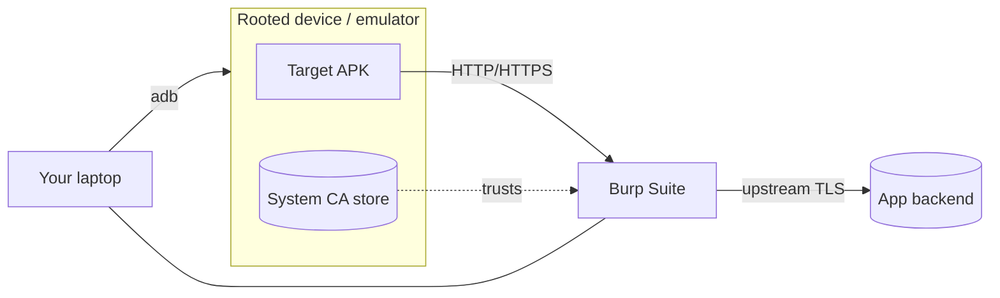
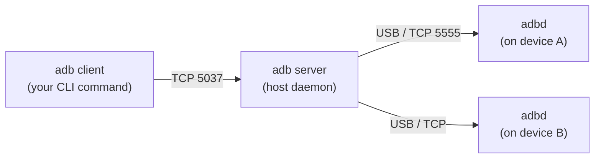
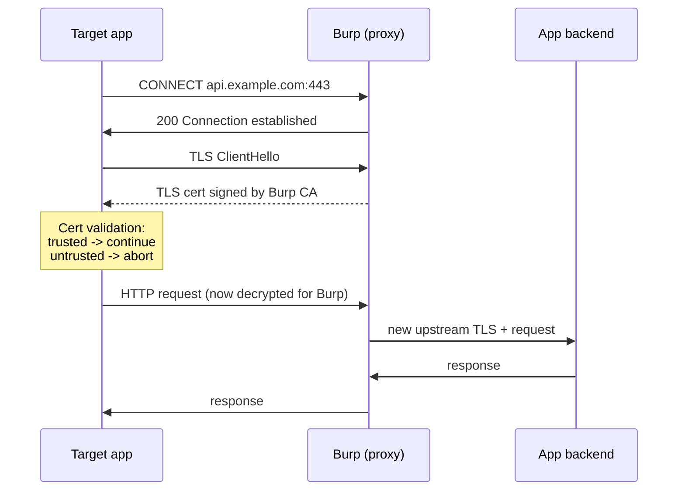
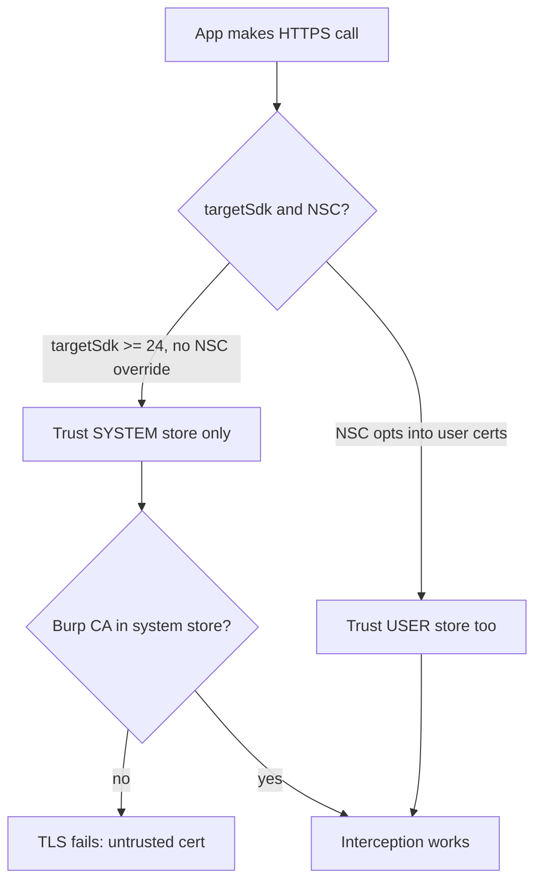

**Level:** Advanced · **Track:** Mobile & IoT · **Read time:** 300 min

This is Chapter 2 of the Mobile & IoT notebook. Chapter 1 built the mental model — what an Android app *is*, how the stack fits together from the Linux kernel through Binder, ART, the app sandbox and the APK format. This chapter turns that model into a working lab. By the end you will have a device you fully control, a shell into it over `adb`, a proxy sitting in the middle of its traffic, and — the part that trips up almost everyone the first time — the ability to actually read the app's HTTPS, not just watch encrypted bytes go by.

Almost everything in the rest of this notebook depends on the environment you build here. Static analysis (Chapter 3) needs an APK you can pull off a device. Dynamic instrumentation with Frida (Chapter 4) needs a rooted device and a working `adb`. Bypassing pinning (Chapter 5) only makes sense once you understand *why* interception fails by default. So treat this chapter as infrastructure: get it solid once, and every later chapter is faster.

**Who this is for:** web and API testers standing up their first mobile rig; bug-bounty hunters who want to poke at a company's Android app but keep seeing "Network error" the moment Burp is on; CTF players facing an `adb`-based challenge; and blue-teamers who need to understand exactly what a reviewer does to their app so they can make it harder. You need the Linux fundamentals from earlier notebooks (processes, UIDs, file permissions, `iptables`) and Chapter 1's picture of the Android stack. You do not need to have ever written an Android app.

**Lawful use:** build this lab against emulators, your own devices, and deliberately-vulnerable training apps (DIVA, InsecureBankv2, the OWASP MASTG crackmes, Google's own test targets). Intercepting or instrumenting an app you have no authorisation to test can breach the app's terms, local computer-misuse law, and the developer's rights. Everything below assumes a target you own or are explicitly scoped to assess.

---

## Part 1: What You're Actually Building

Before installing anything, get the shape of the lab clear. A mobile pentest rig has four moving parts, and every problem you hit later is a problem in one of them:

1. **A device** — an emulator or a real phone — that runs the target app. It must be **rooted** (or root-equivalent) for serious work, because almost every interesting technique needs to read another app's private files, write to the system CA store, or attach a debugger.
2. **`adb`** — the Android Debug Bridge — your control channel into that device: a shell, a file-transfer pipe, an app installer, and a log tap, all in one tool.
3. **An intercepting proxy** — Burp Suite (or mitmproxy / Caido) — that sits between the app and the internet so you can see and modify every request.
4. **The trust plumbing** — the certificate and routing configuration that makes the app *send its traffic through your proxy* and *trust your proxy's certificate* so TLS doesn't break.



The single most common failure — the one that eats an afternoon for every new mobile tester — is step 4. You get the proxy running, you point the device at it, and the app just says "no internet" or "certificate error." That is not a bug; that is Android 7+ working as designed, and Part 10 is entirely about defeating it *on a device you control*. Keep the diagram above in your head; when something breaks, ask which of the four parts failed.

**A note on host OS.** Everything here works on Linux, macOS, and Windows/WSL2. Kali is the assumed host because the later tooling (apktool, jadx, Frida, objection) is one `apt`/`pip` away, but nothing is Kali-specific. On macOS use Homebrew; on Windows prefer WSL2 for the CLI tools and run the emulator on the Windows side (nested virtualisation for an emulator inside WSL2 is painful).

---

## Part 2: Emulator vs Real Device — Choosing Your Target

You will eventually want both, but start by understanding the trade-offs, because they decide which techniques even work.

| Dimension | AVD emulator (Google APIs) | Genymotion | Physical rooted phone |
| --- | --- | --- | --- |
| Root access | Easy (writable system on Google APIs images) | Easy (one-click root toggle) | Hard-to-easy (bootloader unlock + Magisk) |
| Architecture | x86_64 (host) | x86_64 | ARM (real) |
| ARM-only apps | Fail or need ARM translation | Limited | Native |
| Play Integrity / SafetyNet | Fails hard | Fails | Can pass with Magisk + Zygisk + DenyList |
| Hardware (camera, NFC, sensors, telephony) | Simulated / absent | Simulated | Real |
| Performance | Good with KVM/HAXM | Good | Native |
| Cost | Free | Free tier + paid | Cost of a phone |
| Snapshots | Yes | Yes | No |

The decision rules that matter in practice:

- **Default to the emulator** for the majority of app testing. It is free, disposable, snapshot-able, and trivially rooted. Use a **Google APIs** system image (not "Google Play"), because the Google APIs images ship with a writable `/system` and `adb root` works — the Play images are locked down like a retail device precisely to stop that.
- **Use a real device** when the app is ARM-only and won't run under emulation, when it uses hardware you must exercise (camera-based KYC, NFC payments, Bluetooth), or when it uses **Play Integrity / hardware attestation** that an emulator can never satisfy. Rooting a real phone (unlock bootloader → flash a patched boot image with Magisk) is Chapter 5 territory; for now know that a Pixel is the path of least resistance because its bootloader is officially unlockable.
- **Genymotion** sits in the middle: an x86 emulator with a friendlier UI, easy root toggle, and GApps installer. Good for teams; the desktop personal edition is free for non-commercial use.

**Architecture is the sharp edge.** Many production apps ship native libraries (`.so` files under `lib/arm64-v8a/`) with no x86 build. On an x86 emulator those apps crash on launch. Modern Android Studio emulator images include ARM-to-x86 translation which helps, but if an app stubbornly won't run, that's your cue to move it to a physical ARM device rather than fight the emulator.

---

## Part 3: The Android SDK & Platform-Tools From Scratch

`adb`, `emulator`, `avdmanager` and `sdkmanager` all come from the **Android SDK**. You do not need the full Android Studio IDE to get them, though installing Studio is the simplest path and gives you the AVD Manager GUI.

**Option A — Android Studio (simplest).** Install Studio, open *Settings → SDK Manager*, and install:
- **Android SDK Platform-Tools** (this is `adb` and `fastboot`)
- **Android Emulator**
- At least one **system image** (see Part 6)

Studio drops the SDK at `~/Android/Sdk` on Linux, `~/Library/Android/sdk` on macOS.

**Option B — command-line only (no IDE).** Download the "command-line tools" zip, unpack it, and drive everything from `sdkmanager`:

```bash
# Point tooling at a fresh SDK root
export ANDROID_HOME="$HOME/Android/Sdk"
mkdir -p "$ANDROID_HOME/cmdline-tools"
# unzip the downloaded commandlinetools-*.zip so the binaries live at:
#   $ANDROID_HOME/cmdline-tools/latest/bin/sdkmanager
export PATH="$ANDROID_HOME/cmdline-tools/latest/bin:$ANDROID_HOME/platform-tools:$ANDROID_HOME/emulator:$PATH"

# Accept licenses and install the core pieces
yes | sdkmanager --licenses
sdkmanager "platform-tools" "emulator" "platforms;android-34"
sdkmanager "system-images;android-34;google_apis;x86_64"
```

**Option C — distro package (fast, for adb only).** On Kali/Debian: `sudo apt install adb fastboot`. This gives you a working `adb`/`fastboot` immediately, which is all you need when the "device" is Genymotion or a physical phone and you install the emulator separately.

Confirm the toolchain:

```bash
$ adb version
Android Debug Bridge version 1.0.41
Version 35.0.2-12147458
Installed as /home/kali/Android/Sdk/platform-tools/adb

$ sdkmanager --list_installed
  Path                                        | Version | Description
  ------------------------------------------- | ------- | -----------------------
  emulator                                    | 35.1.4  | Android Emulator
  platform-tools                              | 35.0.2  | Android SDK Platform-Tools
  platforms;android-34                        | 3       | Android SDK Platform 34
  system-images;android-34;google_apis;x86_64 | 8       | Google APIs x86_64
```

**Pitfall — two `adb` versions.** If you have both the distro `adb` and the SDK `adb` on `PATH`, the daemon and client versions can mismatch and you get `adb server version (X) doesn't match this client (Y); killing...` in a loop. Pick one. `which -a adb` shows every copy; keep the SDK one on `PATH` and remove or shadow the other.

---

## Part 4: adb From Zero — Architecture

`adb` is not a single program talking to a phone; it is a **three-part system**, and understanding the three parts explains every "device not found" you will ever hit.



1. **The client** is the `adb` you type. It's short-lived: it sends one command and exits. Every `adb shell`, `adb install`, `adb devices` is a fresh client.
2. **The server** is a background process on your *host*, listening on TCP **5037**. The first `adb` command you run silently starts it. It multiplexes: it tracks every connected device and routes client commands to the right one.
3. **`adbd`** is the daemon running *on the device*, as part of the OS. It receives commands from the server and executes them on-device. Its privilege level matters enormously: normally it runs as the `shell` user, but on a rooted/eng device `adb root` restarts it as `root`, which is what lets you read other apps' data.

**Transports.** The server reaches `adbd` over USB or over TCP/IP (network). Emulators are always TCP (they show up as `emulator-5554`). A physical phone starts on USB and can be switched to TCP with `adb tcpip 5555`.

**Authentication (RSA).** The first time a host connects to a real device over USB, the device shows an "Allow USB debugging?" dialog with the host's RSA key fingerprint. Approve it (tick "always allow") and the key is stored in `/data/misc/adb/adb_keys`. This is why a brand-new host can't just take over any phone plugged into it — the human at the device has to authorise the key. Emulators skip this.

Common lifecycle commands:

```bash
adb devices -l          # list attached devices with product/model detail
adb start-server        # explicitly start the host server (usually automatic)
adb kill-server         # nuke the server; the next command restarts it clean
adb -s emulator-5554 …  # target a specific device when several are attached
adb reconnect offline   # kick a device stuck in "offline" state
```

If `adb devices` shows a device as `unauthorized`, you never accepted the RSA prompt (or `adb_keys` got wiped). If it shows `offline`, the daemon connection is half-dead — `adb kill-server` then replug. If it shows *nothing* for a USB phone, USB debugging isn't enabled in Developer Options, or it's a charge-only cable.

**Enabling USB debugging on a real device:** *Settings → About phone →* tap *Build number* seven times to unlock Developer Options, then *Settings → System → Developer options → USB debugging*. This is muscle memory you'll repeat on every physical target.

---

## Part 5: adb Command Deep-Dive

These are the commands you'll run hundreds of times. Learn them properly now.

### 5.1 A shell on the device

```bash
adb shell                       # interactive shell as the 'shell' user
adb shell id                    # uid=2000(shell) gid=2000(shell) ...
adb shell getprop ro.build.version.release   # Android version, e.g. 14
adb shell pm list packages | grep -i target  # find an app's package name
adb shell pm path com.example.app            # where the APK lives on disk
```

`pm` (package manager) and `am` (activity manager) are the two on-device workhorses. `pm list packages`, `pm path`, `pm dump`, and `am start`/`am broadcast` (which you'll weaponise in Chapter 6 against exported components) run *inside* `adb shell`.

### 5.2 Root and remount

```bash
adb root         # restart adbd as root (works on emulator Google APIs / eng builds)
adb unroot       # drop back to shell user
adb remount      # remount /system read-write (needs root + writable image)
```

On a Google APIs emulator, `adb root` returns `restarting adbd as root` and a follow-up `adb shell id` shows `uid=0(root)`. On a retail phone this fails — rooting there means Magisk, covered in Chapter 5.

### 5.3 Moving files

```bash
adb push local.apk /data/local/tmp/          # host -> device
adb pull /data/local/tmp/loot.db ./          # device -> host
adb pull "$(adb shell pm path com.example.app | sed 's/package://')" base.apk
```

`/data/local/tmp/` is the universal scratch directory: writable by the `shell` user, which is where you'll stage the `frida-server` binary in Chapter 4 and APKs for install.

### 5.4 Installing and removing apps

```bash
adb install app.apk                 # install
adb install -r app.apk              # reinstall keeping data
adb install -t app.apk              # allow test-only (debuggable) builds
adb install-multiple base.apk split_config.*.apk   # split APKs / app bundles
adb uninstall com.example.app
adb shell pm uninstall -k --user 0 com.example.app  # remove for user, keep data
```

**Split APKs** are the modern default (Android App Bundles). A single `.apk` won't install if the app was published as split; you must pull *all* the split files (`pm path` lists several) and `install-multiple` them. This bites people constantly — the app "won't install" because they grabbed only `base.apk`.

### 5.5 Logs — logcat

```bash
adb logcat                                   # firehose of system + app logs
adb logcat --pid=$(adb shell pidof -s com.example.app)   # just this app
adb logcat *:E                               # errors only
adb logcat | grep -iE "token|password|http|error"        # hunt for leaks
adb logcat -c                                # clear the buffer, then reproduce
```

**Security relevance:** apps routinely log secrets in debug builds — session tokens, full request bodies, even passwords. `adb logcat` during a login flow is often the fastest first finding on an engagement, and it needs no proxy at all. Filter to the app's PID to cut the noise.

### 5.6 Port forwarding — the two directions

This pair is the key to proxying, so understand the direction precisely:

```bash
adb forward tcp:8000 tcp:8000    # host:8000  ->  device:8000  (reach a device port from host)
adb reverse tcp:8080 tcp:8080    # device:8080 -> host:8080     (device reaches a host service)
```

- **`adb forward`** opens a port on your *host* that tunnels to a port on the *device*. Use it to reach `frida-server` (device 27042) from your laptop.
- **`adb reverse`** makes the *device* able to hit a service on your *host* via `127.0.0.1`. This is the cleanest way to route app traffic to Burp on your laptop without touching Wi-Fi proxy settings: `adb reverse tcp:8080 tcp:8080` and point the app at `127.0.0.1:8080`. Note `adb reverse` needs `adbd` cooperation and won't work on very old devices; the Wi-Fi proxy method in Part 9 is the fallback.

### 5.7 Screens, input, and misc

```bash
adb shell screencap -p /sdcard/s.png && adb pull /sdcard/s.png   # screenshot
adb shell input tap 500 1200          # simulate a tap
adb shell input text "hunter2"        # type into a focused field
adb emu geo fix -122.084 37.422       # spoof GPS on emulator
adb shell settings put global http_proxy 127.0.0.1:8080   # set proxy via settings
adb shell settings delete global http_proxy               # clear it
```

---

## Part 6: Building a Rooted Emulator (AVD)

Now stand up the device. The `avdmanager` tool creates AVDs from system images; `emulator` boots them.

```bash
# List installed system images you can build an AVD from
sdkmanager --list | grep system-images | grep google_apis

# Create an AVD named 'pentest' from the Google APIs image
avdmanager create avd -n pentest \
  -k "system-images;android-34;google_apis;x86_64" \
  -d "pixel_6"

# Boot it, writable-system so we can modify /system later (CA install!)
emulator -avd pentest -writable-system -no-snapshot-load
```

The two flags that matter for pentesting:

- **`-writable-system`** boots with `/system` mountable read-write. Without it, `adb remount` fails and you cannot drop a CA into the system store the classic way. Always boot pentest AVDs with it.
- **`-no-snapshot-load`** forces a cold boot, avoiding a stale snapshot that "remembers" a broken state. Handy while you're configuring.

Other useful boot flags: `-http-proxy http://127.0.0.1:8080` (route the whole emulator through Burp at boot), `-writable-system -no-snapshot` together for a clean modifiable image, `-dns-server 8.8.8.8` if DNS misbehaves, `-wipe-data` to factory-reset the AVD.

Confirm root on the emulator:

```bash
$ adb root
restarting adbd as root
$ adb shell id
uid=0(root) gid=0(root) groups=0(root) ...
$ adb remount
remount succeeded
```

If `adb root` says `adbd cannot run as root in production builds`, you booted a **Google Play** image, not **Google APIs**. Recreate the AVD from a `google_apis` (not `google_apis_playstore`) image.

**Rooting the emulator further with Magisk (optional now, needed for Chapter 5).** For techniques that expect Magisk (root-hiding, Zygisk modules), you patch the emulator's `ramdisk`/boot with `rootAVD` or run a device that already has Magisk. For pure interception and Frida, the built-in `adb root` on a Google APIs image is enough; we'll return to Magisk when we need to *hide* root in Chapter 5.

---

## Part 7: Genymotion & Physical Devices in Brief

**Genymotion Desktop.** Install VirtualBox (its default hypervisor) or use the QEMU backend, install Genymotion, create a device from its template list (e.g., "Google Pixel 6, Android 13"), and boot it. It exposes `adb` automatically — `adb devices` shows it as a networked device (`192.168.56.x:5555`). Root is a toggle in the device settings; GApps can be flashed via the built-in installer. It's noticeably snappier to click around than a bare AVD and is popular on teams for that reason.

**Physical Pixel (the reference real device).** The full flow — which Chapter 5 details — is: enable Developer Options → OEM unlocking → `fastboot flashing unlock` (wipes the device) → extract `boot.img` from the factory image → patch it in the Magisk app → `fastboot flash boot magisk_patched.img`. You end with a rooted phone that can also *hide* root well enough to pass many integrity checks. For this chapter, if you have a rooted phone already, everything below (Burp, CA install, iptables) applies identically — you just use its real IP for the Wi-Fi proxy instead of the emulator.

**Connecting a device over Wi-Fi (Android 11+ wireless debugging):**

```bash
adb pair 192.168.1.50:37000        # enter the 6-digit code from Developer Options
adb connect 192.168.1.50:5555
```

---

## Part 8: Burp Suite From Scratch

Burp Suite is the intercepting proxy at the centre of the rig. If you've done web testing you know it; here's the from-zero version and the mobile-specific bits.

**What it is.** Burp is a Java application that runs a local HTTP(S) proxy (default `127.0.0.1:8080`). Everything that flows through it appears in **Proxy → HTTP history**; **Intercept** lets you pause and edit requests in flight; **Repeater** lets you replay and mutate a request by hand; **Intruder** automates payload sets. The Community edition is free and sufficient for learning (Repeater + manual proxy); Professional adds the scanner and unthrottled Intruder.

**Install on Kali:** it's preinstalled (`burpsuite`), or `sudo apt install burpsuite`. Launch, accept defaults, choose a temporary project.

**Configure the listener for a device (not just localhost).** By default Burp listens only on `127.0.0.1`, which a separate device can't reach. For the Wi-Fi proxy method you must bind it to your LAN interface:

*Proxy → Proxy settings → Proxy listeners → Add/Edit →* set **Bind to port** `8080` and **Bind to address** to *All interfaces* (or your specific LAN IP). Now the emulator/phone can reach `http://<your-laptop-ip>:8080`.



That diagram is the whole game. Burp is a **TLS man-in-the-middle**: it presents the app a certificate that *Burp* generated, signed by *Burp's CA*. The app will only proceed if it trusts that CA — which is exactly the problem Part 10 solves. Get Burp's CA now: browse to **http://burp** from a proxied browser, or *Proxy → Proxy settings → Import/export CA certificate → Certificate in DER format*, and save `cacert.der`.

**Alternatives worth knowing.** `mitmproxy` (free, scriptable in Python, superb for CLI/CI and for writing quick request-rewriting addons), **Caido** (a modern Burp-like written in Rust). The interception theory is identical across all three; pick Burp to follow along.

---

## Part 9: Wiring the App's Traffic Into Burp

Two reliable methods. Use whichever fits.

### Method A — Wi-Fi / global proxy (proxy-aware apps)

Set the device's HTTP proxy to your laptop:

```bash
# Emulator, at boot:
emulator -avd pentest -writable-system -http-proxy http://127.0.0.1:8080
# Or at runtime, via settings:
adb shell settings put global http_proxy 192.168.1.100:8080
# Clear it later:
adb shell settings delete global http_proxy
```

Or set it in the GUI: *Wi-Fi → long-press network → Modify → Advanced → Proxy → Manual →* host = your laptop IP, port = 8080. Now open any app that respects the system proxy and you'll see traffic in Burp's HTTP history (HTTP will be readable immediately; HTTPS will fail cert validation until Part 10).

**Caveat:** the global proxy only affects apps that honour it. Many apps using low-level sockets, gRPC, or their own networking ignore `http_proxy`. Those need Method B or the iptables approach in Part 12.

### Method B — adb reverse (cleanest for emulator)

```bash
adb reverse tcp:8080 tcp:8080
```

Now `127.0.0.1:8080` *on the device* is your laptop's Burp. Set the device proxy to `127.0.0.1:8080` (or configure the app to use it). This avoids IP/firewall issues entirely and survives Wi-Fi changes — great for emulators.

**Verify the pipe before chasing cert errors.** Point the device browser at `http://example.com`. If it shows in Burp's HTTP history, routing works and any remaining failure is a *certificate* problem, not a routing one. Diagnosing routing vs trust separately saves hours.

---

## Part 10: The TLS Problem — Why Interception Breaks on Modern Android

Here is the wall every new mobile tester hits. You've wired the proxy, HTTP works, but HTTPS apps show "network error." The cause is a deliberate 2016 security change.

**Two trust stores.** Android has two CA trust stores:

- **System store** — CAs baked into the OS at `/system/etc/security/cacerts/`. Trusted by everything.
- **User store** — CAs the user installs via *Settings → Security → Encryption & credentials → Install a certificate*. Stored under `/data/misc/user/0/cacerts-added/`.

**Android 6 and earlier (API 23-):** apps trusted the **user** store by default. So you installed Burp's CA as a user cert and every app trusted it. Easy.

**Android 7+ (API 24+):** apps **no longer trust user-added CAs by default.** Since Nougat, an app trusts user CAs *only if it opts in* via a **Network Security Config**. Most apps don't. So your user-installed Burp CA is simply ignored, and HTTPS validation fails. This is the single most important fact in mobile interception.



**The Network Security Config (NSC).** Introduced in Android 7, declared in `AndroidManifest.xml` via `android:networkSecurityConfig="@xml/network_security_config"`. An app can:
- restrict trust to only certain CAs,
- **pin** specific certificates/public keys (`<pin-set>`), which defeats even a system-store CA — that's Chapter 5,
- or (rarely, in debug builds) opt into user certs with `<debug-overrides><trust-anchors><certificates src="user"/>`.

A production app that pins, or simply uses the default (system-only) trust, cannot be intercepted by a user-installed cert. **The reliable fix on a device you control is to put Burp's CA into the *system* store**, so the app trusts it exactly as it would a real CA. That's Part 11. (Pinning survives even that, and is defeated at runtime in Chapter 5.)

**For your own app / a debuggable build**, the developer-friendly path is to add an NSC that trusts user certs *in debug*, so testers don't need root:

```xml
<!-- res/xml/network_security_config.xml -->
<network-security-config>
  <debug-overrides>
    <trust-anchors>
      <certificates src="user"/>
    </trust-anchors>
  </debug-overrides>
</network-security-config>
```

You can also *patch this in* to a target APK during static repackaging (Chapter 3): add the NSC, set `android:networkSecurityConfig`, and add `android:debuggable="true"`, then re-sign. But repackaging trips pinning and integrity checks, so the system-store route is usually cleaner.

---

## Part 11: Installing Burp's CA Into the System Store

Three approaches, from simplest to most robust. All require root and a device you own.

First, convert Burp's DER cert to the PEM/hashed name Android expects. Android names system CAs by the **subject hash** with a `.0` suffix.

```bash
# Export Burp CA as DER (Proxy settings -> Import/export CA -> DER), then:
openssl x509 -inform DER -in cacert.der -out cacert.pem   # DER -> PEM
# Compute the old-style subject hash Android uses as the filename:
HASH=$(openssl x509 -inform PEM -subject_hash_old -in cacert.pem | head -1)
echo "$HASH"          # e.g. 9a5ba575
cp cacert.pem "$HASH.0"
```

### Approach 1 — remount /system and drop the file (emulator / eng device)

```bash
adb root
adb remount                                   # /system now read-write
adb push 9a5ba575.0 /system/etc/security/cacerts/
adb shell chmod 644 /system/etc/security/cacerts/9a5ba575.0
adb shell chown root:root /system/etc/security/cacerts/9a5ba575.0
adb reboot
```

After reboot the CA appears under *Settings → Security → Trusted credentials → System*, and apps trust it. This is the classic method and works great on `-writable-system` emulators.

**Android 10+ wrinkle:** newer images use a read-only `/system` even with root, and some use an APEX/`/apex/com.android.conscrypt` overlay for CA certs. If `adb remount` fails, mount a tmpfs over the cacerts dir instead:

```bash
adb shell su -c '
  mkdir -p /data/local/tmp/cacerts
  cp /system/etc/security/cacerts/* /data/local/tmp/cacerts/
  cp /sdcard/9a5ba575.0 /data/local/tmp/cacerts/
  mount -t tmpfs tmpfs /system/etc/security/cacerts
  cp /data/local/tmp/cacerts/* /system/etc/security/cacerts/
  chown root:root /system/etc/security/cacerts/*
  chmod 644 /system/etc/security/cacerts/*
  restorecon -v /system/etc/security/cacerts/*'
```

This overlays a writable copy of the system cacerts containing your CA, without persistently modifying the real partition (it resets on reboot — a feature for a shared device).

### Approach 2 — Magisk module (persistent, survives reboot, hides better)

On a Magisk-rooted device, community modules such as **"AlwaysTrustUserCerts" / "MagiskTrustUserCerts"** copy user-installed CAs into a system-store overlay at boot. Workflow: install Burp CA as a *user* cert normally, install the module, reboot — the module promotes it to system trust via Magisk's systemless overlay. Clean, reversible (disable the module), and doesn't touch the real partition. This is the preferred method on real phones.

### Approach 3 — patch the APK's Network Security Config (no device root needed)

If you can't root the device but *can* repackage the app (Chapter 3), decompile with apktool, add a `network_security_config.xml` trusting user certs, reference it and set `debuggable`, rebuild and re-sign. Then a user-installed Burp CA is trusted by *that one app*. Downsides: breaks pinning and any signature/integrity check, and won't work on apps that detect tampering.

**Verify success:** with the CA in the system store, reopen the target app. HTTPS requests now populate Burp's HTTP history in cleartext. If they still fail, the app is **pinning** — jump to Chapter 5.

---

## Part 12: Intercepting Non-Proxy-Aware Apps

Some apps ignore the system proxy entirely (raw sockets, gRPC, custom stacks). The proxy is running and trusted, but nothing shows up. You have two options.

### Transparent redirection with iptables (on the device)

Force *all* the device's outbound TCP to your proxy at the packet level, bypassing the app's proxy-ignorance:

```bash
adb shell su -c '
  iptables -t nat -A OUTPUT -p tcp --dport 80  -j DNAT --to-destination 192.168.1.100:8080
  iptables -t nat -A OUTPUT -p tcp --dport 443 -j DNAT --to-destination 192.168.1.100:8080'
```

Then enable Burp's **invisible proxying** (*Proxy settings → listener → Request handling → Support invisible proxying*), because the redirected connections arrive without a `CONNECT`/absolute URL — Burp must infer the host from the TLS SNI / Host header. This catches apps that never asked about a proxy.

### mitmproxy in transparent mode

`mitmproxy --mode transparent` plus the same iptables redirection does the identical job with a scriptable Python core, which is handy when you want to auto-rewrite a header on every request.

**When even this fails**, the app is doing certificate pinning or using non-TLS transport (e.g., a custom protocol, or QUIC/HTTP3 over UDP which your TCP redirect misses). Pinning → Chapter 5 (Frida unpinning). QUIC → force HTTP/2 by blocking UDP/443 so the app falls back to TCP TLS you can intercept:

```bash
adb shell su -c 'iptables -A OUTPUT -p udp --dport 443 -j REJECT'
```

---

## Part 13: Detection & Defense Angle

Everything above is what a reviewer does; the defensive mirror is what a mobile app team should ship to make it hard. Fold these into a threat model rather than treating any single one as a silver bullet — a rooted device defeats all of them eventually, but together they raise the cost.

- **Certificate pinning.** Pin the server's leaf or intermediate public key in the Network Security Config (`<pin-set>`) or via a library (OkHttp `CertificatePinner`, TrustKit). This defeats system-store CA injection outright and forces the tester to a runtime bypass (Frida), which is noisier and easier to detect. Pin the intermediate, not just the leaf, so certificate rotation doesn't brick the app.
- **Root & emulator detection.** Check for `su`, Magisk paths, `test-keys` build tags, known emulator properties (`ro.kernel.qemu`, generic `Build.FINGERPRINT`), and the presence of `frida-server` ports. None are foolproof, but they push the attacker to spend time on Chapter 5's hiding techniques.
- **Play Integrity / hardware attestation.** The strongest signal: server-side verification of a Google-signed device attestation. An emulator and most rooted phones fail it. Enforce it *server-side* for sensitive actions, not just client-side, so a Frida hook on the client verdict doesn't win.
- **No secrets in logs.** Strip request/response logging and token dumps from release builds (`if (BuildConfig.DEBUG)` guards, ProGuard/R8 stripping). The `adb logcat` finding in Part 5 should return nothing on a release build.
- **Detect the debug/tamper state server-side.** Ship `android:debuggable="false"` in release, verify the APK signature at runtime, and — most importantly — don't trust the client. Every control above is client-side and therefore ultimately bypassable on a device the attacker owns; the durable defense is server-side authorization and rate-limiting.

**IR use case:** if you're investigating a suspected malicious app, the *same* lab is your analysis rig — install into a snapshot emulator, proxy its traffic to see C2 endpoints, `logcat` for behaviour, and revert the snapshot when done. The offensive lab and the malware-triage lab are the same lab.

---

## Final Revision / Summary

- A mobile rig is four parts: **a rooted device, `adb`, an intercepting proxy, and the trust plumbing.** Every failure is one of those four; diagnose which before flailing.
- **`adb` is client → host server (TCP 5037) → on-device `adbd`.** `unauthorized`/`offline`/missing device each map to a specific one of those links. `adb root` + `adb remount` on a **Google APIs** emulator gives you root and a writable `/system`.
- Learn the command core cold: `shell`, `push`/`pull`, `install` (`-r`/`-t`/`install-multiple` for splits), `logcat` (filter by PID for secret-hunting), and the direction-sensitive pair **`forward`** (host→device) vs **`reverse`** (device→host, the clean way to reach Burp).
- Build the AVD with **`-writable-system`** from a **google_apis** (not playstore) image. Genymotion for a friendlier UX; a rooted Pixel when you need ARM/hardware/Play Integrity.
- Burp is a **TLS MITM**: it works only if the app trusts *Burp's CA*.
- **The Android 7 change is the crux:** apps stopped trusting user-installed CAs. Put Burp's CA in the **system store** (remount/push, tmpfs overlay, or a Magisk module) so the app trusts it. Pinning still beats that — deferred to Chapter 5.
- Non-proxy-aware apps: **iptables DNAT + Burp invisible proxying**, or mitmproxy transparent mode. Kill UDP/443 to defeat QUIC fallback.

## Cheat Sheet / Quick Reference

```bash
# --- Device / adb ---
adb devices -l                       # list devices
adb kill-server; adb start-server    # reset host daemon
adb root; adb remount                # root + writable /system (emulator)
adb shell pm list packages | grep X  # find package name
adb shell pm path com.pkg            # locate APK(s) (watch for splits)
adb pull "$(adb shell pm path com.pkg|sed 's/package://')" base.apk

# --- Files / install / logs ---
adb push f /data/local/tmp/          # host -> device
adb pull /path/loot ./               # device -> host
adb install -r -t app.apk            # (re)install, allow test build
adb install-multiple base.apk split_*.apk
adb logcat --pid=$(adb shell pidof -s com.pkg) | grep -iE 'token|http'

# --- Proxy routing ---
adb reverse tcp:8080 tcp:8080        # device 127.0.0.1:8080 -> host Burp
adb shell settings put global http_proxy 192.168.1.100:8080
adb shell settings delete global http_proxy

# --- Emulator ---
avdmanager create avd -n pentest -k "system-images;android-34;google_apis;x86_64" -d pixel_6
emulator -avd pentest -writable-system -no-snapshot-load

# --- Burp CA -> system store ---
openssl x509 -inform DER -in cacert.der -out cacert.pem
HASH=$(openssl x509 -subject_hash_old -in cacert.pem | head -1); cp cacert.pem "$HASH.0"
adb push "$HASH.0" /system/etc/security/cacerts/ && adb shell chmod 644 /system/etc/security/cacerts/$HASH.0
adb reboot

# --- Transparent intercept ---
adb shell su -c 'iptables -t nat -A OUTPUT -p tcp --dport 443 -j DNAT --to-destination 192.168.1.100:8080'
# Burp: enable "Support invisible proxying"
```

**Trust-store decision, in one line:** *Android 6 and earlier -> user cert is enough. Android 7+ -> system-store cert. Pinning -> runtime bypass (Ch5).*

## Practice Labs & Resources

- **InsecureBankv2** — a deliberately-vulnerable Android app; perfect first target for standing up the whole rig, proxying its login, and reading tokens in `logcat`.
- **DIVA (Damn Insecure and Vulnerable App)** — small challenges that exercise adb, logcat leaks, and traffic interception.
- **OWASP MASTG "crackmes"** and the MASTG "Android Basic Security Testing" chapter — the canonical walkthroughs for exactly this setup (adb, emulator, CA install), worth cross-reading.
- **HackTheBox / TryHackMe mobile rooms** (e.g., THM "Android Hacking 101", HTB mobile challenges) — end-to-end labs that assume a working emulator + Burp rig.
- **Google's AOSP emulator docs** — authoritative reference for `avdmanager`/`emulator` flags.
- **PortSwigger Web Security Academy** — not mobile-specific, but the Burp fundamentals (Repeater, Intruder, interception) transfer directly; do these if Burp is new to you.

In the next chapter we move from *watching* the app to *taking it apart statically* — pulling the APK, decompiling it with apktool and jadx, and running it through MobSF to map its attack surface before we ever run it.

---

*Also on [Praneeth's portfolio](https://ping-praneeth.vercel.app/notebook/mobile-iot-hardware/02-android-pentest-setup-emulator-adb-burp-and-traffic-interception), with comments and the latest edits.*
