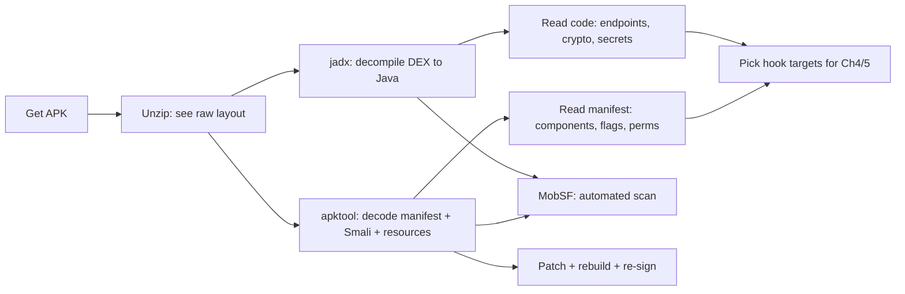
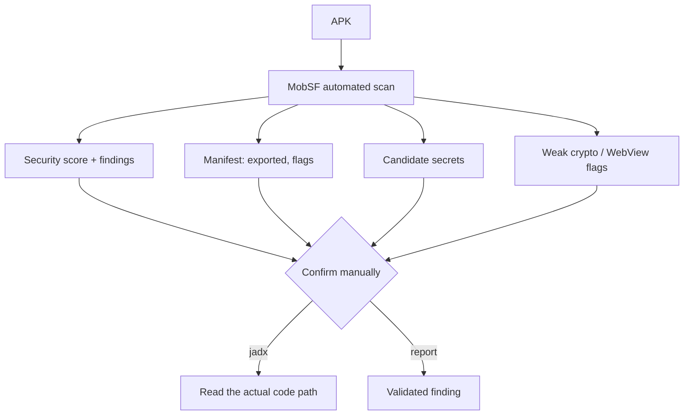
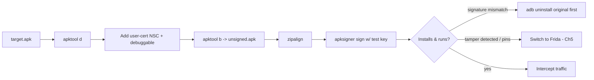

**Level:** Advanced · **Track:** Mobile & IoT · **Read time:** 300 min

This is Chapter 3 of the Mobile & IoT notebook. Chapter 2 got you a device, a shell, and a proxy. Now we stop *watching* the app and start *reading* it. Static analysis is looking at an app's code and resources without executing it — and for Android it is unusually productive, because an APK is a shippable archive of bytecode and XML that decompiles back to something very close to the developer's original source. A huge fraction of real mobile findings — hardcoded keys, exported components, weak crypto, hidden endpoints, debug flags left on — are visible in static analysis alone, before you ever intercept a single packet.

This chapter builds the workflow from zero: get the APK, understand its layout, decode it with **apktool**, decompile it with **jadx**, scan it with **MobSF**, read the **manifest** and **Smali** like an attacker, hunt for **secrets**, and finally **repackage** an app to make it testable (add a debug Network Security Config, flip `debuggable`, weaken pinning) and re-sign it. Everything here feeds the runtime work in Chapters 4 and 5 — static analysis tells you *where* to hook.

**Lawful use:** decompile apps you own, are authorised to assess, or the deliberately-vulnerable training targets named at the end. Reverse-engineering third-party apps can breach their terms and local law; keep it in scope.

---

## Part 1: Static vs Dynamic, and Why Static Comes First

Two complementary lenses:

- **Static analysis** — reading the code and resources at rest. Fast, safe (nothing runs), complete (you see *all* code paths, including ones the app rarely triggers), and it needs no rooted device. Weakness: obfuscation and packing hide things, and you can't see runtime-decrypted values.
- **Dynamic analysis** — running the app and observing/altering behaviour (Chapters 4–5). Sees the app as it actually behaves, defeats string obfuscation (values are decrypted in memory), but is slower and only exercises the paths you trigger.

Do static first. It builds the map — package structure, entry points, endpoints, the classes worth hooking — that makes dynamic analysis targeted instead of blind. The professional loop is: static to find candidates, dynamic to confirm and exploit, back to static to understand the fix.



---

## Part 2: Getting the APK

You can't analyse what you don't have. Several routes:

**From a connected device (most common).** Find the package, locate its APK(s), pull them:

```bash
adb shell pm list packages | grep -i target        # find package name
adb shell pm path com.example.app
# package:/data/app/~~abc==/com.example.app-xyz==/base.apk
# package:/data/app/~~abc==/com.example.app-xyz==/split_config.arm64_v8a.apk
adb pull /data/app/~~abc==/com.example.app-xyz==/base.apk .
```

**Split APKs.** Modern apps ship as an Android App Bundle installed as *multiple* APKs (a `base.apk` plus `split_config.*` for ABI, density, language). `pm path` lists them all. For analysis you mostly care about `base.apk` (it holds the DEX and manifest), but to *reinstall* you need every split (`adb install-multiple`, Chapter 2). To merge splits into one analysable/installable APK, tools like **APKEditor** (`APKEditor.jar m -i <dir>`) exist.

**From an APK mirror / Play.** Third-party mirrors host APKs; treat them as untrusted (they can be tampered/backdoored) and verify the signer. `apkeep` and similar can pull from stores.

**Verify the signature and see who signed it:**

```bash
apksigner verify --print-certs base.apk
keytool -printcert -jarfile base.apk
```

---

## Part 3: The APK Is Just a ZIP

Before any fancy tool, unzip it and look. This demystifies everything.

```bash
mkdir raw && cd raw && unzip ../base.apk
find . -maxdepth 1
```

```
./AndroidManifest.xml     # binary XML (not readable until decoded)
./classes.dex             # Dalvik bytecode (all app code; may be classes2.dex, ...)
./resources.arsc          # compiled resources (strings, layouts refs)
./res/                    # resource files (layouts, drawables, xml)
./assets/                 # raw bundled files (JS bundles, models, configs, DBs)
./lib/                    # native .so libraries per ABI (arm64-v8a, x86_64, ...)
./META-INF/               # signatures (CERT.RSA/SF, MANIFEST.MF), v2+ block in the ZIP
```

Two immediate wins with *no* special tooling:

- **`assets/`** often contains plaintext config, API endpoints, JS bundles (React Native `index.android.bundle`), ML models, or even SQLite seed DBs. `grep -r` it.
- **`lib/*/*.so`** tells you the app has native code (worth `strings`-ing and, later, reversing) and which ABIs it supports (why an x86 emulator might reject it).

But `AndroidManifest.xml` here is **binary XML** — you'll see mangled bytes, not tags. That's what apktool decodes.

---

## Part 4: apktool From Scratch

**What it is.** `apktool` decodes an APK's resources and manifest from their compiled binary forms back into human-readable XML, and disassembles `classes.dex` into **Smali** (a readable assembly-like representation of Dalvik bytecode). Crucially, it can also **rebuild** a modified folder back into an installable APK. It is the tool for *editing and repackaging*, not for getting Java-like source (that's jadx).

**Install:** `sudo apt install apktool` on Kali, or download the wrapper script + `apktool_*.jar`. Verify: `apktool --version`.

**Decode:**

```bash
apktool d base.apk -o base_decoded
```

```
I: Using Apktool 2.10.0 on base.apk
I: Loading resource table...
I: Decoding AndroidManifest.xml with resources...
I: Decoding file-resources...
I: Decoding values */* XMLs...
I: Baksmaling classes.dex...
I: Copying assets and libs...
```

What you get:

```
base_decoded/
  AndroidManifest.xml     # now readable XML
  apktool.yml             # metadata for rebuilding (versionCode, minSdk, etc.)
  res/values/strings.xml  # decoded strings — grep here for secrets
  res/xml/network_security_config.xml   # the NSC, if present
  smali/                  # com/example/app/... .smali — all the code, disassembled
  smali_classes2/         # from classes2.dex, if multidex
  assets/  lib/  unknown/
```

**Smali** is the point of apktool for offensive work: you can edit a `.smali` file (flip a boolean, delete a pinning check, add a log) and rebuild. It's verbose but readable once you know a few instructions (Part 8).

**Rebuild and re-sign** (full walkthrough in Part 10):

```bash
apktool b base_decoded -o patched.apk
```

---

## Part 5: jadx — DEX Back to Java

**What it is.** `jadx` decompiles Dalvik bytecode straight to readable **Java** (and can show Smali/Kotlin too). Where apktool gives you assembly you edit, jadx gives you near-source you *read*. It's the fastest way to understand what an app does. Ships as `jadx` (CLI) and `jadx-gui` (a searchable GUI — the better choice for exploration).

**Install:** `sudo apt install jadx`, or download the release zip (`jadx/bin/jadx`, `jadx/bin/jadx-gui`).

**CLI:**

```bash
jadx -d out_src base.apk        # decompile everything to out_src/
jadx -d out_src --show-bad-code base.apk   # keep code that failed clean decompilation
```

**GUI (recommended):** `jadx-gui base.apk`. Then:

- **Full-text search** (the killer feature): search across all decompiled code for `http`, `password`, `secret`, `AES`, `SharedPreferences`, `Log.`, a suspected endpoint, etc.
- Navigate the tree to the app's own package (skip `androidx`, `com.google`, `kotlin` — those are framework/library code, not the app).
- Right-click → *Find Usage* to trace where a method or field is used.
- The **Resources** node shows a decoded manifest and `strings.xml` in the same view.

**Reading tips:** obfuscated apps (ProGuard/R8) rename classes/methods to `a`, `b`, `c`. You lose names but not logic — follow string constants, API calls (`Retrofit`, `OkHttpClient`, `Cipher.getInstance`), and manifest entry points to orient. Kotlin decompiles a bit noisily (synthetic classes, `$` suffixes); read past it.

**jadx vs apktool — when to use which:**

| Task | Tool |
| --- | --- |
| Understand what the app does (read logic) | **jadx** (Java) |
| Search all code for secrets/endpoints | **jadx-gui** full-text search |
| Edit code and repackage | **apktool** (Smali) |
| Decode/read resources & manifest | either (apktool for editing, jadx to browse) |
| Analyse native `.so` | neither — Ghidra/IDA |

---

## Part 6: Reading AndroidManifest.xml Like an Attacker

The manifest is the app's declaration of everything it exposes. It is the highest-value single file in static analysis. Decode it (apktool or jadx) and check, in order:

**1. Package, SDK levels, and global flags.**

```xml
<manifest package="com.example.app">
  <uses-sdk android:minSdkVersion="24" android:targetSdkVersion="34"/>
  <application
      android:debuggable="true"          <!-- RED FLAG: attach a debugger, run as the app -->
      android:allowBackup="true"         <!-- adb backup can exfil app data -->
      android:networkSecurityConfig="@xml/network_security_config"
      android:usesCleartextTraffic="true"> <!-- allows plain HTTP -->
```

- `android:debuggable="true"` in a release build is a serious finding — you can `run-as` the package, attach `jdb`, and read its data without root.
- `android:allowBackup="true"` lets `adb backup` pull the app's private data on older targets.
- `usesCleartextTraffic="true"` (or an NSC permitting cleartext) means HTTP is allowed — MITM without TLS at all.

**2. Exported components** — the remote attack surface (deep-dive in Chapter 6). A component is reachable by *other apps* if `android:exported="true"`, or (pre-Android 12) implicitly if it declares an `<intent-filter>` without setting `exported`.

```xml
<activity android:name=".AdminActivity" android:exported="true"/>       <!-- launchable by anyone -->
<activity android:name=".WebViewActivity">
  <intent-filter>
    <data android:scheme="exampleapp" android:host="pay"/>              <!-- deep link -->
  </intent-filter>
</activity>
<provider android:name=".FilesProvider" android:authority="com.example.files"
          android:exported="true" android:grantUriPermissions="true"/>  <!-- content:// exposure -->
<receiver android:name=".SmsReceiver" android:exported="true"/>
<service android:name=".SyncService" android:exported="true"/>
```

Every exported component is something a malicious app on the same device can invoke. Note them all now; you'll test them in Chapter 6 with `am start` / `am broadcast`.

**3. Permissions** — what the app can do, and any *custom* permissions it defines (custom perms with weak `protectionLevel` are a classic privilege-escalation path).

**4. The Network Security Config** — open `res/xml/network_security_config.xml`. Does it pin (`<pin-set>`)? Permit cleartext? Trust user certs? This tells you *before you try* whether Chapter 2's system-cert trick will work or whether you'll need Chapter 5's runtime unpinning.

---

## Part 7: Hunting Secrets

Developers hardcode things they shouldn't. Static analysis is where you find them. Grep everything — decoded resources, decompiled source, assets, and native libs.

```bash
# Across apktool-decoded resources + smali
grep -rniE "api[_-]?key|secret|password|token|bearer|authorization" base_decoded/ | head
# Endpoints
grep -rnoE "https?://[a-zA-Z0-9./_-]+" base_decoded/res base_decoded/assets | sort -u
# Cloud + provider keys (high-signal patterns)
grep -rnoE "AIza[0-9A-Za-z_-]{35}" .            # Google API key
grep -rnoE "AKIA[0-9A-Z]{16}" .                 # AWS access key id
grep -rnoE "sk_live_[0-9a-zA-Z]{24,}" .         # Stripe live secret
grep -rniE "firebaseio\.com|amazonaws\.com|s3\." .   # backend infra
# Strings inside native libs
strings -n 8 lib/arm64-v8a/*.so | grep -iE "http|key|token" | head
```

Prime locations:

- **`res/values/strings.xml`** — the #1 place for stray API keys and endpoints; developers stick a "temporary" key here and ship it.
- **`assets/`** — config JSON, `.env`-style files, React Native/Cordova JS bundles containing full API logic and keys.
- **`AndroidManifest.xml` `<meta-data>`** — Google Maps keys, Firebase config, ad SDK IDs.
- **`google-services.json`** residue / Firebase URLs — often lead to an unauthenticated Firebase database (test `https://<project>.firebaseio.com/.json`).
- **Native `.so`** — keys moved to C to "hide" them; `strings` still finds most.

**Bug bounty reality:** a live cloud key (AWS, GCP, Firebase, Stripe, Twilio) hardcoded in an APK is one of the most reliably-paid mobile findings — many programs treat it as high/critical. jadx-gui full-text search + the greps above is often the whole methodology. The subtlety: a *client* API key that's meant to be public (e.g., a restricted Google Maps browser key) is usually not a bug — assess whether the key grants server-side power or is scoped/public by design before reporting.

**Table — where secrets hide and how to check:**

| Location | What lives there | How to check |
| --- | --- | --- |
| `res/values/strings.xml` | API keys, endpoints | `grep` decoded values |
| `assets/*.json`, `.js` | config, RN/Cordova bundles, keys | `grep -r`, read JS bundle |
| Manifest `<meta-data>` | Maps/Firebase/ad IDs | read decoded manifest |
| `lib/*/*.so` | keys moved to native | `strings -n8 | grep` |
| Decompiled source constants | tokens, crypto keys/IVs | jadx-gui search |
| `SharedPreferences` names | hints at stored-secret files | grep for `getSharedPreferences` |

---

## Part 8: Reading Smali Well Enough to Patch

You don't need fluency, just enough to find and flip a check. Smali is a 1:1 text form of Dalvik bytecode. Key ideas:

- **Registers** `v0, v1, ...` (locals) and `p0, p1, ...` (parameters; `p0` is `this` in an instance method). A method declares `.registers N`.
- **Types** are single letters: `V`=void, `Z`=boolean, `I`=int, `J`=long, `Ljava/lang/String;`=object (L…; wraps a class), `[I`=int array.
- **Method signature:** `methodName(params)ReturnType`, e.g. `checkRoot()Z` returns boolean.

A boolean-returning security check is the bread-and-butter patch target. Original Java:

```java
public boolean isDeviceRooted() { ... return true; }   // we want it to return false
```

Its Smali (simplified):

```smali
.method public isDeviceRooted()Z
    .registers 4
    # ... detection logic ...
    const/4 v0, 0x1
    return v0
.end method
```

To force it to always return `false`, replace the body with:

```smali
.method public isDeviceRooted()Z
    .registers 1
    const/4 v0, 0x0     # 0 == false
    return v0
.end method
```

Common instructions you'll actually touch:

| Smali | Meaning |
| --- | --- |
| `const/4 v0, 0x1` | put small int (1) in v0 (true) |
| `const/4 v0, 0x0` | put 0 in v0 (false) |
| `return v0` / `return-void` | return value / return from void |
| `invoke-virtual {p0}, L...;->m()Z` | call instance method |
| `invoke-static {}, L...;->m()Z` | call static method |
| `move-result v0` | grab the return value of the last invoke |
| `if-eqz v0, :label` | branch if v0 == 0 |
| `sget-object v0, L...;->F:L...;` | read a static field |

**Patch pattern that covers most bypasses:** find the method whose boolean/return controls the check (root detection, pinning result, license valid, emulator detected), and force the return to the value you want (`const/4 v0, 0x0` + `return v0` for "false", or `0x1` for "true"). Then rebuild (Part 10). For anything more complex than a boolean flip, prefer the *runtime* Frida approach in Chapters 4–5 — it's far less brittle than editing Smali.

---

## Part 9: MobSF — Automated Static (and Dynamic) Analysis

**What it is.** The **Mobile Security Framework (MobSF)** is an all-in-one automated scanner: drop in an APK (or IPA) and it decompiles, reads the manifest, flags dangerous permissions and exported components, greps for secrets and trackers, checks crypto usage, scores the app against standards, and produces a report. It bundles the manual steps above into one pass. It also has a dynamic-analysis mode (drives a connected emulator, does runtime API monitoring and traffic capture).

**Run it (Docker is easiest):**

```bash
docker run -it --rm -p 8000:8000 opensecurity/mobile-security-framework-mobsf:latest
# browse to http://localhost:8000 and upload the APK
```

Or from source: clone the repo, `./setup.sh`, `./run.sh`, browse to `:8000`.

**What the static report gives you (and how to read it):**

- **Security score & findings** — a prioritised list. Treat it as *leads, not verdicts*: MobSF is noisy and flags things that may be intentional. Every finding needs manual confirmation.
- **Manifest analysis** — exported components, `debuggable`, `allowBackup`, custom permissions, all extracted for you. Great cross-check against your manual Part 6 read.
- **Code analysis** — weak crypto (ECB, MD5, hardcoded IV/keys), insecure random, WebView `setJavaScriptEnabled`/`addJavascriptInterface`, SQL string concatenation, logging.
- **Secrets / hardcoded strings** — candidate keys and URLs (verify each; many false positives).
- **Trackers & SBOM** — third-party SDKs and libraries present (useful for known-CVE checks).
- **Network security** — parses the NSC, flags cleartext and missing pinning.

**Workflow:** run MobSF first for a fast map, then jump into jadx-gui and apktool to confirm and go deeper on the interesting findings. MobSF finds *breadth*; jadx gives you *depth*. Don't ship a MobSF finding as a report without confirming it by hand — false positives (e.g., a "hardcoded key" that's a public identifier) damage credibility.



---

## Part 10: Repackaging — Patch, Rebuild, Re-sign, Install

The classic reason to repackage: make a stubborn app testable by (a) adding a **Network Security Config that trusts user certs** and (b) setting **`android:debuggable="true"`**, so you can intercept and debug without rooting the device. (Note: repackaging trips signature/integrity checks and won't defeat pinning that verifies the pin at runtime — for those, use Frida in Chapter 5. But for many apps this is the quickest route to interception.)

**Step 1 — decode:**

```bash
apktool d target.apk -o work
```

**Step 2 — add an NSC that trusts user certs.** Create `work/res/xml/network_security_config.xml`:

```xml
<network-security-config>
  <base-config cleartextTrafficPermitted="true">
    <trust-anchors>
      <certificates src="system"/>
      <certificates src="user"/>   <!-- now a user-installed Burp CA is trusted -->
    </trust-anchors>
  </base-config>
</network-security-config>
```

Reference it and set debuggable in `work/AndroidManifest.xml`:

```xml
<application android:networkSecurityConfig="@xml/network_security_config"
             android:debuggable="true" ... >
```

**Step 3 — rebuild:**

```bash
apktool b work -o patched-unsigned.apk
```

**Step 4 — sign (Android rejects unsigned APKs).** Create a keystore once, then sign with `apksigner`:

```bash
keytool -genkey -v -keystore test.keystore -alias test \
  -keyalg RSA -keysize 2048 -validity 10000 \
  -storepass password -keypass password -dname "CN=test"

# zipalign first (recommended), then sign
zipalign -p 4 patched-unsigned.apk patched-aligned.apk
apksigner sign --ks test.keystore --ks-pass pass:password \
  --out patched.apk patched-aligned.apk
apksigner verify --print-certs patched.apk
```

**Step 5 — install and test:**

```bash
adb install -r patched.apk      # if signature differs from installed app, uninstall first
```

**Pitfalls when repackaging:**

- **Signature mismatch on update:** you re-signed with *your* key, so `adb install -r` over the store version fails with `INSTALL_FAILED_UPDATE_INCOMPATIBLE`. Uninstall the original first (`adb uninstall`), then install yours — you lose the original's data.
- **`apktool b` fails on resources:** some heavily-optimised apps break on rebuild; try `apktool` with `--use-aapt2`, or edit only Smali and avoid touching resources.
- **App detects tampering:** integrity checks compare the runtime signature to an expected value and refuse to run repackaged. That's your signal to switch to runtime patching (Frida) rather than static repackaging.
- **Pinning still bites:** repackaging + user-cert NSC does *not* defeat pinning that hardcodes a pin. Chapter 5.

---



## Part 11: Detection & Defense Angle

The defensive mirror of this chapter — what an app team ships to make static analysis and repackaging expensive (never impossible, on a device the attacker owns):

- **Don't hardcode secrets.** No API keys, tokens, or crypto keys in `strings.xml`, assets, or code. Secrets that must reach the client should be short-lived, scoped, and fetched at runtime after authentication — and truly-sensitive operations belong server-side. The single highest-value defensive lesson of this chapter.
- **Obfuscate and shrink (R8/ProGuard).** Renaming classes/methods and stripping unused code raises the reading cost and removes helpful names. It does not stop a determined reverser but filters low-effort ones. Consider a commercial obfuscator/packer (DexGuard) for high-value apps — knowing the tester will still get there dynamically.
- **Minimise the exported attack surface.** Set `android:exported` explicitly (mandatory from Android 12) and to `false` unless a component genuinely must be reachable; protect necessary exports with `signature`-level permissions.
- **Ship release flags correctly.** `debuggable="false"`, `allowBackup="false"` (or a restrictive backup rule), no cleartext, a real NSC. MobSF will flag each of these — run it on your *own* app in CI.
- **Integrity & anti-tamper.** Verify the app's signature at runtime and check against repackaging, and back it with **Play Integrity** server-side. Assume every client-side check is bypassable and make the *server* the arbiter of trust.
- **Native secrets are not hidden.** Moving a key to C only raises the bar to `strings`/Ghidra. Don't treat native as a vault.

**Blue-team / SOC angle:** the same decode-and-grep pass is how you triage a suspected-malicious APK — pull it, `apktool`/`jadx` it, read the manifest for aggressive permissions and exported receivers, and MobSF it for trackers and C2-looking endpoints, before ever detonating it dynamically.

---

## Final Revision / Summary

- **Static analysis reads the app at rest** — fast, safe, complete, no root needed — and finds a huge share of real bugs (hardcoded keys, exported components, weak crypto, debug flags). Do it *before* dynamic to build the map.
- **An APK is a ZIP.** `unzip` first: `assets/` and `lib/` often leak config and endpoints with no tooling. But `AndroidManifest.xml` is binary — decode it.
- **apktool** decodes resources/manifest and disassembles to **Smali** — the tool for *editing and rebuilding*. **jadx(-gui)** decompiles DEX to readable **Java** — the tool for *understanding and searching*. Use apktool to patch, jadx to read.
- **The manifest is the highest-value file:** package/SDK, `debuggable`/`allowBackup`/cleartext flags, every **exported** component, permissions, and the **NSC** (does it pin?). Read it the way an attacker does.
- **Hunt secrets** with grep + jadx-gui search across `strings.xml`, `assets/`, `<meta-data>`, and native `.so`. A live cloud key is a reliably-paid finding — but confirm it grants real power, not a public-by-design identifier.
- **Smali patching** = find the boolean check, force its return (`const/4 v0, 0x0; return v0`). For anything beyond a flag flip, prefer runtime Frida.
- **MobSF** automates the whole pass into one report — great for breadth, noisy on findings; confirm every hit manually in jadx.
- **Repackaging**: decode → add user-cert NSC + `debuggable` → `apktool b` → `zipalign` → `apksigner` → install. Beware signature-mismatch, tamper detection, and pinning (→ Ch5).

## Cheat Sheet / Quick Reference

```bash
# --- Get + inspect ---
adb shell pm path com.pkg                       # find APK(s) (splits!)
adb pull <path>/base.apk .
apksigner verify --print-certs base.apk         # who signed it
unzip base.apk -d raw && ls raw                 # it's a ZIP
grep -rniE 'key|secret|token|https?://' raw/assets raw/res  # quick loot

# --- Decode / decompile ---
apktool d base.apk -o decoded                   # resources + manifest + Smali
jadx -d src base.apk                            # DEX -> Java (CLI)
jadx-gui base.apk                               # GUI + full-text search

# --- Secret hunting ---
grep -rnoE 'AIza[0-9A-Za-z_-]{35}' decoded      # Google API key
grep -rnoE 'AKIA[0-9A-Z]{16}' decoded           # AWS key id
strings -n8 lib/arm64-v8a/*.so | grep -iE 'http|key'

# --- Automated scan ---
docker run -it --rm -p 8000:8000 opensecurity/mobile-security-framework-mobsf:latest

# --- Repackage: user-cert NSC + debuggable, then re-sign ---
apktool d target.apk -o work
#  (add res/xml/network_security_config.xml; set android:networkSecurityConfig + debuggable)
apktool b work -o out-unsigned.apk
keytool -genkey -v -keystore test.keystore -alias test -keyalg RSA -keysize 2048 \
  -validity 10000 -storepass password -keypass password -dname "CN=test"
zipalign -p 4 out-unsigned.apk out-aligned.apk
apksigner sign --ks test.keystore --ks-pass pass:password --out out.apk out-aligned.apk
adb install -r out.apk
```

**Smali flip:** boolean check -> body becomes `.registers 1` / `const/4 v0, 0x0` / `return v0` (false) or `0x1` (true).

## Practice Labs & Resources

- **OWASP MASTG "crackmes"** (Android UnCrackable L1–L4) — the canonical static/patching exercises: read the check in jadx, patch in Smali or hook in Frida.
- **DIVA** and **InsecureBankv2** — hardcoded secrets, insecure storage, exported components — all findable statically.
- **OWASP MASTG "Android Tampering and Reverse Engineering"** chapter — the reference for apktool/jadx/Smali/repackaging workflows.
- **MobSF documentation** — how to read the report and run dynamic analysis against your emulator.
- **`apktool` and `jadx` project docs** — flags, `--use-aapt2`, `--show-bad-code`, deobfuscation options.
- **Firebase/S3 misconfig hunting write-ups** on HackerOne/Bugcrowd disclosures — see how hardcoded APK endpoints turned into real bounties.

In the next chapter we go dynamic: attaching **Frida** to a running app to hook methods, dump decrypted values, and change behaviour live — turning the static map you just built into runtime exploitation.

---

*Also on [Praneeth's portfolio](https://ping-praneeth.vercel.app/notebook/mobile-iot-hardware/03-android-static-analysis-apktool-jadx-and-mobsf), with comments and the latest edits.*
