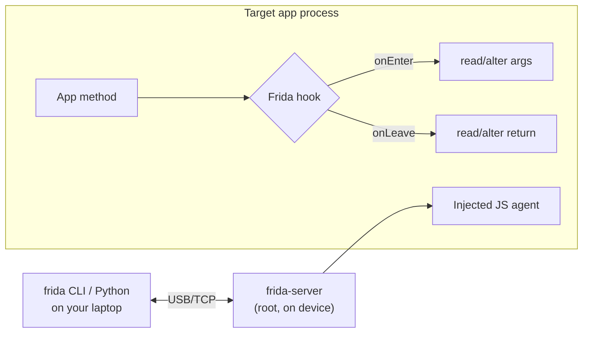
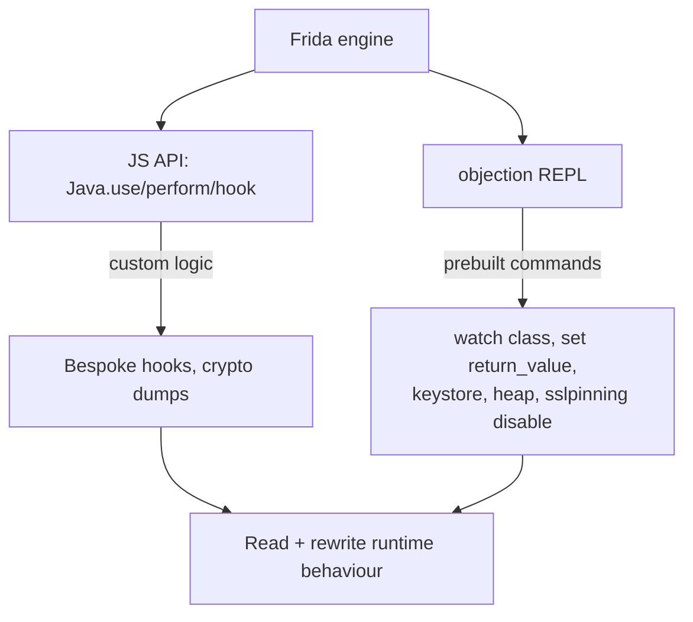
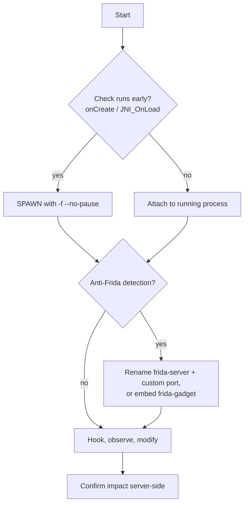

**Level:** Advanced · **Track:** Mobile & IoT · **Read time:** 300 min

This is Chapter 4 of the Mobile & IoT notebook. Chapter 3 read the app at rest and built a map — classes, methods, endpoints, the checks worth defeating. This chapter makes that map *live*. Dynamic instrumentation means attaching to the running process and, from the outside, reading its memory, intercepting its function calls, changing arguments and return values, and calling its own methods on demand. It is the single most powerful technique in mobile testing, because it operates on the app *as it actually executes* — after strings are decrypted, after keys are derived, after the "is this a legit device?" boolean has been computed. Anything the app can do, you can observe and rewrite.

The tool at the centre is **Frida**, and its higher-level companion **objection**. By the end you'll be able to dump a function's arguments and return value, force a security check to pass, log every plaintext handed to the crypto engine, and (previewing Chapter 5) neutralise SSL pinning at runtime. This is where static analysis pays off: the classes and methods you noted in jadx are exactly what you hook here.

**Lawful use:** instrument only apps you own or are authorised to test, and the training targets named at the end. Runtime instrumentation reaches deep into an app's internals; keep it in scope.

---

## Part 1: What Dynamic Instrumentation Is

Static analysis has two blind spots: it can't see values that only exist at runtime (a key derived from three sources, a token decrypted in memory), and reading obfuscated code is slow. Dynamic instrumentation removes both. You let the app run and *inject* your own code into its process so you can:

- **Observe** — print the arguments and return value of any method as it's called, dump objects, read fields, walk the heap.
- **Modify** — change a method's arguments before it runs, replace its return value, or swap its whole implementation.
- **Invoke** — call the app's own methods yourself with arguments you choose, from an interactive console.

Because your injected code runs *inside* the target's process, it sees exactly what the app sees — decrypted, deobfuscated, post-computation. String obfuscation is irrelevant: you hook the point *after* the string is decrypted.



**Requirements:** a rooted device (so `frida-server` can inject into other processes) and a working `adb` from Chapter 2. On a non-rooted device you can still instrument an app you can repackage, by embedding a **frida-gadget** library into it (Part 10) — but rooted + `frida-server` is the standard path.

---

## Part 2: Frida Architecture

Frida has three pieces, mirroring adb's shape:

1. **`frida-server`** — a binary you push to the device and run **as root**. It does the actual injection: it writes Frida's engine into the target process and hosts your instrumentation "agent."
2. **The client** — on your laptop: the `frida` / `frida-trace` CLI tools, or the Python bindings (`import frida`). It talks to `frida-server` over USB (via `adb`) or TCP.
3. **The agent** — your instrumentation logic, written in **JavaScript**, injected into the target and executed in its address space. This is what you write.

**Install the client (laptop):**

```bash
pip install frida-tools        # gives: frida, frida-ps, frida-trace, frida-discover
frida --version                # note the version — server MUST match exactly
```

**Install the server (device).** Download the `frida-server` build **matching your client version and the device ABI** (e.g. `frida-server-16.x.x-android-arm64` for an arm64 phone, `-x86_64` for an emulator), push it, and run it as root:

```bash
adb push frida-server-16.x.x-android-arm64 /data/local/tmp/frida-server
adb shell su -c 'chmod 755 /data/local/tmp/frida-server'
adb shell su -c '/data/local/tmp/frida-server &'      # runs listening on tcp 27042
```

**Verify the pipe:**

```bash
frida-ps -U            # -U = USB device; lists running processes
frida-ps -Uai          # list installed apps (a=applications, i=include identifiers)
```

If `frida-ps -U` errors with `unable to connect to remote frida-server: closed`, the server isn't running or the **versions don't match** — the #1 Frida problem. Client 16.2.1 needs server 16.2.1. Re-check `frida --version` and download the exact server build. Wrong ABI (arm server on an x86 emulator) also fails silently.

---

## Part 3: The Frida JavaScript API — the Essentials

Your agent is JavaScript that runs inside the app. For Android/Java the core objects are `Java`, `Java.use`, `Java.perform`. Learn these five patterns and you can hook almost anything.

**1. Enter the Java VM context.** All Java work happens inside `Java.perform`:

```javascript
Java.perform(function () {
  // Java is available here
});
```

**2. Get a handle to a class** with `Java.use` (a *wrapper* over the class):

```javascript
const MainActivity = Java.use("com.example.app.MainActivity");
const String = Java.use("java.lang.String");
```

**3. Hook a method** by replacing its `implementation`. Inside, `this` is the instance; call the original with `this.method(...)`:

```javascript
Java.perform(function () {
  const Login = Java.use("com.example.app.LoginManager");
  Login.checkPassword.implementation = function (pw) {
    console.log("[+] checkPassword called with: " + pw);   // observe the argument
    const result = this.checkPassword(pw);                  // call original
    console.log("[+] original returned: " + result);
    return true;                                            // ...but force success
  };
});
```

**4. Handle overloads.** If a method has several signatures, Frida makes you disambiguate with `.overload(types...)`:

```javascript
const Cipher = Java.use("javax.crypto.Cipher");
// doFinal(byte[]) vs doFinal(byte[], int) ... pick one:
Cipher.doFinal.overload("[B").implementation = function (input) {
  console.log("[crypto] doFinal input bytes: " + bytesToString(input));
  return this.doFinal(input);
};
// Constructors are hooked via $init:
String.$init.overload("[B").implementation = function (b) { return this.$init(b); };
```

**5. Call methods and read fields.** Invoke the app's own code, or read a static field:

```javascript
Java.perform(function () {
  const Cfg = Java.use("com.example.app.Config");
  console.log("BASE_URL = " + Cfg.BASE_URL.value);          // static field
  const util = Java.use("com.example.app.CryptoUtil").$new(); // construct an instance
  console.log("token = " + util.deriveToken("seed"));        // call an instance method
});
```

**Enumerate live instances** when you need an *existing* object rather than a new one — `Java.choose` scans the heap:

```javascript
Java.perform(function () {
  Java.choose("com.example.app.Session", {
    onMatch: function (inst) { console.log("session token: " + inst.getToken()); },
    onComplete: function () {}
  });
});
```

**Run a script:**

```bash
frida -U -f com.example.app -l hook.js       # spawn the app with the script (-f)
frida -U com.example.app -l hook.js          # attach to already-running app
```

`-f` **spawns** the app under instrumentation (hooks apply from the very first instruction); attaching hooks a process that's already up (may have run its checks already). Spawn is usually what you want — see Part 8.

---

## Part 4: Practical Hook — Dump Arguments and Return Values

The most common task: see what a function receives and returns. Generalised:

```javascript
Java.perform(function () {
  const T = Java.use("com.example.app.ApiClient");
  T.signRequest.implementation = function (url, body) {
    console.log("\n[signRequest] url=" + url);
    console.log("[signRequest] body=" + body);
    const ret = this.signRequest(url, body);
    console.log("[signRequest] signature=" + ret);
    return ret;
  };
});
```

**`frida-trace` for zero-code tracing.** To trace methods without writing hooks, `frida-trace` autogenerates stubs:

```bash
frida-trace -U com.example.app -j 'com.example.app.*!*'      # trace all app methods (Java)
frida-trace -U com.example.app -j '*!*crypt*'                # anything with 'crypt'
```

It creates editable `__handlers__/…​.js` files with `onEnter`/`onLeave` you can flesh out. Great for discovery: turn on broad tracing, use the app, watch which methods fire during the action you care about, then narrow.

---

## Part 5: Practical Hook — Defeat a Client-Side Check

Chapter 3 found (say) a root check `SecurityUtil.isRooted()Z` or a login gate. Runtime hooking beats Smali patching here because it's non-destructive and instant.

```javascript
Java.perform(function () {
  // Force a boolean security check to return false (not rooted / not tampered)
  const Sec = Java.use("com.example.app.SecurityUtil");
  Sec.isRooted.implementation = function () {
    console.log("[+] isRooted() -> forcing false");
    return false;
  };
  Sec.isEmulator.implementation = function () { return false; };

  // Force a login/PIN check to succeed
  const Auth = Java.use("com.example.app.Authenticator");
  Auth.verifyPin.overload("java.lang.String").implementation = function (pin) {
    console.log("[+] verifyPin(" + pin + ") -> forcing true");
    return true;
  };
});
```

**Why runtime beats Smali here:** no re-signing, no tamper-detection trip (you didn't modify the APK on disk), and you can iterate in seconds. Reserve Smali patching for cases where you need a *persistent, standalone* modified APK.

---

## Part 6: Practical Hook — Crypto & Secret Extraction

Apps encrypt data before storing or sending it. Hooking the crypto layer dumps the plaintext, keys, and IVs the app thinks are hidden. Hook the standard JCA classes:

```javascript
function b2s(bytes) {           // byte[] -> printable/hex helper
  try { return Java.use("java.lang.String").$new(bytes); } catch (e) { return "" + bytes; }
}
Java.perform(function () {
  const Cipher = Java.use("javax.crypto.Cipher");
  const SKS = Java.use("javax.crypto.spec.SecretKeySpec");
  const IvPS = Java.use("javax.crypto.spec.IvParameterSpec");

  // Log the key when it's constructed
  SKS.$init.overload("[B", "java.lang.String").implementation = function (key, algo) {
    console.log("[key] algo=" + algo + " keyBytes=" + b2s(key));
    return this.$init(key, algo);
  };
  // Log the IV
  IvPS.$init.overload("[B").implementation = function (iv) {
    console.log("[iv] " + b2s(iv));
    return this.$init(iv);
  };
  // Log plaintext in / ciphertext out
  Cipher.doFinal.overload("[B").implementation = function (data) {
    console.log("[doFinal] in=" + b2s(data));
    const out = this.doFinal(data);
    console.log("[doFinal] out(len " + out.length + ")");
    return out;
  };
});
```

This single script routinely reveals hardcoded/derived AES keys, ECB usage, static IVs, and the exact plaintext of "encrypted" local storage — findings that are invisible statically when the key is assembled at runtime. Also hook `MessageDigest`, `Mac` (HMAC), `SecureRandom`, and `SharedPreferences.Editor.putString` to see what the app writes to disk.

---

## Part 7: objection — Frida for Humans

**What it is.** `objection` is a runtime toolkit *built on Frida* that packages the most common tasks into a REPL — no JavaScript required. If Frida is the engine, objection is the dashboard. It's the fastest way to do routine work: explore classes, dump the keystore, search the heap, and bypass SSL pinning with one command.

**Install & start:**

```bash
pip install objection
objection -g com.example.app explore        # -g = gadget/target; drops you in a REPL
```

Inside the REPL, high-value commands:

```text
# --- Environment / storage ---
env                                   # app directories (data dir, cache, etc.)
android hooking list activities       # list activities
android hooking list services
ls  /  cat <file>                     # browse the app's private files

# --- Class / method discovery ---
android hooking search classes login  # find classes by keyword
android hooking search methods verify # find methods by keyword
android hooking list class_methods com.example.app.Authenticator

# --- Hooking (no JS) ---
android hooking watch class com.example.app.Authenticator        # log all its methods
android hooking watch class_method com.example.app.Authenticator.verifyPin --dump-args --dump-return --dump-backtrace
android hooking set return_value com.example.app.SecurityUtil.isRooted false

# --- Secrets / storage ---
android keystore list                 # entries in the Android Keystore
android keystore watch                # observe keystore usage
android hooking search methods getSharedPreferences

# --- The famous one ---
android sslpinning disable            # attempt a generic pinning bypass (see Ch5)

# --- Heap ---
android heap search instances com.example.app.Session
android heap execute <handle> getToken
```

`objection` covers maybe 80% of routine tasks with no scripting. Drop to raw Frida when you need custom logic objection doesn't have. Note objection can lag Frida releases — if it errors on version, that's the same version-match issue from Part 2.



---

**Frida vs objection — when to reach for which:**

| Need | Tool |
| --- | --- |
| Custom logic, novel hook, crypto dump | **Frida** (write JS) |
| Routine watch/return-override/keystore/heap | **objection** (prebuilt commands) |
| Zero-code broad tracing of many methods | **frida-trace** |
| Bypass SSL pinning quickly | **objection** `android sslpinning disable` |
| Non-rooted device instrumentation | **objection** `patchapk` (frida-gadget) |
| Native (libc/.so) interception | **Frida** `Interceptor.attach` |

## Part 8: Spawn vs Attach, and Beating Timing-Based Anti-Instrumentation

**Spawn (`-f`) vs attach.** If the app runs a security check (root/tamper/pinning setup) in `Application.onCreate` or early in `MainActivity`, attaching *after* launch is too late — the check already ran. **Spawn** the app under Frida so your hooks are in place before any app code executes:

```bash
frida -U -f com.example.app -l hook.js --no-pause   # spawn, inject, resume
objection -g com.example.app explore --startup-command 'android sslpinning disable'
```

**Early instrumentation for native/`onCreate` checks.** Some apps hook their own defenses in `JNI_OnLoad` or a static initializer. Use spawn, and if the check is in native code, hook at the native layer (`Interceptor.attach(Module.getExportByName(...))`) or hook `System.loadLibrary` to run your code around library load.

**Anti-Frida detection** (deeper in Chapter 5) — apps look for `frida-server`'s default port 27042, the string "frida" in memory/maps, the `/data/local/tmp/frida-server` path, or named pipes. Countermeasures: run `frida-server` on a **non-default port** and rename it, use **`frida-gadget`** embedded in the app (no server, no port) for the stealthiest path, or hook the detection routine itself. Start simple:

```bash
adb shell su -c '/data/local/tmp/fs -l 0.0.0.0:47000 &'   # renamed binary, custom port
frida -H 127.0.0.1:47000 -f com.example.app -l hook.js
```

---

**Spawn vs attach at a glance:**

| Mode | Command | Hooks apply | Use when |
| --- | --- | --- | --- |
| **Spawn** | `frida -U -f pkg -l h.js --no-pause` | before any app code | checks run in `onCreate`/early (default choice) |
| **Attach** | `frida -U pkg -l h.js` | after app is already up | app already running, late-stage method |



## Part 9: A Repeatable Methodology

Tie it together into a loop you run on every app:

1. **Enumerate** — `frida-ps -Uai` to get the identifier; `objection … explore`; `android hooking list activities` and `search classes` to map entry points (cross-referenced with your jadx notes).
2. **Broadly trace** — `frida-trace -j 'com.example.app.*!*'` (or `objection watch class`) while you drive the feature you care about; note which methods fire.
3. **Narrow & hook** — write a focused script on the 1–3 interesting methods: dump args/returns, then modify.
4. **Attack the check/secret** — force security booleans, dump crypto plaintext/keys, read the keystore, disable pinning (Ch5) to see traffic.
5. **Confirm server-side** — a client bypass (forcing `verifyPin` true) is only a *real* vuln if the **server** also fails to enforce the control. Always verify the backend accepts the bypassed request; if the server re-checks, your client hook proved nothing exploitable.

That last point is the professional discipline that separates a finding from a party trick: instrumentation makes the *client* do anything, but severity lives in whether the *server* trusted the client.

---

## Part 10: Non-Rooted Instrumentation with frida-gadget

No root? Embed Frida as a library into an app you can repackage (from Chapter 3). The **frida-gadget** is a `.so` you inject into the APK so the app loads Frida itself on startup — no `frida-server`, no root.

Flow: `apktool d app.apk` → add `lib/<abi>/libfrida-gadget.so` and a config → make the app load it (e.g. add a `System.loadLibrary("frida-gadget")` via a small Smali edit, or use `objection patchapk`) → rebuild + re-sign → install. objection automates it:

```bash
objection patchapk --source target.apk        # injects the gadget, outputs target.objection.apk
adb install target.objection.apk
objection explore                              # connects to the embedded gadget
```

Caveat: this repackages and re-signs, so it trips the same tamper/pinning issues as Chapter 3's repackaging. On a rooted device, prefer plain `frida-server`.

---

## Part 11: Detection & Defense Angle

What an app team ships to make instrumentation costly (again, never impossible on an owned device — the goal is to raise cost and generate signal):

- **Anti-Frida / anti-debug checks.** Scan `/proc/self/maps` and open ports for Frida artefacts, detect the gadget library, check `TracerPid` in `/proc/self/status`, and detect `ptrace`. These are bypassable (hook the check) but filter unsophisticated attackers and can be reported to the backend as a risk signal.
- **Native-side, timing-sensitive checks.** Run integrity/root/pinning checks in native code and early (`JNI_OnLoad`), where they're harder to hook and time-of-check games are less forgiving.
- **RASP (Runtime Application Self-Protection).** Commercial SDKs bundle root/emulator/Frida/debugger/hook detection with obfuscation and re-checking. They raise the bar meaningfully; a determined tester still gets through but spends real time.
- **Don't put trust in the client.** The theme of the whole notebook: every hook above works because the *client* made a security decision. Enforce authentication, authorization, PIN/OTP validation, entitlement, and rate limits **server-side**, and verify device integrity with **Play Integrity** on the backend. A Frida hook that flips `verifyPin` to true must still be rejected by a server that actually checks the PIN.
- **Protect secrets at rest even from instrumentation.** Use the hardware-backed Android Keystore so key *material* never enters app memory (crypto happens in the TEE/StrongBox), blunting the crypto-hook technique in Part 6 — the attacker can still see plaintext in/out but not extract the key.

**IR/malware angle:** the same Frida hooks are how analysts observe a malicious app's live behaviour — dump the C2 URL it decrypts at runtime, watch what it exfiltrates, and read commands after decryption — without waiting for it to reveal itself.

---

## Final Revision / Summary

- **Dynamic instrumentation runs your code inside the target process**, so you see values *after* decryption/deobfuscation and can rewrite behaviour live. It removes static analysis's two blind spots.
- **Frida = client (laptop) + `frida-server` (root, device) + JS agent (injected).** The #1 failure is a **version mismatch** or wrong ABI between client and server — they must match exactly.
- Core API: `Java.perform` → `Java.use(class)` → replace `method.implementation`; disambiguate with `.overload(types)`; read/write fields (`.value`), construct (`$new`), and scan live objects with `Java.choose`.
- Bread-and-butter hooks: **dump args/returns** (or `frida-trace` for zero-code), **force a security boolean** (root/tamper/PIN), and **hook the crypto layer** (`Cipher`, `SecretKeySpec`, `IvParameterSpec`) to dump keys/IVs/plaintext.
- **objection** wraps Frida into a REPL: `watch class`, `set return_value`, `keystore list`, `heap search`, `sslpinning disable` — 80% of routine work with no JS.
- **Spawn (`-f`) beats attach** when checks run early; run `frida-server` on a renamed binary / non-default port (or embed **frida-gadget**) to dodge simple anti-Frida detection.
- **Severity lives server-side.** A client bypass is only a real vuln if the backend also fails to enforce the control — always confirm.

## Cheat Sheet / Quick Reference

```bash
# --- Setup ---
pip install frida-tools objection
frida --version                                  # match server to THIS exactly
adb push frida-server-<ver>-android-<abi> /data/local/tmp/frida-server
adb shell su -c 'chmod 755 /data/local/tmp/frida-server; /data/local/tmp/frida-server &'
frida-ps -U ; frida-ps -Uai                      # verify + list processes/apps

# --- Run scripts ---
frida -U -f com.pkg -l hook.js --no-pause        # SPAWN + inject
frida -U com.pkg -l hook.js                       # attach
frida-trace -U com.pkg -j 'com.pkg.*!*crypt*'     # auto-trace matching methods

# --- objection ---
objection -g com.pkg explore
#   android hooking watch class_method com.pkg.Auth.verifyPin --dump-args --dump-return
#   android hooking set return_value com.pkg.SecurityUtil.isRooted false
#   android keystore list ; android heap search instances com.pkg.Session
#   android sslpinning disable
objection patchapk --source app.apk               # non-rooted: embed frida-gadget
```

```javascript
// hook.js essentials
Java.perform(function () {
  const C = Java.use("com.pkg.Target");
  C.method.overload("java.lang.String").implementation = function (a) {
    console.log("[in] " + a);
    const r = this.method(a);
    console.log("[out] " + r);
    return r;                       // or: return true / modified value
  };
});
```

## Practice Labs & Resources

- **OWASP MASTG UnCrackable-Android L1–L4** — the canonical Frida exercises: L1 root-check hook, L2 native check, L3/L4 escalating anti-tamper; each solvable with the patterns above.
- **DIVA** and **InsecureBankv2** — hook their login/crypto to dump secrets live.
- **Frida CodeShare** — community scripts (universal root bypass, pinning bypass) to read and adapt, not just run blindly.
- **objection wiki** and **Frida "JavaScript API" docs** — the authoritative reference for `Java.use`, `Interceptor`, `Java.choose`, overloads.
- **HackTheBox mobile challenges / THM "Frida" rooms** — end-to-end targets that reward the enumerate→trace→hook loop.

In the next chapter we focus the instrumentation firepower on the two defenses that most often stand between you and an app's traffic and internals: **root detection and SSL pinning** — how they work, and how to defeat them cleanly at runtime.

---

*Also on [Praneeth's portfolio](https://ping-praneeth.vercel.app/notebook/mobile-iot-hardware/04-android-dynamic-analysis-and-instrumentation-frida-and-objection), with comments and the latest edits.*
