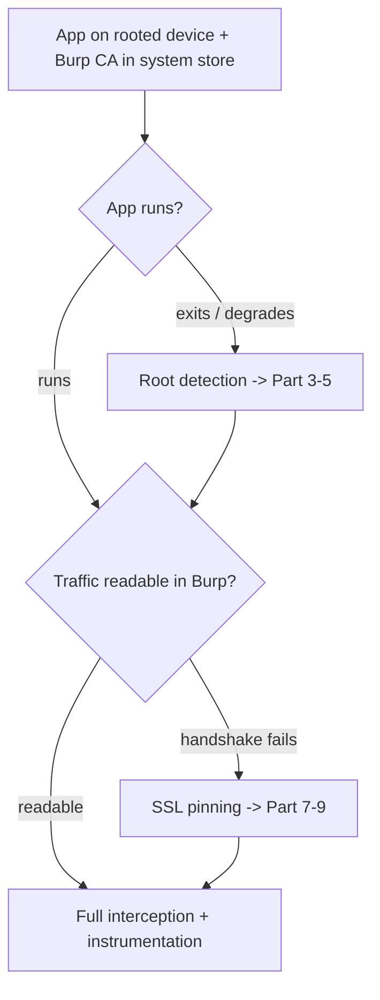
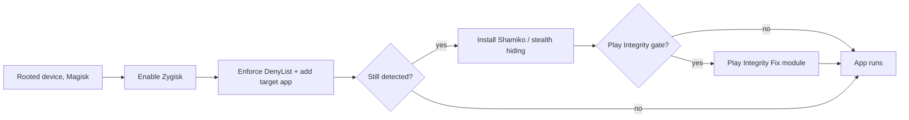
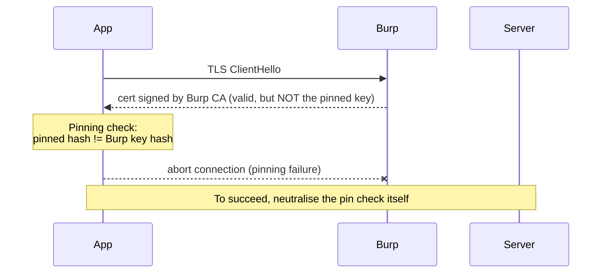
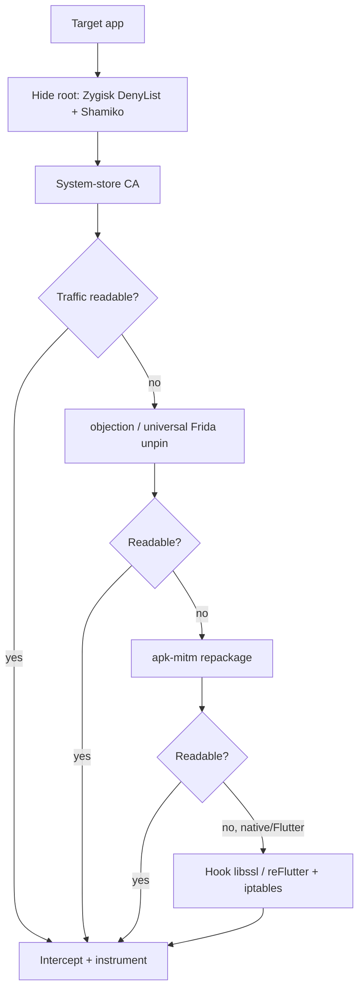

This is Chapter 5 of the Mobile & IoT notebook. Chapters 2–4 gave you a rooted device, a static map, and a live-instrumentation toolkit. Two defenses now stand between you and most real apps: **root/tamper detection** (the app refuses to run, or degrades, on a rooted device) and **certificate pinning** (the app refuses to trust your proxy's CA even from the system store, so you can't read its traffic). This chapter is dedicated to both, because between them they account for the majority of "I set everything up and it still doesn't work" moments in mobile testing.

The theme carries over from Chapter 4: these are **client-side** controls, and a client-side control on a device the attacker owns can always be defeated — the only question is cost. We'll go from the cheapest reliable methods to the ones you reach for when an app fights back with native code and layered checks.

**Lawful use:** defeat these controls only on apps you own or are explicitly authorised to test, and on the training targets named at the end. Circumventing protections on apps you have no permission to assess can breach terms and law.

---

## Part 1: Why These Two Defenses Matter Most

Almost every serious app ships at least one of these, and they gate everything downstream:

- **Root detection** decides whether the app runs *at all* on your test device. Banking, payment, DRM, and enterprise apps frequently exit on launch if they think the device is rooted. If you can't get past it, you can't test the app on your convenient rooted rig.
- **SSL pinning** decides whether you can *read the traffic*. Even with Burp's CA in the system store (Chapter 2, Part 11), a pinning app validates the server cert against a hardcoded pin and aborts — so all your interception work shows nothing but failed handshakes.

Both are bypassable; both occasionally require real effort. The right instinct is to **prefer the least invasive method that works** — hiding root or hooking a pin at runtime beats repackaging, which trips other defenses. Escalate only as the app forces you to.



---

## Part 2: How Root Detection Works

To beat it, know what it looks for. Root-detection routines stack many cheap checks; you must satisfy *all* of them.

| Technique | What it checks | Example |
| --- | --- | --- |
| `su` binary | `su` on PATH / known locations | `/system/bin/su`, `/system/xbin/su`, `/sbin/su` |
| Root manager packages | installed root apps | `com.topjohnwu.magisk`, `eu.chainfire.supersu` |
| Magisk artefacts | Magisk files/paths/props | `/data/adb/magisk`, `magisk` in mounts |
| Build tags | test-keys instead of release-keys | `Build.TAGS` contains `test-keys` |
| System props | debuggable/secure props | `ro.debuggable=1`, `ro.secure=0` |
| Writable system paths | `/system` mounted rw | attempt write to `/system` |
| Busybox / common root bins | root toolset present | `busybox`, `supolicy` |
| Native checks | same checks in C (harder to hook) | `access("/system/bin/su", F_OK)` in JNI |
| **RootBeer** | a popular library bundling all the above | `com.scottyab.rootbeer` |
| **Play Integrity / SafetyNet** | Google-attested device integrity | server verifies `MEETS_DEVICE_INTEGRITY` |

The first several are trivial file/package/prop lookups — easy to hook or hide. The last two are the hard tier: **native checks** dodge Java hooks, and **Play Integrity** is verified by *Google's servers* against a hardware-backed attestation, so no client-side hook satisfies it directly — you must either *hide* root well enough that the attestation passes, or (properly) test with a device/profile that legitimately passes.

---

## Part 3: Beating Root Detection — Hiding Root (Magisk)

The cleanest approach is to make the device *look unrooted* to the app, rather than patch each check. Magisk provides this.

**Magisk DenyList.** Magisk can unmount its modifications and hide the `su` interface from a chosen list of apps. In the Magisk app: enable **Zygisk**, turn on **Enforce DenyList**, and add the target app (and its related processes) to the DenyList. Magisk then hides its root artefacts from those processes.

**Shamiko / systemless hiding.** The built-in DenyList is well-known to detection libraries. **Shamiko** (a Zygisk module) provides stronger hiding by making the DenyList operate in "whitelist"/stealth mode and unmounting more thoroughly. Install Shamiko, keep Zygisk on, and (per Shamiko's instructions) switch DenyList to the mode it expects. This defeats the large class of apps that rely on RootBeer-style Java checks.

**Play Integrity fixes.** For apps that gate on Play Integrity `MEETS_DEVICE_INTEGRITY`, community modules ("Play Integrity Fix"/"Fingerprint" modules) spoof a valid device fingerprint so the *basic/device* verdict can pass on some devices. This is an arms race with Google and often only satisfies the weaker verdicts, not `STRONG_INTEGRITY` (hardware-backed). Be honest about scope: if an app requires strong hardware attestation for an action, the supported path is a genuinely-passing device, and the *finding* is usually about what happens if that control is bypassed — verified server-side.



---

## Part 4: Beating Root Detection — Frida Hooks

When hiding isn't enough (or you want surgical control), hook the checks at runtime. This is fast and non-destructive.

**Hook the specific check** you found in jadx (Chapter 3):

```javascript
Java.perform(function () {
  const Root = Java.use("com.example.app.security.RootCheck");
  Root.isDeviceRooted.implementation = function () { return false; };
  Root.isRooted.implementation = function () { return false; };
});
```

**Hook RootBeer wholesale** (very common library):

```javascript
Java.perform(function () {
  const RootBeer = Java.use("com.scottyab.rootbeer.RootBeer");
  ["isRooted", "isRootedWithoutBusyBoxCheck", "detectRootManagementApps",
   "detectPotentiallyDangerousApps", "checkForSuBinary", "checkForBusyBoxBinary",
   "detectTestKeys", "checkForDangerousProps", "checkForRWPaths"].forEach(function (m) {
    if (RootBeer[m]) { RootBeer[m].implementation = function () { return false; }; }
  });
});
```

**Hook the primitives** the checks are built on, to catch homemade detection generically — intercept file existence and package lookups for known root paths:

```javascript
Java.perform(function () {
  const File = Java.use("java.io.File");
  File.exists.implementation = function () {
    const p = this.getAbsolutePath();
    if (/su|magisk|superuser|busybox/i.test(p)) { return false; }
    return this.exists();
  };
  // Runtime.exec("su") style checks
  const Runtime = Java.use("java.lang.Runtime");
  Runtime.exec.overload("java.lang.String").implementation = function (cmd) {
    if (cmd.indexOf("su") !== -1) { throw Java.use("java.io.IOException").$new("not found"); }
    return this.exec(cmd);
  };
});
```

**Native root checks** (in a `.so`, dodging Java hooks) — hook the libc functions they use:

```javascript
["access", "stat", "fopen", "open"].forEach(function (fn) {
  const p = Module.getExportByName("libc.so", fn);
  if (p) Interceptor.attach(p, {
    onEnter: function (args) {
      const path = args[0].readCString();
      if (path && /su|magisk/i.test(path)) { this.block = true; }
    },
    onLeave: function (ret) { if (this.block) ret.replace(ptr("-1")); }  // pretend not found
  });
});
```

Spawn the app (`frida -U -f … --no-pause`) so the hooks land before the check runs.

---

## Part 5: Beating Root Detection — Smali Patching (Persistent)

When you need a standalone modified APK (no Frida at runtime), patch the check in Smali (Chapter 3) and re-sign: find the boolean detection method, force `const/4 v0, 0x0` / `return v0`. Downsides carry over — re-signing trips signature/integrity checks, and it won't beat native or server-verified checks. Use it only when a persistent artefact is the requirement; otherwise Frida is cleaner.

---

## Part 6: How SSL Pinning Works

Pinning means the app doesn't merely require a *valid* certificate — it requires *the specific one it expects*. Even a system-store Burp CA produces a "valid" cert, but it isn't the pinned one, so validation fails. Where the pin lives determines how you beat it.

| Pinning mechanism | Where | How it validates |
| --- | --- | --- |
| **Network Security Config `<pin-set>`** | `res/xml`, declarative | platform compares server key hash to pinned `sha256/...` |
| **OkHttp `CertificatePinner`** | app code (very common) | OkHttp checks the cert chain against pinned hashes |
| **Custom `TrustManager` / `HostnameVerifier`** | app code | app-implemented `checkServerTrusted` |
| **TrustKit** | library | wraps NSC-style pinning |
| **WebView** `onReceivedSslError` | WebView | app decides whether to proceed |
| **Native / BoringSSL pinning** | C/`.so` (hardest) | pin verified in native `SSL_CTX`/verify callback |
| **Flutter (BoringSSL)** | `libflutter.so` | Dart/BoringSSL, ignores system proxy + pins |



The strategy mirrors root detection: **hook the check at runtime** first (cleanest), fall back to **repackaging** (patch/remove the pin) when you need persistence, and go **native** when the pin lives in C.

---

## Part 7: Defeating Pinning — objection & Universal Frida Scripts

**objection one-liner** (tries a broad set of known pinning implementations):

```bash
objection -g com.example.app explore
# in the REPL:
android sslpinning disable
```

Or spawn with it applied from the first instruction:

```bash
objection -g com.example.app explore --startup-command 'android sslpinning disable'
```

**Frida universal unpinning.** The community "Universal Android SSL Pinning Bypass" scripts (on Frida CodeShare, e.g. `httptoolkit`/`pcipolloni` variants) hook the common choke points at once: `TrustManagerImpl.verifyChain`/`checkTrustedRecursive`, OkHttp `CertificatePinner.check`, `X509TrustManager`, `HostnameVerifier`, TrustKit. Run:

```bash
frida -U -f com.example.app -l frida-multiple-unpinning.js --no-pause
```

The core of such a script, illustrated for the two most common cases:

```javascript
Java.perform(function () {
  // 1) OkHttp CertificatePinner: make check() a no-op
  try {
    const CP = Java.use("okhttp3.CertificatePinner");
    CP.check.overload("java.lang.String", "java.util.List").implementation = function () { return; };
  } catch (e) {}

  // 2) Platform TrustManagerImpl: accept every chain
  try {
    const TMI = Java.use("com.android.org.conscrypt.TrustManagerImpl");
    TMI.checkTrustedRecursive.implementation = function () {
      return Java.use("java.util.ArrayList").$new();     // empty list == trusted
    };
  } catch (e) {}

  // 3) Replace default TrustManager with an all-trusting one
  try {
    const TM  = Java.registerClass({
      name: "com.x.TrustAll",
      implements: [Java.use("javax.net.ssl.X509TrustManager")],
      methods: {
        checkClientTrusted: function () {},
        checkServerTrusted: function () {},
        getAcceptedIssuers: function () { return []; }
      }
    });
    const SSLContext = Java.use("javax.net.ssl.SSLContext");
    SSLContext.init.overload("[Ljavax.net.ssl.KeyManager;", "[Ljavax.net.ssl.TrustManager;",
      "java.security.SecureRandom").implementation = function (km, tm, sr) {
      this.init(km, [TM.$new()], sr);
    };
  } catch (e) {}
});
```

For most Java/OkHttp apps, objection or a universal script + a system-store CA is the entire job.

---

## Part 8: Defeating Pinning — Repackaging (No-Frida Persistence)

When you need interception without Frida running (e.g., handing a modified build to a fuzzer), patch the pin statically:

- **NSC pin-set**: `apktool d`, delete the `<pin-set>` from `res/xml/network_security_config.xml` (and add `<certificates src="user"/>`), rebuild + re-sign (Chapter 3).
- **apk-mitm**: an automated tool that decodes, strips pinning + adds a user-cert NSC, and re-signs in one command:

```bash
apk-mitm target.apk        # outputs target-patched.apk ready to install
adb install target-patched.apk
```

Same caveats as all repackaging: re-signing trips tamper/integrity checks, and it won't touch native pins. Great when it works; fall back to Frida when the app detects the repackage.

---

## Part 9: Defeating Pinning — Native & Flutter

The hard tier: the pin is verified in C, invisible to Java hooks.

**Native OpenSSL/BoringSSL pinning.** Apps (and Flutter) verify the chain inside `libssl`/BoringSSL. Beat it by hooking the native verification callback so it always reports success:

```javascript
// Force BoringSSL/OpenSSL cert verification to succeed
const ssl = Module.findExportByName("libssl.so", "SSL_get_verify_result");
if (ssl) Interceptor.replace(ssl, new NativeCallback(function () { return 0; /* X509_V_OK */ },
  "int", ["pointer"]));
```

**Flutter apps** are the classic hard case: `libflutter.so` uses BoringSSL, **ignores the system proxy**, and pins. Two-part fix: (1) route traffic (Flutter ignores `http_proxy`, so use iptables transparent redirection from Chapter 2, or the `reFlutter` tooling), and (2) neutralise the BoringSSL verify by patching/hooking `ssl_verify_result`/the handshake in `libflutter.so`. Tools: **reFlutter** (patches the Flutter engine to accept your CA and route traffic) is the pragmatic path; hand-hooking the BoringSSL function offset is the manual one.

**Anti-Frida in the same binary.** Native-pinning apps often also detect Frida (Part 8 of Chapter 4). Run `frida-server` renamed on a custom port, or embed `frida-gadget`, and hook the anti-Frida routine before it fires.

---

## Part 10: Putting It Together — A Decision Flow

Run this order on every app; stop at the first that works:

1. **Root:** Magisk **Zygisk + DenyList** → add **Shamiko** if still detected → **Play Integrity Fix** if it gates on integrity → **Frida hook** the specific/RootBeer/native check if hiding fails.
2. **Traffic:** system-store Burp CA (Ch2) → **objection `sslpinning disable`** or **universal Frida unpin** → **apk-mitm/repackage** if you need no-Frida persistence → **native/BoringSSL hook** (or **reFlutter** for Flutter) for native pins → **iptables transparent + invisible proxy** if the app ignores the proxy.
3. **Always spawn** (`-f … --no-pause`) so hooks beat early checks, and always **confirm the finding server-side**.



---

## Part 11: Detection & Defense Angle

The defensive reality: these controls are **speed bumps that raise cost and generate signal**, not walls — a determined tester on an owned device defeats each. Ship them as *defence in depth* backed by server-side truth:

- **Layer root detection** (Java + native + RootBeer/commercial RASP) so no single hook wins, and run checks in native code, early, and repeatedly. Report failures to the backend as risk telemetry rather than only blocking the client.
- **Anchor trust in Play Integrity, verified server-side.** The only root/tamper signal that resists client hooking is a Google-signed device attestation checked by *your server*. Gate sensitive actions on it server-side; a client-side integrity check is bypassable by definition.
- **Pin correctly and in depth.** Pin the intermediate (not just the leaf) to survive rotation, keep a backup pin to avoid bricking, and prefer **native/BoringSSL pinning** over pure-Java for a higher bar. Recognise that pinning protects *confidentiality of the channel from the user's own device* only weakly — its real value is against network-position attackers, not against the device owner.
- **Combine with obfuscation + anti-Frida + anti-debug (RASP).** The whole point is to make each layer independently costly so the sum is expensive.
- **Never trust the client, full stop.** Every technique in this chapter works because a *client* made a security decision. Authorization, entitlement, fraud checks, and rate limits must live on the **server**. If forcing `isRooted()` to false or unpinning TLS lets an attacker do something damaging, the bug is that the *server* trusted the client — fix it there.

**Blue-team angle:** understanding these bypasses tells you what to *monitor* — sudden integrity-verdict failures, requests from clients whose attestation doesn't match, or a spike of a user's traffic that no longer matches expected pinning behaviour are all detections you can build server-side.

---

## Final Revision / Summary

- Root detection and SSL pinning are the two defenses that most often block a test: root detection decides **whether the app runs**, pinning decides **whether you can read its traffic**. Both are **client-side**, so both are beatable on an owned device — the question is cost.
- **Root detection** stacks cheap checks (su/packages/props/build-tags/RootBeer) plus a hard tier (native checks, Play Integrity). Beat the easy tier by **hiding root** (Magisk **Zygisk + DenyList + Shamiko**); beat homemade/native checks by **Frida-hooking** the method, RootBeer, or libc primitives (`File.exists`, `access`); use **Play Integrity Fix** for integrity gates, honestly scoped.
- **Pinning** lives in different places (NSC pin-set, OkHttp `CertificatePinner`, custom `TrustManager`, TrustKit, native/BoringSSL, Flutter). Beat Java pins with **objection `sslpinning disable`** or a **universal Frida unpin** script; **apk-mitm/repackage** for no-Frida persistence; hook **`libssl` verify** or use **reFlutter** for native/Flutter pins; add **iptables transparent + invisible proxy** when the app ignores the system proxy.
- **Prefer the least invasive method that works** and **always spawn** so hooks beat early checks.
- **Severity is server-side.** Bypassing a client control only matters if the backend also fails to enforce it — confirm every time.

## Cheat Sheet / Quick Reference

```bash
# --- Hide root (Magisk) ---
# Magisk app: enable Zygisk -> Enforce DenyList -> add target app (+processes)
# Install Shamiko module for stronger hiding; Play Integrity Fix for integrity gates

# --- Frida root-check bypass ---
frida -U -f com.pkg -l rootbypass.js --no-pause
#   hook RootCheck.isRooted -> false ; RootBeer.* -> false ;
#   File.exists path~/su|magisk/ -> false ; libc access()/stat() -> -1

# --- SSL unpin (Java) ---
objection -g com.pkg explore --startup-command 'android sslpinning disable'
frida -U -f com.pkg -l frida-multiple-unpinning.js --no-pause

# --- SSL unpin (no Frida, persistent) ---
apk-mitm target.apk && adb install target-patched.apk

# --- Native / Flutter ---
#   Frida: Interceptor.replace SSL_get_verify_result -> 0 (X509_V_OK)
#   Flutter: reFlutter to patch engine + iptables transparent redirect (Ch2)
adb shell su -c 'iptables -t nat -A OUTPUT -p tcp --dport 443 -j DNAT --to-destination <host>:8080'
```

## Practice Labs & Resources

- **OWASP MASTG UnCrackable-Android L1–L4** — L1 root check, L2 native check, L3/L4 layered anti-tamper; the definitive practice for both hooking and hiding.
- **DIVA / InsecureBankv2** — simpler root and storage checks to warm up on.
- **A pinned demo app** (e.g., an OkHttp `CertificatePinner` sample, or a Flutter app) — practise objection unpin, universal Frida script, apk-mitm, and the native/Flutter path end-to-end.
- **Frida CodeShare** — "Universal Android SSL Pinning Bypass" and RootBeer-bypass scripts to study, not just run.
- **Magisk / Shamiko / Play Integrity Fix** project docs — current setup steps (this space moves fast; always check the latest module guidance).
- **OWASP MASTG "Testing Network Communication" and "Anti-Reversing Defenses"** chapters — the reference for pinning and root-detection testing.

In the next chapter we turn from defenses to *offense against the app's own surface*: **Android IPC** — deep links, intents, and exported components — where a malicious app or a crafted link can reach into the target and abuse the very components you catalogued in Chapter 3.
