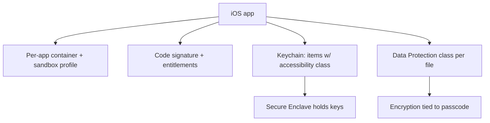
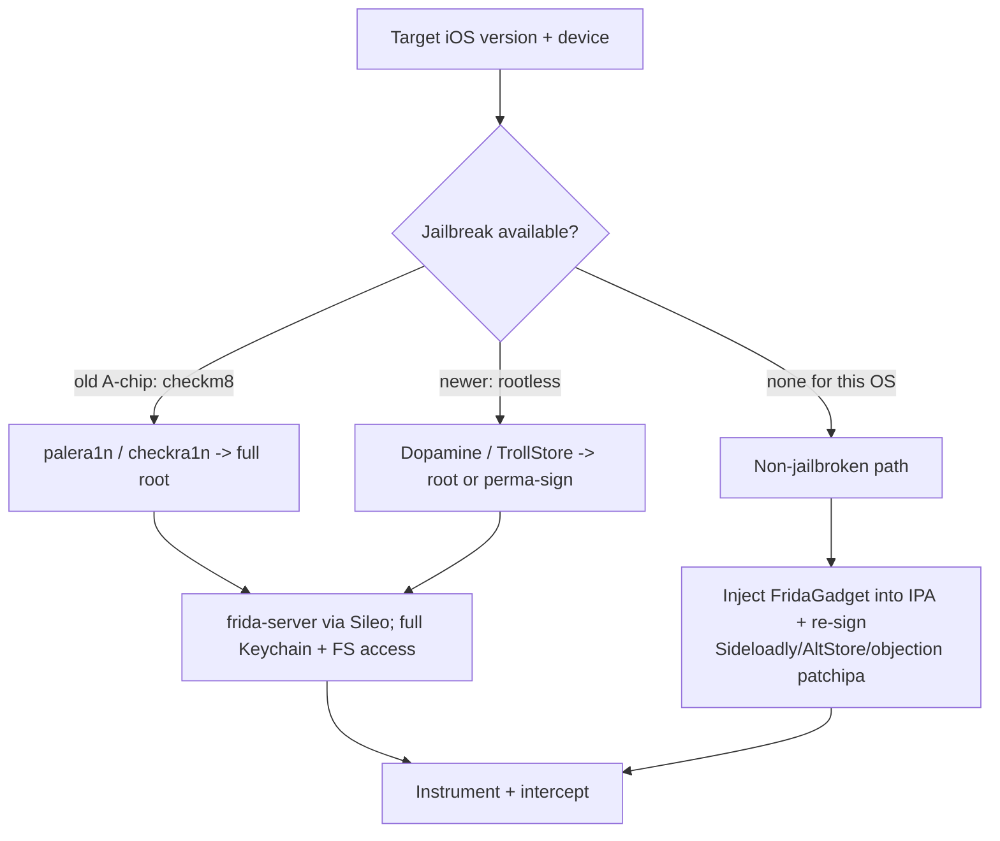
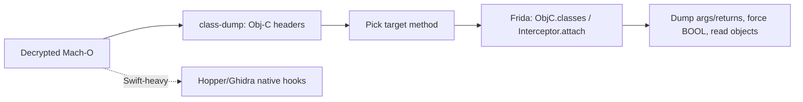

This is Chapter 7 of the Mobile & IoT notebook. Six chapters built a complete Android practice; this one crosses to iOS. The good news: the *concepts* transfer almost entirely — you still intercept TLS, still hook methods at runtime with Frida and objection, still hunt insecure storage and pinning and IPC. The differences are in the platform's shape: a much tighter sandbox and code-signing regime, a different binary format (Mach-O, often encrypted by the App Store), a keychain-and-Data-Protection storage model, and a jailbreak landscape that is far more version-sensitive than Android rooting. This chapter builds the iOS mental model and the workflow, mapping each piece back to what you already know.

**Lawful use:** test only apps you own or are authorised to assess, on devices you own. Jailbreaking your own device is generally permissible; circumventing protections on third-party apps you have no permission to test is not. Everything below assumes an in-scope target and your own hardware.

---

## Part 1: The iOS Security Model vs Android

Start from the differences that change how you test:

| Aspect | Android | iOS |
| --- | --- | --- |
| Openness | Sideloading normal; many OEMs | Locked; App Store + signing gate everything |
| "Root" | Root a device (Magisk) | **Jailbreak** — version-specific, often unavailable on latest |
| App format | APK (ZIP + DEX) | **IPA** (ZIP + Mach-O), App Store binary is **encrypted** |
| Code | Java/Kotlin -> Dalvik | Objective-C / Swift -> Mach-O native |
| Runtime hooking | Frida over Java | Frida over Obj-C runtime / native |
| Storage | files, SharedPreferences, SQLite | files, **plists**, **Keychain**, SQLite/Core Data |
| Secure hardware | Keystore / StrongBox | **Secure Enclave** |
| Data-at-rest | FBE | **Data Protection** classes tied to passcode |
| Sandbox | UID per app + SELinux | per-app container + entitlements + tight sandbox profile |

The two that most shape your day:

- **Jailbreak availability.** Android: you can almost always root *something*. iOS: whether a jailbreak exists depends on the exact iOS version and hardware. Old A-series devices have the permanent **checkm8** bootrom exploit (checkra1n/palera1n); newer ones depend on semi-tethered jailbreaks (Dopamine, etc.) that lag OS releases. Plan the target device/OS around what's jailbreakable, or use the non-jailbroken workflow (Part 3).
- **Encrypted App Store binaries.** An IPA from the App Store is FairPlay-DRM-encrypted; you must **decrypt** it on a jailbroken device before static analysis of the Mach-O yields anything (Part 5).

---

## Part 2: Sandbox, Signing, Keychain & Data Protection

Four pillars you'll test against:

**App sandbox & entitlements.** Every app runs in a per-app **container** (`/var/mobile/Containers/Data/Application/<UUID>/` for data, `.../Bundle/Application/<UUID>/` for the app bundle) under a strict sandbox profile. What an app may do beyond its container is governed by **entitlements** baked into its code signature (e.g., keychain access groups, app groups, associated domains for universal links). Over-broad entitlements are a finding.

**Code signing & provisioning.** iOS refuses to run unsigned code. Apps are signed with an Apple-issued certificate and a **provisioning profile** listing entitlements and (for non-App-Store builds) allowed devices. This is why you can't just repackage-and-run like Android without re-signing with a valid profile (Sideloadly/AltStore handle this for testing).

**Keychain.** The iOS **Keychain** is the OS-provided encrypted store for secrets (tokens, passwords, keys). Items have **accessibility** attributes (e.g., `kSecAttrAccessibleWhenUnlocked`, `...AfterFirstUnlock`, `...WhenPasscodeSetThisDeviceOnly`) controlling when they're readable. Common bugs: storing secrets with too-permissive accessibility (readable after first unlock, or without requiring a passcode), or putting secrets in plists/UserDefaults *instead* of the Keychain. On a jailbroken device you can dump the Keychain and see exactly what's stored and how (Part 6).

**Data Protection.** File-level encryption tied to the passcode, with classes: `Complete` (readable only while unlocked), `CompleteUntilFirstUserAuthentication` (the common default — readable after first unlock until reboot), `CompleteUnlessOpen`, and `None`. A sensitive file stored with `None` or the weak default is a data-at-rest finding.

**Secure Enclave (SEP).** A separate coprocessor holding keys that never leave it (Touch/Face ID, hardware keys). Like StrongBox on Android, it blunts key-extraction: crypto happens in the SEP, so hooking the app can reveal plaintext in/out but not the key material.



---

## Part 3: Jailbroken vs Non-Jailbroken Testing

Two workflows; pick per device availability.

**Jailbroken (full power).** A jailbreak gives you root and disables code-signing enforcement, so you can run `frida-server`, drop into the app container, dump the Keychain, and read any file. Jailbreak paths:

- **checkra1n / palera1n** — based on the unpatchable **checkm8** bootrom exploit; works on older A-series (roughly A7–A11) regardless of iOS version. `palera1n` is the modern one (supports newer iOS on those chips). Semi-tethered.
- **Dopamine / others** — rootless jailbreaks for newer devices/iOS, availability lags each iOS release.
- **TrollStore** — not a jailbreak but a permanent-signing exploit on affected iOS versions; installs IPAs (including tools) with arbitrary entitlements without a computer re-sign every 7 days. Hugely convenient for testing tools when available.

After jailbreak, install Frida via the package manager (Sileo/Cydia) by adding Frida's repo, giving you `frida-server` on the device automatically.

**Non-jailbroken (constrained but realistic).** When no jailbreak exists for the target OS, you can still test by **repackaging the IPA with the Frida gadget** and re-signing it with your own Apple developer certificate, then sideloading:

- **Sideloadly / AltStore** — sign an IPA with your Apple ID and install it (7-day free-cert limit, or longer with a paid account).
- Inject **`FridaGadget.dylib`** into the app (via `objection patchipa` or `optool`/`insert_dylib` + a re-sign) so it loads Frida on launch — the iOS analogue of Android's frida-gadget path.

This limits you to *that one app* (no system-wide root, no Keychain dump of other apps), but it's enough for interception and instrumentation of your target on a stock device.

---



## Part 4: Tooling

The iOS kit, mapped to purpose:

```bash
# Device communication (the 'adb of iOS')
brew install libimobiledevice ideviceinstaller
idevice_id -l                      # list connected UDIDs
ideviceinfo                        # device info
ideviceinstaller -l                # list installed apps + bundle IDs
idevicesyslog                      # live device log (like logcat)

# Instrumentation (same as Android)
pip install frida-tools objection
frida-ps -Uai                      # list apps on a jailbroken device w/ frida-server

# Sign / sideload (non-JB)
#   Sideloadly / AltStore (GUI) to sign+install an IPA with your Apple ID
#   objection patchipa --source app.ipa   # inject FridaGadget + re-sign

# Static
#   class-dump / dsdump  -> Objective-C headers from a (decrypted) Mach-O
#   Hopper / Ghidra / IDA -> disassemble Mach-O
#   otool -l / -L         -> Mach-O load commands / linked libs
#   plutil -p file.plist  -> pretty-print a (binary) plist
```

The through-line: **Frida and objection are identical across platforms.** Everything you learned in Chapter 4 works here — only the class names change (Obj-C/Swift instead of Java).

---

## Part 5: Getting & Decrypting the IPA

An App Store IPA's main Mach-O is **FairPlay-encrypted**; `otool -l` shows a `LC_ENCRYPTION_INFO` command with `cryptid 1`. Static tools see ciphertext until you decrypt, which requires a **jailbroken device** (decrypt in-memory after the loader decrypts it):

```bash
# On a jailbroken device, decrypt the running app's binary:
#   frida-ios-dump (pulls + decrypts the IPA over SSH/Frida)
python3 dump.py <bundle-id>            # -> Target.ipa, decrypted

# Verify decryption:
otool -l Payload/Target.app/Target | grep -A4 LC_ENCRYPTION_INFO   # cryptid should be 0
```

`frida-ios-dump` is the standard tool: it uses Frida to grab the app's decrypted image from memory and repackage a clean IPA you can analyse. Once decrypted:

```bash
unzip Target.ipa            # Payload/Target.app/ ...
ls Payload/Target.app
#   Target (Mach-O binary)  Info.plist  embedded.mobileprovision  Frameworks/  Assets.car  *.plist
```

**IPA layout worth knowing:** `Info.plist` (bundle ID, URL schemes for deep links, associated domains, ATS settings), `embedded.mobileprovision` (entitlements — `security cms -D -i embedded.mobileprovision`), `Frameworks/` (embedded dylibs incl. things like `Flutter`), and the Mach-O itself.

---

## Part 6: Exploring the App & Dumping the Keychain

On a jailbroken device (or via objection against the gadget), objection makes iOS storage introspection point-and-click:

```bash
objection -g com.example.app explore
# --- filesystem / container ---
env                                       # Bundle + Data container paths
ls                                        # browse the container
ios plist cat Info.plist                  # read a plist
ios nsuserdefaults get                    # dump UserDefaults (secrets often here by mistake)
# --- the big one: keychain ---
ios keychain dump                         # every keychain item + accessibility class
# --- crypto / hooks ---
ios monitor crypto                        # observe CommonCrypto calls
# --- pasteboard, cookies, etc. ---
ios cookies get
```

`ios keychain dump` is the iOS equivalent of pulling `shared_prefs` — it shows the actual stored tokens/passwords **and** their accessibility class, so you can flag secrets stored with weak protection (e.g., `AfterFirstUnlock` for something that should be `WhenUnlocked`/passcode-bound). Read the app's SQLite/Core Data and plists from the Data container for insecure local storage (unencrypted PII, tokens, session data).

**What to check for local-storage findings:**

- Secrets in **plists / `NSUserDefaults`** instead of the Keychain (readable, not encrypted).
- Keychain items with **over-permissive accessibility** or missing `ThisDeviceOnly`.
- Sensitive files with a weak **Data Protection** class.
- Cached sensitive data (screenshots in `Snapshots/` taken on backgrounding, logs, WebView caches).
- Secrets in the app **binary** (`strings` the decrypted Mach-O — same as Android's native libs).

---

## Part 7: Intercepting iOS Traffic & Bypassing Pinning

Same shape as Android, different plumbing.

**Proxy + CA.** Set the device HTTP proxy (*Settings → Wi-Fi → (i) → Configure Proxy → Manual*) to Burp, then install Burp's CA: browse to `http://burp`, install the profile (*Settings → General → VPN & Device Management*), **and** — the iOS gotcha — enable full trust for it under *Settings → General → About → Certificate Trust Settings*. Without that second toggle the CA is installed but not trusted, and HTTPS still fails (the iOS analogue of Android's user-vs-system store surprise).

**ATS (App Transport Security).** iOS's policy layer requiring TLS by default; `Info.plist` `NSAppTransportSecurity` exceptions (`NSAllowsArbitraryLoads`) reveal apps that permit cleartext or weak TLS — check it during static review.

**Pinning bypass.** Identical toolkit to Chapter 5:

```bash
objection -g com.example.app explore --startup-command 'ios sslpinning disable'
frida -U -f com.example.app -l ios-ssl-bypass.js
```

The universal Frida scripts hook the common iOS choke points: `SecTrustEvaluate`/`SecTrustEvaluateWithError`, NSURLSession delegate `didReceiveChallenge`, TrustKit, and BoringSSL for Flutter apps (same `SSL_get_verify_result` native hook as Android). For apps that ignore the proxy (Flutter, custom), use the same transparent-redirect idea at the network layer.

---

## Part 8: Instrumenting the Obj-C / Swift Runtime

Frida on iOS hooks the **Objective-C runtime**, which is highly introspectable — you can enumerate classes and methods live:

```javascript
// Enumerate loaded Obj-C classes matching a keyword
for (const name of Object.keys(ObjC.classes)) {
  if (/Login|Auth|Crypto/.test(name)) console.log(name);
}
// Hook an Obj-C method: -[LoginManager verifyPassword:]
const LM = ObjC.classes.LoginManager;
Interceptor.attach(LM["- verifyPassword:"].implementation, {
  onEnter: function (args) {
    // args[0]=self, args[1]=selector, args[2]=first arg (NSString*)
    console.log("[verifyPassword] " + new ObjC.Object(args[2]).toString());
  },
  onLeave: function (ret) {
    console.log("[verifyPassword] ret=" + ret);
    ret.replace(ptr(1));            // force BOOL YES
  }
});
```

objection wraps discovery: `ios hooking list classes`, `ios hooking search classes login`, `ios hooking watch method "-[LoginManager verifyPassword:]" --dump-args --dump-return`.

**`class-dump` for static method maps.** Against a *decrypted* Mach-O, `class-dump` (or `dsdump`) reconstructs Obj-C class/method headers — the iOS analogue of reading jadx output — so you know what to hook.

**Swift caveat.** Pure Swift methods aren't exposed to the Obj-C runtime the way Obj-C is, so `ObjC.classes` misses them and hooking is harder (you often hook at the native/Mach-O symbol level, or target the Obj-C-bridged surface). Many apps are mixed Obj-C/Swift, so a lot is still reachable, but expect Swift-heavy apps to need native hooking and disassembly (Hopper/Ghidra).



---

## Part 9: Detection & Defense Angle

The defensive mirror for iOS teams (same philosophy — client controls raise cost; the server is the backstop):

- **Store secrets in the Keychain, with the tightest accessibility.** Prefer `kSecAttrAccessibleWhenUnlockedThisDeviceOnly` (and `...WhenPasscodeSetThisDeviceOnly` for the most sensitive), never plists/`NSUserDefaults`. Back key operations with the **Secure Enclave** so key material never enters app memory.
- **Set Data Protection classes deliberately.** Use `Complete`/`CompleteUnlessOpen` for sensitive files; don't rely on the permissive default.
- **Enforce ATS.** No `NSAllowsArbitraryLoads`; require TLS 1.2+; pin (native/`SecTrust` or TrustKit) for high-value channels, accepting it's bypassable on a jailbroken device.
- **Jailbreak & anti-instrumentation detection.** Check for jailbreak artefacts (`/Applications/Cydia.app`, `/bin/bash`, `/etc/apt`, ability to write outside the sandbox, suspicious dylibs like `FridaGadget`/`Substrate`), and detect debuggers (`ptrace(PT_DENY_ATTACH)`, `sysctl` for `P_TRACED`). All bypassable by hooking, but they raise cost and can feed server-side risk signals.
- **App attest / DeviceCheck.** iOS's **App Attest** provides hardware-backed attestation of app integrity; verify it **server-side** for sensitive actions — the iOS analogue of Play Integrity, and the only signal that resists client hooking.
- **Mind the snapshot & pasteboard leaks.** Blur sensitive screens on backgrounding (avoid secrets cached in `Snapshots/`), and don't leave secrets on the general pasteboard.
- **Don't trust the client.** Every hook and dump above works because the device owner controls the client. Authorization, entitlement, and fraud logic live server-side.

**Blue-team/DFIR angle:** the same container-and-Keychain exploration is how you triage a suspect iOS app or investigate a compromised device — read the containers, dump the Keychain (with legal authority and the passcode), and inspect plists/DBs for artefacts.

---

## Final Revision / Summary

- iOS testing **reuses every concept** from the Android chapters (intercept TLS, Frida/objection hooking, storage and pinning bugs); the differences are platform shape: tighter sandbox + code signing, **encrypted Mach-O** App Store binaries, **Keychain + Data Protection** storage, **Secure Enclave**, and a **version-sensitive jailbreak** landscape.
- **Two workflows:** *jailbroken* (checkm8/palera1n on old chips, Dopamine on newer, TrollStore for permanent signing) gives full root + Frida + Keychain dump; *non-jailbroken* injects the **Frida gadget** into a re-signed IPA (Sideloadly/AltStore, `objection patchipa`) for single-app testing on a stock device.
- **Decrypt before static analysis** — `frida-ios-dump` grabs the decrypted Mach-O from memory (`cryptid` 0); then `unzip`, read `Info.plist` (URL schemes, ATS, entitlements), `class-dump` the binary, and `strings` it.
- **Storage findings:** `objection ios keychain dump` (items + accessibility class), plists/`NSUserDefaults` misuse, weak Data Protection, snapshot/pasteboard leaks, secrets in the binary.
- **Interception:** proxy + Burp CA **plus the extra Certificate Trust Settings toggle**; check ATS exceptions; bypass pinning with `objection ios sslpinning disable` / universal Frida (`SecTrustEvaluate`, `didReceiveChallenge`, TrustKit, BoringSSL for Flutter).
- **Runtime:** Frida hooks the introspectable **Obj-C runtime** (`ObjC.classes`, `Interceptor.attach`, force `BOOL`); **Swift** is harder and often needs native hooking/disassembly.
- **Defense/severity:** Keychain + tight accessibility + Secure Enclave + **App Attest verified server-side**, and — as always — **don't trust the client**.

## Cheat Sheet / Quick Reference

```bash
# --- Device comms ---
idevice_id -l ; ideviceinfo ; ideviceinstaller -l ; idevicesyslog

# --- Decrypt + unpack IPA (jailbroken) ---
python3 frida-ios-dump/dump.py com.pkg          # -> decrypted Target.ipa
unzip Target.ipa ; otool -l Payload/*.app/* | grep -A4 LC_ENCRYPTION_INFO   # cryptid 0
security cms -D -i Payload/*.app/embedded.mobileprovision   # entitlements
class-dump -H Payload/*.app/Target -o headers/  # Obj-C headers

# --- Explore + storage (objection) ---
objection -g com.pkg explore
#   env ; ls ; ios plist cat Info.plist ; ios nsuserdefaults get
#   ios keychain dump ; ios monitor crypto ; ios cookies get

# --- Intercept + unpin ---
# Settings: Wi-Fi proxy -> Burp; install CA profile; ENABLE full trust in Cert Trust Settings
objection -g com.pkg explore --startup-command 'ios sslpinning disable'
frida -U -f com.pkg -l ios-ssl-bypass.js

# --- Non-jailbroken instrumentation ---
objection patchipa --source app.ipa             # inject FridaGadget + re-sign, then sideload
```

```javascript
// Obj-C hook
const c = ObjC.classes.LoginManager;
Interceptor.attach(c["- verifyPassword:"].implementation, {
  onEnter(a){ console.log(new ObjC.Object(a[2]).toString()); },
  onLeave(r){ r.replace(ptr(1)); }   // force YES
});
```

## Practice Labs & Resources

- **OWASP iGoat-Swift** and **DVIA-v2 (Damn Vulnerable iOS App)** — the canonical deliberately-vulnerable iOS apps: insecure storage, keychain, pinning, jailbreak-detection, and runtime challenges.
- **OWASP MASTG (iOS chapters)** — "iOS Basic Security Testing," "Data Storage on iOS," "iOS Network Communication," "iOS Anti-Reversing Defenses" — the authoritative reference for this whole workflow.
- **frida-ios-dump / objection / Frida iOS docs** — current commands for decryption, keychain dump, and pinning bypass.
- **palera1n / Dopamine / TrollStore project pages** — check current jailbreak/signing availability for your exact device + iOS version before buying hardware.
- **HackerOne/Bugcrowd disclosed iOS reports** — keychain accessibility, ATS bypass, and universal-link/OAuth issues, to see how these map to paid findings.

In the next chapter we step back from platform internals to the layer both platforms share and that most often holds the real bug: the **mobile API and backend** — how to test the server the app talks to, where the true authorization lives, and why so many "mobile" findings are actually API findings.
