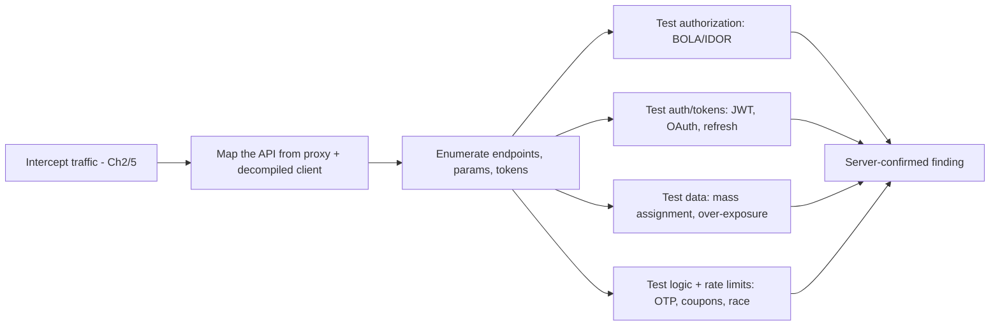
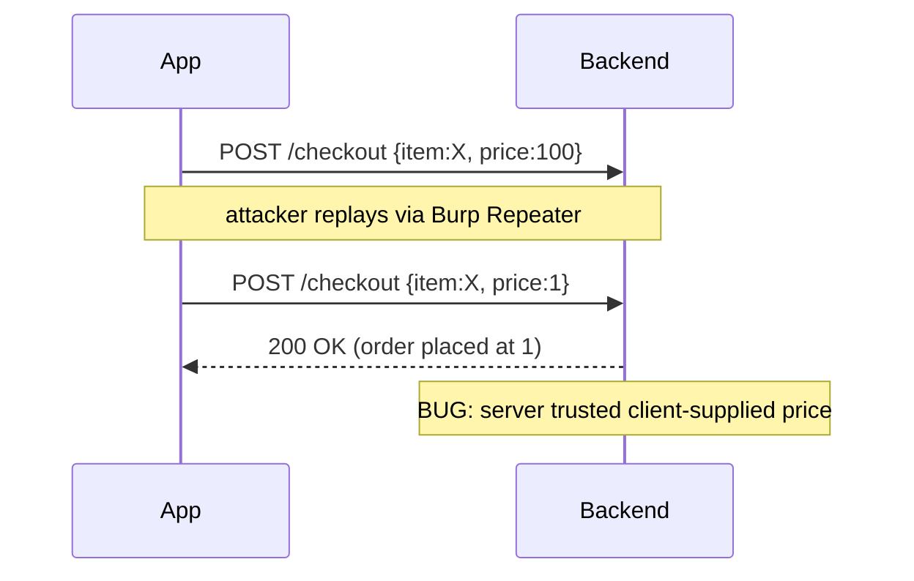
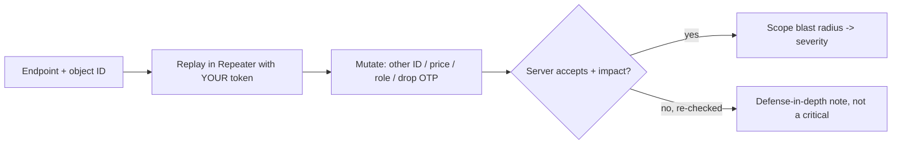

**Level:** Advanced · **Track:** Mobile & IoT · **Read time:** 300 min

This is Chapter 8 of the Mobile & IoT notebook, and it reframes everything before it. Chapters 2–7 were about getting *inside* the app and *reading its traffic*. But once you can see the traffic, a hard truth emerges: **the mobile app is just a client, and almost all the severe, well-paid bugs live in the API behind it.** Broken authorization, token flaws, mass assignment, business-logic abuse — none of these are "mobile" bugs in any deep sense; they're web/API bugs that happen to be reached through a mobile client. The recurring lesson of the whole notebook — *don't trust the client* — is really a statement about the backend, and this chapter is where you attack it.

Everything here builds on the interception you set up in Chapters 2 and 5. With traffic flowing through Burp, and a decompiled client from Chapter 3 to reveal hidden endpoints and how requests are signed, you test the mobile backend the way you'd test any API — with a few mobile-specific twists (device binding, request signing, protobuf/gRPC, OTP flows) that this chapter covers explicitly.

**Lawful use:** test only backends you own or are explicitly authorised (and scoped) to assess. Hitting a production API with authorization or brute-force tests without permission is an offence; stay inside your engagement and its rate limits.

---

## Part 1: Why the Backend Is the Real Target

A mobile app enforces things client-side — hides admin buttons, greys out actions, validates a PIN, checks entitlement. Every one of those is bypassable (Chapters 4–5). The *only* durable control is what the **server** enforces. So the professional workflow inverts once interception works:



Two intelligence sources feed the map:

1. **Intercepted traffic** — the real requests the app makes: hosts, paths, headers, tokens, body shapes. This is your primary surface.
2. **The decompiled client** (Chapter 3, jadx) — reveals endpoints the app *can* call but you didn't trigger, hidden parameters, feature flags, `/admin` or `/debug` paths, staging hosts, and — crucially — *how the app authenticates and signs requests*, which you'll need to replay them yourself.

Together they give you a fuller API map than either alone. Then you test it with Burp Repeater/Intruder exactly like a web API.

---

## Part 2: Mapping the Mobile API Surface

**From the proxy.** Drive every feature of the app with interception on; Burp's site map and HTTP history now hold the API. Note the base host(s), the auth scheme (Bearer token? cookie? custom header?), and the shape of each endpoint. Send interesting requests to Repeater immediately.

**From the client.** Search the decompiled code (jadx-gui full-text, Chapter 3) for:

```
https?://          # base URLs, staging/prod hosts
@GET @POST @PUT    # Retrofit interface annotations = a map of every endpoint
/api/  /v1/  /v2/  # path fragments
Authorization      # how the auth header is built
X-Api-Key  X-Sign  # custom headers / signing
```

Retrofit/OkHttp apps hand you the entire API on a plate: the Retrofit *service interfaces* list every path, method, and parameter the app knows about — including endpoints behind feature flags you can't reach in the UI. That's how you find the `/api/v1/admin/users` the app never shows you.

**Undocumented & version endpoints.** Try `/v1` vs `/v2`, guessable siblings (`/user/{id}` → `/users`, `/export`, `/internal`), and old API versions that skipped a new authorization check. Mobile backends frequently keep deprecated versions alive for old app installs — and those versions often lack the latest access controls.

---

## Part 3: Broken Object-Level Authorization (BOLA / IDOR) — the #1 Mobile API Bug

The most common and highest-impact mobile API vulnerability: the server returns or modifies an object based on an ID in the request **without checking the caller is allowed that object**. Mobile apps are riddled with these because developers assumed the app UI would only ever request the user's own IDs.

Find them by spotting any object identifier in a request and changing it:

```http
GET /api/v1/users/1007/profile HTTP/2       # your id -> try 1008, 1006, ...
Authorization: Bearer <your token>

GET /api/v1/accounts/AC1007/statements HTTP/2
POST /api/v1/orders/55210/cancel HTTP/2
```

If swapping the ID returns *another user's* data (or acts on their object) while you're authenticated as yourself, that's BOLA — often critical (PII disclosure, cross-tenant access, unauthorized state change). Technique notes:

- IDs aren't always numeric — UUIDs, hashids, base64 blobs, or IDs buried in a JWT/body. Predictable-enough or leaked-elsewhere IDs still qualify.
- Test **every** verb and **every** object-scoped endpoint, not just the obvious `GET /users/{id}`.
- **Burp Intruder** to sweep an ID range; **Autorize**/**AuthMatrix** extensions to automate "does user A's token reach user B's objects?"
- Watch for **function-level** authorization too (BFLA): can a normal user hit an admin-only endpoint (`POST /api/v1/admin/...`) that the app hides in the UI but the server doesn't gate?

This single class justifies the whole interception effort — you cannot find it from static analysis alone; you need to *replay* real authenticated requests with mutated IDs.

---

## Part 4: Authentication & Token Flaws

Mobile apps hold long-lived credentials and tokens; the token handling is a rich surface.

**JWT attacks.** If the app carries a JWT (very common), decode it (`jwt.io`, or `hashcat`/`jwt_tool`) and test:

- **`alg: none`** — does the server accept an unsigned token if you strip the signature and set `alg` to `none`?
- **Algorithm confusion (RS256→HS256)** — sign with the public key as an HMAC secret if the server naively verifies with whatever `alg` says.
- **Weak HMAC secret** — brute-force `HS256` secrets (`jwt_tool`, `hashcat -m 16500`); apps sometimes ship a guessable secret.
- **No expiry / no revocation** — does an old token still work? Does logout actually invalidate server-side?
- **Claim tampering** — change `role`, `user_id`, `tenant` and see if the server re-verifies signature/authorization.

```bash
jwt_tool <token> -T                       # tamper interactively
jwt_tool <token> -X a                     # alg:none attack
jwt_tool <token> -C -d wordlist.txt       # crack HS256 secret
```

**OAuth / refresh tokens.** Mobile OAuth (Chapter 6's redirect concern) plus token lifecycle: is the **refresh token** bound to the device? Can a stolen refresh token mint access tokens indefinitely? Is **PKCE** enforced (else an intercepted `code` is usable)? Does the token endpoint leak on error?

**Session & device binding.** Some apps bind a session to a device fingerprint or attestation. Check whether that binding is enforced server-side or is just a header you can copy — a "device-bound" token that's really just a `X-Device-Id` header you control is not bound at all.

---

## Part 5: Mass Assignment & Excessive Data Exposure

**Mass assignment.** APIs that bind request JSON straight onto a model let you set fields you shouldn't. Add privileged fields the app never sends:

```http
PATCH /api/v1/users/me HTTP/2
Content-Type: application/json

{"displayName":"me","role":"admin","isVerified":true,"accountBalance":999999,"tenantId":"other"}
```

If the server accepts `role`/`isVerified`/`accountBalance` because it deserializes the whole body onto the entity, that's privilege escalation via mass assignment. Discover candidate field names from the decompiled model classes / response bodies (a field that appears in *responses* is a great candidate to try setting in a *request*).

**Excessive data exposure.** The mobile UI shows three fields, but the endpoint returns twenty — including other users' emails, internal flags, password hashes, or full PII — and the *client* filters what to display. Since you read the raw response in Burp, you see everything the server sent. Compare the response body to what the UI shows; the delta is often a reportable data-exposure finding (the server should return only what's needed, not rely on the client to hide the rest).

---

## Part 6: Rate Limiting, OTP Bypass & Business Logic

Mobile flows lean heavily on codes and money, making these high-impact:

- **OTP / 2FA brute-force.** Is the SMS/email OTP verification rate-limited and lockout-protected server-side? A 4–6 digit code with no rate limit is brute-forceable (Intruder over `0000–9999`). Also test: does the OTP response leak the code, is the *same* code reusable, does resend reset attempt counters, can you skip the OTP step by calling the post-OTP endpoint directly (a logic/step-skip bug)?
- **Rate limiting generally.** Login, password-reset, coupon redemption, payment — are they throttled per account *and* per IP/device? Client-side throttling (the app greys out the button) means nothing; test the endpoint raw.
- **Business logic & race conditions.** Redeem a single-use coupon twice concurrently (race), buy at a manipulated price (`amount`/`price` in the request the server trusts), apply a negative quantity, or exploit a currency/rounding gap. Burp's parallel-request (single-packet/turbo) tooling tests races.
- **Price/parameter tampering.** Classic mobile-commerce bug: the app sends `price` or `total` and the server trusts it. Change `"price":100` to `"price":1`. The server should compute price from the catalog, never accept it from the client.



---

## Part 7: Defeating Mobile-Specific Request Protections

Mobile backends often add protections that don't exist in browser apps, and you must defeat them to test the API freely:

**Request signing / HMAC.** Many apps sign each request: `X-Signature: HMAC-SHA256(secret, method + path + body + timestamp)`. Replay/tamper in Repeater then fails signature validation. Three ways through:

1. **Recover the signing logic** from the decompiled client (Chapter 3) — find where the signature is built and the secret/derivation — then reproduce it in a small script or a **Burp extension** that re-signs every request you send.
2. **Hook it at runtime (Frida, Chapter 4)** — hook the signing method to *log* the inputs/outputs, or better, run the app as a signing oracle: send your tampered payload through the app's own signer.
3. **Custom-header replay** — sometimes the "signature" is weak (static key, no timestamp, signs only part of the request) and trivially forgeable once you read the code.

**API keys / secrets.** The `X-Api-Key` the app uses is in the APK (Chapter 3) — extract and reuse it. Assess whether it grants more than the app needs.

**Certificate pinning** blocks even seeing the traffic — defeat it first (Chapter 5). **Anti-tamper/attestation** (Play Integrity / App Attest) attached to requests is the toughest: if the server requires a fresh attestation token per request, you may need the app itself in the loop (as an oracle via Frida) to generate valid tokens. This is exactly why attestation, *enforced server-side*, is the strong control from the defense chapters.

**Table — mobile protection vs how you get past it:**

| Protection | Where | Bypass |
| --- | --- | --- |
| TLS pinning | client | Frida unpin / apk-mitm (Ch5) |
| Request HMAC signing | client code | recover logic + re-sign, or Frida signing-oracle |
| API key | in APK/IPA | extract statically, reuse |
| Device binding header | client | copy/spoof the header if not truly bound |
| Play Integrity / App Attest | client + server | hardest; use app as oracle, honestly scope |

---

## Part 8: GraphQL, gRPC & Protobuf Mobile Backends

Mobile apps increasingly use non-REST transports:

**GraphQL.** One endpoint (`/graphql`), typed schema. Test: **introspection** (`{__schema{types{name}}}`) to dump the entire schema and find hidden queries/mutations; **BOLA** via node/id arguments; **excessive exposure** by requesting extra fields; **batching** to bypass rate limits (send many operations in one request); and authorization gaps between queries and mutations. Tools: **InQL**/**GraphQL Raider** Burp extensions, `graphw00f`, `clairvoyance` (infer schema when introspection is disabled).

**gRPC / Protobuf.** Binary bodies you can't read in Burp by default. Recover the **`.proto`** definitions from the decompiled client (generated stub classes reveal message/field names), then decode/encode with `protoc` or a Burp protobuf extension (`blackboxprotobuf`) to read and tamper the messages. Once decoded, it's the same BOLA/mass-assignment/logic testing on structured fields. gRPC often rides HTTP/2 — ensure Burp is set up for it.

**GraphQL/gRPC don't change the bug classes** — authorization, tokens, mass assignment, and logic are all still there; the transport just changes how you read and rewrite the request.

---

## Part 9: Turning a Client Bypass Into a Server-Confirmed Finding

The discipline that runs through every chapter, stated finally and plainly: **a client-side bypass is not a vulnerability by itself.** Forcing `verifyPin()` to true (Ch4), unpinning TLS (Ch5), or launching a hidden activity (Ch6) only *lets you reach* the server. The finding exists only if the **server** then does something it shouldn't. So for every candidate:

1. Perform the action via the app (with your instrumentation) **or** replay the raw request in Repeater.
2. **Mutate** the security-relevant part server-side (another user's ID, a tampered price, an escalated role, a stripped OTP step).
3. Confirm the **server accepts it** and produces impact (data returned, state changed, money moved).
4. Establish **who is affected and how badly** (self only? cross-tenant? unauthenticated?) to set severity.

If the server re-checks and rejects your mutation, your client bypass proved the app's defenses are weak but not that anything is *exploitable* — note it as defense-in-depth, not a critical. This distinction is what separates a credible report from a list of party tricks, and it's the right place to end the notebook: the mobile app is a client, and security is decided on the server.

---

**API bug class → how you test it → why it's severe:**

| Bug class | Test | Impact |
| --- | --- | --- |
| BOLA / IDOR | swap object ID with your token | cross-user/tenant data or actions |
| BFLA | call hidden admin endpoint as normal user | privilege escalation |
| Mass assignment | add `role`/`price`/`isVerified` to body | privilege / value manipulation |
| Excessive exposure | read raw response vs UI | PII / secret leakage |
| Weak JWT | `alg:none`, RS256->HS256, crack secret | auth bypass / impersonation |
| OTP / rate limit | brute or step-skip the code | account takeover |
| Price/param tampering | change client-supplied `price` | financial loss |



## Part 10: Detection & Defense Angle

The backend controls that actually matter (the app-side controls from earlier chapters are secondary to these):

- **Enforce object-level authorization on every request.** For every object accessed by ID, verify the authenticated principal owns/may access it — server-side, every endpoint, every verb. BOLA is the #1 API risk precisely because this check is so often missing; centralise it rather than reimplementing per-handler.
- **Enforce function-level authorization.** Gate admin/privileged endpoints server-side; never rely on the app hiding a button.
- **Harden tokens.** Verify JWT signature with a fixed server-chosen algorithm (reject `none`, pin `alg`), strong secrets/keys, short expiry, real server-side revocation on logout, and device-bound refresh tokens.
- **Never trust client-supplied values for security or money.** Compute price/entitlement/role server-side; use allow-lists for bindable fields (defeat mass assignment); return only needed fields (defeat excessive exposure).
- **Rate-limit and lock out** OTP, login, reset, and payment flows per account *and* per device/IP, server-side; make single-use tokens actually single-use; guard against races (idempotency keys, locks).
- **Attestation, verified server-side.** Play Integrity / App Attest is the one signal that resists client tampering — enforce it on sensitive actions on the *server*, and treat client-side integrity/pinning as cost-raising, not authoritative.
- **Version discipline.** Retire old API versions; ensure deprecated endpoints carry the same authorization as current ones.

**Blue-team/detection angle:** BOLA and brute-force look like a single token accessing many object IDs, or many failed OTP attempts — instrument the API to alert on horizontal-access anomalies (one principal touching objects across many owners), OTP failure spikes, and requests whose attestation doesn't match. The strongest detection lives where the strongest control lives: the server.

---

## Final Revision / Summary

- Once you can read the traffic (Ch2/5), **the app is just a client and the backend is the target.** Most severe, well-paid mobile findings are API findings reached through a mobile client — the "don't trust the client" theme is really about the server.
- **Map the surface from two sources:** intercepted traffic (real requests) *and* the decompiled client (Retrofit interfaces reveal every endpoint, hidden params, staging hosts, and how requests are signed).
- **BOLA/IDOR is #1:** change any object ID in an authenticated request and see if you reach others' data/actions; test every verb and endpoint; automate with Intruder/Autorize. Also test function-level (BFLA) access to hidden admin endpoints.
- **Tokens:** JWT (`alg:none`, RS256→HS256 confusion, weak secret, no expiry/revocation, claim tampering), OAuth/refresh binding + PKCE, and fake "device binding" that's just a spoofable header.
- **Data:** mass assignment (set `role`/`price`/`isVerified` the app never sends) and excessive data exposure (the response holds more than the UI shows).
- **Logic/limits:** OTP brute-force and step-skip, missing server-side rate limits, price/parameter tampering, and race conditions.
- **Mobile-specific protections** (HMAC request signing, API keys, device binding, attestation) must be defeated to test freely — recover the signing logic from the client or use the app as a **Frida signing oracle**; extract API keys from the package. GraphQL/gRPC change the transport, not the bug classes (introspect / recover `.proto`, then test the same way).
- **The finding is server-side:** a client bypass only matters if the **server** accepts the mutated request and produces impact. Confirm, scope the blast radius, and set severity accordingly.

## Cheat Sheet / Quick Reference

```http
# BOLA/IDOR — mutate the object id with YOUR token
GET  /api/v1/users/1008/profile        # try neighbours / other tenants
POST /api/v1/orders/55210/cancel

# Mass assignment — add privileged fields the app never sends
PATCH /api/v1/users/me  {"role":"admin","isVerified":true,"price":1}

# Function-level — hit hidden admin endpoints as a normal user
POST /api/v1/admin/users
```

```bash
# --- JWT ---
jwt_tool <tok> -T            # tamper claims
jwt_tool <tok> -X a          # alg:none
jwt_tool <tok> -C -d wl.txt  # crack HS256 secret

# --- Map endpoints from the client (Ch3 jadx output) ---
grep -rnoE 'https?://[^"]+' src/ ; grep -rniE '@(GET|POST|PUT|DELETE)|/api/|Authorization|X-Sign|X-Api-Key' src/

# --- Defeat protections ---
#  pinning: Frida unpin (Ch5) ; HMAC: recover signer or Frida signing-oracle ; api key: pull from APK
#  GraphQL: introspection {__schema{types{name}}} ; InQL/graphw00f/clairvoyance
#  gRPC: recover .proto from stubs ; blackboxprotobuf to decode/encode

# --- Automation ---
#  Burp Repeater (mutate), Intruder (id/OTP sweep), Autorize/AuthMatrix (authZ), Turbo Intruder (races)
```

**The one rule:** a client bypass is only a bug if the **server** accepts the mutated request and it causes real impact. Always confirm server-side.

## Practice Labs & Resources

- **PortSwigger Web Security Academy** — Access Control (IDOR/BOLA), JWT, GraphQL, and business-logic labs; the transport is web but every bug class is identical to mobile APIs. The best structured practice for this chapter.
- **OWASP crAPI ("completely ridiculous API")** and **VAmPI** — deliberately-vulnerable APIs purpose-built for BOLA, mass assignment, JWT, and mass-assignment practice.
- **OWASP API Security Top 10** — the canonical taxonomy (API1 BOLA, API3 excessive data exposure, API6 mass assignment, etc.); read it as the checklist behind this chapter.
- **OWASP MASTG "Testing Network Communication" + backend guidance** — ties the mobile client back to API testing.
- **Disclosed HackerOne/Bugcrowd mobile reports** — BOLA in a mobile API, JWT `alg:none`, price tampering, OTP brute-force — read a dozen to see how client interception turned into critical server-side findings.
- **`jwt_tool`, InQL, blackboxprotobuf, Autorize** docs — the practical tooling referenced above.

This closes the Mobile & IoT notebook's mobile-application arc: you can build a lab, take an app apart statically and dynamically, defeat its client-side defenses, attack its IPC and deep links across both platforms — and, most importantly, recognise that the app was always a client, and the real security decisions live on the server you now know how to test.

---

*Also on [Praneeth's portfolio](https://ping-praneeth.vercel.app/notebook/mobile-iot-hardware/08-mobile-api-and-backend-testing), with comments and the latest edits.*
