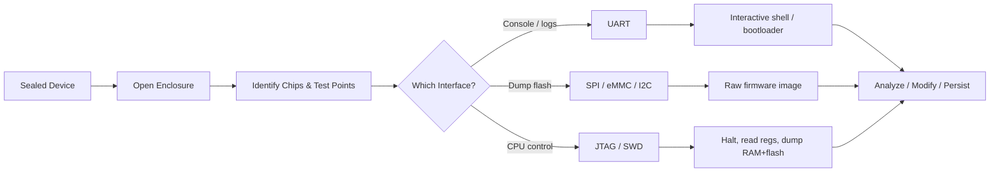
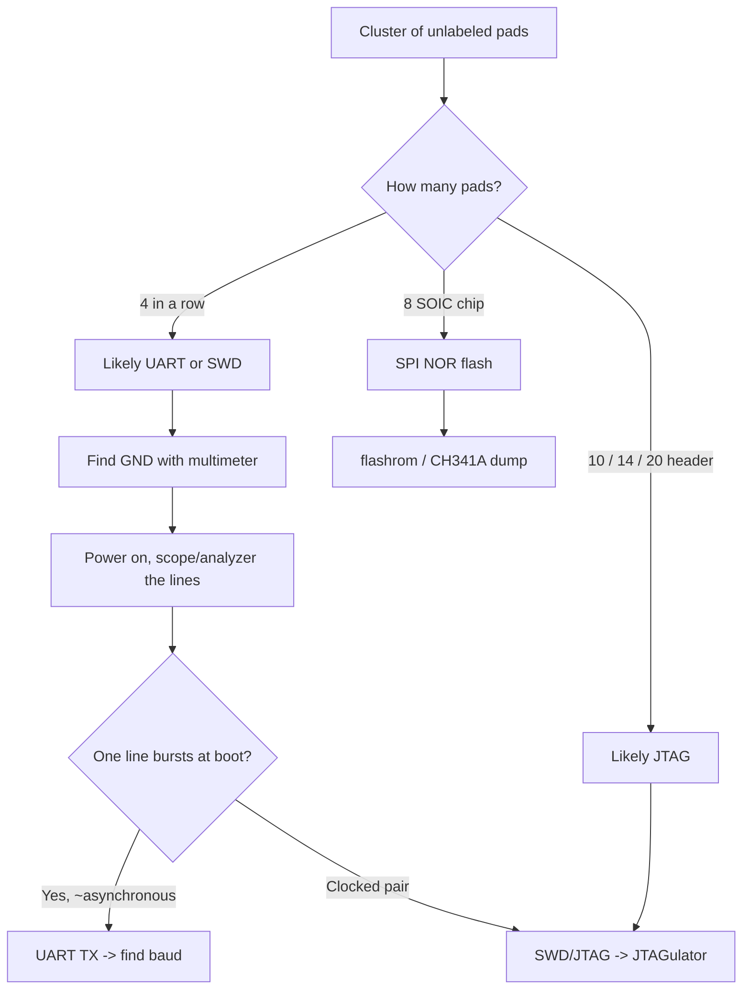
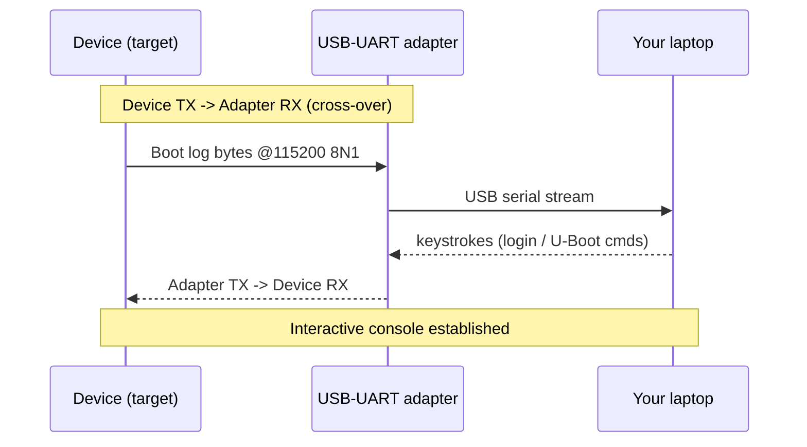
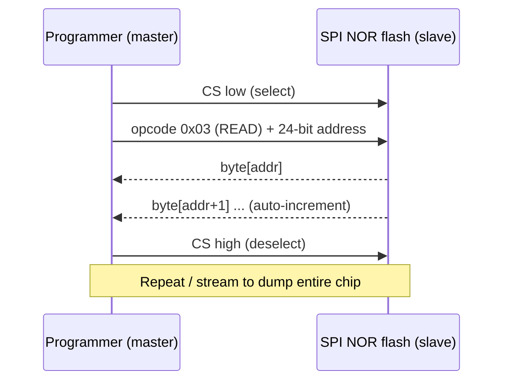
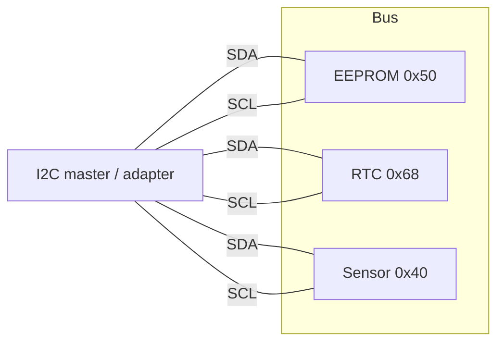
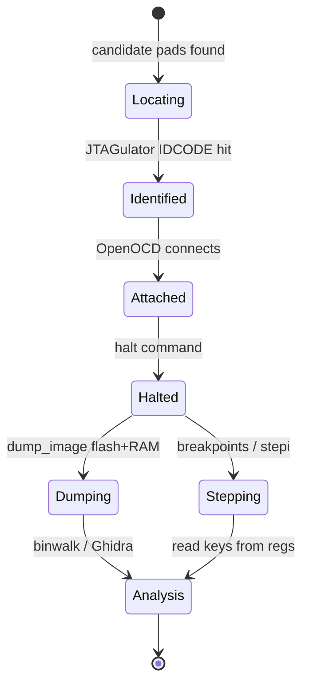
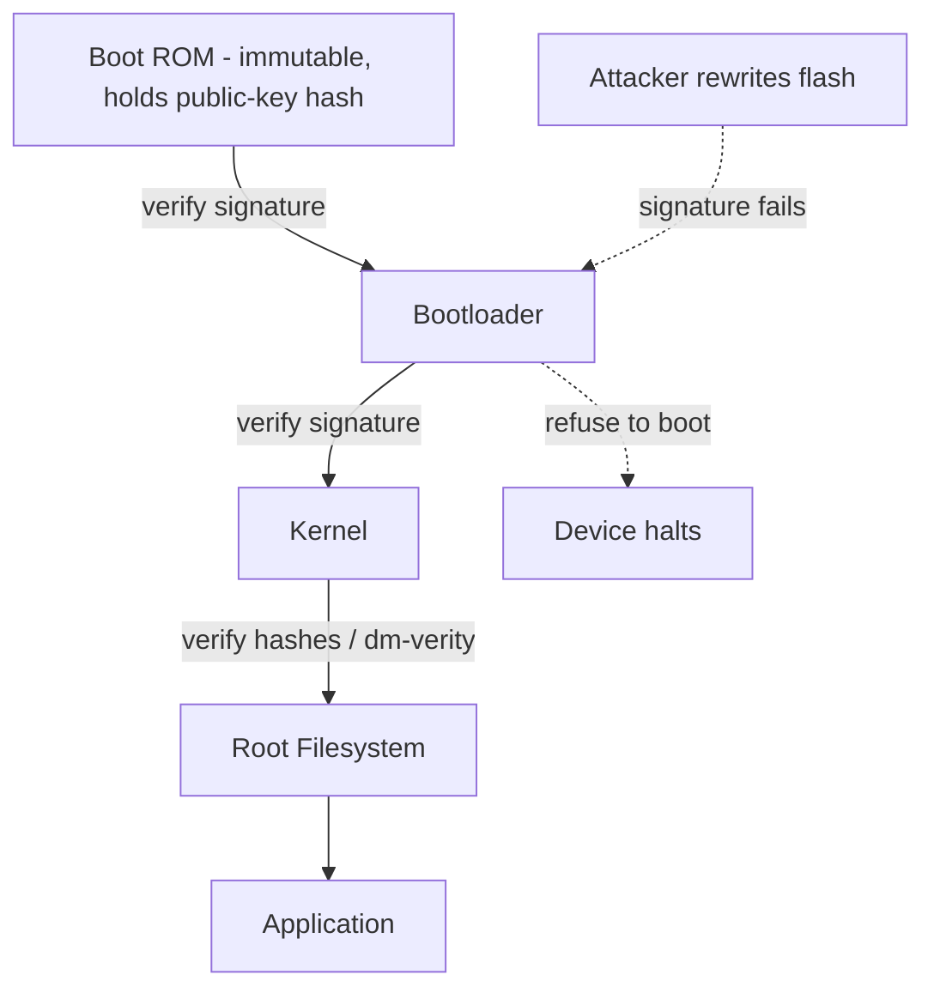

This is Chapter 10 of the Mobile & IoT notebook, and the last one in the IoT & Hardware track. The previous chapter treated firmware as something you *download or carve out* — you got the image from a vendor portal, an OTA capture, or `binwalk` and worked on it entirely in software. This chapter is about the case where none of that works: the vendor never published the firmware, there is no OTA, the flash is soldered down, and the only way in is to put probes on the board. That is hardware hacking proper — the point where firmware analysis stops being a laptop activity and starts needing a bench, a multimeter, and sometimes a soldering iron.

The good news is that embedded devices are astonishingly generous to an attacker. To be manufactured, tested, and debugged, almost every board ships with the exact interfaces an engineer would use to inspect and reprogram it: a **UART** serial console (often a root shell with no password), a **SPI** or **eMMC** flash chip you can read byte-for-byte, an **I2C** EEPROM holding config and secrets, and a **JTAG/SWD** port that gives you full control of the CPU — halt it, read every register, single-step, dump all of RAM and flash. Cost pressure means these are rarely removed from production units; they are just left as bare pads, hidden under a sticker, or de-populated of their header pins. Finding and using them is what this chapter teaches.

**Lawful use:** everything here assumes you own the device or have explicit written authorization to tear it down. Buying a unit gives you broad latitude to open *your own* hardware and study it (security research and repair are protected in many jurisdictions), but opening a leased set-top box, tampering with metering equipment, or attacking a device you don't own can cross serious legal lines — and physical attacks void warranties and can destroy the unit. Work on your own bench, on your own hardware, and only touch third-party devices that are explicitly in scope on a signed engagement or bug-bounty program with a hardware track.

---

## Part 1: Why Physical Access Changes Everything

In web and network security we spend enormous effort *getting* code execution. On a physical device you frequently start with the equivalent of a local console and administrative intent — the challenge is electrical, not logical. That inverts the usual threat model, and it is worth internalizing why.

When you hold the device, three protections that software leans on evaporate:

- **Network boundaries are gone.** A cloud API can rate-limit, require TLS, and hide behind a WAF. The UART pad on the board answers instantly, in plaintext, with no authentication layer between you and the kernel log.
- **The firmware is fully readable.** In Chapter 9 you learned to carve filesystems from an image. Here you *produce* that image yourself by dumping the flash chip directly, so even devices that encrypt their OTA payloads or refuse to publish firmware give up their secrets once you read the raw NAND/NOR/eMMC.
- **Runtime state is exposed.** JTAG lets you pause the CPU mid-boot and read RAM — which is where decrypted keys, unwrapped secrets, and cleartext configuration live even on devices that encrypt data at rest.

The single most important consequence: **a hardware foothold usually breaks the entire product line, not one unit.** Every device off that assembly line shares the same flash layout, the same U-Boot environment, the same default keys, the same debug-console behaviour. Dump one, and you own the model. That is why hardware findings command high bounties and why supply-chain defenders care so much about secure boot and debug lockdown — topics we close the chapter with.



**Pentester landing on a new device:** your instinct should mirror landing on a new Linux box — first *enumerate*. Open the case, photograph the board, read every chip marking, and find the debug interfaces before you touch a soldering iron. Ninety percent of "hardware hacks" in the field are just a UART console that was never locked down; you rarely need JTAG unless UART and flash dumping both fail.

---

## Part 2: The Electronics You Actually Need

You do not need an electrical engineering degree, but you do need a working mental model of five things: voltage, logic levels, ground reference, pull resistors, and the difference between serial protocols. Getting these wrong is how you kill a $200 device with a $5 adapter.

### Voltage and logic levels

Digital signals are voltages measured against a common **ground (GND)**. A logic "1" (high) and "0" (low) are defined by voltage thresholds, and — critically — different chips use different reference voltages, called the **logic level** or **I/O voltage (VCCIO)**:

| Logic level | "High" is roughly | Where you see it |
|---|---|---|
| **3.3 V** | ~2.0–3.3 V | The overwhelming majority of IoT SoCs, routers, cameras |
| **1.8 V** | ~1.2–1.8 V | Modern application processors, eMMC, many phones/SoCs |
| **5 V** | ~3.0–5 V | Older microcontrollers, Arduino-class boards, some peripherals |
| **1.2 V** | ~0.8–1.2 V | High-end SoC core rails (rarely the I/O you probe) |

The cardinal rule: **match your adapter's logic level to the target's, or use a level shifter.** Driving a 3.3 V line with a 5 V adapter can permanently damage the pin or the whole chip. Many USB-UART adapters have a jumper (5 V / 3.3 V) or a VCCIO pin you tie to the target's reference. When in doubt, measure first with a multimeter and default to 3.3 V — it is by far the most common.

**Never connect the adapter's VCC/power pin to the target if the target is self-powered.** You power the device from its own supply and connect only the *signal* lines plus a shared ground. Back-powering a device through a data pin is a classic way to brick it or get flaky behaviour.

### Ground is the reference for everything

Every measurement and every signal is relative to ground. Before any probing, find a solid ground point (the shield of a USB/Ethernet jack, a large copper pour, the negative terminal of a big capacitor, a mounting screw hole) and confirm continuity with your multimeter's continuity mode. Your adapter's GND *must* connect to the target's GND, or nothing works and readings are garbage.

### Pull-up / pull-down resistors and open-drain buses

Some buses (notably I2C) are **open-drain**: devices can only pull the line low, and external **pull-up resistors** hold it high when idle. If you cut a chip out of the circuit and try to talk to it, you may need to add your own pull-ups (typically 4.7 kΩ to VCC). UART and SPI are push-pull (actively driven both ways) and usually don't need this, but knowing the concept explains a lot of "why is this line stuck low" confusion.

### The multimeter is your first tool, always

Before you connect anything active, a cheap digital multimeter answers the three questions that keep you from frying hardware:

```text
1. Continuity mode (beep): Which pad is GND? (beeps against known ground)
                           Are two test points the same net?
2. DC volts mode:          What is VCCIO? (measure a suspected VCC pad to GND
                           with the device powered — 3.3, 1.8, 5.0?)
3. Continuity mode:        Trace a test point back to a known chip pin to
                           identify what it is.
```

**Security relevance:** the multimeter is how you convert an unlabeled cluster of pads into an identified UART or SPI header without guessing. Guessing with a powered adapter is how you brick the target and end a hardware assessment early.

---

## Part 3: Reading a PCB — Finding the Debug Interfaces

Before any protocol, you have to *find* the pins. This is reconnaissance, and like all recon it rewards patience and photography.

### Enclosure and teardown

Open the case (clips, hidden screws under rubber feet or stickers, glued seams that need a spudger and heat). Photograph both sides of every board at high resolution before you touch anything — you will refer back to these constantly, and they document your work for a report. Note connectors, shielding cans (RF shields hide the SoC — they often pop off), and any populated or unpopulated headers.

### Identify the major chips

Read the markings on top of each IC and search them. The parts that matter most:

| Chip class | How to recognize it | Why you care |
|---|---|---|
| **SoC / CPU** | Biggest chip, often under an RF shield, many pins (BGA/QFP) | Hosts JTAG/SWD; datasheet reveals UART pin mapping |
| **NOR flash (SPI)** | Small 8-pin SOIC, marks like `W25Q128`, `MX25L`, `GD25` | Holds bootloader/firmware — SPI-dumpable |
| **NAND flash** | 8/16-pin TSOP or BGA, larger capacity | Holds firmware; trickier to dump (ECC, bad blocks) |
| **eMMC** | BGA package, marks like `KLM`, `THGBM`, `EMMC` | Full storage; readable via SDIO / chip-off |
| **EEPROM (I2C)** | Tiny 8-pin, marks like `24C02`, `AT24`, `24LC` | Config, MACs, calibration, sometimes secrets |
| **RAM (DDR)** | Fast SDRAM near the SoC | Rarely a direct target; matters for JTAG dumps |
| **PMIC** | Power management IC near the input | Tells you the rail voltages (VCCIO clues) |

**Datasheet the flash chip immediately.** The markings on an 8-pin SPI flash map directly to a standard pinout (`CS`, `CLK`, `DO/MISO`, `DI/MOSI`, `WP`, `HOLD`, `VCC`, `GND`), the capacity, and the exact command set — this is what lets you dump it later with `flashrom` or a CH341A programmer.

### Recognizing debug headers and test points

Debug interfaces show up as:

- **Populated pin headers** (2.54 mm or 2.0 mm/1.27 mm pitch) — the easy case, sometimes labeled on the silkscreen (`TX`, `RX`, `GND`, `TDI`, `TCK`, `RST`, `J1`, `DEBUG`).
- **Unpopulated header footprints** — a row of 4 (UART) or 4–20 (JTAG) plated holes with no pins soldered. You solder a header or use pogo/tag-connect probes.
- **Bare test points (TP1, TP2…)** — small round/oval pads scattered on the board, sometimes the only exposed access to a signal.
- **Vias** — plated through-holes carrying a signal between layers; usable in a pinch.

The classic tells:

- A group of **4 pads in a row** near the SoC, especially with one obviously tied to GND, is very often **UART** (GND, VCC, TX, RX in some order).
- A group of **2×5, 2×7, or a 20-pin** header, or a cluster including lines you can identify as `TCK/TMS/TDI/TDO/TRST`, is **JTAG**; a **4-pad** cluster of `SWDIO/SWCLK/GND/VCC` (or `SWD/SWC`) is **SWD** (ARM's 2-wire debug).



**Bug-bounty / CTF angle:** hardware CTF categories (DEF CON's Hardware Hacking Village, many "badge" challenges) and hardware bug-bounty tracks almost always start exactly here — identify the flash chip, find the UART, dump the firmware. The recon skill of turning a photo of a PCB into "that's a `W25Q64` NOR flash and this 4-pad cluster is UART at 115200" is the whole first stage.

---

## Part 4: The Logic Analyzer — Seeing Signals From Scratch

Before we drive any interface, you need one tool that lets you *observe* what's happening on the pins: a **logic analyzer**. It is the single most useful piece of gear for identifying unknown interfaces, because it turns invisible voltage changes into a picture of the actual protocol.

### What it is and why it exists

A logic analyzer samples one or more digital lines many times per second and records whether each was high or low at each sample. Unlike an oscilloscope (which shows analog voltage detail), a logic analyzer shows the *digital* view — bits, bytes, clock edges — and, crucially, can **decode** known protocols (UART, SPI, I2C) back into bytes. The cheap, ubiquitous option is an **8-channel clone of the Saleae Logic** based on the Cypress FX2 chip, costing under $10, driven by the excellent open-source **`sigrok` / PulseView** software.

### Installing sigrok / PulseView on Kali

```bash
# sigrok-cli is the command-line driver; pulseview is the GUI
sudo apt update
sudo apt install -y sigrok-cli pulseview

# Verify the tool and list supported hardware drivers
sigrok-cli --version
# sigrok-cli 0.7.2 ...

# Plug in the FX2 analyzer, then scan for it:
sigrok-cli --scan
# The following devices were found:
# fx2lafw - Saleae Logic clone with 8 channels
```

The generic FX2 device is driven by `fx2lafw`. `--scan` confirming it means the OS sees your analyzer.

### Capturing an unknown line

Wire an analyzer channel to a suspected signal pad and its GND to the board GND (**shared ground is mandatory**). Then capture a window of activity — for a UART console, capture during power-on when the boot log floods out:

```bash
# Capture 10 million samples at 4 MHz on channels D0-D3 to a file
sigrok-cli --driver fx2lafw \
           --config samplerate=4m \
           --channels D0,D1,D2,D3 \
           --samples 10000000 \
           --output-file boot.sr
```

- `--driver fx2lafw` selects the FX2 analyzer.
- `--config samplerate=4m` samples at 4 MHz — must be at least ~4× the fastest signal you want to see (plenty for a 115200-baud UART, marginal for fast SPI).
- `--channels D0,D1,D2,D3` captures four lines at once — useful when you don't yet know which pad is the interesting one.
- `--samples 10000000` sets how many samples to record (the capture length).
- `--output-file boot.sr` saves it for offline decoding in PulseView.

Open `boot.sr` in PulseView, add a **decoder** (UART, SPI, or I2C) on the relevant channel, and the software translates edges into bytes. For a UART line it will show the ASCII of the boot log once you set the right baud rate — which is exactly how you *confirm* a pad is UART and *discover* its baud without guessing.

### Automatic protocol decoding from the CLI

```bash
# Decode a captured file as UART at 115200 baud, showing decoded bytes
sigrok-cli --input-file boot.sr \
           --protocol-decoder uart:baudrate=115200:rx=D0 \
           --protocol-decoder-annotations uart=rx-data
# U-Boot 2018.03 (Jan 01 2027 - ...)
# DRAM:  128 MiB
# ...
```

Seeing readable strings appear proves the line is UART and the baud is right. Garbage means wrong baud, wrong channel, or wrong logic level.

**Blue team usage:** the same tool defenders use to verify a device *doesn't* leak a console. If a security-hardened product still bursts a full kernel log out of a test pad at boot, a logic analyzer is how a lab audit catches it before shipping.

---

## Part 5: UART — The Serial Console (Fastest Win in Hardware)

UART (Universal Asynchronous Receiver/Transmitter) is the plain serial console, and it is the single most common and highest-value hardware finding. On a huge fraction of routers, cameras, and IoT gadgets, the UART either drops you straight into a **root shell with no password** or into the **U-Boot bootloader**, from which you can trivially get root.

### How UART works

UART is **asynchronous** — there is no shared clock. Instead both ends agree in advance on a **baud rate** (bits per second) and a frame format. The common format is written **8N1**: 8 data bits, No parity, 1 stop bit. A typical link uses just three wires:

- **TX** (transmit) — the device sends data out of this pin
- **RX** (receive) — the device receives data on this pin
- **GND** — shared ground reference

Crucially, **you cross the wires**: the target's **TX** connects to your adapter's **RX**, and the target's **RX** to your adapter's **TX**. Getting TX/RX backwards is the most common mistake and simply produces silence.



### The tool: a USB-UART adapter

You need a **USB-to-UART bridge** — a small board built around a chip like the **FTDI FT232**, **CP2102**, or **CH340**. It exposes TX, RX, GND, and often a VCCIO/3V3 pin, and appears on your laptop as a serial device (`/dev/ttyUSB0` on Linux). Pick one with a **3.3 V / 5 V jumper** or VCCIO pin so you can match the target's logic level (usually 3.3 V). Cost: a few dollars.

Plug it in and confirm the OS sees it:

```bash
# Watch the kernel log as you plug the adapter in
sudo dmesg -w
# usb 1-1: ch341-uart converter now attached to ttyUSB0

ls -l /dev/ttyUSB*
# crw-rw---- 1 root dialout 188, 0 /dev/ttyUSB0

# Add yourself to the dialout group so you don't need sudo each time
sudo usermod -aG dialout $USER   # log out/in to take effect
```

### Finding the UART pins on the board

If pins aren't labeled, identify them methodically:

1. **Find GND** with the multimeter continuity beep against a known ground.
2. **Find VCC** — a pad sitting at a steady 3.3 V (or 1.8/5 V) under power. *Do not connect your adapter to VCC.*
3. **Find TX** — with the device powered on and *booting*, TX pulses with data. On a multimeter (DC volts) it briefly dips/flickers from the idle voltage as bytes stream; on a logic analyzer it shows an obvious asynchronous burst. TX is an *output*, so it drives strongly.
4. **RX** is the remaining line — usually idle-high, often with a weak pull-up, quieter than TX.

### Finding the baud rate

If you don't know the baud, either read it off a logic-analyzer capture (Part 4) or brute-force it. `baudrate.py` from the **devttys0/baudrate** project cycles through common rates while you watch for readable text:

```bash
# Common bauds to try: 9600, 19200, 38400, 57600, 115200 (most common), 921600
python3 baudrate.py -p /dev/ttyUSB0
# Press Up/Down to change baud until the boot log becomes readable ASCII
```

### Connecting with a terminal program

Once you know the port and baud, use a serial terminal. Three good options:

```bash
# Option A: picocom (lightweight, great default)
sudo apt install -y picocom
picocom -b 115200 /dev/ttyUSB0
#   -b 115200  baud rate
#   Ctrl-A Ctrl-X to exit

# Option B: screen (usually already installed)
screen /dev/ttyUSB0 115200
#   Ctrl-A then k to kill the session

# Option C: minicom (full-featured, menu-driven)
sudo apt install -y minicom
sudo minicom -D /dev/ttyUSB0 -b 115200
#   -D device, -b baud; Ctrl-A Z for the menu, Ctrl-A X to exit
```

### What you actually see — real console output

A healthy UART connection floods the boot log the moment you power the device:

```text
U-Boot 2018.03 (Jan 01 2027 - 00:00:00 +0000)

CPU:   MediaTek MT7620A ver:2 eco:6
DRAM:  128 MiB
Flash: 16 MiB
Net:   eth0
Hit any key to stop autoboot:  3
```

That `Hit any key to stop autoboot` line is gold — press a key in time and you drop into the **U-Boot prompt**, the bootloader shell. If you let it boot, you often get a login banner or, on badly configured devices, a direct shell:

```text
BusyBox v1.28.4 () built-in shell (ash)

/ # id
uid=0(root) gid=0(root)
/ #
```

`uid=0(root)` with no login prompt is the jackpot — a root shell over three wires.

### Escalating from U-Boot to root when there IS a login

Even if Linux demands a password, the U-Boot prompt lets you rewrite the kernel command line to bypass it. The universal trick is to force `init=/bin/sh`, which boots you straight into a root shell instead of the normal init:

```text
# At the U-Boot prompt, inspect the boot environment:
=> printenv
bootargs=console=ttyS0,115200 root=/dev/mtdblock2 ...
bootcmd=bootm 0xbc050000

# Append init=/bin/sh so the kernel spawns a shell as PID 1 (root):
=> setenv bootargs 'console=ttyS0,115200 root=/dev/mtdblock2 init=/bin/sh'
=> boot
...
/ # id
uid=0(root) gid=0(root)
```

From that shell you can read `/etc/shadow`, dump the flash partitions via `/dev/mtd*`, plant an SSH key, or `cat` the config with the cloud credentials. **This single technique — U-Boot → `init=/bin/sh` → root — is responsible for a huge share of real-world IoT roots.**

**Red team usage:** a UART root shell on a target device is a launch point for a persistent implant — modify the firmware, re-flash, and the device now beacons or bridges into the network. **Blue team usage:** this is exactly why hardened devices disable the U-Boot console (`CONFIG_SILENT_CONSOLE`, password-locked U-Boot, `bootdelay=0`) and remove the login shell from the serial line — covered in Part 11.

---

## Part 6: SPI — Dumping the Flash Chip Directly

When UART is locked down or you want the *complete* firmware regardless of what the running OS exposes, you go to the source: read the flash chip itself. The most common flash on IoT boards is **SPI NOR flash** in a small 8-pin SOIC package, and it is wonderfully dumpable.

### How SPI works

SPI (Serial Peripheral Interface) is a **synchronous**, master/slave bus using four signals:

- **CS / CS#** (Chip Select) — master pulls low to talk to this chip
- **CLK / SCK** (Clock) — master-driven clock; every bit is timed to an edge
- **MOSI / DI** (Master Out, Slave In) — commands/data to the chip
- **MISO / DO** (Master In, Slave Out) — data from the chip

Two more pins on flash chips matter: **WP#** (write-protect) and **HOLD#/RESET#**, usually tied high for normal operation. To read the chip, a programmer becomes the SPI master, sends the "read data" opcode (`0x03`) plus an address, and clocks the entire contents out on MISO.



### Standard 8-pin SOIC pinout

Nearly all 25-series SPI NOR chips share this pinout (pin 1 marked by a dot/notch):

```text
        +--\/--+
  CS# --|1    8|-- VCC
   DO --|2    7|-- HOLD#/RESET#
  WP# --|3    6|-- CLK
  GND --|4    5|-- DI
        +------+
   (DO = MISO, DI = MOSI)
```

### The tools: CH341A programmer + a SOIC-8 clip

Two cheap tools dominate:

- A **CH341A USB programmer** (a small black/red board, ~$3) that speaks SPI and appears to the host software as a programmer.
- A **SOIC-8 test clip** ("chip clip") that clamps onto the 8-pin chip *without desoldering it*, wired to the CH341A. This is **in-circuit** reading.

**Warning about CH341A voltage:** the common cheap CH341A modules output **5 V** on the SPI lines by default, but most flash chips are **3.3 V**. Use a 3.3 V-modified CH341A or a level-safe programmer, or you risk damaging the chip. This is the #1 way people brick SPI reads.

### Reading with flashrom

**flashrom** is the universal open-source flash read/write tool. Teach yourself its basics:

```bash
sudo apt install -y flashrom

# List supported programmers and chips
flashrom --help | head -40

# Probe: let flashrom detect the programmer and chip (no read/write yet)
sudo flashrom --programmer ch341a_spi
# Found Winbond flash chip "W25Q128.V" (16384 kB) on ch341a_spi.
```

- `--programmer ch341a_spi` tells flashrom to drive the CH341A as an SPI master.
- A successful probe prints the detected chip and size — proof your wiring and clip are good.

Now dump the chip. **Read it two or three times and diff the outputs** — a clean in-circuit read must be *identical* across reads, or the connection is marginal (other components on the board can interfere):

```bash
# Read the full chip to a file
sudo flashrom --programmer ch341a_spi -r dump1.bin
sudo flashrom --programmer ch341a_spi -r dump2.bin
sudo flashrom --programmer ch341a_spi -r dump3.bin

# Confirm all three are byte-identical (integrity check)
sha256sum dump1.bin dump2.bin dump3.bin
md5sum dump1.bin dump2.bin dump3.bin
# All hashes equal => trustworthy dump
```

- `-r dump1.bin` reads the entire chip into `dump1.bin`.
- Matching hashes across three reads is your assurance the dump is correct.

If the running SoC fights you for the bus during an in-circuit read (you get inconsistent dumps), hold the SoC in reset (some boards have a reset pad you tie low) or desolder the flash chip (**chip-off**) and read it in a SOIC-8 socket adapter.

### From raw dump to firmware — hand-off to Chapter 9

Once you have a clean `dump.bin`, you are back on familiar ground from the previous chapter:

```bash
# Identify embedded filesystems, kernels, bootloaders inside the raw dump
binwalk dump1.bin
# DECIMAL   HEXADECIMAL   DESCRIPTION
# 0         0x0           uImage header, ... U-Boot
# 327680    0x50000       Squashfs filesystem, little endian, ...

# Carve everything out
binwalk -e dump1.bin

# Now grep the extracted rootfs for secrets, just like Chapter 9
grep -rniE 'password|passwd|api[_-]?key|BEGIN .*PRIVATE KEY' _dump1.bin.extracted/
```

**Bug-bounty / CTF angle:** hardware-track bounties and hardware CTF challenges frequently reduce to "clip the SPI chip, `flashrom -r`, `binwalk -e`, find the hardcoded key." The entire supply chain of a finding — hardcoded root password, backdoor account, private signing key in flash — often lives in a chip you can read in ten minutes with a $6 setup.

### A word on eMMC and NAND

- **eMMC** (BGA managed NAND) is common on higher-end devices. It speaks the SD/MMC protocol, so you can often read it via an **eMMC-to-USB / SD adapter** by wiring `CLK`, `CMD`, `DAT0`, `VCC`, `VCCQ`, `GND` to the correct BGA test points — then it mounts like an SD card and you `dd` it. Chip-off + a socketed reader is the fallback.
- **NAND** (raw TSOP) requires a NAND-aware programmer and dealing with **ECC**, **OOB/spare bytes**, and **bad-block markers** — messier, but the same idea. Tools like `nanddump` (on-device) or a dedicated NAND reader handle it.

---

## Part 7: I2C — EEPROMs, Sensors, and Small Secrets

I2C (Inter-Integrated Circuit) is a **two-wire** bus used for the small chips scattered around a board — EEPROMs holding config/MAC/calibration data, PMICs, sensors, RTCs. It rarely holds the whole firmware, but the tiny EEPROM often holds exactly the secret you want (device keys, serials, provisioning data).

### How I2C works

Two open-drain lines, shared by many devices, each with a 7-bit **address**:

- **SDA** (Serial Data)
- **SCL** (Serial Clock)

Because it's open-drain, both lines need **pull-up resistors** (typically 4.7 kΩ to VCC). The master addresses a slave by its 7-bit address, then reads or writes registers/bytes.



### Tools: Bus Pirate or a USB-I2C adapter

The **Bus Pirate** is a beloved multi-protocol Swiss-army tool (UART, SPI, I2C, 1-Wire, JTAG-ish) — a small board you drive over serial. It is ideal for I2C exploration. A Linux host with an FT232H (`i2c-tiny-usb` / `pyftdi`) works too.

Scan the bus for devices with the Bus Pirate in I2C mode:

```text
# Connect to the Bus Pirate over serial (it enumerates as /dev/ttyUSB0)
picocom -b 115200 /dev/ttyUSB0

# In the Bus Pirate menu, choose I2C mode (m -> 4), enable power (W),
# enable pull-ups (P), then scan the bus:
(1)> (1)          # macro 1 = I2C address search
Searching I2C address space. Found devices at:
0x50(0xA0 W) 0xA1 R   <- an EEPROM at 7-bit address 0x50
0xD0(0xD0 W) 0xD1 R   <- an RTC at 0x68
```

Read the EEPROM's contents (e.g. a 24C02, 256 bytes, address 0x50):

```text
# Start, write control byte + address 0x00, restart, read 256 bytes:
[0xA0 0x00 [0xA1 r:256]
READ: 0x00 0x11 0x22 ... (256 bytes dumped)
```

On a Linux host with kernel I2C tools, the workflow is even simpler:

```bash
sudo apt install -y i2c-tools

# List I2C buses the adapter exposes
i2cdetect -l

# Scan bus 3 for device addresses
sudo i2cdetect -y 3
#      0  1  2  3 ...
# 50: 50 -- -- --   <- device at 0x50

# Dump all bytes from the device at 0x50 on bus 3
sudo i2cdump -y 3 0x50
```

- `i2cdetect -y 3` scans bus 3 (the `-y` skips the confirmation prompt).
- `i2cdump -y 3 0x50` prints every register/byte of the chip at address `0x50` — where you might find a stored key, WiFi credentials, or a device certificate.

**Security relevance:** many devices store their provisioning secret, per-device key, or cloud token in a small I2C EEPROM precisely because it's "hidden hardware." Reading it is trivial once you're on the bus, which is why secrets belong in a secure element, not a 24Cxx EEPROM.

---

## Part 8: JTAG & SWD — Total Control of the CPU

When UART is silenced and flash is soldered/encrypted, **JTAG** (and its ARM 2-wire cousin **SWD**) is the master key: it talks directly to the CPU's debug logic, letting you **halt the processor, read/write every register and any memory address, set breakpoints, single-step, and dump both RAM and flash**. It is the most powerful and the most finicky interface.

### What JTAG is

JTAG (IEEE 1149.1) was designed for boundary-scan (testing PCB solder joints), but its **debug access port** exposes the CPU's internals. The classic pins:

| Signal | Meaning |
|---|---|
| **TCK** | Test Clock — clocks the debug state machine |
| **TMS** | Test Mode Select — steers the JTAG state machine |
| **TDI** | Test Data In — data into the chain |
| **TDO** | Test Data Out — data out of the chain |
| **TRST** | Test Reset (optional) — resets the debug logic |

**SWD** (ARM Serial Wire Debug) compresses this to two pins — **SWDIO** (bidirectional data) and **SWCLK** (clock) — plus GND/RST. Most modern ARM Cortex-M/A parts expose SWD, and many expose both.

### Finding JTAG pins: the JTAGulator

Unlabeled JTAG is a nightmare of "which of these 10 pads is TCK?" The **JTAGulator** (an open-source board by Joe Grand) automates it: wire all candidate pads to its channels, and it brute-forces the combinations, driving known JTAG/SWD sequences until the target's debug port responds and it reports the correct pin assignment.

```text
# Connect to the JTAGulator over serial
picocom -b 115200 /dev/ttyUSB0

# Set target voltage (READ IT FIRST with a multimeter!) e.g. 3.3 V:
> V
Enter target voltage (1.2 - 3.3): 3.3

# Run the JTAG (IDCODE) scan across the wired channels:
> I
IDCODE scan ...
TDI: N/A
TDO: CH4
TCK: CH2
TMS: CH1
IDCODE: 0x4BA00477   <- ARM Cortex debug port found!
```

That `IDCODE` is the CPU's identity — you look it up to confirm the core (`0x4BA00477` is a common ARM Cortex debug port). Now you know the pinout.

### The tools: a JTAG/SWD adapter + OpenOCD

A cheap **FT2232H**-based adapter, a **J-Link**, an **ST-Link** (for SWD), or even a Raspberry Pi with `bcm2835gpio` can drive JTAG/SWD. The software glue is **OpenOCD** (Open On-Chip Debugger) — it speaks JTAG/SWD to the target and exposes a Telnet/GDB server on your laptop.

```bash
sudo apt install -y openocd gdb-multiarch

# Launch OpenOCD with an interface config and a target config.
# Interface = your adapter; target = the CPU family.
sudo openocd -f interface/ftdi/ft2232h.cfg -f target/stm32f1x.cfg
# Info : JTAG tap: stm32f1x.cpu tap/device found: 0x1ba01477
# Info : stm32f1x.cpu: hardware has 6 breakpoints, 4 watchpoints
# Info : Listening on port 3333 for gdb connections
# Info : Listening on port 4444 for telnet connections
```

- `-f interface/...cfg` loads your adapter's definition.
- `-f target/...cfg` loads the CPU's definition (halt behaviour, flash driver, memory map).
- OpenOCD then listens on **4444** (Telnet command shell) and **3333** (GDB).

### Halt the CPU and dump memory over Telnet

```bash
telnet localhost 4444
> halt
target halted due to debug-request, current mode: Thread
xPSR: 0x01000000 pc: 0x08000abc

# Read 16 words from an address (peek at RAM/registers):
> mdw 0x20000000 16
0x20000000: 00000000 deadbeef ...

# Dump the entire internal flash (0x08000000, length 0x40000) to a file:
> dump_image firmware.bin 0x08000000 0x40000
dumped 262144 bytes in 3.1s

# Dump RAM (where decrypted keys live!) — 0x20000000, 0x20000 bytes:
> dump_image ram.bin 0x20000000 0x20000
```

- `halt` freezes the CPU so memory is stable.
- `mdw <addr> <count>` reads memory words — great for poking at registers and structures.
- `dump_image <file> <addr> <len>` writes a memory region to disk — this is how you extract firmware *and* runtime secrets.

Dumping **RAM** is the killer move against devices that encrypt flash: the decrypted firmware, unwrapped keys, and plaintext config all live in RAM at runtime, and JTAG reads it straight out.

### Full debugging with GDB

```bash
gdb-multiarch
(gdb) target remote localhost:3333     # connect to OpenOCD's GDB server
(gdb) monitor halt                     # halt via OpenOCD
(gdb) info registers                   # dump all CPU registers
(gdb) x/32xw 0x20000000                # examine 32 words of RAM
(gdb) break *0x08000abc                # hardware breakpoint
(gdb) continue                         # run until the breakpoint
(gdb) stepi                            # single-step one instruction
```

This is the same firmware-RE workflow you'd use with Ghidra's debugger — set a breakpoint on the credential-check routine, run to it, and read the comparison values straight out of registers.



**Red team usage:** JTAG can also *write* — you can patch the firmware in place, disable a secure-boot check, or flash an implant. **Blue team usage:** this is precisely why production silicon supports **permanently fusing the debug port shut** (eFuses / lock bits) — Part 11.

---

## Part 9: Lab 1 — UART Root Shell on a Router (Fully Worked)

**Goal:** go from a sealed consumer router to a root shell over UART, then extract the admin password. This is the most common real-world hardware win and a perfect first lab.

**Kit:** the router (your own), a 3.3 V USB-UART adapter, jumper wires, a multimeter, optionally a logic analyzer, `picocom`.

### Step 1 — Teardown and locate the header

Open the case, photograph the board. Near the SoC you spot an unpopulated 4-pad header labeled `J3` on the silkscreen — a classic UART candidate.

### Step 2 — Identify the pins with a multimeter

```text
Multimeter continuity vs the USB shield (known GND):
  Pad 1 -> beep              => GND
Multimeter DC volts, powered on:
  Pad 4 -> steady 3.30 V     => VCC (DO NOT connect adapter here)
  Pad 2 -> flickers at boot  => TX (output, bursts data)
  Pad 3 -> idle ~3.3 V, quiet => RX
```

### Step 3 — Wire it up (cross TX/RX, share GND, no VCC)

```text
Router J3            USB-UART adapter (3.3V)
  Pad 1 GND  ------- GND
  Pad 2 TX   ------- RX      (device TX -> adapter RX)
  Pad 3 RX   ------- TX      (device RX -> adapter TX)
  Pad 4 VCC  --xx--  (leave unconnected; router self-powered)
```

### Step 4 — Open the console and power on

```bash
picocom -b 115200 /dev/ttyUSB0
```

Power the router. The console floods:

```text
U-Boot 2018.03 (...)
DRAM:  128 MiB
Hit any key to stop autoboot:  0
Starting kernel ...

BusyBox v1.28.4 built-in shell (ash)
router login:
```

### Step 5 — It asks for a login: pivot through U-Boot

Reboot, mash a key during the `Hit any key` window to reach U-Boot, then force a shell:

```text
=> printenv bootargs
bootargs=console=ttyS0,115200 root=/dev/mtdblock2 rootfstype=squashfs

=> setenv bootargs 'console=ttyS0,115200 root=/dev/mtdblock2 rootfstype=squashfs init=/bin/sh'
=> boot
...
/ # id
uid=0(root) gid=0(root)
```

### Step 6 — Loot

```bash
/ # cat /etc/shadow
root:$1$abcd$X9kZ...:19000:0:99999:7:::

/ # cat /etc/config/system 2>/dev/null | grep -i pass
/ # nvram show 2>/dev/null | grep -iE 'passwd|key|admin'
http_passwd=SuperSecret123
wl0_wpa_psk=MyWifiPassword
```

You now have the admin password, the WiFi PSK, and a root shell — full compromise of the device from three wires. Crack the `/etc/shadow` hash offline with `hashcat` if you need the cleartext root password for the whole product line.

---

## Part 10: Lab 2 & Lab 3 — SPI Flash Dump and JTAG Halt-and-Dump

### Lab 2 — SPI chip dump with a SOIC clip + flashrom

**Goal:** dump a soldered SPI NOR flash without removing it, then carve the firmware.

```bash
# 1. Clip the SOIC-8 test clip onto the flash chip (pin 1 to pin 1),
#    wired to a 3.3V-safe CH341A. Probe first:
sudo flashrom --programmer ch341a_spi
# Found GigaDevice flash chip "GD25Q64" (8192 kB) on ch341a_spi.

# 2. Triple-read and verify integrity:
sudo flashrom --programmer ch341a_spi -r d1.bin
sudo flashrom --programmer ch341a_spi -r d2.bin
sudo flashrom --programmer ch341a_spi -r d3.bin
sha256sum d1.bin d2.bin d3.bin        # must all match

# 3. Carve and loot:
binwalk -e d1.bin
grep -rniE 'password|api_key|PRIVATE KEY|token' _d1.bin.extracted/
```

If the three reads disagree, the running SoC is contending for the bus — hold it in reset (tie the SoC RST pad low) or desolder the chip (chip-off) and read it in a socket. A matching triple-read is your green light.

**Realistic output:**

```text
DECIMAL    HEX        DESCRIPTION
0          0x0        uImage header, header size: 64 bytes, ... "Linux Kernel"
196608     0x30000    LZMA compressed data
1048576    0x100000   Squashfs filesystem, little endian, version 4.0
```

### Lab 3 — JTAG halt-and-dump on a locked microcontroller

**Goal:** device has no UART and encrypted flash-over-network updates. Use JTAG to dump internal flash and RAM.

```bash
# 1. Find the JTAG pins with a JTAGulator (target 3.3V):
#    -> reports TCK=CH2 TMS=CH1 TDO=CH4 TDI=CH3, IDCODE 0x4BA00477

# 2. Start OpenOCD against the identified target:
sudo openocd -f interface/jlink.cfg -f target/stm32f4x.cfg
#   Info : Listening on port 4444 for telnet connections

# 3. In another terminal, halt and dump:
telnet localhost 4444
> reset halt
> flash banks
#0 : stm32f4x.flash (stm32f4x) at 0x08000000, size 0x00100000
> dump_image fw.bin 0x08000000 0x100000     # full 1 MiB internal flash
dumped 1048576 bytes in 12.4s
> dump_image ram.bin 0x20000000 0x30000     # SRAM: decrypted secrets live here
```

```bash
# 4. Analyze the dumped firmware for the flash-decryption key or creds:
strings -n 8 ram.bin | grep -iE 'key|secret|password|-----BEGIN'
binwalk fw.bin
```

Even though the *network* update was encrypted, the *runtime* image in RAM and the *internal* flash were readable, so JTAG defeats the encryption entirely — a recurring lesson: encryption at rest is worthless if the debug port is open.

---

## Part 11: Detection & Defense Angle

Everything above is trivially prevented by manufacturers who care — and increasingly required by regulation (EU RED/Cyber Resilience Act, ETSI EN 303 645, UL IoT). This is the section a product-security or blue-team reader implements.

### Lock down the debug interfaces

- **UART:** disable the interactive bootloader console (`bootdelay=0`, `CONFIG_SILENT_CONSOLE`, or a password-protected U-Boot via `CONFIG_AUTOBOOT_KEYED` + `bootstopkeysha256`). Remove the login shell from the serial `getty` in production images. Do **not** ship `init=/bin/sh`-able bootargs on a device that also authenticates users.
- **JTAG/SWD:** blow the **debug-disable eFuse** / set the read-protection (RDP Level 2 on STM32, JTAG lock on NXP/TI) in production. This permanently severs the debug port. Test units keep it; shipping units must not.
- **SPI/eMMC:** you cannot stop a determined attacker from reading a flash chip, so **assume the flash is public**. That means: **encrypt sensitive data at rest**, and **never store plaintext secrets, private keys, or hardcoded passwords** in flash. Use a **secure element** (ATECC608, secure enclave, TPM) for keys.

### Secure boot: the real defense

The durable answer to "attacker can read and rewrite my flash" is a **hardware root of trust + secure boot chain**: the ROM verifies a signed bootloader, which verifies a signed kernel, which verifies a signed rootfs. An attacker who rewrites flash with a modified image fails signature verification and the device refuses to boot. Combined with **flash encryption** (keys fused into the SoC, e.g. ESP32 flash encryption, ARM TrustZone), even a full chip dump yields only ciphertext.



### Detection and tamper response

- **Tamper switches / meshes:** enclosure-open switches, tamper meshes over the PCB, and light sensors that zeroize keys when the case is opened (used in payment terminals / HSMs).
- **Secure-element key zeroization** on tamper or excessive auth failures.
- **Boot attestation / measured boot:** the device reports a signed measurement of its firmware to the cloud; a modified device fails attestation and is quarantined server-side — so even a perfectly re-flashed implant can be detected at the fleet level.
- **Anti-rollback counters** (monotonic fuses) so an attacker can't flash an older, vulnerable-but-signed firmware.

**The blue-team summary:** you cannot keep an attacker off the pads, so design as if they will read every chip and probe every port — sign everything, encrypt secrets, fuse the debug ports, and attest at boot.

---

## Part 12: Common Pitfalls

| Pitfall | Symptom | Fix |
|---|---|---|
| **TX/RX not crossed** | Silence on the console | Swap: device TX → adapter RX |
| **Wrong logic level** | Garbage or a dead chip | Measure VCCIO first; default 3.3 V; use a level shifter |
| **No shared ground** | Random garbage, nothing decodes | Tie adapter GND to a solid board GND |
| **Connected adapter VCC to a powered board** | Bricked / back-powered device | Never power a self-powered target through the adapter |
| **Wrong baud** | Console shows garbage | Brute-force with `baudrate.py` or read it off a logic analyzer |
| **CH341A at 5 V on a 3.3 V chip** | Corrupt reads / dead flash | Use a 3.3 V-modified CH341A or a safe programmer |
| **Single, unverified SPI read** | Subtle corruption in the dump | Read 3× and compare hashes; hold SoC in reset if they differ |
| **Guessing JTAG pins by hand** | Nothing responds, wasted hours | Use a JTAGulator IDCODE scan |
| **Shorting adjacent pads with probes** | Reset loops, magic smoke | Use proper clips/pogo pins; work slowly; zoom the photos |
| **Assuming encrypted OTA = safe** | False sense of security | RAM/JTAG dump often defeats it; encrypt at rest + secure boot |

---

## Part 13: Final Revision / Summary

- **Physical access flips the threat model:** you start near-administrative; the challenge is electrical, and one device usually breaks the whole product line.
- **Master five electronics basics first:** voltage, logic levels (3.3 V is the default), shared ground, pull-ups, and push-pull vs open-drain. The multimeter is your first tool — measure before you connect.
- **Recon the board like a filesystem:** photograph everything, datasheet the chips, and recognize the tells — a 4-pad row is likely UART/SWD, an 8-pin SOIC is SPI flash, a 10/14/20-pin header is JTAG.
- **The logic analyzer** (FX2 + sigrok/PulseView) turns unknown pins into decoded protocols — the fastest way to confirm a UART and find its baud.
- **UART is the fastest win:** three wires, cross TX/RX, share GND, `picocom -b 115200`. If it asks for a login, drop to U-Boot and force `init=/bin/sh` for instant root.
- **SPI dumps the firmware directly:** CH341A + SOIC-8 clip + `flashrom -r`, triple-read and hash-verify, then `binwalk -e` — back to Chapter 9 territory.
- **I2C EEPROMs** hold small but juicy secrets (`i2cdetect`/`i2cdump` or Bus Pirate).
- **JTAG/SWD is total control:** JTAGulator to find pins, OpenOCD to attach, `halt` + `dump_image` to extract flash **and** RAM — defeating flash encryption via runtime secrets.
- **Defense is architectural:** lock the console, fuse the debug ports, assume the flash is public, encrypt secrets, and build a secure-boot chain with attestation.

---

## Part 14: Cheat Sheet / Quick Reference

```bash
### UART ###
sudo dmesg -w                                  # find /dev/ttyUSB0 on plug-in
picocom -b 115200 /dev/ttyUSB0                 # connect (Ctrl-A Ctrl-X to quit)
screen /dev/ttyUSB0 115200                     # alt terminal (Ctrl-A k to kill)
python3 baudrate.py -p /dev/ttyUSB0            # brute-force baud
# U-Boot root:  setenv bootargs '... init=/bin/sh'   then   boot

### Logic analyzer (sigrok) ###
sigrok-cli --scan                              # detect FX2 analyzer
sigrok-cli --driver fx2lafw --config samplerate=4m \
  --channels D0-D3 --samples 10000000 -o cap.sr
sigrok-cli -i cap.sr -P uart:baudrate=115200:rx=D0 \
  -A uart=rx-data                              # decode UART

### SPI flash ###
sudo flashrom --programmer ch341a_spi          # probe/detect chip
sudo flashrom --programmer ch341a_spi -r dump.bin   # read chip
sha256sum d1.bin d2.bin d3.bin                 # verify triple-read
binwalk -e dump.bin                            # carve firmware

### I2C ###
sudo i2cdetect -y 3                            # scan bus 3 for addresses
sudo i2cdump   -y 3 0x50                        # dump EEPROM at 0x50

### JTAG / SWD ###
sudo openocd -f interface/jlink.cfg -f target/stm32f4x.cfg
telnet localhost 4444
  > reset halt
  > dump_image fw.bin  0x08000000 0x100000     # dump internal flash
  > dump_image ram.bin 0x20000000 0x30000      # dump SRAM (secrets)
gdb-multiarch ; target remote localhost:3333   # full debugging
```

**Pin quick reference**

| Interface | Wires | Key rule |
|---|---|---|
| UART | GND, TX, RX (+VCCIO) | Cross TX/RX; never connect VCC to a self-powered board |
| SPI | CS, CLK, MOSI(DI), MISO(DO), WP, HOLD, VCC, GND | Match 3.3 V; triple-read and hash |
| I2C | SDA, SCL (+pull-ups) | Open-drain; 4.7 kΩ pull-ups if off-board |
| JTAG | TCK, TMS, TDI, TDO, (TRST) | Use JTAGulator to find pins |
| SWD | SWDIO, SWCLK, GND, (RST) | ARM 2-wire; ST-Link/OpenOCD |

---

## Part 15: Practice Labs & Resources

Hardware skills demand hardware, but plenty of these can be practiced cheaply or virtually:

- **Buy a cheap old router** (TP-Link, D-Link, Netgear — under $15 used) and get a UART root shell using Lab 1. This is the single best first exercise; nearly every model has an exploitable console.
- **OWASP IoTGoat** — a deliberately vulnerable firmware you can dump and analyze end-to-end, reinforcing the SPI-dump → `binwalk` → secret-hunting flow from Labs 2 and this chapter's hand-off to Chapter 9.
- **Damn Vulnerable IoT Device (DVID)** and **The IoT Hacker's Handbook** labs — structured hardware/UART/I2C exercises.
- **Rhme / Rhme2 (Riscure) CTF boards** and **microcorruption.com** — embedded/CTF challenges that train the JTAG/RE and memory-corruption side without needing your own silicon (microcorruption is a browser-based MSP430 debugger CTF — pure exploitation, no hardware).
- **HackTheBox / TryHackMe hardware & firmware rooms** (e.g. firmware-analysis rooms) — bridge the software carving of Chapter 9 with the hardware extraction here.
- **DEF CON Hardware Hacking Village / IoT Village** exercises and write-ups — real teardown-to-root walkthroughs; excellent for pattern-matching PCB recon.
- **Bus Pirate + a junk-drawer EEPROM/sensor** — practice I2C scanning and dumping on any 24Cxx chip or breakout board for a couple of dollars.
- **Get a $10 FX2 logic analyzer and a $3 CH341A** — the two cheapest tools that unlock 90% of real hardware work; practice decoding a UART line and dumping a SPI chip from any spare board.

**Practice questions**

1. You find a 4-pad header near the SoC. Two pads read steady 3.3 V and 0 V, one flickers during boot, one sits idle-high. Label each pad and state exactly how you'd wire your adapter.
2. Your three `flashrom` reads of an in-circuit SPI chip produce three different hashes. What is happening and what are two ways to get a clean dump?
3. A device has flash-encrypted firmware and no UART. Explain, step by step, how JTAG can still yield the plaintext secrets, and which memory region you'd dump.
4. As a defender shipping this product, list the four concrete changes (one per interface, plus one architectural) that would defeat every attack in this chapter.
5. You reach a U-Boot prompt but Linux requires a login. Write the exact `setenv`/`boot` sequence to get a root shell, and explain why it works.

---

This closes the Mobile & IoT notebook. Across these ten chapters you went from the Android/iOS software client, through firmware carving and emulation, to putting probes on the board itself — the full stack of "the device is just an untrusted client." The next notebook shifts domains entirely, to the security of the machine-learning systems that increasingly sit behind these devices' cloud backends.
