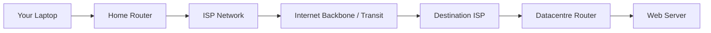
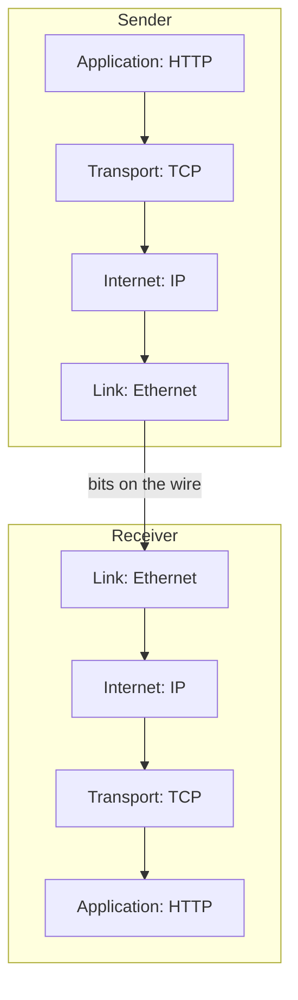
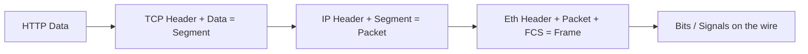
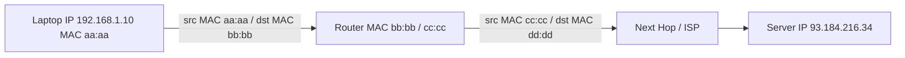
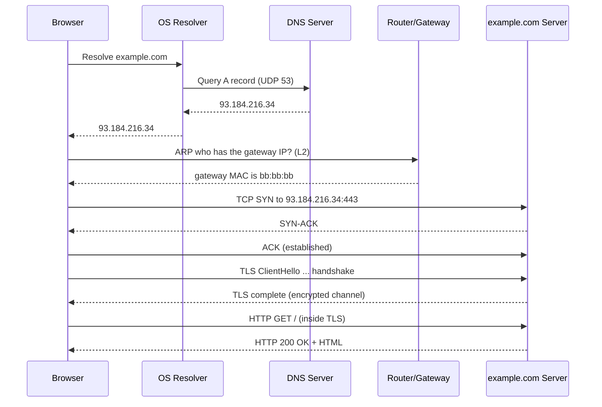
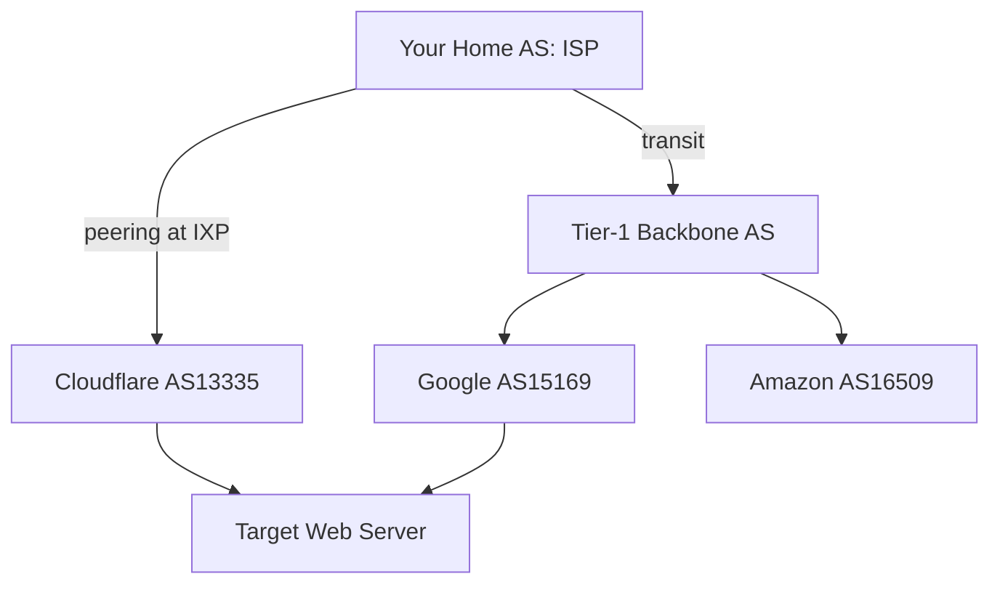

This is Chapter 11 of the series and the opening chapter of the Networking track. Everything you will ever do in security — scanning a host with Nmap, intercepting a request in Burp, sniffing a Wi-Fi handshake, exfiltrating data over DNS, pivoting through a compromised box — is *networking underneath*. If the network layer is a black box to you, every tool is magic and every failure is a mystery. This chapter tears the box open. By the end you will be able to trace, byte by byte, what happens between the moment you press Enter on `curl https://example.com` and the moment the page comes back — and you will see exactly where an attacker or defender can stand in that flow.

We build from absolute zero: what a packet is, why data gets chopped up, how each layer wraps the one above it (encapsulation), how addresses at different layers do different jobs, and how a request finds its way across the planet and back. Then we get our hands dirty with `ping`, `traceroute`, `dig`, `curl` and Wireshark so the theory becomes something you can *see*.

## Why a Hacker Must Understand the Internet From First Principles

Imagine you send a letter. You write it (the content), fold it into an envelope (a wrapper with a destination address), hand it to your local post office (your router), which passes it through sorting centres (intermediate routers) until it reaches the recipient's local office and finally their mailbox. The internet works almost exactly like this, except the "letter" is data, the "envelopes" are protocol headers, and the "post offices" are routers making split-second decisions billions of times per second.

The critical insight is that **the internet is not one thing**. It is a *layered system of cooperating protocols*, each solving one narrow problem and trusting the layer below it to do its job. This layering is the single most important idea in networking, and understanding it turns you from a tool-runner into someone who can reason about *any* protocol, including ones you have never seen.

Here is why this matters for security specifically:

- **Every layer is an attack surface.** ARP spoofing lives at Layer 2, IP spoofing at Layer 3, SYN floods at Layer 4, and SQL injection at Layer 7. If you cannot name the layer, you cannot reason about the attack or its defence.
- **Encapsulation is where tools hook in.** A firewall reads Layer 3/4 headers; a WAF reads Layer 7; a sniffer peels every layer. Knowing what is wrapped in what tells you what each tool can and cannot see.
- **Recon starts here.** Before you scan a target you need to understand how packets reach it, what a "port" even is, and why a host might answer some probes and drop others silently.

> **Key insight** — The internet's power comes from a deal every layer makes: *"I will handle my one job and hand you a clean interface; you don't need to know how I do it."* Attackers win by breaking that trust between layers.

## Foundations: What Is a Network, a Host, and a Protocol?

A **network** is simply two or more devices connected so they can exchange data. A **host** (also called a node or endpoint) is any device with a network address — your laptop, a phone, a server in a datacentre, a smart bulb, a router. A **protocol** is an agreed-upon set of rules for how hosts format and exchange messages. Human language is a protocol; so is the handshake you do when meeting someone. On the internet, protocols are precise, machine-readable specifications published as **RFCs** (Requests for Comments) by the IETF.

The internet is a *network of networks* (that is literally what "inter-net" means). Your home network is one small network; your ISP runs a bigger one; Google runs an enormous one. These are stitched together by routers using a shared addressing scheme (IP) and a shared set of rules, so a packet from your bedroom can reach a server in Tokyo without either machine knowing anything about the dozens of networks it crossed.



Three properties make this scale to billions of devices:

1. **Packet switching** — data is broken into small chunks that travel independently, rather than reserving a dedicated wire for the whole conversation (that older approach is *circuit switching*, used by the classic telephone network).
2. **Layering** — each protocol handles one job and stacks on the others.
3. **Best-effort delivery** — the core network makes no promises; it just tries its best to forward each packet. Reliability, if you need it, is added at the edges (by TCP). This "dumb core, smart edge" design is why the internet is so robust and so extensible.

## Circuit Switching vs Packet Switching: Why Data Is Chopped Up

Before the internet, telephone calls used **circuit switching**: when you called someone, the network reserved a continuous physical path (a "circuit") from you to them for the entire call, whether you were talking or silent. Simple, but wasteful and fragile — if any link on the reserved path failed, the call dropped.

The internet uses **packet switching** instead. Your data is sliced into **packets**, each stamped with a destination address, and each packet is forwarded hop by hop, independently. Different packets of the same file can take different routes and arrive out of order; the receiving end reassembles them. This has profound consequences:

- **Efficiency** — links are shared; a quiet connection uses no bandwidth.
- **Resilience** — if a router or link dies, packets route around it (this was the original Cold-War-era design goal of ARPANET: survive partial destruction).
- **Complexity moves to the edges** — because packets can be lost, duplicated, reordered or delayed, the endpoints need protocols (TCP) to detect and fix that.

Why chop data at all? Three reasons: (1) huge messages would hog a link and starve everyone else; (2) if a 1 GB file were one unit and a single bit flipped, you'd resend the whole gigabyte — with packets you resend only the lost chunk; (3) hardware has physical frame-size limits (the **MTU**, typically 1500 bytes on Ethernet).

> **Analogy** — Moving a house through a doorway: you can't shove the whole house through, so you disassemble it into boxes (packets), label each box with the destination room (addressing), carry them through independently, and reassemble at the other end. If one box is dropped, you only re-carry that box.

## The Layered Model: The Core Mental Model of All Networking

Networking is described with **layered models**. The two you must know are the **OSI model** (7 layers, a teaching/reference model) and the **TCP/IP model** (4 layers, what the internet actually implements). The next chapter dissects both layer by layer; here we need the big picture so encapsulation makes sense.

| TCP/IP Layer | OSI Equivalent | Job | Example Protocols | Address / Unit |
|---|---|---|---|---|
| Application | 5–7 (App/Presentation/Session) | Talk to the user's program | HTTP, DNS, SSH, TLS, FTP | Data / message |
| Transport | 4 (Transport) | End-to-end delivery, ports | TCP, UDP | Port number / segment |
| Internet | 3 (Network) | Global addressing & routing | IP, ICMP | IP address / packet |
| Link | 1–2 (Physical/Data Link) | Move bits on the local wire | Ethernet, Wi-Fi, ARP | MAC address / frame |

The golden rule: **each layer talks only to its peer on the other host and only uses the service of the layer directly below it.** Your browser's HTTP layer "talks to" the server's HTTP layer — conceptually — but physically the data travels down your stack, across the wire, and up the server's stack.



Remember the OSI order with a mnemonic (top to bottom): **A**ll **P**eople **S**eem **T**o **N**eed **D**ata **P**rocessing (Application, Presentation, Session, Transport, Network, Data-link, Physical). Or bottom-up: **P**lease **D**o **N**ot **T**hrow **S**ausage **P**izza **A**way.

## Encapsulation: How Each Layer Wraps the One Above

**Encapsulation** is the process of each layer adding its own **header** (and sometimes a trailer) to the data it receives from the layer above, before handing it down. The reverse — stripping those headers on the way up — is **decapsulation**. This is the mechanical heart of networking, and it is where every packet-analysis and packet-crafting skill begins.

Walk through sending an HTTP request:

1. **Application layer** produces the payload, e.g. the text `GET / HTTP/1.1\r\nHost: example.com\r\n\r\n`. This is just data.
2. **Transport layer (TCP)** prepends a **TCP header** containing source and destination **ports**, sequence numbers, flags, checksum. Data + TCP header = a **segment**.
3. **Internet layer (IP)** prepends an **IP header** with source and destination **IP addresses**, TTL, protocol number. Segment + IP header = a **packet** (or *datagram*).
4. **Link layer (Ethernet)** prepends an **Ethernet header** (source/destination **MAC addresses**, EtherType) and appends a **trailer** (the FCS checksum). Packet + Ethernet header + trailer = a **frame**.
5. The physical layer turns the frame into **signals** (voltage, light, or radio) on the medium.



Visually, the frame looks like a set of nested envelopes:

```text
+-----------------------------------------------------------+
| Ethernet Header | IP Header | TCP Header | HTTP Data | FCS |
|   (MACs, type)  | (IPs,TTL) | (ports,seq)|  payload  |crc  |
+-----------------------------------------------------------+
 \_______________ Frame (Layer 2) ________________________/
                  \________ Packet (Layer 3) _______/
                              \___ Segment (L4) __/
                                       \_ Data _/
```

Each device that handles the frame peels only as far as it needs. A **switch** reads the Ethernet header (MACs) and forwards; it does not care about IP. A **router** peels the Ethernet frame, reads the IP header to decide the next hop, then **re-encapsulates** the packet in a *new* Ethernet frame for the next link. The destination host peels every layer up to the application.

> **Why this matters for security** — When you run Wireshark you are literally watching decapsulation. When you use Scapy to *craft* a packet — `Ether()/IP()/TCP()/"payload"` — you are hand-building this stack of headers. Spoofing an IP means forging the Layer 3 header; ARP spoofing means lying at Layer 2. You cannot do any of it without this model in your head.

### The Names Matter: PDU Terminology

Each layer's unit of data has a name — the **Protocol Data Unit (PDU)**. Interviewers love this and tools use the terms precisely:

| Layer | PDU name |
|---|---|
| Application | Data / Message |
| Transport | Segment (TCP) / Datagram (UDP) |
| Internet | Packet / Datagram |
| Link | Frame |
| Physical | Bit / Symbol |

Say it out loud a few times. When a colleague says "the frame is malformed" they mean Layer 2; "the packet is being dropped" means Layer 3; "the segment was retransmitted" means Layer 4/TCP.

## Addresses: MAC vs IP vs Port — Three Jobs, Three Layers

New learners constantly confuse these three. They live at different layers and answer different questions.

| Address | Layer | Scope | Format | Answers the question |
|---|---|---|---|---|
| **MAC address** | 2 (Link) | Local network segment only | `00:1A:2B:3C:4D:5E` (48-bit hex) | "Which *physical NIC* on this LAN?" |
| **IP address** | 3 (Internet) | Global (or private range) | `93.184.216.34` (IPv4) | "Which *host* anywhere on the internet?" |
| **Port** | 4 (Transport) | Within one host | `443`, `22`, `53` (16-bit, 0–65535) | "Which *program/service* on that host?" |

A useful analogy: the **IP address is the building's street address**, the **port is the apartment number** inside the building, and the **MAC address is like the specific mailbox slot** the local courier uses for the final handoff on your street. A packet's IP addresses stay the same end-to-end (barring NAT), but its MAC addresses **change at every hop**, because MAC only has meaning on the local segment.



Notice the IPs (`192.168.1.10` → `93.184.216.34`) are constant across the diagram, but each link uses fresh MAC addresses. This is why sniffing on a switch only shows you traffic on your local segment unless you do something active (ARP spoofing, port mirroring). We will exploit and defend exactly this in the Ethernet/ARP chapter.

## Ports and Sockets: How One Host Runs Many Services

A single server at one IP address runs many services at once — a web server, SSH, a database. **Ports** are how the transport layer keeps them apart. A 16-bit port number (0–65535) identifies the destination service. The combination of **IP address + port + protocol** is called a **socket**, and a full connection is identified by a **4-tuple**: `(source IP, source port, destination IP, destination port)`.

Port ranges:

- **0–1023: Well-known ports** — assigned to standard services (HTTP 80, HTTPS 443, SSH 22, DNS 53, SMTP 25). On Linux, binding these requires root.
- **1024–49151: Registered ports** — used by specific applications (MySQL 3306, RDP 3389).
- **49152–65535: Ephemeral/dynamic ports** — the OS picks one of these as the *source* port for each outbound connection.

When your browser connects to `example.com:443`, your OS opens an ephemeral source port, say `54321`. The 4-tuple `(192.168.1.10, 54321, 93.184.216.34, 443)` uniquely identifies that one connection, so you can have many tabs to the same server without confusion — each gets a different source port.

| Service | Default Port | Protocol | Why a pentester cares |
|---|---|---|---|
| HTTP | 80 | TCP | Web attack surface |
| HTTPS | 443 | TCP | Web + TLS analysis |
| SSH | 22 | TCP | Remote shell, brute-force target |
| DNS | 53 | UDP/TCP | Enumeration, tunneling, zone transfer |
| SMB | 445 | TCP | Windows lateral movement |
| RDP | 3389 | TCP | Windows remote desktop |
| MySQL | 3306 | TCP | Database exposure |
| SNMP | 161 | UDP | Device enumeration |

The very first thing Nmap does is ask "which ports are open?" — meaning which sockets have a service listening. Everything you'll do in the Scanning & Enumeration track is built on the port concept you just learned.

## The Life of a Request: `example.com` End to End

Let's trace what happens when you type `https://example.com` and hit Enter. This single walkthrough ties together DNS, ARP, IP routing, TCP, TLS and HTTP — all the pieces of this track.



Step by step:

1. **URL parsing** — the browser splits `https://example.com` into scheme (`https` → port 443, TLS), host (`example.com`), and path (`/`).
2. **DNS resolution** — the host needs the IP for `example.com`. It checks its cache, then the `hosts` file, then asks a **DNS resolver** (usually your ISP's or `8.8.8.8`) over UDP port 53. The resolver walks the DNS hierarchy (root → `.com` → `example.com`'s nameserver) and returns `93.184.216.34`. (Full detail in the DNS chapter.)
3. **Routing decision** — the OS checks: is `93.184.216.34` on my local subnet? No. So it must be sent to the **default gateway** (the router). The OS knows the gateway's IP from DHCP.
4. **ARP** — to build the Ethernet frame, the OS needs the gateway's **MAC address**. It broadcasts an ARP request "who has 192.168.1.1?" and the router replies with its MAC. Now the frame can be addressed.
5. **TCP handshake** — the browser opens a TCP connection to `93.184.216.34:443` with the three-way handshake (SYN, SYN-ACK, ACK). (Full detail in the TCP chapter.)
6. **TLS handshake** — because it's HTTPS, a TLS handshake negotiates encryption keys and validates the server's certificate, creating an encrypted tunnel. (Full detail in the HTTP/TLS chapter.)
7. **HTTP request** — inside the TLS tunnel, the browser sends `GET / HTTP/1.1\r\nHost: example.com\r\n...`.
8. **Response & rendering** — the server returns `200 OK` and HTML; the browser parses it, discovers more resources (CSS, JS, images), and repeats DNS/TCP/TLS/HTTP for each (often reusing connections).

Every chapter in this track zooms into one of these steps. Keep this sequence as your map.

## Public vs Private IP Addresses and NAT (The 30-Second Version)

Your laptop almost certainly has a **private IP** like `192.168.1.10` or `10.0.0.5`. These ranges (defined in RFC 1918) are reserved for internal networks and are **not routable on the public internet** — millions of home networks reuse the same `192.168.x.x`. So how does your private-addressed laptop reach a public server?

**NAT (Network Address Translation).** Your router rewrites the source IP of outgoing packets from your private IP to its single public IP, remembers the mapping in a table, and reverses it for replies. This is why `whatismyip.com` shows your router's public address, not your laptop's. NAT is covered fully in the Routing & NAT chapter; for now just know: private IPs stay inside, one public IP faces the world, and the router juggles the translation.

The three private ranges to memorise:

| Range | CIDR | Size |
|---|---|---|
| `10.0.0.0 – 10.255.255.255` | `10.0.0.0/8` | ~16.7 million |
| `172.16.0.0 – 172.31.255.255` | `172.16.0.0/12` | ~1 million |
| `192.168.0.0 – 192.168.255.255` | `192.168.0.0/16` | ~65 thousand |

Spotting these instantly is a recon reflex: if a scan or a leaked config shows `10.x` or `192.168.x`, you're looking at internal infrastructure.

## Hands-On Lab: Watching the Internet Work

Time to *see* everything above. These commands run on Kali/Linux (most work on macOS; Windows equivalents noted). Run them against hosts you own or public services that permit it (`example.com`, `8.8.8.8` are fine for basic reachability tests).

### Step 1 — Find your own addresses

```bash
# Show your interfaces, IP and MAC addresses (Linux)
ip addr show
# Legacy equivalent:
ifconfig

# Just the default route / gateway
ip route show
# Example output:
# default via 192.168.1.1 dev eth0 proto dhcp metric 100
# 192.168.1.0/24 dev eth0 proto kernel scope link src 192.168.1.10
```

Read this: your IP is `192.168.1.10/24`, your gateway (default route) is `192.168.1.1`, and traffic to anything outside `192.168.1.0/24` goes to that gateway. That is the routing decision from step 3 of the walkthrough, right there on your machine.

```bash
# View your ARP cache: IP-to-MAC mappings your host has learned
ip neigh show
# 192.168.1.1 dev eth0 lladdr bb:bb:bb:cc:cc:cc REACHABLE
```

That `192.168.1.1 → bb:bb:...` line is exactly what ARP resolved in step 4.

### Step 2 — Test reachability with `ping` (ICMP, Layer 3)

```bash
ping -c 4 8.8.8.8
```

```text
PING 8.8.8.8 (8.8.8.8) 56(84) bytes of data.
64 bytes from 8.8.8.8: icmp_seq=1 ttl=118 time=11.3 ms
64 bytes from 8.8.8.8: icmp_seq=2 ttl=118 time=10.9 ms
--- 8.8.8.8 ping statistics ---
4 packets transmitted, 4 received, 0% packet loss, time 3005ms
rtt min/avg/max/mdev = 10.9/11.1/11.3/0.2 ms
```

`ping` sends **ICMP Echo Request** packets and times the **Echo Reply**. Two things to read like a pro: **`time=`** is the round-trip time (latency), and **`ttl=`** is the Time To Live left in the IP header. Every router decrements TTL by 1; a starting TTL of 128 arriving as 118 means the packet crossed ~10 routers. TTL also fingerprints the OS (Linux/macOS start at 64, Windows at 128, many network devices at 255).

### Step 3 — See the path with `traceroute`

```bash
traceroute example.com          # Linux/macOS (UDP by default on Linux)
traceroute -I example.com       # use ICMP probes
tracert example.com             # Windows (uses ICMP)
```

```text
traceroute to example.com (93.184.216.34), 30 hops max, 60 byte packets
 1  192.168.1.1 (192.168.1.1)  1.2 ms  1.1 ms  1.0 ms
 2  10.20.30.1 (10.20.30.1)  9.8 ms  9.7 ms  9.9 ms      <- ISP edge
 3  172.16.5.1 (172.16.5.1)  10.1 ms ...                 <- ISP core
 9  93.184.216.34 (93.184.216.34)  11.4 ms  11.2 ms      <- destination
```

`traceroute` is a beautiful hack: it sends packets with **deliberately tiny TTLs** (1, then 2, then 3…). The router where TTL hits 0 discards the packet and sends back an ICMP "Time Exceeded" message revealing its address. Incrementing the TTL walks the path one hop at a time. You are watching packet switching and TTL decrement *in action* — the exact mechanism from the ping section, weaponised into a mapping tool. Hops shown as `* * *` are devices configured not to reply (common on firewalls), which is itself recon signal.

### Step 4 — Resolve a name with `dig`

```bash
dig example.com

# Concise answer only:
dig +short example.com
# 93.184.216.34

# Ask a specific resolver and see the full journey:
dig @8.8.8.8 example.com A +noall +answer
# example.com.  3600  IN  A  93.184.216.34
```

You just performed step 2 of the request walkthrough by hand. The `3600` is the record's TTL in seconds (how long it may be cached — different concept from IP TTL). `IN` means Internet class, `A` means IPv4 address record.

### Step 5 — Make an HTTP request and watch the layers with `curl`

```bash
curl -v https://example.com 2>&1 | head -n 30
```

```text
* Trying 93.184.216.34:443...
* Connected to example.com (93.184.216.34) port 443
* TLS handshake, TLS 1.3 ...
* Server certificate: CN=example.com ...
> GET / HTTP/2
> Host: example.com
> User-Agent: curl/8.5.0
>
< HTTP/2 200
< content-type: text/html; charset=UTF-8
```

The `*` lines are connection/TLS events (Layers 3–6), `>` lines are what you *sent* (the HTTP request), `<` lines are the response. This one command shows DNS → TCP connect → TLS → HTTP, the whole stack, annotated. Add `--trace-ascii trace.txt` to dump every byte for study.

### Step 6 — Actually see encapsulation in Wireshark

Wireshark is a **packet analyser** (sniffer): it captures frames off your network interface and decodes every layer for you. It is the single most educational tool in networking. Install and launch:

```bash
sudo apt update && sudo apt install -y wireshark
sudo wireshark &        # GUI
# or capture on the CLI with its siblings, tshark / tcpdump:
sudo tcpdump -i eth0 -n icmp
```

Do this experiment:

1. Start a capture on your interface (`eth0`/`wlan0`).
2. In the filter bar type `icmp` and press Enter.
3. In a terminal run `ping -c 2 8.8.8.8`.
4. Click the Echo Request packet. In the middle pane you'll see it decoded as a tree:

```text
Frame 1: 98 bytes on wire
Ethernet II, Src: aa:aa:aa:aa:aa:aa, Dst: bb:bb:bb:bb:bb:bb   <- Layer 2
Internet Protocol Version 4, Src: 192.168.1.10, Dst: 8.8.8.8  <- Layer 3
    Time to live: 64
Internet Control Message Protocol                              <- Layer 3.5
    Type: 8 (Echo (ping) request)
```

Expand each line and you are literally reading the encapsulation stack from the diagrams above — Ethernet wrapping IP wrapping ICMP. This "aha" moment is where networking stops being abstract. Now filter `tcp.port == 443` and reload a webpage to watch a TCP handshake and TLS records appear.

> **Try this** — Capture a full page load with the filter `ip.addr == <server ip>`, then use Wireshark's *Statistics → Flow Graph* and *Follow → TCP Stream*. You will see the SYN/SYN-ACK/ACK, the TLS handshake, and the encrypted application data, matching the sequence diagram exactly.

## Bandwidth, Latency, Throughput & Jitter: The Four Numbers That Describe a Link

People say "my internet is slow" as if speed were one number. It is not. Four separate measurements describe how a link performs, and confusing them leads to bad conclusions in both troubleshooting and attacks.

- **Bandwidth** — the *maximum capacity* of a link, measured in bits per second (Mbps, Gbps). Think of it as the number of lanes on a motorway. A 100 Mbps link can carry at most 100 million bits each second. Bandwidth is a ceiling, not a guarantee.
- **Throughput** — the *actual* data rate you achieve, always ≤ bandwidth. Congestion, protocol overhead, retransmissions and small windows all drag throughput below the theoretical bandwidth. When you download a file and see "8.2 MB/s", that's throughput.
- **Latency** — the *time* for one bit to travel from A to B, measured in milliseconds. This is your `ping` `time=` value (technically round-trip time, RTT). Latency is dominated by physical distance (light in fibre travels ~200,000 km/s, so a round trip to a server 3,000 km away costs at least ~30 ms) plus per-hop processing.
- **Jitter** — the *variation* in latency between packets. Steady 20 ms is fine for a video call; 20 ms averaging but swinging 5–120 ms (high jitter) makes voice choppy. Jitter matters enormously for real-time protocols (VoIP, gaming) that run over UDP.

Why a security person cares: latency and jitter fingerprints reveal a lot. A host that is one hop away but answers with 300 ms latency may be a honeypot, a heavily loaded box, or traffic being inspected/proxied. Timing side-channels (blind SQL injection with `SLEEP()`, timing-based user enumeration) rely on measuring *latency differences* precisely — you are exploiting the very numbers defined here. And in a **slowloris**-style DoS, an attacker deliberately trickles data to hold connections open, exploiting the gap between bandwidth (plenty) and the server's finite connection slots.

```text
Bandwidth  = lanes on the motorway (capacity, Mbps/Gbps)
Throughput = cars actually passing per minute (real rate achieved)
Latency    = time for one car to drive end to end (ms, your ping)
Jitter     = how inconsistent each car's travel time is (ms variance)
```

A classic trap: "we have a 1 Gbps link but the app is slow." Often the bandwidth is fine and the killer is **latency** — a chatty protocol that makes 200 sequential round trips will feel slow on a high-latency link no matter how fat the pipe. This is why CDNs (below) move content *physically closer* to reduce latency rather than just buying more bandwidth.

## Who Actually Runs the Internet: ISPs, IXPs, Autonomous Systems & BGP

The "network of networks" is made of tens of thousands of independently operated networks called **Autonomous Systems (AS)**. Each AS — your ISP, a university, Google, Cloudflare — is assigned a number (an **ASN**, e.g. `AS15169` is Google) and owns blocks of IP addresses. The protocol these giant networks use to tell each other "I can reach these IP ranges, send traffic for them to me" is **BGP (Border Gateway Protocol)**. BGP is the routing glue of the entire internet.

Networks physically connect in two ways: **transit** (a smaller network pays a larger one to carry its traffic to the rest of the internet) and **peering** (two networks connect directly to exchange traffic, often for free, usually at an **Internet Exchange Point / IXP** — a big building full of routers in cities like Amsterdam, London and Mumbai).



For security this hierarchy is directly actionable:

- **ASN recon** — you can map an entire organisation's public IP footprint from its ASN. Tools: `whois -h whois.radb.net -- '-i origin AS15169'`, `amass intel -asn 15169`, or the site bgp.he.net. Knowing every netblock a target owns is often the highest-value early recon step.
- **BGP hijacking** — because BGP historically trusted any AS's announcements, attackers (and nation-states) have hijacked traffic by falsely announcing they own someone else's IP range. Famous cases: the 2018 Amazon Route 53 BGP hijack that stole cryptocurrency, and repeated route leaks that briefly sent large fractions of internet traffic through unexpected countries. Defences are **RPKI** (cryptographically signed route origins) and route filtering.
- **Attribution & geolocation** — mapping an IP to its ASN and owner tells you whether a host is on AWS, a residential ISP, or a bulletproof hosting provider — signal for both offence (is this a real target or a WAF/CDN edge?) and defence (is this login coming from a datacentre AS that no normal user would use?).

```bash
# Which AS owns an IP, and what ranges does that AS announce?
whois -h whois.cymru.com " -v 8.8.8.8"       # ASN, owner, country in one line
whois 93.184.216.34 | grep -iE 'origin|netname|orgname'
```

## CDNs, Anycast & How Big Sites Scale (and Hide)

When you `dig` a large site you often get an IP that belongs to **Cloudflare, Akamai, Fastly or CloudFront**, not the origin server. These are **Content Delivery Networks (CDNs)** — globally distributed caches that sit in front of the real server. They exist to (a) reduce latency by serving cached content from a datacentre near you, (b) absorb DDoS traffic, and (c) act as a reverse proxy / WAF.

The trick that makes them work is **Anycast**: the *same* IP address is announced (via BGP) from dozens of locations worldwide, and the internet's routing naturally delivers you to the nearest one. So `1.1.1.1` in India and `1.1.1.1` in Brazil reach different physical machines.

Why this dominates modern recon:

- **The IP you scan is the CDN edge, not the origin.** Scanning Cloudflare's IP tells you about Cloudflare, not your target. A huge part of bug-bounty recon is **finding the origin IP** hidden behind the CDN (via old DNS records, SSL certificate SANs, misconfigured subdomains, or the target's own mail server), because if you can reach the origin directly you bypass the WAF entirely.
- **WAF in the path** — the CDN often inspects Layer 7, so your payloads must survive it. This is why the WAF-bypass skill exists.
- **Shared IPs** — many sites share one CDN IP (distinguished by the `Host` header / SNI), so a naive "reverse IP lookup" is noisy.

```bash
# Is a target behind a CDN? Look at the org that owns the resolved IP:
dig +short target.com | head -1 | xargs -I{} whois {} | grep -i orgname
# OrgName: Cloudflare, Inc.   <- yes, CDN. Origin is elsewhere.

# Certificate transparency + old records sometimes leak the true origin:
curl -s "https://crt.sh/?q=%25.target.com&output=json" | jq -r '.[].name_value' | sort -u
```

> **Recon reflex** — Before you scan "the target", ask: am I looking at the real host, a CDN edge, a load balancer, or a NAT gateway? The addressing and routing model in this chapter is exactly what lets you tell them apart.

## Advanced Concepts: MTU, Fragmentation, and Why Big Packets Break

The **MTU (Maximum Transmission Unit)** is the largest frame a link can carry — 1500 bytes on standard Ethernet. If an IP packet is bigger than the next link's MTU, it must be **fragmented** into pieces that are reassembled at the destination. Fragmentation is slow, error-prone, and a classic evasion trick: attackers fragment packets so that simple firewalls/IDS see only harmless-looking pieces and miss the malicious whole (Nmap's `-f` flag does exactly this).

A subtle real-world failure: if a router needs to fragment but the packet has the **Don't Fragment (DF)** bit set, it drops the packet and sends back an ICMP "Fragmentation Needed" message. This is how **Path MTU Discovery** works — but if a firewall blocks that ICMP message (a common misconfiguration), connections mysteriously hang on large transfers while small ones work. Recognising this "big requests hang, small ones succeed" signature saves hours of debugging and is a known pentest lab scenario.

```bash
# Probe path MTU by sending un-fragmentable pings of increasing size:
ping -M do -s 1472 8.8.8.8    # 1472 payload + 28 header = 1500; largest that fits
ping -M do -s 1473 8.8.8.8    # -> "Frag needed" / fails if MTU is 1500
```

## IPv4 vs IPv6: The Address Exhaustion Story

IPv4 uses **32-bit** addresses — about 4.3 billion, which sounds huge but ran out years ago (hence NAT). **IPv6** uses **128-bit** addresses (`2001:0db8:85a3::8a2e:0370:7334`), giving ~340 undecillion addresses — enough for every grain of sand to have billions. IPv6 also removes the need for NAT (every device can have a public address again), changes ARP to a protocol called **NDP** (Neighbor Discovery), and is increasingly deployed.

For security, IPv6 matters because it is often **enabled by default and forgotten**: a host firewalled on IPv4 may be wide open on IPv6, and internal recon tools sometimes ignore it. Always check both. `ip -6 addr` shows your IPv6 addresses; a link-local `fe80::` address exists on almost every interface.

## Common Pitfalls & How to Overcome Them

- **Confusing "IP" (Layer 3 address) with "TCP/IP" (the whole stack).** IP is one protocol; TCP/IP is the model. Be precise.
- **Thinking a port is a physical thing.** Ports are numbers in the transport header, not sockets you plug cables into.
- **Assuming MAC addresses travel end-to-end.** They are rewritten at every router hop. Only IPs (usually) survive the journey.
- **Believing `ping` failing means "host down".** Many hosts and firewalls silently drop ICMP. A non-responsive ping proves nothing about whether TCP services are up — always confirm with a port scan.
- **Ignoring the loopback.** `127.0.0.1` (`localhost`) never leaves your machine; it's handled internally. Great for testing but invisible on the wire.
- **Forgetting DNS caching.** If a name resolves to a stale IP, your captures will confuse you. `sudo resolvectl flush-caches` clears it.

> **Debugging mindset** — When something "doesn't connect," walk *down the layers*: Is there a physical/link connection (`ip link`)? Do I have an IP and gateway (`ip addr`, `ip route`)? Can I reach the gateway and beyond (`ping`)? Does DNS resolve (`dig`)? Does the port answer (`nc -vz host port`)? Each answer isolates the failing layer.

## Real-World Application & Case Studies

- **Recon foundation** — Every engagement starts by mapping the target's network: which IP ranges, which hosts are alive (host discovery = ICMP/ARP sweeps), which ports/services are exposed. All of it is the concepts in this chapter applied at scale.
- **The Morris Worm (1988)** and countless successors spread by understanding exactly how hosts trust and forward packets. Modern worms (WannaCry, 2017) spread over SMB (port 445) across flat networks — a networking problem before it's a malware problem.
- **DDoS amplification** — Attacks like the 2018 GitHub 1.35 Tbps memcached attack abused connectionless (UDP) protocols and spoofed source IPs. You cannot understand or defend them without the encapsulation and addressing model here.
- **Great Firewall / censorship & DPI** — Deep Packet Inspection systems peel encapsulation just like Wireshark to decide what to block, which is why encrypted transports (TLS, DoH) and tunneling matter for evasion.

> **Bug Bounty Angle** — Pure "how the internet works" rarely pays a bounty by itself, but it is the substrate for the ones that do. Understanding NAT and private ranges is what lets you recognise an **SSRF** hitting `169.254.169.254` (cloud metadata) or `192.168.x` internal services. Knowing DNS resolution flow underlies **subdomain takeover** and **DNS rebinding** bugs. Reading `curl -v` / Burp traffic fluently — spotting an unexpected redirect, a leaked internal IP in a header, a service on an odd port — is a daily bounty skill. Programs pay for *impact*, and impact usually means reaching something on the network that should be unreachable. This chapter tells you what "reachable" even means.

> **CTF Angle** — Networking fundamentals show up in the **"Networking"/"Misc"** categories of picoCTF and constantly in HTB/THM boxes. Typical tasks: "a pcap is attached, find the flag" (open in Wireshark, `Follow TCP Stream`, or `strings capture.pcap | grep -i flag`); "connect to this service" (`nc host port`); "the flag is hidden in DNS TXT records" (`dig TXT target`). Fast reflexes to learn: `tshark -r file.pcap -Y 'http' -T fields -e http.request.uri` to pull URLs from a capture, `tcpdump -A -r file.pcap | grep -i flag` for cleartext, and always check TTL/ports to fingerprint hosts. TryHackMe's *Introduction to Networking* and *Wireshark 101* rooms train exactly this.

## Detection & Defense: The Blue-Team View

Defenders live inside this model too. Every concept has a defensive counterpart:

- **Network segmentation** — splitting a flat network into subnets/VLANs so a compromise in one area cannot freely reach others. This is packet routing used as a security boundary (covered in the Firewalls chapter).
- **NetFlow / IPFIX** — routers export summaries of every flow (the 4-tuples). SOC analysts hunt through flow data to spot a workstation suddenly talking to a rare foreign IP on an odd port — anomalous *metadata* without reading payloads.
- **Baseline & anomaly detection** — knowing normal TTLs, normal ports, and normal traffic volume lets you flag abnormal ones (a spoofed packet with an impossible TTL, a burst of tiny fragmented packets = evasion attempt).
- **Detecting scans** — a host that receives SYN packets to hundreds of ports in seconds is being port-scanned; IDS rules (Snort/Suricata) fire on exactly that pattern.

Sample defensive signal: an alert when a single internal host initiates connections to more than N distinct destination ports on another host within M seconds (horizontal/vertical scan). You can only author that rule if you understand ports and the 4-tuple.

## Final Revision / Summary

Lock in the big ideas:

- The internet is a **network of networks** using **packet switching**: data is chopped into independently-routed packets, giving efficiency and resilience.
- Networking is **layered**. TCP/IP has four layers — **Link, Internet, Transport, Application** — each doing one job and using the layer below.
- **Encapsulation** wraps data in headers on the way down (Data → Segment → Packet → Frame → bits) and strips them on the way up. Switches read frames (MAC), routers read packets (IP), hosts read up to the application.
- **Three address types, three layers**: **MAC** (local, changes each hop), **IP** (global, end-to-end), **Port** (which service on a host). A connection is a **4-tuple**.
- A single web request chains **DNS → ARP → IP routing → TCP → TLS → HTTP** — memorise this sequence; the whole track expands it.
- **Private IPs** (10/8, 172.16/12, 192.168/16) stay internal; **NAT** maps them to a public IP.
- Tools: `ip`, `ping` (ICMP + TTL), `traceroute` (TTL trick to map hops), `dig` (DNS), `curl -v` (whole stack), **Wireshark/tcpdump** (see encapsulation directly).

Memory hook — the nested-envelope image: **[Ethernet [ IP [ TCP [ HTTP ] ] ] ]**. Every tool you'll learn either reads one of those envelopes, forges one, or blocks one.

## Cheat Sheet / Quick Reference

```text
LAYERS (TCP/IP)          PDU          ADDRESS         EXAMPLE PROTOCOLS
Application              Data         (none)          HTTP, DNS, SSH, TLS
Transport                Segment      Port            TCP, UDP
Internet                 Packet       IP address      IP, ICMP
Link                     Frame        MAC address     Ethernet, Wi-Fi, ARP

ENCAPSULATION (top->down): Data -> +TCP hdr=Segment -> +IP hdr=Packet
                            -> +Eth hdr/FCS=Frame -> bits on wire

PRIVATE RANGES: 10.0.0.0/8  172.16.0.0/12  192.168.0.0/16   Loopback 127.0.0.1
PORTS: well-known 0-1023 | registered 1024-49151 | ephemeral 49152-65535
TTL start values: Linux/mac 64 | Windows 128 | network gear 255
```

```bash
# ADDRESSES & ROUTES
ip addr show                 # your IPs and MACs
ip route show                # routing table / default gateway
ip neigh show                # ARP cache (IP<->MAC)
ip -6 addr                   # IPv6 addresses (don't forget these)

# REACHABILITY & PATH
ping -c 4 8.8.8.8            # ICMP echo; read time= and ttl=
traceroute example.com       # map hops via TTL trick
mtr example.com              # live combined ping+traceroute

# DNS
dig +short example.com       # quick A record
dig @8.8.8.8 example.com ANY # query a specific resolver
resolvectl flush-caches      # clear DNS cache

# HTTP / SOCKETS
curl -v https://example.com  # see DNS+TCP+TLS+HTTP annotated
nc -vz example.com 443       # is a TCP port open?
ss -tulpn                    # local listening sockets (ports)

# CAPTURE / ANALYSE
sudo tcpdump -i eth0 -n icmp             # CLI sniff
sudo tcpdump -i eth0 -w cap.pcap         # save to file
tshark -r cap.pcap -Y 'http.request'     # filter a saved capture
wireshark cap.pcap                        # full GUI decode

# MTU / FRAGMENTATION
ping -M do -s 1472 8.8.8.8   # largest un-fragmented ping on 1500 MTU
```

## Practice Labs & Resources

- **TryHackMe — "What is Networking?"**, **"Intro to LAN"**, and **"Networking Concepts"** rooms: gentle, hands-on reinforcement of everything here.
- **TryHackMe — "Wireshark: The Basics"** and **"Wireshark 101"**: capture and decode real traffic; the fastest way to make encapsulation click.
- **picoCTF — "Networking" and "Forensics" (pcap) challenges**: practice pulling data out of captures (`Follow TCP Stream`, `strings`, `tshark`).
- **Cloudflare Learning Center — "What is the Internet? / What is a packet?"**: excellent plain-English reference articles to reread.
- **RFC 791 (IP), RFC 793 (TCP), RFC 826 (ARP)**: skim the real specs once — seeing the actual header fields demystifies them.
- **Beej's Guide to Network Programming**: friendly deep dive when you're ready to build tools.
- **Hands-on habit** — pick one command from the cheat sheet each day, run it against your own network, and open a Wireshark capture alongside it. Within a week the whole stack will feel concrete.
