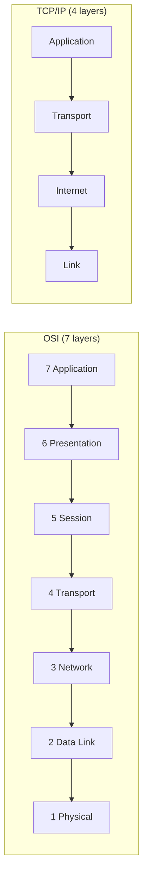
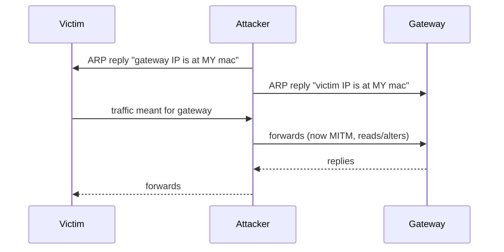
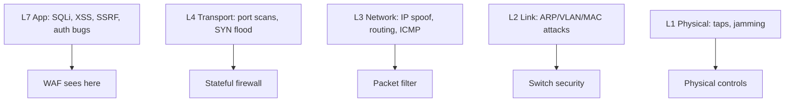

**Level:** Beginner · **Track:** Foundations · **Read time:** 115 min

This is Chapter 12 of the series. The previous chapter gave you the big picture — packets, encapsulation, addresses, and a request travelling end to end. This chapter zooms into the *model itself*. We dissect all seven OSI layers and all four TCP/IP layers, one at a time, and — crucially for a security career — we map **every common attack and defence to the exact layer it lives on**. When you finish, "that's a Layer 2 attack" or "the WAF only sees Layer 7" will be second nature, and you'll be able to place any protocol or exploit on the stack instantly.

Why obsess over a model? Because the OSI model is the *shared language of the entire industry*. Every firewall datasheet, every IDS rule, every interview question, every incident report references layers. "Layer 3 routing," "Layer 4 load balancer," "Layer 7 attack," "L2 adjacency" — these phrases only make sense if the model is burned into your memory. It is the coordinate system on which all networking and network security is plotted.

## Two Models, One Reality: Why OSI *and* TCP/IP?

There are two layered models and beginners are confused by having two. Here's the honest story:

- The **OSI model** (Open Systems Interconnection, 1984, ISO) has **7 layers**. It was designed as a vendor-neutral *reference* — a clean theoretical framework. Almost nobody implements networking exactly as OSI describes, but *everybody uses its vocabulary*. It's the teaching model and the industry's shared language.
- The **TCP/IP model** (also called the Internet Protocol Suite) has **4 layers** (sometimes drawn as 5). It is what the internet *actually runs on*. It predates OSI and is more pragmatic — it collapses OSI's top three layers into one "Application" layer and its bottom two into one "Link" layer.

You must know both: think in OSI's 7 layers for precision and communication, but remember TCP/IP's 4 layers are the real implementation. They map cleanly onto each other.



| OSI Layer | TCP/IP Layer | PDU | Address | Sample Protocols |
|---|---|---|---|---|
| 7 Application | Application | Data | — | HTTP, DNS, SSH, FTP, SMTP |
| 6 Presentation | Application | Data | — | TLS/SSL, ASCII, JPEG, gzip |
| 5 Session | Application | Data | — | NetBIOS, RPC, sockets |
| 4 Transport | Transport | Segment/Datagram | Port | TCP, UDP |
| 3 Network | Internet | Packet | IP address | IP, ICMP, IPsec |
| 2 Data Link | Link | Frame | MAC address | Ethernet, Wi-Fi, ARP, PPP |
| 1 Physical | Link | Bit | — | cables, radio, fibre, voltages |

Mnemonics to lock the order in memory:

- Top→bottom (7→1): **A**ll **P**eople **S**eem **T**o **N**eed **D**ata **P**rocessing.
- Bottom→top (1→7): **P**lease **D**o **N**ot **T**hrow **S**ausage **P**izza **A**way.

Now let's walk every layer from the ground up.

## Layer 1 — Physical: Bits on the Medium

The **Physical layer** is the actual movement of raw bits (1s and 0s) across a medium: copper (electrical voltages), fibre (pulses of light), or air (radio waves for Wi-Fi/cellular). It defines cable types, connectors, pin-outs, voltage levels, frequencies, and how a bit is encoded onto the signal.

There are no IP addresses, no ports, no packets here — just signal. Devices that operate purely at Layer 1: hubs (dumb signal repeaters), cables, repeaters, media converters, and the transceiver in your NIC.

**Security at Layer 1** is largely *physical and RF*:

- **Wiretapping / cable tapping** — splicing a fibre or copper line to read the signal. Fibre taps can be near-undetectable.
- **RF jamming** — flooding a Wi-Fi frequency with noise to deny service (a Layer 1 DoS).
- **TEMPEST / emanation attacks** — reading the electromagnetic leakage of cables or monitors from a distance.
- **Physical port access** — a rogue device plugged into an exposed Ethernet jack or a drop box (a small computer left on-site) starts its whole attack at Layer 1.

Defences are physical: locked comms rooms, port security, cable conduits, RF shielding, and disabling unused ports.

## Layer 2 — Data Link: Frames, MAC Addresses & the Local Network

The **Data Link layer** moves frames between *directly connected* nodes on the same local network (the same "broadcast domain"). Its addressing is the **MAC address** — a 48-bit hardware address burned into (or spoofed on) every NIC, written like `00:1A:2B:3C:4D:5E`. The first 24 bits (the **OUI**) identify the manufacturer, which is itself a recon clue (`00:50:56` = VMware, `08:00:27` = VirtualBox, `DC:A6:32` = Raspberry Pi).

Layer 2 is split into two sublayers: **LLC** (Logical Link Control, multiplexing) and **MAC** (Media Access Control, addressing + how devices share the medium, e.g. CSMA/CD on old Ethernet, CSMA/CA on Wi-Fi). The key Layer 2 device is the **switch**, which learns which MAC lives on which physical port and forwards frames only to the right port. **ARP** (Address Resolution Protocol) — mapping an IP to a MAC — straddles Layers 2/3 and lives here in practice.

**Layer 2 is one of the richest attack surfaces on an internal network**, because switches trust what they're told:

| Attack | Mechanism | Impact |
|---|---|---|
| **ARP spoofing / poisoning** | Send forged ARP replies so victims map the gateway's IP to *your* MAC | Man-in-the-middle: you see/alter their traffic |
| **MAC flooding** | Overflow the switch's MAC table (CAM table) with fake MACs | Switch "fails open," floods all frames — you sniff everything |
| **MAC spoofing** | Change your NIC's MAC to impersonate another device | Bypass MAC filtering, evade tracking |
| **VLAN hopping** | Abuse trunking (DTP) or double-tagging (802.1Q) to reach other VLANs | Break out of a segmented VLAN |
| **STP attacks** | Forge Spanning Tree BPDUs to become root bridge | Reroute/MITM traffic |
| **DHCP starvation/rogue DHCP** | Exhaust the DHCP pool or answer first with a malicious config | MITM via attacker-set gateway/DNS |



Because these attacks are *local*, they're the bread and butter of internal pentests and are covered in depth in the Ethernet/ARP and Network Attacks chapters. Defences: switch **port security** (limit MACs per port), **Dynamic ARP Inspection (DAI)**, **DHCP snooping**, **BPDU guard**, and disabling DTP.

## Layer 3 — Network: IP Addresses & Global Routing

The **Network layer** delivers packets across *different* networks — this is where **routing** happens and where the **IP address** lives. Unlike a MAC address (local only), an IP address is meaningful across the whole internet, and it's how a packet finds its way from your subnet to a server on another continent. The key device is the **router**, which reads the destination IP, consults its routing table, and forwards the packet toward the next hop — rewriting the Layer 2 frame each time (as you saw in Chapter 11).

Core Layer 3 protocols: **IP** (v4 and v6), **ICMP** (error/diagnostic messages — `ping`, `traceroute`, "destination unreachable"), **IPsec** (encryption at Layer 3, the basis of many VPNs), and routing protocols like **OSPF** and **BGP**.

Layer 3 attacks and concepts:

| Attack / Concept | What it does |
|---|---|
| **IP spoofing** | Forge the source IP of a packet — basis of reflection/amplification DDoS and blind attacks |
| **ICMP tunneling** | Smuggle data inside `ping` packets to exfiltrate past firewalls |
| **Smurf attack** | Ping a broadcast address with a spoofed victim source → flood of replies to the victim |
| **Routing attacks** | BGP hijacking, OSPF injection — reroute traffic through the attacker |
| **Fragmentation attacks** | Overlapping/tiny fragments to evade IDS or crash old stacks (teardrop) |
| **TTL analysis** | Fingerprint OS and count hops via the IP TTL field |

Because routers make forwarding decisions on IP, Layer 3 is where **firewalls** and **network segmentation** primarily operate (a packet filter matching source/dest IP). Defences: anti-spoofing filters (BCP 38 / uRPF), ACLs, blocking ICMP selectively, and RPKI for BGP.

## Layer 4 — Transport: Ports, Reliability & the TCP/UDP Split

The **Transport layer** provides *end-to-end* communication between two programs, identified by **port numbers**, and decides whether delivery is reliable. The two protocols you'll use constantly:

- **TCP (Transmission Control Protocol)** — connection-oriented, reliable, ordered. It establishes a session with the **three-way handshake** (SYN → SYN-ACK → ACK), numbers every byte (sequence/acknowledgement numbers), retransmits lost data, and controls flow and congestion. Use it when every byte must arrive correctly: web, SSH, email, file transfer.
- **UDP (User Datagram Protocol)** — connectionless, unreliable, unordered, tiny header, no handshake. Fire-and-forget. Use it when speed beats reliability: DNS, DHCP, VoIP, video streaming, games. There's no built-in retransmission; the application handles loss if it cares.

| Feature | TCP | UDP |
|---|---|---|
| Connection | Handshake first | None |
| Reliability | Guaranteed, retransmits | Best-effort |
| Ordering | In-order | May arrive out of order |
| Header size | 20+ bytes | 8 bytes |
| Speed/overhead | Higher overhead | Minimal |
| Typical uses | HTTP, SSH, SMTP, FTP | DNS, DHCP, VoIP, SNMP |

The next two chapters (TCP Deep Dive; UDP/ICMP) unpack these fully. Layer 4 is where scanning primarily happens — a **port scan** asks Layer 4 "is anything listening?":

| Attack | Layer 4 mechanism |
|---|---|
| **SYN flood (DoS)** | Send SYNs, never complete the handshake, exhausting the server's half-open connection table |
| **SYN / stealth scan** | `nmap -sS` — send SYN, read SYN-ACK (open) or RST (closed), never finish — quiet reconnaissance |
| **UDP scan** | `nmap -sU` — send UDP, infer open/closed from replies or ICMP "port unreachable" |
| **Port knocking bypass / session hijacking** | Predict TCP sequence numbers to inject into or hijack a session |
| **UDP amplification** | Small spoofed UDP request → huge reply to the victim (DNS, NTP, memcached) |

Defences: SYN cookies, rate limiting, connection tracking in stateful firewalls, and closing/​filtering unused ports.

## Layer 5 — Session: Establishing, Managing & Tearing Down Dialogues

The **Session layer** manages the *dialogue* between two applications — opening, maintaining, synchronising and closing a "session," including checkpointing so a long transfer can resume after a hiccup. In the real TCP/IP world this layer is thin and mostly absorbed into the application and the OS socket API. Protocols/technologies associated with it: **NetBIOS**, **RPC (Remote Procedure Call)**, **SMB session setup**, **PPTP**, and the establishment logic of things like SQL sessions.

Security relevance:

- **Session hijacking** — stealing or predicting a session identifier to take over an authenticated dialogue (conceptually Layer 5; in web apps it manifests as stealing a session cookie at Layer 7).
- **NetBIOS/RPC enumeration** — Windows NetBIOS and RPC endpoints leak names, shares and users; `enum4linux` and NetExec abuse this on internal networks.
- **Session fixation / replay** — forcing or reusing a session identifier.

The Session layer is a good example of why OSI is a *reference*: it's conceptually clean but rarely a distinct implementation layer. Know it for interviews and for reasoning about where "sessions" break.

## Layer 6 — Presentation: Encoding, Encryption & Translation

The **Presentation layer** translates data between the application's format and a common wire format — **character encoding** (ASCII, Unicode), **compression** (gzip), **serialization**, and famously **encryption/decryption (TLS/SSL)**. Its job is to make sure data sent by one system is intelligible to another regardless of internal representation.

For security this layer is huge because **TLS lives here** (though it spans 5–6/7 in practice). Attacks and concepts mapped to Layer 6:

| Concept | Relevance |
|---|---|
| **TLS/SSL attacks** | POODLE, BEAST, Heartbleed, downgrade attacks — flaws in the encryption negotiation/implementation |
| **Encoding abuse** | Bypassing filters with Base64, URL-encoding, Unicode normalization tricks, double-encoding |
| **Deserialization** | Malicious serialized objects → RCE (Java/PHP/.NET) — a Presentation-layer format weaponised |
| **Compression side-channels** | CRIME/BREACH — inferring secrets from compressed-response sizes |

Every time you decode Base64 in CyberChef, strip TLS in Burp, or craft a Unicode filter bypass, you are operating at Layer 6.

## Layer 7 — Application: Where Humans and Apps Meet

The **Application layer** is the top — the protocols your programs speak directly: **HTTP/HTTPS**, **DNS**, **SSH**, **FTP**, **SMTP/IMAP/POP3**, **SNMP**, **LDAP**, **SMB**. This is *not* the app itself (your browser), but the protocol the app uses. It's the layer with the **richest, most human-readable data**, which is exactly why it hosts the most numerous and most-paid vulnerabilities.

This is the home turf of web hacking and the entire Bug Bounty track:

| Layer 7 vuln class | Example |
|---|---|
| Injection | SQLi, command injection, SSTI, XXE |
| Cross-Site Scripting (XSS) | Reflected/stored/DOM |
| Broken access control / IDOR | Reaching other users' objects |
| Authentication flaws | Weak login, JWT abuse, OAuth misconfig |
| SSRF | Making the server request internal resources |
| Business logic flaws | Abusing legitimate features |



Because Layer 7 data is meaningful, defences here are content-aware: **WAFs**, input validation, output encoding, authentication/authorization logic, and application-aware IDS. A packet filter can't stop SQL injection because it never reads the SQL — only a Layer 7 device can. That single fact explains the entire product category of WAFs.

## Mapping Attacks to Layers: The Master Table

This is the table to internalise. In any incident or engagement, being able to place the activity on a layer tells you which tool and which defence apply.

| Layer | Attacks | Tools (offense) | Defenses |
|---|---|---|---|
| 7 Application | SQLi, XSS, SSRF, CSRF, RCE, IDOR | Burp, sqlmap, ffuf, Nuclei | WAF, input validation, authz |
| 6 Presentation | TLS attacks, deserialization, encoding bypass | testssl.sh, ysoserial, CyberChef | TLS hardening, safe deserialization |
| 5 Session | Session hijack, NetBIOS/RPC enum | enum4linux, NetExec | Session mgmt, disable NetBIOS |
| 4 Transport | Port scan, SYN flood, UDP amp, session hijack | nmap, hping3, scapy | SYN cookies, rate limit, close ports |
| 3 Network | IP spoof, ICMP tunnel, routing/BGP hijack, frag evasion | hping3, scapy, nmap -f | ACLs, uRPF, RPKI, segmentation |
| 2 Data Link | ARP/DHCP/VLAN/MAC/STP attacks | bettercap, ettercap, yersinia | Port security, DAI, DHCP snooping |
| 1 Physical | Tapping, jamming, rogue devices | RF tools, drop boxes | Locks, port disable, shielding |

## Hands-On Lab: Seeing Every Layer in One Capture

Let's prove the model with a single Wireshark capture and read each layer off a real packet.

### Step 1 — Capture an HTTPS page load

```bash
# Start capture, filter to the target only
sudo tcpdump -i eth0 -w layers.pcap host example.com &
curl -s https://example.com > /dev/null
sudo pkill tcpdump
wireshark layers.pcap &
```

### Step 2 — Dissect one TCP SYN packet and label the layers

Click the first `SYN` packet. Wireshark's tree maps *exactly* onto the OSI/TCP-IP layers:

```text
Frame 12: 74 bytes on wire                                  <-- metadata
Ethernet II, Src: aa:aa:.., Dst: bb:bb:..                    <-- LAYER 2 (Data Link)
    Type: IPv4 (0x0800)
Internet Protocol Version 4, Src: 192.168.1.10, Dst: 93..    <-- LAYER 3 (Network)
    Time to live: 64
    Protocol: TCP (6)
Transmission Control Protocol, Src Port: 51544, Dst Port: 443 <-- LAYER 4 (Transport)
    Flags: 0x002 (SYN)
    Sequence Number: 0 (relative)
```

Right there: Layer 2 (Ethernet/MAC), Layer 3 (IP/TTL), Layer 4 (TCP/ports/flags). Now click a later packet in the stream and expand **Transport Layer Security** — that's Layers 5/6. The `GET` (if it were plain HTTP) would be Layer 7. One packet, the whole model.

### Step 3 — Use display filters that target specific layers

```text
eth.addr == aa:bb:cc:dd:ee:ff     # Layer 2 — a specific MAC
arp                                # Layer 2 — ARP traffic
ip.addr == 93.184.216.34          # Layer 3 — a specific IP
icmp                               # Layer 3 — ping/traceroute
tcp.port == 443                    # Layer 4 — a service/port
tcp.flags.syn == 1 && tcp.flags.ack == 0   # Layer 4 — SYN scans
tls.handshake.type == 1           # Layer 6 — TLS ClientHello
http.request.method == "GET"      # Layer 7 — web requests
```

Each filter targets one layer. Learning to think "which layer holds the field I want?" makes you fast in Wireshark and in incident response.

### Step 4 — Prove ports = Layer 4 with `ss` and `nmap`

```bash
ss -tulpn                 # local Layer 4 sockets (which programs own which ports)
nmap -sS -p- 192.168.1.20 # SYN scan: Layer 4 probe across all 65535 ports
```

`nmap -sS` sends a Layer 4 SYN and interprets the Layer 4 reply (SYN-ACK = open, RST = closed). It never reaches Layer 7 — which is why a plain port scan tells you a service *exists* but not whether it has a web vulnerability. Different question, different layer, different tool.

## Advanced: Where Real Devices Blur the Layers

Neat diagrams lie a little. Real gear operates across layers:

- **"Layer 3 switch"** — a switch that also routes (Layers 2+3).
- **"Layer 4 load balancer"** vs **"Layer 7 load balancer"** — the former balances by IP/port (fast, blind to content); the latter reads HTTP (can route by URL, terminate TLS, act as a WAF). The distinction is a common interview and architecture question.
- **Next-Gen Firewalls (NGFW)** — inspect Layers 3 through 7 in one box (packet filter + IPS + app awareness + TLS inspection).
- **TLS** — formally Presentation (6) but tangled with Session (5) and Transport (4) in practice.
- **VPNs** — IPsec operates at Layer 3, OpenVPN/WireGuard tunnel at Layer 3 over UDP (Layer 4), and some VPNs bridge at Layer 2.

The lesson: use the model to *reason*, not as rigid dogma. When a vendor says "Layer 7 filtering," you now know exactly what data they can and cannot see.

## Common Pitfalls & How to Overcome Them

- **Memorising layer *numbers* without their *jobs*.** Nobody cares that Transport is "4"; they care that it means ports and reliability. Learn the job, the number follows.
- **Thinking TLS is only Layer 4 or only Layer 7.** It sits between them; it encrypts application data but rides on TCP. Say "TLS is at Presentation/Session, over TCP."
- **Assuming a firewall stops everything.** A Layer 3/4 firewall cannot see a SQL injection (Layer 7). Match the defence to the layer of the threat.
- **Confusing switch (L2) and router (L3).** Switch = MACs, same network; router = IPs, between networks.
- **Forgetting the Session/Presentation layers exist** because TCP/IP hides them — until an interviewer or a deserialization bug reminds you.

> **Memory hook** — For each layer keep one *address*, one *device*, one *attack*: L2 → MAC / switch / ARP spoof; L3 → IP / router / IP spoof; L4 → port / firewall / SYN flood; L7 → URL / WAF / SQLi. Four anchors cover 90% of real conversations.

## Real-World Application & Case Studies

- **Heartbleed (2014, CVE-2014-0160)** — a Presentation-layer (TLS/OpenSSL) bug that leaked server memory. Pure Layer 6; no amount of Layer 3/4 firewalling helped, because the malicious request looked like valid TLS.
- **Mirai botnet (2016)** — spread at Layer 7 (Telnet default creds) and attacked at Layers 3/4 (massive volumetric floods), taking down Dyn's DNS and much of the US East Coast internet. A textbook multi-layer campaign.
- **VLAN hopping in the wild** — internal pentests routinely escape "segmented" VLANs via double-tagging (Layer 2), reaching sensitive networks the client assumed were isolated.
- **Cloud L4 vs L7 load balancers** — misconfiguring an AWS ALB (Layer 7) vs NLB (Layer 4) changes what a WAF can inspect and has caused real bypasses.

> **Bug Bounty Angle** — Bounty programs overwhelmingly pay for **Layer 7** bugs (web, API, auth), because that's what's in scope and exploitable remotely. The model still earns you money: it tells you *why* a payload that a WAF (L7) blocks might slip through if you find the **origin IP** (bypassing the CDN at L3), and it frames impact in reports ("this L7 SSRF reaches an L3-internal service the firewall assumed was unreachable"). Triagers respect reporters who correctly locate a bug in the stack. When recon, note which layer each finding sits on — chaining an L7 SSRF to an L3 internal service is how low-severity bugs become criticals.

> **CTF Angle** — CTFs are organised almost exactly by these layers: **Web** (L7 — SQLi, XSS, SSRF), **Crypto** (L6 — encoding/encryption), **Pwn/Binary** (below the network stack, but exploited over L4 sockets), **Networking/Forensics** (L2–L4 — analyse a pcap). A frequent challenge type hands you a capture and asks you to work up the layers: identify the L2 devices, follow the L4 stream, then decode the L6/L7 payload. Tools by layer: `tshark`/`scapy` (L2–L4), `openssl`/CyberChef (L6), Burp/`curl` (L7). Reading the layer a challenge targets tells you which tool to reach for first. Practice on picoCTF "Forensics", TryHackMe "Network Fundamentals", and HTB "Intro to Network Traffic Analysis."

## Detection & Defense: Layered (Defense-in-Depth)

The whole point of the model for defenders is **defense-in-depth** — controls at every layer so a bypass at one is caught by another:

- **L1/L2** — port security, 802.1X (network access control), DAI, DHCP snooping, disabling unused ports/DTP.
- **L3** — segmentation, ACLs, anti-spoofing (uRPF/BCP 38), IPsec, RPKI.
- **L4** — stateful firewalls, SYN cookies, rate limiting, connection tracking.
- **L5–L6** — TLS hardening (disable old versions/ciphers), certificate pinning, safe deserialization.
- **L7** — WAF, input validation, authentication/authorization, application logging.

A SOC analyst reading logs is mentally sorting events by layer: an ARP anomaly (L2) means a possible MITM; a port-scan spike (L4) means recon; a spike in `500`s with weird `Host` headers (L7) means someone's probing the app. Sample layered detection: Zeek logs give you L3/L4 flow data, Suricata gives L7 signatures, and Sysmon gives host-side context — correlate across layers to see the whole attack.

## Final Revision / Summary

- Two models: **OSI (7 layers, the shared language)** and **TCP/IP (4 layers, the real implementation)**. Know both and their mapping.
- Order (7→1): Application, Presentation, Session, Transport, Network, Data Link, Physical — "All People Seem To Need Data Processing."
- Per layer, anchor one address + one device + one attack:
  - **L1 Physical** — bits / cable / tap-jam
  - **L2 Data Link** — MAC / switch / ARP spoof, VLAN hop
  - **L3 Network** — IP / router / IP spoof, routing hijack
  - **L4 Transport** — port / firewall / SYN flood, port scan
  - **L5 Session** — session / — / hijack, NetBIOS enum
  - **L6 Presentation** — — / — / TLS attacks, deserialization, encoding bypass
  - **L7 Application** — URL/data / WAF / SQLi, XSS, SSRF
- Defences must **match the layer of the threat**: a packet filter can't stop SQLi; only a WAF (L7) can. Real gear (L3 switches, L7 load balancers, NGFWs) blurs layers deliberately.
- In Wireshark, the packet tree *is* the layer stack — reading it fluently is the fastest way to internalise the model.

## Cheat Sheet / Quick Reference

```text
OSI 7           TCP/IP     PDU        ADDR    KEY PROTOCOLS         ATTACK/TOOL
7 Application   App        Data       -       HTTP DNS SSH SMTP     SQLi/XSS/SSRF  Burp
6 Presentation  App        Data       -       TLS gzip ASCII        TLS bugs/deser testssl
5 Session       App        Data       -       NetBIOS RPC SMB        hijack/enum   NetExec
4 Transport     Transport  Segment    Port    TCP UDP               scan/SYN flood nmap
3 Network       Internet   Packet     IP      IP ICMP IPsec         spoof/route    hping3
2 Data Link     Link       Frame      MAC     Ethernet ARP Wi-Fi    ARP/VLAN       bettercap
1 Physical      Link       Bit        -       cable fibre radio     tap/jam        RF tools

MNEMONIC 7->1: All People Seem To Need Data Processing
DEVICE by layer: L1 hub | L2 switch | L3 router | L4-7 firewall/LB/WAF
```

```text
# Wireshark filters by layer
arp / eth.addr==<mac>              (L2)
ip.addr==<ip> / icmp               (L3)
tcp.port==443 / udp.port==53       (L4)
tls.handshake                      (L6)
http.request                       (L7)
```

## Practice Labs & Resources

- **TryHackMe — "Network Fundamentals" module** (Intro to Networking, OSI Model, Packets & Frames, Extending Your Network): built exactly around this chapter.
- **TryHackMe — "Wireshark 101"** and **HTB Academy — "Intro to Network Traffic Analysis"**: read real packets layer by layer.
- **Cisco Packet Tracer / GNS3**: build a small network and watch frames become packets across a router — the encapsulation change at Layer 2/3 becomes obvious.
- **picoCTF — Forensics (pcap) challenges**: work up the layers from frame to flag.
- **Professor Messer's Network+ and "OSI Model" videos**: free, exam-grade explanations to reinforce vocabulary.
- **Exercise** — capture your own traffic, pick five packets, and write down every layer's address and PDU for each. Do it until it's automatic.

Next, we drop into the numbers that make Layer 3 work: **IP addressing, binary math, subnetting and CIDR** — the skill that lets you read `10.0.0.0/24`, define scan ranges, and reason about network boundaries without a calculator.

---

*Also on [Praneeth's portfolio](https://ping-praneeth.vercel.app/notebook/networking/02-osi-and-tcp-ip-models-layer-by-layer), with comments and the latest edits.*
