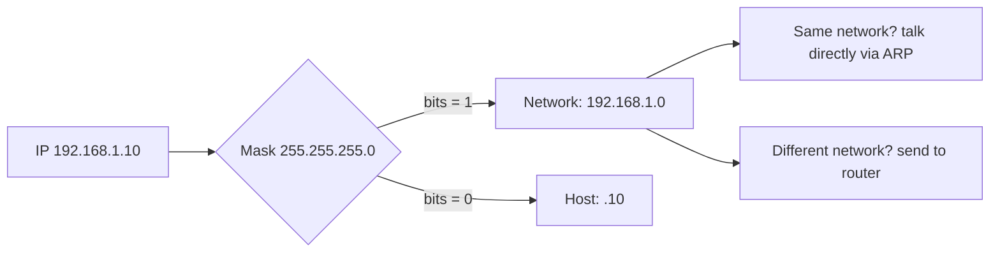
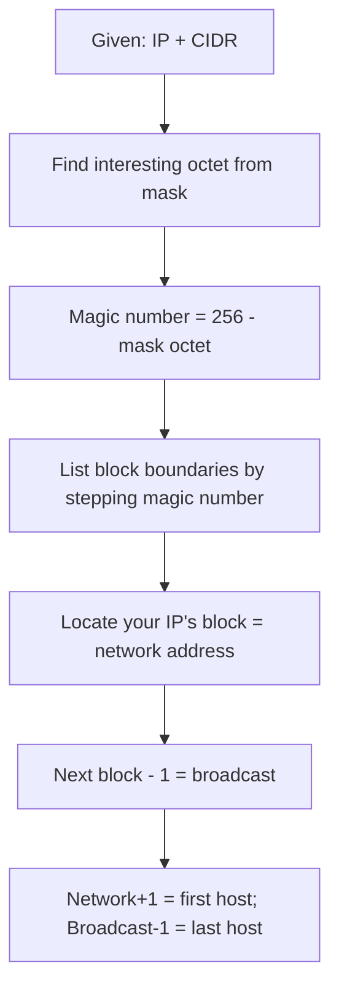
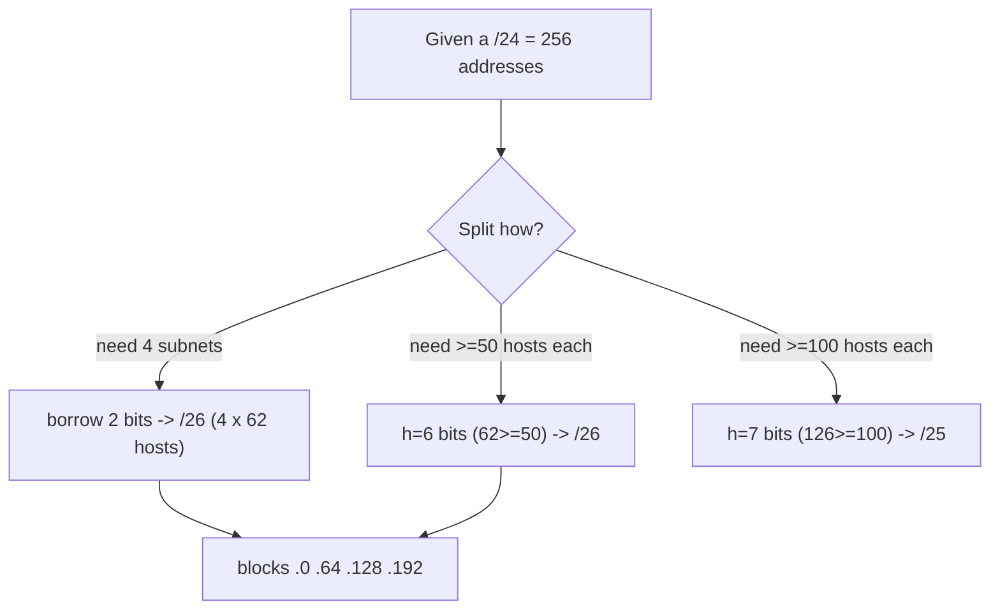

**Level:** Beginner · **Track:** Foundations · **Read time:** 125 min

This is Chapter 13 of the series. The previous chapters gave you the layered model; this one makes you fluent in the *numbers* that make Layer 3 work. Subnetting terrifies beginners and it shouldn't — it's just binary counting with a couple of rules. By the end you will read `10.0.0.0/24`, `192.168.1.128/26` or `172.16.0.0/12` and instantly know the network address, the broadcast address, how many hosts fit, and the exact range to feed Nmap. This is not academic: **defining scan scope, spotting internal ranges, sizing a target's attack surface, and reading firewall rules all depend on subnetting**, and doing it in your head is a genuine professional superpower.

We start at the true foundation — binary — because every subnetting shortcut is just a consequence of how bits work. Master the binary and the rest is arithmetic you can do on a napkin.

## Why Subnetting Matters to a Hacker (Motivation First)

Before the math, here's *why you will use this constantly*:

- **Scan scoping.** An engagement scope says "test `10.10.0.0/16`." You must know that's 65,536 addresses (`10.10.0.0`–`10.10.255.255`) so you can plan and not accidentally scan out of scope — a contractual and legal line.
- **Recognising internal networks.** Seeing `172.16.4.5` in a leaked config or an SSRF response instantly tells you "private, internal, likely reachable only from inside" — recon gold.
- **Pivoting.** After popping a box with two NICs, its second interface on `192.168.50.0/24` reveals a *new* network to attack. You have to read that CIDR to enumerate it.
- **Reading firewall/ACL rules.** `deny 10.0.0.0/8 any` means something precise; you must parse it to find gaps.
- **Efficient sweeps.** `nmap -sn 192.168.1.0/24` sweeps 254 hosts; knowing why (and how to widen/narrow it) is the difference between thorough and sloppy recon.

Now the foundation.

## Binary: The Only Prerequisite

An IPv4 address is **32 bits**, written as four **octets** (8-bit groups) in dotted-decimal: `192.168.1.10`. Each octet is a number 0–255 because 8 bits can represent 2⁸ = 256 values. To subnet, you must convert between decimal and binary comfortably. There's a trick that removes all the pain: memorise the **8 bit-position values**.

```text
Bit position:   1    2    3    4    5    6    7    8
Value:         128   64   32   16    8    4    2    1
```

Each position, left to right, is worth half the one before it (powers of two). To convert a decimal octet to binary, greedily subtract from the left:

**Example — convert 192:**
- 192 ≥ 128? Yes → bit=1, remainder 64
- 64 ≥ 64? Yes → bit=1, remainder 0
- rest are 0 → `11000000`

**Example — convert 168:**
- 168 − 128 = 40 → 1
- 40 < 64 → 0
- 40 − 32 = 8 → 1
- 8 < 16 → 0
- 8 − 8 = 0 → 1
- rest 0 → `10101000`

So `192.168.1.10` = `11000000.10101000.00000001.00001010`. Converting *back* is just adding the position values where a 1 appears: `11000000` = 128+64 = 192. 

| Decimal | Binary | How |
|---|---|---|
| 255 | 11111111 | all bits on = 128+64+32+16+8+4+2+1 |
| 192 | 11000000 | 128+64 |
| 128 | 10000000 | 128 |
| 224 | 11100000 | 128+64+32 |
| 240 | 11110000 | 128+64+32+16 |
| 0 | 00000000 | none |

> **Speed tip** — You almost never convert full addresses by hand in practice. You only need binary fluency for the *subnet-mask octet* and to understand *why* the shortcuts work. Memorise the 8 position values and the "magic numbers" table later, and you'll subnet without touching binary at all.

## Network vs Host: The Core Idea of an IP Address

Every IP address has two parts: a **network portion** (which network this host lives on) and a **host portion** (which specific host on that network). A **subnet mask** draws the boundary between them. Where the mask bit is `1`, that bit of the address is *network*; where it's `0`, it's *host*.

- Address: `192.168.1.10`
- Mask: `255.255.255.0` → `11111111.11111111.11111111.00000000`
- Network part: `192.168.1` (first 24 bits are mask=1)
- Host part: `.10` (last 8 bits are mask=0)

This means every device whose first three octets are `192.168.1` is on the same network and can talk **directly** (Layer 2); anything else must go through a **router**. That directly determines whether ARP or routing is used — tying straight back to Chapter 11's request walkthrough.



## CIDR Notation: The Shorthand You'll Live In

Writing `255.255.255.0` is tedious, so we use **CIDR** (Classless Inter-Domain Routing) notation: a slash and the number of network (mask) bits. `255.255.255.0` = **/24** (24 ones). This is the notation Nmap, firewalls, cloud consoles and every tool use.

| CIDR | Subnet mask | Network bits | Host bits | Usable hosts |
|---|---|---|---|---|
| /8 | 255.0.0.0 | 8 | 24 | 16,777,214 |
| /16 | 255.255.0.0 | 16 | 16 | 65,534 |
| /24 | 255.255.255.0 | 24 | 8 | 254 |
| /25 | 255.255.255.128 | 25 | 7 | 126 |
| /26 | 255.255.255.192 | 26 | 6 | 62 |
| /27 | 255.255.255.224 | 27 | 5 | 30 |
| /28 | 255.255.255.240 | 28 | 4 | 14 |
| /29 | 255.255.255.248 | 29 | 3 | 6 |
| /30 | 255.255.255.252 | 30 | 2 | 2 |
| /32 | 255.255.255.255 | 32 | 0 | 1 (single host) |

The two formulas that generate that whole table:

- **Total addresses in a subnet** = 2^(host bits) = 2^(32 − prefix).
- **Usable hosts** = that total **− 2** (one address is the network ID, one is the broadcast; neither can be assigned to a host).

The "−2" exception: **/31** is used for point-to-point links (2 usable, no broadcast, RFC 3021) and **/32** is a single host (used in routing and firewall rules like `allow 203.0.113.5/32`).

## The Four Numbers of Any Subnet

For any subnet you'll compute four things:

1. **Network address** — the first address; host bits all `0`. Identifies the subnet. (e.g. `192.168.1.0`)
2. **Broadcast address** — the last address; host bits all `1`. Reaches every host on the subnet. (e.g. `192.168.1.255`)
3. **First usable host** — network address + 1. (e.g. `192.168.1.1`)
4. **Last usable host** — broadcast − 1. (e.g. `192.168.1.254`)

Everything in between is assignable. For `192.168.1.0/24`: network `.0`, first host `.1`, last host `.254`, broadcast `.255`, 254 usable.

## The Magic Number Method: Subnet Without Binary

Here is the technique that lets you subnet in your head. When a subnet isn't on an octet boundary (i.e. not /8, /16, /24), the mask splits *inside* one octet. The **magic number** is `256 − (that mask octet value)`, and subnets step by that number.

**Worked example — `192.168.1.0/26`:**

1. `/26` mask = `255.255.255.192`. The "interesting octet" is the 4th, value **192**.
2. Magic number = 256 − 192 = **64**. Subnets step in 64s.
3. So the subnets in the 4th octet are: `.0`, `.64`, `.128`, `.192`.
4. Take the address `192.168.1.0` → it falls in the `.0` block: network `.0`, next block starts at `.64`, so broadcast = 64 − 1 = **`.63`**.
5. Usable range: `.1` to `.62`. Hosts = 2^(32−26) − 2 = 64 − 2 = **62**.

**Worked example — where does `192.168.1.200/26` live?**

- Magic number 64 → block boundaries `.0 .64 .128 .192`.
- `.200` is above `.192`, so it's in the **`.192`** block.
- Network `.192`, broadcast `.255`, usable `.193`–`.254`. Done — no binary needed.

**Worked example — a /20 (mask splits the 3rd octet):**

- `/20` = `255.255.240.0`. Interesting octet is the 3rd, value **240**.
- Magic number = 256 − 240 = **16**. Third-octet blocks: `.0 .16 .32 .48 ...`
- For `172.16.0.0/20`: network `172.16.0.0`, next block `172.16.16.0`, so broadcast `172.16.15.255`, hosts = 2^(32−20) − 2 = 4096 − 2 = **4094**, range `172.16.0.1`–`172.16.15.254`.



Practise this until it's automatic; it's the single most useful mental skill in this chapter.

## Subnetting In the Other Direction: Splitting a Network

Often you're asked to *split* a network into pieces. Two flavours:

**"Divide `192.168.1.0/24` into 4 equal subnets."** To make 4 subnets you need 2 more network bits (2² = 4), so /24 → **/26**. Magic number 64 gives you: `.0/26`, `.64/26`, `.128/26`, `.192/26` — four subnets of 62 hosts each.

**"I need subnets that each hold at least 50 hosts."** Hosts needed = 50 → find host bits where 2^h − 2 ≥ 50 → h = 6 gives 62 ≥ 50. Host bits 6 → prefix = 32 − 6 = **/26**. So /26 subnets each hold up to 62 hosts. If you needed 100 hosts, h=7 (126) → /25.

This "how many bits for N hosts" reasoning is **VLSM (Variable-Length Subnet Masking)** — using different mask sizes for different segments to avoid wasting addresses. Real networks (and CTF network-design questions) use it constantly.



| Hosts needed | Host bits (2^h − 2 ≥ N) | Prefix |
|---|---|---|
| 2 | 2 (/30, 2 hosts) | /30 |
| ≤ 6 | 3 | /29 |
| ≤ 14 | 4 | /28 |
| ≤ 30 | 5 | /27 |
| ≤ 62 | 6 | /26 |
| ≤ 126 | 7 | /25 |
| ≤ 254 | 8 | /24 |

## The Legacy Class System (Know It, Don't Use It)

Before CIDR (pre-1993), IP space was carved into fixed **classes**. You must recognise the terms because old docs, tools and exams use them, and "classful" defaults still lurk in some software.

| Class | First octet range | Default mask | Default prefix | Purpose |
|---|---|---|---|---|
| A | 1–126 | 255.0.0.0 | /8 | Huge networks |
| B | 128–191 | 255.255.0.0 | /16 | Medium |
| C | 192–223 | 255.255.255.0 | /24 | Small |
| D | 224–239 | — | — | Multicast |
| E | 240–255 | — | — | Experimental/reserved |

Note `127.x` (loopback) sits inside the old Class A range but is reserved. **CIDR replaced classes** so masks can be any length (/12, /20, /26) rather than forced to /8, /16 or /24 — that flexibility is why we say "classless."

## Special & Reserved Ranges Every Hacker Recognises

Instant recognition of these is a recon reflex:

| Range | CIDR | Meaning |
|---|---|---|
| 10.0.0.0–10.255.255.255 | 10.0.0.0/8 | Private (RFC 1918) |
| 172.16.0.0–172.31.255.255 | 172.16.0.0/12 | Private (RFC 1918) |
| 192.168.0.0–192.168.255.255 | 192.168.0.0/16 | Private (RFC 1918) |
| 127.0.0.0–127.255.255.255 | 127.0.0.0/8 | Loopback (localhost) |
| 169.254.0.0–169.254.255.255 | 169.254.0.0/16 | Link-local / APIPA (no DHCP) |
| 169.254.169.254 | /32 | **Cloud metadata endpoint** (SSRF gold) |
| 100.64.0.0–100.127.255.255 | 100.64.0.0/10 | Carrier-grade NAT |
| 224.0.0.0+ | 224.0.0.0/4 | Multicast |
| 0.0.0.0 | /32 | "This host" / any |

`169.254.169.254` deserves a star: it's the **cloud instance metadata service** on AWS/GCP/Azure. An SSRF that reaches it can steal IAM credentials — one of the highest-impact web bugs. You only recognise it because you know the link-local range.

## Hands-On Lab: Subnetting With Real Tools

Verify your hand-math with tools, and learn the recon workflow.

### Step 1 — `ipcalc`, the subnetting Swiss army knife

```bash
sudo apt install -y ipcalc
ipcalc 192.168.1.0/26
```

```text
Address:   192.168.1.0          11000000.10101000.00000001.00 000000
Netmask:   255.255.255.192 = 26 11111111.11111111.11111111.11 000000
Wildcard:  0.0.0.63             00000000.00000000.00000000.00 111111
=>
Network:   192.168.1.0/26       11000000.10101000.00000001.00 000000
HostMin:   192.168.1.1          ...01
HostMax:   192.168.1.62         ...10 111110
Broadcast: 192.168.1.63         ...00 111111
Hosts/Net: 62                    Class C, Private Internet
```

Compare it to what you computed with the magic-number method — they match. Note the **wildcard mask** (`0.0.0.63`), which is the inverse of the subnet mask and is what Cisco ACLs and OSPF use.

### Step 2 — Enumerate a range with `nmap`

```bash
# Ping-sweep a /24 to find live hosts (host discovery only, no port scan)
nmap -sn 192.168.1.0/24

# Scan a precise range you derived by subnetting:
nmap -sn 192.168.1.1-62          # just the /26's usable hosts
nmap -p- 10.10.0.0/16 --open     # every port on a /16 (65k hosts — huge!)
```

Understanding `/24` vs `/16` here is the difference between a 2-minute sweep and one that runs for hours. Subnetting is what lets you *right-size* the scan to the scope.

### Step 3 — List every address in a subnet with `prips` / `nmap -sL`

```bash
nmap -sL 192.168.1.0/28        # list scan: prints the 16 addresses, no packets sent
# or
sudo apt install -y prips
prips 192.168.1.0/28
# 192.168.1.0 ... 192.168.1.15
```

`nmap -sL` is a safe way to expand a CIDR to confirm your scope before sending a single packet — great for double-checking you're inside the rules of engagement.

### Step 4 — Read your own subnet and compute reach

```bash
ip -o -f inet addr show          # e.g. inet 192.168.1.37/24
ip route                          # default via 192.168.1.1
```

From `192.168.1.37/24` you now instantly know: your network is `192.168.1.0`, you can reach `.1`–`.254` directly (ARP), and anything else goes to the gateway `192.168.1.1`. That's the routing decision, derived by subnetting.

## Advanced: Supernetting, Route Summarisation & IPv6 Subnetting

**Supernetting (aggregation)** is the reverse of subnetting: combining multiple small networks into one larger CIDR to shrink routing tables. `192.168.0.0/24` + `192.168.1.0/24` + `192.168.2.0/24` + `192.168.3.0/24` summarise to `192.168.0.0/22` (4 × /24 = /22). BGP relies on this to keep the global routing table manageable. For a pentester, spotting that a firewall rule uses a summary like `10.0.0.0/8` tells you the *whole* private range is treated uniformly — often a gap to probe.

**IPv6 subnetting** is simpler in one way: addresses are 128 bits in hex, and the convention is that the network gets a **/64** (leaving 64 bits — 18 quintillion — for hosts), while an organisation typically receives a **/48** (giving 65,536 /64 subnets). You rarely do host-count math in IPv6; you slice the routing prefix. Example: `2001:db8:acad::/48` → subnets `2001:db8:acad:0::/64`, `2001:db8:acad:1::/64`, … The security catch: IPv6's vast host space makes brute-force host discovery infeasible, so recon shifts to DNS, multicast (`ff02::1` = all nodes), and NDP.

## Common Pitfalls & How to Overcome Them

- **Off-by-one on broadcast.** The broadcast is `next block start − 1`, not `network + hosts`. Use the magic-number block boundaries and it's foolproof.
- **Forgetting the −2.** A /24 has 256 addresses but only **254 usable** hosts. Cloud VPCs and /31 point-to-point links are exceptions.
- **Confusing /24 subnet mask value.** `/24` = `255.255.255.0`, not `255.255.0.0` (that's /16). Count the ones.
- **Assuming same first-three-octets = same network.** Only true at /24. At /26, `.10` and `.100` are in *different* subnets. Always check the prefix.
- **Scanning out of scope.** Misreading `/16` as `/24` (or vice versa) can put you outside authorised ranges — a legal problem. Confirm with `nmap -sL` first.
- **Ignoring the wildcard mask direction** when writing Cisco ACLs — it's the *inverse* of the subnet mask.

> **Memory hook** — Keep the **magic-number** table in your head: mask octet → block size. `128→128, 192→64, 224→32, 240→16, 248→8, 252→4, 254→2`. That single row lets you subnet any prefix instantly.

## Real-World Application & Case Studies

- **Engagement scoping** — every SOW (statement of work) defines targets in CIDR. Reading it correctly is step one of legal, in-scope testing.
- **Cloud VPC design** — AWS/Azure/GCP force you to define subnets in CIDR (`10.0.1.0/24` for public, `10.0.2.0/24` for private). Misconfigured, over-broad security-group CIDRs (`0.0.0.0/0` = the whole internet on port 22) are among the most common cloud findings.
- **Pivoting in real breaches** — post-exploitation, reading a compromised host's second-interface subnet reveals the internal network to pivot into; this is standard in HTB pro-labs and real red-team ops.
- **The 2019 Capital One breach** hinged on an SSRF reaching `169.254.169.254` — recognising that link-local metadata address is exactly the subnetting knowledge here, applied.

> **Bug Bounty Angle** — Subnetting itself isn't a bug, but it's the lens for high-value ones. **SSRF impact** is judged by *what internal ranges you can reach* — reaching `169.254.169.254` or `10.x`/`192.168.x` services turns a medium into a critical, and you must articulate that in the report ("this SSRF reaches the RFC 1918 range `10.0.0.0/8`, including the internal admin panel at `10.0.5.20`"). In **recon**, expanding a target's ASN into its CIDR blocks (Chapter 11) and then subnetting to prioritise likely-live ranges is how top hunters find forgotten assets. Cloud programs also pay for **over-permissive CIDR** in security groups. Always translate raw IPs into "which network, how reachable" — that framing is what makes a report payable.

> **CTF Angle** — Networking/misc challenges love subnetting: "how many usable hosts in `10.0.0.0/22`?" (answer 1022), "what's the broadcast of `172.16.34.0/23`?" (`172.16.35.255`). On HTB/THM boxes, after a foothold you'll `ip a` and find a second subnet — subnetting tells you exactly what range to `nmap` next (`for i in $(seq 1 254); do ping -c1 -W1 192.168.50.$i; done`). Keep `ipcalc` and `nmap -sL` handy to check answers fast. Practice: TryHackMe "Subnetting", subnettingpractice.com, and the network questions in picoCTF "General Skills."

## Detection & Defense: Subnetting as a Security Control

Subnets are a **security boundary**, not just an addressing convenience:

- **Segmentation** — putting servers, workstations, IoT and management on separate subnets/VLANs limits blast radius. A well-subnetted network means a compromised IoT device on `192.168.30.0/24` can't trivially reach the finance server on `192.168.10.0/24` — the router/firewall between them enforces policy.
- **Detecting scans across subnets** — a host probing addresses across a whole /24 in seconds is doing host discovery; SIEM rules flag "N distinct destination IPs in one subnet from one source in M seconds."
- **Egress/ingress ACLs** — anti-spoofing rules (BCP 38) drop packets whose source IP doesn't belong to the subnet they arrived on — pure subnet math applied as defence.
- **Microsegmentation / zero trust** — modern designs shrink subnets to the extreme (even /32 per workload) so lateral movement is nearly impossible without policy approval.

A blue-teamer reads a firewall ruleset the same way you do: parsing each CIDR to find the rule that's too broad. The skill is identical; only the intent differs.

## Final Revision / Summary

- An IPv4 address is **32 bits** = four octets (0–255). Binary position values: **128 64 32 16 8 4 2 1**.
- A **subnet mask / CIDR prefix** splits network bits (mask=1) from host bits (mask=0). `/24` = `255.255.255.0`.
- **Total addresses** = 2^(32−prefix); **usable hosts** = that − 2 (network + broadcast reserved).
- **Four numbers per subnet**: network (host bits all 0), broadcast (all 1), first host (network+1), last host (broadcast−1).
- **Magic number = 256 − interesting-mask-octet**; subnets step by it. This is the fast mental method — master it.
- **VLSM**: pick the prefix from host count (2^h − 2 ≥ N). **Supernetting** aggregates routes.
- Recognise instantly: **RFC 1918 private** (10/8, 172.16/12, 192.168/16), **loopback** 127/8, **link-local** 169.254/16, and the **cloud metadata** `169.254.169.254`.
- Tools: `ipcalc` (verify), `nmap -sL`/`prips` (expand a CIDR safely), `nmap -sn` (sweep), `ip addr`/`ip route` (your own reach).

## Cheat Sheet / Quick Reference

```text
BINARY POSITIONS:  128 64 32 16 8 4 2 1

MAGIC NUMBER (block size) by mask octet:
 mask 128 -> 128 | 192 -> 64 | 224 -> 32 | 240 -> 16
 mask 248 ->   8 | 252 ->  4 | 254 ->  2 | 255 -> 1 (/32)

CIDR   MASK               HOSTS(usable)   BLOCK(4th octet)
/24    255.255.255.0      254             256
/25    255.255.255.128    126             128
/26    255.255.255.192    62              64
/27    255.255.255.224    30              32
/28    255.255.255.240    14              16
/29    255.255.255.248    6               8
/30    255.255.255.252    2               4
/31    255.255.255.254    2 (p2p, no bcast)
/32    255.255.255.255    1 (single host)

FORMULAS: total=2^(32-prefix)  usable=total-2  subnets=2^(borrowed bits)

PRIVATE: 10.0.0.0/8  172.16.0.0/12  192.168.0.0/16
LOOPBACK 127.0.0.0/8  LINK-LOCAL 169.254.0.0/16  METADATA 169.254.169.254
```

```bash
ipcalc 192.168.1.0/26            # full subnet breakdown + binary
nmap -sL 10.0.0.0/24             # expand CIDR without scanning (scope check)
nmap -sn 192.168.1.0/24          # ping sweep a subnet
prips 192.168.1.0/28             # list every IP in a range
ip -o -f inet addr show          # your IP + prefix
```

## Practice Labs & Resources

- **subnettingpractice.com** and **subnetipv4.com**: endless auto-graded subnetting drills — do 10 a day for a week and it becomes reflex.
- **TryHackMe — "Subnetting"** and **"Networking Concepts"**: guided, hands-on.
- **Cisco Packet Tracer / Networking Academy "IP Addressing" labs**: design and verify subnets on real (virtual) gear.
- **HTB / THM multi-host networks** (e.g. THM "Wreath", HTB "Dante"/pro-labs): practise reading a foothold's subnet and pivoting — subnetting under real conditions.
- **`ipcalc` and `sipcalc`**: keep them installed; check every hand-calculation until you trust yourself.
- **Exercise** — take five random `IP/prefix` pairs daily and write network, broadcast, range and host count from memory, then verify with `ipcalc`.

Next we drop to Layer 2 and get concrete about the *local* network: **Ethernet, MAC addresses, switching, ARP and VLANs** — including the ARP-spoofing man-in-the-middle attack that this chapter's subnet boundaries make possible.

---

*Also on [Praneeth's portfolio](https://ping-praneeth.vercel.app/notebook/networking/03-ip-addressing-binary-math-subnetting-and-cidr-mastery), with comments and the latest edits.*
