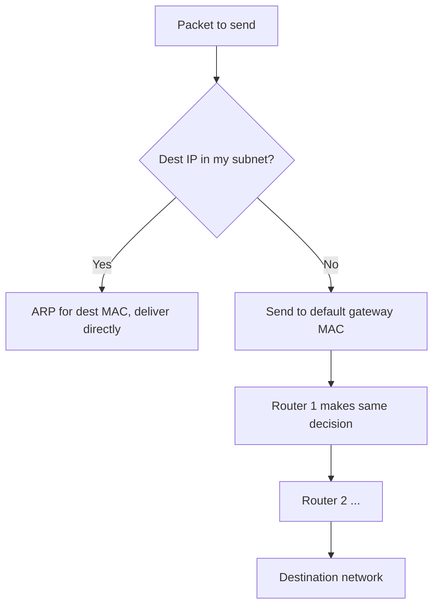
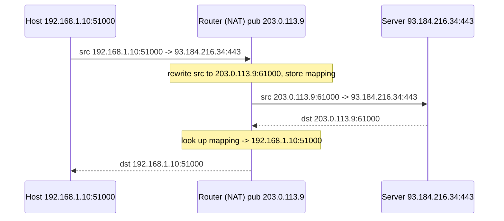
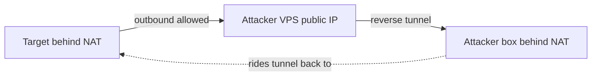

**Level:** Beginner · **Track:** Foundations · **Read time:** 110 min

This is Chapter 15 of the series. The previous chapter kept us on the *local* segment with Ethernet and ARP. Now we answer the bigger question: **how does a packet get from your subnet to a server on another continent?** The answer is **routing** — the hop-by-hop forwarding of packets between networks — and **NAT**, the trick that lets millions of privately-addressed devices share a handful of public IPs. For a hacker these are not trivia: routing tables reveal how to **pivot** through a compromised host, NAT explains why you can't just connect back to a box behind a home router, and port forwarding is exactly how you *do* get that reverse shell through. Master this and post-exploitation networking stops being guesswork.

## The Big Picture: Local vs Remote, and the Gateway

Every host, before sending a packet, makes one decision: **is the destination on my local network, or somewhere else?** It answers using its own IP and subnet mask (Chapter 13):

- **Local** (same subnet) → deliver directly on Layer 2 via ARP (Chapter 14).
- **Remote** (different subnet) → hand the packet to the **default gateway** (the router), which forwards it onward.

The **default gateway** is the router's IP on your subnet — the "door out" of your network. Your host doesn't know the path to Tokyo; it only knows "anything not local, give to the gateway, and trust it to figure out the next step." Each router along the way makes the same local decision independently. That distributed, hop-by-hop cooperation *is* the internet's routing.



## The Routing Table: Every Device Has One

Routing decisions come from the **routing table** — an ordered list of "to reach network X, send to next-hop Y via interface Z." Your laptop has one; so does every router. View yours:

```bash
ip route show
# default via 192.168.1.1 dev eth0 proto dhcp metric 100
# 192.168.1.0/24 dev eth0 proto kernel scope link src 192.168.1.10
```

Read it line by line:

- **`192.168.1.0/24 dev eth0 ... scope link`** — "the `192.168.1.0/24` network is directly connected on `eth0`; reach it without a router." This is a **connected route**.
- **`default via 192.168.1.1`** — "for *everything else* (`0.0.0.0/0`), send to `192.168.1.1`." This is the **default route / gateway**.

The matching rule is **longest-prefix match**: the router picks the *most specific* route (largest prefix) that contains the destination. A route to `10.5.0.0/16` beats a `10.0.0.0/8` route for a `10.5.x.x` destination; the `default` (`/0`) is the least specific and only used when nothing else matches.

```bash
ip route get 8.8.8.8       # ask the kernel which route it WOULD use
# 8.8.8.8 via 192.168.1.1 dev eth0 src 192.168.1.10
ip route get 192.168.1.20  # local -> no "via", direct on eth0
```

`ip route get` is a superb debugging tool: it tells you exactly how a packet to any destination will be forwarded, resolving the longest-prefix logic for you.

| Route type | Example | Meaning |
|---|---|---|
| Connected | `192.168.1.0/24 dev eth0` | Directly attached network |
| Default | `default via 192.168.1.1` | Gateway of last resort (`0.0.0.0/0`) |
| Static | `10.10.0.0/16 via 192.168.1.254` | Manually added route |
| Host | `203.0.113.5/32 via ...` | Route to a single host |
| Blackhole | `blackhole 10.6.6.0/24` | Silently drop matching packets |

## Static vs Dynamic Routing

**Static routing** means an admin manually configures routes. Simple, predictable, no protocol overhead, and secure (nothing to spoof) — but it doesn't adapt: if a link fails, packets keep heading into the void until someone fixes the table. Good for small or stub networks.

```bash
# Add a static route (this session): reach 10.10.0.0/16 via a second router
sudo ip route add 10.10.0.0/16 via 192.168.1.254 dev eth0
sudo ip route del 10.10.0.0/16          # remove it
```

**Dynamic routing** means routers *talk to each other* using a routing protocol and build their tables automatically, adapting to failures and new links. The families:

| Protocol | Type | Scope | Metric | Notes |
|---|---|---|---|---|
| **RIP** | Distance-vector | Small internal | Hop count (max 15) | Old, simple, slow to converge |
| **OSPF** | Link-state | Enterprise internal (IGP) | Cost (bandwidth) | Fast, scalable, widely used |
| **EIGRP** | Advanced DV | Cisco internal | Composite | Cisco-centric |
| **BGP** | Path-vector | Between ASes (EGP) | Policy/AS-path | The internet's backbone protocol |

**Distance-vector** routers share their whole table with neighbours ("I can reach X in N hops"); **link-state** routers share a map of their links and each computes shortest paths (Dijkstra). **BGP** is special — it routes *between* organisations (Autonomous Systems, Chapter 11) using policy, and it's what glues the global internet together.

```mermaid
flowchart LR
    subgraph "Inside an org (IGP: OSPF/RIP)"
    A[Router A] --- B[Router B] --- C[Router C]
    end
    C -->|BGP (EGP)| I[Another AS / ISP]
    I --> NET[Rest of the Internet]
```

**Routing security matters:** these protocols historically trust their peers. Injecting false OSPF/RIP updates or hijacking BGP routes reroutes traffic through an attacker (BGP hijacks have stolen crypto and rerouted national traffic). Defences: authentication on routing adjacencies, route filtering, and RPKI for BGP.

## NAT: How Private Hosts Reach the Public Internet

Here's the puzzle from Chapter 13: your laptop has a **private** IP (`192.168.1.10`) that isn't routable on the internet, yet it browses fine. **NAT (Network Address Translation)** is the fix. Your router rewrites the **source IP** of outgoing packets from your private address to its single **public** address, records the mapping, and reverses it on the replies. To the outside world, every device in your home appears to come from one public IP.

The specific, ubiquitous form is **PAT (Port Address Translation)**, a.k.a. **NAT overload** or **masquerading**: because many hosts share one public IP, the router also rewrites the **source port** and uses the `(public IP : unique port)` pair to remember which internal host each flow belongs to.



The NAT translation table conceptually:

| Internal (private) | External (public) | Destination |
|---|---|---|
| 192.168.1.10:51000 | 203.0.113.9:61000 | 93.184.216.34:443 |
| 192.168.1.11:52000 | 203.0.113.9:61001 | 142.250.72.14:443 |

### Types of NAT

- **Static NAT** — one private ↔ one public, permanent (e.g. a server that must be reachable from outside).
- **Dynamic NAT** — private addresses map to a pool of public ones, first-come-first-served.
- **PAT / NAT overload** — many private → one public via port multiplexing. This is what home/office routers do.

Why security cares about NAT:

- **It's an implicit inbound firewall.** Unsolicited inbound connections have no mapping, so the router drops them. This is *why you can't directly connect back to a host behind NAT* — and why reverse shells and pivoting need extra tricks.
- **It breaks a naive reverse shell.** If your target is behind NAT and *you* are behind NAT, a plain `nc` reverse shell won't connect without port forwarding on one side.
- **Source-IP attribution blurs.** Hundreds of users behind one public IP (or carrier-grade NAT, `100.64.0.0/10`) means logs show one IP for many people — relevant to both offence (blend in) and defence (can't ban one user cleanly).

## Port Forwarding: Punching a Hole Inbound

Because NAT blocks unsolicited inbound traffic, to expose an internal service (a web server, a game host, or your listener during an engagement) you configure **port forwarding**: "any traffic arriving at my public IP on port X, send to internal host Y port Z." This is a *static inbound* NAT rule.

```bash
# On a Linux router with iptables/nftables: forward public :8080 -> internal web server :80
sudo iptables -t nat -A PREROUTING -p tcp --dport 8080 -j DNAT --to 192.168.1.50:80
sudo iptables -t nat -A POSTROUTING -j MASQUERADE
```

For offensive work this matters directly: to catch a reverse shell from a target when your attacking box is behind a home router, you either forward a port on your router to your listener, or (more common in modern ops) use an intermediary — a cloud VPS with a public IP, or a tunneling tool (`ngrok`, `chisel`, `ligolo-ng`) that establishes an *outbound* connection you can ride back in on. Pivoting and tunneling get a full chapter later; the reason they exist is the NAT behaviour you just learned.



## The Router as a Host: Enabling Forwarding

A Linux box becomes a router by enabling **IP forwarding** — the kernel setting that lets it forward packets between interfaces rather than only handling its own. You saw this exact toggle in the ARP-spoofing lab (to keep the victim's traffic flowing through you):

```bash
# Check and enable IPv4 forwarding
cat /proc/sys/net/ipv4/ip_forward           # 0 = off
echo 1 | sudo tee /proc/sys/net/ipv4/ip_forward
# Persist it:
echo 'net.ipv4.ip_forward=1' | sudo tee -a /etc/sysctl.conf && sudo sysctl -p
```

This is why a compromised **dual-homed host** (one NIC on `192.168.1.0/24`, another on `10.10.0.0/24`) is a jackpot: enable forwarding (or run a proxy through it) and it becomes your router into the second, otherwise-unreachable network. Reading its routing table tells you exactly what new subnets you can now reach.

## Hands-On Lab: Trace, Read, and Manipulate Routing

### Step 1 — Map your own routing

```bash
ip route show                 # your table
ip route get 1.1.1.1          # how a packet to 1.1.1.1 is forwarded
ip route get 192.168.1.5      # local vs remote decision, resolved
ip -6 route show              # don't forget IPv6 routing
```

### Step 2 — Watch the hop-by-hop path

```bash
traceroute 1.1.1.1            # each line is one router (hop) on the path
mtr 1.1.1.1                   # live, continuous traceroute+ping
```

Every hop is a router making the local/remote decision from this chapter. The first hop is *your* default gateway; the last is the destination's network. `* * *` hops are routers configured not to reply (common on firewalls).

### Step 3 — See your NAT translation in action

```bash
# Your private IP:
ip -4 addr show | grep inet
# Your public IP as the world sees it (post-NAT):
curl -s ifconfig.me ; echo
# On a Linux router, watch live NAT mappings:
sudo conntrack -L 2>/dev/null | head       # or: cat /proc/net/nf_conntrack
```

The gap between your private IP and `curl ifconfig.me` *is* NAT: your router rewrote the source so the echo service saw its public address.

### Step 4 — Build a mini-router (lab)

On a VM with two interfaces, enable forwarding and add a masquerade rule, then set a second VM's gateway to it and confirm it can reach a network only the router touches. This tiny setup is exactly the pivot scenario, and doing it once makes post-exploitation routing obvious.

```bash
# On the "router" VM:
echo 1 | sudo tee /proc/sys/net/ipv4/ip_forward
sudo iptables -t nat -A POSTROUTING -o eth0 -j MASQUERADE
# On the client VM:
sudo ip route add default via <router-inner-ip>
```

## Advanced: Asymmetric Routing, Policy Routing & Route Injection

- **Asymmetric routing** — packets take one path out and a different path back. Common on the internet and a headache for **stateful firewalls**, which expect to see both directions of a flow. If they don't, they may drop return traffic. Attackers sometimes exploit asymmetry to evade inspection.
- **Policy-based routing (PBR)** — route by more than destination (by source, port, or marking). `ip rule` on Linux implements multiple routing tables — useful for multi-homed hosts and for splitting VPN vs normal traffic.
- **Route injection / redistribution attacks** — injecting crafted routes (via a compromised router or spoofed routing-protocol updates) to pull traffic through the attacker; the Layer-3 cousin of ARP spoofing. Mitigated by routing authentication and filtering.
- **Blackhole / null routing** — deliberately routing malicious or DDoS traffic to `blackhole`/`Null0` to drop it; a real defensive technique (RTBH — Remotely Triggered Black Hole).

## Common Pitfalls & How to Overcome Them

- **Confusing "gateway" with "DNS server."** The gateway routes packets; DNS resolves names. Both come from DHCP but do different jobs. A working gateway with broken DNS = "I can ping 8.8.8.8 but not load websites."
- **Expecting a reverse shell to a NATed host to just work.** No inbound mapping exists — you need port forwarding or an outbound tunnel. This trips up nearly every beginner in CTFs.
- **Forgetting longest-prefix match.** A specific `/24` static route silently overrides your default; if traffic "disappears," dump the full table and check for a more-specific route.
- **Leaving IP forwarding on** after a lab/MITM — a security risk on your own box; turn it back off (`echo 0 > /proc/sys/net/ipv4/ip_forward`).
- **Assuming traceroute shows the return path.** It shows the *forward* path only; asymmetric routing means replies may come a different way.

> **Memory hook** — Two questions a router forever asks: *"Is it mine (connected)?"* and if not, *"who's the most specific next hop?"* NAT adds a third at the border: *"whose reply is this?"* — answered by the translation table.

## Real-World Application & Case Studies

- **Pivoting** — the single biggest practical use. Pop a dual-homed box, read `ip route`, discover a `10.x` back-end network, enable forwarding or run `chisel`/`ligolo-ng`, and attack systems you could never reach directly. This is the crux of nearly every multi-machine HTB/OSCP scenario.
- **Home-router pentests** — misconfigured port forwarding and UPnP (which lets apps open inbound ports automatically) expose internal services to the internet; a classic IoT finding.
- **BGP hijacks** — the 2018 MyEtherWallet incident rerouted DNS via a BGP hijack to steal crypto; the 2008 "Pakistan vs YouTube" leak took YouTube offline globally. Routing security is national-infrastructure-level serious.
- **Cloud routing** — AWS route tables, NAT gateways and security groups are this chapter in cloud form; over-broad routes and misconfigured NAT gateways are frequent audit findings.

> **Bug Bounty Angle** — Routing/NAT rarely is *itself* the bug in a web program, but it underpins high-severity classes. **SSRF** severity is a routing question: can the server-side request reach internal/`169.254.169.254`/`10.x` destinations the internet can't? If yes, you've "routed" into the internal network — say so explicitly. **Exposed admin panels / services** often result from a careless port-forward or a NAT gateway with an over-broad security group (`0.0.0.0/0`), which programs pay for. In **recon**, finding an origin server that's reachable directly (bypassing the CDN) is essentially defeating the intended routing/edge. Frame impact as "reachability an attacker should not have," and quantify which networks the flaw exposes.

> **CTF Angle** — Routing is central to **multi-host / pivot** CTFs (OSCP-style, HTB pro labs, THM "Wreath"/"Holo"). The pattern: get a shell, run `ip route`/`ip a`, spot a second subnet, then tunnel (`chisel`, `ligolo-ng`, `ssh -L/-D` + `proxychains`) to scan and exploit it. Speed reflexes: `ip route get <ip>` to test reach, upload a static `nmap`/`ping` sweep for the new subnet, and set up a SOCKS proxy so your local tools reach the internal net. For reverse shells behind NAT, remember you need the *target* to connect *out* to you. Practice: THW "Wreath", HTB "Dante"/"Zephyr", TryHackMe "Wreath Network Pivoting".

## Detection & Defense: Routing as a Control (Blue Team)

- **Segmentation via routing + ACLs** — the router/firewall between subnets is where you enforce "workstations may not talk to the database subnet." Routing decides reachability; ACLs decide policy. Tight inter-subnet rules are the number-one mitigation against lateral movement.
- **Egress filtering** — restrict *outbound* traffic (only allow needed ports/destinations). This breaks reverse shells and C2 beaconing, which rely on the target connecting out. A network that blocks arbitrary outbound is dramatically harder to pivot from.
- **Detecting pivots** — a host suddenly forwarding traffic between subnets, or an internal box making unusual cross-subnet connections, is a red flag. NetFlow/conntrack anomalies and "internal host acting as a router" alerts catch it.
- **Routing-protocol hardening** — authenticate OSPF/BGP adjacencies, filter routes, deploy RPKI; monitor for unexpected route changes (route-leak detection services).
- **Anti-spoofing (BCP 38 / uRPF)** — drop packets whose source IP couldn't legitimately arrive on that interface, killing IP-spoofing-based attacks at the border.

The defender's mantra mirrors the attacker's: control **reachability**. Every subnet boundary is a chance to deny a pivot.

## Final Revision / Summary

- Hosts decide **local vs remote** by subnet mask; remote traffic goes to the **default gateway** (`0.0.0.0/0` route).
- The **routing table** lists connected, static and default routes; forwarding uses **longest-prefix match**. `ip route get <ip>` resolves the decision for you.
- **Static routing** = manual, predictable; **dynamic routing** = protocols (RIP/OSPF/EIGRP internally, **BGP** between organisations) that adapt automatically.
- **NAT** rewrites private source IPs to a public one; **PAT/overload** multiplexes many hosts over one public IP using ports. It's an implicit inbound firewall — which is why **reverse shells to NATed hosts need port forwarding or outbound tunnels**.
- Enabling **IP forwarding** turns a Linux host into a router — the basis of MITM and **pivoting** through dual-homed boxes.
- Defence = control **reachability**: segmentation + ACLs, egress filtering, routing authentication, anti-spoofing.
- Tools: `ip route`, `ip route get`, `traceroute`/`mtr`, `curl ifconfig.me`, `conntrack`, `iptables ... MASQUERADE/DNAT`.

## Cheat Sheet / Quick Reference

```bash
# READ ROUTING
ip route show                          # routing table
ip route get 8.8.8.8                   # which route/gateway a dest uses
traceroute 1.1.1.1  /  mtr 1.1.1.1     # map hops
ip -6 route show                       # IPv6 routes

# MODIFY ROUTES (lab)
sudo ip route add 10.10.0.0/16 via 192.168.1.254
sudo ip route del 10.10.0.0/16
sudo ip route add default via 192.168.1.1

# NAT / FORWARDING (router / pivot)
echo 1 | sudo tee /proc/sys/net/ipv4/ip_forward
sudo iptables -t nat -A POSTROUTING -o eth0 -j MASQUERADE          # PAT
sudo iptables -t nat -A PREROUTING -p tcp --dport 8080 \
     -j DNAT --to 192.168.1.50:80                                  # port forward
sudo conntrack -L                      # live NAT/connection table

# NAT VISIBILITY
curl -s ifconfig.me                    # your post-NAT public IP
```

```text
ROUTE TYPES: connected (dev) | default 0.0.0.0/0 | static (via) | host /32 | blackhole
MATCH RULE:  longest-prefix wins (most specific route)
NAT TYPES:   static (1:1) | dynamic (pool) | PAT/overload (many:1 via ports)
KEY IDEA:    NAT blocks unsolicited inbound -> reverse shells need fwd/tunnel
IGP: RIP/OSPF/EIGRP (inside an org)   EGP: BGP (between organisations)
```

## Practice Labs & Resources

- **TryHackMe — "Wreath"** (network pivoting), **"Intro to Networking"**, **"Router" rooms**: routing and pivoting hands-on.
- **HTB — "Dante" / "Zephyr" pro labs** and any multi-host box: real routing-table reading and tunneling.
- **GNS3 / Cisco Packet Tracer**: configure static routes, OSPF, and NAT/PAT on virtual routers — watch a routing table converge.
- **Chisel / ligolo-ng / sshuttle docs**: the modern pivot toolkit that exists *because* of NAT — read them alongside this chapter.
- **Cloudflare Learning Center — "What is routing? / What is BGP?"** and **"What is NAT?"**: clean reference reads.
- **Exercise** — build the two-VM mini-router lab, prove the client reaches a network only the router touches, then tear it down and reproduce it as a `chisel` SOCKS pivot. Same concept, two tools.

Next we go deep on the transport layer's reliable workhorse: **TCP — the three-way handshake, flags, sequence numbers and connection states** — the protocol behind every port scan, every reverse shell, and every web request.

---

*Also on [Praneeth's portfolio](https://ping-praneeth.vercel.app/notebook/networking/05-routing-nat-and-the-default-gateway), with comments and the latest edits.*
