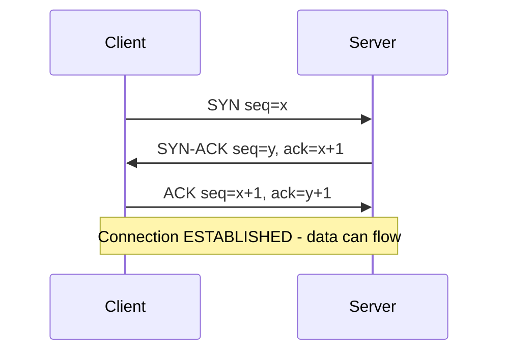
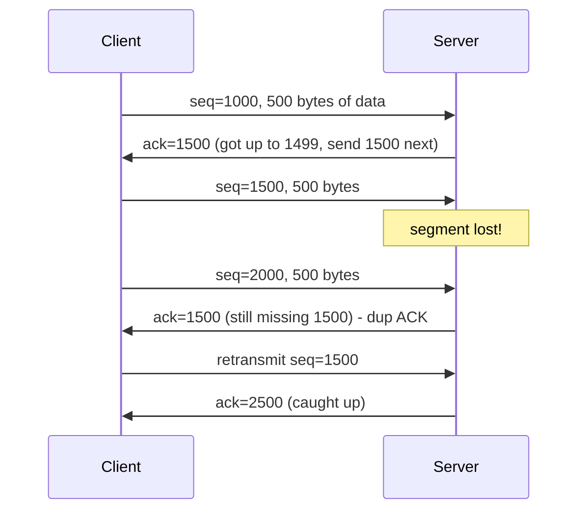
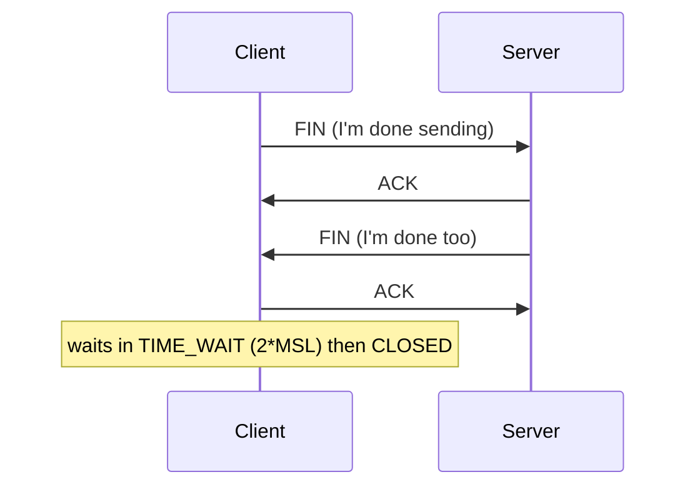

This is Chapter 16 of the series. We're at the transport layer now, and no single protocol matters more to a hacker than **TCP**. Every port scan interprets TCP replies. Every reverse shell, every Burp request, every SSH session rides on a TCP connection. When you understand the three-way handshake, the flag bits, sequence numbers and the connection state machine, you can read a scan's output like a story, explain *why* a stealth scan is stealthy, craft packets with `hping3`/Scapy, and recognise a SYN flood or a hijack attempt on sight. This chapter turns TCP from a black box into something you can operate byte by byte.

## Why TCP Exists: Reliability on an Unreliable Network

Recall from Chapter 11 that IP is **best-effort** — packets can be lost, duplicated, reordered or delayed, and IP doesn't care. That's fine for a video frame but catastrophic for a bank transfer or a file download. **TCP (Transmission Control Protocol, RFC 793)** is the layer that adds, on top of IP, everything the network itself refuses to guarantee:

- **Connection-oriented** — a session is established before data flows (the handshake).
- **Reliable** — every byte is acknowledged; lost data is retransmitted.
- **Ordered** — bytes are numbered so the receiver reassembles them in order even if packets arrive scrambled.
- **Flow-controlled** — the receiver advertises how much it can accept (window) so a fast sender doesn't overwhelm a slow receiver.
- **Congestion-controlled** — TCP backs off when the network is congested, preventing collapse.

The mental model: **UDP is a postcard** (drop it in the box, hope it arrives, no confirmation); **TCP is a registered phone call** (you dial, both sides say hello, every sentence is acknowledged, and you formally hang up). That reliability costs overhead — a handshake, per-byte bookkeeping, retransmit timers — which is exactly the trade-off you weigh when you meet UDP in the next chapter.

## The TCP Header, Field by Field

Everything TCP does is encoded in its 20-byte (minimum) header. You must be able to read it, because scanners and crafting tools manipulate these exact fields.

```text
 0                   1                   2                   3
 0 1 2 3 4 5 6 7 8 9 0 1 2 3 4 5 6 7 8 9 0 1 2 3 4 5 6 7 8 9 0 1
+-+-+-+-+-+-+-+-+-+-+-+-+-+-+-+-+-+-+-+-+-+-+-+-+-+-+-+-+-+-+-+-+
|          Source Port          |       Destination Port        |
+-+-+-+-+-+-+-+-+-+-+-+-+-+-+-+-+-+-+-+-+-+-+-+-+-+-+-+-+-+-+-+-+
|                     Sequence Number                           |
+-+-+-+-+-+-+-+-+-+-+-+-+-+-+-+-+-+-+-+-+-+-+-+-+-+-+-+-+-+-+-+-+
|                 Acknowledgement Number                        |
+-+-+-+-+-+-+-+-+-+-+-+-+-+-+-+-+-+-+-+-+-+-+-+-+-+-+-+-+-+-+-+-+
| Off |Reserv | Flags |            Window Size                  |
+-+-+-+-+-+-+-+-+-+-+-+-+-+-+-+-+-+-+-+-+-+-+-+-+-+-+-+-+-+-+-+-+
|           Checksum            |         Urgent Pointer        |
+-+-+-+-+-+-+-+-+-+-+-+-+-+-+-+-+-+-+-+-+-+-+-+-+-+-+-+-+-+-+-+-+
|                    Options (optional)                         |
+-+-+-+-+-+-+-+-+-+-+-+-+-+-+-+-+-+-+-+-+-+-+-+-+-+-+-+-+-+-+-+-+
```

| Field | Size | Purpose |
|---|---|---|
| Source / Destination Port | 16 bits each | Which service (dest) and which return socket (src) |
| Sequence Number | 32 bits | Byte-offset of this segment's first data byte |
| Acknowledgement Number | 32 bits | Next byte the sender expects (proves receipt) |
| Data Offset | 4 bits | Header length (where data starts) |
| Flags | 9 bits | Control bits (SYN, ACK, FIN, RST, PSH, URG…) |
| Window Size | 16 bits | How many bytes the receiver can buffer (flow control) |
| Checksum | 16 bits | Error detection over header + data |
| Urgent Pointer | 16 bits | Marks urgent data (rarely used) |
| Options | variable | MSS, window scaling, SACK, timestamps |

The **ports** connect to Chapter 11's sockets; the **sequence/ACK numbers** deliver reliability; the **flags** drive the state machine — and are the heart of scanning.

## TCP Flags: The Control Bits That Run Everything

The flags are single bits that say what a segment *is*. Six classic ones (plus a few modern additions) do all the work:

| Flag | Name | Meaning |
|---|---|---|
| **SYN** | Synchronize | Start a connection; initialise sequence numbers |
| **ACK** | Acknowledge | This segment acknowledges received data |
| **FIN** | Finish | Gracefully close (no more data from me) |
| **RST** | Reset | Abort immediately — "go away / no such port" |
| **PSH** | Push | Deliver buffered data to the app now, don't wait |
| **URG** | Urgent | Urgent pointer field is valid |
| **ECE/CWR** | (ECN) | Congestion signalling |

Two combinations you'll see constantly: **SYN** alone (a connection request or a stealth scan probe) and **SYN+ACK** (the server agreeing). And the most diagnostic flag of all is **RST** — it means "there is nothing listening here" (or "kill this connection"), which is precisely how a scanner learns a port is **closed**.

## The Three-Way Handshake: Establishing a Connection

Every TCP connection begins with a **three-way handshake** — the ritual where both sides agree to talk and exchange starting sequence numbers.



1. **SYN** — the client picks a random **Initial Sequence Number (ISN)** `x` and sends a segment with SYN set, `seq=x`. "I want to talk; my byte-numbering starts at x."
2. **SYN-ACK** — the server picks its own ISN `y`, and replies with SYN and ACK set, `seq=y`, `ack=x+1`. "Agreed. My numbering starts at y, and I acknowledge your x."
3. **ACK** — the client replies with ACK set, `ack=y+1`. "I acknowledge your y. We're connected."

Now the connection is **ESTABLISHED** and application data flows. Why three messages? Because both directions must be synchronised and acknowledged; two isn't enough to confirm both sides can send *and* receive. The random ISN matters for security: predictable ISNs enabled classic **TCP session hijacking / blind spoofing** (Mitnick-style attacks), which is why modern stacks randomise them.

> **Key insight** — A **SYN scan** (`nmap -sS`) sends step 1 and reads the reply: **SYN-ACK = open**, **RST = closed**. It then sends a **RST** instead of the final ACK, so the connection never fully forms. That's why it's called "half-open" or "stealth" — the target's application never sees a completed connection to log.

## Sequence & Acknowledgement Numbers: How Reliability Actually Works

Sequence numbers are TCP's genius. Every byte in the stream has a number. The **sequence number** field says "this segment's first byte is number N"; the **acknowledgement number** says "I've received everything up to M−1, send me M next." Lose a segment and the receiver keeps ACKing the last in-order byte it got (duplicate ACKs), prompting the sender to retransmit.



Wireshark reads these for you and flags problems: **`[TCP Retransmission]`**, **`[TCP Dup ACK]`**, **`[TCP Out-Of-Order]`**, **`[TCP Zero Window]`**. Recognising these tells you instantly whether a slow connection is packet loss (retransmissions), a stalled receiver (zero window), or fine. Wireshark shows **relative** sequence numbers (starting at 0/1) by default to keep them readable — toggle to absolute in preferences if you need the real ISN.

## Flow Control & Congestion Control (the Two "Slow Down" Mechanisms)

Two separate systems keep TCP from overwhelming things:

- **Flow control** protects the *receiver*. The **Window Size** field advertises how many more bytes the receiver can buffer right now. If it hits **zero** ("Zero Window"), the sender must pause until the receiver frees space. **Window scaling** (an option) multiplies the window for high-bandwidth links.
- **Congestion control** protects the *network*. TCP starts slow (**slow start**), ramps up its sending rate, and backs off sharply when it detects loss (interpreting loss as congestion). Algorithms: Reno, CUBIC (Linux default), BBR (Google). This is why a download speeds up over the first seconds and dips after a lost packet.

For security these matter because they're abusable: holding a **zero window** open (or trickling bytes) is how **slowloris / "sockstress"** style low-bandwidth DoS attacks exhaust a server's connection table without much traffic — exploiting TCP's willingness to wait.

## Connection Teardown & the TCP State Machine

Closing is (usually) a **four-way** exchange because each direction closes independently: each side sends **FIN** and gets an **ACK**.



A connection moves through a well-defined **state machine**. You'll see these states in `ss`/`netstat`, and reading them is a real diagnostic and recon skill:

| State | Meaning |
|---|---|
| LISTEN | Server waiting for connections on a port |
| SYN-SENT | Client sent SYN, awaiting SYN-ACK |
| SYN-RECEIVED | Server got SYN, sent SYN-ACK, awaiting ACK |
| ESTABLISHED | Connection open, data flowing |
| FIN-WAIT-1/2 | Initiated close, awaiting the other side |
| CLOSE-WAIT | Received FIN, app still closing its side |
| TIME-WAIT | Waiting 2×MSL to ensure final ACK arrived, then CLOSED |
| CLOSED | No connection |

```bash
ss -tan          # all TCP sockets with states
ss -tlnp         # LISTENing sockets + owning process (find services/ports)
ss -tan state established
ss -tan state syn-recv     # a pile of these = possible SYN flood
```

> **Blue-team tell** — Hundreds of sockets stuck in **SYN-RECEIVED** means half-open connections piling up: the signature of a **SYN flood**. Many stuck in **CLOSE-WAIT** usually means a buggy app that isn't closing sockets. `ss -s` gives a quick summary.

## Nmap Scan Types Explained by TCP Behaviour

Now the payoff: TCP flags explain exactly how each scan works and why the results mean what they do.

| Scan | Nmap flag | Probe sent | Open | Closed | Filtered |
|---|---|---|---|---|---|
| **SYN / half-open** | `-sS` | SYN | SYN-ACK | RST | no reply / ICMP unreachable |
| **Connect** | `-sT` | full handshake (OS) | completes | RST | no reply |
| **FIN** | `-sF` | FIN | (no reply) | RST | no reply |
| **NULL** | `-sN` | no flags | (no reply) | RST | no reply |
| **Xmas** | `-sX` | FIN+PSH+URG | (no reply) | RST | no reply |
| **ACK** | `-sA` | ACK | — (maps firewall) | RST=unfiltered | no reply=filtered |

The logic: per RFC 793, a **closed** port replies **RST** to almost anything, while an **open** port ignores probes that aren't a proper SYN. So FIN/NULL/Xmas scans get **RST from closed ports and silence from open ones** — a trick to slip past simple stateless filters (though modern Windows replies RST to everything, breaking these). The **ACK scan** doesn't find open ports at all; it maps *firewall rules* (a stateful firewall drops unsolicited ACKs → "filtered"; an open path returns RST → "unfiltered").

```bash
sudo nmap -sS -p 22,80,443 192.168.1.20      # stealth SYN scan
sudo nmap -sT -p- 192.168.1.20               # full-connect (no root needed)
sudo nmap -sA -p 1-1000 192.168.1.20         # firewall/ACL mapping
```

This is the entire conceptual basis of the Scanning & Enumeration track — and it's just TCP flags applied.

## Hands-On Lab: Watch and Craft TCP

### Step 1 — Capture a real handshake

```bash
sudo tcpdump -i eth0 -n 'tcp and host example.com' &
curl -s https://example.com > /dev/null
sudo pkill tcpdump
```

In Wireshark, filter `tcp.flags.syn==1`. You'll see the SYN, SYN-ACK, ACK in sequence. Click each and read the **Flags** and **Sequence/Acknowledgement numbers** — they'll match `seq=x`, `ack=x+1` exactly as in the diagram. Then use **Statistics → Flow Graph** to see the whole connection (handshake → data → FIN) as a ladder.

### Step 2 — Useful Wireshark TCP filters

```text
tcp.flags.syn==1 && tcp.flags.ack==0     # SYN only -> connection attempts / SYN scans
tcp.flags.syn==1 && tcp.flags.ack==1     # SYN-ACK -> open ports responding
tcp.flags.reset==1                        # RST -> closed ports / aborts
tcp.analysis.retransmission               # packet loss
tcp.analysis.zero_window                  # stalled receiver
tcp.port==443                             # a service
tcp.stream eq 0                           # isolate one connection (Follow TCP Stream)
```

### Step 3 — Craft raw TCP with hping3

`hping3` is a packet crafter: you set individual flags and fields to probe or test defences. Install and use (lab/authorized only):

```bash
sudo apt install -y hping3
sudo hping3 -S -p 80 -c 3 192.168.1.20        # send 3 SYNs to port 80
#   len=46 ... flags=SA ...  -> SA = SYN-ACK = port OPEN
#   len=46 ... flags=RA ...  -> RA = RST-ACK = port CLOSED
sudo hping3 -F -p 80 -c 1 192.168.1.20        # a FIN probe (FIN scan by hand)
sudo hping3 -A -p 80 -c 1 192.168.1.20        # an ACK probe (firewall map)
```

Reading `flags=SA` vs `flags=RA` in hping3 output *is* reading the handshake by hand — the same distinction Nmap automates.

### Step 4 — Build a handshake in Scapy

```python
from scapy.all import IP, TCP, sr1
target, port = "192.168.1.20", 80
syn = IP(dst=target)/TCP(dport=port, flags="S", seq=1000)
synack = sr1(syn, timeout=2)            # send SYN, receive one reply
if synack and synack[TCP].flags == "SA":
    print(f"Port {port} OPEN (got SYN-ACK, ack={synack[TCP].ack})")
    # complete or reset:
    rst = IP(dst=target)/TCP(dport=port, flags="R", seq=synack.ack)
    sr1(rst, timeout=1)
elif synack and synack[TCP].flags == "RA":
    print(f"Port {port} CLOSED (got RST)")
```

You just wrote a one-port SYN scanner. Building this once makes every scanner's output obvious and is a rite of passage in the Programming-for-Security track.

## Advanced: Hijacking, RST Injection & Evasion

- **TCP session hijacking** — if an attacker can see or predict the sequence numbers (on-path via ARP spoofing, or historically off-path via predictable ISNs), they can inject valid segments into an established session, taking it over. The Mitnick attack (1994) used ISN prediction. Defence: random ISNs, encryption (SSH/TLS) so injected plaintext is useless.
- **RST injection** — forging a segment with RST set and the right sequence number tears a connection down. Nation-state censorship systems (e.g. the Great Firewall) inject RSTs to kill connections to blocked content; it's also a DoS primitive. Defence: encryption + sequence validation; detection via out-of-window RSTs.
- **IDS/IPS evasion** — overlapping segments, tiny fragments, and sequence-number games can make an inspector reassemble the stream differently from the endpoint, slipping a payload past detection. Nmap's `-f`, `--scan-delay`, decoys and `-D` play in this space. Modern IDS normalise streams to counter it.
- **SYN cookies** — a defence where the server encodes connection state into the ISN it returns, so it needn't allocate memory for half-open connections — neutralising SYN floods. Enabled by default on Linux (`net.ipv4.tcp_syncookies=1`).

## Common Pitfalls & How to Overcome Them

- **Confusing sequence and acknowledgement numbers.** Seq = "where my bytes start"; Ack = "the next byte I want from you." They count *bytes*, not packets.
- **Thinking a RST means an error.** RST is normal — it's how closed ports and aborted connections behave. A scan full of RSTs just means those ports are closed.
- **Expecting FIN/NULL/Xmas scans to work everywhere.** They rely on RFC-compliant behaviour; Windows sends RST for open ports too, so these scans mislabel everything "closed/open|filtered" there. Use `-sS` as your default.
- **Ignoring `filtered` vs `closed`.** `closed` = host replied RST (reachable, nothing listening). `filtered` = no reply (a firewall ate it). Very different intelligence.
- **Reading absolute vs relative sequence numbers** in Wireshark and panicking at the "wrong" values — they're relative by default.
- **Running SYN floods / RST injection outside a lab.** These are live DoS/interception attacks; authorized scope only.

> **Memory hook** — Handshake = **"SYN, SYN-ACK, ACK"** (knock, "who's there — come in", "coming in"). Scan result decoder: **SYN-ACK = open, RST = closed, silence = filtered.** Those two lines cover most of TCP scanning.

## Real-World Application & Case Studies

- **Every engagement's scanning phase** interprets TCP replies; misreading open/closed/filtered wastes hours or misses the way in.
- **SYN flood DDoS** — the Mirai-era attacks and countless before them exhaust half-open connection tables; SYN cookies and rate limiting are the standard defences.
- **The Mitnick attack (1994)** used TCP sequence prediction to hijack a trusted connection — the reason ISN randomisation is now mandatory.
- **Great Firewall RST injection** — a live example of TCP being weaponised for censorship; understanding it explains why encrypted, RST-resistant transports (and QUIC/UDP) are gaining ground.
- **Load balancers & connection tracking** — L4 balancers hash the TCP 4-tuple; understanding states explains sticky sessions and why some scans confuse them.

> **Bug Bounty Angle** — TCP itself is rarely an in-scope web bounty, but the fluency pays constantly. Reading Burp/`curl` timing and connection behaviour helps you spot **connection-reuse and request-smuggling** issues (HTTP desync lives on TCP stream boundaries). Recognising `filtered` vs `closed` during recon guides you to overlooked services and **non-standard ports** where forgotten apps (and bugs) hide. For programs with network scope, a reachable admin service found via correct scan interpretation is a real finding. And understanding half-open/stateful behaviour is what lets you argue impact for **rate-limit / resource-exhaustion** reports. TCP is the substrate; the money is in what you reach and how you read the responses.

> **CTF Angle** — TCP appears in **networking/forensics** (analyse a pcap: follow the stream, spot the scan type by its flags, find retransmissions hiding data) and **pwn/misc** (connect to a service with `nc`, script a TCP client). Common tasks: "what type of scan is in this capture?" (check the flags — all-SYN-no-ACK = SYN scan; FIN/NULL/Xmas by their flag combos), "reconstruct the transferred file" (Follow TCP Stream → Save), or "write a client that completes the handshake and reads the flag" (Scapy or `socket`). Reflexes: `tshark -Y 'tcp.flags.syn==1 && tcp.flags.ack==0'` to find scan probes, Follow TCP Stream for payloads. Practice: picoCTF forensics, HTB "Intro to Network Traffic Analysis", OverTheWire.

## Detection & Defense: TCP on the Blue Team

- **Detect port scans** — a source sending SYNs to many ports (vertical) or many hosts (horizontal) in a short window. Suricata/Snort ship scan-detection rules; Zeek's `scan.log` and `conn.log` surface it via connection states (lots of `S0`/`REJ`).
- **Detect SYN floods** — spike in `SYN-RECV` sockets (`ss -tan state syn-recv | wc -l`), asymmetric SYN vs SYN-ACK counts in NetFlow. Mitigate with **SYN cookies**, rate limiting, and upstream scrubbing.
- **Detect hijack/RST injection** — RSTs outside the expected sequence window, duplicate sequence numbers from two sources, sudden mid-session resets. Encryption (SSH/TLS) makes injected data useless even if injection succeeds.
- **Harden the stack** — `tcp_syncookies=1`, sane timeouts, connection limits per source, and stateful firewalls that track the handshake so spoofed/mid-stream packets are dropped.
- **Zeek `conn.log` state codes** worth knowing: `SF` (normal establish+finish), `S0` (SYN, no reply — scan/unanswered), `REJ` (connection rejected/RST), `RSTO/RSTR` (reset by originator/responder). A SOC analyst reads these exactly like the state machine above.

## Final Revision / Summary

- **TCP** adds reliability, ordering, flow and congestion control on top of best-effort IP. UDP=postcard, TCP=registered phone call.
- **Header essentials**: ports, **sequence** (byte offset of this data) and **acknowledgement** (next byte expected) numbers, **flags**, and **window** (flow control).
- **Flags**: SYN (start), ACK (acknowledge), FIN (graceful close), RST (abort/closed), PSH, URG. **RST = closed/abort**; **SYN-ACK = open**.
- **Three-way handshake**: SYN → SYN-ACK → ACK, exchanging random ISNs, then ESTABLISHED. A **SYN scan** does step 1 and reads the reply, then RSTs (half-open/stealth).
- Reliability = sequence/ACK numbers + retransmission on loss (watch Wireshark's Retransmission/Dup-ACK/Zero-Window markers).
- **State machine**: LISTEN → SYN-SENT/RECV → ESTABLISHED → FIN-WAIT/CLOSE-WAIT/TIME-WAIT → CLOSED. Read it with `ss -tan`.
- **Scan decoder**: SYN-ACK = open, RST = closed, silence = filtered. FIN/NULL/Xmas exploit RFC behaviour; ACK scan maps firewalls.
- Defences: SYN cookies, random ISNs, encryption (kills hijack value), stateful firewalls, scan/flood detection via states.

## Cheat Sheet / Quick Reference

```text
FLAGS: SYN=start ACK=ack FIN=close RST=abort/closed PSH=push URG=urgent
HANDSHAKE: C->S SYN(seq=x) | S->C SYN-ACK(seq=y,ack=x+1) | C->S ACK(ack=y+1)
SCAN DECODER: SYN-ACK=OPEN | RST=CLOSED | no reply=FILTERED
STATES: LISTEN SYN-SENT SYN-RECV ESTABLISHED FIN-WAIT CLOSE-WAIT TIME-WAIT CLOSED
```

```bash
# INSPECT LOCAL TCP
ss -tlnp                     # listening ports + process
ss -tan                      # all TCP + states
ss -tan state syn-recv | wc -l   # SYN-flood indicator
ss -s                        # socket summary

# SCAN (authorized)
sudo nmap -sS -p- <ip>       # stealth SYN scan
sudo nmap -sT <ip>           # full connect (no root)
sudo nmap -sA -p 1-1000 <ip> # firewall/ACL map

# CRAFT
sudo hping3 -S -p 80 -c 3 <ip>   # SYN probe (SA=open, RA=closed)
sudo hping3 -A -p 80 <ip>        # ACK probe (firewall)

# WIRESHARK FILTERS
tcp.flags.syn==1 && tcp.flags.ack==0      # SYN attempts/scans
tcp.flags.reset==1                         # RSTs (closed/abort)
tcp.analysis.retransmission                # loss
tcp.stream eq 0                            # one connection

# HARDEN
sysctl net.ipv4.tcp_syncookies             # should be 1
```

## Practice Labs & Resources

- **TryHackMe — "Nmap" / "Network Services"** and **"Wireshark 101/Traffic Analysis"**: connect scan output to TCP behaviour.
- **HTB Academy — "Network Enumeration with Nmap"** and **"Intro to Network Traffic Analysis"**: the definitive hands-on path for TCP scanning and reading captures.
- **RFC 793 (and RFC 9293, the modern consolidation)**: read the state machine and handshake in the source spec once.
- **Scapy docs / "Building a port scanner"** tutorials: write your own SYN scanner (Programming-for-Security ties in here).
- **picoCTF forensics / OverTheWire**: pcap analysis and socket challenges.
- **Exercise** — capture and annotate a full connection (handshake → data → teardown), then reproduce a one-port SYN scan in both `hping3` and Scapy and confirm the `SA`/`RA` replies match Nmap's open/closed verdict.

Next we cross to the other side of the transport layer: **UDP, ICMP and connectionless protocols** — no handshake, minimal overhead, and the basis of DNS, DHCP, amplification DDoS and covert exfiltration.
