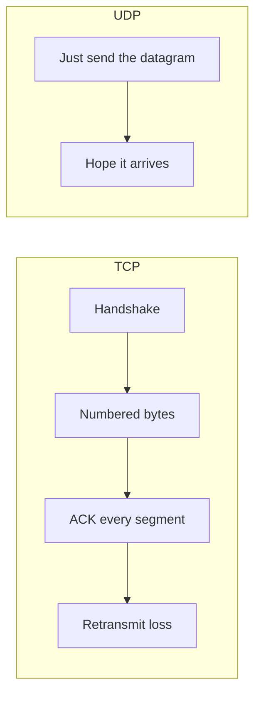
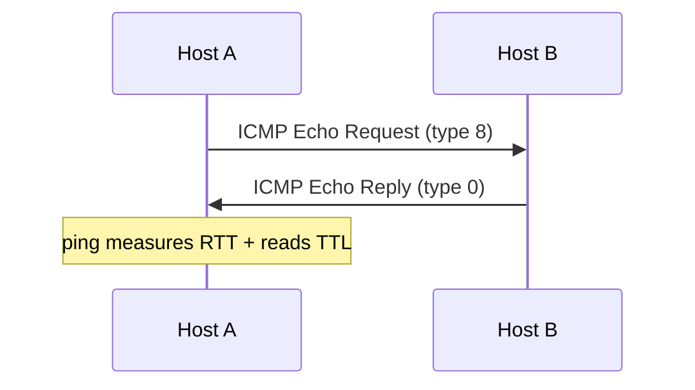
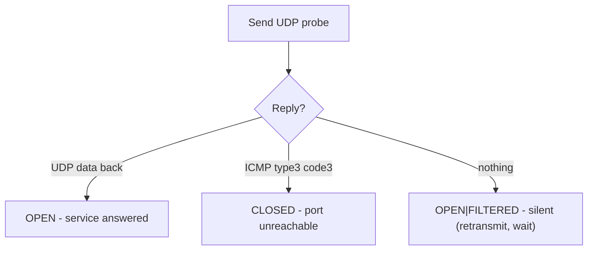

This is Chapter 17 of the series. The previous chapter dissected TCP, the reliable, connection-oriented workhorse. Now we meet its opposite: **UDP** — fast, connectionless, fire-and-forget — and **ICMP**, the network's diagnostic and error-signalling protocol. Beginners often dismiss UDP as "the unreliable one," but half the internet's most important services (DNS, DHCP, VoIP, QUIC/HTTP-3, most gaming and streaming) ride on it, the most devastating volumetric DDoS attacks abuse it, and some of the sneakiest data-exfiltration and C2 channels hide inside it and ICMP. Understanding connectionless protocols makes you better at scanning (UDP scanning is genuinely hard — you'll learn *why*), at recognising amplification attacks, and at spotting covert tunnels that TCP-focused defenders miss.

## Connectionless vs Connection-Oriented: The Core Contrast

TCP establishes a connection (handshake), tracks state, numbers bytes, acknowledges everything, and retransmits losses. **UDP does none of that.** It just wraps your data in an 8-byte header and throws it at the destination. No handshake, no acknowledgement, no ordering, no retransmission, no congestion control. If a datagram is lost, UDP neither knows nor cares — any recovery is the *application's* job.

Why would you ever want that? **Speed and simplicity.** For a live voice call or a game, a packet that arrives late is worse than useless — you'd rather skip it and stay real-time than wait for a retransmission. For DNS, a query and reply are tiny and a lost one is simply re-sent by the resolver; setting up a TCP connection for two small packets would be wasteful. The trade-off, in one line:

> **TCP = reliability at the cost of overhead and latency. UDP = speed and simplicity at the cost of reliability.**



| Property | TCP | UDP |
|---|---|---|
| Connection setup | 3-way handshake | none |
| Reliability | guaranteed | best-effort |
| Ordering | in-order | none |
| Header size | 20+ bytes | 8 bytes |
| Speed / latency | higher overhead | minimal |
| Congestion control | yes | no (app's job) |
| Typical uses | web, SSH, email, file transfer | DNS, DHCP, VoIP, streaming, games, SNMP |

## The UDP Header: Beautifully Simple

The entire UDP header is **8 bytes** — four 16-bit fields. Compare that to TCP's 20+.

```text
 0                   1                   2                   3
+--------+--------+--------+--------+
| Source Port     | Dest Port       |
+--------+--------+--------+--------+
| Length          | Checksum        |
+--------+--------+--------+--------+
|            Data ...               |
+-----------------------------------+
```

| Field | Size | Purpose |
|---|---|---|
| Source Port | 16 bits | Sender's port (0 = "no reply expected") |
| Destination Port | 16 bits | Which service to deliver to |
| Length | 16 bits | Header + data length in bytes |
| Checksum | 16 bits | Optional error check (mandatory in IPv6) |

That's it. No sequence numbers, no flags, no window — because UDP tracks no state. This minimalism is why UDP is fast and why crafting UDP packets (and spoofing their source) is trivial — a fact central to amplification attacks below.

## ICMP: The Network's Nervous System

**ICMP (Internet Control Message Protocol)** isn't a transport protocol at all — it rides directly on IP (Layer 3) and carries **control and error messages** *about* the network: "destination unreachable," "time exceeded," "fragmentation needed," and the famous echo request/reply behind `ping`. It has no ports. You've already used it: `ping` and `traceroute` from Chapter 11 are pure ICMP.

Key ICMP types to memorise (the type/code fields define the message):

| Type | Name | Meaning / used by |
|---|---|---|
| 0 | Echo Reply | `ping` response |
| 3 | Destination Unreachable | with codes: 0 net, 1 host, 3 **port unreachable** (key for UDP scans!) |
| 5 | Redirect | "use a better router" (abusable) |
| 8 | Echo Request | `ping` probe |
| 11 | Time Exceeded | TTL hit 0 — **traceroute** relies on this |
| 4 | Source Quench | deprecated congestion signal |



The **Type 3 Code 3 "port unreachable"** message is the linchpin of UDP scanning, and **Type 11 "time exceeded"** is what makes traceroute work — so ICMP is not optional trivia; it's how you interpret two of your core recon tools.

## Why UDP Scanning Is Hard (and How Nmap Does It Anyway)

TCP scanning is easy because closed ports reliably reply RST and open ports reply SYN-ACK (Chapter 16). UDP has **no such handshake**, so inference is murky:

- Send a UDP datagram to a port.
- **Open port**: the service *might* reply with UDP data (e.g. a DNS server answers a DNS query) — or it might stay **silent** (many UDP services only reply to valid, well-formed requests).
- **Closed port**: the host usually replies **ICMP Type 3 Code 3 (port unreachable)**.
- **Filtered**: a firewall drops the probe → **silence**.

The problem: **open and filtered both often produce silence**, so Nmap frequently reports `open|filtered`. And to be sure a silent port isn't just slow, Nmap must wait and **retransmit**, and hosts commonly **rate-limit** ICMP unreachable messages (Linux ~1/sec) — which is why UDP scans are famously *slow*.

```bash
sudo nmap -sU -p 53,123,161 192.168.1.20        # UDP scan of specific ports
sudo nmap -sU --top-ports 20 192.168.1.20        # 20 most common UDP ports (faster)
sudo nmap -sUV -p 53,161 192.168.1.20            # add version detection with real probes
```

**Practical wisdom:** never `-sU -p-` a host casually — it can take hours. Scan the *common* UDP ports (DNS 53, DHCP 67/68, NTP 123, SNMP 161, TFTP 69, IKE 500, mDNS 5353) and add `-sV` so Nmap sends protocol-specific payloads that *provoke* replies from open ports. UDP services are enumeration goldmines — an open **SNMP (161)** with a default community string leaks the entire device config; an open **TFTP (69)** may hand over configs; **NTP (123)** and **DNS (53)** can be abused for amplification.



## UDP Amplification & Reflection: The Biggest DDoS Attacks

Because UDP requires no handshake and its source address is trivially spoofable, it enables the internet's most destructive **reflection/amplification DDoS** attacks. The recipe:

1. The attacker sends a *small* UDP request to a public server (DNS, NTP, memcached, SSDP…) but **spoofs the source IP to be the victim's**.
2. The server dutifully sends its (much *larger*) reply to the **victim**.
3. Thousands of such servers, driven by a small attacker link, bury the victim under a flood of unsolicited replies.

The **amplification factor** is reply-size ÷ request-size — and some are enormous:

| Protocol | Port | Amplification factor |
|---|---|---|
| **memcached** | 11211 | up to ~50,000× |
| **NTP** (monlist) | 123 | ~556× |
| **DNS** (ANY) | 53 | ~28–54× |
| **SSDP** | 1900 | ~30× |
| **CLDAP** | 389 | ~56× |

The 2018 GitHub attack (1.35 Tbps, memcached) and the 2016 Dyn attack are textbook cases. This is *only possible because UDP is connectionless and spoofable* — a TCP handshake would fail immediately for a spoofed source. Defences: **BCP 38 source-address validation** (ISPs drop spoofed packets), disabling/rate-limiting abusable services, and response-rate limiting (RRL) on DNS.

> **Lawful-use reminder** — Launching amplification attacks is a serious crime. Understand the mechanism to *defend* and to explain impact in reports; never generate this traffic against systems you don't own.

## ICMP & Other Attacks on Connectionless Protocols

| Attack | Protocol | Mechanism | Defence |
|---|---|---|---|
| **Smurf** | ICMP | Ping a broadcast with spoofed victim source → flood of replies | Disable directed broadcasts |
| **Ping of Death** | ICMP | Oversized/malformed ping crashes old stacks | Patch (historic) |
| **ICMP tunneling** | ICMP | Hide data in echo request/reply payloads to exfiltrate/C2 | Inspect/limit ICMP payloads |
| **ICMP redirect** | ICMP | Forge type-5 to reroute a host's traffic (MITM) | Ignore redirects (`accept_redirects=0`) |
| **UDP flood** | UDP | Blast random UDP ports, force ICMP-unreachable load | Rate limiting, scrubbing |
| **DNS/NTP amplification** | UDP | Spoofed small request → huge reply to victim | BCP 38, disable monlist/ANY |
| **DNS tunneling** | UDP (53) | Encode data in DNS queries/answers for covert channel | DNS analytics, block odd TXT volume |

## Covert Channels: Exfiltration Over ICMP and DNS

Because firewalls almost always permit outbound **DNS (53/udp)** and often **ICMP**, attackers tunnel data through them to bypass egress controls — a favourite in red-team and real APT tradecraft.

- **ICMP tunneling** stuffs data into the *payload* of echo requests/replies. Tools: `icmpsh`, `ptunnel`. A steady stream of large, oddly-sized pings to one host is the tell.
- **DNS tunneling** encodes data in subdomain labels (`ZXhmaWx0cmF0ZWQ.attacker.com`) and receives commands in TXT/CNAME answers. Tools: `iodine`, `dnscat2`. It's slow but often unblocked; covered further in the DNS chapter.

```bash
# Conceptual ICMP tunnel demo (lab): watch payload sizes betray it
sudo tcpdump -i eth0 'icmp' -A            # cleartext data visible in echo payloads
# Detect anomaly: normal ping payload is 56 bytes; tunnels use large/varied sizes
```

These channels matter to both sides: attackers use them to defeat egress filtering; defenders hunt them via **traffic analysis** (payload size, entropy, request frequency, unusual record types) rather than signatures, since the packets are technically valid.

## Hands-On Lab: Seeing Connectionless Protocols

### Step 1 — Capture a real UDP exchange (DNS)

```bash
sudo tcpdump -i eth0 -n 'udp port 53' &
dig @8.8.8.8 example.com
sudo pkill tcpdump
```

In Wireshark filter `udp.port == 53`. Note there's **no handshake** — just a query datagram and a response datagram. Click the UDP layer: only src/dst port, length, checksum. That minimalism is the whole point. Compare the two-packet DNS exchange to the many-packet TCP handshake+data from Chapter 16.

### Step 2 — Watch ICMP behind ping and traceroute

```bash
sudo tcpdump -i eth0 -n icmp &
ping -c 2 8.8.8.8            # type 8 request / type 0 reply
traceroute -I 1.1.1.1        # provokes type 11 "time exceeded" from each hop
sudo pkill tcpdump
```

Filter `icmp` in Wireshark and read the **Type/Code** fields. You'll see Echo Request (8) / Reply (0) for ping and a series of Time Exceeded (11) for traceroute — the exact mechanisms from the ICMP table, live.

### Step 3 — See a closed UDP port produce ICMP unreachable

```bash
sudo tcpdump -i eth0 -n icmp &
# hit a very likely-closed high UDP port on a lab host:
sudo nmap -sU -p 33333 192.168.1.20
sudo pkill tcpdump
# You should see: ICMP  <host> unreachable - port unreachable (type 3 code 3)
```

That ICMP Type-3/Code-3 message *is* how Nmap concluded "closed." Watching it appear demystifies UDP scanning entirely.

### Step 4 — Craft UDP and ICMP with Scapy

```python
from scapy.all import IP, UDP, ICMP, sr1, send
# A UDP probe to a DNS port (open service will answer):
resp = sr1(IP(dst="8.8.8.8")/UDP(dport=53)/b"\x00", timeout=2, verbose=0)
print("Reply!" if resp else "No reply (open|filtered or dropped)")

# A hand-built ping:
r = sr1(IP(dst="8.8.8.8")/ICMP(), timeout=2, verbose=0)
print("ICMP type", r[ICMP].type if r else "no reply")   # type 0 = echo reply
```

Crafting these by hand cements how little structure UDP/ICMP carry — and how easy the source IP would be to forge (the root of amplification).

## Advanced: QUIC — UDP Grows Up

Modern web (HTTP/3) runs on **QUIC**, which is built *on UDP* but re-implements TCP's reliability, ordering and even TLS encryption *inside* the application layer, on port **443/udp**. QUIC gets UDP's flexibility (faster connection setup, no head-of-line blocking, connection migration across IP changes) while restoring reliability. For security this is significant: QUIC traffic is fully encrypted from the first packet (harder for middleboxes/IDS to inspect), and defenders/scanners tuned only for TCP/443 miss a growing slice of traffic. When you see heavy **UDP/443**, think QUIC/HTTP-3, and note your Layer-7 inspection tools may be blind to it.

## Common Pitfalls & How to Overcome Them

- **`-sU -p-` on impulse.** Full UDP scans are brutally slow due to silence + ICMP rate-limiting. Scan top/common UDP ports with `-sV`.
- **Reading `open|filtered` as "open."** It usually means "silent" — the service didn't answer your generic probe. Use `-sV` (protocol-specific payloads) to disambiguate.
- **Assuming ICMP is always allowed.** Many hosts drop echo; a failed ping proves nothing about UDP/TCP services (same lesson as Chapter 11).
- **Blocking *all* ICMP "to be safe."** Breaks **Path MTU Discovery** (Type 3 Code 4) and causes mysterious hangs on large transfers. Rate-limit and filter selectively instead of dropping everything.
- **Forgetting UDP source spoofing** when reasoning about amplification — it's the whole reason reflection works, and the reason BCP 38 exists.
- **Ignoring UDP services in enumeration.** SNMP/TFTP/NTP/DNS on UDP are frequently the softest target on a host; don't scan only TCP.

> **Memory hook** — **UDP = no handshake, 8-byte header, app handles loss.** **ICMP = the network's error/diagnostic messenger (no ports).** Scan tells: closed UDP → **ICMP port unreachable**; traceroute → **ICMP time exceeded**.

## Real-World Application & Case Studies

- **SNMP enumeration** — an open UDP/161 with community string `public` can dump interfaces, routes, ARP tables, even config on network gear; a staple internal-pentest win (SNMP/LDAP/NFS enum chapter goes deeper).
- **memcached DDoS (GitHub 2018, 1.35 Tbps)** and **NTP monlist attacks** — the largest floods in history, purely UDP amplification.
- **DNS/ICMP tunneling by APTs** — used to exfiltrate data and run C2 past egress firewalls in numerous real intrusions; `iodine`/`dnscat2`/`icmpsh` are the lab equivalents.
- **VoIP & gaming** — UDP's latency advantage is why they use it; also why they suffer targeted UDP floods.
- **QUIC/HTTP-3 rollout** — a live shift of major traffic to UDP/443, changing what network defenders can see.

> **Bug Bounty Angle** — UDP is usually out of pure web scope, but it earns in adjacent areas. **Exposed UDP services** found in recon — an open **SNMP** leaking device internals, **memcached** without auth, a **DNS** resolver that's openly recursive (amplification-capable) — are reportable to programs with network/infra scope, and cloud programs pay for **open management services**. **DNS-based SSRF/rebinding** and **subdomain takeover** hinge on DNS (a UDP service) behaviour. When you find a service reachable over UDP that shouldn't be, quantify impact (data leaked, amplification factor, C2 potential). For web-only programs, the transferable skill is recognising that scanning *only TCP* leaves half the attack surface untouched.

> **CTF Angle** — UDP/ICMP appear in **forensics** ("decode the covert channel": ICMP or DNS tunnel in a pcap — extract payloads with `tshark -Y icmp -T fields -e data` or reassemble subdomain labels) and **networking/misc** ("the service on this UDP port gives the flag": `nc -u host port`, or craft the exact payload it expects with Scapy). Watch for oddly large/frequent ICMP or high-entropy DNS subdomains = tunneling. Reflexes: `-sU -sV` to fingerprint a stubborn UDP port, `tshark -Y 'dns'` to pull tunneled data, `nc -u` for UDP services. Practice: picoCTF forensics, HTB traffic-analysis modules, and any "SNMP" or "DNS" themed room on TryHackMe.

## Detection & Defense: Blue-Team View

- **Egress filtering** is the master control: restrict outbound UDP/53 to your resolvers and monitor/limit ICMP, and covert tunnels (DNS/ICMP exfil) lose their channel. This single control breaks most C2 that abuses "always-allowed" protocols.
- **Detect DNS tunneling** — alert on high query volume to one domain, unusually long subdomain labels, high entropy, or a spike in TXT/NULL record queries. Tools: Zeek `dns.log` analytics, Suricata.
- **Detect ICMP tunneling** — flag echo packets with large or variable payloads, high frequency to a single host, or non-standard payload content. Baseline "normal" ping = 56-byte payload.
- **Mitigate amplification** — implement **BCP 38** (don't let spoofed sources leave your network), disable NTP `monlist`, refuse open DNS recursion, patch/secure memcached (bind localhost), and use response-rate limiting.
- **UDP flood defence** — upstream scrubbing, rate limiting, and stateless SYN-cookie-equivalents at the edge; conntrack for legitimate flows.

The defensive theme flips the offensive one: connectionless protocols are *permitted and trusted*, so defence is **traffic analysis and egress control**, not signature matching — you hunt anomalies in metadata (size, frequency, entropy, destination) because the packets themselves are valid.

## Final Revision / Summary

- **UDP** is connectionless: no handshake, 8-byte header (src/dst port, length, checksum), no reliability/ordering — the *app* handles loss. Fast and simple; used by DNS, DHCP, VoIP, streaming, SNMP, QUIC.
- **ICMP** is Layer-3 control/error messaging with **no ports**; key types: **8/0** (ping echo), **11** (time exceeded → traceroute), **3** (unreachable; code 3 = **port unreachable** → UDP scan logic).
- **UDP scanning is hard**: open ports may be silent, closed ports send ICMP port-unreachable, firewalls cause silence → frequent `open|filtered`. Use `-sU -sV`, scan common ports, expect slowness.
- **Amplification/reflection DDoS** exploits UDP's spoofable, handshake-free nature (memcached ~50,000×, NTP, DNS). Defence: BCP 38, disable/limit abusable services.
- **Covert channels** (DNS/ICMP tunneling) abuse always-allowed protocols to bypass egress filtering; detect via traffic analysis, defend via egress control.
- **QUIC/HTTP-3** runs reliable, encrypted transport over UDP/443 — the future of web, and a blind spot for TCP-only tooling.
- Tools: `nmap -sU(-sV)`, `hping3 --udp`, Scapy `UDP()/ICMP()`, `tcpdump/tshark` for `icmp`/`udp`, `dig` (DNS over UDP).

## Cheat Sheet / Quick Reference

```text
UDP HEADER (8B): SrcPort | DstPort | Length | Checksum   (no seq/ack/flags)
TCP vs UDP: handshake/reliable/ordered vs none/best-effort/unordered
ICMP TYPES: 0 echo-reply | 8 echo-req | 11 time-exceeded (traceroute)
            3 unreachable (code 3 = PORT UNREACHABLE -> UDP closed)
UDP SCAN LOGIC: UDP data back=OPEN | ICMP t3c3=CLOSED | silence=OPEN|FILTERED
COMMON UDP PORTS: 53 DNS | 67/68 DHCP | 69 TFTP | 123 NTP | 161 SNMP
                  500 IKE | 1900 SSDP | 5353 mDNS | 443 QUIC/HTTP-3
AMPLIFIERS: memcached 11211 (~50000x) | NTP 123 | DNS 53 | SSDP 1900 | CLDAP 389
```

```bash
# SCAN
sudo nmap -sU --top-ports 20 <ip>       # common UDP ports (sane speed)
sudo nmap -sUV -p 53,161,123 <ip>       # version probes provoke replies

# CAPTURE
sudo tcpdump -i eth0 -n 'udp port 53'   # DNS over UDP
sudo tcpdump -i eth0 icmp -A            # ICMP + payload (spot tunnels)
tshark -r cap.pcap -Y 'icmp' -T fields -e data   # extract ICMP payloads

# CRAFT (Scapy)
sr1(IP(dst="8.8.8.8")/UDP(dport=53)/b"\x00")
sr1(IP(dst="8.8.8.8")/ICMP())

# ENUMERATE UDP SERVICES
snmpwalk -v2c -c public <ip>            # SNMP dump if 161 open
dig @<ip> version.bind txt chaos        # DNS fingerprint
```

## Practice Labs & Resources

- **TryHackMe — "Nmap" (UDP scanning sections), "Network Services" & "Network Services 2"**: hands-on SNMP/DNS/DHCP over UDP.
- **HTB Academy — "Network Enumeration with Nmap"** (UDP module) and traffic-analysis modules for pcap tunneling.
- **picoCTF / HTB forensics**: decode DNS/ICMP covert channels from captures.
- **Cloudflare Learning Center — "UDP flood / DNS amplification / NTP amplification"**: excellent plain-English DDoS references.
- **iodine / dnscat2 / icmpsh (lab)**: build and then *detect* a covert tunnel to understand both sides.
- **Exercise** — UDP-scan a lab host, capture the ICMP port-unreachable for a closed port, then set up a DNS or ICMP tunnel between two VMs and write the detection logic (payload size / query-entropy threshold) that would catch it.

Next we go up to the most-abused connectionless service of all: **DNS — records, recursive resolution, zones, subdomain enumeration, cache poisoning and tunneling** — the internet's phone book and one of a hacker's richest recon and exfiltration surfaces.
