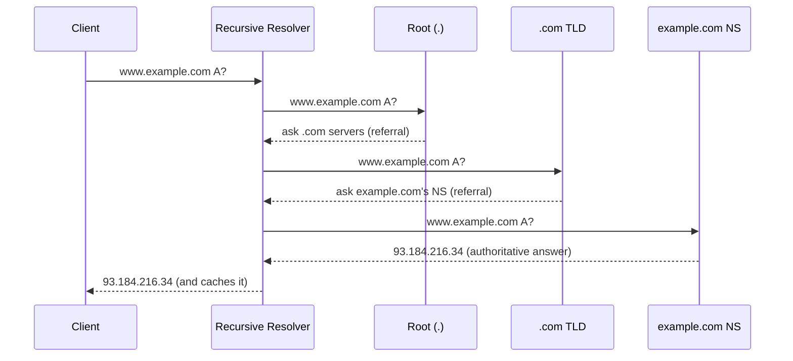
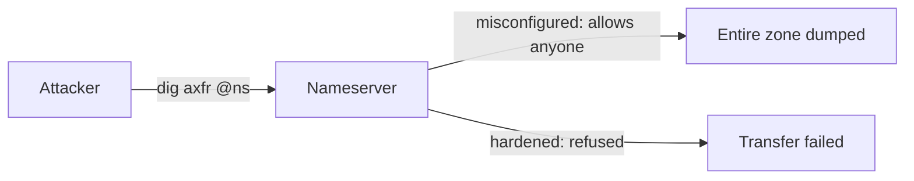
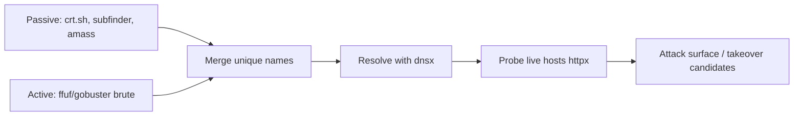

**Level:** Intermediate · **Track:** Foundations · **Read time:** 120 min

This is Chapter 18 of the series. DNS — the **Domain Name System** — is the internet's phone book: it turns human-friendly names like `example.com` into the IP addresses machines route to. But for a security professional, DNS is far more than a lookup service. It is one of the **richest reconnaissance surfaces** in existence (subdomains, mail servers, infrastructure, and history all leak through it), the target of poisoning and hijacking attacks, and a favourite **covert exfiltration channel** precisely because firewalls almost never block it. This chapter takes you from "what is a DNS record" to zone transfers, cache poisoning, subdomain enumeration at scale, and DNS tunneling — with `dig` in your hands the whole way.

## Why DNS Matters to a Hacker

Every attack that starts with "map the target" starts with DNS. Before you scan a single port, DNS tells you the organisation's subdomains (`dev.`, `staging.`, `vpn.`, `admin.`), its mail infrastructure (MX), its hosting (is it behind Cloudflare? on AWS?), and sometimes forgotten assets nobody remembers deploying. In bug bounty, **subdomain enumeration is often the single highest-value recon activity** — the more subdomains you find, the more attack surface you have, and forgotten subdomains are where **subdomain takeover** and neglected, vulnerable apps live. DNS is also abused offensively (tunneling to exfiltrate data, fast-flux to hide C2) and defensively (sinkholing malware domains, threat-intel feeds). You cannot be effective at recon without DNS fluency.

## The Problem DNS Solves, and Its Hierarchy

Humans remember names; the network routes on IP addresses. DNS is the distributed database that maps one to the other, at planetary scale, with no single point of failure. It achieves that through a **hierarchy** — a tree read right-to-left:

```text
                    . (root)
                    |
      +-------+-----+-----+--------+
     com     org   net    io   ...(TLDs)
      |
   example  (second-level domain)
      |
   www / mail / dev ... (subdomains / hosts)
```

- **Root (`.`)** — 13 logical root server clusters (A–M), the top of the tree. They don't know `example.com`; they know who runs `.com`.
- **TLD (Top-Level Domain)** — `.com`, `.org`, `.io`, country codes like `.in`, `.uk`. Run by registries; they know the nameservers for each domain under them.
- **Second-level domain** — `example.com`, registered by an organisation; its **authoritative nameservers** hold the real records.
- **Subdomains / hosts** — `www.example.com`, `mail.example.com`, arbitrarily deep.

A fully-qualified domain name (FQDN) like `www.example.com.` (note the trailing dot = root) is read from the most specific (left) to the most general (right).

## Recursive Resolution: How a Name Becomes an IP

When you look up `www.example.com`, your device asks a **recursive resolver** (your ISP's, or `8.8.8.8`/`1.1.1.1`). That resolver does the legwork, walking the hierarchy on your behalf:



Two query styles are happening: the client makes a **recursive** query ("do all the work and give me the final answer"), and the resolver makes **iterative** queries ("just tell me the next server to ask") up the hierarchy. Each step returns a **referral** until the **authoritative** nameserver gives the real answer. The resolver then **caches** it for the record's **TTL** so the next lookup is instant — caching is what keeps DNS fast and the root servers from melting, and it's also what makes **cache poisoning** attacks so valuable.

Before any of this, your host also checks local sources in order: its **cache**, then the **hosts file** (`/etc/hosts` on Linux/macOS, `C:\Windows\System32\drivers\etc\hosts`), which can override DNS entirely — a common local-testing and malware-persistence trick.

## DNS Record Types: The Vocabulary of Recon

A DNS zone is a set of **resource records**. Knowing what each reveals is core recon skill:

| Record | Purpose | Recon value |
|---|---|---|
| **A** | Name → IPv4 | The host's address |
| **AAAA** | Name → IPv6 | Often forgotten/less-firewalled |
| **CNAME** | Alias → another name | Reveals third-party services (takeover clues!) |
| **MX** | Mail servers (with priority) | Mail infra, phishing targets, provider |
| **NS** | Authoritative nameservers | Who runs DNS; zone-transfer targets |
| **TXT** | Arbitrary text | SPF/DKIM/DMARC, domain verification, secrets leak here |
| **SOA** | Start of Authority | Zone metadata, admin email, serial, timers |
| **PTR** | IP → name (reverse) | Reverse-DNS mapping, infra discovery |
| **SRV** | Service location (host+port) | Finds services (e.g. `_ldap._tcp` for AD/DC) |
| **CAA** | Which CAs may issue certs | Cert issuance policy |

Special mentions for hackers: **TXT records** frequently leak internal info, cloud verification tokens, and mis-stored secrets; **CNAME** records pointing to a de-provisioned cloud service (`something.s3.amazonaws.com` that no longer exists) are the setup for **subdomain takeover**; and **SRV** records are how you locate Active Directory domain controllers (`_ldap._tcp.dc._msdcs.<domain>`) during internal enumeration.

## `dig`: Your DNS Multitool (From Scratch)

`dig` (Domain Information Groper) is the definitive DNS query tool. Learn it deeply — it's on every pentest. Install and basics:

```bash
sudo apt install -y dnsutils     # provides dig, nslookup, host
dig example.com                  # default: A record via your resolver
```

Reading `dig` output — the sections matter:

```text
;; QUESTION SECTION:
;example.com.            IN  A
;; ANSWER SECTION:
example.com.     3600    IN  A   93.184.216.34
;; AUTHORITY SECTION:
example.com.     172800  IN  NS  a.iana-servers.net.
;; ADDITIONAL SECTION:
...
;; Query time: 12 msec
;; SERVER: 8.8.8.8#53(8.8.8.8)
```

The **ANSWER** is what you want; **AUTHORITY** shows the nameservers; **TTL** (`3600`) is caching lifetime. Essential invocations:

```bash
dig +short example.com                 # just the answer (scriptable)
dig example.com MX +short              # mail servers
dig example.com NS +short              # authoritative nameservers
dig example.com TXT +short             # SPF/DKIM/verification/leaks
dig example.com ANY                    # all records (often restricted now)
dig @1.1.1.1 example.com               # query a specific resolver
dig +trace example.com                 # watch the FULL recursive walk root->TLD->auth
dig -x 93.184.216.34                   # reverse lookup (PTR)
dig example.com SOA +short             # zone admin + serial + timers
```

`dig +trace` is the single best teaching command in DNS — it performs the iterative resolution yourself, printing each referral from root to authoritative. Run it once and the resolution diagram becomes concrete.

## Zones, Nameservers & the Zone Transfer (AXFR)

A **zone** is the portion of the DNS namespace an organisation administers (e.g. everything under `example.com`), stored in a **zone file** on **authoritative nameservers**. For redundancy there's a **primary (master)** and one or more **secondary (slave)** servers, which stay in sync by copying the zone — a **zone transfer (AXFR)**.

Here's the classic misconfiguration: AXFR is meant to be restricted to authorised secondary servers, but many servers are left open to *anyone*. An open AXFR hands you the **entire zone** — every subdomain, every record — in one request. It's the jackpot of passive-ish enumeration:

```bash
# Find the nameservers, then try a transfer against each:
dig example.com NS +short
dig axfr example.com @ns1.example.com
# If misconfigured, you get the WHOLE zone dumped:
#   dev.example.com.   IN A 10.0.0.5
#   vpn.example.com.   IN A 203.0.113.9
#   admin.example.com. IN A 10.0.0.7   ... etc
```



Finding an open zone transfer is an instant, high-value recon win (and a reportable misconfiguration). Tools like `dnsenum`, `dnsrecon` and `fierce` try AXFR automatically. Defence is simple: restrict AXFR to known secondaries (`allow-transfer` in BIND) — which is why it's rarer now but still turns up, especially on internal and legacy servers.

## Subdomain Enumeration at Scale

When AXFR is closed (usually), you enumerate subdomains other ways. This is *the* core recon activity in bug bounty. Two families:

**Passive** (no direct queries to the target — quiet, uses third-party data):

- **Certificate Transparency logs** — every TLS cert is publicly logged, and certs list their subdomains (SANs). Query `crt.sh`:
  ```bash
  curl -s "https://crt.sh/?q=%25.example.com&output=json" | jq -r '.[].name_value' | sort -u
  ```
- **Aggregators** — `subfinder`, `amass` (passive mode), `assetfinder` pull from dozens of sources (CT logs, search engines, threat-intel APIs):
  ```bash
  subfinder -d example.com -silent
  amass enum -passive -d example.com
  ```

**Active** (query the target's DNS directly — brute force names against a wordlist):

```bash
# Fast active brute force with a wordlist:
ffuf -w /usr/share/seclists/Discovery/DNS/subdomains-top1million-5000.txt \
     -u https://FUZZ.example.com -mc 200,301,302,403
# Dedicated DNS brute-forcers:
dnsenum example.com
gobuster dns -d example.com -w /usr/share/seclists/Discovery/DNS/namelist.txt
```

Then **resolve and validate** the candidates (many won't resolve) with a fast resolver like `dnsx`, and check which are live. The workflow — passive gather → active brute → resolve → probe with `httpx` — is the standard recon pipeline (built end-to-end in the Recon & OSINT track).



## DNS Attacks: Poisoning, Hijacking, Spoofing

DNS was designed in a trusting era, and several attacks exploit that:

| Attack | Mechanism | Impact / Defence |
|---|---|---|
| **Cache poisoning** | Inject forged answers into a resolver's cache (Kaminsky, 2008) so users go to attacker IPs | Mass redirection; defend with **DNSSEC**, source-port + txn-ID randomisation |
| **DNS spoofing (on-path)** | Race the real answer with a forged one (e.g. after ARP spoofing on a LAN) | MITM to phishing/malware; defend with DoH/DoT, DNSSEC |
| **DNS hijacking** | Compromise the registrar/account or change NS records | Full domain takeover; defend with registrar lock, 2FA |
| **Subdomain takeover** | A dangling CNAME points to an unclaimed cloud resource you can register | Serve content on victim's subdomain; defend by removing stale records |
| **NXDOMAIN / water torture** | Flood random subdomain queries to exhaust resolvers | DoS; defend with rate limiting |
| **Fast-flux / DGA** | Rapidly rotating A records / algorithmically generated domains hide C2 | Evade takedown; defend with DNS analytics, threat intel |

**Cache poisoning** deserves a note: Dan Kaminsky's 2008 attack showed a resolver could be tricked into caching a forged record by winning a race with a spoofed answer (guessing the 16-bit transaction ID). The fix — randomising source ports (adding ~16 more bits of entropy) — and ultimately **DNSSEC** (cryptographically signed records) are the defences. **Subdomain takeover** is the most bounty-relevant: find a subdomain whose CNAME points to a service (GitHub Pages, S3, Heroku, Azure) that's no longer claimed, register it, and you control content on the target's domain.

## DNS Tunneling: Exfiltration Where Firewalls Don't Look

Because outbound DNS (53/udp) is almost always allowed, attackers encode data in DNS queries to bypass egress controls (introduced in Chapter 17). Data goes *out* in subdomain labels; commands come *back* in TXT/CNAME answers:

```text
Exfil:  base32(secret).tunnel.attacker.com   ->  attacker's authoritative NS logs it
C2:     query cmd.tunnel.attacker.com         ->  TXT answer carries the command
```

Tools: **`iodine`** (full IP-over-DNS tunnel), **`dnscat2`** (encrypted C2 over DNS). It's slow (limited by DNS message sizes and query rate) but often completely unblocked. Detection is behavioural: abnormally high query volume to one domain, very long/high-entropy subdomains, and lots of TXT/NULL queries.

```bash
# Detection idea: pull suspicious long subdomains from a capture
tshark -r cap.pcap -Y 'dns.qry.name' -T fields -e dns.qry.name \
  | awk '{ if (length($0) > 50) print }' | sort | uniq -c | sort -rn
```

## Hands-On Lab: DNS End to End

### Step 1 — Watch full resolution

```bash
dig +trace www.example.com          # root -> .com -> authoritative, printed step by step
```

Read each block: root refers you to `.com`, `.com` refers you to the domain's NS, the NS answers authoritatively. This *is* the recursive-resolution diagram, executed live.

### Step 2 — Capture DNS on the wire

```bash
sudo tcpdump -i eth0 -n 'udp port 53' &
dig example.com MX
dig example.com TXT
sudo pkill tcpdump
```

In Wireshark, filter `dns`. Each query/response is a single UDP datagram (no handshake — Chapter 17). Expand the DNS layer to see the **Transaction ID**, **Questions**, and **Answers** — the txn ID is exactly what cache-poisoning attacks must guess.

### Step 3 — Enumerate a domain like a pentester

```bash
dig example.com NS +short                  # nameservers
for ns in $(dig example.com NS +short); do dig axfr example.com @$ns; done   # try AXFR
dig example.com TXT +short                 # SPF/DKIM/DMARC + possible leaks
subfinder -d example.com -silent | tee subs.txt
curl -s "https://crt.sh/?q=%25.example.com&output=json" | jq -r '.[].name_value' | sort -u >> subs.txt
sort -u subs.txt | dnsx -silent            # resolve the merged list
```

This mirrors the first ten minutes of a real recon engagement. (Only run active enumeration against domains you're authorised to test; passive CT-log lookups are generally fine.)

### Step 4 — Reverse and SRV lookups

```bash
dig -x 8.8.8.8 +short                       # PTR: 8.8.8.8 -> dns.google
dig _sip._udp.example.com SRV +short        # locate a service via SRV
```

## Advanced: DNSSEC, DoH/DoT, and Modern Privacy

- **DNSSEC** signs records with cryptographic keys (RRSIG, DNSKEY, DS) so a resolver can verify an answer wasn't forged — the real fix for cache poisoning. It provides *authenticity/integrity*, not confidentiality (queries are still visible).
- **DoH (DNS over HTTPS, 443)** and **DoT (DNS over TLS, 853)** encrypt the *query* itself, hiding it from on-path eavesdroppers and censors — and, notably, from many corporate DNS-monitoring defences. This is a double-edged sword: privacy for users, but a blind spot for blue teams that relied on plaintext DNS logs (and a channel attackers use to hide tunneling). Expect to see DoH used both to protect and to evade.
- **EDNS(0)** extends DNS for larger messages (needed for DNSSEC and to reduce fallback to TCP). When a DNS response exceeds UDP limits, DNS falls back to **TCP/53** — which is also how AXFR runs.

## Common Pitfalls & How to Overcome Them

- **Trusting one resolver's answer.** Caching and geo-DNS mean different resolvers return different IPs. Query several (`@8.8.8.8`, `@1.1.1.1`, the target's own NS) and compare.
- **Forgetting the `hosts` file.** A stale `/etc/hosts` entry overrides DNS and produces "impossible" results; check it when a name resolves wrong.
- **Assuming `ANY` still dumps everything.** Many servers now refuse `ANY` (RFC 8482). Query specific record types.
- **Scanning the CDN, not the origin.** If `dig` returns Cloudflare IPs, the host you'd scan is the edge; finding the true origin (CT logs, old records, MX) is a separate recon step (Chapter 11).
- **Running active brute force out of scope.** Passive (CT logs, aggregators) is low-risk; hammering a target's DNS with brute force may be noisy or out of scope — check the rules.
- **Ignoring AAAA/IPv6.** A host firewalled on IPv4 may be exposed on IPv6; always check `AAAA`.

> **Memory hook** — **A=IPv4, AAAA=IPv6, CNAME=alias (takeover!), MX=mail, NS=nameservers, TXT=secrets/SPF, SOA=zone info, PTR=reverse.** For recon: **NS → try AXFR → else subfinder + crt.sh → resolve → probe.**

## Real-World Application & Case Studies

- **Bug bounty recon** — nearly every hunter's first move is subdomain enumeration; top disclosed reports repeatedly start "found `forgotten-subdomain.target.com` via crt.sh."
- **Subdomain takeovers** — countless HackerOne/Bugcrowd payouts from dangling CNAMEs to unclaimed S3/GitHub/Heroku assets.
- **Kaminsky cache poisoning (2008)** — a foundational internet-wide vulnerability that drove source-port randomisation and DNSSEC adoption.
- **The 2016 Dyn DDoS** knocked out DNS for Twitter, Netflix, Reddit — proof that DNS availability is critical infrastructure.
- **APT DNS tunneling** — groups like OilRig/APT34 used DNS tunneling for C2/exfil, evading firewalls that trusted port 53.
- **DNS hijacking campaigns (Sea Turtle, 2019)** — attackers altered NS/records at registrars to intercept traffic for entire organisations.

> **Bug Bounty Angle** — DNS is arguably the **highest-ROI recon skill** in bounties. **Subdomain enumeration** expands your scope; **open zone transfers** (`dig axfr`) are instant reportable misconfigs; **subdomain takeover** (dangling CNAME → claim the resource → serve content) is a classic mid-to-high payout; **TXT records** sometimes leak internal hosts or verification tokens; and **dangling records / expired domains** enable phishing and takeover. Report framing: prove control (host a PoC file on the taken-over subdomain), and enumerate what the exposure reveals. Tooling to master: `subfinder`, `amass`, `crt.sh`, `dnsx`, `httpx`, and the takeover checkers `subjack`/`nuclei` takeover templates. Almost every serious hunter's methodology begins here.

> **CTF Angle** — DNS shows up in **recon/OSINT** ("find the flag hidden in a TXT record": `dig TXT target`), **forensics** ("decode the DNS tunnel in this pcap": reassemble subdomain labels, base32/64-decode), and **misc** ("perform a zone transfer to find the hidden host": `dig axfr @ns`). Reflexes: `dig ANY`/`TXT`, `dig axfr`, and `tshark -Y dns -T fields -e dns.qry.name` to pull tunneled queries. Flags frequently sit in TXT records or leak via an open AXFR. Practice: TryHackMe "DNS in Detail" and "Passive Recon", HTB recon modules, picoCTF forensics with DNS captures.

## Detection & Defense: Blue-Team DNS

- **DNS logging & analytics** are a defender's superpower because *almost every attack touches DNS*: malware resolves its C2 domain, phishing links resolve, exfil tunnels query. Log all resolver queries (Zeek `dns.log`, resolver query logs) and hunt anomalies.
- **Detect tunneling/exfil** — alert on high query volume to one domain, long/high-entropy subdomains, excessive TXT/NULL queries, or NXDOMAIN storms. Baseline normal query patterns.
- **Detect poisoning/spoofing** — DNSSEC validation failures, answers from unexpected sources, TTL anomalies.
- **Harden your own DNS** — restrict AXFR to known secondaries, disable open recursion on authoritative servers, enable DNSSEC, randomise source ports, and lock the registrar (2FA + registry lock) to prevent hijacking.
- **Sinkholing & RPZ** — Response Policy Zones let you rewrite known-malicious domains to a sinkhole, blocking malware C2 at the DNS layer and capturing the callbacks for investigation.
- **Watch for takeover risk** — inventory CNAMEs and remove records pointing to de-provisioned services; run periodic takeover scans against your own assets.

DNS defence is the mirror of DNS offence: because it's trusted and ubiquitous, the control is **visibility (log everything) + hygiene (no dangling records, restricted AXFR, DNSSEC)**.

## Final Revision / Summary

- DNS resolves names → IPs via a **hierarchy** (root → TLD → authoritative), using **recursive** (client→resolver) and **iterative** (resolver→hierarchy) queries, with **caching** by TTL. Local `hosts` file and cache are checked first.
- **Records**: A/AAAA (IPs), CNAME (alias — takeover clue), MX (mail), NS (nameservers), TXT (SPF/DKIM/leaks), SOA (zone info), PTR (reverse), SRV (service/port — finds AD DCs).
- **`dig`** is the core tool: `+short`, `MX/NS/TXT/ANY`, `@resolver`, `+trace`, `-x`, and `axfr`.
- **Zone transfer (AXFR)** dumps the whole zone if misconfigured — instant recon win; restrict to secondaries to defend.
- **Subdomain enumeration** (passive: crt.sh/subfinder/amass; active: ffuf/gobuster brute → resolve → probe) is the top recon activity, especially for bug bounty and **subdomain takeover**.
- **Attacks**: cache poisoning (Kaminsky → DNSSEC), spoofing (on-path → DoH/DoT), hijacking (registrar → lock+2FA), takeover (dangling CNAME), tunneling (exfil/C2 over 53).
- **Modern**: DNSSEC (integrity), DoH/DoT (encrypted queries — privacy *and* blue-team blind spot), TCP/53 fallback and AXFR.
- Defence = **log everything + hygiene** (restrict AXFR, DNSSEC, no dangling records, registrar lock, tunneling analytics).

## Cheat Sheet / Quick Reference

```bash
# CORE dig
dig +short example.com                 # A record
dig example.com MX +short              # mail
dig example.com NS +short              # nameservers
dig example.com TXT +short             # SPF/DKIM/leaks
dig example.com SOA +short             # zone admin/serial
dig -x 8.8.8.8 +short                  # reverse PTR
dig @1.1.1.1 example.com               # specific resolver
dig +trace example.com                 # full recursive walk
dig axfr example.com @ns1.example.com  # zone transfer attempt

# SUBDOMAIN ENUM
subfinder -d example.com -silent
amass enum -passive -d example.com
curl -s "https://crt.sh/?q=%25.example.com&output=json" | jq -r '.[].name_value' | sort -u
ffuf -w subdomains.txt -u https://FUZZ.example.com -mc 200,301,302,403
cat subs.txt | dnsx -silent | httpx -silent   # resolve + probe live

# DETECT TUNNELING (blue)
tshark -r cap.pcap -Y dns -T fields -e dns.qry.name | awk 'length>50'
```

```text
RECORDS: A(v4) AAAA(v6) CNAME(alias) MX(mail) NS(ns) TXT(spf/leaks)
         SOA(zone) PTR(reverse) SRV(service+port) CAA(cert policy)
PORTS: 53/udp (queries) | 53/tcp (AXFR + large/EDNS) | 853 DoT | 443 DoH
ATTACKS: poisoning->DNSSEC | spoofing->DoH/DoT | hijack->registrar lock
         takeover->remove dangling CNAME | tunneling->egress + analytics
RECON FLOW: NS -> axfr? -> subfinder+crt.sh -> dnsx resolve -> httpx probe
```

## Practice Labs & Resources

- **TryHackMe — "DNS in Detail", "Passive Reconnaissance", "Active Reconnaissance"**: exactly this chapter, hands-on.
- **HTB Academy — "Information Gathering – Web"** and **"Footprinting"** (DNS sections): zone transfers and enumeration on real targets.
- **PortSwigger / HackerOne reports on subdomain takeover**: read a dozen disclosed takeovers to internalise the pattern.
- **crt.sh, dnsdumpster.com, SecurityTrails**: passive DNS/CT recon you can practise on any domain right now.
- **`iodine`/`dnscat2` in a lab**: build a DNS tunnel, then write the detection query that catches it.
- **Exercise** — pick a domain you own, enumerate its subdomains with both passive and active methods, attempt an AXFR against its NS, then set up DNSSEC or restrict AXFR and confirm your earlier technique now fails.

Next we look at how hosts get their addresses in the first place: **DHCP and dynamic address assignment** — the DORA handshake, options, leases, and the rogue-server and starvation attacks that turn address assignment into a man-in-the-middle.

---

*Also on [Praneeth's portfolio](https://ping-praneeth.vercel.app/notebook/networking/08-dns-completely-explained-records-resolution-and-zones), with comments and the latest edits.*
