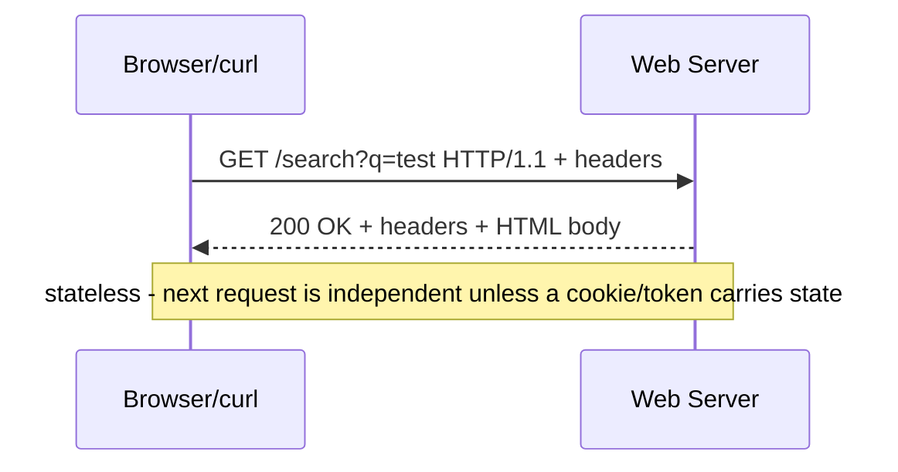
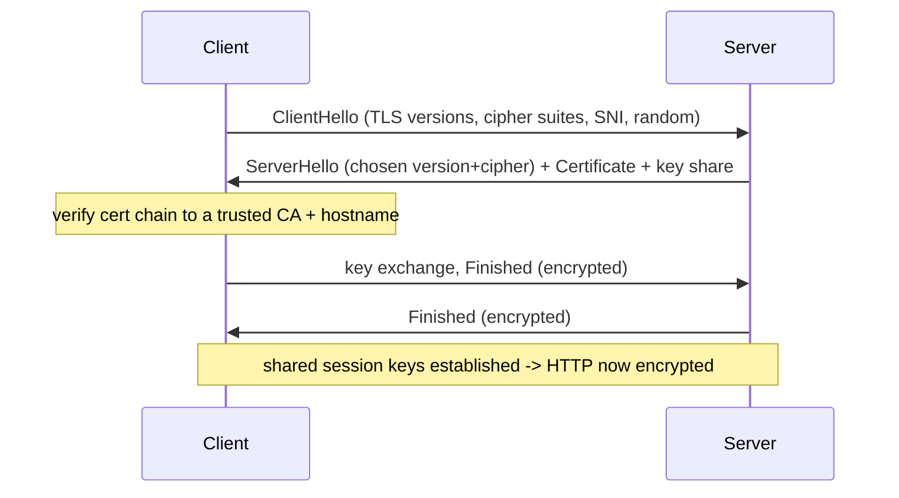
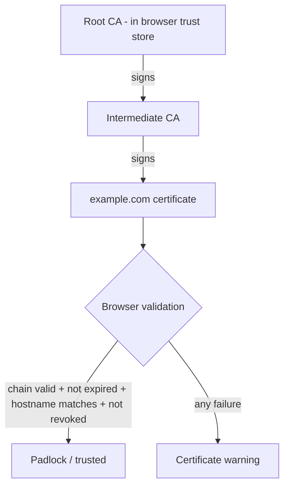

This is Chapter 20 of the series. You will spend more of your hacking life inside **HTTP** than any other protocol — it's the language of the web, of REST APIs, of most bug bounty targets, and of the Burp Suite requests you'll live in throughout the AppSec track. This chapter builds HTTP from the first request line, then wraps it in **TLS** to make HTTPS, and finally explains the **PKI** (certificates, chains of trust, Certificate Authorities) that lets your browser trust a stranger's server. By the end you'll read raw HTTP fluently, drive it with `curl`, dissect a TLS handshake with `openssl`, and understand exactly what an interceptor like Burp does — and why certificate warnings matter.

## HTTP: The Request/Response Protocol

**HTTP (HyperText Transfer Protocol)** is a simple, text-based, **stateless request/response** protocol running over TCP (default port **80**). The client sends a **request**; the server sends a **response**. That's the whole model. "Stateless" means the server remembers nothing between requests by default — each is independent — which is why cookies and tokens exist (to bolt state on top).

A raw HTTP/1.1 request is human-readable text:

```http
GET /search?q=test HTTP/1.1
Host: example.com
User-Agent: Mozilla/5.0
Accept: text/html
Cookie: session=abc123

```

And the response:

```http
HTTP/1.1 200 OK
Content-Type: text/html; charset=UTF-8
Content-Length: 1256
Set-Cookie: session=abc123; HttpOnly; Secure

<!DOCTYPE html><html>...</html>
```

Anatomy of a request: the **request line** (method, path + query, version), the **headers** (key: value metadata), a blank line, then an optional **body**. The response mirrors it: a **status line** (version, code, reason), headers, blank line, body. That blank line (`\r\n\r\n`) separating headers from body is significant — mishandling it is the root of **HTTP request smuggling** (a later AppSec chapter).



## HTTP Methods (Verbs)

The **method** states the intent. Knowing them — and which are "safe" (read-only) vs "state-changing" — is core to access-control and CSRF reasoning.

| Method | Purpose | Safe? | Idempotent? |
|---|---|---|---|
| **GET** | Retrieve a resource | Yes | Yes |
| **POST** | Submit data / create | No | No |
| **PUT** | Replace a resource | No | Yes |
| **PATCH** | Partial update | No | No |
| **DELETE** | Remove a resource | No | Yes |
| **HEAD** | GET headers only (no body) | Yes | Yes |
| **OPTIONS** | Ask what methods/CORS are allowed | Yes | Yes |
| **TRACE** | Echo the request (often disabled) | Yes | Yes |

Security angles: **GET puts data in the URL** (logged, cached, in Referer headers) — never send secrets via GET. **PUT/DELETE** enabled without authorization is a direct broken-access-control bug. **OPTIONS** reveals CORS policy and allowed methods (recon). **TRACE** enabled can lead to Cross-Site Tracing. Testing whether a state-changing action works via an unexpected method (e.g. `GET` triggering a delete) is a classic logic/access bug.

## HTTP Status Codes

The server's three-digit **status code** classifies the outcome. Read the first digit for the family:

| Class | Meaning | Key codes |
|---|---|---|
| **1xx** | Informational | 101 Switching Protocols (WebSocket upgrade) |
| **2xx** | Success | 200 OK, 201 Created, 204 No Content |
| **3xx** | Redirect | 301/302 Moved, 304 Not Modified |
| **4xx** | Client error | 400 Bad Request, 401 Unauthorized, 403 Forbidden, 404 Not Found, 405 Method Not Allowed, 429 Too Many Requests |
| **5xx** | Server error | 500 Internal Error, 502 Bad Gateway, 503 Unavailable |

For hackers, status codes are **oracles**. `401` vs `403` distinguishes "not authenticated" from "authenticated but not allowed." A `200` where you expected `403` is broken access control. `500` errors leak that your injection payload broke something (SQLi/SSTI). `302` to a login page vs `200` with content reveals whether you're authenticated. During content discovery (`ffuf`), you filter by status code to find hidden endpoints. Status codes are the feedback loop of almost every web attack.

## HTTP Headers: The Metadata That Runs the Web

Headers carry everything from identity to security policy. The ones you must know:

| Header | Direction | Purpose / security relevance |
|---|---|---|
| `Host` | request | Which virtual host (Host-header attacks, routing) |
| `User-Agent` | request | Client identity (fingerprinting, filtering) |
| `Cookie` / `Set-Cookie` | req/resp | Session state (see cookies below) |
| `Authorization` | request | Credentials/tokens (`Bearer`, `Basic`) |
| `Referer` | request | Where you came from (leaks; CSRF checks) |
| `Content-Type` | both | Body format (JSON/form; parser confusion) |
| `Content-Length` / `Transfer-Encoding` | both | Body size (request smuggling) |
| `Location` | response | Redirect target (open redirect) |
| `X-Forwarded-For` | request | Client IP via proxy (spoofable; SSRF/ACL bypass) |
| `Strict-Transport-Security` | response | Force HTTPS (HSTS) |
| `Content-Security-Policy` | response | Restrict scripts (XSS defence) |
| `X-Frame-Options` | response | Anti-clickjacking |
| `Access-Control-Allow-Origin` | response | CORS policy (misconfig = data theft) |

Security-header **presence and value** is itself a finding: missing HSTS, weak/absent CSP, `Access-Control-Allow-Origin: *` with credentials, or a spoofable `X-Forwarded-For` used for access control are all reportable. You'll audit these on every web target.

## Cookies, Sessions & Statefulness

Because HTTP is stateless, servers use **cookies** to remember clients. The server sends `Set-Cookie: session=abc123`, the browser stores it and returns it on every subsequent request via `Cookie:`. The session ID maps to server-side state (who you are, your cart, your privileges). Steal or forge that cookie and you *are* that user — which is why cookie security attributes are critical:

| Attribute | Effect | Why it matters |
|---|---|---|
| `HttpOnly` | JS can't read the cookie | Blocks XSS-based cookie theft |
| `Secure` | Sent only over HTTPS | Prevents cleartext leakage |
| `SameSite=Lax/Strict/None` | Controls cross-site sending | CSRF defence |
| `Domain` / `Path` | Scope of the cookie | Over-broad scope = leakage |
| `Expires` / `Max-Age` | Lifetime | Long-lived sessions = risk |

A cookie missing `HttpOnly` is stealable via XSS; missing `Secure` leaks over HTTP; `SameSite=None` without care enables CSRF. Sessions, tokens (JWT), and their attacks get whole chapters in AppSec; here the point is *why* they exist — to add state to a stateless protocol — and *what* protects them.

## HTTP Versions: 1.1, 2, and 3

- **HTTP/1.1** — text-based, one request at a time per connection (with keep-alive/pipelining). What you read and craft by hand.
- **HTTP/2** — binary, **multiplexed** (many streams over one TCP connection), header compression (HPACK). Faster; its framing enables new smuggling variants.
- **HTTP/3** — runs over **QUIC/UDP** (Chapter 17), not TCP; built-in TLS 1.3, faster setup, no head-of-line blocking. Increasingly common.

For hacking, HTTP/1.1 remains the mental model (Burp shows you readable requests), but be aware HTTP/2 downgrade/smuggling and HTTP/3's UDP transport change what proxies and scanners see.

## From HTTP to HTTPS: Why We Need TLS

Plain HTTP is **cleartext** — anyone on the path (a poisoned LAN from Chapter 14, a malicious Wi-Fi AP, an ISP) can read and modify it. Passwords, cookies, everything is exposed. **HTTPS = HTTP over TLS**, and it provides three guarantees:

1. **Confidentiality** — traffic is encrypted; eavesdroppers see ciphertext.
2. **Integrity** — tampering is detected (MACs/AEAD).
3. **Authentication** — the certificate proves you're talking to the real server, not an impostor.

**TLS (Transport Layer Security)** is the modern protocol; **SSL** is its obsolete predecessor (SSL 2/3 are broken and dead — "SSL certificate" is a colloquial misnomer for TLS). TLS runs on port **443** and sits between TCP and HTTP (Presentation layer, Chapter 12).

## The TLS Handshake

Before any HTTP flows, TLS negotiates encryption and verifies the server. TLS 1.2 uses a multi-round handshake; **TLS 1.3** streamlined it to essentially one round trip (1-RTT) and encrypts more of it.



Conceptually:

1. **ClientHello** — client offers supported TLS versions, **cipher suites**, a random nonce, and **SNI** (Server Name Indication — the hostname it wants, sent in cleartext in TLS 1.2, which is how CDNs route and how censors/monitors see the destination).
2. **ServerHello + Certificate** — server picks the version and cipher, and presents its **certificate** (containing its public key).
3. **Certificate validation** — the client checks the cert is signed by a trusted **CA**, not expired, and matches the hostname.
4. **Key exchange** — using (EC)DHE, both derive the same **session keys** without ever sending them on the wire (forward secrecy).
5. **Finished** — both confirm; symmetric encryption takes over for the actual HTTP.

Asymmetric crypto (the certificate) is used only to authenticate and agree keys; the bulk data uses fast **symmetric** encryption (AES-GCM, ChaCha20). This hybrid is the crux of the crypto chapters later.

## PKI: Why Your Browser Trusts a Stranger's Server

How does your browser know the certificate for `example.com` is legitimate and not forged by an attacker? **PKI (Public Key Infrastructure)** — a chain of trust anchored in **Certificate Authorities (CAs)**.

- A **certificate** binds a public key to an identity (a domain), signed by a CA.
- Your OS/browser ships with a **trust store** of root CA certificates it trusts implicitly.
- Servers present a chain: **server cert → intermediate CA → root CA**. The browser verifies each signature up to a trusted root.



Validation checks: **valid signature chain** to a trusted root, **not expired** (`notBefore`/`notAfter`), **hostname matches** the cert's Subject/SAN, and **not revoked** (via CRL/OCSP). Fail any and the browser throws the scary warning. **Let's Encrypt** made free, automated certs ubiquitous (90-day certs via ACME). **Certificate Transparency (CT)** logs every issued cert publicly — which, as you saw in Chapter 18, is a goldmine for subdomain recon (`crt.sh`).

This is also *exactly why Burp Suite needs its CA installed*: to intercept HTTPS, Burp generates certs on the fly for each site, signed by Burp's own CA. Your browser only trusts them if you've added Burp's CA to the trust store — otherwise you get warnings. Understanding PKI is understanding why interception works and why cert pinning (which rejects even a trusted-store CA) defeats it.

## TLS/HTTPS Attacks & Weaknesses

| Attack | Mechanism | Defence |
|---|---|---|
| **SSL stripping** | On-path attacker downgrades HTTPS→HTTP (sslstrip) | **HSTS**, HTTPS-only |
| **Downgrade (POODLE, FREAK)** | Force weak/old protocol or cipher | Disable SSLv3/TLS1.0, no export ciphers |
| **Heartbleed (CVE-2014-0160)** | OpenSSL bug leaks server memory (keys!) | Patch OpenSSL |
| **BEAST/CRIME/BREACH** | Cipher/compression side-channels | Disable TLS compression, modern ciphers |
| **Invalid/self-signed cert MITM** | Present a rogue cert; works if user clicks through | Cert validation, pinning, HSTS |
| **Weak ciphers / expired certs** | Broken crypto or lapsed trust | testssl.sh audit, auto-renew |

**SSL stripping** is the one to internalise for LAN attacks: after ARP-spoofing (Chapter 14), an attacker proxies the victim's traffic, keeps HTTPS to the *server* but serves plain HTTP to the *victim*, who never gets encryption. **HSTS** (`Strict-Transport-Security`) defeats it by telling browsers "always use HTTPS for this site, no exceptions."

## Hands-On Lab: Drive HTTP and Dissect TLS

### Step 1 — Raw HTTP with curl

```bash
curl -v http://example.com                      # see request/response headers
curl -sD - -o /dev/null http://example.com      # dump response headers only
curl -X POST -d 'user=admin&pass=x' http://example.com/login -v
curl -H 'X-Forwarded-For: 127.0.0.1' http://example.com/admin -v   # header injection test
curl -I https://example.com                     # HEAD: quick header audit (HSTS? CSP?)
```

The `-v` output labels `>` (sent request) and `<` (received response) — read the method, headers, status and security headers directly. This is Burp's Repeater on the command line.

### Step 2 — Inspect a certificate and the TLS handshake with openssl

```bash
# Full handshake + cert chain:
openssl s_client -connect example.com:443 -servername example.com </dev/null
# Just the cert details:
echo | openssl s_client -connect example.com:443 -servername example.com 2>/dev/null \
  | openssl x509 -noout -subject -issuer -dates -ext subjectAltName
```

```text
subject=CN = example.com
issuer=C = US, O = DigiCert Inc, CN = DigiCert TLS RSA SHA256 2020 CA1
notBefore=Jan  1 00:00:00 2026 GMT
notAfter =Apr  1 23:59:59 2026 GMT
X509v3 Subject Alternative Name:
    DNS:example.com, DNS:www.example.com
```

Read it like PKI: **subject** (who), **issuer** (which CA signed it), **validity dates** (expiry), and **SAN** (all hostnames it covers — recon value, and it's what CT logs expose). `-servername` supplies **SNI** so multi-site servers give you the right cert.

### Step 3 — Audit TLS strength

```bash
# testssl.sh: comprehensive TLS/cipher/vuln audit
git clone https://github.com/drwetter/testssl.sh && cd testssl.sh
./testssl.sh https://example.com
# Flags weak protocols (TLS1.0), weak ciphers, missing HSTS, Heartbleed, etc.
nmap --script ssl-enum-ciphers -p 443 example.com     # quick cipher enumeration
```

`testssl.sh` output maps directly onto the attack table above — it's what you run to *find* those weaknesses in an engagement.

### Step 4 — Watch TLS in Wireshark

```bash
sudo tcpdump -i eth0 -w tls.pcap 'host example.com and port 443' &
curl -s https://example.com >/dev/null; sudo pkill tcpdump
wireshark tls.pcap &
```

Filter `tls.handshake`. You'll see **ClientHello** (expand it to read offered cipher suites and the cleartext **SNI**) and **ServerHello + Certificate**, then encrypted **Application Data** you *can't* read — proving TLS's confidentiality. In TLS 1.2 the certificate is visible in the capture; in TLS 1.3 more of the handshake is encrypted.

## Advanced: mTLS, Cert Pinning, HSTS Preload

- **Mutual TLS (mTLS)** — the *client* also presents a certificate, so both sides authenticate. Common in APIs, service meshes and zero-trust; bypassing/testing it requires the client cert.
- **Certificate pinning** — an app hardcodes the expected server cert/public key, rejecting any other even if signed by a trusted CA. This **breaks Burp interception** (your MITM cert isn't the pinned one) — defeating it (via Frida/objection on mobile) is a whole Android-pentest skill.
- **HSTS preload** — sites can be baked into browsers' preload lists so the *first* connection is HTTPS too, closing the SSL-strip window entirely.
- **OCSP/CRL & OCSP stapling** — revocation checking; stapling lets the server attach a fresh OCSP response so clients needn't contact the CA.

## Common Pitfalls & How to Overcome Them

- **Confusing SSL and TLS.** SSL is dead; the protocol is TLS. "SSL cert" = TLS cert colloquially.
- **Thinking HTTPS means "safe."** HTTPS encrypts *transport*; the app can still be riddled with SQLi/XSS. A padlock says "private channel," not "secure app." Phishing sites use HTTPS too.
- **Clicking through cert warnings.** In real interception, the warning *is* the defence; on your own Burp setup you install the CA to remove it — know which situation you're in.
- **Sending secrets in GET/URLs.** They land in logs, history, and `Referer`. Use POST bodies/headers.
- **Ignoring SNI/`-servername`.** Without it, multi-site servers return the wrong (default) cert and you misread the target.
- **Assuming security headers exist.** Audit for HSTS/CSP/X-Frame-Options explicitly; absence is a finding.

> **Memory hook** — **HTTPS = HTTP + TLS. TLS gives Confidentiality, Integrity, Authentication (CIA).** Trust flows **leaf → intermediate → root (in your trust store)**; break any link and you get a warning. Burp intercepts by inserting *its own* root — which pinning refuses.

## Real-World Application & Case Studies

- **Heartbleed (2014)** — a TLS implementation bug (OpenSSL) that leaked private keys and session data from millions of servers; the poster child for why TLS *implementation* matters as much as the protocol.
- **Superfish / DigiNotar** — a compromised/rogue CA (DigiNotar, 2011) issued fraudulent Google certs used to spy on Iranian users; proof that PKI's trust is only as strong as its weakest CA. Led to CT logs.
- **Every bug bounty web target** — you audit HTTP methods, headers, cookies, CORS and TLS config on literally every program; misconfigurations here are steady, if lower-severity, findings.
- **SSL stripping on public Wi-Fi** — historically rampant; HSTS + browser HTTPS-first defaults largely closed it.

> **Bug Bounty Angle** — HTTP/TLS knowledge is the *bedrock* of web bounties. Direct findings: **missing/weak security headers** (no HSTS, weak CSP), **cookie flags** missing `HttpOnly`/`Secure`/`SameSite`, **CORS** `Access-Control-Allow-Origin` reflecting the origin with credentials (account takeover), **spoofable `X-Forwarded-For`** used for auth/ACL bypass, **verbose TLS config** (weak ciphers via `testssl.sh`), and **certificate/SNI recon** feeding subdomain discovery via CT logs. More importantly, fluency in raw HTTP is what makes you fast in Burp Repeater/Intruder and unlocks the big classes — smuggling (Content-Length/Transfer-Encoding), auth/JWT, SSRF (crafting the request), and IDOR. Report framing: show the request/response and articulate impact (e.g. "CORS misconfig lets `evil.com` read authenticated responses → account takeover").

> **CTF Angle** — Web CTFs are HTTP end to end: manipulate methods (`PUT`/`DELETE`), headers (`X-Forwarded-For: 127.0.0.1` to reach an "admin only from localhost" page), cookies (flip an `admin=false` cookie), and status-code oracles. Crypto/misc categories include TLS/cert puzzles (extract a flag from a cert's SAN or a custom extension: `openssl x509 -text`). Reflexes: `curl -v`/`-H`/`-X` to shape requests, `openssl s_client`/`x509` for certs, and Burp Repeater for iteration. Flags often hide behind a header or method the intended UI never uses. Practice: PortSwigger Web Security Academy (access control, CORS, host header), picoCTF web, HTB web challenges.

## Detection & Defense: Blue-Team View

- **Enforce HTTPS everywhere** with **HSTS** (ideally preloaded) to kill SSL stripping and mixed content.
- **Set security headers** — CSP (XSS mitigation), X-Frame-Options/`frame-ancestors` (clickjacking), Referrer-Policy, and correct CORS. Scan your own sites (Mozilla Observatory, `testssl.sh`).
- **Harden TLS** — disable SSLv3/TLS1.0/1.1 and weak ciphers, prefer TLS 1.3, enable forward secrecy, auto-renew certs (no expiries), and consider OCSP stapling.
- **Cookie hygiene** — always `HttpOnly` + `Secure` + appropriate `SameSite` on session cookies.
- **Detect interception/anomalies** — monitor for unexpected cert changes (pinning/CT monitoring of your own domains catches rogue issuance), and log suspicious methods (TRACE, unexpected PUT/DELETE) and header anomalies at the WAF.
- **Monitor CT logs for your domains** — get alerted when *anyone* issues a cert for your brand (early warning of phishing infra or CA compromise).

Defence here is **configuration discipline**: HTTP/TLS give you strong tools (HSTS, CSP, secure cookies, modern ciphers), and most real-world weaknesses are misconfigurations, not broken crypto.

## Final Revision / Summary

- **HTTP** is a stateless, text-based request/response protocol over TCP/80: request line (method, path, version) + headers + blank line + body; responses add a **status code**.
- **Methods** encode intent (GET safe/read, POST/PUT/PATCH/DELETE state-changing); **status codes** are oracles (401 vs 403, 200-where-403-expected, 500 = payload broke something).
- **Headers** carry identity and security policy; **cookies** add state (`HttpOnly`/`Secure`/`SameSite` protect the session).
- **HTTPS = HTTP + TLS** on port 443, giving **Confidentiality, Integrity, Authentication**. The **TLS handshake** (ClientHello→ServerHello+Cert→key exchange→Finished) agrees session keys; SNI is (largely) cleartext.
- **PKI**: certs bind a public key to a domain, signed by a **CA**; browsers trust a **chain** leaf→intermediate→root (root in the trust store). Validation = chain + expiry + hostname + revocation. **CT logs** every cert (recon gold). Burp intercepts by inserting its own root; **pinning** refuses it.
- **Attacks**: SSL stripping (→HSTS), downgrade/POODLE/FREAK, Heartbleed, weak ciphers/expired certs, rogue-CA MITM. Modern: mTLS, pinning, HSTS preload.
- Tools: `curl -v/-H/-X/-I` (drive HTTP), `openssl s_client/x509` (TLS/certs), `testssl.sh` + `nmap ssl-enum-ciphers` (audit), Wireshark `tls.handshake`.

## Cheat Sheet / Quick Reference

```bash
# HTTP (curl = CLI Burp Repeater)
curl -v http://target/                     # full request/response
curl -I https://target/                    # headers only (audit HSTS/CSP)
curl -X POST -d 'a=1&b=2' http://target/x  # POST body
curl -H 'X-Forwarded-For: 127.0.0.1' http://target/admin   # header trick
curl -b 'session=...' http://target/       # send a cookie

# TLS / CERTS
openssl s_client -connect target:443 -servername target </dev/null
echo | openssl s_client -connect target:443 2>/dev/null | \
  openssl x509 -noout -subject -issuer -dates -ext subjectAltName
nmap --script ssl-enum-ciphers -p 443 target
./testssl.sh https://target                # full TLS/vuln audit

# WIRESHARK
tls.handshake            # ClientHello/ServerHello/Certificate
http.request             # plaintext HTTP requests
```

```text
METHODS: GET(read) POST(create) PUT(replace) PATCH DELETE HEAD OPTIONS TRACE
STATUS:  2xx ok | 3xx redirect | 4xx client(401 authn,403 authz,404,429) | 5xx server
COOKIE FLAGS: HttpOnly(no JS) Secure(HTTPS only) SameSite(CSRF)
TLS GIVES: Confidentiality + Integrity + Authentication   PORT 443
PKI CHAIN: leaf -> intermediate -> root(in trust store); validate chain+expiry+host+revocation
SEC HEADERS: HSTS | CSP | X-Frame-Options | CORS(ACAO) | Referrer-Policy
ATTACKS: SSL strip->HSTS | downgrade->disable old TLS | Heartbleed->patch | pinning->breaks Burp
```

## Practice Labs & Resources

- **PortSwigger Web Security Academy** — the gold standard for HTTP-based attacks (access control, CORS, Host header, request smuggling); free and hands-on.
- **TryHackMe — "HTTP in Detail", "How Websites Work", "TLS/SSL" rooms**: exactly this chapter.
- **HTB Academy — "Web Requests"** and **"Introduction to Web Applications"**: raw HTTP mastery with `curl`.
- **testssl.sh, Qualys SSL Labs, Mozilla Observatory**: audit real TLS configs and security headers to see the attack table live.
- **badssl.com**: a playground of broken/edge-case certs to see exactly what triggers browser warnings.
- **Exercise** — take any site: audit its headers with `curl -I`, pull and read its cert with `openssl`, run `testssl.sh`, then capture its TLS handshake in Wireshark and identify the ClientHello, SNI, cert, and the point where traffic becomes unreadable.

Next we cover the controls that sit between attacker and target on the network: **firewalls, IDS/IPS, proxies, VPNs and network segmentation** — how traffic is filtered and inspected, and how attackers evade and pivot around it.
