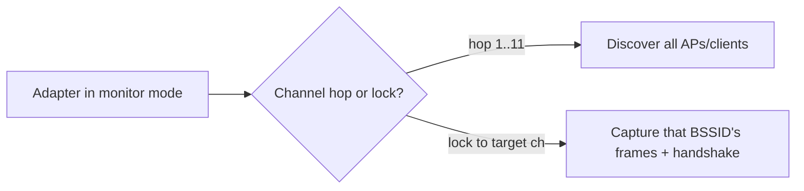
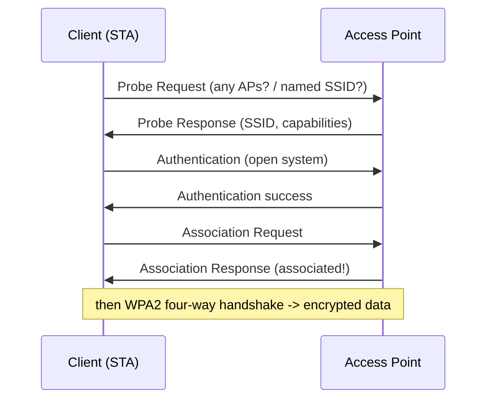

This is Chapter 22, the final chapter of the Networking track. We move off the wire and into the air. **Wi-Fi (IEEE 802.11)** replaces the Ethernet cable with radio, and that single change adds an enormous, invisible attack surface: anyone within radio range can *listen*, and — depending on the security — sometimes *join or hijack*. This chapter builds 802.11 from scratch (frames, channels, association, the WPA2 four-way handshake), teaches you **monitor mode** and wireless capture, and gives you the **network-analysis methodology** that underpins every Wi-Fi attack in the Pentest track. We stay foundational and lawful here — capturing and understanding — with the cracking and evil-twin offense saved for the dedicated Wireless track.

## Why Wireless Is a Different Beast

On wired Ethernet, an attacker needs physical access to a port or switch. On Wi-Fi, the medium is **broadcast radio** — every frame radiates in all directions, and any adapter in range can receive it, no cable required. That changes the security model completely:

- **Passive sniffing is trivial** — you can capture frames without ever connecting, just by listening on the right channel.
- **The perimeter is fuzzy** — your network extends into the parking lot, the next apartment, the street. Range *is* attack surface.
- **Availability is fragile** — radio can be jammed or flooded with deauthentication frames.
- **Association is contestable** — rogue access points and evil twins can lure clients to connect to the attacker.

Everything below flows from that one fact: **the air is a shared, unauthenticated medium until cryptography says otherwise.**

## 802.11 Basics: BSS, SSID, BSSID, and the Players

The vocabulary you must lock in:

| Term | Meaning |
|---|---|
| **AP (Access Point)** | The base station bridging wireless clients to the wired network |
| **Station (STA)** | A wireless client (laptop, phone) |
| **SSID** | The human-readable network *name* (e.g. "HomeWiFi") |
| **BSSID** | The AP's *MAC address* — uniquely identifies the AP |
| **BSS** | Basic Service Set — one AP and its clients |
| **ESS** | Extended Service Set — multiple APs sharing one SSID (roaming) |
| **Channel** | The specific frequency the AP operates on |
| **Beacon** | Frame the AP broadcasts ~10×/sec advertising the network |

So "HomeWiFi" is the **SSID** (the name), and the box in your hallway has a **BSSID** (its MAC). Multiple APs can share the same SSID (an office ESS) but each has a distinct BSSID — which is why attacks target the **BSSID**, not the name. "Hidden" SSIDs simply omit the name from beacons, but the network still transmits and is trivially discovered when a client connects (the SSID appears in association frames).

## Frequencies and Channels

Wi-Fi operates in unlicensed radio bands, divided into **channels**:

- **2.4 GHz** — channels 1–13 (region-dependent), longer range, more penetration, but crowded and overlapping. Only **channels 1, 6, 11** are non-overlapping (20 MHz wide in ~5 MHz spacing).
- **5 GHz** — many more non-overlapping channels, faster, shorter range, less interference.
- **6 GHz** — Wi-Fi 6E, newest, lots of clean spectrum.

Why channels matter for hacking: **a monitor-mode adapter listens to one channel at a time.** To capture a specific network you must be on *its* channel; to survey everything you **channel-hop**. Tools like `airodump-ng` hop automatically when scanning, then lock to a channel to capture a target. Getting the channel right is the difference between capturing a handshake and capturing nothing.



## The Three Frame Types

802.11 defines three categories of frame. Recognising them is the core of wireless analysis:

| Type | Purpose | Key subtypes (attack relevance) |
|---|---|---|
| **Management** | Establish/maintain the connection | Beacon, Probe Req/Resp, Auth, Assoc, **Deauth/Disassoc** |
| **Control** | Coordinate medium access | RTS/CTS, **ACK** |
| **Data** | Carry the actual payload (the IP packet) | encrypted under WPA2/3 |

**Management frames are the juicy ones** because, on classic WPA2, they are **unauthenticated** — including **Deauthentication** frames. That's the flaw behind the deauth attack: an attacker spoofs the AP's BSSID and sends deauth frames to a client, forcibly disconnecting it. Why do that? Because when the client **reconnects**, it performs the four-way handshake — and capturing that handshake is what enables offline WPA2 cracking. (WPA3 and 802.11w "Management Frame Protection" fix this by authenticating management frames.)

The 802.11 frame header is more complex than Ethernet — notably it has **up to four MAC address fields** (source, destination, transmitter, receiver/BSSID) because frames may pass through the AP, and a **type/subtype** field that Wireshark decodes for you.

## Association: How a Client Joins

Before any data flows, a station discovers and joins an AP:



1. **Probe** — the client asks "any networks here?" (or for a specific SSID); APs respond. This is why your phone leaks the names of networks it remembers — **probe requests** reveal a device's history, useful for tracking and evil-twin setup.
2. **Authentication** — with WPA2 this is "open system" (a formality; the real auth is the handshake).
3. **Association** — the client binds to the AP.
4. **Four-way handshake** — the WPA2/3 key exchange that derives encryption keys.

## Wi-Fi Security: WEP → WPA → WPA2 → WPA3

The security protocols, in order of evolution — you must know their status:

| Protocol | Crypto | Status |
|---|---|---|
| **WEP** | RC4 + weak IV | **Broken** — crackable in minutes; never use |
| **WPA** | TKIP | Deprecated, weak |
| **WPA2** | AES-CCMP | Standard for years; PSK crackable via captured handshake |
| **WPA3** | SAE (Dragonfly) | Current best; resists offline cracking, forward secrecy, MFP |

**WEP** is a historical disaster (IV reuse leaks the key; `aircrack-ng` breaks it trivially). **WPA2-Personal (PSK)** is still everywhere: its weakness is that the **four-way handshake can be captured** and the passphrase attacked *offline* with a wordlist/GPU — so a weak Wi-Fi password is the whole game. **WPA2-Enterprise** uses 802.1X/RADIUS (per-user creds, EAP) instead of a shared key. **WPA3** replaces the PSK exchange with **SAE**, which resists offline dictionary attacks even if captured, and mandates management-frame protection — a major step up.

## The WPA2 Four-Way Handshake (Why It's the Prize)

When a client joins a WPA2-PSK network, both sides already know the **PSK** (derived from the passphrase + SSID into the PMK). The four-way handshake proves each side knows it and derives fresh per-session keys — **without sending the password**:

```mermaid
sequenceDiagram
    participant AP as AP (Authenticator)
    participant C as Client (Supplicant)
    AP->>C: Msg1: ANonce (AP's random)
    C->>AP: Msg2: SNonce + MIC (client derives PTK)
    AP->>C: Msg3: install key + MIC
    C->>AP: Msg4: ACK
    Note over AP,C: PTK derived from PMK+ANonce+SNonce+MACs; data now encrypted
```

The attacker's angle: capturing messages 1–4 (especially the nonces and the MIC) gives everything needed to **brute-force the passphrase offline** — you try candidate passwords, derive the PTK, and check if the MIC matches. You never need to log in. This is why the workflow is always **capture handshake → crack offline**, and why deauth (to force a reconnect) is paired with capture. The math and cracking (`aircrack-ng`, `hashcat` mode 22000, PMKID attacks) live in the Wireless track; here you learn to *capture* it correctly.

## Monitor Mode & Packet Injection: The Enabling Capability

Normally a Wi-Fi adapter runs in **managed mode** — it only hears frames addressed to it, on the network it's joined to. To capture *all* frames in the air (including other networks' management frames), you switch the adapter to **monitor mode** (a.k.a. RFMON). Some adapters also support **packet injection** (sending crafted frames — needed for deauth/attacks). Not all chipsets support these; the classic supported ones are Atheros AR9271, Ralink RT3070, and Realtek RTL8812AU.

```bash
# Identify wireless interfaces
iw dev
airmon-ng                     # list adapters and chipsets

# Kill interfering processes, then enable monitor mode
sudo airmon-ng check kill
sudo airmon-ng start wlan0    # creates wlan0mon in monitor mode
iw dev wlan0mon info          # confirm "type monitor"

# (manual alternative)
sudo ip link set wlan0 down
sudo iw dev wlan0 set type monitor
sudo ip link set wlan0 up
```

Monitor mode is the wireless equivalent of a promiscuous NIC on Ethernet — it's what lets you *see the medium*. Everything downstream (surveying, capturing handshakes) requires it.

## Hands-On Lab: Survey and Capture (Lawful)

> **Lawful-use reminder** — Only capture/analyse networks **you own or are explicitly authorized to test.** Passively sniffing others' traffic and deauthing clients are illegal in most jurisdictions. Build a home lab: your own AP + a spare device.

### Step 1 — Survey the airspace with airodump-ng

```bash
sudo airodump-ng wlan0mon
```

```text
 BSSID              PWR  Beacons  #Data  CH  MB   ENC  CIPHER AUTH ESSID
 AA:BB:CC:11:22:33  -42     120     55   6   270  WPA2 CCMP   PSK  HomeWiFi
 DD:EE:FF:44:55:66  -70      88      3   11  130  WPA2 CCMP   PSK  Office5G

 BSSID              STATION            PWR   Rate   Frames  Probes
 AA:BB:CC:11:22:33  99:88:77:66:55:44  -48   1e-6e   210
```

Read it like a pro: **BSSID** (the AP MAC to target), **CH** (channel — you'll lock to it), **ENC/AUTH** (WPA2-PSK here), **ESSID** (name), **PWR** (signal strength — closer = stronger/less negative), and the lower table shows **associated STATIONs** (connected clients) and their **Probes** (remembered network names). This single screen is the map for any wireless engagement.

### Step 2 — Lock to a target and capture the handshake

```bash
# Focus on one BSSID + channel and write a capture file:
sudo airodump-ng --bssid AA:BB:CC:11:22:33 -c 6 -w capture wlan0mon
# Wait for a client to (re)connect. On your OWN network you can force it:
sudo aireplay-ng --deauth 3 -a AA:BB:CC:11:22:33 -c 99:88:77:66:55:44 wlan0mon
# When captured, airodump shows: "WPA handshake: AA:BB:CC:11:22:33"
```

The top-right of airodump will display **`WPA handshake:`** once messages 1–4 are captured into `capture.cap`. That file is what an offline cracker consumes — but capturing it (on your own AP) is the milestone this chapter targets.

### Step 3 — Verify and read the handshake in Wireshark

```bash
wireshark capture.cap &
# Filter to the EAPOL frames = the four-way handshake:
#   eapol
# You should see 4 "Key" messages (Msg1..Msg4) between AP and client.
```

Filter `eapol` and you'll see the four handshake messages; expand one to view the **ANonce/SNonce** and **MIC** — the exact fields from the handshake diagram. Filter `wlan.fc.type_subtype == 0x08` for beacons, or `wlan.fc.type_subtype == 0x0c` for deauth frames, to identify frame types by hand.

### Step 4 — tcpdump on wireless (CLI capture)

```bash
sudo tcpdump -i wlan0mon -w wifi.pcap
# Filter management frames only:
sudo tcpdump -i wlan0mon 'type mgt'
# Beacons:
sudo tcpdump -i wlan0mon 'type mgt subtype beacon'
```

## Wireless Attack Surface (Overview — Detail in the Wireless Track)

This methodology feeds a family of attacks you'll master later:

| Attack | Idea | Requires |
|---|---|---|
| **WEP cracking** | Exploit IV reuse | capture enough IVs |
| **WPA2 handshake crack** | Capture 4-way HS, brute offline | handshake + wordlist/GPU |
| **PMKID attack** | Grab PMKID from AP without a client (`hcxdumptool`) | no client needed |
| **Deauth DoS** | Spoofed deauth frames disconnect clients | injection (WPA2 only) |
| **Evil Twin / Rogue AP** | Clone SSID to lure clients (`wifiphisher`) | monitor + AP mode |
| **Karma / probe response** | Answer probe requests to trap devices | remembered SSIDs |
| **WPS attacks** | Brute the 8-digit WPS PIN (`reaver`) | WPS enabled |

Two themes: **capture-then-crack** (offline attacks on WPA2) and **rogue infrastructure** (evil twins luring clients). The methodology above (monitor mode → survey → lock → capture) is the front half of nearly all of them.

## Advanced: WPA3, Management Frame Protection & the 5/6 GHz Shift

- **WPA3-SAE** replaces the PSK four-way exchange with a password-authenticated key agreement (Dragonfly), so capturing the exchange doesn't enable offline cracking — the single biggest improvement. It also provides forward secrecy. Early WPA3 had side-channel flaws ("Dragonblood"), now largely patched.
- **802.11w (Management Frame Protection)** authenticates management frames, defeating classic deauth attacks. Mandatory in WPA3, optional in WPA2.
- **Transition mode** — networks running WPA2/WPA3 simultaneously for compatibility can be *downgraded* by an attacker to the weaker WPA2, undermining WPA3's benefits.
- **5/6 GHz** — more channels, less congestion, but shorter range; your monitoring must cover the right band, and older adapters may not support 5/6 GHz monitor mode. Choose your adapter deliberately.

## Common Pitfalls & How to Overcome Them

- **Wrong channel = empty capture.** You must be on the target's channel. Let airodump hop to find it, then `-c <channel>` to lock.
- **Adapter doesn't support monitor mode/injection.** Verify with `airmon-ng`/`iw`; use a known-good chipset (AR9271, RT3070, RTL8812AU). Onboard laptop cards often can't inject.
- **Interfering processes.** NetworkManager/wpa_supplicant fight monitor mode — `airmon-ng check kill` first (remember it drops your normal Wi-Fi).
- **No handshake captured.** You only catch it when a client (re)connects; be patient or (on your own network) deauth to force it. Verify with the `eapol` filter — a partial handshake won't crack.
- **Confusing SSID and BSSID.** Attacks target the **BSSID** (AP MAC) and channel, not the friendly name.
- **Deauthing real networks.** It's a DoS and illegal off your own gear. Lab only.

> **Memory hook** — **Monitor mode = hear the air. Survey (airodump) → lock to BSSID+channel → capture the four-way handshake (EAPOL) → crack offline.** WPA2's weakness is the *capturable* handshake; WPA3 (SAE + MFP) closes it.

## Real-World Application & Case Studies

- **KRACK (2017, CVE-2017-13077…)** — a flaw in the WPA2 four-way handshake itself (key reinstallation) let attackers decrypt traffic without the password; patched in clients/APs and a driver for WPA3.
- **WEP everywhere (2000s)** — the TJX breach (2007), one of the largest card thefts of its era, began with cracked **WEP** Wi-Fi in stores; the reason WEP is dead.
- **Wardriving & wireless recon** — mapping APs by driving/walking with a GPS + monitor adapter (Kismet, WiGLE) remains a real recon and red-team technique.
- **Corporate rogue APs** — employees plugging in personal APs, or attackers dropping evil twins, are common findings that bypass the wired perimeter entirely.
- **PMKID attack (2018)** — showed WPA2 handshakes could be grabbed from the AP *without any client*, simplifying attacks.

> **Bug Bounty Angle** — Wireless is out of scope for almost all *remote* web bounties (you're not near the AP), but it's central to **on-site/physical red-team engagements** and **IoT/hardware programs**, where a weak WPA2 passphrase, WPS enabled, an open guest network bridged to corporate, or a device that auto-joins a spoofed SSID are concrete, reportable findings. In IoT scopes, smart devices that connect over WEP/WPA2 with hardcoded or weak keys, or that leak credentials during association, pay out. The transferable, in-demand skill is the **capture-then-crack** and **evil-twin** methodology for authorized wireless assessments. For web-only programs, wireless simply isn't the surface — keep it for network/physical scopes and note Wi-Fi as an initial-access path in reports.

> **CTF Angle** — Wireless appears in **forensics** ("a Wi-Fi capture is attached — recover the flag/password"): open the `.cap` in Wireshark, filter `eapol` to find the four-way handshake, then crack it with `aircrack-ng -w rockyou.txt capture.cap` to get the passphrase (often the flag), or decrypt the traffic once you have the key (Wireshark → 802.11 decryption keys) to read the data frames. Other tasks: identify the hidden SSID from association frames, or find a device's probe history. Reflexes: `aircrack-ng`, `tshark -Y eapol`, and Wireshark's WPA decryption. Practice: picoCTF/HTB forensics with `.cap` files, TryHackMe "Wifi Hacking 101" and "Wireshark" rooms, and the Aircrack-ng test captures.

## Detection & Defense: Blue-Team Wireless

- **Use WPA3** (or WPA2 with a **long, random passphrase** — 15+ chars defeats offline cracking) and enable **802.11w Management Frame Protection** to stop deauth attacks.
- **Disable WPS** (PIN brute-forceable) and hidden-SSID "security theatre" (it doesn't hide the network from tools).
- **Deploy a WIDS/WIPS** (Wireless IDS/IPS) — sensors that detect rogue APs, evil twins, deauth floods, and unusual clients. Enterprise controllers (Cisco, Aruba) include this.
- **Segment wireless** — put guest/IoT Wi-Fi on isolated VLANs that can't reach corporate (Chapter 14/21); never bridge guest to internal.
- **Use WPA2/3-Enterprise (802.1X/EAP)** for corporate networks — per-user credentials and certificates instead of a shared PSK, so one leaked password ≠ whole-network compromise.
- **Monitor for the signatures** — a flood of deauth frames, a second AP broadcasting your SSID (evil twin), or unexpected BSSIDs are the tells a WIPS alerts on.

Defence mirrors offence: because the medium is open, protection is **strong crypto (WPA3/long PSK/Enterprise) + management-frame protection + segmentation + wireless monitoring** for rogue infrastructure.

## Final Revision / Summary

- Wi-Fi (**802.11**) is broadcast radio — the medium is shared and passively sniffable; range is attack surface.
- Vocabulary: **SSID** (name) vs **BSSID** (AP MAC — the real target) vs **channel** (frequency you must match). Beacons advertise the network.
- **Three frame types**: **Management** (beacon, probe, auth, assoc, **deauth** — unauthenticated on WPA2), **Control** (ACK/RTS/CTS), **Data** (encrypted payload).
- Security evolution: **WEP (broken) → WPA (weak) → WPA2-AES (handshake crackable offline) → WPA3-SAE (resists offline cracking + MFP)**. WPA2-PSK's weakness is a weak passphrase + capturable handshake.
- The **WPA2 four-way handshake** (ANonce/SNonce/MIC) is the prize: capture it (force a reconnect via deauth on your own net) → crack the passphrase **offline**. Never need to log in.
- **Monitor mode** (+ injection) is the enabling capability. Methodology: **monitor → survey (airodump-ng) → lock BSSID+channel → capture EAPOL handshake → (offline crack)**.
- Defence: **WPA3 / long PSK / 802.1X-Enterprise + 802.11w MFP + disable WPS + segment guest/IoT + WIDS/WIPS**.
- Tools: `airmon-ng` (monitor mode), `airodump-ng` (survey/capture), `aireplay-ng` (deauth), Wireshark/`tshark` (`eapol`, frame filters), `tcpdump` (`type mgt`).

## Cheat Sheet / Quick Reference

```bash
# MONITOR MODE
iw dev ; airmon-ng                          # list adapters/chipsets
sudo airmon-ng check kill                   # stop interfering services
sudo airmon-ng start wlan0                  # -> wlan0mon (monitor)
iw dev wlan0mon info                        # confirm type monitor

# SURVEY + CAPTURE (authorized/own network)
sudo airodump-ng wlan0mon                                   # discover all
sudo airodump-ng --bssid <AP_MAC> -c <chan> -w cap wlan0mon # target capture
sudo aireplay-ng --deauth 3 -a <AP_MAC> -c <STA_MAC> wlan0mon # force reconnect (own net)

# ANALYSE
wireshark cap.cap        # filter: eapol (4-way HS), beacon, deauth
tshark -r cap.cap -Y eapol
sudo tcpdump -i wlan0mon 'type mgt subtype beacon'

# (offline crack - Wireless track)
aircrack-ng -w rockyou.txt cap.cap
```

```text
SSID=name | BSSID=AP MAC (target) | CH=channel (must match) | STA=client
FRAMES: Management(beacon/probe/auth/assoc/DEAUTH) | Control(ACK/RTS/CTS) | Data(enc)
SECURITY: WEP=broken | WPA=weak | WPA2-AES=HS crackable offline | WPA3-SAE=resists+MFP
BANDS: 2.4GHz non-overlap ch 1/6/11 | 5GHz many ch | 6GHz (Wi-Fi 6E)
FLOW: monitor -> survey -> lock BSSID+ch -> capture EAPOL -> crack offline
DEFENCE: WPA3/long-PSK/802.1X + 802.11w MFP + no WPS + segment + WIPS
```

## Practice Labs & Resources

- **TryHackMe — "Wifi Hacking 101", "Intro to Wi-Fi"** and **HackTheBox wireless/forensics challenges**: capture and analyse handshakes hands-on.
- **Aircrack-ng test captures & wiki**: official sample `.cap` files to practise reading the four-way handshake and cracking on your own machine.
- **Kismet & WiGLE**: wardriving/wireless survey tooling and the global AP database.
- **picoCTF / HTB forensics `.cap` challenges**: recover Wi-Fi passwords and decrypt traffic from captures.
- **A supported adapter** (Alfa AWUS036NHA/AR9271 or RTL8812AU) + your own AP: build a legal home lab — the only right way to practise capture/injection.
- **Exercise** — on your own network: enable monitor mode, survey with airodump, lock to your AP's BSSID/channel, capture the four-way handshake (deauth a device you own to force it), verify it in Wireshark with the `eapol` filter, then crack it with a wordlist you control. Doing the full loop once makes wireless click.

That closes the Networking track. You now understand how data is built, addressed, moved, resolved, secured and inspected — from a single bit on a wire to a WPA2 handshake in the air. Every offensive and defensive technique ahead — scanning, web attacks, AD, wireless, cloud — stands on this foundation. The next track builds directly on it: **Windows internals and Active Directory**, where these networking concepts meet the enterprise environments you'll spend most engagements inside.
